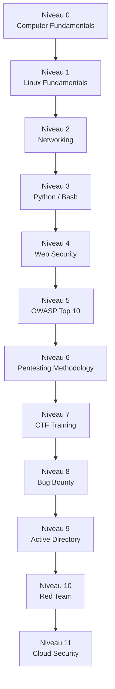

# CyberAcademy — Catalogue des cours

> **Source pédagogique :** *The Book of Secret Knowledge* (trimstray, MIT, 237k★)
> — collection de ~1 500 ressources : outils CLI/GUI/Web, cheatsheets, one-liners,
> manuels, blogs, labos et plateformes CTF.
>
> Ce document transforme cette collection brute en un **curriculum structuré**
> aligné sur la roadmap CyberAcademy (12 niveaux, 0 → 11). Chaque cours est
> **100 % original** : les ressources du livre servent de point de départ
> (outils, commandes, concepts) mais toute la pédagogie, les explications,
> les démonstrations, les labos et les quiz sont réécrits pour un public débutant.

---

## 1. Comment le livre est utilisé

Le livre est organisé en 15 chapitres. Voici comment chacun nourrit le curriculum :

| Chapitre du livre | Contenu    | Utilisé par les niveaux |
| ----------------- | ---------- | ----------------------- |
| CLI Tools         | Shells, éditeurs, network, DNS, HTTP, SSL, diagnostics | 0, 1, 2, 4 |
| GUI Tools         | Terminaux, navigateurs, password managers | 0, 4, 8 |
| Web Tools         | Linters HTTP, encoders, scanners, CVE databases | 4, 5, 8 |
| Systems/Services  | Serveurs HTTP/DNS, hardening | 6, 11 |
| Networks          | Outils et cartographie | 2, 6 |
| Containers/Orchestration | Docker/K8s, labs | 10, 11 |
| Manuals/Howtos    | Tutoriels *nix, Windows, hardening | 1, 5, 6, 9, 11 |
| Inspiring Lists   | Ressources pentest, dev, sysadmin | 6, 7, 8 |
| Blogs/Podcasts/Videos | Chaînes, comptes, podcasts | 7, 8, 10 |
| Hacking / Penetration Testing | Arsenal pentester, wordlists, bounty, labs, CTF | 5, 6, 7, 8, 9, 10 |
| Daily knowledge & news | RSS, IRC | 7, 8 |
| Other Cheat Sheets | Fiches diverses | 1, 2, 4 |
| Shell One-liners   | 50+ outils avec exemples concrets | 1, 2, 3, 4, 6 |
| Shell Tricks       | Astuces de terminal | 1, 3 |
| Shell Functions    | Fonctions Bash réutilisables | 3 |

---

## 2. Roadmap — Vue d'ensemble



---

## 3. Les 12 cours — Fiche récapitulative

| Niv. | Cours | XP | Temps estimé | Prérequis | Badge |
| ---- | ----- | -- | ------------ | --------- | ----- |
| 0 | Computer Fundamentals | 500 | 6 h | Aucun | 🧩 Pionnier |
| 1 | Linux Fundamentals | 750 | 10 h | Niveau 0 | 🐚 Shell Master |
| 2 | Networking | 750 | 10 h | Niveau 1 | 🌐 Routeur |
| 3 | Python / Bash pour la cybersécurité | 1000 | 12 h | Niveau 1 | ⚙️ Automate |
| 4 | Web Security | 1000 | 12 h | Niveaux 1-2 | 🕸️ Arachnide |
| 5 | OWASP Top 10 | 1250 | 14 h | Niveau 4 | 🛡️ Décrypteur |
| 6 | Pentesting Methodology | 1500 | 18 h | Niveaux 1-5 | 🔍 Limier |
| 7 | CTF Training | 1500 | 16 h | Niveaux 3-6 | 🚩 Flag Hunter |
| 8 | Bug Bounty | 1250 | 14 h | Niveaux 4-6 | 💰 Chasseur |
| 9 | Active Directory | 1750 | 20 h | Niveaux 1, 6 | 👑 Domain Master |
| 10 | Red Team | 2000 | 22 h | Niveaux 6, 9 | 🎭 Fantôme |
| 11 | Cloud Security | 2000 | 22 h | Niveaux 6, 10 | ☁️ Cloudbreaker |

**Total : 15 250 XP · ~176 h · badge final « Archi-Cyber »**

---

## 4. Le template de cours (16 sections)

Chaque cours doit suivre exactement cette structure. C'est le contrat qualité
de CyberAcademy. Un résumé des consignes :

| # | Section | Contenu obligatoire |
| - | ------- | ------------------- |
| 1 | **Présentation** | Pourquoi apprendre, importance, où c'est utilisé, métiers, prérequis, temps, niveau |
| 2 | **Objectifs** | 4-6 objectifs « À la fin de ce cours, tu seras capable de… » |
| 3 | **Vue d'ensemble** | Roadmap visuelle (Mermaid) du parcours interne |
| 4 | **Théorie** | Chaque notion : Définition → Pourquoi → Historique → Fonctionnement → Cas d'usage → Exemple réel → Bonnes pratiques → Résumé |
| 5 | **Visualisation** | Schémas ASCII, Mermaid, tableaux comparatifs, chronologies |
| 6 | **Démonstration** | 3+ démos : Contexte, Objectif, Commande, Explication ligne par ligne, Résultat attendu, Analyse, Erreurs fréquentes, Correction |
| 7 | **Cas réels** | 2+ scénarios « Tu es recruté comme pentester… » |
| 8 | **Laboratoires** | 2+ TP : Objectif, Environnement, Étapes, Indices, Correction, Explications |
| 9 | **Mini Challenges** | 3 défis progressifs (Facile/Moyen/Difficile) : Objectif, Indice 1/2/3, Correction |
| 10 | **Quiz** | 20 QCM + 10 Vrai/Faux + 10 ouvertes + 5 exercices, tous corrigés et expliqués |
| 11 | **Cheat Sheet** | Toutes commandes/options/raccourcis/pièges/astuces |
| 12 | **Pièges fréquents** | Erreurs de débutants : pourquoi elles arrivent, comment les éviter |
| 13 | **Conseils professionnels** | Pratiques de terrain des pentesters |
| 14 | **Résumé** | Synthèse claire et visuelle |
| 15 | **Progression** | Ce qui est maîtrisé + roadmap de la suite |
| 16 | **Gamification** | XP, badge, succès, niveau débloqué, temps, compétences |

**Règles pédagogiques transverses :**
- Public débutant : définir chaque acronyme à la première occurrence.
- Une analogie par notion ; expliquer le POURQUOI avant le COMMENT.
- Toute commande présentée doit être réelle et vérifiée (aucune invention).
- Mentionner systématiquement le cadre légal (autorisations, labs isolés).
- Ajouter un `> ⚠️ Légal` encart dans chaque section pratique.

---

## 5. Mapping détaillé livre → cours

### Niveau 0 — Computer Fundamentals
- **Outils :** shells, gestionnaires de fichiers (ranger, nnn, mc), éditeurs (vim, micro), `ls`, `find`, `chmod`, `ps`, `who`, `last`, `du`, `screen`.
- **Concepts :** ordinateur, OS, système de fichiers, inodes, processus, permissions, umask, setuid.
- **Sections du livre :** CLI Tools (Shells, Managers, Text editors, Files & directories, System Diagnostics), Shell One-liners (`ps`, `chmod`, `who`, `last`, `du`), Other Cheat Sheets.

### Niveau 1 — Linux Fundamentals
- **Outils :** `bash`/`zsh`, `tmux`, `screen`, `vim`, `grep`, `sed`, `awk`, `find`, `tar`, `strace`, `lsof`, `fuser`, `top`, `vmstat`, `iostat`, `diff`, `tail`.
- **Sections du livre :** CLI Tools (Shells, Shell plugins, Managers, Text editors, Files & directories), Shell One-liners (terminal, busybox, mount, fuser, lsof, ps, find, top, vmstat, iostat, kill, diff, tail, tar, chmod, who, last, screen, script, du, grep, sed, awk), Shell Tricks, Shell Functions.

### Niveau 2 — Networking
- **Outils :** `ping`, `mtr`, `traceroute`, `nmap`, `netcat`, `hping3`, `tcpdump`, `tshark`, `ngrep`, `dig`, `host`, `openssl`, `socat`, `iperf3`, `mosh`, `PuTTY`.
- **Concepts :** OSI, TCP/IP, TCP vs UDP, handshake, ports, DNS, enregistrements DNS, HTTP de base.
- **Sections du livre :** CLI Tools (Network, Network DNS, Network HTTP, SSL), GUI Tools (Network), Systems/Services (DNS, HTTP), Shell One-liners (tcpdump, tcpick, ngrep, hping3, host, dig, netstat, openssl, network-other).

### Niveau 3 — Python / Bash pour la cybersécurité
- **Outils/langages :** Python (`socket`, `requests`, `re`, `subprocess`), Bash (variables, boucles, conditions), `curl`, `httpie`, `git`, `awk`, `sed`.
- **Sections du livre :** Shell One-liners (python, curl, httpie, git, awk, sed, grep, perl), Manuals (Python, Sed & Awk & Other, Shell/Command line), Shell Functions.

### Niveau 4 — Web Security
- **Outils :** `curl`, `httpie`, `gobuster`, `openssl`, `testssl.sh`, proxies (Burp, ZAP), `nmap --script`, encodeurs.
- **Concepts :** HTTP requêtes/réponses, méthodes, codes, en-têtes, sessions, cookies, HTTPS/TLS, premier fuzzing.
- **Sections du livre :** CLI Tools (Network HTTP, SSL), Web Tools (HTTP Headers & Web Linters, Encoders/Decoders, SSL/Security, Net-tools), Systems/Services (HTTP(s) Services), Shell One-liners (curl, openssl, certbot, gnutls-cli).

### Niveau 5 — OWASP Top 10
- **Failles :** A01 Broken Access Control, A02 Cryptographic Failures, A03 Injection (SQLi), A04 Insecure Design, A05 Security Misconfiguration, A06 Vulnerable Components, A07 ID/Auth failures, A08 Software & Data Integrity, A09 Logging failures, A10 SSRF.
- **Outils :** `sqlmap`, Burp Suite, DVWA, OWASP Juice Shop, `dirsearch`, `gobuster`.
- **Sections du livre :** Manuals (Web Apps, Security & Privacy), Web Tools, Inspiring Lists (Security/Pentesting), Hacking/PT (Web Training Apps).

### Niveau 6 — Pentesting Methodology
- **Méthode :** Pre-engagement → Recon → Scanning → Exploitation → Post-exploitation → Reporting.
- **Outils :** `nmap`, `masscan`, `RustScan`, `gobuster`, `hydra`, `john`, `hashcat`, `Metasploit`, `netcat`, `socat`, `sqlmap`, wordlists (SecLists, rockyou).
- **Sections du livre :** Hacking/PT (Pentesters arsenal, Pentests bookmarks, Wordlists, Backdoors/exploits), Shell One-liners (nmap, netcat, hping3, metasploit…), Inspiring Lists (Security/Pentesting).

### Niveau 7 — CTF Training
- **Catégories :** Web, Crypto, Pwn, Reverse, Forensics, OSINT, Misc.
- **Outils :** `gobuster`, `strings`, `binwalk`, `steghide`, `john`, `hashcat`, `CyberChef`, `tcpdump`, `pwn` (pwntools), plateformes (HackTheBox, TryHackMe, Root-Me, CTFd).
- **Sections du livre :** Hacking/PT (CTF platforms, Labs, Web Training Apps, Other resources), Inspiring Lists (Security/Pentesting), Blogs/Videos (chaînes CTF).

### Niveau 8 — Bug Bounty
- **Méthode :** scope, recon, automatisation, reporting, divulgation responsable.
- **Outils :** `subfinder`, `amass`, `nuclei`, `ffuf`, `Burp Suite`, `git` recon, CVE databases.
- **Sections du livre :** Hacking/PT (Bounty platforms, Wordlists), Web Tools (CVE/Exploits databases, Private Search Engines), Inspiring Lists (Developers, Security/Pentesting), Blogs/Videos.

### Niveau 9 — Active Directory
- **Concepts :** domaine, OU, GPO, Kerberos, NTLM, tickets TGT/TGS, Kerberoasting, AS-REP Roasting, Pass-the-Hash, Pass-the-Ticket, DCSync, LLMNR poisoning, BloodHound, Mimikatz, impacket, crackmapexec.
- **Sections du livre :** Manuals (Microsoft, \*nix & Network), CLI Tools (impacket, ssh-audit), Hacking/PT (Pentesters arsenal), Inspiring Lists (Security/Pentesting).

### Niveau 10 — Red Team
- **Concepts :** cycle complet, évasion (AV/EDR), phishing, C2 (Cobalt Strike, Sliver), tunneling, persistence, exfiltration, TOR/anonymisation.
- **Sections du livre :** Hacking/PT (Backdoors/exploits), CLI Tools (TOR), Containers/Orchestration (hardening, labs), Manuals (System hardening, Large-scale systems), Blogs/Videos (Geeky cybersecurity).

### Niveau 11 — Cloud Security
- **Concepts :** IAM, roles, buckets S3, SSRF vers metadata, container escape, K8s, serverless, secrets management, misconfigurations.
- **Outils :** `aws cli`, `scoutsuite`, `prowler`, `kube-hunter`, `trivy`, `grype`, `docker`, `kubectl`.
- **Sections du livre :** Containers/Orchestration, Manuals (Large-scale systems, System hardening), Security/hardening lists, Web Tools.

---

## 6. Conventions de gamification

| Concept | Règle |
| ------- | ----- |
| **XP par cours** | Cours complet terminé (quiz ≥ 80 %) = XP du tableau §3 |
| **XP bonus** | Mini challenge résolu sans indice : +50 XP · Lab réussi sans correction : +100 XP |
| **Badge** | Un badge par niveau (§3) + badge « Archi-Cyber » pour les 12 |
| **Succès** | Exemples : « Premier pipe », « Première escalade », « 100 flags », « Zero help » |
| **Niveau débloqué** | Un niveau se débloque quand le précédent est validé (ou test de positionnement ≥ 80 %) |

---

## 7. Répertoire des fichiers

```
docs/cours/
├── 00-CATALOGUE.md          ← ce document
├── 01-niveau-0-computer-fundamentals.md
├── 02-niveau-1-linux-fundamentals.md
├── 03-niveau-2-networking.md
├── 04-niveau-3-python-bash.md
├── 05-niveau-4-web-security.md
├── 06-niveau-5-owasp-top-10.md
├── 07-niveau-6-pentesting-methodology.md
├── 08-niveau-7-ctf-training.md
├── 09-niveau-8-bug-bounty.md
├── 10-niveau-9-active-directory.md
├── 11-niveau-10-red-team.md
└── 12-niveau-11-cloud-security.md
```

---

## 8. Notes de qualité

1. **Exactitude :** chaque commande est vérifiable ; les options citées existent réellement.
2. **Originalité :** aucune phrase ni structure copiée du livre ; les informations sont **réécrites** et **réorganisées**.
3. **Progression :** chaque niveau s'appuie sur les acquis du précédent.
4. **Sécurité légale :** chaque niveau pratique rappelle le cadre (autorisation, labs isolés, plateformes légales).
5. **Accessibilité :** définir les acronymes, analogies, tableaux, schémas Mermaid.
