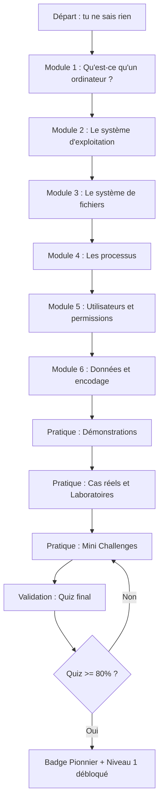
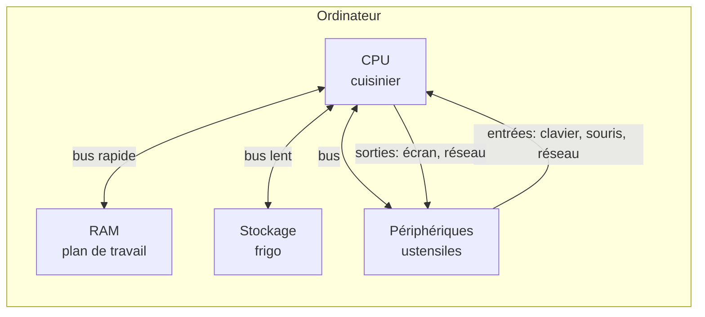

# Présentation

> **Niveau 0 · Débutant absolu · Aucun prérequis · ~6 h · 500 XP · Badge 🧩 Pionnier**

Bienvenue sur CyberAcademy ! Ce cours est ton tout premier pas dans la
cybersécurité. On y construit les **fondations** : comprendre ce qu'est un
ordinateur, ce que fait un système d'exploitation, comment les fichiers sont
organisés, comment les processus vivent et meurent, comment les permissions
protègent les données, comment les données sont représentées en machine.

Si tu sais allumer une machine, c'est suffisant. Tout le reste est expliqué
mot par mot, avec des analogies et des exercices guidés.

---

## Pourquoi apprendre ce sujet ? (récit motivant)

Imagine un matin : on te donne un poste de travail et on te dit « Voici ta
machine, tu es responsable de sa sécurité. » Tu ouvres le terminal : un écran
noir, un curseur qui clignote. Que fais-tu ?

C'est le scénario vécu par Léa, technicienne support. Le premier jour, elle ne
savait pas la différence entre un fichier et un dossier. Son premier geste a
été de taper `ls`, juste pour voir. Rien de spectaculaire : juste une liste de
fichiers. Et pourtant, ce petit `ls` fut la première brique d'une longue
carrière.

Aujourd'hui Léa est **pentesteuse** (experte en tests d'intrusion) et gagne sa
vie à chercher les failles des systèmes... avec les mêmes commandes de base
que tu vas apprendre ici. La différence entre un débutant et un expert n'est
pas un don magique : c'est le nombre de **fondations solides** posées au
début.

La cybersécurité, c'est 90 % de compréhension du système et 10 % d'outils.
Sans comprendre comment l'ordinateur range ses données, exécute un programme,
ou décide qui a le droit de faire quoi, tu serais un mécanicien qui veut
réparer un moteur sans savoir ce qu'est un piston.

> 🎯 Après ce cours, tu ne seras pas encore un hacker. Tu seras quelqu'un qui
> **comprend** ce qu'il fait. C'est par là que commence toute carrière en
> cybersécurité.

### Pourquoi est-il important ?

| Raison | Explication |
| ------ | ----------- |
| **Fondation de tout** | Attaques, tests d'intrusion et défense reposent sur la compréhension du système cible. |
| **Le terminal est ton outil** | Tous les outils de pentest s'utilisent en ligne de commande. |
| **Comprendre pour protéger** | Une permission mal réglée, un fichier égaré, un processus oublié : causes n°1 d'incidents réels. |
| **Vocabulaire commun** | Les cours suivants (Linux, réseaux, web, pentest) utilisent les mots appris ici : processus, inode, permission, encodage, PID. |
| **Sécurité personnelle** | Comprendre ta machine te rend plus difficile à piéger. |

### Où est-il utilisé ?

- **Les serveurs du monde** : la majorité des serveurs internet tournent sous
  Linux.
- **Le cloud** : machines virtuelles et conteneurs reposent sur les mêmes
  fichiers, processus et permissions.
- **Les téléphones** : Android utilise le noyau Linux ; iOS s'appuie sur des
  concepts Unix.
- **Les objets connectés** : routeurs, caméras, box TV embarquées en Linux.
- **Les labos de sécurité** : TryHackMe, HackTheBox, Root-Me te donnent des
  machines Linux à apprivoiser avec `ls`, `cd`, `cat`, `chmod`...
- **Ton ordinateur** : même sous Windows ou macOS, ces concepts t'aident
  (macOS est un Unix déguisé).

### Quels métiers utilisent ces compétences ?

| Métier | Usage |
| ------ | ----- |
| **Technicien support** | Diagnostiquer, gérer comptes, permissions et fichiers. |
| **Admin système (sysadmin)** | Installer et maintenir serveurs, processus, utilisateurs, droits. |
| **Admin sécurité (Blue Team)** | Auditer permissions et fichiers, surveiller les processus. |
| **Pentester (Red Team)** | Exploiter les mauvaises configurations, escalader les privilèges. |
| **Forensique** | Analyser des disques, reconstituer des fichiers, lire les métadonnées. |
| **Développeur / Cloud** | Déployer du code, gérer accès et environnements. |

### Prérequis

| Prérequis | Requis ? | Détail |
| --------- | -------- | ------ |
| Connaissances techniques | Non | Zéro. On part de rien. |
| Savoir allumer un ordinateur | Oui | Tu sais déjà le faire. |
| Un terminal Linux | Recommandé | Linux, macOS, ou machine virtuelle (VirtualBox + Ubuntu). |
| Curiosité | Oui | Le prérequis le plus important ! |

> 💡 **Pour pratiquer sous Windows** : installe une machine virtuelle Linux
> (VirtualBox + Ubuntu) ou le Sous-système Windows pour Linux (WSL).

### Temps estimé

| Activité | Durée |
| -------- | ----- |
| Théorie | 1 h 30 |
| Visualisation | 30 min |
| Démonstrations | 1 h |
| Cas réels | 30 min |
| Laboratoires | 1 h |
| Mini challenges | 45 min |
| Quiz | 45 min |
| **Total** | **~6 h** |

### Niveau

| Caractéristique | Valeur |
| --------------- | ------ |
| Niveau | **0 — Fondations** |
| Difficulté | ⭐☆☆☆☆ (très accessible) |
| Placement | Premier cours de la roadmap (niveaux 0 à 11) |
| Badge obtenu | 🧩 Pionnier |
| XP gagnés | 500 |

---

## Objectifs pédagogiques

À la fin de ce cours, tu seras capable de :

1. **Expliquer** ce qu'est un ordinateur en décrivant ses 4 briques (CPU, RAM,
   stockage, périphériques) et le rôle de chacune, avec l'analogie de la
   cuisine.
2. **Décrire** le rôle d'un système d'exploitation (OS), la différence entre
   noyau et espace utilisateur, et citer des exemples (Linux, Windows, macOS,
   Android, iOS).
3. **Naviguer** dans un système de fichiers Unix (`ls`, `cd`, `pwd`) et
   comprendre la hiérarchie depuis la racine `/`.
4. **Créer, lire, copier, déplacer et supprimer** fichiers et répertoires
   (`touch`, `cat`, `cp`, `mv`, `rm`, `mkdir`).
5. **Expliquer** ce qu'est un processus (PID, cycle de vie, fork/exec, démons)
   et afficher les processus avec `ps`.
6. **Lire et modifier** les permissions Unix (`ls -l`, `chmod`), en comprenant
   le système octale (4-2-1), l'umask et le setuid.
7. **Expliquer** la représentation des données (binaire, hexadécimal, ASCII,
   UTF-8) et décoder une petite information binaire.

---

## Vue d'ensemble

### Roadmap interne du cours



### Tableau des modules

| # | Module | Contenu clé | Durée |
| - | ------ | ----------- | ----- |
| 1 | L'ordinateur | CPU, RAM, stockage, périphériques, analogie cuisine | 30 min |
| 2 | Le système d'exploitation | Rôle, noyau vs espace utilisateur, historique | 30 min |
| 3 | Le système de fichiers | Hiérarchie `/`, inodes, liens, métadonnées | 40 min |
| 4 | Les processus | PID, fork/exec, démons, cycle de vie | 30 min |
| 5 | Utilisateurs et permissions | rwx, octal, umask, setuid, chmod/chown | 40 min |
| 6 | Données et encodage | Binaire, hexadécimal, ASCII, UTF-8 | 30 min |

---

## Théorie

> 🔎 Chaque notion suit la même trame : **Définition** → **Pourquoi** →
> **Historique** → **Fonctionnement interne** → **Architecture** → **Cas
> d'utilisation** → **Exemple réel** → **Bonnes pratiques** → **Résumé**.

### Qu'est-ce qu'un ordinateur ?

#### Définition

Un **ordinateur** est une machine électronique qui exécute des **instructions**
(des ordres simples et précis) pour manipuler des **données** (textes,
nombres, images, sons...). Il a quatre briques fondamentales :

| Brique | Acronyme | Rôle |
| ------ | -------- | ---- |
| **CPU** | *Central Processing Unit* (unité centrale de traitement) | Le « cerveau » : exécute les instructions, fait les calculs. |
| **RAM** | *Random Access Memory* (mémoire à accès aléatoire) | Mémoire de travail rapide et volatile (perdue à l'extinction). |
| **Stockage** | Disque dur (HDD) ou SSD (*Solid State Drive*) | Mémoire permanente : les données survivent à l'extinction. |
| **Périphériques** | Entrées / sorties (I/O, *Input/Output*) | Écran, clavier, souris, carte réseau : interfaces avec le monde. |

#### 🍳 Analogie : l'ordinateur est une cuisine

| Pièce de cuisine | Brique | Explication |
| ---------------- | ------ | ----------- |
| Le **cuisinier** | **CPU** | Il lit la recette, coupe, mélange : il exécute les étapes. |
| Le **plan de travail** | **RAM** | Espace de travail rapide, mais tout disparaît à la fermeture. |
| Le **frigo / placards** | **Stockage** | On y range durablement ; c'est plus lent à sortir mais ça reste. |
| **Ustensiles + sonnette** | **Périphériques** | Clavier (entrée), écran (sortie) : les outils et entrées/sorties. |

#### Pourquoi

Comprendre ces 4 briques explique **pourquoi un ordinateur est lent** et **où
se trouvent les données** — donc **où se cachent les failles**. En sécurité,
on s'intéresse à la RAM, au stockage et au réseau : c'est là que vivent les
données sensibles.

#### Historique

- **1945** : ENIAC, l'un des premiers ordinateurs électroniques, remplit une
  pièce entière.
- **1947** : invention du **transistor**, interrupteur électronique qui
  remplace les tubes à vide.
- **1971** : le **microprocesseur** (Intel 4004) tient la CPU sur une puce.
- **1975-1980** : premiers ordinateurs personnels (Altair 8800, Apple II,
  IBM PC).

#### Fonctionnement interne

La CPU répète le **cycle d'instruction** :

```
1. FETCH  (chercher la prochaine instruction en mémoire)
2. DECODE  (comprendre ce qu'elle demande)
3. EXECUTE (l'exécuter : calcul, lecture, écriture...)
4. STORE   (ranger le résultat) → retour en 1
```

Chaque instruction est élémentaire. Le génie de l'ordinateur, c'est la
**vitesse** : des milliards de cycles par seconde (GHz). Un programme
« compliqué » n'est qu'une suite de milliards de micro-instructions.

La RAM stocke les programmes en cours et leurs données ; elle est « à accès
aléatoire » car on lit n'importe quelle case directement. Le disque conserve
les données de façon **persistante** (elles survivent à la coupure de
courant).

#### Architecture

```
        ┌───────────────┐
        │     CPU       │  (cerveau : calcule, exécute)
        └──────┬────────┘
               │  bus (canal de données)
      ┌────────┼───────────────┐
      │        │               │
┌─────┴────┐ ┌─┴───────────┐ ┌─┴──────────┐
│   RAM    │ │  Stockage   │ │Périphériques│
│(rapide,  │ │(lent,       │ │(entrées/    │
│ volatile)│ │ permanent)  │ │ sorties)    │
└──────────┘ └─────────────┘ └────────────┘
```

Le **bus** relie tout. Règle de la hiérarchie des mémoires : plus c'est
rapide, plus c'est cher et plus c'est petit (CPU > RAM > disque).

#### Cas d'utilisation

- Ouvrir un navigateur : le programme passe du disque à la RAM, la CPU
  exécute, l'écran affiche.
- Un jeu : la CPU calcule, la RAM contient la scène, le disque charge les
  décors, la carte graphique affiche.
- Un serveur web : il lit les fichiers demandés sur le disque et les envoie
  via la carte réseau.

#### Exemple réel

Tu tapes `cat /etc/hostname`. Le terminal envoie l'ordre à la CPU, `cat` est
chargé du disque vers la RAM, la CPU lit le fichier, l'écran affiche. Quatre
briques mobilisées en quelques millisecondes.

#### Bonnes pratiques

- Ne pas remplir un disque à 100 % : le système ralentit.
- Fermer les programmes inutilisés pour libérer la RAM.
- Éteindre proprement sa machine pour éviter de corrompre le stockage.

#### Résumé

Un ordinateur = CPU (cerveau) + RAM (plan de travail) + stockage (frigo) +
périphériques (ustensiles), reliés par un bus, qui exécutent des instructions
à grande vitesse.

---

### Le système d'exploitation (OS)

#### Définition

Le **système d'exploitation** (*Operating System*, **OS**) est le programme
« chef d'orchestre » qui démarre au lancement de l'ordinateur et reste actif
en permanence. Il gère le matériel et fournit aux programmes des services
standardisés. Il est composé de deux espaces : le **noyau** et l'**espace
utilisateur**.

#### 🏢 Analogie : l'OS est le directeur d'un hôtel

- Le **noyau** (*kernel*) est le **directeur** : seul autorisé à toucher aux
  infrastructures (le matériel). Il gère les clés (RAM), les salles (CPU) et
  les demandes.
- L'**espace utilisateur** regroupe les clients et employés (tes programmes)
  qui font des **demandes** via la **réception** : les appels système. Jamais
  ils ne touchent aux tuyaux eux-mêmes.

#### Pourquoi

Sans OS, chaque programme devrait piloter lui-même l'écran, le clavier, les
disques, la mémoire : chaos total. L'OS **centralise** ces tâches délicates,
**protège** les programmes les uns des autres et offre une interface
**uniforme**. Les failles qui font passer de l'espace utilisateur au noyau
sont parmi les plus graves.

#### Historique

- **1945-1955** : pas d'OS ; une seule tâche à la fois.
- **1960s** : *batch processing*, traitement par lots de cartes perforées.
- **1969** : **Unix** créé chez Bell Labs (Ken Thompson, Dennis Ritchie),
  ancêtre conceptuel de Linux et macOS.
- **1981** : **MS-DOS** sur l'IBM PC ; **1984** Mac OS ; **1985** Windows 1.0.
- **1991** : **Linux**, noyau libre de Linus Torvalds inspiré d'Unix.
- **2007-2008** : **iOS** puis **Android** (Android utilise le noyau Linux).

#### Fonctionnement interne : noyau vs espace utilisateur

Le noyau a le **privilège** total sur le matériel (mode superviseur). Les
programmes ordinaires tournent en **espace utilisateur** (mode non
privilégié). Pour une opération sensible (lire un fichier, ouvrir un port),
un programme passe par un **appel système** (*system call*, `syscall`) : le
noyau vérifie les droits, fait le travail, rend la main.

```
Programme (ex: cat)          Noyau (kernel)               Matériel
┌──────────────────┐   ┌───────────────────────┐   ┌────────────────┐
│ read("/etc/hostname")──▶│ vérifie les droits  │──▶│ accède au disque│
│                ◀──────│ renvoie les données  │◀──│                │
└──────────────────┘   └───────────────────────┘   └────────────────┘
   espace utilisateur      espace noyau (privilégié)
```

Rôles du noyau : gestion des **processus**, de la **mémoire**, des
**fichiers**, des **périphériques** (pilotes) et du **réseau**.

#### Architecture

```
┌─────────────────────────────────────────────────┐
│  APPLICATIONS  (navigateur, serveur, outils)     │  espace utilisateur
├─────────────────────────────────────────────────┤
│  BIBLIOTHÈQUES  (libc, libssl...)                │  espace utilisateur
├─────────────────────────────────────────────────┤
│  APPELS SYSTÈME  (read, write, fork, exec...)    │  interface
├─────────────────────────────────────────────────┤
│  NOYAU  (process/mémoire/fichiers/pilotes/réseau)│  espace noyau
├─────────────────────────────────────────────────┤
│  MATÉRIEL  (CPU, RAM, disque, réseau)            │  physique
└─────────────────────────────────────────────────┘
```

#### Cas d'utilisation

- **Multitâche** : la CPU alterne très vite entre les programmes
  (*time-sharing*, partage du temps).
- **Isolation** : si le navigateur plante, le système ne s'effondre pas.
- **Gestion des droits** : deux utilisateurs ne lisent pas leurs fichiers
  réciproquement sans autorisation.

#### Exemple réel

`ps aux` (Linux) ou le gestionnaire de tâches (Windows) montrent des
centaines de processus. Chacun tourne grâce à l'OS ; certains (les démons)
tournent en arrière-plan sans fenêtre.

#### Bonnes pratiques

- **Mettre à jour son OS** : les correctifs du noyau sont vitaux.
- Identifier son OS avec `uname -a`.
- Ne pas lancer de programmes inconnus téléchargés au hasard.

#### Résumé

L'OS est le chef d'orchestre entre le matériel et les programmes : le noyau
gère le matériel en privilégié, et les programmes lui demandent des services
via les appels système.

---

### Le système de fichiers

#### Définition

Un **système de fichiers** (*filesystem*) est la façon dont l'OS organise les
données sur un support (disque, clé USB, SSD). Sur Linux/Unix, tout part d'une
racine unique `/` (slash) et forme une **arborescence** de répertoires et de
fichiers. Chaque fichier possède des **métadonnées** stockées dans une
structure appelée **inode**.

#### 🗂️ Analogie : une bibliothèque géante

- La racine `/` est le **hall d'entrée**.
- Les **répertoires** sont les **rayons** organisés en sections.
- Les **fichiers** sont les **livres**.
- L'**inode** est la **fiche de catalogue** : auteur (propriétaire), droits
  (permissions), taille, dates, et **emplacement du contenu dans l'entrepôt**
  (blocs sur le disque). Le **nom** du livre, lui, est écrit sur le rayon (le
  répertoire).

#### Pourquoi

Sans organisation, les données seraient une masse informe d'octets. L'OS doit
retrouver un fichier par son nom, savoir qui y a accès, et localiser ses
données sur le disque. C'est aussi la base de la **forensique** : comprendre
où et comment les fichiers sont stockés permet de les récupérer et analyser.

#### Historique

- **1950s-60s** : données sur bandes et cartes, pas d'arborescence.
- **1965** : Multics introduit une hiérarchie de répertoires.
- **1970s** : Unix structure tout depuis `/` et introduit les **inodes**.
- **Aujourd'hui** : ext4, XFS, Btrfs (Linux), FAT, NTFS (Windows).

#### Fonctionnement interne : inodes, métadonnées, liens

L'**inode** (*index node*) décrit un fichier :

| Champ | Rôle |
| ----- | ---- |
| Type de fichier | régulier, répertoire, lien, périphérique... |
| Permissions | rwx pour propriétaire/groupe/autres |
| Propriétaire et groupe | qui possède le fichier |
| Taille | nombre d'octets |
| Horodatages | création, modification, dernier accès |
| Compteur de liens | nombre de noms vers cet inode |
| Pointeurs vers les blocs | où sont les données sur le disque |

> 💡 **Point clé** : le **nom** n'est PAS dans l'inode. Il est dans le
> répertoire (table nom → inode). D'où les liens.

**Les liens :**

- **Lien dur** (`ln fichier lien`) : un second nom vers le **même inode**.
  Deux noms = un seul contenu ; supprimer l'un laisse l'autre intact.
  Impossible entre partitions et pour un répertoire.
- **Lien symbolique** (`ln -s cible lien`) : petit fichier contenant le
  **chemin** vers une cible (comme un raccourci). Cible supprimée = lien
  cassé.

**Fichiers vs répertoires :** un fichier régulier contient des données ; un
répertoire contient la liste (nom → inode) de son contenu ; un périphérique
apparaît comme un fichier spécial dans `/dev`.

#### Architecture : la hiérarchie Unix

| Répertoire | Rôle |
| ---------- | ---- |
| `/` | Racine : le point de départ de tout. |
| `/bin` | Binaires essentiels (`ls`, `cat`, `cp`) — souvent lien vers `/usr/bin`. |
| `/etc` | Configuration du système (`passwd`, `hostname`...). |
| `/home` | Dossiers personnels des utilisateurs (`/home/alice`). |
| `/root` | Dossier personnel de l'administrateur root. |
| `/tmp` | Fichiers temporaires, généralement vidés au redémarrage. |
| `/var` | Données variables : logs (`/var/log`), files d'attente. |
| `/usr` | Programmes et données partagées (binaires, bibliothèques). |
| `/dev` | Fichiers des périphériques (disques `sda`, terminaux `tty`). |
| `/proc` | Vue en direct du système : un dossier par processus (PID). |

#### Cas d'utilisation

- `cat /etc/hostname` : lire le nom de la machine.
- `tail /var/log/syslog` : consulter les logs.
- `mkdir ~/projets && cd ~/projets` : ranger ses documents.
- `stat fichier` : dater et analyser un fichier (forensique).

#### Exemple réel

Une clé USB branchée est « montée » (rattachée à l'arborescence) sous
`/media/alice/USB`. Toute la machine ressemble à un seul arbre, même si les
données sont réparties sur plusieurs disques.

#### Bonnes pratiques

- Sauvegarder ses données (tout disque meurt un jour).
- Travailler dans son dossier `~`, jamais directement dans `/`.
- Ne pas utiliser `rm -rf` à la légère.

#### Résumé

Le système de fichiers est l'arborescence depuis `/`, où chaque fichier est
décrit par un inode et possède un ou plusieurs noms dans des répertoires.

---

### Les processus

#### Définition

Un **processus** est un **programme en cours d'exécution**. Le programme est
le texte (fichier sur disque) ; le processus est le spectacle vivant (en
mémoire, avec ses données et son état). Chaque processus a un **PID**
(*Process IDentifier*, numéro d'identification) unique et peut créer des
**processus fils**.

#### 🎭 Analogie : la troupe de théâtre

- Le **programme** est le **script**, rangé dans un tiroir (le disque).
- Le **processus** est le **spectacle en cours**, sur scène.
- Le **PID** est le **numéro de badge** de chaque acteur.
- Le **fork** : un acteur qui monte un autre spectacle (processus parent →
  fils).

#### Pourquoi

Les processus permettent de faire tourner plein de choses en même temps.
Côté sécurité : un **processus malveillant** (cheval de Troie) est un
programme qui tourne — on peut le **repérer**, le **geler** ou le **tuer**.

#### Historique

- **1960s** : le concept de processus naît avec les systèmes multi-tâches
  (CTSS, Multics).
- **1970s** : Unix standardise la création par **fork** et **exec**.
- **Aujourd'hui** : Linux gère des milliers de processus isolés en mémoire
  virtuelle.

#### Fonctionnement interne : fork/exec, cycle de vie, démons

**Création : fork puis exec.**

1. **`fork()`** : le noyau duplique le processus appelant → un **parent** et
   un **fils** identiques, avec un nouveau PID pour le fils.
2. **`exec()`** (famille : `execve`, `execl`, `execvp`...) : le fils
   **remplace son programme** par un nouveau (ex. `cat`), en gardant son PID.

> 💡 Chaque commande lancée dans un terminal est un processus fils du shell.

**Cycle de vie :**

```
   (créé) ──fork()──▶ (fils) ──exec()──▶ nouveau programme
      │                                    │
      │                                    ▼
      │                             ┌─────────────┐
      └────◀───────────────────────│   Terminé    │
          le parent récupère       │  (zombie, si │
          le « cadavre » (wait)    │  non ramassé)│
                                   └─────────────┘
```

États : **Running** (utilise la CPU), **Ready** (attend son tour), **Waiting**
(attend une ressource), **Stopped** (suspendu, ex. `Ctrl+Z`), **Zombie**
(terminé, en attente d'être « ramassé » — normal et transitoire).

**Les démons (daemons)** : processus d'**arrière-plan**, sans terminal, lancés
souvent au démarrage (ex. `nginx`, `sshd`, `cron`). Leur nom finit souvent
par `d`.

**Affichage :** `ps` (photo instantanée), `ps aux` (tout le système avec
détails), `top`/`htop` (vue dynamique en continu).

#### Architecture

```
PID 1  (systemd ou init)  ← tout premier processus, ancêtre de tous
  │
  └──▶ sshd  (démon : accueil des connexions SSH)
         │
         └──▶ session du shell (bash)
                │
                ├──▶ cat  (fils du shell)
                └──▶ ps   (fils du shell)
```

Chaque processus a un **PPID** (*Parent Process IDentifier*) : le PID de son
parent (`ps -o pid,ppid,cmd`).

#### Cas d'utilisation

- Tuer un processus qui bugue : `kill <PID>` ou `kill -9 <PID>`.
- Auditer : repérer un processus anormal (ex. shell inversé).
- Planifier : le démon `cron` lance des tâches à heures fixes (`/etc/crontab`).
- Diagnostiquer : `top` montre le programme qui consomme trop de CPU/RAM.

#### Exemple réel

`sshd` (démon SSH) écoute les connexions ; à chaque connexion, il crée un
**processus fils** pour la session, qui lance le shell, qui lance tes
commandes. Toute la chaîne apparaît dans `ps`.

#### Bonnes pratiques

- Ne tuer que des processus dont tu connais le rôle.
- Lire le manuel : `man ps`.
- Surveiller régulièrement les processus de ses machines.

#### Résumé

Un processus est un programme en vie, identifié par un PID, créé par
fork/exec, avec un cycle de vie précis ; certains dorment en arrière-plan :
les démons.

---

### Utilisateurs et permissions Unix

#### Définition

Chaque personne ou service a un **compte utilisateur** (avec un **UID**,
*User IDentifier*) et appartient à des **groupes** (avec un **GID**, *Group
IDentifier*). Chaque fichier appartient à un **propriétaire** et un
**groupe**, et accorde trois droits — **lecture** (r), **écriture** (w),
**exécution** (x) — à trois catégories : **propriétaire**, **groupe**,
**autres**.

#### 🏦 Analogie : le coffre-fort d'une banque

- Le **propriétaire** est le **client** qui loue le coffre.
- Le **groupe** est le **personnel autorisé**.
- Les **autres** sont les **inconnus**.
- r/w/x sont **trois clés** : regarder (lecture), ranger (écriture), lancer
  (exécution). Le banquier (le noyau) vérifie tes clés à chaque demande.

#### Pourquoi

Les permissions sont le **système de verrous** de l'OS. Une **mauvaise
configuration** est une faille courante : elle expose des fichiers secrets ou
permet l'**escalade de privilèges** (passer d'un compte faible à un compte
puissant).

#### Historique

- **1969-70s** : Unix invente propriétaire/groupe/autres + rwx.
- **1980s** : standardisation de la notation octale (4-2-1).
- **Aujourd'hui** : ce modèle est partout (Linux, BSD, macOS, Android), avec
  des extensions (ACL) par-dessus.

#### Fonctionnement interne : rwx, octal, umask, setuid

| Droits | Lettre | Sur un fichier | Sur un répertoire |
| ------ | ------ | -------------- | ----------------- |
| Lecture | r | Voir le contenu (`cat`) | Lister les noms (`ls`) |
| Écriture | w | Modifier le contenu | Créer/supprimer des fichiers dedans |
| Exécution | x | Lancer le programme | Entrer (`cd`) |

**Notation symbolique** : 9 caractères, ex. `-rw-r--r--`.
**Notation octale** : r=4, w=2, x=1 ; on additionne par acteur
(`rwx`=7, `r-x`=5, `r--`=4).

| Octale | Symbolique | Propriétaire | Groupe | Autres |
| ------ | ---------- | ------------ | ------ | ------ |
| 754 | `rwxr-xr--` | tout | lecture+exécution | lecture |
| 644 | `rw-r--r--` | lecture+écriture | lecture | lecture |
| 755 | `rwxr-xr-x` | tout | lecture+exécution | lecture+exécution |
| 700 | `rwx------` | tout | rien | rien |

**L'umask** définit les permissions par défaut. `umask` affiche la valeur
(souvent `022`).

| Masque | Fichiers créés | Répertoires créés |
| ------ | -------------- | ----------------- |
| 022 | 644 (`rw-r--r--`) | 755 (`rwxr-xr-x`) |
| 002 | 664 (`rw-rw-r--`) | 775 (`rwxrwxr-x`) |
| 077 | 600 (`rw-------`) | 700 (`rwx------`) |

> 💡 Règle : fichier = `666` moins le masque ; répertoire = `777` moins le
> masque.

**Le setuid (set user ID)** : bit spécial, un `s` à la place du `x` du
propriétaire (`-rwsr-xr-x`). Le programme s'exécute avec l'identité de son
**propriétaire** (souvent root). Exemple : `passwd` doit écrire dans un
fichier protégé pour changer le mot de passe de n'importe quel utilisateur.
Danger : un setuid mal placé = élévation de privilèges vers root. À n'accorder
qu'à des binaires de confiance.

**Commandes clés :** `whoami` (identité), `id` (UID, GID, groupes), `ls -l`
(permissions), `chmod 754 fichier` (octal), `chmod u+x script.sh`
(symbolique), `chown` (changer le propriétaire, root), `chgrp` (groupe).

#### Architecture

```
┌─────────────────────────────────────────┐
│  Comptes :  alice (UID 1000), bob (UID 1001)   │
│  Groupes :  alice (GID 1000), staff (GID 1001) │
├─────────────────────────────────────────┤
│  Fichier  secret.txt :                  │
│   propriétaire=alice  groupe=staff      │
│   -rw-r-----   alice:staff  644         │
│   → alice : r+w   staff : r   autres : rien  │
├─────────────────────────────────────────┤
│  Noyau : vérifie l'UID du demandeur à   │
│  chaque appel système (read, write...)  │
└─────────────────────────────────────────┘
```

#### Cas d'utilisation

- Protéger ses documents : `chmod 700 dossier_personnel`.
- Rendre un script exécutable : `chmod +x mon_script.sh`.
- Pentest : `find / -perm -4000` liste les binaires setuid (détail d'une
  technique d'escalade de privilèges vue au niveau 6).

#### Exemple réel

`/etc/shadow` (hachés des mots de passe) n'est lisible que par root :
`cat /etc/shadow` affiche « Permission denied » pour un utilisateur normal.
C'est une première ligne de défense contre le vol de mots de passe.

#### Bonnes pratiques

- **Principe du moindre privilège** : donner le minimum de droits nécessaire.
- N'accorder setuid qu'à de rares binaires de confiance.
- Vérifier régulièrement : `ls -l`, `find / -perm -4000`.

#### Résumé

Les permissions Unix = 3 droits (r=4, w=2, x=1) pour 3 acteurs
(propriétaire/groupe/autres), en symbolique ou en octal, régis par l'umask à
la création, avec le setuid comme mécanisme puissant et dangereux.

---

### Les données et leur représentation

#### Définition

Toute donnée est une suite de **bits** (contraction de *binary digit*) : des
**0 et des 1**. Un groupe de 8 bits forme un **octet** (*byte*). Pour rendre
les 0/1 lisibles, on utilise l'**hexadécimal** (base 16) et des **encodages**
de caractères : **ASCII** et **UTF-8**.

#### 🔢 Analogie : les interrupteurs et les cases

- Le **bit** est un interrupteur : allumé (1) ou éteint (0).
- Un **octet** est un groupe de 8 interrupteurs → 256 combinaisons possibles
  (00000000 à 11111111).
- L'**hexadécimal** abrège un octet en 2 caractères (00 à FF) : « 11111111 »
  devient « FF ».
- L'**ASCII** est un dictionnaire : « 65 » = « A », « 72 » = « H ».

#### Pourquoi

Comprendre la représentation permet de **lire des fichiers qui ne s'ouvrent
pas**, **repérer des infos cachées**, analyser des **binaires**, décoder des
messages. En forensique et en reverse engineering, on regarde des octets avec
`xxd` et `strings`.

#### Historique

- **1940s** : le binaire s'impose (facile à réaliser : allumé/éteint).
- **1963** : naissance de l'**ASCII** (*American Standard Code for Information
  Interchange*), 128 caractères sur 7 bits.
- **1991-2003** : **Unicode** et **UTF-8** (Ken Thompson, Rob Pike) pour
  toutes les écritures, compatible avec l'ASCII.

#### Fonctionnement interne

**Binaire → décimal** : chaque position est une puissance de 2.

```
 1 0 0 0 0 0 0 1   = 128 + 1 = 129
 0 1 0 0 0 0 0 1   = 64 + 1 = 65  → 'A'
```

Puissances de 2 : 1, 2, 4, 8, 16, 32, 64, 128, 256, 512, 1024.

| Décimal | Hexadécimal | Binaire (4 bits) |
| ------- | ----------- | ---------------- |
| 9 | 9 | 1001 |
| 10 | A | 1010 |
| 15 | F | 1111 |
| 65 | 41 | 01000001 |
| 255 | FF | 11111111 |

Chaque octet = 2 chiffres hexadécimaux. **ASCII** : `A`=65, `Z`=90, `a`=97,
`z`=122, `0`=48, espace=32. **UTF-8** : ASCII sur 1 octet (compatibilité),
autres caractères (accents, émojis, écritures non latines) sur 2 à 4 octets
(ex. « é » = `C3 A9`).

**Outils :** `od -c fichier` (octets/caractères), `xxd fichier` (dump hex),
`strings fichier` (chaînes lisibles d'un binaire).

#### Architecture

```
bit (0/1) → octet (8 bits) → code ASCII/UTF-8 (un caractère) → fichier
01000001     65              'A'                          mon_texte.txt
```

#### Cas d'utilisation

- Décoder un flag de CTF encodé en hexadécimal.
- Vérifier l'encodage d'un fichier texte.
- Inspecter un binaire suspect sans l'exécuter (`strings`, `xxd`).

#### Exemple réel

`echo "cyber" | xxd` montre les octets : `63 79 62 65 72` = c, y, b, e, r.
Chaque lettre est un octet.

#### Bonnes pratiques

- Sauvegarder les textes en UTF-8.
- Ne jamais exécuter un fichier inconnu : le regarder d'abord avec `file`,
  `strings`, `xxd`.
- Retenir que 1024 (2^10) est la base des « Ko, Mo, Go ».

#### Résumé

Toute donnée est des bits regroupés en octets, représentables en
hexadécimal, interprétés en caractères grâce à ASCII (1 octet) et UTF-8
(1 à 4 octets).

---

## Visualisation

### Les 4 briques d'un ordinateur (Mermaid)



### Hiérarchie de fichiers Unix (ASCII)

```
                /   ← la racine (point de départ)
        ┌───────┼────────┬──────────┬──────────┬──────────┐
       bin     etc      home       tmp        var       usr
        │        │        │         │          │          │
     (commandes  │     ┌───┼───┐     │       ┌──┴──┐     (programmes)
     de base)    │    alice bob  root │     log   spool
                 │    (dossiers personnels)
        ┌────────┼───────────┐
      passwd   hostname    shadow
     (comptes)  (nom)      (mots de passe)
```

- `bin` : commandes essentielles (`ls`, `cat`, `cp`) · `etc` : réglages du
  système · `home` : dossiers des humains · `tmp` : fichiers jetables ·
  `var` : données qui changent (logs) · `usr` : logiciels installés.

### Tableau des permissions rwx (valeurs 4-2-1)

| Octal | Droits | Signification |
| ----- | ------ | ------------- |
| 0 | `---` | aucun |
| 1 | `--x` | exécution |
| 2 | `-w-` | écriture |
| 3 | `-wx` | écriture + exécution |
| 4 | `r--` | lecture |
| 5 | `r-x` | lecture + exécution |
| 6 | `rw-` | lecture + écriture |
| 7 | `rwx` | tout |

| Exemple | Symbolique | Propriétaire | Groupe | Autres |
| ------- | ---------- | ------------ | ------ | ------ |
| `chmod 754` | `rwxr-xr--` | tout | lire+exécuter | lire |
| `chmod 644` | `rw-r--r--` | lire+écrire | lire | lire |
| `chmod 755` | `rwxr-xr-x` | tout | lire+exécuter | lire+exécuter |
| `chmod 700` | `rwx------` | tout | rien | rien |

### Chronologie de l'évolution des OS

```
1945 ─ ENIAC : premiers ordinateurs, pas d'OS
  |
1969 ─ Unix créé chez Bell Labs (Thompson & Ritchie)
  |
1974 ─ CP/M, premier OS « personnel » populaire
  |
1981 ─ MS-DOS sur l'IBM PC
  |
1984 ─ Mac OS (graphique)  ·  1985 ─ Windows 1.0
  |
1991 ─ Linux : le noyau libre de Linus Torvalds
  |
2001 ─ Windows XP · macOS X
  |
2007-2008 ─ iOS puis Android (Android = noyau Linux)
  |
2026 ─ Cloud, conteneurs, milliards de machines
```

### Cycle de vie d'un processus (ASCII)

```
   parent ──fork()──▶ fils ──exec()──▶ nouveau programme
       │                                │
       │                                ▼
       │                           ┌─────────┐
       │                           │ Running │
       │                           │ (utilise│
       │                           │  la CPU)│
       │                              │   │
       │                              │   ▼
       │                     ┌────────┴────────┐
       │                     │ Waiting (attend │
       │                     │ une ressource)  │
       │                     └────────┬────────┘
       │                              │
       ▼                              │
   le parent récupère ◀── fin du fils │
   (wait)                 (zombie)◀───┘
```

---

## Démonstration

> ⚠️ **Légal** : toutes les démos s'effectuent sur **ta propre machine**
> (machine personnelle, machine virtuelle, ou poste mis à disposition pour
> l'entraînement). Tu ne touches **jamais** une machine qui ne t'appartient
> pas ni sans autorisation écrite. Sans autorisation, c'est illégal (accès
> frauduleux, Loi Godfrain en France). En cas de doute : questionne d'abord,
> teste ensuite.

> 💡 **Environnement :** terminal Linux. Toutes les commandes ont été
> vérifiées sur un système réel ; les sorties montrées sont des exemples
> réalistes.

### Démo 1 — Explorer son système : `ls`, `pwd`, `whoami`, `uname`

#### Contexte

Tu ouvres un terminal pour la première fois. L'écran est noir, un curseur
clignote : « Où suis-je ? Qui suis-je ? Qu'y a-t-il autour ? »

#### Objectif

Se localiser (`pwd`), connaître son identité (`whoami`, `uname`) et lister
les fichiers (`ls`).

#### Commande

```bash
pwd
whoami
uname -a
ls
```

#### Explication ligne par ligne

| Commande | Que fait-elle ? |
| -------- | --------------- |
| `pwd` | *Print Working Directory* : affiche le chemin du répertoire courant. |
| `whoami` | *Who am I* : affiche ton nom d'utilisateur. |
| `uname -a` | *Unix name* + `-a` (*all*) : nom du noyau, machine, version, architecture. |
| `ls` | *LiSt* : liste le contenu du répertoire courant. |

#### Résultat attendu (exemple)

```
$ pwd
/home/cypher221

$ whoami
cypher221

$ uname -a
Linux kali 6.19.14+kali-amd64 #1 SMP PREEMPT_DYNAMIC GNU/Linux

$ ls
apps  docs  README.md  package.json  supabase
```

#### Analyse

- `pwd` → `/home/cypher221` : ton **dossier personnel** (`~`).
- `whoami` → `cypher221` : ton compte, avec ses droits propres.
- `uname -a` → noyau **Linux** 6.19.14, machine x86_64 (64 bits), distribution
  Kali.
- `ls` → les fichiers et dossiers du répertoire courant.

#### Erreurs fréquentes

| Erreur | Pourquoi | Correction |
| ------ | -------- | ---------- |
| Ne pas voir les fichiers cachés | `ls` masque les noms commençant par `.` | `ls -a` |
| `ls /root` → « No such file or directory » | `/root` n'est accessible qu'à l'admin | Rester dans `/home` (ou `sudo` en connaissance de cause) |
| Confondre `PWD` (variable) et `pwd` | `PWD` est une variable d'environnement | Écrire `pwd` en minuscules |

#### Correction

Commencer chaque session par `pwd` (savoir où on est évite 90 % des erreurs),
utiliser `ls -a` pour tout voir (`.` = dossier courant, `..` = parent),
`uname -r` pour la version du noyau seul, `uname -m` pour l'architecture.

### Démo 2 — Créer, lire, déplacer, supprimer des fichiers

#### Contexte

Manipuler les fichiers (créer, lire, copier, déplacer, renommer, supprimer)
est le quotidien de tout technicien et pentester.

#### Objectif

Maîtriser `touch`, `cat`, `cp`, `mv`, `rm`, `mkdir` dans un dossier de test.

#### Commande

```bash
mkdir -p ~/labo
cd ~/labo
touch note.txt
echo "Premiere note de cours" > note.txt
cat note.txt
cp note.txt note_copie.txt
mv note_copie.txt notes.txt
ls -l
mkdir archives
rm notes.txt
ls -l
```

#### Explication ligne par ligne

| Commande | Que fait-elle ? |
| -------- | --------------- |
| `mkdir -p ~/labo` | *MaKe DIRectory* : crée le dossier `labo` ; `-p` crée les parents manquants sans erreur. |
| `cd ~/labo` | *Change Directory* : entre dans `labo` ; `~` = dossier personnel. |
| `touch note.txt` | Crée un fichier vide (ou met sa date à jour). |
| `echo "..." > note.txt` | Écrit le texte dans le fichier ; `>` redirige (remplace). |
| `cat note.txt` | *conCATenate* : affiche le contenu. |
| `cp note.txt note_copie.txt` | *CoPy* : crée une copie. |
| `mv note_copie.txt notes.txt` | *MoVe* : déplace/renomme. |
| `ls -l` | Liste avec détails (permissions, taille, date). |
| `mkdir archives` | Crée le dossier `archives`. |
| `rm notes.txt` | *ReMove* : supprime le fichier. |

#### Résultat attendu (exemple)

```
$ cat note.txt
Premiere note de cours

$ ls -l
total 8
-rw-r--r-- 1 cypher221 cypher221 21  6 août 13:58 note.txt
-rw-r--r-- 1 cypher221 cypher221 21  6 août 13:58 notes.txt

$ mkdir archives
$ rm notes.txt
$ ls -l
total 4
drwxr-xr-x 2 cypher221 cypher221 40  6 août 13:58 archives
-rw-r--r-- 1 cypher221 cypher221 21  6 août 13:58 note.txt
```

#### Analyse

`ls -l` : `-` = fichier régulier, `d` = dossier. Après `rm`, le fichier a
disparu : **`rm` est définitif**, pas de corbeille en ligne de commande.

#### Erreurs fréquentes

| Erreur | Pourquoi | Correction |
| ------ | -------- | ---------- |
| `rm dossier` refuse | `rm` ne supprime pas les dossiers | `rmdir dossier` (vide) ou `rm -r dossier` |
| `cat dossier` → « Is a directory » | On n'affiche pas un dossier | `ls dossier` |
| Écraser un fichier avec `>` | `>` remplace tout le contenu | `>>` pour ajouter |
| `rm -rf` sans confirmation | `-f` = *force*, `-r` = récursif | Relire sa commande et vérifier le chemin |
| `touch ma note.txt` crée 2 fichiers | Les espaces séparent les arguments | `touch "ma note.txt"` |

#### Correction

Vérifier `pwd` avant de supprimer, tester dans un dossier isolé (`~/labo`),
mettre les noms avec espaces entre guillemets.

### Démo 3 — Lire et modifier les permissions avec `ls -l` et `chmod`

#### Contexte

Contrôler **qui peut faire quoi** avec ses fichiers : un fichier de mots de
passe doit être lisible par toi seul ; un script exécutable par tous doit
avoir les bons droits.

#### Objectif

Lire les permissions (`ls -l`), les modifier (`chmod` octal et symbolique) et
vérifier l'effet.

#### Commande

```bash
cd ~/labo
echo "mot de passe: Azerty2026" > secret.txt
ls -l secret.txt
chmod 600 secret.txt
ls -l secret.txt
chmod u+x note.txt
ls -l note.txt
chmod 644 secret.txt
ls -l secret.txt
```

#### Explication ligne par ligne

| Commande | Que fait-elle ? |
| -------- | --------------- |
| `cd ~/labo` | Va dans le dossier de travail. |
| `echo "..." > secret.txt` | Crée `secret.txt` avec la ligne indiquée. |
| `ls -l secret.txt` | Affiche les permissions actuelles. |
| `chmod 600 secret.txt` | `rw-------` : seul le propriétaire lit et écrit. |
| `ls -l secret.txt` | Vérifie la nouvelle valeur. |
| `chmod u+x note.txt` | Ajoute l'exécution au propriétaire (`u` = *user*). |
| `ls -l note.txt` | Vérifie. |
| `chmod 644 secret.txt` | Re-ouvre en `rw-r--r--` (tout le monde lit). |
| `ls -l secret.txt` | Vérifie la valeur finale. |

#### Résultat attendu (exemple)

```
$ ls -l secret.txt
-rw-r--r-- 1 cypher221 cypher221 26  6 août 13:58 secret.txt

$ chmod 600 secret.txt
$ ls -l secret.txt
-rw------- 1 cypher221 cypher221 26  6 août 13:58 secret.txt

$ chmod u+x note.txt
$ ls -l note.txt
-rwxr--r-- 1 cypher221 cypher221 21  6 août 13:58 note.txt

$ chmod 644 secret.txt
$ ls -l secret.txt
-rw-r--r-- 1 cypher221 cypher221 26  6 août 13:58 secret.txt
```

#### Analyse

Au départ `644` : tout le monde peut **lire** le mot de passe (mauvaise
idée). `chmod 600` → `rw-------` : plus personne d'autre. `chmod u+x` ajoute
l'exécution. Les notations octale et symbolique sont équivalentes.

#### Erreurs fréquentes

| Erreur | Pourquoi | Correction |
| ------ | -------- | ---------- |
| `chmod 600` ne rend pas exécutable | 600 n'a pas `x` | `chmod 700` ou `chmod u+x` |
| `chmod +x` sans préciser qui | Agit sur tous (`a+x`) | `u+x`, `g+x`, `o+x`, `a+x` |
| Pas de changement visible | Oubli de vérifier | `ls -l` après chaque `chmod` |
| `chmod` sur un dossier n'atteint pas son contenu | Non récursif par défaut | `chmod -R` |
| Croire que les droits bloquent root | L'admin passe au-dessus | Les droits protègent entre utilisateurs |

#### Correction

Protéger **avant** de créer (`umask 077` ou `chmod 600` aussitôt), vérifier
avec `ls -l`, retenir que sur un dossier `x` = entrer, `r` = lister,
`w` = créer/supprimer.

---

## Cas réels

> ⚠️ **Légal** : scénarios fictifs dans un cadre légitime, sur des machines
> appartenant à l'entreprise, avec une mission autorisée. Dans la vraie vie,
> toute manipulation sur une machine doit être **autorisée par écrit**.

### Cas réel 1 — Le fichier de configuration égaré

#### Le scénario

Tu viens d'être recruté comme **technicien support** dans une PME de 50
personnes. Premier jour : le serveur de boîte mail est tombé. Ton chef :
« Le précédent technicien a laissé une note disant qu'il faut reconfigurer le
service *postfix*. Le fichier de configuration est dans `/etc`, mais je ne me
souviens plus du nom exact. Trouve-le, et vérifie que ses permissions sont
correctes : tout le monde ne doit pas pouvoir le lire. »

#### Question

Quelles commandes tapes-tu, et pourquoi ?

#### Réponse détaillée

**1. Se repérer.**

```bash
pwd
whoami
```

Tu es dans `/home/alice`, en compte `alice`. Pour tout ce qui est système, il
faudra l'administrateur.

**2. Chercher le fichier.** Le service mail s'appelle *postfix* :

```bash
ls -l /etc/postfix
```

On repère `main.cf`, le fichier de configuration principal. On le confirme :

```bash
file /etc/postfix/main.cf
```

→ `ASCII text` : un fichier texte de configuration.

**3. Lire le fichier.** La configuration est longue, on affiche le début :

```bash
head -n 30 /etc/postfix/main.cf
```

**4. Vérifier les permissions.**

```bash
ls -l /etc/postfix/main.cf
```

Résultat probable : `-rw-r--r-- root:root`. Tout le monde peut le lire. Si le
fichier contient des **secrets**, on restreint :

```bash
sudo chmod 600 /etc/postfix/main.cf
```

**5. Documenter.**

```bash
echo "postfix: /etc/postfix/main.cf (ASCII text) - permissions verifiees" > /home/alice/rapport-jour1.txt
cat /home/alice/rapport-jour1.txt
```

**Explication pédagogique :** hiérarchie Unix (`/etc`), lecture d'un fichier
texte, contrôle des permissions : trois notions du cours dans une vraie
mission. Chercher, lire, vérifier, documenter.

### Cas réel 2 — Le script de sauvegarde qui ne se lance pas

#### Le scénario

Tu dois configurer une **sauvegarde automatique** nocturne. Le développeur te
fournit `sauvegarde.sh`. Tu le copies dans `/usr/local/bin` et tu lances :

```bash
./sauvegarde.sh
```

Réponse :

```
bash: ./sauvegarde.sh: Permission denied
```

#### Question

Pourquoi cette erreur, et que fais-tu pour la corriger en toute sécurité ?

#### Réponse détaillée

**Diagnostic.** L'erreur *Permission denied* à l'exécution = le fichier n'a
pas le **droit d'exécution**.

```bash
ls -l /usr/local/bin/sauvegarde.sh
```

Résultat probable : `-rw-r--r-- root:root`. Lisible par tous, exécutable par
personne (aucun `x`).

**Correction.** Ajouter l'exécution au propriétaire (root) :

```bash
sudo chmod 755 /usr/local/bin/sauvegarde.sh
```

→ `-rwxr-xr-x` : standard pour un script système partagé.

> 💡 `sudo chmod +x` ajoute l'exécution à tout le monde ; `755` est plus
> explicite et recommandé.

**Vérification et planification.**

```bash
/usr/local/bin/sauvegarde.sh
sudo crontab -e
```

On ajoute la ligne :

```
0 2 * * * /usr/local/bin/sauvegarde.sh
```

→ à 2 h 00 chaque jour. Le démon `cron` lit cette table et lance le script :
une application concrète des notions de démon et de processus.

**Explication pédagogique :** le problème venait du **droit d'exécution**
manquant. On a utilisé `chmod` en octal (755) et rencontré `cron`. Un script
qui « ne marche pas » à cause d'un `chmod` manquant, c'est quotidien.

---

## Laboratoires

> ⚠️ **Légal** : les laboratoires se déroulent exclusivement sur **ta machine
> personnelle** (ou une machine virtuelle créée pour l'entraînement). Ne
> reproduis **jamais** ces manipulations sur un système qui ne t'appartient
> pas.

### TP 1 — Explorer le système de fichiers en ligne de commande

#### Objectif

Se déplacer dans l'arborescence Unix, identifier les répertoires clés,
comprendre chemins relatifs vs absolus — sans risque pour le système.

#### Environnement

Linux (Kali, Ubuntu ou autre), terminal ouvert. Rien à installer.

#### Étapes

1. `pwd` : affiche ton répertoire courant.
2. `ls -a` : liste tout, fichiers cachés compris.
3. `cd /` puis `pwd` et `ls` : va à la racine.
4. `cd /etc` puis `ls | head` : explore `/etc`, repère `hostname` et
   `passwd`.
5. `cat /etc/hostname` : le nom de la machine.
6. `head -n 5 /etc/passwd` : le début de la liste des comptes.
7. Reviens chez toi de 3 façons : `cd ~`, `cd $HOME`, `cd` (sans argument) ;
   observe avec `pwd` après chaque.
8. `mkdir -p ~/tp1/notes ~/tp1/travail` : crée un arbre de dossiers.
9. `echo "cours niveau 0" > ~/tp1/notes/fondations.txt` : place un fichier.
10. `ls -R ~/tp1` : vérifie ta création (récursif).
11. `cd ..` puis `pwd` : remonte au dossier parent.
12. `ls /proc | head` : explore le pseudo-système de fichiers des processus.
13. `cat /proc/cpuinfo | head -n 5` : les infos du processeur.

<details>
<summary>💡 Indices</summary>

- `ls | head` = liste puis garde les 10 premières lignes.
- `head -n 5` = les 5 premières lignes d'un fichier.
- `cd ..` remonte d'un niveau ; `..` est le répertoire parent.
- `~` = ton dossier personnel.
- `ls -R` liste récursivement tout l'arbre.
- `.` = répertoire courant ; `..` = son parent.
</details>

<details>
<summary>✅ Correction</summary>

```bash
pwd
ls -a
cd / && pwd && ls
cd /etc && ls | head
cat /etc/hostname
head -n 5 /etc/passwd
cd ~
cd $HOME
cd
mkdir -p ~/tp1/notes ~/tp1/travail
echo "cours niveau 0" > ~/tp1/notes/fondations.txt
ls -R ~/tp1
cd ..
pwd
ls /proc | head
cat /proc/cpuinfo | head -n 5
```

**Résultats attendus :** `pwd` affiche des chemins qui changent (`/home/toi`,
`/`, `/etc`...). `cat /etc/hostname` donne le nom de la machine.
`/etc/passwd` montre les comptes (`root:x:0:0:...`). `~/tp1` contient
`notes/fondations.txt`. `/proc` contient des nombres (les PID des processus) :
une vue en direct du système.
</details>

#### Explications

- Chemin **absolu** : commence par `/` (`/etc/hostname`), identique depuis
  n'importe où.
- Chemin **relatif** : part du répertoire courant (`notes/fondations.txt`
  depuis `~/tp1`).
- `/etc` = configuration ; `/proc` = système virtuel du noyau, un dossier par
  PID.

### TP 2 — Jouer avec les permissions : fichier secret, dossier protégé, setuid

#### Objectif

Créer un fichier secret, protéger un dossier, découvrir le bit setuid et
pourquoi il est dangereux.

#### Environnement

Linux, terminal. Un accès `sudo` pour la partie setuid (ou un fichier que tu
possèdes).

#### Étapes

1. `mkdir -p ~/tp2 && cd ~/tp2`.
2. `echo "mon mot de passe de test" > secret.txt`.
3. `ls -l secret.txt` : regarde ses droits.
4. `chmod 600 secret.txt` puis `ls -l secret.txt` : restreins à toi seul.
5. `mkdir prive` ; `chmod 700 prive` ; `ls -l` : dossier privé.
6. `echo "top secret" > prive/mission.txt` et `ls -l prive` : place un
   fichier dedans.
7. `chmod 755 prive` ; `ls -l prive` : ouvre en lecture pour tous, observe la
   différence (lisible mais non modifiable par les autres).
8. `cp /bin/echo ~/tp2/mon_echo` : copie un binaire que tu possèdes.
9. `chmod 4755 ~/tp2/mon_echo` puis `ls -l ~/tp2/mon_echo` : observe le `s`
   à la place du `x` du propriétaire.
10. `find / -perm -4000 2>/dev/null | head` : liste les binaires setuid du
    système (observation seule).

<details>
<summary>💡 Indices</summary>

- `chmod 600` = `rw-------` ; `chmod 700` = `rwx------` ; `chmod 755` =
  `rwxr-xr-x`.
- `2>/dev/null` envoie les erreurs au « néant » pour garder les résultats
  exploitables.
- Le `s` de `-rwsr-xr-x` = bit setuid actif.
- Setuid : les autres exécutent le programme avec **ton** identité. Puissant,
  et risqué.
</details>

<details>
<summary>✅ Correction</summary>

```bash
mkdir -p ~/tp2 && cd ~/tp2
echo "mon mot de passe de test" > secret.txt
ls -l secret.txt
chmod 600 secret.txt
ls -l secret.txt
mkdir prive
chmod 700 prive
ls -l
echo "top secret" > prive/mission.txt
chmod 755 prive
ls -l prive
cp /bin/echo ~/tp2/mon_echo
chmod 4755 ~/tp2/mon_echo
ls -l ~/tp2/mon_echo
find / -perm -4000 2>/dev/null | head
```

**Résultats attendus :** `secret.txt` passe de `-rw-r--r--` à `-rw-------`.
`prive` passe de `drwxr-xr-x` à `drwx------`. Après `chmod 4755`, `mon_echo`
s'affiche `-rwsr-xr-x`. Le `find` liste les binaires setuid (comme
`/usr/bin/passwd` ou `/usr/bin/sudo` sur de nombreux systèmes).
</details>

#### Explications

- **Setuid** : s'écrit en ajoutant un 4 devant l'octal (`4755`) ; à
  l'affichage, le `x` du propriétaire devient un `s`.
- Nécessaire (ex. `passwd`) mais **dangereux** : un setuid malveillant ou mal
  configuré peut élever les droits d'un utilisateur vers ceux de root. La
  recherche de fichiers `-perm -4000` est une technique d'escalade de
  privilèges (détaillée au niveau 6).
- Un **dossier à 700** est le standard d'un dossier privé : seul le
  propriétaire peut lister, entrer et créer.

---

## Mini Challenges

> ⚠️ **Légal** : ces défis se jouent dans **ton propre dossier personnel**.
> Aucune commande ne touche au système ni aux autres comptes.

### Challenge 1 (Facile) — Retrouve le fichier caché

#### Objectif

Dans ton dossier personnel, un fichier contenant `FLAG-{pionnier}` est caché
(son nom commence par un point). Retrouve-le et affiche son contenu, sans
`find` (uniquement `ls` et `cd`).

<details>
<summary>💡 Indice 1</summary>
Les fichiers cachés commencent par un point. Quelle option de `ls` affiche
tout ?
</details>

<details>
<summary>💡 Indice 2</summary>
L'option est `-a` (all). Attention : `.` et `..` apparaissent aussi ; ce sont
le dossier courant et son parent, pas des fichiers cachés.
</details>

<details>
<summary>💡 Indice 3</summary>
Pour afficher le contenu d'un fichier texte, on utilise `cat`. Si le fichier
s'appelle `.secret.txt` : `cat .secret.txt`.
</details>

<details>
<summary>✅ Correction</summary>

```bash
ls -a
cat .secret.txt
```

`ls -a` révèle les noms commençant par `.`, puis `cat` affiche le contenu :
`FLAG-{pionnier}`.
</details>

### Challenge 2 (Moyen) — Devine les permissions qui manquent

#### Objectif

Dans `~/challenge`, `lancer.sh` répond `Permission denied` quand tu lances
`./lancer.sh`. Vérifie ses permissions, rends-le exécutable **seulement pour
le propriétaire**, puis lance-le.

<details>
<summary>💡 Indice 1</summary>
L'erreur vient d'un droit manquant. Regarde la colonne des permissions : y
a-t-il un `x` ?
</details>

<details>
<summary>💡 Indice 2</summary>
Le droit d'exécution du propriétaire s'ajoute avec `chmod u+x` (ou 700 pour
bloquer aussi les autres).
</details>

<details>
<summary>💡 Indice 3</summary>
Le script affiche « bien joué » une fois exécutable. Vérifie avec `ls -l`
après le `chmod`.
</details>

<details>
<summary>✅ Correction</summary>

```bash
ls -l lancer.sh
chmod u+x lancer.sh
ls -l lancer.sh
./lancer.sh
```

`-rw-r--r--` : lisible mais pas exécutable. `chmod u+x` → `-rwxr--r--`, puis
le script se lance et affiche « bien joué ». (Variante stricte : `chmod 700`
→ `rwx------`.)
</details>

### Challenge 3 (Difficile) — Décoder une petite information binaire

#### Objectif

Ce message est écrit en 0 et 1 (8 bits = 1 octet = 1 lettre) :

```
01000010 01001001 01000101 01001110
01001010 01001111 01010101 01000101
```

Décode-le en deux mots français grâce au binaire et à la table ASCII, puis
vérifie avec une commande.

<details>
<summary>💡 Indice 1</summary>
Chaque octet vaut un nombre décimal. `01000010` : 64 + 2 = 66. L'ASCII 66 =
quelle lettre ?
</details>

<details>
<summary>💡 Indice 2</summary>
Repères ASCII : `A`=65, `B`=66, `C`=67... ; les majuscules vont de 65 à 90.
L'espace = 32.
</details>

<details>
<summary>💡 Indice 3</summary>
Le shell Bash interprète les codes hexadécimaux :
`printf "\x42\x49\x45\x4E\x20\x4A\x4F\x55\x45"` affiche directement le
résultat (`\x42` = 66 = « B »).
</details>

<details>
<summary>✅ Correction</summary>

| Octet | Décimal | Lettre |
| ----- | ------- | ------ |
| 01000010 | 66 | B |
| 01001001 | 73 | I |
| 01000101 | 69 | E |
| 01001110 | 78 | N |
| 01001010 | 74 | J |
| 01001111 | 79 | O |
| 01010101 | 85 | U |
| 01000101 | 69 | E |

Réponse : **BIEN JOUE** (espace = 32, à ajouter à la lecture).

Vérification :

```bash
printf "\x42\x49\x45\x4E\x20\x4A\x4F\x55\x45"
```

→ affiche `BIEN JOUE`. Le `printf` de Bash interprète les `\xHH` en
caractères.
</details>

---

## Quiz

> Toutes les réponses sont corrigées et expliquées.

### Vingt QCM

**Q1. Que signifie l'acronyme CPU ?**

- a) Central Processing Unit · b) Computer Personal Unit · c) Central Program
  Update · d) Central Processor Universal

✅ **Réponse : a.** CPU = *Central Processing Unit*, l'unité centrale de
traitement, le « cerveau » de l'ordinateur.

**Q2. Quelle brique est comparée au « frigo » (stockage permanent) ?**

- a) La RAM · b) Le CPU · c) Le disque (stockage) · d) La carte réseau

✅ **Réponse : c.** Le frigo garde durablement, comme le disque. La RAM est le
plan de travail (volatile), le CPU le cuisinier.

**Q3. La RAM est dite « volatile » car...**

- a) elle se vide très vite · b) elle perd son contenu à l'extinction · c) elle
  est fragile · d) elle se remplit toute seule

✅ **Réponse : b.** Les données disparaissent quand le courant s'arrête.
D'où l'obligation de sauvegarder sur le disque.

**Q4. Quel est le rôle du noyau (kernel) ?**

- a) Afficher les images · b) Gérer le matériel et fournir des services aux
  programmes · c) Compiler les programmes · d) Connecter la machine

✅ **Réponse : b.** Le noyau gère processus, mémoire, fichiers, pilotes,
réseau. Seul il touche au matériel.

**Q5. Qu'est-ce qu'un « appel système » (system call) ?**

- a) Une commande du terminal · b) Une demande d'un programme au noyau pour un
  service privilégié · c) Un message d'erreur · d) Un type de virus

✅ **Réponse : b.** Le programme demande au noyau une opération sensible (lire
un fichier, ouvrir un port) ; le noyau vérifie les droits avant d'agir.

**Q6. Où se trouve la racine de tout le système de fichiers Unix ?**

- a) `/root` · b) `/home` · c) `/` · d) `/etc`

✅ **Réponse : c.** `/`. `/root` est le dossier personnel de l'admin, `/home`
celui des utilisateurs, `/etc` la configuration.

**Q7. Que contient un inode ?**

- a) Le nom du fichier · b) Les métadonnées (permissions, propriétaire,
  taille, pointeurs) · c) Le contenu complet · d) Le mot de passe

✅ **Réponse : b.** L'inode stocke les métadonnées et les adresses des blocs.
Le nom vit dans le répertoire.

**Q8. Différence entre lien dur et lien symbolique ?**

- a) Le lien dur est un second nom pour le même inode ; le lien symbolique
  pointe vers un chemin · b) Le lien dur ne marche que sur les dossiers ·
  c) Le lien symbolique partage l'inode · d) Aucune

✅ **Réponse : a.** Lien dur = même inode, contenu partagé. Lien symbolique =
petit fichier contenant un chemin (raccourci).

**Q9. Qu'est-ce qu'un PID ?**

- a) La version du système · b) *Process IDentifier*, numéro unique d'un
  processus · c) Un type de fichier · d) La taille d'un programme

✅ **Réponse : b.** Chaque processus reçoit un PID unique à sa création ; son
parent possède le PPID.

**Q10. Que fait la séquence `fork()` puis `exec()` ?**

- a) Le processus duplique puis change de programme · b) Il s'arrête puis
  redémarre · c) Il crée un fichier · d) Il efface la mémoire

✅ **Réponse : a.** `fork()` duplique en un fils ; `exec()` remplace son
programme. C'est le mécanisme Unix standard de lancement.

**Q11. Qu'est-ce qu'un démon (daemon) ?**

- a) Un virus qui se copie · b) Un processus en arrière-plan, sans
  interaction · c) Un fichier de configuration · d) Un type de permission

✅ **Réponse : b.** Démon = processus de fond (ex. `sshd`, `nginx`, `cron`)
fournissant un service en continu. Son nom finit souvent par `d`.

**Q12. Dans `rwxr-xr--`, que peut faire le groupe ?**

- a) Tout · b) Lire et exécuter · c) Lire seulement · d) Rien

✅ **Réponse : b.** Par groupes de 3 : propriétaire `rwx`, groupe `r-x`,
autres `r--`. Le groupe lit (r) et exécute (x).

**Q13. Combien vaut `rwx` en octal ?**

- a) 4 · b) 5 · c) 6 · d) 7

✅ **Réponse : d.** r=4 + w=2 + x=1 = 7.

**Q14. À quoi correspond 644 ?**

- a) `rw-r--r--` · b) `rwxr-xr-x` · c) `rw-------` · d) `r--r--r--`

✅ **Réponse : a.** 6=`rw-` (propriétaire), 4=`r--` (groupe), 4=`r--`
(autres).

**Q15. Quel est le rôle de l'umask ?**

- a) Supprimer les vieux fichiers · b) Définir les permissions par défaut des
  nouveaux fichiers · c) Changer le propriétaire · d) Chiffrer les fichiers

✅ **Réponse : b.** Masque retranché des droits par défaut. Avec 022 : fichier
à 644, dossier à 755.

**Q16. Que signifie le `s` dans `-rwsr-xr-x` ?**

- a) C'est un socket · b) Le bit setuid est actif : exécution avec les droits
  du propriétaire · c) C'est un lien · d) Lecture seule

✅ **Réponse : b.** Le setuid exécute le programme avec l'identité de son
propriétaire (souvent root). Puissant et risqué.

**Q17. Combien de valeurs représente un octet (8 bits) ?**

- a) 8 · b) 128 · c) 256 · d) 1024

✅ **Réponse : c.** 2⁸ = 256 combinaisons, de 00000000 à 11111111.

**Q18. Quel code ASCII représente la lettre « A » ?**

- a) 1 · b) 65 · c) 97 · d) 32

✅ **Réponse : b.** « A » = 65 (0x41). 97 = « a » minuscule, 32 = espace.

**Q19. Pourquoi UTF-8 a-t-il remplacé ASCII ?**

- a) Il est plus rapide · b) Il représente toutes les écritures du monde en
  restant compatible avec l'ASCII · c) Il prend moins de place · d) Il est
  plus sûr

✅ **Réponse : b.** UTF-8 encode tout l'Unicode tout en gardant 1 octet pour
l'ASCII (compatibilité).

**Q20. Quelle commande liste les fichiers avec leurs permissions ?**

- a) `ls` · b) `ls -l` · c) `pwd` · d) `whoami`

✅ **Réponse : b.** `ls -l` (long format) affiche type, permissions,
propriétaire, groupe, taille, date et nom.

### Dix questions Vrai / Faux

**VF1. La RAM conserve les données même après l'extinction.**

❌ **Faux.** La RAM est volatile : tout s'efface à la coupure du courant. C'est
le disque qui conserve.

**VF2. Le noyau est la seule partie autorisée à accéder directement au
matériel.**

✅ **Vrai.** Les programmes passent par des appels système ; seul le noyau
travaille en mode privilégié.

**VF3. `/etc` contient des fichiers de configuration du système.**

✅ **Vrai.** Hostname, comptes, réseaux, services : tout est dans `/etc`.

**VF4. Un répertoire est un fichier qui contient la liste nom → inode.**

✅ **Vrai.** C'est exactement la structure d'un répertoire Unix.

**VF5. Un processus « zombie » est une menace de sécurité.**

❌ **Faux.** État transitoire normal (terminé, pas encore ramassé par son
parent). Ce n'est pas un virus.

**VF6. La valeur 755 signifie `rwxr-xr-x`.**

✅ **Vrai.** 7=`rwx`, 5=`r-x`, 5=`r-x`.

**VF7. L'umask 022 fait naître les fichiers à 666.**

❌ **Faux.** Le fichier naît à 644 (666 − 022) ; les dossiers à 755
(777 − 022).

**VF8. Avec le setuid actif, un programme s'exécute avec les droits de son
propriétaire.**

✅ **Vrai.** C'est la définition même du setuid — d'où le danger des binaires
setuid malveillants.

**VF9. L'hexadécimal est une base 16 pour écrire les octets plus
compactement.**

✅ **Vrai.** Chaque octet = 2 caractères hexadécimaux (00 à FF).

**VF10. Le symbole `~` représente la racine du système.**

❌ **Faux.** `~` = ton dossier personnel (ex. `/home/alice`). La racine est `/`.

### Dix questions ouvertes (avec correction)

**QO1. Explique avec l'analogie de la cuisine les rôles du CPU, de la RAM et
du disque.**

**Correction :** CPU = cuisinier (il exécute les tâches) ; RAM = plan de
travail (rapide mais se vide à la fermeture) ; disque = frigo (stockage
durable, plus lent).

**QO2. Pourquoi un OS est-il indispensable ? Donne trois raisons.**

**Correction :** il gère le matériel pour les programmes, il isole les
programmes entre eux, et il offre des services standard (fichiers, réseau,
processus) avec une interface uniforme.

**QO3. Différence entre espace utilisateur et espace noyau ?**

**Correction :** le noyau est privilégié (seul il touche au matériel) ;
l'espace utilisateur héberge les programmes ordinaires qui passent par des
appels système.

**QO4. Cite la fonction de `/etc`, `/home`, `/var`, `/tmp`.**

**Correction :** `/etc` = configuration ; `/home` = dossiers utilisateurs ;
`/var` = données variables (logs, files d'attente) ; `/tmp` = fichiers
temporaires.

**QO5. Que contient l'inode ? Pourquoi le nom n'y est-il pas ?**

**Correction :** type, permissions, propriétaire, groupe, taille, dates,
pointeurs vers les blocs. Le nom vit dans le répertoire (table nom → inode),
donc un même inode peut avoir plusieurs noms (liens durs).

**QO6. Décris le cycle de vie d'un processus en cinq étapes.**

**Correction :** création (fork) → changement de programme (exec) → prêt →
exécution → blocage éventuel (waiting) → terminaison (zombie brièvement) →
récupération par le parent (wait).

**QO7. Convertis 754 en symbolique et dis qui peut faire quoi.**

**Correction :** 754 = `rwxr-xr--`. Propriétaire : lire, écrire, exécuter.
Groupe : lire, exécuter. Autres : lire.

**QO8. Qu'est-ce que le setuid et pourquoi est-ce un risque ?**

**Correction :** le programme s'exécute avec l'identité de son propriétaire
(souvent root). Risque : un binaire setuid appartenant à root permet à
n'importe qui d'agir comme root. À n'autoriser que sur des binaires de
confiance.

**QO9. Représente la lettre « A » en binaire (calcule).**

**Correction :** « A » = 65 = 64 + 1 = `01000001` (8 bits). Vérifiable :
`printf "\x41"` affiche « A ».

**QO10. Différence entre ASCII et UTF-8 ?**

**Correction :** ASCII code 128 caractères sur 1 octet (anglais,
ponctuation). UTF-8 est un sur-ensemble : ASCII sur 1 octet (compatibilité),
tout le reste (accents, émojis, écritures non latines) sur 2 à 4 octets.

### Cinq exercices pratiques (avec correction)

**EP1. Crée `~/mission`, place `rapport.txt` contenant « Niveau 0 OK »,
affiche-le.**

**Correction :**

```bash
mkdir -p ~/mission
echo "Niveau 0 OK" > ~/mission/rapport.txt
cat ~/mission/rapport.txt
```

**EP2. Copie `rapport.txt` en `rapport.bak`, déplace le `.bak` dans
`archives`, vérifie les deux emplacements.**

**Correction :**

```bash
mkdir -p ~/mission/archives
cp ~/mission/rapport.txt ~/mission/rapport.bak
mv ~/mission/rapport.bak ~/mission/archives/
ls -l ~/mission ~/mission/archives
```

**EP3. Donne à `rapport.txt` les droits `rwx------` en octal, puis vérifie.**

**Correction :**

```bash
chmod 700 ~/mission/rapport.txt
ls -l ~/mission/rapport.txt
```

→ doit afficher `-rwx------`.

**EP4. Affiche tous les processus, version « tous les utilisateurs ».**

**Correction :**

```bash
ps aux
```

Liste tous les processus avec utilisateur, PID, CPU, mémoire, commande.

**EP5. Convertis `11111111` en décimal puis en hexadécimal.**

**Correction :** 128+64+32+16+8+4+2+1 = 255 = FF. Un octet tout à 1 vaut 255.

---

## Cheat Sheet

> ⚠️ **Légal** : ces commandes uniquement sur tes propres machines ou des
> laboratoires explicitement autorisés.

### Commandes essentielles

| Commande | Rôle | Exemple |
| -------- | ---- | ------- |
| `pwd` | Répertoire courant | `pwd` → `/home/alice` |
| `ls` | Lister les fichiers | `ls -l` |
| `cd` | Changer de répertoire | `cd /etc` |
| `cat` | Afficher un fichier | `cat rapport.txt` |
| `touch` | Créer un fichier vide | `touch note.txt` |
| `mkdir` | Créer un répertoire | `mkdir -p a/b/c` |
| `rm` | Supprimer | `rm -r dossier` |
| `cp` | Copier | `cp -r src dst` |
| `mv` | Déplacer / renommer | `mv old.txt new.txt` |
| `chmod` | Changer les permissions | `chmod 754 fichier` |
| `chown` | Changer le propriétaire (root) | `sudo chown alice fichier` |
| `whoami` | Utilisateur courant | `whoami` → `alice` |
| `id` | UID, GID, groupes | `id` |
| `ps` | Lister les processus | `ps aux` |
| `top` / `htop` | Processus en direct | `top` |
| `uname` | Infos système | `uname -a` |
| `stat` | Détails + inode | `stat fichier` |
| `head` / `tail` | Début / fin d'un fichier | `tail -n 20 /var/log/syslog` |
| `find` | Chercher des fichiers | `find / -name "*.conf"` |
| `file` | Type d'un fichier | `file image.jpg` |
| `man` | Manuel d'une commande | `man ls` |
| `history` | Historique des commandes | `history` |
| `echo` | Afficher du texte | `echo "salut"` |
| `clear` | Vider l'écran | `clear` |

### Options utiles

| Commande | Option | Effet |
| -------- | ------ | ----- |
| `ls` | `-a` / `-l` / `-h` / `-R` | tout voir / long / tailles lisibles / récursif |
| `rm` | `-r` / `-f` | dossier et contenu / forcer |
| `cp` | `-r` | copier un dossier |
| `mkdir` | `-p` | parents manquants |
| `cat` | `-n` | numéroter les lignes |
| `head` / `tail` | `-n N` | les N premières/dernières lignes |
| `find` | `-name` / `-perm` | par nom / par permissions (ex. `-perm -4000`) |
| `chmod` | `-R` | récursif |
| `uname` | `-r` / `-m` | version du noyau / architecture |

### Raccourcis terminal

| Raccourci | Effet |
| --------- | ----- |
| `Tab` | Complétion automatique |
| `↑` / `↓` | Historique des commandes |
| `Ctrl + C` | Interrompre la commande |
| `Ctrl + D` | Fermer le terminal (EOF) |
| `Ctrl + Z` | Suspendre le processus courant |
| `Ctrl + L` | Vider l'écran |
| `Ctrl + A` / `Ctrl + E` | Début / fin de ligne |
| `Ctrl + U` | Effacer la ligne |
| `!!` | Rejouer la dernière commande |
| `!ls` | Rejouer la dernière commande en `ls...` |

### Pièges

| Piège | Explication |
| ----- | ----------- |
| `rm -rf` sans vérifier | Suppression définitive. Relire avant d'exécuter. |
| `>` écrase le fichier | `>` remplace ; `>>` ajoute. |
| Espaces dans les noms | Guillemets obligatoires : `"ma note.txt"`. |
| `cd` sur un fichier | `cd` exige un répertoire. |
| Oublier `sudo` | « Permission denied » sur les fichiers systèmes. |
| `chmod` sans vérifier | Toujours `ls -l` après. |
| `Permission denied` au `cat` | Fichier d'un autre utilisateur ou protégé. |
| Copier un dossier sans `-r` | `cp dossier x` échoue ; il faut `cp -r`. |

### Astuces

- `ls -la` = tout voir au format long.
- `cd -` revient au dernier répertoire visité.
- `cat` pour les petits fichiers, `less` pour les longs.
- `man ls` : `q` pour quitter, `/mot` pour chercher.
- Premières lettres + `Tab` = pas de faute de frappe.
- `history` puis `Ctrl+R` = rechercher une commande passée.
- Un nom commençant par `.` est caché : pratique pour ranger, risqué pour se
  perdre.

---

## Pièges fréquents

> ⚠️ **Légal** : rappel — chaque piège se corrige sur ta machine personnelle.

**1. Lancer `rm -rf` sans vérifier le chemin.** *Pourquoi :* on tape vite,
`-f` ne confirme rien. *Éviter :* relire, vérifier `pwd`, écrire le chemin
complet ; en cas de doute, déplacer dans `/tmp` plutôt que supprimer.

**2. Croire que `rm` met à la corbeille.** *Pourquoi :* les interfaces
graphiques rendent la suppression réversible, pas le terminal. *Éviter :* se
dire « ce que je supprime ne reviendra jamais » et sauvegarder.

**3. Écraser un fichier avec `>` sans le vouloir.** *Pourquoi :* `>` remplace
tout le contenu. *Éviter :* `cat` avant, `>>` pour ajouter, ou écrire dans un
nouveau fichier.

**4. Oublier les guillemets autour d'un nom avec espaces.** *Pourquoi :* le
terminal découpe sur les espaces (`touch ma note.txt` crée 2 fichiers).
*Éviter :* `touch "ma note.txt"`, ou éviter les espaces dans les noms.

**5. Confondre permissions fichier et répertoire.** *Pourquoi :* `r`/`w`/`x`
n'ont pas le même sens sur un dossier (lister/créer/entrer). *Éviter :*
retenir que sur un dossier `x` = traverser ; un dossier `r` sans `x` est
inutilisable.

**6. Faire `chmod` sans vérifier ensuite.** *Pourquoi :* l'effet ne se voit
qu'au moment d'accéder. *Éviter :* `ls -l` après chaque `chmod` et tester avec
le compte concerné.

**7. Taper `cat` sur un répertoire ou `cd` sur un fichier.** *Pourquoi :*
mélanger les types donne des erreurs déconcertantes. *Éviter :* la première
colonne de `ls -l` : `-` = fichier, `d` = répertoire.

**8. Croire que les permissions bloquent root.** *Pourquoi :* l'admin passe
au-dessus du modèle rwx. *Éviter :* permissions raisonnables, mais se souvenir
que la vraie barrière contre root est le chiffrement.

**9. Ne pas se repérer avec `pwd`.** *Pourquoi :* la session peut être dans un
dossier inattendu. *Éviter :* `pwd` en début de travail et avant tout `rm`.

**10. Lancer une commande système sans réfléchir (ex. `find /`).** *Pourquoi :*
certaines commandes parcourent tout le disque. *Éviter :* restreindre le
chemin (`find /home/alice ...`) et lire `man find`.

**11. Confondre `~` et `/`.** *Pourquoi :* deux chemins très différents :
`~` = dossier personnel, `/` = racine. *Éviter :* se rappeler que `~` vaut
`/home/tonnom` (vérifier avec `echo ~`).

**12. Oublier que `>` et `>>` diffèrent.** *Pourquoi :* l'un écrase, l'autre
ajoute ; une ligne peut détruire des données. *Éviter :* préférer `>>` pour
accumuler, contrôler avant toute redirection qui écrase.

---

## Conseils professionnels

> Des habitudes de terrain, transmises par les pros de la sécurité et du
> système.

**1. Tape lentement, réfléchis vite.** Relis deux fois chaque commande
sensible avant de l'exécuter : une seconde de lecture évite des heures de
réparation.

**2. Prends l'habitude de `pwd` puis `ls`.** Savoir où on est et ce qu'il y a
autour, c'est la base de la maîtrise.

**3. Jamais de `rm -rf` sur un chemin que tu ne comprends pas.** En cas de
doute, copier dans `/tmp` au lieu de supprimer.

**4. Documente tout.** Un pentester note chaque commande et chaque
découverte : le jour du rapport, tu seras reconnaissant.

**5. Vérifie les permissions de tout ce qui touche aux secrets.** Un mot de
passe en `644` est un incident en attente : réflexe `chmod 600`.

**6. Moindre privilège par défaut.** Travailler en compte normal, `sudo`
seulement quand c'est nécessaire ; donner aux autres le minimum de droits.

**7. Apprends à lire un manuel.** `man commande`, `/mot` pour chercher, `q`
pour quitter. Les pros vivent dans les manuels.

**8. Toujours connaître le cadre légal.** On ne teste que ce qui nous
appartient ou ce qui est autorisé par écrit. Un pentester refuse une mission
sans périmètre écrit.

**9. Utilise la complétion.** `Tab` ne fait jamais de faute de frappe :
3 lettres puis `Tab`, c'est la méthode des pros.

**10. Sauvegarde avant de toucher au système.** Avant de modifier une config :
`cp /etc/fichier /etc/fichier.bak`. On peut toujours revenir en arrière.

**11. Ne te contente jamais de « ça marche ».** Comprends *pourquoi* ça
marche. « Ça marche » sans explication, c'est une bombe à retardement.

**12. Entraîne-toi sur des labos, pas sur la production.** Machine virtuelle,
conteneurs, plateformes de CTF : ce qui casse doit casser chez toi, pas chez
le client.

---

## Résumé

### Tableau récapitulatif des notions

| Notion | Idée clé | Outil / commande |
| ------ | -------- | ---------------- |
| Ordinateur | CPU (cerveau), RAM (plan de travail), disque (frigo), périphériques | `uname -a`, `cat /proc/cpuinfo` |
| Système d'exploitation | Le noyau gère le matériel ; les programmes demandent via des syscalls | `uname -a`, `ps` |
| Système de fichiers | Arborescence depuis `/`, inodes = métadonnées, répertoires = noms | `ls`, `cd`, `pwd`, `stat` |
| Processus | Programme en vie, PID, fork/exec, démons, cycle de vie | `ps aux`, `top` |
| Permissions | r=4, w=2, x=1 pour propriétaire/groupe/autres ; umask ; setuid | `ls -l`, `chmod`, `umask` |
| Données | bits → octets → hexadécimal → ASCII/UTF-8 | `xxd`, `od -c`, `strings` |

### Schéma final

```
             L'ORDINATEUR
   ┌──────────────┬──────────────┐
   │              │              │
  CPU            RAM          Disque
 (cuisinier)  (plan de travail) (frigo)
   │              │              │
   └──────┬───────┴──────┬───────┘
          │              │
          ▼              ▼
   SYSTÈME D'EXPLOITATION (chef d'orchestre : le noyau)
          │
          ▼
   SYSTÈME DE FICHIERS (arborescence / , inodes)
          │
          ▼
   PROCESSUS (PID, cycle de vie, démons)
          │
          ▼
   PERMISSIONS (rwx, octal, umask, setuid)
          │
          ▼
   DONNÉES (binaire → octets → ASCII/UTF-8)
```

### Les 6 phrases à retenir

1. Un ordinateur, c'est une cuisine : le cuisinier (CPU), le plan de travail
   (RAM), le frigo (disque) et les ustensiles (périphériques).
2. Le noyau est le seul à toucher au matériel ; tout le monde lui demande via
   des appels système.
3. Tout part de `/`, chaque fichier a un inode, et le nom vit dans le
   répertoire, pas dans l'inode.
4. Un processus est un programme en vie, avec un PID, né de fork/exec ; les
   démons dorment en arrière-plan.
5. Les permissions se lisent comme un coffre : r=4, w=2, x=1, pour
   propriétaire, groupe, autres.
6. Derrière tout affichage, des bits : des octets, en hexadécimal, décodés en
   lettres grâce à ASCII et UTF-8.

---

## Progression

### Ce que tu maîtrises maintenant

| Compétence | Maîtrise |
| ---------- | -------- |
| Décrire les 4 briques d'un ordinateur | ✅ |
| Expliquer l'OS, le noyau, les appels système | ✅ |
| Naviguer dans la hiérarchie Unix | ✅ |
| Créer, lire, copier, déplacer, supprimer des fichiers | ✅ |
| Comprendre inodes, métadonnées et liens | ✅ |
| Expliquer les processus : PID, fork/exec, démons | ✅ |
| Lire et modifier les permissions (`ls -l`, `chmod`, umask, setuid) | ✅ |
| Comprendre binaire, hexadécimal, ASCII, UTF-8 | ✅ |
| Utiliser le terminal avec méthode et prudence | ✅ |

### Ce que tu dois apprendre ensuite

Tu as les **fondations**. Il reste à construire la maison : le prochain cours
est **Niveau 1 — Linux Fundamentals**. On y approfondit le terminal (les
shells `bash`/`zsh`), la recherche (`grep`, `find`, `sed`, `awk`), la gestion
des processus (`top`, `kill`, `lsof`), les archives (`tar`) et l'édition
(`vim`). C'est le cours où l'on passe de « je comprends » à « je travaille
comme un professionnel ».

Puis viendront les réseaux (Niveau 2) et la programmation (Niveau 3), qui
utiliseront chaque jour les commandes et concepts appris ici.

```
Niveau 0 (ici) ─▶ Niveau 1 Linux ─▶ Niveau 2 Réseaux ─▶ Niveau 3 Python/Bash
   fondations      terminal pro        connecter tout      automatiser
```

> 💡 Avant de passer au niveau 1, refais les 3 démos et les 2 TP sans regarder
> les corrections. Si tu y arrives sans aide, tu es prêt.

---

## Gamification

### XP et récompenses

| Élément | Valeur |
| ------- | ------ |
| **XP pour le cours complet** (quiz ≥ 80 %) | 500 XP |
| XP bonus : mini challenge sans indice | +50 XP |
| XP bonus : laboratoire sans correction | +100 XP |
| **Badge obtenu** | 🧩 Pionnier |
| **Niveau débloqué** | Niveau 1 — Linux Fundamentals |

### Succès débloquables

| Succès | Condition | Récompense |
| ------ | --------- | ---------- |
| 🚀 Première commande | Taper sa première commande | 10 XP |
| 📄 Premier fichier | Créer un fichier avec `touch` | 10 XP |
| 🗺️ Explorateur | Visiter `/`, `/etc`, `/home`, `/var` | 15 XP |
| 🔐 Gardien | Protéger un fichier avec `chmod 600` | 15 XP |
| 🧠 Premier décodage | Réussir le challenge binaire | 25 XP |
| 🕵️ Zero help | Les 3 mini challenges sans indice | 50 XP |
| 🧩 Pionnier | Valider le cours (quiz ≥ 80 %) | 500 XP + badge 🧩 Pionnier |

### Récapitulatif du cours

| Caractéristique | Valeur |
| --------------- | ------ |
| Temps estimé | 6 h |
| Niveau visé | 0 — Fondations |
| Prérequis | Aucun |
| XP total possible | 500 + bonus (jusqu'à ~710 XP) |
| Badge | 🧩 Pionnier |
| Suivant | Niveau 1 — Linux Fundamentals (750 XP) |

### Compétences acquises

- Compréhension matérielle (CPU, RAM, stockage, périphériques).
- Culture système (OS, noyau, appels système, histoire d'Unix).
- Navigation et manipulation de fichiers en ligne de commande.
- Lecture et gestion des permissions Unix.
- Notion de processus et de services (démons).
- Représentation des données (binaire, hexadécimal, encodages).

---

*Félicitations ! Tu as terminé le Niveau 0. Ta fondation est posée — va poser
la première brique du mur au Niveau 1 : Linux Fundamentals. Et n'oublie
jamais : on ne teste que ce qui nous appartient.*


