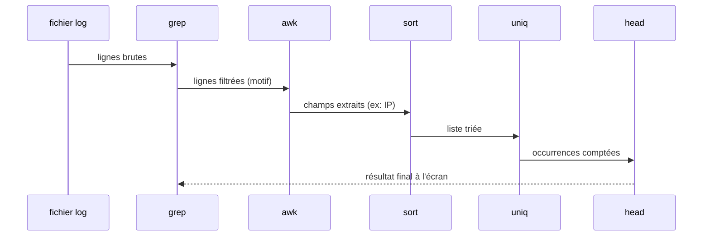
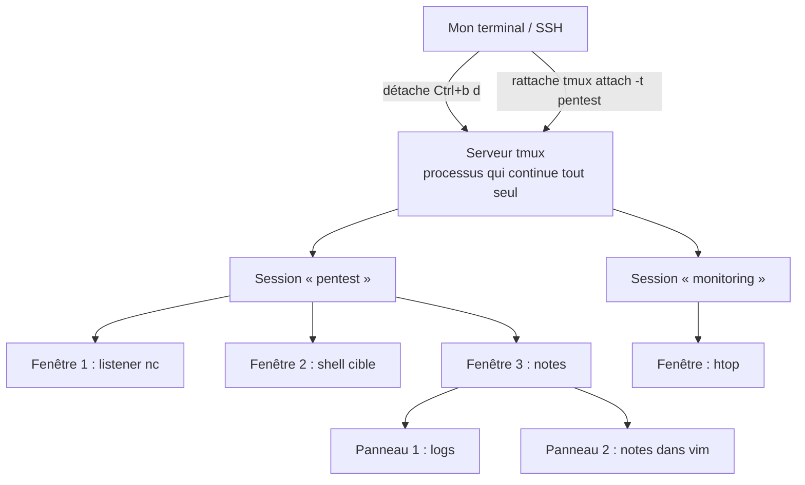
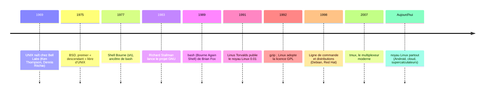

# Présentation

## Pourquoi apprendre Linux pour la cybersécurité ?

Imagine que tu doives inspecter un immeuble entier (le réseau d'une entreprise)
mais que tu ne possèdes qu'une seule clé, celle du hall d'entrée (Windows). En
cybersécurité, la quasi-totalité des machines que tu vas auditer, infiltrer ou
défendre ne tourne pas sous Windows mais sous **Linux** : serveurs web, bases de
données, pare-feux, routeurs, smartphones Android, montres connectées,
téléviseurs, objets connectés, et même la totalité des 500 supercalculateurs les
plus rapides du monde.

Si tu ne parles pas la langue de Linux, tu es comme un médecin qui ne saurait pas
ouvrir un dossier patient : tu resteras bloqué à la porte du métier. Ce cours est
la deuxième marche de ton escalier vers le métier de pentester. Le niveau 0
t'a donné les bases de l'ordinateur (fichiers, dossiers, permissions, systèmes
d'exploitation). Le niveau 1 te donne les **mains** : le terminal, la ligne de
commande, et toute la panoplie d'outils qui font de Linux l'environnement de
travail préféré de 9 professionnels de la sécurité sur 10.

> **Le savais-tu ?** Plus de 90 % des serveurs du monde tournent sous Linux ou
> sous un système dérivé (BSD, Android). Quand un pentester énumère des services
> à distance, il voit très souvent la signature d'une machine Linux : versions
> d'OpenSSH, bannières Apache, chemins de fichiers commençant par `/etc/...`.
> Sans Linux, il ne peut ni les interpréter ni exploiter la moindre de ses
> failles.

## Pourquoi est-il important ?

Voici les trois raisons qui font de Linux l'outil central de la cybersécurité :

| Raison | Explication | Exemple concret |
| ------ | ----------- | --------------- |
| **Dominance des serveurs** | Environ 90 % des serveurs web, mail, DNS et bases de données mondiaux | Un site e-commerce hébergé chez OVH, un cluster AWS, un NAS Synology |
| **Transparence totale** | Linux est open source : on peut lire le code source de chaque outil | `strace` montre les appels système, `lsof` montre les fichiers ouverts |
| **Puissance du terminal** | Tout se pilote en texte : scripting, automatisation, pipes, exploitation | Un pipeline `grep`/`awk`/`sort` analyse un million de lignes de logs |

Et le point le plus important pour un futur pentester : **les outils d'attaque
et de défense sont écrits d'abord pour Linux**. `nmap`, `sqlmap`, `Metasploit`,
`Burp Suite`, `Wireshark`, `hashcat` : tous tournent nativement et au maximum de
leurs capacités sous Linux. Apprendre d'abord Windows pour devenir pentester,
c'est apprendre à conduire avec le manuel d'un bateau.

## Où est-il utilisé ?

| Domaine | Exemples réels |
| ------- | -------------- |
| **Sites web et applications** | La majorité des serveurs Apache, Nginx, Node.js, PHP |
| **Cloud et datacenters** | AWS (Amazon Linux), Google Cloud, Azure (partie Linux), OVH, Scaleway |
| **Cybersécurité** | Kali Linux, Parrot OS, BlackArch : les distributions de pentest |
| **Mobile et embarqué** | Android (noyau Linux), routeurs, box internet, TV connectées, voitures |
| **Supercalculateurs** | 100 % des 500 machines les plus rapides au monde (classement TOP500) |
| **Sciences et industrie** | CERN, systèmes de trading boursier, systèmes de contrôle industriel |

## Métiers

| Métier | Ce que fait ce métier | Rôle de Linux |
| ------ | --------------------- | ------------- |
| **Pentester** | Trouve et exploite les failles d'un système avec autorisation | 90 % de l'arsenal, scripting d'exploits, post-exploitation |
| **Admin Système (SysAdmin)** | Installe, configure et maintient les serveurs | Vie quotidienne 100 % Linux : SSH, scripts, systemd |
| **DevSecOps** | Intègre la sécurité dans les pipelines d'ingénierie | Conteneurs Docker (noyau Linux), CI/CD, audit de configurations |
| **Blue Team / SOC Analyst** | Détecte et répond aux attaques | Analyse de logs, `grep` sur millions de lignes, `tcpdump` |
| **Forensic Analyst** | Analyse les machines compromises après un incident | Images de disque, `lsof`, `fuser`, `strings`, chronologie des événements |
| **Bug Bounty Hunter** | Chasse des failles sur des programmes publics rémunérés | Recon, exploitation, rapport : tout en ligne de commande |

## Prérequis

Ce cours est le **niveau 1** du parcours CyberAcademy. Il suppose que tu as validé
le **niveau 0 — Computer Fundamentals**, c'est-à-dire :

- Ce qu'est un système d'exploitation et un noyau ;
- La notion de fichier et de dossier (arborescence) ;
- Les permissions de base (lecture, écriture, exécution) ;
- Le rôle de la RAM et du disque lors d'un démarrage.

Aucune autre connaissance n'est requise : tout le vocabulaire spécifique (CLI,
TTY, shell, redirection, pipe…) sera défini en toutes lettres dans ce cours.

## Temps estimé et niveau

| Élément | Valeur |
| ------- | ------ |
| **Niveau** | 1 (sur 11) |
| **Temps estimé** | 10 heures |
| **XP à gagner** | 750 XP |
| **Badge** | 🐚 Shell Master |
| **Niveau suivant** | 2 — Networking |

## Comment suivre ce cours

1. Lis la **Théorie** en gardant un terminal ouvert : teste chaque commande.
2. Observe les schémas de la section **Visualisation**.
3. Reproduis les **Démonstrations** sur une machine Linux (de préférence une VM
   Kali ou Ubuntu que tu possèdes).
4. Fais les **Laboratoires** puis les **Mini Challenges** **sans lire la
   correction** d'abord.
5. Termine par le **Quiz** : il faut au moins 80 % pour valider le niveau et
   gagner tes 750 XP.

> **⚠️ Légal** — Toutes les commandes de ce cours doivent être exécutées **sur ta
> propre machine, sur une machine virtuelle isolée (VM), ou sur une plateforme
> d'entraînement qui t'y autorise** (HackTheBox, TryHackMe, Root-Me, les labos
> CyberAcademy). La loi française (art. 323-1 et suivants du Code pénal) et la
> quasi-totalité des lois nationales répriment l'accès frauduleux à un système
> informatique, même sans dommage. Un « test » sur la machine d'un voisin, d'une
> entreprise ou d'un site sans autorisation écrite est **un délit**, pas un
> exercice. Le professionnel ne teste **que** ce qui lui appartient ou ce qu'un
> contrat autorise explicitement.

---

## Objectifs pédagogiques

À la fin de ce cours, tu seras capable de :

1. **Piloter le shell Bash** : te déplacer dans l'arborescence, lire et créer
   des fichiers, comprendre `stdin`, `stdout`, `stderr` et utiliser les
   redirections `>`, `>>`, `2>`, `2>&1` ainsi que les pipes `|` pour enchaîner
   des commandes.
2. **Rechercher efficacement** n'importe quel fichier, motif ou contenu avec
   `grep`, `find` et `locate`, en combinant leurs options (`-r`, `-i`, `-v`,
   `-n`, `-l`, `-name`, `-type`, `-user`, `-size`, `-perm`, `-exec`).
3. **Transformer du texte** avec `sed`, `awk`, `tr` et `cut` pour extraire,
   remplacer, trier et compter des données, y compris dans des fichiers de logs.
4. **Créer et extraire des archives** (`tar`, `gzip`, `zip`) comme on le fait
   sur un vrai serveur ou avant d'exfiltrer des données en CTF.
5. **Gérer les processus** : lister (`ps`, `top`), lancer en arrière-plan (`&`),
   terminer proprement ou de force (`kill`, `killall`, `pgrep`), planifier
   (`crontab`) et faire survivre une commande à une déconnexion (`nohup`,
   `tmux`).
6. **Diagnostiquer les ressources** d'une machine (`df`, `du`, `free`, `vmstat`,
   `iostat`, `lsof`, `fuser`, `mount`) et son réseau local (`ip a`, `ping`,
   `ss`).
7. **Maîtriser les permissions avancées** : `chmod` en mode symbolique et octal,
   `chown`, `chgrp`, `umask`, sticky bit, setuid/setgid, et reconnaître une ACL.

---

## Vue d'ensemble

```mermaid
flowchart LR
    A[Depart<br/>Niveau 0 valide] --> B[1. Le shell et la ligne de commande]
    B --> C[2. Naviguer et explorer]
    C --> D[3. Lire et manipuler des fichiers]
    D --> E[4. Rechercher : grep, find, locate]
    E --> F[5. Texte avance : sed, awk, tr, cut]
    F --> G[6. Archives : tar, gzip, zip]
    G --> H[7. Processus : ps, kill, crontab]
    H --> I[8. Ressources : df, du, free, lsof]
    I --> J[9. Permissions approfondies : chmod, umask, ACL]
    J --> K[10. Reseau local : ip, ping, ss]
    K --> L[11. tmux et screen : le super terminal]
    L --> M[Quiz >= 80 %<br/>750 XP · Badge Shell Master]
```



| # | Module | Compétences clés | Outils |
| - | ------ | ---------------- | ------ |
| 1 | Le shell et la ligne de commande | Comprendre le dialogue homme-machine, les flux et redirections | `bash`, `zsh`, `echo` |
| 2 | Naviguer et explorer | Chemins, arborescence, motifs | `pwd`, `ls`, `cd` |
| 3 | Lire et manipuler des fichiers | Lecture, création, comparaison, écriture | `cat`, `less`, `tail`, `diff`, `tee` |
| 4 | Rechercher | Trouver fichiers et contenus | `grep`, `find`, `locate` |
| 5 | Texte avancé | Transformer des flux de texte | `sed`, `awk`, `tr`, `cut` |
| 6 | Archives | Compresser et regrouper | `tar`, `gzip`, `zip` |
| 7 | Processus | Lancer, surveiller, terminer, planifier | `ps`, `top`, `kill`, `crontab` |
| 8 | Ressources | Surveiller disque, RAM, I/O, fichiers ouverts | `df`, `du`, `free`, `lsof` |
| 9 | Permissions avancées | Modes, propriétaires, bits spéciaux, ACL | `chmod`, `chown`, `umask` |
| 10 | Réseau local | Identité réseau, connectivité, ports | `ip`, `ping`, `ss` |
| 11 | tmux et screen | Multiplexer le terminal, sessions détachables | `tmux`, `screen` |

---

## Théorie

Chaque notion suit le même fil : **Définition → Pourquoi → Historique →
Fonctionnement → Cas d'usage → Exemple réel → Bonnes pratiques → Résumé**.
Ouvre un terminal et teste au fur et à mesure : un cours de commandes qui ne
s'exécute jamais reste une simple lecture.

### a) Le shell et la ligne de commande

**Définition.** La **CLI** (Command-Line Interface, interface en ligne de
commande) est un mode d'interaction avec l'ordinateur où tu tapes des
**commandes** en texte brut et où la machine répond par du texte. Le **shell**
est le programme qui lit tes commandes, les traduit en actions du système et
affiche les résultats. `bash` (Bourne Again Shell) est le shell le plus répandu ;
`zsh` (Z Shell) en est un dérivé moderne avec une meilleure complétion.

**Pourquoi.** Les interfaces graphiques (GUI, Graphical User Interface) sont
confortables mais lentes et limitées. Avec la CLI, une seule ligne fait en une
seconde ce qu'un clic dans dix menus ferait en dix minutes — et surtout, la CLI
est **scriptable** : tu peux enchaîner, automatiser, reproduire à l'identique.
En cybersécurité, la majorité des serveurs n'ont même pas d'écran : on s'y
connecte en **SSH** (Secure Shell, protocole de connexion à distance chiffré) et
on ne voit qu'un terminal. La CLI est la seule porte d'entrée.

**Historique.** En 1969, Ken Thompson écrit **UNIX** à Bell Labs. UNIX introduit
une philosophie radicale : de petits programmes qui font une seule chose et
communiquent entre eux par des **flux de texte**. En 1977 naît le premier shell
`sh` (Bourne shell). En 1989, Brian Fox écrit `bash` pour le projet GNU. En
1991, Linus Torvalds publie le noyau **Linux** ; l'association GNU + Linux donne
les distributions modernes. Cinquante ans plus tard, tu utilises encore
l'architecture pensée en 1969.

**Fonctionnement interne.** Quand tu tapes une commande et appuies sur Entrée :

1. Le shell lit ta ligne et la découpe en **mots** (nom de la commande, puis
   ses options et arguments).
2. Il cherche le programme dans les dossiers listés par la variable `PATH`.
3. Il crée un **processus enfant** (un programme en cours d'exécution).
4. Il lui branche trois **flux standards** :
   - **stdin** (entrée standard, descripteur 0) : d'où le programme lit ses
     données (par défaut : le clavier) ;
   - **stdout** (sortie standard, descripteur 1) : où il écrit ses résultats
     normaux (par défaut : l'écran) ;
   - **stderr** (erreur standard, descripteur 2) : où il écrit ses messages
     d'erreur (par défaut : l'écran aussi).
   (Le descripteur de fichier, ou **fd**, est le numéro de « prise » qu'un
   processus utilise pour désigner un fichier ou un flux ouvert.)
5. Le programme s'exécute puis rend la main au shell (prompt `$`).

**Redirections.** Par défaut, stdout et stderr vont à l'écran et stdin vient du
clavier. On peut rediriger ces flux :

| Syntaxe | Effet | Exemple |
| ------- | ----- | ------- |
| `>` | Écrasement : redirige stdout vers un fichier | `ls > liste.txt` |
| `>>` | Ajout : concatène stdout à la fin d'un fichier | `echo "a" >> log.txt` |
| `2>` | Redirige stderr vers un fichier | `ls dossier_bidon 2> erreurs.txt` |
| `2>&1` | Fusionne stderr avec stdout | `cmd > tout.log 2>&1` |
| `<` | Redirige stdin depuis un fichier | `sort < liste.txt` |
| `\|` | Pipe : branche stdout d'une commande sur stdin de la suivante | `cat f \| grep mot` |

**Cas d'usage.** Trier une liste, filtrer des logs, compter des lignes,
enregistrer la sortie d'un scan dans un fichier pour le rapport, ne garder que
les erreurs pour débugger.

**Exemple réel.** Un pentester lance un scan et veut garder les résultats tout en
filtrant en direct :

```bash
nmap -sV 10.0.0.1 > scan_rapport.txt 2>&1
```

**Bonnes pratiques.** Toujours préférer `>>` à `>` quand tu accumules
(l'écrasement détruit silencieusement !). Sépare stdout et stderr quand tu
débuggues. Utilise `2>/dev/null` pour ignorer proprement les erreurs attendues.

**Résumé.** Le shell est un interpréteur de commandes ; chaque commande parle au
système via trois flux (entrée, sortie, erreur) que tu peux rediriger et
connecter avec des pipes.

### b) Naviguer et explorer

**Définition.** Naviguer consiste à changer de dossier courant et à lister son
contenu. Trois commandes de base : `pwd` (print working directory — affiche le
dossier où tu te trouves), `ls` (list — liste les fichiers et dossiers), `cd`
(change directory — change de dossier).

**Pourquoi.** Chaque commande agit sur le **dossier courant** par défaut. Si tu
ne sais pas où tu es et où tu vas, tu écris des fichiers au mauvais endroit ou tu
supprimes la mauvaise chose — la cause numéro un des catastrophes en terminal.

**Historique.** `ls` et `cd` existent depuis les tout premiers UNIX ; ils n'ont
quasiment pas changé en cinquante ans. Preuve que les fondamentaux se bonifient
avec le temps.

**Fonctionnement interne.** Le shell garde en mémoire ton dossier courant (la
variable `PWD`). `cd` modifie cette mémoire, `pwd` la lit, `ls` lit la structure
du système de fichiers à cet endroit. Tu peux te déplacer avec :

- **Chemin absolu** : complet depuis la racine, commence par `/`
  (`/home/alice/documents`). Comme l'adresse postale complète d'une maison.
- **Chemin relatif** : relatif au dossier courant (`documents/rapport.txt`).
  Comme dire « la pièce à côté ».
- `.` = dossier courant ; `..` = dossier parent.
- `~` (tilde) = ton dossier personnel (home) : `cd ~` te ramène à la maison.

**Wildcards (métacaractères).** Le shell peut fabriquer des listes de fichiers :

| Motif | Signification | Exemple |
| ----- | ------------- | ------- |
| `*` | N'importe quelle suite de caractères (même vide) | `ls *.log` : tous les .log |
| `?` | Exactement un caractère | `ls rapp?rt.txt` |
| `[...]` | Un caractère parmi la liste ou la plage | `ls [abc]*` ou `ls [a-f]*` |

**Options de `ls` :**

| Option | Effet |
| ------ | ----- |
| `-l` | Long format : permissions, propriétaire, taille, date |
| `-a` | Inclut les fichiers cachés (ceux qui commencent par `.`) |
| `-h` | Taille lisible par un humain (Ko, Mo, Go) |
| `-R` | Récursif : contenu des sous-dossiers |
| `-t` | Trie par date de modification (le plus récent d'abord) |

**Cas d'usage.** Se repérer sur un serveur, vérifier les permissions d'un
dossier, retrouver les fichiers modifiés récemment.

**Exemple réel.**

```bash
pwd                          # /home/alice
ls -la /etc/nginx/           # voir la configuration web et ses permissions
cd /var/log && ls -t | head  # aller aux logs, lister les plus récents
```

**Bonnes pratiques.** Tape toujours `pwd` quand tu es perdu. Utilise la
complétion (touche `Tab`) au lieu de recopier les chemins. Évite les espaces
dans les noms de fichiers (quote-les si tu y es obligé : `cd "Mon Dossier"`).

**Résumé.** `pwd` te situe, `ls` t'informe, `cd` te déplace ; maîtrise les
chemins absolus/relatifs, `~`, `.`, `..` et les wildcards pour ne jamais te
perdre.

### c) Lire et manipuler des fichiers

**Définition.** Ces commandes lisent, créent, comparent et modifient des
fichiers sans ouvrir d'éditeur graphique.

| Commande | Rôle | Options / usages |
| -------- | ---- | ----------------- |
| `cat` | Concatène et affiche un fichier entier | `cat /etc/hostname` ; `cat f1 f2` |
| `less` | Lit un gros fichier page par page (`q` quitte, espace avance, `/motif` cherche) | `less /var/log/syslog` |
| `head` | Affiche les premières lignes (10 par défaut) | `head -n 20 fichier` |
| `tail` | Affiche les dernières lignes | `tail -n 5 f` ; `tail -f f` suit en direct |
| `wc` | Compte lignes, mots, octets | `wc -l fichier` (lignes) |
| `sort` | Trie les lignes | `sort -n` (numérique), `sort -r` (inverse) |
| `uniq` | Supprime les lignes dupliquées **adjacentes** | presque toujours avec `sort` : `sort f \| uniq -c` |
| `diff` | Compare deux fichiers ligne à ligne | `diff -u ancien nouveau` |
| `touch` | Crée un fichier vide ou met à jour sa date | `touch rapport.md` |
| `echo` | Affiche du texte (souvent pour écrire) | `echo "hello" > f.txt` |
| `tee` | Écrit la sortie à l'écran **et** dans un fichier | `cmd \| tee sortie.log` |

**Pourquoi.** Sur un serveur, les fichiers de logs font des centaines de
milliers de lignes : les ouvrir dans un éditeur est impossible. `tail -f` te
montre les événements en temps réel ; `wc -l` te donne la taille ; `sort | uniq
-c` te donne la fréquence. Ce sont les outils du quotidien d'un analyste.

**Historique.** `cat` (concatenate), `head` et `tail` datent des premiers UNIX.
`tee` doit son nom à la lettre T d'un tuyau de plomberie : le flux arrive puis se
sépare en deux.

**Fonctionnement interne.** Ces commandes lisent le fichier ligne par ligne
(`wc` compte), les trient en mémoire (`sort`), les comparent (`diff`), ou n'en
retiennent que des fragments (`head`, `tail`). `tail -f` maintient le fichier
ouvert et affiche chaque nouvelle ligne écrite par le système.

**Cas d'usage.** Surveiller les tentatives de connexion en direct :
`tail -f /var/log/auth.log`. Comparer deux configurations avant/après. Produire
un rapport de sortie tout en le sauvegardant.

**Exemple réel.**

```bash
# Analyse des connexions SSH réussies aujourd'hui
grep "Accepted" /var/log/auth.log | wc -l

# Suivi en temps réel du journal
tail -f /var/log/nginx/access.log

# Écrire une liste propre, triée, sans doublons
sort clients.txt | uniq > clients_propres.txt
```

**Bonnes pratiques.** Pour un gros fichier, préfère toujours `less` à `cat`
(`cat` déverse tout, `less` te laisse naviguer). Pour surveiller, `tail -f` puis
`Ctrl+C` pour arrêter. Vérifie toujours une commande d'écrasement (`>`) avant de
la lancer.

**Résumé.** Un panneau d'outils de lecture/écriture : `cat`/`less` pour lire,
`head`/`tail` pour trancher, `wc`/`sort`/`uniq` pour analyser, `diff` pour
comparer, `tee` pour dupliquer, `echo`/`touch` pour créer.

### d) Rechercher

**Définition.** Trois moteurs de recherche dans le terminal : `grep` cherche du
**contenu** dans des fichiers, `find` cherche des **fichiers** par attributs
(nom, type, taille, permissions), `locate` cherche par nom dans une base de
données pré-indexée.

**Pourquoi.** Un pentester cherche toujours : le fichier de configuration qui
contient un mot de passe, le flag d'un CTF, un binaire SUID mal configuré, une
vulnérabilité dans le code. Sans recherche, une forêt de dix mille fichiers est
impénétrable.

**Historique.** `grep` vient de l'éditeur UNIX `ed` et de la commande `g/re/p` :
*global / regular expression / print* — « pour tout le fichier, si la ligne
correspond à l'expression, imprime-la ». `find` est l'outil historique de
recherche dans l'arborescence. `locate` (avec `updatedb`) indexe le système
périodiquement pour des recherches ultra-rapides par nom.

**Fonctionnement interne.** `grep` lit chaque ligne et applique un motif
(expression régulière) ; si la ligne correspond, elle est envoyée sur stdout.
`find` **parcourt physiquement** l'arborescence depuis un dossier donné et teste
chaque fichier contre tes critères. `locate` interroge une base de données
construite par `updatedb` — rapide mais potentiellement périmée.

**Options de `grep` :**

| Option | Effet |
| ------ | ----- |
| `-i` | Ignore la casse (minuscules/majuscules) |
| `-r` | Récursif dans les dossiers |
| `-v` | Inverse : lignes qui **ne** correspondent **pas** |
| `-n` | Affiche le numéro de ligne |
| `-l` | Affiche seulement les noms de fichiers (pas les lignes) |
| `-c` | Compte les lignes correspondantes |
| `-w` | Mot entier (ne coupe pas « port » dans « transport ») |
| `-E` | Expressions régulières étendues |
| `-a` | Traite un binaire comme du texte |

**Options de `find` :**

| Option | Exemple | Effet |
| ------ | ------- | ----- |
| `-name` | `find / -name "*.conf"` | Par nom (avec wildcards) |
| `-type` | `find / -type f` / `-type d` | Type : f=fichier, d=dossier, l=lien |
| `-user` | `find / -user alice` | Fichiers possédés par un utilisateur |
| `-size` | `find / -size +10M` | Taille : `+10M` = plus de 10 Mo, `-1k` = moins |
| `-perm` | `find / -perm -4000` | Fichiers avec les bits de permissions donnés |
| `-mtime` | `find / -mtime -1` | Modifié il y a moins de 1 jour |
| `-mmin` | `find / -mmin -1` | Modifié il y a moins de 1 minute |
| `-exec` | `find / -name "*.log" -exec rm {} \;` | Exécute une commande sur chaque résultat (`{}` = le fichier) |
| `-maxdepth` | `find /etc -maxdepth 2` | Limite la profondeur de descente |

**Cas d'usage.** Trouver tous les fichiers SUID (`find / -perm -4000`) est une
étape classique d'énumération en post-exploitation. Chercher une faille dans un
code source : `grep -rn "eval(" /app`. Localiser un mot de passe égaré dans des
logs.

**Exemple réel.**

```bash
# 1. Où est écrit le mot de passe ? (énumération de fichiers)
grep -rli "password" /home/alice/ 2>/dev/null

# 2. Fichiers modifiés ces 24 dernières heures
find /var/log -type f -mtime -1

# 3. Fichiers SUID (à fort potentiel d'exploitation)
find / -type f -perm -4000 2>/dev/null
```

**Bonnes pratiques.** Toujours ajouter `2>/dev/null` à `find /` pour ignorer les
erreurs de permissions (tu n'es pas root partout). Avec `find -exec`, fais un
test sec (sans l'action) avant de lancer une suppression. Préfère `-l` à `-r`
pour savoir *quels* fichiers matchent.

**Résumé.** `grep` cherche dans le contenu, `find` dans la structure, `locate`
dans un index ; les trois forment ton rayon laser pour retrouver n'importe quoi
sur n'importe quelle machine.

### e) Manipulation avancée de texte

**Définition.** Quatre outils de transformation de flux de texte :

- **`sed`** (stream editor) : remplace, supprime, imprime des lignes selon des
  motifs. Le couteau suisse du texte.
- **`awk`** : langage de traitement de texte orienté colonnes et conditions.
  Idéal pour extraire des champs.
- **`tr`** (translate) : remplace ou supprime des caractères.
- **`cut`** : découpe des colonnes (champs) dans des lignes.

**Pourquoi.** Les données réelles (logs, exports CSV, réponses HTTP) arrivent en
lignes avec des séparateurs. Pour les lire, les nettoyer et en tirer des
nombres, il faut pouvoir découper, remplacer et calculer — sans ouvrir un tableur.

**Historique.** `sed` et `awk` sont nés dans les années 1970 (awk d'Alfred Aho,
Peter Weinberger et Brian Kernighan — d'où son nom). Ils font partie de la boîte
à outils POSIX ; `awk` est un langage complet, `sed` un éditeur par flux. `cut`
et `tr` sont des utilitaires UNIX simples et puissants.

**Fonctionnement interne.** `sed` lit le flux, applique une **commande** à
chaque ligne (`s/ancien/nouveau/g` = substitution), et écrit le résultat. `awk`
découpe chaque ligne en **champs** (par défaut séparés par des espaces : `$1` =
premier champ, `$2` = deuxième, etc.) et peut appliquer des conditions
(`awk 'NR==2'` = ligne 2). `tr` travaille caractère par caractère. `cut` découpe
selon un délimiteur (`-d :`) et un numéro de champ (`-f 2`).

**Expressions régulières de base (regex).** Des motifs pour décrire du texte :
`.` n'importe quel caractère, `*` répétition, `^` début de ligne, `$` fin de
ligne, `[a-z]` une plage, `[.]` un point littéral. `grep -E`, `sed -E` et `awk`
les utilisent en version étendue.

**Cas d'usage.** Extraire les adresses IP d'un log : `awk '{print $1}' log` (si
l'IP est le premier champ). Remplacer une adresse dans tous les fichiers.
Convertir minuscules en majuscules : `tr '[:lower:]' '[:upper:]'`. Compter les
occurrences : `awk '{print $1}' log | sort | uniq -c | sort -nr`.

**Exemple réel.**

```bash
# 1. Extraire le champ 3 (l'utilisateur) d'un fichier séparé par des ":"
cut -d: -f3 /etc/passwd

# 2. Remplacer toutes les occurrences de "admin" par "root" à l'écran
sed 's/admin/root/g' config.txt

# 3. Top 5 des adresses IP les plus fréquentes d'un log web
awk '{print $1}' access.log | sort | uniq -c | sort -nr | head -5
```

**Bonnes pratiques.** Fais une copie avant `sed -i` (modification en place) :
`sed -i.bak 's/a/b/g' fichier`. Teste tes regex sur une ligne d'abord. En
`awk`, vérifie le séparateur de champs avant de compter.

**Résumé.** `sed` remplace, `awk` découpe et calcule, `tr` transforme des
caractères, `cut` extrait des colonnes : quatre scalpels pour façonner n'importe
quel flux de texte.

### f) Archives et compression

**Définition.** **Compresser** réduit la taille d'un fichier (l'algorithme gzip
remplace les répétitions par des codes plus courts). **Archiver** regroupe
plusieurs fichiers/dossiers en un seul sans les compresser. Les outils : `tar`
(tape archive), `gzip`/`gunzip`, `zip`/`unzip`.

**Pourquoi.** Transférer deux cents fichiers de logs, exfiltrer des artefacts,
distribuer un code source : tout est plus simple en un seul fichier plus léger.
C'est aussi la première chose que fait un pentester pour récupérer discrètement
des données sur une machine compromise (dans un cadre autorisé).

**Historique.** `tar` date de 1979 : son nom vient des bandes magnétiques
(*tape archive*). Il sert aujourd'hui à tout — les distributions Linux sont
distribuées en `.tar.gz`. `gzip` (GNU zip) est né en 1992. `zip` vient du monde
Windows/PC de Phil Katz (1989).

**Fonctionnement interne.** `tar` lit les fichiers, les concatène avec des
en-têtes contenant noms et permissions, et (si l'option `z` est passée) fait
passer le résultat dans gzip. L'ordre des options crée les commandes mythiques :

| Commande | Effet |
| -------- | ----- |
| `tar -czvf archive.tar.gz dossier/` | **c**rée une archive, **z** (gzip), **v**erbose, **f**ichier de sortie |
| `tar -xzvf archive.tar.gz` | e**x**trait l'archive gzip |
| `tar -tzvf archive.tar.gz` | **t**este/liste le contenu sans extraire |
| `gzip fichier` / `gunzip fichier.gz` | Compresse / décompresse un fichier seul |
| `zip -r archive.zip dossier/` | Archive compressée type Windows |
| `unzip archive.zip` | Extrait un zip |

**Cas d'usage.** Sauvegarder `/etc` avant une modification : `tar -czvf
etc_bak.tar.gz /etc`. Livrer un dossier de code. Récupérer une archive reçue par
mail. En forensic, préserver un état.

**Exemple réel.**

```bash
# Sauvegarde des configurations
sudo tar -czvf /backups/etc_$(date +%F).tar.gz /etc

# Extraction
tar -xzvf /backups/etc_2026-08-06.tar.gz -C /restaure

# Lister sans extraire (vérifier avant d'agir !)
tar -tzvf archive.tar.gz | head
```

**Bonnes pratiques.** Toujours utiliser l'extension cohérente (`.tar.gz` pour
gzip, `.tgz` idem). `-C` (change directory) force l'extraction dans un dossier
donné — indispensable pour ne pas inonder le dossier courant. Vérifie le contenu
avec `-t` avant d'extraire. **Ne décompresse jamais une archive reçue d'une
source inconnue sans l'inspecter** : c'est une porte d'entrée classique
d'attaques.

**Résumé.** `tar` regroupe (+ `z` compresse), `gzip` compresse un seul fichier,
`zip` fait les deux ; `-t` pour inspecter avant d'extraire, `-C` pour extraire
où tu veux.

### g) Processus

**Définition.** Un **processus** est un programme en cours d'exécution : code en
mémoire, ressources allouées (CPU, RAM, fichiers ouverts), identifié par un
**PID** (Process IDentifier). Outils : `ps`, `top`, `htop`, `kill`, `killall`,
`pgrep`, `jobs`, `&`, `nohup`, `crontab`.

**Pourquoi.** En cybersécurité, tu dois toujours savoir *ce qui tourne* : un
processus anormal (un mineur de crypto, un reverse shell, un keylogger) est un
signal d'alerte. En tant qu'attaquant autorisé, tu dois lancer des listeners en
arrière-plan, les tuer proprement, les planifier.

**Historique.** La notion de processus est au cœur d'UNIX depuis 1969. `ps`
(list processes) est l'ancêtre, `top` (table of processes) date des années 1980,
`htop` est un successeur interactif. `cron` (du grec chronos, le temps) planifie
des tâches depuis 1975.

**Fonctionnement interne.** Le noyau attribue à chaque processus un PID unique et
l'ordonnanceur partage le CPU entre eux. Chaque processus a un **parent** (le
processus qui l'a lancé). `ps` lit la table des processus du noyau. `kill` n'est
pas un « meurtre » : il envoie un **signal** que le processus peut gérer.
Signaux les plus utilisés :

| Signal | Numéro | Effet |
| ------ | ------ | ----- |
| SIGTERM | 15 | Demande d'arrêt propre (par défaut) |
| SIGKILL | 9 | Arrêt forcé immédiat (le noyau l'exécute) |
| SIGHUP | 1 | Déconnexion du terminal (finit le processus) |
| SIGINT | 2 | Ctrl+C à l'écran |

**Lancer en arrière-plan.** `&` en fin de commande lance sans bloquer le
terminal. `jobs` liste les tâches du shell, `fg` ramène une tâche au premier
plan, `bg` l'y renvoie. `nohup cmd &` (no hang up) rend la commande insensible
au SIGHUP : elle survit à la fermeture du terminal.

**Commandes clés :**

```bash
ps aux                     # tous les processus (user, cpu, mem, commande)
ps -ef                     # autre syntaxe : PID, PPID (parent)
top                        # tableau dynamique (q pour quitter)
htop                       # version interactive et colorée
pgrep -l ssh               # PID(s) des processus nommés ssh
kill 1234                  # SIGTERM au PID 1234
kill -9 1234               # SIGKILL, brutal
killall nginx              # SIGTERM à tous les processus nginx
sleep 100 &                # tâche en arrière-plan
jobs                       # liste des tâches du shell
nohup script.sh &          # survivre à la déconnexion
```

**Crontab.** `crontab -e` édite la table de planification de ton utilisateur,
`crontab -l` l'affiche. Chaque ligne : minute heure jour-du-mois mois
jour-de-la-semaine commande. Exemple : exécuter `backup.sh` tous les jours à
2h30 : `30 2 * * * /home/alice/backup.sh`. Un pentester vérifie aussi les
tâches planifiées des autres utilisateurs (`/var/spool/cron`, `/etc/cron*`)
lors d'une énumération : les crons sont des points d'entrée et de persistance.

**Cas d'usage.** Relancer un service qui a crashé, arrêter un scan qui tourne
trop longtemps, planifier une sauvegarde, espionner les processus pour détecter
une intrusion.

**Exemple réel.**

```bash
# Lister les processus par consommation de CPU
ps aux --sort=-%cpu | head -5

# Lancer un scan en arrière-plan et suivre sa progression
nmap -sS 10.0.0.0/24 > scan.txt &
jobs
tail -f scan.txt

# Un processus suspect à tuer
pgrep -l miner
kill -9 $(pgrep miner)
```

**Bonnes pratiques.** Toujours SIGTERM d'abord, SIGKILL en dernier recours. Ne
tue jamais un PID au hasard : identifie avec `ps aux | grep`. Quand tu ne sais
pas si une commande va durer, lance-la avec `nohup ... &` et `tee` pour garder
une trace.

**Résumé.** Tout ce qui tourne sur une machine est un processus avec un PID ;
`ps`/`top` pour voir, `pgrep` pour retrouver, `kill`/`killall` pour terminer par
signal, `&`/`nohup`/`jobs` pour gérer l'arrière-plan, `crontab` pour planifier.

### h) Ressources système

**Définition.** Ces outils mesurent ce que la machine a et consomme : disque
(`df`, `du`), mémoire (`free`, `vmstat`), entrées/sorties (`iostat`), fichiers
ouverts (`lsof`, `fuser`), points de montage (`mount`).

**Pourquoi.** Un serveur lent, un disque plein, un fichier qui refuse d'être
démonté, un port occupé : chaque problème technique se diagnostique en mesurant
une ressource. C'est la boîte à outils du « docteur de la machine ».

**Historique.** `df` (disk free) et `du` (disk usage) sont parmi les plus vieux
outils UNIX. `vmstat` (virtual memory statistics) et `iostat` (I/O statistics)
viennent des distributions SysV. `lsof` (list open files) a été écrit en 1988
par Vic Abell pour répondre à la question « quel processus tient ce fichier ? ».
`fuser` (file user) fait la même chose en sens inverse.

**Commandes clés :**

| Commande | Rôle | Options utiles |
| -------- | ---- | -------------- |
| `df -h` | Espace libre par système de fichiers | `-h` lisible, `-T` type |
| `du -sh dossier` | Taille totale d'un dossier | `-s` synthèse, `-h` lisible, `-a` par fichier |
| `free -h` | RAM utilisée/libre/échange | `-h` lisible |
| `vmstat 2 5` | Mémoire, CPU, swap, I/O : un échantillon toutes les 2 s, 5 fois | |
| `iostat` | Statistiques disques et CPU | |
| `lsof` | Fichiers ouverts (qui ? quoi ?) | `-i :80` (port), `-p PID`, `-u user` |
| `fuser` | PID(s) utilisant un fichier/dossier | `-k` tue les processus concernés |
| `mount` | Points de montage actuels | souvent avec `sudo` |

**Fonctionnement interne.** `df` lit les superblocs des systèmes de fichiers,
`du` parcourt les dossiers et additionne les tailles des inodes, `free` lit
`/proc/meminfo`, `lsof` parcourt le répertoire virtuel `/proc/<pid>/fd` où le
noyau liste les descripteurs de fichiers de chaque processus.

**Cas d'usage.** « Le disque est plein ! » → `df -h`, puis `du -sh /var/log`,
puis `du -sh /var/log/* | sort -h`. « Le port 8080 est déjà utilisé » →
`lsof -i :8080` ou `fuser 8080/tcp`. « Ce dossier ne veut pas se démonter » →
`fuser -k /mnt/usb` (après vérification).

**Exemple réel.**

```bash
# 1. Qui remplit le disque ?
df -h
sudo du -sh /* 2>/dev/null | sort -h | tail -5

# 2. Le port 443 est occupé : par qui ?
lsof -i :443

# 3. Mémoire sous tension ?
free -h && vmstat 1 3
```

**Bonnes pratiques.** Utilise `-h` partout pour des tailles lisibles. Dans
`du`, pense à exclure les systèmes de fichiers virtuels (`--exclude`). `lsof`
nécessite souvent `sudo` pour voir les fichiers ouverts par les autres. Attention :
`fuser -k` tue des processus — vérifie toujours les PID affichés d'abord.

**Résumé.** `df`/`du` pour le disque, `free`/`vmstat`/`iostat` pour la mémoire et
les I/O, `lsof`/`fuser` pour savoir quel processus tient quoi, `mount` pour les
points de montage : le stéthoscope du sysadmin.

### i) Permissions approfondies

**Définition.** Chaque fichier Linux a un propriétaire (user), un groupe et les
autres (other), chacun avec lecture (r=4), écriture (w=2), exécution (x=1). La
notion clé du niveau 0 est approfondie ici : `chmod`, `chown`, `chgrp`, `umask`,
les bits spéciaux (sticky bit, setuid, setgid) et les ACL (Access Control Lists,
listes de contrôle d'accès).

**Pourquoi.** En cybersécurité, les permissions sont la première ligne de défense
**et** le premier vecteur d'attaque : un fichier en `chmod 777` ou un binaire
SUID mal configuré est une faille classique d'escalade de privilèges.

**Fonctionnement interne.** Le noyau lit les permissions en deux formats
interchangeables.

**Mode symbolique** : lettres + opérateurs. `chmod u+x script.sh` (ajoute
l'exécution au user), `chmod g-w fichier` (retire l'écriture au groupe),
`chmod a+r` (lecture pour tous).

**Mode octal** : chaque triplet vaut un chiffre = somme de r(4)+w(2)+x(1) :

| Valeur | Permissions |
| ------ | ----------- |
| 0 | --- |
| 1 | --x |
| 2 | -w- |
| 3 | -wx |
| 4 | r-- |
| 5 | r-x |
| 6 | rw- |
| 7 | rwx |

`chmod 755` = `rwxr-xr-x` (propriétaire : tout, groupe/autres : lire+exécuter) ;
`chmod 640` = `rw-r-----`. Les trois chiffres désignent : utilisateur / groupe /
autres.

**chown et chgrp :**

```bash
chown alice:devs fichier.txt   # propriétaire alice, groupe devs
chown alice fichier.txt        # seulement le propriétaire
chgrp devs fichier.txt         # seulement le groupe
```

**umask** : filtre des permissions à la création. `umask 022` (valeur par défaut
souvent) → un fichier créé est `644`, un dossier `755`. `umask 077` → fichiers
privés `600`. On le lit avec `umask` seul.

**Bits spéciaux :**

| Bit | Symbolique | Octal | Effet |
| --- | ---------- | ----- | ----- |
| **Sticky bit** | `t` sur un dossier | `1777` | Dans `/tmp` : on ne peut supprimer que ses propres fichiers |
| **Setuid** | `s` à la place de x du user | `4755` | Le fichier s'exécute avec les droits du **propriétaire** (ex. `/usr/bin/passwd`) |
| **Setgid** | `s` à la place de x du groupe | `2755` | S'exécute avec le groupe du fichier, ou les fichiers créés héritent du groupe du dossier |

`chmod +t`, `chmod u+s`, `chmod g+s` ; ou `chmod 1777`, `chmod 4755`, `chmod
2755`. **Attention :** un binaire SUID root est une bombe à retardement.

**ACL** : permissions fines par utilisateurs/groupes nommés, au-delà du trio.

```bash
setfacl -m u:alice:rw fichier   # alice a rw sur ce fichier
getfacl fichier                  # afficher les ACL
setfacl -x u:alice fichier      # retirer l'entrée de alice
setfacl -b fichier              # tout effacer
```

**Cas d'usage.** Énumération d'escalade de privilèges :
`find / -perm -4000 -type f 2>/dev/null`. Vérifier que `/tmp` a bien `t`
(`ls -ld /tmp` → `drwxrwxrwt`). Restreindre un fichier sensible : `chmod 600`.

**Exemple réel.**

```bash
# Rendre un script exécutable, en lecture seule pour les autres
chmod 755 deploy.sh

# Vérifier
ls -l deploy.sh        # -rwxr-xr-x

# Un fichier de clé privée SSH doit être 600
chmod 600 ~/.ssh/id_ed25519
```

**Bonnes pratiques.** Ne jamais utiliser `777` : c'est « tout le monde peut
tout ». Penser **moindre privilège** : 600 pour les secrets, 644 pour le public,
755 pour les exécutables. Vérifier les fichiers SUID de ta machine régulièrement
avec `find / -perm -4000`. Sauvegarder les ACL avant de les modifier.

**Résumé.** Le trio user/group/other × r/w/x se code en symbolique ou en octal ;
`chown`/`chgrp` changent la propriété, `umask` filtre à la création, les bits
spéciaux (t, s) donnent des super-pouvoirs qu'il faut surveiller de très près,
et les ACL affinent le tout.

### j) Le réseau local de base

**Définition.** Voir et tester la connexion réseau d'une machine : `ip a`
(adresses et interfaces), `ping` (test de connectivité), `ss` et `netstat`
(ports en écoute / connexions actives), `hostname` (nom de la machine).

**Pourquoi.** Avant de scanner quoi que ce soit, un pentester vérifie sa propre
position réseau : quelle IP a-t-il, est-ce que la cible répond, quels ports sont
ouverts. Le niveau 2 (Networking) approfondira ; ici on pose les premiers gestes.

**Historique.** `ping` (comme le sonar) est né en 1983 chez Mike Muuss. `netstat`
(années 80) est progressivement remplacé par `ss` (socket statistics, plus
rapide). La commande `ifconfig` (historique) laisse place à `ip` (iproute2).
`hostname` affiche le nom de la machine depuis les premiers UNIX.

**Commandes clés :**

| Commande | Rôle | Exemple |
| -------- | ---- | ------- |
| `hostname` | Nom de la machine | `hostname` |
| `hostname -I` | Adresses IP locales | `hostname -I` |
| `ip a` | Interfaces réseau et adresses | `ip a` |
| `ping -c 4 8.8.8.8` | Test de connectivité (4 paquets) | `ping -c 4 1.1.1.1` |
| `ss -tuln` | Ports en écoute (TCP/UDP, sans résolution DNS) | `ss -tuln` |
| `netstat -tuln` | Idem, ancienne syntaxe | `netstat -tuln` |

**Fonctionnement interne.** `ping` envoie des paquets **ICMP** (Internet Control
Message Protocol, protocole de contrôle) et mesure le temps de réponse. `ip a`
lit la configuration réseau du noyau. `ss` lit la table des sockets du noyau :
quels services sont en écoute sur quels ports. L'option `-l` (listen) est ce que
tu veux voir : ce qu'une machine « expose » est sa surface d'attaque.

**Cas d'usage.** « Est-ce que la cible est en ligne ? » → `ping`. « Quels
services expose ce serveur ? » → `ss -tuln`. « Mon IP a changé ? » → `ip a`.

**Exemple réel.**

```bash
# 1. Qui suis-je sur le réseau ?
hostname && hostname -I

# 2. La cible est-elle vivante ?
ping -c 3 10.0.0.5

# 3. Quels ports écoute ma propre machine ? (à comparer avec un scan nmap :
#    les différences sont les services à investiguer)
ss -tuln
```

**Bonnes pratiques.** `ping` sans `-c` tourne indéfiniment : toujours limiter
avec `-c`. Beaucoup de serveurs n'exposent que SSH (port 22) : si `ss` montre
autre chose en écoute sur une machine compromise, méfiance. `ss -tuln` est ton
premier mini-scan local, avant même d'installer nmap.

**Résumé.** `hostname`/`ip a` te donnent ton identité réseau, `ping` vérifie la
connectivité, `ss -tuln` liste les ports en écoute : le trio de base de toute
reconnaissance locale.

### k) Les shells avancés : tmux et screen

**Définition.** **tmux** (terminal multiplexer) et **screen** sont des programmes
qui te permettent d'avoir plusieurs **sessions de terminal** dans une seule
fenêtre, de les **détacher** (quitter la fenêtre sans tuer les processus qui
tournent) puis de les **rattacher** plus tard.

**Pourquoi.** Quand tu te connectes à un serveur via SSH et lances un exploit
long, tu ne veux pas que la fermeture de ta fenêtre tue la session. Les
**engagements de pentest** (test d'intrusion autorisé) durent des heures : tmux
te permet de garder plusieurs sessions (une par cible, une par tâche) et de les
récupérer même après une coupure réseau. En plus, tmux découpe l'écran en
**panneaux** : un terminal pour surveiller les logs, un pour l'exploit, un pour
le shell interactif.

**Historique.** `screen` date de 1987 (Université du Maryland). `tmux` a été
écrit en 2007 par Nicholas Marriott comme alternative moderne. Les deux
fonctionnent ; tmux est aujourd'hui le plus courant chez les pentesters.

**Fonctionnement interne.** tmux lance un **serveur** (un processus tmux) qui
gère des **sessions** (qui peuvent être nommées), composées de **fenêtres**
(comme des onglets), composées de **panneaux** (des découpes de l'écran). Ton
terminal n'est qu'une « vue » : quand tu te déconnectes (détache), le serveur
continue de faire tourner tes commandes.

**Commandes de base tmux :**

```bash
tmux new -s pentest        # nouvelle session nommée « pentest »
tmux ls                    # lister les sessions
tmux attach -t pentest     # rattacher la session
# Dans une session :
#   Ctrl+b c    → nouvelle fenêtre (onglet)
#   Ctrl+b n/p  → fenêtre suivante/précédente
#   Ctrl+b %    → panneau vertical
#   Ctrl+b "    → panneau horizontal
#   Ctrl+b d    → détacher (les processus continuent)
#   Ctrl+b w    → liste des fenêtres
#   Ctrl+b ,    → renommer la fenêtre
```

**Screen équivalent :** `screen -S nom` (créer/attacher), `screen -r nom`
(rattacher), `screen -ls` (lister), et à l'intérieur `Ctrl+a` puis `d` pour
détacher.

**Cas d'usage.** Garder un listener ouvert pendant des heures, surveiller deux
cibles en parallèle, garder un shell sur une machine compromise pendant que tu
documentes, éviter de perdre le travail après une déconnexion.

**Exemple réel.**

```bash
tmux new -s engagement
# dans la session : lance le listener
nc -lvnp 4444
# Ctrl+b d : on quitte, le listener continue
tmux ls                      # engagement (détaché)
tmux attach -t engagement    # le listener tourne toujours
```

**Bonnes pratiques.** Toujours nommer ses sessions (`-s nom`) : au bout de cinq
sessions anonymes, tu ne sais plus où tu es. Détacher avant de fermer SSH.
Utiliser `Ctrl+b %` et `Ctrl+b "` pour surveiller plusieurs flux simultanément.
C'est l'outil numéro un des engagements réels.

**Résumé.** tmux/screen multiplexent ton terminal en sessions, fenêtres et
panneaux, et les détachent pour qu'ils survivent à la déconnexion : le couteau
suisse de l'engagement de pentest.

---

## Visualisation

### Flux stdin / stdout / stderr et redirections (ASCII)

```
                        +-----------------------------------+
                        |            LE SHELL               |
                        |      (ton dialogue avec le PC)    |
                        +-----------------------------------+
       clavier            |           |           |
   stdin ---------------->| stdout ---+           |
   (entrée, fd 0)         |           |           |
                          |           v           |
                          |        ÉCRAN  <--- stdout (fd 1) : résultats normaux
                          |           |
                          |           +----------->  ÉCRAN  <--- stderr (fd 2) : erreurs
                          |                       (souvent le même écran !)
                          +---------------------------+

        REDIRECTIONS :

  cmd > fichier      →  stdout va dans « fichier »  (écrasement)
  cmd >> fichier     →  stdout s'ajoute à « fichier »
  cmd 2> err.log     →  stderr va dans « err.log » (les erreurs seules)
  cmd > out.log 2>&1 →  stdout puis stderr, les deux dans « out.log »
  cmd < fichier      →  stdin vient de « fichier »
  cmd1 | cmd2        →  stdout de cmd1 devient stdin de cmd2
```

### Pipeline de commandes (Mermaid)



### Arbre de la hiérarchie Unix (ASCII)

```
/
├── bin/          → commandes essentielles (ls, cat, bash)
├── sbin/         → commandes système (root) (iptables, mount)
├── etc/          → configuration système (passwd, nginx/)
├── home/         → dossiers personnels des utilisateurs
│   ├── alice/
│   └── bob/
├── root/         → home du super-utilisateur root
├── var/          → données variables : logs, spool, caches
│   └── log/      → /var/log (auth.log, syslog, nginx/)
├── tmp/          → fichiers temporaires (sticky bit !)
├── usr/          → programmes et bibliothèques
├── opt/          → logiciels optionnels (payloads, outils)
├── proc/         → « vitrine » virtuelle des processus
├── dev/          → périphériques (/dev/sda, /dev/null)
└── mnt/ · media/ → points de montage (clés USB, disques)
```

### chmod : symbolique vs octal

| Désiré | Symbolique | Octal | Résultat `ls -l` |
| ------ | ---------- | ----- | ---------------- |
| Tout le monde lit | `chmod a+r f` | `644` | `-rw-r--r--` |
| Propriétaire écrit, seul le groupe lit | `chmod u=rw,g=r f` | `640` | `-rw-r-----` |
| Script exécutable par tous | `chmod +x f` | `755` | `-rwxr-xr-x` |
| Secret absolu | `chmod u=rw f` | `600` | `-rw-------` |
| Dossier partagé avec sticky | `chmod +t d` | `1777` | `drwxrwxrwt` |
| Binaire SUID (root) | `chmod u+s b` | `4755` | `-rwsr-xr-x` |
| Dossier avec setgid | `chmod g+s d` | `2775` | `drwxrwsr-x` |

*Règle mémoire : r=4, w=2, x=1 ; trois chiffres = user / group / others.*

### Schéma d'une session tmux (Mermaid)



### Chronologie de l'histoire de Linux



---

## Démonstration

> **⚠️ Légal** — Les démos ci-dessous s'exécutent sur **ta propre machine ou une
> VM que tu possèdes** (ex. Ubuntu, Kali dans VirtualBox/VMware). N'exécute
> jamais ces commandes sur une machine qui ne t'appartient pas : `find /`, la
> manipulation de fichiers et la gestion de processus sont des actions à très
> haute intensité. Reste dans ton environnement de labo isolé.

### Démo 1 — Navigation et création d'une structure de dossiers

**Contexte.** Tu débutes l'organisation de tes notes de pentest : tu veux créer
une arborescence claire et vérifiable, exactement comme on structure un dossier
d'engagement professionnel.

**Objectif.** Créer `/home/alice/pentest/engagement1` avec des sous-dossiers
`recon`, `exploit`, `evidence` et un fichier `README.md`, puis vérifier le tout.

**Commande.**

```bash
pwd
cd ~
mkdir -p pentest/engagement1/{recon,exploit,evidence}
touch pentest/engagement1/README.md
ls -R pentest/engagement1
```

**Explication ligne par ligne.**

1. `pwd` — affiche le dossier courant : tu vérifies d'où tu pars (on ne fait
   jamais confiance à sa mémoire).
2. `cd ~` — retour à la maison (ton home) : le point de départ stable pour
   toutes tes notes.
3. `mkdir -p pentest/engagement1/{recon,exploit,evidence}` — `-p` crée les
   dossiers parents manquants sans erreur ; les accolades `{}` sont une
   expansion du shell qui produit les trois chemins d'un coup.
4. `touch .../README.md` — crée un fichier vide (ou met sa date à jour).
5. `ls -R` — liste récursivement : tu vois toute la structure créée.

**Résultat attendu.**

```text
pentest/engagement1:
README.md  evidence  exploit  recon

pentest/engagement1/evidence:
pentest/engagement1/exploit:
pentest/engagement1/recon:
```

**Analyse.** Tu as créé une arborescence en deux lignes au lieu de six `mkdir`
séparés. `{}` et `-p` sont tes premiers réflexes de maîtrise du shell.

**Erreurs fréquentes.** Oublier `-p` → erreur si un parent n'existe pas.
Confondre `ls -R` (récursif) avec `ls -r` (ordre inverse). Créer des dossiers
avec des espaces sans guillemets → difficile à manipuler proprement.

**Correction.** Ajoute `-p` à chaque `mkdir` multi-niveaux ; quote les espaces
(`mkdir "Mes Notes"`) ou mieux : évite les espaces.

### Démo 2 — Rechercher un fichier dans tout le système avec find et grep

**Contexte.** En labo, tu as « perdu » un fichier contenant un mot de passe
(`secret.txt`) quelque part sur la machine, et tu veux aussi trouver tous les
fichiers de configuration contenant le mot « api_key ».

**Objectif.** Retrouver un fichier par nom dans tout le système, puis rechercher
un motif dans son contenu.

**Commande.**

```bash
find / -name "secret.txt" -type f 2>/dev/null
find /etc -type f -name "*.conf" -exec grep -l "api_key" {} \; 2>/dev/null
grep -rl "api_key" /home/alice 2>/dev/null
```

**Explication ligne par ligne.**

1. `find / -name "secret.txt" -type f` — cherche depuis la racine `/` tous les
   **fichiers** (pas les dossiers) nommés exactement `secret.txt`.
   `2>/dev/null` jette les erreurs de permission (tu ne peux pas lire `/proc`,
   `/sys`, etc.).
2. `find /etc -type f -name "*.conf"` — les fichiers de configuration ;
   `-exec grep -l "api_key" {} \;` exécute `grep -l` sur chacun : `-l` affiche
   seulement le nom du fichier qui correspond, `{}` est remplacé par le chemin
   courant, `\;` termine la commande.
3. `grep -rl "api_key" /home/alice` — alternative directe : cherche le motif
   dans tout `/home/alice`, `-r` pour récursif, `-l` pour ne lister que les
   fichiers.

**Résultat attendu.**

```text
/home/alice/pentest/engagement1/evidence/secret.txt
/etc/nginx/api.conf
/home/alice/projets/app/config/api.conf
```

**Analyse.** Deux stratégies complémentaires : `find` par attributs (nom, type)
et `grep -r` par contenu. `find -exec` est plus puissant mais plus lent ; pour
un dossier connu, `grep -rl` est le plus direct.

**Erreurs fréquentes.** Oublier `2>/dev/null` sur `find /` → des dizaines de
lignes d'erreur. Oublier le `\;` de `-exec` → « missing argument to -exec ».
Utiliser `*` sans guillemets dans `-name` → le shell l'étend avant find.

**Correction.** Toujours citer le motif de `-name`. Pour les gros volumes,
préfère `-l` + `-r`. Teste d'abord `-name "*.conf"` seul avant d'ajouter
`-exec`.

### Démo 3 — Analyse d'un fichier de log en pipeline

**Contexte.** Tu es analyste SOC : le fichier `/var/log/nginx/access.log` (deux
millions de lignes) semble contenir une activité suspecte. Tu veux : les adresses
IP les plus actives, puis les requêtes contenant `/admin`, puis l'heure de la
dernière connexion SSH réussie.

**Objectif.** Extraire des statistiques exploitables d'un gros log avec un
pipeline `awk`/`grep`/`sort`/`uniq`/`head`/`tail`.

**Commande.**

```bash
awk '{print $1}' /var/log/nginx/access.log | sort | uniq -c | sort -nr | head -5
grep -i "/admin" /var/log/nginx/access.log | awk '{print $1, $7}' | head -10
grep "Accepted" /var/log/auth.log | tail -1
```

**Explication ligne par ligne.**

1. `awk '{print $1}'` — découpe chaque ligne au niveau des espaces et ne garde
   que le champ 1 (l'adresse IP dans le format access.log) ; `sort` trie les IP
   identiques ensemble ; `uniq -c` les groupe en comptant ; `sort -nr` re-trie
   par nombre décroissant ; `head -5` garde le top 5.
2. `grep -i "/admin"` — lignes contenant `/admin`, insensible à la casse ;
   `awk '{print $1, $7}'` — IP et chemin de requête ; `head -10` — les 10
   premières.
3. `grep "Accepted" /var/log/auth.log | tail -1` — dernière connexion SSH
   réussie (le fichier des authentifications).

**Résultat attendu.**

```text
  52310 10.0.0.15
  38012 10.0.0.30
  21098 10.0.0.22

10.0.0.15 GET /admin/login.php
10.0.0.15 GET /admin/users
10.0.0.22 GET /admin/login.php

Aug  6 14:32:08 server sshd[2201]: Accepted password for alice from 10.0.0.3
```

**Analyse.** Un million de lignes se résume en cinq : la technique du pipeline
est l'ADN du travail sur logs. L'IP 10.0.0.15 fait environ trois fois plus de
requêtes que les autres et tape sur `/admin` : c'est la cible prioritaire de
l'enquête.

**Erreurs fréquentes.** `uniq` **sans** `sort` → les doublons non adjacents ne
sont pas comptés. `sort -n` (numérique croissant) au lieu de `sort -nr`
(décroissant). Oublier `-i` et rater `/Admin`. `head` au lieu de `tail` pour la
dernière connexion.

**Correction.** Le duo est toujours `sort | uniq -c | sort -nr`. Vérifie le
format réel de ton log avec `head -3` avant d'écrire l'awk. Pour les recherches,
ajoute `-i` par défaut.

### Démo 4 — Gestion de processus : arrière-plan, ps, kill

**Contexte.** Tu lances un script long (une énumération) et tu veux : le lancer
sans bloquer le terminal, vérifier qu'il tourne, le suivre, puis l'arrêter
proprement.

**Objectif.** Maîtriser le cycle de vie complet d'un processus : lancement en
arrière-plan, inspection, terminaison.

**Commande.**

```bash
sleep 300 &
echo $!
ps aux | grep sleep
pgrep -l sleep
kill $(pgrep -x sleep)
ps aux | grep sleep || echo "processus terminé"
```

**Explication ligne par ligne.**

1. `sleep 300 &` — lance un processus qui dort 300 secondes **en arrière-plan** ;
   le shell revient immédiatement.
2. `echo $!` — `$!` contient le PID du dernier processus lancé en arrière-plan :
   ton ticket d'entrée.
3. `ps aux | grep sleep` — affiche tous les processus et filtre ceux qui
   mentionnent « sleep ».
4. `pgrep -l sleep` — renvoie directement les PID (avec `-l`, les noms).
5. `kill $(pgrep -x sleep)` — envoie SIGTERM à chaque PID trouvé (`-x` exige le
   nom exact ; `$( )` substitue le résultat).
6. `ps aux | grep sleep || echo "processus terminé"` — si plus rien ne
   correspond (grep ne trouve rien → code de sortie 1), le `||` exécute le
   message.

**Résultat attendu.**

```text
12345          # $! = PID du sleep
alice   12345  0.0  0.1   1234  5678 ?  S 14:35 0:00 sleep 300
12345 sleep
processus terminé
```

**Analyse.** Tu as piloté un processus de la naissance à la mort : PID en main
via `$!`, vérification via `ps`/`pgrep`, terminaison via `kill`. C'est
exactement le cycle qu'un pentester applique à ses listeners et à ses outils.

**Erreurs fréquentes.** Tuer le processus `grep` au lieu de la cible (d'où `-x`
et `pgrep`). Oublier `&` → terminal bloqué 300 secondes. `kill` sans `-9`
parfois insuffisant — mais c'est **volontaire** : SIGTERM d'abord.

**Correction.** Utilise `pgrep -x` pour cibler le nom exact ; si le processus
ignore SIGTERM, seulement alors `kill -9`. Pour les tâches du shell lui-même,
`jobs`, `fg`, `bg` et `Ctrl+Z` (suspendre) sont tes amis.

---

## Cas réels

> **⚠️ Légal** — Les deux scénarios suivants sont fictifs et s'exercent
> exclusivement dans des labos isolés (VM, plateformes d'entraînement comme
> HackTheBox/TryHackMe, ou périmètres autorisés par contrat). Reproduire ces
> gestes sur une infrastructure réelle sans autorisation est un délit
> (art. 323-1 et suivants du Code pénal).

### Scénario 1 — « Tu es pentester, tu viens de compromettre une machine Linux »

Tu as obtenu un accès initial sur une machine Linux d'un labo d'entraînement.
Avant d'exploiter davantage, tu dois **énumérer** : comprendre qui tu es, ce qui
tourne, ce qui est mal configuré. Voici ta checklist réaliste.

**Étape 1 — Identité et position.**

```bash
id                # qui es-tu ? (uid, gid, groupes)
whoami            # le nom d'utilisateur
hostname          # quelle machine ?
uname -a          # noyau : la version peut révéler des CVEs
ip a              # adresses réseau de la machine
ss -tuln          # quels services expose-t-elle ?
```

Pourquoi : toute l'énumération part de là. La version du noyau peut révéler une
**CVE** (Common Vulnerabilities and Exposures, vulnérabilité publique connue)
d'escalade locale ; `ss -tuln` te dit quels ports tu peux viser à l'intérieur du
réseau.

**Étape 2 — Que peut faire ton utilisateur ?**

```bash
sudo -l                          # que peux-tu faire avec sudo ? sans mot de passe ?
find / -perm -4000 -type f 2>/dev/null   # binaires SUID : cibles d'escalade classiques
find / -writable -type f 2>/dev/null     # fichiers en écriture pour toi
```

Pourquoi : `sudo -l` est LA première chose à regarder. Un droit sudo sur une
commande exécutable en root = escalade immédiate (technique GTFOBins).

**Étape 3 — Fichiers sensibles.**

```bash
grep -rli "password" /home /etc /var/www 2>/dev/null
cat /etc/passwd
ls -la /home/*/
find / -name "*.bak" -o -name "*.old" -o -name "*.conf" 2>/dev/null
```

Pourquoi : les mots de passe en clair, les sauvegardes oubliées, les
configurations exposées sont la source numéro un des escalades « faciles ».

**Étape 4 — Historique et processus.**

```bash
history                        # que faisait l'utilisateur précédent ?
cat ~/.bash_history 2>/dev/null
ps aux --sort=-%cpu | head     # processus anormaux ? reverse shells ? mineurs ?
crontab -l 2>/dev/null         # tâches planifiées pour ton utilisateur
ls -la /etc/cron.d /etc/crontab 2>/dev/null
```

Pourquoi : l'historique révèle des mots de passe tapés en clair, des connexions,
des outils installés. Les crons sont des candidats à la persistance.

**Étape 5 — Note tes résultats.**

```bash
mkdir -p /tmp/notes && whoami && id > /tmp/notes/identite.txt
echo "=== SUID ===" >> /tmp/notes/identite.txt
find / -perm -4000 -type f 2>/dev/null >> /tmp/notes/identite.txt
```

Pourquoi : un bon pentester documente en direct. Tout ce que tu vois devient le
corps du rapport final.

**Analyse de la démarche.** C'est la méthodologie de post-exploitation :
identité → privilèges → fichiers → automatisations → notes. Chaque commande a
un pourquoi précis. C'est aussi ce que ferait un intrus — la différence est
**l'autorisation écrite** et l'objectif (rapport, pas nuisance).

**Erreurs fréquentes.** Lancer `history` sur un shell non interactif (vide).
Oublier `2>/dev/null` et noyer les résultats dans les erreurs. Faire les
vérifications dans le désordre et oublier `sudo -l`. Modifier ou supprimer des
fichiers sur la machine compromise (interdit : tu dois la laisser intacte).

### Scénario 2 — « Tu es admin sys, un serveur est lent »

Un client signale que son serveur web répond très lentement. Tu te connectes en
SSH et tu appliques le diagnostic méthodique.

**Étape 1 — Vue générale de la charge.**

```bash
uptime                # charge moyenne sur 1/5/15 minutes
top -b -n 1 | head -20
free -h               # mémoire : du swap utilisé ?
df -h                 # disque plein = serveur qui s'étouffe
```

Pourquoi : les quatre classiques de la santé machine. Une charge supérieure au
nombre de CPU, une swap saturée ou un disque à 100 % expliquent 90 % des
lenteurs.

**Étape 2 — Affiner : quel processus, quel disque ?**

```bash
ps aux --sort=-%cpu | head -5        # le processeur est mangé par qui ?
iostat -x 2 3                        # disque : taux d'occupation, latence
vmstat 1 5                           # blocages d'I/O ? swap ?
lsof +D /var/log 2>/dev/null | head  # des fichiers ouverts qui grossissent ?
```

**Étape 3 — Logs : que disent les applications ?**

```bash
tail -n 100 /var/log/syslog
grep -i "error" /var/log/nginx/error.log | tail -20
dmesg | tail -20          # messages du noyau : OOM killer ? disques ?
```

Pourquoi : les logs disent souvent la cause exacte avant les symptômes : une
erreur de configuration nginx, un timeout de base de données, un « Out of
memory ».

**Étape 4 — Décision.**

- Disque plein → libérer : `du -sh /var/log/* | sort -h`, purger les anciennes
  rotations, agrandir le volume.
- Swap saturée → mémoire insuffisante : ajouter de la RAM ou arrêter les
  processus inutiles (`kill` les coupables identifiés).
- Processus fou → vérifier `ps aux`, tuer le fautif proprement, vérifier
  pourquoi il a déraillé.

**Analyse de la démarche.** Tu mesures avant de toucher, tu élimines les causes
une par une, tu ne redémarres jamais dans le noir (« reboot mystique » interdit
en production). Chaque outil répond à une question précise : `top`/`ps` → qui ?
`free`/`vmstat` → quoi (mémoire) ? `df`/`du`/`iostat` → où (disque) ?
`tail`/`grep` → pourquoi ?

**Erreurs fréquentes.** Redémarrer sans diagnostic (on perd l'information). Lire
`free -h` en ignorant la colonne swap. Tuer un processus sans vérifier son parent
(`ps -ef`). Oublier de vérifier la charge réseau (`ss`, `ip a`).

---

## Laboratoires

> **⚠️ Légal** — Les TP se déroulent dans un labo isolé : VM Linux (Ubuntu ou
> Kali) que tu possèdes, conteneur, ou plateforme d'entraînement autorisée. Si
> tu es sur une machine partagée, ne crée rien en dehors de ton `$HOME` et ne
> modifie jamais `/etc` sans permission explicite.

### TP1 — « Chasse au trésor » (recherche avancée)

**Objectif.** Retrouver cinq « trésors » (fichiers et motifs) dans une
arborescence volontairement désordonnée, en utilisant `find`, `grep` et leurs
options.

**Environnement.** Une VM Linux. Tu commenceras par créer la scène de crime :
copie la commande ci-dessous dans ton terminal, puis cherche.

```bash
mkdir -p ~/tresor && cd ~/tresor
mkdir -p alpha beta gamma
echo "flag_n1{trouve_moi}" > beta/hidden.txt
echo "FLAG_N2{majuscules}" > gamma/CONFIG.BAK
echo "flag_n3{secret}" > alpha/secret.txt
touch alpha/vieux.log && touch beta/vieux2.log
fallocate -l 50M alpha/gros_fichier.bin 2>/dev/null || dd if=/dev/zero of=alpha/gros_fichier.bin bs=1M count=50
echo "random" > gamma/divers.log
```

**Étapes numérotées.**

1. Liste l'arborescence complète (`ls -laR ~/tresor`) et dessine sa structure.
2. Trouve **tous** les fichiers `.log` (`find ~/tresor -name "*.log"`).
3. Trouve les fichiers **modifiés** il y a moins d'une minute.
4. Trouve les fichiers de **plus de 10 Mo**.
5. Cherche toutes les occurrences de `flag` dans tout le dossier, en ignorant la
   casse, avec les numéros de ligne (`grep -rin`).
6. Cherche `secret` **sans** numéro de ligne mais avec les noms de fichiers
   (`grep -rl`).
7. Compte combien de fichiers contiennent le mot `flag`.
8. (Bonus) À l'aide de `find -exec`, affiche le contenu de tous les `.log`.

**Indices.**

- L'option `-l` de grep ne liste que les noms de fichiers ; `-c` compte.
- `find` se combine avec `-exec ... {} \;`.
- `-mtime -1` signifie « moins d'un jour » ; il existe aussi `-mmin` pour les
  minutes.
- Pour compter les fichiers résultats de `find`, ajoute `| wc -l` à la fin.

**Correction.**

```bash
# 1
ls -laR ~/tresor
# 2
find ~/tresor -name "*.log"
# 3
find ~/tresor -mmin -1
# 4
find ~/tresor -size +10M
# 5
grep -rin "flag" ~/tresor/
# 6
grep -rl "secret" ~/tresor/
# 7
grep -rl "flag" ~/tresor/ | wc -l
# 8
find ~/tresor -name "*.log" -exec cat {} \;
```

**Explications.** `find` teste des attributs (nom, taille, temps), `grep`
teste le contenu. `-r` entre dans les sous-dossiers, `-i` neutralise la casse,
`-n` ajoute les numéros de ligne, `-l` bascule sur les noms de fichiers,
`-c`/`wc -l` comptent. `-mmin -1` filtre sur les dernières 60 secondes.
`fallocate` (ou `dd`) crée un gros fichier pour tester `-size +10M`.

**Analyse.** Tu as maintenant les bons réflexes de recherche : nom, type,
taille, date, contenu. En CTF, ces questions (quoi, où, quand, combien,
qu'est-ce qui contient quoi) résolvent la plupart des épreuves de recherche.

### TP2 — « Diagnostic serveur »

**Objectif.** Simuler un serveur malade et le diagnostiquer avec les outils
appris (`top`, `ps`, `df`, `du`, `free`, `tail`, `grep`).

**Environnement.** Ta VM Linux. Installe d'abord le « pathogène » — une boucle
infinie qui consomme du CPU :

```bash
yes > /dev/null &
# note le PID : echo $!
```

**Étapes numérotées.**

1. Mesure la charge globale : `uptime` et `top -b -n 1 | head -15`. Que voit-on ?
2. Identifie le processus fautif : `ps aux --sort=-%cpu | head -5`. Quel est le
   nom de la commande ? Quel est son PID ?
3. Retrouve-le aussi avec `pgrep -l yes`.
4. Vérifie la mémoire : `free -h`. Y a-t-il du swap utilisé ?
5. Vérifie le disque : `df -h` puis `du -sh ~/tresor` (le dossier du TP1).
6. Consulte les logs : `tail -n 20 /var/log/syslog` (ou `dmesg | tail -20` si
   accès refusé).
7. Termine le processus fautif proprement (`kill PID`), puis vérifie avec
   `ps aux | grep yes` (tu dois ne plus rien trouver, ou seulement le grep).
8. Nettoie le labo : supprime `~/tresor`.

**Indices.**

- `top` : la colonne `%CPU` montre qui dévore le processeur ; `q` quitte.
- `kill` sans option = SIGTERM (propre). Vérifie ensuite avec `pgrep -l yes`.
- Si un processus ne meurt pas, c'est que tu as visé la mauvaise cible :
  `ps aux | grep yes` — ne tue pas le `grep` lui-même.
- `free -h` : la ligne `swap` doit être quasi nulle sur une machine saine.

**Correction.**

```bash
# 1
uptime
top -b -n 1 | head -15
# 2
ps aux --sort=-%cpu | head -5
# 3
pgrep -l yes
# 4
free -h
# 5
df -h && du -sh ~/tresor
# 6
tail -n 20 /var/log/syslog 2>/dev/null || dmesg | tail -20
# 7
kill <PID>            # remplace <PID> par le numéro trouvé
pgrep -l yes && echo "encore vivant" || echo "terminé"
# 8
rm -rf ~/tresor
```

**Explications.** `yes` est une commande qui affiche « y » à l'infini : avec
`> /dev/null` elle tourne à 100 % d'un cœur de CPU sans écrire nulle part — le
parfait coupable de labo. `ps aux --sort=-%cpu` trie par consommation : le
coupable est en tête. `kill <PID>` envoie SIGTERM ; `pgrep -l yes || echo`
vérifie l'absence avant de conclure. `rm -rf` supprime l'arborescence du TP1.

**Analyse.** Tu viens de refaire en version courte le scénario « serveur lent » :
mesurer (uptime/top), identifier (ps/pgrep), vérifier (free/df/du), lire les
logs, agir (kill), vérifier l'action. C'est exactement la séquence d'un admin
sys en production — avec en plus le réflexe de **nettoyer** après soi.

---

## Mini Challenges

> **⚠️ Légal** — Ces défis s'exécutent dans ton labo. Aucune commande ne vise
> une machine ou un service extérieur ; `grep -r` et les pipelines restent sur
> des fichiers que tu génères toi-même.

### Mini Challenge 1 (Facile) — « Top des connexions »

**Objectif.** À partir du fichier `access.log` que tu vas générer, produire la
liste des **5 adresses IP les plus fréquentes**, triées par ordre décroissant.

**Préparation (génère tes données) :**

```bash
mkdir -p ~/challenge && cd ~/challenge
for i in $(seq 1 1000); do
  ip="10.0.0.$((RANDOM % 5))"
  echo "$ip GET /page$((RANDOM % 50)).html" >> access.log
done
```

**Consigne.** Écris un pipeline en une ligne qui affiche les 5 IP les plus
présentes, chacune précédée de son nombre.

<details>
<summary>Indice 1</summary>
Le duo magique pour compter des occurrences : `sort | uniq -c`.
</details>
<details>
<summary>Indice 2</summary>
Il faut d'abord extraire le premier champ de chaque ligne : `awk '{print $1}'`.
</details>
<details>
<summary>Indice 3</summary>
Pour trier par nombre décroissant : `sort -nr`. Pour garder 5 lignes : `head -5`.
</details>
<details>
<summary>Correction</summary>

```bash
awk '{print $1}' access.log | sort | uniq -c | sort -nr | head -5
```

`awk` extrait l'IP (champ 1), `sort` regroupe les IP identiques, `uniq -c`
compte chaque groupe, `sort -nr` classe les nombres du plus grand au plus petit,
`head -5` ne garde que le podium.
</details>

### Mini Challenge 2 (Moyen) — « Le mot de passe perdu »

**Objectif.** Dans le dossier `~/challenge`, tu as « perdu » un mot de passe.
Retrouve le fichier qui le contient, puis la valeur elle-même.

**Préparation :**

```bash
cd ~/challenge
echo "username: alice" > users.txt
echo "port: 8080" > config.txt
echo "MOT_DE_PASSE=K3yS3cure_2026" > .env.bak
mkdir -p notes && echo "rien ici" > notes/journal.md
```

**Consigne.** 1) Trouve tous les fichiers contenant `PASSE` ou `password` (en
ignorant la casse). 2) Affiche le contenu du fichier caché trouvé. 3) Bonus :
quel est le nom du fichier ? Pourquoi un fichier `.env` est-il dangereux s'il
traîne sur un serveur ?

<details>
<summary>Indice 1</summary>
`grep -ri` te donne tout, mais ajoute `2>/dev/null` pour éviter les messages de
fichiers binaires.
</details>
<details>
<summary>Indice 2</summary>
Un fichier qui commence par `.` est **caché** : `ls` simple ne le montre pas.
Pense à l'option `-a`.
</details>
<details>
<summary>Indice 3</summary>
Pour lister les fichiers cachés d'un dossier : `ls -la`. Pour le bonus, demande-
toi quel secret contient typiquement un `.env`.
</details>
<details>
<summary>Correction</summary>

```bash
grep -rli "passe" ~/challenge/
# résultat : ~/challenge/.env.bak
cat ~/challenge/.env.bak
# MOT_DE_PASSE=K3yS3cure_2026
ls -la ~/challenge
# on voit .env.bak dans la liste complète
```

`-l` donne le nom du fichier, `-i` neutralise la casse. Un fichier `.env`
contient des secrets d'application (clés API, mots de passe) : s'il est exposé
ou archivé par erreur, c'est une fuite totale.
</details>

### Mini Challenge 3 (Difficile) — « Le pipeline du statisticien »

**Objectif.** À partir d'un log de plusieurs services, produire un rapport : le
nombre d'erreurs, le service le plus bavard, et le nombre de lignes par niveau
de gravité.

**Préparation :**

```bash
mkdir -p ~/challenge && cd ~/challenge
for i in $(seq 1 2000); do
  niveau=$((RANDOM % 5))
  service=$((RANDOM % 3))
  case $niveau in
    0) msg="INFO";; 1) msg="INFO";; 2) msg="WARN";; 3) msg="ERROR";; 4) msg="CRITICAL";;
  esac
  echo "$(date +%b" "%d) ${msg} svc${service} : message $i" >> app.log
done
```

**Consigne.** Écris un pipeline qui affiche :

1. Le **nombre total de lignes** du fichier ;
2. Les **comptes par niveau** (INFO/WARN/ERROR/CRITICAL) ;
3. Le **service le plus bavard** (svc0/svc1/svc2) toutes gravités confondues ;
4. Toutes les lignes contenant `CRITICAL`, avec leur numéro de ligne.

Bonus : combine les quatre résultats en **un seul** rapport de quelques lignes.

<details>
<summary>Indice 1</summary>
`wc -l` pour le total. `awk` + `uniq -c` pour les comptes par niveau.
</details>
<details>
<summary>Indice 2</summary>
Le service est le 3ᵉ champ (`awk '{print $3}'`). Le niveau est le 2ᵉ champ.
</details>
<details>
<summary>Indice 3</summary>
Pour les lignes CRITICAL avec numéro : `grep -n`. Pour tout réunir, utilise des
variables : `total=$(wc -l < app.log)`.
</details>
<details>
<summary>Correction</summary>

```bash
# 1. Total
wc -l app.log
# 2. Comptes par niveau
awk '{print $2}' app.log | sort | uniq -c
# 3. Service le plus bavard
awk '{print $3}' app.log | sort | uniq -c | sort -nr | head -1
# 4. Lignes CRITICAL
grep -n "CRITICAL" app.log | head -5

# Bonus : rapport unique
total=$(wc -l < app.log)
echo "=== RAPPORT app.log ==="
echo "Total : $total lignes"
echo "Par niveau :"
awk '{print $2}' app.log | sort | uniq -c
echo "Service le plus bavard :"
awk '{print $3}' app.log | sort | uniq -c | sort -nr | head -1
echo "Premières CRITICAL :"
grep -n "CRITICAL" app.log | head -3
```

`$(...)` capture la sortie d'une commande dans une variable. `wc -l < app.log`
lit depuis stdin pour éviter le nom de fichier dans la sortie. Le rapport combine
quatre analyses en un document exploitable : exactement ce qu'on met dans un
rapport d'incident.
</details>

---

## Quiz

> **⚠️ Légal** — Le quiz est un contrôle de connaissances, pas une mise en
> pratique sur le réseau. Les exercices pratiques se font dans ton labo
> personnel. Valider le quiz (≥ 80 %) débloque les 750 XP et le badge 🐚 Shell
> Master.

### (a) 20 QCM corrigés

1. Que signifie `>` dans `echo "test" > fichier.txt` ?
   A) Lire fichier.txt  B) Rediriger la sortie en **écrasant** fichier.txt
   C) Ajouter à la fin  D) Lancer en arrière-plan
   **Réponse : B.** `>` écrase ; `>>` ajoute. C'est le réflexe le plus important
   des redirections.

2. Quelle commande affiche le dossier courant ?
   A) `ls`  B) `cd`  C) `pwd`  D) `whoami`
   **Réponse : C.** `pwd` (print working directory). `cd` change, `ls` liste,
   `whoami` donne l'utilisateur.

3. Quelle option de `ls` affiche aussi les fichiers cachés ?
   A) `-l`  B) `-h`  C) `-a`  D) `-R`
   **Réponse : C.** `-a` (all) inclut les fichiers commençant par `.`. `-l` est
   le long format, `-h` les tailles humaines, `-R` la récursivité.

4. Dans `find / -name "*.conf"`, les guillemets servent à :
   A) décorer  B) empêcher le shell d'étendre `*` avant find
   C) forcer l'utilisation de grep  D) cacher le résultat
   **Réponse : B.** Sans guillemets, le shell développe `*.conf` dans le dossier
   courant avant même que find ne s'exécute.

5. Quelle commande affiche les 10 dernières lignes d'un fichier ?
   A) `head`  B) `cat`  C) `tail`  D) `less`
   **Réponse : C.** `tail` = dernières lignes ; `head` = premières.

6. `grep -i "mot" fichier` :
   A) ignore les erreurs  B) inverse le résultat  C) ignore la casse
   D) liste les fichiers
   **Réponse : C.** `-i` = insensible à la casse. `-v` inverse, `-l` liste les
   fichiers, `2>/dev/null` ignore les erreurs.

7. Quel est l'octal de `rwxr-x---` ?
   A) 750  B) 741  C) 751  D) 740
   **Réponse : A.** rwx=7, r-x=5, ---=0 → 750.

8. `tar -czvf a.tar.gz dossier` crée :
   A) une archive non compressée  B) une archive gzip compressée
   C) un fichier exécutable  D) un lien symbolique
   **Réponse : B.** `c`=create, `z`=gzip, `v`=verbose, `f`=fichier.

9. Quel signal tue un processus de force, sans que le processus ne puisse
   l'atténuer ?
   A) SIGTERM (15)  B) SIGHUP (1)  C) SIGINT (2)  D) SIGKILL (9)
   **Réponse : D.** SIGKILL est exécuté par le noyau, inarrêtable. On l'utilise
   en dernier recours après SIGTERM.

10. `ps aux` sert à :
    A) lister les processus  B) lister les fichiers  C) changer de dossier
    D) compter les lignes
    **Réponse : A.** `ps` = process status ; `aux` affiche tous les processus de
    tous les utilisateurs.

11. `sort fichiers.txt | uniq -c` sert à :
    A) supprimer des fichiers  B) compter les doublons après tri
    C) trier par date  D) changer les permissions
    **Réponse : B.** `sort` regroupe, `uniq -c` compte. Sans `sort`, uniq ne
    détecte que les doublons adjacents.

12. Quelle commande compte les lignes d'un fichier ?
    A) `wc -l`  B) `wc -c`  C) `cat -n`  D) `diff -l`
    **Réponse : A.** `wc -l` = count lines. `-c` compte les octets.

13. `kill $(pgrep -x sleep)` :
    A) arrête le processus nommé exactement sleep  B) efface un fichier sleep
    C) redémarre le système  D) suspend le terminal
    **Réponse : A.** `pgrep -x` renvoie les PID du nom exact ; `$( )` les
    injecte ; `kill` envoie SIGTERM.

14. Quelle est la fonction de `chown alice:devs fichier` ?
    A) changer les permissions  B) changer le propriétaire et le groupe
    C) chiffrer le fichier  D) déplacer le fichier
    **Réponse : B.** `chown` (change owner) : alice = propriétaire, devs = groupe.

15. `df -h` affiche :
    A) les fichiers ouverts  B) l'espace disque libre
    C) la mémoire  D) les processus
    **Réponse : B.** `df` = disk free. `du` = disk usage (tailles de dossiers).

16. `ss -tuln` affiche :
    A) les disques montés  B) les ports TCP/UDP en écoute
    C) les connexions SSH  D) les règles de pare-feu
    **Réponse : B.** `-t` TCP, `-u` UDP, `-l` en écoute, `-n` sans résolution DNS.

17. `sed 's/root/admin/g' f.txt` :
    A) supprime les lignes contenant root  B) remplace root par admin partout
    C) trie les lignes  D) ajoute root à la fin
    **Réponse : B.** `s/ancien/nouveau/g` : substitution globale sur chaque ligne.

18. La commande `crontab -l` :
    A) liste les tâches planifiées de l'utilisateur  B) supprime cron
    C) installe cron  D) affiche les logs
    **Réponse : A.** `crontab -l` liste ; `crontab -e` édite ; `crontab -r`
    supprime (attention !).

19. `chmod +t /tmp` pose le sticky bit : cela signifie que :
    A) tout le monde peut tout faire  B) on ne peut supprimer que ses propres
    fichiers dans /tmp  C) les fichiers sont compressés  D) le dossier est caché
    **Réponse : B.** Le sticky bit protège les fichiers du dossier contre la
    suppression par d'autres utilisateurs.

20. Pour démarrer une session tmux nommée « pentest » :
    A) `tmux start pentest`  B) `tmux new -s pentest`
    C) `tmux attach pentest`  D) `tmux -pentest`
    **Réponse : B.** `new -s` crée une session nommée. `attach -t` la rattache.

### (b) 10 Vrai/Faux justifiés

1. **Vrai ou faux :** `>>` ajoute au lieu d'écraser.
   **Vrai.** `echo "a" >> f` concatène ; c'est l'opération sûre quand on accumule.

2. **Vrai ou faux :** `grep flag fichier` trouve `FLAG` sans option.
   **Faux.** Sans `-i`, la casse est respectée : `grep flag` ne trouve pas
   `FLAG`. D'où l'habitude d'ajouter `-i` par défaut.

3. **Vrai ou faux :** `find / -name "*.log"` cherche aussi dans les dossiers
   que tu n'as pas le droit de lire.
   **Vrai**, mais il affichera des erreurs de permission — d'où `2>/dev/null`.

4. **Vrai ou faux :** `chmod 777` est une bonne pratique pour partager un
   fichier.
   **Faux.** 777 donne tout à tout le monde ; c'est la faille de permissions
   classique. Préférer des droits précis (ex. 750, 640).

5. **Vrai ou faux :** `tar -xzvf` extrait une archive `.tar.gz`.
   **Vrai.** `x`=extract, `z`=gzip, `v`=verbose, `f`=fichier.

6. **Vrai ou faux :** `kill` supprime physiquement le processus de la mémoire
   instantanément.
   **Faux.** `kill` envoie un **signal** (SIGTERM par défaut) que le processus
   peut gérer. Seul `kill -9` (SIGKILL) force l'arrêt immédiat.

7. **Vrai ou faux :** `tail -f fichier` suit les nouvelles lignes en continu.
   **Vrai.** Indispensable pour surveiller les logs en direct ; on arrête avec
   Ctrl+C.

8. **Vrai ou faux :** `du -sh dossier` donne la taille totale du dossier.
   **Vrai.** `-s` synthétise, `-h` rend la taille lisible (Ko/Mo/Go).

9. **Vrai ou faux :** un binaire SUID root n'a rien de particulier.
   **Faux.** Il s'exécute avec les droits du propriétaire (souvent root) : c'est
   la porte d'entrée favorite des escalades de privilèges. À auditer
   régulièrement.

10. **Vrai ou faux :** `nohup commande &` permet à la commande de survivre à la
    fermeture du terminal.
    **Vrai.** `nohup` neutralise SIGHUP ; `&` la passe en arrière-plan. tmux fait
    la même chose en mieux (on peut la réattacher).

### (c) 10 questions ouvertes corrigées

1. **Explique la différence entre chemin absolu et chemin relatif. Donne un
   exemple de chacun.**
   Le chemin absolu part de la racine `/` (ex. `/etc/nginx/nginx.conf`) et est
   valable quel que soit ton dossier courant. Le chemin relatif part du dossier
   courant (ex. `conf/nginx.conf` si tu es dans `/etc`). Le relatif utilise `.`
   (ici) et `..` (parent).

2. **Que fait exactement `grep -rn "password" /home 2>/dev/null` ?**
   `-r` cherche récursivement dans `/home`, `-n` affiche le numéro de ligne de
   chaque correspondance, le motif est « password », et `2>/dev/null` jette les
   erreurs de permission.

3. **Pourquoi `sort f | uniq -c` et pas simplement `uniq -c f` ?**
   `uniq` ne compare que les lignes **adjacentes** : si les doublons ne sont pas
   consécutifs, ils ne sont pas fusionnés. `sort` les rapproche d'abord, puis
   `uniq -c` les groupe et les compte.

4. **Cite trois signaux envoyables par `kill` et leur usage.**
   SIGTERM (15) : demande d'arrêt propre, à utiliser en premier. SIGKILL (9) :
   arrêt forcé par le noyau, en dernier recours. SIGHUP (1) : déconnexion du
   terminal ; sert aussi à recharger certains daemons. (SIGINT (2) : Ctrl+C.)

5. **Comment créer une archive compressée de `/etc` et la restaurer ?**
   Créer : `sudo tar -czvf /tmp/etc_backup.tar.gz /etc`. Restaurer :
   `tar -xzvf /tmp/etc_backup.tar.gz -C /restaure`. `-C` force l'extraction dans
   le dossier voulu.

6. **Qu'est-ce que le sticky bit ? Où le trouve-t-on ? Comment le vérifier ?**
   Bit spécial qui empêche de supprimer des fichiers que l'on ne possède pas,
   même si l'on a les droits d'écriture sur le dossier. On le voit dans `/tmp`
   (`drwxrwxrwt`) ; on le pose avec `chmod +t dossier` ou `chmod 1777`.

7. **Qu'est-ce qu'un pipeline ? Donne un exemple concret d'usage en
   cybersécurité.**
   Enchaîner deux commandes en connectant la sortie de la première à l'entrée de
   la seconde avec `|`. Exemple : `ps aux | grep ssh` — lister les processus puis
   filtrer ceux qui concernent SSH.

8. **Comment savoir quel processus écoute sur le port 8080 ?**
   `ss -tuln | grep 8080` ou `lsof -i :8080` (donne le PID directement). On peut
   ensuite inspecter ce PID avec `ps -p PID -o pid,cmd`.

9. **Que produit `find / -type f -perm -4000` et pourquoi est-ce intéressant en
   pentest ?**
   Tous les fichiers possédant le bit **setuid**. Ce sont des exécutables qui
   s'exécutent avec les droits de leur propriétaire (parfois root) : s'ils sont
   modifiables ou vulnérables, ils permettent l'escalade de privilèges.

10. **Quelle différence entre `top` et `ps aux` ?**
    `ps aux` est une photographie instantanée ; `top` (et `htop`) est un tableau
    **dynamique** qui se rafraîchit en continu, triable et interactif.

### (d) 5 exercices pratiques corrigés

1. **Exercice.** Crée le fichier `/tmp/notes.txt`, écris « première ligne » puis
   ajoute « seconde ligne » sans écraser la première. Vérifie.
   **Correction :**
   ```bash
   echo "première ligne" > /tmp/notes.txt
   echo "seconde ligne" >> /tmp/notes.txt
   cat /tmp/notes.txt
   ```
   `>` pour la première écriture, `>>` pour la seconde.

2. **Exercice.** À partir du fichier `access.log` du mini challenge 1, affiche
   uniquement les lignes contenant `GET` en ignorant la casse, avec numéros de
   ligne.
   **Correction :** `grep -in "get" access.log`.

3. **Exercice.** Compte le nombre de fichiers `.conf` dans `/etc` (et
   sous-dossiers) sans te noyer dans les erreurs.
   **Correction :** `find /etc -name "*.conf" -type f 2>/dev/null | wc -l`.

4. **Exercice.** Remplace toutes les occurrences de `10.0.0.1` par
   `192.168.1.1` dans `config.txt`, sans écraser l'original (crée une sauvegarde
   `.bak`).
   **Correction :** `sed -i.bak 's/10[.]0[.]0[.]1/192.168.1.1/g' config.txt`.
   Les `[.]` désignent des points littéraux (le `.` seul est un métacaractère).

5. **Exercice.** Lance `sleep 5000` en arrière-plan, retrouve son PID, tue-le
   proprement, vérifie qu'il est bien mort.
   **Correction :**
   ```bash
   sleep 5000 &
   pid=$(pgrep -x sleep)
   echo "PID : $pid"
   kill $pid
   pgrep -x sleep || echo "terminé"
   ```
   `pgrep -x` cible le nom exact ; `kill` envoie SIGTERM ; le `||` confirme.

---

## Cheat Sheet

### Navigation

| Action | Commande |
| ------ | -------- |
| Dossier courant | `pwd` |
| Liste (avec cachés, détail, tailles) | `ls -lah` |
| Changer de dossier | `cd /chemin` |
| Retour à la maison | `cd ~` ou `cd` |
| Dossier parent / courant | `cd ..` / `cd .` |
| Créer un dossier (+ parents) | `mkdir -p a/b/c` |
| Supprimer un dossier vide | `rmdir dossier` |
| Copier / déplacer / supprimer | `cp -r`, `mv`, `rm -rf` (dangereux !) |
| Lien symbolique | `ln -s cible lien` |

### Lecture / écriture

| Action | Commande |
| ------ | -------- |
| Afficher un fichier entier | `cat f` |
| Lire page par page | `less f` (q pour quitter) |
| Premières / dernières lignes | `head -n 20 f` / `tail -n 20 f` |
| Suivre un log en direct | `tail -f f` (Ctrl+C pour arrêter) |
| Compter lignes / mots | `wc -l f` / `wc -w f` |
| Trier | `sort -nr f` (numérique décroissant) |
| Enlever les doublons (adjacents) | `sort f \| uniq -c` |
| Comparer deux fichiers | `diff -u f1 f2` |
| Créer un fichier vide | `touch f` |
| Écrire du texte | `echo "texte" > f` |
| Écrire ET afficher | `cmd \| tee f` |

### Recherche

| Besoin | Commande |
| ------ | -------- |
| Contenu (récursif, casse, numéros, fichiers) | `grep -rni "mot" /chemin` |
| Ne contenant PAS | `grep -v "mot" f` |
| Nombre d'occurrences | `grep -c "mot" f` |
| Fichiers par nom / type / taille | `find / -name X -type f -size +10M` |
| Modifiés récemment | `find / -mtime -1` |
| Fichiers SUID | `find / -perm -4000 -type f` |
| Exécuter sur chaque résultat | `find / -name X -exec cmd {} \;` |
| Recherche rapide indexée | `locate nom` (après `updatedb`) |

### Texte avancé

| Besoin | Commande |
| ------ | -------- |
| Remplacer partout | `sed 's/ancien/nouveau/g' f` |
| Remplacer dans le fichier (+ sauvegarde) | `sed -i.bak 's/a/b/g' f` |
| Afficher les lignes 10-20 | `sed -n '10,20p' f` |
| Extraire le champ 1 | `awk '{print $1}' f` |
| Comptage de fréquences | `awk '{print $1}' f \| sort \| uniq -c \| sort -nr` |
| Séparateur personnalisé | `cut -d: -f1 f` |
| Majuscules / minuscules | `tr '[:lower:]' '[:upper:]'` |
| Supprimer un caractère | `tr -d ':'` |

### Archives

| Action | Commande |
| ------ | -------- |
| Créer tar.gz | `tar -czvf a.tar.gz dossier/` |
| Extraire | `tar -xzvf a.tar.gz` |
| Extraire dans un dossier | `tar -xzvf a.tar.gz -C /dest` |
| Lister le contenu | `tar -tzvf a.tar.gz` |
| Compresser / décompresser un fichier | `gzip f` / `gunzip f.gz` |
| Zip / Unzip | `zip -r a.zip dossier/` / `unzip a.zip` |

### Processus

| Besoin | Commande |
| ------ | -------- |
| Lister | `ps aux` ou `ps -ef` |
| Vue dynamique | `top` / `htop` |
| Trouver un PID | `pgrep -l nom` ou `pgrep -x nom` |
| Terminer proprement | `kill PID` |
| Forcer | `kill -9 PID` |
| Tuer tous les nommés | `killall nom` |
| Arrière-plan / liste / premier plan | `cmd &` / `jobs` / `fg` |
| Survivre à la déconnexion | `nohup cmd &` |
| Planifier | `crontab -e` (éditer), `crontab -l` (lister) |

### Ressources

| Besoin | Commande |
| ------ | -------- |
| Espace disque | `df -h` |
| Taille d'un dossier | `du -sh dossier` |
| Taille de chaque sous-dossier | `du -h --max-depth=1 dossier \| sort -h` |
| Mémoire | `free -h` |
| Statistiques système | `vmstat 2 5` |
| I/O disque | `iostat` |
| Fichiers ouverts d'un port / PID / user | `lsof -i :8080` / `lsof -p PID` / `lsof -u user` |
| Qui tient un fichier | `fuser -v fichier` |
| Points de montage | `mount` |

### Permissions

| Besoin | Commande |
| ------ | -------- |
| Voir | `ls -l f` |
| Symbolique | `chmod u+x g-w o+r f` |
| Octal | `chmod 755 f` / `chmod 640 f` |
| Propriétaire + groupe | `chown user:groupe f` |
| Groupe seul | `chgrp groupe f` |
| Masque par défaut | `umask` (ex. 022) |
| Sticky bit | `chmod +t d` |
| Setuid / setgid | `chmod u+s b` / `chmod g+s d` |
| ACL ajouter / voir / retirer | `setfacl -m u:alice:rw f` / `getfacl f` / `setfacl -b f` |

### Réseau local

| Besoin | Commande |
| ------ | -------- |
| Nom de machine | `hostname` |
| Adresses IP | `hostname -I` ou `ip a` |
| Connectivité | `ping -c 4 1.1.1.1` |
| Ports en écoute | `ss -tuln` ou `netstat -tuln` |

### tmux — raccourcis

| Action | Raccourci |
| ------ | --------- |
| Nouvelle session | `tmux new -s nom` |
| Lister / rattacher | `tmux ls` / `tmux attach -t nom` |
| Détacher (continue) | `Ctrl+b d` |
| Nouvelle fenêtre | `Ctrl+b c` |
| Fenêtre suivante / précédente | `Ctrl+b n` / `Ctrl+b p` |
| Panneau vertical / horizontal | `Ctrl+b %` / `Ctrl+b "` |
| Naviguer entre panneaux | `Ctrl+b flèches` |
| Renommer la fenêtre | `Ctrl+b ,` |
| Aide | `Ctrl+b ?` |

### Pièges à retenir

| Piège | Bon réflexe |
| ----- | ----------- |
| `>` écrase sans prévenir | Préférer `>>` ou vérifier |
| `uniq` sans `sort` | Toujours `sort \| uniq -c` |
| `rm -rf` sans vérifier | `pwd` + `ls` avant |
| `find -exec` sans `\;` | Terminer par `{} \;` |
| `chmod 777` | Choisir le moindre privilège |
| Motif `-name` sans guillemets | `-name "*.conf"` |
| Mot de passe en clair dans l'historique | Utiliser des prompts, pas `echo` |
| Connexions qui meurent à la déconnexion | `nohup`, `tmux`, `screen` |

---

## Pièges fréquents

> ⚠️ Ces pièges sont les erreurs les plus courantes des débutants. Les comprendre
> te fera gagner des centaines d'heures.

1. **Oublier les guillemets autour d'une variable ou d'un motif.**
   `echo $variable` casse dès que la variable contient des espaces ;
   `find -name *.conf` fait développer `*` par le shell avant find. **Pourquoi :**
   le shell interprète toujours avant le programme. **Éviter :** citer
   systématiquement : `echo "$variable"`, `-name "*.conf"`.

2. **Confondre `>` et `>>`.**
   `echo x > f` détruit le contenu précédent sans confirmation. **Pourquoi :**
   par défaut le shell « tronque » le fichier. **Éviter :** réserver `>` aux
   créations neuves, utiliser `>>` pour accumuler, et faire une sauvegarde avant
   une commande qui écrase.

3. **`rm -rf` sans vérifier.**
   `rm -rf ~/tre` au lieu de `~/tresor` : le shell accepte, et la complétion
   n'existe plus après coup. **Pourquoi :** `-rf` force et récursive, aucune
   confirmation. **Éviter :** `pwd` + `ls` avant toute suppression, utiliser
   `rm -i` (demande confirmation) quand on débute, et jamais `sudo rm -rf` sans
   triple vérification.

4. **`chmod 777` « pour que ça marche ».** Ça marche, mais tout le monde peut
   alors modifier/supprimer : faille classique et réflexe de débutant.
   **Pourquoi :** on résout le symptôme sans comprendre le modèle. **Éviter :**
   analyser qui doit accéder, donner le minimum (640, 750, 755 selon les cas).

5. **Oublier `2>/dev/null`.**
   `find / -name X` renvoie des dizaines d'erreurs de permission qui masquent
   les vrais résultats. **Pourquoi :** tu explores des zones non lisibles
   (`/proc`, `/root`). **Éviter :** ajouter `2>/dev/null` aux recherches sur
   tout le système.

6. **Confondre chemins relatifs et absolus.**
   `rm -rf tmp` supprime le dossier `tmp` **local**, pas forcément celui qu'on
   croit. **Pourquoi :** l'action dépend du dossier courant. **Éviter :** taper
   `pwd` avant, ou écrire le chemin complet `/tmp/...`.

7. **`grep` sur un fichier binaire.**
   `grep "mot" binaire` peut afficher `Binary file matches` sans la ligne.
   **Pourquoi :** grep détecte des octets nuls. **Éviter :** `grep -a "mot"
   binaire` (traite comme du texte) ou `strings binaire | grep "mot"`.

8. **`tar` sans dossier de destination.**
   `tar -xzvf archive.tar.gz` dans un dossier plein extrait partout, avec des
   noms écrasés. **Pourquoi :** par défaut tar extrait dans le dossier courant.
   **Éviter :** `mkdir dest && tar -xzvf archive.tar.gz -C dest`, et toujours
   `tar -tzvf` d'abord pour inspecter.

9. **Tuer le `grep` au lieu du processus cible.**
   `ps aux | grep sleep` matche aussi la ligne du grep lui-même ; un `kill` mal
   construit peut viser ce grep. **Pourquoi :** la ligne du grep contient le
   motif. **Éviter :** `pgrep -x` (nom exact) ou `grep [s]leep` (astuce du
   crochet).

10. **`kill -9` trop tôt.**
    SIGKILL prive le processus de tout nettoyage (fichiers, sockets) : données
    corrompues possibles. **Pourquoi :** on panique. **Éviter :** toujours
    SIGTERM d'abord, vérifier, et seulement SIGKILL en dernier recours.

11. **Oublier la casse dans `grep`.**
    `grep password` ne trouve pas `Password`. **Pourquoi :** casse sensible par
    défaut. **Éviter :** `grep -i` dès que le fichier n'est pas maîtrisé.

12. **`uniq` sans `sort`.**
    Comptage faux car uniq ne regroupe que les lignes adjacentes. **Éviter :**
    le pipeline canonique `sort | uniq -c | sort -nr`.

13. **Exécuter `sed -i` sans sauvegarde ni test.**
    Une substitution erronée modifie le fichier définitivement. **Éviter :**
    tester à l'écran d'abord (`sed 's/a/b/g' f`), puis `sed -i.bak`.

14. **Taper un mot de passe dans une commande.**
    Il apparaît dans l'historique (`~/.bash_history`) et dans `ps`. **Éviter :**
    utiliser des prompts (demandes de saisie), des fichiers 600, ou des outils
    prévus pour cela.

---

## Conseils professionnels

1. **Utilise des alias pour tes commandes quotidiennes.**
   `alias ll='ls -lah'`, `alias grep='grep --color=auto'`. Mets-les dans
   `~/.bashrc` (bash) ou `~/.zshrc` (zsh). En engagement, gagne des secondes à
   chaque frappe — elles s'additionnent en heures.

2. **Maîtrise l'historique et la complétion.**
   `Tab` complète fichiers et commandes ; flèche ↑ remonte l'historique ;
   `Ctrl+R` cherche dans l'historique à l'envers. C'est la mémoire musculaire du
   terminal : taper sans réfléchir et ne jamais retaper une longue commande.

3. **Démarre toute tâche longue dans tmux.**
   Un scan, un brute force, une extraction : `tmux new -s scan`, lancer, `Ctrl+b d`,
   vérifier avec `tmux ls`. Tu ne perds plus jamais un travail à cause d'une
   déconnexion — le réflexe numéro un des engagements.

4. **Lis les pages `man` avant d'utiliser un outil inconnu.**
   `man grep`, `man find`, `man tar` : la référence officielle est locale et
   exhaustive. `apropos mot` retrouve les commandes par sujet. Un pentester qui
   « devine » les options invente des résultats ; celui qui lit `man` les obtient.

5. **Documente chaque commande d'engagement.**
   Garde un fichier de notes par session (dans tmux ou un fichier) : commandes
   lancées, résultats, horodatage. C'est la matière première du rapport final et
   la preuve que ton test est reproductible et contrôlé.

6. **Utilise `tee` pour garder une trace sans perdre la vue.**
   `nmap ... | tee scan.txt` : tu vois la sortie ET tu l'écris. Rien ne se perd
   si le terminal saute, et tu gardes l'historique exact pour le rapport.

7. **Fixe-toi une hygiène de redirection stricte.**
   Le réflexe `2>/dev/null` pour les recherches, `>>` pour accumuler, `>` pour
   créer, séparation stdout/stderr pour débugger. Les professionnels ne « jouent »
   jamais avec leurs données.

8. **Vérifie toujours le cadre légal avant d'agir.**
   Autorisation écrite, périmètre, date. Chaque commande d'un engagement est
   justifiable. C'est la différence entre un pentester et un intrus : le contrat.

9. **Apprends tes raccourcis shell par cœur, mais progressivement.**
   `Ctrl+A`/`Ctrl+E` (début/fin de ligne), `Ctrl+K` (couper jusqu'à la fin),
   `Ctrl+W` (effacer le mot précédent), `Ctrl+L` (effacer l'écran), `!!`
   (dernière commande), `!$` (dernier argument). Un par semaine suffit.

10. **Utilise `$( )` plutôt que les backticks.**
    `total=$(wc -l < f)` est plus lisible, s'imbrique mieux et reste correct.
    Les backticks sont l'ancienne syntaxe — à éviter dans les scripts modernes.

11. **Méfie-toi des espaces dans les noms de fichiers.**
    Sous Unix, préfère `nom_du_fichier.log` à « nom du fichier.log ». Si tu ne
    peux pas l'éviter, cite toujours. C'est la source silencieuse d'innombrables
    bugs de scripts.

12. **Vérifie les bits spéciaux de tes machines.**
    `find / -perm -4000 -type f 2>/dev/null` au moins une fois par mois. Les
    binaires SUID inconnus ou modifiables sont des portes ouvertes : les auditer
    fait partie du travail de défense.

---

## Résumé

| Notion | Commande clé | À retenir |
| ------ | ------------ | --------- |
| Se situer | `pwd`, `ls -lah`, `cd ~` | On ne navigue pas sans savoir où on est |
| Flux et redirections | `>`, `>>`, `2>`, `2>&1`, `\|` | stdout = résultats, stderr = erreurs, pipe = collage |
| Lire un fichier | `cat`, `less`, `head`, `tail -f` | `less` pour les gros, `tail -f` pour le direct |
| Compter / trier / dédoublonner | `wc -l`, `sort`, `uniq -c` | Toujours `sort \| uniq -c` dans cet ordre |
| Chercher du contenu | `grep -rni "mot" dossier/` | `-i` casse, `-r` récursif, `-n` numéro, `-l` fichiers |
| Chercher des fichiers | `find / -name X -type f -size +10M` | `2>/dev/null` pour ignorer les refus |
| Transformer du texte | `sed 's/a/b/g'`, `awk '{print $1}'` | `sed` remplace, `awk` découpe en champs |
| Archiver / compresser | `tar -czvf`, `tar -xzvf`, `gzip`, `zip` | `-t` pour inspecter, `-C` pour choisir la destination |
| Processus | `ps aux`, `top`, `pgrep`, `kill`, `&`, `nohup` | SIGTERM (15) d'abord, SIGKILL (9) en dernier recours |
| Planifier | `crontab -e` / `crontab -l` | Minute heure jour mois semaine + commande |
| Disque / mémoire / I/O | `df -h`, `du -sh`, `free -h`, `vmstat`, `iostat` | Toujours `-h` pour des tailles lisibles |
| Fichiers ouverts | `lsof`, `fuser` | « Quel processus tient ce fichier/port ? » |
| Permissions | `chmod` (symbolique/octal), `chown`, `umask` | r=4, w=2, x=1 ; moindre privilège |
| Bits spéciaux | `chmod +t`, `chmod u+s`, `chmod g+s` | sticky protège, SUID escalade — à surveiller |
| Réseau local | `hostname -I`, `ip a`, `ping -c`, `ss -tuln` | Les ports en écoute = la surface d'attaque |
| Terminal multiplexé | `tmux new -s`, `Ctrl+b d`, `tmux attach -t` | Les sessions survivent à la déconnexion |

**En une phrase :** Linux, c'est une conversation en texte avec la machine ; ce
cours t'a donné le vocabulaire (commandes), la grammaire (pipes et redirections)
et la politesse (permissions et cadre légal) pour mener cette conversation
comme un professionnel.

---

## Progression

### Ce que tu maîtrises désormais

- **Dialogue terminal** : shell bash/zsh, flux stdin/stdout/stderr, redirections
  et pipes.
- **Navigation** : chemins absolus/relatifs, wildcards, exploration du système
  de fichiers.
- **Recherche** : `grep` (contenu), `find` (fichiers), `locate` (index) — les
  fondations de toute énumération.
- **Transformation de données** : `sed`, `awk`, `tr`, `cut` — analyser un million
  de lignes en cinq commandes.
- **Archives** : `tar`, `gzip`, `zip` — sauvegarder, livrer, récupérer.
- **Gestion système** : processus (`ps`, `kill`, `crontab`), ressources (`df`,
  `du`, `free`, `lsof`), permissions avancées (bits spéciaux, ACL), réseau local
  de base (`ip`, `ping`, `ss`).
- **Productivité d'engagement** : tmux/screen, historique, alias, documentation.

### Ce qui vient ensuite

Le **niveau 2 — Networking** : tu quittes la machine pour le réseau qui la relie
aux autres. Tu y apprendras le modèle OSI, l'adressage IP et le sous-réseau, les
ports et protocoles (TCP/UDP, handshake), le DNS et le HTTP de base. Tu croiseras
les outils annoncés dans ce cours : `ping` approfondi, `ss` comparé à un scan
`nmap`, `hostname` et l'identité réseau d'une machine. Tes connaissances de
`grep`, `awk`, `tar` et `ps` y serviront constamment : ce sont les mains qui
manipulent les données que le niveau 2 t'apprendra à transporter.

| Bilan niveau 1 | Valeur |
| -------------- | ------ |
| Modules couverts | 11 |
| Commandes maîtrisées | ~90 |
| Heures estimées | 10 h |
| Validation | Quiz ≥ 80 % |

---

## Gamification

| Élément | Détail |
| ------- | ------ |
| **XP à gagner** | 750 XP (validation du quiz ≥ 80 %) |
| **Badge** | 🐚 Shell Master |
| **Succès déblocables** | « Premier pipe » (premier pipeline réussi) · « Chasseur » (TP1 sans correction) · « Docteur » (TP2 sans correction) · « Zero help » (mini challenge 3 sans indice) · « 10 flags » (les 3 mini challenges terminés) |
| **XP bonus** | Mini challenge résolu sans indice : +50 XP · Lab réussi sans correction : +100 XP |
| **Niveau débloqué** | Niveau 2 — Networking |
| **Temps** | 10 heures |
| **Compétences acquises** | Ligne de commande, recherche, transformation de texte, archives, processus, ressources, permissions, réseau local, tmux |

### Règles du niveau

- Le quiz compte **20 QCM, 10 Vrai/Faux, 10 questions ouvertes, 5 exercices
  pratiques**. Il est validé à partir de **80 %** de bonnes réponses.
- Les bonus s'ajoutent à tes 750 XP, jusqu'à **+200 XP** supplémentaires si tu
  es sans-faute sur les défis sans indice.
- Le badge 🐚 Shell Master s'affiche sur ton profil dès la validation. Il est
  exigé pour débloquer le niveau 2.

> **⚠️ Légal** — La validation du niveau n'autorise rien de plus que ce que le
> cadre légal permet : entraînement sur tes machines, tes VM et les plateformes
> qui t'y autorisent. Le badge atteste tes compétences de ligne de commande, pas
> une licence pour « tester » des systèmes tiers.

**Félicitations, futur Shell Master : le terminal est désormais une extension de
tes mains. Rendez-vous au niveau 2 pour apprendre à les étendre à travers le
réseau.** 🐚
