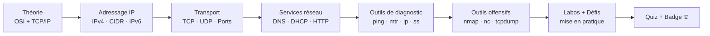
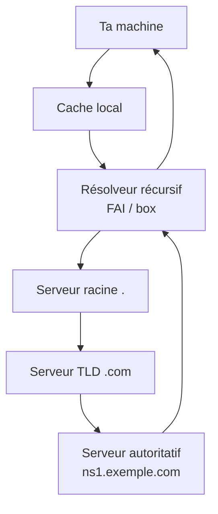
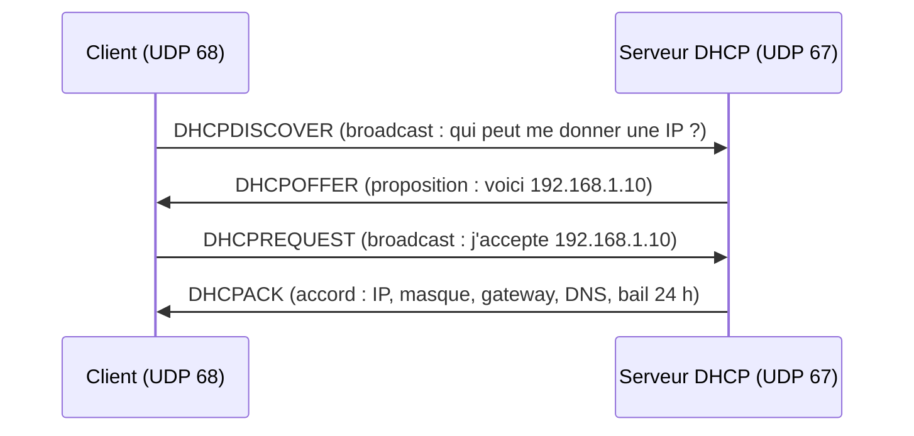
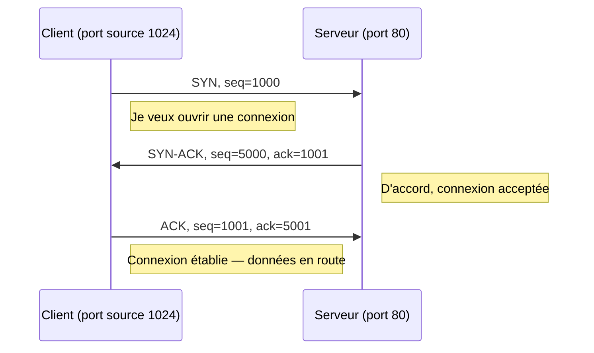
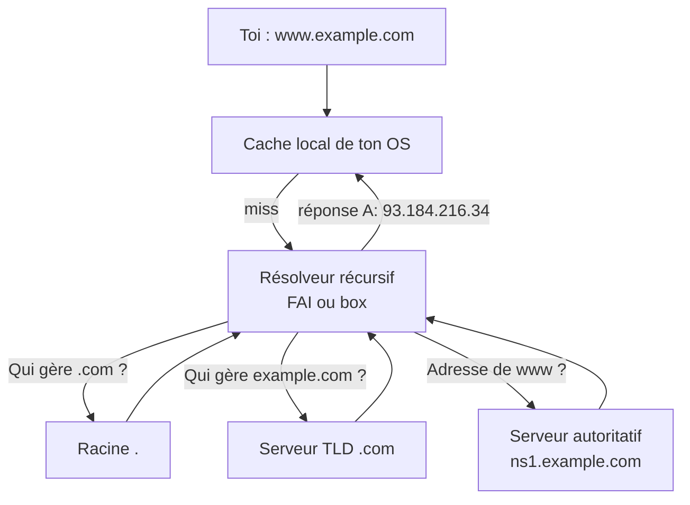
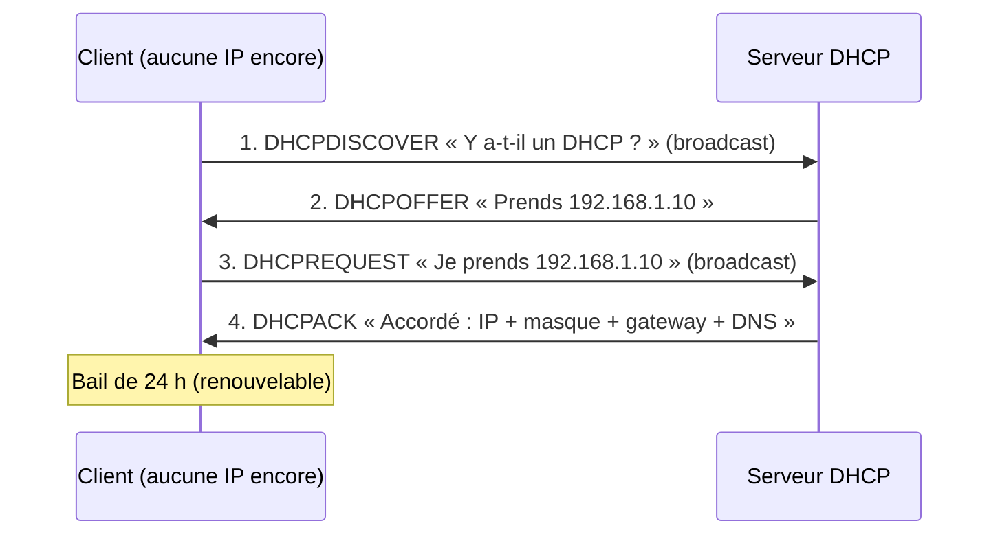
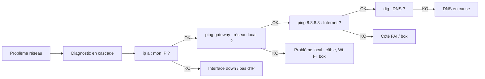

# Présentation

Bienvenue au **Niveau 2** de CyberAcademy : **Networking** (le réseau). Aux niveaux 0 et 1, tu as appris ce qu'est un ordinateur et à dompter Linux. Maintenant, on s'attaque à ce qui relie toutes les machines du monde : le réseau. Sans lui, il n'y a pas de cybersécurité du tout. Il n'y a pas d'Internet, pas d'entreprise, pas de serveur, pas d'ordinateur qui parle à un autre.

**Pourquoi apprendre le réseau en cybersécurité ?** La réponse tient en une phrase : **aucun pentest ne se fait sans réseau**. Un pentester (testeur d'intrusion) attaque des machines distantes. Ces machines sont jointes par une **adresse IP** (Internet Protocol). Les données qui y transitent sont découpées en **paquets**. Les services qu'on attaque écoutent sur des **ports**. Tout ce vocabulaire — IP, port, paquet, TCP, DNS — est la langue maternelle de la cybersécurité. Si tu ne la parles pas, tu ne pourras ni comprendre un scan, ni lire une capture réseau, ni expliquer pourquoi un serveur est vulnérable.

Pense au réseau comme au **système postal** :

| Concept réseau | Équivalent postal |
| -------------- | ----------------- |
| Adresse IP     | Adresse de la maison (ex. `192.168.1.10`) |
| Port           | Numéro de la personne à qui on s'adresse (ex. chambre 80 = service web) |
| Paquet         | Lettre dans une enveloppe |
| Routeur        | Bureau de tri qui achemine les lettres |
| DNS (Domain Name System) | Annuaire : « le nom `example.com` correspond à l'adresse 93.184.216.34 » |
| Adresse MAC (Media Access Control) | Nom exact du destinataire inscrit sur l'enveloppe (unique, gravé) |
| Gateway (passerelle) | Bureau de poste de ton quartier : la porte de sortie de ton réseau |
| TCP (Transmission Control Protocol) | Lettre avec accusé de réception : tu es sûr qu'elle est arrivée |
| UDP (User Datagram Protocol) | Carte postale : on l'envoie, et advienne que pourra |

**Où le réseau est-il utilisé en cybersécurité ?** Partout. Un analyste SOC (Security Operations Center, centre de sécurité) surveille les alertes remontées par les sondes réseau. Un pentester commence toujours par cartographier le réseau cible avec `nmap`. Un forensicien (expert en investigation numérique) analyse des captures de paquets (fichiers `pcap`) pour reconstituer une attaque. Un détective d'incident trace les connexions d'un attaquant via les journaux réseau. Même un développeur qui sécurise une API doit comprendre TCP, HTTP (HyperText Transfer Protocol) et TLS (Transport Layer Security, la couche de chiffrement du web).

**Les métiers qui en dépendent :**

| Métier | Rapport au réseau |
| ------ | ----------------- |
| Pentester (testeur d'intrusion) | Cartographie, scan de ports, exploitation de services réseau |
| SOC Analyst (analyste de centre de sécurité) | Détection d'attaques sur le trafic, analyse d'alertes |
| Network Engineer (ingénieur réseau) | Conception, configuration et durcissement des réseaux |
| Forensicien | Analyse de captures `pcap`, reconstitution de conversations |
| Red Teamer (équipe offensive avancée) | Évasion de la détection réseau, tunnelling, exfiltration |
| Threat Hunter (chasseur de menaces) | Recherche proactive de signaux faibles dans le trafic |

**Prérequis.** Ce cours suppose que tu as validé le niveau 0 (bases de l'informatique : qu'est-ce qu'un ordinateur, un OS, un processus) et le niveau 1 (Linux : terminal, permissions, `sudo`, gestion de fichiers, `grep`, lecture des processus). Rien d'autre : chaque acronyme est défini à sa première apparition, chaque commande est expliquée option par option.

- **Niveau de difficulté :** 2 / 11
- **Temps estimé :** 10 heures (théorie 3 h, démonstrations 2 h, laboratoires 2 h, défis 1 h, quiz 2 h)
- **XP :** 750
- **Badge :** 🌐 Routeur
- **Prérequis :** niveaux 0 et 1 validés
- **Métiers visés ensuite :** SOC Analyst junior, stagiaire pentest, support réseau

> 🎯 **Le pacte du cours :** à la fin, tu sauras expliquer, sans réfléchir, ce qui se passe quand tu tapes `ping google.com` — de ton doigt jusqu'aux serveurs de Google et retour. Tu sauras aussi capturer ce trajet, le lire, et repérer ce qui cloche.

---

## Objectifs pédagogiques

À la fin de ce cours, tu seras capable de :

1. **Expliquer** le modèle OSI (Open Systems Interconnection) en 7 couches et le modèle TCP/IP en 4 couches, et décrire ce qui se passe quand des données traversent les couches (encapsulation et désencapsulation).
2. **Analyser une adresse IPv4** : reconnaître sa classe et son masque, calculer le nombre d'adresses d'un sous-réseau en notation CIDR (Classless Inter-Domain Routing), et distinguer adresses privées, publiques, réservées et loopback.
3. **Distinguer TCP et UDP** : décrire le handshake (poignée de main) TCP en 3 temps, les flags (indicateurs), la notion de port, et choisir le bon protocole selon l'usage.
4. **Résoudre des noms de domaine** avec `dig`, `host` et `nslookup` : interroger chaque type d'enregistrement DNS (A, AAAA, CNAME, MX, TXT, NS, SOA) et lire une réponse complète.
5. **Diagnostiquer un réseau** avec `ping`, `mtr`, `traceroute`, `ip` et `ss` : identifier une machine inaccessible, un port fermé, une route défaillante.
6. **Scanner des ports** avec `nmap` sur des cibles que tu possèdes (ta machine, ta box) et interpréter les colonnes de sortie ; **capturer et analyser** du trafic avec `tcpdump` et `tshark`.
7. **Ouvrir une connexion et un listener** avec `nc` (netcat) et `socat`, et comprendre le rôle d'une gateway dans l'acheminement des paquets.

---

## Vue d'ensemble

Voici la feuille de route interne de ce cours. Chaque module s'appuie sur le précédent : on part des concepts abstraits (les couches), on descend dans la machinerie (adressage, transport), puis on passe à la pratique (outils, scans, captures), et on termine par la mise en situation (défis, quiz).



| Module | Contenu | Durée |
| ------ | ------- | ----- |
| 1. Théorie | OSI, TCP/IP, encapsulation | 1 h 30 |
| 2. Adressage | IPv4, classes, masques, CIDR, sous-réseaux, IPv6 | 2 h |
| 3. Transport | TCP, flags, handshake, ports, UDP | 1 h 30 |
| 4. Services | DNS, DHCP, HTTP, gateway | 1 h 30 |
| 5. Diagnostic | `ping`, `mtr`, `traceroute`, `ip`, `ss` | 1 h |
| 6. Outils | `nmap`, `nc`, `socat`, `tcpdump`, `tshark` | 1 h 30 |
| 7. Pratique | Démos, cas réels, labos, mini challenges | 1 h 30 |
| 8. Validation | Quiz et exercices | 1 h |

---

## Théorie

La théorie est le socle. Ne la survole pas : chaque notion suit le même canevas **Définition → Pourquoi → Historique → Fonctionnement → Architecture → Cas d'usage → Exemple réel → Bonnes pratiques → Résumé**. La règle d'or : **le POURQUOI d'abord, le COMMENT ensuite**. Une notion dont tu comprends la raison d'être se retient dix fois mieux.

### (a) Le modèle OSI en 7 couches

**Définition.** L'OSI (Open Systems Interconnection, interconnexion de systèmes ouverts) est un modèle de référence théorique publié par l'ISO (International Organization for Standardization, organisation internationale de normalisation) en 1984. Il découpe la communication réseau en **7 couches empilées**. Chaque couche a un rôle précis et ne parle qu'à la couche au-dessus et à celle en dessous.

**Pourquoi ?** Avant l'OSI, chaque constructeur (IBM, DEC, Xerox…) avait son réseau propriétaire, incompatible avec les autres : on ne pouvait pas relier deux marques. L'OSI a fourni un vocabulaire commun pour **parler** des réseaux. Quand un technicien dit « ça sent la couche 2 », tout le monde sait qu'il parle de la liaison (Ethernet, MAC), pas des adresses IP. C'est la langue de discussion de tous les professionnels.

**Historique.** La norme ISO 7498 est ratifiée en 1984. Elle est restée largement théorique : l'Internet réel utilise le modèle TCP/IP, plus léger. Mais l'OSI est resté l'outil pédagogique et de diagnostic universel : il structure la pensée.

**Les 7 couches (du bas vers le haut) :**

| Couche | Nom | Rôle | Exemples | Unité transmise |
| ------ | --- | ---- | -------- | --------------- |
| 7 | Application | Interface avec les logiciels utilisateur | HTTP, FTP, DNS, SMTP | Données |
| 6 | Présentation | Format des données, encodage, chiffrement | JPEG, ASCII, (historiquement SSL) | Données |
| 5 | Session | Gestion des conversations entre applications | Sockets, TLS (concept) | Données |
| 4 | Transport | Fiabilité, segmentation, ports | TCP, UDP | Segment (TCP) / Datagramme (UDP) |
| 3 | Réseau | Adressage logique, routage entre réseaux | IP, ICMP, routage | Paquet |
| 2 | Liaison de données | Adressage physique, accès au support | Ethernet, MAC, ARP, Wi-Fi (trame) | Trame |
| 1 | Physique | Signaux électriques/optiques/radio, câbles | RJ45, fibre, ondes Wi-Fi | Bit |

**Fonctionnement interne — l'encapsulation.** Quand ton navigateur demande une page, les données **descendent** la pile de couches chez l'émetteur. À chaque couche, on **ajoute un en-tête** (header) autour des données reçues d'en haut. C'est comme des poupées russes : une enveloppe mise dans une autre, mise dans une autre.

1. L'application produit les **données** (couche 7).
2. La couche transport découpe en **segments** et ajoute les numéros de port source et destination (couche 4).
3. La couche réseau encapsule le segment dans un **paquet IP** et ajoute les adresses IP source/destination (couche 3).
4. La couche liaison encapsule le paquet dans une **trame Ethernet** et ajoute les adresses MAC source/destination (couche 2).
5. La couche physique transforme la trame en **bits** sur le câble ou les ondes (couche 1).

Côté récepteur, c'est l'inverse : chaque couche lit son en-tête, le retire (**désencapsulation**), puis transmet le contenu à la couche supérieure. **Chaque couche ne lit que son propre en-tête**, exactement comme chaque bureau de tri ne lit que l'adresse qui le concerne sur l'enveloppe.

**Architecture.** La communication est *virtuellement* de couche à couche : la couche 4 source « parle » à la couche 4 destination comme si elles étaient voisines, même si les paquets traversent quinze routeurs. Les routeurs, eux, ne montent qu'à la couche 3 : ils lisent l'IP, choisissent une route, et retransmettent la trame.

**Cas d'utilisation.** Le modèle sert à **localiser un problème** : câble débranché → couche 1 ; deux machines du même réseau ne se voient pas → couche 2 ; `ping` renvoie « Réseau inaccessible » → couche 3 ; port fermé → couche 4 ; le navigateur affiche une erreur → couches 5 à 7.

**Exemple réel.** Tu ouvres `https://example.com`. Les données HTTP (couche 7) sont chiffrées par TLS (couche 5/6), segmentées en TCP (couche 4), adressées en IP (couche 3), tramées en Ethernet (couche 2), émises en bits (couche 1). La box de ton FAI ne « monte » pas au-dessus de la couche 3.

**Bonnes pratiques.** Mémorise la pile avec un moyen mnémotechnique : en anglais *« Please Do Not Throw Sausage Pizza Away »* → Physical, Data link, Network, Transport, Session, Presentation, Application. L'ordre est ce qui compte, pas la phrase.

**Résumé.** OSI = 7 couches théoriques qui décrivent chaque étape d'une communication réseau. Chaque couche encapsule les données avec son en-tête. C'est la carte d'orientation de toute l'ingénierie réseau.

### (b) TCP/IP en 4 couches et comparaison OSI / TCP/IP

**Définition.** TCP/IP (Transmission Control Protocol / Internet Protocol) est la **pile de protocoles réellement utilisée par Internet**. Plus simple que l'OSI, elle regroupe les 7 couches en 4.

**Pourquoi ?** L'OSI était trop lourd à implémenter. Les concepteurs d'Internet ont privilégié la robustesse et la simplicité : un réseau capable de survivre à la perte de nœuds entiers. La preuve : le réseau fonctionne aujourd'hui encore sur les mêmes principes.

**Historique.** ARPANET, le précurseur d'Internet (1969), interconnectait des universités. En 1974, Vinton Cerf et Robert Kahn publient le concept de TCP. En 1978, TCP est séparé d'IP. Le 1er janvier 1983 (« flag day »), tout ARPANET bascule définitivement sur TCP/IP : c'est la naissance de l'Internet moderne.

**Les 4 couches :**

| Couche TCP/IP | Équivalent OSI | Rôle | Exemples |
| ------------- | -------------- | ---- | -------- |
| 4. Application | 5 + 6 + 7 | Tout ce que l'utilisateur touche | HTTP, DNS, SMTP, DHCP, SSH |
| 3. Transport | 4 | Ports, fiabilité, segmentation | TCP, UDP |
| 2. Internet | 3 | Adressage logique, routage | IP, ICMP |
| 1. Accès réseau | 1 + 2 | Matériel et trames | Ethernet, Wi-Fi, MAC, ARP |

**Fonctionnement.** On dit « TCP/IP » alors qu'on désigne **deux protocoles complémentaires** : **IP** s'occupe de l'adressage et du routage (où aller), **TCP** s'occupe de la fiabilité (garantir que tout arrive). Le modèle porte le nom des deux.

**Architecture.** Tous les protocoles applicatifs modernes — HTTP, SMTP, SSH, FTP — s'appuient sur TCP ou UDP, eux-mêmes portés par IP. C'est une architecture **en sablier** : beaucoup de protocoles au-dessus, beaucoup de supports physiques en dessous, et un goulot d'étranglement universel au milieu (IP).

**Cas d'utilisation.** Chaque connexion à un site, chaque session SSH, chaque e-mail utilise TCP/IP sans que tu le saches. En cybersécurité, c'est aussi la base des outils : `nmap` explore des ports TCP/UDP, `tcpdump` capture des paquets IP.

**Exemple réel.** `ping 8.8.8.8` envoie une requête ICMP (Internet Control Message Protocol) portée par IP (couche Internet) sur une trame Ethernet (couche accès réseau). Aucune couche transport n'est impliquée : c'est pour cela qu'un ping fonctionne même si aucun service applicatif ne tourne.

**Comparaison OSI vs TCP/IP :**

| Critère | OSI (7 couches) | TCP/IP (4 couches) |
| ------- | --------------- | ------------------ |
| Origine | ISO, théorique (1984) | DARPA, pratique (1974-1983) |
| Utilisation réelle | Modèle de référence | C'est Internet |
| Découpage | Très détaillé | Regroupé, simple |
| Transport | Couche 4 (idéale) | TCP / UDP |
| Réseau | Couche 3 | IP |
| Intérêt | Pédagogique, diagnostic fin | Concret, robuste, universel |

**Bonnes pratiques.** Apprends OSI pour *parler* le métier et TCP/IP pour *comprendre* ce que fait réellement ta machine. Quand tu regardes `ss` ou `nmap`, tu es dans la réalité TCP/IP ; OSI reste le modèle de discussion.

**Résumé.** TCP/IP = 4 couches réelles qui font tourner Internet. IP achemine, TCP fiabilise, les applications s'appuient dessus, l'Ethernet transporte le tout. OSI est la grille de lecture pour en discuter.

### (c) Adressage IP : IPv4, classes, masque, CIDR, sous-réseaux

**Définition.** Une adresse IPv4 (Internet Protocol version 4) est un **numéro de 32 bits** attribué à chaque interface réseau, écrit en 4 octets séparés par des points (ex. `192.168.1.10`). Chaque octet va de 0 à 255. C'est l'**adresse de la maison** dans notre analogie postale.

**Pourquoi ?** Pour qu'un paquet trouve son chemin, chaque machine doit avoir une identité unique sur son réseau. Comme l'adresse postale permet au facteur de livrer, l'adresse IP permet aux routeurs de **routage** (diriger) les paquets vers la bonne destination.

**Historique.** IPv4 date de 1981 (RFC 791). Avec 32 bits, il existe 2³² = **4 294 967 296** adresses possibles — immense à l'époque, insuffisant aujourd'hui face à l'explosion d'Internet. D'où l'IPv6 (section suivante).

**Fonctionnement interne.** Une adresse IP se divise en deux parties : la partie **réseau** (l'identifiant du quartier) et la partie **hôte** (le numéro de la maison dans le quartier). La frontière entre les deux est définie par le **masque**.

**Les classes (adressage classful).** Avant le CIDR, on découpait les adresses en classes rigides :

| Classe | Premier octet | Masque par défaut | Usage | Plages réseau |
| ------ | ------------- | ----------------- | ----- | ------------- |
| A | 0–127 | /8 = `255.0.0.0` | Très grands réseaux | 1.0.0.0 à 126.0.0.0 (127 réservé au loopback) |
| B | 128–191 | /16 = `255.255.0.0` | Moyennes entreprises | 128.0.0.0 à 191.255.0.0 |
| C | 192–223 | /24 = `255.255.255.0` | Petits réseaux / LAN | 192.0.0.0 à 223.255.255.0 |
| D | 224–239 | — | Multicast (diffusion groupée) | — |
| E | 240–255 | — | Expérimentation / réservé | — |

**Le masque de sous-réseau.** Le masque est une suite de bits à 1 suivie de bits à 0. `255.255.255.0` en binaire = `11111111.11111111.11111111.00000000`. Les bits à 1 marquent la partie réseau ; les bits à 0 (partie hôte) indiquent combien de machines peuvent vivre dans le quartier.

**La notation CIDR (Classless Inter-Domain Routing).** Depuis 1993 (RFC 1519), on remplace le masque par une barre suivie du **nombre de bits réseau** : `/24` équivaut à `255.255.255.0`, `/16` à `255.255.0.0`, `/8` à `255.0.0.0`. Les classes rigides ont disparu : on peut faire du `/25`, du `/27`, etc. C'est la norme moderne.

**Correspondances à connaître par cœur :**

| CIDR | Masque | Nb d'adresses | Nb d'hôtes utilisables |
| ---- | ------ | ------------- | ---------------------- |
| /8 | 255.0.0.0 | 16 777 216 | 16 777 214 |
| /16 | 255.255.0.0 | 65 536 | 65 534 |
| /24 | 255.255.255.0 | 256 | 254 |
| /25 | 255.255.255.128 | 128 | 126 |
| /26 | 255.255.255.192 | 64 | 62 |
| /27 | 255.255.255.224 | 32 | 30 |
| /28 | 255.255.255.240 | 16 | 14 |
| /30 | 255.255.255.252 | 4 | 2 |

**Calcul de base.** Dans un réseau `192.168.1.0/24` :
- **Adresse réseau** : `192.168.1.0` (tous les bits hôte à 0) — non attribuable.
- **Premier hôte** : `192.168.1.1`.
- **Dernier hôte** : `192.168.1.254`.
- **Adresse de diffusion (broadcast)** : `192.168.1.255` (tous les bits hôte à 1) — non attribuable.

Formule : **nb d'hôtes utilisables = 2^(32 − CIDR) − 2**. Pour /24 : 2⁸ − 2 = 254.

**Adresses privées et réservées (RFC 1918).** Certaines plages ne sont **jamais routées sur Internet** : elles sont réservées aux réseaux locaux. C'est pour cela que ta box t'attribue une adresse en `192.168.x.x` : adresse privée, traduite en adresse publique par le NAT (Network Address Translation, traduction d'adresses réseau) de la box quand tu sors sur Internet.

| Plage | CIDR | Rôle |
| ----- | ---- | ---- |
| 10.0.0.0 – 10.255.255.255 | 10.0.0.0/8 | Privée (grands réseaux d'entreprise) |
| 172.16.0.0 – 172.31.255.255 | 172.16.0.0/12 | Privée (moyennes entreprises) |
| 192.168.0.0 – 192.168.255.255 | 192.168.0.0/16 | Privée (réseaux domestiques) |
| 127.0.0.0 – 127.255.255.255 | 127.0.0.0/8 | Loopback : ta propre machine |
| 169.254.0.0 – 169.254.255.255 | 169.254.0.0/16 | Link-local : aucune réponse DHCP |
| 0.0.0.0/8 | 0.0.0.0/8 | « Ce réseau », adresse indéfinie |
| 224.0.0.0 – 239.255.255.255 | 224.0.0.0/4 | Multicast |
| 240.0.0.0 – 255.255.255.255 | 240.0.0.0/4 | Réservé / expérimental |

**Le loopback `127.0.0.1`.** Cette adresse désigne **ta propre machine**, alias `localhost`. Un paquet vers 127.0.0.1 ne quitte jamais ta carte réseau : il est traité localement. Idéal pour tester ses propres services en toute sécurité, sans sortir de la machine.

**Architecture.** En LAN (Local Area Network, réseau local), les machines utilisent des adresses privées partageant le même numéro de réseau (même masque). Le routeur/gateway fait le pont entre ton réseau privé et Internet via le NAT.

**Cas d'utilisation.** Quand tu configures un serveur, tu le lies à une adresse. Quand tu scannes, tu choisis une cible dans une plage. Quand tu analyses une alerte SOC, l'adresse IP source est la toute première donnée que tu regardes.

**Exemple réel.** Ta box, en `192.168.1.1/24`, attribue `192.168.1.10` à ton PC via DHCP. Tu vérifies avec `ip a`. Vers `192.168.1.1`, tu restes dans le quartier ; vers `8.8.8.8`, le paquet part par la gateway.

**Bonnes pratiques.** Toujours savoir si une IP est privée ou publique : en recon (reconnaissance), une adresse privée = réseau interne, pas d'exposition directe sur Internet. Calcule mentalement /24, /16, /8. Vérifie ton adresse avec `ip a` avant tout scan.

**Résumé.** IPv4 = 32 bits, deux parties (réseau + hôte) séparées par le masque. La notation CIDR `/N` remplace les classes. Certaines plages sont privées, `127.0.0.1` est toi-même. Sans adressage, pas de routage.

### (d) IPv6 en bref

**Définition.** IPv6 (Internet Protocol version 6) est la version 128 bits du protocole IP, écrite en **8 groupes de 4 chiffres hexadécimaux** séparés par des deux-points : `2001:0db8:85a3:0000:0000:8a2e:0370:7334`.

**Pourquoi ?** Épuisement des adresses IPv4 (4,3 milliards). IPv6 en fournit 2¹²⁸, soit environ **340 sextillions** : de quoi adresser chaque grain de sable de la Terre des milliers de fois.

**Historique.** Normalisée en 1998 (RFC 2460), adoptée progressivement. Les FAI et les géants du web (Google, Facebook, Netflix) sont passés depuis longtemps ; certains réseaux mobiles sont en IPv6-only.

**Fonctionnement et astuces d'écriture :**
- Chaque groupe est en hexadécimal (0–9, a–f).
- Les groupes de zéros se compressent avec `::` (une seule fois) : `fe80::1` = `fe80:0:0:0:0:0:0:1`.
- Le loopback IPv6 est `::1`.
- Les adresses link-local commencent par `fe80::/10` (équivalent du 169.254 en IPv4).
- Les adresses locales uniques commencent par `fc00::/7` (équivalent du privé RFC 1918).
- Le préfixe se note comme le CIDR : `/64` pour un réseau standard.

**Cas d'utilisation.** En cybersécurité, il est crucial de se rappeler que **nmap, tcpdump et les pare-feu traitent IPv6 différemment**. Un pentester doit scanner IPv4 **et** IPv6 (`nmap -6`). Un pare-feu qui ne filtre que l'IPv4 laisse passer l'IPv6.

**Exemple réel.** `ip -6 addr` affiche tes adresses IPv6 : une `fe80::…` (lien local) et éventuellement une `2001:…` (globale).

**Bonnes pratiques.** Ne pas l'ignorer : une part croissante du trafic Internet est en IPv6. Vérifie toujours le trafic v6 (`ss -6`, `tcpdump` filtre `ip6`, `nmap -6`).

**Résumé.** IPv6 = 128 bits, écriture hexadécimale, `::` compresse les zéros, même logique qu'IPv4. Ne jamais l'oublier dans un scan ou une capture.

### (e) TCP en profondeur

**Définition.** TCP (Transmission Control Protocol) est un protocole de couche transport **orienté connexion et fiable** : avant d'échanger des données, les deux machines établissent une connexion, et chaque segment envoyé est **accusé de réception** par le destinataire.

**Pourquoi ?** Quand tu télécharges un fichier, tu veux qu'il arrive **entier**, dans le bon ordre, sans doublon. IP ne garantit rien : les paquets peuvent se perdre, se croiser, se dupliquer. TCP comble ce manque de fiabilité. C'est le service de livraison avec **accusé de réception signé**.

**Historique.** TCP est né en 1974 (Cerf & Kahn), séparé d'IP en 1978, décrit par la RFC 793 (1981). La version actuelle est restée remarquablement stable.

**Fonctionnement interne — les segments.** TCP découpe les données en **segments**, chacun numéroté avec un **numéro de séquence** (sequence number) et un **numéro d'acquittement** (acknowledgement number). Le destinataire renvoie des **ACK** (acquittements) pour confirmer la réception. Les segments sont encapsulés dans des paquets IP.

**Les flags (indicateurs) TCP.** L'en-tête TCP fait au minimum 20 octets et porte des drapeaux (flags) d'un bit chacun :

| Flag | Nom complet | Rôle |
| ---- | ----------- | ---- |
| SYN | Synchronize | Demander / ouvrir une connexion |
| ACK | Acknowledgment | Acquitter (confirmer) des données reçues |
| FIN | Finish | Demander la fermeture propre de la connexion |
| RST | Reset | Abandonner ou refuser brutalement la connexion |
| PSH | Push | Livrer immédiatement les données à l'application |
| URG | Urgent | Données urgentes prioritaires |

**Le handshake (poignée de main) en 3 temps.** Pour établir une connexion, les deux parties procèdent à l'échange **SYN → SYN-ACK → ACK** (le « 3-way handshake ») :

1. Le client envoie **SYN** (seq = x) : « Je veux te parler, je m'appelle x. »
2. Le serveur répond **SYN-ACK** (seq = y, ack = x+1) : « D'accord, moi c'est y, j'ai bien reçu ton x. »
3. Le client envoie **ACK** (ack = y+1) : « Bien reçu ton y. On est en ligne. »

Désormais, les deux peuvent envoyer des données. **C'est exactement le signal vu par les défenseurs lors d'un scan** : un SYN sans suite est suspect.

**La fermeture en 4 temps.** À la fin de la conversation : A envoie **FIN**, B répond **ACK** puis **FIN**, A renvoie **ACK**. La connexion se ferme proprement, chaque côté confirmant l'arrêt.

**Les ports.** Un ordinateur a une seule IP (une maison) mais plusieurs services (plusieurs personnes). Le **port** est le numéro qui identifie la « personne », c'est-à-dire le service applicatif. L'association IP + port forme un **socket** (`192.168.1.10:443`). Il existe 65 535 ports par IP (2¹⁶ − 1).

| Gamme de ports | Nom | Usage |
| -------------- | --- | ----- |
| 0 – 1023 | Well-known (ports privilégiés) | Services système/standards ; sur Linux, ouvrir un port < 1024 exige souvent `root` |
| 1024 – 49151 | Registered (enregistrés) | Applications et services commerciaux |
| 49152 – 65535 | Dynamic / ephemeral (dynamiques) | Ports sources temporaires choisis par l'OS |

**Ports well-known à connaître :**

| Port | Protocole | Service |
| ---- | --------- | ------- |
| 20/21 | TCP | FTP (File Transfer Protocol, transfert de fichiers) |
| 22 | TCP | SSH (Secure Shell, shell chiffré) |
| 23 | TCP | Telnet (terminal non chiffré, obsolète) |
| 25 | TCP | SMTP (Simple Mail Transfer Protocol, envoi de mail) |
| 53 | TCP/UDP | DNS (Domain Name System, résolution de noms) |
| 67/68 | UDP | DHCP (Dynamic Host Configuration Protocol, attribution d'IP) |
| 80 | TCP | HTTP (web non chiffré) |
| 110 | TCP | POP3 (réception de mail) |
| 143 | TCP | IMAP (réception de mail) |
| 443 | TCP | HTTPS (web chiffré) |
| 445 | TCP | SMB (Server Message Block, partage de fichiers Windows) |
| 3306 | TCP | MySQL / MariaDB |
| 3389 | TCP | RDP (Remote Desktop Protocol, bureau distant) |
| 5432 | TCP | PostgreSQL |
| 6379 | TCP | Redis |
| 8080 | TCP | HTTP alternatif (proxy, dev) |

**Cas d'utilisation.** Web (HTTP/HTTPS), SSH, e-mail, transfert de fichiers : tout ce qui doit être **fiable** passe par TCP. En pentest, un port TCP ouvert sur une machine distante est une **porte d'entrée potentielle**.

**Exemple réel.** `ss -t` affiche les connexions TCP actives ; `ss -tlnp` liste les services TCP **en écoute** avec leur port et leur processus — la première chose que regarde un pentester.

**Bonnes pratiques.** Retenir les ports majeurs (22, 53, 80, 443, 445, 3306, 3389). Comprendre qu'un scan SYN (`nmap -sS`) détecte les ports ouverts **sans terminer** le handshake : c'est l'outil de base du pentester.

**Résumé.** TCP = fiable, orienté connexion, segmenté, avec accusé de réception. Handshake en 3 temps, fermeture en 4. Chaque service est identifié par un port.

### (f) UDP : datagrammes et cas d'usage

**Définition.** UDP (User Datagram Protocol) est un protocole de couche transport **sans connexion et non fiable** : il envoie des **datagrammes** (paquets autonomes) sans établir de connexion, sans accusé de réception, sans réordonnancement. C'est la **carte postale** : on l'envoie, et advienne que pourra.

**Pourquoi ?** Parfois la vitesse compte plus que la fiabilité. Pour une conversation vocale (VoIP, Voice over IP) ou une vidéo en direct, un paquet en retard est pire qu'un paquet perdu : mieux vaut sauter une image que d'attendre une retransmission. UDP supprime toute la lourdeur de TCP.

**Historique.** UDP a été défini en 1980 (RFC 768) par David Reed, en réaction au « poids » de TCP pour certaines applications. En-tête minimaliste : **8 octets** seulement (ports source/destination, longueur, checksum).

**Fonctionnement interne.** Chaque datagramme est indépendant : il porte ses adresses IP source/destination et ses ports, mais **aucun numéro de séquence, aucune connexion**. S'il est perdu en route, personne ne le sait, personne ne le renvoie.

**Cas d'usage typiques :**
- **DNS** : une requête de résolution tient dans un datagramme ; on retente si pas de réponse.
- **DHCP** : attribution d'IP, échange broadcast rapide.
- **VoIP** (Voice over IP) : téléphonie sur Internet, tolérante aux pertes.
- **Streaming vidéo** : jeux en ligne, visioconférence, flux en direct.
- **SNMP** (Simple Network Management Protocol) : supervision réseau.
- **TFTP** (Trivial File Transfer Protocol) : transfert simple sans authentification.

**Comparaison TCP vs UDP :**

| Critère | TCP | UDP |
| ------- | --- | --- |
| Connexion | Orienté connexion (handshake) | Sans connexion |
| Fiabilité | Fiable (accusés de réception) | Non fiable (aucune garantie) |
| Ordre | Garanti (numéros de séquence) | Non garanti |
| Vitesse | Plus lent (surcoût) | Plus rapide (léger) |
| En-tête | 20 octets minimum | 8 octets |
| Retransmission | Oui | Non |
| Flux | Flux continu de données | Datagrammes indépendants |
| Usages | Web, SSH, mail, transferts | DNS, DHCP, VoIP, streaming, jeux |
| Visibilité pour les défenseurs | Handshake SYN visible | Plus discrète |

**Exemple réel.** `ss -ulnp` liste les ports UDP en écoute. `dig` envoie ses requêtes en **UDP par défaut** (port 53) ; ce n'est qu'en cas de réponse tronquée qu'il bascule en TCP.

**Bonnes pratiques.** Besoin de fiabilité (transfert de fichiers, authentification) → TCP. L'application tolère les pertes et privilégie la latence → UDP. Retiens : **courrier fiable = TCP, carte postale = UDP**.

**Résumé.** UDP = rapide, léger, sans connexion, sans garantie. Idéal quand la fraîcheur prime sur la perfection. DNS et DHCP reposent dessus.

### (g) ICMP : ping et erreurs

**Définition.** ICMP (Internet Control Message Protocol) est le protocole de **messages de contrôle** du réseau : il sert à **tester** et à **signaler des erreurs**, mais ne transporte aucune donnée applicative. Il est porté directement par IP, sans TCP ni UDP.

**Pourquoi ?** Les routeurs et les machines ont besoin d'un canal pour signaler des problèmes : « destination inaccessible », « temps dépassé », « écho » pour tester. ICMP est ce canal : la **sonnette et le talkie-walkie** du réseau.

**Historique.** ICMP est défini avec IP en 1981 (RFC 792). Le `ping` (Packet Internet Groper), inventé par Mike Muuss en 1983, en est l'usage le plus célèbre.

**Fonctionnement interne.** Chaque message ICMP porte un **type** et un **code** :

| Type | Nom | Usage |
| ---- | --- | ----- |
| 0 | Echo Reply | Réponse à un ping |
| 3 | Destination Unreachable | Destination injoignable (code 3 = port fermé) |
| 8 | Echo Request | La requête envoyée par ping |
| 11 | Time Exceeded | TTL épuisé (utilisé par traceroute) |

**Le ping en détail.** `ping <destination>` envoie une requête ICMP Echo Request (type 8) ; si la destination est joignable et autorise ICMP, elle répond Echo Reply (type 0). Le temps de réponse (**RTT**, Round Trip Time) est mesuré en millisecondes. Les statistiques finales (paquets envoyés/reçus, perte, min/moy/max) sont la mesure de santé du lien.

**Le TTL (Time To Live).** Chaque paquet IP porte un TTL (durée de vie) **décrémenté de 1 à chaque routeur traversé**. Quand il atteint 0, le routeur jette le paquet et renvoie un ICMP « Time Exceeded ». C'est le bouclier anti-boucles : sans lui, un paquet perdu tournerait en rond éternellement. C'est aussi la base de `traceroute`.

**Cas d'utilisation.** Tester la connectivité (`ping`), tracer un chemin (`traceroute`, `mtr`), diagnostiquer des erreurs (port fermé → ICMP type 3 code 3 ; réseau inaccessible → type 3 code 0).

**Exemple réel.** `ping -c 4 8.8.8.8` envoie 4 requêtes. `4 packets transmitted, 4 received, 0% packet loss` = lien sain. `Destination Host Unreachable` = un routeur ne connaît pas la route.

**Bonnes pratiques.** Méfie-toi : **beaucoup de pare-feu bloquent ICMP**. Un ping qui échoue ne prouve pas que la machine est morte : le port 443 peut être ouvert alors que le ping est filtré. En revanche, le loopback répond toujours.

**Résumé.** ICMP = protocole de contrôle (écho, erreurs, TTL). `ping` teste la connectivité, `traceroute` exploite le TTL. Pas de réponse au ping ≠ machine éteinte.

### (h) La couche liaison : MAC et ARP

**Définition.** La couche 2 (liaison de données) gère la communication **au sein d'un même réseau physique**. Deux adresses la gouvernent : la **MAC** (Media Access Control) et l'**ARP** (Address Resolution Protocol).

**L'adresse MAC.** Adresse **physique**, gravée en usine sur la carte réseau, sur **48 bits** (6 octets en hexadécimal), format `AA:BB:CC:DD:EE:FF`. Les 3 premiers octets identifient le fabricant (OUI, Organizationally Unique Identifier). C'est **le nom exact du destinataire sur l'enveloppe** : unique et définitif.

**Pourquoi la MAC existe ?** IP est l'adresse logique (la rue) ; la MAC est l'adresse physique (le nom sur la porte). Les cartes réseau ne savent « parler » qu'avec les MAC. Il faut donc traduire IP → MAC pour émettre une trame.

**ARP (Address Resolution Protocol).** C'est le protocole de **traduction IP → MAC** au sein d'un même réseau :

1. La machine A veut joindre B (IP `192.168.1.5`) mais ignore sa MAC.
2. A diffuse un **ARP request broadcast** : « Qui est 192.168.1.5 ? Donne-moi ta MAC. »
3. B répond en **unicast** : « C'est moi, voici ma MAC `cc:dd:ee:ff:00:11`. »
4. A mémorise le couple (IP, MAC) dans sa **table ARP** (cache), consultée via `ip neigh` (ou l'ancienne `arp -a`).

**Le spoofing ARP (en bref).** ARP n'est pas authentifié : un attaquant du même réseau peut répondre « je suis le routeur » à tout le monde. Il **empoisonne les tables ARP** et **intercepte tout le trafic local** (attaque de l'homme du milieu, MITM). Classique du pentest local — et la raison des protections (ARP statique, VLANs, détection). On y reviendra aux niveaux supérieurs.

**Cas d'utilisation.** Tout échange Ethernet passe par la MAC. Dans `tcpdump`, un `who has 192.168.1.1? tell 192.168.1.10` est un ARP request.

**Exemple réel.** `ip neigh show` affiche ta table ARP : tu y verras la gateway associée à sa MAC. Si tu `ping 192.168.1.1`, `tcpdump -i eth0` montre l'ARP request **avant** les paquets ICMP.

**Bonnes pratiques.** Comprendre que **ARP ne traverse pas les routeurs** : à chaque saut, la MAC change, mais l'IP reste. Dans un ping vers l'extérieur, `tcpdump` montre : ARP vers la gateway → MAC source de la gateway → IP de la destination dans le paquet.

**Résumé.** Couche 2 = MAC (adresse physique unique) + ARP (traduction IP → MAC locale). ARP est fragile : son spoofing est une arme de l'attaque locale.

### (i) DNS en profondeur

**Définition.** Le DNS (Domain Name System, système de noms de domaine) est l'**annuaire téléphonique d'Internet** : il traduit des noms lisibles (`www.example.com`) en adresses IP (`93.184.216.34`). Sans lui, on devrait retenir 32 chiffres pour chaque site.

**Pourquoi ?** Les humains retiennent des mots, les machines des nombres. Le DNS fait le pont. C'est aussi le premier service dont on s'aperçoit la panne : sans DNS, Internet devient inutilisable malgré des réseaux sains.

**Historique.** Avant 1983, un fichier central `HOSTS.TXT` était copié sur chaque machine — intenable face à la croissance. Paul Mockapetris a inventé le DNS en 1983 (RFC 1034/1035) : un système **distribué et hiérarchique**, où personne ne connaît tout mais chacun sait où demander.

**Fonctionnement interne — la résolution.** Quand tu tapes `example.com` :

1. **Cache local** : ton OS et ton navigateur gardent les réponses en mémoire (le TTL des enregistrements). Si la réponse est en cache, on s'arrête là.
2. **Serveur récursif** : sinon, ta machine interroge le résolveur de ton réseau (souvent la box ou celui du FAI), qui cherche pour toi.
3. **Serveur racine (root)** : le résolveur demande aux serveurs racines « Qui gère `.com` ? ».
4. **Serveur TLD** : les racines indiquent les serveurs du TLD (Top-Level Domain : `.com`, `.org`, `.fr`…).
5. **Serveur autoritatif** : le TLD indique les serveurs autoritatifs de `example.com`, qui connaissent la vraie réponse.
6. La réponse remonte jusqu'à ta machine, qui la met en cache.

**La hiérarchie :**



**Les types d'enregistrements :**

| Type | Nom complet | Rôle | Exemple |
| ---- | ----------- | ---- | ------- |
| A | Address | IPv4 d'un nom | `example.com. A 93.184.216.34` |
| AAAA | Quad-A | IPv6 d'un nom | `example.com. AAAA 2606:2800:…` |
| CNAME | Canonical Name | Alias vers un autre nom | `www.example.com. CNAME example.com.` |
| MX | Mail eXchange | Serveur de mail + priorité | `example.com. MX 10 mail.example.com.` |
| TXT | Text | Texte libre (SPF, vérifications, etc.) | `example.com. TXT "v=spf1 …"` |
| NS | Name Server | Serveur autoritatif du domaine | `example.com. NS ns1.example.com.` |
| SOA | Start of Authority | Paramètres maîtres de la zone | séries, rafraîchissements |
| PTR | Pointer | Inverse : IP → nom (pour `dig -x`) | `34.216.184.93.in-addr.arpa. PTR …` |

**Les outils de consultation.**

```bash
dig example.com                  # réponse complète, type A par défaut
dig example.com MX               # enregistrements MX
dig example.com TXT              # enregistrements TXT
dig example.com NS               # serveurs de noms
dig example.com SOA              # enregistrement SOA
dig -x 8.8.8.8                   # résolution inverse (PTR)
dig @1.1.1.1 example.com         # interroger un résolveur précis
dig +short example.com           # juste la valeur, sans bruit
dig +noall +answer example.com   # uniquement la section ANSWER
host example.com                 # version simple
host -t MX example.com           # type MX avec host
nslookup example.com             # version héritée
```

**Cas d'utilisation.** En pentest, la **reconnaissance DNS** est la première étape : énumérer les sous-domaines, trouver l'IP derrière un site, repérer des enregistrements TXT qui fuient des informations. En SOC, une requête DNS vers un domaine malveillant est un indicateur d'attaque classique.

**Exemple réel.** `dig +short example.com` renvoie l'IP. `dig -x <IP>` fait l'inverse. `dig example.com TXT` révèle souvent l'enregistrement SPF (Sender Policy Framework), qui liste les serveurs de mail autorisés — information utile en recon.

**Bonnes pratiques.** Utiliser `dig`, plus riche et fiable que `nslookup`. Toujours lire la section **ANSWER** (la vraie réponse), **AUTHORITY** (les serveurs de noms), et le champ **STATUS** (`NOERROR` = le nom existe, `NXDOMAIN` = n'existe pas, `SERVFAIL` = problème autoritatif). Vérifier le TTL pour juger de la fraîcheur.

**Résumé.** DNS = annuaire hiérarchique et distribué (racine → TLD → autoritatif). Chaque type d'enregistrement a un rôle. `dig` est l'outil roi. En sécurité, le DNS est une mine d'or de reconnaissance et un vecteur d'attaque (phishing, exfiltration).

### (j) DHCP : fonctionnement DORA

**Définition.** DHCP (Dynamic Host Configuration Protocol) attribue automatiquement les paramètres réseau (IP, masque, gateway, DNS) aux machines d'un réseau. Fini la configuration manuelle.

**Pourquoi ?** Imagine devoir taper à la main l'IP, le masque et la passerelle sur 2 000 postes d'une entreprise — avec le risque de doublons. DHCP automatise tout : tu branches, tu as une IP.

**Historique.** Prédécesseur BOOTP (1985), puis DHCP en 1993 (RFC 2131). C'est lui qui distribue les `192.168.1.x` de ta box.

**Fonctionnement — le cycle DORA (4 étapes).** Le client n'a aucune IP au départ : il parle en **broadcast** (UDP, port client 68 vers port serveur 67).

1. **D**iscover : le client diffuse « Y a-t-il un serveur DHCP ici ? ».
2. **O**ffer : le serveur répond « Je te propose l'IP 192.168.1.10 pour 24 h ».
3. **R**equest : le client répond « J'accepte l'IP 192.168.1.10 ».
4. **A**ck : le serveur confirme « Accordé ! Voici masque, gateway et DNS ».

L'adresse est prêtée pour un **bail** (lease) : elle expire et peut être renouvelée. Si aucun serveur ne répond, la machine se donne une IP link-local `169.254.x.x` : le signe typique d'un réseau sans DHCP.



**Cas d'utilisation.** Tout réseau local moderne. En sécurité, un attaquant peut lancer son **propre serveur DHCP** (rogue DHCP) pour rediriger les victimes vers lui et capturer leur trafic : une technique de MITM local.

**Exemple réel.** Débranche la box et renouvelle l'adresse de ta carte : ta machine récupère `169.254.x.x`. Rebranche : elle refait un DORA et retrouve son IP. Observe avec `tcpdump -i eth0 port 68 or port 67`.

**Bonnes pratiques.** En labo, une IP statique doit être choisie **hors de la plage DHCP** pour éviter les conflits. Vérifie ton bail avec `ip a` (durée du bail) ou les outils de ton système (`dhclient`).

**Résumé.** DHCP = attribution automatique d'IP via DORA (Discover, Offer, Request, Acknowledge). Ports UDP 67/68. Une IP `169.254.x.x` = pas de DHCP.

### (k) HTTP de base

**Définition.** HTTP (HyperText Transfer Protocol) est le protocole de couche application du **web** : il définit comment un navigateur **demande** une ressource et comment un serveur **répond**. HTTPS = HTTP chiffré avec TLS (Transport Layer Security) sur le port 443.

**Pourquoi ?** Le web est un dialogue simple : « Donne-moi la page /accueil » → « La voilà (200 OK) » ou « Introuvable (404) ». HTTP est ce dialogue, formalisé pour que n'importe quel navigateur parle à n'importe quel serveur.

**Historique.** Inventé par Tim Berners-Lee au CERN en 1989-1991. HTTP/1.1 normalisé en 1997 (RFC 2616), puis HTTP/2 (2015) et HTTP/3 (2022, sur UDP/QUIC). Le niveau 4 du cursus l'explorera en détail.

**Fonctionnement interne — requête et réponse.** Une requête HTTP est du texte :

```http
GET /index.html HTTP/1.1
Host: example.com
User-Agent: Mozilla/5.0
```

Une réponse HTTP :

```http
HTTP/1.1 200 OK
Content-Type: text/html
Content-Length: 1256

<!DOCTYPE html>...
```

**Les méthodes (verbes HTTP) :**

| Méthode | Rôle |
| ------- | ---- |
| GET | Récupérer une ressource (lecture) |
| POST | Envoyer des données au serveur (création) |
| PUT | Remplacer une ressource |
| PATCH | Modifier partiellement |
| DELETE | Supprimer |
| HEAD | Comme GET, sans le corps de réponse |
| OPTIONS | Décrire les méthodes autorisées |

**Les codes de statut (status codes) :**

| Gamme | Famille | Exemples |
| ----- | ------- | -------- |
| 1xx | Information | 100 Continue |
| 2xx | Succès | 200 OK, 201 Created, 204 No Content |
| 3xx | Redirection | 301 Moved Permanently, 302 Found, 304 Not Modified |
| 4xx | Erreur client | 400 Bad Request, 401 Unauthorized, 403 Forbidden, 404 Not Found, 405 Method Not Allowed |
| 5xx | Erreur serveur | 500 Internal Server Error, 502 Bad Gateway, 503 Service Unavailable, 504 Gateway Timeout |

**Cas d'utilisation en cybersécurité.** La distinction **403 (interdit mais le fichier existe)** vs **404 (n'existe pas)** est un outil de reconnaissance : le serveur révèle des ressources cachées. Les méthodes autorisées (via `OPTIONS`) révèlent des vecteurs (ex. PUT non sécurisé). Le niveau 4 approfondira tout cela.

**Exemple réel.** `nc -v example.com 80` puis tape `GET / HTTP/1.1`, `Host: example.com`, deux retours à la ligne : tu obtiens la réponse HTTP brute. Plus simple : `curl -v http://example.com` (détaillé au niveau 3).

**Bonnes pratiques.** Retenir les codes clés : 200, 301, 403, 404, 500. En capture (`tcpdump -A`), HTTP **en clair** est lisible par tout le monde : jamais de mot de passe en HTTP nu. Toujours HTTPS.

**Résumé.** HTTP = protocole texte du web (méthodes + codes de statut). GET/POST et les gammes 2xx/4xx/5xx sont les indispensables. Le niveau 4 le décortique.

### (l) Les outils de diagnostic réseau

On passe aux mains dans le cambouis. Chaque outil a un rôle précis ; tous sont réels et présents sur toute distribution Linux sérieuse (installation : `sudo apt install <paquet>` si besoin).

| Outil | Rôle principal | Exemple minimal |
| ----- | -------------- | --------------- |
| `ping` | Tester la connectivité (ICMP) | `ping -c 4 8.8.8.8` |
| `mtr` | Tracer le chemin en continu (ping + traceroute) | `mtr -t 8.8.8.8` |
| `traceroute` | Cartographier le chemin par sauts (TTL) | `traceroute -n 8.8.8.8` |
| `ip` | Voir/configurer interfaces, routes, tables ARP | `ip a`, `ip route` |
| `ss` | Lister les sockets (connexions et écouteurs) | `ss -tulpn` |
| `netstat` | Ancien équivalent de `ss` | `netstat -tulpn` |
| `dig` / `host` / `nslookup` | Interroger le DNS | `dig example.com` |
| `whois` | Qui possède un domaine / une plage IP | `whois example.com` |
| `nmap` | Scanner ports et services | `nmap -sV localhost` |
| `tcpdump` / `tshark` | Capturer et analyser le trafic | `tcpdump -i eth0 -c 10` |
| `nc` / `socat` | Connexions brutes, listeners, tests de ports | `nc -lvnp 4444` |
| `arp` / `ip neigh` | Table ARP (IP → MAC) | `ip neigh show` |
| `openssl s_client` | Inspecter un certificat TLS | `openssl s_client -connect example.com:443` |

**Détails des options essentielles.**

`ping` : `-c` (nombre de paquets), `-i` (intervalle en secondes ; < 0,2 s exige root), `-W` (délai d'attente), `-s` (taille de paquet), `-D` (horodatage). Code de retour : 0 = au moins une réponse, 1 = aucune, 2 = erreur.

`mtr` : combine `ping` et `traceroute` en une vue temps réel (saut, perte %, moyenne). `-t` (sortie texte), `-r` (rapport unique, idéal en script), `-c 10` (10 cycles), `-n` (pas de résolution DNS).

`traceroute` : envoie par défaut des datagrammes UDP vers des ports élevés en incrémentant le TTL de 1 en 1 ; chaque saut qui renvoie « Time Exceeded » est affiché. `-I` (ICMP, exige root), `-T` (TCP), `-n` (numérique), `-m` (hops max), `-w` (temps d'attente), `-q` (nombre de sondes par saut), `-p` (port de départ).

`ip` : `ip a` ou `ip addr` (interfaces + adresses), `ip route` (tables de routage), `ip neigh` (table ARP), `ip link` (état des interfaces). Ajoute `-4` ou `-6` pour filtrer la famille d'adresses.

`ss` : `-t` (TCP), `-u` (UDP), `-l` (en écoute uniquement), `-a` (tout), `-n` (numérique, pas de DNS), `-p` (processus, parfois root), `-s` (statistiques). Le combo classique : `ss -tulpn`.

`netstat` : ancienne commande, mêmes idées : `netstat -tulpn`. Présente par compatibilité ; préférer `ss`.

`nmap` : `-sS` (scan SYN, root), `-sT` (scan connect, sans root), `-sU` (UDP), `-sV` (versions de services), `-O` (détection d'OS, root), `-p 80,443` ou `-p-` (tous ports), `-T0..-T5` (vitesse), `-sn` (ping scan, sans scan de ports), `-Pn` (skip ping), `-A` (agressif : OS + version + scripts), `--top-ports 100`, `-oN/-oG/-oX` (sorties de rapport). **Réservé aux cibles que tu possèdes.**

`tcpdump` : `-i <iface>` (interface, `any` = toutes), `-w fichier.pcap` (écrire), `-r fichier.pcap` (lire), `-c N` (N paquets), `-A` (ASCII), `-XX` (hex + ASCII), `-n` (pas de résolution), `-v/-vv` (verbose). Filtres : `host x`, `port 80`, `tcp`, `udp`, `icmp`, `src`, `dst`, combinaisons `and` / `or` / `not` entre parenthèses. **Exige root.**

`tshark` : la version terminal de Wireshark. `-r` (lire), `-i` (capturer), `-w` (écrire), `-c` (limite), `-Y 'http'` (filtre d'affichage Wireshark), `-T fields -e http.request.uri` (extraire des champs), `-z` (statistiques). Exige root pour capturer.

`nc` (netcat) : `-l` (listener), `-p` (port), `-v` (verbose), `-n` (numérique), `-z` (scan, zero I/O), `-w` (timeout), `-u` (UDP). `socat` est le couteau suisse avancé : `socat TCP-LISTEN:4444,reuseaddr -`.

`whois` : consulte les registres. `whois example.com` donne propriétaire, dates, serveurs NS — précieux en OSINT (renseignement en sources ouvertes).

**Pourquoi ces outils en cybersécurité ?** Ce sont les briques de la **recon** (découverte), du diagnostic et de l'analyse. `nmap` est l'arme de cartographie ; `tcpdump`/`tshark` les yeux sur le trafic ; `nc`/`socat` les mains qui touchent les services ; `mtr` la radio pour entendre le réseau respirer.

### (m) Netcat et socat

**Définition.** `nc` (netcat) et `socat` sont des **couteaux suisses réseau** : ils ouvrent des connexions TCP/UDP brutes, écoutent sur des ports, transfèrent des données. On les surnomme « le câble Ethernet en ligne de commande ».

**Pourquoi ?** Parfois, on a besoin de *juste* connecter deux flux, sans protocole : envoyer du texte à un service pour le tester, monter un serveur éphémère, se connecter à un port. Les outils complexes sont inutiles ici : netcat suffit.

**Historique.** `nc` original écrit par Hobbit (1995). `socat` (SOcket CAT, 2001) est une extension beaucoup plus puissante : il sait relier des sockets, des fichiers, des pipes, avec des options de sécurisation.

**Fonctionnement.** `nc` lit sur son entrée standard (stdin) et écrit sur le réseau, et inversement : un tuyau bidirectionnel. `socat` connecte deux *adresses* de bout en bout, les options étant séparées par des virgules.

**Usages typiques :**

```bash
# Écouter (listener) sur le port 4444
nc -lvnp 4444

# Se connecter à un port
nc -nv 127.0.0.1 4444

# Tester si un port est ouvert
nc -nvz 127.0.0.1 22

# Envoyer une requête HTTP brute
printf 'GET / HTTP/1.1\r\nHost: example.com\r\n\r\n' | nc -v example.com 80

# socat : listener équivalent, avec fork (multi-connexions)
socat TCP-LISTEN:4444,reuseaddr,fork -

# socat : se connecter et relier l'entrée/sortie au terminal
socat TCP:127.0.0.1:4444 -
```

**Cas d'utilisation.** Tester un service (requête à la main), transférer des fichiers, et (aux niveaux supérieurs) reverse shells. En SOC, savoir repérer un listener suspect (`ss -tlnp` montre un `nc` en écoute) est un indicateur d'attaque.

**Exemple réel.** Ouvre un terminal A : `nc -lvnp 4444`. Ouvre un terminal B : `nc -nv 127.0.0.1 4444`. Tape dans B : le texte apparaît dans A. Tu viens de monter une **conversation bidirectionnelle entre deux processus** — l'essence même d'une session réseau.

**Bonnes pratiques.** Toujours `-v` (verbose) pour savoir ce qui se passe, `-n` pour éviter les résolutions DNS inutiles, `-z` uniquement pour tester des ports, `-w 3` pour ne pas rester bloqué. Vérifie l'écoute avec `ss -tlnp`.

**Résumé.** `nc` = tuyau réseau minimal ; `socat` = version premium. Écouter, se connecter, tester, transférer : les gestes de base du contact réseau.

### (n) Gateway et route par défaut

**Définition.** La **gateway** (passerelle) est l'équipement (souvent la box) qui fait le pont entre **ton réseau local et les autres réseaux**. La **route par défaut** (default route) est la règle : « pour tout ce qui n'est pas du réseau local, envoie par là ».

**Pourquoi ?** Ton ordinateur sait livrer directement les machines de son propre réseau (même numéro de réseau). Pour tout le reste — Internet — il ne sait pas : il faut un intermédiaire qui, lui, connaît le chemin. La gateway est le bureau de tri central de ton quartier.

**Fonctionnement.** La table de routage (`ip route`) contient au minimum :
- la route **locale** (le réseau lui-même, connexion directe) ;
- la **route par défaut** `default via 192.168.1.1 dev eth0` : tout paquet qui ne matche aucune autre route part vers 192.168.1.1.

Le paquet est alors remis en trame Ethernet à la **MAC de la gateway** (via ARP), mais son **IP de destination reste inchangée** (8.8.8.8 par exemple). À chaque saut, un routeur refait ce choix : c'est le **routage**.

**Cas d'utilisation.** Diagnostic « je n'ai pas Internet » par étapes : vérifier la route (`ip route`), pinger la gateway (`ping 192.168.1.1`), puis une IP publique (`ping 8.8.8.8`), puis un nom (`ping example.com`). Le premier maillon qui casse indique le coupable.

**Exemple réel.** `ip route show default` affiche ta passerelle. `traceroute -n 8.8.8.8` montre que le premier saut est précisément ta gateway : le paquet sort de ton réseau par elle.

**Bonnes pratiques.** Ne jamais confondre « joindre la gateway » et « joindre Internet » : la gateway peut répondre alors que le FAI est en panne. Une seule route par défaut par défaut ; en avoir deux crée l'ambiguïté.

**Résumé.** Gateway = porte de sortie ; route par défaut = la règle qui l'emprunte. Diagnostique par étapes : interface → gateway → Internet → DNS.

---

## Visualisation

Une image vaut mille mots. Voici les schémas clés du cours : à chaque fois, relis la section Théorie correspondante en même temps.

### Encapsulation OSI en ASCII (ce que devient une requête web)

```
 ┌───────────────────────────────────────────────────────────────┐
 │ 1. DONNÉES APPLICATIVES   « GET /index.html HTTP/1.1 »       │  Couche 7
 ├───────────────────────────────────────────────────────────────┤
 │ 2. SEGMENT TCP        [Port 1024→80 | seq/ack | flags | data] │  Couche 4
 ├───────────────────────────────────────────────────────────────┤
 │ 3. PAQUET IP          [IP src 192.168.1.10 → 93.184.216.34]   │  Couche 3
 │                        │ contient le segment TCP              │
 ├───────────────────────────────────────────────────────────────┤
 │ 4. TRAME ETHERNET     [MAC src → MAC gateway | paquet IP |     │  Couche 2
 │                        │ checksum ]                            │
 ├───────────────────────────────────────────────────────────────┤
 │ 5. BITS              101011000101... sur le câble / les ondes  │  Couche 1
 └───────────────────────────────────────────────────────────────┘
```

Chez le récepteur, on retire les en-têtes **en sens inverse** : couche 1 lit les bits, couche 2 lit la MAC, couche 3 lit l'IP, couche 4 lit le port et la fiabilité, couche 7 lit la requête. Chaque couche ne comprend que son étiquette.

### Handshake TCP (Mermaid)



### Chemin d'un paquet à travers les couches

```
Ton PC  ───────────────  Ta box (gateway)  ────────  Internet ──  Serveur web
   │                          │                          │            │
 App (HTTP)                   │                          │         App (HTTP)
   ↓                          │                          │            ↑
 Transport (TCP)              │                          │      Transport (TCP)
   ↓                          │                          │            ↑
 Réseau (IP)                  │                          │         Réseau (IP)
   ↓                          ↓                          ↓            ↑
 Liaison (Ethernet) ──routeur── Liaison (Ethernet) ──routeur── Liaison (Ethernet)
   ↓                          │                          │            ↑
 Physique (bits)              │                          │      Physique (bits)
                              │                          │
   Les routeurs ne montent JAMAIS au-dessus de la couche 3 (IP).
   Les adresses MAC changent à chaque saut, l'IP source/dest ne change pas.
```

### Hiérarchie DNS (Mermaid)



### Tableau des ports connus

| Port | TCP/UDP | Service | Port | TCP/UDP | Service |
| ---- | ------- | ------- | ---- | ------- | ------- |
| 20/21 | TCP | FTP | 143 | TCP | IMAP |
| 22 | TCP | SSH | 443 | TCP | HTTPS |
| 23 | TCP | Telnet | 445 | TCP | SMB |
| 25 | TCP | SMTP | 3306 | TCP | MySQL |
| 53 | TCP/UDP | DNS | 3389 | TCP | RDP |
| 67/68 | UDP | DHCP | 5432 | TCP | PostgreSQL |
| 80 | TCP | HTTP | 6379 | TCP | Redis |
| 110 | TCP | POP3 | 8080 | TCP | HTTP-alt |

### TCP vs UDP en un coup d'œil

```
   TCP = courrier avec accusé de réception          UDP = carte postale
   ─────────────────────────────────────           ────────────────────
   1. Handshake SYN → SYN-ACK → ACK                1. On envoie, c'est tout
   2. Numéros de séquence (ordre garanti)          2. Pas d'ordre, pas d'ACK
   3. Retransmission si perte                      3. Aucune retransmission
   4. Flux continu                                 4. Datagrammes isolés
   → Web, SSH, mail                                 → DNS, DHCP, VoIP, jeux
```

### Schéma des sous-réseaux

```
Réseau 192.168.1.0/24  (masque 255.255.255.0)
────────────────────────────────────────────────────────────
 192.168.1.0   ─── réseau (non attribuable)
 192.168.1.1   ─── gateway (box)          ←- porte de sortie
 192.168.1.2   ─── PC 1
 192.168.1.3   ─── PC 2
 ... jusqu'à 192.168.1.254
 192.168.1.255 ─── broadcast (non attribuable)
────────────────────────────────────────────────────────────
 256 adresses au total = 254 machines utilisables
```

### Cycle DORA DHCP (Mermaid)



---

## Démonstration

> ⚠️ **Légal :** toutes les démos ci-dessous s'exécutent sur **ta propre machine, ton propre réseau et localhost** uniquement. Scanner, intercepter ou tester une machine dont tu n'es pas propriétaire ou que tu n'es pas autorisé à tester **est illégal** (en France : articles 323-1 à 323-7 du Code pénal ; un scan non autorisé peut être qualifié d'intrusion). Cibles légitimes pour t'entraîner : ta box, ta VM, ou des plateformes prévues pour ça (HackTheBox, TryHackMe, Root-Me).

### Démo 1 — Diagnostiquer sa connexion

**Contexte.** Tu viens d'installer Linux. Ta box te distribue une IP, mais tu veux comprendre ta configuration et vérifier que tout va bien.

**Objectif.** Lire son adresse IP et sa gateway, tester la connectivité locale puis Internet, et tracer le chemin.

**Commandes.**

```bash
ip a
ping -c 4 192.168.1.1
ping -c 4 8.8.8.8
mtr -t -c 5 8.8.8.8
traceroute -n 8.8.8.8
```

**Explication ligne par ligne.**

| Commande | Ce qu'elle fait |
| -------- | --------------- |
| `ip a` | Liste tes interfaces et leurs adresses : `lo` (loopback 127.0.0.1), `eth0`/`wlan0` avec ton IP (ex. 192.168.1.10/24) et ta MAC (`link/ether`). |
| `ping -c 4 192.168.1.1` | Envoie 4 échos ICMP à ta gateway. Si réponse : ton réseau local et ta box sont OK. |
| `ping -c 4 8.8.8.8` | Même test vers une IP publique (le DNS de Google). Si réponse : ta box sait sortir sur Internet. |
| `mtr -t -c 5 8.8.8.8` | Affiche en continu chaque saut (host, % de perte, moyennes). `-t` = texte, `-c 5` = 5 cycles. |
| `traceroute -n 8.8.8.8` | Montre le chemin statique saut par saut (TTL croissant). `-n` = pas de résolution DNS. |

**Résultat attendu.** `ip a` affiche `inet 192.168.1.10/24` sur `eth0`. Les pings renvoient `0% packet loss`. `mtr` montre le saut 1 = ta gateway, puis les routeurs du FAI, puis Google. `traceroute` liste environ 8 à 15 sauts qui se terminent par `8.8.8.8`.

**Analyse.** Le chemin est hiérarchique : couche 2 (Ethernet vers la gateway), couche 3 (IP de saut en saut). Chaque `*` dans traceroute = un routeur qui ne répond pas à ICMP (beaucoup de FAI le filtrent), **pas forcément une panne**.

**Erreurs fréquentes.**
- `ping 8.8.8.8` marche mais `ping google.com` non → **problème DNS**, pas réseau.
- Tous les pings externes échouent mais `ping 192.168.1.1` marche → problème chez le FAI ou sur la box.
- La gateway ne répond pas → câble, Wi-Fi, ou box éteinte (couches 1/2).

**Correction.** Si le DNS est en cause : `dig @8.8.8.8 google.com` (teste la résolution en contournant ton résolveur). Si la gateway est muette : `ip link` (interface up ?), `ip route` (une route par défaut ?), redémarre la box.

### Démo 2 — Résoudre un nom avec dig

**Contexte.** Tu veux cartographier un domaine dans le cadre d'un exercice (reconnaissance légale sur un domaine que tu possèdes, ou simple lecture sur un domaine public).

**Objectif.** Utiliser `dig` pour interroger tous les types d'enregistrement et lire une réponse complète.

**Commandes.**

```bash
dig example.com
dig example.com AAAA MX TXT NS SOA
dig @1.1.1.1 example.com
dig +noall +answer example.com
dig -x 8.8.8.8
```

**Explication ligne par ligne.**

| Commande | Ce qu'elle fait |
| -------- | --------------- |
| `dig example.com` | Interroge le résolveur par défaut pour l'enregistrement A et affiche la réponse complète. |
| `dig example.com AAAA MX TXT NS SOA` | Demande plusieurs types en une fois (IPv6, mail, texte, serveurs de noms, SOA). |
| `dig @1.1.1.1 example.com` | Contourne ton résolveur local et interroge directement le résolveur public de Cloudflare. |
| `dig +noall +answer example.com` | N'affiche que la section ANSWER : les enregistrements, sans bruit. |
| `dig -x 8.8.8.8` | Résolution inverse : trouve le nom associé à l'IP 8.8.8.8. |

**Résultat attendu.** La sortie de `dig example.com` contient `HEADER` (status NOERROR), `QUESTION` (la question posée), `ANSWER` (l'enregistrement A avec son TTL), `AUTHORITY` (les serveurs NS) et `ADDITIONAL` (leurs adresses). `dig -x 8.8.8.8` renvoie `dns.google`.

**Analyse.** `STATUS: NOERROR` = le nom existe ; `NXDOMAIN` = il n'existe pas ; `SERVFAIL` = le serveur autoritatif a un problème. Un `CNAME` dans ANSWER = la requête a suivi un alias. Le TTL (ex. 300 s) indique combien de temps le cache gardera la réponse.

**Erreurs fréquentes.**
- Lire le `HEADER` au lieu de l'`ANSWER` pour connaître le résultat.
- Croire que l'absence de réponse A signifie « domaine mort » : il faut tester AAAA aussi.
- Rester sur `nslookup` par habitude et passer à côté de la richesse de `dig`.

**Correction.** Toujours `+noall +answer` pour les scripts. Pour tout savoir d'un domaine : liste les types un par un ou utilise `host -a example.com` pour une vue groupée rapide.

### Démo 3 — Scanner un hôte local avec nmap

**Contexte.** Ta machine exécute quelques services (un serveur web de test, SSH). Tu veux voir quels ports sont ouverts sur **toi-même** — une vérification d'hygiène de base, entièrement légale.

**Objectif.** Scanner localhost avec `nmap`, lire la sortie (ports, états, services, versions) et la recouper avec `ss`.

**Commandes.**

```bash
nmap -sV -p- localhost
nmap -sV --top-ports 1000 localhost
ss -tulpn
```

**Explication ligne par ligne.**

| Commande | Ce qu'elle fait |
| -------- | --------------- |
| `nmap -sV -p- localhost` | Scanne **tous** les 65 535 ports TCP de localhost et détecte les versions de services. `-sV` = version detection (connexions réelles + analyse des bannières), `-p-` = ports 1 à 65535. |
| `nmap -sV --top-ports 1000 localhost` | Version plus rapide : seulement les 1 000 ports les plus courants. |
| `ss -tulpn` | Recoupe avec la vérité côté OS : quels processus écoutent réellement sur quels ports. |

**Résultat attendu.** Une sortie de ce type :

```
Starting Nmap 7.80 ( https://nmap.org ) ...
Nmap scan report for localhost (127.0.0.1)
Host is up (0.00020s latency).
PORT     STATE SERVICE    VERSION
22/tcp   open  ssh        OpenSSH 9.2p1 Ubuntu
80/tcp   open  http       Apache httpd 2.4.52
443/tcp  open  ssl/http   Apache httpd 2.4.52
```

**Analyse ligne par ligne de la sortie.** `PORT` = port + protocole (22/tcp). `STATE` = `open` (un service répond et accepte), `filtered` (un pare-feu bloque, état incertain), `closed` (port joignable mais aucun service). `SERVICE` = service par défaut pour ce port (deviné depuis la base de données de nmap). `VERSION` = bannière réelle détectée par `-sV` : la donnée la plus précieuse pour un pentester, car une version précise = recherche d'exploits.

**Erreurs fréquentes.**
- Scanner un hôte distant sans autorisation (illégal). La cible légale ici est **localhost**.
- Oublier que `-sS` (scan SYN) exige `root` ; utiliser `-sT` ou `-sV` sans root.
- Confondre « port open » et « vulnérable » : rien à voir sans analyse supplémentaire.
- Scanner sans `-sV` : un port 80 ouvert peut cacher Apache, nginx ou autre.

**Correction.** Compare toujours `nmap` et `ss -tulpn` : si un port est « open » pour nmap mais absent de `ss`, il peut s'agir d'un port éphémère actif au moment du scan. Pour aller plus loin : `nmap -sV -sC localhost` (scripts par défaut), mais sur ta machine seulement.

### Démo 4 — Capturer du trafic avec tcpdump et l'analyser

**Contexte.** On t'a signalé une « activité bizarre ». Tu veux voir *exactement* ce qui circule sur ta machine — sur loopback, sans risque.

**Objectif.** Capturer le trafic sur l'interface loopback (`lo`), générer du trafic HTTP local, lire la capture en ASCII.

**Commandes.**

```bash
sudo tcpdump -i lo -w /tmp/demo.pcap &
curl -s http://localhost/
sudo tcpdump -r /tmp/demo.pcap
sudo tcpdump -r /tmp/demo.pcap -A | head -30
sudo tcpdump -i lo port 80
```

**Explication ligne par ligne.**

| Commande | Ce qu'elle fait |
| -------- | --------------- |
| `sudo tcpdump -i lo -w /tmp/demo.pcap &` | Capture tout sur loopback dans un fichier pcap, en arrière-plan (`&`). Le `&` est indispensable : tcpdump tourne sinon indéfiniment. `sudo` est requis pour capturer. |
| `curl -s http://localhost/` | Génère une requête HTTP vers ton serveur local : c'est le trafic qu'on veut capturer. |
| `sudo tcpdump -r /tmp/demo.pcap` | Lit le fichier : résumé de chaque paquet (heure, IP source/dest, ports, flags, taille). |
| `sudo tcpdump -r /tmp/demo.pcap -A` | Ajoute l'affichage **ASCII** du contenu : tu lis la requête HTTP en clair. |
| `sudo tcpdump -i lo port 80` | Capture en direct en filtrant sur le port 80 (au lieu du fichier). |

**Résultat attendu.** La lecture montre un handshake TCP complet (SYN, SYN-ACK, ACK), puis les segments HTTP (`GET / HTTP/1.1`), puis la fermeture (FIN, ACK). Avec `-A`, tu lis littéralement `Host: localhost` dans la capture.

**Analyse.** Le handshake visible = preuve de connexion TCP. La requête HTTP en clair = la leçon sécurité n°1 : **tout ce qui passe en HTTP nu est lisible par quiconque capture au bon endroit**. C'est pour cela qu'HTTPS existe.

**Erreurs fréquentes.**
- Oublier `sudo` → `permission denied` (tcpdump exige root).
- Oublier le `&` → tcpdump bloque le terminal indéfiniment.
- Capturer sur `eth0` au lieu de `lo` → tu ne vois rien du trafic local.
- Lire sans `-r` → tcpdump essaie de capturer au lieu de lire.

**Correction.** Toujours capturer dans un fichier (`-w`) pour pouvoir relire. Toujours `-n` pour éviter les résolutions DNS. Pour une analyse fine : `sudo tcpdump -r /tmp/demo.pcap -nnvv`. Vérifie que le serveur web tourne avant de `curl`.

### Démo 5 — Ouvrir un listener avec nc et s'y connecter

**Contexte.** Tu veux comprendre ce que veut dire « un port écoute ». Tu vas monter un petit serveur éphémère sur ta machine.

**Objectif.** Lancer un listener `nc` sur le port 4444, s'y connecter depuis un second terminal, échanger du texte, puis vérifier l'écoute avec `ss`.

**Commandes.**

Terminal 1 (le listener) :

```bash
nc -lvnp 4444
```

Terminal 2 (le client) :

```bash
nc -nv 127.0.0.1 4444
```

Terminal 3 (vérification) :

```bash
ss -tlnp | grep 4444
```

**Explication ligne par ligne.**

| Commande | Ce qu'elle fait |
| -------- | --------------- |
| `nc -lvnp 4444` | `-l` = écouter (listener), `-v` = verbose (tu verras l'arrivée du client), `-n` = pas de résolution DNS, `-p 4444` = port. Le terminal affiche `Listening on 0.0.0.0 4444`. |
| `nc -nv 127.0.0.1 4444` | `-n` = numérique, `-v` = verbose : se connecte en TCP à localhost:4444. |
| `ss -tlnp \| grep 4444` | Confirme côté OS que le processus `nc` écoute sur le port TCP 4444. |

**Résultat attendu.** Terminal 1 affiche `Connection received on 127.0.0.1 52341` (le port source éphémère du client). Chaque caractère tapé dans un terminal apparaît dans l'autre : **connexion bidirectionnelle**. `ss` montre `LISTEN 0 1 *:4444` associé au processus nc.

**Analyse.** Tu viens d'exécuter à la main le même échange qu'un serveur web et son client : écoute sur un port, connexion TCP (handshake), transfert de données. `ss` révèle qui écoute : en SOC, un `nc` inattendu en écoute est un signal d'alerte (backdoor).

**Erreurs fréquentes.**
- Lancer le client avant le listener → `Connection refused` (port fermé, rien ne répond).
- Oublier `-v` → aucune indication de ce qui se passe.
- Croire qu'un listener s'ouvre « tout seul » : le client doit joindre la bonne IP et le bon port.
- Écrire du texte avant la connexion → il n'y a personne à l'autre bout.

**Correction.** Toujours le listener d'abord. Si `Connection refused` : vérifie avec `ss -tlnp` que le listener tourne et que le port correspond. Pour un port privilégié (< 1024), ajoute `sudo` devant `nc`.

---

## Cas réels

> ⚠️ **Légal :** les scénarios suivants se déroulent sur des réseaux **que tu possèdes** (le tien) ou **avec autorisation écrite** (contrat de test). Toute reconnaissance non autorisée est une intrusion (Code pénal français, art. 323-1 et suivants). La méthodologie est identique — seul le cadre légal change.

### Cas réel 1 — « Tu es pentester, le client te donne un range IP »

**Situation.** Une entreprise t'a signé un contrat de test d'intrusion (pentest). Elle te donne une plage autorisée : `192.168.50.0/24` (un réseau d'entreprise de démonstration, en labo isolé). Comment cartographier le réseau **avant** toute attaque ?

**Étapes.**

1. **Comprendre le périmètre.** Relire le contrat : plage exacte, horaires autorisés, types de tests. Noter la plage : `192.168.50.0/24` = 254 machines potentielles.
2. **Découverte des hôtes vivants** : `nmap -sn 192.168.50.0/24` envoie des pings et liste les machines qui répondent. Tu obtiens la liste des cibles potentielles.
3. **Scan de ports large et rapide** : `nmap -T4 -p- 192.168.50.10` (tous les ports TCP) sur la machine la plus prometteuse. `-T4` accélère le scan.
4. **Scan de services précis** : `nmap -sV --top-ports 1000 192.168.50.10` — on identifie le service **et** sa version (ex. OpenSSH 7.2, Apache 2.4.49).
5. **Énumération de services** : chaque service est une porte : SSH, SMB, serveur web. On note tout dans un fichier (`-oN recon.txt`).
6. **Documenter** : chaque IP, chaque port, chaque version dans un rapport de reconnaissance. Cette carte guide toute la suite du test.

**Sorties à interpréter.** Un port `22/tcp open ssh OpenSSH 7.2p2` indique un système ancien (SSH 7.2 = 2016), probablement non patché. Un `80/tcp open http Apache 2.4.49` évoque la CVE-2021-41773 (path traversal) : cible prioritaire. La cartographie est déjà un résultat de sécurité : **elle révèle la surface d'attaque**.

**Erreurs à éviter.** Scanner hors plage (« juste un test » = intrusif et illégal). Oublier `-sV` et passer à côté des versions. Scander tout en parallèle sans prioriser. Ne rien documenter.

**Correction / bonne méthode.** Range → hôtes vivants → ports → versions → priorisation → documentation. Un pentester professionnel peut passer la moitié de son temps sur cette phase : la reconnaissance fait 80 % du travail.

### Cas réel 2 — « Tu es SOC analyst, tu reçois une alerte de scan »

**Situation.** Tu travailles au SOC (Security Operations Center) d'une entreprise. Une alerte remonte : **« Nmap scan détecté »** en provenance d'une IP interne `192.168.50.42` vers `192.168.50.0/24`. Le client a-t-il une autorisation ? Tu dois vérifier, pas paniquer.

**Étapes.**

1. **Recouper avec le registre des autorisations.** Le SOC tient un registre des tests autorisés (les pentesters internes déclarent plages et horaires). Première question : cette IP et cette plage figurent-elles dans une autorisation en cours ?
2. **Vérifier l'identité de la source.** Interroge l'annuaire interne : à quelle machine/employé appartient cette IP ? Est-elle censée exister ?
3. **Analyser le trafic capturé.** S'il existe des captures : `tcpdump -r alert.pcap` puis reconstitue le pattern. Un scan SYN rapide sur 65 535 ports ressemble à une attaque ; un scan lent d'un seul port ressemble à une sonde ou à un outil de monitoring.
4. **Identifier les ports les plus visés.** Les scans cherchent souvent SSH (22), RDP (3389), SMB (445). Une plage entière visée = reconnaissance. Un seul hôte = possible ciblage.
5. **Décider.** Autorisation en règle → on archive et on surveille. Pas d'autorisation → escalader : isolement éventuel de la machine (`ip link set eth0 down` sur le poste), collecte de preuves (logs et captures), ouverture d'un ticket incident, rapport au N2 (deuxième niveau).
6. **Rédiger.** Un rapport horodaté : IP source/destination, ports, méthodes détectées — c'est le livrable du SOC.

**Sorties à interpréter.** Un pic de paquets SYN vers de nombreux ports = scan. Des SYN vers un seul port (ex. 22) en rafale = brute-force ou sondage. La signature « nmap » détectée par l'IDS (Intrusion Detection System, ex. Suricata/Snort) est une **alerte, pas une preuve** : les outils légitimes font exactement la même chose.

**Erreurs à éviter.** Répondre au hasard sans vérifier le registre d'autorisation. Ignorer l'alerte « parce que c'est un collègue ». Ne pas horodater ni conserver les preuves.

**Correction / bonne méthode.** Autorisation → identification → analyse de trafic → décision documentée → rapport. Le réflexe n°1 du SOC : **trier entre bruit et signal** — et le registre des autorisations est le premier filtre.

---

## Laboratoires

> ⚠️ **Légal :** les TP s'exécutent sur ta machine et ton réseau domestique uniquement. Le scan de ta box ou de ta VM est autorisé car tu en es propriétaire. Scanner le réseau du voisin, d'une entreprise ou d'une université est illégal, même « pour s'entraîner ».

### TP 1 — Cartographier ton réseau local

**Objectif.** Comprendre ta propre topologie réseau : ton adresse, ta gateway, les hôtes du LAN, et vérifier un scan local **autorisé** de ta box et de ta machine.

**Environnement.** Une machine Linux connectée à une box (Wi-Fi ou câble). Paquets nécessaires : `iputils-ping`, `iproute2`, `nmap` (sinon : `sudo apt install iputils-ping iproute2 nmap`).

**Étapes.**

1. Affiche tes interfaces : `ip a`. Note ta IP, ton masque, ton interface.
2. Affiche ta gateway : `ip route show default`.
3. Ping ta gateway : `ping -c 4 <IP_gateway>`.
4. Liste les hôtes du réseau : `nmap -sn <ton_réseau>` (ex. `nmap -sn 192.168.1.0/24`).
5. Scanne les ports de ta box : `nmap -sV <IP_gateway>` (elle est à toi : autorisé).
6. Vérifie la table ARP après les pings : `ip neigh show`.

**Indices.**
- Indice 1 : ton réseau est la partie IP de ta propre adresse : si ton IP est `192.168.1.10/24`, le réseau est `192.168.1.0/24`.
- Indice 2 : la gateway est la ligne `default via …` de `ip route`.
- Indice 3 : ta box répond souvent sur 80 (web d'administration), 53 (DNS), 67/68 (DHCP). `nmap -sV` les identifiera.

**Correction.**

```bash
ip a
# eth0: inet 192.168.1.10/24 → réseau 192.168.1.0/24, gateway probable 192.168.1.1

ip route show default
# default via 192.168.1.1 dev eth0  → la gateway est 192.168.1.1

ping -c 4 192.168.1.1
# 0% packet loss → la box répond

nmap -sn 192.168.1.0/24
# Liste les hôtes : 192.168.1.1 (box), 192.168.1.10 (toi), éventuellement d'autres

nmap -sV 192.168.1.1
# Ports ouverts de la box, ex. 53/tcp domain dnsmasq, 80/tcp http, 443/tcp ssl/http

ip neigh show
# 192.168.1.1 dev eth0 lladdr xx:xx:xx:xx:xx:xx REACHABLE  → la MAC de la box
```

**Explications.** `ip a` te donne la base de tout (IP, masque, interface). La gateway est la porte de sortie. Le `-sn` fait une découverte d'hôtes sans scan de ports (léger, suffisant pour la carte). `-sV` sur ta box identifie les services et leurs versions : c'est exactement la démarche de reconnaissance d'un pentester, appliquée à ta propriété. `ip neigh` prouve qu'ARP a retenu la MAC de la box après le ping.

**Ce que tu as appris.** Lire une configuration (`ip a`/`ip route`), tester (`ping`), découvrir (`nmap -sn`), profiler (`nmap -sV`), vérifier le local (`ip neigh`). Tu as reproduit la première phase de tout pentest : la cartographie.

### TP 2 — Chasse au flag réseau

**Objectif.** Simuler une « chasse au flag » (CTF, Capture The Flag) : un message secret circule en HTTP en clair sur ton loopback. Tu dois le capturer et l'extraire avec `tcpdump` puis `tshark`.

**Environnement.** Linux avec `tcpdump`, `curl` et un serveur web local (sinon : `python3 -m http.server 8080`). `tshark` : `sudo apt install tshark`.

**Étapes.**

1. Démarre un serveur web simple : `python3 -m http.server 8080 --bind 127.0.0.1` (ou `sudo systemctl start apache2`).
2. Crée un fichier contenant le flag dans le répertoire servi : `echo "FLAG{P4rk0ur_R3seau}" > flag.txt`.
3. Lance la capture : `sudo tcpdump -i lo -w /tmp/chasse.pcap port 8080 &`.
4. Télécharge le fichier : `curl -s http://127.0.0.1:8080/flag.txt`.
5. Arrête la capture : `sudo pkill tcpdump` (ou Ctrl+C si elle n'est pas en arrière-plan).
6. Lis la capture en brut : `sudo tcpdump -r /tmp/chasse.pcap`.
7. Extrais le contenu en ASCII : `sudo tcpdump -r /tmp/chasse.pcap -A`.
8. Analyse avec tshark : `tshark -r /tmp/chasse.pcap -Y "http"` puis `tshark -r /tmp/chasse.pcap -Y "http.response" -T fields -e http.file_data`.

**Indices.**
- Indice 1 : le flag est dans le corps de la réponse HTTP (le fichier `flag.txt`).
- Indice 2 : `-A` affiche le contenu ASCII : tu verras `FLAG{...}` entre les en-têtes HTTP.
- Indice 3 : avec tshark, le filtre `http.response` isole les réponses ; le champ `http.file_data` contient le corps (le flag).

**Correction.**

```bash
# 1. serveur web
python3 -m http.server 8080 --bind 127.0.0.1
# Serving HTTP on 127.0.0.1 port 8080

# 2. le flag (dans le dossier servi par le serveur)
echo "FLAG{P4rk0ur_R3seau}" > flag.txt

# 3. capture (autre terminal)
sudo tcpdump -i lo -w /tmp/chasse.pcap port 8080 &

# 4. déclenche le trafic
curl -s http://127.0.0.1:8080/flag.txt
# FLAG{P4rk0ur_R3seau}

# 5. arrêt
sudo pkill tcpdump

# 6. lecture brute
sudo tcpdump -r /tmp/chasse.pcap
# 09:12:11.334127 IP 127.0.0.1.43124 > 127.0.0.1.8080: Flags [S] ... (SYN)
# ... et tous les segments de la requête et de la réponse

# 7. contenu ASCII
sudo tcpdump -r /tmp/chasse.pcap -A | grep -i flag
# ... "GET /flag.txt HTTP/1.1" ... "FLAG{P4rk0ur_R3seau}"

# 8. tshark
tshark -r /tmp/chasse.pcap -Y "http.response" -T fields -e http.file_data
# FLAG{P4rk0ur_R3seau}
```

**Explications.** Le loopback transporte le trafic local : sur `lo`, tout passe par IP/TCP comme sur un vrai réseau — parfait pour s'entraîner sans sortir de la machine. `-w` écrit les paquets bruts dans un fichier `pcap` (le format standard d'analyse). `-A` affiche le payload (contenu) en clair. `tshark -Y "http.response" -T fields -e http.file_data` ne garde que le champ qui nous intéresse : l'analyse chirurgicale. **La leçon : HTTP en clair = n'importe qui sur le chemin peut lire le contenu.** C'est la raison d'être d'HTTPS.

**Ce que tu as appris.** Capturer (`tcpdump -w`), lire (`-r`), afficher le contenu (`-A`), filtrer (`tshark -Y`) et extraire un champ (`-T fields -e`). Tu sais désormais reconstituer une conversation réseau à partir d'un pcap — la compétence de base de tout forensicien.

---

## Mini Challenges

> ⚠️ **Légal :** tous les défis se résolvent sur ta machine (localhost), un fichier pcap que tu crées, ou un domaine que tu possèdes. Résoudre un défi contre une machine sans autorisation reste une intrusion.

### Challenge 1 (Facile) — Le service mystère

**Objectif.** Trouver le service qui écoute sur un port donné de ta propre machine.

- Démarre un listener sur le port 7777 dans un terminal : `nc -lvnp 7777`.
- Dans un autre terminal, identifie quel processus écoute sur le port 7777.

**Indice 1.** Commande `ss` : utilise les options `-tlnp` (TCP, listening, numeric, process) et filtre avec `grep 7777`.
**Indice 2.** Le nom du processus apparaît dans la dernière colonne de la sortie de `ss -tlnp`.
**Indice 3.** Sans root, `ss` peut masquer le nom du processus : lance `sudo ss -tlnp | grep 7777`.

**Correction.**

```bash
ss -tlnp | grep 7777
# LISTEN 0  1  *:7777  users:(("nc",pid=1234,fd=3))
sudo ss -tlnp | grep 7777
# → le processus s'appelle "nc" (netcat)
```

**Explication.** `ss` liste les sockets ; `-l` ne montre que ce qui écoute, `-p` ajoute le processus, `-n` évite la résolution DNS. Le `pid` et le nom du binaire sont dans la colonne `users`. Tu viens de répliquer le geste SOC de base : **savoir qui écoute sur quel port**.

### Challenge 2 (Moyen) — Le flag dans la pcap

**Objectif.** Un fichier `/tmp/capture.pcap` contient une conversation HTTP ; un flag `FLAG{...}` y est caché. Récupère-le.

- Crée la capture toi-même (cf. TP 2) : un serveur `python3 -m http.server 8080 --bind 127.0.0.1`, un fichier `secret.txt` contenant `FLAG{C4ptur3_Ok}`, capture avec `sudo tcpdump -i lo -w /tmp/capture.pcap port 8080`, puis `curl -s http://127.0.0.1:8080/secret.txt`.
- Trouve le flag dans `/tmp/capture.pcap`.

**Indice 1.** La réponse HTTP contient le flag ; `tcpdump -r /tmp/capture.pcap -A` l'affiche en ASCII.
**Indice 2.** Pour aller plus vite : `sudo tcpdump -r /tmp/capture.pcap -A | grep -o 'FLAG{[^}]*}'`.
**Indice 3.** Alternative tshark : `tshark -r /tmp/capture.pcap -Y "http.response" -T fields -e http.file_data | grep -o 'FLAG{[^}]*}'`.

**Correction.**

```bash
sudo tcpdump -r /tmp/capture.pcap -A | grep -o 'FLAG{[^}]*}'
# FLAG{C4ptur3_Ok}
```

**Explication.** `-r` lit le pcap, `-A` affiche le contenu en clair, `grep -o` n'extrait que le motif `FLAG{...}`. En analyse forensique, la recherche de motifs dans les captures est quotidienne : on cherche des credentials (identifiants), des jetons, des flags. Un flag en HTTP en clair illustre la fragilité du protocole non chiffré.

### Challenge 3 (Difficile) — Le chemin perdu

**Objectif.** Déterminer le nombre de routeurs traversés pour atteindre une destination, et identifier le saut qui ne répond pas.

- Choisis une destination : `dig +short example.com` pour obtenir son IP.
- Trace le chemin avec `traceroute -n -m 20 <IP>` et compte les sauts.
- Identifie les sauts qui affichent `*` et explique pourquoi.

**Indice 1.** `traceroute -n` évite les résolutions DNS : les adresses IP s'affichent, c'est plus rapide et plus lisible.
**Indice 2.** `* * *` = le routeur ne répond pas à ICMP (filtrage), mais le paquet passe quand même : la destination finale répond-elle ?
**Indice 3.** Compare avec `mtr -r -c 5 <IP>` : mtr montre en continu les pertes par saut, plus fiable qu'un seul traceroute.

**Correction.**

```bash
IP=$(dig +short example.com)
traceroute -n -m 20 "$IP"
# 1  192.168.1.1
# 2  10.8.0.1
# 3  * * *
# 4  85.201.0.1
# ...
# 15 93.184.216.34   (destination atteinte)
mtr -r -c 5 "$IP"
# Confirme les sauts et le pourcentage de perte par nœud
```

**Explication.** `traceroute` envoie des paquets avec TTL croissant (1, 2, 3…) : le premier routeur qui voit son TTL passer à 0 renvoie un ICMP « Time Exceeded », révélant son adresse. C'est un **compteur de sauts** (hop count). Les `*` indiquent un routeur silencieux, pas une panne : si la destination finale répond, le chemin fonctionne. `mtr -r` (report mode) offre une vue consolidée des pertes par saut.

---

## Quiz

Le quiz valide le niveau 2. Objectif : **80 % de bonnes réponses** pour gagner l'XP et débloquer le niveau 3. Prends ton temps : chaque question est corrigée et expliquée.

### (a) 20 QCM corrigés et expliqués

**Q1. Combien de couches compte le modèle OSI ?**
- [ ] A. 4
- [ ] B. 5
- [ ] C. 7
- [ ] D. 10

> **Réponse : C.** L'OSI (Open Systems Interconnection) a 7 couches : physique, liaison, réseau, transport, session, présentation, application. Le modèle TCP/IP, lui, n'en a que 4.

**Q2. Dans le modèle OSI, quelle couche gère les adresses IP ?**
- [ ] A. Liaison de données (2)
- [ ] B. Réseau (3)
- [ ] C. Transport (4)
- [ ] D. Application (7)

> **Réponse : B.** L'adressage logique IP et le routage sont le cœur de la couche 3 (réseau). La couche 2 gère les adresses MAC ; la couche 4 gère les ports.

**Q3. Quelle est la durée de vie d'un paquet exprimée en sauts, qui sert de base à traceroute ?**
- [ ] A. Le MAC
- [ ] B. Le TTL
- [ ] C. Le RTT
- [ ] D. Le CIDR

> **Réponse : B.** TTL (Time To Live) : chaque routeur le décrémente de 1 ; à 0, le paquet est abandonné et un ICMP « Time Exceeded » part. Traceroute exploite cela en l'augmentant de 1 à chaque sondage.

**Q4. Quel protocole garantit que les données arrivent dans l'ordre ?**
- [ ] A. UDP
- [ ] B. ICMP
- [ ] C. TCP
- [ ] D. ARP

> **Réponse : C.** TCP (Transmission Control Protocol) numérote les segments et réordonne à la réception. UDP ne garantit ni ordre ni fiabilité.

**Q5. Quel port est associé au protocole HTTPS ?**
- [ ] A. 80
- [ ] B. 443
- [ ] C. 22
- [ ] D. 53

> **Réponse : B.** HTTPS écoute sur 443 (HTTP chiffré par TLS). 80 = HTTP, 22 = SSH, 53 = DNS.

**Q6. Le handshake TCP se fait en combien d'étapes ?**
- [ ] A. 2
- [ ] B. 3
- [ ] C. 4
- [ ] D. 5

> **Réponse : B.** Le 3-way handshake : SYN → SYN-ACK → ACK. La fermeture, elle, se fait en 4 étapes (FIN, ACK, FIN, ACK).

**Q7. Quel flag TCP signale une fermeture propre de connexion ?**
- [ ] A. SYN
- [ ] B. RST
- [ ] C. FIN
- [ ] D. PSH

> **Réponse : C.** FIN (Finish) demande une fermeture propre. RST (Reset) abandonne brutalement ; SYN ouvre ; PSH force la livraison immédiate.

**Q8. Quelle adresse est une adresse privée selon la RFC 1918 ?**
- [ ] A. 8.8.8.8
- [ ] B. 172.16.5.3
- [ ] C. 224.0.0.5
- [ ] D. 127.0.0.1

> **Réponse : B.** `172.16.0.0/12` (172.16.0.0 à 172.31.255.255) est privée. 8.8.8.8 est publique (DNS de Google), 224.0.0.5 est du multicast, 127.0.0.1 est le loopback.

**Q9. Que signifie la notation CIDR `/24` ?**
- [ ] A. 24 adresses disponibles
- [ ] B. 24 bits de réseau
- [ ] C. 24 h de bail DHCP
- [ ] D. 24 ports à scanner

> **Réponse : B.** `/24` = 24 bits de réseau, soit 8 bits d'hôte = 2⁸ = 256 adresses, dont 254 utilisables. Masque : 255.255.255.0.

**Q10. Combien d'hôtes utilisables dans un réseau 192.168.1.0/24 ?**
- [ ] A. 255
- [ ] B. 256
- [ ] C. 254
- [ ] D. 248

> **Réponse : C.** 2⁸ − 2 = 254 : on retire l'adresse réseau (…0) et le broadcast (…255).

**Q11. Quel outil interroge le DNS et affiche une réponse très détaillée ?**
- [ ] A. `ping`
- [ ] B. `dig`
- [ ] C. `nc`
- [ ] D. `ss`

> **Réponse : B.** `dig` est le plus complet (sections HEADER, QUESTION, ANSWER, AUTHORITY, ADDITIONAL). `ping` teste ICMP, `nc` ouvre des connexions, `ss` liste les sockets.

**Q12. Quel enregistrement DNS associe un nom à une adresse IPv6 ?**
- [ ] A. A
- [ ] B. CNAME
- [ ] C. AAAA
- [ ] D. MX

> **Réponse : C.** AAAA (Quad-A) = IPv6. A = IPv4, CNAME = alias, MX = serveur de mail.

**Q13. Le cycle DHCP « DORA » signifie…**
- [ ] A. Discover, Offer, Request, Acknowledge
- [ ] B. Domain, Offer, Route, Access
- [ ] C. DNS, Open, Resolve, Answer
- [ ] D. Discover, Open, Reply, Accept

> **Réponse : A.** Discover (diffusion), Offer (proposition d'IP), Request (acceptation), Acknowledge (confirmation). Ports UDP 67/68.

**Q14. Quel protocole traduit une adresse IP en adresse MAC ?**
- [ ] A. DNS
- [ ] B. DHCP
- [ ] C. ARP
- [ ] D. ICMP

> **Réponse : C.** ARP (Address Resolution Protocol) répond à « qui possède cette IP ? » par l'adresse MAC, au sein d'un même réseau.

**Q15. Que signifie l'état `filtered` d'un port dans nmap ?**
- [ ] A. Le port est ouvert mais lent
- [ ] B. Un pare-feu bloque les sondes, état incertain
- [ ] C. Le port est fermé
- [ ] D. Le port est réservé

> **Réponse : B.** `filtered` = un pare-feu filtre le trafic : nmap ne peut pas savoir si le port est ouvert ou fermé.

**Q16. Quelle commande liste les services en écoute avec leur processus ?**
- [ ] A. `ping -c 4 localhost`
- [ ] B. `ss -tulpn`
- [ ] C. `dig localhost`
- [ ] D. `ip a`

> **Réponse : B.** `ss -tulpn` (sockets, TCP+UDP, listening, numeric, process). `ip a` montre les adresses, pas les services.

**Q17. Quel code HTTP signifie « ressource introuvable » ?**
- [ ] A. 200
- [ ] B. 301
- [ ] C. 404
- [ ] D. 500

> **Réponse : C.** 404 Not Found. 200 = OK, 301 = redirection permanente, 500 = erreur serveur.

**Q18. UDP est adapté pour…**
- [ ] A. Le transfert de fichiers
- [ ] B. La vidéo en direct
- [ ] C. Les sessions SSH
- [ ] D. La messagerie

> **Réponse : B.** La vidéo en direct tolère les pertes et privilégie la latence : UDP. Transfert de fichiers, SSH et mail exigent la fiabilité de TCP.

**Q19. Comment vérifier sa route par défaut ?**
- [ ] A. `ip route show default`
- [ ] B. `dig -x 8.8.8.8`
- [ ] C. `nmap -sn localhost`
- [ ] D. `nc -z localhost 22`

> **Réponse : A.** `ip route show default` affiche la gateway (`default via 192.168.1.1 dev eth0`).

**Q20. Quelle option de tcpdump écrit la capture dans un fichier ?**
- [ ] A. `-r`
- [ ] B. `-w`
- [ ] C. `-A`
- [ ] D. `-c`

> **Réponse : B.** `-w fichier.pcap` écrit ; `-r` relit un fichier ; `-A` affiche en ASCII ; `-c` limite le nombre de paquets.

### (b) 10 Vrai/Faux justifiés

**V/F 1.** « Le modèle OSI est utilisé tel quel sur Internet. »
> **Faux.** Internet utilise la pile TCP/IP. L'OSI reste un modèle de référence et d'enseignement.

**V/F 2.** « Un port fermé répond par un refus, contrairement à un port filtré. »
> **Vrai.** Un port `closed` est joignable mais rien n'écoute (ou un RST part) ; `filtered` est bloqué par un pare-feu, on ne sait pas.

**V/F 3.** « Le ping utilise le protocole TCP. »
> **Faux.** Le ping utilise ICMP, qui repose directement sur IP, sans TCP ni UDP.

**V/F 4.** « Les adresses en 10.x.x.x sont routées sur Internet. »
> **Faux.** 10.0.0.0/8 est privée (RFC 1918), jamais routée sur Internet.

**V/F 5.** « Le DNS traduit les noms en adresses IP. »
> **Vrai.** C'est l'annuaire : noms lisibles → adresses IP (et inversement via PTR).

**V/F 6.** « ARP ne traverse pas les routeurs. »
> **Vrai.** ARP ne fonctionne qu'au sein d'un même réseau physique (couche 2) ; la MAC change à chaque saut.

**V/F 7.** « `nc -lvnp 4444` crée un client qui se connecte à un serveur. »
> **Faux.** `-l` (listen) crée un **listener** (serveur éphémère). Le client est `nc -nv IP port` sans `-l`.

**V/F 8.** « L'absence de réponse au ping prouve que la machine est éteinte. »
> **Faux.** Beaucoup de pare-feu bloquent ICMP. Il faut tester des ports (ex. 443) pour conclure.

**V/F 9.** « tcpdump peut capturer le trafic sans privilèges root. »
> **Faux.** La capture de paquets exige les privilèges root (ou des capacités spécifiques). La **lecture** d'un fichier (`-r`) ne les exige pas.

**V/F 10.** « HTTP en clair peut être lu par quiconque capture le trafic sur le chemin. »
> **Vrai.** C'est exactement ce qu'on voit avec `tcpdump -A`. D'où l'importance d'HTTPS.

### (c) 10 questions ouvertes corrigées

**QO1. Décris le 3-way handshake TCP en expliquant le rôle de chaque message.**
> 1. Le client envoie **SYN** (numéro de séquence x) : il demande l'ouverture de la connexion. 2. Le serveur répond **SYN-ACK** (séquence y, acquittement x+1) : il accepte et acquitte. 3. Le client envoie **ACK** (acquittement y+1) : la connexion est établie. Les deux côtés ont synchronisé leurs numéros de séquence.

**QO2. Pourquoi distingue-t-on un port d'une adresse IP ?**
> L'IP identifie la machine (la maison) ; le port identifie le service sur cette machine (la personne). `192.168.1.10:443` = machine 192.168.1.10, service HTTPS. Un même IP héberge des milliers de services différents via des ports différents.

**QO3. Quelle est la différence entre les plages `192.168.0.0/16` et `172.16.0.0/12` ?**
> Deux plages privées de la RFC 1918. `192.168.0.0/16` couvre 192.168.0.0 à 192.168.255.255 (16 bits d'hôte, 65 534 hôtes). `172.16.0.0/12` couvre 172.16.0.0 à 172.31.255.255 (20 bits d'hôte). La première sert surtout en domestique, la seconde en entreprise.

**QO4. Explique ce que fait `traceroute` et sur quel mécanisme il s'appuie.**
> Il envoie des sondes avec un TTL croissant (1, 2, 3…). Le routeur qui voit le TTL s'annuler renvoie un ICMP « Time Exceeded » : il révèle son adresse. Chaque saut listé est donc un routeur traversé, jusqu'à la destination.

**QO5. Pourquoi dit-on que UDP est « non fiable » ? Donne un usage où c'est un avantage.**
> UDP n'accuse pas réception, ne retransmet pas, ne réordonne pas : un datagramme perdu est perdu. C'est un avantage pour la voix/vidéo en direct (VoIP) : un paquet en retard serait de toute façon inutilisable, mieux vaut qu'il saute plutôt qu'il bloque le flux.

**QO6. Quelle est la différence entre une requête DNS récursive et une itérative ?**
> La **récursive** : ton résolveur cherche pour toi jusqu'au bout et te rend la réponse. L'**itérative** : le serveur interrogé te renvoie juste la direction suivante (« demande au TLD .com »). Le résolveur enchaîne des réponses itératives pour construire sa réponse récursive.

**QO7. Cite trois ports privilégiés et leur service.**
> 22 = SSH, 80 = HTTP, 443 = HTTPS (aussi acceptés : 53 = DNS, 25 = SMTP, 3306 = MySQL). Sur Linux, ouvrir un port < 1024 exige souvent root.

**QO8. Comment savoir si ton réseau local a un problème plutôt qu'Internet ?**
> Par étapes : `ip a` (l'interface a-t-elle une IP ?), `ping <gateway>` (le réseau local répond-il ?), `ping 8.8.8.8` (sort-on vers Internet ?), `ping example.com` (le DNS fonctionne-t-il ?). Le premier maillon qui échoue localise le problème.

**QO9. Que voit-on dans la colonne VERSION d'un scan `nmap -sV` et pourquoi est-ce précieux ?**
> La version exacte du service (ex. Apache 2.4.49, OpenSSH 7.2). C'est précieux car une version précise permet de chercher les vulnérabilités connues (CVE) qui s'y appliquent : c'est la base du passage de la reconnaissance à l'exploitation.

**QO10. Explique la phrase : « la reconnaissance DNS est la première étape d'un pentest ».**
> Le DNS est public et souvent mal protégé : il révèle les adresses IP des cibles, les serveurs de mail (MX), les sous-domaines, et parfois des fuites en TXT. C'est de l'information à moindre coût, obtenue avant tout contact avec la cible — et donc sans déclencher d'alerte.

### (d) 5 exercices corrigés

**Ex 1 — Calcul de sous-réseau.** Combien d'hôtes utilisables dans `10.0.0.0/8` ? Et dans `192.168.1.0/25` ?
> /8 : 2^(32−8) − 2 = 2²⁴ − 2 = **16 777 214** hôtes. /25 : 2^(32−25) − 2 = 2⁷ − 2 = 128 − 2 = **126** hôtes.

**Ex 2 — Identification de couches.** Classe chaque élément dans sa couche OSI : HTTP, IP, MAC, TCP, bits sur un câble, ports.
> HTTP = couche 7 (application) ; IP = couche 3 (réseau) ; MAC = couche 2 (liaison) ; TCP = couche 4 (transport) ; bits sur le câble = couche 1 (physique) ; ports = couche 4 (transport).

**Ex 3 — Mémorisation de ports.** Associe : RDP, MySQL, SMTP, DNS, SSH aux ports 22, 25, 53, 3306, 3389.
> RDP = 3389 ; MySQL = 3306 ; SMTP = 25 ; DNS = 53 ; SSH = 22.

**Ex 4 — Lecture d'une sortie nmap.**

```
PORT     STATE SERVICE    VERSION
22/tcp   open  ssh        OpenSSH 7.2p2
8080/tcp open  http-proxy Squid http proxy 3.5
```

> Que révèle ce scan ? Deux ports ouverts : 22 (SSH OpenSSH 7.2p2, version de 2016, probablement non patchée → suspecte) et 8080 (proxy Squid 3.5). Les versions permettent de chercher des CVE : c'est la transition vers l'exploitation.

**Ex 5 — Résolution de panne.** `ping 192.168.1.1` répond, `ping 8.8.8.8` ne répond pas, `ping google.com` non plus. Où est le problème ?
> Le réseau local et la gateway fonctionnent (ping local OK). La sortie vers Internet échoue : problème côté FAI, box (NAT/routage), ou pare-feu bloquant ICMP vers l'extérieur. À tester : `nc -vz 8.8.8.8 443` pour distinguer un blocage ICMP d'une vraie coupure. Le DNS n'est pas en cause ici (8.8.8.8 est une IP directe).

---

## Cheat Sheet

La fiche de survie du niveau 2. À imprimer, à mettre au mur, à consulter avant chaque démo.

### Commandes de diagnostic

| Outil | Usage | Exemple |
| ----- | ----- | ------- |
| `ping` | Tester la connectivité | `ping -c 4 -W 2 8.8.8.8` |
| `mtr` | Tracer le chemin en continu | `mtr -t -c 10 8.8.8.8` |
| `traceroute` | Chemin saut par saut | `traceroute -n -m 20 8.8.8.8` |
| `ip a` | Interfaces et adresses | `ip -4 addr` |
| `ip route` | Tables de routage | `ip route show default` |
| `ip neigh` | Table ARP | `ip neigh show` |
| `ss` | Sockets en écoute/connexions | `ss -tulpn` |
| `netstat` | Ancien équivalent de `ss` | `netstat -tulpn` |
| `dig` | DNS complet | `dig +noall +answer example.com MX` |
| `host` | DNS simple | `host -t MX example.com` |
| `nslookup` | DNS hérité | `nslookup -type=txt example.com` |
| `whois` | Propriété d'un domaine/IP | `whois example.com` |
| `arp -a` | Table ARP (ancien) | `arp -a` |
| `openssl s_client` | Inspecter TLS | `openssl s_client -connect example.com:443` |

### Options nmap de base

| Option | Rôle | Note |
| ------ | ---- | ---- |
| `-sS` | Scan SYN (semi-ouvert) | Exige root |
| `-sT` | Scan connect (complet) | Sans root |
| `-sU` | Scan UDP | Lent |
| `-sV` | Détection de versions de services | À toujours utiliser |
| `-O` | Détection d'OS | Exige root |
| `-p 80,443` | Ports ciblés | `-p-` = tous les ports |
| `--top-ports 1000` | Les 1000 plus courants | Rapide |
| `-T0` à `-T5` | Vitesse (parano → insane) | `-T4` = classique |
| `-sn` | Ping scan, sans ports | Découverte d'hôtes |
| `-Pn` | Skip ping, scan direct | Contre pare-feu |
| `-A` | OS + version + scripts | Agressif |
| `-oN/-oG/-oX` | Sorties normale/grepable/XML | Pour les rapports |

### Options tcpdump

| Option | Rôle |
| ------ | ---- |
| `-i lo` / `-i eth0` / `-i any` | Interface à écouter |
| `-w fichier.pcap` | Écrire dans un fichier |
| `-r fichier.pcap` | Lire un fichier |
| `-c N` | S'arrêter après N paquets |
| `-A` | Afficher le contenu en ASCII |
| `-XX` | Hex + ASCII |
| `-n` / `-nn` | Pas de résolution DNS / de ports |
| `-v` / `-vv` | Plus de détails |

Filtres : `host 8.8.8.8` · `port 80` · `tcp` · `udp` · `icmp` · `src host x` · `dst host x` · `port 80 or port 443` · `not port 22`.

### Ports importants

| Port | Service | Port | Service |
| ---- | ------- | ---- | ------- |
| 20/21 | FTP | 143 | IMAP |
| 22 | SSH | 443 | HTTPS |
| 23 | Telnet | 445 | SMB |
| 25 | SMTP | 3306 | MySQL |
| 53 | DNS | 3389 | RDP |
| 67/68 | DHCP (UDP) | 5432 | PostgreSQL |
| 80 | HTTP | 6379 | Redis |
| 110 | POP3 | 8080 | HTTP-alt |

### Types d'enregistrements DNS

| Type | Rôle |
| ---- | ---- |
| A | Nom → IPv4 |
| AAAA | Nom → IPv6 |
| CNAME | Alias de nom |
| MX | Serveur de mail + priorité |
| TXT | Texte libre (SPF, vérifications) |
| NS | Serveur de noms du domaine |
| SOA | Paramètres maîtres de la zone |
| PTR | IPv4/IPv6 → nom (inverse) |

### Codes HTTP clés

| Code | Signification | Code | Signification |
| ---- | ------------- | ---- | ------------- |
| 200 | OK | 403 | Interdit (existe mais refuse) |
| 201 | Créé | 404 | Introuvable |
| 204 | Pas de contenu | 405 | Méthode non autorisée |
| 301 | Redirection permanente | 500 | Erreur interne serveur |
| 302 | Redirection temporaire | 502 | Mauvaise passerelle |
| 304 | Non modifié (cache) | 503 | Service indisponible |
| 401 | Non authentifié | 504 | Timeout passerelle |

### Pièges à éviter

- `ping` ne prouve **jamais** qu'un port est ouvert (ICMP ≠ port).
- `nmap -sS`, `tcpdump`, `ss -p` exigent souvent **root**.
- Un port `filtered` ≠ `closed` : un pare-feu peut répondre.
- La MAC change à chaque routeur ; l'IP de destination ne change pas.
- `-sV` en oubli → des versions manquantes → des CVE ratées.
- Ne jamais scanner sans autorisation.

### Astuces rapides

- `alias lsp='ss -tulpn'` : gagne du temps.
- `ping -c 4` toujours : éviter un ping infini (sauf en test).
- Pour extraire un flag d'une pcap : `tcpdump -r f.pcap -A | grep -o 'FLAG{[^}]*}'`.
- `dig +short` pour les scripts ; `dig +trace` pour comprendre le chemin DNS.
- `mtr -r` plutôt que `traceroute` pour un rapport de pertes par saut.

---

## Pièges fréquents

Les erreurs que font tous les débutants — et comment les éviter une bonne fois pour toutes.

**1. Confondre l'adresse IP et le port.**
L'IP désigne la machine (la maison), le port désigne le service (la personne). Dire « je me connecte au port 80 de la machine » est correct ; dire « l'adresse IP du site c'est le port 443 » est faux. On les combine en *socket* : `192.168.1.10:443`.

**2. Croire que le ping prouve qu'un port est ouvert.**
`ping` envoie de l'ICMP, qui n'a rien à voir avec TCP/UDP. Une machine peut répondre au ping sans aucun service (port fermé), ou ignorer le ping tout en servant du HTTPS. Pour vérifier un service, il faut `nmap`, `nc -z` ou `ss`.

**3. Scanner sans autorisation.**
C'est l'erreur la plus grave : un scan, même « juste pour voir », est une intrusion punie par la loi (en France, art. 323-1 et suivants du Code pénal). Règle d'or : ta machine, ta box, ta VM, ou une plateforme d'entraînement autorisée. Rien d'autre.

**4. Confondre le masque et l'adresse.**
`192.168.1.10/24` : l'IP est `192.168.1.10`, le masque est le `/24` (255.255.255.0). Le masque ne fait pas partie de l'adresse ; il dit où commence et où finit la partie réseau.

**5. Oublier `sudo` pour tcpdump.**
`tcpdump: no suitable device found` ou `Permission denied` → il faut `sudo tcpdump ...`. En revanche, la lecture d'un fichier avec `-r` ne l'exige pas.

**6. Confondre TCP et UDP.**
TCP = fiable, ordonné, avec handshake (web, SSH, mail). UDP = rapide, sans connexion (DNS, DHCP, VoIP, streaming). Oublier qu'un service est en UDP (ex. DNS en 53) et ne scanner que TCP fait passer des services à côté.

**7. Interpréter les `*` de traceroute comme des pannes.**
Un saut `* * *` = le routeur ne répond pas à ICMP (filtrage, QoS), pas une coupure. Si la destination finale répond, le chemin fonctionne. `mtr` aide à trancher.

**8. Oublier le `&` en arrière-plan pour tcpdump.**
Sans `&`, tcpdump capture en continu et bloque le terminal. Utilise `-c N`, `&`, ou un second terminal.

**9. Scanner le loopback et croire que c'est le réseau.**
`nmap localhost` teste ta machine, pas ton réseau. Pour le réseau local : `nmap -sn 192.168.1.0/24` (adapté à ta plage). Le loopback ne prouve rien sur l'extérieur.

**10. Faire confiance au cache DNS sans le savoir.**
Si une résolution traîne, `dig` répond depuis un cache (TTL pas encore expiré). Pour une réponse fraîche, interroge un résolveur précis : `dig @1.1.1.1 example.com`.

**11. Ignorer IPv6.**
Scander seulement en IPv4 alors que la cible sert son site en IPv6 : on passe à côté. Pense `nmap -6`, `ss -6`, et aux adresses `fe80::/10`.

**12. Attendre une réponse à un message envoyé avant la connexion.**
Avec `nc`, si tu tapes du texte avant que la connexion ne soit établie (ou sans client), personne ne le recevra. Vérifie l'état avec `ss -tlnp`.

---

## Conseils professionnels

Les habitudes de terrain des pentesters et des analystes SOC — testées sur de vraies missions.

1. **Toujours mapper d'abord, attaquer ensuite.** La cartographie (`nmap -sn`, puis `-sV`) révèle la surface d'attaque. Un pentester qui n'a pas cartographié ne sait pas ce qu'il attaque.
2. **Utiliser `mtr` plutôt que `ping` pour les réseaux lointains.** Il combine ping et traceroute en temps réel : tu vois quel saut perd des paquets, pas juste « ça ne répond pas ».
3. **Toujours `-sV` (et `-sC` sur cibles autorisées).** Un port sans version est une information inutile. La version permet de chercher des CVE. Un scan sans `-sV` est un scan jetable.
4. **Documenter chaque IP.** `nmap -oN recon.txt`, notes sur les services, horodatage. En pentest comme en SOC, « ce n'est pas documenté » = « ça n'existe pas ». Le rapport est un livrable, pas un à-côté.
5. **Recouper nmap et `ss`.** Un port « open » chez nmap mais absent de `ss` peut être un port éphémère ou un pare-feu trompeur. La vérité côté OS (`ss`) et côté réseau (nmap) doivent s'expliquer.
6. **Tester en TCP avant de conclure sur ICMP.** Un ping filtré ne veut rien dire : vérifie `nc -vz cible 443`. Les administrateurs bloquent ICMP par défaut.
7. **Toujours `-w` pour tcpdump.** Capture dans un fichier, relis avec `-r`. En analyse d'incident, le fichier est la preuve ; l'écran est éphémère.
8. **Poser les limites avant de commencer.** En mission comme en labo : quelle plage ? quels horaires ? quels ports ? En SOC : quel est le registre des autorisations ? C'est le premier réflexe professionnel.
9. **Écrire ses commandes dans des scripts.** La recon est répétitive : `for ip in $(seq 1 254); do ping -c 1 -W 1 192.168.1.$ip & done` — mais attention aux règles de ton environnement avant toute automatisation.
10. **Comprendre le bruit du réseau avant l'alarme.** Un scan aléatoire sur 65 535 ports ≠ un monitoring légitime. La signature complète (durée, ports, régularité) fait la différence entre une alerte et un incident.

---

## Résumé

Tout le niveau 2 en une page.

| Couche / concept | Protocole clé | Outil associé |
| ---------------- | ------------- | ------------- |
| 7 – Application | HTTP (80/443), DNS (53) | `curl`, `dig`, `host`, `nslookup` |
| 4 – Transport | TCP (handshake, ports), UDP | `ss`, `nc`, `nmap -sS/-sT/-sU` |
| 3 – Réseau | IP, ICMP (ping, TTL), routage | `ping`, `traceroute`, `mtr`, `ip route` |
| 2 – Liaison | Ethernet, MAC, ARP | `ip neigh`, `arp -a`, `tcpdump` |
| 1 – Physique | Câbles, ondes | `ip link` (état) |
| Adressage | IPv4/CIDR, plages privées RFC 1918, IPv6 | `ip a` |
| Configuration | DHCP (DORA) | `ip a`, `tcpdump port 68 or port 67` |
| Nommage | DNS (A, AAAA, CNAME, MX, TXT, NS, SOA, PTR) | `dig`, `host`, `nslookup` |
| Contact | Sockets, connexions brutes | `nc`, `socat` |
| Capture | pcap, filtres, ASCII | `tcpdump`, `tshark` |



**Les idées qui restent :** les données descendent et montent une pile de couches, chaque couche ajoute son en-tête (encapsulation) ; TCP fiable vs UDP rapide ; IP adresse la maison, le port désigne la personne ; DNS est l'annuaire ; ARP traduit IP → MAC ; la gateway est la porte de sortie ; la recon précède l'attaque — et le réseau est la langue de toute la cybersécurité.

---

## Progression

**Ce que tu as acquis au niveau 2 :**

- ✅ Le modèle OSI (7 couches) et TCP/IP (4 couches), l'encapsulation et la désencapsulation.
- ✅ L'adressage IPv4 : classes, masques, CIDR, sous-réseaux, calculs d'hôtes, plages privées et loopback.
- ✅ TCP : handshake, flags, ports, fiabilité ; UDP : datagrammes et cas d'usage ; la comparaison entre les deux.
- ✅ Les services : DNS (résolution et types d'enregistrement), DHCP (DORA), HTTP (méthodes et codes), ICMP.
- ✅ La couche 2 : MAC et ARP, et la notion de gateway/route par défaut.
- ✅ Les outils de diagnostic (`ping`, `mtr`, `traceroute`, `ip`, `ss`) et d'action (`nmap`, `nc`, `socat`, `tcpdump`, `tshark`).
- ✅ Les réflexes sécurité : périmètre légal, autorisations, documentation, cascade de diagnostic.

**Et maintenant, le niveau 3 : Python / Bash pour la cybersécurité.** Pourquoi là ? Parce que tout ce que tu fais à la main aujourd'hui (pinger 254 machines, analyser des pcap, parser des logs, automatiser des requêtes) devient **programmable** au niveau 3. Tu vas automatiser tes scans, écrire tes premiers scripts de recon, manipuler des sockets en Python, et transformer tes réflexes manuels en outils personnels. Le réseau que tu viens de maîtriser est exactement ce que Python manipulera.

---

## Gamification

| Élément | Valeur |
| ------- | ------ |
| **XP** | 750 XP (cours complet validé, quiz ≥ 80 %) |
| **Bonus** | Mini challenge sans indice : +50 XP · Lab sans correction : +100 XP |
| **Badge** | 🌐 Routeur |
| **Succès** | « Première capture » (1er pcap) · « Flag hunter » (1er flag extrait) · « Cartographe » (1er réseau scanné) · « Zero help » (défi difficile sans indice) · « Écouteur » (1er listener nc) |
| **Niveau débloqué** | Niveau 3 — Python / Bash |
| **Temps** | 10 heures |
| **Compétences acquises** | Diagnostic réseau, analyse d'adressage, résolution DNS, scan de ports, capture et lecture de trafic, montage de connexions, méthodologie de reconnaissance |

> 🏁 **Pour valider :** termine les 2 laboratoires, résous au moins les challenges 1 et 2, et obtiens ≥ 80 % au quiz. Ensuite, lève-toi, branche-toi sur le niveau 3, et transforme ces gestes manuels en scripts.

---

*Fin du cours Niveau 2 — Networking. Prochaine étape : Niveau 3 — Python / Bash pour la cybersécurité.*


