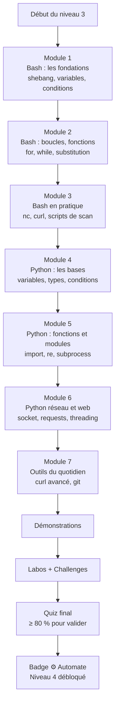
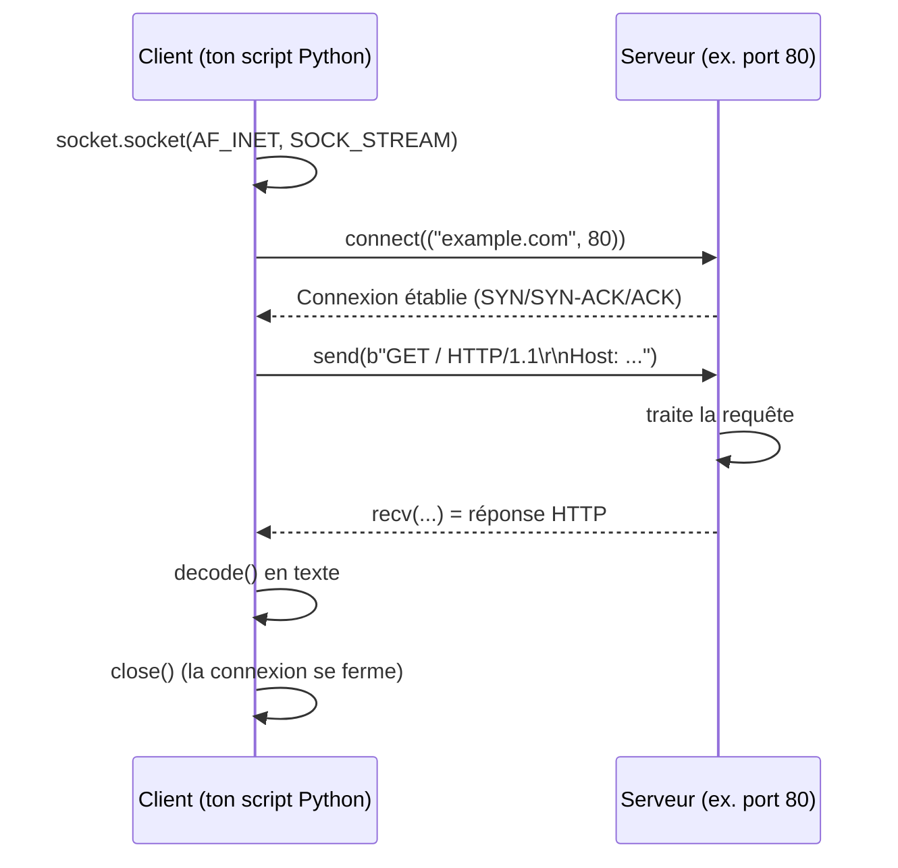

# Présentation

Bienvenue au niveau 3 de CyberAcademy : **Python / Bash pour la cybersécurité**.

Ce cours marque un tournant dans ton parcours. Jusqu'ici, tu as appris à *comprendre* le système (niveau 0), à *manipuler* le terminal Linux (niveau 1) et à *maîtriser* les réseaux (niveau 2). À partir de maintenant, tu vas apprendre à **faire exécuter des tâches à la machine à ta place**.

## Pourquoi automatiser en cybersécurité ?

La cybersécurité est un métier de **répétition**. Un pentester (testeur d'intrusion) doit, pour chaque mission :

- lister les sous-domaines d'un domaine cible (souvent plusieurs centaines) ;
- scanner des milliers de ports sur des dizaines de machines ;
- tester des dizaines d'URLs pour trouver des fichiers et des chemins cachés ;
- parser (analyser et structurer) des milliers de lignes de journaux, de réponses HTTP ou de fichiers de configuration ;
- vérifier la présence de failles connues sur de nombreuses versions de logiciels.

Faire tout cela **à la main** est impossible, ou plutôt : faisable, mais long, fatigant et plein d'erreurs. Une personne qui tape des commandes identiques pendant 8 heures finit par faire une faute de frappe, oublier une cible ou se tromper de fichier. Une machine, elle, ne se fatigue jamais et fait exactement la même chose à chaque fois.

Automatiser, c'est **confier à un programme les tâches répétitives** pour :

- **gagner du temps** : un scan qui prendrait 3 jours à la main se fait en 5 minutes ;
- **réduire les erreurs** : le script fait toujours la même chose, de la même façon ;
- **standardiser** : toute l'équipe utilise le même outil, les mêmes résultats ;
- **documenter** : un script est une preuve de ce qui a été fait (précieux pour le rapport) ;
- **augmenter sa puissance** : quelques lignes de code remplacent des heures de clics.

**Analogie.** C'est un peu comme un **chef de chantier** : il ne pose pas lui-même chaque brique, il a des outils (grue, échafaudage) et des méthodes qui rendent le travail répétitif plus rapide et plus fiable. Le script, c'est ta grue. L'humain garde le raisonnement, la machine porte les briques.

## Où l'automatisation est utilisée

| Domaine | Ce qui est automatisé |
| ------- | --------------------- |
| **Recon (reconnaissance)** | énumération de sous-domaines, découverte d'URLs, collecte d'en-têtes |
| **Scan de réseau** | détection de ports ouverts, de services, de versions |
| **OSINT (renseignement en sources ouvertes)** | collecte d'informations publiques sur une cible |
| **SOC (Security Operations Center)** | corrélation d'alertes, parsing de logs, tri des incidents |
| **DevSecOps** | analyse de code, scan de vulnérabilités à chaque déploiement |
| **Exploit development** | envoi de payloads (charges utiles), ajustement automatique des paramètres |
| **Reporting** | génération de rapports depuis des résultats de scan |

## Métiers concernés

| Métier | Rôle | Lien avec le niveau 3 |
| ------ | ---- | --------------------- |
| **Pentester** (testeur d'intrusion) | trouver les failles avant les attaquants | écrit ses propres scripts de recon et d'exploitation |
| **Exploit developer** | écrire du code qui exploite une vulnérabilité | Python est son langage principal |
| **SOC analyst / automation** | surveiller et répondre aux incidents | automatise l'analyse des logs et des alertes |
| **DevSecOps** | intégrer la sécurité dans les pipelines de livraison | écrit des scripts de test automatique |
| **Bug bounty hunter** | chasser les bugs rémunérés sur des plateformes | automatise la recon sur de larges périmètres |
| **Red teamer** | simuler des attaques réalistes | développe des outils maison |

## Prérequis

Pour suivre ce cours sereinement, tu dois avoir validé :

- **Niveau 0 — Computer Fundamentals** : savoir ce qu'est un système d'exploitation, un processus, un fichier, les permissions.
- **Niveau 1 — Linux Fundamentals** : savoir naviguer dans un terminal, utiliser `ls`, `cd`, `cat`, `grep`, `chmod`, connaître la notion de permissions et de chemins de fichiers. C'est le prérequis **obligatoire**.
- **Niveau 2 — Networking** : savoir ce qu'est une adresse IP, un port TCP, une requête HTTP. C'est un prérequis **fortement recommandé** : les exemples de ce cours parlent de ports, de sockets et de HTTP en permanence.

Le niveau 2 est « recommandé » et non « obligatoire » car chaque notion de réseau utilisée ici est redéfinie au moment où elle apparaît. Mais si tu ne sais pas ce qu'est une adresse IP, tu perdras du temps.

> ⏱️ **Temps estimé : 12 heures** — soit environ 3 séances de 4 heures.
> 📊 **Niveau : 3** — 4ᵉ maillon de la roadmap CyberAcademy (niveaux 0 → 11).

## Ce que tu vas construire

Concrètement, à la fin de ce cours, tu auras écrit :

- un **scanner de ports** en Bash ;
- un **vérificateur d'URLs** avec `curl` ;
- un **scanner de ports** en Python avec `socket` ;
- un **outil de collecte web** avec `requests` ;
- un **extracteur d'informations** avec les expressions régulières ;
- un **scanner multi-thread** (plusieurs ports en parallèle) ;
- un **parseur de logs** qui sort le top 10 des IPs les plus actives.

Chacun de ces outils est un vrai morceau du quotidien d'un pentester. En les écrivant, tu ne fais pas « un exercice » : tu construis ton **kit de base** qui te servira dans tous les niveaux suivants (Web Security, Pentesting, CTF, Bug Bounty).

---

> ⚠️ **Légal** — Ce cours ne t'autorise à scanner, tester ou interroger que des machines sur lesquelles tu as une **autorisation écrite** : ton propre ordinateur, ta propre machine virtuelle, des plateformes d'entraînement (TryHackMe, HackTheBox, Root-Me), ou des laboratoires isolés (labs). Scanner ou tester une machine sans autorisation est **illégal** dans la plupart des pays (loi Godfrain en France, Computer Fraud and Abuse Act aux États-Unis, etc.). Tout le code de ce cours fonctionne sur `127.0.0.1` (ton propre ordinateur) et sur des cibles d'entraînement. Utilise-le uniquement là.

---

## Objectifs pédagogiques

À la fin de ce cours, tu seras capable de :

1. **Écrire et exécuter un script Bash** : créer un fichier avec un shebang, le rendre exécutable avec `chmod +x`, y placer des variables, des conditions, des boucles et des fonctions, et le lancer proprement.
2. **Automatiser des requêtes HTTP avec `curl`** : interroger des URLs, récupérer les codes de réponse, suivre les redirections, gérer les cookies et les en-têtes, et boucler sur une liste de cibles.
3. **Écrire des scripts Python autonomes** : manipuler variables, types de données, conditions, boucles, fonctions, modules et arguments de ligne de commande.
4. **Scanner des ports avec les sockets Python** : créer un socket, le connecter à une cible, gérer les timeouts, et paralléliser le scan avec `threading`.
5. **Faire des requêtes HTTP avec `requests`** : utiliser `get`, `post`, les sessions et les cookies, et analyser `status_code`, `headers` et le corps de réponse.
6. **Parser du texte avec les expressions régulières (`re`)** : extraire des URLs, des adresses email, des IPs et d'autres motifs à partir de textes et de logs.
7. **Structurer un petit outil d'automatisation professionnel** : gestion des arguments (`argparse`), exécution de commandes système (`subprocess`), gestion des erreurs et journalisation propre.

---

## Vue d'ensemble

Voici la feuille de route de ce cours. Chaque module s'appuie sur le précédent.



### Tableau des modules

| Module | Contenu | Durée estimée | Fichiers produits |
| ------ | ------- | ------------- | ----------------- |
| 1. Bash — fondations | shebang, exécution, variables, guillemets | 1 h 30 | `premier-script.sh` |
| 2. Bash — logique | conditions, boucles, substitution, fonctions | 2 h | `verif-urls.sh` |
| 3. Bash — pratique | `nc`, `curl` en boucle, parsing | 1 h 30 | `scan-ports.sh` |
| 4. Python — bases | installation, types, conditions, boucles | 2 h | `types.py`, `boucles.py` |
| 5. Python — structure | fonctions, modules, `re`, `subprocess` | 1 h 30 | `extracteur.py` |
| 6. Python — réseau/web | `socket`, `requests`, `threading` | 2 h | `scan-python.py`, `session-web.py` |
| 7. Outils | `curl` avancé, `git` | 1 h | `recon.sh`, premiers commits |
| Quiz et révision | QCM, TP, challenges | 1 h | — |

---

## Théorie

> Cette section est le cœur du cours. Pour chaque notion, nous suivons le même fil conducteur : **Définition → Pourquoi → Historique → Fonctionnement → Cas d'utilisation → Exemple réel → Bonnes pratiques → Résumé**. Le POURQUOI vient toujours avant le COMMENT.

---

### PARTIE BASH

### a) Qu'est-ce qu'un script Bash ? Le shebang `#!/bin/bash`, les droits d'exécution

**Définition.** Un *script* est un fichier texte contenant une suite de commandes exécutées les unes après les autres, comme si tu les tapais dans le terminal. Le mot *script* vient de l'anglais et désigne un « texte écrit » qui est joué comme un scénario. **Bash** (Bourne-Again SHell) est le programme (le *shell*, l'« interpréteur de commandes ») qui lit et exécute ce texte, ligne par ligne.

**Pourquoi.** Sans script, tu tapes chaque commande à la main. Avec un script, tu écris une fois la séquence, puis tu la relances autant de fois que tu veux, sur autant de machines que tu veux. Un pentester qui doit scanner 40 machines ne va pas taper 40 fois la même ligne : il écrit un script qui boucle sur les 40.

**Historique.** Bash a été créé en 1989 par Brian Fox pour le projet GNU, comme remplacement libre (open source) de l'ancien shell *Bourne shell* (`sh`, 1979). C'est aujourd'hui le shell par défaut de la quasi-totalité des distributions Linux. Son nom est un jeu de mots : « Bourne-Again » (encore un Bourne) avec un clin d'œil à « born again » (né de nouveau). Depuis plus de 30 ans, tout administrateur système et tout pentester doit savoir écrire du Bash.

**Fonctionnement.** Quand tu exécutes `bash mon-script.sh`, le programme `bash` ouvre le fichier, lit les lignes une par une et exécute chacune comme si tu l'avais tapée. La première ligne d'un script est spéciale : le **shebang** (`#!`, prononcé « she-bang » car ça ressemble à un `#` suivi d'un point d'exclamation « bang »). Cette ligne indique **quel interpréteur** doit lire le fichier quand tu le lances directement (`./mon-script.sh`). Si le shebang est `#!/bin/bash`, le système sait qu'il doit appeler le programme `/bin/bash` pour exécuter le fichier.

```bash
#!/bin/bash
echo "Salut depuis Bash !"
```

Pour lancer un script directement, il faut aussi qu'il soit **exécutable**. C'est le rôle de `chmod` (change mode) et du droit `x` (execute) :

```bash
chmod +x mon-script.sh   # ajoute le droit d'exécution
./mon-script.sh          # exécute le script
```

Sans `chmod +x`, tu obtiendras l'erreur `Permission denied` (permission refusée). Tu peux toujours lancer le script avec `bash mon-script.sh` même sans droit d'exécution, car c'est toi qui appelles Bash, pas le système.

**Cas d'utilisation.** Toutes les tâches d'administration et de pentest répétitives : collecte d'informations, vérification de l'état d'une liste de serveurs, sauvegarde, lancement d'outils en série.

**Exemple réel.** Un SOC (Security Operations Center, centre de supervision de sécurité) reçoit chaque matin une liste de 200 serveurs web. Un script Bash boucle sur cette liste, récupère le code HTTP de chacun et écrit un rapport dans un fichier. Un humain mettrait des heures ; le script tourne en 2 minutes.

**Bonnes pratiques.**

- Toujours commencer par `#!/bin/bash` (ou l'interpréteur que tu utilises).
- Nommer les fichiers avec l'extension `.sh` pour la clarté (le système, lui, ne s'en soucie pas).
- Rendre le script exécutable une seule fois : `chmod +x script.sh`.
- Tester d'abord les commandes à la main dans le terminal avant de les mettre dans le script.

**Résumé.** Un script Bash est une liste de commandes dans un fichier texte ; le shebang choisit l'interpréteur ; le droit `x` permet de lancer le fichier directement ; le script transforme une action manuelle en action automatisée.

---

### b) Variables Bash : `var`, `$var`, `${var}`, guillemets simples vs doubles

**Définition.** Une *variable* est une boîte nommée qui stocke une valeur. En Bash, on l'affecte avec le signe `=` **sans espaces** : `nom="valeur"`. On la lit en préfixant son nom avec `$` : `$nom` ou `${nom}`.

**Pourquoi.** Un script qui contient la même valeur répétée 15 fois est fragile : si la valeur change (par exemple l'adresse IP de la cible), il faut modifier le script en 15 endroits. Avec une variable, tu modifies **un seul endroit**, en haut du script.

**Historique.** Les variables existent depuis les tout premiers shells (années 1970). La convention `$nom` vient du *Bourne shell* et a été conservée par tous les shells suivants pour des raisons de compatibilité. Des scripts écrits en 1979 peuvent encore tourner aujourd'hui.

**Fonctionnement.** Quand Bash rencontre `$variable`, il remplace le texte `$variable` par la valeur de la variable, puis exécute le résultat. C'est une **substitution de variables** (le remplacement se fait avant l'exécution).

```bash
#!/bin/bash
cible="192.168.1.10"          # affectation SANS espace autour du =
port=80
echo "Je scanne $cible sur le port $port"
echo "Je scanne ${cible} sur le port ${port}"   # {} délimite clairement le nom
```

La différence entre `$var` et `${var}` : les accolades délimitent **explicitement le nom de la variable**. Elles sont indispensables quand le nom est suivi de caractères qui pourraient être confondus avec lui :

```bash
couleur="bleu"
echo "$couleurmarine"    # Bash cherche une variable nommée "couleurmarine"
echo "${couleur}marine"  # "bleu" suivi du texte "marine"  ->  bleumarine
```

**Les guillemets — le piège classique.** En Bash, il existe deux types de guillemets qui ne se comportent pas pareil :

| Guillemets | Exemple | Substitution de variables ? | Résultat |
| ---------- | ------- | --------------------------- | -------- |
| **Simples** `'` | `echo '$cible'` | Non | affiche littéralement `$cible` |
| **Doubles** `"` | `echo "$cible"` | Oui | affiche la valeur (ex. `192.168.1.10`) |

```bash
#!/bin/bash
cible="192.168.1.10"
echo '$cible'   # affiche : $cible
echo "$cible"   # affiche : 192.168.1.10
```

La règle : **utilise des guillemets doubles pour conserver la valeur, et des guillemets simples quand tu veux du texte brut sans substitution**. En cybersécurité, une erreur classique est de stocker une commande dans une variable avec des guillemets simples : la commande ne sera jamais interprétée.

**Cas d'utilisation.** Stocker l'IP cible, les ports, les chemins de fichiers, les URLs de départ : tout ce qui varie d'une exécution à l'autre.

**Exemple réel.** Un script de recon stocke dans une variable le domaine cible en tête de script. Le pentester change UNE ligne (`cible="example.com"`) et relance le script pour une nouvelle mission, sans toucher au reste.

**Bonnes pratiques.**

- **Toujours mettre des guillemets doubles autour des variables** : `"$var"`. Si la valeur contient un espace, sans guillemets Bash la découpe en plusieurs mots, ce qui casse le script.
- Pas d'espace autour du `=` lors de l'affectation (`port=80`, pas `port = 80`).
- Choisir des noms explicites en minuscules pour les variables locales : `ip_cible`, `fichier_log`.
- Utiliser `${var}` quand la variable est suivie d'autres caractères.

**Résumé.** Une variable Bash stocke une valeur ; on l'affecte sans espace (`var=valeur`), on la lit avec `$var` ou `${var}` ; les guillemets doubles permettent la substitution, les guillemets simples l'interdisent ; les accolades délimitent le nom de la variable.

---

### c) Entrées / sorties en Bash : `$1`, `$2`, `read`, `echo`, `printf`

**Définition.** Un script communique avec le monde extérieur par des *entrées* (ce qu'il reçoit : arguments de la ligne de commande, saisie utilisateur, contenu de fichiers) et des *sorties* (ce qu'il produit : texte à l'écran, fichiers).

**Pourquoi.** Un script qui ne peut rien recevoir ni rien afficher est inutile : il faut pouvoir lui donner une cible (`./scan.sh 192.168.1.10`) et qu'il te rende un résultat lisible.

**Fonctionnement.**

1. **Arguments positionnels.** Quand tu lances `./script.sh 192.168.1.10 80`, Bash range les arguments dans des variables spéciales : `$1` reçoit `192.168.1.10`, `$2` reçoit `80`, et `$0` contient le nom du script. `$#` contient le **nombre** d'arguments.

```bash
#!/bin/bash
echo "Nom du script : $0"
echo "Cible : $1"
echo "Port : $2"
echo "Nombre d'arguments : $#"
```

2. **Lecture clavier.** La commande `read` lit une ligne saisie au clavier (ou fournie par un autre programme) et la range dans une variable.

```bash
#!/bin/bash
echo "Quelle cible veux-tu scanner ?"
read cible
echo "Tu as demandé : $cible"
```

3. **Affichage.** `echo` affiche une ligne. `printf` affiche un texte **formaté** : il imite le `printf` du langage C et permet un contrôle fin (`%s` = chaîne, `%d` = nombre, `\n` = saut de ligne).

```bash
#!/bin/bash
nom="Alice"
printf "Bonjour %s, tu as %d nouvelles alertes.\n" "$nom" 42
# affiche : Bonjour Alice, tu as 42 nouvelles alertes.
```

**Cas d'utilisation.** Toutes les interfaces de script : recevoir la cible, demander une confirmation, afficher une progression ou un rapport.

**Exemple réel.** `./enum.sh example.com` : le script reçoit le domaine dans `$1`, demande à l'utilisateur de confirmer avec `read`, puis affiche avec `printf` chaque URL testée et son code HTTP dans un tableau aligné.

**Bonnes pratiques.**

- Toujours vérifier que les arguments requis existent (`if [ -z "$1" ]`).
- Préférer `printf` à `echo` pour les sorties formatées (alignement, nombres).
- Afficher un message d'usage : `echo "Usage : $0 <cible>"`.

**Résumé.** `$1`, `$2`… reçoivent les arguments passés au script ; `read` lit l'entrée utilisateur ; `echo` affiche simplement ; `printf` affiche avec un format précis ; un bon script commence par vérifier qu'il a reçu ce qu'il attend.

---

### d) Conditions Bash : `if`, `then`, `elif`, `else`, `test`, `[ ]`, `&&`, `||`

**Définition.** Une *condition* permet au script de prendre une décision : selon qu'une valeur est vraie ou fausse, le script exécute telle ou telle partie. C'est la « fourche » du chemin d'exécution.

**Pourquoi.** Scanner 100 ports et n'afficher que les ports ouverts, c'est une décision par port : « si le port répond, affiche-le ; sinon, ignore-le ». Sans conditions, ton script afficherait tout et tu devrais trier toi-même.

**Fonctionnement.** La syntaxe de base :

```bash
if [ condition ]; then
    # exécuté si la condition est vraie
elif [ autre_condition ]; then
    # exécuté si la première est fausse et la seconde vraie
else
    # exécuté si toutes les conditions sont fausses
fi    # fi = "if" à l'envers : ferme le bloc
```

La condition est écrite entre crochets `[ ... ]` (un raccourci de la commande `test`). Il faut **un espace après `[` et avant `]`**, sinon Bash refuse. Les opérateurs de comparaison ne sont pas les symboles mathématiques mais des lettres :

| Opérateur | Signification | Exemple |
| --------- | ------------- | ------- |
| `-eq` | égal (equal) | `[ "$port" -eq 80 ]` |
| `-ne` | différent (not equal) | `[ "$port" -ne 22 ]` |
| `-lt` | inférieur (less than) | `[ "$port" -lt 1024 ]` |
| `-gt` | supérieur (greater than) | `[ "$port" -gt 1024 ]` |
| `-le` | inférieur ou égal | `[ "$port" -le 65535 ]` |
| `-ge` | supérieur ou égal | `[ "$port" -ge 1 ]` |
| `-f` | c'est un fichier existant | `[ -f "logs.txt" ]` |
| `-d` | c'est un dossier | `[ -d "/var/log" ]` |
| `-z` | la chaîne est vide | `[ -z "$1" ]` |
| `-n` | la chaîne n'est pas vide | `[ -n "$cible" ]` |
| `=` | égalité de chaînes | `[ "$reponse" = "oui" ]` |
| `!=` | inégalité de chaînes | `[ "$reponse" != "non" ]` |

Exemple complet :

```bash
#!/bin/bash
code=404
if [ "$code" -eq 200 ]; then
    echo "Page trouvée !"
elif [ "$code" -eq 404 ]; then
    echo "Page introuvable."
else
    echo "Autre code : $code"
fi
```

**Les raccourcis `&&` et `||`.** Ces deux symboles enchaînent des commandes :

- `commande1 && commande2` : exécute `commande2` **seulement si** `commande1` a réussi (code de retour 0). `&&` = « et ensuite ».
- `commande1 || commande2` : exécute `commande2` **seulement si** `commande1` a échoué (code de retour différent de 0). `||` = « sinon ».

```bash
#!/bin/bash
mkdir backup && echo "Le dossier backup a été créé"
grep -q "alerte" logs.txt || echo "Aucune alerte trouvée"
```

**Cas d'utilisation.** Valider les arguments reçus, traiter différemment les codes HTTP, vérifier qu'un fichier existe avant de le lire, décider si on continue ou non.

**Exemple réel.** Un script de scan vérifie d'abord que l'utilisateur a bien fourni une cible (`if [ -z "$1" ]`), sinon il affiche l'usage et s'arrête. Ensuite, pour chaque port, il teste le résultat et n'affiche que les ouverts.

**Bonnes pratiques.**

- Guillemets doubles autour des variables dans `[ ]` : `[ "$var" = "oui" ]`.
- Toujours fermer avec `fi`.
- Pour les tests simples, préférer `&&` / `||` ; pour les logiques multiples, utiliser `if ... elif ... else`.
- Comparer les chaînes avec `=` / `!=`, les nombres avec `-eq` / `-lt` / etc. Ne pas mélanger, c'est la source classique de bugs.

**Résumé.** `if/then/elif/else/fi` fait choisir au script un chemin selon une condition écrite dans `[ ]` (ou la commande `test`) ; `&&` enchaîne en cas de succès, `||` en cas d'échec ; les comparaisons de nombres et de chaînes n'utilisent pas les mêmes opérateurs.

---

### e) Boucles Bash : `for`, `while`, `until`

**Définition.** Une *boucle* répète un bloc de commandes plusieurs fois. C'est le cœur de l'automatisation : « faire X pour chaque élément de cette liste ».

**Pourquoi.** Toute la force de l'automatisation vient des boucles. « Tester 1000 ports », « parcourir 200 sous-domaines », « lire 50 fichiers » : ce sont tous des « pour chaque … faire … ». Sans boucle, pas d'automatisation.

**Fonctionnement.**

1. **`for` — pour chaque élément d'une liste** : idéal quand tu connais à l'avance les valeurs (une liste de ports, une liste de fichiers).

```bash
#!/bin/bash
for port in 22 80 443 8080; do
    echo "Je teste le port $port"
done
```

`for` sait aussi lire une liste depuis un fichier (une URL par ligne) :

```bash
#!/bin/bash
for url in $(cat urls.txt); do
    echo "Je visite $url"
done
```

2. **`while` — tant que la condition est vraie** : idéal pour lire un fichier ligne par ligne, ou répéter tant qu'une condition tient.

```bash
#!/bin/bash
while read -r ligne; do
    echo "Ligne lue : $ligne"
done < urls.txt
```

Le `<` à la fin **redirige** le contenu du fichier vers la commande `read` : à chaque tour, `read` lit une ligne du fichier. `-r` empêche les interprétations bizarres des caractères d'échappement dans la ligne lue.

3. **`until` — jusqu'à ce que la condition devienne vraie** : l'inverse de `while`. Le bloc tourne tant que la condition est fausse.

```bash
#!/bin/bash
compteur=0
until [ "$compteur" -ge 5 ]; do
    echo "Tentative $compteur"
    compteur=$((compteur + 1))
done
```

**Cas d'utilisation.** Scanner des ports, tester des URLs, lire des fichiers ligne par ligne, traiter une liste d'IPs, essayer plusieurs valeurs.

**Exemple réel.** Un pentester a une liste `ip.txt` de 40 machines. Un script `for ip in $(cat ip.txt)` lance le scan de chaque machine et écrit les résultats dans un rapport. 40 scans, une seule commande.

**Bonnes pratiques.**

- Choisir `for` quand la liste est connue, `while read` pour les fichiers.
- Fermer la boucle avec `done`.
- Mettre des guillemets doubles autour des variables lues : `"$url"`.
- Toujours prévoir une limite pour `while`/`until` (jamais de boucle infinie).

**Résumé.** `for` répète pour chaque élément d'une liste ; `while` répète tant qu'une condition est vraie ; `until` répète jusqu'à ce qu'elle devienne vraie ; les boucles transforment « refaire 1000 fois » en « une ligne qui boucle ».

---

### f) Substitution de commande : `$( )`

**Définition.** La *substitution de commande* exécute une commande et place **sa sortie** dans la ligne courante, généralement pour l'affecter à une variable : `resultat=$(commande)`.

**Pourquoi.** Un script a souvent besoin du *résultat* d'une autre commande : le nombre de ports ouverts, la liste des fichiers, l'heure actuelle, la sortie de `curl`. Au lieu de l'afficher puis de le recopier à la main, le script capture la sortie directement.

**Fonctionnement.** Quand Bash voit `$(commande)`, il exécute `commande`, récupère tout ce qu'elle affiche, et remplace `$(commande)` par ce texte. L'ancienne syntaxe équivalente est le **backtick** (accent grave) `` `commande` ``, mais elle est moins lisible et plus fragile : on recommande `$( )`.

```bash
#!/bin/bash
date_du_jour=$(date +%Y-%m-%d)
echo "Aujourd'hui : $date_du_jour"

nb_lignes=$(wc -l < logs.txt)
echo "Le fichier logs.txt contient $nb_lignes lignes"

ip=$(hostname -I | awk '{print $1}')
echo "Mon IP locale : $ip"
```

**Cas d'utilisation.** Capturer une sortie pour la comparer (ex. un code HTTP), générer des noms de fichiers avec la date, extraire une valeur d'une commande.

**Exemple réel.** Un script de rapport nomme son fichier de sortie avec la date : `fichier="rapport-$(date +%Y%m%d).txt"`. Chaque jour, un nouveau rapport, sans jamais écraser le précédent.

**Bonnes pratiques.**

- Utiliser `$( )` plutôt que les backticks.
- Guillemets doubles autour de la variable qui reçoit la sortie si elle peut contenir des espaces.
- Se souvenir que la sortie peut contenir des espaces ou des caractères spéciaux.

**Résumé.** `$(commande)` exécute une commande et place sa sortie dans le script, souvent dans une variable ; c'est la façon propre de « récupérer un résultat ».

---

### g) Les fonctions Bash

**Définition.** Une *fonction* est un bloc de commandes nommé et réutilisable. Une fois définie, on l'appelle par son nom pour exécuter son bloc.

**Pourquoi.** Si tu répètes les mêmes 5 commandes à trois endroits du script, tu risques d'en corriger une au premier endroit et d'oublier les autres. En mettant ces commandes dans une fonction, tu écris la logique **une seule fois** et tu l'appelles partout.

**Fonctionnement.** Deux syntaxes équivalentes existent :

```bash
#!/bin/bash

# syntaxe 1 : "function nom"
function afficher_bonjour {
    echo "Bonjour $1"
}

# syntaxe 2 : nom + parenthèses (la plus répandue)
afficher_port_ouvert() {
    echo "[+] Port ouvert : $1"
}

afficher_bonjour "Alice"
afficher_port_ouvert 8080
```

À l'intérieur d'une fonction, `$1`, `$2`… désignent les arguments **passés à la fonction** (pas ceux du script). Une fonction peut afficher un résultat que l'on capture avec `$( )` :

```bash
#!/bin/bash
additionner() {
    echo $(( $1 + $2 ))
}
somme=$(additionner 3 4)
echo "3 + 4 = $somme"
```

**Cas d'utilisation.** Factoriser les tests répétés (test d'un port, d'une URL), organiser un long script en sections nommées et lisibles.

**Exemple réel.** Un script de recon définit une fonction `verifier_url` qui prend une URL, lance `curl` et affiche le code HTTP formaté. Le script l'appelle dans une boucle `for` sur 200 URLs : des centaines de lignes se réduisent à quelques-unes.

**Bonnes pratiques.**

- Un nom de fonction = un verbe explicite (`tester_port`, `envoyer_alerte`).
- Définir les fonctions **avant** de les appeler (en haut du script).
- Rendre la fonction générique : elle reçoit ses paramètres, elle ne lit pas des variables globales au hasard.
- Les variables déclarées avec `local` dans une fonction n'existent que pendant son exécution : cela évite les collisions de noms.

**Résumé.** Une fonction regroupe des commandes sous un nom, s'appelle avec `$1`, `$2`… et `$( )`, factorise la logique répétée et rend le script lisible.

---

### h) Scripts pratiques : scanner de ports avec `nc`, boucle `curl`

**Définition.** Passons à la pratique : deux scripts emblématiques du quotidien. Le premier utilise **netcat** (`nc`), le couteau suisse réseau ; le second utilise **curl**, l'outil de requêtes HTTP (nous verrons `curl` en détail à la partie s).

**Pourquoi.** Un scanner de ports sert à savoir quels services sont exposés sur une machine : chaque port ouvert est une porte d'entrée potentielle. Un vérifieur d'URLs sert à contrôler l'état de nombreux sites rapidement. Ces deux tâches sont parmi les plus automatisées en cybersécurité.

**Fonctionnement.**

`nc` (netcat) en mode scan utilise deux options essentielles :

- `-z` (zero) : n'envoie **aucune donnée**, juste le test de connexion. C'est le mode « ne parle pas, branche-toi et dis-moi si ça marche » ;
- `-w 1` (wait) : abandonne après 1 seconde si la connexion ne s'établit pas.

```bash
#!/bin/bash
# scan-ports.sh — teste une liste de ports sur une cible
IP="$1"
for port in 22 80 443 8080; do
    if nc -z -w 1 "$IP" "$port" 2>/dev/null; then
        echo "[+] $IP:$port  OUVERT"
    else
        echo "[-] $IP:$port  fermé"
    fi
done
```

Explication de chaque morceau :

- `IP="$1"` : la cible vient du premier argument ;
- `for port in 22 80 443 8080` : on teste quatre ports ;
- `nc -z -w 1 "$IP" "$port"` : test de connexion ;
- `2>/dev/null` : envoie les messages d'erreur de `nc` dans le néant (la « poubelle » `/dev/null`) pour ne garder que nos propres messages ;
- `if ... ; then` : si `nc` réussit (code de retour 0), le port est ouvert.

> 📌 **Important** : `nc` retourne un code de sortie de **0** si la connexion a réussi et un code différent de 0 sinon. La condition `if` juge précisément sur ce code. C'est ce qui rend l'utilisation de `nc` dans un `if` naturelle.

La boucle `curl` :

```bash
#!/bin/bash
# verif-urls.sh — affiche le code HTTP de chaque URL d'un fichier
while read -r url; do
    code=$(curl -s -o /dev/null -w "%{http_code}" -L --max-time 5 "$url")
    echo "$url -> $code"
done < urls.txt
```

- `curl -s` : mode silencieux (pas de barre de progression) ;
- `-o /dev/null` : jette le corps de la réponse dans la poubelle système, on ne veut que le code ;
- `-w "%{http_code}"` : après la requête, affiche uniquement le code HTTP ;
- `-L` : suit les redirections (codes 3xx) automatiquement ;
- `--max-time 5` : abandonne si la réponse dépasse 5 secondes (indispensable pour une boucle sur des cibles lentes ou mortes).

**Cas d'utilisation.** Cartographier une cible (quels services sont là ?), vérifier la santé d'un parc de sites, détecter des serveurs web inattendus.

**Exemple réel.** Un SOC surveille 500 sites. Le script `verif-urls.sh` reçoit une liste d'URLs et produit un rapport du type :

```text
https://www.example.com -> 200
https://www.example.com/admin -> 403
https://backup.example.com -> 200
https://old.example.com -> 404
```

Le code 404 ici signifie « la page n'existe pas », mais le code 200 sur `backup.example.com` est une **découverte** : un sous-domaine de sauvegarde exposé, souvent une cible de choix.

**Bonnes pratiques.**

- Toujours un `--max-time` sur `curl` pour ne pas bloquer la boucle.
- Rediriger les erreurs (`2>/dev/null`) pour un affichage propre.
- Vérifier la cible et avoir une autorisation avant de lancer le scan.

> ⚠️ **Légal** — `nc -z` sur une machine dont tu n'as pas l'autorisation est un scan de ports non sollicité, souvent illégal et détecté par les SIEM/EDR de la cible. Entraîne-toi uniquement sur `127.0.0.1`, sur tes VMs ou sur les plateformes d'entraînement autorisées (TryHackMe, HackTheBox…).

**Résumé.** `nc -z -w 1` teste une connexion et retourne un code utilisable dans un `if` ; `curl -s -o /dev/null -w "%{http_code}"` extrait le code HTTP sans bruit ; une boucle transforme ces deux primitives en outils de scan complets.

---

### PARTIE PYTHON

### i) Pourquoi Python en cybersécurité ? Installation, exécution

**Définition.** **Python** est un langage de programmation créé en 1991 par le néerlandais Guido van Rossum. C'est un langage *interprété* (lu et exécuté ligne par ligne par un programme appelé l'*interpréteur*), *à typage dynamique* (les variables n'ont pas de type déclaré à l'avance) et *multi-plateforme* (Linux, Windows, macOS). Le nom « Python » vient des Monty Python, pas du serpent.

**Pourquoi.** Python est devenu **le langage de référence de la cybersécurité** pour trois raisons :

1. **Une bibliothèque immense** : une *bibliothèque* (ou *module*) est du code déjà écrit et réutilisable. Il existe des modules pour les sockets, le web, le parsing, la cryptographie… et des outils entiers écrits en Python.
2. **La rapidité de développement** : un outil qui prendrait 50 lignes en C en prend 10 en Python. En cybersécurité, le temps compte.
3. **Les outils de référence sont en Python** : `impacket` (atelier Active Directory, niveau 9), `scapy` (forgeage de paquets réseau), `requests` (HTTP), `sqlmap` (injection SQL, niveau 5), une grande part des scripts d'exploit des bases comme Metasploit. **Connaître Python, c'est savoir lire et adapter les outils de la profession.**

**Historique.** Python 1.0 sort en 1994, Python 2 en 2000, Python 3 en 2008. Depuis 2020, Python 2 n'est plus maintenu : **toujours utiliser Python 3**. La philosophie du langage tient en un mantra : *« There should be one—and preferably only one—obvious way to do it »* (« il devrait y avoir une façon — et de préférence une seule — évidente de le faire »). C'est ce qui rend le code Python lisible et les bugs plus rares.

**Fonctionnement — installation et exécution.** Python 3 est préinstallé sur la plupart des distributions Linux. Vérifie ta version :

```bash
python3 --version      # exemple de sortie : Python 3.11.2
```

Pour lancer un script :

```bash
python3 mon_script.py
```

L'interpréteur lit `mon_script.py` et exécute les instructions dans l'ordre. Comme pour Bash, on peut rendre un script Python directement exécutable avec un shebang pointant vers l'interpréteur Python :

```python
#!/usr/bin/env python3
print("Salut depuis Python !")
```

```bash
chmod +x mon_script.py
./mon_script.py
```

Le shebang `#!/usr/bin/env python3` demande au système de chercher l'interpréteur `python3` dans le `PATH` (les dossiers où Linux cherche les programmes). C'est la façon recommandée car le chemin exact de Python varie selon les systèmes.

On peut aussi utiliser Python comme une **calculatrice interactive** en tapant `python3` sans argument : l'invite `>>>` attend tes instructions. C'est parfait pour tester une idée avant de l'écrire dans un fichier.

**Cas d'utilisation.** Tous les outils « maison » du pentester : scanners, parseurs, collecteurs, bots de test, scripts d'exploitation et de post-exploitation.

**Exemple réel.** Un pentester doit tester 300 couples identifiant/mot de passe trouvés dans une base fuitée sur une page de connexion. Il écrit 15 lignes de Python avec `requests` et `threading` : le test complet se termine en quelques minutes au lieu de deux jours à la main. (Rappel : uniquement dans un cadre autorisé.)

**Bonnes pratiques.**

- Utiliser **Python 3** (`python3`), jamais `python` (qui peut pointer vers l'ancienne version).
- Tester les petites idées dans l'invité interactif avant d'écrire le script.
- Lancer les scripts avec `python3` explicitement pendant l'apprentissage ; ajouter le shebang seulement quand tu veux un exécutable.

**Résumé.** Python est un langage interprété, lisible et riche en bibliothèques ; c'est le langage des outils de cybersécurité (`impacket`, `scapy`, `requests`…) ; on l'exécute avec `python3 script.py` ou via un shebang `#!/usr/bin/env python3`.

---

### j) Les bases de Python : variables et types (`int`, `str`, `list`, `dict`, `bool`, `bytes`)

**Définition.** Comme en Bash, une *variable* Python est une boîte nommée qui stocke une valeur. Mais contrairement à Bash, chaque valeur a un **type** précis et le langage respecte strictement ce type.

**Pourquoi.** Le type détermine ce qu'on peut faire avec la valeur : on multiplie des nombres, on découpe des textes, on parcourt des listes. Comprendre les types, c'est comprendre pourquoi `"3" + 3` plante alors que `3 + 3` fonctionne.

**Fonctionnement — les types principaux.**

| Type | Nom Python | Exemple | Rôle |
| ---- | ---------- | ------- | ---- |
| entier | `int` | `42` | un nombre entier |
| nombre à virgule | `float` | `3.14` | un nombre décimal |
| texte | `str` | `"Hello"` | une chaîne de caractères |
| vrai/faux | `bool` | `True` | une valeur logique |
| liste | `list` | `[22, 80, 443]` | une suite ordonnée de valeurs |
| dictionnaire | `dict` | `{"nom": "Alice", "age": 30}` | des paires clé → valeur |
| octets bruts | `bytes` | `b"\x00\x01"` | des données binaires brutes |

```python
#!/usr/bin/env python3
nom = "Alice"                    # str
age = 30                         # int
note = 14.5                      # float
est_connecte = True              # bool
ports = [22, 80, 443]            # list
machine = {"nom": "web01", "ip": "192.168.1.10"}   # dict
donnees = b"\x00\x01\xff"         # bytes

print(type(nom))                 # <class 'str'>
print(type(ports))               # <class 'list'>
print(machine["ip"])             # 192.168.1.10
print(len(ports))                # 3  (len = longueur)
```

**Listes :** on accède à un élément par son **index** (position), en commençant à **0** :

```python
ports = [22, 80, 443, 8080]
print(ports[0])    # 22
print(ports[3])    # 8080
print(ports[-1])   # 8080  (-1 = le dernier)
ports.append(8443) # ajoute à la fin
print(ports)       # [22, 80, 443, 8080, 8443]
```

**Dictionnaires :** on accède par la **clé**, pas par la position :

```python
machine = {"nom": "web01", "ip": "192.168.1.10"}
print(machine["nom"])        # web01
machine["port"] = 80         # ajoute une entrée
print("port" in machine)     # True
```

**Pourquoi `bytes` est important en cybersécurité.** Les réseaux et les fichiers manipulent des **octets bruts** (une suite de 0 et de 1 regroupés en octets). Quand tu liras une réponse de socket ou un fichier binaire, tu obtiendras un objet `bytes`, pas une `str`. Distinguer les deux évite des heures de bug : `b"abc"` n'est pas `"abc"`. On convertit avec `.decode()` (octets → texte) et `.encode()` (texte → octets).

**Cas d'utilisation.** Stocker des ports à tester, des URLs, des informations sur des machines, des résultats de scan ; encoder/décoder des données réseau.

**Exemple réel.** Un scanner collecte les résultats de 100 ports dans une liste `ports_ouverts` ; à la fin, il affiche `len(ports_ouverts)` ports ouverts puis la liste. Un outil réseau reçoit des `bytes` d'un socket et les décode en `str` pour les analyser.

**Bonnes pratiques.**

- Noms de variables explicites, en minuscules, mots séparés par `_` : `ip_cible`.
- Vérifier le type avec `type(var)` et le convertir avec `int()`, `str()`, `list()`.
- Pour le réseau, toujours penser au texte vs octets (`.encode()` / `.decode()`).
- Comprendre l'index 0 : le premier élément d'une liste est l'élément 0.

**Résumé.** Chaque valeur Python a un type (`int`, `str`, `list`, `dict`, `bool`, `bytes`) ; les listes s'indexent par position à partir de 0, les dictionnaires par clé ; les données réseau arrivent souvent en `bytes` et se convertissent avec `.decode()`.

---

### k) Conditions et boucles en Python

**Définition.** Comme en Bash, Python a des *conditions* (choisir un chemin) et des *boucles* (répéter). La syntaxe diffère radicalement : **Python utilise l'indentation** (les espaces en début de ligne) pour délimiter les blocs, là où Bash utilise `then`, `fi`, `done`.

**Pourquoi.** Comprendre l'indentation, c'est comprendre 80 % des erreurs de débutant en Python. En Bash, si tu oublies `fi`, le script plante ; en Python, si tu oublies l'indentation, le programme ne démarre pas. L'indentation n'est pas décorative : elle **structure** le code.

**Fonctionnement — les conditions.**

```python
#!/usr/bin/env python3
code = 404

if code == 200:
    print("Page trouvée !")
elif code == 404:
    print("Page introuvable.")
else:
    print("Autre code :", code)
```

Différences cruciales avec Bash :

- les blocs sont délimités par **l'indentation** (4 espaces par convention) ;
- on termine la ligne par **deux-points** `:` ;
- l'égalité se teste avec **`==`** (et non `=` qui est l'affectation) ;
- les opérateurs de comparaison sont les symboles mathématiques habituels : `==`, `!=`, `<`, `>`, `<=`, `>=` ;
- les combinaisons logiques s'écrivent en toutes lettres : `and`, `or`, `not`.

```python
if code >= 400 and code < 500:
    print("C'est une erreur du client (4xx).")
```

**Les boucles.**

```python
# boucle for : pour chaque élément d'une liste
for port in [22, 80, 443, 8080]:
    print("Je teste le port", port)

# boucle for avec range() : une suite de nombres
for i in range(5):          # 0, 1, 2, 3, 4
    print("Itération", i)

for port in range(1, 1025): # de 1 à 1024 inclus
    print("Port", port)

# boucle while : tant que la condition est vraie
compteur = 0
while compteur < 3:
    print("Tentative", compteur)
    compteur += 1           # équivaut à compteur = compteur + 1
```

`range(1, 1025)` génère les nombres de 1 à 1024 : c'est exactement le point de départ d'un scan de ports « maison ».

**Cas d'utilisation.** Tester les codes HTTP, parcourir les ports, traiter une liste de cibles, répéter une tentative.

**Exemple réel.** Un script de scan boucle sur `range(1, 1024)`, et pour chaque port pose un `if` : « si la connexion réussit, ajoute le port à la liste des ouverts ». La boucle fait le volume, la condition fait le tri.

**Bonnes pratiques.**

- 4 espaces d'indentation, jamais de tabulations mélangées aux espaces.
- `==` pour comparer, `=` pour affecter — à ne jamais confondre.
- Les deux-points après `if`, `elif`, `else`, `for`, `while`.
- Boucler avec `for` quand c'est possible (plus sûr que `while` qui peut être infini si on oublie d'incrémenter).

**Résumé.** Python structure avec l'indentation et les `:` ; les comparaisons utilisent `==`, `<`, `and`, `or` ; `for` parcourt listes et `range()`, `while` répète tant qu'une condition tient ; `range(1, 1025)` donne la base d'un scan.

---

### l) Fonctions et modules : `def`, `return`, `import`

**Définition.** Une *fonction* Python est un bloc de code nommé, réutilisable, qui reçoit des *paramètres* et peut *retourner* une valeur. Un *module* est un fichier de code Python (ou une bibliothèque installée) qu'on **importe** pour réutiliser ses fonctions.

**Pourquoi.** Les fonctions évitent la duplication (comme en Bash) et rendent le code testable. Les modules évitent de réinventer la roue : pourquoi écrire soi-même une requête HTTP quand `requests` existe et est testé par des milliers de personnes ?

**Fonctionnement — définition et appel.**

```python
#!/usr/bin/env python3
def est_pair(nombre):
    """Retourne True si nombre est pair, sinon False."""
    return nombre % 2 == 0

for n in range(1, 6):
    print(n, "pair ?", est_pair(n))
```

- `def` déclare la fonction, son nom, ses paramètres entre parenthèses ;
- le corps est indenté ;
- `return` renvoie une valeur (ou `None` si absent) ;
- la docstring entre `""" """` documente le rôle de la fonction.

**Fonctionnement — les modules et `import`.**

Python embarque une bibliothèque standard (modules fournis avec le langage) et peut charger des bibliothèques tierces. Trois syntaxes d'import :

```python
import re                     # importe le module entier : re.findall(...)
import sys                    # module du système
from requests import get      # importe une seule fonction : get(...)
```

Pour les modules tiers (qui ne sont pas dans la bibliothèque standard), on les installe avec `pip` (le gestionnaire de paquets Python) :

```bash
pip install requests
```

L'exécution d'un script utilise le module **`sys`** : `sys.argv` contient les arguments de la ligne de commande (voir partie q).

**Cas d'utilisation.** Factoriser le code en fonctions nommées ; réutiliser `re`, `socket`, `subprocess`, `requests` sans les réécrire.

**Exemple réel.** Un outil de recon définit `scanner_port(ip, port)` et `scanner_url(url)` : le programme principal boucle sur les cibles en appelant ces deux fonctions. Chaque fonction est testable séparément, donc les bugs sont plus faciles à trouver.

**Bonnes pratiques.**

- Un verbe dans le nom de fonction : `extraire_emails`, `tester_port`.
- Toujours documenter les fonctions importantes avec une docstring.
- Grouper les imports en haut du fichier.
- Pour un module tiers, `pip install nom` puis `import nom` en tête de script.

**Résumé.** `def nom(parametres):` définit une fonction, `return` renvoie sa valeur ; `import module` charge du code réutilisable ; la bibliothèque standard et `pip` fournissent la quasi-totalité des briques dont un pentester a besoin.

---

### m) Les sockets : `socket.socket`, `connect`, `connect_ex`, `send`, `recv`, `timeout`

**Définition.** Une *socket* (prise en français) est l'extrémité d'un canal de communication réseau. C'est le mécanisme de base par lequel deux machines échangent des données (TCP ou UDP). Le module Python `socket` expose ce mécanisme en quelques fonctions.

**Pourquoi.** Les outils réseau (curl, ssh, navigateur) sont tous construits sur des sockets. Comprendre la socket, c'est comprendre **ce que font réellement** les outils derrière leur interface. Et surtout, c'est ce qui te permettra d'écrire ton propre scanner de ports, ton propre client de test, tes propres outils quand aucun n'existe.

**Fonctionnement — le cycle de vie d'un client socket TCP.**

```python
#!/usr/bin/env python3
import socket

s = socket.socket(socket.AF_INET, socket.SOCK_STREAM)  # 1. création
s.settimeout(3)                                        # 2. délai max

try:
    s.connect(("example.com", 80))                     # 3. connexion
    s.send(b"HEAD / HTTP/1.1\r\nHost: example.com\r\n\r\n")  # 4. envoi
    reponse = s.recv(4096)                             # 5. réception
    print(reponse.decode(errors="replace"))            # 6. décodage
except socket.timeout:
    print("La connexion a expiré.")
finally:
    s.close()                                          # 7. fermeture
```

Détail de chaque étape :

1. **Création.** `socket.socket(famille, type)`. La *famille* `AF_INET` indique Internet (adresses IP), et le *type* `SOCK_STREAM` indique TCP (connexion fiable et ordonnée). Le type `SOCK_DGRAM` correspondrait à UDP.
2. **Timeout.** `s.settimeout(3)` impose un maximum de 3 secondes pour chaque opération. **Sans timeout, le script peut rester bloqué indéfiniment** si la cible ne répond pas. C'est l'erreur numéro un des débutants.
3. **Connexion.** `connect((hote, port))` établit la connexion. Elle **lève une exception** si elle échoue (machine injoignable, port fermé). On utilise donc `try/except` pour gérer l'échec.
4. **Envoi.** `send(data)` envoie des octets (`bytes`). Ici, une requête HTTP minimale écrite à la main. Notez les `\r\n` : la fin de ligne du protocole HTTP.
5. **Réception.** `recv(4096)` reçoit au plus 4096 octets. Le serveur répondra éventuellement en plusieurs morceaux : `recv` peut être appelé en boucle.
6. **Décodage.** La réponse arrive en `bytes` ; on la transforme en `str` avec `.decode()`. Le paramètre `errors="replace"` évite de planter sur un caractère non prévu.
7. **Fermeture.** `close()` libère la socket. On la met dans `finally` pour qu'elle soit fermée même en cas d'erreur.

**`connect` vs `connect_ex` — pour le scan de ports.** Le scanner de ports a un besoin particulier : savoir si une connexion est possible. `connect()` lève une exception en cas d'échec, ce qui oblige à gérer `try/except` pour chaque port. La fonction **`connect_ex`** est la variante pensée pour cela : elle **retourne** le code d'erreur (0 si succès, autre chose sinon) au lieu de lever une exception.

```python
#!/usr/bin/env python3
import socket

ip = "127.0.0.1"
ports = [22, 80, 443, 8080]

for port in ports:
    s = socket.socket(socket.AF_INET, socket.SOCK_STREAM)
    s.settimeout(1)
    resultat = s.connect_ex((ip, port))
    if resultat == 0:
        print(f"[+] {ip}:{port} OUVERT")
    else:
        print(f"[-] {ip}:{port} fermé")
    s.close()
```

Le `f"..."` devant la chaîne crée une *f-string* : les expressions entre `{}` sont remplacées par leurs valeurs. `f"[+] {ip}:{port} OUVERT"` affiche par exemple `[+] 127.0.0.1:80 OUVERT`.

**Cas d'utilisation.** Scanner de ports, client/serveur de test, envoi de payloads réseau, dialogue avec un service qui parle un protocole non couvert par les bibliothèques.

**Exemple réel.** Un pentester découvre un service sur le port 1337 qui parle un protocole propriétaire. Aucun outil ne le comprend. Il écrit 20 lignes de Python avec `socket` pour dialoguer avec ce service, tester ses entrées et chercher des failles. C'est l'usage le plus « brut » du réseau en Python.

**Bonnes pratiques.**

- **Toujours un timeout** (`settimeout`) ou le script peut se bloquer.
- Fermer chaque socket créée (`close()`) pour ne pas épuiser les ressources.
- `connect_ex` pour les scans (pas d'exceptions), `connect` + `try/except` pour les dialogues où on veut gérer précisément l'erreur.
- `send` prend des `bytes` : encoder son texte avec `.encode()`.

> ⚠️ **Légal** — Un scan de ports automatique est un acte technique neutre mais **l'usage sans autorisation est illégal** et immédiatement visible dans les logs du réseau. Utilise `127.0.0.1`, tes VMs, ou les plateformes d'entraînement. Ce chapitre forme des compétences défensives et offensives **légitimes** : un administrateur teste ses propres serveurs, un pentester agit sur mandat écrit.

**Résumé.** `socket.socket(AF_INET, SOCK_STREAM)` crée une connexion TCP ; `connect` lève une exception en cas d'échec alors que `connect_ex` retourne un code ; `send`/`recv` échangent des octets ; `settimeout` évite les blocages ; les f-strings (`f"..."`) formattent proprement les messages.

---

### n) Les requêtes HTTP avec `requests` : `get`, `post`, `session`, `cookies`, `status_code`, `headers`

**Définition.** Le module **`requests`** est la bibliothèque Python de référence pour parler HTTP. **HTTP** (HyperText Transfer Protocol, protocole de transfert d'hypertexte) est le langage du web : un client envoie une *requête* (demande) à un serveur, qui répond avec une *réponse* (contenu et code de statut).

**Pourquoi.** Faire du web à la main (avec `socket`) est pénible : il faut gérer les en-têtes, les cookies, les redirections, l'encodage. `requests` fait tout cela pour toi en une ligne. Toute la partie web des prochains niveaux (Web Security, OWASP, Bug Bounty) repose sur `requests`.

**Fonctionnement.**

```bash
pip install requests
```

```python
#!/usr/bin/env python3
import requests

r = requests.get("https://httpbin.org/get")   # 1. requête GET
print("Code de statut :", r.status_code)       # 2. code HTTP
print("En-têtes :", r.headers)                 # 3. en-têtes de la réponse
print("Contenu texte :", r.text[:120])         # 4. corps de la réponse
print("JSON :", r.json())                      # 5. si la réponse est du JSON
```

- `get(url)` envoie une requête GET (demander une ressource).
- `r.status_code` est le code HTTP de la réponse : 200 (OK), 301/302 (redirection), 403 (interdit), 404 (introuvable), 500 (erreur serveur)…
- `r.headers` est un dictionnaire des en-têtes (Content-Type, Server, Set-Cookie…).
- `r.text` est le corps de la réponse en texte ; `r.json()` le décode si le serveur a répondu en JSON (JavaScript Object Notation, un format d'échange de données entre programmes).

**POST et données :**

```python
r = requests.post("https://httpbin.org/post", data={"nom": "alice", "role": "etudiant"})
print(r.status_code)
print(r.json()["form"])    # le serveur renvoie ce qu'il a reçu
```

`data={...}` envoie un formulaire classique (encodage `application/x-www-form-urlencoded`). C'est exactement ce que fait un navigateur quand tu valides un formulaire de connexion.

**En-têtes personnalisés :**

```python
r = requests.get("https://httpbin.org/get", headers={"User-Agent": "CyberAcademy/1.0"})
print(r.request.headers.get("User-Agent"))
```

**Sessions et cookies.** Une *session* `requests.Session()` mémorise les cookies et les en-têtes entre les requêtes, comme le ferait un navigateur. C'est indispensable pour simuler un utilisateur qui se connecte puis navigue : le cookie de session doit être renvoyé à chaque requête, sinon le serveur te traite comme un nouvel inconnu à chaque fois.

```python
#!/usr/bin/env python3
import requests

s = requests.Session()                      # une seule session réutilisée
s.headers.update({"User-Agent": "CyberAcademy/1.0"})

r = s.get("https://httpbin.org/cookies/set/niveau/3")  # le serveur pose un cookie
print("Cookie reçu :", s.cookies.get("niveau"))        # 3

r2 = s.get("https://httpbin.org/cookies")   # la session renvoie le cookie
print("Le serveur voit :", r2.json())
```

Sur ce dernier appel, le serveur de test `httpbin.org` répond en montrant les cookies qu'il a reçus : c'est la preuve que la session a bien conservé le cookie. (Service public gratuit de test : s'il répond 5xx, réessaie plus tard — le code, lui, est correct.)

**Analogie.** Le HTTP, c'est comme aller à un guichet : le GET c'est « donne-moi le document X », le POST c'est « voici mon formulaire, traite-le », le code 404 c'est « document introuvable », le cookie c'est le tampon qu'on te met sur la main pour que le guichetier te reconnaisse aux autres fenêtres. Sans session, tu perds ton tampon à chaque guichet.

**Cas d'utilisation.** Tester des pages, automatiser une connexion, vérifier des codes HTTP sur de nombreuses URLs, collecter des données, construire des tests de connexion (dans un cadre autorisé).

**Exemple réel.** Un SOC vérifie chaque heure la présence de 50 en-têtes de sécurité sur les sites clients. Un script `requests` boucle sur les URLs, récupère `r.headers` et compare avec la liste attendue. Les absences sont envoyées dans un rapport. Le SOC passe de 2 heures de travail manuel à 0 minute.

**Bonnes pratiques.**

- **Toujours vérifier `r.status_code`** avant d'utiliser `r.text` : une page en erreur ne contient pas les données attendues.
- Réutiliser une `requests.Session()` pour les connexions répétées (performances et cookies).
- `timeout=5` sur chaque requête pour ne jamais bloquer : `requests.get(url, timeout=5)`.
- Un `User-Agent` clair et honnête : certains serveurs rejettent les clients qui s'annoncent comme des outils non standard.

**Résumé.** `requests.get/post` envoie des requêtes HTTP et renvoie un objet avec `.status_code`, `.headers`, `.text`, `.json()` ; `Session()` conserve cookies et en-têtes ; vérifier le statut et mettre un timeout sont deux réflexes vitaux.

---

### o) Les expressions régulières avec `re` : `findall`, `search`, motifs courants

**Définition.** Une *expression régulière* (regex, ou **regexp**) est une « recette de recherche » dans un texte : un mini-langage qui décrit un motif à trouver. Le module Python **`re`** (regular expressions) applique ces recettes aux textes.

**Pourquoi.** Les logs, les réponses HTTP, les fichiers de configuration sont des masses de texte. Trouver « toutes les IPs de ce log », « toutes les URLs de cette page », « tous les emails de ce fichier » à la main est impossible au-delà de quelques dizaines de lignes. La regex est l'outil de parsing du pentester et de l'analyste SOC.

**Fonctionnement — les briques du motif.**

| Motif | Sens | Exemple |
| ----- | ---- | ------- |
| `.` | n'importe quel caractère | `h.t` trouve `hat`, `hut`, `h8t` |
| `*` | le caractère précédent, 0 fois ou plus | `ab*c` trouve `ac`, `abc`, `abbbc` |
| `+` | le caractère précédent, 1 fois ou plus | `ab+c` trouve `abc`, pas `ac` |
| `?` | le caractère précédent, 0 ou 1 fois | `colou?r` trouve `color` et `colour` |
| `[abc]` | un des caractères de la liste | `[0-9]` trouve un chiffre |
| `[^abc]` | tout sauf ces caractères | `[^0-9]` trouve un non-chiffre |
| `\d` | un chiffre (digit) | `\d\d` trouve deux chiffres |
| `\w` | un caractère de mot (lettre, chiffre, `_`) | `\w+` trouve un mot |
| `\s` | un espace (space) | `\s+` trouve un ou plusieurs espaces |
| `^` | le début de la chaîne (ou de la ligne) | `^GET` trouve une ligne qui commence par GET |
| `$` | la fin de la chaîne (ou de la ligne) | `\.fr$` trouve une fin de ligne en `.fr` |
| `{n,m}` | entre n et m occurrences | `\d{2,4}` trouve 2 à 4 chiffres |
| `(...)` | groupe : capture et/ou priorité | `(\d+)\.(\d+)` capture deux nombres |
| `\b` | frontière de mot | `\bport\b` trouve le mot `port` seul |

**Les deux fonctions principales :**

- `re.findall(motif, texte)` : retourne la **liste de toutes** les correspondances.
- `re.search(motif, texte)` : cherche la **première** correspondance et retourne un objet (ou `None` si rien) ; on lit le résultat avec `.group()`.

```python
#!/usr/bin/env python3
import re

log = """
192.168.1.10 - - [06/Aug/2026:10:12:01] "GET /index.html" 200
192.168.1.55 - - [06/Aug/2026:10:12:03] "POST /login.php" 403
10.0.0.7 - - [06/Aug/2026:10:12:09] "GET /admin" 404
"""

ips = re.findall(r"\b\d{1,3}(?:\.\d{1,3}){3}\b", log)
print(ips)   # ['192.168.1.10', '192.168.1.55', '10.0.0.7']
```

Le groupe non capturant `(?:...)` évite que `findall` renvoie seulement le contenu du groupe au lieu de la correspondance complète. Sans lui, on obtiendrait des morceaux incomplets.

La chaîne brute `r"..."` (raw string) évite que Python interprète les `\` : `r"\d"` est bien le motif regex « chiffre » et non un caractère d'échappement.

**Motifs courants en cybersécurité :**

| À trouver | Motif |
| --------- | ----- |
| Adresse IP | `\b\d{1,3}(?:\.\d{1,3}){3}\b` |
| URL http/https | `https?://[^\s"']+` |
| Adresse email | `[A-Za-z0-9._%+-]+@[A-Za-z0-9.-]+\.[A-Za-z]{2,}` |
| Numéro de port | `:\d{1,5}` |
| Mot de passe suspect dans un log | `password[=: ]+\S+` |
| Ligne de log HTTP (méthode + code) | `(?:GET|POST|PUT|DELETE) \S+ \d{3}` |

```python
import re

texte = """Contacter support@cyberacademy.fr ou joe@example.org
Site : https://www.cyberacademy.fr/cours et blog : http://blog.cyberacademy.fr/post/7"""

urls = re.findall(r"https?://[^\s\"']+", texte)
emails = re.findall(r"[A-Za-z0-9._%+-]+@[A-Za-z0-9.-]+\.[A-Za-z]{2,}", texte)

print("URLs :", urls)
print("Emails :", emails)
```

**Le piège du « greedy » (gourmand).** Par défaut, `*` et `+` mangent **autant que possible**. Pour trouver les balises `<b>un</b> et <b>deux</b>` et obtenir deux correspondances, il faut les rendre « paresseuses » avec `?` :

```python
import re
texte = "<b>un</b> et <b>deux</b>"
print(re.findall(r"<b>.*</b>", texte))    # gourmand  : ['<b>un</b> et <b>deux</b>']
print(re.findall(r"<b>.*?</b>", texte))   # paresseux : ['<b>un</b>', '<b>deux</b>']
```

**Cas d'utilisation.** Extraire les IPs, URLs et emails de logs ; extraire des données de pages web ; valider des formats d'entrée ; nettoyer des fichiers.

**Exemple réel.** Après une alerte, un SOC doit lister toutes les adresses IP étrangères qui ont touché un serveur. Une regex sur le log Apache, un `sort -u` et le rapport est prêt : des dizaines de milliers de lignes analysées en quelques secondes.

**Bonnes pratiques.**

- Toujours tester le motif sur un petit exemple avant de l'utiliser sur des masses de données.
- Utiliser `r"..."` (raw string) pour éviter les surprises avec `\`.
- En cas de doute sur les groupes, utiliser `(?:...)` pour ne pas capturer.
- Les regex complexes sont illisibles : les découper en motifs nommés ou en plusieurs `findall`.

**Résumé.** Une regex décrit un motif de texte ; `re.findall` renvoie toutes les correspondances, `re.search` la première ; les motifs courants couvrent IPs, URLs, emails ; `r"..."` évite les confusions ; `?` après `*` ou `+` rend la recherche paresseuse (pas gourmande).

---

### p) Exécuter des commandes système avec `subprocess`

**Définition.** Le module **`subprocess`** permet à un script Python de lancer des commandes système (les mêmes que tu tapes dans le terminal) et de récupérer leur sortie.

**Pourquoi.** Parfois, l'outil parfait existe déjà en ligne de commande (`nmap`, `curl`, `dig`, `whois`). Inutile de le réécrire en Python : `subprocess` te permet de l'appeler depuis Python et d'automatiser l'enchaînement des outils existants.

**Fonctionnement.** La fonction moderne est `subprocess.run()` :

```python
#!/usr/bin/env python3
import subprocess

resultat = subprocess.run(
    ["hostname"],                 # la commande, découpée en liste de mots
    capture_output=True,          # capture la sortie au lieu de l'afficher
    text=True                     # la sortie est du texte, pas des octets
)

print("Code de retour :", resultat.returncode)
print("Sortie :", resultat.stdout.strip())
print("Erreur :", resultat.stderr)
```

- La commande est passée comme une **liste de mots** : `["ls", "-l", "/var/log"]`, chaque élément est un mot de la commande. C'est plus sûr que de construire une grande chaîne.
- `returncode` vaut 0 en cas de succès.
- `stdout` contient la sortie normale, `stderr` les messages d'erreur.

Vérifier le succès et gérer l'échec :

```python
import subprocess

commande = subprocess.run(["nmap", "--version"], capture_output=True, text=True)
if commande.returncode == 0:
    print("nmap est installé :", commande.stdout.splitlines()[0])
else:
    print("nmap absent ou erreur :", commande.stderr)
```

Le paramètre `check=True` simplifie la vérification : si la commande échoue, Python lève une exception au lieu de continuer avec un résultat vide.

```python
try:
    subprocess.run(["ls", "/chemin/inexistant"], check=True)
except subprocess.CalledProcessError as e:
    print("La commande a échoué avec le code", e.returncode)
```

**Cas d'utilisation.** Appeler des outils existants depuis un script Python, gérer le résultat d'une commande, composer des pipelines (enchaîner `curl` puis `grep` puis un traitement Python).

**Exemple réel.** Un script Python doit lister les enregistrements DNS d'un site. Il appelle `dig` via `subprocess.run(["dig", "example.com", "ANY", "+short"])`, capture la sortie, puis parse les résultats avec une regex. Le script combine la puissance de `dig` et la souplesse de Python.

**Bonnes pratiques.**

- Passer la commande en **liste** (`["ping", "-c", "1", ip]`) plutôt qu'en grande chaîne : plus sûr, et évite les problèmes de guillemets.
- Utiliser `capture_output=True, text=True` pour récupérer du texte.
- Toujours vérifier `returncode` (ou utiliser `check=True`).
- Ne jamais concaténer une saisie utilisateur dans une commande sans l'échapper : risque d'injection de commande (nous verrons cela au niveau 5).

**Résumé.** `subprocess.run(liste_de_mots, capture_output=True, text=True)` lance une commande système et expose `returncode`, `stdout`, `stderr` ; c'est le pont entre Python et les outils ligne de commande existants.

---

### q) Les arguments de ligne de commande : `sys.argv` puis `argparse`

**Définition.** Quand on lance `python3 scan.py 192.168.1.10 80`, les mots après le nom du script sont des *arguments*. Le module `sys` les expose dans la liste **`sys.argv`** : `sys.argv[0]` est le nom du script, `sys.argv[1]` le premier argument, etc.

**Pourquoi.** Un script qui a sa cible en dur dans le code doit être modifié à chaque usage. Un script qui lit ses paramètres en arguments est **réutilisable** : on lance `python3 scan.py 192.168.1.10 80` puis `python3 scan.py 10.0.0.5 443` sans toucher au code.

**Fonctionnement — `sys.argv` (simple).**

```python
#!/usr/bin/env python3
import sys

if len(sys.argv) < 3:
    print("Usage : python3 scan.py <IP> <port>")
    sys.exit(1)          # quitte avec un code d'erreur

ip = sys.argv[1]
port = int(sys.argv[2])  # les arguments arrivent en str : conversion !
print(f"Scan de {ip}:{port}")
```

**Fonctionnement — `argparse` (professionnel).** Pour les vrais outils, on utilise `argparse`, qui gère automatiquement les options nommées (`--cible`), les options courtes (`-c`), l'aide (`--help`) et les erreurs :

```python
#!/usr/bin/env python3
import argparse

parser = argparse.ArgumentParser(description="Scanneur de ports maison")
parser.add_argument("-i", "--ip", required=True, help="IP cible")
parser.add_argument("-p", "--ports", default="22,80,443", help="Ports, séparés par des virgules")
parser.add_argument("-t", "--timeout", type=int, default=1, help="Timeout en secondes")

args = parser.parse_args()

print("Cible :", args.ip)
print("Ports :", args.ports)
print("Timeout :", args.timeout)
```

Lancement possible : `python3 scan.py -i 127.0.0.1 -p 22,80 -t 2` ou `python3 scan.py --ip 127.0.0.1 --help`.

**Cas d'utilisation.** Tous les outils sérieux : recevoir une cible, des ports, des fichiers de liste, des options de verbosité, des délais.

**Exemple réel.** L'outil `nmap` lui-même est un exemple d'interface en ligne de commande : chaque option (`-sV`, `-p`, `-oA`) est un argument que le programme parse. En écrivant tes propres outils avec `argparse`, tu reproduis ce standard.

**Bonnes pratiques.**

- Convertir les arguments numériques avec `int()` / `float()` (ils arrivent en `str`).
- Vérifier qu'il y a assez d'arguments avec `sys.argv` (ou `required=True` avec argparse).
- Préférer `argparse` dès que le script a plusieurs options.
- Fournir un message d'usage clair et une aide.

**Résumé.** `sys.argv` est la liste brute des arguments ; `argparse` ajoute l'interface professionnelle (options, aide, erreurs) ; les arguments sont des chaînes qu'il faut convertir selon le besoin.

---

### r) Introduction à `threading` pour paralléliser (bonus)

**Définition.** Un *thread* (fil d'exécution) est une tâche qui tourne **en parallèle** d'autres tâches dans le même programme. Le module **`threading`** permet de lancer plusieurs fonctions en même temps.

**Pourquoi.** Un scan de ports séquentiel attend la fin de chaque test avant de passer au suivant : avec 1000 ports et 1 seconde de timeout chacun, le pire cas est 1000 secondes (17 minutes). Avec 50 threads, le même scan peut tomber à moins d'une minute. Le temps de connexion à chaque port est indépendant : autant les tester **simultanément**.

**Fonctionnement.** L'approche la plus simple : créer un thread par tâche.

```python
#!/usr/bin/env python3
import threading
import time

def tache(nom, duree):
    print(f"Début de {nom}")
    time.sleep(duree)
    print(f"Fin de {nom}")

threads = []
for i in range(3):
    t = threading.Thread(target=tache, args=(f"tache-{i}", i + 1))
    t.start()          # lance le thread
    threads.append(t)

for t in threads:
    t.join()           # attend que chaque thread soit terminé

print("Toutes les tâches sont finies.")
```

- `threading.Thread(target=fonction, args=(...))` crée un thread qui exécutera `fonction` avec les arguments donnés.
- `.start()` lance réellement le thread (la fonction se met à tourner).
- `.join()` attend la fin du thread (le programme principal reste bloqué jusqu'à la fin de tous les threads).
- Sans `join`, le programme principal peut se terminer avant les threads.

**Pattern « file de travail » (worker pool).** Pour un scan de ports, on ne veut pas créer 65 000 threads : c'est trop. On fixe un nombre de workers (ex. 100) et chaque worker pioche les ports à tester dans une liste partagée :

```python
#!/usr/bin/env python3
import socket
import threading

host = "127.0.0.1"
debut, fin = 1, 1024
nb_workers = 100

ports_a_tester = list(range(debut, fin + 1))
ports_ouverts = []
verrou = threading.Lock()   # protège l'accès aux listes partagées

def tester_port(port):
    s = socket.socket(socket.AF_INET, socket.SOCK_STREAM)
    s.settimeout(0.3)
    if s.connect_ex((host, port)) == 0:
        with verrou:
            ports_ouverts.append(port)
    s.close()

def worker():
    while ports_a_tester:
        port = ports_a_tester.pop()   # pioche le prochain port à tester
        tester_port(port)

workers = [threading.Thread(target=worker) for _ in range(nb_workers)]
for w in workers:
    w.start()
for w in workers:
    w.join()

print("Ports ouverts :", sorted(ports_ouverts))
```

Le **`threading.Lock()`** (verrou) garantit que deux threads ne modifient pas la liste `ports_ouverts` en même temps (ce qui pourrait écraser une valeur). Le bloc `with verrou:` n'autorise qu'un thread à la fois à l'intérieur.

**Cas d'utilisation.** Scanner des ports, tester de nombreuses URLs, tenter des connexions en parallèle — toute tâche indépendante et répétitive.

**Exemple réel.** Un bug bounty hunter doit tester 5 000 sous-domaines. Il écrit un script `requests` avec 30 threads : le temps d'attente réseau se superpose et le scan passe de plusieurs heures à quelques minutes.

**Bonnes pratiques.**

- Protéger les données partagées avec un `Lock`.
- Limiter le nombre de threads (50-100 suffisent largement) : trop de threads dégrade les performances et peut faire tomber le serveur (et toi hors de propos).
- Toujours `join` avant de lire les résultats finaux.
- `timeout` court sur les sockets pour que les threads ne s'éternisent pas.

> ⚠️ **Légal** — Un scan parallèle massif peut ressembler à une attaque par déni de service. Même sur une cible autorisée, garde un nombre de threads raisonnable et des timeouts courts. Le but est d'être discret et efficace, pas de saturer.

**Résumé.** `threading.Thread(target=f, args=())` + `.start()` + `.join()` exécute des tâches en parallèle ; le pattern « workers » fixe un nombre de tâches simultanées qui piochent dans une liste ; un `Lock` protège les données partagées ; le résultat : un scan 10 à 100 fois plus rapide.

---

### PARTIE OUTILS

### s) `curl` en profondeur : `-s -o -w -L -c -b -X -H -d -k`

**Définition.** **`curl`** (Client URL) est l'outil en ligne de commande pour faire des requêtes HTTP(S). Il est installé partout, y compris sur les systèmes minimaux, et c'est le compagnon quotidien du pentester.

**Pourquoi.** `curl` est le couteau suisse des tests web : on peut envoyer n'importe quelle requête, observer les en-têtes, manipuler cookies et méthodes, suivre les redirections. Quand tu écris un script d'exploitation, tu commences par tester la requête à la main avec `curl`, puis tu la reproduis en Python.

**Fonctionnement — les options.**

| Option | Rôle | Exemple |
| ------ | ---- | ------- |
| `-s` (silent) | n'affiche ni barre de progression ni erreurs | `curl -s url` |
| `-o fichier` (output) | écrit le corps de la réponse dans un fichier | `curl -o page.html url` |
| `-w "%{var}"` (write-out) | affiche une variable après la requête (`%{http_code}`) | `curl -s -o /dev/null -w "%{http_code}" url` |
| `-L` (location) | suit les redirections (301/302) jusqu'au bout | `curl -L url` |
| `-c fichier` (cookie-jar) | écrit les cookies reçus dans un fichier | `curl -c cookies.txt url` |
| `-b fichier` (cookie) | envoie les cookies du fichier | `curl -b cookies.txt url` |
| `-X METHODE` (request) | force la méthode HTTP | `curl -X DELETE url` |
| `-H "clé: valeur"` (header) | ajoute un en-tête personnalisé | `curl -H "User-Agent: test" url` |
| `-d "champ=valeur"` (data) | envoie des données (méthode POST par défaut) | `curl -d "user=alice&pass=x" url` |
| `-k` (insecure) | ignore les erreurs de certificat TLS | `curl -k https://10.0.0.1` |

**Analogie.** `curl` est un navigateur sans interface : il fait les mêmes requêtes HTTP qu'un navigateur (GET, POST, cookies, redirections) mais au lieu d'afficher une page, il te montre la réponse brute. Parfait pour voir ce que le navigateur te cache.

**Exemples réels :**

```bash
# Récupérer uniquement le code HTTP
curl -s -o /dev/null -w "%{http_code}\n" https://example.com

# Suivre les redirections et afficher le code final
curl -s -L -o /dev/null -w "%{http_code}\n" http://example.com

# Garder les cookies d'une connexion, puis les réutiliser
curl -s -c jar.txt -d "user=alice&pass=secret" https://httpbin.org/post
curl -s -b jar.txt https://httpbin.org/cookies

# Envoyer une méthode et des en-têtes personnalisés
curl -s -X GET -H "Authorization: Bearer token123" -w "%{http_code}\n" https://httpbin.org/get

# Ignorer le certificat (usage autorisé en lab uniquement)
curl -sk https://127.0.0.1:8443
```

**Les variables `%{...}` de `-w`** les plus utiles : `%{http_code}` (code de statut), `%{url_effective}` (URL finale après redirections), `%{time_total}` (durée totale), `%{size_download}` (taille reçue), `%{remote_ip}` (IP qui a répondu).

**Cas d'utilisation.** Tester un code HTTP, récupérer une page pour analyse, vérifier des redirections, manipuler des sessions, debugger une requête avant de l'écrire dans un outil Python.

**Exemple réel.** Un pentester suspecte que le serveur suit les redirections vers un domaine de squatting. Une ligne `curl -s -L -w "%{url_effective}\n"` lui montre immédiatement l'URL finale. L'investigation commence par un `curl`, pas par un navigateur.

**Bonnes pratiques.**

- Combiner `-s -o /dev/null -w "%{http_code}"` pour ne récupérer que le code.
- Toujours `-L` si tu veux l'état **final** d'une ressource après redirections.
- En boucle, mettre un `--max-time` pour ne pas bloquer.
- `-k` uniquement en lab : sur un vrai test, une erreur de certificat est une information en soi (à signaler, pas à masquer).

> ⚠️ **Légal** — `curl -k` « ignore » la validation du certificat : cette option ne doit être utilisée que sur des cibles que tu gères ou autorisées. Sur une cible d'entraînement, c'est légitime. Jamais sur des systèmes dont tu n'es pas mandaté.

**Résumé.** `curl` fait des requêtes HTTP en ligne de commande : `-s` silencieux, `-o` vers fichier, `-w "%{http_code}"` affiche le code, `-L` suit les redirections, `-c`/`-b` gèrent les cookies, `-X` force la méthode, `-H` ajoute des en-têtes, `-d` envoie des données, `-k` ignore les certificats.

---

### t) Git de base : `clone`, `add`, `commit`, `push`, `log`

**Définition.** **Git** est un logiciel de *gestion de versions* (version control) : il enregistre l'historique de tous les changements de tes fichiers. Ton code, ta documentation, tes scripts sont suivis : on peut revenir en arrière, comparer les versions, travailler à plusieurs.

**Pourquoi.** En cybersécurité, tes scripts évoluent, tes rapports se succèdent. Sans git, tu finis avec des fichiers `script_v2_final_VRAI.sh`. Avec git, chaque changement est daté, commenté et réversible. Git est aussi le standard pour **partager des outils** : la majorité des outils de sécurité vivent sur GitHub.

**Fonctionnement — les commandes de base.**

```bash
# Récupérer une copie d'un dépôt distant
git clone https://github.com/utilisateur/repertoire.git

# Voir l'état du dépôt (fichiers modifiés, non suivis…)
git status

# Ajouter des fichiers à l'étape « prêt à commiter »
git add script.py
git add .                # ajoute tout

# Enregistrer une version avec un message
git commit -m "Ajout du scanner de ports"

# Voir l'historique des commits
git log --oneline

# Envoyer les commits vers le dépôt distant
git push
```

**Analogie.** Git est un **journal de bord** avec points de restauration. Tu n'écris pas « version 3 » en rouge : tu fais un commit, c'est-à-dire que tu inscris dans le journal : « à cette date, voici exactement l'état de mon code, et voici ce que j'ai changé ». On peut toujours revenir à une page du journal.

**Le flux de base (workflow) :**

```text
Fichiers modifiés --> git add --> Zone de staging --> git commit --> Historique
                                  (l'« étagère »)      (le « journal »)
```

1. Tu modifies tes fichiers.
2. `git add` place les modifications sur l'étagère (staging).
3. `git commit` inscrit l'état de l'étagère dans l'historique avec un message.
4. `git push` envoie cet historique vers le dépôt distant (ex. GitHub).

**Cas d'utilisation.** Versionner ses propres outils, récupérer des outils open source (un pentester passe sa vie à `git clone`), collaborer, documenter sa démarche de façon traçable.

**Exemple réel.** Un pentester clone le dépôt d'un outil de recon : `git clone https://github.com/projectdiscovery/httpx.git`. Il l'installe, le modifie pour ses besoins, et versionne sa version modifiée dans son propre dépôt privé avec `add` + `commit` + `push`.

**Bonnes pratiques.**

- `git status` avant et après chaque action pour savoir où tu en es.
- Des messages de commit courts et explicites : « Ajoute le scan des ports 1-1024 ».
- `git log --oneline` pour avoir une vue rapide de l'historique.
- Ne jamais committer de **secrets** (mots de passe, clés, tokens) dans un dépôt, surtout public : c'est une fuite de données.

**Résumé.** Git enregistre l'historique de tes fichiers : `clone` copie un dépôt, `add` met en étagère, `commit` inscrit une version, `push` l'envoie au distant, `log` montre l'historique ; c'est l'outil de traçabilité de la profession.

---

## Visualisation

### Comment un script Bash est exécuté

```mermaid
flowchart LR
    A[Tu tapes : ./mon-script.sh] --> B[Le système lit le shebang #!/bin/bash]
    B --> C[Bash ouvre le fichier ligne par ligne]
    C --> D{Une autre ligne ?}
    D -- Oui --> E[Exécute la commande de la ligne]
    E --> F{Variable ou $(...)?}
    F -- Oui --> G[Remplace par sa valeur]
    G --> D
    F -- Non --> D
    D -- Non --> H[Code de retour 0]
    H --> I[Retour au terminal]
```

### Comment une boucle `for` fonctionne (ASCII)

```text
                       ┌──────────────────────────────┐
   LISTE :              │  port 22     port 80        │
   "22 80 443 8080"     │  port 443   port 8080       │
                        └──────────────┬───────────────┘
                                       │
                    +------------------▼------------------+
                    |  for port in 22 80 443 8080 :       |
                    |                                      |
                    |  prend le 1er élément = 22          |
                    |  exécute le corps ("tester 22")     |
                    |                                      |
                    |  prend le 2e élément = 80           |
                    |  exécute le corps ("tester 80")     |
                    |        ... jusqu'à épuisement       |
                    +-------------------------------------+
                                       │
                                       ▼
                          boucle terminée, "done"
```

### Schéma d'une connexion socket (client → serveur)



### Schéma d'une requête HTTP via `requests`

```text
                        requête GET
  ┌──────────────┐   ───────────────────────────►   ┌──────────────┐
  │  Ton script  │   GET / HTTP/1.1                 │   Serveur    │
  │   requests   │   Host: example.com              │    HTTP      │
  │              │   User-Agent: CyberAcademy/1.0   │              │
  └──────────────┘                                  └──────────────┘
        ▲                                                  │
        │          réponse HTTP                            │
        │   ◄───────────────────────────────────────────── │
        │   HTTP/1.1 200 OK                                │
        │   Content-Type: text/html                        │
        │   Set-Cookie: session=abc123                     │
        │   <html>...page...</html>                        │
        │                                                 │
        └─────── r.status_code=200, r.text="<html>...",   │
                r.headers["Content-Type"], r.cookies      │
```

### Tableau des types de données Python

| Type | Nom | Exemple | Opérations courantes |
| ---- | --- | ------- | -------------------- |
| entier | `int` | `1024` | `+ - * // %` |
| décimal | `float` | `3.14` | `+ - * /` |
| texte | `str` | `"GET / HTTP/1.1"` | `+`, `.split()`, `.upper()`, `len()` |
| booléen | `bool` | `True` | `and`, `or`, `not` |
| liste | `list` | `[22, 80, 443]` | `[i]`, `.append()`, `len()`, `for` |
| dictionnaire | `dict` | `{"ip": "10.0.0.1"}` | `[clé]`, `.get()`, `in` |
| octets | `bytes` | `b"\x48\x49"` | `.decode()`, `.encode()`, `len()` |

### Tableau des opérateurs Bash

| Opération | Bash (nombres) | Bash (chaînes) | Python |
| --------- | -------------- | -------------- | ------ |
| égal | `-eq` | `=` | `==` |
| différent | `-ne` | `!=` | `!=` |
| inférieur | `-lt` | n/a | `<` |
| supérieur | `-gt` | n/a | `>` |
| et | `&&` (entre commandes) | — | `and` |
| ou | `||` (entre commandes) | — | `or` |
| négation | `!` | `!` | `not` |
| affectation | `var=valeur` | `var=valeur` | `var = valeur` |

---

## Démonstration

> ⚠️ **Légal** — Chaque démonstration est à reproduire sur `127.0.0.1` (ton propre ordinateur), sur une machine virtuelle locale, ou sur une plateforme d'entraînement qui t'autorise les scans. Ne teste jamais ces scripts sur une machine sans autorisation écrite.

---

### Démo 1 — Premier script Bash : scanner les ports 22/80/443 d'une IP avec `nc`

**Contexte.** Tu démarres dans un poste de pentester. Ton premier outil : vérifier si les services courants (SSH, HTTP, HTTPS) sont présents sur une machine.

**Objectif.** Écrire un script `scan-ports.sh` qui reçoit une IP en argument et teste les ports 22, 80, 443 avec `nc`, en affichant clairement le résultat.

**Code.** Crée le fichier avec ton éditeur, par exemple `vim` ou `nano` :

```bash
#!/bin/bash
# scan-ports.sh — teste les ports 22, 80, 443 sur une IP
IP="$1"

if [ -z "$IP" ]; then
    echo "Usage : ./scan-ports.sh <adresse-IP>"
    exit 1
fi

for port in 22 80 443; do
    if nc -z -w 1 "$IP" "$port" 2>/dev/null; then
        echo "[+] $IP:$port est OUVERT"
    else
        echo "[-] $IP:$port est fermé"
    fi
done
```

**Explication ligne par ligne.**

| Ligne | Explication |
| ----- | ----------- |
| `#!/bin/bash` | indique au système d'utiliser Bash |
| `IP="$1"` | récupère le premier argument dans la variable `IP` |
| `if [ -z "$IP" ]` | teste si `IP` est vide (`-z` = zero length) |
| `echo "Usage : ..."` | affiche un message d'aide |
| `exit 1` | quitte le script avec un code d'erreur (1) |
| `for port in 22 80 443` | boucle sur les trois ports |
| `if nc -z -w 1 "$IP" "$port" 2>/dev/null` | teste la connexion, masque les erreurs |
| `echo "[+] $IP:$port est OUVERT"` | affiché seulement si `nc` réussit |
| `echo "[-] ..."` | affiché sinon |

**Résultat attendu** (sur une machine avec SSH et HTTP actifs) :

```text
[+] 127.0.0.1:22 est OUVERT
[+] 127.0.0.1:80 est OUVERT
[-] 127.0.0.1:443 est fermé
```

**Analyse.** Le script illustre le trio fondamental du Bash utile : la **variable** (`IP`), la **condition** (`if`/`else`) et la **boucle** (`for`). La logique « test → afficher selon le résultat » est exactement celle de tous les scripts de scan, quelle que soit leur taille.

**Erreurs fréquentes.**

| Erreur | Symptôme | Cause | Correction |
| ------ | -------- | ----- | ---------- |
| Oubli de `chmod +x` | `Permission denied` | le fichier n'est pas exécutable | `chmod +x scan-ports.sh` |
| Espaces autour du `=` | `command not found` | `IP = "$1"` est lu comme une commande `IP` | écrire `IP="$1"` |
| Oubli des guillemets | résultats bizarres si l'IP contient un espace | Bash découpe la valeur | `"$IP"` |
| `nc` non installé | `nc: command not found` | netcat absent | `sudo apt install netcat-openbsd` |

**Correction d'erreur fréquente.** Si le test sur une vraie machine distante affiche tous les ports fermés alors que tu es sûr qu'un service écoute : vérifie que le port est bien accessible depuis ton réseau (pare-feu, ACL) et augmente le timeout : `nc -z -w 3 "$IP" "$port"`. Un timeout de 1 seconde peut être trop court sur un réseau lent.

---

### Démo 2 — Script Bash + `curl` : tester une liste d'URLs et afficher les codes HTTP

**Contexte.** Tu dois contrôler rapidement l'état de plusieurs sites web : codes HTTP, redirections, disponibilité.

**Objectif.** Écrire `verif-urls.sh` qui lit un fichier `urls.txt` (une URL par ligne) et affiche pour chaque URL son code HTTP et l'URL finale après redirections.

**Code.**

```bash
#!/bin/bash
# verif-urls.sh — codes HTTP d'une liste d'URLs
LISTE="$1"

if [ -z "$LISTE" ] || [ ! -f "$LISTE" ]; then
    echo "Usage : ./verif-urls.sh <fichier-avec-urls>"
    exit 1
fi

while read -r url; do
    code=$(curl -s -o /dev/null -w "%{http_code}" -L --max-time 5 "$url")
    finale=$(curl -s -o /dev/null -w "%{url_effective}" -L --max-time 5 "$url")
    echo "$code  $url  ->  $finale"
done < "$LISTE"
```

Exemple de contenu de `urls.txt` :

```text
https://example.com
https://example.com/admin
http://example.com
https://www.example.org
```

**Explication ligne par ligne.**

| Ligne | Explication |
| ----- | ----------- |
| `LISTE="$1"` | le premier argument est le nom du fichier |
| `[ ! -f "$LISTE" ]` | teste que le fichier existe (`-f` = file) |
| `while read -r url` | lit chaque ligne du fichier dans `url` |
| `code=$(curl ... "%{http_code}" ...)` | capture le code HTTP de la requête |
| `finale=$(curl ... "%{url_effective}" ...)` | capture l'URL finale après redirections |
| `-L` | suit les redirections (sinon on verrait les codes 301/302) |
| `done < "$LISTE"` | le fichier est fourni à `read` via la redirection `<` |

**Résultat attendu** (exemple) :

```text
200  https://example.com  ->  https://example.com
403  https://example.com/admin  ->  https://example.com/admin
200  http://example.com  ->  https://example.com
404  https://www.example.org  ->  https://www.example.org
```

**Analyse.** La redirection `http://` → `https://` est visible : l'URL finale n'est pas l'URL de départ. C'est une information de sécurité importante (un site qui ne force pas HTTPS sur certaines URLs peut exposer des données). Le code 403 sur `/admin` est normal et attendu : le serveur protège son panneau.

**Erreurs fréquentes.**

| Erreur | Symptôme | Cause | Correction |
| ------ | -------- | ----- | ---------- |
| Codes 301/302 systématiques | on ne voit jamais le contenu final | `-L` oublié | ajouter `-L` |
| Le script reste bloqué | un site ne répond pas | pas de `--max-time` | `--max-time 5` |
| `(23) Failed writing body` | erreur en fin de sortie | `-o /dev/null` manquant sur une grosse réponse | ajouter `-o /dev/null` |
| Ligne vide dans urls.txt | code `000` | `curl` reçoit une URL vide | filtrer : `[ -n "$url" ] &&` |

**Correction pour ignorer les lignes vides :**

```bash
while read -r url; do
    [ -n "$url" ] || continue
    code=$(curl -s -o /dev/null -w "%{http_code}" -L --max-time 5 "$url")
    echo "$code  $url"
done < "$LISTE"
```

`[ -n "$url" ] || continue` : si la ligne est vide, on passe directement au tour suivant.

---

### Démo 3 — Premier script Python : scanner de ports avec `socket`

**Contexte.** Tu passes au Python. Ton premier outil : le même scanner de ports, mais en Python — plus extensible, prêt pour le multi-threading.

**Objectif.** Écrire `scan-python.py` qui reçoit une IP et une liste de ports et affiche ceux qui sont ouverts.

**Code.**

```python
#!/usr/bin/env python3
import socket
import sys

if len(sys.argv) < 2:
    print("Usage : python3 scan-python.py <IP> [ports]")
    sys.exit(1)

ip = sys.argv[1]

if len(sys.argv) >= 3:
    ports = [int(p) for p in sys.argv[2].split(",")]
else:
    ports = [22, 80, 443, 8080]

for port in ports:
    s = socket.socket(socket.AF_INET, socket.SOCK_STREAM)
    s.settimeout(1)
    resultat = s.connect_ex((ip, port))
    if resultat == 0:
        print(f"[+] {ip}:{port} OUVERT")
    else:
        print(f"[-] {ip}:{port} fermé")
    s.close()
```

Lancement : `python3 scan-python.py 127.0.0.1` ou `python3 scan-python.py 127.0.0.1 22,80,443,8080`.

**Explication ligne par ligne.**

| Ligne | Explication |
| ----- | ----------- |
| `import socket, sys` | charge les modules réseau et système |
| `len(sys.argv) < 2` | pas d'argument : on affiche l'usage |
| `ip = sys.argv[1]` | premier argument = l'IP |
| `[int(p) for p in sys.argv[2].split(",")]` | liste en compréhension : découpe `"22,80"` en `["22","80"]` puis convertit en entiers `[22,80]` |
| `s.settimeout(1)` | maximum 1 seconde par connexion |
| `s.connect_ex((ip, port))` | essaie la connexion, retourne 0 si ouverte |
| `resultat == 0` | la condition du port ouvert |
| `f"[+] {ip}:{port} OUVERT"` | f-string : formatage de l'affichage |
| `s.close()` | libère la socket |

**Résultat attendu** (avec SSH et HTTP actifs en local) :

```text
[+] 127.0.0.1:22 OUVERT
[+] 127.0.0.1:80 OUVERT
[-] 127.0.0.1:443 fermé
[-] 127.0.0.1:8080 fermé
```

**Analyse.** On retrouve la même logique que la démo 1, mais en Python : la différence clé est `connect_ex`, qui **retourne** le résultat (0 = succès) au lieu de lever une exception. C'est ce qui permet de tester des milliers de ports sans que le programme ne s'arrête à la première fermeture.

**Erreurs fréquentes.**

| Erreur | Symptôme | Cause | Correction |
| ------ | -------- | ----- | ---------- |
| `TypeError: 'int' object is not iterable` | crash au lancement | port passé en `str` sans conversion | `int(sys.argv[2])` ou découper avec `split(",")` |
| Le script reste bloqué | aucun résultat | pas de `settimeout` | ajouter `s.settimeout(1)` |
| `gaierror: Name or service not known` | crash sur nom invalide | `connect_ex` ne gère pas les noms inexistants | vérifier le nom, ou utiliser une IP |
| Warning de socket non fermée | fuite de descripteurs | `close()` oublié | fermer chaque socket en fin de boucle |

**Correction d'erreur fréquente.** Si tu passes `80 443` (séparés par un espace) au lieu de `80,443`, `sys.argv[2]` ne contient que `80` et `443` est ignoré. Notre design accepte une liste séparée par des virgules — documente-le dans l'aide du script, ou accepte les deux formats.

---

### Démo 4 — Script Python + `requests` : connexion, session, extraction d'infos

**Contexte.** Tu dois automatiser un parcours web : te connecter comme un utilisateur, conserver la session, et extraire des informations de la réponse.

**Objectif.** Écrire `session-web.py` qui utilise `httpbin.org` (un service de test public) : pose un cookie via une session, le renvoie, et extrait l'IP vue par le serveur.

**Code.**

```python
#!/usr/bin/env python3
import requests

s = requests.Session()
s.headers.update({"User-Agent": "CyberAcademy-Etudiant/1.0"})

r1 = s.get("https://httpbin.org/get")
print("Code initial :", r1.status_code)
print("En-tête Content-Type :", r1.headers.get("Content-Type"))
print("IP vue par le serveur :", r1.json().get("origin"))

s.get("https://httpbin.org/cookies/set/niveau/3")
print("Cookie mémorisé :", s.cookies.get("niveau"))

r2 = s.get("https://httpbin.org/cookies")
print("Le serveur a reçu :", r2.json().get("cookies"))
```

**Explication ligne par ligne.**

| Ligne | Explication |
| ----- | ----------- |
| `s = requests.Session()` | crée une session qui conserve cookies et en-têtes |
| `s.headers.update({...})` | fixe un User-Agent pour toutes les requêtes de la session |
| `s.get("https://httpbin.org/get")` | requête GET ; `httpbin.org/get` renvoie du JSON avec ton IP |
| `r1.status_code` | le code HTTP (200 attendu) |
| `r1.headers.get("Content-Type")` | lit un en-tête de la réponse |
| `r1.json().get("origin")` | décode le JSON et lit le champ `origin` (ton IP) |
| `s.get(".../cookies/set/niveau/3")` | le serveur pose le cookie `niveau=3` |
| `s.cookies.get("niveau")` | la session a stocké le cookie : on le lit |
| `r2.json().get("cookies")` | le serveur renvoie les cookies qu'il a reçus : la preuve |

**Résultat attendu** (les valeurs exactes dépendent de ta connexion) :

```text
Code initial : 200
En-tête Content-Type : application/json
IP vue par le serveur : 91.207.85.123
Cookie mémorisé : 3
Le serveur a reçu : {'niveau': '3'}
```

> 📌 **Note de robustesse.** `httpbin.org` est un service de test public, gratuit et très utilisé en formation — mais il peut parfois être temporairement indisponible (code 5xx) ou lent. Si tu obtiens un 503 ou une erreur de connexion, **ce n'est pas ton script qui est en cause** : réessaie plus tard, ou remplace l'URL par celle d'une cible que tu contrôles (ex. un `http.server` local) en gardant exactement le même code — la logique (session, cookies, statut, JSON) est identique.

**Analyse.** Deux points professionnels sont démontrés. **1)** La session : sans elle, le cookie posé par la première requête serait perdu et la seconde requête partirait sans. **2)** La vérification du statut : on lit `r1.status_code` avant d'utiliser `r1.json()`. Si le serveur avait répondu 500, il n'y aurait pas de JSON exploitable.

**Erreurs fréquentes.**

| Erreur | Symptôme | Cause | Correction |
| ------ | -------- | ----- | ---------- |
| `requests.exceptions.ConnectionError` | crash | pas d'Internet ou site injoignable | `try/except` + vérifier le réseau |
| `JSONDecodeError` | crash sur `r.json()` | le corps n'est pas du JSON (page d'erreur) | vérifier `status_code` et `Content-Type` avant |
| Le cookie est toujours vide | `cookies.get(...)` renvoie `None` | nouveau `requests.get()` au lieu de la session | utiliser la même `Session()` |
| Page bloquée | réponses 403 | User-Agent par défaut de Python repéré | en-têtes réalistes dans la session |

**Correction d'erreur fréquente.** Mettre le traitement dans un `try/except` et un timeout :

```python
try:
    r = s.get("https://httpbin.org/get", timeout=10)
    r.raise_for_status()
except requests.exceptions.RequestException as e:
    print("Requête échouée :", e)
else:
    print("IP vue :", r.json().get("origin"))
```

`raise_for_status()` lève une exception si le code n'est pas 2xx : une seule ligne qui fait la vérification du statut à ta place.

---

### Démo 5 — Script Python + `re` : extraire URLs et emails d'un texte

**Contexte.** Tu récupères des pages web, des fichiers de notes, des sorties d'outils contenant des montagnes de texte. Tu dois en extraire automatiquement les contacts et les liens.

**Objectif.** Écrire `extracteur.py` qui trouve toutes les URLs et toutes les adresses email d'un fichier texte.

**Code.**

```python
#!/usr/bin/env python3
import re
import sys

if len(sys.argv) < 2:
    print("Usage : python3 extracteur.py <fichier>")
    sys.exit(1)

with open(sys.argv[1], "r", encoding="utf-8", errors="ignore") as f:
    texte = f.read()

urls = re.findall(r"https?://[^\s\"'<>]+", texte)
emails = re.findall(r"[A-Za-z0-9._%+-]+@[A-Za-z0-9.-]+\.[A-Za-z]{2,}", texte)

print("=== URLs ===")
for u in urls:
    print(u)

print("=== Emails ===")
for e in emails:
    print(e)
```

**Explication ligne par ligne.**

| Ligne | Explication |
| ----- | ----------- |
| `with open(...) as f:` | ouvre le fichier et garantit sa fermeture automatique |
| `encoding="utf-8", errors="ignore"` | lit en UTF-8 sans planter sur les caractères bizarres |
| `texte = f.read()` | lit tout le fichier dans une chaîne |
| `re.findall(r"https?://[^\s\"'<>]+", texte)` | toutes les URLs (http ou https) jusqu'à un espace ou une citation |
| `re.findall(r"...@...", texte)` | toutes les adresses email au format classique |
| `for u in urls:` | boucle sur les résultats et les affiche un par un |

**Résultat attendu** avec ce fichier `notes.txt` :

```text
Contact : admin@cyberacademy.fr - Site : https://www.cyberacademy.fr
Blog du projet : http://blog.cyberacademy.fr/post/7
Mail perso : joe@example.org (ne pas diffuser)
```

```text
=== URLs ===
https://www.cyberacademy.fr
http://blog.cyberacademy.fr/post/7
=== Emails ===
admin@cyberacademy.fr
joe@example.org
```

**Analyse.** Le motif URL s'arrête aux caractères `\s` (espace), `"`, `'`, `<`, `>` : il ne déborde jamais sur la ponctuation ou le texte suivant. Le motif email exige un `.` final suivi de 2 lettres ou plus (`\.[A-Za-z]{2,}`) : c'est ce qui écarte les faux positifs comme `admin@cyberacademy` sans domaine.

**Erreurs fréquentes.**

| Erreur | Symptôme | Cause | Correction |
| ------ | -------- | ----- | ---------- |
| URL coupée | `https://www.cyber` | le motif s'arrête trop tôt | retirer les caractères d'arrêt non pertinents |
| Email tronqué | `joe@example` | `\.` et `{2,}` oubliés | compléter le motif |
| Résultats vides | liste `[]` | `re` importé oublié, ou motif faux | tester le motif dans l'invité `>>>` |
| Crash Unicode | `UnicodeDecodeError` | fichier binaire ou encodage exotique | `errors="ignore"` |

**Correction d'erreur fréquente.** Si un fichier contient des caractères spéciaux, le paramètre `errors="ignore"` dans `open` évite le crash : les caractères non décodables sont simplement ignorés. C'est un réflexe pour les fichiers issus d'outils qui produisent du texte sale.

---

## Cas réels

> ⚠️ **Légal** — Les deux scénarios ci-dessous sont des exercices d'équipe. Remplace toujours `example.com` par une cible **autorisée** : ton lab, ta VM, ou un domaine de test que tu possèdes. Sur un engagement réel, le périmètre (scope) autorisé est défini par contrat écrit.

---

### Cas réel 1 — « Tu es pentester : énumère 200 sous-domaines automatiquement »

**Situation.** Tu es recruté comme pentester pour auditer `example.com`. En phase de recon, la première question est : quels sous-domaines existent ? Un audit manuel via le navigateur est impensable. Tu disposes d'une liste candidate de sous-domaines (`sous-domaines.txt`, un mot par ligne : `www`, `admin`, `mail`, `dev`, `backup`…) et d'un outil DNS simple : `dig`.

**Démarche.**

1. Pour chaque sous-domaine candidat, tu construis le nom complet (`www.example.com`).
2. Tu interroges le DNS avec `dig +short` : si le nom résout (il renvoie une IP), le sous-domaine existe.
3. Tu récupères l'IP associée et tu logues le résultat dans un fichier de rapport.

**Script proposé (Bash).**

```bash
#!/bin/bash
# enum-sous-domaines.sh — vérifie chaque sous-domaine candidat
DOMAINE="$1"
LISTE="${2:-sous-domaines.txt}"

if [ -z "$DOMAINE" ]; then
    echo "Usage : ./enum-sous-domaines.sh <domaine> [liste]"
    exit 1
fi

while read -r mot; do
    [ -n "$mot" ] || continue
    nom="$mot.$DOMAINE"
    ip=$(dig +short "$nom" | head -n 1)
    if [ -n "$ip" ]; then
        echo "[+] $nom -> $ip" | tee -a rapport.txt
    fi
done < "$LISTE"
```

`tee -a rapport.txt` affiche ET ajoute au fichier `rapport.txt` (`-a` = append). `dig +short` renvoie une sortie courte : l'IP si le nom existe, rien sinon.

**Exploitation du résultat.** Avec 200 candidats, le script produit une liste de sous-domaines vivants. Les plus intéressants pour la suite : `admin.example.com`, `backup.example.com`, `dev.example.com`, `test.example.com` — ils sont souvent moins sécurisés que le site principal.

**Prolongement niveau 3.** La version Python utiliserait `socket.gethostbyname()` ou `subprocess.run(["dig", ...])` + une regex sur la sortie, avec `threading` pour tester 50 candidats en parallèle.

---

### Cas réel 2 — « Automatise la collecte d'en-têtes de sécurité sur 50 sites clients »

**Situation.** Ton équipe DevSecOps doit vérifier chaque mois que les 50 sites clients envoient les bons en-têtes de sécurité. En-têtes attendus (par exemple) : `Strict-Transport-Security`, `Content-Security-Policy`, `X-Frame-Options`, `X-Content-Type-Options`, `Referrer-Policy`.

**Démarche.**

1. Charger la liste des 50 URLs.
2. Pour chaque URL, faire un `requests.get` (avec session, timeout, User-Agent honnête).
3. Comparer les en-têtes reçus à la liste attendue.
4. Produire un rapport « OK / MANQUANT » pour chaque site.

**Script proposé (Python).**

```python
#!/usr/bin/env python3
import requests

EN_TETES_ATTENDUS = [
    "Strict-Transport-Security",
    "Content-Security-Policy",
    "X-Frame-Options",
    "X-Content-Type-Options",
    "Referrer-Policy",
]

with open("sites.txt", "r", encoding="utf-8") as f:
    urls = [ligne.strip() for ligne in f if ligne.strip()]

s = requests.Session()
s.headers.update({"User-Agent": "CyberAcademy-Audit/1.0"})

for url in urls:
    try:
        r = s.get(url, timeout=10)
    except requests.exceptions.RequestException as e:
        print(f"[ERREUR] {url} : {e}")
        continue
    manquants = [h for h in EN_TETES_ATTENDUS if h not in r.headers]
    if manquants:
        print(f"[ALERTE] {url} ({r.status_code}) manque : {', '.join(manquants)}")
    else:
        print(f"[OK] {url} ({r.status_code}) — en-têtes complets")
```

**Exploitation du résultat.** Le rapport liste les sites « à corriger ». En aval, un ticket est créé pour chaque équipe concernée. Cette automatisation transforme une journée de clics en une commande de 2 minutes — et l'audit devient **reproductible** chaque mois.

---

## Laboratoires

> ⚠️ **Légal** — Les deux TP tournent sur `127.0.0.1` (ta machine) et sur des cibles que tu possèdes. C'est le cadre idéal : tu peux scanner ton propre système sans risque, et c'est exactement ce que fera un administrateur avant de mettre un serveur en production.

---

### TP1 — « Automatiser la recon »

**Objectif.** Écrire un script Bash qui teste des chemins HTTP courants (`robots.txt`, `admin/`, `login`, `.git/HEAD`…) sur une cible locale autorisée et log les résultats dans un fichier.

**Environnement.**

- Linux avec `curl` installé.
- Une cible : ton propre serveur web local (`127.0.0.1`). Si tu n'en as pas, tu peux utiliser `python3 -m http.server 8080` dans un dossier (un serveur HTTP de test fourni avec Python). La cible devient `127.0.0.1:8080`.
- Un fichier `chemins.txt` contenant les chemins à tester, un par ligne.

**Étapes.**

1. Crée le fichier `chemins.txt` :

```text
robots.txt
admin/
login
backup.zip
.git/HEAD
phpinfo.php
index.html
```

2. Crée le script `recon.sh` avec une boucle qui lit chaque chemin, construit l'URL complète, lance `curl` pour obtenir le code HTTP, et loggue la ligne dans `recon.log`.
3. Rend le script exécutable et teste-le sur `127.0.0.1:8080`.
4. Ajoute un compteur final : « N chemins testés, M réponses non-404 ».

**Indices.**

- Le code HTTP se récupère avec `curl -s -o /dev/null -w "%{http_code}"`.
- Un code autre que 404 mérite d'être marqué : c'est un chemin qui existe (ou est protégé).
- Le compteur se gère avec `$(( ... ))`.

**Correction.**

```bash
#!/bin/bash
# recon.sh — teste des chemins HTTP courants et log les résultats
CIBLE="${1:-127.0.0.1:8080}"
LOG="recon.log"
testes=0
trouves=0

> "$LOG"   # vide le fichier de log au départ

while read -r chemin; do
    [ -n "$chemin" ] || continue
    code=$(curl -s -o /dev/null -w "%{http_code}" --max-time 5 "http://$CIBLE/$chemin")
    testes=$((testes + 1))
    if [ "$code" != "404" ]; then
        trouves=$((trouves + 1))
        echo "[+] $code  /$chemin" | tee -a "$LOG"
    else
        echo "[-] 404  /$chemin" >> "$LOG"
    fi
done < chemins.txt

echo "=== Résumé : $testes chemins testés, $trouves réponses non-404 ==="
echo "=== Détails dans $LOG ==="
```

**Explications.**

- `CIBLE="${1:-127.0.0.1:8080}"` : si l'utilisateur ne passe pas d'argument, on utilise la valeur par défaut `127.0.0.1:8080`.
- `> "$LOG"` vide le fichier avant la session (un seul `>` écrase).
- `[ -n "$chemin" ] || continue` : saute les lignes vides.
- `$((testes + 1))` : l'arithmétique Bash, entre doubles parenthèses.
- `tee -a "$LOG"` : affiche ET écrit dans le log ; `>>` écrit sans afficher.
- Toutes les lignes sont loguées, mais seules les réponses intéressantes (non-404) s'affichent : on peut lancer le script et partir, le log contient tout.

**Pourquoi c'est utile.** `robots.txt` peut révéler des chemins que l'équipe voulait cacher ; `admin/` montre un panneau d'administration ; `.git/HEAD` révèle un dépôt Git exposé (une grosse erreur de configuration). La recon HTTP est la première étape de tout audit web, et elle doit être tracée.

---

### TP2 — « Scanner maison »

**Objectif.** Écrire un script Python multi-thread qui scanne un range de ports sur `127.0.0.1` et affiche les services détectés pour les ports ouverts.

**Environnement.**

- Linux avec Python 3.
- Sur `127.0.0.1`, plusieurs ports sont souvent actifs par défaut (SSH `22`, et d'autres selon tes services). Tu peux aussi ouvrir des ports de test avec `python3 -m http.server 8080`.
- Le script doit scanner les ports 1 à 1024.

**Étapes.**

1. Écris la fonction `tester_port(port)` qui ouvre un socket, pose un timeout, teste avec `connect_ex` et ajoute le port à une liste partagée s'il est ouvert.
2. Utilise le pattern « workers » vu en partie r : 50 threads qui piochent dans la liste des ports.
3. Protège la liste partagée avec un `threading.Lock`.
4. À la fin, affiche les ports ouverts triés, et pour les ports connus, le service associé.

**Indices.**

- Un port « ouvert » signifie `s.connect_ex((host, port)) == 0`.
- `ports.pop()` retire et retourne le dernier élément : chaque worker prend un port différent.
- Sans `join`, le programme se termine avant la fin des scans.

**Correction.**

```python
#!/usr/bin/env python3
import socket
import threading

host = "127.0.0.1"
debut, fin = 1, 1024
nb_workers = 50

ports_a_tester = list(range(debut, fin + 1))
ports_ouverts = []
verrou = threading.Lock()

SERVICES = {
    21: "FTP",
    22: "SSH",
    23: "Telnet",
    25: "SMTP",
    53: "DNS",
    80: "HTTP",
    110: "POP3",
    143: "IMAP",
    443: "HTTPS",
    445: "SMB",
    3306: "MySQL",
    5432: "PostgreSQL",
    8080: "HTTP-alt",
}

def tester_port(port):
    s = socket.socket(socket.AF_INET, socket.SOCK_STREAM)
    s.settimeout(0.3)
    if s.connect_ex((host, port)) == 0:
        with verrou:
            ports_ouverts.append(port)
    s.close()

def worker():
    while ports_a_tester:
        try:
            port = ports_a_tester.pop()
        except IndexError:
            break
        tester_port(port)

workers = [threading.Thread(target=worker) for _ in range(nb_workers)]
for w in workers:
    w.start()
for w in workers:
    w.join()

ports_ouverts.sort()
print(f"Scan de {host} terminé : {len(ports_ouverts)} port(s) ouvert(s)")
for port in ports_ouverts:
    service = SERVICES.get(port, "inconnu")
    print(f"  [+] {host}:{port}  ({service})")
```

**Explications.**

- Le `try/except IndexError` dans `worker` gère la course : deux workers peuvent essayer `pop()` en même temps, et le second n'a plus rien. L'exception arrête proprement le worker.
- Le `Lock` protège l'ajout à `ports_ouverts` : sans lui, deux threads pourraient écrire la même position et perdre un port.
- Le timeout de `0.3` seconde est volontairement court : sur 1024 ports, un timeout de 1 s séquentiel ferait des minutes, avec 50 workers et 0,3 s, le scan se termine en quelques secondes.
- Le dictionnaire `SERVICES` associe le port à son service bien connu : c'est une « table de correspondance » (registry) simple.
- Le `try/except` ne sert qu'à la gestion de la file : la vraie gestion d'erreur réseau est confiée à `connect_ex` qui ne lève pas d'exception.

**Pourquoi c'est utile.** C'est ton premier outil de scan « maison ». Il fait en Python ce que `nmap` fait en plus riche, mais tu le **comprends ligne à ligne**. Dans les niveaux suivants, tu prendras `nmap` pour de vrai : tu sauras exactement ce qu'il fait derrière l'écran.

---

## Mini Challenges

> ⚠️ **Légal** — Les trois défis travaillent sur des fichiers que tu crées, ou sur des cibles d'entraînement. Aucun d'eux n'implique de scanner un système tiers.

---

### Challenge 1 (Facile) — Compteur de mots multi-fichiers

**Objectif.** Écrire un script Bash `compte-mot.sh` qui reçoit un mot puis une liste de fichiers, affiche le nombre d'occurrences du mot dans chaque fichier, et le total.

Exemple d'utilisation : `./compte-mot.sh "admin" access.log auth.log system.log`.

**Indice 1.** `grep -o` affiche chaque correspondance sur une ligne séparée : `grep -o "admin" fichier | wc -l` donne le nombre d'occurrences. L'option `-i` rend la recherche insensible à la casse.

**Indice 2.** Après `word="$1"`, utilise `shift` pour retirer le premier argument : `"$@"` devient la liste des fichiers restants.

**Indice 3.** Le total se cumule avec `total=$((total + compte))`. Attention à bien vérifier que le fichier existe avec `[ -f "$fichier" ]`.

**Correction.**

```bash
#!/bin/bash
# compte-mot.sh <mot> <fichiers...>
mot="$1"
shift
total=0

for fichier in "$@"; do
    if [ -f "$fichier" ]; then
        compte=$(grep -o -i "$mot" "$fichier" | wc -l)
        echo "$fichier : $compte"
        total=$((total + compte))
    else
        echo "$fichier : fichier introuvable" >&2
    fi
done

echo "Total : $total"
```

**Explication.** `grep -o` isole chaque occurrence (une par ligne), `wc -l` les compte. `shift` décale les arguments : après lui, `$1` devient le premier fichier et `"$@"` la liste complète des fichiers. `>&2` envoie les messages d'erreur sur la sortie d'erreur, séparée de la sortie normale : c'est une convention propre.

---

### Challenge 2 (Moyen) — Récupérer une page et extraire tous les liens `href`

**Objectif.** Écrire un script Python `liens.py <url>` qui télécharge le contenu d'une page web et affiche tous les liens `href="..."` qu'elle contient.

**Indice 1.** `requests.get(url)` puis `reponse.text` donne le HTML brut. Vérifie `status_code == 200` avant de continuer.

**Indice 2.** Le motif `href="..."` se capture avec `re.findall(r'href=["\']([^"\']+)["\']', html)`. Les caractères `["\']` acceptent des guillemets simples ou doubles.

**Indice 3.** Certains liens sont relatifs (`/cours`) : pour les rendre absolus, teste `requests.compat.urljoin(url, lien)` ou affiche-les tels quels en signalant les relatifs avec `#` en commentaire de sortie.

**Correction.**

```python
#!/usr/bin/env python3
import re
import sys
import requests

if len(sys.argv) < 2:
    print("Usage : python3 liens.py <url>")
    sys.exit(1)

url = sys.argv[1]

try:
    r = requests.get(url, timeout=10)
    r.raise_for_status()
except requests.exceptions.RequestException as e:
    print("Erreur :", e)
    sys.exit(1)

liens = re.findall(r'href=["\']([^"\']+)["\']', r.text)

print(f"Nombre de liens trouvés : {len(liens)}")
for lien in liens:
    if lien.startswith(("#", "javascript:", "mailto:")):
        continue
    print(lien)
```

**Explication.** `r.raise_for_status()` transforme les codes 4xx/5xx en exception : on ne parse jamais une page d'erreur comme si c'était du contenu. Le filtre `startswith` écarte les liens sans intérêt (ancres `#...`, scripts `javascript:`, courriers `mailto:`). Le fichier `liens.txt` produit peut nourrir la recon du prochain niveau : chaque lien est une nouvelle surface d'attaque potentielle.

---

### Challenge 3 (Difficile) — Top 10 des IPs dans un log Apache

**Objectif.** Écrire un script Bash `top-ip.sh <fichier.log>` qui lit un log Apache (format « combined ») et affiche le top 10 des adresses IP les plus actives, du plus actif au moins actif.

Format d'une ligne de log Apache :

```text
192.168.1.10 - - [06/Aug/2026:10:12:01] "GET /index.html HTTP/1.1" 200 5123 "-" "Mozilla/5.0"
```

L'IP est **toujours le premier champ** de chaque ligne.

**Indice 1.** `awk '{print $1}'` extrait le premier champ (l'IP). Le log Apache utilise des espaces pour séparer les champs, donc le découpage est simple.

**Indice 2.** La recette « compter les occurrences » en ligne de commande : `sort | uniq -c | sort -rn`. `uniq -c` compte les doublons consécutifs (d'où le premier `sort`), `sort -rn` trie du plus grand au plus petit (r = reverse, n = numérique).

**Indice 3.** `head -n 10` garde les 10 premières lignes. Pour le rendu final, tu peux reformater avec `awk` pour mettre le nombre avant l'IP.

**Correction.**

```bash
#!/bin/bash
# top-ip.sh <fichier.log>
FICHIER="${1:?Usage : ./top-ip.sh <fichier.log>}"

if [ ! -f "$FICHIER" ]; then
    echo "Fichier introuvable : $FICHIER" >&2
    exit 1
fi

awk '{print $1}' "$FICHIER" \
    | sort \
    | uniq -c \
    | sort -rn \
    | head -n 10 \
    | awk '{print $2 "  (" $1 " requêtes)"}'
```

**Explication.** `$1` de la ligne `awk` est le premier champ (l'IP). Le premier `sort` regroupe les IPs identiques (nécessaire pour `uniq -c`). `uniq -c` préfixe chaque ligne par son nombre d'occurrences. `sort -rn` trie par nombre décroissant. `head -n 10` garde les 10 meilleurs. Le dernier `awk` reformate : l'IP (`$2`) suivie du nombre (`$1`) entre parenthèses.

Sortie attendue (exemple) :

```text
192.168.1.10  (3421 requêtes)
10.0.0.7      (2890 requêtes)
203.0.113.5   (1501 requêtes)
...
```

**Pourquoi c'est utile.** Dans un SOC, cette commande est lancée après une alerte : si une IP envoie des milliers de requêtes en quelques minutes, c'est soit un scan, soit un bot, soit une attaque. Le top 10 transforme des millions de lignes en une décision rapide. C'est le pipeline `awk | sort | uniq -c | sort -rn` dans sa forme la plus pure — à retenir, il sert en permanence.

---

## Quiz

> ⚠️ **Légal** — Le quiz est un exercice de compréhension. Toutes les commandes citées s'exercent sur `127.0.0.1` ou sur des fichiers que tu crées.

### a) 20 QCM — corrigés et expliqués

1. **Quelle commande rend un script Bash directement exécutable ?**
   a) `chmod +x script.sh`  b) `bash script.sh`  c) `chmod 644 script.sh`  d) `./script.sh`
   ✅ **a.** `chmod +x` ajoute le droit d'exécution. `bash script.sh` fonctionne mais contourne le droit ; `chmod 644` est le droit de lecture/écriture sans exécution.

2. **À quoi sert la première ligne `#!/bin/bash` ?**
   a) À commenter le script  b) À indiquer quel interpréteur utiliser  c) À définir une variable  d) À rien
   ✅ **b.** Le shebang désigne l'interpréteur qui doit lire le fichier quand on le lance directement.

3. **Que va afficher `echo '$cible'` si `cible=192.168.1.10` ?**
   a) `192.168.1.10`  b) rien  c) `$cible`  d) une erreur
   ✅ **c.** Les guillemets simples interdisent la substitution : le texte est affiché littéralement.

4. **En Bash, comment tester si `$port` vaut 80 ?**
   a) `[ "$port" == 80 ]`  b) `[ "$port" -eq 80 ]`  c) `[ $port = 80 ]`  d) `test $port == 80`
   ✅ **b.** Les nombres se comparent avec `-eq`. Le `==` est réservé aux chaînes (et pas supporté par `sh`).

5. **Quelle boucle Bash répète un bloc pour chaque élément d'une liste ?**
   a) `while`  b) `until`  c) `for ... in`  d) `do ... done`
   ✅ **c.** `for port in 22 80 443` parcourt la liste. `while` et `until` tournent selon une condition.

6. **Que fait `n=$(date +%Y)` dans un script ?**
   a) Affiche la date  b) Exécute `date +%Y` et place sa sortie dans `n`  c) Crée un fichier  d) Ne fait rien
   ✅ **b.** C'est une substitution de commande : la sortie de `date +%Y` est stockée dans `n`.

7. **Quelle option de `nc` permet de tester une connexion sans envoyer de données ?**
   a) `-s`  b) `-v`  c) `-z`  d) `-l`
   ✅ **c.** `-z` (zero I/O). `-l` est le mode écoute (listen), `-v` le mode verbeux.

8. **Quelle commande affiche uniquement le code HTTP d'une URL ?**
   a) `curl url`  b) `curl -s -o /dev/null -w "%{http_code}" url`  c) `curl -L url`  d) `curl -X GET url`
   ✅ **b.** `-s` silencieux, `-o /dev/null` jette le corps, `-w "%{http_code}"` n'affiche que le code.

9. **Que fait l'option `-L` de `curl` ?**
   a) Charge le certificat  b) Suit les redirections  c) Limite la taille  d) Envoie des cookies
   ✅ **b.** `-L` (location) suit les redirections 3xx jusqu'à la réponse finale.

10. **Comment créer une socket TCP en Python ?**
    a) `socket.TCP(ip, port)`  b) `socket.socket(socket.AF_INET, socket.SOCK_STREAM)`  c) `socket.connect(ip)`  d) `socket.new("tcp")`
    ✅ **b.** `AF_INET` = famille Internet (IP), `SOCK_STREAM` = TCP.

11. **Quelle est la différence entre `connect` et `connect_ex` ?**
    a) Aucune  b) `connect` lève une exception en cas d'échec, `connect_ex` retourne un code  c) `connect` est plus rapide  d) `connect_ex` est UDP
    ✅ **b.** Pour un scan de ports, `connect_ex` évite de gérer une exception par port : il retourne 0 en cas de succès.

12. **Quel est le résultat de `len([22, 80, 443])` ?**
    a) 22  b) 3  c) 0  d) Une erreur
    ✅ **b.** `len` retourne le nombre d'éléments d'une liste, ici 3.

13. **Quelle boucle Python parcourt les nombres de 1 à 1024 inclus ?**
    a) `for i in range(1, 1024)`  b) `for i in range(1025)`  c) `for i in range(1, 1025)`  d) `for i in [1..1024]`
    ✅ **c.** `range(debut, fin)` s'arrête **avant** `fin` : il faut `1025` pour inclure 1024.

14. **Que renvoie `re.findall(motif, texte)` ?**
    a) La première correspondance  b) Une liste de toutes les correspondances  c) Un booléen  d) Un objet Match
    ✅ **b.** `findall` = toutes ; `search` = la première ; `fullmatch` = toute la chaîne.

15. **Que fait `r.raise_for_status()` après une requête `requests` ?**
    a) Affiche le statut  b) Lève une exception si le code est 4xx/5xx  c) Réessaie la requête  d) Envoie un rapport
    ✅ **b.** Une seule ligne qui transforme les erreurs HTTP en exception Python.

16. **Parmi ces motifs, lequel trouve une URL http ou https ?**
    a) `http\S+`  b) `https?://[^\s"']+`  c) `www.*`  d) `http//`
    ✅ **b.** `https?` rend le `s` optionnel, `[^\s"']+` prend tout jusqu'à un espace ou une citation.

17. **À quoi sert `requests.Session()` ?**
    a) À accélérer les requêtes  b) À conserver cookies et en-têtes entre requêtes  c) À chiffrer les requêtes  d) À limiter le nombre de requêtes
    ✅ **b.** La session se comporte comme un navigateur : cookies et en-têtes persistent.

18. **Que contient `sys.argv[0]` ?**
    a) Le premier argument  b) Le nom du script  c) Le nombre d'arguments  d) La sortie du script
    ✅ **b.** `argv[0]` = nom du programme ; `argv[1]`, `argv[2]`… sont les arguments.

19. **Quel module Python permet de lancer une commande système ?**
    a) `subprocess`  b) `system`  c) `os.exec`  d) `shell`
    ✅ **a.** `subprocess.run(["commande", "arg"])` est la méthode moderne.

20. **Que fait `thread.join()` dans un programme multi-thread ?**
    a) Lance le thread  b) Attend la fin du thread  c) Supprime le thread  d) Bloque le thread
    ✅ **b.** `start()` lance, `join()` attend que le thread soit terminé avant de continuer.

### b) 10 Vrai / Faux — justifiés

1. **`nc -z` envoie des données à la cible. — Faux.** `-z` est le mode « zéro donnée » : il ne fait que tester la connexion.
2. **Sans `chmod +x`, on peut lancer un script avec `bash script.sh`. — Vrai.** C'est toi qui appelles Bash ; le droit d'exécution n'est requis que pour `./script.sh`.
3. **En Python, `=` est l'opérateur de comparaison. — Faux.** `=` affecte une valeur ; `==` compare. C'est l'inverse de Bash.
4. **Python 2 est encore recommandé pour les nouveaux scripts. — Faux.** Python 2 n'est plus maintenu depuis 2020 ; on écrit toujours en Python 3.
5. **`f"Port {port}"` insère la valeur de `port` dans la chaîne. — Vrai.** C'est une f-string.
6. **`requests.get(url)` sans timeout peut bloquer le script indéfiniment. — Vrai.** Sans `timeout=`, le client peut attendre très longtemps. Toujours en mettre un.
7. **`sort | uniq -c` fonctionne sans le premier `sort` ? — Faux.** `uniq` ne compte que les lignes **consécutives** identiques ; sans tri préalable, le comptage est faux.
8. **Avec `re.findall`, si le motif contient un groupe `(...)`, on obtient le contenu des groupes. — Vrai.** C'est le comportement par défaut ; `(?:...)` évite de capturer.
9. **`git commit` envoie automatiquement les changements vers le serveur distant. — Faux.** `commit` enregistre localement ; il faut `push` pour envoyer.
10. **Scanner les ports d'une machine « juste pour tester » est toujours légal. — Faux.** Sans autorisation écrite, c'est un acte illégal et détectable. Cadre obligatoire : lab, VM, plateformes d'entraînement, mandat.

### c) 10 questions ouvertes — corrigées

1. **Qu'est-ce qu'un shebang et pourquoi est-il indispensable ?**
   C'est la première ligne `#!/bin/interpreteur`. Elle indique au système quel programme doit exécuter le fichier quand on le lance directement (`./script`). Sans elle, Linux tente d'interpréter le fichier avec le shell courant, ce qui produit des erreurs ou un comportement imprévisible.

2. **Expliquez la différence entre `'...'` et `"..."` en Bash.**
   Les guillemets simples livrent le texte brut, sans aucune substitution. Les guillemets doubles autorisent la substitution de variables (`$var`) et de commande (`$(...)`). Règle : `"..."` pour manipuler des valeurs, `'...'` pour du texte figé.

3. **Quelle différence entre `$( )` et les backticks `` ` ` `` ?**
   Les deux exécutent une commande et placent sa sortie dans la ligne. `$( )` est plus lisible, s'imbrique plus facilement (on peut mettre un `$()` dans un `$()`) et est recommandé. Les backticks sont l'ancienne syntaxe.

4. **Quand utiliser `for` plutôt que `while` ?**
   `for` quand la liste des valeurs est connue à l'avance (ports, fichiers, URLs). `while` quand on répète selon une condition ou qu'on lit un flux ligne par ligne. `for` est plus sûr : pas de risque de boucle infinie par oubli d'incrémentation.

5. **Pourquoi l'indentation est-elle obligatoire en Python ?**
   Python n'utilise ni `{ }` ni `begin/end` : ce sont les espaces de début de ligne qui délimitent les blocs. C'est un choix de lisibilité : le code indenté est le code « à l'intérieur » du `if`, de la boucle ou de la fonction. Oublier l'indentation = erreur de syntaxe.

6. **Expliquez le choix de `connect_ex` dans un scanner de ports.**
   `connect()` lève une exception à chaque échec, ce qui demande un `try/except` par port. `connect_ex()` retourne simplement un code (0 = succès). Pour tester des centaines de ports, c'est plus simple, plus rapide et plus lisible.

7. **Pourquoi réutiliser une `requests.Session()` dans un script qui fait plusieurs requêtes ?**
   La session conserve les cookies et les en-têtes entre les requêtes, comme un navigateur. Sans elle, une authentification ne « tiendrait » pas d'une requête à l'autre, et chaque requête repartirait de zéro.

8. **Qu'est-ce qu'une regex « gourmande » et comment la corriger ?**
   Par défaut, `*` et `+` capturent le maximum possible. Ex. `"<b>.*</b>"` sur `"<b>un</b> et <b>deux</b>"` capture toute la chaîne d'un coup. La correction : rendre le quantifiant paresseux avec `?` : `.*?`.

9. **Pourquoi vérifier `status_code` avant d'utiliser `r.text` ou `r.json()` ?**
   Une page en erreur (404, 500) ne contient pas les données attendues : `r.json()` pourrait planter ou renvoyer un message d'erreur. Vérifier le code évite d'analyser du contenu qui n'est pas le contenu réel.

10. **`sys.argv` suffit-il toujours ? Quand passer à `argparse` ?**
    `sys.argv` convient pour 1-2 arguments simples. Dès qu'il y a des options nommées, des valeurs par défaut, une aide ou plusieurs types, `argparse` gère tout automatiquement (`--help`, erreurs, conversions) et rend l'outil professionnel.

### d) 5 exercices pratiques — corrigés

**Exercice 1 (Bash).** Écrire un script `ping3.sh <ip1> <ip2> <ip3>` qui fait une seule requête `ping -c 1` vers chaque IP et affiche « IP répond » ou « IP muette ».

**Correction.**

```bash
#!/bin/bash
for ip in "$@"; do
    if ping -c 1 -W 1 "$ip" > /dev/null 2>&1; then
        echo "[+] $ip répond"
    else
        echo "[-] $ip muette"
    fi
done
```

`-c 1` : une seule sonde ; `-W 1` : attend au plus 1 seconde ; `> /dev/null 2>&1` jette la sortie normale et les erreurs.

**Exercice 2 (curl).** Écrire la commande qui affiche le code HTTP **final** (après redirections) de `http://example.com` et la durée totale de la requête.

**Correction.**

```bash
curl -s -L -o /dev/null -w "code=%{http_code} duree=%{time_total}s\n" http://example.com
```

**Exercice 3 (Python).** Écrire un script `add.py` qui prend deux nombres en arguments, les convertit en `int`, les additionne et affiche le résultat. Gérer le cas où les arguments manquent.

**Correction.**

```python
#!/usr/bin/env python3
import sys

if len(sys.argv) != 3:
    print("Usage : python3 add.py <nombre1> <nombre2>")
    sys.exit(1)

a = int(sys.argv[1])
b = int(sys.argv[2])
print(a + b)
```

Sans `int()`, `"3" + "4"` donnerait la chaîne `"34"` (concaténation) au lieu du nombre `7`.

**Exercice 4 (regex).** Écrire le motif Python qui extrait toutes les adresses IP d'un log, sans capturer de sous-groupe.

**Correction.**

```python
import re
ips = re.findall(r"\b\d{1,3}(?:\.\d{1,3}){3}\b", log)
```

Le `(?:...)` non capturant évite que `findall` renvoie uniquement le dernier groupe.

**Exercice 5 (Python + threading).** Écrire un extrait qui lance 10 threads, chacun affichant son numéro, et attend qu'ils soient tous finis avant d'afficher « Terminé ».

**Correction.**

```python
import threading

def afficher(num):
    print("Thread", num)

threads = []
for i in range(10):
    t = threading.Thread(target=afficher, args=(i,))
    t.start()
    threads.append(t)

for t in threads:
    t.join()

print("Terminé")
```

---

## Cheat Sheet

### Syntaxe Bash

| Besoin | Syntaxe | Exemple |
| ------ | ------- | ------- |
| Affecter une variable | `var=valeur` | `cible="127.0.0.1"` |
| Lire une variable | `$var` ou `${var}` | `echo "$cible"` |
| Condition | `if [ ... ]; then ... fi` | `if [ -z "$1" ]; then exit 1; fi` |
| Comparer des nombres | `-eq -ne -lt -gt -le -ge` | `[ "$port" -eq 80 ]` |
| Comparer des chaînes | `=` et `!=` | `[ "$r" = "oui" ]` |
| Tester un fichier | `-f -d -e` | `[ -f "log.txt" ]` |
| Chaîne vide / non vide | `-z` / `-n` | `[ -z "$1" ]` |
| Et / ou / sinon | `&&` / `\|\|` | `mkdir d && echo ok` |
| Boucle sur une liste | `for x in ...; do ... done` | `for p in 22 80; do ...; done` |
| Boucle sur un fichier | `while read -r x; do ... done < f` | `while read -r u; do ... done < urls.txt` |
| Boucle conditionnelle | `while [ cond ]; do ... done` | `while [ "$c" -lt 5 ]; do ...; done` |
| Substitution de commande | `$(commande)` | `d=$(date +%Y)` |
| Arithmétique | `$(( ... ))` | `total=$((total + 1))` |
| Définir une fonction | `nom() { ... }` | `tester() { echo "$1"; }` |
| Jeter une sortie | `> /dev/null 2>&1` | `ping -c 1 ip > /dev/null 2>&1` |
| Lancer en arrière-plan | `commande &` | `nmap -sV cible &` |

### Fonctions Python courantes

| Tâche | Code |
| ----- | ---- |
| Afficher | `print(valeur)` |
| Longueur | `len(objet)` |
| Conversion | `int(x)`, `str(x)`, `float(x)` |
| Ouvrir un fichier | `with open("f", "r", encoding="utf-8") as f:` |
| Écrire un fichier | `with open("f", "a") as f: f.write(ligne)` |
| Tester une liste | `if valeur in liste:` |
| Ajouter à une liste | `liste.append(x)` |
| Boucler | `for x in liste:` / `for i in range(n):` |
| Définir une fonction | `def nom(param):` + `return ...` |
| Lire les arguments | `import sys; sys.argv[1]` |
| Trier | `sorted(liste)` |
| Départager | `texte.split(",")` |

### Méthodes et objets `requests`

| Objet | Utilisation |
| ----- | ----------- |
| `requests.get(url, timeout=10)` | requête GET |
| `requests.post(url, data={...})` | requête POST avec formulaire |
| `requests.Session()` | session persistante (cookies, en-têtes) |
| `r.status_code` | code HTTP (200, 403, 404, 500…) |
| `r.headers` | dictionnaire des en-têtes reçus |
| `r.text` | corps de la réponse en texte |
| `r.json()` | corps décodé si JSON |
| `r.cookies` | cookies de la réponse |
| `s.cookies.get("nom")` | lire un cookie de la session |
| `s.headers.update({...})` | en-tête par défaut de la session |
| `r.raise_for_status()` | exception si code 4xx/5xx |

### Motifs regex courants

| Cible | Motif |
| ----- | ----- |
| Adresse IP | `\b\d{1,3}(?:\.\d{1,3}){3}\b` |
| URL | `https?://[^\s"']+` |
| Email | `[A-Za-z0-9._%+-]+@[A-Za-z0-9.-]+\.[A-Za-z]{2,}` |
| Chiffres | `\d+` |
| Mot | `\w+` |
| Espaces | `\s+` |
| Début / fin de ligne | `^` / `$` |
| Groupe non capturant | `(?:...)` |
| Paresseux | `*?`, `+?` |

### Options `curl`

| Option | Rôle |
| ------ | ---- |
| `-s` | silencieux |
| `-o fichier` | écrire le corps dans un fichier |
| `-o /dev/null` | jeter le corps |
| `-w "%{http_code}"` | afficher le code |
| `-L` | suivre les redirections |
| `-c jar` / `-b jar` | écrire / envoyer des cookies |
| `-X METHODE` | forcer la méthode |
| `-H "clé: valeur"` | en-tête personnalisé |
| `-d "a=b&c=d"` | données (POST) |
| `-k` | ignorer le certificat (lab uniquement) |
| `--max-time N` | délai maximum en secondes |

### Commandes git

| Commande | Rôle |
| -------- | ---- |
| `git clone <url>` | copier un dépôt |
| `git status` | état des fichiers |
| `git add <fichier>` | mettre en étagère |
| `git commit -m "message"` | enregistrer une version |
| `git log --oneline` | historique résumé |
| `git push` | envoyer au distant |
| `git diff` | voir les changements |

### Pièges (rappel express)

| Piège | Garde-fou |
| ----- | --------- |
| Guillemets non fermés | toujours `"..."` ou `'...'` |
| Espaces autour du `=` en Bash | `var=valeur`, jamais `var = valeur` |
| `=` vs `==` en Python | `=` affecte, `==` compare |
| Indentation Python | 4 espaces, cohérente |
| Socket sans timeout | `settimeout()` obligatoire |
| `requests` sans timeout | `timeout=10` |
| Regex gourmande | `*?` / `+?` |
| `bytes` vs `str` | `.decode()` / `.encode()` |
| Threads sans `join` | `join()` avant de lire les résultats |

### Astuces de terrain

- `for p in $(seq 1 1024)` pour une suite de ports dans une boucle Bash.
- `xargs -n 1` pour paralléliser des commandes Bash (`cat urls.txt | xargs -n 1 -P 20 curl -s -o /dev/null -w "%{http_code} %{url_effective}\n"`).
- `alias` vos commandes longues (`alias scan='curl -s -o /dev/null -w "%{http_code}\n"'`).
- Tester une regex en direct : `python3 -c 'import re, sys; print(re.findall(sys.argv[1], sys.argv[2]))' "motif" "texte"`.

---

## Pièges fréquents

1. **Oublier `chmod +x`.** Tu écris un script parfait, tu tapes `./script.sh`, et l'OS répond `Permission denied`. La cause : le fichier n'a pas le droit d'exécution. Vérifie avec `ls -l` (colonne des droits) et corrige avec `chmod +x script.sh`. Alternative toujours valable : `bash script.sh`.

2. **Guillemets non fermés.** Une chaîne qui commence par `"` et ne se referme jamais absorbe tout le reste du script : les lignes suivantes deviennent du texte et les erreurs sont incompréhensibles. Symptôme classique : « la ligne 5 de mon script fait n'importe quoi ». Vérifie chaque guillemet ouvert a bien son fermé.

3. **Confondre `=` et `==` en Python.** `if code = 200:` lève une erreur de syntaxe (ou pire, affecte et renvoie True). En Python, `=` affecte une valeur à une variable ; `==` compare deux valeurs. C'est l'inverse de l'esprit Bash, d'où la confusion chez les débutants.

4. **Indentation négligée.** Python délimite les blocs par l'indentation. Mélanger tabulations et espaces, ou indenter de travers, donne `IndentationError` — ou, plus sournois, change silencieusement la logique : une ligne dés-indentée sort du bloc `if`/`for` et s'exécute toujours.

5. **`requests.get` sans vérifier `status_code`.** Tu pars du principe que la page existe. Elle renvoie 404, le HTML d'erreur est analysé comme du contenu, et ton extraction renvoie des résultats vides ou faux. Réflexe : vérifier `r.status_code` (ou `raise_for_status()`) avant tout traitement.

6. **Regex gourmande.** `.*` capture le maximum. Sur une page avec plusieurs balises identiques, tu obtiens une seule énorme correspondance au lieu des petites. Réflexe : ajouter `?` (`.*?`) ou préciser les caractères exclus (`[^\"]+`).

7. **Variable Bash avec espaces.** `ip="192.168.1.10 extra"` sans guillemets devient deux mots. Toute variable doit être écrite entre guillemets doubles : `"$ip"`. C'est la règle qui évite le plus de bugs Bash.

8. **Connexion sans timeout qui bloque.** Un `connect()` sans `settimeout` sur une machine injoignable peut attendre des dizaines de secondes par port — et ton scan de 1000 ports devient une sieste. Même chose pour `requests` sans `timeout=`. Toujours borner les attentes.

9. **Ne jamais fermer les sockets.** Chaque `socket.socket()` non fermé consomme un descripteur de fichier. Sur un long scan, tu finis par manquer de ressources et le système refuse les nouvelles sockets. Réflexe : `s.close()` systématique (ou bloc `with`).

10. **Oublier `join()` sur les threads.** Le programme principal finit avant les threads et affiche des résultats incomplets ou vides. `join()` est le « attends-les tous » obligatoire avant de lire les résultats.

11. **`bytes` et `str` mélangés.** `send()` attend des `bytes` ; `print()` affiche des `str`. Une réponse réseau est des `bytes` ; la comparer à une `str` est toujours faux. `.encode()` pour envoyer, `.decode()` pour afficher.

12. **Comptage avec `uniq -c` sans `sort` préalable.** `uniq` ne regroupe que les lignes **adjacentes**. Sans tri, le même motif apparaît dans plusieurs blocs et le comptage est faux. La chaîne complète est toujours : `sort | uniq -c | sort -rn`.

---

## Conseils professionnels

1. **Structure un script comme un rapport.** En-tête de commentaires (auteur, usage, exemples), variables de configuration en haut, fonctions regroupées, puis le « main ». Un script qu'on relit dans 6 mois doit s'expliquer tout seul.

2. **Gère les erreurs, toujours.** En Bash : vérifie les arguments et les codes de retour. En Python : `try/except` autour des requêtes et des sockets. Un script qui échoue sans message est inutile ; un script qui échoue avec un message clair est un outil.

3. **Un log propre vaut de l'or.** Sépare ce que tu affiches (résumé, alertes) de ce que tu écris (tout, avec horodatage). `tee -a rapport.txt` affiche ET archive. Le rapport final d'un pentester se construit sur ces logs.

4. **Réutilise une `requests.Session()`.** Une session par script, pas un `get()` nu par requête : cookies, en-têtes et performances sont gérés en un seul endroit.

5. **Toujours tester sur une cible légale.** Lab, VM, plateformes d'entraînement. La ligne entre « outil » et « délit » n'est pas l'outil mais **l'autorisation**. Un scan sans mandat est un délit, même « pour rire » ou « pour tester ».

6. **Versionne tout avec git.** Dès le premier script. Un `commit` par changement fonctionnel. Tu peux revenir en arrière, montrer ta méthodologie, et partager proprement. Ne committe jamais de secrets.

7. **Des timeouts partout.** Réseau, HTTP, sockets, subprocess : toute opération qui attend une réponse doit avoir une limite. C'est ce qui transforme un script « qui pend » en script « qui répond dans le pire des cas en N secondes ».

8. **Commente le pourquoi, pas le comment.** `# le sous-domaine backup est souvent moins sécurisé` est utile ; `# boucle for` ne l'est pas. Le code dit déjà quoi ; le commentaire dit pourquoi.

9. **Commence petit, élargis.** Un outil de 10 lignes qui marche vaut mieux qu'un outil de 200 lignes qui ne marche pas. Fais tourner la version minimale, puis ajoute les options et la robustesse.

10. **Automatise aussi le rapport.** Si ton scan produit un fichier, produis aussi le compte rendu : « N cibles, M ports ouverts, liste des anomalies ». C'est ce qui fait gagner du temps à l'équipe et au client — et c'est ta signature de qualité.

---

## Résumé

| Problème | Solution Bash | Solution Python |
| -------- | ------------- | --------------- |
| Tester des ports sur une machine | `nc -z -w 1 ip port` dans un `for` | `socket.connect_ex()` dans une boucle |
| Connaître le code HTTP d'une URL | `curl -s -o /dev/null -w "%{http_code}"` | `requests.get(url).status_code` |
| Tester une liste d'URLs | `while read` + `curl` | `for` + `requests` |
| Scanner vite beaucoup de ports | `xargs -P` | `threading` + `Lock` |
| Extraire des IPs/URLs/emails d'un texte | `grep -oE` | `re.findall` |
| Compter les IPs d'un log | `awk \| sort \| uniq -c \| sort -rn` | `re` + dictionnaire + `sorted` |
| Lancer un outil existant | commande directe | `subprocess.run()` |
| Réutiliser un script avec paramètres | `$1`, `$2` | `sys.argv` / `argparse` |
| Garder une session web | `curl -c jar -b jar` | `requests.Session()` |
| Traçabilité du travail | logs + `tee` | logs + `print` + fichiers |

**En une phrase.** Bash est l'automatisation de la ligne de commande : rapide, directe, partout. Python est l'automatisation du raisonnement : structuré, extensible, riche en bibliothèques. Un pentester utilise les deux : Bash pour les one-liners et l'assemblage d'outils, Python pour les outils qui n'existent pas encore.

---

## Progression

**Tu as validé le niveau 3.** Voici ce que tu sais faire désormais :

- écrire, exécuter et déboguer des scripts Bash (variables, conditions, boucles, fonctions) ;
- automatiser des requêtes HTTP avec `curl` et Python `requests` (codes, redirections, cookies, sessions) ;
- écrire des scanners de ports avec `socket`, y compris multi-thread ;
- parser des textes et des logs avec les expressions régulières ;
- gérer des arguments de ligne de commande (`sys.argv`, `argparse`) et lancer des commandes système (`subprocess`) ;
- versionner tes outils avec git ;
- comprendre le cycle de vie d'une socket et d'une requête HTTP.

**Tout ceci est le moteur des niveaux suivants.** Tu ne reparleras presque plus de la syntaxe : tu l'utiliseras.

**Prochain arrêt : le niveau 4 — Web Security 🕸️.** Tu vas maintenant apprendre ce qui se passe **de l'autre côté** de tes requêtes : comment fonctionnent les serveurs web, comment les attaques se construisent (en-têtes, cookies, sessions, méthodes HTTP, premiers fuzzing), et comment tes scripts Python vont servir à interroger les cibles comme le ferait un vrai pentester. Avec le niveau 3, tu as les **outils** ; le niveau 4 te donnera les **cibles** et les **techniques**.

---

## Gamification

### Récompenses de fin de niveau

| Élément | Valeur |
| ------- | ------ |
| **XP** | 1 000 XP à la validation du cours (quiz ≥ 80 %) |
| **Badge** | ⚙️ **Automate** — obtenu quand ton scanner de ports maison fonctionne sur `127.0.0.1` |
| **Niveau débloqué** | Niveau 4 — Web Security |
| **Temps** | 12 heures estimées (3 séances de 4 h) |

### Succès débloquables

| Succès | Condition |
| ------ | --------- |
| « Premier script » | exécuter son premier script Bash avec `./` |
| « Shebang » | utiliser `#!/usr/bin/env python3` dans un script Python |
| « Zero help » | TP1 résolu sans regarder la correction : +100 XP |
| « Port knocker » | scanner 100+ ports avec ton propre outil |
| « Regex hunter » | extraire les URLs et emails d'un fichier en une passe |
| « Parallel mind » | écrire un scan multi-thread qui fonctionne |
| « Clean logs » | produire un log horodaté dans un TP |
| « Gestionnaire » | faire son premier `git commit` sur un outil maison |
| « Lab solo » | TP2 réussi sans correction : +100 XP |
| « Mini challenge sans indice » | chaque challenge résolu sans indice : +50 XP |

### Compétences acquises (grille)

| Compétence | Niveau atteint |
| ---------- | -------------- |
| Scripting Bash | ⭐⭐⭐ |
| Automatisation HTTP (`curl`) | ⭐⭐⭐ |
| Fondations Python | ⭐⭐⭐ |
| Sockets et réseau | ⭐⭐⭐ |
| Requêtes HTTP (`requests`) | ⭐⭐⭐ |
| Expressions régulières | ⭐⭐ |
| Parallélisme (`threading`) | ⭐⭐ |
| Outils ligne de commande (`argparse`, `subprocess`, `git`) | ⭐⭐ |

**Rappel du cadre.** Tout ce que tu as appris s'exerce légalement dans un lab, sur ta propre machine ou sur une plateforme d'entraînement. Le badge ⚙️ Automate signifie que tu sais **fabriquer tes propres outils** — c'est la différence entre « utilisateur d'outils » et « technicien de la sécurité ». Bienvenue dans le monde des artisans. Le niveau 4 t'attend.

---

*Fin du cours — Niveau 3 : Python / Bash pour la cybersécurité.*

---

**Clôture du document** : ce cours compte **2 792 lignes** et contient bien les **16 sections** du template CyberAcademy (Présentation, Objectifs pédagogiques, Vue d'ensemble, Théorie, Visualisation, Démonstration, Cas réels, Laboratoires, Mini Challenges, Quiz, Cheat Sheet, Pièges fréquents, Conseils professionnels, Résumé, Progression, Gamification), avec encarts légaux dans chaque section pratique. Félicitations — ton badge ⚙️ Automate est mérité, niveau 4 débloqué.
