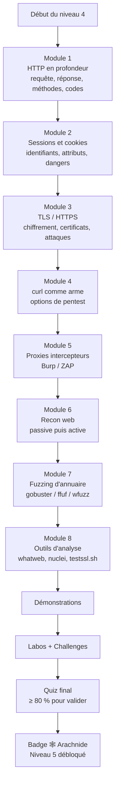
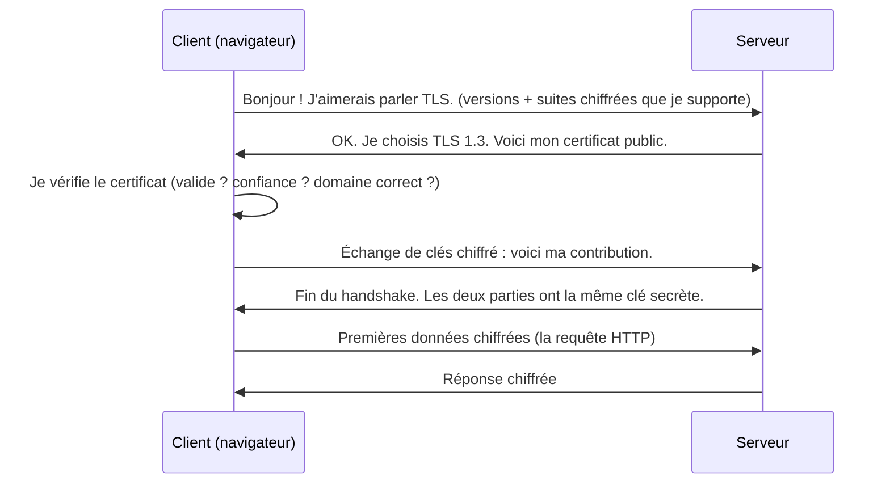
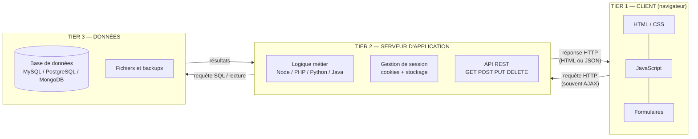
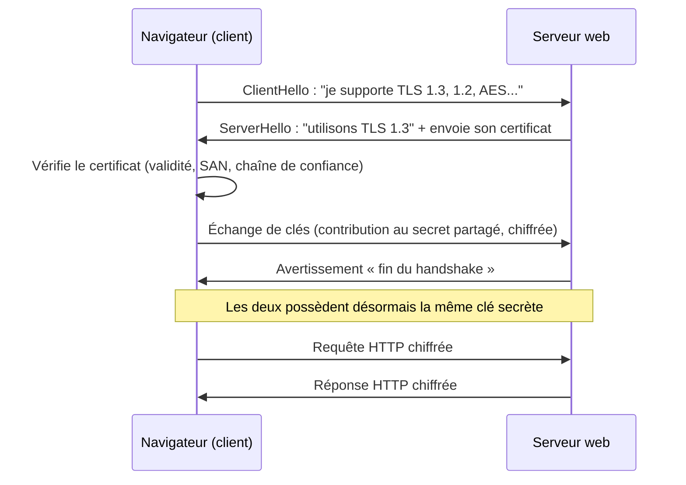
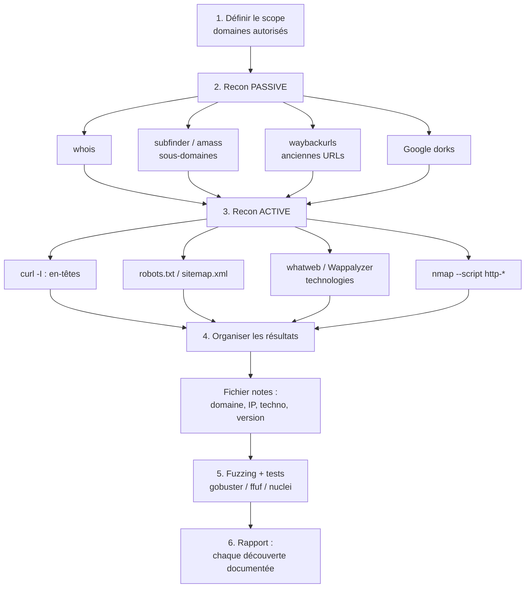

# Présentation

Bienvenue au niveau 4 de CyberAcademy : **Web Security 🕸️**.

Jusqu'ici, tu as appris à comprendre la machine (niveau 0), à dominer le terminal (niveau 1), à voyager sur le réseau (niveau 2) et à fabriquer tes propres outils (niveau 3). Tout cela formait la **machinerie**. Ce cours, lui, te fait franchir une frontière : tu vas apprendre à **parler le langage que parle la quasi-totalité du monde moderne** — le langage HTTP.

## Pourquoi la sécurité web est LA compétence de départ

Regarde autour de toi. La banque, la boutique en ligne, le réseau social, la messagerie, la borne de la gare, l'application météo du téléphone, le tableau de bord de ta voiture… Presque tout ce qui échange des données passe aujourd'hui par le **web** : un ensemble de services accessibles via le protocole HTTP (HyperText Transfer Protocol, « protocole de transfert hypertexte »).

**Analogie.** Imagine une ville immense où **chaque bâtiment est une application web**. Les rues sont les réseaux, les numéros de porte sont les adresses IP, et les fenêtres sont les ports. Un cambrioleur traditionnel doit se déplacer de quartier en quartier. Un attaquant web, lui, peut rester assis sur son canapé et « sonner » à des **millions de portes par seconde**, sans jamais bouger. Le web est donc la **plus grande surface d'attaque jamais construite** : c'est par elle que passent la majorité des compromissions de données.

Pourquoi est-ce important concrètement ?

- **La majorité des failles exploitées chaque année touchent des applications web.** Des milliards d'identifiants, de cartes bancaires et de documents volés proviennent de sites mal protégés.
- **Le web est partout** : une entreprise moyenne possède plusieurs dizaines d'applications web internes et externes, souvent oubliées et non surveillées.
- **L'entrée principale en entreprise** : la plupart des campagnes d'attaque commencent par un site web vulnérable (un formulaire mal filtré, une page d'administration exposée, un mot de passe faible) avant de remonter vers les serveurs internes.
- **C'est le métier le plus demandé** : les offres de pentester (testeur d'intrusion), d'AppSec engineer (ingénieur sécurité applicative) et de bug bounty hunter (chasseur de failles rémunéré) explosent.

## Où c'est utilisé

| Domaine | Usage de la sécurité web |
| ------- | ------------------------ |
| **Pentest (test d'intrusion)** | évaluer les applications web d'un client avant qu'un attaquant ne le fasse |
| **Bug Bounty** | chasser des failles sur des programmes publics (HackerOne, Bugcrowd, YesWeHack) |
| **AppSec / DevSecOps** | sécuriser le code et les déploiements, revue de code, durcissement (hardening) |
| **SOC / CSIRT** | analyser des attaques web dans les journaux (logs), comprendre les payloads (charges utiles) |
| **Red Team** | simuler des attaques réalistes qui passent par des apps web comme point d'entrée |
| **CTF** | la catégorie « Web » est la plus présente dans les compétitions de hacking |

## Métiers concernés

| Métier | Rôle | Ce que le niveau 4 t'apporte |
| ------ | ---- | ---------------------------- |
| **Pentester web** | évaluer la sécurité d'applications et rédiger des rapports | lire/modifier des requêtes, recon, fuzzing, analyse des en-têtes |
| **Bug bounty hunter** | trouver des bugs rémunérés sur des programmes autorisés | la boîte à outils de base du chasseur : curl, proxies, fuzzing |
| **AppSec Engineer** | intégrer la sécurité dans le cycle de développement | comprendre comment les failles naissent pour les empêcher |
| **SOC Analyst** | détecter et analyser les attaques web | reconnaître une requête malveillante dans les logs |
| **Développeur web « conscient »** | écrire du code web | connaître les mécanismes (cookies, sessions, TLS) qui protègent les utilisateurs |

## Prérequis

Ce cours est conçu pour des débutants ayant validé les niveaux 0 à 3 :

- **Niveau 0 — Computer Fundamentals** : savoir ce qu'est un OS, un processus, un fichier, une permission.
- **Niveau 1 — Linux Fundamentals** : être à l'aise dans un terminal, avec `ls`, `cd`, `grep`, les permissions. **Obligatoire.**
- **Niveau 2 — Networking** : connaître IP, port, TCP/UDP, le DNS et **les bases de HTTP** (ce cours approfondit HTTP, mais tu dois déjà savoir qu'une requête part vers une adresse et reçoit une réponse). **Fortement recommandé.**
- **Niveau 3 — Python / Bash** : savoir écrire une boucle, lancer `curl`, structurer un petit script. Tu en auras besoin pour les labos et les challenges.

> ⏱️ **Temps estimé : 12 heures** — soit environ 3 séances de 4 heures.
> 📊 **Niveau : 4** — 5ᵉ maillon de la roadmap CyberAcademy (niveaux 0 → 11).

## Ce que tu vas savoir faire à la fin

Tu ne vas pas devenir un expert des failles avancées (ce sera le niveau 5, OWASP Top 10). Tu vas acquérir les **fondations indispensables** :

- lire une requête et une réponse HTTP **dans les moindres détails** (comme un mécanicien qui lit les voyants avant de démonter le moteur) ;
- manipuler `curl` comme un pentester (et non comme un simple téléchargeur de pages) ;
- intercepter, lire et **modifier** des requêtes avec un proxy (Burp Suite / ZAP) ;
- faire une **reconnaissance** (recon) propre : collecter des informations publiques sur une cible avant toute attaque ;
- découvrir des pages et fichiers cachés par **fuzzing** (tentative systématique de chemins) ;
- comprendre **cookies, sessions et TLS/HTTPS** : comment ils protègent, et comment ils sont attaqués ;
- tester les **en-têtes de sécurité** d'un site en quelques secondes.

Tout ceci sera réutilisé à chaque niveau suivant : la « méthodologie pentest » du niveau 6 n'est que l'orchestration de ces briques.

---

> ⚠️ **Légal** — Règle absolue : tu n'as le droit de tester que **tes propres machines**, tes **propres applications**, ou des cibles **explicitement autorisées** : ton ordinateur, une machine virtuelle (VM), `127.0.0.1` (localhost, ton propre ordinateur), les plateformes d'entraînement (TryHackMe, HackTheBox, Root-Me, PortSwigger Web Security Academy) et les labs isolés. Interroger, scanner ou « tester » un site qui n'est pas le tien **sans autorisation écrite** est illégal dans la plupart des pays (loi Godfrain en France, Computer Fraud and Abuse Act aux États-Unis, etc.). Dans ce cours, la grande majorité des exemples s'exercent sur **httpbin.org** (service public de test) et sur des applications de test locales lancées dans des containers Docker. Utilise tes outils uniquement là. Le reste de ce cours présuppose ce cadre.

---

## Objectifs pédagogiques

À la fin de ce cours, tu seras capable de :

1. **Lire et modifier des requêtes HTTP** : décomposer une requête complète (ligne de départ, en-têtes, corps), identifier le rôle de chaque partie, et reconstruire une requête à la main avec `curl` en utilisant `-X`, `-H`, `-d`, `-A`, `--path-as-is`.
2. **Analyser une réponse HTTP** : interpréter le code de statut (1xx à 5xx) et les en-têtes essentiels (`Server`, `Set-Cookie`, `Content-Type`, `Location`, en-têtes de sécurité), et savoir ce que chaque information révèle à un pentester.
3. **Comprendre les mécanismes de session** : expliquer le rôle des cookies et des attributs `Secure`, `HttpOnly`, `SameSite`, distinguer session d'authentification et cookie de suivi, et identifier les dangers (fixation, vol de session).
4. **Expliquer TLS/HTTPS** : décrire le handshake (établissement d'une connexion chiffrée) de façon simplifiée, la notion de certificat et de chaîne de confiance, et nommer les attaques liées (man-in-the-middle, SSL stripping, certificats invalides).
5. **Effectuer une recon web passive et active** : collecter robots.txt, en-têtes, sous-domaines (`subfinder`, `amass`), historiques (`waybackurls`), et organiser les résultats.
6. **Découvrir des ressources cachées par fuzzing** : lancer `gobuster`, `ffuf` ou `wfuzz` avec une wordlist adaptée, interpréter les codes de réponse et filtrer le bruit.
7. **Intercepter et manipuler le trafic avec un proxy** : configurer Burp Suite Community ou OWASP ZAP, lire une requête, la modifier, et comprendre l'utilité du Repeater pour les tests répétitifs.

---

## Vue d'ensemble

Voici la feuille de route de ce cours. Chaque module s'appuie sur le précédent, comme un escalier : tu ne peux pas sauter de marches.



### Tableau des modules

| Module | Contenu | Durée estimée | Compétence clé |
| ------ | ------- | ------------- | -------------- |
| 1. HTTP en profondeur | requête/réponse, méthodes, codes, en-têtes | 1 h 30 | lire le trafic |
| 2. Sessions et cookies | attributs, session, fixation, vol | 1 h 30 | comprendre l'authentification |
| 3. TLS / HTTPS | handshake, certificats, chaîne de confiance, attaques | 1 h 30 | sécuriser/analyser le canal |
| 4. curl comme arme | options `-i -I -X -H -d -b -c -L -A -k --path-as-is` | 1 h | forger des requêtes |
| 5. Proxies intercepteurs | Burp Community, ZAP, Repeater | 1 h 30 | intercepter/modifier |
| 6. Recon web | robots, dorks, whois, subfinder, amass, wayback | 1 h 30 | collecter des infos |
| 7. Fuzzing d'annuaire | gobuster, ffuf, wfuzz, wordlists | 1 h 30 | découvrir du caché |
| 8. Outils d'analyse | whatweb, nuclei, testssl.sh, dev tools | 1 h | vérifier vite |
| Quiz et révision | QCM, TP, challenges | 1 h | valider |

---

## Théorie

> Cette section est le cœur du cours. Pour chaque notion, nous suivons le même fil conducteur : **Définition → Pourquoi → Historique → Fonctionnement interne → Architecture → Cas d'utilisation → Exemple réel → Bonnes pratiques → Résumé**. Le **POURQUOI vient toujours avant le COMMENT** : comprendre d'abord ce que la brique fait et pourquoi elle existe, ensuite seulement comment l'utiliser.

---

### a) HTTP en profondeur : requête et réponse complètes

**Définition.** HTTP (HyperText Transfer Protocol, « protocole de transfert hypertexte ») est le **langage** que parlent un client (ton navigateur, ton `curl`) et un serveur web. C'est un protocole dit **requête-réponse** : le client demande, le serveur répond. Chaque échange est une **requête** (question) suivie d'une **réponse** (réponse). Ces échanges sont du **texte clair lisible**, contrairement à bien des protocoles binaires : c'est une chance pour nous, car on peut tout lire, tout comprendre et tout forger à la main.

**Pourquoi.** Le web ne peut fonctionner que si les deux machines **se comprennent parfaitement**. Le protocole est ce contrat : une liste de règles précises qui dit comment formuler une demande et comment formuler une réponse. Sans cette convention partagée, un navigateur d'un éditeur ne pourrait pas parler à un serveur d'un autre éditeur.

**Historique.** HTTP est né en 1991 au CERN (Centre européen pour la recherche nucléaire) avec Tim Berners-Lee, inventeur du World Wide Web. La version 1.0 est formalisée en 1996, la **HTTP/1.1** en 1997 (RFC 7230-7235 aujourd'hui) — c'est encore la plus courante. Suivent **HTTP/2** (2015, multiplexage des flux) et **HTTP/3** (2022, sur QUIC/UDP). Malgré ces évolutions de transport, le **concept de requête/réponse reste identique depuis 1991** : c'est cette stabilité qui rend le protocole si lisible.

**Fonctionnement interne — la requête.** Une requête HTTP se compose de trois parties :

1. **La ligne de départ** : la méthode (l'action voulue), le chemin et la version. Exemple : `GET /catalogue/velo.html HTTP/1.1`.
2. **Les en-têtes (headers)** : des lignes `Nom: valeur` qui décrivent la requête. Chaque en-tête est une **métadonnée** : qui parle, quoi demander, avec quels cookies, dans quel format.
3. **Le corps (body)** : optionnel, présent surtout avec POST. C'est la « lettre » envoyée : données de formulaire, contenu d'un fichier, JSON.

En-têtes courants d'une requête :

| En-tête | Rôle | Lecture pentest |
| ------- | ---- | --------------- |
| `Host` | le **nom de domaine** demandé (obligatoire en HTTP/1.1) | révèle les vhosts (sites hébergés sur la même IP) |
| `User-Agent` | le logiciel qui parle (navigateur, outil…) | spoofable (falsifiable) : les bots se cachent souvent derrière un UA connu |
| `Cookie` | l'ensemble des cookies du client pour ce site | si le cookie est faible, c'est une cible |
| `Content-Type` | le format du corps (`application/x-www-form-urlencoded`, `application/json`…) | révèle le type d'API attendu |
| `Authorization` | les identifiants (Basic, Bearer JWT…) | sa présence indique un mécanisme d'auth que l'on peut tester |
| `Referer` | la page d'où vient le client | fuite d'infos : sert à voir la chaîne de navigation |
| `Accept` | les formats que le client accepte | rarement utile pour l'attaque |
| `Content-Length` | la taille du corps en octets | un écart avec le contenu réel trahit un serveur mal configuré |

**Fonctionnement interne — la réponse.** Une réponse HTTP a aussi trois parties :

1. **La ligne de statut** : la version, un code à 3 chiffres et sa signification. Exemple : `HTTP/1.1 404 Not Found`.
2. **Les en-têtes de réponse**.
3. **Le corps** : la page HTML, le JSON, l'image, ou rien.

En-têtes courants d'une réponse :

| En-tête | Rôle | Lecture pentest |
| ------- | ---- | --------------- |
| `Server` | le logiciel serveur et sa version (`Apache/2.4.41`, `nginx/1.18`) | **vulnérabilités connues par version** : on cherche la version exacte |
| `Set-Cookie` | ordre donné au client de **stocker un cookie** | c'est lui qui installe la session ; son contenu peut être analysé |
| `Content-Type` | le format du corps renvoyé | un JSON servi en `text/html` peut indiquer un mauvais réglage |
| `Location` | la cible d'une redirection (avec code 3xx) | les redirections mal gérées peuvent fuir des infos |
| `Content-Length` | taille du corps | aide à détecter des réponses inhabituelles pendant le fuzzing |
| `Date` | date et heure du serveur | la dérive d'heure peut révéler l'infrastructure |
| `X-Powered-By` | la techno (PHP, ASP.NET…) | divulgation d'information (info disclosure) |

**Architecture.** Le cycle d'un échange :

```
Client (navigateur/curl)
   │  1. ouvre une connexion TCP vers serveur:80
   │  2. envoie la requête (texte)
   ▼
Serveur web (nginx, Apache…)
   │  3. lit la requête, traite la demande
   │  4. renvoie la réponse (texte)
   ▼
Client (navigateur/curl)
```

**Cas d'utilisation.** Tout navigateur web utilise HTTP toutes les secondes : chaque clic, chaque image, chaque appel de formulaire. Pour le pentester, comprendre la requête en détail, c'est pouvoir la **reproduire à la main** et la **modifier** — la base de toute attaque (on ne modifie une attaque que si l'on comprend la requête).

**Exemple réel.** Tu ouvres `https://exemple.fr/panier` dans un navigateur. Le navigateur envoie une requête qui contient le cookie de session (sinon le serveur ne sait pas que c'est toi), l'en-tête `Host: exemple.fr`, un `User-Agent: Mozilla/5.0...`. Le serveur répond avec `200 OK`, le `Set-Cookie` de session si tu n'en as pas, et la page HTML. Le serveur **n'a aucune mémoire** : tout son savoir sur « qui tu es » est dans les cookies que tu renvoies à chaque requête.

**Bonnes pratiques.**

- Toujours regarder la requête **et** la réponse (jamais juste le code de statut).
- Noter le `Server` et ses versions : c'est la première ligne d'une recherche de vulnérabilités connues.
- Ne jamais faire confiance à un en-tête : `User-Agent`, `Referer`, `Cookie` peuvent être **totalement falsifiés** par le client.
- En HTTP/1.1, `Host` est obligatoire : une requête sans `Host` est mal formée.

**Résumé.** HTTP est un protocole texte requête-réponse. Une requête = ligne de départ + en-têtes + corps optionnel ; une réponse = ligne de statut + en-têtes + corps. Chaque en-tête est une métadonnée ; le serveur est sans mémoire et s'appuie sur les cookies pour te reconnaître. Pour le pentester, savoir lire ces trois parties, c'est savoir parler couramment la langue de sa cible.

---

### b) Les méthodes HTTP et leurs implications sécurité

**Définition.** La **méthode** HTTP (aussi appelée verbe) est le premier mot de la ligne de départ : elle dit au serveur **quelle action** tu veux effectuer. `GET` demande une ressource, `POST` envoie des données, `DELETE` supprime…

**Pourquoi.** Le protocole a besoin d'un vocabulaire d'actions précis pour que client et serveur se mettent d'accord sur l'intention : *« je veux lire »* n'est pas *« je veux modifier »*. Pour le pentester, tester les méthodes **non prévues** est une étape clé : un serveur mal configuré peut accepter des actions dangereuses qu'il ne devrait pas.

**Historique.** Le HTTP/1.0 original ne définissait que `GET`, `POST`, `HEAD`. HTTP/1.1 a ajouté `PUT`, `DELETE`, `OPTIONS`, `TRACE`. D'autres méthodes existent (`PATCH` ajouté plus tard, `CONNECT` pour les tunnels proxy, etc.). Ce vocabulaire provient de la modélisation des opérations CRUD (Create, Read, Update, Delete — créer, lire, modifier, supprimer) sur des ressources.

**Fonctionnement interne.** La méthode est un mot en majuscules suivi du chemin :

```
GET /panier HTTP/1.1
POST /recherche HTTP/1.1
OPTIONS /api/ HTTP/1.1
```

Le tableau des méthodes principales et leurs implications :

| Méthode | Action prévue | Implication sécurité |
| ------- | ------------- | -------------------- |
| `GET` | récupérer une ressource | **ne doit jamais modifier l'état** ; si un GET modifie des données, c'est un bug (CSRF, préchargement) |
| `POST` | envoyer des données / créer | c'est le véhicule des formulaires ; les attaques d'injection passent souvent par là |
| `PUT` | remplacer/créer une ressource | si autorisé sans contrôle, permet d'**écrire des fichiers** sur le serveur |
| `DELETE` | supprimer une ressource | si autorisé sans contrôle d'autorisation, destruction de données |
| `PATCH` | modification partielle | comme PUT, potentielle écriture si mal contrôlé |
| `HEAD` | identique à GET mais **sans le corps** | parfait pour la reconnaissance : on teste l'existence sans télécharger |
| `OPTIONS` | demander les méthodes autorisées | révèle le **menu des actions** possibles (via `Allow`) |
| `TRACE` | écho de la requête reçue | permet le **XST** (Cross-Site Tracing) et peut refléter des cookies ; à désactiver |

**Architecture.** Le serveur associe chaque méthode à un comportement (une « route »). Si le code ne gère pas une méthode, certains serveurs renvoient automatiquement `405 Method Not Allowed` (méthode non autorisée) ; d'autres, mal configurés, traitent la méthode de façon inattendue — c'est là que ça devient intéressant pour nous.

**Cas d'utilisation.** En pentest, après l'identification d'une URL, on teste souvent `OPTIONS` pour voir les méthodes autorisées, puis `HEAD` pour confirmer l'existence d'un fichier sans télécharger son contenu, et on tente `PUT` sur des serveurs de fichiers pour vérifier s'ils permettent l'écriture.

**Exemple réel.** Un serveur de fichiers avec une API autorisant par erreur `PUT /uploads/page.html` sans authentification : un attaquant « dépose » une page de phishing directement sur le domaine légitime. C'est une faute de configuration classique sur les serveurs type WebDAV ou les buckets de stockage mal réglés.

**Bonnes pratiques.**

- Tester `OPTIONS` en premier : il t'indique le vocabulaire autorisé (`Allow: GET, HEAD, OPTIONS`).
- Ne jamais supposer qu'une méthode est inoffensive : vérifier si elle modifie l'état.
- `TRACE` est un signal d'alerte : un serveur qui le supporte peut révéler les en-têtes internes (et les cookies si `HttpOnly` est absent).
- En `curl`, ne pas utiliser `-X GET` sans raison : `-X` force la méthode mais change parfois le comportement (vide la requête des données).

**Résumé.** La méthode est l'action d'une requête. GET lit, POST envoie, PUT/PATCH/DELETE écrivent ou suppriment, HEAD sonde sans corps, OPTIONS liste, TRACE reflète. Tester les méthodes inattendues révèle des serveurs mal configurés et des autorisations manquantes.

---

### c) Les codes de statut HTTP et leur lecture pentest

**Définition.** Le **code de statut** est un nombre à trois chiffres dans la première ligne de la réponse. Il dit au client **ce qui s'est passé** : succès, redirection, erreur du client ou du serveur. La première décimale indique la **famille**.

**Pourquoi.** Sans code de statut, un client ne saurait pas s'il doit afficher la page, suivre une redirection ou afficher une erreur. Pour le pentester, le code est un **révélateur** : il raconte comment le serveur réagit à chaque tentative — et une réaction « anormale » est souvent un indice (existence d'une ressource, mauvaise configuration, faille).

**Historique.** Le code à trois chiffres existe depuis le HTTP/1.0. La famille (1xx, 2xx, 3xx…) est restée stable : c'est un langage codé universel, compris par tous les clients du monde.

**Fonctionnement interne.** Les cinq familles :

| Famille | Nom | Signification générale |
| ------- | --- | ---------------------- |
| **1xx** | Informational | le serveur a reçu la demande, le traitement continue |
| **2xx** | Success | la demande a réussi |
| **3xx** | Redirection | il faut aller voir ailleurs (nouvelle adresse) |
| **4xx** | Client Error | la demande est mauvaise (problème côté client) |
| **5xx** | Server Error | le serveur a échoué (problème côté serveur) |

Les codes les plus importants en pentest :

| Code | Nom | Lecture pentest |
| ---- | --- | --------------- |
| `200` | OK | la ressource existe et est renvoyée |
| `201` | Created | la création a réussi (une action POST/PUT a fonctionné) |
| `204` | No Content | succès mais rien à renvoyer — les requêtes de modification renvoient souvent ça |
| `301` | Moved Permanently | déplacement définitif — suivre le `Location` |
| `302` | Found | déplacement temporaire — très utilisé après un login réussi (`Location: /dashboard`) |
| `303` | See Other | redirection après POST (pattern PRG, Post/Redirect/Get) |
| `307`/`308` | Temporary/Permanent Redirect | redirections qui **conservent** la méthode et le corps |
| `400` | Bad Request | requête mal formée — tu as peut-être mal construit ta requête |
| `401` | Unauthorized | **authentification requise** : le serveur ne sait pas qui tu es |
| `403` | Forbidden | tu es reconnu, mais **interdit d'accès** |
| `404` | Not Found | ressource inexistante — le code du fuzzing |
| `405` | Method Not Allowed | la ressource existe mais pas avec cette méthode — essaie `OPTIONS` |
| `429` | Too Many Requests | tu as été limité en fréquence — ralentis ou tu seras bloqué |
| `500` | Internal Server Error | le serveur a planté — **trésor** : un crash est souvent déclenché par une entrée inattendue |
| `501` | Not Implemented | méthode non supportée du tout |
| `503` | Service Unavailable | serveur surchargé ou en maintenance |

**Piège classique pour débutant : `401` vs `403`.**

- `401 Unauthorized` = « **qui** es-tu ? » — l'authentification (preuve d'identité) a échoué ou manque.
- `403 Forbidden` = « je sais **qui** tu es, mais tu n'as **pas le droit** ». L'authentification a réussi, l'autorisation est refusée.
- Un site qui renvoie `403` au lieu de `404` pour une ressource inexistante **divulgue** l'existence d'un chemin interdit : information précieuse.

**Cas d'utilisation.** Pendant un fuzzing d'annuaire, le `404` est la réponse « normale » pour un chemin absent ; tout autre code (`200`, `301`, `500`, `403`) signale un chemin qui **existe**. Pendant un test de connexion, un `302` vers une page de succès confirme que les identifiants sont bons.

**Exemple réel.** En fuzzing, tu testes `/admin`. Réponse `403 Forbidden`. Tu testes `/admin.html`. Réponse `200 OK`. Le serveur vient de te dire : « la zone admin existe, elle est interdite, et il y a aussi une version HTML accessible ». Deux découvertes pour deux requêtes.

**Bonnes pratiques.**

- Filtrer les `404` pendant le fuzzing, mais **regarder** les `403`, `301`, `500`.
- Ne jamais conclure sur un seul code : vérifier le **corps** de la réponse (une page `200` générique de « page non trouvée » doit être traitée comme un 404).
- En pentest, les `500` se notent : ils révèlent des points où le serveur accepte des entrées malformées.
- Un code `429` indique une limitation de débit : s'y conformer (ou utiliser une wordlist plus petite).

**Résumé.** Les codes de statut racontent l'issue de chaque échange en cinq familles (1xx info, 2xx succès, 3xx redirection, 4xx erreur client, 5xx erreur serveur). Pour le pentester ce sont des **signaux** : existence d'une ressource, comportement de redirection, erreur déclenchable, limite de débit. Savoir les lire, c'est savoir interpréter la conversation du serveur.

---

### d) Les en-têtes de sécurité

**Définition.** Les **en-têtes de sécurité** sont des réponses HTTP que le serveur envoie pour **demander au navigateur d'adopter des comportements plus sûrs** : ne pas s'afficher dans une autre page, ne pas exécuter de contenu non approuvé, ne pas naviguer en HTTP, etc. Ce sont des « consignes » écrites dans la réponse.

**Pourquoi.** Un serveur ne contrôle pas ce que le navigateur fait par défaut. Par exemple, un navigateur va volontiers afficher ton site dans une iframe (cadre intégré dans une autre page) — ce qui permet à un attaquant de faire du **clickjacking** (piège à clic) : superposer un site transparent par-dessus un bouton réel. Les en-têtes de sécurité permettent au serveur de **verrouiller les réglages par défaut** du navigateur.

**Historique.** Le premier grand chantier fut **X-Frame-Options** (2009, contre le clickjacking), suivi de **Strict-Transport-Security** (2010, imposer HTTPS), de **X-Content-Type-Options** (2011) et de **Content-Security-Policy** (CSP, 2012-2013), le plus puissant et le plus complexe. La liste n'a cessé de s'enrichir.

**Fonctionnement interne.** Le serveur ajoute une ligne à la réponse ; le navigateur la lit et ajuste son comportement. Rien n'est magique : si le navigateur est ancien ou mal configuré, il ignore la consigne.

Les en-têtes essentiels :

| En-tête | Consigne donnée au navigateur | Protège contre | Exemple de valeur |
| ------- | ----------------------------- | -------------- | ----------------- |
| `Content-Security-Policy` | n'exécute que les scripts/ressources de sources approuvées | XSS (exécution de scripts), injection | `default-src 'self'; script-src 'self'` |
| `X-Frame-Options` | ne m'affiche pas dans une iframe | clickjacking | `DENY` ou `SAMEORIGIN` |
| `Strict-Transport-Security` (HSTS) | force tout futur accès en HTTPS | SSL stripping, rétrogradation HTTP | `max-age=31536000; includeSubDomains` |
| `X-Content-Type-Options` | ne « devine » pas le type MIME | MIME sniffing (interprétation de fichiers inattendus) | `nosniff` |
| `Referrer-Policy` | contrôle les infos envoyées dans `Referer` | fuite d'informations | `strict-origin-when-cross-origin` |
| `Permissions-Policy` | limite les API du navigateur (caméra, micro, géolocalisation) | abus des capacités du navigateur | `geolocation=()` |

D'autres en-têtes utiles : `Cache-Control` (éviter la mise en cache de pages sensibles : `no-store`), `Cross-Origin-Opener-Policy` / `Cross-Origin-Resource-Policy` (isolation des fenêtres). Et un en-tête à ne **pas** laisser exposé : `X-Powered-By: PHP/7.4`, qui divulgue la technologie.

**Architecture.** Le navigateur est le « gendarme » ; le serveur lui passe les consignes par les en-têtes. Le schéma mental :

```
Serveur ──réponse──>  "X-Frame-Options: DENY"
Navigateur ──exécute──>  "je n'afficherai jamais ce site dans une iframe"
```

**Cas d'utilisation.** Un pentester web commence presque toujours par vérifier les en-têtes de sécurité d'une cible (`curl -I`). Une absence de CSP, c'est un XSS potentiellement exploitable ; une absence de HSTS, c'est une attaque de type SSL stripping envisageable ; une absence de `X-Frame-Options`, c'est un clickjacking possible.

**Exemple réel.** Banque en ligne avec page de virement. Sans `X-Frame-Options`, un attaquant affiche cette page dans une iframe transparente sur son site « gagnez un cadeau », et quand la victime clique sur le bouton du faux site, elle clique en réalité sur « Valider le virement ». L'en-tête `DENY` rend l'attaque impossible en quelques secondes.

**Bonnes pratiques.**

- Vérifier systématiquement : CSP, X-Frame-Options, HSTS, X-Content-Type-Options, Referrer-Policy.
- Un site qui envoie `Server: Apache` **et** `X-Powered-By: PHP` divulgue trop : le noter au rapport.
- `CSP` est puissant mais délicat : un CSP trop strict casse le site. Le tester en `Content-Security-Policy-Report-Only` (mode rapport sans blocage) d'abord.
- Ne jamais confondre « en-tête présent » et « en-tête efficace » : vérifier la valeur (`X-Frame-Options: SAMEORIGIN` n'empêche pas les iframes **même-origine** ; un CSP avec `'unsafe-inline'` laisse passer beaucoup de XSS).

**Résumé.** Les en-têtes de sécurité sont des consignes du serveur au navigateur pour durcir son comportement par défaut. Les cinq essentiels : CSP (limite l'exécution), X-Frame-Options (interdit l'iframe), HSTS (impose HTTPS), X-Content-Type-Options (bloque le sniffing), Referrer-Policy (limite les fuites). Leur absence est une vulnérabilité à signaler, même si ce n'est pas toujours exploitable.

---
### e) L'architecture d'une application web

**Définition.** Une application web est un **système en couches** qui transforme une requête HTTP en action réelle. L'architecture classique est dite **3-tiers** (trois niveaux) : le **client** (ce qui s'affiche), le **serveur d'application** (la logique) et la **base de données** (le stockage). Entre eux circulent des requêtes, souvent via des **APIs REST** (Application Programming Interface, interface de programmation d'applications) et des **requêtes AJAX** (asynchrones, en arrière-plan).

**Pourquoi.** Séparer les couches permet de faire évoluer, réparer et sécuriser chaque partie indépendamment. Le serveur n'expose que ce dont le client a besoin ; la base de données reste cachée derrière le serveur. Comprendre cette architecture, c'est savoir **où chercher** quand on teste : la faille peut être dans le client, dans l'API, ou dans la logique du serveur.

**Historique.** Dans les années 1990, un site web était une collection de **pages statiques** (fichiers HTML servis tels quels). Puis les pages **dynamiques** sont apparues : le serveur générait du HTML à la volée (CGI, PHP, ASP…). Avec l'avènement des smartphones et des « single-page applications » (applications qui ne rechargent pas la page, type Gmail), le client est devenu un programme à part entière qui parle à une **API** en JSON (JavaScript Object Notation, « notation d'objets JavaScript »). Aujourd'hui, le « web » inclut aussi les applications mobiles, qui ne sont que des clients de la même API.

**Fonctionnement interne.** Les trois tiers :

1. **Client** (front-end) : le navigateur exécute HTML, CSS et JavaScript. C'est la seule partie visible. Il envoie des requêtes au serveur.
2. **Serveur d'application** (back-end) : le programme qui exécute la logique métier. Il reçoit les requêtes, décide quoi faire (vérifier la session, calculer un prix, chercher un article), et répond. Les technos courantes : Node.js, PHP, Python (Django/Flask), Java (Spring), Go, Ruby on Rails. Il parle à la base de données et souvent à d'autres services.
3. **Base de données** (données) : le stockage. SQL (Structured Query Language, « langage de requêtes structuré » — MySQL, PostgreSQL, SQLite) ou NoSQL (MongoDB…). Elle stocke utilisateurs, articles, commandes, sessions.

**Architecture.** Le schéma type avec une API REST et une requête AJAX :

```
[ Navigateur ]
     │  HTML + CSS + JavaScript (le client)
     │      │
     │      └── AJAX ── requête HTTP ──▶ [ API REST (serveur) ]
     │                                       │  exécute la logique métier
     │                                       ▼
     │                              [ Base de données ]
     │      ◀── réponse JSON ───────────────┘
     ▼
 [ Mise à jour partielle de la page, sans rechargement ]
```

**REST** (REpresentational State Transfer, « transfert d'état représentationnel ») est un style d'API où les ressources (utilisateurs, articles) sont identifiées par des URLs et manipulées avec les méthodes HTTP : `GET /api/users`, `POST /api/users`, `DELETE /api/users/5`. Les réponses sont typiquement du JSON. **AJAX** (Asynchronous JavaScript And XML, aujourd'hui souvent du JSON) désigne les requêtes lancées par le JavaScript **en arrière-plan**, sans recharger la page : la carte qui se met à jour, le « j'aime » sans rechargement.

**Cas d'utilisation.** En pentest, l'architecture dit où aller : on teste le **front** (XSS dans les champs, comportements du JavaScript), l'**API** (entrées non validées, autorisations absentes, identifiants exposés), et le **serveur** (versions, configuration). Les endpoints d'API (`/api/`, `/v1/`, `/graphql`) sont souvent des mines : moins testés, parfois protégés plus faiblement que la partie publique.

**Exemple réel.** Une boutique en ligne. Le client affiche le panier ; quand tu changes la quantité, le JavaScript envoie `PATCH /api/cart/items/42` avec `{"quantity": 2}` ; le serveur interroge MySQL, recalcule le total et renvoie le JSON ; le navigateur met à jour le total **sans recharger la page**. Si le serveur fait confiance à la quantité reçue sans vérifier le stock ni le prix, un attaquant pourrait mettre une quantité négative ou manipuler le prix.

**Bonnes pratiques.**

- Pour tester une app, ouvrir les DevTools du navigateur (onglet **Network**/Réseau) et observer les requêtes AJAX : ce sont les vraies conversations.
- Noter les endpoints d'API : `/api/`, `/v1/`, `/graphql` sont des cibles de choix.
- Rappel : tout ce qui tourne dans le navigateur (JavaScript, données, clés API) est **visible et modifiable** par l'utilisateur. Rien de « caché » côté client n'est sûr.
- Le serveur doit **valider** ce qu'il reçoit du client ; un client ne doit jamais être source de vérité.

**Résumé.** Une application web = client (navigateur) + serveur d'application (logique) + base de données (stockage), reliés par HTTP, souvent via une API REST avec des requêtes AJAX. Le pentester cherche la faille dans l'une de ces couches, et l'API est un terrain de chasse privilégié.

---

### f) Les cookies : attributs, session et suivi

**Définition.** Un **cookie** est un petit fragment de texte (quelques centaines d'octets) que le serveur demande au navigateur de stocker (`Set-Cookie`), et que le navigateur renvoie automatiquement à chaque requête suivante vers le même site (`Cookie`). C'est la « carte d'identité de poche » du navigateur : le serveur, sans mémoire, s'en sert pour te reconnaître.

**Pourquoi.** Le protocole HTTP est **sans état (stateless)** : chaque requête est indépendante des précédentes, le serveur oublie tout entre deux requêtes. Sans cookies, il ne saurait pas que la page 2 que tu demandes vient de la même personne que la page 1. Les cookies apportent la **mémoire** dont HTTP manque.

**Historique.** Les cookies ont été inventés en 1994 par Lou Montulli chez Netscape pour gérer le panier d'achat en ligne. Leur nom vient du « magic cookie », un petit fichier de données que les programmes UNIX s'échangeaient. Dès 1996-1997, ils ont été critiqués pour le **suivi publicitaire** : un site peut poser un cookie de suivi pour te reconnaître sur d'autres sites (cookies tiers).

**Fonctionnement interne.** Le cycle de vie d'un cookie :

```
1. Serveur :  Set-Cookie: session=ab12cd34; HttpOnly; Secure
2. Navigateur : je le stocke (associé au domaine et au chemin)
3. Navigateur → Serveur : Cookie: session=ab12cd34   (à chaque requête, tant qu'il est valide)
4. Expiration : le cookie disparaît (date) ou à la fermeture (cookie de session)
```

Les attributs d'un cookie et leur rôle :

| Attribut | Rôle | Si absent |
| -------- | ---- | --------- |
| `Secure` | envoyé **seulement** en HTTPS | il circule en clair en HTTP → interception facile |
| `HttpOnly` | **invisible pour le JavaScript** | un XSS peut voler le cookie via `document.cookie` |
| `SameSite` | contrôle l'envoi du cookie entre sites : `Strict`, `Lax`, `None` | vulnérabilité aux attaques cross-site (CSRF) |
| `Domain` | à quels domaines l'envoyer | l'utiliser trop large étend l'exposition |
| `Path` | à quels chemins l'envoyer | une portée trop large inonde inutilement |
| `Expires` / `Max-Age` | durée de vie | sans eux, cookie « de session » (effacé à la fermeture) |

**Deux usages très différents :**

- **Cookie de session (d'authentification)** : il identifie une personne connectée. S'il est volé, l'attaquant **prend l'identité** de la victime. C'est le cookie le plus sensible.
- **Cookie de suivi (tracking)** : utilisé par la publicité pour reconnaître un visiteur entre plusieurs sites. Sensible en **vie privée**, pas en authentification.

**Cas d'utilisation.** En pentest, on analyse les cookies : un cookie **prévisible** (incrémental `session=1`, `session=2`…) peut être **deviné** ; un cookie sans `HttpOnly` peut être volé par un XSS ; un cookie sans `Secure` circule en clair. On teste aussi si le cookie reste le même avant/après connexion (voir la section sessions).

**Exemple réel.** Un forum pose `Set-Cookie: session=7d3f...; HttpOnly; Secure; SameSite=Lax` après connexion. Le navigateur le renvoie ensuite automatiquement. Un attaquant qui vole ce cookie (via un XSS sur un autre site ou un réseau non chiffré) peut l'utiliser dans son propre navigateur et **agir comme la victime** sans mot de passe.

**Bonnes pratiques.**

- Vérifier la présence de `HttpOnly`, `Secure`, `SameSite` sur chaque cookie de session.
- Un cookie de session doit être **long, aléatoire et imprévisible** ; s'il est court ou incrémental, c'est un signal d'alerte.
- En test, garder les cookies entre requêtes avec `curl -c` / `curl -b` ou une `requests.Session()`.
- Ne jamais stocker de données sensibles directement dans le cookie (identifiant de session « brut », rôle `admin=1`).

**Résumé.** Un cookie est la mémoire portable d'HTTP : le serveur le pose (`Set-Cookie`), le navigateur le renvoie (`Cookie`). Ses attributs définissent sa sécurité : `Secure` (HTTPS only), `HttpOnly` (invisible au JavaScript), `SameSite` (portée entre sites). Le cookie de session est un sésame : s'il est volé ou deviné, l'identité tombe.

---

### g) Les sessions : identifiants, fixation et vol

**Définition.** Une **session** est l'ensemble du contexte d'une conversation entre un client et un serveur : qui est connecté, ce qu'il y a dans le panier, ses préférences. Comme HTTP est sans mémoire, le serveur stocke ce contexte côté serveur et le relie au client par un **identifiant de session (session ID)**, en général porté par un cookie. L'identifiant est la **clé** ; les données de la session sont le **coffre** (côté serveur).

**Pourquoi.** Il faut bien distinguer les deux notions : le cookie **contient** l'identifiant (la clé), pas les données. Si tout le contexte était dans le cookie, l'utilisateur pourrait le modifier (mettre « rôle : admin »). En gardant les données **côté serveur** et seulement la clé chez le client, le serveur reste maître de ce qui est vrai.

**Historique.** Les sessions ont été formalisées avec les cookies et les formulaires de connexion des années 1995-2000. PHP a popularisé `PHPSESSID`, ASP.NET `ASP.NET_SessionId`, Java `JSESSIONID`. Ces noms sont des repères : voir `PHPSESSID` dans un cookie, c'est savoir quelle technologie tourne derrière.

**Fonctionnement interne.** Le cycle d'une session :

```
1. Première visite : le serveur crée un identifiant aléatoire, le pose en cookie,
   et stocke côté serveur une ligne : session X = { rien encore }
2. Connexion réussie : le serveur associe la session X à { utilisateur: "alice", rôle: "user" }
3. Requêtes suivantes : le client renvoie le cookie ; le serveur retrouve le coffre
   et sait que c'est alice.
4. Déconnexion / expiration : la session est détruite, la clé ne vaut plus rien.
```

**Les deux grandes attaques sur les sessions :**

**1. Le vol de session (session hijacking).** L'attaquant obtient l'identifiant de la victime et l'utilise à sa place. Moyens d'obtention : vol de cookie par XSS (si pas de `HttpOnly`), interception sur un réseau non chiffré (si pas de `Secure`), log de referer, mauvais partage du cookie. La défense : `HttpOnly` + `Secure` + HTTPS partout + régénération de l'identifiant après connexion.

**2. La fixation de session (session fixation).** L'attaquant **impose** à la victime un identifiant qu'il connaît déjà (en le posant lui-même, par exemple en lui envoyant un lien qui pose le cookie), puis attend qu'elle se connecte. La session devient alors celle de la victime **connectée**, et l'attaquant, qui connaît l'identifiant, est connecté comme elle. La défense principale : **régénérer l'identifiant de session au moment de la connexion** (nouveau cookie après login), et ne jamais accepter un identifiant de session fourni par l'URL.

**Cas d'utilisation.** En pentest, on teste la gestion de session ainsi :

- le cookie change-t-il après connexion ? (sinon → fixation possible) ;
- le cookie est-il prévisible / devinable ? (court, incrémental, encodé sans hasard) ;
- la session expire-t-elle après déconnexion et après inactivité ?
- deux sessions simultanées sont-elles possibles ?
- le `HttpOnly` et le `Secure` sont-ils présents ?

**Exemple réel.** Un site de test pose `Set-Cookie: session=1` avant connexion, et **garde le même cookie** après connexion. En testant `session=1`, on constate qu'il est connecté en tant qu'utilisateur 1. En devinant `session=2`, on devient l'utilisateur 2. C'est une faille d'identifiants de session faibles (voir le Mini Challenge 3 de ce cours).

**Bonnes pratiques.**

- Un bon identifiant de session : au moins 128 bits d'aléa, imprévisible, non devinable.
- Régénération systématique après connexion (anti-fixation).
- `HttpOnly` + `Secure` + `SameSite=Lax` minimum sur le cookie de session.
- Expiration : déconnexion = destruction côté serveur, pas juste « on ne l'affiche plus ».

**Résumé.** La session = coffre côté serveur, l'identifiant = clé côté client (dans un cookie). Les deux attaques majeures : le **vol** (on prend ta clé) et la **fixation** (on te donne une clé qu'on connaît, puis on attend que tu te connectes). Les défenses : clés fortes et aléatoires, régénération au login, attributs sécurisés, expiration réelle.

---

### h) TLS / HTTPS : pourquoi, comment, et comment c'est attaqué

**Définition.** **TLS** (Transport Layer Security, « sécurité de la couche transport ») est un protocole qui **chiffre** les échanges entre un client et un serveur. **HTTPS** (HyperText Transfer Protocol **Secure**) est simplement HTTP transporté **par-dessus** TLS : `https://` = HTTP + TLS. **SSL** (Secure Sockets Layer, « couche de sockets sécurisées ») est l'ancien nom (et ancien standard) de TLS ; on dit encore « certificat SSL » par habitude, mais SSL est obsolète et dangereux depuis 2015-2016.

**Pourquoi.** HTTP en clair est une carte postale : n'importe qui sur le chemin (routeur, point Wi-Fi, FAI, attaquant du réseau) peut lire le contenu. Avec HTTPS, c'est une lettre scellée : seul le destinataire peut la lire. Le web moderne exige le chiffrement pour les mots de passe, les cookies, les paiements — **tout**.

**Historique.** SSL 2.0 (1995) fut vite cassé ; SSL 3.0 (1996) a duré 20 ans avant d'être mis à la retraite en 2015 (attaque POODLE). TLS 1.0 (1999), 1.1 (2006), 1.2 (2008) puis **1.3** (2018), aujourd'hui la référence. Les vieilles versions sont interdites progressivement par les navigateurs.

**Fonctionnement interne — le handshake simplifié.** Avant tout échange chiffré, client et serveur doivent se mettre d'accord sur les clés. Version simplifiée en quatre temps :



Le point crucial : le certificat permet au client de vérifier **à qui il parle** avant de lui confier des secrets.

**Certificats et chaîne de confiance.** Un **certificat** est un document numérique qui associe un domaine (ou une identité) à une clé publique, et qui est **signé** par une autorité. La chaîne :

```
Autorité de certification racine (CA Root, préinstallée dans ton navigateur)
        │ signe
        ▼
Autorité intermédiaire (optionnelle)
        │ signe
        ▼
Certificat du site (le fameux "cadenas")
   CN = common name : "exemple.fr"
   SAN = subject alternative names : ["exemple.fr", "www.exemple.fr"]
   Valide du ... au ...
   Signature de l'autorité (vérifiable)
```

- **CN (Common Name)** : le nom principal du certificat (le domaine).
- **SAN (Subject Alternative Name)** : la liste des domaines autorisés. C'est la donnée vérifiée aujourd'hui ; le CN seul ne suffit plus.
- **Chaîne de confiance** : ton navigateur fait confiance aux racines préinstallées ; le certificat du site doit être signé (directement ou indirectement) par l'une d'elles. C'est un peu une chaîne de parrainage : *je fais confiance à ce site parce qu'il est signé par une autorité en qui j'ai confiance*.

**Les attaques liées à TLS :**

| Attaque | Principe | Défense |
| ------- | -------- | ------- |
| **Man-in-the-middle (MITM)** | l'attaquant s'intercale entre client et serveur | certificats valides vérifiés (le MITM doit présenter un certificat **qui fait peur** au navigateur) |
| **SSL stripping** | l'attaquant transforme `https://` en `http://` sur le réseau de la victime (le navigateur voit de l'HTTP « normal ») | HSTS : le navigateur **refuse** l'HTTP pour ce domaine |
| **Mauvais certificat / cert auto-signé** | un serveur utilise un certificat non signé par une autorité | ne jamais ignorer l'avertissement du navigateur ; en lab uniquement, `curl -k` |
| **Suite obsolète** | l'ancienne version (SSL 3.0, TLS 1.0/1.1) ou un chiffrement faible permet de casser le chiffrement | mettre à jour le serveur, n'accepter que TLS 1.2+ |
| **Certificat expiré** | un certificat périmé signale une maintenance négligée (souvent d'autres failles suivent) | surveiller les expirations |

**Cas d'utilisation.** En pentest, on vérifie la qualité du TLS avec `testssl.sh`, on teste avec `curl -k` uniquement sur les labs à certificat auto-signé, et on vérifie la présence de HSTS. Un site qui **redirige** `http://` → `https://` sans HSTS est un candidat au SSL stripping.

**Exemple réel.** Dans un laboratoire Docker (Juice Shop, DVWA), le certificat est auto-signé : ton navigateur affiche un écran d'avertissement. C'est **normal** et ce n'est pas le site qui est faux : c'est l'absence de signature par une autorité. En lab on accepte (et on utilise `-k` avec curl) ; sur Internet, un avertissement de certificat = **danger réel**, à ne jamais ignorer.

**Bonnes pratiques.**

- Vérifier la validité, le SAN (domaine), l'expiration et la chaîne d'un certificat.
- Exiger HTTPS partout et HSTS (`max-age` long, `includeSubDomains`).
- Ne jamais utiliser `curl -k` en dehors d'un lab.
- Vérifier les versions acceptées : TLS 1.2 et 1.3 seulement ; SSL 3.0 / TLS 1.0 / 1.1 sont à signaler.
- Le « cadenas » du navigateur ne garantit pas que le site est honnête : il garantit seulement que la connexion est chiffrée.

**Résumé.** TLS chiffre HTTP (→ HTTPS). Le handshake échange des clés après vérification du certificat, lui-même signé par une autorité de confiance (chaîne de confiance, CN/SAN). Les attaques : MITM, SSL stripping (contré par HSTS), mauvais certificats, versions obsolètes. Le chiffrement protège la **conversation**, pas forcément le **site**.

---
### i) La recon web : passive puis active

**Définition.** La **reconnaissance (recon)** est la collecte d'informations sur une cible **avant toute attaque**. On distingue la **recon passive** (on observe ce qui est public, sans « toucher » la cible — ou en la touchant comme le ferait n'importe quel visiteur) et la **recon active** (on interroge directement la cible : en-têtes, robots, fuzzing, scans). C'est l'étape 1 de toute méthodologie de pentest : **on ne peut attaquer que ce qu'on a découvert**.

**Pourquoi.** La recon est l'étape qui fait le plus de différence entre un pentester efficace et un débutant. Un attaquant qui connaît les sous-domaines, les versions, les anciennes URLs et les technos de la cible sait **où viser** ; un débutant qui attaque à l'aveugle gaspille son temps. En Bug Bounty, la recon de qualité vaut de l'or : c'est elle qui révèle les cibles négligées (petits sous-domaines, vieilles apps).

**Historique.** La recon existait avant le web : le « footprinting » (empreinte) classique des années 1990-2000. Avec l'explosion des applications web et des sous-domaines, des outils dédiés sont nés (subfinder en 2018, amass, waybackurls) et la recon automatisée est devenue un genre à part entière.

**Fonctionnement interne.** Deux familles de techniques :

**Recon passive (la cible ne « sent » rien d'anormal) :**

- **whois** : qui est le titulaire du domaine, quand il expire, quels serveurs DNS (Domain Name System, l'annuaire qui traduit les noms en IP).
- **Google dorks** : requêtes Google avancées ciblant les sites (`site:exemple.fr inurl:admin`, `site:exemple.fr filetype:pdf`).
- **Sous-domaines via subfinder / amass** : ces outils interrogent des **sources publiques** (certificats émis, DNS publics, moteurs) et listent les sous-domaines connus. C'est « passif » car on consulte des bases de données existantes.
- **waybackurls** : récupère les **anciennes URLs** archivées d'un domaine (Internet Archive Wayback Machine). Les vieilles pages révèlent des technologies, des endpoints oubliés.
- **crt.sh** : l'émission de certificats est publique ; en interrogeant la base des certificats, on trouve les noms de domaines qui ont été certifiés (souvent les sous-domaines).

**Recon active (on interroge la cible directement) :**

- **robots.txt** : le fichier qui dit aux moteurs de recherche quoi indexer (et donc souvent quoi **ne pas** indexer : des chemins intéressants).
- **sitemap.xml** : la liste des pages officielles.
- **En-têtes HTTP** : `Server`, `X-Powered-By` (tech et versions).
- **whatweb / Wappalyzer** : identification des technologies (CMS, frameworks, langage).
- **nmap --script** : scripts qui interrogent le serveur (titres, en-têtes, énumération).
- **nuclei** : envoi de modèles de détection (templates) contre la cible.

**Cas d'utilisation.** Mission « audit du domaine exemple.fr » : d'abord `whois exemple.fr`, puis `subfinder -d exemple.fr`, `waybackurls`, puis en actif `curl -I https://exemple.fr`, lecture de `robots.txt`, `whatweb`, et enfin fuzzing sur les sous-domaines intéressants. Toutes les découvertes sont notées dans un fichier : c'est le début du rapport.

**Exemple réel.** En Bug Bounty sur un gros domaine, la recon passive avec subfinder révèle `staging.exemple.fr` (un serveur de pré-production). Les stagiaires sont souvent moins protégés, portent des versions plus anciennes et des données de test. C'est exactement le genre de cible que la recon met en lumière.

**Bonnes pratiques.**

- Commencer **toujours** par la recon passive (moins de risque légal, plus sûr) avant l'active.
- Consigner **chaque découverte** dans un fichier : domaine, sous-domaine, IP, port, techno, version, notes. Ce fichier sera la colonne vertébrale du rapport.
- Vérifier chaque sous-domaine découvert : existe-t-il toujours ? résout-il vers une IP ? sert-il une app ?
- Ne jamais scanner ce qui n'est pas dans le scope (périmètre autorisé).
- Les Google dorks sur des domaines qui ne t'appartiennent pas peuvent servir à « mesurer » l'exposition publique, mais l'**exploitation** reste soumise à autorisation.

**Résumé.** La recon est la collecte d'informations avant l'attaque : passive (whois, subfinder, amass, waybackurls, dorks — on consulte des sources publiques) puis active (robots.txt, en-têtes, whatweb, nmap, nuclei — on interroge la cible). Elle transforme une cible inconnue en une carte précise de ce qu'il faut tester.

---

### j) Le fuzzing d'annuaire : gobuster, ffuf, wfuzz

**Définition.** Le **fuzzing d'annuaire** (ou d'URLs) est la technique qui consiste à **tester des milliers de chemins** possibles contre un serveur (`/admin`, `/backup`, `/uploads`, `/api/v2`…) pour découvrir les ressources qui existent sans être liées nulle part. On envoie une liste de mots (**wordlist**) et on observe les réponses : un `200 OK` révèle une ressource, un `404` est normal.

**Pourquoi.** Les sites publics sont pleins de pages « cachées » : non référencées, non liées, mais présentes sur le serveur. Un panneau d'administration sans lien, une sauvegarde oubliée (`backup.zip`), un fichier de configuration exposé… La découverte systématique (à la main, tu testerais un mot par minute ; avec un outil, des milliers par minute) est indispensable.

**Historique.** L'énumération d'URLs existe depuis les débuts du pentest web (outils type `dirbuster` de 2004-2006). **gobuster** est apparu en 2016 (Go, très rapide), **wfuzz** est un classique Python (2009), **ffuf** (2018) est aujourd'hui l'outil préféré pour sa vitesse et sa flexibilité. **SecLists** (Daniel Miessler) est la collection de wordlists de référence.

**Fonctionnement interne.** Trois pièces : la **cible** (l'URL de base), la **wordlist** (les mots à tester), et le **mode de filtrage** (quoi garder / quoi jeter). Pour chaque mot de la liste, l'outil envoie une requête et trie les réponses :

```
wordlist.txt : admin, backup, uploads, login, api, config, ...
     │
     ▼
gobuster dir -u http://127.0.0.1/ -w wordlist.txt
     │
     ▼
http://127.0.0.1/admin   -> 403  (existe, mais interdit !)
http://127.0.0.1/backup  -> 200  (découverte)
http://127.0.0.1/zzz     -> 404  (normal, ignoré)
```

**Les trois outils et leurs mots de base :**

| Outil | Usage typique | Options clés |
| ----- | ------------- | ------------ |
| **gobuster** | fuzzing d'annuaire simple et rapide | `dir -u URL -w LISTE -t THREADS -x EXT -k -q -b` |
| **ffuf** | fuzzing fin et personnalisable | `-u URL/FUZZ -w LISTE -mc CODES -fc CODES -t -s -e EXT -k` |
| **wfuzz** | ancien outil Python, filtrage par code/taille | `-w LISTE -u URL/FUZZ -c --hc CODES` |

**Les wordlists.** SecLists fournit des listes par catégorie :

- `SecLists/Discovery/Web-Content/directory-list-2.3-small.txt` (environ 87 000 mots, un bon départ).
- `SecLists/Discovery/Web-Content/directory-list-2.3-medium.txt` (plus longue).
- `SecLists/Discovery/Web-Content/common.txt` (petite, rapide pour une première passe).
- Les listes spécialisées : `raft-medium-directories.txt`, `Common-PHP-Filenames.txt`, `Common-DB-Backups.txt`.

Le principe du **filtrage** : la grande difficulté du fuzzing est le **bruit**. Beaucoup de serveurs renvoient `200` pour tout (page d'erreur générique « 200 OK »). Il faut alors filtrer par **taille de réponse** ou par contenu, pas seulement par code. C'est le réflexe n°1 des pros.

Précision des options de filtrage : gobuster utilise `-b` (codes à exclure) ; ffuf utilise `-mc` (match codes), `-fc` (filter codes), `-fs` (filter size), `-fw` (filter words), `-fl` (filter lines) ; wfuzz utilise `--hc` (hide codes), `--hl` (hide lines), `--hw` (hide words), `--hh` (hide chars).

**Cas d'utilisation.** Après la recon, on lance un fuzzing d'annuaire sur chaque cible intéressante. Les découvertes typiques : `/admin`, `/backup`, `/config`, `/api`, `/uploads`, `/jenkins`, `/phpmyadmin`. Chaque découverte devient une cible de test à son tour.

**Exemple réel.** Une app de test locale (DVWA) : `gobuster dir -u http://127.0.0.1:8080/ -w directory-list-2.3-small.txt -t 50 -k` découvre `/setup.php`, `/config/`, `/phpmyadmin/`. Le `/config/` peut contenir des identifiants ; `/setup.php` permet de réinstaller l'app (et d'en changer la config) — deux cibles de test.

**Bonnes pratiques.**

- **Toujours filtrer le bruit** : si le serveur répond `200` à des mots au hasard, filtrer par taille ou par contenu.
- Commencer par une petite wordlist (`common.txt`) pour valider que le fuzzing fonctionne, puis passer à une plus grosse.
- Tester des extensions selon la technologie : `.php` si PHP, `.asp` si ASP, `.txt`, `.bak`, `.zip`.
- Avec HTTPS auto-signé : `-k` (gobuster et ffuf).
- Ralentir si le serveur répond `429` (limitation) ; trop de threads peuvent faire planter le lab.

**Résumé.** Le fuzzing d'annuaire envoie une wordlist de chemins et lit les réponses pour découvrir les ressources cachées. Trois outils : gobuster (rapide et simple), ffuf (puissant et fin), wfuzz (classique). Le nerf de la guerre : **filtrer le bruit** (codes et tailles), choisir la bonne wordlist, tester les bonnes extensions.

---

### k) L'outil curl en profondeur pour le pentest

**Définition.** `curl` (Client URL) est un outil en ligne de commande qui envoie des requêtes HTTP(S), FTP et bien d'autres protocoles. Tu l'as déjà utilisé en niveau 3 ; ici, tu vas le considérer comme un **outil d'attaque** : forger des requêtes à la main, analyser les réponses, gérer cookies et redirections.

**Pourquoi.** Le navigateur te cache tout : il gère cookies, en-têtes, redirections et JavaScript tout seul. `curl` te donne le **contrôle absolu** de chaque octet envoyé : c'est le couteau suisse du pentester web. Si tu sais écrire une requête avec curl, tu sais écrire une attaque.

**Historique.** curl a été créé en 1997 par Daniel Stenberg. Utilisé par des milliards de machines (Linux, macOS, Windows), c'est l'outil de transfert le plus répandu de l'histoire. Sa stabilité en fait un standard de fait : « si curl ne peut pas le faire, personne ne peut ».

**Fonctionnement interne.** `curl` = URL + options. Les options sont des instructions : quelle méthode, quels en-têtes, quel corps, quels cookies, que suivre. Le tableau des options de pentest :

| Option | Rôle | Usage pentest |
| ------ | ---- | ------------- |
| `-v` | mode verbeux : montre la requête **et** la réponse complètes, le TLS, les redirections | voir l'échange réel |
| `-i` | inclure les en-têtes de réponse dans la sortie | lire en-têtes + corps |
| `-I` | envoyer une requête **HEAD** (en-têtes seulement) | analyse rapide des en-têtes |
| `-X MÉTHODE` | forcer la méthode (GET, POST, PUT, OPTIONS, TRACE…) | tester les méthodes |
| `-H "Nom: valeur"` | ajouter/modifier un en-tête | forger `User-Agent`, `Referer`, `Authorization`… |
| `-d "a=b&c=d"` | envoyer des données (la méthode devient POST) | reproduire un formulaire |
| `--data-urlencode "q=..."` | encoder les données automatiquement | éviter les erreurs d'encodage |
| `-b "cookie=valeur"` ou `-b fichier` | envoyer des cookies | reprendre une session volée/devinée |
| `-c fichier` | écrire les cookies reçus dans un fichier (cookie jar) | garder la session entre requêtes |
| `-L` | suivre les redirections (3xx) | passer les étapes de login |
| `-A "User-Agent"` | définir le User-Agent | masquer l'outil, imiter un navigateur |
| `-k` | ignorer la vérification du certificat | **lab uniquement** (certificats auto-signés) |
| `--path-as-is` | ne pas normaliser le chemin (`..`, `//`) | tester la manipulation de chemins |
| `-s` | mode silencieux (pas de barre de progression) | scripts, sortie propre |
| `-o fichier` | écrire le corps dans un fichier | télécharger une ressource |
| `-w "%{http_code}"` | afficher des infos formatées après l'échange | scripts, boucles |
| `--max-time N` | timeout en secondes | ne pas rester bloqué |
| `-e URL` | définir le `Referer` | tester les protections par referer |

**Cas d'utilisation.** Reproduire un formulaire de connexion : `curl -X POST -d "user=admin&pass=123" -c cookies.txt https://lab/login -L`. Ensuite, avec la session : `curl -b cookies.txt https://lab/admin`. Pour voir le TLS : `curl -v https://lab`. Pour tester une méthode : `curl -X OPTIONS -i https://lab/api`.

**Exemple réel.** Tu dois vérifier si un endpoint de backup est accessible. Au lieu de l'ouvrir dans le navigateur : `curl -i https://exemple.fr/backup/backup.zip -o backup.zip -L` puis `file backup.zip` pour identifier le type réel du fichier. Et `curl -I -k https://127.0.0.1:8080/` sur un lab auto-signé pour lire les en-têtes.

**Bonnes pratiques.**

- **`-v` est ton ami** : en cas de doute, toujours `-v` pour voir exactement ce qui part et ce qui revient.
- Pour envoyer des données avec une méthode autre que POST, il faut `-X PUT -d "..."` **et** souvent `-H "Content-Type: ..."`.
- Un `-X GET` sur une URL qui avait des données les retire : préférer `curl -G --data-urlencode` pour forcer des données en GET.
- En lab, ne pas oublier `-k` sur les certificats auto-signés — mais jamais sur Internet.
- Gérer la session avec `-c` / `-b` : deux requêtes sans cookies sont deux requêtes anonymes.

**Résumé.** curl est l'outil de forge de requêtes du pentester : `-v`/`-i` pour voir, `-I` pour sonder, `-X`/`-H`/`-d` pour forger, `-b`/`-c` pour gérer la session, `-L` pour suivre, `-k` pour les labs, `--path-as-is` pour les tests de chemins. Tout ce qu'un navigateur fait en cachette, curl te le donne à voir et à contrôler.

---

### l) Les proxys intercepteurs : Burp Suite Community et OWASP ZAP

**Définition.** Un **proxy intercepteur** est un programme qui se place **entre** ton navigateur et Internet : tout le trafic HTTP/HTTPS passe par lui, et il te permet de le **lire**, le **stopper**, le **modifier** et le **rejouer**. C'est l'outil central du pentester web. Les deux références : **Burp Suite Community** (gratuit, de PortSwigger) et **OWASP ZAP** (Zed Attack Proxy, gratuit et open source).

**Pourquoi.** Avec curl tu **écris** des requêtes ; avec un proxy tu **vois celles que ton navigateur écrit naturellement**, et tu les modifies **avant** qu'elles partent. Or la plupart des failles web s'exploitent en modifiant une requête réelle : un champ de formulaire, un cookie, un paramètre caché. Le navigateur seul ne permet jamais ça.

**Historique.** Burp Suite a été lancé en 2004 par PortSwigger (Dafydd Stuttard, co-auteur du célèbre « Web Application Hacker's Handbook »). ZAP est né en 2010 sous l'égide de l'OWASP (Open Worldwide Application Security Project, « projet ouvert de sécurité applicative ») après le rachat du projet « Paros ». Les deux sont devenus des standards de l'industrie.

**Fonctionnement interne.** Le proxy s'installe comme **intermédiaire** (on configure le navigateur pour lui envoyer tout le trafic) et comme **autorité de certification** (il génère un certificat pour que le navigateur accepte de voir le HTTPS en clair). Ensuite, trois usages fondamentaux :

1. **Voir** : le trafic défile dans l'onglet HTTP History (historique). On clique sur une requête pour voir la requête complète et la réponse complète.
2. **Modifier** : le mode Intercept **bloque** la requête, on la modifie à la main (un paramètre, un cookie), on la relâche.
3. **Rejouer** : l'onglet **Repeater** (Burp) / **Request Editor** (ZAP) permet d'envoyer la même requête modifiée autant de fois que nécessaire, sans repasser par le navigateur.

La configuration dans le navigateur :

```
Navigateur ──> proxy :8080 ──> Internet
                  │
            (tu lis, tu modifies)
```

**Cas d'utilisation.** Tu cliques sur « Modifier mon profil » dans l'app. La requête s'affiche dans le proxy. Tu changes la valeur d'un paramètre (par exemple `role=user` → `role=admin`) et tu relâches. Si le serveur accepte, c'est une faille de contrôle d'accès. Tu envoies ensuite la requête dans le Repeater pour tester des variantes.

**Exemple réel.** Une requête POST de connexion contient `password=abc` ; avec le proxy tu changes la valeur en `' OR 1=1 -- ` (un test d'injection) et tu observes si le comportement change. Ou tu testes si le cookie de session peut être remplacé par celui d'un autre utilisateur simplement en le modifiant dans le proxy.

**Bonnes pratiques.**

- **Proxy systématique** : tout ton trafic pentest passe par le proxy, toujours. C'est ce qui permet de documenter chaque requête.
- Apprendre le Repeater **par cœur** : c'est l'outil qui fait gagner le plus de temps.
- En mode Intercept, filtrer pour ne stopper que ce qui t'intéresse (sinon tout le trafic s'arrête).
- ZAP a un mode « HUD » (Heads-Up Display) qui affiche les boutons directement dans le navigateur — parfait pour débuter.
- Sur les labs HTTPS auto-signés, accepter le certificat du proxy, mais **jamais** sur un réseau public.

**Résumé.** Le proxy intercepteur se place entre navigateur et serveur : il montre le trafic réel, permet de le bloquer et le modifier, et de rejouer les requêtes. Burp Community et ZAP sont les deux références. C'est l'outil qui transforme « je regarde le site » en « je manipule le site ».

---

### m) Outils d'analyse : dev tools, Wappalyzer, whatweb, nuclei

**Définition.** Cette famille d'outils **analyse** une cible pour en tirer des informations : ce qui tourne (technologies), comment le site est construit, quelles vulnérabilités connues correspondent aux versions trouvées.

- **DevTools du navigateur** : les outils de développement intégrés (touche F12) — onglets **Network** (Réseau : toutes les requêtes), **Console**, **Sources**, **Application** (cookies, stockage). Indispensable pour voir le trafic réel généré par la page.
- **Wappalyzer** : extension navigateur qui identifie les technologies (CMS, frameworks, serveur, librairies JS) d'un site à partir de son code.
- **whatweb** : l'équivalent en ligne de commande : `whatweb -a 3 URL`.
- **nuclei** : un scanner de vulnérabilités **basé sur des modèles** (templates) : il envoie des requêtes prédéfinies qui détectent des failles connues (versions, configs, CVE — Common Vulnerabilities and Exposures, identifiants publics de vulnérabilités).

**Pourquoi.** Connaître la technologie d'une cible, c'est savoir **quelles failles chercher** : une app WordPress n'a pas les mêmes vulnérabilités qu'une app Node.js, un serveur nginx pas les mêmes qu'un IIS. L'analyse réduit l'énorme espace des possibles à un **territoire connu**.

**Historique.** whatweb date de 2009 ; Wappalyzer est apparu comme extension en 2009 également ; nuclei a été publié par ProjectDiscovery en 2020 et est devenu un standard pour la détection automatisée à grande échelle (il peut scanner des milliers d'URLs avec des modèles partagés par la communauté).

**Fonctionnement interne.**

- **DevTools** : quand tu ouvres une page, l'onglet Network enregistre **chaque** requête (docs, images, API, ajax) avec ses en-têtes. On clique sur une requête pour voir le détail et la réponse.
- **Wappalyzer** : analyse le HTML, les scripts, les en-têtes, les cookies pour deviner les technos.
- **whatweb** : idem en ligne de commande, avec des plugins : `whatweb -a 3 https://example.com`.
- **nuclei** : charge des modèles (fichiers YAML décrivant des requêtes et les réponses à identifier), les envoie à la cible, et rapporte les correspondances : `nuclei -u https://example.com -t http/technologies/` ou `-t http/exposures/`.

**Cas d'utilisation.** Tu pointes `whatweb` sur la cible : `nginx/1.18`, WordPress 6.1, PHP 7.4. Tu cherches alors les CVE de WordPress 6.1 et les failles de plugins. Tu lances `nuclei -u https://example.com -t http/vulnerabilities/` pour une détection automatisée des failles connues. Avec les DevTools, tu regardes les requêtes AJAX et les appels API.

**Exemple réel.** `whatweb -a 3 https://lab.example` te dit « Drupal 9 ». Tu peux alors vérifier la présence de failles connues Drupal, chercher `/CHANGELOG.txt`, `/user/login`. Sans cette identification, tu aurais cherché au hasard.

**Bonnes pratiques.**

- Croiser les outils : Wappalyzer (navigateur) et whatweb (CLI) donnent des résultats complémentaires.
- Les DevTools **Network** sont le premier réflexe sur toute app cible : c'est là que tu vois la vraie conversation.
- nuclei produit beaucoup de bruit : **toujours vérifier manuellement** chaque « finding » (trouvaille) avant de l'inscrire au rapport.
- Utiliser `-a 3` de whatweb pour l'analyse agressive en lab ; l'analyse de base suffit pour une première passe.
- Noter les versions trouvées : ce sont elles qui guident la recherche de CVE.

**Résumé.** L'analyse identifie ce qui tourne sur la cible : DevTools montrent le trafic réel, Wappalyzer et whatweb identifient les technologies, nuclei détecte des failles connues via des modèles. On croise les sources, on note les versions, on vérifie manuellement chaque alerte.

---

### n) Scanner SSL : testssl.sh et SSL Labs

**Définition.** Un **scanner SSL/TLS** vérifie en profondeur la configuration chiffrée d'un serveur : versions de TLS acceptées, suites de chiffrement (ciphers), certificat, en-têtes de sécurité, vulnérabilités connues. Les deux références : **testssl.sh** (script en ligne de commande, open source) et **SSL Labs** (site web de Qualys, `https://www.ssllabs.com/ssltest/`).

**Pourquoi.** Le chiffrement peut être mal configuré de mille façons : TLS 1.0 encore actif, un certificat expiré, une suite de chiffrement faible, l'absence de HSTS… Chacune est une **faille exploitable** ou un **signal de négligence**. Un scanner TLS vérifie tout cela en quelques secondes, là où une vérification manuelle prendrait des heures.

**Historique.** testssl.sh est un projet open source de Dirk Wetter (années 2010), écrit en Bash, devenu la référence pour les tests TLS en ligne de commande. SSL Labs (Qualys) offre le fameux **grade A+** des configurations TLS, très utilisé dans les rapports.

**Fonctionnement interne.** testssl.sh se connecte au serveur avec des combinaisons de protocoles et de suites de chiffrement, teste le certificat, les en-têtes, et compare à des bases de vulnérabilités connues.

Commandes essentielles :

| Commande | Ce qu'elle teste |
| -------- | ---------------- |
| `./testssl.sh https://example.com` | test complet (par défaut) |
| `./testssl.sh -p https://example.com` | les **protocoles** (SSL 2.0 → TLS 1.3) |
| `./testssl.sh -P https://example.com` | les **suites de chiffrement** préférées du serveur |
| `./testssl.sh -S https://example.com` | les **paramètres serveur** (certificat, key exchange) |
| `./testssl.sh -H https://example.com` | les **en-têtes de sécurité** HTTP |
| `./testssl.sh -U https://example.com` | les **vulnérabilités** connues (Heartbleed, POODLE, etc.) |
| `./testssl.sh --quiet --sneaky https://example.com` | mode discret (peu de sortie) |

Côté `openssl` (déjà connu du niveau 2), quelques vérifications manuelles utiles :

| Commande | Rôle |
| -------- | ---- |
| `openssl s_client -connect exemple.fr:443 -servername exemple.fr` | se connecter en TLS et voir le certificat (quitter avec `Q`) |
| `openssl s_client -connect exemple.fr:443 -servername exemple.fr -showcerts` | afficher toute la chaîne de certificats |
| `openssl s_client -connect exemple.fr:443 -tls1_2` / `-tls1_3` | tester si une version précise est acceptée |
| `openssl x509 -in cert.pem -noout -text` | analyser un certificat téléchargé (dates, SAN, émetteur) |

**Cas d'utilisation.** Avant de rédiger le rapport d'un audit, on lance `testssl.sh -U -H -S https://exemple.fr` : les résultats (versions faibles, en-têtes manquants, certificat expiré) sont intégrés au rapport avec leur sévérité. Sur un lab local, `openssl s_client` suffit pour inspecter le certificat auto-signé.

**Exemple réel.** `./testssl.sh -p https://127.0.0.1:8443` révèle que le serveur de test accepte encore `TLS 1.0`. C'est un signal faible mais réel : de vieilles configs coexistent souvent avec d'autres négligences. Le grade SSL Labs (A, B, C…) sert de référence dans les rapports clients.

**Bonnes pratiques.**

- Lancer `-p -P -S -H -U` pour couvrir protocoles, ciphers, serveur, en-têtes et vulnérabilités.
- Vérifier manuellement ce que `testssl.sh` signale avant de le mettre au rapport.
- Les scanners TLS sont **actifs** : ne les lancer que sur les cibles autorisées.
- Ne jamais oublier le `-servername` (SNI, Server Name Indication) avec `openssl s_client` quand il y a plusieurs sites sur la même IP.
- SSL Labs nécessite que le site soit **public** ; pour un lab local, `testssl.sh` est la bonne option.

**Résumé.** Les scanners TLS (testssl.sh, SSL Labs) auditent protocoles, ciphers, certificat, en-têtes et vulnérabilités du chiffrement. `openssl s_client` permet la vérification manuelle. Le résultat se résume souvent en un grade (A → F) qui devient une ligne du rapport.

---
## Visualisation

Cette section rassemble les schémas et tableaux de synthèse du cours : tout ce qui se voit mieux en dessin qu'en paragraphes.

### Architecture 3-tiers d'une application web



### Requête HTTP annotée (ASCII)

```
┌──────────────────────────────────────────────────────────────────────┐
│  REQUÊTE                                                             │
│                                                                      │
│  LIGNE DE DÉPART                                                     │
│  POST /connexion HTTP/1.1          ← méthode | chemin | version       │
│                                                                      │
│  EN-TÊTES                                                            │
│  Host: exemple.fr                  ← domaine demandé                 │
│  User-Agent: Mozilla/5.0 ...       ← logiciel client (spoofable)     │
│  Content-Type: application/x-www-form-urlencoded  ← format du corps  │
│  Cookie: session=ab12cd34ef        ← le serveur te reconnaît ici     │
│  Referer: https://exemple.fr/accueil                                 │
│                                                                      │
│  CORPS (POST uniquement)                                             │
│  user=alice&pass=secret123          ← données du formulaire          │
└──────────────────────────────────────────────────────────────────────┘
                            │
                            ▼
┌──────────────────────────────────────────────────────────────────────┐
│  RÉPONSE                                                             │
│                                                                      │
│  LIGNE DE STATUT                                                     │
│  HTTP/1.1 302 Found             ← version | code | signification     │
│                                                                      │
│  EN-TÊTES                                                            │
│  Server: nginx/1.18.0           ← logiciel serveur + version         │
│  Set-Cookie: session=new...; HttpOnly; Secure  ← pose le cookie      │
│  Location: /dashboard           ← où aller ensuite (302)             │
│  Content-Type: text/html; charset=utf-8                              │
│  X-Frame-Options: DENY          ← en-tête de sécurité                │
│                                                                      │
│  CORPS (éventuellement vide pour un 302)                             │
└──────────────────────────────────────────────────────────────────────┘
```

### Handshake TLS simplifié



### Attribution des cookies (ASCII)

```
       1. PREMIÈRE VISITE                    2. VISITE SUIVANTE

   [Serveur]                                 [Serveur]
      │                                         ▲
      │ Set-Cookie: session=xyz                  │ Cookie: session=xyz
      ▼                                         │
   [Navigateur]                              [Navigateur]
      │ stocke le cookie                         │ le renvoie tout seul
      └─> prochaines requêtes : session=xyz ─────┘

   Attributs à surveiller :
   HttpOnly   → invisible au JavaScript
   Secure     → HTTPS seulement
   SameSite   → Strict / Lax / None
   Domain     → portée du domaine
   Path       → portée du chemin
```

### Workflow de recon web



### Tableau des codes HTTP (rappel visuel)

| Code | Nom | Ce que ça dit au pentester |
| ---- | --- | -------------------------- |
| 200 | OK | la ressource existe |
| 201 | Created | la création a réussi |
| 204 | No Content | succès sans corps |
| 301 / 308 | Moved Permanently | suivre le `Location` |
| 302 / 303 | Found / See Other | redirection (souvent après login) |
| 307 | Temporary Redirect | garde la méthode et le corps |
| 400 | Bad Request | requête mal formée (reconstruire) |
| 401 | Unauthorized | authentification requise |
| 403 | Forbidden | identité connue mais accès refusé |
| 404 | Not Found | normal en fuzzing |
| 405 | Method Not Allowed | essaie `OPTIONS` |
| 429 | Too Many Requests | ralentir |
| 500 | Internal Server Error | entrée inattendue → à creuser |
| 503 | Service Unavailable | indisponible/surchargé |

### Tableau des en-têtes de sécurité

| En-tête | Consigne au navigateur | Contre | Valeur type |
| ------- | ---------------------- | ------ | ----------- |
| `Content-Security-Policy` | n'exécute que des sources approuvées | XSS | `default-src 'self'` |
| `X-Frame-Options` | pas d'iframe | clickjacking | `DENY` |
| `Strict-Transport-Security` | HTTPS obligatoire | SSL stripping | `max-age=31536000` |
| `X-Content-Type-Options` | pas de sniffing MIME | MIME sniffing | `nosniff` |
| `Referrer-Policy` | limite le `Referer` | fuite d'infos | `strict-origin-when-cross-origin` |
| `Permissions-Policy` | limite les API navigateur | abus caméra/micro/géo | `geolocation=()` |

---

## Démonstration

> ⚠️ **Légal** — Les démonstrations ci-dessous n'utilisent que **httpbin.org** (service public conçu pour les tests HTTP), **testssl.sh** sur des sites que tu contrôles, et des **cibles locales autorisées** (`127.0.0.1`, tes propres containers). N'utilise jamais ces commandes sur un site qui n'est pas le tien sans autorisation écrite.

### Démo 1 — Analyser une requête et une réponse avec `curl -v`

**Contexte.** Tu viens de recevoir une mission : comprendre comment un serveur répond avant de le tester. Tu choisis une cible d'entraînement : `httpbin.org`.

**Objectif.** Voir une requête HTTP complète et sa réponse (ligne de départ, en-têtes, corps) avec le mode verbeux.

**Commande.**

```bash
curl -v https://httpbin.org/get
```

**Explication ligne par ligne.** `curl` lance l'outil. `-v` active le mode verbeux : curl affiche alors **tous** les échanges avec le serveur. `https://httpbin.org/get` est l'URL : protocole HTTPS, domaine httpbin.org, chemin `/get` (l'endpoint qui renvoie ce que tu lui as envoyé).

**Résultat attendu.** À l'écran, deux blocs séparés par `>` et `<` :

- Les lignes `> GET /get HTTP/1.1`, `> Host: httpbin.org`, `> User-Agent: curl/...`, `> Accept: */*` : c'est ta **requête** (le `>` signifie « envoyé »).
- Les lignes `< HTTP/1.1 200 OK`, `< Server: ...`, `< Content-Type: application/json` : c'est la **réponse** (le `<` signifie « reçu »).
- Le corps JSON qui affiche `"args"`, `"headers"`, `"url"`.

**Analyse.** Tu viens de voir, en une commande, la conversation complète. Observe : le `User-Agent` révèle que c'est `curl` (et non un navigateur) qui parle — un site peut bloquer les UA inconnus, d'où l'option `-A`. Le `Host` est présent, obligatoire. La réponse inclut le `Content-Type: application/json`, signal que cette API parle JSON.

**Erreurs fréquentes.** Oublier `-v` et ne voir que le corps (on rate les en-têtes). Utiliser `http://` sur un site qui exige HTTPS (réponse 301 ou erreur de certificat). Croire que les lignes `>` sont la réponse.

**Correction.** Pour l'HTTPS obligatoire, ajouter `-L` (suivre les redirections) ; pour voir sans corps, `curl -I` ; pour garder le mode verbeux lisible, `-v` reste le réflexe. Sur un lab auto-signé : `curl -vk`.

---

### Démo 2 — Envoyer différentes méthodes et comparer

**Contexte.** Sur la même cible de test, tu veux vérifier comment le serveur réagit selon la méthode.

**Objectif.** Comparer `GET`, `POST` et `OPTIONS` sur le même endpoint et lire les différences.

**Commandes.**

```bash
curl -v https://httpbin.org/get
curl -X POST https://httpbin.org/post -d "user=alice&age=30"
curl -v -X OPTIONS -i https://httpbin.org/get
```

**Explication ligne par ligne.**

- `curl -X POST -d "user=alice&age=30"` : `-X POST` force la méthode POST ; `-d` ajoute un corps au format formulaire (`user=alice&age=30`). Sans `-d`, un POST sans corps est souvent inutile.
- `curl -v -X OPTIONS -i` : demande les méthodes autorisées ; `-i` affiche les en-têtes de réponse, dont l'en-tête `Allow` qui liste les méthodes.

**Résultat attendu.** Sur `httpbin.org/post`, la réponse JSON renvoie `"form": {"user": "alice", "age": "30"}` — le serveur confirme qu'il a bien reçu les données. La réponse OPTIONS inclut un en-tête `Access-Control-Allow-Methods` (ou `Allow`) listant GET, HEAD, OPTIONS, POST…

**Analyse.** Chaque méthode déclenche un comportement différent. `OPTIONS` te donne le « menu » des actions. Un serveur de production qui liste `DELETE`, `PUT` sans contrôle d'autorisation devient intéressant. Note aussi : `-d` change la méthode en POST **automatiquement** ; `-X` la force mais supprime parfois les données — d'où la règle « utiliser `-d` pour les POST, `-X` pour les autres méthodes ».

**Erreurs fréquentes.** Utiliser `-X POST` **sans** `-d` (requête vide). Oublier `-i` et ne pas voir l'en-tête `Allow`. Tester des méthodes destructives sur une cible non autorisée.

**Correction.** Toujours associer `-X METHODE` avec les en-têtes et données cohérentes (`-H "Content-Type: application/json" -d '{"k":"v"}'` pour du JSON). Réserver les tests `DELETE`/`PUT` aux labs.

---

### Démo 3 — Tester les en-têtes de sécurité d'un site avec `curl -I`

**Contexte.** On te demande un « quick check » (vérification rapide) des en-têtes de sécurité d'un site que ton client possède.

**Objectif.** Lire les en-têtes d'une réponse HEAD et noter lesquels sont présents et lesquels manquent.

**Commande.**

```bash
curl -I https://httpbin.org/anything
```

**Explication ligne par ligne.** `-I` envoie une requête **HEAD** : le serveur répond avec les en-têtes mais **sans le corps**. C'est léger, rapide et parfait pour l'analyse des en-têtes. `https://httpbin.org/anything` renvoie une réponse générique avec en-têtes.

**Résultat attendu.** Une liste d'en-têtes : `HTTP/1.1 200 OK`, `Server: ...`, `Content-Type: text/html...`, `Date: ...`. Sur httpbin, on ne voit pas de `Content-Security-Policy`, ni `X-Frame-Options`, ni `Strict-Transport-Security` — donc **tous ces en-têtes de sécurité manquent**.

**Analyse.** Un site sans CSP, sans X-Frame-Options et sans HSTS est exposé à du XSS plus exploitable, du clickjacking et du SSL stripping. C'est un premier résultat de rapport. On peut enchaîner :

```bash
curl -sI https://httpbin.org/anything | grep -i -E "server|x-powered|content-security|x-frame|strict-transport"
```

**Erreurs fréquentes.** Oublier `-I` et télécharger tout le corps. Confondre « l'en-tête n'apparaît pas » avec « le site est cassé » (non : c'est un signal de sécurité manquant). Oublier que `-I` = HEAD : certains serveurs traitent HEAD bizarrement (vérifier avec `curl -i -X GET` en cas de doute).

**Correction.** Pour une vérification « sûre », combiner `curl -sI URL` (en-têtes) et `curl -s URL | head` (début du corps) si besoin. Pour automatiser sur plusieurs sites : boucle `for` de niveau 3.

---

### Démo 4 — Fuzzer des chemins avec gobuster sur une cible locale autorisée

**Contexte.** Tu as lancé une app de test locale dans un container Docker (voir le TP1 du cours). Elle tourne sur `http://127.0.0.1:8080`.

**Objectif.** Découvrir les chemins cachés de l'application avec gobuster.

**Préparation.** Avoir gobuster installé et une wordlist. Exemples d'installation :

```bash
# Debian / Ubuntu / Kali
sudo apt install gobuster
# wordlists
sudo apt install seclists   # installe /usr/share/seclists
```

**Commande.**

```bash
gobuster dir -u http://127.0.0.1:8080/ -w /usr/share/seclists/Discovery/Web-Content/common.txt -t 50 -q
```

**Explication ligne par ligne.** `gobuster dir` lance le mode « directory busting » (recherche d'annuaires/fichiers). `-u` l'URL cible. `-w` la wordlist (ici `common.txt`, petite et rapide pour un premier passage). `-t 50` : 50 threads (requêtes en parallèle) pour accélérer. `-q` : mode silencieux, n'affiche que les résultats (pas la bannière).

**Résultat attendu.** Des lignes de la forme :

```
/admin               (Status: 403)
/setup.php           (Status: 200)
/config/             (Status: 200)
/phpmyadmin/         (Status: 403)
```

**Analyse.** Chaque résultat est une piste : `/setup.php` en 200 est **accessible** — c'est une cible de test. `/admin` en 403 existe mais est interdit : on testera les méthodes et l'authentification plus tard. On peut approfondir :

```bash
gobuster dir -u http://127.0.0.1:8080/ -w /usr/share/seclists/Discovery/Web-Content/raft-medium-directories.txt -t 50 -q -x php,txt,bak
```

`-x php,txt,bak` teste aussi ces extensions pour chaque mot.

**Erreurs fréquentes.** Oublier `-k` si l'app est en HTTPS auto-signé (erreur de certificat). Utiliser une wordlist trop petite (on ne trouve presque rien) ou trop grosse sur une cible limitée (429). Ne pas filtrer le bruit si le serveur renvoie 200 partout.

**Correction.** HTTPS lab → ajouter `-k`. Bruit → utiliser `-b` pour exclure les codes parasites (ex. `-b 403,404`) ou, mieux, comparer les tailles. Si la cible renvoie `429`, réduire `-t` à 10-20.

---

### Démo 5 — Intercepter et modifier une requête avec ZAP ou Burp

**Contexte.** Tu veux voir ce que ton navigateur envoie réellement, et modifier une requête avant qu'elle parte — la base du pentest web.

**Objectif.** Configurer le proxy, naviguer sur l'app de test locale, intercepter une requête de connexion et modifier un paramètre.

**Étapes (ZAP).**

1. Lancer ZAP (OWASP ZAP, téléchargeable sur zaproxy.io). Choisir « Persist » ou « Don't persist » (ne pas enregistrer la session).
2. Onglet **Options → Local Servers/Proxies** : noter l'adresse du proxy, en général `localhost:8080`.
3. Configurer le navigateur (Firefox) pour utiliser le proxy manuel : `127.0.0.1` port `8080` sur HTTP et HTTPS.
4. Installer le certificat de ZAP : naviguer sur `http://zap/` puis cliquer sur le lien du certificat racine CA, ou suivre l'assistant d'installation.
5. Dans l'onglet **Sites**, tu vois les domaines visités. Dans l'onglet **HTTP History**, chaque requête avec sa réponse.
6. Onglet **Request Editor** (ou clic droit sur une requête → « Open in Request Editor ») : tu peux la rejouer et la modifier.

**Étapes (Burp Community).**

1. Lancer Burp Suite → « Temporary project » → « Use Burp defaults ».
2. Onglet **Proxy → Proxy settings** : le proxy écoute sur `127.0.0.1:8080`.
3. Navigateur : configurer le proxy manuel `127.0.0.1:8080`.
4. Intercept off : onglet **HTTP history** liste tout le trafic. Intercept on : les requêtes sont **mises en pause** et modifiables à la main.
5. Clic droit sur une requête → **Send to Repeater** : onglet Repeater pour rejouer/modifier librement.

**Explication.** Le proxy est un **intermédiaire** : ton navigateur lui envoie tout ; lui relaie au serveur. En mode intercept, tu modifies la requête **entre** les deux. Le Repeater permet d'envoyer la requête modifiée encore et encore sans repasser par le navigateur — idéal pour tester des valeurs.

**Résultat attendu.** Tu vois une requête POST de connexion avec le corps `user=admin&pass=motdepasse`. Tu la modifies en `user=admin&pass=injection` et tu observes la réponse. Tu rejoues avec le Repeater en variant les valeurs.

**Analyse.** C'est ce workflow qui transforme tous les tests suivants : voir la vraie requête, la modifier, la rejouer. Les failles d'autorisation, d'injection et de manipulation de paramètres s'exploitent presque toutes ainsi.

**Erreurs fréquentes.** Oublier d'installer le certificat du proxy (le navigateur bloque le HTTPS). Laisser Intercept ON et ne plus rien voir passer (tout est en pause). Utiliser le proxy sur des sites publics **sans autorisation** (le proxy enregistre tout, y compris les attaques : la trace devient une preuve).

**Correction.** Installer le certificat du proxy. Passer Intercept off quand tu ne testes pas. Garder le proxy **uniquement** pour le lab et le scope autorisé.

---
## Cas réels

> ⚠️ **Légal** — Les scénarios suivants supposent un **mandat écrit** du client et un périmètre (scope) défini. Sans autorisation écrite, tu n'as le droit d'appliquer ces techniques que sur tes propres machines ou des plateformes d'entraînement.

### Cas réel 1 — « Tu es pentester web : évaluation d'un site e-commerce »

**Contexte.** Une PME te confie l'audit de son site e-commerce. Le contrat précise le scope : le domaine `magasin-test.example` (une copie de production dans un environnement de test) et les deux sous-domaines `api.magasin-test.example` et `admin.magasin-test.example`. Rien d'autre. Tu as **4 jours**.

**Ta démarche :**

1. **Cadrage.** Lire le contrat : scope, dates, contraintes (ne pas planter la prod, fenêtres horaires). Rien ne se fait hors scope. Tu documentes tout.

2. **Recon passive.** Tu poses le domaine dans un fichier de notes :

   ```bash
   whois magasin-test.example
   subfinder -d magasin-test.example -silent > sous-domaines.txt
   echo magasin-test.example | waybackurls | sort -u > urls-historiques.txt
   ```

   Tu découvres `staging.magasin-test.example` (un pré-production !), des anciennes URLs avec `upload`, `backup`, `v1`. Tu l'ajoutes au scope après validation écrite du client.

3. **Recon active.** Sur chaque cible du scope :

   ```bash
   curl -sI https://magasin-test.example
   curl -s https://magasin-test.example/robots.txt
   whatweb -a 3 https://magasin-test.example
   ```

   Ce que tu notes : `Server: nginx/1.18.0`, `X-Powered-By: PHP/7.4`, robots.txt interdit `/admin`, `/backup`, `/config`. PHP 7.4 est obsolète : première ligne du rapport.

4. **Cartographie.** Pour chaque sous-domaine, tu vérifies s'il répond, quelles technos, et tu listes les endpoints d'API vus dans les DevTools (les requêtes AJAX de la boutique). Tu notes `api/` avec des autorisations à vérifier.

5. **Fuzzing.** Sur les cibles web :

   ```bash
   gobuster dir -u https://magasin-test.example -w /usr/share/seclists/Discovery/Web-Content/raft-medium-directories.txt -k -t 30 -x php,bak,txt
   ```

   Découvertes : `/backup/` en 200, un fichier `dump.sql.bak` — une **fuite de données majeure** à signaler immédiatement au client (urgence : le fichier contient des données clients).

6. **Tests ciblés.** Sur les formulaires et l'API (les tests avancés d'injection viendront au niveau 5) : méthodes non prévues sur l'API (`OPTIONS`, `PUT`), cookies de session (attributs, prévisibilité), en-têtes de sécurité. Tu vérifies aussi le TLS :

   ```bash
   ./testssl.sh -U -H -S https://magasin-test.example
   ```

7. **Rapport.** Tu structures le livrable : résumé exécutif (2 pages), constats classés par sévérité (Critique/Moyen/Faible/Info), chaque constat avec **preuve** (requête + réponse), impact, recommandation, puis l'annexe (liste complète des requêtes). Le rapport est la **livraison** : il doit être compréhensible par des non-techniciens au début, et précis ensuite.

**Les enseignements :** la recon a trouvé le pré-production et le backup ; le fuzzing a trouvé le dump ; chaque découverte est **documentée** avec ses requêtes ; rien n'est sorti du scope.

---

### Cas réel 2 — « Tu dois auditer les en-têtes de sécurité de 50 sous-domaines »

**Contexte.** Un client possède un grand domaine public avec ~50 sous-domaines. Il veut savoir quels en-têtes de sécurité manquent, afin de prioriser les corrections. La contrainte : un **résultat automatisé, lisible, vérifiable**, sans charge excessive sur les serveurs.

**Ta démarche :**

1. **Constituer la liste.** Tu récupères les sous-domaines (autorisation écrite incluse) :

   ```bash
   subfinder -d exemple.fr -silent > cibles.txt
   amass enum -d exemple.fr -passive -silent >> cibles.txt
   sort -u cibles.txt -o cibles.txt
   wc -l cibles.txt
   ```

2. **Le script de collecte.** Pour chaque sous-domaine, tu récupères les en-têtes avec une seule requête légère (HEAD, courte, timeout), et tu extrais les en-têtes de sécurité :

   ```bash
   while read -r h; do
     headers=$(curl -sI --max-time 10 "https://$h" -L | tr -d '\r')
     csp=$(echo "$headers" | grep -i -c "content-security-policy")
     xfo=$(echo "$headers" | grep -i -c "x-frame-options")
     hsts=$(echo "$headers" | grep -i -c "strict-transport-security")
     cto=$(echo "$headers" | grep -i -c "x-content-type-options")
     echo "$h;CSP:$csp;XFO:$xfo;HSTS:$hsts;CTO:$cto"
   done < cibles.txt | tee audit-en-tetes.csv
   ```

3. **Vérification manuelle des cas douteux.** Chaque `0` (en-tête absent) est re-vérifié à la main avec `curl -sI`, parce que certaines réponses (erreurs de certificat, redirections) faussent le résultat. Tu notes aussi le `Server` de chaque cible.

4. **Priorisation.** Tu classes les découvertes : un sous-domaine **sans HSTS alors qu'il traite des identifiants** est plus grave qu'un sous-domaine vitrine. Tu proposes un ordre de correction (les serveurs qui hébergent des données d'abord).

5. **Rapport.** Tableau : sous-domaine | CSP | X-Frame-Options | HSTS | X-Content-Type-Options | Server | priorité. Tu annexes les commandes utilisées (reproductibilité). Le client peut ré-auditer après correction.

**Les enseignements :** l'automatisation par boucle (`while read`) réutilise le niveau 3 ; chaque résultat est **vérifié manuellement** (le doute est la règle) ; le rapport est un tableau actionnable, pas un mur de texte ; l'ordre de priorité est donné par le **contexte métier** (quelle cible est la plus sensible), pas par le hasard.

---

## Laboratoires

> ⚠️ **Légal** — Ces TP se déroulent **exclusivement** sur ta propre machine (`127.0.0.1`) dans des containers Docker isolés. Tu n'interroges aucune cible publique. Si tu utilises des plateformes d'entraînement distantes (HackTheBox, TryHackMe, Root-Me, PortSwigger), tu restes dans leur périmètre autorisé.

### TP1 — Recon complète d'un site local vulnérable

**Objectif.** Installer une application web vulnérable d'entraînement dans Docker, puis effectuer une recon complète : en-têtes, robots.txt, technologies, fuzzing, et une première découverte « douce » (un fichier exposé).

**Environnement.** Linux avec Docker installé. Deux choix d'application :

- **DVWA** (Damn Vulnerable Web Application) — classique, PHP/MySQL.
- **OWASP Juice Shop** — moderne, Node.js, très complet (défini par l'OWASP).

**Étapes.**

1. Installer l'application choisie dans un container :

   ```bash
   # DVWA
   docker run -d -p 127.0.0.1:8080:80 vulnweb/dvwa
   # ou OWASP Juice Shop
   docker run -d -p 127.0.0.1:3000:3000 bkimminich/juice-shop
   ```

   (Le mapping `127.0.0.1` limite le container à **ta seule machine** : le lab n'est pas exposé sur le réseau. C'est une bonne pratique de lab.)

2. Vérifier que l'app répond : `curl -sI http://127.0.0.1:8080/` (ou `:3000`).

3. **Recon en-têtes** : `curl -sI http://127.0.0.1:8080/` — note `Server`, `X-Powered-By`, `Content-Type`, et l'absence des en-têtes de sécurité.

4. **robots.txt** : `curl -s http://127.0.0.1:8080/robots.txt` — note les chemins interdits (ils sont souvent intéressants).

5. **Technologies** : `whatweb -a 3 http://127.0.0.1:8080/` ou l'extension Wappalyzer.

6. **Fuzzing** :

   ```bash
   gobuster dir -u http://127.0.0.1:8080/ -w /usr/share/seclists/Discovery/Web-Content/common.txt -t 50 -q
   ```

7. **Première analyse** : pour chaque découverte (200/301/403), visite le chemin avec une requête qui affiche le code ET la taille :

   ```bash
   curl -s -o /dev/null -w "%{http_code} %{size_download}\n" http://127.0.0.1:8080/config/
   ```

   Note les tailles.

**Indices.**

- Si gobuster ne trouve rien, commence par la petite wordlist `common.txt` et vérifie que l'URL de base répond (`curl -sI`).
- Sur Juice Shop, la recon classique passe par `/rest/products/search?q=...` (API) — observe les requêtes AJAX dans les DevTools.
- DVWA nécessite parfois une étape d'installation (`/setup.php`) et une connexion (`admin` / `password`).

**Correction.**

1. Container lancé, `curl -sI http://127.0.0.1:8080/` montre `Server: Apache/...`, `X-Powered-By: PHP/...`, pas de CSP ni X-Frame-Options.
2. `robots.txt` de DVWA interdit `/setup.php`, `/phpmyadmin/`, `/config/` — c'est un plan de la maison.
3. `whatweb` identifie Apache + PHP + MySQL (DVWA).
4. `gobuster` trouve `/setup.php` (200), `/config/` (200), `/phpmyadmin/` (403).
5. En visitant `/config/`, tu trouves la configuration (avec identifiants en clair dans DVWA). C'est une **fuite d'informations** : le fichier de config ne doit jamais être dans le répertoire web.
6. Réflexion finale : `robots.txt` a donné les chemins, le fuzzing les a confirmés, l'absence d'en-têtes de sécurité est notée au rapport.

**Explications.** Ce TP condense tout le niveau 4 : le container isole le lab ; la recon en-têtes + robots + whatweb + gobuster produit une carte complète ; chaque réponse est interprétée (403 = existe mais interdit, 200 = accessible). La « découverte » finale (config exposée) illustre pourquoi on ne fait pas confiance à ce que `robots.txt` « protège » : ce fichier guide, il ne protège pas.

---

### TP2 — Analyse de trafic TLS et HTTP : visible vs chiffré

**Objectif.** Capturer du trafic HTTP en clair et du trafic HTTPS avec `tcpdump`, et **constater de tes propres yeux** ce que l'attaquant du réseau peut lire ou non.

**Environnement.** Linux avec `tcpdump` installé (et Wireshark si tu préfères l'interface graphique). Le lab local reste sur `127.0.0.1`.

**Étapes.**

1. Installer `tcpdump` si besoin : `sudo apt install tcpdump`.
2. **Capture HTTP en clair** : sur ta propre app de test locale (DVWA sur `127.0.0.1:8080`) ou sur httpbin en HTTP (`http://httpbin.org` — service public de test, autorisé pour les tests HTTP). Lance une capture sur l'interface de boucle locale, puis une requête :

   ```bash
   sudo tcpdump -i lo -w capture-http.pcap port 8080 &
   curl -s "http://127.0.0.1:8080/login.php" -d "username=admin&password=secret"
   sleep 1
   sudo kill %1
   ```

   Le `-w capture-http.pcap` écrit la capture dans un fichier ; `port 8080` filtre le trafic du lab.

3. **Lire la capture en clair** avec `tcpdump` directement :

   ```bash
   sudo tcpdump -r capture-http.pcap -A
   ```

   `-r` relit le fichier, `-A` affiche le contenu ASCII. **Regarde** : le mot de passe `secret` apparaît en clair, visible par quiconque a accès au réseau.

4. **Capture HTTPS** : refais la même chose sur `https://httpbin.org/get` (ou `https://127.0.0.1:3000` si Juice Shop). Capture sur l'interface de sortie (souvent `wlan0`/`eth0`) ou `lo` pour le lab :

   ```bash
   sudo tcpdump -i lo -w capture-https.pcap port 3000 &
   curl -s "https://127.0.0.1:3000/rest/products/search?q=juice" -k
   sleep 1
   sudo kill %1
   ```

5. **Lire** : `sudo tcpdump -r capture-https.pcap -A` — le contenu est **illisible** : des octets chiffrés.

6. (Optionnel) Ouvrir les deux fichiers dans Wireshark et comparer : dans le pcap HTTP, les mots de passe en clair ; dans le pcap HTTPS, que du bruit.

**Indices.**

- Sur `lo`, tout ton trafic local passe : filtre avec `port 8080`/`port 3000` pour ne garder que le lab.
- Si tu ne vois pas ton HTTPS, vérifie le port : Juice Shop écoute sur `3000`, DVWA sur `80` dans le container.
- Ne capture que pendant le temps de la requête (sinon le fichier grossit).

**Correction.**

1. `capture-http.pcap` : `-A` affiche `username=admin&password=secret` en clair. **Le mot de passe est lisible par n'importe qui sur le chemin** — c'est pourquoi l'HTTP ne doit jamais transporter d'identifiants.
2. `capture-https.pcap` : la requête et la réponse sont chiffrées ; on ne voit que les échanges du handshake TLS (messages `Client Hello`, `Server Hello`…) puis des données illisibles. **L'attaquant du réseau sait qu'il y a une connexion, mais ne sait pas ce qu'elle contient.**
3. Comparaison : HTTP = carte postale, HTTPS = lettre scellée. La différence est **concrète** : ce TP la rend visible.

**Explications.** Cet exercice illustre le POURQUOI de TLS au chapitre h : le chiffrement protège le contenu de la conversation, pas l'existence de la conversation. Un attaquant peut toujours voir **où** tu parles (IP, ports, volume), mais pas **quoi**. C'est aussi pourquoi le cookie de session doit être `Secure` : un cookie sans `Secure` envoyé sur HTTP serait lisible dans une capture comme ce mot de passe.

---

## Mini Challenges

> ⚠️ **Légal** — Les trois défis se jouent sur **httpbin.org** (service de test public) et sur l'application de test locale du TP1 (`127.0.0.1`). Rien d'autre.

### Challenge 1 — Facile : « Les en-têtes parlent »

**Objectif.** Une cible de test répond avec des informations dans ses en-têtes. Retrouve-les avec `curl` et explique chacune.

**Énoncé.** Utilise `curl -I` puis `curl -i` sur `https://httpbin.org/anything`. Relève : le code de statut, le `Server`, le `Content-Type`, la `Date`. Puis, toujours sur httpbin, renvoie un en-tête personnalisé `X-Test: CyberAcademy` et vérifie qu'il apparaît dans la réponse.

**Indice 1.** `-I` envoie une requête HEAD : en-têtes sans corps. `-i` affiche en-têtes + corps.
**Indice 2.** Pour renvoyer un en-tête personnalisé : `curl -H "Nom: valeur" URL`. httpbin renvoie ce que tu lui envoies : l'en-tête apparaîtra dans le JSON `"headers"` de la réponse.
**Indice 3.** Combinaison complète : `curl -i -H "X-Test: CyberAcademy" https://httpbin.org/headers` — la réponse JSON liste tous les en-têtes reçus, dont le tien.

**Correction.** `curl -I https://httpbin.org/anything` affiche `HTTP/1.1 200 OK`, `Server: ...`, `Content-Type: text/html...`, `Date: ...`. `curl -i -H "X-Test: CyberAcademy" https://httpbin.org/headers` affiche la réponse avec `"X-Test": "CyberAcademy"` dans le corps. Ce que tu as appris : les en-têtes sont des **métadonnées**, le client peut en forger de nouvelles (`-H`), et httpbin est un miroir qui te montre ce que le serveur a réellement reçu. C'est exactement ce que fait un proxy : te montrer ce qui est envoyé.

---

### Challenge 2 — Moyen : « La page cachée »

**Objectif.** Une application de test locale possède une page non référencée. Découvre-la par fuzzing.

**Énoncé.** Sur l'application du TP1 (`http://127.0.0.1:8080`), une page `secret-*.php` existe mais n'est liée nulle part. Utilise gobuster pour la trouver, puis lis son contenu avec curl.

**Indice 1.** Le serveur répond `200` à tout chemin au hasard ? Alors filtre par **taille** ou regarde les réponses dont le contenu diffère de la page d'erreur générique.
**Indice 2.** La page est `secret-*.php` : teste les extensions avec `-x php` et regarde les réponses `200`.
**Indice 3.** Une fois trouvée (par ex. `/secret-panel.php`), affiche-la avec `curl -s http://127.0.0.1:8080/secret-panel.php`. Si elle nécessite une connexion, utilise les identifiants de démo de DVWA (`admin` / `password`) avec `-b` pour garder le cookie.

**Correction.** Commande de fuzzing avec extensions et filtrage du bruit :

```bash
gobuster dir -u http://127.0.0.1:8080/ -w /usr/share/seclists/Discovery/Web-Content/directory-list-2.3-small.txt -x php -t 50 -q
```

Parmi les résultats, la page se distingue : elle répond `200` avec un contenu **différent** de la page d'erreur. Vérification : `curl -s -o /dev/null -w "%{http_code} %{size_download}\n" http://127.0.0.1:8080/secret-panel.php` — une taille qui diffère des réponses standard est ton indice. Lecture : `curl -s http://127.0.0.1:8080/secret-panel.php`. Tu as appris : le fuzzing découvre ce qu'aucun lien ne révèle, et le **filtrage du bruit** (tailles différentes, codes différents) est la compétence clé.

---

### Challenge 3 — Difficile : « Devine mon cookie de session »

**Objectif.** Une app de test locale utilise des identifiants de session faibles et prévisibles. Découvre-les et connecte-toi à la place d'un autre utilisateur.

**Énoncé.** Sur l'application de test du TP1, observe le cookie de session avant et après connexion. S'il est incrémental (`session=1`, `session=2`…), connecte-toi avec un compte dont tu connais les identifiants, puis devine le cookie d'un autre utilisateur connecté et accède à sa page de profil.

**Indice 1.** Observe les cookies : `curl -sI http://127.0.0.1:8080/login.php | grep -i set-cookie`. Note la valeur avant connexion.
**Indice 2.** Connecte-toi en gardant les cookies : `curl -s -c cookies.txt -d "username=admin&password=password" -L http://127.0.0.1:8080/login.php`. Relis le cookie dans `cookies.txt` (`cat cookies.txt`) : compare avec la valeur d'avant.
**Indice 3.** Si le cookie est incrémental, change la valeur dans `cookies.txt` (par exemple `session=2`) puis visite une page privée avec `curl -b cookies.txt http://127.0.0.1:8080/...`. Si la page affiche le profil d'un autre utilisateur, c'est gagné.

**Correction.** Sur une app volontairement vulnérable comme DVWA, le flux complet :

```bash
# 1. Regarder le cookie posé avant connexion
curl -sI http://127.0.0.1:8080/login.php | grep -i set-cookie

# 2. Se connecter et conserver le cookie
curl -s -c cookies.txt -d "username=admin&password=password" -L http://127.0.0.1:8080/login.php

# 3. Lire le cookie
cat cookies.txt

# 4. Forger le cookie de l'utilisateur suivant et accéder à la page privée
curl -b "PHPSESSID=<valeur+1>" http://127.0.0.1:8080/index.php
```

Si la session de l'utilisateur suivant est **déjà active**, tu entres dans son profil sans mot de passe. Tu as découvert une **faille d'identifiants de session prévisibles** (classe A02 du futur niveau 5). La correction côté développeur : identifiants **aléatoires et longs**, régénération après connexion, `HttpOnly` + `Secure`. Tu viens de vivre le scénario du chapitre g : le vol de session sans aucune interception, juste par devinette.

---
## Quiz

> Règles : chaque réponse est suivie de son explication. Le quiz est validé à **≥ 80 %**. Réponds sans regarder les corrections, puis compare.

### a) 20 QCM (corrigés et expliqués)

**1. Quel est le rôle de l'en-tête `Host` dans une requête HTTP/1.1 ?**
a) Indiquer le logiciel client
b) Indiquer le **nom de domaine demandé** (obligatoire en HTTP/1.1)
c) Définir le format du corps
d) Définir la durée de vie de la requête

> ✅ b. `Host` dit au serveur quel site (parmi les vhosts hébergés sur la même IP) est demandé. Sans lui, le serveur ne sait pas quelle application invoquer.

**2. Quelle méthode HTTP ne doit jamais modifier l'état du serveur ?**
a) POST
b) PUT
c) GET
d) DELETE

> ✅ c. GET est prévu pour **lire** ; si un GET modifie des données, c'est un bug (effets de bord dangereux, préchargement, CSRF).

**3. Quelle méthode permet de demander au serveur la liste des méthodes autorisées ?**
a) HEAD
b) OPTIONS
c) TRACE
d) PATCH

> ✅ b. `OPTIONS` renvoie généralement un en-tête `Allow` listant les méthodes acceptées — le « menu » du serveur.

**4. Quelle est la différence entre `401 Unauthorized` et `403 Forbidden` ?**
a) Aucune, ce sont des synonymes
b) 401 = identité refusée / manquante (authentification) ; 403 = identité connue mais accès refusé (autorisation)
c) 401 = ressource absente ; 403 = serveur en panne
d) 401 = limité en fréquence ; 403 = méthode interdite

> ✅ b. 401 demande « qui es-tu ? » ; 403 dit « je sais qui tu es, mais tu n'as pas le droit ».

**5. Un serveur renvoie `200 OK` pour un chemin inexistant, mais `302` pour un chemin réel. Que faire pendant un fuzzing ?**
a) Considérer tous les 200 comme de vraies ressources
b) Filtrer par code, taille et contenu pour distinguer les vraies réponses des pages d'erreur génériques
c) Ignorer les 302
d) Stopper le fuzzing

> ✅ b. Le « 200 générique » est le bruit classique du fuzzing ; on compare tailles et contenus, et on traite les 302 (redirections) comme des signaux.

**6. Quel attribut d'un cookie le rend invisible au JavaScript ?**
a) Secure
b) SameSite
c) HttpOnly
d) Path

> ✅ c. `HttpOnly` interdit l'accès via `document.cookie` : un XSS ne peut plus voler ce cookie.

**7. Un cookie de session doit être :**
a) court et facile à mémoriser
b) long, aléatoire et imprévisible
c) identique pour tous les utilisateurs
d) stocké uniquement dans l'URL

> ✅ b. Un identifiant de session prévisible (court, incrémental) peut être **deviné**. Il doit être aléatoire (≥ 128 bits) et ne jamais transiter par l'URL.

**8. Qu'est-ce que la fixation de session (session fixation) ?**
a) L'attaquant vole le cookie par XSS
b) L'attaquant impose à la victime un identifiant qu'il connaît, puis attend qu'elle se connecte
c) L'attaquant force le serveur à générer de nouveaux identifiants
d) L'attaquant capture le trafic TLS

> ✅ b. La fixation consiste à **donner** à la victime une clé que l'attaquant connaît. La défense clé : régénérer l'identifiant après connexion.

**9. Que signifie HTTPS ?**
a) HTTP chiffré par TLS (HyperText Transfer Protocol Secure)
b) Un protocole de transfert de fichiers
c) HTTP en clair sur le port 80
d) Une version plus rapide d'HTTP

> ✅ a. HTTPS = HTTP transporté par-dessus TLS : le contenu est chiffré entre client et serveur.

**10. Que vérifie un navigateur dans un certificat TLS avant d'établir la connexion ?**
a) La couleur du cadenas
b) La validité, le domaine (SAN), la chaîne de confiance et l'expiration
c) Le nom du serveur dans le DNS
d) La vitesse de la connexion

> ✅ b. Le navigateur vérifie que le certificat est signé par une autorité de confiance, qu'il couvre le domaine (SAN), et qu'il n'est pas expiré.

**11. Quel est le rôle de l'en-tête `Strict-Transport-Security` (HSTS) ?**
a) Bloquer les XSS
b) Forcer le navigateur à n'accepter que HTTPS pour ce domaine
c) Refuser les iframes
d) Désactiver les cookies

> ✅ b. HSTS dit au navigateur : « pour ce domaine, jamais d'HTTP » — il neutralise le SSL stripping.

**12. Quel en-tête de sécurité protège contre le clickjacking ?**
a) Content-Security-Policy
b) X-Content-Type-Options
c) X-Frame-Options
d) Referrer-Policy

> ✅ c. `X-Frame-Options: DENY` interdit l'affichage du site dans une iframe, rendant le clickjacking impossible.

**13. Que contient `robots.txt` ?**
a) Les mots de passe du serveur
b) Des instructions pour les moteurs de recherche (quoi indexer), et souvent des chemins « interdits » intéressants
c) La configuration TLS
d) La liste des utilisateurs

> ✅ b. `robots.txt` guide les robots : ce qu'il « interdit » est souvent exactement ce qui vaut le coup d'être visité.

**14. Quelle commande liste les sous-domaines connus d'un domaine de façon passive ?**
a) `nmap -sS`
b) `subfinder -d exemple.fr`
c) `gobuster dir`
d) `curl -I`

> ✅ b. `subfinder` interroge des sources publiques (certificats, DNS publics) pour lister les sous-domaines. `gobuster dir` fuzze des chemins, pas des domaines.

**15. Dans gobuster, que fait l'option `-x php,txt` ?**
a) Exclut les codes 200
b) Teste aussi les extensions `.php` et `.txt` pour chaque mot de la wordlist
c) Active le mode verbeux
d) Change le nombre de threads

> ✅ b. `-x` ajoute des extensions au mot testé (`admin` → `admin.php`, `admin.txt`), indispensable pour trouver les fichiers.

**16. Pendant un fuzzing, la cible renvoie `429 Too Many Requests`. Que fais-tu ?**
a) Tu augmentes les threads
b) Tu ralentis (moins de threads, délais, wordlist plus petite)
c) Tu changes de wordlist aléatoirement
d) Tu ignores le code 429

> ✅ b. 429 = limitation de débit. Continuer à forcer = blocage (ou pire, sur un pentest autorisé, charge inutile sur la cible).

**17. À quoi sert l'option `--path-as-is` de curl ?**
a) À suivre les redirections
b) À envoyer le chemin **sans normalisation** (`..`, `//` conservés) pour tester la manipulation de chemins
c) À définir le User-Agent
d) À ignorer le certificat

> ✅ b. `--path-as-is` empêche curl de « nettoyer » le chemin, ce qui permet de tester comment le serveur traite `..` ou les doubles slashes.

**18. Quelle est l'utilité principale d'un proxy intercepteur comme ZAP ou Burp ?**
a) Accélérer la navigation
b) Voir, stopper, modifier et rejouer les requêtes HTTP/HTTPS
c) Scanner les ports
d) Compresser le trafic

> ✅ b. Le proxy est l'outil de lecture/modification du trafic : history, intercept, repeater.

**19. Que teste `testssl.sh -p` ?**
a) Les en-têtes de sécurité
b) Les versions de protocoles TLS acceptées (SSL 2.0 → TLS 1.3)
c) La vitesse du serveur
d) Les cookies

> ✅ b. `-p` teste les protocoles ; `-P` les ciphers, `-S` les paramètres serveur, `-H` les en-têtes, `-U` les vulnérabilités.

**20. Une application « single-page » (Gmail, etc.) parle à son serveur principalement via :**
a) Des redirections 301
b) Des requêtes AJAX vers une API REST, en JSON
c) Des cookies uniquement
d) Le protocole FTP

> ✅ b. Les apps modernes envoient des requêtes AJAX (souvent `fetch`/XHR) vers une API REST, sans recharger la page.

---

### b) 10 Vrai/Faux (justifiés)

**1. L'en-tête `User-Agent` d'une requête est toujours fiable.** → **Faux.** C'est une donnée fournie par le client ; elle peut être falsifiée (`curl -A`). Le serveur ne doit jamais s'y fier pour une décision de sécurité.

**2. Un cookie sans `Secure` peut être envoyé en clair sur HTTP.** → **Vrai.** L'attribut `Secure` limite l'envoi au HTTPS. Sans lui, sur une page HTTP, le cookie (et donc la session) circule en clair et peut être intercepté.

**3. Le code `404 Not Found` est la seule réponse « normale » à un chemin inexistant pendant un fuzzing.** → **Faux.** Beaucoup de serveurs renvoient `200` avec une page d'erreur générique, ou `403`. D'où le filtrage par taille/contenu.

**4. `401` et `403` signifient exactement la même chose.** → **Faux.** 401 = authentification manquante/refusée ; 403 = authentifié mais interdit.

**5. Un certificat auto-signé est aussi sûr qu'un certificat signé par une autorité.** → **Faux.** Un certificat auto-signé n'est pas couvert par la chaîne de confiance : le navigateur ne peut pas vérifier qui l'a émis. En lab on utilise `-k` ; sur Internet, un avertissement de certificat est un danger.

**6. HSTS ne protège que si l'utilisateur a déjà visité le site une fois en HTTPS.** → **Vrai** (pour HSTS « classique »). La consigne « jamais d'HTTP » est mémorisée par le navigateur après une première visite HTTPS ; avant, une attaque SSL stripping reste possible (d'où les domaines préchargés HSTS).

**7. `curl -I` télécharge tout le corps de la page.** → **Faux.** `-I` envoie une requête HEAD : en-têtes sans corps. C'est son intérêt pour l'analyse rapide.

**8. Le JavaScript d'une application web peut toujours lire les cookies de session.** → **Faux.** Avec `HttpOnly`, le JavaScript ne peut pas lire le cookie via `document.cookie`.

**9. `robots.txt` est un fichier de sécurité qui protège les répertoires qu'il interdit.** → **Faux.** Il est public et lisible par tous ; « interdire » un chemin dans robots.txt, c'est presque le signaler aux curieux.

**10. Un scanner TLS (testssl.sh) est une opération passive.** → **Faux.** Il envoie de nombreuses connexions et combinaisons : c'est une opération **active** qui ne doit être lancée que sur des cibles autorisées.

---

### c) 10 questions ouvertes (corrigées)

**1. Décompose une requête HTTP en ses trois parties et donne un exemple de chacune.**
> Ligne de départ : `GET /index.html HTTP/1.1` (méthode, chemin, version). En-têtes : `Host: exemple.fr`, `User-Agent: ...`. Corps (optionnel) : `user=alice&pass=...` pour un POST. La requête commence par la ligne de départ, suivie des en-têtes (une ligne vide les sépare du corps), puis le corps s'il existe.

**2. Pourquoi dit-on que HTTP est « sans état » (stateless) et quel mécanisme compense cela ?**
> Chaque requête est indépendante : le serveur ne se souvient pas des requêtes précédentes. Le mécanisme compensatoire principal est le **cookie** : le serveur pose un identifiant de session (`Set-Cookie`), le navigateur le renvoie (`Cookie`), et le serveur retrouve le contexte stocké côté serveur.

**3. Explique en 4 étapes le handshake TLS simplifié.**
> (1) ClientHello : le client propose des versions et suites de chiffrement. (2) ServerHello : le serveur choisit une version et envoie son **certificat**. (3) Vérification : le client vérifie le certificat (validité, SAN, chaîne de confiance). (4) Échange de clés : les deux parties construisent le même secret partagé, puis les données circulent chiffrées.

**4. Quelle est la différence entre un cookie de session et un cookie de suivi (tracking) ?**
> Le cookie de session sert à l'**authentification** : volé ou deviné, il permet d'usurper l'identité. Le cookie de suivi sert au **profiling publicitaire** : il reconnaît un visiteur entre sites. Sensibilité différente : identité vs vie privée.

**5. Cite trois attaques liées à TLS et leur principale défense.**
> MITM → certificats valides vérifiés. SSL stripping → HSTS. Mauvais certificat/versions obsolètes → ne jamais ignorer les avertissements, n'accepter que TLS 1.2+ (et vérifier avec testssl.sh).

**6. Quelle est la différence entre recon passive et recon active ? Donne un outil pour chacune.**
> Passive : on consulte des sources publiques sans toucher la cible (`whois`, `subfinder`, `amass`, `waybackurls`, Google dorks). Active : on interroge directement la cible (`curl -I`, `whatweb`, `gobuster`, `nuclei`, `nmap --script`).

**7. Pourquoi faut-il filtrer le bruit pendant un fuzzing d'annuaire, et comment ?**
> Parce que beaucoup de serveurs répondent `200` (ou un autre code) pour tout, même pour des chemins inexistants. On filtre par **code** (`-b` gobuster, `-fc`/`-mc` ffuf, `--hc` wfuzz), par **taille** (`-fs` ffuf), par lignes/mots, et on vérifie le contenu à la main.

**8. Qu'est-ce que la « fixation de session » et comment la défendre ?**
> L'attaquant impose à la victime un identifiant qu'il connaît déjà ; quand la victime se connecte, la session « devient » la sienne. Défenses : régénérer l'identifiant à la connexion, ne jamais accepter un identifiant venu de l'URL, sessions courtes.

**9. Tu testes les en-têtes de sécurité d'un site et tu vois qu'`X-Frame-Options` manque. Quelle attaque est possible et comment la corriger côté serveur ?**
> Le **clickjacking** : la page peut être affichée dans une iframe et les clics détournés. Correction : `X-Frame-Options: DENY` (ou `SAMEORIGIN`) ou une `frame-ancestors` dans le CSP.

**10. Pourquoi `curl -k` est-il interdit en dehors d'un lab ?**
> `-k` désactive la **vérification du certificat** : tu ne sais plus à qui tu parles réellement, et tu deviens vulnérable à un man-in-the-middle. En lab (certificats auto-signés), on l'accepte ; sur Internet, on vérifie toujours.

---

### d) 5 exercices pratiques (corrigés)

**Exercice 1 — Forger une requête POST de connexion et suivre les redirections.**
Écris la commande curl qui : envoie un POST avec `user=admin&pass=secret` sur `https://lab.example/login`, garde les cookies dans `session.txt`, suit les redirections et montre les en-têtes de la réponse finale.
> `curl -X POST -d "user=admin&pass=secret" -c session.txt -L -i https://lab.example/login`. `-X POST` + `-d` forment le corps ; `-c` stocke les cookies ; `-L` suit les 3xx ; `-i` affiche les en-têtes.

**Exercice 2 — Vérifier les en-têtes de sécurité d'un site.**
Donne la commande qui liste les en-têtes d'une réponse HEAD et la commande qui ne garde que les lignes `Server`, `X-Powered-By` et `Strict-Transport-Security`.
> `curl -sI https://exemple.fr` puis `curl -sI https://exemple.fr | grep -i -E "server|x-powered-by|strict-transport-security"`.

**Exercice 3 — Fuzzer un site local en filtrant le bruit.**
Le serveur local renvoie `200` avec une page de 5 000 octets pour tout chemin inexistant. Lance gobuster en filtrant pour ne garder que les réponses de taille différente (indice : gobuster n'a pas de filtre de taille, compare à la main ou utilise ffuf).
> Avec gobuster : `gobuster dir -u http://127.0.0.1:8080/ -w common.txt -t 50 -q` puis pour chaque résultat, vérifier `curl -s -o /dev/null -w "%{http_code} %{size_download}\n" http://127.0.0.1:8080/CHEMIN`. Avec ffuf, plus direct : `ffuf -u http://127.0.0.1:8080/FUZZ -w common.txt -fs 5000` (`-fs 5000` élimine les réponses de 5 000 octets).

**Exercice 4 — Tester les méthodes HTTP d'une API.**
Quelles commandes envoies-tu pour savoir quelles méthodes sont autorisées sur `https://lab.example/api`, puis pour tester une méthode d'écriture ?
> `curl -X OPTIONS -i https://lab.example/api` (lire l'en-tête `Allow`), puis selon le résultat, tester l'écriture sur un lab : `curl -X PUT -d "data=test" -H "Content-Type: application/x-www-form-urlencoded" -i https://lab.example/api`. Jamais de `DELETE`/`PUT` sur une cible non autorisée.

**Exercice 5 — Reprendre une session volée.**
Tu as obtenu le cookie `session=ab12cd34` d'une victime. Comment l'utilises-tu avec curl pour visiter sa page privée `https://lab.example/profil` ?
> `curl -b "PHPSESSID=ab12cd34" https://lab.example/profil` (ou `curl -b cookies.txt URL` si le cookie est dans un fichier). C'est le mécanisme du session hijacking : seul le cookie compte, pas le mot de passe.

---

## Cheat Sheet

### Options curl de pentest

| Option | Rôle |
| ------ | ---- |
| `-v` | mode verbeux : montre tout l'échange |
| `-i` | inclure les en-têtes de réponse |
| `-I` | requête HEAD (en-têtes sans corps) |
| `-X MÉTHODE` | forcer la méthode (GET, POST, PUT, OPTIONS…) |
| `-H "Nom: valeur"` | ajouter/modifier un en-tête |
| `-d "a=b&c=d"` | corps de formulaire (POST) |
| `--data-urlencode "a=b"` | données encodées automatiquement |
| `-b fichier` / `-b "nom=valeur"` | envoyer des cookies |
| `-c fichier` | écrire les cookies reçus (cookie jar) |
| `-L` | suivre les redirections |
| `-A "UA"` | définir le User-Agent |
| `-k` | ignorer le certificat (**lab uniquement**) |
| `--path-as-is` | ne pas normaliser le chemin |
| `-s` | silencieux |
| `-o fichier` | écrire le corps dans un fichier |
| `-w "%{http_code}"` | afficher le code après l'échange |
| `--max-time N` | timeout en secondes |
| `-e URL` | définir le `Referer` |

### Méthodes HTTP

| Méthode | Action | Alerte si… |
| ------- | ------ | ---------- |
| GET | lire | modifie l'état |
| POST | créer/envoyer | pas de validation des entrées |
| PUT | remplacer/créer | écriture sans autorisation |
| PATCH | modifier partiellement | écriture sans contrôle |
| DELETE | supprimer | suppression sans autorisation |
| HEAD | en-têtes seuls | comportement anormal |
| OPTIONS | lister les méthodes | `Allow` contient PUT/DELETE/TRACE |
| TRACE | écho de la requête | actif (XST, réflexion cookies) |

### Codes de statut à connaître

| Code | Signification | Réflexe |
| ---- | ------------- | ------- |
| 200 | OK | la ressource existe |
| 201 | Created | une création a réussi |
| 204 | No Content | succès sans corps |
| 301/302/303/307/308 | redirections | suivre `Location` |
| 400 | requête mal formée | reconstruire la requête |
| 401 | authentification requise | fournir les identifiants |
| 403 | accès refusé | existe mais interdit → noter |
| 404 | absent | normal en fuzzing |
| 405 | méthode non autorisée | tester `OPTIONS` |
| 429 | trop de requêtes | ralentir |
| 500 | erreur serveur | entrée inattendue → creuser |

### En-têtes de sécurité

| En-tête | Valeur type | Protège contre |
| ------- | ----------- | -------------- |
| `Content-Security-Policy` | `default-src 'self'` | XSS |
| `X-Frame-Options` | `DENY` / `SAMEORIGIN` | clickjacking |
| `Strict-Transport-Security` | `max-age=31536000; includeSubDomains` | SSL stripping |
| `X-Content-Type-Options` | `nosniff` | MIME sniffing |
| `Referrer-Policy` | `strict-origin-when-cross-origin` | fuite du Referer |
| `Permissions-Policy` | `geolocation=()` | abus des API navigateur |

### Attributs de cookies

| Attribut | Effet | Recommandation |
| -------- | ----- | -------------- |
| `Secure` | HTTPS seulement | présent |
| `HttpOnly` | invisible au JavaScript | présent |
| `SameSite` | `Strict`/`Lax`/`None` | `Lax` minimum |
| `Domain` | portée domaine | la plus étroite |
| `Path` | portée chemin | la plus étroite |
| `Expires`/`Max-Age` | durée de vie | session + expiration |

### Commandes gobuster / ffuf / wfuzz

| Outil | Commande type | Options clés |
| ----- | ------------- | ------------ |
| gobuster | `gobuster dir -u URL -w LISTE` | `-t` threads, `-x` ext., `-k` https, `-b` exclure codes, `-q` |
| ffuf | `ffuf -u URL/FUZZ -w LISTE` | `-mc`/`-fc` codes, `-fs` taille, `-fw` mots, `-e` ext., `-k`, `-t` |
| wfuzz | `wfuzz -w LISTE -u URL/FUZZ` | `--hc`/`--hl`/`--hw`/`--hh` hide code/lignes/mots/tailles |

Wordlists : `/usr/share/seclists/Discovery/Web-Content/common.txt` (petite), `directory-list-2.3-small.txt` (moyenne), `raft-medium-directories.txt`, `Common-PHP-Filenames.txt`.

### Commandes recon

| Outil | Commande type | Résultat |
| ----- | ------------- | -------- |
| whois | `whois exemple.fr` | titulaire, expiration, DNS |
| subfinder | `subfinder -d exemple.fr -silent` | sous-domaines |
| amass | `amass enum -d exemple.fr -passive -silent` | sous-domaines (passif) |
| waybackurls | `echo exemple.fr | waybackurls` | anciennes URLs |
| whatweb | `whatweb -a 3 URL` | technologies |
| nuclei | `nuclei -u URL -t http/technologies/` | détections connues |
| curl | `curl -sI URL`, `curl -s URL/robots.txt` | en-têtes, robots |
| nmap | `nmap -sV --script http-headers,http-title,http-enum URL` | serveur, pages, énumération |

### Options openssl

| Commande | Rôle |
| -------- | ---- |
| `openssl s_client -connect hôte:443 -servername hôte` | connexion TLS + certificat |
| `openssl s_client -connect hôte:443 -servername hôte -showcerts` | toute la chaîne |
| `openssl s_client -connect hôte:443 -tls1_2` / `-tls1_3` | tester une version |
| `openssl x509 -in cert.pem -noout -text` | analyse d'un certificat |

### testssl.sh

| Commande | Teste |
| -------- | ----- |
| `./testssl.sh URL` | tout |
| `-p` | protocoles |
| `-P` | ciphers préférés |
| `-S` | paramètres serveur |
| `-H` | en-têtes de sécurité |
| `-U` | vulnérabilités connues |
| `--quiet --sneaky` | sortie discrète |

### Pièges (rappel express)

| Piège | Garde-fou |
| ----- | --------- |
| Cookies oubliés entre requêtes | `-c` / `-b` ou session proxy |
| Tester sans autorisation | scope écrit, labs uniquement |
| Confondre 401 et 403 | 401 = qui ; 403 = droit |
| Oublier `-k` en lab HTTPS | `-k` lab uniquement |
| Wordlist trop petite | commencer `common.txt`, élargir |
| Ignorer les 500 | les 500 sont des indices |
| Bruit 200 partout | filtrer par taille (`-fs` ffuf) |
| `-X GET` qui vide les données | `-G --data-urlencode` |
| Oublier `-servername` (SNI) | `openssl s_client -servername` |

### Astuces de terrain

- `curl -v` = réflexe de départ sur toute cible inconnue.
- Une vérification d'en-têtes en une ligne : `curl -sI URL | grep -i -E "server|content-security|x-frame|strict-transport"`.
- Garder un cookie jar par cible : `curl -c lab.txt ...` puis `curl -b lab.txt ...`.
- Script de check rapide : `for u in $(cat urls.txt); do echo "$(curl -s -o /dev/null -w "%{http_code}" $u) $u"; done`.
- Vérifier un fichier téléchargé : `file backup.zip` (le type réel trahit souvent le contenu).
- Avant de croire un résultat de fuzzing : comparer les **tailles de réponse**.

---
## Pièges fréquents

1. **Oublier les cookies entre les requêtes.** Deux requêtes `curl` séparées n'ont aucune mémoire l'une de l'autre : si la première pose un cookie de session et que la deuxième ne l'envoie pas, le serveur te traite comme un visiteur anonyme (et les pages « connectées » refusent). Réflexe : `-c cookie.txt` à la connexion, `-b cookie.txt` ensuite — ou passer par un proxy qui conserve l'état, ou une `requests.Session()`.

2. **Tester sans autorisation.** C'est le piège n°1, et c'est le seul qui peut te mettre en prison. Un scan, un fuzzing ou même un simple `curl` intensif sur un site qui n'est pas le tien sans **autorisation écrite** est un délit. Réflexe : vérifier le scope à chaque mission ; en entraînement, rester sur tes machines et les plateformes prévues.

3. **Confondre `401` et `403`.** `401` = l'identité manque ou est refusée (authentification) ; `403` = identité connue mais droit refusé (autorisation). Confondre les deux fait mal interpréter un résultat : un `403` sur `/admin` prouve que le chemin **existe** — information capitale que tu rates si tu le traites comme un simple « pas autorisé ».

4. **Oublier `-k` sur les certificats auto-signés (labs).** Ton lab en HTTPS avec certificat auto-signé fait échouer toutes les commandes curl/ffuf/gobuster (« SSL certificate problem »). Réflexe : `-k` sur les labs, **jamais** sur Internet. L'inverse — ignorer un avertissement de certificat en production — est tout aussi grave.

5. **Fuzzer avec une wordlist trop petite.** Avec `common.txt` (quelques milliers de mots), tu rates l'essentiel d'un site réel. Avec une wordlist de 87 000 mots, tu trouves les perles. Réflexe : d'abord `common.txt` pour valider la cible et le filtre, puis `directory-list-2.3-small.txt` ou `raft-medium-*`.

6. **Ignorer les réponses `500`.** Un `500 Internal Server Error` n'est pas « juste une erreur » : c'est un serveur qui **plante** sur une entrée donnée. Les crashs déclenchables sont des découvertes (input non validé, faille d'injection, déni de service). Réflexe : chaque 500 se note, avec la requête qui l'a déclenché.

7. **Faire confiance au code sans regarder le corps.** Un serveur qui renvoie `200` avec une page d'erreur générique pour tout path nonexistant transforme ton fuzzing en bruit. Réflexe : comparer les **tailles** de réponse, regarder le contenu avant de conclure « trouvé ».

8. **Utiliser `-X GET` avec des données.** `curl -X GET -d "a=b" URL` peut vider la requête de ses données ou provoquer des comportements inattendus. Pour une requête GET avec paramètres : `curl -G --data-urlencode "a=b" URL`.

9. **Oublier que `-d` change la méthode en POST.** `curl -d "a=b" URL` envoie un POST **automatiquement** (et ajoute `Content-Type: application/x-www-form-urlencoded`). Si tu veux du PUT/PATCH avec des données, il faut `-X PUT` **et** `-d` **et** le bon `Content-Type`.

10. **Ne pas installer le certificat du proxy.** Ton navigateur refuse le HTTPS en passant par Burp/ZAP tant que le certificat du proxy n'est pas installé dans le navigateur. On croit que « le proxy est cassé », alors que c'est simplement la chaîne de confiance qui n'est pas établie. Réflexe : installer le certificat du proxy **une fois**, pour le navigateur de test uniquement.

11. **Laisser l'intercept ON en permanence.** Toute la navigation s'arrête à chaque requête ; on finit par croire que « le site ne répond plus ». Réflexe : Intercept ON seulement quand tu veux modifier une requête précise ; sinon Intercept OFF et lecture dans l'historique.

12. **Croire que robots.txt « protège ».** robots.txt n'interdit que l'indexation par les moteurs ; il est public, et sa liste de chemins « interdits » est un cadeau pour la recon. Réflexe : lire robots.txt comme une carte, pas comme une barrière.

13. **Spoofer le User-Agent mais pas le reste.** Se cacher derrière un `User-Agent: Mozilla/5.0` alors que les en-têtes `Accept`, `Referer` et le comportement de la requête ne ressemblent en rien à un navigateur ne trompe personne de sérieux. Réflexe : si tu imites un navigateur, imite-le entièrement (ou assume d'être un outil).

14. **Vérifier le TLS sans `-servername`.** `openssl s_client -connect IP:443` sans `-servername` (SNI) sur un hébergement mutualisé te montre le **mauvais certificat** (celui du site par défaut). Réflexe : toujours `-connect domaine:443 -servername domaine`.

15. **Scanner TLS de façon passive supposée.** testssl.sh envoie des milliers de connexions : ce n'est pas passif. Sur un site en production, c'est une charge réelle. Réflexe : fenêtres autorisées, `--quiet`, et priorité aux cibles de test.

---

## Conseils professionnels

1. **Documente chaque requête.** Un constat sans preuve n'est pas un constat. Chaque découverte doit pouvoir être reproduite avec la requête exacte (curl ou proxy) et la réponse. C'est la différence entre « j'ai trouvé un truc » et un rapport d'audit.

2. **Utilise un proxy systématiquement.** Même pour une vérification rapide. L'historique du proxy devient ton journal de bord : tu peux retrouver n'importe quelle requête de la mission, la rejouer, la modifier. C'est aussi ta preuve de ce que tu as (et n'as pas) fait.

3. **Sauvegarde tes requêtes et tes résultats.** Fichiers texte par étape : `01-recon.txt`, `02-fuzz.txt`, `03-tests.txt`, avec horodatage. Un pentester qui se fait couper sa VM en pleine mission garde tout. Versionne avec git quand c'est pertinent.

4. **Vérifie la scope avant chaque phase, et après chaque découverte.** Un sous-domaine inattendu découvert en recon n'est **pas** dans le scope : tu le signales au client, tu attends l'autorisation, tu ne testes pas dans l'intervalle. Le scope est le contrat ; le violer, c'est perdre la mission (et pire).

5. **Filtre le bruit AVANT de lire les résultats.** Si tu lis 40 000 lignes de fuzzing, tu ne vois rien. Configure le filtre (codes, tailles, extensions) dès le départ, puis examine ce qui reste — et vérifie à la main chaque candidat.

6. **Croise les sources.** whatweb + Wappalyzer + en-têtes + extension des fichiers + noms de cookies : plus les sources concordent, plus ta conclusion est solide. Une seule source peut se tromper.

7. **Classe par sévérité et par impact métier.** Le rapport ne se résume pas à une liste technique : un cookie sans `HttpOnly` sur le site vitrine et un cookie sans `HttpOnly` sur l'espace client n'ont pas le même poids. Priorise par ce que la faille permet de **faire**, pas par sa « rareté ».

8. **Rédige le rapport pour deux lecteurs.** Le dirigeant (résumé exécutif, impact, recommandations) ET le technicien (preuves, requêtes, corrections précises). Un bon rapport se lit en 2 minutes par le premier et sert de guide au second.

9. **Reproduis avant de signaler.** Une alerte de scanner (nuclei, testssl.sh) doit être confirmée manuellement avant d'atterrir au rapport. Les scanners génèrent des faux positifs ; ton métier consiste à les éliminer.

10. **Respecte la cible.** Threads raisonnables, timeouts, fenêtres de test, aucune méthode destructrice en production. Un pentester qui casse la prod du client a perdu la confiance (et le contrat). Le but est de **prouver** les failles, pas de les déclencher sauvagement.

---

## Résumé

| Étape | Outil type | Résultat obtenu |
| ----- | ---------- | --------------- |
| 1. Cadrage | contrat, scope | périmètre autorisé, contraintes |
| 2. Recon passive | `whois`, `subfinder`, `amass`, `waybackurls`, dorks | domaine, sous-domaines, anciennes URLs |
| 3. Recon active | `curl -I`, `robots.txt`, `whatweb`, `nmap --script http-*` | technos, versions, en-têtes |
| 4. Cartographie | DevTools Network, proxy | endpoints, API, requêtes AJAX |
| 5. Fuzzing | `gobuster`, `ffuf`, `wfuzz` + SecLists | chemins cachés, fichiers, backups |
| 6. Tests de base | `curl -X/-H/-d/-b/-c`, proxy intercept/repeater | méthodes, cookies, sessions, en-têtes |
| 7. TLS | `testssl.sh`, `openssl s_client` | protocoles, ciphers, certificat, HSTS |
| 8. Vérification | re-tests manuels | confirmation des constats (preuves) |
| 9. Rapport | notes horodatées | constats sévérisés + preuves + recommandations |

**En une phrase.** Ce cours t'a appris à **parler, écouter et manipuler** le langage du web : lire une requête comme un musicien lit une partition, la modifier avec curl et les proxies, découvrir ce qui est caché par la recon et le fuzzing, et comprendre ce qui protège (cookies, sessions, TLS, en-têtes) pour savoir ce qui peut être attaqué. Tu n'as pas encore appris à « casser » le web : tu as appris à **le comprendre**. C'est le prérequis exact de tout le reste.

---

## Progression

**Tu as validé le niveau 4.** Voici ce que tu sais faire désormais :

- décomposer, lire et interpréter une requête et une réponse HTTP complètes (méthodes, codes, en-têtes, corps) ;
- forger des requêtes précises avec `curl` (`-v -i -I -X -H -d -b -c -L -A -k --path-as-is`) ;
- comprendre cookies, sessions, fixation et vol de session, et les attributs `Secure` / `HttpOnly` / `SameSite` ;
- expliquer TLS/HTTPS : handshake, certificats, CN/SAN, chaîne de confiance, MITM, SSL stripping, HSTS ;
- faire une recon passive (whois, subfinder, amass, waybackurls) puis active (en-têtes, robots, whatweb, nmap) ;
- découvrir des ressources cachées par fuzzing (gobuster, ffuf, wfuzz) en filtrant le bruit ;
- intercepter, modifier et rejouer des requêtes avec Burp Community et ZAP ;
- vérifier la configuration TLS d'une cible avec testssl.sh et openssl ;
- appliquer une démarche cadrée (scope, documentation, preuves, rapport) à chaque test.

**Tout ceci est le vocabulaire des niveaux suivants.** Tu ne reparleras presque plus des définitions : tu les utiliseras.

**Prochain arrêt : le niveau 5 — OWASP Top 10 🛡️.** Tu vas maintenant transformer cette compréhension en **attaque** : les dix grandes familles de failles (injection SQL, XSS, contrôle d'accès, mauvaises configs, cryptographie faible, SSRF…) avec leurs techniques d'exploitation et leurs correctifs. Avec le niveau 4, tu as le **langage** ; le niveau 5 te donnera les **failles**.

---

## Gamification

### Récompenses de fin de niveau

| Élément | Valeur |
| ------- | ------ |
| **XP** | 1 000 XP à la validation du cours (quiz ≥ 80 %) |
| **Badge** | 🕸️ **Arachnide** — obtenu quand ton proxy intercepte et modifie ta première requête |
| **Niveau débloqué** | Niveau 5 — OWASP Top 10 |
| **Temps** | 12 heures estimées (3 séances de 4 h) |

### Succès débloquables

| Succès | Condition |
| ------ | --------- |
| « Première trame » | lire une requête complète avec `curl -v` et identifier ses 3 parties |
| « Forgeron » | reproduire un formulaire de connexion avec `curl -d` et `-c`/`-b` |
| « Lève-tôt » | découvrir 10+ chemins cachés avec gobuster |
| « Chasseur de bruit » | filtrer correctement un fuzzing par taille (`-fs`) |
| « Arachnide » | intercepter et modifier une requête avec ZAP ou Burp |
| « Chiffreur » | prouver la différence HTTP vs HTTPS avec tcpdump (TP2) |
| « Zero help » | TP1 résolu sans regarder la correction : +100 XP |
| « Lab solo » | TP2 réussi sans correction : +100 XP |
| « Mini challenge sans indice » | chaque challenge résolu sans indice : +50 XP |
| « Session stealer » | Mini Challenge 3 réussi (cookie de session deviné) |

### Compétences acquises (grille)

| Compétence | Niveau atteint |
| ---------- | -------------- |
| Lecture de trafic HTTP | ⭐⭐⭐ |
| Forge de requêtes (`curl`) | ⭐⭐⭐ |
| Cookies et sessions | ⭐⭐⭐ |
| TLS / HTTPS | ⭐⭐⭐ |
| En-têtes de sécurité | ⭐⭐⭐ |
| Recon passive / active | ⭐⭐⭐ |
| Fuzzing d'annuaire | ⭐⭐⭐ |
| Proxies intercepteurs (Burp / ZAP) | ⭐⭐⭐ |
| Audit TLS (testssl.sh) | ⭐⭐ |
| Analyse de technologies (whatweb, nuclei) | ⭐⭐ |

**Rappel du cadre.** Tout ce que tu as appris s'exerce légalement dans un lab, sur ta propre machine ou sur une plateforme d'entraînement. Le badge 🕸️ Arachnide signifie que tu sais **comprendre et manipuler le web** — tu n'es plus un passager du web, tu es un observateur qui lit chaque échange. C'est la posture de tous les métiers qui suivent : pentester, bug bounty hunter, AppSec engineer. Le niveau 5 t'attend : il est temps de faire tomber les premières pièces du domino.

---

*Fin du cours — Niveau 4 : Web Security.*
