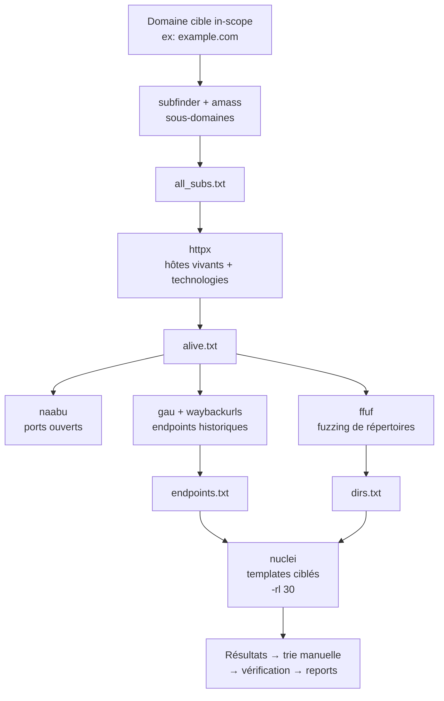
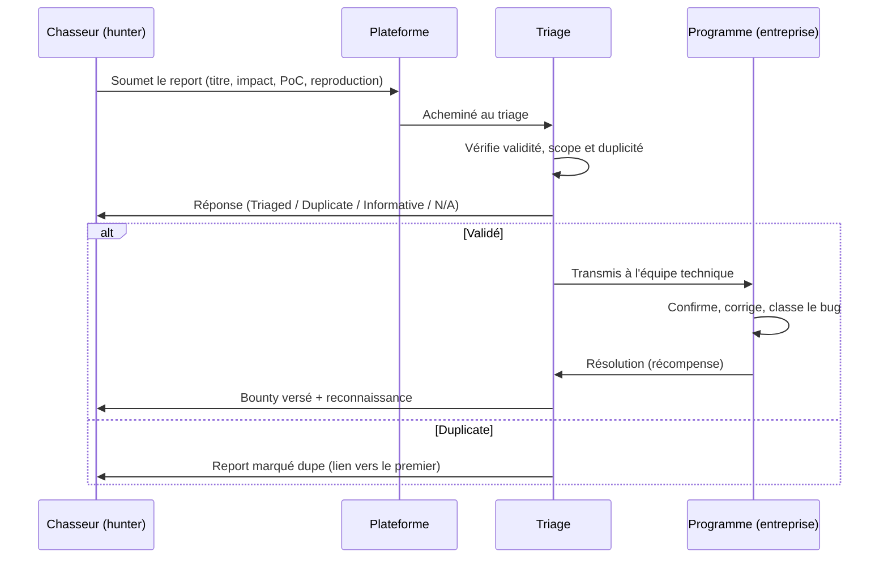
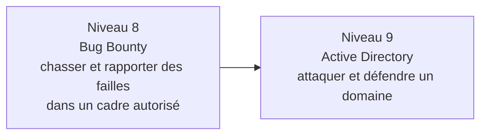

# Présentation

Bienvenue au niveau 8 de CyberAcademy : **Bug Bounty**. Tu arrives ici avec un bagage solide : les fondations des systèmes et du réseau (niveaux 0-2), la programmation (niveau 3), les failles web (niveaux 4-5), la méthodologie de pentest (niveau 6) et l'entraînement CTF (niveau 7). Jusqu'ici, tout se passait dans des environnements d'entraînement : des machines factices, des défis, des applications conçues pour être vulnérables. Ce cours est différent : il te fait passer **du terrain d'entraînement au terrain réel** — celui des applications de production, avec de l'argent à la clé.

Le **bug bounty** (littéralement « prime aux bogues », la chasse aux bugs rémunérée) est un système dans lequel des entreprises — souvent très connues : Google, Microsoft, Meta, Orange, La Poste, EDF, et des milliers d'autres — paient des chasseurs indépendants pour trouver et signaler des failles de sécurité dans leurs produits. Tu n'es ni salarié ni sous-traitant : tu es un **chasseur** (hunter), rémunéré **uniquement si tu trouves quelque chose de valide**. C'est l'un des rares domaines de la cybersécurité où l'on gagne des compétences, de la réputation **et** de l'argent en même temps.

**L'histoire de départ.** Tu es diplômé du niveau 7, ton classement CTF est respectable, mais un ami te lance un défi : « Tu sais exploiter des machines factices. Sauras-tu le faire sur une vraie application, sans casser l'entreprise, en respectant des règles écrites, et en convainquant un triage que ton bug mérite une récompense ? » Tu décides de consacrer **14 heures** à apprendre le métier de bug bounty hunter : lire les programmes, automatiser la reconnaissance, tester méthodiquement, et — la compétence la plus sous-estimée — **écrire un rapport qui vaut de l'argent**.

**Analogie.** Le bug bounty est au pentest ce que la **pêche à la ligne avec permis** est à la pêche au harpon : tu ne débarques pas chez les gens pour forcer leur porte, tu te présentes, tu montres ton permis (le programme), tu connais la réglementation (la **scope**, le périmètre autorisé), tu pêches là où c'est autorisé, et tu ramènes ta prise au bureau de pêche (le **triage**, équipe qui évalue les signalements) qui l'inspecte. Un chasseur qui déborde du cadre ne rapporte rien : il se fait retirer son permis.

## Pourquoi le bug bounty — trois raisons d'apprendre

| Raison | Explication | POURQUOI c'est important |
| ------ | ----------- | ------------------------ |
| **Monétiser ses compétences** | Chaque faille valide peut rapporter de quelques dizaines à plusieurs centaines de milliers d'euros selon sa gravité et le programme | Tes compétences deviennent un revenu direct, sans diplôme ni contrat |
| **Apprendre sur des cibles réelles** | Les applications de production ont des configurations, des complexités et des failles que les labos ne reproduisent jamais | Tu progresses plus vite en 3 mois de bug bounty qu'en 1 an de labo |
| **Reconnaissance de l'industrie** | Les plateformes attribuent du « signal » (score de confiance) et la réputation te suit ; les recruteurs scrutent ces classements | Un bon profil bug bounty vaut des années d'expérience sur le CV |

## L'importance : discipline, méthode, éthique

Le bug bounty n'est pas une chasse libre. C'est une discipline à trois piliers :

1. **Discipline** : tu testes ce qui est déclaré **in-scope** (dans le périmètre autorisé) et rien d'autre. Tu t'arrêtes dès que tu as une preuve — pas une exploitation complète. Tu ne causes pas de dégâts.
2. **Méthode** : la chance ne suffit pas. Une recon automatisée, une hiérarchisation des cibles, des tests reproductibles, et un rapport structuré : c'est ce qui sépare le chasseur pro du curieux.
3. **Éthique** : tu signales la faille **pour qu'elle soit corrigée**, pas pour en abuser. La divulgation responsable (informer l'entreprise avant le monde entier) est le code moral du métier.

## Où c'est utilisé

Le bug bounty est organisé autour de **plateformes** qui font l'intermédiaire entre les entreprises et les chasseurs, et de **programmes** qu'elles hébergent.

| Plateforme | Origine | Particularité |
| ---------- | ------- | ------------- |
| **HackerOne** | États-Unis | La plus grande au monde ; programmes gouvernementaux américains ; système de réputation et de « Signal » |
| **Bugcrowd** | États-Unis | Grands programmes d'entreprise ; classement en « tiers » (niveaux 1 à 5) selon ton historique |
| **YesWeHack** | France (Paris) | Plateforme européenne majeure ; nombreux programmes français et européens ; statut « Hunter » évolutif |
| **Intigriti** | Belgique | Programme européen, très actif sur les applications web et les « challenges de la semaine » |

Deux types de programmes existent :

- **VDP** (*Vulnerability Disclosure Program*), un programme de divulgation de vulnérabilités : l'entreprise accepte de recevoir les signalements et te remercie, parfois te met au tableau d'honneur, mais ne paie **pas de prime**.
- **SRC** (*Security Response Center*, centre de réponse sécurité — aussi appelé **VRP**, *Vulnerability Reward Program*, programme de récompense de vulnérabilités) : le programme paie de vraies récompenses en fonction de la gravité. Quand on dit « bug bounty » au sens strict, on parle de ces programmes.

Des entreprises hébergent aussi leur propre programme sans passer par une plateforme : **Google** avec son VRP, **Microsoft** avec son **MSRC** (*Microsoft Security Response Center*), **Mozilla**, **GitHub**, ou des SRC d'entreprises françaises comme **La Poste**, **EDF** ou **Orange**.

## Métiers concernés

| Métier | Rôle concret | Pourquoi le bug bounty aide |
| ------ | ------------ | --------------------------- |
| **Bug bounty hunter** | Chercher des failles rémunérées sur des programmes autorisés | C'est le métier direct : ton profil, ton classement, tes rapports |
| **Pentester** (testeur d'intrusion) | Tester des applications pour des clients, sur commande | La recon, les techniques web et surtout l'écriture de rapports sont identiques |
| **AppSec engineer** (analyste sécurité applicative) | Auditer le code et l'architecture côté entreprise | Le bug bounty t'apprend exactement ce que cherche un attaquant, donc comment défendre |

## Prérequis

Pour suivre ce cours sereinement, tu dois avoir validé :

- **Niveau 0 — Computer Fundamentals** : fichiers, processus, permissions.
- **Niveau 1 — Linux Fundamentals** : terminal, `grep`, `sort`, `uniq`, gestion des fichiers.
- **Niveau 2 — Networking** : TCP/IP, ports, HTTP, DNS, `nmap`, `dig`.
- **Niveau 3 — Python / Bash** : scripts, `requests`, `curl`, `git`, `jq`.
- **Niveau 4 — Web Security** : requêtes HTTP, cookies, sessions, fuzzing.
- **Niveau 5 — OWASP Top 10** : SQLi, XSS, IDOR, SSRF, injections, JWT.
- **Niveau 6 — Pentesting Methodology** : méthodologie complète de test d'intrusion.
- **Niveau 7 — CTF Training** : réflexes de résolution, recon, exploitation, documentation.

> ⏱️ **Temps estimé : 14 heures** — soit 4 séances d'environ 3,5 heures.
> 📊 **Niveau : 8** — neuvième maillon de la roadmap CyberAcademy (niveaux 0 → 11).

## Ce que tu vas construire

À la fin de ce cours, tu auras :

- la capacité de **lire et respecter un programme de bug bounty** (scope, règles, récompenses) ;
- un **pipeline de recon automatisé** réutilisable (subfinder → httpx → gau/waybackurls → tri) ;
- une **méthode de test** des failles à fort impact (IDOR, auth bypass, logique métier, race conditions) ;
- la maîtrise de l'écriture d'un **rapport de qualité** (titre, impact, reproduction, CVSS, PoC) ;
- une stratégie pour **éviter les dupes** et gérer la réponse du triage ;
- **3 mini challenges résolus** et **2 laboratoires complétés** ;
- un badge 💰 Chasseur et le niveau 9 (Active Directory) débloqué.

---
## Objectifs pédagogiques

À la fin de ce cours, tu seras capable de :

1. **Lire un programme de bug bounty comme un professionnel** : distinguer les types de programmes (publics, privés, VDP, SRC), comprendre in-scope / out-of-scope, les assets (actifs, cibles), les règles d'engagement et la grille de récompenses.
2. **Respecter la scope et le cadre légal en toutes circonstances** : tester uniquement ce qui est autorisé, s'arrêter à la preuve, connaître les limites de la divulgation responsable et les lois selon les pays.
3. **Automatiser la reconnaissance** : chaîner `subfinder`, `amass`, `httpx`, `naabu`, `gau`, `waybackurls` et `ffuf` dans un pipeline bash reproductible, avec `jq`, `sort`, `uniq` et un stockage organisé.
4. **Trier et hiérarchiser** les endpoints sensibles pour concentrer tes tests là où l'impact est le plus fort (API, admin, upload, paiement).
5. **Tester les failles à fort impact** (IDOR, auth bypass, SSRF, RCE, SQLi) et la logique métier (race condition, double spending, OTP bypass) avec des méthodes de test spécifiques.
6. **Rédiger un rapport de qualité** : titre clair, résumé d'impact, reproduction pas à pas, preuves, PoC minimal, recommandation, score CVSS — en français ou en anglais selon le programme.
7. **Gérer la relation avec le triage** : comprendre le processus (triage, dupes, N/A), éviter les doublons, répondre professionnellement, et gérer sa carrière (réputation, fiscalité selon le pays).

---
## Vue d'ensemble

Voici la feuille de route de ce cours. Chaque module s'appuie sur le précédent, exactement comme les niveaux de ton parcours.

```mermaid
flowchart TD
    A[Début du niveau 8<br/>Bug Bounty] --> B[Module 1<br/>Comprendre les programmes<br/>VDP, SRC, in-scope / out-of-scope]
    B --> C[Module 2<br/>Divulgation responsable<br/>CVE, éthique, cadre légal]
    C --> D[Module 3<br/>Recon et asset discovery<br/>subfinder, amass, httpx, naabu]
    D --> E[Module 4<br/>Endpoints historiques<br/>gau, waybackurls, jq]
    E --> F[Module 5<br/>Automatisation de la recon<br/>pipeline bash, stockage]
    F --> G[Module 6<br/>Tri et hiérarchisation<br/>des endpoints sensibles]
    G --> H[Module 7<br/>Failles à fort impact<br/>IDOR, SSRF, SQLi, RCE]
    H --> I[Module 8<br/>Logique métier<br/>race condition, double spending, OTP]
    I --> J[Module 9<br/>Authentification<br/>JWT, OAuth 2.0, rate limiting]
    J --> K[Module 10<br/>Secrets exposés<br/>trufflehog, git dorks, .env]
    K --> L[Module 11<br/>Scan automatisé<br/>nuclei, limites]
    L --> M[Module 12<br/>Rapport professionnel<br/>structure, CVSS, PoC]
    M --> N[Démonstrations<br/>5 cas pas à pas]
    N --> O[Labos + Mini challenges<br/>recon automatisée, chasse IDOR]
    O --> P[Quiz final<br/>≥ 80 % pour valider]
    P --> Q[Badge 💰 Chasseur<br/>Niveau 9 débloqué]
```



### Tableau des modules

| Module | Contenu | Compétence visée | Temps conseillé |
| ------ | ------- | ---------------- | --------------- |
| 1 | Programmes et scope | Lire un programme | 1 h |
| 2 | Divulgation responsable | Éthique et cadre légal | 1 h |
| 3 | Asset discovery | subfinder, amass, httpx, naabu | 2 h |
| 4 | Endpoints historiques | gau, waybackurls, jq | 1,5 h |
| 5 | Automatisation | Pipeline bash, stockage | 1,5 h |
| 6 | Tri et hiérarchisation | Prioriser les cibles | 1 h |
| 7 | Failles à fort impact | IDOR, SSRF, SQLi, RCE | 2 h |
| 8 | Logique métier | Race condition, double spending, OTP | 1,5 h |
| 9 | Authentification | JWT, OAuth 2.0, rate limiting | 1 h |
| 10 | Secrets exposés | trufflehog, git dorks | 1 h |
| 11 | Scan automatisé | nuclei, limites | 1 h |
| 12 | Rapport professionnel | CVSS, PoC, structure | 1,5 h |

---
## Théorie

> ⚠️ **Légal** — Toute la théorie de cette section est illustrée avec des exemples tirés de programmes autorisés, de cibles de démonstration (ex. `example.com`, domaine réservé par l'IANA pour la documentation) ou d'applications locales que tu installes toi-même. Aucune commande n'est à lancer sur une cible non autorisée.

---
### (a) Les programmes de bug bounty

#### Définition

Un **programme de bug bounty** est un contrat écrit par une entreprise qui autorise des chasseurs indépendants à tester certains de ses systèmes (les **assets**, « actifs ») et les rémunère (ou les remercie) pour les failles valides signalées. Ce contrat s'appelle aussi **policy** (politique) ou **rules of engagement** (règles d'engagement). Tout le bug bounty tourne autour de ce document : il définit ce qui est permis, ce qui est interdit, et ce que tu touches.

**Analogie.** Un programme de bug bounty est un **permis de pêche très précis** : il dit où (in-scope), où pas (out-of-scope), avec quels engins (les outils autorisés, l'interdiction du déni de service), quelle taille de poisson rapporte quoi (la grille de récompenses), et ce qui arrive si tu enfreins les règles (exclusion, voire poursuites).

#### Types de programmes

| Type | Sigle | Récompense | Exemples |
| ---- | ----- | ---------- | -------- |
| **Programme public** | — | Oui ou non (VDP ou SRC) | Visible par tous sur les plateformes ; tout le monde peut postuler |
| **Programme privé** | — | Oui | Invitation seulement ; souvent mieux payé, moins de concurrence, se débloque avec un bon historique |
| **VDP** (*Vulnerability Disclosure Program*) | VDP | Aucune somme : reconnaissance, tableau d'honneur, parfois un « swag » (goodies) | Programmes de divulgation de nombreuses entreprises |
| **SRC** (*Security Response Center*) | SRC / VRP | Primes selon la gravité | Google VRP, Microsoft MSRC, programmes rémunérés de HackerOne |

#### Lire un programme : les éléments clés

Chaque programme contient des sections que tu dois lire **avant de lancer le moindre outil** :

| Section | Question à te poser | Ce que tu y trouves |
| ------- | ------------------- | ------------------- |
| **In-scope** | « Qu'est-ce que je peux tester ? » | Les domaines (`*.example.com`), sous-domaines, applications mobiles, IP ranges, APIs explicitement listés |
| **Out-of-scope** | « Qu'est-ce que je ne dois PAS toucher ? » | Les actifs exclus (sous-traitants, réseaux internes, CDN), les actions interdites |
| **Règles d'engagement** | « Comment tester sans enfreindre ? » | Interdiction du DoS (déni de service), de l'ingénierie sociale, du phishing, des tests destructeurs ; limitation du volume de requêtes |
| **Grille de récompenses** | « Combien vaut ma faille ? » | Montant par sévérité : faible, moyenne, élevée, critique ; parfois formule liée au CVSS |
| **Éligibilité** | « Suis-je autorisé ? » | Qui peut participer (résidents interdits dans certains programmes, salariés exclus…) |
| **Divulgation** | « Puis-je en parler ? » | Délai de divulgation, autorisation de publier, embargo |

Le terme **in-scope** signifie littéralement « dans le champ d'application » : c'est la liste blanche. **Out-of-scope** signifie « hors champ » : la liste noire, intouchable, même si tu es certain d'y trouver une faille.

#### Fonctionnement

1. Tu lis la policy et tu notes le scope.
2. Tu effectues la recon uniquement sur les assets in-scope.
3. Tu trouves une faille, tu la confirmes (reproduction fiable) et tu écris un **report** (signalement).
4. Le **triage** (équipe qui classe les signalements) évalue ton report : valide, dupe, informatif, ou N/A (*Not Applicable*, non applicable).
5. Si le report est validé et non dupliqué, le programme corrige et te paie (ou te remercie).
6. Tu assures le suivi jusqu'à la correction.

#### Cas d'utilisation

Un développeur sécurité d'une banque veut savoir si son API mobile est attaquable sans mettre en danger les données clients. Il publie un programme privé sur YesWeHack avec l'API `api.banque-exemple.fr` en in-scope, une interdiction stricte de toucher aux comptes des autres clients, et une prime de 5 000 € pour une faille critique. Toi, chasseur, tu t'inscris, tu lis la policy, tu te concentres sur l'API.

#### Exemple réel

Le programme **Google VRP** rémunère entre quelques centaines et plusieurs dizaines de milliers de dollars selon la gravité. Il est accompagné d'une politique très détaillée qui exclut les applications tierces et impose de ne pas tester les services de Google déployés chez des clients. Le programme **gouvernemental américain Hack the Pentagon** (HackerOne) a démontré qu'un gouvernement pouvait ouvrir ses systèmes à des chasseurs externes — un précédent mondial.

#### Bonnes pratiques

- Lire la policy **en entier**, deux fois, et la résumer dans un fichier `notes-programme.md`.
- Sauvegarder la grille de récompenses pour prioriser tes tests (une faille critique sur un asset hors récompense ne sert à rien).
- Vérifier les **programmes privés** une fois que ton signal est bon : moins de dupes, plus de primes.
- Ne jamais étendre un test à un asset proche (sous-domaine voisin) sous prétexte que « c'est pareil » : il est peut-être hors scope.

#### Résumé

Un programme = un contrat écrit (in-scope, out-of-scope, règles, récompenses). VDP = reconnaissance sans argent ; SRC/VRP = primes. Tout le bug bounty commence par la lecture disciplinée de ce contrat.

---
### (b) La divulgation responsable

#### Définition

La **divulgation responsable** (*responsible disclosure*) est la pratique qui consiste à **informer en privé** l'entreprise ou le développeur d'une vulnérabilité, de leur laisser un délai raisonnable pour la corriger, puis seulement ensuite (si nécessaire) de la rendre publique. On oppose souvent trois modes :

- **Divulgation privée / responsable** : toi et l'entreprise ; correctif ; publication éventuelle après accord.
- **Divulgation coordonnée** : plusieurs parties (l'entreprise, toi, parfois un **CERT** — *Computer Emergency Response Team*, équipe d'urgence informatique) se coordonnent pour publier en même temps que le correctif.
- **Divulgation complète** (*full disclosure*) : publication immédiate et publique de la vulnérabilité, sans prévenir l'entreprise, ou en la prévenant seulement au moment de la publication.

**Analogie.** Tu découvres que la porte d'un magasin ne se ferme pas. La divulgation responsable, c'est prévenir discrètement le gérant et attendre qu'il installe une serrure. La divulgation complète, c'est poster une photo de la porte ouverte sur les réseaux sociaux : la faille devient connue de tous, y compris des cambrioleurs.

#### Pourquoi

Le bug bounty est bâti sur la divulgation responsable. Pourquoi ? Parce qu'une faille publique **non corrigée** est une arme gratuite pour les attaquants. En signalant d'abord en privé, tu permets à l'entreprise de protéger ses utilisateurs avant que la nouvelle se répande. C'est aussi ce qui te protège légalement : la loi distingue nettement celui qui **signale dans un cadre autorisé** de celui qui **exploite et divulgue**. En France, le **Code pénal** (articles 323-1 et suivants) punit l'accès frauduleux à un système informatique : l'autorisation du programme ou l'accord de l'entreprise est ce qui te met à l'abri.

#### Fonctionnement

1. Tu confirmes la vulnérabilité et tu prépares une preuve minimale.
2. Tu la signales par le canal prévu : plateforme de bug bounty (recommandé), ou adresse de contact sécurité (`security@entreprise.com`, page `/.well-known/security.txt`).
3. L'entreprise accuse réception et analyse.
4. Elle corrige (parfois en plusieurs semaines/mois).
5. Elle t'informe de la résolution ; toi, tu peux alors (si tu veux et si c'est autorisé) publier un **write-up** (article expliquant ta découverte).

#### Cas d'utilisation

Tu trouves une injection SQL sur un programme sans plateforme. Tu écris à `security@entreprise.fr` une description et un PoC minimal, sans exploiter les données. L'entreprise corrige en 3 semaines. Tu peux alors, avec son accord, publier ton analyse sur ton blog.

#### Exemple réel

Le **Google Project Zero** (équipe de Google qui cherche des failles *zero-day*, c'est-à-dire inconnues et non corrigées) applique un délai standard de 90 jours : il signale en privé, attend 90 jours, puis publie même si l'éditeur n'a pas corrigé. Ce délai est devenu une référence de l'industrie pour la divulgation coordonnée.

#### Bonnes pratiques

- Toujours passer par le **canal officiel** (plateforme ou contact sécurité), jamais par les réseaux sociaux.
- Donner un délai raisonnable (90 jours est la norme) et le préciser dans ton message.
- Ne jamais publier de PoC complet avant le correctif sans accord écrit.
- Conserver une **trace écrite** de tous les échanges : elle te protège en cas de litige.
- Si tu publies, retirer toute donnée réelle touchée (masquer les identifiants, utiliser des valeurs fictives).

#### Résumé

Divulgation responsable = signaler en privé, laisser un délai de correctif, publier ensuite si accord. C'est le fondement éthique et légal du bug bounty. Divulgation complète = publication immédiate : à éviter sauf cas extrêmes et cadres légaux précis.

---
### (c) La méthode de recon

#### Définition

La **reconnaissance** (recon) est l'ensemble des techniques pour **cartographier la cible** sans interagir avec elle de façon offensive : trouver tous les sous-domaines, les adresses IP, les technologies, les endpoints, et les informations laissées publiquement (GitHub, archives web). C'est la phase la plus longue et la plus rentable du bug bounty.

**Analogie.** Un cambrioleur professionnel n'entre jamais par la porte principale sans avoir fait le tour du bâtiment, repéré les entrées de service, les caméras et les habitudes du personnel. En bug bounty, la recon est ce « tour du bâtiment » — mais légal, sur les seuls actifs autorisés.

#### Pourquoi

La plupart des bugs se trouvent sur des **actifs oubliés** : un vieux sous-domaine avec une application de test, une API de staging (préproduction), un serveur exposé, un endpoint jamais nettoyé. Les entreprises sécurisent leur site principal et oublient le reste. Sans recon, tu ne vois que la vitrine ; avec recon, tu vois l'arrière-boutique — c'est là que sont les primes.

#### Les quatre familles de recon

**1. Découverte de sous-domaines (subdomain enumeration).**

| Outil | Rôle | Commande d'exemple |
| ----- | ---- | ------------------ |
| `subfinder` | Interroge de nombreuses sources publiques (certificats, archives DNS, moteurs) | `subfinder -d example.com -silent` |
| `amass` | Enumération lourde (modes passif/actif), graphique de domaine | `amass enum -passive -d example.com` |
| `crt.sh` | Registre de certificats SSL : chaque certificat émis liste ses domaines | `curl -s "https://crt.sh/?q=%25.example.com" | jq -r '.[].name_value'` |

**2. Découverte de ports et d'IP.**

| Outil | Rôle | Commande d'exemple |
| ----- | ---- | ------------------ |
| `naabu` | Scan de ports rapide et silencieux (projectdiscovery) | `naabu -host example.com -top-ports 100 -silent` |
| `nmap` (rappel niveau 2) | Scan complet avec détection de services | `nmap -sV -T4 example.com` |

**3. Fouille de GitHub et de sources ouvertes (OSINT).**

| Outil | Rôle | Commande d'exemple |
| ----- | ---- | ------------------ |
| `git` | Cloner et analyser les dépôts publics | `git clone https://github.com/entreprise/repo` |
| GitHub search | Dorks (opérateurs de recherche) pour trouver domaines, secrets, configs | `inurl:example.com "password"` |
| `whois` / `dig` | Informations sur le domaine et son DNS | `dig example.com ANY` |

**4. Récupération des endpoints historiques.**

| Outil | Rôle | Commande d'exemple |
| ----- | ---- | ------------------ |
| `gau` (*GetAllURLs*) | Agrège les URLs passées de la Wayback Machine (archives web de l'Internet Archive), Common Crawl, URLScan et OTX | `gau example.com --subs` |
| `waybackurls` | Récupère les URLs archivées dans la Wayback Machine | `waybackurls example.com` |

#### Fonctionnement d'une recon type

1. `subfinder -d example.com -all -silent -o subdomains.txt` puis `amass enum -passive -d example.com -o amass.txt` ; fusionner avec `sort -u`.
2. Filtrer les hôtes vivants : `httpx -l all_subs.txt -sc -title -tech-detect -silent -o alive.txt`.
3. Scanner les ports des hôtes intéressants : `naabu -l alive_hosts.txt -top-ports 100 -silent`.
4. Récupérer les endpoints historiques : `gau example.com --subs | sort -u -o urls.txt` et `waybackurls example.com >> urls.txt`.
5. Croiser et filtrer avec `jq`, `grep`, `sort`, `uniq`.

#### Cas d'utilisation

Un programme met en scope `*.banque-exemple.fr`. La recon révèle que `api.banque-exemple.fr` est bien connu, mais aussi `old.banque-exemple.fr` (une application de 2015) et `intranet.banque-exemple.fr` qui répond. C'est sur ces deux actifs oubliés que tu concentres tes tests : moins de surveillance, plus de chances de bugs.

#### Exemple réel

Les préfixes `dev.`, `stage.`, `staging.`, `test.`, `beta.`, `internal.`, `old.`, `v2.` sont connus pour abriter des applications vulnérables restées exposées pendant des années. C'est la première chose que vérifie tout chasseur sérieux sur un programme.

#### Bonnes pratiques

- Toujours **croiser plusieurs sources** (subfinder + amass + crt.sh) : une seule source rate des actifs.
- Vérifier la **vitalité** des hôtes avec `httpx` avant de lancer quoi que ce soit d'autre (économie de temps et de bruit).
- Ne jamais oublier que la recon **dépend du scope** : lister uniquement les assets in-scope.
- Conserver toutes les listes dans un dossier structuré ; une recon reproductible vaut de l'or.

#### Résumé

La recon = sous-domaines (subfinder, amass), ports (naabu, nmap), sources ouvertes (git, dorks), endpoints historiques (gau, waybackurls). C'est la phase la plus rentable : les actifs oubliés cachent les bugs.

---
### (d) L'automatisation de la recon

#### Définition

L'**automatisation de la recon** consiste à enchaîner les outils précédents dans des **pipelines** (chaînes de commandes) scriptables, afin de reproduire la même cartographie en quelques secondes sur n'importe quelle cible, et de stocker les résultats proprement.

**Analogie.** Un boulanger ne pétrit pas chaque baguette à la main : il a un moulin, un pétrin et une routine. L'automatisation est ton « pétrin » : les outils font le travail répétitif, toi tu fais le travail d'analyse.

#### Pourquoi

1. **Reproductibilité** : le pipeline produit le même résultat sur n'importe quel domaine, sans erreur de frappe.
2. **Vitesse** : des dizaines de milliers de requêtes en quelques minutes.
3. **Organisation** : chaque sortie va dans un fichier dédié ; rien ne se perd.
4. **Concentration** : tu passes ton temps à **analyser** les résultats, pas à les produire.

#### Les briques de l'automatisation

| Brique | Outil | Rôle dans le pipeline |
| ------ | ----- | --------------------- |
| Énumération | `subfinder`, `amass` | Produire les listes de domaines |
| Dédoublonnage | `sort -u`, `anew` | Fusionner les listes sans doublons (`anew` n'ajoute que les lignes nouvelles) |
| Filtrage | `httpx`, `grep`, `jq` | Ne garder que les hôtes vivants, les statuts intéressants |
| Extraction | `gau`, `waybackurls`, `ffuf` | Récolter les endpoints et répertoires |
| Analyse | `nuclei`, scripts maison | Détecter les vulnérabilités |
| Stockage | dossiers datés, `-o` | Sauvegarder chaque étape |

#### Exemple de pipeline complet

```bash
#!/bin/bash
DOMAINE="example.com"
BASE="$HOME/recon/$DOMAINE"
mkdir -p "$BASE"

# 1. Sous-domaines
subfinder -d "$DOMAINE" -all -silent -o "$BASE/subfinder.txt"
amass enum -passive -d "$DOMAINE" -o "$BASE/amass.txt"
cat "$BASE/subfinder.txt" "$BASE/amass.txt" | sort -u > "$BASE/all_subs.txt"

# 2. Hôtes vivants + technologies
httpx -l "$BASE/all_subs.txt" -sc -title -tech-detect -silent -o "$BASE/alive.txt"

# 3. Ports des hôtes vivants
cat "$BASE/alive.txt" | cut -d' ' -f1 | naabu -top-ports 100 -silent -o "$BASE/ports.txt"

# 4. Endpoints historiques
gau --subs "$DOMAINE" | sort -u > "$BASE/urls_gau.txt"
waybackurls "$DOMAINE" | sort -u >> "$BASE/urls_gau.txt"
sort -u "$BASE/urls_gau.txt" -o "$BASE/all_urls.txt"

echo "Recon terminée : $(wc -l < "$BASE/all_subs.txt") sous-domaines, $(wc -l < "$BASE/all_urls.txt") URLs"
```

#### Le rôle de `jq`

`jq` est un processeur JSON : il permet de filtrer, transformer et afficher des données JSON depuis le terminal. Indispensable quand un outil sort du JSON (crt.sh, certains résultats d'API, exports de gau).

```bash
# Extraire tous les champs "url" d'un fichier JSON
jq -r '.url' urls.json

# Filtrer les URLs contenant "api" ou "admin", supprimer les doublons
jq -r '.url' urls.json | grep -iE "api|admin" | sort -u
```

#### Cas d'utilisation

Tu chasses sur 5 programmes. Chaque matin, tu lances ton pipeline sur les domaines in-scope. En 10 minutes, tu as une cartographie fraîche de chaque programme, et tu passes la journée à analyser — pas à taper des commandes.

#### Exemple réel

`gau` interroge des **archives publiques** (Wayback Machine, Common Crawl, URLScan, OTX) : il récupère des milliards d'URLs collectées au fil des ans. Une URL passée, même retirée depuis longtemps, reste dans les archives : c'est une mine d'or pour trouver d'anciens endpoints sensibles.

#### Bonnes pratiques

- Structurer par **dossier par programme et par domaine** : `~/recon/<programme>/<domaine>/`.
- Toujours **dédoublonner** (`sort -u`, `anew`) avant de passer à l'étape suivante.
- Limiter le **taux de requêtes** pour ne pas déclencher de protection anti-bot ni perturber les serveurs (voir le **rate limiting** au module 9).
- Versionner tes scripts dans un dépôt git personnel : tu les réutiliseras toute ta carrière.

#### Résumé

L'automatisation chaîne subfinder → httpx → naabu → gau/waybackurls dans un pipeline bash reproductible, avec `sort -u`/`anew` pour dédoublonner, `jq` pour le JSON, et un stockage organisé par programme. Tu analyses, le pipeline travaille.

---
### (e) L'analyse des réponses et la trie

#### Définition

La **trie** (du verbe anglais *to triage*, trier par priorité) est la phase où tu **analyses les résultats** de ta recon et de tes tests pour décider quoi examiner en premier : identifier les endpoints sensibles, tester les plus rentables, et abandonner le bruit.

**Analogie.** Un médecin aux urgences ne soigne pas les patients dans l'ordre d'arrivée : il évalue chaque cas et traite d'abord les urgences vitales. Ta « salle des urgences », c'est la liste des endpoints ; les « urgences vitales », ce sont les fonctionnalités qui touchent aux données, à l'argent, à l'authentification.

#### Pourquoi

Un pipeline de recon peut produire **des milliers d'URLs** : des pages statiques, des images, des fichiers CSS, des liens morts. En tester toutes sans réfléchir, c'est perdre des heures et faire du bruit. La trie te permet de **concentrer l'effort là où l'impact est maximal** : un endpoint qui manipule des données d'autres utilisateurs vaut dix pages d'accueil.

#### Les critères de priorisation

| Critère | Pourquoi c'est prioritaire | Exemple d'endpoint |
| ------- | -------------------------- | ------------------ |
| **Données personnelles** | Fuite de données d'autres utilisateurs = impact fort | `/api/profile/{id}`, `/account`, `/user/export` |
| **Authentification** | Contourner le login = impact maximal | `/login`, `/reset-password`, `/oauth/authorize` |
| **Argent / paiement** | Logique d'argent = primes élevées | `/checkout`, `/payment`, `/redeem`, `/coupon` |
| **Administration** | Accès admin = compromission totale | `/admin`, `/manage`, `/internal` |
| **Upload** | Téléverser un fichier = potentielle RCE (exécution de code) | `/upload`, `/files/upload`, `/import` |
| **API JSON** | Souvent moins testées et plus permissives | `/api/v1/...`, `/graphql`, `/webhook` |

#### Méthodes de trie

1. **Filtres par mot-clé** : `grep -iE "admin|api|upload|payment|token|password|id"` sur ta liste d'URLs.
2. **Filtres par extension** : ne garder que `.js`, `.json`, `.php`, `.asp`, `.jsp` (le code, pas les images).
3. **Regroupement par technologie** : `httpx -tech-detect` te dit quelles apps sont en Symfony, WordPress, Node — les endpoints de technos connues ont des bugs connus.
4. **Priorité aux paramètres** : les URLs avec des paramètres (`?id=`, `?user=`, `?file=`) sont les plus testables (IDOR, injection).
5. **Tester d'abord la faille la plus probable** : un endpoint `?id=123` sur une API JSON → IDOR ; un `?file=` → LFI ; un formulaire de recherche → SQLi/XSS.

#### Cas d'utilisation

`gau` te renvoie 5 000 URLs. En 5 minutes de filtrage, tu en gardes 40 : 12 endpoints `/api/v1/*` avec des paramètres d'ID, 8 pages de compte, 5 uploads, 3 endpoints admin, 12 formulaires. Tu testes les 40 dans cet ordre d'impact, en commençant par les IDOR sur l'API.

#### Exemple réel

Une astuce classique : **tester la méthode HTTP**. Un endpoint `/api/user` qui n'accepte que `GET` et `POST` peut réagir différemment à `PUT`, `PATCH` ou `DELETE`. `curl -X PATCH -d '{"role":"admin"}' https://api.example.com/v1/user/123` a parfois des effets inattendus sur des applications mal configurées.

#### Bonnes pratiques

- Écrire un **fichier de priorités** (priorité 1, 2, 3) par programme.
- Noter **pourquoi** chaque endpoint est prioritaire : c'est ton futur rapport qui en profite.
- Toujours vérifier la **méthode HTTP** et les **paramètres** avant d'écarter un endpoint.
- Ne pas tester 50 choses à la fois : un endpoint testé **profondément** vaut mieux que dix effleurés.

#### Résumé

La trie transforme une montagne d'URLs en liste prioritaire : données sensibles, auth, argent, admin, upload, API. Filtre par mots-clés, par technologie, par paramètres, et teste en profondeur ce qui a le plus d'impact.

---
### (f) Les failles à fort impact

#### Définition

Certaines failles rapportent gros parce qu'elles touchent au cœur de la sécurité : la **confidentialité** (données des autres), l'**intégrité** (modification de données), ou l'**exécution de code** (prise de contrôle). Ce sont les failles « à fort impact » : **IDOR**, **auth bypass**, **SSRF**, **RCE**, **SQLi**.

#### Pourquoi

Les primes suivent la gravité. Une faille qui expose les données de milliers d'utilisateurs, ou qui permet d'exécuter des commandes sur le serveur, est un risque majeur pour l'entreprise : elle est donc bien payée. Ces failles sont aussi **les plus démontrables** : un rapport qui prouve qu'un utilisateur lit les données d'un autre convainc n'importe quel triage.

| Faille | Principe (rappel niveau 5) | Test approfondi côté bug bounty |
| ------ | -------------------------- | ------------------------------- |
| **IDOR** (*Insecure Direct Object Reference*, référence directe non sécurisée à un objet) | Un identifiant dans l'URL (`/profile/123`) donne accès à l'objet de quelqu'un d'autre | Créer 2 comptes, changer `?id=`, comparer les réponses ; tester aussi les IDs encodés (base64), les UUID v1 (traçables), et les IDs dans les corps JSON et en-têtes |
| **Auth bypass** (contournement d'authentification) | Accéder à une zone protégée sans être authentifié | Tester les routes oubliées (`/admin/../user`, `/v2/user`), les méthodes HTTP alternatives, les en-têtes `X-Forwarded-For`/`X-Original-URL`, la manipulation de cookies |
| **SSRF** (*Server-Side Request Forgery*, falsification de requête côté serveur) | Le serveur effectue une requête vers une URL que tu contrôles | Tester le paramètre `url=`/`image_url=` avec `http://127.0.0.1`, `http://169.254.169.254` (métadonnées cloud), `file:///etc/passwd` ; observer les différences de réponse et de délai |
| **RCE** (*Remote Code Execution*, exécution de code à distance) | Le serveur exécute ton code | Command injection (`; id`, `$(id)`), templates (SSTI `{{7*7}}`), désérialisation, upload de fichiers exécutables |
| **SQLi** (*SQL Injection*, injection SQL) | Manipuler les requêtes vers la base de données | D'abord les tests manuels `'`, `" OR 1=1 -- -`, `UNION SELECT` ; puis `sqlmap -u "https://api.example.com/item?id=1" --batch --dbs` en dernier recours |

#### Test IDOR approfondi

L'IDOR est **la faille la plus rentable pour un débutant** : elle ne demande pas de payloads complexes, juste deux comptes et de la méthode. Le principe : **rester connecté en A, demander l'objet de B, et observer si la réponse contient les données de B**.

Étapes du test :

1. Crée deux comptes A et B sur l'application.
2. Connecte-toi en A, récupère l'ID de A (`/profile/1001`) et celui de B (`/profile/1002`) — B est ton compte de test, il peut te donner son ID.
3. En restant connecté en A, remplace l'ID de A par celui de B : `curl -b "session=A" https://app/profile/1002`.
4. Si la réponse contient les **données de B** (prénom, email, données), tu as un IDOR.
5. Répète avec des variantes : `1003`, `0`, `-1`, encodé en base64, en UUID.

#### Test SSRF approfondi

Un endpoint qui accepte une URL (upload d'avatar par URL, `url=` de capture de page, webhook) est un candidat SSRF. Teste les réponses **différenciées** :

```bash
curl -s "https://app.example.com/fetch?url=http://127.0.0.1:22"      # port SSH fermé ?
curl -s "https://app.example.com/fetch?url=http://127.0.0.1:8080"    # service interne qui répond ?
curl -s "https://app.example.com/fetch?url=http://169.254.169.254/latest/meta-data/"  # métadonnées cloud ?
```

Des **délais différents** ou des **erreurs différentes** (timeout vs connexion refusée vs réponse) prouvent que le serveur fait bien la requête pour toi. C'est le début d'un SSRF validé.

#### Cas d'utilisation

Un site e-commerce met en ligne un export PDF de factures : `https://shop.example.com/export/invoice?num=INV-481`. Tu changes le numéro en `INV-480` : tu obtiens la facture d'un autre client, avec son nom et son adresse. C'est un IDOR critique : données personnelles d'autres utilisateurs. Prime élevée, PoC simple.

#### Exemple réel

Le programme **Shopify** a payé des primes pour des IDOR dans son API d'administration (`/admin/orders/{id}` accessible avec les identifiants d'un marchand). Le programme **Uber** a reçu des reports fameux pour des IDOR et des auth bypass dans ses API internes — des classiques cités dans les conférences.

#### Bonnes pratiques

- Ne jamais **escalader la preuve** : si l'IDOR lit les données d'un autre, **ne télécharge pas** tout l'annuaire : prouve avec un seul enregistrement, puis arrête.
- Toujours utiliser **tes propres comptes de test** : ne jamais toucher aux données de vrais clients.
- Documenter chaque test (requête + réponse) dans ton carnet : c'est la matière première du rapport.
- Utiliser `sqlmap` **en dernier recours et avec prudence** : il envoie beaucoup de requêtes et peut être perçu comme agressif.

#### Résumé

IDOR (manipuler un identifiant), auth bypass (contourner le login), SSRF (faire requêter le serveur), RCE (exécuter du code), SQLi (manipuler la base) : ce sont les failles à fort impact. Test méthodique, preuve minimale, deux comptes de test, et on s'arrête à la preuve.

---
### (g) L'exploitation de logique métier

#### Définition

Les failles de **logique métier** (*business logic vulnerabilities*) sont des défauts dans le **raisonnement** de l'application : le code fait ce qu'on lui demande, mais ce qu'on lui demande est absurde. Pas d'injection, pas de payload : on manipule le **flux** normal pour obtenir un avantage. Catégories principales : manipulation de workflow, **race condition** (condition de course), **double spending** (double dépense), **OTP bypass** (contournement du code à usage unique).

**Analogie.** Un magasin offre « un produit acheté, un produit offert ». La logique est bonne, sauf si tu peux faire passer le même produit deux fois à la caisse. Le code fonctionne parfaitement ; c'est le processus qui est absurde. La faille de logique, c'est ça : profiter d'une absurdité du processus.

#### Pourquoi

Les scanners automatiques ne trouvent **jamais** ces failles : elles exigent de comprendre le fonctionnement métier de l'application. Résultat : moins de concurrence, donc des primes élevées et une vraie réputation pour ceux qui savent les trouver.

#### Manipulation de workflow

| Technique | Principe | Exemple |
| --------- | -------- | ------- |
| **Saut d'étape** | Accéder directement à une étape sans passer par les précédentes | Accéder à `/checkout/confirm` sans avoir payé ; `/verify` sans avoir demandé l'OTP |
| **Réutilisation** | Réutiliser un élément à usage unique | Coupon utilisé plusieurs fois, code de parrainage appliqué à plusieurs comptes |
| **Ordre inversé** | Exécuter les étapes dans un ordre illogique | Activer le compte avant de choisir l'email ; changer le prix avant d'appliquer la remise |
| **Modification d'état** | Manipuler les champs envoyés | Passer `"step": "payment"` à `"step": "done"`, `"status": "pending"` à `"confirmed"` |

#### Race condition (condition de course)

Une **race condition** survient quand deux requêtes se déroulent **en parallèle** et que l'application ne gère pas les accès concurrents : deux requêtes arrivent presque en même temps, chacune vérifie « solde suffisant ? » avant que l'autre n'ait soustrait, et les deux passent.

**Cas typiques :**

- **Réclamation de coupon/récompense** : deux requêtes parallèles réclament le même code, les deux passent.
- **Virement/débit** : deux transferts parallèles partent d'un solde unique.
- **Limite de créations** : création de deux comptes avec le même email en parallèle.
- **Vote** : deux votes parallèles depuis le même compte.

**Test avec curl en parallèle (uniquement sur une app de test !) :**

```bash
# Lancer 10 requêtes en parallèle avec curl
for i in $(seq 1 10); do
  curl -s -X POST "http://127.0.0.1:5000/redeem" -d "code=ONLY-ONE" &
done
wait
```

Dans Burp Suite, le **Repeater** permet d'envoyer un groupe de requêtes « en parallèle » (fonction *Send group in parallel*), et l'extension **Turbo Intruder** est l'outil de référence pour ce type de test.

#### Double spending (double dépense)

Le **double spending** est une race condition appliquée à l'argent : dépenser deux fois le même solde, recharger une carte et encaisser deux fois, utiliser un bon d'achat plusieurs fois. C'est la faille de logique **la mieux rémunérée** (fraude financière).

#### OTP bypass (contournement du code à usage unique)

L'**OTP** (*One-Time Password*, mot de passe à usage unique) est le code envoyé par SMS ou email pour valider une connexion ou une action. Les contournements classiques :

| Technique | Principe | Test |
| --------- | -------- | ---- |
| **Réponse brute force** | L'OTP a un petit espace (6 chiffres = 1 000 000 valeurs) et pas de limite de tentatives | Envoyer des tentatives ; si le serveur n'a pas de rate limiting, le brute force est possible |
| **Réponse manipulée** | L'OTP est renvoyé dans la réponse HTTP ou dans le code HTML/JS | Inspecter la réponse ; chercher `otp`, `token`, `code` en clair |
| **Réutilisation** | L'OTP peut être réutilisé après expiration | Réutiliser le même code plusieurs fois |
| **Contournement du canal** | La vérification de l'OTP et la demande sont des endpoints séparés | Appeler directement `/verify?code=000000` ou sauter l'étape |
| **En-têtes de confiance** | L'app se fie à `X-Forwarded-For` ou `X-Real-IP` pour la géolocalisation | Ajouter ces en-têtes pour imiter la localisation attendue |

#### Cas d'utilisation

Un programme de livraison de repas offre un code promo de 10 € par nouveau client. Le workflow : commande → applique le code → solde → paiement. En interrompant le paiement (requête 2 envoyée avant la fin de la requête 1), ou en appliquant le code promo **après** avoir confirmé la commande, tu peux obtenir une remise supplémentaire ou une commande gratuite. Chaque essai doit être documenté.

#### Exemple réel

Des chasseurs ont trouvé un **double spending** sur des programmes de monnaie électronique : en envoyant deux requêtes de retrait en parallèle avant la mise à jour du solde, les deux retraits passaient. Le report a été jugé critique (impact financier direct). Sur d'autres programmes, des **race conditions sur les codes cadeaux** ont permis de générer des soldes illimités.

#### Bonnes pratiques

- Comprendre le **flux métier complet** avant de tester (créer un compte, acheter, rembourser, etc.) : dessine-le.
- Tester **une hypothèse à la fois**, en variant un seul élément.
- Mesurer les **impacts financiers ou de données** : c'est ce qui fait la gravité.
- Utiliser **tes propres comptes** et des montants symboliques (jamais d'argent réel).

#### Résumé

La logique métier exploite des raisonnements défectueux : sauts d'étapes, réutilisation, race conditions, double spending, OTP bypass. Pas de payloads : de la méthode et une bonne compréhension du flux. C'est le terrain où un débutant méthodique bat les scanners.

---
### (h) Les tests d'authentification

#### Définition

L'authentification vérifie **qui tu es** ; l'autorisation vérifie **ce que tu as le droit de faire**. Les tests d'authentification ciblent les mécanismes qui établissent cette identité : **JWT** (*JSON Web Token*, jeton signé), **OAuth 2.0** (protocole de délégation d'accès), les **sessions** (cookies), et les protections associées comme le **rate limiting** (limitation du débit de requêtes).

**Analogie.** L'authentification, c'est la **carte d'identité** ; l'autorisation, c'est la **liste des pièces où tu as le droit d'entrer**. Quelqu'un qui fabrique une fausse carte d'identité attaque l'authentification ; un visiteur qui essaie d'ouvrir le bureau du patron attaque l'autorisation (c'est ton IDOR).

#### JWT

Un **JWT** est composé de trois parties séparées par des points, encodées en base64url : l'en-tête (algorithme), le payload (données), la signature. Tu l'as vu au niveau 5. Approfondi côté bug bounty :

| Attaque | Principe | Test |
| ------- | -------- | ---- |
| **Algorithme `none`** | Le serveur accepte un jeton sans signature | Décoder le JWT, mettre `"alg":"none"`, retirer la signature |
| **Confusion d'algorithme RS→HS** | Le serveur vérifie une signature symétrique avec la clé publique (inconnue) mais le jeton signé HS256 avec cette clé | Si la clé publique est récupérable (endpoint JWKS), signer avec elle en HS256 |
| **Clé faible** | La clé de signature est un mot de passe devinable | `hashcat -m 16500 jwt.txt /usr/share/wordlists/rockyou.txt` |
| **Manipulation du payload** | Le payload (`role`, `admin`, `user_id`) est lu sans vérification de signature | Modifier le payload et garder l'ancienne signature si le serveur ne vérifie pas |
| **Expiration absente** | `exp` (expiration) manquante ou non vérifiée | Rejouer un vieux jeton |

#### OAuth 2.0

**OAuth 2.0** est le protocole qui permet à une application d'obtenir un accès limité à un compte (ex. « Se connecter avec Google »). Les mots à connaître : **client** (l'app qui demande), **resource owner** (l'utilisateur), **authorization server** (le serveur qui authentifie), **redirect_uri** (où renvoyer le code), **state** (jeton anti-CSRF, anti-falsification de requête intersite).

| Attaque | Principe | Test |
| ------- | -------- | ---- |
| **redirect_uri non validé** | Le serveur renvoie le code à une URL que tu contrôles | Modifier `redirect_uri` vers `https://ton-serveur/capture` |
| **Absence de `state`** | Le code est volable via un lien forgé (login CSRF) | Tester le flux sans `state` ; démontrer le vol de code |
| **Confusion code/token** | Le même endpoint accepte un code ou un jeton | Rejouer un code à la place d'un token |
| **Open redirect** | Un endpoint de redirection non contrôlé devient un lien de phishing | Chercher `?next=`, `?url=`, `?redirect=` dans le flux OAuth |

#### Sessions et cookies

| Vérification | Ce que tu cherches | Test |
| ------------ | ------------------ | ---- |
| **Prévisibilité** | Un cookie de session devinable | Créer 20 sessions, comparer les valeurs (`curl -i`, décoder) |
| **Attributs manquants** | Cookies sans `Secure`, `HttpOnly`, `SameSite` | `curl -sI` et lecture de l'en-tête `Set-Cookie` |
| **Fixation** | Le serveur accepte un cookie choisi par l'attaquant | Fixer un cookie, demander à la victime de se connecter avec |
| **Expiration** | Les sessions ne se terminent jamais | Se déconnecter puis rejouer l'ancien cookie |

#### Rate limiting (limitation du débit de requêtes)

Le **rate limiting** est la protection qui limite le nombre de requêtes par utilisateur et par unité de temps. Sans lui, un attaquant peut brute-forcer (essayer des milliers de mots de passe), deviner des OTP, ou épuiser le serveur. Les tests classiques :

| Test | Principe |
| ---- | -------- |
| **Bypass par en-têtes** | Le serveur compte par IP via `X-Forwarded-For` : ajouter `X-Forwarded-For: 1.2.3.4` change l'IP vue |
| **Bypass par variation** | Modifier un paramètre inutile (`?a=1`, `?a=2`), un en-tête, la casse du chemin pour contourner le compteur |
| **Bypass par HTTP/2** | Le rate limiting compte les requêtes HTTP/1 : passer en HTTP/2 contourne parfois |
| **Absence totale** | Le login ou l'OTP n'a aucune limite : brute force possible |

#### Cas d'utilisation

Un endpoint `POST /api/login` n'a aucun rate limiting. Tu récupères une wordlist (`/usr/share/wordlists/rockyou.txt`) et tu testes des mots de passe avec `ffuf` ou `hydra` — mais **uniquement sur une application dont tu as l'autorisation écrite**, jamais sur un programme sans permission, car le brute force peut violer les règles d'engagement.

#### Exemple réel

Un report célèbre sur un programme : le bouton « mot de passe oublié » renvoyait l'OTP dans la réponse HTTP elle-même. Le code était lisible en clair dans le corps de la réponse : aucun brute force nécessaire, il suffisait de lire. Un report « faible techniquement » mais **critique dans l'impact** (compte pris), récompensé en conséquence.

#### Bonnes pratiques

- Tester les JWT sur **jwt.io** (outil de debug en ligne) en copiant ton propre jeton de test ; n'y colle jamais un jeton réel d'une autre session.
- Pour OAuth, toujours vérifier si `redirect_uri` et `state` sont contrôlés.
- Vérifier le rate limiting **avec modération** : quelques requêtes suffisent à constater son absence.
- Le brute force d'un login réel est généralement **interdit par les programmes** : vérifie la policy d'abord.

#### Résumé

L'authentification se teste à trois niveaux : JWT (algorithme, clé, payload), OAuth 2.0 (redirect_uri, state, flux), sessions (prévisibilité, attributs, expiration) — sans oublier le rate limiting qui protège tout le reste. Chaque test respecte la policy et tes comptes de test.

---
### (i) La recherche de secrets exposés

#### Définition

Un **secret** est une information qui ne doit jamais être publique : clé API, jeton d'accès, mot de passe, clé privée, chaîne de connexion à une base de données, clé cloud (AWS, Azure, GCP). Les **secrets exposés** sont ces secrets retrouvés dans des endroits publics : fichiers `.env` servis par erreur, dépôts Git, pages d'erreur, fichiers de sauvegarde, archives web.

**Analogie.** Un secret exposé, c'est la **clé de la maison laissée sous le paillasson** : la porte est verrouillée, mais tout le monde peut trouver la clé.

#### Pourquoi

Un secret vaut souvent plus qu'une faille : avec une clé API AWS, un attaquant peut consommer pour des milliers d'euros de ressources ou lire des données. Pour l'entreprise, c'est un incident. Pour toi, un report « secret exposé » est rapide à écrire, démontrable et bien payé s'il a un impact réel (une clé expirée ou un fichier `.env` vide vaut moins).

#### Où chercher

| Cible | Technique | Exemple |
| ----- | --------- | ------- |
| **Fichiers web** | Tester les chemins connus | `/.env`, `/.env.production`, `/config.php.bak`, `/db.sql`, `/backup.zip`, `/www.zip` |
| **robots.txt / sitemap** | Lire les fichiers de configuration publics | `curl -s https://example.com/robots.txt` (révèle les chemins cachés) |
| **Dépôts Git publics** | Cloner et fouiller l'historique | `git clone`, `git log -p`, `git reflog` |
| **GitHub dorks** | Recherche GitHub avec opérateurs | `"example.com" "password"`, `"BEGIN RSA PRIVATE KEY"` |
| **Historique Git** | Les secrets supprimés restent dans l'historique | `git log --all -p | grep -i "token\|password"` |
| **TruffleHog** | Scanner automatisé de secrets dans git/files | `trufflehog git https://github.com/example/repo` |
| **Archives web** | Une version passée du site peut contenir un secret | `waybackurls`, Wayback Machine |

#### GitHub dorks (opérateurs de recherche)

| Dork | Effet |
| ---- | ----- |
| `"example.com" "password"` | Cherche le mot dans un contexte de domaine |
| `"example.com" "api_key"` / `"apiKey"` | Clés d'API liées au domaine |
| `"example.com" ".env"` | Fichiers `.env` mentionnés |
| `filename:.env "DB_PASSWORD"` | Fichiers nommés `.env` avec mots-clés |
| `"BEGIN RSA PRIVATE KEY"` | Clés privées publiques |
| `filename:config.php "db_password"` | Fichiers de configuration |

#### TruffleHog

**TruffleHog** est un scanner de secrets qui fouille l'historique d'un dépôt Git (et plus) à la recherche de motifs (regex) et d'**entropie** (caractère aléatoire d'une chaîne) :

```bash
# Scanner un dépôt Git distant
trufflehog git https://github.com/example/repo.git

# Scanner un dépôt local (plus rapide, sans réseau)
trufflehog filesystem --directory=/chemin/vers/repo

# Ne garder que les secrets validés (vérifiés fonctionnels)
trufflehog git https://github.com/example/repo.git --only-verified
```

Le mode `--only-verified` est très utile en bug bounty : il ne signale que les secrets **confirmés fonctionnels** par TruffleHog (il a testé la clé contre l'API du fournisseur), ce qui renforce énormément ton rapport.

#### Cas d'utilisation

Sur un programme, tu testes `https://example.com/.env` : le serveur renvoie un fichier avec `DB_PASSWORD`, `STRIPE_SECRET_KEY` et `AWS_SECRET_ACCESS_KEY`. Tu vérifies que ces secrets sont **réels** (sans les utiliser au-delà de la preuve), tu captures la réponse, et tu écris un report critique : « secrets de production exposés publiquement ».

#### Exemple réel

Des entreprises de messagerie et de cloud ont connu des fuites majeures commençant par une **clé exposée dans un dépôt public**. Les chasseurs qui trouvent des clés cloud valides sur les programmes de Google, GitHub ou Uber obtiennent régulièrement des bounties à quatre chiffres.

#### Bonnes pratiques

- **Ne jamais utiliser un secret trouvé** au-delà de la preuve minimale (ne te connecte pas avec, ne consomme pas de ressources). Preuve d'existence + impact potentiel suffisent.
- Si le secret est une clé cloud, ne **touche pas** au compte : prends une capture d'écran de l'existence de la clé et décris l'impact potentiel.
- Vérifier que le secret est **toujours valide** avant de le signaler : une clé révoquée est un report à faible valeur.
- Tester `/.env` et les fichiers de sauvegarde **en premier** : c'est gratuit et très rentable.

#### Résumé

Les secrets exposés (`.env`, dépôts Git, dorks, archives) sont des reports rapides et démontrables. TruffleHog automatise la recherche dans l'historique Git. Preuve minimale, impact décrit, aucun usage réel du secret.

---
### (j) Les outils d'analyse automatisée (nuclei)

#### Définition

**Nuclei** est un scanner de vulnérabilités à base de **templates** (modèles) : des fichiers texte décrivant une requête à envoyer et une condition de détection. Il est développé par projectdiscovery, comme `httpx`, `subfinder` et `naabu`. C'est l'outil d'analyse automatisée le plus utilisé en bug bounty.

**Analogie.** Nuclei est une **armée de petites sonnettes** : tu poses des centaines de « sonnettes » (templates) sur des portes (URLs), et chaque fois qu'une porte répond d'une certaine manière (un statut, un texte, un en-tête), Nuclei te prévient. Il ne casse rien : il sonne et il écoute.

#### Fonctionnement

Un template Nuclei est du YAML qui décrit : la méthode HTTP, l'URL, des en-têtes, un corps, et des **matchers** (critères de détection). La bibliothèque de templates officielle (`nuclei-templates`) contient des milliers de fichiers regroupés par catégorie : `cves/` (CVE — *Common Vulnerabilities and Exposures*, catalogue public des vulnérabilités connues, chacune identifiée par un identifiant du type `CVE-2023-XXXX`), `exposures/` (fichiers exposés), `misconfiguration/`, `default-logins/`, `vulnerabilities/`, etc.

```yaml
# Extrait simplifié d'un template (fichier YAML)
id: dotenv-exposure
info:
  name: .env File Exposure
  severity: high
requests:
  - method: GET
    path:
      - "{{BaseURL}}/.env"
    matchers:
      - type: word
        words:
          - "DB_PASSWORD"
          - "API_KEY"
```

#### Commandes essentielles

```bash
# Scanner une seule URL
nuclei -u https://example.com -t http/

# Scanner une liste d'URLs (sortie de ta recon)
nuclei -l urls.txt -t http/

# Cibler une catégorie (expositions, misconfigurations)
nuclei -l urls.txt -tags exposure
nuclei -l urls.txt -tags misconfig

# Filtrer par sévérité
nuclei -l urls.txt -severity high,critical

# Limiter le débit (rate limit) pour rester discret
nuclei -l urls.txt -tags exposure -rl 30

# Mettre à jour les templates
nuclei -update-templates
```

#### Pourquoi c'est utile en bug bounty

1. **Vitesse** : des milliers de vérifications en minutes sur des centaines d'URLs.
2. **Couverture** : les templates couvrent des milliers de CVE et de configurations connues.
3. **Discrétion relative** : chaque template est une requête unique ; avec `-rl` (rate limit, nombre de requêtes par seconde), tu contrôles le bruit.

#### Et ses limites (crucial !)

| Limite | Conséquence |
| ------ | ----------- |
| **Nuclei ne trouve que ce qui est connu** | Les bugs originaux (logique métier, IDOR, race conditions) ne sont PAS détectés |
| **Dupes massifs** | Des milliers de chasseurs lancent nuclei : la plupart des résultats sont déjà signalés |
| **Faux positifs** | Un template peut matcher sur une réponse trompeuse (une page d'erreur contient le mot cherché) |
| **Le bruit** | Lancer tous les templates sur toutes les URLs attire l'attention et peut violer les règles (volume) |
| **Nuclei ne prouve pas l'impact** | Un « fichier .env exposé » trouvé par nuclei doit être vérifié manuellement avant le report |

**Règle d'or** : nuclei sert à **générer des leads** (pistes), pas à rédiger tes reports. Chaque résultat doit être **vérifié manuellement** et transformé en preuve avec impact réel avant d'être soumis. Un chasseur qui soumet les sorties brutes de nuclei sans vérifier produit des reports de mauvaise qualité et se fait une mauvaise réputation.

#### Cas d'utilisation

Après ta recon, tu lances `nuclei -l urls.txt -tags exposure -rl 30`. Nuclei te signale `/.git/config` exposé sur un sous-domaine. Tu vérifies manuellement : `curl -s https://sub.example.com/.git/config` renvoie bien la configuration Git (avec parfois l'URL du dépôt). Tu creuses : dossier `.git` complet ? La technique `git-dumper` (`git clone https://sub.example.com/.git/`) permet de **reconstruire tout le code source**. Un `.git` exposé = fuite de code source = report élevé.

#### Exemple réel

L'exposition d'un dossier `/.git` a permis à des chasseurs de **reconstruire le code source complet** d'applications : ensuite, on cherche les secrets et les failles directement dans le code. C'est l'un des reports « élevés » les plus courants, trouvé par nuclei puis confirmé manuellement.

#### Bonnes pratiques

- Toujours utiliser `-rl` (rate limit) pour rester discret et respecter les règles.
- Ne lancer que les **catégories pertinentes** pour la cible, jamais tout.
- **Vérifier chaque résultat manuellement** avant de le soumettre.
- Enrichir nuclei avec des templates de la communauté, mais se méfier des templates malveillants : lire avant d'exécuter.
- Ne jamais considérer nuclei comme une fin : c'est le début de ton travail d'analyse.

#### Résumé

Nuclei = scanner par templates, rapide et puissant pour les failles connues. Il produit des pistes (`.git` exposé, `.env`, CVE). Il ne trouve pas les bugs originaux et produit des faux positifs : vérification manuelle obligatoire avant tout report.

---
### (k) La rédaction du rapport

#### Définition

Le **report** (rapport de vulnérabilité) est le document que tu soumets sur la plateforme pour signaler une faille. C'est **le produit de ton travail** : une faille parfaitement exploitée mais mal décrite vaut moins qu'une faille moyenne superbement documentée. Le triage lit des dizaines de reports par jour ; le tien doit être compréhensible en 60 secondes.

**Analogie.** Ton report est une **plainte au commissariat** : si tu décris mal les faits, sans preuve, sans chronologie, elle ne sert à rien. Si tu donnes le lieu, l'heure, la victime, la preuve et les étapes, le policier (le triage) peut agir immédiatement.

#### Pourquoi

1. **Le triage doit pouvoir reproduire** : sans reproduction fiable, pas de validation, donc pas de prime.
2. **La qualité distingue les chasseurs** : les programmes privés et les invitations vont aux chasseurs dont les reports sont précis.
3. **Le CVSS dépend de l'impact** : un impact mal décrit = score sous-estimé = prime diminuée.
4. **La correction dépend de la compréhension** : un développeur doit comprendre la faille pour la corriger.

#### La structure du rapport (modèle)

```markdown
# Titre : Type de faille + Endpoint + Impact

## Résumé (2-3 lignes)
Quelle faille, où, quel impact concret.

## Étapes de reproduction
1. Créer un compte utilisateur A.
2. Se connecter et récupérer l'ID : /api/profile/1001.
3. Remplacer par l'ID d'un autre utilisateur : /api/profile/1002.
4. Observer la réponse contenant les données de l'utilisateur 1002.

## Preuves (PoC)
[Capture d'écran 1] : requête envoyée (outil proxy).
[Capture d'écran 2] : réponse reçue avec les données d'autrui.

## Impact
Accès aux données personnelles (nom, email, adresse) de n'importe quel
utilisateur. Violation de confidentialité (RGPD). Prise de compte possible
si l'endpoint permet la modification.

## Recommandation
Valider l'autorisation côté serveur : vérifier que l'utilisateur connecté
est propriétaire de l'objet demandé, utiliser des UUID non devinables,
tester les autorisations avant d'exécuter la requête.

## Score CVSS (optionnel mais apprécié)
CVSS v3.1 : 7.5 (High) — AV:N/AC:L/PR:L/UI:N/S:U/C:H/I:N/A:N
```

#### Le CVSS (Common Vulnerability Scoring System)

Le **CVSS** (*Common Vulnerability Scoring System*, système commun de notation des vulnérabilités) est une grille standardisée pour chiffrer la gravité d'une faille de 0 à 10. Il est maintenu par le **FIRST** (Forum of Incident Response and Security Teams). Principales métriques de base :

| Métrique | Question | Valeurs |
| -------- | -------- | ------- |
| **AV** (Attack Vector) | D'où attaque-t-on ? | N (réseau), A (adjacent), L (local), P (physique) |
| **AC** (Attack Complexity) | L'attaque est-elle compliquée ? | L (faible), H (élevée) |
| **PR** (Privileges Required) | Faut-il des privilèges ? | N (aucun), L (faible), H (élevé) |
| **UI** (User Interaction) | Faut-il l'interaction d'une victime ? | N (aucune), R (requise) |
| **S** (Scope) | La faille change-t-elle de périmètre ? | U (inchangé), C (changé) |
| **C / I / A** (Confidentialité, Intégrité, Disponibilité) | Impact sur chaque critère | N (aucun), L (faible), H (élevé) |

Les scores se traduisent en sévérité : **0.0-0.9** None (aucun), **1.0-3.9** Low (faible), **4.0-6.9** Medium (moyen), **7.0-8.9** High (élevé), **9.0-10.0** Critical (critique). Le calculateur officiel est disponible sur le site du FIRST (`first.org/cvss/calculator`).

**Exemple** : un IDOR qui lit les données d'autres utilisateurs sans interaction : `AV:N/AC:L/PR:L/UI:N/S:U/C:H/I:N/A:N` → environ 6.5 (Medium) ou 7.5 (High) selon la version et le calcul. Une RCE sans authentification : `AV:N/AC:L/PR:N/UI:N/S:U/C:H/I:H/A:H` → 9.8 (Critical).

#### Ce que fait un bon titre

| Mauvais titre | Bon titre |
| ------------- | --------- |
| « Bug trouvé sur le site » | « IDOR sur /api/v1/profile/{id} permettant de lire les données de n'importe quel utilisateur » |
| « XSS » | « XSS stocké sur le champ "Nom" du profil, exécution dans le contexte admin » |
| « Le site est cassé » | « Absence de rate limiting sur POST /api/login permettant le brute force des mots de passe » |

Le bon titre = **type de faille + endpoint + impact** en une ligne.

#### PoC (Proof of Concept, preuve de concept)

Le **PoC** est la démonstration minimale que la faille existe : les captures d'écran (avant/après), la requête et la réponse, le script minimal. Règles du bon PoC :

- **Minimal** : le plus court chemin pour prouver la faille.
- **Non destructif** : aucune donnée modifiée ou supprimée, aucun compte piraté.
- **Reproductible** : quiconque suit les étapes obtient le même résultat.
- **Documenté** : chaque capture légendée.

#### Cas d'utilisation

Tu as trouvé un IDOR. Tu écris le report avec : titre clair, résumé, 4 étapes de reproduction, 2 captures (requête / réponse), impact, recommandation, score CVSS. Le triage reproduit en 5 minutes, valide, classe en High, transmet à l'équipe technique. Prime versée.

#### Exemple réel

Sur HackerOne, les chasseurs au meilleur « Signal » (métrique de qualité des reports) sont invités dans des programmes privés très bien rémunérés. Leur point commun : des reports courts, précis, avec un impact chiffré et des preuves propres. La qualité de l'écriture fait la carrière.

#### Bonnes pratiques

- Écrire le report **dès que la faille est confirmée**, pendant que tout est frais.
- **Relire** en se mettant à la place de quelqu'un qui ne connaît rien.
- Mettre **toujours** les captures (avant/après) et la requête exacte.
- Donner le score CVSS calculé, mais préciser que c'est une estimation.
- En français ou en anglais selon le programme (beaucoup de programmes internationaux préfèrent l'anglais).

#### Résumé

Le report est ton produit : titre type + endpoint + impact, résumé, reproduction pas à pas, PoC minimal, impact, recommandation, CVSS. Un report clair vaut de l'argent ; un report brouillon vaut un « N/A ».

---
### (l) Le triage et les dupes

#### Définition

Le **triage** est la première équipe qui reçoit ton report sur la plateforme. Elle vérifie : la faille existe-t-elle ? est-elle in-scope ? a-t-elle déjà été signalée (dupe) ? est-elle exploitable ? Elle décide ensuite du classement : **Triaged** (accepté), **Duplicate** (déjà signalé), **Informative** (pas une vulnérabilité), **N/A** (non applicable), **Out of scope** (hors périmètre), **Resolved** (corrigé).

Le **dupe** (abréviation de *duplicate*, doublon) est un report **identique ou équivalent à un autre** déjà soumis, souvent par un autre chasseur. Sur presque toutes les plateformes, **le premier report valide gagne** : le dupe ne rapporte rien.

**Analogie.** Le triage est le **guichet unique** d'une préfecture : c'est là qu'on vérifie que ton dossier est complet et que ta demande n'est pas déjà en cours. Le dupe, c'est déposer une demande qui existe déjà : on te montre le dossier déjà ouvert et on te rend le tien.

#### Pourquoi comprendre le triage

1. **Économiser son temps** : comprendre ce que le triage accepte (et rejette) évite de soumettre des non-vulnérabilités.
2. **Gérer la frustration** : un dupe n'est pas une injustice, c'est une course à la rapidité et à l'originalité.
3. **Bâtir sa réputation** : le ratio « reports utiles / reports soumis » (le **Signal** chez HackerOne) détermine tes invitations aux programmes privés.

#### Comment éviter les dupes

| Stratégie | Détail |
| --------- | ------ |
| **Chercher les reports existants** | Avant de soumettre, regarde les reports « Duplicate » et les discussions publiques du programme ; beaucoup de bugs classiques sont déjà signalés |
| **Tester des chemins originaux** | Tout le monde teste `/api/user/{id}`. Toi, teste les variantes : encodage, méthodes HTTP, paramètres secondaires, endpoints oubliés |
| **Creuser en profondeur** | Trouver l'IDOR basique n'est pas original ; prouver une **escalade** (lire le compte admin) l'est |
| **Être rapide mais rigoureux** | La course aux dupes favorise la vitesse, mais un report incomplet est rejeté ; l'équilibre est la rigueur rapide |
| **Ne pas soumettre les sorties brutes de scanners** | nuclei/trufflehog sur les mêmes cibles donnent les mêmes résultats à des milliers de chasseurs |

#### Le cycle de vie d'un report

```text
Soumission → Triaged → In review (en cours d'analyse) →
  ├─ Validé → correction → Resolved → récompense
  ├─ Duplicate → lien vers le premier report
  ├─ Informative → considéré non exploitable
  ├─ N/A → hors sujet ou non vulnérable
  └─ Out of scope → hors périmètre (erreur de ta part !)
```

#### Les critères de dupe côté triage

Un triage considère deux reports comme dupes s'ils décrivent :

- **La même cause racine** (*root cause*), même si le chemin d'attaque diffère (ex. deux paramètres différents de la même fonction vulnérable) ;
- **Le même impact**, même si l'endpoint précis diffère (ex. IDOR sur deux champs du même objet) ;
- **La même classe de bug** sur la même fonctionnalité (souvent jugée dupe) ;
- À l'inverse, des bugs **différents** (XSS et IDOR sur la même page) ne sont **pas** dupes.

#### Cas d'utilisation

Tu soumets un IDOR sur `/api/v2/user/{id}`. Le triage répond « Duplicate » en lien avec un report soumis 2 heures plus tôt sur `/api/v1/user/{id}`. Même cause racine (pas de contrôle d'autorisation sur la ressource utilisateur) : le triage considère que c'est le même bug. Leçon : la cause racine compte plus que l'URL exacte.

#### Exemple réel

Sur les programmes très actifs (Google, Meta, grands programmes européens), certaines classes de bugs (open redirects, self-XSS, content injection sans impact) sont **massivement dupes** et parfois explicitement exclues des récompenses. À l'inverse, une technique originale sur un endpoint secondaire rapporte, même si des dizaines de chasseurs sont déjà passés.

#### Bonnes pratiques

- Avant de soumettre, vérifier que le bug **n'est pas listé comme N/A** dans la policy.
- Si le report est dupe, **analyser pourquoi** : c'est ton cours de reconversion vers des tests plus originaux.
- Demander poliment au triage les détails d'un dupe si la raison n'est pas claire (certains triages répondent).
- Diversifier : ne pas tout miser sur une seule technique ultra-testée.

#### Résumé

Le triage valide, classe et filtre. Le dupe = même cause racine ou même impact qu'un report existant : seul le premier gagne. Pour éviter les dupes : originalité, profondeur, vitesse raisonnée, et vérification manuelle des résultats de scanners.

---
### (m) La gestion de carrière

#### Définition

La **gestion de carrière** en bug bounty, c'est tout ce qui se passe **autour** de la chasse : construire une réputation, choisir ses programmes, respecter la légalité locale, déclarer ses revenus, et transformer l'activité en tremplin professionnel.

**Analogie.** Un bon pêcheur ne lance pas son filet n'importe où : il connaît les zones poissonneuses, les saisons, la réglementation locale et le prix du poisson. Ta carrière de chasseur se pilote exactement pareil.

#### La réputation sur les plateformes

| Plateforme | Système de réputation | Effet |
| ---------- | --------------------- | ----- |
| **HackerOne** | Réputation (points) + « Signal » (qualité des reports) + « Impact » (sévérité moyenne) | Meilleur Signal = invitations aux programmes privés |
| **Bugcrowd** | Points de recherche + tiers (T1 à T5) | Les tiers supérieurs donnent accès aux programmes privés premium |
| **YesWeHack** | Statut « Hunter » (débutant → confirmé → expert) selon les reports validés | Accès à des programmes privés et à des événements |
| **Intigriti** | Réputation et classements | Même logique d'accès progressif |

Pour monter de niveau : **privilégier la qualité sur la quantité**. 10 reports validés valent mieux que 100 reports N/A. Les programmes suivent ton historique : un seul report hors-scope peut retarder tes invitations pendant des mois.

#### Choisir ses programmes

| Critère | Pourquoi |
| ------- | -------- |
| **Adéquation compétences** | Commencer par des programmes web « classiques » (API, applications web) plutôt que des programmes de crypto ou de mobile |
| **Volume de concurrents** | Les grands programmes (Google, Meta) ont des milliers de chasseurs : difficile pour un débutant, mais les primes sont hautes |
| **Présence d'un VDP de démarrage** | Un VDP sans prime permet de s'entraîner sans pression et de construire son historique de reports propres |
| **Réactivité du triage** | Un programme qui répond vite et bien vaut mieux qu'un programme qui ignore les reports |
| **Grille de récompenses** | Vérifier que les failles que tu sais trouver (IDOR, logique) y sont rémunérées |

#### Légalité

Le cadre légal dépend de **ton pays** et de celui du programme :

- **France / UE** : le bug bounty est encadré par la directive européenne (cyber-résilience) et le droit pénal. Une autorisation écrite (la policy du programme) est ta protection. Le **RGPD** impose de signaler les fuites de données personnelles.
- **États-Unis** : les programmes publics (HackerOne, Bugcrowd) et le *Computer Fraud and Abuse Act* définissent ce qui est autorisé ; tester hors scope peut être pénal.
- **Pays restrictifs** : certains pays interdisent les tests de sécurité non autorisés par l'État ou pénalisent les « hackers ». Toujours vérifier la législation locale avant de tester quoi que ce soit, même sur un programme international.

Règle universelle : **le bug bounty ne protège que pour les tests déclarés in-scope**, effectués conformément aux règles, sur les seuls assets listés, et sans dégâts.

#### Impôts

Les revenus de bug bounty sont des **revenus imposables** dans la plupart des pays :

| Situation | Principe général |
| --------- | ---------------- |
| **France** | Déclarer en revenus non commerciaux (BNC) ou en revenus exceptionnels selon le volume ; certaines plateformes transmettent à l'administration |
| **UE** | Chaque pays a ses règles ; les primes étrangères doivent être déclarées |
| **États-Unis** | Revenus imposables ; les plateformes américaines peuvent émettre des formulaires fiscaux |
| **Autres** | Se renseigner auprès de l'administration fiscale locale ; un conseil d'un comptable est recommandé dès que les montants deviennent significatifs |

Ne pas déclarer peut coûter plus cher que les primes : traite tes bounties comme un vrai revenu dès le premier euro.

#### Transformer le bug bounty en carrière

- **Portfolio** : tes reports validés et tes write-ups (publiés avec accord) sont ton CV technique.
- **LinkedIn / réseaux** : documente tes découvertes (sans révéler de détails non publiés).
- **Emploi** : pentester, AppSec engineer, SOC... les recruteurs cherchent exactement ce que tu as prouvé en bug bounty : méthode, discipline, communication.

#### Exemple réel

Plusieurs chasseurs devenus célèbres (ex. des Frenchies classés dans les tops HackerOne) ont commencé par des VDP, publié des write-ups, puis ont été recrutés par des entreprises de cybersécurité **pour leur historique public de reports** — un portfolio qui se construit au fil des chasses.

#### Bonnes pratiques

- Commencer par **des programmes web rémunérés à faible concurrence** ou un VDP pour s'échauffer.
- Fixer un **budget de temps** : le bug bounty est en dents de scie, ne compte pas dessus comme unique revenu au début.
- Tenir un **journal de chasse** (cibles, techniques, résultats) : c'est ton capital pour optimiser.
- Déclarer tes revenus et tenir des **écritures simples** (date, programme, montant).
- Écrire des write-ups (avec autorisation) pour la communauté : la réputation se construit aussi en partageant.

#### Résumé

La carrière se pilote : réputation (Signal, tiers), choix des programmes adaptés, respect de la légalité locale, déclaration fiscale, et conversion des succès en opportunités professionnelles. La qualité des reports est la monnaie la plus précieuse.

---
## Visualisation

> ⚠️ **Légal** — Les schémas ci-dessous décrivent des méthodes à appliquer exclusivement dans le cadre de programmes de bug bounty (in-scope) ou sur tes propres environnements de test. Aucune cible non autorisée.

### Pipeline de recon automatisé



### Schéma in-scope vs out-of-scope

```text
               PROGRAMME DE BUG BOUNTY
  ┌─────────────────────────────────────────────────────────────┐
  │  IN-SCOPE  (tu peux tester)                                 │
  │  ┌───────────────────────────────────────────────────────┐  │
  │  │  Assets web   : *.example.com, api.example.com        │  │
  │  │  Apps mobiles : Android, iOS (APK/IPA fournis)        │  │
  │  │  IP ranges    : 203.0.113.0/24 (si explicitement listé)│  │
  │  │  API          : api.example.com, graphql.example.com  │  │
  │  └───────────────────────────────────────────────────────┘  │
  │                                                             │
  │  OUT-OF-SCOPE  (tu ne touches PAS)                          │
  │  ┌───────────────────────────────────────────────────────┐  │
  │  │  *.example.org  (marque voisine, hors programme)      │  │
  │  │  Sous-traitants, CDN, data centers, emails            │  │
  │  │  Réseaux internes, VPN, machines personnelles         │  │
  │  │  Ingénierie sociale, phishing, DoS / déni de service  │  │
  │  │  Tests destructeurs, escalade de privilèges au-delà   │  │
  │  │  de la preuve                                          │  │
  │  └───────────────────────────────────────────────────────┘  │
  └─────────────────────────────────────────────────────────────┘
```

### Processus d'un report — séquence complète



### Tableau des catégories de bugs et sévérité

| Catégorie | Exemple | CVSS typique | Sévérité | Récompense relative |
| --------- | ------- | ------------ | -------- | ------------------- |
| **RCE** | Injection de commandes, SSTI | 9.8 | Critical | $$$$ |
| **SQLi** | Auth bypass, extraction de la BDD | 8.6 - 9.8 | Critical/High | $$$$ |
| **SSRF** | Accès interne, métadonnées cloud | 7.5 - 9.1 | High/Critical | $$$ |
| **IDOR** | Lecture des données d'autres utilisateurs | 6.5 - 8.1 | High/Medium | $$$ |
| **XSS stocké** | Vol de session admin | 6.1 - 8.2 | High/Medium | $$ |
| **Secrets exposés** | Clé API, .env, clé cloud | 5.3 - 9.8 | Variable | $$ |
| **Logique métier** | Double spending, coupon infini | 5.3 - 8.0 | Variable | $$ |
| **Auth/JWT** | algo none, clé faible | 7.5 - 9.8 | High/Critical | $$$ |
| **Open redirect** | Phishing | 3.1 - 4.7 | Low/Medium | $ |
| **Info leak** | Stack trace, version exposée | 3.1 - 5.3 | Low | $ |

### Workflow de test — vue d'ensemble

```text
  1. LIS LE PROGRAMME         2. RECON                3. PRIORITISE
  scope, règles, primes       subfinder, gau          endpoints sensibles
  in-scope / out-of-scope     httpx, naabu            admin, api, upload
          │                        │                        │
          ▼                        ▼                        ▼
  4. TESTE                   5. CONFIRME              6. REPORTE
  méthode manuelle           reproduction fiable      titre + impact
  (Burp, curl, scripts)      PoC minimal              + CVSS + captures
          │                        │                        │
          ▼                        ▼                        ▼
  7. SUIS LE REPORT (triage, réponses, correctif, bounty)
```

---
## Démonstration

> ⚠️ **Légal** — Les cinq démonstrations se font sur `127.0.0.1` (ton ordinateur), sur des fichiers que tu crées, ou sur `example.com` (domaine réservé par l'IANA pour la documentation). Ne lance jamais ces commandes contre une cible sans autorisation.

---
### Démo 1 — Construire un pipeline de recon basique

**Contexte.** Tu veux cartographier une cible de démonstration (`example.com`) et produire une liste propre d'hôtes vivants et d'endpoints. C'est la fondation de toutes tes chasses futures.

**Objectif.** Chaîner `subfinder` → `httpx` → `gau` → tri des endpoints, avec un stockage organisé.

**Préparation.** Les outils projectdiscovery s'installent via Go :

```bash
go install -v github.com/projectdiscovery/subfinder/v2/cmd/subfinder@latest
go install -v github.com/projectdiscovery/httpx/cmd/httpx@latest
go install -v github.com/projectdiscovery/naabu/v2/cmd/naabu@latest
go install -v github.com/lc/gau/v2/cmd/gau@latest
go install -v github.com/tomnomnom/waybackurls@latest
go install -v github.com/tomnomnom/anew@latest
```

> Sur Kali Linux, beaucoup sont disponibles en paquets : `sudo apt install subfinder nuclei naabu ffuf httpx-toolkit` (httpx y porte le nom `httpx-toolkit`).

**Commande.**

```bash
mkdir -p ~/recon/example-com
subfinder -d example.com -all -silent -o ~/recon/example-com/subfinder.txt
httpx -l ~/recon/example-com/subfinder.txt -sc -title -tech-detect -silent -o ~/recon/example-com/alive.txt
gau example.com --subs | anew ~/recon/example-com/urls.txt
waybackurls example.com | anew ~/recon/example-com/urls.txt
grep -iE "admin|api|auth|token|upload|payment" ~/recon/example-com/urls.txt | sort -u
```

**Explication ligne par ligne.**

| Élément | Explication |
| ------- | ----------- |
| `mkdir -p ~/recon/example-com` | crée le dossier de stockage du projet (option `-p` : crée aussi les dossiers parents) |
| `subfinder -d example.com -all -silent` | énumère les sous-domaines via toutes les sources disponibles (`-all`) en sortie minimale (`-silent`), `-o` écrit dans un fichier |
| `httpx -l subfinder.txt -sc -title -tech-detect` | teste la vitalité de chaque hôte de la liste (`-l`), affiche le code HTTP (`-sc`), le titre (`-title`), les technologies (`-tech-detect`) |
| `gau example.com --subs` | récupère les URLs historiques de la Wayback Machine et autres archives, `--subs` inclut les sous-domaines |
| `waybackurls example.com` | récupère aussi les URLs archivées dans la Wayback Machine |
| `anew urls.txt` | ajoute uniquement les lignes **nouvelles** dans `urls.txt` (pas de doublons) |
| `grep -iE "admin\|api\|..." \| sort -u` | filtre les endpoints sensibles (`-i` insensible à la casse, `-E` regex étendue) et trie |

**Résultat attendu.**

```text
Le fichier alive.txt contient des lignes de la forme :
http://example.com [200] [Example Domain] [apache]

Le fichier urls.txt accumule des URLs historiques :
https://example.com/index.php?page=home
https://example.com/api/user?id=42
https://example.com/admin/login
...
```

**Analyse.** La commande `httpx` transforme ta liste de sous-domaines en liste d'hôtes réellement accessibles : c'est elle qui te dit « où ça répond ». `gau` + `waybackurls` te donnent les endpoints historiques, souvent des chemins oubliés. Le `grep` final te donne les candidats à tester en priorité (trié par impact). Ce pipeline se déclenche en quelques secondes sur n'importe quel domaine in-scope.

**Erreurs fréquentes.**

| Erreur | Problème | Correction |
| ------ | -------- | ---------- |
| Lancer `httpx` sans fichier de liste | Il scanne une seule URL par défaut, tu rates des hôtes | Toujours passer `-l fichier.txt` |
| Ne pas dédoublonner | Les listes gonflent, tu testes deux fois les mêmes cibles | `sort -u` ou `anew` à chaque fusion |
| Scanner tous les sous-domaines sans filtre | Bruit, durée, risque de violer les règles | Filtrer d'abord avec `httpx`, ne scanner les ports que sur les hôtes vivants |
| Oublier de limiter le débit | Tu peux déclencher des protections anti-bot ou saturer les serveurs | Ajouter des limites (voir démo 4 : `-rl`) |

**Correction.** Pour un pipeline propre : toujours `-l` sur `httpx`/`naabu`/`nuclei`, toujours dédoublonner, toujours stocker dans un dossier daté, et toujours rappeler que la cible doit être **in-scope**.

---
### Démo 2 — Chercher des secrets exposés avec TruffleHog et git dorks

**Contexte.** Un programme te donne accès au dépôt public de démonstration. Tu veux vérifier s'il contient des secrets dans son historique Git (les secrets « supprimés » restent dans l'historique).

**Objectif.** Créer un dépôt git local contenant un faux secret, puis le détecter avec `trufflehog` — et reproduire la même logique sur un dépôt public réel (toujours avec autorisation).

**Préparation.** Installe TruffleHog :

```bash
go install -v github.com/trufflesecurity/trufflehog/v3@latest
```

Crée ton dépôt de test :

```bash
mkdir -p ~/git-secrets && cd ~/git-secrets
git init
echo "API_KEY=sk_test_51Hb7EXAMPLEEXAMPLE" > .env
echo ".env" > .gitignore
git add .env && git commit -m "config initiale"
# On « supprime » le secret en le remplaçant
echo "API_KEY=REVOKED" > .env
git add .env && git commit -m "nettoyage secret"
```

**Commande.**

```bash
trufflehog filesystem --directory=~/git-secrets
trufflehog git file:///home/toi/git-secrets --only-verified
```

**Explication ligne par ligne.**

| Élément | Explication |
| ------- | ----------- |
| `trufflehog filesystem --directory=...` | scanne un dossier (et son historique git si présent) à la recherche de secrets |
| `trufflehog git file://...` | scanne un dépôt git local (le `file://` pointe vers le chemin) |
| `--only-verified` | ne garde que les secrets dont TruffleHog a **vérifié la validité** auprès du fournisseur |

Pour un dépôt distant public (si autorisé par le programme) :

```bash
trufflehog git https://github.com/entreprise/repo-public.git
```

**Résultat attendu.**

```text
Found verified result 🐷🔑
Detector Type: Stripe
Raw result: sk_test_51Hb7EXAMPLEEXAMPLE
...
Found result 🐷🔑
Detector Type: Generic (High Entropy)
Raw result: sk_test_51Hb7EXAMPLEEXAMPLE
```

**Analyse.** La première commande détecte le secret même **après sa suppression** : c'est l'historique git qui le révèle. La commande avec `--only-verified` va plus loin : TruffleHog a testé la clé contre l'API du fournisseur et confirme qu'elle est fonctionnelle — c'est exactement le type de preuve que le triage adore. La leçon : sur les vrais programmes, `trufflehog` sur les dépôts liés à l'entreprise (découverts via les git dorks) révèle des secrets oubliés.

**Erreurs fréquentes.**

| Erreur | Problème | Correction |
| ------ | -------- | ---------- |
| Scanner uniquement l'état actuel du code | Les secrets supprimés passent à la trappe | Scanner **l'historique** (`trufflehog git`) |
| Soumettre un secret sans vérifier sa validité | Report faible si la clé est révoquée | Utiliser `--only-verified` ou tester manuellement avec une requête minimale |
| Utiliser la clé trouvée (se connecter, consommer) | Violation des règles, preuve abusive | Ne jamais utiliser le secret : capture + description d'impact suffisent |
| Oublier les git dorks | Tu ne trouves jamais les bons dépôts | Croiser `trufflehog` avec les dorks GitHub (`filename:.env`, `"example.com" "password"`) |

**Correction.** Le workflow complet : (1) git dorks pour trouver les dépôts, (2) `trufflehog git <url>` sur chaque dépôt trouvé, (3) vérifier manuellement la validité du secret, (4) écrire un report avec capture et impact.

---
### Démo 3 — Tester un endpoint API (autorisation manquante, manipulation d'ID)

**Contexte.** Une application locale de test expose une API avec un endpoint `/api/profile/<id>`. Tu suspectes un **IDOR** : pas de contrôle d'autorisation côté serveur.

**Objectif.** Prouver qu'un utilisateur peut lire le profil d'un autre utilisateur en modifiant l'identifiant.

**Préparation.** Crée l'application de test en Python (Flask) :

```bash
pip install flask
```

```python
# app.py — application de test locale, à NE PAS déployer
from flask import Flask, jsonify, request
import hmac

app = Flask(__name__)

USERS = {
    1001: {"name": "Alice", "email": "alice@test.local"},
    1002: {"name": "Bob", "email": "bob@test.local"},
}

def is_logged_in(req):
    token = req.headers.get("X-Token", "")
    return hmac.compare_digest(token, "secret-a")  # session d'Alice (simplifiée)

@app.route("/api/profile/<int:uid>", methods=["GET"])
def profile(uid):
    # BUG : on ne vérifie pas que le connecté est propriétaire de uid
    user = USERS.get(uid)
    if not user:
        return jsonify({"error": "not found"}), 404
    return jsonify({"id": uid, **user})

app.run(host="127.0.0.1", port=5000)
```

**Commande.**

```bash
# 1. Connecté en Alice, on lit son propre profil
curl -s -H "X-Token: secret-a" http://127.0.0.1:5000/api/profile/1001

# 2. Toujours en Alice, on lit le profil de Bob (ID 1002)
curl -s -H "X-Token: secret-a" http://127.0.0.1:5000/api/profile/1002
```

**Explication ligne par ligne.**

| Élément | Explication |
| ------- | ----------- |
| `curl -s` | silencieux : n'affiche que le corps de la réponse (option `-s`) |
| `-H "X-Token: secret-a"` | ajoute l'en-tête qui simule la session d'Alice (authentification simplifiée pour la démo) |
| `/api/profile/1002` | l'identifiant de Bob, demandé **sans être connecté en Bob** |

**Résultat attendu.**

```text
# Requête 1 (profil d'Alice, légitime) :
{"id": 1001, "name": "Alice", "email": "alice@test.local"}

# Requête 2 (profil de Bob, SANS être Bob) :
{"id": 1002, "name": "Bob", "email": "bob@test.local"}
```

**Analyse.** La requête 2 renvoie les données de Bob alors que le token est celui d'Alice : l'application vérifie l'authentification (tu dois être connecté) mais **pas l'autorisation** (tu n'es pas propriétaire de l'objet). C'est l'IDOR. Pour le rapport : deux captures (avant/après), la requête exacte, et l'impact (lecture des données personnelles de n'importe quel utilisateur).

**Erreurs fréquentes.**

| Erreur | Problème | Correction |
| ------ | -------- | ---------- |
| Tester avec un seul compte | Tu ne peux pas prouver que les données viennent d'un AUTRE utilisateur | Toujours 2 comptes (ou plus) pour l'IDOR |
| Ne pas tester les variantes d'ID | L'IDOR n'existe que pour certains formats (base64, UUID) | Tester `1003`, `0`, `-1`, encodage base64, UUID |
| S'arrêter à la réponse « not found » | Une erreur peut cacher une autorisation manquante plus loin | Comparer les **différences** de réponse et de statut HTTP |
| Utiliser des données réelles | Preuve abusive, risque légal | Utiliser tes propres comptes de test uniquement |

**Correction.** La preuve IDOR idéale : compte A et compte B, on reste en A, on lit l'objet de B, captures avant/après, et on **s'arrête à la preuve** — pas d'exfiltration en masse.

---
### Démo 4 — Utiliser nuclei avec des templates ciblés

**Contexte.** Tu as une liste de 50 URLs in-scope provenant de ta recon. Tu veux détecter rapidement les expositions connues (fichiers `.env`, `.git`, configurations) sans faire de bruit.

**Objectif.** Lancer nuclei avec des catégories ciblées, un débit limité, puis vérifier manuellement chaque résultat.

**Préparation.**

```bash
nuclei -update-templates        # télécharge les templates officiels
```

Cible de démonstration : ta propre application Flask de la démo 3 tourne sur `127.0.0.1:5000`. Crée un fichier `cibles.txt` :

```bash
echo "http://127.0.0.1:5000" > cibles.txt
```

**Commande.**

```bash
nuclei -l cibles.txt -tags exposure,misconfig -rl 10 -c 5 -o nuclei_results.txt
cat nuclei_results.txt
```

**Explication ligne par ligne.**

| Élément | Explication |
| ------- | ----------- |
| `-l cibles.txt` | lit la liste des cibles |
| `-tags exposure,misconfig` | ne lance que les templates des catégories « fichiers exposés » et « mauvaises configurations » |
| `-rl 10` | rate limit : maximum 10 requêtes par seconde (reste discret) |
| `-c 5` | 5 templates en concurrence max |
| `-o nuclei_results.txt` | écrit les résultats dans un fichier |

Sur une cible réelle (in-scope), on lancerait la même commande avec la liste de ta recon à la place de `cibles.txt`.

**Résultat attendu.**

```text
[exposure:dotenv] http://127.0.0.1:5000 [.env]
[exposure:config] http://127.0.0.1:5000 [git-config]
```

**Analyse.** Nuclei a envoyé quelques requêtes ciblées et signale des fichiers de configuration exposés. **Mais attention** : ici, l'application Flask renvoie des erreurs 404 qui contiennent parfois le mot recherché → faux positifs possibles. La règle : chaque résultat doit être **vérifié manuellement** :

```bash
curl -s http://127.0.0.1:5000/.env | head -20
```

Si la réponse est une vraie page d'erreur 404 et non le contenu du fichier, c'est un faux positif : tu ne soumets pas. Si le fichier contient des secrets réels, tu écris le report.

**Erreurs fréquentes.**

| Erreur | Problème | Correction |
| ------ | -------- | ---------- |
| Lancer `nuclei -u` sans `-tags` ni `-rl` | Mille requêtes, bruit, risque de violer les règles | Toujours cibler les catégories et limiter le débit |
| Soumettre les résultats bruts de nuclei | Faux positifs massifs, réputation ruinée | Vérifier **chaque** résultat manuellement |
| Utiliser des templates non officiels sans vérifier | Templates malveillants possibles | Lire le YAML avant d'exécuter ; privilégier `nuclei-templates` officiel |
| Scanner les sous-domaines hors scope | Violation du programme | Ne mettre dans `cibles.txt` que les hôtes in-scope |

**Correction.** Le bon réflexe : templates ciblés + `-rl` + vérification manuelle (`curl`) + report uniquement si la preuve est réelle.

---
### Démo 5 — Rédiger un rapport type de qualité

**Contexte.** Tu as confirmé un IDOR sur ton application de test (démo 3). Tu dois maintenant écrire le rapport **comme si** tu le soumettais sur une plateforme de bug bounty.

**Objectif.** Produire un report complet : titre, résumé, reproduction, preuves, impact, recommandation, CVSS.

**Commande (c'est un modèle à reproduire dans le formulaire de la plateforme).**

```markdown
# IDOR sur GET /api/profile/{id} — lecture des données personnelles de n'importe quel utilisateur

## Résumé
L'endpoint GET /api/profile/{id} ne vérifie pas que l'utilisateur connecté
est propriétaire de l'identifiant demandé. N'importe quel utilisateur
authentifié peut lire le nom et l'email de tous les autres utilisateurs
en modifiant la valeur de {id}.

## Étapes de reproduction
1. Créer deux comptes : alice@test.local et bob@test.local.
2. Se connecter avec alice@test.local (token : <session-alice>).
3. Envoyer : GET /api/profile/1001 → réponse : données d'alice.  (légitime)
4. Envoyer : GET /api/profile/1002 → réponse : données de bob.  (non autorisé !)

## Preuves
[Capture 1] Requête : GET /api/profile/1002 avec l'en-tête <session-alice>.
[Capture 2] Réponse 200 : {"id": 1002, "name": "Bob", "email": "bob@test.local"}.

## Impact
- Lecture des données personnelles (nom, email) de tous les utilisateurs.
- Violation de confidentialité (RGPD) si données réelles.
- Selon la fonctionnalité, escalade possible vers modification (PUT/PATCH).

## Recommandation
- Vérifier l'autorisation côté serveur : l'objet demandé doit appartenir
  au principal authentifié.
- Utiliser des identifiants non devinables (UUID) et des contrôles
  centralisés (authorization middleware).

## CVSS (estimation)
CVSS v3.1 : 7.5 High — AV:N/AC:L/PR:L/UI:N/S:U/C:H/I:N/A:N
```

**Explication ligne par ligne.**

| Élément | Explication |
| ------- | ----------- |
| **Titre** | « Type de faille + endpoint + impact » : lisible en une ligne |
| **Résumé** | 2-3 phrases : quoi, où, impact |
| **Étapes de reproduction** | Numérotées, reproductibles par le triage sans contexte |
| **Preuves** | Captures légendées + requête exacte (avec un proxy comme Burp) |
| **Impact** | Chiffré et concret : données, RGPD, escalade possible |
| **Recommandation** | Actionable par un développeur (contrôle d'autorisation) |
| **CVSS** | Score estimé avec les métriques qui le justifient |

**Résultat attendu.** Le triage reproduit en moins de 5 minutes, valide le report, le classe en High et le transmet à l'équipe technique. Tu as un report « copy-paste réutilisable » pour tout IDOR futur.

**Analyse.** La qualité d'un report ne dépend pas de la longueur mais de la **reproductibilité** : un triage qui reproduit en 5 minutes valide en 5 minutes. Chaque capture, chaque URL, chaque en-tête compte. La section CVSS, même estimée, montre que tu maîtrises la gravité — un signe de professionnalisme.

**Erreurs fréquentes.**

| Erreur | Problème | Correction |
| ------ | -------- | ---------- |
| Titre vague (« Bug sur le site ») | Le triage ne peut pas prioriser | Titre = type + endpoint + impact |
| Pas de captures | Sans preuve, le triage doute | Captures avant/après systématiques |
| Reproduction incomplète (cookies manquants) | Le triage ne peut pas reproduire | Donner **toutes** les étapes, y compris les en-têtes |
| Impact exagéré ou sous-estimé | Score CVSS faux → prime faussée | Décrire l'impact réel, justifier le CVSS |

**Correction.** Relire le report en se demandant : « si je ne connaissais rien, pourrais-je reproduire et comprendre ? » Si la réponse est oui, le report est prêt.

---
## Cas réels

> ⚠️ **Légal** — Les scénarios ci-dessous sont des exercices pédagogiques basés sur des situations types du bug bounty. Ils ne t'autorisent en rien à tester une cible non autorisée : le cadre légal reste celui de ton programme (ou de ton application de test).

---
### Cas réel 1 — « Tu trouves un IDOR critique sur un programme : comment rédiges-tu ton report pour maximiser la compréhension ? »

**Le scénario.** Tu es inscrit sur un programme privé. Pendant ta recon, tu trouves sur l'API un endpoint `GET /api/v1/users/{id}/documents`. Tu te connectes avec ton compte de test A (ID 48151). En remplaçant l'ID par celui de ton compte de test B (48152), tu reçois le document d'identité de B — une pièce d'identité scannée. C'est un **IDOR critique** : accès aux documents d'identité de tous les utilisateurs. Tu dois rédiger le report maintenant.

**Ce que tu fais — étape par étape.**

1. **Tu t'arrêtes à la preuve.** Tu as démontré l'accès avec le compte B. Tu **ne télécharges pas** les documents d'autres utilisateurs, tu **ne parcours pas** les 10 000 IDs de l'API. Une seule preuve suffit.
2. **Tu documentes pendant que c'est frais.** Tu captures la requête exacte (avec Burp Suite : onglet Repeater, copie de l'onglet HTTP History) et la réponse reçue. Tu masques les données personnelles de B dans la capture (floute le nom, l'adresse) : le triage n'a pas besoin de les voir en clair, et toi tu protèges B.
3. **Tu construis le report en 6 blocs :**

```markdown
# IDOR sur GET /api/v1/users/{id}/documents — accès aux documents
# d'identité de n'importe quel utilisateur

## Résumé
L'endpoint renvoie les documents (pièce d'identité, justificatifs) d'un
utilisateur sans vérifier que le demandeur est cet utilisateur ou un
administrateur. Un utilisateur authentifié peut lire les documents de tous.

## Étapes de reproduction
1. Créer deux comptes : A (ID 48151) et B (ID 48152).
2. Se connecter en A, récupérer le cookie de session <session-A>.
3. Requête 1 (légitime) :
   GET /api/v1/users/48151/documents  avec <session-A>
   → 200, documents de A.
4. Requête 2 (preuve) :
   GET /api/v1/users/48152/documents  avec <session-A>
   → 200, documents de B (identifiés par <document-b>).

## Preuves
[Capture 1] Repeater : requête avec session-A sur l'ID 48152.
[Capture 2] Réponse 200 contenant les métadonnées du document de B
            (nom de fichier, date, taille). Données personnelles floutées.

## Impact
- Fuite de documents sensibles (pièces d'identité, justificatifs de
  domicile) de tous les utilisateurs.
- Risque d'usurpation d'identité, violation RGPD, impact critique
  sur la confiance.

## Recommandation
- Contrôle d'autorisation côté serveur : le {id} doit être comparé au
  propriétaire du token de session (relation user ↔ document vérifiée).
- Ne jamais se fier à un identifiant client pour la vérification.
- Auditer les autres endpoints de la même ressource (PUT, DELETE).

## CVSS (estimation)
CVSS v3.1 : 9.1 Critical — AV:N/AC:L/PR:L/UI:N/S:U/C:H/I:H/A:N
```

4. **Tu relis en te mettant à la place du triage.** « Puis-je reproduire avec mes deux comptes de test ? Oui, les étapes sont numérotées et les cookies nommés. Comprends-je l'impact ? Oui, il est chiffré et concret. »
5. **Tu soumets et tu restes disponible.** Tu réponds aux éventuelles questions du triage dans la journée. Tu ne publies rien tant que le correctif n'est pas déployé.

**Pourquoi ce report maximise la compréhension.** Il est **minimal** (4 étapes), **prouvé** (2 captures), **concret** (impact chiffré) et **actionnable** (recommandation précise). Le triage n'a pas à deviner : il reproduit, valide, classe. C'est exactement ce qui fait un report « Critical » accepté rapidement.

**L'erreur qui aurait tout gâché** : parcourir les 10 000 IDs pour « prouver » que c'est critique. Le triage aurait vu un abus de la faille, le rapport aurait été retardé (voire le compte suspendu), et les données exposées auraient créé un incident au lieu d'un correctif.

---
### Cas réel 2 — « Ton report est marqué comme dupe : que faire ? »

**Le scénario.** Tu as passé 3 heures sur un endpoint de paiement et tu as trouvé une logique de workflow permettant de réutiliser un coupon. Tu soumets ton report soigneusement documenté. Deux jours plus tard : statut **Duplicate**. Tu es frustré : tu n'as jamais vu ce report.

**Ce que tu ne fais PAS.**

- Tu ne re-soumets pas le même bug sous un autre titre pour « retenter » : la plateforme te détecterait et ton compte en pâtirait.
- Tu ne te plains pas agressivement du triage : les triages se souviennent des chasseurs courtois (et des autres).
- Tu ne testes pas immédiatement 50 variantes du même bug pour le « contourner » : si la cause racine est identique, les variantes seront aussi dupes.

**Ce que tu fais — étape par étape.**

1. **Tu lis le lien vers le report original** fourni par la plateforme. Tu compares : même cause racine ? même endpoint ? même impact ? La plupart des plateformes lient le dupe au report initial.
2. **Tu analyses la raison du dupe.** Deux cas fréquents :
   - *Même cause racine* : ton coupon réutilisable et celui de l'autre chasseur (sur un autre paramètre du même flux) sont jugés identiques. Leçon : la cause racine compte plus que l'URL.
   - *Même classe de bug sur la même fonctionnalité* : l'équipe a déjà connaissance du problème de logique sur le panier.
3. **Tu en tires une leçon exploitable.** Si le dupe venait d'une technique ultra-classique (rejouer un coupon), tu cherches la **variante originale** que personne n'a testée : la même logique sur un **autre canal** (API mobile, endpoint graphQL, webhook) — mais attention, seulement si la cause racine est **réellement différente**.
4. **Tu demandes poliment des précisions si nécessaire.** Une seule réponse, courtoise :

```
Bonjour, merci pour la mise à jour. Le report lié semble couvrir le
même flux de coupon. Pourriez-vous me préciser si l'endpoint de l'API
mobile (POST /api/mobile/coupon/redeem) est considéré comme une
extension de la même cause racine ? Cela m'aide à orienter mes
prochains tests. Merci !
```

5. **Tu gardes le travail fait.** Le temps passé n'est pas perdu : tu as documenté une technique, un flux métier, des requêtes. Ça réutilisable sur d'autres programmes, et ça nourrit ta méthode.
6. **Tu passes à la suite.** La frustration est un coût ; elle s'évacue en trouvant le prochain bug, pas en ruminant.

**Pourquoi cette réaction est professionnelle.** Le dupe n'est pas un échec personnel : c'est la conséquence normale d'un marché où des milliers de chasseurs testent les mêmes cibles. Le chasseur pro optimise son **taux d'originalité** (tests de variantes non couvertes, endpoints secondaires, logique métier) plutôt que de s'acharner. Et surtout : la courtoisie avec le triage protège ta réputation, qui vaut plus qu'un seul bounty.

**La leçon à retenir.** « Un dupe bien compris vaut mieux qu'un report N/A incompris. » Le premier t'apprend quoi chercher de plus original ; le second t'apprend à mieux documenter. Les deux te rendent plus fort.

---
## Laboratoires

> ⚠️ **Légal** — Ces TP se déroulent intégralement sur ton propre ordinateur, sur des domaines que tu possèdes, ou sur des applications de test locales que tu installes toi-même. Aucune cible externe n'est impliquée.

---
### TP 1 — « Recon automatisée complète »

**Objectif.** Installer et chaîner `subfinder`, `httpx`, `naabu`, `gau` et `waybackurls` sur un domaine que tu contrôles (ou `example.com`), et produire un **rapport d'assets** structuré : sous-domaines, hôtes vivants, ports, endpoints sensibles.

**Environnement.** Ton poste Linux (Kali, Debian ou Ubuntu) avec Go installé (ou les paquets Kali). Réseau Internet disponible pour les outils qui interrogent les sources publiques.

**Étapes.**

1. Installer les outils (voir démo 1). Vérifier avec `subfinder -version`, `httpx -version`, `naabu -version`, `gau -version`, `waybackurls` (aucune sortie = OK).

2. Créer la structure de projet :
   ```bash
   mkdir -p ~/recon/ma-cible/{lists,alive,ports,urls,rapports}
   ```

3. Énumérer les sous-domaines (utilise TON domaine, pas un domaine étranger) :
   ```bash
   subfinder -d ton-domaine.fr -all -silent -o ~/recon/ma-cible/lists/subfinder.txt
   amass enum -passive -d ton-domaine.fr -o ~/recon/ma-cible/lists/amass.txt
   cat ~/recon/ma-cible/lists/subfinder.txt ~/recon/ma-cible/lists/amass.txt \
     | sort -u > ~/recon/ma-cible/lists/all_subs.txt
   ```

4. Filtrer les hôtes vivants :
   ```bash
   httpx -l ~/recon/ma-cible/lists/all_subs.txt -sc -title -tech-detect \
     -silent -o ~/recon/ma-cible/alive/alive.txt
   ```

5. Scanner les ports des hôtes vivants :
   ```bash
   cut -d' ' -f1 ~/recon/ma-cible/alive/alive.txt \
     | naabu -top-ports 100 -silent -o ~/recon/ma-cible/ports/ports.txt
   ```

6. Récupérer les endpoints historiques :
   ```bash
   gau --subs ton-domaine.fr | anew ~/recon/ma-cible/urls/urls.txt
   waybackurls ton-domaine.fr | anew ~/recon/ma-cible/urls/urls.txt
   ```

7. Filtrer les endpoints sensibles et produire le rapport :
   ```bash
   grep -iE "admin|api|auth|token|upload|payment|\.env|\.git|backup" \
     ~/recon/ma-cible/urls/urls.txt | sort -u > ~/recon/ma-cible/urls/sensibles.txt
   ```

8. Produire le rapport d'assets (markdown) :
   ```bash
   {
     echo "# Rapport d'assets — ton-domaine.fr"
     echo "## Sous-domaines ($(wc -l < ~/recon/ma-cible/lists/all_subs.txt))"
     echo
     echo "## Hôtes vivants"
     cat ~/recon/ma-cible/alive/alive.txt
     echo
     echo "## Ports ouverts"
     cat ~/recon/ma-cible/ports/ports.txt
     echo
     echo "## Endpoints sensibles"
     cat ~/recon/ma-cible/urls/sensibles.txt
   } > ~/recon/ma-cible/rapports/rapport-assets.md
   ```

9. Lire le rapport : `less ~/recon/ma-cible/rapports/rapport-assets.md`. Vérifier que chaque section contient des données.

**Indices.**

- Indice 1 : `httpx` est le « filtre de vie » : sans lui, naabu et nuclei scannent des hôtes morts. Toujours l'exécuter avant les scans de ports.
- Indice 2 : `anew` est ton meilleur ami contre les doublons : il n'ajoute que les lignes inédites dans le fichier cible.
- Indice 3 : si `gau` renvoie peu de résultats, relance avec `--threads` (par défaut il est très raisonnable) ou ajoute `waybackurls` pour la Wayback Machine.
- Indice 4 : le `cut -d' ' -f1` extrait l'URL pure des lignes de `httpx` (qui ajoutent statut/titre/technos).

**Correction détaillée.**

```bash
# 3. Résultat : all_subs.txt contient ton domaine + ses sous-domaines,
#    un par ligne, sans doublons grâce au sort -u.

# 4. alive.txt contient par exemple :
#    https://www.ton-domaine.fr [200] [Mon Site] [nginx]

# 5. ports.txt contient par exemple :
#    203.0.113.10:443
#    203.0.113.10:80

# 7. sensibles.txt contient les endpoints avec des mots-clés sensibles.

# 9. Le rapport markdown est complet et lisible.
```

**Explications.** Ce TP reproduit la démarche d'un chasseur pro sur une cible : énumérer large (plusieurs sources), réduire (hôtes vivants), approfondir (ports), élargir (historique web), trier (mots-clés sensibles). Le rapport d'assets est ton outil de travail quotidien : il te dit quoi tester. Sur un vrai programme, tu remplacerais `ton-domaine.fr` par un domaine in-scope — et uniquement ceux-là.

---
### TP 2 — « Chasse IDOR »

**Objectif.** Sur une application de test locale avec plusieurs utilisateurs, trouver et prouver un accès non autorisé (IDOR) à des données d'autres utilisateurs.

**Environnement.** Python 3 + Flask (`pip install flask`). Tu utilises l'application `app.py` de la démo 3, enrichie avec une fonction de modification pour tester aussi les IDOR en écriture.

**Étapes.**

1. Créer l'application `app_idor.py` :

```python
# app_idor.py — application de test locale, à NE PAS déployer
from flask import Flask, jsonify, request
import hmac

app = Flask(__name__)

USERS = {
    1001: {"name": "Alice", "email": "alice@test.local", "solde": 50},
    1002: {"name": "Bob", "email": "bob@test.local", "solde": 120},
    1003: {"name": "Carol", "email": "carol@test.local", "solde": 300},
}

TOKENS = {"secret-a": 1001, "secret-b": 1002}  # Alice, Bob

def current_user(req):
    token = req.headers.get("X-Token", "")
    return TOKENS.get(token)

@app.route("/api/profile/<int:uid>", methods=["GET"])
def profile(uid):
    user = USERS.get(uid)
    if not user:
        return jsonify({"error": "not found"}), 404
    return jsonify({"id": uid, **user})

@app.route("/api/profile/<int:uid>/email", methods=["PUT"])
def set_email(uid):
    me = current_user(request)
    if me is None:
        return jsonify({"error": "auth required"}), 401
    # BUG : aucun contrôle que me == uid
    data = request.get_json(force=True)
    USERS[uid]["email"] = data.get("email")
    return jsonify({"id": uid, "email": USERS[uid]["email"]})

app.run(host="127.0.0.1", port=5000)
```

2. Lancer : `python3 app_idor.py`.

3. **Trouver la faille en lecture.** En te connectant comme Alice (`X-Token: secret-a`), tenter de lire le profil de Bob et de Carol.

4. **Prouver la faille en écriture.** Toujours comme Alice, modifier l'email de Bob avec `PUT /api/profile/1002/email`.

5. **Documenter.** Noter pour chaque test : la requête exacte, le statut HTTP, la réponse. Vérifier qu'Alice peut lire **et** modifier les données d'autres utilisateurs.

**Indices.**

- Indice 1 : le contrôle d'authentification existe (401 si pas de token) mais il manque le contrôle d'**autorisation**. Cherche où est la différence.
- Indice 2 : pour l'écriture, le champ modifié est l'email : c'est une modification de données (impact intégrité, pas seulement confidentialité).
- Indice 3 : teste aussi les IDs inexistants (`0`, `9999`) pour documenter le comportement et confirmer qu'aucun contrôle n'arrête la requête.
- Indice 4 : dans le rapport final, le PUT est plus grave que le GET : modification des données d'autrui.

**Correction détaillée.**

```bash
# Lecture (comme Alice) :
curl -s -H "X-Token: secret-a" http://127.0.0.1:5000/api/profile/1001
# {"id": 1001, "name": "Alice", "email": "alice@test.local", "solde": 50}   <- légitime

curl -s -H "X-Token: secret-a" http://127.0.0.1:5000/api/profile/1002
# {"id": 1002, "name": "Bob", "email": "bob@test.local", "solde": 120}      <- IDOR !

# Écriture (comme Alice, modification de l'email de Bob) :
curl -s -X PUT -H "X-Token: secret-a" -H "Content-Type: application/json" \
  -d '{"email":"pirate@test.local"}' http://127.0.0.1:5000/api/profile/1002/email
# {"id": 1002, "email": "pirate@test.local"}                                <- IDOR en écriture !

# Vérification : Bob ne peut plus se connecter à son email d'origine.
```

**Explications.** Ce TP montre la différence entre **lecture** (confidentialité, CVSS ~7.5) et **écriture** (intégrité, CVSS ~8-9) : la modification de l'email d'un autre utilisateur peut entraîner une **prise de compte** (le mot de passe est renvoyé à l'email modifié). C'est une escalade typique : IDOR en lecture → IDOR en écriture → compte compromis. Le rapport final documenterait les deux (GET et PUT) comme une seule cause racine : absence de contrôle d'autorisation sur la ressource utilisateur.

---
## Mini Challenges

> ⚠️ **Légal** — Ces défis se résolvent sur des fichiers que tu crées, sur ta propre machine locale, ou sur des domaines que tu possèdes. Aucune cible externe n'est impliquée.

---
### Mini Challenge 1 — « Le serveur trop bavard » (Facile)

**Objectif.** Retrouver un secret dans des fichiers publics exposés par une application de test locale.

**Énoncé.** Tu démarres un petit serveur HTTP local qui expose par erreur des fichiers sensibles. Le flag est dans l'un d'eux.

**Préparation (à faire toi-même).**

```bash
mkdir -p ~/challenge1 && cd ~/challenge1
echo "CTF_SECRET{ServeurBavard1}" > .env
echo "User-agent: *" > robots.txt
echo "Disallow: /backup/" >> robots.txt
mkdir -p backup
echo "DB_PASSWORD=CTF_SECRET{ServeurBavard2}" > backup/db.sql
python3 -m http.server 8000 --bind 127.0.0.1
```

**Indice 1.** Commence par lire les fichiers de configuration standards d'un site : `robots.txt` liste souvent les chemins à ne pas visiter — c'est une carte au trésor inversée.

**Indice 2.** Tous les fichiers que tu cherches sont sous `http://127.0.0.1:8000/`. Le fichier `.env` se teste directement ; le `robots.txt` te donne le dossier suivant.

**Indice 3.** `curl -s http://127.0.0.1:8000/robots.txt`, puis suis les indications, puis `curl -s http://127.0.0.1:8000/.env` et `curl -s http://127.0.0.1:8000/backup/db.sql`.

**Correction.**

```bash
curl -s http://127.0.0.1:8000/robots.txt
# Disallow: /backup/  →  on visite /backup/
curl -s http://127.0.0.1:8000/.env
# CTF_SECRET{ServeurBavard1}
curl -s http://127.0.0.1:8000/backup/db.sql
# DB_PASSWORD=CTF_SECRET{ServeurBavard2}
```

Le secret est dans `.env` et dans `backup/db.sql`. Sur un vrai programme, le même réflexe (tester `/.env`, `robots.txt`, `/backup/`, `/db.sql`) produit des reports « secrets exposés » rapides et démontrables.

---
### Mini Challenge 2 — « L'aiguille dans la Wayback » (Moyen)

**Objectif.** Identifier un endpoint sensible parmi une liste d'URLs historiques (façon sortie de `waybackurls`/`gau`), puis déterminer celui qui mérite un test en priorité.

**Énoncé.** Voici un extrait réaliste d'endpoints collectés sur un domaine de démo. Trouve les 3 endpoints les plus sensibles et justifie.

```text
https://www.example.com/assets/css/style.css
https://www.example.com/index.php?page=home
https://www.example.com/api/v1/users?id=4821
https://www.example.com/blog/2021/07/article-hello-world
https://www.example.com/img/logo.png
https://api.example.com/v1/order/status?order_id=8842
https://www.example.com/admin/config/backup/download
https://api.example.com/v1/upload
https://www.example.com/robots.txt
https://www.example.com/user/profile/48152/edit
```

**Indice 1.** Trois familles d'endpoints sont à prioriser : ceux qui manipulent des **identifiants d'objets** (IDOR), ceux qui touchent à l'**administration**, ceux qui permettent un **upload** (RCE potentielle).

**Indice 2.** Un endpoint contient un ID, un autre un backup admin, un autre un upload. Ce sont les trois.

**Indice 3.** Classe-les par impact probable : upload > admin > donnée utilisateur, ou inverse selon le programme. Justifie par la fonctionnalité, pas par l'URL.

**Correction.**

Les 3 endpoints sensibles :

1. `https://api.example.com/v1/upload` — fonction d'upload : potentiel de **RCE** (téléversement de fichier exécutable) et de stockage abusif.
2. `https://www.example.com/admin/config/backup/download` — fonction d'administration + téléchargement de sauvegarde : accès aux configs et données, potentiel de fuite massive.
3. `https://www.example.com/user/profile/48152/edit` — fonction de modification de profil avec ID dans l'URL : candidat **IDOR en écriture** (modifier le profil d'un autre).

En bonus, `https://www.example.com/api/v1/users?id=4821` et `https://api.example.com/v1/order/status?order_id=8842` sont des candidats **IDOR en lecture** (paramètre `id`/`order_id` manipulable). L'ordre de test : d'abord l'upload (impact maximal), puis l'admin, puis les IDOR. Sur un programme réel, tu testerais ces endpoints **dans cet ordre**, en restant sur les assets in-scope.

---
### Mini Challenge 3 — « La course au coupon » (Difficile)

**Objectif.** Exploiter une **race condition** sur une application de test locale pour réclamer un coupon plusieurs fois.

**Énoncé.** Une app de démo offre un coupon unique « FREE-2026 ». Chaque utilisateur ne doit pouvoir le réclamer qu'une fois. Mais le serveur ne gère pas les accès concurrents. Prouve-le.

**Préparation (application vulnérable).**

```python
# app_race.py — application de test locale, à NE PAS déployer
from flask import Flask, jsonify, request

app = Flask(__name__)

COUPONS = {"FREE-2026": {"claimed": False, "value": 50}}

@app.route("/redeem", methods=["POST"])
def redeem():
    code = request.form.get("code", "")
    c = COUPONS.get(code)
    if not c:
        return jsonify({"error": "coupon inconnu"}), 404
    if c["claimed"]:
        return jsonify({"error": "déjà réclamé"}), 400
    # BUG : pas de verrou ; deux requêtes parallèles passent ici en même temps
    c["claimed"] = True
    return jsonify({"ok": True, "credit": c["value"]})

app.run(host="127.0.0.1", port=5001)
```

**Indice 1.** Le test parallèle s'effectue en envoyant de nombreuses requêtes en même temps : `for i in $(seq 1 20); do curl ... & done; wait`.

**Indice 2.** Le résultat attendu : plusieurs réponses `{"ok": true}` alors qu'une seule réclamation est légitime. Compte les `"ok": true`.

**Indice 3.** Pour augmenter les chances de course, envoie les requêtes **en parallèle** (background `&`) et répète le test plusieurs fois. Dans Burp Suite, l'extension Turbo Intruder est l'outil professionnel équivalent.

**Correction.**

```bash
cd /tmp/opencode
python3 app_race.py &
# Dans un autre terminal :
for i in $(seq 1 20); do
  curl -s -X POST http://127.0.0.1:5001/redeem -d "code=FREE-2026" &
done
wait
```

Résultat attendu :

```text
{"ok": true, "credit": 50}
{"ok": true, "credit": 50}
{"error": "déjà réclamé"}
{"error": "déjà réclamé"}
...
```

Plusieurs `"ok": true` = la race condition est prouvée : le coupon a été crédité plusieurs fois. Le rapport documenterait : la requête exacte, le nombre de succès (ex. 3/20), l'impact (crédit multiplié, perte financière), la recommandation (transaction atomique + verrou côté base de données / `SELECT ... FOR UPDATE`). Attention : ce test parallèle se fait **uniquement** sur ta propre application de test — jamais sur un programme sans autorisation, car le volume de requêtes peut violer les règles.

---
## Quiz

> ⚠️ **Légal** — Le quiz est un exercice de compréhension. Toutes les commandes citées s'exercent sur `127.0.0.1` ou sur des fichiers que tu crées.

---
### a) 20 QCM — corrigés et expliqués

1. **Que signifie VDP ?**
   a) Very Dangerous Program  b) Vulnerability Disclosure Program  c) Vulnerability Detection Protocol  d) Verified Data Package
   ✅ **b.** *Vulnerability Disclosure Program* : programme de divulgation de vulnérabilités (reconnaissance, généralement sans prime).

2. **Que signifie SRC dans le contexte bug bounty ?**
   a) Security Response Center  b) Secure Remote Connection  c) Software Release Cycle  d) System Resource Controller
   ✅ **a.** *Security Response Center* : le centre de réponse sécurité qui reçoit et gère les signalements (ex. Microsoft MSRC).

3. **Le terme « in-scope » désigne :**
   a) les failles interdites  b) les assets que tu es autorisé à tester  c) les récompenses maximales  d) les outils autorisés uniquement
   ✅ **b.** L'**in-scope** (dans le périmètre) liste les cibles autorisées. L'**out-of-scope** liste les interdites.

4. **Quel est le rôle du triage ?**
   a) exploiter les failles  b) valider, classer et gérer les reports  c) payer directement les chasseurs  d) corriger les bugs
   ✅ **b.** Le triage vérifie la validité, le scope et la duplicité des reports, puis les oriente.

5. **Un report marqué « Duplicate » signifie :**
   a) qu'il est faux  b) qu'une faille identique ou équivalente a déjà été signalée  c) qu'il est hors scope  d) qu'il manque des preuves
   ✅ **b.** Le dupe = même cause racine ou même impact qu'un report déjà soumis. Le premier report valide gagne.

6. **Quelle commande liste les sous-domaines d'un domaine ?**
   a) `httpx -d example.com`  b) `subfinder -d example.com -silent`  c) `nuclei -u example.com`  d) `naabu -host example.com`
   ✅ **b.** `subfinder` est l'outil d'énumération de sous-domaines. `httpx` vérifie la vitalité, `naabu` scanne les ports.

7. **À quoi sert `httpx` dans un pipeline de recon ?**
   a) trouver des sous-domaines  b) tester la vitalité des hôtes et identifier les technologies  c) scanner des ports  d) casser des mots de passe
   ✅ **b.** `httpx -l liste.txt -sc -title -tech-detect` filtre les hôtes vivants et collecte statuts/technos.

8. **Que récupère `gau` ?**
   a) les mots de passe  b) les URLs historiques d'un domaine (archives web, Common Crawl…)  c) les ports ouverts  d) les sous-domaines
   ✅ **b.** `gau` (*GetAllURLs*) agrège les URLs passées de la Wayback Machine, Common Crawl, URLScan et OTX.

9. **Pourquoi éviter de lancer des scanners agressifs sur un programme ?**
   a) ils sont lents  b) ils violent souvent les règles (volume, DoS) et peuvent faire bannir  c) ils ne trouvent rien  d) ils coûtent de l'argent
   ✅ **b.** Les règles d'engagement limitent le volume et interdisent le déni de service. La discrétion (`-rl`) est professionnelle.

10. **Quel est le premier élément d'un bon report ?**
    a) le CVSS  b) un titre clair : type de faille + endpoint + impact  c) les captures  d) les remerciements
    ✅ **b.** Le titre doit se lire en une ligne et résumer la faille, le lieu et l'impact.

11. **Un score CVSS de 9.0 correspond à :**
    a) Low  b) Medium  c) High  d) Critical
    ✅ **d.** 9.0-10.0 = Critical. 7.0-8.9 = High, 4.0-6.9 = Medium, 1.0-3.9 = Low.

12. **Une race condition est :**
    a) une faille SQL  b) une course entre deux opérations concurrentes mal verrouillées  c) un virus  d) un type de scanner
    ✅ **b.** Deux requêtes parallèles passent toutes les deux le contrôle de solde/crédit avant la mise à jour.

13. **Le paramètre `state` d'OAuth 2.0 protège contre :**
    a) le vol de mot de passe  b) le CSRF du login (falsification de requête intersite)  c) l'injection SQL  d) les dupes
    ✅ **b.** `state` est un jeton anti-CSRF qui relie la requête à la session de l'utilisateur.

14. **L'attaque « alg none » concerne :**
    a) SQLi  b) JWT  c) SSRF  d) race condition
    ✅ **b.** Un serveur mal configuré accepte un JWT dont l'en-tête déclare `"alg":"none"` (pas de signature).

15. **Quel outil cherche des secrets dans l'historique d'un dépôt Git ?**
    a) `subfinder`  b) `trufflehog`  c) `waybackurls`  d) `naabu`
    ✅ **b.** `trufflehog git <url>` fouille l'historique ; `--only-verified` ne garde que les secrets validés.

16. **La divulgation responsable consiste à :**
    a) publier immédiatement la faille  b) informer en privé et laisser un délai de correctif  c) vendre la faille  d) ignorer l'entreprise
    ✅ **b.** Signaler en privé, attendre le correctif, publier ensuite si accord.

17. **Un `git dork` comme `filename:.env "DB_PASSWORD"` sert à :**
    a) trouver des fichiers .env avec mots de passe sur GitHub  b) cloner des dépôts  c) casser des hash  d) scanner des ports
    ✅ **a.** Les dorks sont des opérateurs de recherche GitHub ciblant secrets et configurations.

18. **Le principal défaut de nuclei est :**
    a) il est lent  b) il ne trouve que des failles connues et produit des faux positifs  c) il est payant  d) il casse les serveurs
    ✅ **b.** Nuclei détecte le connu (templates) ; les bugs originaux exigent l'analyse manuelle, et chaque résultat doit être vérifié.

19. **Deux reports sont jugés dupes si :**
    a) ils ont le même titre  b) ils partagent la même cause racine ou le même impact  c) ils sont soumis le même jour  d) ils utilisent le même outil
    ✅ **b.** C'est la cause racine (et l'impact) qui fait la duplicité, pas le libellé.

20. **En France, les revenus de bug bounty :**
    a) ne se déclarent pas  b) sont des revenus imposables à déclarer  c) sont exonérés  d) doivent être reversés aux plateformes
    ✅ **b.** Les primes sont des revenus imposables (BNC notamment) ; il faut se renseigner auprès de l'administration fiscale.

---
### b) 10 Vrai/Faux — corrigés et justifiés

1. **Tester hors scope est interdit et peut entraîner des poursuites.**
   ✅ **Vrai.** L'autorisation du programme ne couvre que les assets in-scope. Un test hors scope est une intrusion au sens pénal.

2. **Un VDP sans récompense financière ne sert à rien.**
   ❌ **Faux.** Il sert à s'entraîner légalement, construire son historique de reports propres, et être remarqué avant de passer aux programmes payants.

3. **La reconnaissance doit précéder les tests.**
   ✅ **Vrai.** La recon trouve les actifs oubliés où se cachent la plupart des bugs ; tester sans recon, c'est attaquer dans le noir.

4. **On peut publier un rapport de faille sans l'accord de l'entreprise.**
   ❌ **Faux.** La divulgation responsable impose d'informer en privé et d'obtenir un accord (ou un délai raisonnable) avant publication.

5. **Un PoC qui supprime ou modifie des données est acceptable.**
   ❌ **Faux.** Le PoC doit être minimal et non destructif : aucune donnée réelle touchée, on s'arrête à la preuve.

6. **Nuclei remplace l'analyse manuelle.**
   ❌ **Faux.** Nuclei génère des pistes ; la vérification manuelle et l'analyse (logique métier, IDOR) restent indispensables.

7. **Les impôts sur les bounties dépendent du pays de résidence.**
   ✅ **Vrai.** Chaque pays a sa fiscalité ; en France les primes sont imposables (BNC), aux États-Unis aussi.

8. **Utiliser un VPN pour cacher son identité en bug bounty est recommandé.**
   ❌ **Faux.** La transparence est la règle : le programme doit pouvoir t'identifier (plateforme, nom réel vérifié). Se cacher est suspect.

9. **Un bon titre de report décrit l'impact.**
   ✅ **Vrai.** « Type de faille + endpoint + impact » permet au triage de prioriser en une lecture.

10. **Les sorties brutes de nuclei peuvent être soumises telles quelles.**
    ❌ **Faux.** Elles contiennent des faux positifs et sont massivement dupes. Vérification manuelle et preuve réelle obligatoires.

---
### c) 10 questions ouvertes — corrigées

1. **Explique la différence entre un VDP et un SRC.**
   ✅ Le **VDP** (*Vulnerability Disclosure Program*) est un programme de divulgation sans prime (reconnaissance, tableau d'honneur). Le **SRC** (*Security Response Center*) ou **VRP** (*Vulnerability Reward Program*) paie des primes selon la gravité. Exemples : un programme « merci » vs le Google VRP.

2. **Pourquoi lire le programme avant de tester ?**
   ✅ Parce que le programme définit le cadre légal : in-scope/out-of-scope, règles d'engagement, récompenses. Tester sans le lire, c'est risquer une exclusion ou des poursuites, et perdre du temps sur des assets non rémunérés.

3. **Pourquoi la recon est-elle cruciale en bug bounty ?**
   ✅ Parce que la plupart des bugs sont sur des actifs oubliés (sous-domaines de test, endpoints historiques). La recon transforme une cible opaque en liste priorisée d'endpoints à tester.

4. **Qu'est-ce que la divulgation responsable et pourquoi la respecter ?**
   ✅ Informer l'entreprise en privé, lui laisser un délai raisonnable (90 jours standard) pour corriger, publier ensuite si accord. Elle protège les utilisateurs (pas d'arme gratuite pour les attaquants) et te protège légalement.

5. **Comment éviter les dupes ?**
   ✅ Chercher les reports existants avant de soumettre, tester des variantes originales (encodages, méthodes HTTP, endpoints secondaires), creuser l'escalade d'impact, vérifier manuellement les résultats de scanners, et être rapide mais rigoureux.

6. **Pourquoi hiérarchiser les endpoints avant de tester ?**
   ✅ Pour concentrer l'effort sur l'impact maximal : données personnelles, auth, paiement, admin, upload, API. Tester 50 URLs à plat fait du bruit ; trier et approfondir rapporte.

7. **Qu'est-ce qu'un PoC et pourquoi est-il obligatoire ?**
   ✅ Le *Proof of Concept* (preuve de concept) est la démonstration minimale et reproductible de la faille (requête, réponse, captures, script). Sans PoC, le triage ne peut pas reproduire ni valider : pas de récompense.

8. **Explique le CVSS en quelques lignes.**
   ✅ Le *Common Vulnerability Scoring System* note la gravité de 0 à 10 avec des métriques (AV, AC, PR, UI, S, C/I/A). Sévérités : 0-0.9 None, 1-3.9 Low, 4-6.9 Medium, 7-8.9 High, 9-10 Critical. Exemple : RCE non authentifiée ≈ 9.8 Critical.

9. **Que faire si le triage te demande des précisions sur ton report ?**
   ✅ Répondre rapidement, courtoisement, avec des éléments concrets (requêtes, captures, pas de reproduction). C'est une étape normale ; la réactivité et la courtoisie améliorent ta réputation.

10. **Pourquoi ne pas automatiser sans comprendre ?**
    ✅ Une commande sans compréhension produit des résultats incompréhensibles et dangereux : faux positifs soumis, volume abusif, outil mal paramétré sur une mauvaise cible. L'automatisation amplifie la méthode ; elle ne la remplace pas.

---
### d) 5 exercices pratiques — corrigés

**Exercice 1 — Lire un programme.**

Voici un extrait de policy :

```text
In-scope : *.banque-demo.fr, api.banque-demo.fr (JSON), mobile.banque-demo.fr (APK).
Out-of-scope : banque-demo.fr (marketing), *.cdndemo.fr, phishing & ingénierie sociale,
tests de déni de service.
Récompenses : Critical 5000 €, High 2000 €, Medium 500 €, Low 100 €.
Divulgation : après correctif, avec accord écrit.
```

**a)** Quels assets peux-tu tester ? **b)** Qu'est-ce qui est interdit ? **c)** Quelle faille (IDOR lecture vs XSS réflectif) vaut le plus ?

✅ **a)** `*.banque-demo.fr` (sous-domaines), `api.banque-demo.fr` et `mobile.banque-demo.fr`. **b)** Le domaine marketing racine, le CDN, le phishing/ingénierie sociale, tout déni de service. **c)** L'IDOR (selon l'impact : données personnelles, probablement High/Critical) vaut bien plus qu'un XSS réflectif (souvent Low/Medium).

**Exercice 2 — Prioriser des assets.**

Ta recon te donne : `site-demo.fr`, `api.site-demo.fr/v1/users?id=99`, `old.site-demo.fr` (2015), `img.site-demo.fr/cdn`, `admin.site-demo.fr/login`. Classe-les par priorité de test et justifie.

✅ Ordre : 1) `admin.site-demo.fr/login` (authentification admin, impact maximal) ; 2) `api.site-demo.fr/v1/users?id=99` (paramètre `id` → IDOR) ; 3) `old.site-demo.fr` (application obsolète = actif oublié) ; 4) `site-demo.fr` (page vitrine) ; 5) `img.site-demo.fr/cdn` (contenu statique, faible intérêt). Toujours vérifier que chaque asset est in-scope avant de tester.

**Exercice 3 — Évaluer un rapport.**

Ce report est-il bon ? Critique-le :

```text
Titre : "il y a un bug sur le site"
Description : "quand je clique ça marche pas, je pense que c'est hackable, regardez"
```

✅ Ce report est très mauvais : titre vague, aucun endpoint, aucune reproduction, aucune preuve, aucun impact, aucune recommandation. Un tel report serait classé N/A ou Informative. Correction attendue : titre « type + endpoint + impact », étapes numérotées, captures requête/réponse, impact, recommandation, CVSS.

**Exercice 4 — Calculer la sévérité.**

Une faille : « injection SQL non authentifiée sur la page de connexion, extraction complète de la base de données ». Donne les métriques CVSS approximatives et la sévérité.

✅ `AV:N/AC:L/PR:N/UI:N/S:U/C:H/I:H/A:H` → **9.8 Critical**. Réseau (N), complexité faible (L), aucun privilège (N), aucune interaction (N), périmètre inchangé (U), impacts C/I/A élevés (H/H/H). C'est le score classique d'une RCE/SQLi non authentifiée.

**Exercice 5 — Écrire le pipeline.**

Écris la chaîne de commandes qui transforme un domaine en liste d'endpoints sensibles (sous-domaines → hôtes vivants → URLs → filtres).

✅

```bash
subfinder -d example.com -all -silent -o subs.txt
amass enum -passive -d example.com -o amass.txt
cat subs.txt amass.txt | sort -u > all_subs.txt
httpx -l all_subs.txt -sc -title -tech-detect -silent -o alive.txt
gau example.com --subs | anew urls.txt
waybackurls example.com | anew urls.txt
grep -iE "admin|api|auth|upload|payment|token|\.env|\.git" urls.txt | sort -u
```

---
## Cheat Sheet

> ⚠️ **Légal** — Cette fiche ne doit être utilisée que sur des environnements autorisés : programmes in-scope, tes propres machines, domaines que tu possèdes, labs isolés.

### Outils de recon — l'essentiel

| Outil | Rôle | Commande type | Options utiles |
| ----- | ---- | ------------- | -------------- |
| `subfinder` | Sous-domaines via sources publiques | `subfinder -d example.com -silent` | `-all`, `-o`, `-silent` |
| `amass` | Énumération lourde | `amass enum -passive -d example.com` | `-passive`, `-o` |
| `httpx` | Hôtes vivants + technos | `httpx -l liste.txt -sc -title -tech-detect -silent` | `-l`, `-sc`, `-title`, `-tech-detect`, `-o` |
| `naabu` | Scan de ports rapide | `naabu -host example.com -top-ports 100 -silent` | `-top-ports`, `-p`, `-l`, `-o` |
| `gau` | URLs historiques | `gau example.com --subs` | `--subs`, `-o`, `--threads` |
| `waybackurls` | URLs de la Wayback Machine | `waybackurls example.com` | — |
| `ffuf` | Fuzzing de répertoires/paramètres | `ffuf -u http://hote/FUZZ -w wordlist.txt -mc 200,301` | `-mc`, `-fc`, `-fs`, `-o` |
| `nuclei` | Scanner par templates | `nuclei -l urls.txt -tags exposure -rl 30` | `-t`, `-tags`, `-severity`, `-rl`, `-o` |
| `trufflehog` | Secrets dans git | `trufflehog git https://github.com/org/repo` | `--only-verified`, `--directory` |
| `jq` | Traitement JSON | `jq -r '.url' fichier.json` | `-r`, filtres, `sort_by` |

### Pipeline type

```bash
subfinder -d example.com -all -silent -o subs.txt
amass enum -passive -d example.com -o amass.txt
cat subs.txt amass.txt | sort -u > all_subs.txt
httpx -l all_subs.txt -sc -title -tech-detect -silent -o alive.txt
cut -d' ' -f1 alive.txt | naabu -top-ports 100 -silent -o ports.txt
gau example.com --subs | anew urls.txt
waybackurls example.com | anew urls.txt
grep -iE "admin|api|auth|upload|payment|token|\.env|\.git|backup" urls.txt | sort -u
```

### Structure de rapport (template)

| Bloc | Contenu |
| ---- | ------- |
| **Titre** | Type de faille + endpoint + impact |
| **Résumé** | 2-3 lignes : quoi, où, impact |
| **Reproduction** | Étapes numérotées, reproductibles (comptes, cookies, en-têtes) |
| **Preuves** | Captures avant/après + requête exacte |
| **Impact** | Données touchées, RGPD, escalade possible |
| **Recommandation** | Correctif actionnable (contrôle d'autorisation, verrou…) |
| **CVSS** | Score estimé + métriques (AV/AC/PR/UI/S/CIA) |

### Catégories de bugs et sévérité CVSS v3

| Sévérité | Score | Exemples |
| -------- | ----- | -------- |
| None | 0.0 - 0.9 | Pas de vulnérabilité |
| Low | 1.0 - 3.9 | Open redirect, info leak mineur |
| Medium | 4.0 - 6.9 | XSS réflectif, IDOR lecture, CSRF |
| High | 7.0 - 8.9 | IDOR écriture, SSRF, XSS stocké admin |
| Critical | 9.0 - 10.0 | RCE, SQLi non authentifiée, auth bypass total |

### Critères de dupe (côté triage)

| Deux reports sont dupes si… | Deux reports ne sont PAS dupes si… |
| ---------------------------- | ---------------------------------- |
| Même cause racine (root cause) | Bugs de classes différentes (XSS ≠ IDOR) |
| Même impact sur la même ressource | Endpoints de ressources différentes |
| Même classe de bug sur la même fonctionnalité | Chemin d'attaque distinct avec impact distinct |

### Pièges de la cheat sheet

- `httpx` exige `-l` pour une liste ; sans fichier il ne scanne qu'une URL.
- Toujours dédoublonner (`sort -u`, `anew`) entre chaque étape du pipeline.
- `cut -d' ' -f1` sur `alive.txt` extrait l'URL pure avant de la passer à naabu/nuclei.
- `nuclei` : toujours `-rl` (rate limit) et catégories ciblées ; jamais toutes les templates.
- `trufflehog --only-verified` ne garde que les secrets confirmés fonctionnels.
- Ne jamais utiliser un secret trouvé ; preuve d'existence + impact suffisent.
- Un faux positif nuclei se vérifie avec `curl` manuel avant report.

### Astuces

- Teste les méthodes HTTP alternatives (`PUT`, `PATCH`, `DELETE`) sur les endpoints sensibles.
- Les IDs devinables (`?id=1`, base64, UUID v1) sont des candidats IDOR.
- Vérifie `/.env`, `/robots.txt`, `/.git/config`, `/backup/`, `/db.sql` en premier.
- Burp Suite : Repeater pour la manipulation, *Send group in parallel* pour les races, Turbo Intruder pour le volume contrôlé.
- jwt.io pour décoder un JWT ; `hashcat -m 16500` pour casser une clé faible.

---
## Pièges fréquents

1. **Tester hors scope.** Le piège le plus grave : voir un sous-domaine « voisin » et le tester « pour voir ». Hors-scope, même une faille réelle est une intrusion. Réflexe : vérifier chaque asset dans la policy avant le moindre test.

2. **Automatiser sans comprendre.** Copier un pipeline sans savoir ce que fait chaque outil : on lance nuclei sur 10 000 URLs, on soumet des faux positifs, on viole les règles de volume. La compréhension précède l'automatisation, qui ne fait qu'amplifier.

3. **Spammer les programmes.** Soumettre 20 reports « N/A » ou « Informative » dans l'espoir d'en valider un détruit ta réputation (Signal bas) et retarde tes invitations aux programmes privés. La qualité prime sur la quantité.

4. **Reports sans preuve.** Décrire un bug sans requête, sans capture, sans reproduction : le triage ne peut rien valider. Un report sans PoC est un report jeté.

5. **Utiliser des outils agressifs.** sqlmap en batch, nuclei sans `-rl`, brute force massif : cela peut faire tomber des services, déclencher des protections, et te faire bannir. Reste discret : la preuve minimale suffit.

6. **Négliger la légalité locale.** Croire qu'un programme international te protège partout. La loi de ton pays (et celle du programme) s'applique. Un test non autorisé est pénalement répréhensible, même « pour apprendre ».

7. **Soumettre des secrets sans vérifier leur validité.** Une clé révoquée ou un `.env` vide ne valent rien. `--only-verified` ou une vérification manuelle minimale évitent les reports faibles.

8. **Confondre authentification et autorisation.** Tester « si on peut se connecter » au lieu de « si on peut accéder aux objets des autres ». L'IDOR (autorisation manquante) est la faille la plus rentable et la plus souvent ratée par ce piège.

9. **Exploiter au-delà de la preuve.** Lire tout l'annuaire, télécharger tous les documents, utiliser les clés trouvées. Au lieu d'un bounty, tu obtiens un incident et une exclusion. On prouve, on ne consomme pas.

10. **Ignorer les dupes.** Soumettre les mêmes sorties de nuclei que 500 chasseurs, ou ne pas chercher les reports existants. Vérifier les dupes connus et tester des variantes originales avant de soumettre.

11. **Négliger les rapports manuels en fin de pipeline.** Croire que nuclei/sqlmap font le travail. Les failles qui rapportent (logique métier, IDOR, race conditions) ne se trouvent qu'à la main, avec méthode.

12. **Mal gérer le temps.** Passer 3 semaines sur un programme sans réaction du triage, ou abandonner un report validé sans suivi. Le bug bounty est un marathon : répartis ton temps, suis tes reports.

13. **Publier trop tôt.** Un write-up publié avant le correctif (ou sans accord) expose les utilisateurs et te met en tort. La divulgation responsable n'est pas négociable.

14. **Croire que le bug bounty est un revenu stable.** Les primes sont irrégulières. Traiter le bug bounty comme une activité complémentaire au début, avec un budget de temps, évite les mauvaises surprises.

---
## Conseils professionnels

1. **Cible des programmes en accord avec tes compétences.** Commence par des programmes web classiques (API, applications web) avant la crypto ou le mobile. Un programme où tu connais les failles vaut mieux qu'un gros programme où tu t'épuises.

2. **Sois patient.** Les bugs ne viennent pas à la commande. La recon, la trie et les tests approfondis prennent du temps. Les meilleurs chasseurs sont des « marathoniens », pas des sprinters.

3. **Privilégie la qualité à la quantité.** Un report validé de haute valeur vaut mieux que dix reports moyens. Le Signal, la réputation et les invitations suivent la qualité.

4. **Documente tout.** Requêtes, réponses, sessions, notes de tests : ton carnet est ta matière première. Un bug non documenté est un bug perdu ; une documentation propre accélère chaque report.

5. **Sois courtois avec le triage.** Ils lisent des centaines de reports. Réponds vite, avec des preuves, sans agressivité. La courtoisie protège ta réputation et accélère tes validations.

6. **Vérifie chaque résultat de scanner manuellement.** Nuclei et TruffleHog génèrent des pistes, pas des preuves. La vérification manuelle (curl, deux comptes) transforme une piste en report accepté.

7. **Maîtrise tes deux comptes.** L'IDOR et la logique métier exigent de créer des comptes multiples. Préparer ses comptes de test (A, B, admin) avant de commencer est un réflexe de pro.

8. **Écris des write-ups (avec accord).** Publier après correctif, avec autorisation, documente ta découverte et construit ton profil. C'est le meilleur CV technique du bug bounty.

9. **Gère ta fiscalité dès le début.** Déclare tes primes, note chaque paiement. Un comptable te fera gagner du temps et évitera des pénalités dès que les montants montent.

10. **Diversifie tes techniques.** Si tes IDOR passent tous en dupe, change de terrain : logique métier, race conditions, secrets exposés, auth. La polyvalence est l'assurance-vie du chasseur.

---
## Résumé

Voici la synthèse visuelle de ce cours : pour chaque étape du métier, l'outil et le livrable.

| Étape | Outils | Livrable |
| ----- | ------ | -------- |
| **Lire le programme** | Plateformes (HackerOne, Bugcrowd, YesWeHack, Intigriti) | Fichier `notes-programme.md` (scope, règles, primes) |
| **Recon** | `subfinder`, `amass`, `httpx`, `naabu`, `gau`, `waybackurls`, `ffuf` | `all_subs.txt`, `alive.txt`, `ports.txt`, `urls.txt` |
| **Trie** | `grep`, `jq`, `sort`, `uniq`, `anew` | Liste priorisée d'endpoints sensibles |
| **Test** | `curl`, Burp Suite, scripts, deux comptes | PoC reproduit et documenté |
| **Scan automatisé** | `nuclei -tags ... -rl 30` | Pistes à vérifier manuellement |
| **Secrets** | `trufflehog`, git dorks, `/.env` | Preuve d'exposition + impact |
| **Rapport** | Modèle de report + calculateur CVSS | Report : titre, reproduction, preuves, impact, CVSS |
| **Suivi** | Plateforme (statuts, messages) | Validation, correctif, bounty |

**Le mantra du niveau 8 :** *Lis le scope avant de tester, automatise la recon mais analyse à la main, prouve minimalement, écris pour le triage, et reste dans la loi.* Un bug bounty hunter est un pentester discipliné qui a appris à **communiquer** ses découvertes — c'est la communication qui transforme une faille en revenu.

---
## Progression

### Ce que tu maîtrises maintenant

- **Programmes et cadre légal** : tu lis une policy, tu distingues VDP/SRC, in-scope/out-of-scope, et tu appliques la divulgation responsable.
- **Recon automatisée** : tu chaînes `subfinder`, `amass`, `httpx`, `naabu`, `gau`, `waybackurls` et `ffuf` dans un pipeline reproductible, avec `jq` et `anew`.
- **Trie et hiérarchisation** : tu filtres les endpoints sensibles et tu concentres tes tests sur l'impact.
- **Failles à fort impact** : tu testes IDOR (lecture/écriture), auth bypass, SSRF, SQLi, RCE avec méthode et preuve minimale.
- **Logique métier** : tu manipules les workflows, tu détectes les race conditions, les double spending et les OTP bypass.
- **Authentification** : tu testes JWT, OAuth 2.0, sessions et rate limiting.
- **Secrets exposés** : tu utilises TruffleHog, les git dorks et les fichiers publics.
- **Analyse automatisée** : tu utilises nuclei avec ses templates et tu connais ses limites.
- **Rapport et triage** : tu rédiges un report professionnel (CVSS, PoC, reproduction) et tu gères les dupes et la relation avec le triage.
- **Carrière** : réputation, choix des programmes, légalité et fiscalité.

### Et maintenant ?

Le niveau 8 t'a appris à **chasser des failles dans des applications web réelles, dans un cadre autorisé, et à les vendre par l'écriture**. Le niveau 9, **Active Directory**, te fait passer des applications au **réseau d'entreprise** : tu attaqueras le système d'authentification de Windows (domaines, Kerberos, NTLM), tu découvriras des techniques comme le Kerberoasting, l'AS-REP Roasting, le Pass-the-Hash, le DCSync, et tu utiliseras des outils comme BloodHound, Mimikatz, impacket ou crackmapexec pour cartographier et compromettre un domaine complet.



Les réflexes acquis ici — lire les règles avant d'agir, prouver minimalement, documenter, communiquer — te serviront partout. Mais le bug bounty reste d'abord une école du web : le niveau 9 t'ouvre un tout autre monde, celui des infrastructures d'entreprise.

---
## Gamification

### XP et badge

| Élément | Valeur |
| ------- | ------ |
| **XP gagnés** | 1250 XP |
| **Badge** | 💰 Chasseur |
| **Temps** | 14 heures |
| **Niveau débloqué** | Niveau 9 — Active Directory |

### Succès débloquables

| Succès | Condition | Bonus XP |
| ------ | --------- | -------- |
| 📜 **Liseur de contrats** | Résumer une policy de programme (VDP ou SRC) en fichier `notes-programme.md` | +50 XP |
| 🔭 **Cartographe** | TP1 réussi : pipeline de recon complet + rapport d'assets | +100 XP |
| 🕵️ **Chasseur d'IDOR** | TP2 réussi : preuve d'accès non autorisé en lecture et en écriture | +100 XP |
| 🐷 **Fouilleur de secrets** | Mini challenge 1 résolu (secret dans les fichiers publics) | +50 XP |
| 🎯 **Aiguilleur** | Mini challenge 2 résolu (endpoints sensibles identifiés et justifiés) | +50 XP |
| 🏁 **Coureur** | Mini challenge 3 résolu (race condition prouvée) | +100 XP |
| ✍️ **Plume d'acier** | Rédiger un report complet (démo 5) pour un bug réel de tes labos | +100 XP |
| 💪 **Zero help** | Résoudre un mini challenge sans aucun indice | +50 XP |
| 📰 **Chroniqueur** | Écrire un write-up (avec accord) d'une découverte réelle ou de labo | +100 XP |
| 🤝 **Courtois** | Répondre à un retour de triage simulé de façon professionnelle | +50 XP |

### Compétences acquises

À la fin de ce niveau, tu as validé les compétences suivantes (utiles pour ton profil et tes entretiens) :

| Compétence | Niveau atteint |
| ---------- | -------------- |
| Lecture et respect d'un programme de bug bounty | Autonome |
| Reconnaissance et automatisation (subfinder, httpx, gau…) | Autonome |
| Test des failles à fort impact (IDOR, SSRF, SQLi, RCE) | Intermédiaire |
| Logique métier et race conditions | Intermédiaire |
| Authentification (JWT, OAuth 2.0, rate limiting) | Intermédiaire |
| Recherche de secrets exposés (trufflehog, git dorks) | Autonome |
| Analyse automatisée (nuclei) et vérification manuelle | Intermédiaire |
| Rédaction de rapports professionnels (CVSS, PoC) | Autonome |
| Gestion du triage, des dupes et de la carrière | Intermédiaire |

> 📌 **Règle de validation** : comme pour tous les niveaux, le cours est validé avec un score ≥ 80 % au quiz. Les bonus XP des succès s'ajoutent aux 1250 XP de base. Niveau 9 — Active Directory débloqué 💰

---
*📄 Ce cours compte **2400 lignes** et contient bien les **16 sections** obligatoires du template CyberAcademy : Présentation, Objectifs pédagogiques, Vue d'ensemble, Théorie, Visualisation, Démonstration, Cas réels, Laboratoires, Mini Challenges, Quiz, Cheat Sheet, Pièges fréquents, Conseils professionnels, Résumé, Progression et Gamification.*

